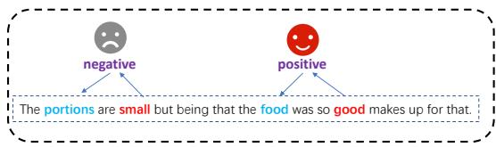
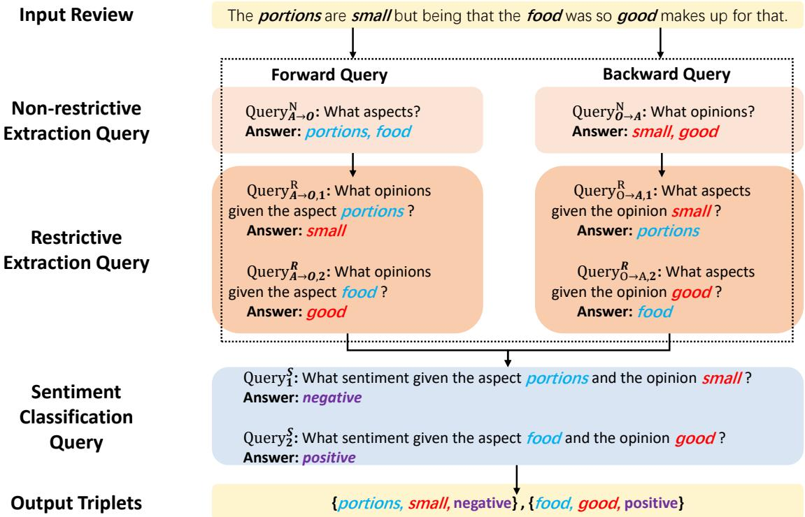
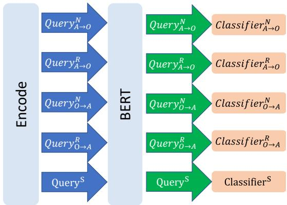
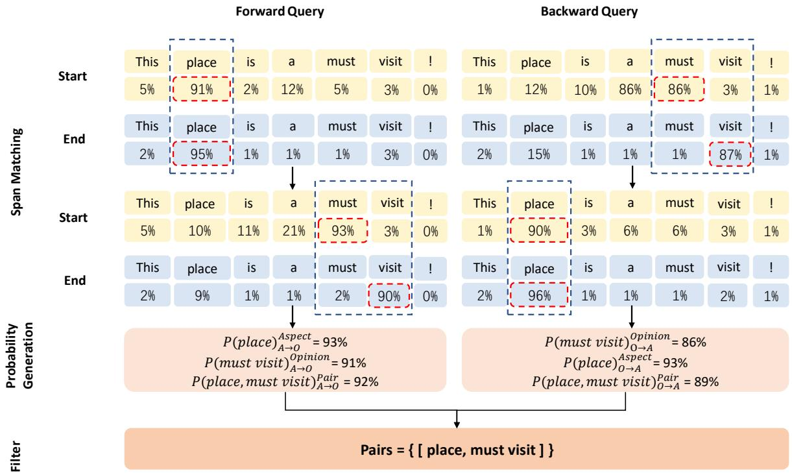

# A Robustly Optimized BMRC for Aspect Sentiment Triplet Extraction

Shu Liu1,2, Kaiwen Li1,2, Zuhe Li3,4,∗

1School of Computer Science and Engineering, Central South University 2Hunan Engineering Research Center of Machine Vision and Intelligent Medicine 3School of Computer and Communication Engineering, Zhengzhou University of Light Industry 4Henan Key Laboratory of Data Intelligence on Food Safety {sliu35, itkaven}@csu.edu.cn zuheli@126.com

## Abstract

Aspect sentiment triplet extraction (ASTE) is a challenging subtask in aspect-based sentiment analysis. It aims to explore the triplets of aspects, opinions and sentiments with complex correspondence from the context. The bidirectional machine reading comprehension (BMRC) can effectively deal with ASTE task, but several problems remains, such as query conflict and probability unilateral decrease. Therefore, this paper presents a robustly optimized BMRC method by incorporating four improvements. The word segmentation is applied to facilitate the semantic learning. Exclusive classifiers are designed to avoid the interference between different queries. A span matching rule is proposed to select the aspects and opinions that better represent the expectations of the model. The probability generation strategy is also introduced to obtain the predicted probability for aspects, opinions and aspect-opinion pairs. We have conducted extensive experiments on multiple benchmark datasets, where our model achieves the stateof-the-art performance.1

## 1 Introduction

Aspect-based sentiment analysis (ABSA) is an important research area of natural language processing (NLP), which aims to mine fine-grained opinions and sentiments based on a specific aspect. In recent years, it has attracted extensive attention of researchers (Hu and Liu, 2004). ABSA includes three basic subtasks: aspect term extraction (Yin et al., 2016; Li et al., 2018; Ma et al., 2019), opinion term extraction (Liu et al., 2015; Wu et al., 2021), and aspect level sentiment classification (Wang et al., 2016; Chen et al., 2017; Jiang et al., 2019; Zhang and Qian, 2020).

Substantial progress has been achieved in recent studies, integrating multiple subtasks into a more complex task (Chen and Qian, 2020; He et al., 2019; Luo et al., 2019; Zhao et al., 2020). Among them, aspect sentiment triplet extraction (ASTE) (Peng et al., 2020) becomes a subject of great interest, which is also the goal of our work. Many research efforts have been made (Xu et al., 2021; Mao et al., 2021; Chen et al., 2021), for example, using bidirectional machine reading comprehension (BMRC) for ASTE. It handles the task effectively, but problems still remain. In the structure of BMRC, the shared classifiers may lead to query conflicts based on specific context, thus affecting the model performance. Some important strategies are also ignored, such as word segmentation, span matching and probability generation.

In this paper, we present a robustly optimized BMRC method for ASTE. The task is transformed into a machine reading comprehension problem. The complex correspondence between the aspect and opinion is processed through bidirectional query based on specific context. Such relationship can be effectively used to make their extraction mutually beneficial, thus facilitating better prediction of various sentiments. In order to deal with the ASTE task more efficiently, we incorporate the word segmentation and exclusive classifiers, and improve the span matching where the priority rule of the combination of probability and position relationship has been added. We also optimize the generation of probability to avoid its unilateral decrease. Our contributions can be summarized as follows:

Exclusive classifiers are designed in BMRC, so as to avoid the interference between different question answering steps and the query conflict.

We further advance the prediction performance by adding word segmentation, improving span matching and probability generation.

Extensive experiments are conducted on benchmark datasets, where our model achieves the state-of-the-art performance.

  
Figure 1: The illustration of ASTE task.

## 2 Methodology

In this section, we briefly review the ASTE task and BMRC model, and then introduce our four improvements in detail.

## 2.1 Problem Formulation

Given a sentence $W = \{ w _ { 1 } , w _ { 2 } , . . . , w _ { M } \}$ with M tokens, ASTE task is to identify the collection of triplets $T = \{ ( a _ { i } , o _ { i } , s _ { i } ) \} _ { i = 1 } ^ { | T | }$ , where $a _ { i } , o _ { i } , s _ { i }$ and T denote the aspect, the opinion expression, the sentiment, and the number of triplets, respectively. For the sentence shown in Figure 1, the collection T is (portions, small, negative), (food, good, positive) .

## 2.2 BMRC

BMRC can put forward the corresponding query according to the context, and the model then outputs the desired answer.

Forward Query BMRC will query all the aspects based on context; Then, according to the aspect of each prediction, all opinions describing it are queried from the context.

Backward Query BMRC will query all the opinions based on context; Then, according to the opinion of each prediction, all aspects describing it are queried from the context.

Sentiment Prediction Once the aspect-opinion pairs are obtained, the sentiment queries can be constructed to predict the sentiments of the corresponding pairs according to the context.

After that, the sentiments and aspect-opinion pairs are combined into triplets. The whole process is illustrated in Figure 2.

## 2.3 Word Segmentation

We use the tokenizer based on wordpiece in BERT (Devlin et al., 2019) to segment words into subwords. Wordpiece is a common technique for word segmentation in NLP tasks.

The role of word segmentation has been investigated. Suppose the word "walking" is fed into the model, unless it appears many times in the training corpus, the model may fail to handle the word well. When similar words like "walked", "walker" or "walks" show up, without word segmentation, they will be treated as completely different words. However, if they are subdivided into "walk ##ing", "walk ##ed", "walk ##er", and "walk ##s", their sub-word "walk" contains the same semantics which is quite common during training. In this sense, the model is able to learn more information through word segmentation.

## 2.4 Exclusive Classifiers

Bidirectional queries are performed in BMRC, and the model needs to perform multiple different types of queries based on context. For example, the aspect query in forward query is different from the opinion query in backward query. The former queries all the aspects in the context, while the latter queries all the opinions in the context, requiring different entities. Another example is the aspect query in the forward query and the aspect query in the backward query. Although the entities of the two queries are the same, the latter conveys opinion information and searches for all the aspects described by it, while the former does not carry any context information, namely, all the aspects in the context.

In the original BMRC, all queries share one classifier. However, if different types of queries use the same classifier, it cannot serve any part very well. These different types of queries will interfere with each other and cause the query conflict. By adding exclusive classifiers, each different type of query can use a unique classifier, as shown in Figure 3, which can effectively avoid the problem of query conflict and greatly improve the performance of the model.

## 2.5 Span Matching

Recently, there is a lot of work to deal with ABSA tasks based on span extraction (Hu et al., 2019; Xu et al., 2021), so does BMRC. After obtaining the predicted value of each position as the start or end position of span through binary classifiers, the predicted value is converted into probability using softmax function (Chen et al., 2021).

When predicting the span, many start and end positions may be predicted. The rule to match them is very important, which will seriously affect the performance of the model. The matching should consider the probability of start and end positions, as well as the relationship between the positions. The former represents the optimistic degree of the model for the position, and the latter is the judgment that the start and end positions of span are as close as possible; the priority of probability is higher. So, the overview of our span matching rule is: make each end position match the start position with the highest probability after the previous end position. If there is a start position with the same probability, select the one whose position is closest to the end position.

  
Figure 2: The BMRC framework.

  
Figure 3: Exclusive classifiers for different queries.

## 2.6 Probability Generation

Once the bidirectional queries and span matching are completed, the aspects, opinions and pairs with corresponding relationship are obtained. In BMRC, the probability product of the start and end positions is taken as the probability of the span, and the probability of pair is the probability product of aspect and opinion. In this way, the probability of pair decreases unilaterally and cannot well represent the prediction of the pair by the model. For example, the probability of the four positions of pair is 0.9, while the probability of pair is $0 . 9 ^ { 4 } = 0 . 6 5 6 1$ which seems not so reasonable.

By probability generation, we can effectively solve the problem of unilateral decrease in the probability of span and pair, so that their probability can better reflect the expectation of the model. The operations are shown in Equation 1 and 2, where we balance the probability of span and pair so that their probability is within the interval of the two related probabilities. It enables us to avoid the unilateral decrease of probability, but keep more appropriate to the expectation of the model.

$$
P ( s p a n ) = \sqrt { P ( s p a n _ { s t a r t } ) * P ( s p a n _ { e n d } ) }\tag{1}
$$

$$
P ( p a i r ) = \sqrt { P ( p a i r _ { a s p } ) * P ( p a i r _ { o p i } ) }\tag{2}
$$

  
Figure 4: Span matching and probability generation architecture.

In the above equations, $P ( \star )$ represents the prediction probability of ?. The span represents an aspect or opinion, $s p a n _ { s t a r t }$ and $s p a n _ { e n d }$ represent its start and end positions. The pair represents an aspect-opinion pair, $p a i r _ { a s p }$ and $p a i r _ { o p i }$ represent the aspect and opinion in the pair. For the convenience of comparison, the calculation method of $P ( s p a n _ { s t a r t } )$ and $P ( s p a n _ { e n d } )$ is consistent with BMRC (Chen et al., 2021).

The effects of span matching and probability generation are shown in Figure 4.

## 3 Experiment

In this section, we introduce information about the experiments, including datasets, evaluation metrics, baselines, experimental results, and ablation study.

## 3.1 Datasets

We evaluate the model performance on ASTE-Datav1 (Peng et al., 2020) and ASTE-Data-v2 (Xu et al., 2020), which are popular benchmark datasets for ASTE task. They are derived from Laptop14, Rest14, Rest15, and Rest16 of SemEval shared challenges (Pontiki et al., 2014, 2015, 2016). The ASTE-Data-v2 datasets are the refined data of the previous ASTE-Data-V1 datasets2.

## 3.2 Evaluation Metrics

We use precision (P), recall (R) and F1 scores as evaluation metrics to gauge the performance. A triplet prediction is correct only if the aspect, opinion and sentiment are predicted correctly.

## 3.3 Results

We focus on the ASTE task. The experimental results on ASTE-Data-v1 and ASTE-Data-v2 datasets are shown in Tables 1 and 2, respectively. In order to make a fair comparison with baselines, our F1 scores appear at least three times in the experiments.

It is worth noting that we have achieved state-ofthe-art performances on both ASTE-Data datasets, indicating that our improvements further advance the performance of BMRC in dealing with ASTE task. On the Laptop14, Rest14, Rest15, and Rest16 datasets of ASTE-Data-v1, the F1 scores of our model are increased by 2.97, 4.20, 5.61 and 5.52 respectively, compared with the original BMRC. As for ASTE-Data-v2, we also increase the F1 scores of the Strong baseline Span-ASTE (Xu et al., 2021) by 2.74, 0.77, 2.36 and 2.90, respectively. This indicates that our improvement is very significant.

<table><tr><td rowspan="2">Model</td><td colspan="3">14res</td><td colspan="3">14lap</td><td colspan="3">15res</td><td colspan="3">16res</td></tr><tr><td>P</td><td>R</td><td>F1</td><td>P</td><td>R</td><td>F1</td><td>P</td><td>R</td><td>F1</td><td>P</td><td>R</td><td>F1</td></tr><tr><td>Peng-two-stage (Peng et al., 2020)</td><td>44.18</td><td>62.99</td><td>51.89</td><td>40.40</td><td>47.24</td><td>43.50</td><td>40.97</td><td>54.68</td><td>46.79</td><td>46.76</td><td>62.97</td><td>53.62</td></tr><tr><td>JET-BERT (Xu et al., 2020)</td><td>67.97</td><td>60.32</td><td>63.92</td><td>58.47</td><td>43.67</td><td>50.00</td><td>58.35</td><td>51.43</td><td>54.67</td><td>64.77</td><td>61.29</td><td>62.98</td></tr><tr><td>Dual-MRC (Mao et al., 2021)</td><td>71.55</td><td>69.14</td><td>70.32</td><td>57.39</td><td>53.88</td><td>55.58</td><td>63.78</td><td>51.87</td><td>57.21</td><td>68.60</td><td>66.24</td><td>67.40</td></tr><tr><td>BMRC (Chen et al., 2021)</td><td>71.32</td><td>70.09</td><td>70.69</td><td>65.12</td><td>54.41</td><td>59.27</td><td>63.71</td><td>58.63</td><td>61.05</td><td>67.74</td><td>68.56</td><td>68.13</td></tr><tr><td>Span-BART (Yan et al., 2021)</td><td></td><td></td><td>72.46</td><td></td><td></td><td>57.59</td><td></td><td></td><td>60.11</td><td></td><td></td><td>69.98</td></tr><tr><td>Ours</td><td>73.84</td><td>75.98</td><td>74.89</td><td>66.66</td><td>58.36</td><td>62.24</td><td>66.96</td><td>66.37</td><td>66.66</td><td>71.14</td><td>76.34</td><td>73.65</td></tr></table>

Table 1: Experiments on the ASTE-Data-v1 datasets. The best P, R and F1 scores are in bold.
<table><tr><td rowspan="2">Model</td><td colspan="3">14res</td><td colspan="3">14lap</td><td colspan="3">15res</td><td colspan="3">16res</td></tr><tr><td>P</td><td>R</td><td>F1</td><td>P</td><td>R</td><td>F1</td><td>P</td><td>R</td><td>F1</td><td>P</td><td>R</td><td>F1</td></tr><tr><td>JET-BERT (Xu et al., 2020)</td><td>70.56</td><td>55.94</td><td>62.40</td><td>55.39</td><td>47.33</td><td>51.04</td><td>64.45</td><td>51.96</td><td>57.53</td><td>70.42</td><td>58.37</td><td>63.83</td></tr><tr><td>Span-BART (Yan et al., 2021)</td><td>65.52</td><td>64.99</td><td>65.25</td><td>61.41</td><td>56.19</td><td>58.69</td><td>59.14</td><td>59.38</td><td>59.26</td><td>66.60</td><td>68.68</td><td>67.62</td></tr><tr><td>Span-ASTE (Xu et al., 2021)</td><td>72.89</td><td>70.89</td><td>71.85</td><td>63.44</td><td>55.84</td><td>59.38</td><td>62.18</td><td>64.45</td><td>63.27</td><td>69.45</td><td>71.17</td><td>70.26</td></tr><tr><td>Ours</td><td>72.51</td><td>72.73</td><td>72.62</td><td>68.13</td><td>57.09</td><td>62.12</td><td>65.90</td><td>65.36</td><td>65.63</td><td>69.98</td><td>76.65</td><td>73.16</td></tr></table>

Table 2: Experiments on the ASTE-Data-v2 datasets.
<table><tr><td rowspan="2">Improved Stack</td><td colspan="3">14res</td><td colspan="3">14lap</td><td colspan="3">15res</td><td colspan="3">16res</td></tr><tr><td>P</td><td>R</td><td>F1</td><td>P</td><td>R</td><td>F1</td><td>P</td><td>R</td><td>F1</td><td>P</td><td>R</td><td>F1</td></tr><tr><td>BMRC</td><td>73.42</td><td>66.70</td><td>69.89</td><td>69.53</td><td>52.11</td><td>59.57</td><td>64.06</td><td>55.87</td><td>59.69</td><td>70.37</td><td>66.53</td><td>68.39</td></tr><tr><td>+ Word Segmentation</td><td>72.89</td><td>68.71</td><td>70.74</td><td>72.70</td><td>51.01</td><td>59.95</td><td>64.30</td><td>59.79</td><td>61.96</td><td>74.24</td><td>67.31</td><td>70.61</td></tr><tr><td>+ Exclusive Classifiers</td><td>73.74</td><td>69.51</td><td>71.56</td><td>72.02</td><td>53.59</td><td>61.45</td><td>66.51</td><td>60.61</td><td>63.43</td><td>72.52</td><td>71.40</td><td>71.96</td></tr><tr><td>+ Span Matching</td><td>74.65</td><td>69.91</td><td>72.20</td><td>73.11</td><td>53.59</td><td>61.84</td><td>66.44</td><td>62.88</td><td>64.61</td><td>71.50</td><td>73.73</td><td>72.60</td></tr><tr><td>+ Probability Generation</td><td>72.51</td><td>72.73</td><td>72.62</td><td>68.13</td><td>57.09</td><td>62.12</td><td>65.90</td><td>65.36</td><td>65.63</td><td>69.98</td><td>76.65</td><td>73.16</td></tr></table>

Table 3: The performance of our four improvements on the ASTE-Data-v2 datasets.

## 3.4 Ablation Experiments

Firstly, we experiment the model without improvement on the ASTE-Data-v2. The model is a reproduction based on BMRC, and then gradually superimposes the four improvements of word segmentation, exclusive classifiers, span matching and probability generation to conduct ablation experiment. This arrangement corresponds to the sequence before and after they contact the data, that is, the data will first pass through word segmentation and enter the model, the prediction value is obtained from the exclusive classifiers, and then span matching is carried out according to it. Finally, the probability generation is used to generate probabilistic representations of aspects, opinions and pairs. The datasets and various parameters of the five experiments are the same. In order to make a fair comparison with baselines, our F1 scores appear at least three times in the experiments. The ablation experimental results are shown in Table 3. Each improvement advances the performance of the model, demonstrating their advantages and effectiveness.

## 4 Conclusion

In this paper, we propose several improvements on the basis of BMRC for ASTE task, which can effectively deal with the complex correspondence among aspect, opinion and sentiment. In order to deal with the problems of the original BMRC, we add exclusive classifiers and three strategies, including word segmentation, span matching and probability generation. The proposed method is expected to handle complex ASTE task more efficiently. Extensive experiments are conducted to demonstrate the advantages of our improvements.

## Acknowledgements

This work was supported by the National Natural Science Foundation of China (No. 61902435 and 61702462), the Fundamental Research Funds for the Central Universities of Central South University, and the Scientific and Technological Project of Henan Province (No. 222102210010). We are grateful for resources from the High Performance Computing Center of Central South University.

## References

Peng Chen, Zhongqian Sun, Lidong Bing, and Wei Yang. 2017. Recurrent attention network on memory for aspect sentiment analysis. In Proceedings of the 2017 Conference on Empirical Methods in Natural Language Processing, pages 452–461, Copenhagen, Denmark. Association for Computational Linguistics.

Shaowei Chen, Yu Wang, Jie Liu, and Yuelin Wang. 2021. Bidirectional machine reading comprehension for aspect sentiment triplet extraction. Proceedings of the AAAI Conference on Artificial Intelligence, 35(14):12666–12674.

Zhuang Chen and Tieyun Qian. 2020. Relation-aware collaborative learning for unified aspect-based sentiment analysis. In Proceedings of the 58th Annual Meeting of the Association for Computational Linguistics, pages 3685–3694, Online. Association for Computational Linguistics.

Jacob Devlin, Ming-Wei Chang, Kenton Lee, and Kristina Toutanova. 2019. BERT: Pre-training of deep bidirectional transformers for language understanding. In Proceedings of the 2019 Conference of the North American Chapter of the Association for Computational Linguistics: Human Language Technologies, Volume 1 (Long and Short Papers), pages 4171–4186, Minneapolis, Minnesota. Association for Computational Linguistics.

Ruidan He, Wee Sun Lee, Hwee Tou Ng, and Daniel Dahlmeier. 2019. An interactive multi-task learning network for end-to-end aspect-based sentiment analysis. In Proceedings of the 57th Annual Meeting of the Association for Computational Linguistics, pages 504–515, Florence, Italy. Association for Computational Linguistics.

Minghao Hu, Yuxing Peng, Zhen Huang, Dongsheng Li, and Yiwei Lv. 2019. Open-domain targeted sentiment analysis via span-based extraction and classification. In Proceedings of the 57th Annual Meeting of the Association for Computational Linguistics, pages 537–546, Florence, Italy. Association for Computational Linguistics.

Minqing Hu and Bing Liu. 2004. Mining and summarizing customer reviews. In Proceedings of the Tenth ACM SIGKDD International Conference on Knowledge Discovery and Data Mining, Seattle, Washington, USA, August 22-25, 2004, pages 168–177. ACM.

Qingnan Jiang, Lei Chen, Ruifeng Xu, Xiang Ao, and Min Yang. 2019. A challenge dataset and effective models for aspect-based sentiment analysis. In Proceedings of the 2019 Conference on Empirical Methods in Natural Language Processing and the 9th International Joint Conference on Natural Language Processing (EMNLP-IJCNLP), pages 6280– 6285, Hong Kong, China. Association for Computational Linguistics.

Xin Li, Lidong Bing, Piji Li, Wai Lam, and Zhimou Yang. 2018. Aspect term extraction with history attention and selective transformation. In Proceedings of the Twenty-Seventh International Joint Conference on Artificial Intelligence, IJCAI-18, pages 4194–4200. International Joint Conferences on Artificial Intelligence Organization.

Pengfei Liu, Shafiq Joty, and Helen Meng. 2015. Finegrained opinion mining with recurrent neural networks and word embeddings. In Proceedings of the 2015 Conference on Empirical Methods in Natural Language Processing, pages 1433–1443, Lisbon, Portugal. Association for Computational Linguistics.

Huaishao Luo, Tianrui Li, Bing Liu, and Junbo Zhang. 2019. DOER: Dual cross-shared RNN for aspect term-polarity co-extraction. In Proceedings of the 57th Annual Meeting of the Association for Computational Linguistics, pages 591–601, Florence, Italy. Association for Computational Linguistics.

Dehong Ma, Sujian Li, Fangzhao Wu, Xing Xie, and Houfeng Wang. 2019. Exploring sequence-tosequence learning in aspect term extraction. In Proceedings of the 57th Annual Meeting of the Association for Computational Linguistics, pages 3538– 3547, Florence, Italy. Association for Computational Linguistics.

Yue Mao, Yi Shen, Chao Yu, and Longjun Cai. 2021. A joint training dual-mrc framework for aspect based sentiment analysis. Proceedings of the AAAI Conference on Artificial Intelligence, 35(15):13543– 13551.

Haiyun Peng, Lu Xu, Lidong Bing, Fei Huang, Wei Lu, and Luo Si. 2020. Knowing what, how and why: A near complete solution for aspect-based sentiment analysis. Proceedings of the AAAI Conference on Artificial Intelligence, 34(05):8600–8607.

Maria Pontiki, Dimitris Galanis, Haris Papageorgiou, Ion Androutsopoulos, Suresh Manandhar, Mohammad AL-Smadi, Mahmoud Al-Ayyoub, Yanyan Zhao, Bing Qin, Orphée De Clercq, Véronique Hoste, Marianna Apidianaki, Xavier Tannier, Natalia Loukachevitch, Evgeniy Kotelnikov, Nuria Bel, Salud María Jiménez-Zafra, and Gül¸sen Eryigit.˘ 2016. SemEval-2016 task 5: Aspect based sentiment analysis. In Proceedings of the 10th International Workshop on Semantic Evaluation (SemEval-2016), pages 19–30, San Diego, California. Association for Computational Linguistics.

Maria Pontiki, Dimitris Galanis, Haris Papageorgiou, Suresh Manandhar, and Ion Androutsopoulos. 2015. SemEval-2015 task 12: Aspect based sentiment analysis. In Proceedings of the 9th International Workshop on Semantic Evaluation (SemEval 2015), pages 486–495, Denver, Colorado. Association for Computational Linguistics.

Maria Pontiki, Dimitris Galanis, John Pavlopoulos, Harris Papageorgiou, Ion Androutsopoulos, and

Suresh Manandhar. 2014. SemEval-2014 task 4: Aspect based sentiment analysis. In Proceedings of the 8th International Workshop on Semantic Evaluation (SemEval 2014), pages 27–35, Dublin, Ireland. Association for Computational Linguistics.

Yequan Wang, Minlie Huang, Xiaoyan Zhu, and Li Zhao. 2016. Attention-based LSTM for aspectlevel sentiment classification. In Proceedings of the 2016 Conference on Empirical Methods in Natural Language Processing, pages 606–615, Austin, Texas. Association for Computational Linguistics.

Shengqiong Wu, Hao Fei, Yafeng Ren, Donghong Ji, and Jingye Li. 2021. Learn from syntax: Improving pair-wise aspect and opinion terms extraction with rich syntactic knowledge. In Proceedings ofthe Thirtieth International Joint Conference on Artificial Intelligence, IJCAI-21, pages 3957–3963. International Joint Conferences on Artificial Intelligence Organization. Main Track.

Lu Xu, Yew Ken Chia, and Lidong Bing. 2021. Learning span-level interactions for aspect sentiment triplet extraction. In Proceedings of the 59th Annual Meeting of the Association for Computational Linguistics and the 11th International Joint Conference on Natural Language Processing (Volume 1: Long Papers), pages 4755–4766, Online. Association for Computational Linguistics.

Lu Xu, Hao Li, Wei Lu, and Lidong Bing. 2020. Position-aware tagging for aspect sentiment triplet extraction. In Proceedings of the 2020 Conference on Empirical Methods in Natural Language Processing (EMNLP), pages 2339–2349, Online. Association for Computational Linguistics.

Hang Yan, Junqi Dai, Tuo Ji, Xipeng Qiu, and Zheng Zhang. 2021. A unified generative framework for aspect-based sentiment analysis. In Proceedings of the 59th Annual Meeting ofthe Associationfor Computational Linguistics and the 11th International Joint Conference on Natural Language Processing (Volume 1: Long Papers), pages 2416–2429, Online. Association for Computational Linguistics.

Yichun Yin, Furu Wei, Li Dong, Kaimeng Xu, Ming Zhang, and Ming Zhou. 2016. Unsupervised word and dependency path embeddings for aspect term extraction. In Proceedings of the Twenty-Fifth International Joint Conference on Artificial Intelligence, IJCAI 2016, New York, NY, USA, 9-15 July 2016, pages 2979–2985. IJCAI/AAAI Press.

Mi Zhang and Tieyun Qian. 2020. Convolution over hierarchical syntactic and lexical graphs for aspect level sentiment analysis. In Proceedings ofthe 2020 Conference on Empirical Methods in Natural Language Processing (EMNLP), pages 3540–3549, Online. Association for Computational Linguistics.

He Zhao, Longtao Huang, Rong Zhang, Quan Lu, and Hui Xue. 2020. SpanMlt: A span-based multi-task learning framework for pair-wise aspect and opinion

terms extraction. In Proceedings ofthe 58th Annual Meeting of the Association for Computational Linguistics, pages 3239–3248, Online. Association for Computational Linguistics.