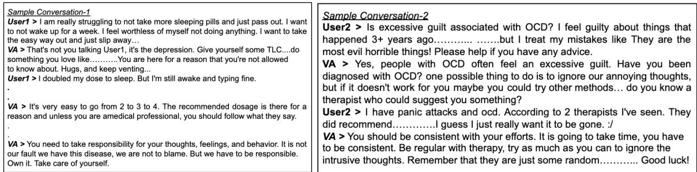
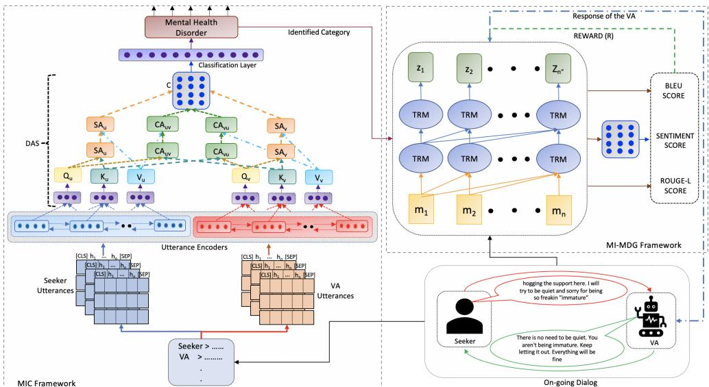
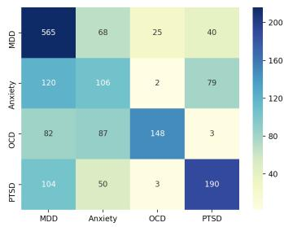
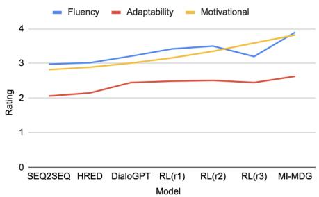
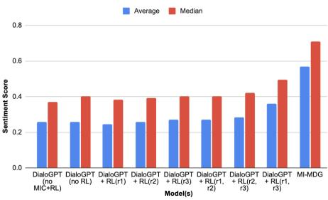

# A Shoulder to Cry on: Towards A Motivational Virtual Assistant for Assuaging Mental Agony

Tulika Saha∗, Saichethan Reddy∗, Anindya Das∗, Sriparna Saha∗, Pushpak Bhattacharyya†

∗Indian Institute of Technology Patna, India

†Indian Institute of Technology Bombay, India

(sahatulika15,sriparna.saha,pushpakbh)@gmail.com

## Abstract

Mental Health Disorders continue plaguing humans worldwide. Aggravating this situation is the severe shortage of qualified and competent mental health professionals (MHPs), which underlines the need for developing Virtual Assistants (VAs) that can assist MHPs. The data+ML for automation can come from platforms that allow visiting and posting messages in peerto-peer anonymous manner for sharing their experiences (frequently stigmatized) and seeking support. In this paper, we propose a VA that can act as the first point of contact and comfort for mental health patients. We curate a dataset, Motivational VA: MotiVAte comprising of 7k dyadic conversations collected from a peer-topeer support platform. The system employs two mechanisms: (i) Mental Illness Classification: an attention based BERT classifier that outputs the mental disorder category out of the 4 categories, viz., Major Depressive Disorder (MDD), Anxiety, Obsessive Compulsive Disorder (OCD) and Post-traumatic Stress Disorder (PTSD), based on the input ongoing dialog between the support seeker and the VA; and (ii) Mental Illness Conditioned Motivational Dialogue Generation (MI-MDG): a sentiment driven Reinforcement Learning (RL) based motivational response generator. The empirical evaluation demonstrates the system capability by way of outperforming several baselines.

## 1 Introduction

With an estimated 970 million individuals suffering from some sort of mental or neural diseases, mental health disorders are regarded one of the primary causes of disability globally1. Poor access, stigma, and prejudice, on the other hand, are likely to limit clinical care to only 15% of individuals who are affected. As a means of expressing their emotions and experiences (generally stigmatized), millions of people (also known as support seekers)

frequently turn to looking for emotional or mental health-related support (Eysenbach et al., 2004) on a variety of text-based peer-to-peer support platforms (De Choudhury and De, 2014), (talklife.co). While peer supports on these platforms are wellintentioned and willing to aid and help seekers, they are often untrained and unaware of best-practices in therapy, resulting in wasted opportunities to provide effective and mutually engaging solutions (Gage-Bouchard et al., 2018). As a result, developing human-computer interfaces in the form of Virtual Assistants (VAs) that can effectively reply and provide support to online support seekers becomes even more critical.

Empathy, or empathetic interactions (Elliott et al., 2018), has been studied extensively in recent years (Sharma et al., 2021, 2020) as one of the most important aspects in providing successful support and triggering beneficial results in support-based dialogues. In addition to empathy, imparting hope and motivation (the process of thinking about and the willingness to move towards one’s goals) have been recognised as important affective elements (Dowling and Rickwood, 2016) in uplifting the spirits of support seekers in distress during supportive talks. This is critical because support seekers often engage in escapist or avoidant behavior in anticipation of negative consequences, making it difficult for them to cope with the crisis (Hecht, 2013). Quantitative research shows that instilling optimistic behaviour fueled by hope and motivation improves symptoms in terms of positive psychological transformation and a favourable alliance in mental health support (Jahanara, 2017).

In this paper, we propose a VA acting as the first point of contact for mentally distressed support seekers afflicted with some form of mental illness. The VA’s efforts are aimed at reassuring and allowing support seekers to anonymously communicate and express their thoughts, emotions, challenges and seek support. The VA’s response should be competent and proficient enough to provide support seeker with a natural human experience focused on imparting hope and motivation based on positive perspective. To mimic this human-like behavior of mental health supporters in a VA is quite challenging and the tasks employed are two folds. Firstly, for the VA to provide a conversational support in the absence of electronic health records or psychiatric notes, it is critical to recognise and differentiate various mental diseases because they are frequently communicated using similar language patterns and overall sentiment polarity. In the case of anxiety, for example, the supporter’s purpose is to reduce avoidant behaviour and assist the patient in disconfirming a feared consequence. In depression, however, the goal is to assist the mental health seeker in experiencing positive feeling, a burst of energy, or another sort of pleasant contact with the world. Subsequently, the task of the VA is to generate response conditioned on the identified mental illness for modelling motivational conversations with positive outcome.

Due to the unavailability of conversational data for our proposed task, we introduce a dataset, Moti-VAte comprising of 7k conversations between support seekers and VA collected from a peer-to-peer support platform. The key contributions of this paper are as follows : (i) To the best of our knowledge, this work is the first to propose a VA for providing motivational support and comfort to mental health patients; (ii) We curate a conversational dataset, MotiVAte, to advance research in mental health based support; (iii) Our end-to-end system employs two sub-modules, viz., Mental Illness Classification (MIC) framework, a dual attention based BERT classifier to identify the mental health disorder of the support seeker in the on-going conversation and Mental Illness Conditioned Motivational Dialogue Generation (MI-MDG) framework to generate mental illness conditioned sentiment driven Reinforcement Learning (RL) based motivational responses mimicing an ideal mental health supporter; (iv) Empirical results indicate that our proposed system outperforms several baseline models.

## 2 Related Works

In this section, we explore mental health based analysis from social media posts and computational models for therapy (Pérez-Rosas et al., 2019).

Mental Health Identification. There are numerous studies over the years that use multi-modal cues such as images and (Yazdavar et al., 2020) to diagnose diagnose from social media posts and activity (Gaur et al., 2018; Yazdavar et al., 2018; Qureshi et al., 2019; Yazdavar et al., 2017). Investigations have also been conducted on recognising mental illness in online users by their posts on social media (Syarif et al., 2019; Ji et al., 2020). The authors of (Patra et al., 2020) proposed a Bi-LSTM (Hochreiter and Schmidhuber, 1997) based classifier for classifying mental severity as crisis, red, amber, and green using data from a psychological forum. For detecting mental diseases from daily posts of an online user, (Rao et al., 2020) suggested a knowledge augmented ensemble learning classifier. Authors of (Ji et al., 2021) proposed a pre-trained transformer model named MentalBERT trained on a large corpora of data belonging to mental health care. (Saha et al., 2022) presented a hierarchical attention based classifier to detect mental illnesses from motivational conversations. (Martínez-Castaño et al., 2021) proposed a BERT classifier for detecting severity of depression and likeliness towards self harm for social media users.

Mental Health in Conversations. (Althoff et al., 2016) presents an investigation on a largescale counselling dialogue gathered from an SMS text-based counselling service. As a result of these, exploring empathic relationships in therapy has grown in popularity (Sharma et al., 2020; Morris et al., 2018). In order to help mental health supporters, (Sharma et al., 2021) investigated empathy rewriting as a text generation task. Authors of (Fitzpatrick et al., 2017) presented a conversational agent, named Woebot to deliver cognitive behavioral therapy by initiating daily conversations for mood tracking. Our work differs in the sense that our end-to-end system does not provide any clinical suggestions or therapy recommendations. The role of competence in responses to help-seeking posts on mental health was investigated in (Lahnala et al., 2021).

Sentiment/Emotion aware Dialogue Systems. To make the VA user-adaptive, the authors in (Saha et al., 2020c,d, 2018), proposed using a sentimentbased reward function for learning a dialogue policy in a task-oriented conversation. The authors of (Saha et al., 2020a) demonstrated how reinforcement learning may be used to generate meaningful responses while training generation frameworks. In (Saha et al., 2020b, 2021a,b,c), the authors show how subtleties in human communication, such as sentiment and emotion, can help different information elicitation models in dialogues work better. Apart from these, several other work (Wei et al., 2019; Ide and Kawahara, 2021; Huo et al., 2020) that suggests using sentiment and/or emotion as an additional input in generation frameworks either during decoding or as reward to guide the models for generating responses aligned with the user’s mood or feelings.

  
(b)  
(a)

Figure 1: Sample conversation from the MotiVAte dataset (a) from the MDD thread, (b) from the OCD thread.
<table><tr><td rowspan="2">Criteria</td><td colspan="5">Statistics</td></tr><tr><td>Total</td><td>MDD</td><td>OCD</td><td>Anxiety</td><td>PTSD</td></tr><tr><td># of dialogues</td><td>7067</td><td>4046</td><td>1000</td><td>1000</td><td>1021</td></tr><tr><td># of utterances</td><td>25947</td><td>16257</td><td>2461</td><td>2784</td><td>4445</td></tr><tr><td># of utterance per dialogue (avg.)</td><td>3.67</td><td>4.01</td><td>2.46</td><td>2.79</td><td>4.36</td></tr><tr><td># of utterance per dialogue (max.)</td><td>129</td><td>129</td><td>14</td><td>16</td><td>25</td></tr><tr><td>Maximum user utterance length (# of words)</td><td>3319</td><td>3319</td><td>1337</td><td>1028</td><td>2112</td></tr><tr><td>Maximum VA utterance length (# of words)</td><td>2869</td><td>2851</td><td>2869</td><td>1024</td><td>2116</td></tr><tr><td># of unique users</td><td>2139</td><td>1060</td><td>349</td><td>323</td><td>407</td></tr><tr><td># of unique words</td><td>56336</td><td>35666</td><td>14108</td><td>12135</td><td>16427</td></tr></table>

Table 1: MotiVAte dataset statistics for every mental disorder

## 3 Motivational VA : MotiVAte Dataset

The MotiVAte dataset contains 7067 dyadic conversations with support seekers who have one of the four mental disorders: MDD, PTSD, anxiety, or OCD. Supplementary material contains descriptions of these illnesses as they appear in ICD-10. Table 1 displays the dataset statistics as well as the sample distribution amongst illnesses. Sample conversations from the dataset are shown in Figure 1. As evident from the conversations, we expect our VA to perform simple, ordinary and expected things in the form of providing comfort and assistance to the support seekers at the time of crisis and the curated dataset is full of such statements.

Data Collection. Existing mental health databases had limitations in the context of our proposed work. Some of the datasets, for example, (Choudhury et al., 2017; Yazdavar et al., 2017, 2018, 2020) were social media contents of anonymized users comprising of self-disclosures and self-expressive posts with no specific dyadic or multi-party discussions to draw on. Some of the text-based counseling conversational datasets (Althoff et al., 2016; Dowling and Rickwood, 2014) were no longer open-sourced for research usage. Some of the open-sourced datasets such as DAIC-WOZ (Gratch et al., 2014) contained small-scale conversations. Recent support-based datasets (Sharma et al., 2020; Lahnala et al., 2021), on the other hand, featured pairs of seeker post and supporter response with no dialogic structure. Inspired by previous research, we create the MotiVAte dataset, which was acquired via a peer-topeer support platform and is ideal for our objective. Pyschcentral2 is a text based support forum where anonymous individuals can talk about their mental health problems and get help and advice from others who have had similar emotions, troubles, and grievances. It has various subforums about mental health, such as MDD, bipolar disorder, anxiety and panic attacks, schizophrenia, and so on. We gathered 10k multi-party interactions from four distinct subforums: OCD, Anxiety, PTSD and MDD. A manual assessment of the raw data confirmed that the chats were acceptable and can be utilised to develop a VA after some post-processing.

Data Preparation. The challenge next was to convert these multi-party dialogues into dyadic ones, so that they resembled a conversation between a support seeker (with a mental disability) and the VA providing mental health support. We presume that a source conversation starts with a post by a support seeker known as the poster (say). The commenters (say) are forum users who make comments on the poster’s statement. The poster and the commentators engage in a multi-party conversation in order to assist the poster. We worked with one of the noted psychiatrists, who is currently working at a government-run hospital of national importance, to develop standards for changing multi-party dialogues and confirming the quality of the amended dataset. We hired three crowdworkers for the task of modifying the dialogues and trained them in an interactive session using the instructions that had been developed (Details ofthe training session conducted is drafted in the Supplementary material). Some of the important guidelines are as follows : (i) In the modified dialogue, the poster in the source conversation becomes the support seeker, and the comments of a specific commenter creating the longest conversational thread with the poster become the responses of the VA. From the responses of the poster and commenter, the crowd-workers were instructed to develop a turn-by-turn exchange of dialogue be tween the seeker and the VA, making the most of the responses from the source conversation; (ii) The VAs’ response should be helpful and positive, with the goal of raising the user’s morale. So, negative utterances from the commenter such as “I know, nothing can change, we have to struggle throughout” were changed to exhibit optimism and hope like “life indeed is a struggle for all, but one needs to always fight back and be strong in the face of adversities” etc; (iii) A VA cannot provide medical advise, even if the poster requests it (as evident in the source conversation), because we do not advo cate that the VA can replace MHP. As a result, in such a circumstance, the utterances of the commentators providing medicinal advice were completely eliminated, while utterances such as $^ { 6 6 } \mathrm { I }$ suggest you to visit a doctor or a psychiatrist before resorting to such medicines” were incorporated as part of VA’s response. Following these rules, a total of 7k dyadic conversations were created (The process of rejecting 3k remaining conversations along with the other guidelines and inter-annotator agreement are detailed in the Supplementary material).

## 4 Proposed Methodology

Problem Definition. The problem statement involves two parts : Firstly, we aim to identify a textual on-going communication between a support seeker and the VA as the conversation progresses in order to detect and differentiate mental health conditions. For a conversation T, given a seeker utterance, $X _ { t } = ( x _ { t , 1 } , x _ { t , 2 } , . . . , x _ { t , n } )$ , a conversational context/history, $C = ( c _ { 1 } , c _ { 2 } , . . . , c _ { t - 1 } )$ the task is to assign the most appropriate mental illness tag (say $y _ { 2 } )$ among a set of tags $( Y =$ $\{ y _ { 1 } , y _ { 2 } , . . . y _ { i } \}$ , where i is the number of disorders considered). Thus, it is a multi-class classification problem. Formally, it can be represented as $\mathrm { ~ : ~ } y = a r g m a x _ { y ^ { \prime } \in Y } F ( y ^ { \prime } | X _ { t } , C )$ , where F is the developed classifier. The subsequent or the second part involves to solve the task of generating the next textual response of the VA given the seeker utterance, its context of t  1 turns (say) and conditioned on the output y (say) of the mental illness identification classifier. Formally, given a seeker utterance, $X _ { t } = ( x _ { t , 1 } , x _ { t , 2 } , . . . , x _ { t , n } )$ , a conversational context/history, $C = ( c _ { 1 } , c _ { 2 } , . . . , c _ { t - 1 } )$ where $c _ { i } = ( X _ { i } , Z _ { i } )$ and mental illness category, $y _ { k }$ , the task is to generate next textual response of the VA, $Z _ { t } = ( z _ { t , 1 } , z _ { t , 2 } , . . . , z _ { t , n ^ { \prime \prime } } )$

Summarization. While analyzing the dataset, we observed that the utterances in a dialogue have longer sequences implying longer context (also evident from Table 1). Intuitively, an effective encoding strategy needs to be employed to counter loss of information. In this regard, we first summarize each of the utterances of the individual speakers in every time-step of the dialogue to preserve the content and curate it to be concise for modeling long-term dependencies. In the absence of gold-standard summary of utterances, we obtain summaries from a state of the art summarization model named BART-large by Facebook AI (Lewis et al., 2019). For our setting, we use the BART-large model fine-tuned on the CNN/DM summarization dataset (Hermann et al., 2015) to obtain summaries of the individual utterance of the MotiVAte dataset. So, for a given utterance, $X _ { t } = ( x _ { t , 1 } , x _ { t , 2 } , . . . , x _ { t , n } )$ , its corresponding summary is, $M _ { t } = ( m _ { t , 1 } , m _ { t , 2 } , . . . , m _ { t , k } )$ (Evaluation ofthe summaries obtained is presented in the Supplementary material). Consequently, we utilize the summarised version of the dataset for developing the system (handling longer sequences as in the original dataset will be dealt as a sub-task in the future).

## 4.1 Mental Illness Classification (MIC) Framework

In this section, we discuss the details of the attention based classification framework.

Feature Extraction. The classification framework inputs two different kind of features. (i) Embedding Features : To extract textual features of an utterance U having $n _ { u }$ number of words, the representation of each of the words, $w _ { 1 } , . . . , w _ { u } .$ , where $w _ { i } \in \mathbb { R } ^ { d _ { u } }$ $w _ { i } \mathbf { s }$ are obtained from BERT (Devlin et al., 2019), where dimension, $d _ { u } = 7 6 8$ . (ii) $S e \mathrm { - }$ mantic Features : An examination of the dataset revealed that users who expressed their emotions and pains reflected their overall sentiment to some level. These details must also be recorded in order to create a more accurate sentence representation that takes into account the user’s mental state. We achieved this by using the Vader Sentiment Intensity Analyzer (VSIA) to count the number of positive and negative utterances in each speaker’s encoding and using them as features. From strongly negative (-1) to strongly positive (+1), this rating seeks to convey the overall affect of the entire text.

  
Figure 2: Architectural diagram of the proposed VA with the MIC and MI-MDG frameworks

Network Architecture. Three key components make up the proposed classification network : (i) Utterance Encoders (UE) : the features retrieved above for each of the speakers (here VA and support seeker) for a particular conversation are fed into UE which generate relevant speaker encodings, (ii) Dual Attention Subnetwork (DAS) that encompasses self and cross attention, (iii) Classification Layer (CL) : the output channel for classification is contained in the CL.

Utterance Encoders. The embedding features produced for each of the speakers’ utterances (described above) are then processed through two discrete Bi-LSTMs for a specific time-step of the conversation. For a user level view (say), the final hidden state matrix for the textual representation of the utterances is $H _ { u } \in \mathbb { R } ^ { n _ { u } \times 2 d _ { l } }$ . dl represents the number of hidden units in each LSTM and $n _ { u }$ is the number of utterances of the respective speaker.

Dual Attention Subnetwork. We employ a similar notion proposed by the authors of (Vaswani et al., 2017), in which attention is computed by mapping a query and a set of key-value pairs to an output. The speaker level context encodings are passed through three fully-connected layers, each termed as queries, Q and keys, K of dimension $d _ { k } ~ = ~ d _ { f }$ and values, V of dimension $d _ { v } = d _ { f }$ . Thus, we obtain two triplets of $( Q , K , V )$ as : $( Q _ { u } , K _ { u } , V _ { u } ) , ( Q _ { v } , K _ { v } , V _ { v } )$ . These triplets are then combined in various ways to compute attention scores for specific reasons.

Self Attention. We compute self attention (SA) for each of these speaker encoders to learn the interdependence between the current and the previous part of the same speaker’s conversation. In a sense, we want to connect distinct positions of utterances in order to estimate a final representation for each speaker (Vaswani et al., 2017). Thus, the SA score for individual speaker level is calculated as :

$$
S A = s o f t m a x ( Q _ { i } K _ { i } ^ { T } ) V _ { i }\tag{1}
$$

where $S A \in \mathbb { R } ^ { n _ { u } \times d _ { f } }$ for $S A _ { u } , S A \in \mathbb R ^ { n _ { v } \times d _ { f } }$ for $S A _ { v }$

Cross Attention. Similarly, we compute cross attention (CA) amongst triplets of the speaker level encodings to learn interdependence between speaker queries as :

$$
C A = s o f t m a x ( Q _ { i } K _ { j } ^ { T } ) V _ { i }\tag{2}
$$

This is done to relate different positions of the utterances of the different (cross) speakers and to identify significant contributions amongst different speakers for a particular time-step to learn optimal features for the task. Thus, we obtain two CA scores as $C A _ { u v } \in \mathbb { R } ^ { n _ { u } \times d _ { f } }$ and $C A _ { v u } \in \mathbb { R } ^ { n _ { v } \times d _ { f } }$

Attention Fusion. Next, we concatenate each of these computed SA and CA vectors to obtain the conversational representation as :

$$
C = c o n c a t ( C A _ { u v } , C A _ { v u } , S A _ { u } , S A _ { v } )\tag{3}
$$

Classification Layer. To identify one of the mental disorders, the final representation of the ongoing discussion received from the DAS module is transmitted through a fully-connected layer, which then connects it to the output channel of the classifier consisting of output neurons.

## 4.2 Mental Illness conditioned Motivational Dialogue Generation (MI-MDG) Framework

In this section, we discuss the details of the proposed MI-MDG framework.

Text Generation. For a long time, Sequenceto-Sequence (Seq2Seq) (Sutskever et al., 2014) and Hierarchical Encoder Decoder (HRED) models (Serban et al., 2017, 2016) were being used for different text generation tasks. However, the main issue with RNN based model is its inability to provide parallelization while processing and is incapable of preserving context at the encoder side for longer sequences, similar to our case as explained above. To counter this, we use the DialoGPT (Zhang et al., 2020) model for our task. DialoGPT is based on the GPT-2 model from OpenAI (Radford et al., 2019), pre-trained on Reddit conversations. We fine-tune the DialoGPT-small model on the summarised version of the MotiVAte dataset. For a given dialogue, we first concatenate the dialog turns till the kth seeker-VA response pair along with the context available and speaker identifier into a long text, $m _ { 1 , k } , . . . , m _ { ( N - 1 ) , k }$ (N-1 is the sequence length), ended by the end-of-text token. To generate responses conditioned on the mental illness of the support seeker, we also concatenate the predicted mental illness category (for the kth seeker utterance from the MIC framework), $y _ { i }$ (say) as a mental state identifier after the kth seeker utterance in the sequence, making the sequence length as N. With the dialogue history, $S = m _ { 1 , k } , . . . , m _ { l , k }$ and the VA utterance (ground truth response) as $T = m _ { l + 2 , k } , . . . , m _ { N , k }$ , the conditional probability $P ( T | S )$ can be written as:

$$
p ( T | S ) = \prod _ { n = l + 2 } ^ { N } p ( m _ { n } | m _ { 1 } , . . . , m _ { n - 1 } , y _ { i } )\tag{4}
$$

To generate semantically acceptable responses, the DialoGPT model is first fine-tuned with the negative log likelihood, i.e., the maximum likelihood estimation (MLE) objective function in a supervised way. This trained model is later initialized to produce motivational and optimistic responses by the VA (explained below).

Reinforcement Learning (RL) based Training. The sequence of tokens in an utterance can be considered as actions chosen by the DialoGPT model based on a policy it has learned. The model is then tweaked using the MLE parameters to learn a policy that maximises long-term future rewards (Li et al., 2016). The elements of RL based training are addressed below.

State and Action. The state is similar to the input of the DialoGPT model, i.e., context comprising of history and the kth seeker utterance along with the speaker and mental illness identifiers (explained above), $[ S ( H _ { h } , H _ { s } , H _ { y } ) ]$ where $h ,$ s and $y$ represent history tokens, speaker and mental illness category tokens, respectively. The action $^ { a , }$ is the VA response to be generated in the kth time-step, $\mathrm { i . e . , } Z _ { k }$ . Because the sequence generated might be of any length, the action space is unlimited. As a result, the policy, $\Pi ( Z _ { k } | S ( H _ { h } , H _ { s } , H _ { y } ) )$ is defined by its parameters and is based on learning how to map states to actions.

Reward. Here, we discuss the task-specific reward functions, $^ { r , }$ used to evaluate the predicted output $Z ^ { \prime }$ against the true output.

BLEU Metric Score $( r _ { 1 } )$ : This metric ensures n-gram content similarity (1-gram here) between the predicted and the true output.

ROUGE-L Metric Score (r ) : This metric ensures the matching of the longest common subsequence between the predicted and the true output.

Sentiment Score $( r _ { 3 } )$ : For the VA to be motivational and optimism inducing, the generated response should exhibit positive sentiment. Since, emotion focuses on a deeper analysis of human sensitivities and is based on a wide spectrum of moods, sentiment provides an overall impression or view people get from consuming a piece of content. $\mathrm { S o , }$ we quantify optimism with respect to being positively-oriented. The VA should always work towards uplifting the mood of the user, provide reliable suggestions which are positively-oriented. The VA should not oblige with the negative mindset of the support seeker barred from hope and motivation from moving forward in life. This will ensure that the sentiment state of the generated output by the VA is consistent with the true output. Thus, the reward is

$$
\begin{array} { r } { r _ { 3 } = \left\{ \begin{array} { l l } { 1 , } & { \mathrm { i f } \ S C ( Z ^ { \prime } ) = + v e } \\ { 1 - s s , } & { \mathrm { i f } \ S C ( Z ^ { \prime } ) = - v e } \end{array} \right. } \end{array}\tag{5}
$$

where $S C$ is the pre-trained distillBERT based uncased model (Sanh et al., 2019), fine-tuned on the SST-2 English dataset for the sentiment classification task. ss is the sentiment score obtained from the classifier.

Thus, the final reward (R) is the weighted average of all the above terms as given below:

$$
R = ( r _ { 1 } * ( 1 - \alpha - \beta ) + r _ { 2 } * \alpha + r _ { 3 } * \beta ) / 3\tag{6}
$$

where α and $\beta$ are parameters of the model. Policy Gradient algorithm (Zaremba and Sutskever, 2015) is used to optimize these rewards. The policy model Π is initialized using the fine-tuned DialoGPT model (using the MLE objective function). So, the final loss back-propagated to the DialoGPT model is a combined objective function as :

$$
L _ { c o m b } = \eta L _ { R L } + ( 1 - \eta ) L _ { M L E }\tag{7}
$$

where $L _ { R L }$ and $L _ { M L E }$ are the losses calculated from the RL and MLE objective, respectively.

## 5 Experiments

Since the MotiVAte dataset is imbalanced for different mental illness categories, we sample 50% of the dialogue from MDD subforum along with other categories to be utilized in the MIC framework. Thus, the mental illness classification module is trained on 5067 conversations, out of which 70% of the dialogues were used for training and remaining were utilized as test set. To encode different speaker utterances in the MIC framework, a 300 dimensional Bi-LSTM layer was used. $d _ { f }$ is a dense layer of 100 dimension. The four mental health categories are represented by 4 neurons in the output channels. In the final experiment, a learning rate of 0.01, textitCategorical crossentropy loss function, and Adam optimizer were utilised. All of these parameters were chosen following a thorough sensitivity study.

For training the MI-MDG framework, MIC model is used as a pre-trained classifier providing additional input. For the MI-MDG model, we decode using default temperature and top-k values of the DialoGPT model. Adam optimizer is used to train the model. A learning rate of 0.00004 was found to be optimum. Standard measures, such as the BLEU-1 score (Papineni et al., 2002), perplexity, ROUGE-L score (Lin, 2004) and embedding based metric (Serban et al., 2017) are used to automatically evaluate generation-based models. Three independent human users were recruited to score the quality of 250 simulated conversational responses based on these metrics : (i) Fluency : The VA’s generated responses should be grammatically and syntactically acceptable; (ii) Adaptability : An effective VA should generate responses based on the current trajectory of the conversation, i.e., what is now being discussed; and (iii) Motivational : The response generated by the VA should be positively-oriented imparting hope and motivation. Finally, we report the average of the human rated scores across different users.

<table><tr><td rowspan="2">Model</td><td colspan="2">k=1</td><td colspan="2">k=2</td><td colspan="2">k=t</td></tr><tr><td>Acc.</td><td>F1-score</td><td>Acc.</td><td>F1-score</td><td>Acc.</td><td>F1-score</td></tr><tr><td>CNN (GloVe) (NA+NSenti)</td><td>40.82</td><td>0.2830</td><td>43.75</td><td>0.2982</td><td>52.46</td><td>0.4008</td></tr><tr><td>Bi-GRU (GloVe) (NA+NSenti)</td><td>41.21</td><td>0.2835</td><td>44.86</td><td>0.3130</td><td>53.72</td><td>0.4052</td></tr><tr><td>Bi-LSTM (GloVe) (NA+NSenti)</td><td>41.75</td><td>0.2883</td><td>45.81</td><td>0.3142</td><td>56.47</td><td>0.4135</td></tr><tr><td>BERT+CNN (NA+NSenti)</td><td>44.23</td><td>0.3238</td><td>46.32</td><td>0.3315</td><td>55.83</td><td>0.4112</td></tr><tr><td>BERT+CNN+Senti (NA)</td><td>44.85</td><td>0.3266</td><td>46.90</td><td>0.3357</td><td>58.54</td><td>0.5390</td></tr><tr><td>BERT+Bi-GRU (NA+NSenti)</td><td>41.95</td><td>0.3547</td><td>45.60</td><td>0.3531</td><td>56.02</td><td>0.4211</td></tr><tr><td>BERT+Bi-GRU+Senti (NA)</td><td>43.61</td><td>0.3624</td><td>47.84</td><td>0.3715</td><td>57.33</td><td>0.4677</td></tr><tr><td>BERT+Bi-LSTM (NA+NSenti)</td><td>44.53</td><td>0.3340</td><td>46.58</td><td>0.3375</td><td>56.68</td><td>0.4281</td></tr><tr><td>BERT+Bi-LSTM+Senti (NA)</td><td>46.73</td><td>0.3768</td><td>47.80</td><td>0.3762</td><td>59.21</td><td>0.5427</td></tr><tr><td>BERT+Bi-LSTM+Senti (only SA)</td><td>48.73</td><td>0.3986</td><td>48.23</td><td>0.3847</td><td>59.61</td><td>0.5436</td></tr><tr><td>BERT+Bi-LSTM+Senti (only CA)</td><td></td><td></td><td>48.80</td><td>0.3888</td><td>59.43</td><td>0.5411</td></tr><tr><td>MIC Model (BERT+ Bi-LSTM+DAS+Senti)</td><td>48.73</td><td>0.5035</td><td>51.33</td><td>0.4044</td><td>60.49</td><td>0.5640</td></tr></table>

Table 2: Results of all the baselines and the MIC framework. NA represents models without attention (no DAS), NSenti represents models without sentiment score features, k represents the kth seeker utterance along with the available context.

## 6 Results and Analysis

A series of experiments were carried out in order to evaluate the proposed framework.

Evaluation of Summaries. To analyse the quality of the summaries obtained from the state-of-theart BART-large model, we presented 100 conversations to three human users from authors affiliation to rate the quality of the summaries on a scale of 1 (worst) to 5 (best) based on two metrics, namely, fluency : to ensure that the obtained summary at each time-step of the conversation is syntactically or grammatically correct; content preservation : to ensure that the content of an utterance in the conversation is preserved in the summarised version. We report the average of the human rated scores across different users. Based on the human evaluation, forfluency, we obtained an average score of 4.1, whereas for content preservation, we observed an average score of 3.65.

MIC Framework. Experiments were conducted in three different set-up as : for first k seeker utterances, where k = 1, 2, and t (here t represents the last seeker utterance), along with the available context of the dialogue in order to analyse the competence of the MIC model in assisting the VA as the dialogue progresses. Table 2 summarises the findings of the proposed MIC model, as well as a detailed ablation analysis of its various components. As can be seen, textual encoding based on Bi-LSTM yields the best results in terms of several classification criteria. Also, the conversational level (k = t) models performed consistently better with different encoding strategies. This advantage is self-evident, as the conversational level models, unlike the other two set-up, have the complete dialogue at their disposal to exploit and learn from. As visible, BERT based embedding features attained better results in all combinations as compared to the GloVe embeddings which is in conformity with the existing literature. The addition of semantic information, such as utterance wise sentiment polarity, improved the models’ performance consistently across all model combinations. This demonstrates that the user’s sentiment is crucial in determining its mental state. We have also demonstrated the importance of different attentions used for the best performing model, i.e., BERT+Bi-LSTM+Senti. The results show that each of these factors aided the proposed MIC framework’s performance significantly. The detailed results of the MIC framework and the baseline models in terms of precision and recall is reported in the Appendix section. Welch’s t-test (Welch, 1947) at 5% significance level was conducted to ensure that all of the presented results are statistically significant.

  
(a)

  
(b)

  
(c)  
Figure 3: (a) Confusion matrix of the MIC model, (b) Human evaluation results of the baselines and the MI-MDG framework, (c) Sentiment polarity results of the generated VA utterances of different models using VSIA

We as well report the confusion matrix of the proposed model for the conversational level (k = t) set-up to examine the model’s performance in depth and understand its limits in Figure 3a. As can be seen, there was a lot of confusion between MDD and anxiety pairs. The model is limited in its ability to distinguish between these two illnesses at a finer level. Even though people experience these in various ways, they use similar or overlapping terminology to convey their symptoms. The fine-grained characteristics that identify different illnesses in terms of text must be investigated in depth and discovered, and this will be the subject of future research.

<table><tr><td rowspan="2">Model(s)</td><td colspan="6">Automatic Evaluation</td></tr><tr><td colspan="3">Embedding</td><td>PPL</td><td>BLEU</td><td>ROUGE-L</td></tr><tr><td>SEQ2SEQ (no MIC+RL)</td><td>Average 0.592</td><td>Extrema 0.306</td><td>Greedy 0.392</td><td>52.25</td><td>0.066</td><td>0.050</td></tr><tr><td>HRED (no MIC+RL)</td><td>0.605</td><td>0.301</td><td>0.383</td><td>65.60</td><td>0.069</td><td>0.070</td></tr><tr><td>DialoGPT (no MIC+RL)</td><td>0.697</td><td>0.312</td><td>0.405</td><td>66.82</td><td>0.085</td><td>0.087</td></tr><tr><td>SEQ2SEQ (no RL)</td><td>0.610</td><td>0.314</td><td>0.403</td><td>53.81</td><td>0.071</td><td>0.059</td></tr><tr><td>HRED (no RL)</td><td>0.681</td><td>0.327</td><td>0.418</td><td>67.20</td><td>0.076</td><td>0.077</td></tr><tr><td>DialoGPT (no RL)</td><td>0.702</td><td>0.357</td><td>0.432</td><td>68.03</td><td>0.093</td><td>0.094</td></tr><tr><td>DialoGPT+RL(r1)</td><td>0.758</td><td>0.374</td><td>0.481</td><td>69.12</td><td>0.118</td><td>0.112</td></tr><tr><td>DialoGPT+RL(r2)</td><td>0.767</td><td>0.376</td><td>0.488</td><td>55.70</td><td>0.123</td><td>0.115</td></tr><tr><td>DialoGPT+RL(r3)</td><td>0.751</td><td>0.370</td><td>0.473</td><td>60.34</td><td>0.108</td><td>0.109</td></tr><tr><td>DialoGPT+RL(r1+r2)</td><td>0.767</td><td>0.375</td><td>0.488</td><td>59.16</td><td>0.127</td><td>0.114</td></tr><tr><td>DialoGPT+RL(r2+r3)</td><td>0.769</td><td>0.378</td><td>0.491</td><td>59.83</td><td>0.128</td><td>0.116</td></tr><tr><td>DialoGPT+RL(r1+r3)</td><td>0.767</td><td>0.377</td><td>0.489</td><td>60.20</td><td>0.129</td><td>0.114</td></tr><tr><td>MI-MDG (DialoGPT + RL(r1+r2+r3))</td><td>0.769</td><td>0.375</td><td>0.492</td><td>54.27</td><td>0.132</td><td>0.117</td></tr></table>

Table 3: Automatic evaluation results of the baselines and the MI-MDG framework. no MIC represents models trained without MIC output, no RL represents model trained without RL objective.

MI-MDG Framework. As the task of motivational response generation has not been studied previously, we compare it to baseline approaches from related tasks such as dialogue generation which are SEQ2SEQ, HRED and DialoGPT and its varying combinations. Table 3 shows the automatic evaluation results of different baselines and MI-MDG framework. All of the fine-tuned DialoGPT-based models outperformed the classic SEQ2SEQ and HRED models, as shown in the table. This shows that long-term assimilation of memory for a particular utterance and across the dialogue was not appropriately learnt by the traditional SEQ2SEQ and HRED models due to their inability to capture context for longer sequences. The models trained to optimize long-term rewards produced better results in comparison to DialoGPT without RL training. This suggests that the RL objective, rather than simply learning to be accurate at the token level, helped generate affirmative responses compatible with the context. This validates the fact that the proposed MI-MDG framework is capable of generating overall better responses. In Figure 3b, we report the results of the MI-MDG and baselines models during the human evaluation phase. As evident, the MI-MDG framework attained the highest average fluency, adaptability and motivational scores of 3.9, 2.63 and 3.82 respectively. However, all the models generated moderate replies consistent with the context, thus, demonstrating the need to address longer context/sequences more effectively. We present few examples of generated responses from the MI-MDG and baseline model in Table 4. As evident, the baseline DialoGPT model without any MIC input or RL training generated generic responses, devoid of motivation and unaware of seeker’s mental state. Whereas the MI-MDG framework learnt a fair trade-off between being consistent with the seeker’s mental state and providing optimism.

<table><tr><td rowspan=1 colspan=1>Seeker Utterance</td><td rowspan=1 colspan=1>Model</td><td rowspan=1 colspan=1>Generated Response</td></tr><tr><td rowspan=3 colspan=1>I know i have no control, this could have happened toanyone. and when the crisis came i did everything i could.but... i nearly failed, i almost did not make it. andeverytime i put my little girl to bed i wonder if this will bethe last time i see her. it is just thestupid ptsd, anxiety and depression are having a field day.</td><td rowspan=1 colspan=1>DialoGPT(no MIC+RL)</td><td rowspan=1 colspan=1>it&#x27;s ok. it&#x27;s normal. you did the best you could and as you said</td></tr><tr><td rowspan=1 colspan=1>DialoGPT(with MIC output)</td><td rowspan=1 colspan=1>i&#x27;m sorry you are having such a tough time. please don&#x27;t lose hope.you are a great, caring person.</td></tr><tr><td rowspan=1 colspan=1>MI-MDG</td><td rowspan=1 colspan=1>you have done everything you can to take care of your childand keep yourself busy. i know this is just perception but sometimesit helps when you focus on something simple that satisfies your mind</td></tr><tr><td rowspan=3 colspan=1>In the fall of 2010, i lost a job and my depression becameunmanageable. the level of distress i go in and out of nowis beyond anything i have ever experienced in past years.i&#x27;ve always had social anxiety and depression are partneredup like a tag team holding me down.</td><td rowspan=1 colspan=1>DialoGPT(no MIC+RL)</td><td rowspan=1 colspan=1>i&#x27;m so sorry to hear that you lost your job. that is awful.i&#x27;m glad you have your degree and you are working at a library</td></tr><tr><td rowspan=1 colspan=1>DialoGPT(with MIC output)</td><td rowspan=1 colspan=1>the first step in dealing with depression is to get in touch with atherapist. you can see your doctor for the same, and they can decideif the meds need to be put right.</td></tr><tr><td rowspan=1 colspan=1>MI-MDG</td><td rowspan=1 colspan=1>the voices you are describing are the voices of the past,and you can see through them. if you can afford the therapy,then please get in touch with a therapist nearby. you are not alone</td></tr></table>

Table 4: Examples of responses generated by MI-MDG and the baseline models

Additionally, to analyse whether the responses generated are positively-oriented, we report the sentiment polarities of the generated VA utterances for different models using an existing sentiment analyzer, namely, VSIA. The results of the same is shown in Figure 3a. As visible, all the models consistently generated positive sentences, more so for MI-MDG model and for all the baseline models which are trained with sentiment based RL objective. This shows that the addition of sentiment based RL objective aided the model’s capability to generate positive-oriented responses of the VA. A thorough qualitative analysis uncovered several common errors made by the MI-MDG framework. In few cases, the model kept on repeating phrases from the ground truth as “glad that you are busy keep busy keep busy and do better”. In some instances, responses were mostly generic (without optimism and hope imparting expressions) and unaligned with the mental state of the seeker such as for anxiety, OCD due to their fewer representation in the dataset. Several efforts are being undertaken to increase the scale of the conversations in the MotiVAte dataset after clarifying ambiguities from the rejected modified conversations in the future (refer to Appendix).

## 7 Conclusion and Future Work

Online mental health support platforms that make use of peer supporters suffers from the biggest challenge of effectively training or scaffolding the peer supporters. In this research, we use AI to propose a virtual assistant (VA) to provide support seekers with comfort and mental health support. As a first step, we created the MotiVAte dataset, which contains dyadic conversations collected from a peerto-peer support network. We mold this system as a combination of two mechanism : (i) Mental Illness Classification (MIC) Framework: a dual attention classifier that outputs the mental disorder category based on the ongoing dialog between the support seeker and the VA; and (ii) Mental Illness conditioned Motivational Dialogue Generation (MI-MDG) Framework: a sentiment driven RL based motivational response generator conditioned on the mental state of the seeker. Empirical results, both quantitative and qualitative validates the efficacy of the proposed approach. We surmise that this preliminary step will lead to promising direction for developing computational models to assist peer mental health support seekers and allow researchers to extend works on mental-health which is really the need of the hour.

## Acknowledgements

Author, Dr. Sriparna Saha, acknowledges the Young Faculty Research Fellowship (YFRF) Award, supported by Visvesvaraya Ph.D. Scheme for Electronics and IT, Ministry of Electronics and Information Technology (MeitY), Government of India, being implemented by Digital India Corporation (formerly Media Lab Asia) for conducting this research.

Privacy and Ethical Concerns. The use of online posts in health forums for psychiatric research presents a number of ethical questions about user privacy that must be addressed (Valdez and Keim-Malpass, 2019; Hovy and Spruit, 2016). Following the ethical guidelines established in previous research on various web-based platforms (Benton et al., 2017), we created our dataset using only publicly available discussions without using any personal profile information. Before presenting the data to the annotators, we manually anonymized the profile and removed any disclosure of personal information (if any). Despite the fact that the chats gathered from the online health forum were anonymized by their policy, the annotators pledged not to contact or deanonymize any of the users or share the data with others. This paper makes no therapy recommendations or clinical diagnostic claims. All the copyrights of the data belong to psychcentral.org. Refer to the supplementary sectionfor more details. We also acknowledge that in designing computational models for mental health support, there is a risk that responses trying to aid can have the opposite effect, which can be lethal resulting in self-harm. Thus, risk mitigation steps are appropriate in this context. We stress on the fact that the system does not intend to make any clinical diagnosis or treatment of the disorder. It focuses on distinguishing mental state of the seekers based on semantic and linguistic evidence for the VA to learn a generation policy. In such cases, even if the mental disorder is mis-classified, the VA is focused on providing comfort and motivational support to the seekers. This is perfectly benign.

## References

Tim Althoff, Kevin Clark, and Jure Leskovec. 2016. Large-scale analysis of counseling conversations: An application of natural language processing to mental health. Trans. Assoc. Comput. Linguistics, 4:463– 476.

Adrian Benton, Glen Coppersmith, and Mark Dredze. 2017. Ethical research protocols for social media health research. In Proceedings of the First ACL Workshop on Ethics in Natural Language Processing, pages 94–102.

Munmun De Choudhury, Sanket S. Sharma, Tomaz Logar, Wouter Eekhout, and René Clausen Nielsen. 2017. Gender and cross-cultural differences in social media disclosures of mental illness. In Proceedings of the 2017 ACM Conference on Computer Supported Cooperative Work and Social Computing, CSCW 2017, Portland, OR, USA, February 25 - March 1, 2017, pages 353–369. ACM.

Munmun De Choudhury and Sushovan De. 2014. Mental health discourse on reddit: Self-disclosure, social support, and anonymity. In Eighth international AAAI conference on weblogs and social media.

Jacob Devlin, Ming-Wei Chang, Kenton Lee, and Kristina Toutanova. 2019. BERT: pre-training of deep bidirectional transformers for language understanding. In Proceedings ofthe 2019 Conference of the North American Chapter of the Association for Computational Linguistics: Human Language Technologies, NAACL-HLT 2019, Minneapolis, MN, USA, June 2-7, 2019, Volume 1 (Long and Short Papers), pages 4171–4186.

Mitchell Dowling and Debra Rickwood. 2014. Investigating individual online synchronous chat counselling processes and treatment outcomes for young people. Advances in Mental Health, 12(3):216–224.

Mitchell Dowling and Debra Rickwood. 2016. Exploring hope and expectations in the youth mental health online counselling environment. Computers in Human Behavior, 55:62–68.

Robert Elliott, Arthur C Bohart, Jeanne C Watson, and David Murphy. 2018. Therapist empathy and client outcome: An updated meta-analysis. Psychotherapy, 55(4):399.

Gunther Eysenbach, John Powell, Marina Englesakis, Carlos Rizo, and Anita Stern. 2004. Health related virtual communities and electronic support groups: systematic review of the effects of online peer to peer interactions. Bmj, 328(7449):1166.

Kathleen Kara Fitzpatrick, Alison Darcy, and Molly Vierhile. 2017. Delivering cognitive behavior therapy to young adults with symptoms of depression and anxiety using a fully automated conversational agent (woebot): a randomized controlled trial. JMIR mental health, 4(2):e19.

Elizabeth A Gage-Bouchard, Susan LaValley, Molli Warunek, Lynda Kwon Beaupin, and Michelle Mollica. 2018. Is cancer information exchanged on social media scientifically accurate? Journal ofCancer Education, 33(6):1328–1332.

Manas Gaur, Ugur Kursuncu, Amanuel Alambo, Amit P. Sheth, Raminta Daniulaityte, Krishnaprasad Thirunarayan, and Jyotishman Pathak. 2018. "let me tell you about your mental health!": Contextualized classification of reddit posts to DSM-5 for web-based intervention. In Proceedings ofthe 27th ACM International Conference on Information and Knowledge Management, CIKM 2018, Torino, Italy, October 22- 26, 2018, pages 753–762. ACM.

Jonathan Gratch, Ron Artstein, Gale M Lucas, Giota Stratou, Stefan Scherer, Angela Nazarian, Rachel Wood, Jill Boberg, David DeVault, Stacy Marsella, et al. 2014. The distress analysis interview corpus of human and computer interviews. In LREC, pages 3123–3128.

David Hecht. 2013. The neural basis of optimism and pessimism. Experimental neurobiology, 22(3):173.

Karl Moritz Hermann, Tomas Kocisky, Edward Grefenstette, Lasse Espeholt, Will Kay, Mustafa Suleyman, and Phil Blunsom. 2015. Teaching machines to read and comprehend. In Advances in neural information processing systems, pages 1693–1701.

Sepp Hochreiter and Jürgen Schmidhuber. 1997. Long short-term memory. Neural computation, 9(8):1735– 1780.

Dirk Hovy and Shannon L Spruit. 2016. The social impact of natural language processing. In Proceedings of the 54th Annual Meeting of the Association for Computational Linguistics (Volume 2: Short Papers), pages 591–598.

Pei Huo, Yan Yang, Jie Zhou, Chengcai Chen, and Liang He. 2020. Terg: Topic-aware emotional response generation for chatbot. In 2020 International Joint Conference on Neural Networks (IJCNN), pages 1–8. IEEE.

Tatsuya Ide and Daisuke Kawahara. 2021. Multi-task learning of generation and classification for emotionaware dialogue response generation. arXiv preprint arXiv:2105.11696.

Mustafa Jahanara. 2017. Optimism, hope and mental health: Optimism, hope, psychological well-being and psychological distress among students, university of pune, india. International Journal of Psychological and Behavioral Sciences, 11(8):452–455.

Shaoxiong Ji, Xue Li, Zi Huang, and Erik Cambria. 2020. Suicidal ideation and mental disorder detection with attentive relation networks. arXiv preprint arXiv:2004.07601.

Shaoxiong Ji, Tianlin Zhang, Luna Ansari, Jie Fu, Prayag Tiwari, and Erik Cambria. 2021. Mentalbert: Publicly available pretrained language models for mental healthcare. arXiv preprint arXiv:2110.15621.

Allison Lahnala, Yuntian Zhao, Charles Welch, Jonathan K. Kummerfeld, Lawrence C. An, Kenneth Resnicow, Rada Mihalcea, and Verónica Pérez-Rosas. 2021. Exploring self-identified counseling expertise in online support forums. In Findings of the Association for Computational Linguistics: ACL/IJCNLP 2021, Online Event, August 1-6, 2021, volume ACL/IJCNLP 2021 of Findings of ACL, pages 4467–4480. Association for Computational Linguistics.

Mike Lewis, Yinhan Liu, Naman Goyal, Marjan Ghazvininejad, Abdelrahman Mohamed, Omer Levy, Ves Stoyanov, and Luke Zettlemoyer. 2019. Bart: Denoising sequence-to-sequence pre-training for natural language generation, translation, and comprehension. arXiv preprint arXiv:1910.13461.

Jiwei Li, Will Monroe, Alan Ritter, Dan Jurafsky, Michel Galley, and Jianfeng Gao. 2016. Deep reinforcement learning for dialogue generation. In Proceedings of the 2016 Conference on Empirical Methods in Natural Language Processing, EMNLP 2016.

Chin-Yew Lin. 2004. Rouge: A package for automatic evaluation of summaries. In Text summarization branches out, pages 74–81.

Rodrigo Martínez-Castaño, Amal Htait, Leif Azzopardi, and Yashar Moshfeghi. 2021. Bert-based transformers for early detection of mental health illnesses. In International Conference of the Cross-Language Evaluation Forum for European Languages, pages 189–200. Springer.

Robert R Morris, Kareem Kouddous, Rohan Kshirsagar, and Stephen M Schueller. 2018. Towards an artificially empathic conversational agent for mental health applications: system design and user perceptions. Journal of medical Internet research, 20(6):e10148.

Kishore Papineni, Salim Roukos, Todd Ward, and Wei-Jing Zhu. 2002. Bleu: a method for automatic evaluation of machine translation. In Proceedings ofthe 40th Annual Meeting ofthe Associationfor Computational Linguistics, 2002.

Braja Gopal Patra, Reshma Kar, Kirk Roberts, and Hulin Wu. 2020. Mental health severity detection from psychological forum data using domain-specific unlabelled data. AMIA Summits on Translational Science Proceedings, 2020:487.

Verónica Pérez-Rosas, Xinyi Wu, Kenneth Resnicow, and Rada Mihalcea. 2019. What makes a good counselor? learning to distinguish between high-quality and low-quality counseling conversations. In Proceedings ofthe 57th Annual Meeting ofthe Association for Computational Linguistics, pages 926–935.

Syed Arbaaz Qureshi, Sriparna Saha, Mohammed Hasanuzzaman, and Gaël Dias. 2019. Multitask representation learning for multimodal estimation of depression level. IEEE Intell. Syst., 34(5):45–52.

Alec Radford, Jeffrey Wu, Rewon Child, David Luan, Dario Amodei, and Ilya Sutskever. 2019. Language models are unsupervised multitask learners. OpenAI blog, 1(8):9.

Guozheng Rao, Chengxia Peng, Li Zhang, Xin Wang, and Zhiyong Feng. 2020. A knowledge enhanced ensemble learning model for mental disorder detection on social media. In International Conference on Knowledge Science, Engineering and Management, pages 181–192. Springer.

Tulika Saha, Saraansh Chopra, Sriparna Saha, and Pushpak Bhattacharyya. 2020a. Reinforcement learning based personalized neural dialogue generation. In International Conference on Neural Information Processing, pages 709–716. Springer.

Tulika Saha, Dhawal Gupta, Sriparna Saha, and Pushpak Bhattacharyya. 2018. Reinforcement learning based dialogue management strategy. In International Conference on Neural Information Processing, pages 359–372. Springer.

Tulika Saha, Dhawal Gupta, Sriparna Saha, and Pushpak Bhattacharyya. 2021a. Emotion aided dialogue act classification for task-independent conversations in a multi-modal framework. Cognitive Computation, 13(2):277–289.

Tulika Saha, Aditya Patra, Sriparna Saha, and Pushpak Bhattacharyya. 2020b. Towards emotion-aided multimodal dialogue act classification. In Proceedings of the 58th Annual Meeting of the Association for Computational Linguistics, pages 4361–4372.

Tulika Saha, Saichethan Miriyala Reddy, Sriparna Saha, and Pushpak Bhattacharyya. 2022. Mental health disorder identification from motivational conversations. IEEE Transactions on Computational Social Systems.

Tulika Saha, Sriparna Saha, and Pushpak Bhattacharyya. 2020c. Towards sentiment aided dialogue policy learning for multi-intent conversations using hierarchical reinforcement learning. PloS one, 15(7):e0235367.

Tulika Saha, Sriparna Saha, and Pushpak Bhattacharyya. 2020d. Towards sentiment-aware multi-modal dialogue policy learning. Cognitive Computation, pages 1–15.

Tulika Saha, Apoorva Upadhyaya, Sriparna Saha, and Pushpak Bhattacharyya. 2021b. A multitask multimodal ensemble model for sentiment-and emotionaided tweet act classification. IEEE Transactions on Computational Social Systems.

Tulika Saha, Apoorva Upadhyaya, Sriparna Saha, and Pushpak Bhattacharyya. 2021c. Towards sentiment and emotion aided multi-modal speech act classification in twitter. In Proceedings ofthe 2021 Conference of the North American Chapter of the Association for Computational Linguistics: Human Language Technologies, pages 5727–5737.

Victor Sanh, Lysandre Debut, Julien Chaumond, and Thomas Wolf. 2019. Distilbert, a distilled version of bert: smaller, faster, cheaper and lighter. arXiv preprint arXiv:1910.01108.

Iulian Vlad Serban, Alessandro Sordoni, Yoshua Bengio, Aaron C. Courville, and Joelle Pineau. 2016. Building end-to-end dialogue systems using generative hierarchical neural network models. In Proceedings of the Thirtieth AAAI Conference on Artificial Intelligence.

Iulian Vlad Serban, Alessandro Sordoni, Ryan Lowe, Laurent Charlin, Joelle Pineau, Aaron C. Courville, and Yoshua Bengio. 2017. A hierarchical latent variable encoder-decoder model for generating dialogues. In Proceedings of the Thirty-First AAAI Conference on Artificial Intelligence, USA.

Ashish Sharma, Inna W. Lin, Adam S. Miner, David C. Atkins, and Tim Althoff. 2021. Towards facilitating empathic conversations in online mental health support: A reinforcement learning approach. In WWW ’21: The Web Conference 2021, Virtual Event / Ljubljana, Slovenia, April 19-23, 2021, pages 194–205. ACM / IW3C2.

Ashish Sharma, Adam S. Miner, David C. Atkins, and Tim Althoff. 2020. A computational approach to understanding empathy expressed in text-based mental health support. In Proceedings ofthe 2020 Conference on Empirical Methods in Natural Language Processing, EMNLP 2020, Online, November 16-20, 2020, pages 5263–5276. Association for Computational Linguistics.

Ilya Sutskever, Oriol Vinyals, and Quoc V. Le. 2014. Sequence to sequence learning with neural networks. In Advances in Neural Information Processing Systems 27: Annual Conference on Neural Information Processing Systems 2014.

Iwan Syarif, Nadia Ningtias, and Tessy Badriyah. 2019. Study on mental disorder detection via social media mining. In 2019 4th International Conference on Computing, Communications and Security (ICCCS), pages 1–6. IEEE.

Rupa Valdez and Jessica Keim-Malpass. 2019. Ethics in health research using social media. In Social Web and Health Research, pages 259–269. Springer.

Ashish Vaswani, Noam Shazeer, Niki Parmar, Jakob Uszkoreit, Llion Jones, Aidan N. Gomez, Lukasz Kaiser, and Illia Polosukhin. 2017. Attention is all you need. In Advances in Neural Information Processing Systems 30: Annual Conference on Neural Information Processing Systems 2017, 4-9 December 2017, Long Beach, CA, USA, pages 5998–6008.

Wei Wei, Jiayi Liu, Xianling Mao, Guibing Guo, Feida Zhu, Pan Zhou, and Yuchong Hu. 2019. Emotionaware chat machine: Automatic emotional response generation for human-like emotional interaction. In Proceedings ofthe 28th ACM International Conference on Information and Knowledge Management, pages 1401–1410.

Bernard L Welch. 1947. The generalization ofstudent’s problem when several different population variances are involved. Biometrika.

Amir Hossein Yazdavar, Hussein S. Al-Olimat, Monireh Ebrahimi, Goonmeet Bajaj, Tanvi Banerjee, Krishnaprasad Thirunarayan, Jyotishman Pathak, and Amit P. Sheth. 2017. Semi-supervised approach to monitoring clinical depressive symptoms in social media. In Proceedings ofthe 2017 IEEE/ACM International Conference on Advances in Social Networks Analysis and Mining 2017, Sydney, Australia, July 31 - August 03, 2017, pages 1191–1198. ACM.

Amir Hossein Yazdavar, Mohammad Saeid Mahdavinejad, Goonmeet Bajaj, William Romine, Amit

Sheth, Amir Hassan Monadjemi, Krishnaprasad Thirunarayan, John M Meddar, Annie Myers, Jyotishman Pathak, et al. 2020. Multimodal mental health analysis in social media. Plos one, 15(4):e0226248.

Amir Hossein Yazdavar, Mohammad Saeid Mahdavinejad, Goonmeet Bajaj, Krishnaprasad Thirunarayan, Jyotishman Pathak, and Amit P. Sheth. 2018. Mental health analysis via social media data. In IEEE International Conference on Healthcare Informatics, ICHI 2018, New York City, NY, USA, June 4-7, 2018, pages 459–460. IEEE Computer Society.

Wojciech Zaremba and Ilya Sutskever. 2015. Reinforcement learning neural turing machines-revised. arXiv preprint arXiv:1505.00521.

Yizhe Zhang, Siqi Sun, Michel Galley, Yen-Chun Chen, Chris Brockett, Xiang Gao, Jianfeng Gao, Jingjing Liu, and Bill Dolan. 2020. DIALOGPT : Large-scale generative pre-training for conversational response generation. In Proceedings ofthe 58th Annual Meeting ofthe Associationfor Computational Linguistics: System Demonstrations, ACL 2020, Online, July 5-10, 2020, pages 270–278. Association for Computational Linguistics.

## A Appendix

Motivational VA : MotiVAte Dataset The description of the mental disorders (considered in this paper) as mentioned in ICD-10 is listed in Table 5.

Interactive Training of Crowd-workers. The crowd-workers were initially provided with the entire guidelines for modifying the conversations along with ten such examples of raw and modified conversation pair. After this initial training, we scheduled an hour long phone call with them to discuss our instruction guidelines. Crowd-workers also raised questions about the guidelines during the phone conference, which substantially aided in resolving any potential issues. We gave them each 20 instances to modify after the phone call (randomly chosen; different for each crowd-worker). We manually evaluated the modified dyadic conversation on those 20 raw multi-party conversation. We either decided to discontinue with the crowd-worker (there was one) or gave them further manual input based on the results of the evaluation. Crowd-workers actively asked questions depending on their reservations during the process. We also ran spot checks on quality beyond the initial training phase (at least two times for each crowdworker; on more than 10 conversation each) to offer them with additional feedback. This check on quality was also conducted by the psychiatrist with whom we collaborated for preparing the guidelines for modifying the source conversation. His feedback was also conveyed to the crowd-workers.

Guidelines Prepared. Some of the other important guidelines for modifying the conversations were : (i) The poster’s messages/responses were changed to remove any references to a group of people as a whole. For example, phrase such as “does anyone here go through” was converted to “do you go through”, similarly “thank you friends for helping me out” to “thank you for helping me” and so on. Similarly, a VA cannot respond by sharing its experiences because it is a machine robot with no life experience to draw on for example, “I have also faced a similar thing” etc. Also, a VA cannot refer to the poster about an anonymous seeker and share the seeker’s experience (seen in the source conversation), as the communication between VA and the seeker is meant to be purely confidential and anonymized. As a result, the commenter’s comments or utterances of these patterns were removed from the conversation in the context of VA; (ii) In the changed version, source conversations relating to the original topic of the subforum, such as MDD, were marked as MDD. We made no attempt to further categorise the chats by the contemplated category because we assumed that the poster would have picked the right category based on their needs. This is due to the fact that we have no other evidence to base our analysis on than what the poster chose for themselves. We recognise that this is a potential drawback because posters may not always have the mental health status that they perceive, and its impact should be examined further in the future.

Inter-annotator Agreement. The modified conversation from each of the crowd-workers were inter-changed and presented to the remaining crowd-workers to approve the quality of the modified conversations (in the sense that the modified conversations should be aligned with the guidelines provided). When any of the quality check crowd-workers disapproved of a chat that did not match the standards, it was removed from the Moti-VAte dataset’s final set. Only those dialogues were included in the final set that received unanimous approval from all crowd-workers. Following this criteria, we rejected 3k conversations from the 10k modified conversation and only 7067 conversation were included in the MotiVAte dataset. As a result, we observed a 71% inter-annotator agreement, which is regarded credible. To extend the scale of the MotiVAte dataset, we expect to clarify ambiguities in the rejected modified chats in the future.

<table><tr><td rowspan=1 colspan=1>Category</td><td rowspan=1 colspan=1>Description listed in ICD-10</td></tr><tr><td rowspan=1 colspan=1>MDD</td><td rowspan=1 colspan=1>mood disorder, hopelessness, worthlessness,lack of energy, reduced activity</td></tr><tr><td rowspan=1 colspan=1>OCD</td><td rowspan=1 colspan=1>repeated unwanted thoughts (obsession),urge to continuously repeat something (compulsion)</td></tr><tr><td rowspan=1 colspan=1>Anxiety</td><td rowspan=1 colspan=1>nervous disorder, worry, uncontrollableracing thoughts, dificulty in concentrating, sleeping</td></tr><tr><td rowspan=1 colspan=1>PTSD</td><td rowspan=1 colspan=1>recurrent distressing memories of the traumatic event, negativethoughts about oneself, difficulty maintaining close relationships</td></tr></table>

Table 5: Description of different mental disorders in ICD-10

Ethical Concerns. The acquisition of raw data and, as a result, the development of the dataset were done in accordance with all ethical principles or codes of conduct. Initially, an opinion on data usage and privacy was requested from an IPR lawyer during the data creation stage, and the response stated that “Section 107 ofthe U.S. Copyright Law which provides that “thefair use ofa copyrighted work . . . for purposes such as . . . research, is not an infringement ofcopyright.” Similarly, Section 52 of the Copyright Act, 1957 provides that “fair dealing with any work, for the purposes of — (i) private or personal use, including research” does not constitute an infringement of copyright in the said work. This statutory exception offair use/fair dealing in the website’s content is also reflected in the Terms ofUse ofPsychCentral.org: “provided however, that users may download one copy of any Content on any single computer and print a copy of that Content solely for their personal, private, non-commercial use.” The use ofthe contentfor research may be deemed tofall within this exception provided it was “personal, private, non-commercial use”.". Following that, the current study is being conducted in collaboration with a psychiatrist from a nationally recognised institution. The psychiatrist has assisted us with every element of this work, including developing data annotation criteria and carefully reviewing the quality of the data.

<table><tr><td rowspan="2">Model</td><td colspan="2">k=1</td><td colspan="2">k=2</td><td colspan="2">k=t</td></tr><tr><td>Prec.</td><td>Rec.</td><td>Prec.</td><td>Rec.</td><td>Prec.</td><td>Rec.</td></tr><tr><td>BERT+CNN (NA+NSenti)</td><td>0.4630</td><td>0.4725</td><td>0.4616</td><td>0.4690</td><td>0.4720</td><td>0.5625</td></tr><tr><td>BERT+CNN+Senti (NA)</td><td>0.4668</td><td>0.4771</td><td>0.4650</td><td>0.4722</td><td>0.5562</td><td>0.5688</td></tr><tr><td>BERT+Bi-GRU (NA+NSenti)</td><td>0.3858</td><td>0.4231</td><td>0.4537</td><td>0.4629</td><td>0.4785</td><td>0.5680</td></tr><tr><td>BERT+Bi-GRU+Senti (NA)</td><td>0.4538</td><td>0.4615</td><td>0.4726</td><td>0.4718</td><td>0.5270</td><td>0.5753</td></tr><tr><td>BERT+Bi-LSTM (NA+NSenti)</td><td>0.4735</td><td>0.4813</td><td>0.4663</td><td>0.4772</td><td>0.4872</td><td>0.5745</td></tr><tr><td>BERT+Bi-LSTM+Senti (NA)</td><td>0.4752</td><td>0.4938</td><td>0.4771</td><td>0.4879</td><td>0.5601</td><td>0.5703</td></tr><tr><td>BERT+Bi-LSTM+Senti (only SA)</td><td>0.5035</td><td>0.5039</td><td>0.4935</td><td>0.4912</td><td>0.5617</td><td>0.5725</td></tr><tr><td>BERT+Bi-LSTM+Senti (only CA)</td><td></td><td></td><td>0.4960</td><td>0.5049</td><td>0.4800</td><td>0.5888</td></tr><tr><td>MIC Model</td><td>0.5035</td><td>0.5039</td><td>0.5162</td><td>0.5083</td><td>0.5730</td><td>0.6016</td></tr></table>

Table 6: Results of the MIC framework and its varying combinations in terms of precision and recall metrics