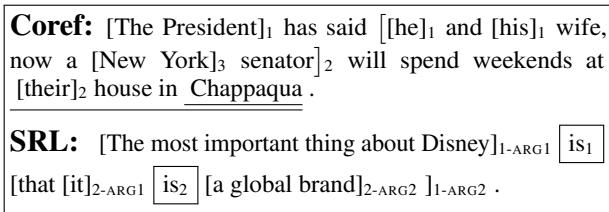
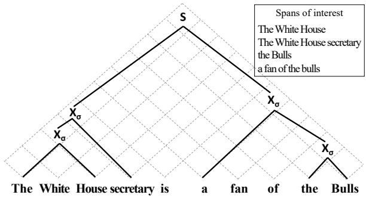
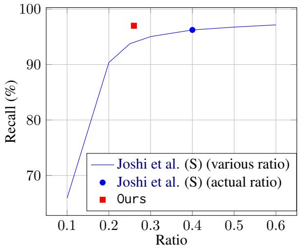

# A Structured Span Selector

Tianyu Liu Yuchen Eleanor Jiang Ryan Cotterell Mrinmaya Sachan tianyu.liu, yucjiang, ryan.cotterell, mrinmaya.sachan @inf.ethz.ch

ETHzürich

## Abstract

Many natural language processing tasks, e.g., coreference resolution and semantic role labeling, require selecting text spans and making decisions about them. A typical approach to such tasks is to score all possible spans and greedily select spans for task-specific downstream processing. This approach, however, does not incorporate any inductive bias about what sort of spans ought to be selected, e.g., that selected spans tend to be syntactic constituents. In this paper, we propose a novel grammar-based structured span selection model which learns to make use of the partial span-level annotation provided for such prob lems. Compared to previous approaches, our approach gets rid of the heuristic greedy span selection scheme, allowing us to model the downstream task on an optimal set of spans. We evaluate our model on two popular span prediction tasks: coreference resolution and semantic role labeling. We show empirical improvements on both.

0 https://github.com/lyutyuh/ structured-span-selector

## 1 Introduction

The problem of selecting a continuous segment of the input text, termed a span, is a common design pattern1 in NLP. In this work, we call this design pattern span selection. Common tasks that have a span prediction component include coreference resolution (Stede, 2011), where the selected spans are mentions, semantic role labeling (Palmer et al., 2010), where the selected spans are arguments, question answering (Jurafsky and Martin, 2009), where the selected spans are answers, and named entity recognition (Smith, 2011), where the selected spans are entities.

In most of the tasks mentioned above, span selection is the first step.2 After a set of candidate spans is determined, a classifier (often a neural network) is typically used to make predictions about the candidate spans. For instance, in coreference resolution, the selected spans (mentions) are clustered according to which entity they refer to; whereas in SRL, the spans (arguments) are classified into a set of roles. Two examples are shown in Fig. 1.

  
Figure 1: Examples of two span prediction tasks: Coreference and SRL. In Coref, [s]i denotes a span of text s referring to the ith entity. In SRL, i denotes a set of predicates and [s]i denotes a set of arguments for the ith predicate.

As the number of spans to consider in the input text can be quadratic in the length of the input, candidate spans are greedily selected as potential antecedents, roles, or answers. While greedy span selection has become the de-facto approach in span prediction problems, it has several issues. First, such approaches typically ignore the inherent structure of the problem. For example, spans of interest in problems such as coreference and SRL are typically syntactic constituents, an assumption supported by quantitative results.3 The lack of syntactic constraints on the spans of interest leads to a waste of computational resources, as all (n2) possible spans are enumerated by the model.

In this paper, we propose a structured span selector for span selection. Our span selector is a syntactically aware, weighted context-free grammar that learns to score partial, possibly nested span annotations. In the case of partial annotation, we marginalize out the missing structure and maximize the marginal log-likelihood. Fig. 2 illustrates an example partial parse of our WCFG and the difference between the traditional greedy approach and our approach.

We apply our span selector to both coreference and SRL. In both cases, we optimize the log-likelihood of the joint distribution defined by the span selector and the conditional for the downstream task as defined in Lee et al. (2017) and He et al. (2018). In contrast to previous approaches, which heavily rely on heuristics4 to prune the set of spans to be considered, our span selector directly admits a tractable inference algorithm to determine the highest-scoring set of spans. We observe that the number of spans our model selects is significantly lower than the number of spans considered in previous works, resulting in a reduction in the memory required to train these models. Our approach leads to significant gains in both downstream tasks considered in this work: coreference and SRL. We find that our approach improves the performance of the end-to-end coreference model on the OntoNotes English dataset (0.4 F1) and the LitBank dataset (0.7 F1). On SRL, our model also achieves consistent gains over previous work.

## 2 Background and Related Work

## 2.1 Span Selection as a Design Pattern

Many NLP tasks involve reasoning over textual spans, e.g., coreference resolution, semantic role labeling, named entity recognition, and question answering. Models for these span prediction tasks often follow a common design pattern. They decompose into two components: (i) a span selection component where the model first selects a set of spans of interest, and (ii) a span prediction component where a prediction (e.g., entity or role assignment) is made for the chosen set of spans.

As shown in previous papers (Zhang et al., 2018; Wu et al., 2020), the quality of the span selector can have a large impact on the overall model performance. The span selector typically selects spans by selecting the start token and the end token in the span. Thus, there are inherently n textual spans, which is $O ( n ^ { 2 } )$ , within a document of n tokens to choose from. Previous span selection models (Lee et al., 2017; He et al., 2018) enumerate all possible spans in a brute-force manner and feed the greedily selected top-k span candidates to the downstream prediction step.

  
Figure 2: An example partial parse in our WCFG for coreference resolution and the set of spans it corresponds to. Production rules that do not involve the “span of interest” non-terminal $( \mathrm { X } _ { \sigma } )$ are skipped as they do not affect the parsing result (see §3.2). The traditional greedy approach considers $\scriptstyle { \mathcal { O } } ( n ^ { 2 } )$ spans denoted by the grid cells unless some pruning heuristics are applied. While the number of nonterminals in a CNF parse is ${ \mathcal { O } } ( n )$

However, several span selection tasks require spans that are syntactic constituents, which is a useful, but often neglected inductive bias in such tasks. For instance, in coreference resolution, mentions are typically noun phrases, pronouns, and sometimes, verbs. Similarly, in semantic role labeling, semantic arguments of a predicate are also typically syntactic constituents such as noun phrases, prepositional phrases, adverbs, etc. Our work uses a context-free grammar to enumerate spans. The number of valid syntactic constituents in a constituency tree of a sequence of length n is bounded by ${ \mathcal { O } } ( n )$ , as the constituents can be viewed as the internal nodes of a binary parse tree in Chomsky normal form. Compared with brute-force enumeration and greedy pruning, this inductive bias provides us with a natural pruning strategy to reduce the number of candidate spans from $O ( n ^ { 2 } )$ to ${ \mathcal { O } } ( n )$ and provides us a more natural and linguistically informed way to model span-based tasks in NLP, through which we can employ parsing techniques and retrieve the optimal span selection for downstream tasks.

To further motivate our approach, we provide background on two popular span prediction tasks considered in our paper: coreference resolution and semantic role labeling (SRL). We also overview some previous papers on these tasks and contrast their methodology with ours. Finally, we describe how our model can work with partial span-level annotations provided by datasets for these tasks.

## 2.2 Coreference Resolution

Most coreference resolution models involve two stages: mention detection and mention clustering. Traditional pipeline systems rely on parse trees and hand-engineered rules to extract mentions (Raghunathan et al., 2010). However, Lee et al. (2017) show that we can directly detect mentions as well as assign antecedents to them in an end-to-end manner.

In addition to this paper, other works have also explored better mention proposers for coreference. Zhang et al. (2018) use multi-task loss to directly optimize the mention detector. Swayamdipta et al. (2018) also leverage syntactic span classification as an auxiliary task to assist coreference. Thirukovalluru et al. (2021), Kirstain et al. (2021), and Dobrovolskii (2021) explore token-level representations to both reduce memory consumption and increase performance on longer documents. Miculicich and Henderson (2020) and Yu et al. (2020) both improve the mention detector with better neural network structures. Yet they still need to manually set a threshold to control the number of selected candidate mentions and none of them could produce an optimal span selection for the downstream task. Finkel and Manning (2009) situate NER in a parsing framework by explicitly incorporating named entity types into parse tree labels. In contrast, our work requires neither syntactic annotations nor hyperparameter tuning for mention selection.

## 2.3 Semantic Role labeling

Semantic role labeling (SRL) extracts relations between predicates and their arguments. Two major lines of work in SRL are sequence-tagging models (He et al., 2017; Marcheggiani et al., 2017) and span-based models (He et al., 2018; Ouchi et al., 2018; Li et al., 2019). Sequence tagging models for SRL convert semantic role annotations to BIO sequences. The tagger generates a label sequence for one single predicate at a time. However, spanbased models generate the set of all candidate arguments in one forward pass and classify their semantic roles with regard to each predicate. As discussed in He et al. (2018), span-based models empirically perform better than sequence tagging models as they incorporate span-level features. Span-based models also do better at long-range dependencies as well as agreements with syntactic boundaries. Thus, we focus on span-based models in this work.

## 2.4 Nested and Partial Span Annotations

Nested mentions and partially annotated mentions are two major concerns in this paper. Most datasets for span prediction problems contain partial annotations of mentions. For example, singletons are not annotated in OntoNotes (Pradhan et al., 2012). In the coreference resolution example given in Fig. 1, the bracketed nested spans are annotated, while the underlined spans are valid mentions that are unannotated, since they do not co-refer with any other mention in the same document. The same is also true in SRL. In the SRL example in Fig. 1, there are two predicates (boxed words in the example) in one sentence. Their arguments are nested (i.e., ARG1 and ARG2 of the second predicate are located within ARG2 of the first predicate).

## 3 A Structured Span Selection Model

In this section, we develop the primary contribution of our paper: A new model for span selection. Specifically, we assert that almost all spans that a span selector should select are syntactic constituents; see Fig. 1 for two examples. Under this hypothesis, a context-free grammar (CFG) is a natural model for span selection as spans selected by a CFG cannot overlap, i.e., every pair of spans selected by a CFG would either be nested or disjoint.

## 3.1 Notation

We first start by introducing some basic terminology. We define a document D as a sequence of sentences $\mathbf { w } _ { 1 } , \ldots , \mathbf { w } _ { | D | }$ . Each sentence w in the document is a sequence of words $[ w _ { 1 } , \ldots , w _ { | \mathbf { w } | } ]$ A span is a contiguous subsequence of words in a sentence. For instance, we denote the span from position i to position k, i.e., $w _ { i } \cdots w _ { k } .$ , as [i, k].

## 3.2 Weighted Context-Free Grammars

Next, we define weighted context-free grammars (WCFG), the formalism that we will use to build our span selector. A WCFG is a five-tuple $\langle \Sigma , N , \mathrm { S } , R , \rho \rangle$ , where Σ is an alphabet5 of terminal symbols, N is a finite set of non-terminal symbols, $\mathrm { S } \in N$ is the unique start symbol, R is a set of production rules where a rule is of the form $\mathrm { X }  \alpha$ where $X \in N$ and $\alpha \in ( N \cup \Sigma ) ^ { * }$ , and $\rho : R \to { \mathbb { R } } _ { \geq 0 }$ is a scoring function that maps every production rule to a non-negative real number.6 We say a WCFG is in Chomksy normal form (CNF) if every production rule has one of three forms: $\Chi \to \Nu 2$ , where $\mathrm { X , Y , Z } \in N , \mathrm { X } \to x ,$ , where $\mathrm { X } \in N$ and $x \in \Sigma .$ , or $\mathrm { S }  \varepsilon .$ . For an input sentence w, a WCFG defines a weighted set of parse trees, which we will denote $\mathcal { T } ( \mathbf { w } )$ ; we drop the argument from $\tau$ when the sentence is clear from the context.

We overload the scoring function $\rho$ to assign a weight to each parse tree $t \in \mathcal { T } ( \mathbf { w } )$ . We define $\rho$ applied to a tree as follows

$$
\rho \left( t \right) = \prod _ { r \in t } \rho \left( r \right) \geq 0\tag{1}
$$

Given that $\rho$ returns a non-negative weight, our WCFG can be used to define a distribution over the set of all parses of a sentence

$$
p ( t \mid \mathbf { w } ) = \frac { \rho \left( t \right) } { Z }\tag{2}
$$

where $\begin{array} { r } { Z = \sum _ { t \in \mathcal { T } ( \mathbf { w } ) } \rho ( t ) } \end{array}$ is the sum of the scores of all parses. Using the familiar inside–outside algorithm (Baker, 1979), we can exactly compute $Z$ in $\mathcal { O } ( | \mathbf { w } | ^ { 3 } )$ time.

## 3.3 A WCFG Span Selector

To convert from parse trees to spans, our paper exploits a simple fact: If our grammar is in CNF, then every parse tree $t \in \mathcal { T } ( \mathbf { w } )$ corresponds to a unique set of labeled spans.7 Specifically, we write $[ i , \mathrm { X } , k ]$ iff the contiguous subsequence $w _ { i } \cdots w _ { k }$ corresponds to a constituent rooted at X in t. We will denote the tree-to-span bijection as spans( ) and write $M _ { t } = \mathbf { s p a n s } ( t )$ to denote the set of spans t implies. We will also denote the set of all sets of spans viable under a CFG in CNF as $\mathcal { M } ( \mathbf { w } )$

To extract spans useful for downstream tasks, we propose a simple WCFG. The grammar has three non-terminals $N \ { \stackrel { \mathrm { d e f } } { = } } \ \{ \mathrm { S }  , \mathrm { X } _ { \sigma } , \mathrm { X } _ { \overline { { \sigma } } } \}$ where S is the distinguished start symbol. A span rooted at non-terminal $\mathrm { X } _ { \sigma } .$ , denoted $[ i , \mathrm { X } _ { \sigma } , k ]$ , is termed a span of interest; we will abbreviate $[ i , \mathrm { X } _ { \sigma } , k ]$ as $\sigma _ { i k }$ . Likewise, a span rooted at non-terminal $\mathrm { X } _ { \overline { { \sigma } } }$ , denoted $[ i , \mathrm { X } _ { \overline { { \sigma } } } , k ]$ , is termed a a span of noninterest; we will abbreviate $[ i , \mathrm { X } _ { \overline { { \sigma } } } , k ]$ as $\overline { { \sigma } } _ { i k }$ . The full grammar is given in App. A.1. We define our weight function $\rho : R \to { \mathbb { R } _ { > 0 } }$ as follows:

$$
\rho \left( { { { \it \ / { i } } } { \mathrm { X } _ { k } } } \to { { \it \ / { i } } { \mathrm { Y } _ { j } } } { \mathrm { ~ } _ { j } } { \mathrm { Z } _ { k } } \right) \stackrel { \mathrm { d e f } } { = } \left\{ \begin{array} { l l } { \exp s _ { p } \left( \sigma _ { i k } \right) } & { \mathrm { i f ~ X = X } _ { \sigma } } \\ { 1 } & { \mathrm { o t h e r w i s e } } \end{array} \right.\tag{3}
$$

where $s _ { p }$ is a learnable span-scorer that assigns a non-negative weight. Note this definition of $\rho$ is an anchored scoring mechanism as it also makes use of the span indices i and k.

Under the simplified scoring function in Eq. (3), the score of a tree t can be re-expressed as a product of the scores of the spans of interest in spans(t). Specifically, for any tree t, we have

$$
\rho ( t ) = \prod _ { r \in t } \rho ( r )\tag{4}
$$

$$
= \exp \left( \sum _ { \sigma _ { i k } \in \mathsf { s p a n s } ( t ) } s _ { p } \left( \sigma _ { i k } \right) \right)\tag{5}
$$

$$
\begin{array} { r } { \stackrel { \mathrm { d e f } } { = } \exp s _ { p } \left( M _ { t } \right) } \end{array}\tag{6}
$$

where $M _ { t } = \left\{ \sigma _ { i k } ~ | ~ \sigma _ { i k } \in \mathsf { s p a n s } ( t ) \right\}$ . Note that the step from Eq. (4) to Eq. (5) follows from the fact that only those spans rooted at $\mathrm { X } _ { \sigma }$ have a weight other than 1 under our choice of $\rho$ and, furthermore, $\rho$ ignores the body of the context-free rule. The problem of mention detection is hence converted from subset selection to finding an optimal parse tree that maximizes the score:

$$
M ^ { * } = \underset { M _ { t } \in \mathcal { M } ( \mathbf { w } ) } { \mathrm { a r g m a x } } s _ { p } ( M _ { t } )\tag{7}
$$

$$
= \operatorname { s p a n s } \left( \operatorname { a r g m a x } \rho ( t ) \right)\tag{8}
$$

where the “Viterbi version” of the CKY algorithm (see App. A.3), yields an exact algorithm for the argmax function in Eq. (8) in $\mathcal { O } ( | \mathbf { w } | ^ { 3 } )$ time.

Finally, in order to train our WCFG with only partial supervision, i.e., in the case when we do not observe the entire tree, we require the marginal probabilities of the spans of interest. First, let $\mathcal { T } _ { i k }$ be the set of parses that contain $\sigma _ { i k }$ . Then, the marginal probability of the span of interest $\sigma _ { i k }$ can be expressed as:

$$
p ( \sigma _ { i k } \mid \mathbf { w } ) = \sum _ { t \in \mathcal { T } _ { i k } } p ( t \mid \mathbf { w } ) = \sum _ { t \in \mathcal { T } _ { i k } } \frac { \rho ( t ) } { Z }\tag{9}
$$

As described by Eisner (2016), we can compute $p ( \sigma _ { i k } \ \mid \ \mathbf { w } )$ by computing the derivative of the log-normalizer log $Z$ with respect to $s _ { p } ( \sigma _ { i k } ) , \mathrm { i . e . }$

$$
p ( \sigma _ { i k } \mid \mathbf { w } ) = { \frac { \partial \log Z } { \partial s _ { p } ( \sigma _ { i k } ) } }\tag{10}
$$

Automatic differentiation ensures that this marginal computation will have the same runtime as the computation of log Z itself—to wit in $\mathcal { O } ( | \mathbf { w } | ^ { 3 } )$ time (Griewank and Walther, 2008).

## 4 Adaptations to Downstream Tasks

In this section, we introduce how our structured span selector can be applied in an end-to-end manner to coreference resolution and SRL.

## 4.1 Coreference Resolution

The goal of coreference resolution is to link a span of interest $\sigma _ { i j }$ , termed a mention in the context of coreference resolution, to its antecedent. Note that the antecedent is either another mention in the same document or the dummy antecedent,8, which we denote as . We write $\sigma _ { i j } \sim \sigma _ { k \ell }$ to denote that $\sigma _ { k \ell }$ is $\sigma _ { i j } \mathrm { ^ { * } s }$ antecedent. When formulating coreference in a probabilistic manner, we have the following natural decomposition:

$$
\begin{array} { r l r } { p ( \sigma _ { i j } , \sigma _ { i j }  \sigma _ { k \ell } ) } & { } & { ( 1 } \\ { = \underbrace { p ( \sigma _ { i j } ) } _ { \mathrm { p r . } \sigma _ { i j } \mathrm { i s ~ a ~ m e n t i o n } } \times } & { \underbrace { p ( \sigma _ { i j }  \sigma _ { k \ell } | \sigma _ { i j } ) } _ { \mathrm { p r . } \sigma _ { i j } \mathrm { i s ~ a n t e c e d e n t i s } \sigma _ { k \ell } } } \end{array}\tag{1}
$$

The support of the above distribution is $\mathcal { X } \times \mathcal { Y } _ { i j }$ where $\mathcal { X }$ is the set of all possible textual spans in $D , \mathcal { y } _ { i j } = \{ \sigma _ { k \ell } \vert j < \ell \} \cup \{ \epsilon \}$ is the set of mentions preceding $\sigma _ { i j }$ plus the dummy antecedent  for every $\sigma _ { i j } \in { \mathcal { X } }$ . In words, the above decomposition means that the probability of $\sigma _ { i j }$ co-referring with the span $\sigma _ { k \ell }$ is the probability of first recognizing that $\sigma _ { i j }$ is itself a mention and then determining the link. In practice, this decomposition means that modelers can select $p ( \sigma _ { i j } )$ and $p ( \sigma _ { i j }  \sigma _ { k \ell } \mid \sigma _ { i j } )$ according to their taste and, importantly, independently of each other. In this work, we explore treating $p ( \sigma _ { i j } )$ as the WCFG span selector described in §3.2 and $p ( \sigma _ { i j }  \sigma _ { k \ell } \mid \sigma _ { i j } )$ as Lee et al. (2017)’s popular span ranking model for coreference.

Lee et al. (2017) as a Mention-Linker. We now describe the mention-linker in Lee et al. (2017). We define the mention-linker distribution as

$$
{ \begin{array} { r l } & { p ( \sigma _ { i j }  m \mid \sigma _ { i j } ) } \\ & { \qquad = { \frac { \exp { s ( \sigma _ { i j } , m ) } } { \sum _ { m ^ { \prime } \in \mathcal { V } _ { i j } } \exp { s ( \sigma _ { i j } , m ^ { \prime } ) } } } } \end{array} }\tag{12}
$$

The scoring function $s ( \cdot , \cdot )$ is defined in two cases: One case for $m = \epsilon$ , the dummy antecedent, and one for $m = \sigma _ { k \ell } ,$ a preceding span:

$$
\begin{array} { c } { { s ( \sigma _ { i j } , \epsilon ) = 0 ~ ( 1 3 ) } } \\ { { s ( \sigma _ { i j } , \sigma _ { k \ell } ) = s _ { m } ( \sigma _ { i j } ) + s _ { m } ( \sigma _ { k \ell } ) + s _ { a } ( \sigma _ { i j } , \sigma _ { k \ell } ) } } \end{array}
$$

8Following (Lee et al., 2017) the dummy antecedent  represents two possible scenarios: (1) the span is not an entity mention or (2) the span is an entity mention but it is not coreferent with any previous span.

The first score function, $s _ { m } ( \sigma _ { i j } )$ , is a score for span [i, j] being a mention. The second function, $s _ { a } \left( \sigma _ { i j } , \sigma _ { k \ell } \right)$ , a score that $\sigma _ { k \ell }$ is an antecedent of $[ i , j ]$ . In this work, both $s _ { a }$ and $s _ { m }$ are computed by neural networks that take span representations as inputs. However, in principle, they could be computed by any model.

Training. Lee et al.’s model adopts a naïve greedy algorithm by taking the top $\lambda | D |$ spans with the highest mention scores $s _ { m }$ , where λ is a hyperparameter that has to be manually defined for different datasets. However, finding a proper ratio λ can be very tricky. In contrast, in our setting we can optimize the final objective function which is the log-likelihood of the joint distribution defined at the beginning of §4.1:

$$
L _ { 1 } = \sum _ { \mathbf { w } \in D } \sum _ { \sigma _ { i j } \in \mathcal { G } _ { \mathbf { w } } } \log \sum _ { m \in \mathcal { G } _ { i j } } p ( \sigma _ { i j } , \sigma _ { i j } \sim m )\tag{14}
$$

where $\mathcal { G }$ is the (partially) annotated set of mentions, $\mathcal { G } _ { \mathbf { w } }$ is the set of all textual spans of w in ${ \mathcal { G } } _ { : }$ , and $\mathcal { G } _ { i j }$ is the ground truth cluster that $\sigma _ { i j }$ belongs to.

Handling partial annotation with no singletons. Since in many coreference datasets, e.g., OntoNotes, only the mentions that are referred to more than once are annotated, learning a mention detector from such data requires the ability to handle the lack of singleton annotations. To handle partial span annotations, we marginalize out the unannotated singletons. This results in the following marginal log-likelihood

$$
\begin{array} { r l r } { L _ { 2 } = \displaystyle \sum _ { \mathbf { w } \in D } \displaystyle \sum _ { \sigma _ { i j } \in \overline { { \mathcal { G } } } _ { \mathbf { w } } } \log \Big ( p ( \sigma _ { i j }  \epsilon \mid \sigma _ { i j } ) p ( \sigma _ { i j } ) } & { } & \\ { \qquad } & { } & { + ( 1 - p ( \sigma _ { i j } ) ) \Big ) \qquad ( 1 \le } \end{array}\tag{5}
$$

We optimize the loss $L = L _ { 1 } + L _ { 2 }$ jointly. Here, $\overline { { \mathcal { G } } } _ { \mathbf { w } }$ denotes the set of all spans of w not in $\mathcal { G }$

Time Complexity. For each sentence, the inside– outside algorithm Eq. (22) and CKY algorithm Eq. (23) reduced to $\mathcal { O } ( | \mathbf { w } | )$ semiring matrix multiplications. Sentence-level parallelism can also be applied to all the sentences.

## 4.2 Semantic Role Labeling

The goal of SRL is to classify the semantic role of every argument $\sigma _ { i j }$ with respect to a given predicate. Following the notation style in §4.1, we use $\sigma _ { i j } \stackrel { l } { \sim }$ v to denote that $\sigma _ { i j }$ has the semantic role l in the frame of predicate v. The joint probability $p ( \sigma _ { i j } , \sigma _ { i j } \stackrel { \ell } {  } v )$ can be written as:

$$
\begin{array} { r l } { \underbrace { p ( \sigma _ { i j } ) } _ { \mathrm { p r . ~ } \sigma _ { i j } \mathrm { ~ i s ~ a n ~ a r g u m e n t } } \times } & { { } \underbrace { p \left( \sigma _ { i j } \underset { \substack { \mathrm { ~ s ~ r o l e i s ~ } \ell \mathrm { ~ w . r . t . ~ p r e d i c a t e ~ } v } } { \ell } \right) } _ { \mathrm { p r . ~ } \sigma _ { i j } \mathrm { ~ s ~ r o l e i s ~ } \ell \mathrm { ~ w . r . t . ~ p r e d i c a t e ~ } v } } \end{array}
$$

He et al. (2018) as a Role Classifier. As this work focuses on span selection, we choose the role classifier to be the popular and effective one from He et al. (2018), and use gold predicates v during training and evaluation. The semantic role label l takes its values from a discrete label space which contains all the semantic roles plus the null relation . The classifier then models the following probability distribution:

$$
\begin{array} { l } { { p ( \sigma _ { i j } \stackrel { \ell } {  } v \mid \sigma _ { i j } ) = \frac { \exp { s ( \sigma _ { i j } , v , \ell ) } } { \sum _ { \ell \in \mathcal { L } } \exp { s ( \sigma _ { i j } , v , \ell ) } } \hfill } } \\ { { s ( \sigma _ { i j } , v , \ell ) = s _ { m } ( \sigma _ { i j } ) + s _ { r } ( \sigma _ { i j } , v , \ell ) \hfill ( } } \end{array}\tag{16}
$$

Similar to the coreference model of Lee et al. (2017), $s _ { m } ( \sigma _ { i j } )$ is the score for span $[ i , j ]$ to be an argument and $s _ { r } \left( \sigma _ { i j } , v , \ell \right)$ for [i, j] to play the role l for predicate v. Note that the score for the  label (i.e., no relation), $s ( \sigma _ { i j } , v , \epsilon )$ , is set to constant 0, similar to the dummy antecedent case in coreference.

Training Objective. He et al.’s model also suffers from the challenge of tuning the hyperparameter λ. The training objective for SRL with our structured span selection model is then:

$$
L _ { 1 } = \sum _ { \sigma _ { i j } \in { \mathcal G } _ { \mathbf { w } } } \sum _ { v } \log p ( \sigma _ { i j } , \sigma _ { i j } \stackrel { l } { \sim } v )\tag{17}
$$

where l is the correct semantic label of $\sigma _ { i j }$ with regard to predicate v. Similar to coreference resolution, we handle the issue of partial annotation for the span selection model by adding the log-likelihood that $\sigma _ { i j }$ may not be an annotated argument:

$$
\begin{array} { r l r } { L _ { 2 } = \displaystyle \sum _ { \sigma _ { i j } \in \overline { { \mathcal { G } } } _ { \mathbf { w } } } \sum _ { v } \log \Big ( p ( \sigma _ { i j } \stackrel { \epsilon } { \sim } v \mid \sigma _ { i j } ) p ( \sigma _ { i j } ) } & { } & \\  + ( 1 - p ( \sigma _ { i j } ) ) \Big ) \qquad ( 1 6 \ \end{array}\tag{8}
$$

And the final objective function is $L = L _ { 1 } + L _ { 2 }$

## 5 Experiments

## 5.1 The Greedy Baseline

Previous work has mostly considered a greedy procedure for span selection as opposed to Eq. (8). The approach produces a score $s _ { g } ( \sigma _ { i k } )$ independently for each span $\sigma _ { i k }$ . As the number of spans $\sigma _ { i k }$ is potentially very large, the set of spans is greedily pruned to a set of size K. For instance, in SRL, spans are selected for each sentence:

$$
\begin{array} { r l } & { M _ { \mathrm { t o p k } } ^ { * } } \\ & { = \mathrm { a t o p } _ { K } \Big ( \Big \{ s _ { g } ( \sigma _ { i k } ) | 1 \leq i < k \leq | \mathbf { w } | \Big \} \Big ) } \end{array}\tag{19}
$$

However, in coreference resolution, a set of spans is selected for the entire document:

$$
\begin{array} { l } { { \cal M } _ { \mathrm { t o p k } } ^ { * } \qquad ( 2 0 ) } \\ { = \mathrm { a t o p } _ { \cal K } \Big ( \bigcup _ { { \bf w } \in { \cal D } } \Big \{ s _ { g } \big ( \sigma _ { i k } \big ) \big | 1 \leq i < k \leq | { \bf w } | \Big \} \Big ) } \end{array}
$$

where $\mathrm { a t o p } _ { K }$ is shorthand for $\mathrm { a r g t o p } _ { K }$ . We will see in our experiments that tuning K can be quite challenging (see Fig. 3). Moreover, as the greedy approach scores each span independently, it ignores the structure of the provided span annotation.

## 5.2 Datasets

Coreference. We experiment on the CoNLL-2012 English shared task dataset (OntoNotes) (Pradhan et al., 2012) and LitBank (Bamman et al., 2020) in our experiments. As a part of our experiments on OntoNotes, we apply the speaker encoding in Wu et al. (2020), that is using special tokens (<speaker>, </speaker>) to denote the speaker’s name, as opposed to the original binary features used by Lee et al. (2017). This simple change brings a consistent boost to the performance by 0.2 F1. A major difference between these two datasets is that LitBank has singleton mention annotations while OntoNotes does not. For LitBank, we use the standard 10-fold cross-validation setup, as is the standard practice.

SRL. We use the CoNLL-2012 SRL dataset.   
Gold predicates are provided to the model.

## 5.3 Coreference Resolution

We report the average precision, recall, and F1 scores of the standard MUC, ${ \mathbf B } ^ { 3 }$ $\mathrm { C E A F } _ { \phi _ { 4 } }$ , and the average CoNLL F1 score on the OntoNotes test set in Tab. 1. The average F1 scores on LitBank are shown in Tab. 2. For OntoNotes, we run the experiments with 5 random initializations and the improvements reported are significant under the two-tailed paired t-test.

We compare our models with several representative previous works. In order to focus on comparing the impact of mention detection, we do not consider higher-order inference techniques in our models and report the non-higher order result from Xu and Choi (2020). Joshi et al. (S) is the major baseline that uses SpanBERT (Joshi et al., 2020) and is trained with the speaker encoding discussed in §5.2. This encoding yields an F1 score improvement of 0.2 over the result reported by Xu and Choi (2020).

<table><tr><td rowspan="2"></td><td colspan="3">MUC</td><td colspan="3"> ${ \mathbf B } ^ { 3 }$ </td><td colspan="4"> $\mathrm { C E A F } _ { \phi _ { 4 } }$ </td></tr><tr><td>P</td><td>R</td><td>F</td><td>P</td><td>R</td><td>F</td><td>P</td><td>R</td><td>F</td><td>Avg. F1</td></tr><tr><td>Lee et al. (2017)</td><td>78.4</td><td>73.4</td><td>75.8</td><td>68.6</td><td>61.8</td><td>65.0</td><td>62.7</td><td>59.0</td><td>60.8</td><td>67.2</td></tr><tr><td>Lee et al. (2018)</td><td>81.4</td><td>79.5</td><td>80.4</td><td>72.2</td><td>69.5</td><td>70.8</td><td>68.2</td><td>67.1</td><td>67.6</td><td>73.0</td></tr><tr><td>Fei et al.</td><td>85.4</td><td>77.9</td><td>81.4</td><td>77.9</td><td>66.4</td><td>71.7</td><td>70.6</td><td>66.3</td><td>68.4</td><td>73.8</td></tr><tr><td>Kantor and Globerson</td><td>82.6</td><td>84.1</td><td>83.4</td><td>73.3</td><td>76.2</td><td>74.7</td><td>72.4</td><td>71.1</td><td>71.8</td><td>76.6</td></tr><tr><td>Joshi et al. (2019)</td><td>84.7</td><td>82.4</td><td>83.5</td><td>76.5</td><td>74.0</td><td>75.3</td><td>74.1</td><td>69.8</td><td>71.9</td><td>76.9</td></tr><tr><td>Joshi et al. (2020)</td><td>85.8</td><td>84.8</td><td>85.3</td><td>78.3</td><td>77.9</td><td>78.1</td><td>76.4</td><td>74.2</td><td>75.3</td><td>79.6</td></tr><tr><td>Xu and Choi</td><td>85.7</td><td>85.3</td><td>85.5</td><td>78.6</td><td>78.6</td><td>78.6</td><td>76.8</td><td>74.8</td><td>75.8</td><td>79.9</td></tr><tr><td>Joshi et al. (S)</td><td>86.6</td><td>84.5</td><td>85.6</td><td>80.4</td><td>77.3</td><td>78.8</td><td>77.8</td><td>74.0</td><td>75.8</td><td>80.1</td></tr><tr><td>Ours</td><td>86.1</td><td>85.5</td><td>85.8</td><td>79.8</td><td>78.8</td><td>79.3</td><td>77.4</td><td>75.4</td><td>76.4</td><td>80.5</td></tr></table>

Table 1: Results on the ${ \mathrm { C o N L L } } { \mathrm { L } } { \mathrm { - } } 2 0 1 2$ English shared task test set. Avg. F1 in the last column denotes the average F1 of MUC, $\mathbf { B } ^ { 3 } .$ , and $\mathrm { C E A F } _ { \phi _ { 4 } }$ . Joshi et al. (S) refers to the original end-to-end model with SpanBERT and trained with speaker encoding. The improvements shown in the table are significant under a two-tailed paired t-test.

Our model with the structured mention detector achieves an F1 score of 80.5, an improvement of 0.4 F1 over the baseline. While on LitBank, our model achieves an F1 score of 76.3, which is an improvement of a 0.7 F1 over (Joshi et al., 2020). It can also be observed that this gain mainly comes from improved recall, which is because we have a superior mention detector that can retrieve mentions with better accuracy. We further analyze this result in the following section.

<table><tr><td></td><td></td><td></td><td>Avg. P Avg. R Avg. F1</td></tr><tr><td>Bamman et al.</td><td>-</td><td>一</td><td>68.1</td></tr><tr><td>LB-MEM</td><td>-</td><td>-</td><td>75.7</td></tr><tr><td>U-MEM</td><td></td><td>一</td><td>75.9</td></tr><tr><td>Joshi et al.</td><td>78.7</td><td>72.9</td><td>75.6</td></tr><tr><td>Ours</td><td>77.4</td><td>75.3</td><td>76.3</td></tr></table>

Table 2: Results on the test set of LitBank. The results are averaged over 10 train/dev/test splits. LB-MEM and U-MEM are reported in Toshniwal et al. (2020).

## 5.3.1 Analysis of Mention Detector

Next, we examine the performance of our proposed mention detection scheme. As shown in Fig. 3, compared with Joshi et al. (S), our model predicts mentions more accurately with a higher recall. In contrast to Joshi et al. (S) who select $0 . 4 | D |$ mention spans, our method on average selects 0.26 D . The smaller span set makes the coreference model more efficient as well.

  
Figure 3: Recall of gold mentions as we vary the ratio of spans kept. Ratio refers to the number of predicted mentions divided by D . Our mention detector significantly outperforms Joshi et al. (S)’s with a ratio of 0.26 and a recall of 97.0%. Yet Joshi et al. (S) only achieves 96.2% recall with a ratio of 0.40.

## 5.3.2 Analysis of Structured Modeling

To see how our structured modeling benefits coreference, we further compare our approach with a baseline Sigmoid which replaces the $p ( \sigma _ { i j } )$ in Eq. (10) with a simple non-structured estimator:

$$
p _ { \mathrm { s i g m } } ( \sigma _ { i j } ) = \mathrm { s i g m o i d } ( s _ { p } ( \sigma _ { i j } ) )\tag{21}
$$

<table><tr><td>Nested Depth</td><td>1</td><td>2</td><td>3+</td></tr><tr><td>Greedy</td><td>96.5</td><td>87.1</td><td>86.2</td></tr><tr><td>Ours</td><td>97.8</td><td>93.2</td><td>93.9</td></tr></table>

Table 3: Recall rate of mentions of different nested depth on CoNLL-2012 dev set. There are 16873, 2100, and 182 mentions respectively of each nested depth.

where sigmoid $\begin{array} { r } { ( x ) = \frac { 1 } { 1 + \exp ( - x ) } } \end{array}$ . The loss function used for Sigmoid is the same as the structured model given in §4.1. Through this comparison, we aim to show the effectiveness of structured modeling. We also build a multi-task learning baseline MTL similar to Swayamdipta et al. (2018). The baseline adds an auxiliary classifier that classifies spans into noun phrases, other syntactic constituents, or non-constituents. The coefficient of the multi-task loss is set to 0.1 as in Swayamdipta et al. (2018).

This comparison is shown in Tab. 4. We find that replacing $p ( \sigma _ { i j } )$ with unstructured $p _ { \mathrm { s i g m } } ( \sigma _ { i j } )$ degrades the performance by an F1 score of 0.3. Thus, we conclude that the structured probability function is more expressive than $p _ { \mathrm { s i g m } } ( \sigma _ { i j } )$ as it models the global annotation for each sentence. In contrast, the mention detectors in Joshi et al. (S) and the Sigmoid model each span independently.

## 5.3.3 Analysing the source of improvement

Next, we try to explore where the gains of our model come from.

Nested Mentions. We first investigate the capability of our structured model in handling nested mentions. Tab. 3 shows the recall rate of mentions of different nested depths. Here, nested depth refers to the level of nesting in the mentions. E.g., in the first example given in Fig. 1, The president is of depth 1, while he and his wife, now a New York senator is of depth 2. As shown in Tab. 3, the gains of our method are larger for deeply nested mentions, which highlight the capability of our structured span detector to handle more difficult nested mentions that cannot be handled by the greedy selector.

Widths of Mentions. We also compare the recall rate for mentions of different widths in Tab. 5. We show that our model can detect longer spans better, which are usually more difficult to detect. For spans with 5–12 words, our structured model still maintains a recall rate of 96.5%, compared to a sharp drop for the greedy unstructured model.

<table><tr><td>Avg. P</td><td>Avg. R</td><td>Avg. F1</td></tr><tr><td>Joshi et al. (S) 81.6</td><td>78.6</td><td>80.1</td></tr><tr><td>Sigmoid 80.8</td><td>79.6</td><td>80.2</td></tr><tr><td>MTL 80.8</td><td>78.9</td><td>79.8</td></tr><tr><td>Ours 81.1</td><td>79.9</td><td>80.5</td></tr></table>

Table 4: Comparison with three constructed baselines.
<table><tr><td>Span Width</td><td>1-4</td><td>5-12</td><td>12+</td></tr><tr><td>Greedy</td><td>96.2</td><td>92.7</td><td>82.5</td></tr><tr><td>Ours</td><td>97.8</td><td>96.5</td><td>85.2</td></tr></table>

Table 5: Recall rate of mentions of different width on the CoNLL-2012 dev set. There are 16356, 2180, and 619 mentions respectively of each width interval.

## 5.4 Semantic Role Labeling

For semantic role labeling, we report the precision, recall, and F1 score on the CoNLL-2012 SRL dataset. The gold predicates are provided during both training and evaluation. Therefore, the model has to focus on extracting the correct arguments and classifying their roles for each predicate. The results are shown in Tab. 6 in comparison with previous span-based models. He et al.SpanBERT refers to the model of He et al. (2018) with SpanBERTlarge (Joshi et al., 2020) as a sentence encoder.

Next, we report the performance of our span selector on the SRL task. Following the same trend as coreference resolution, we find that our structured model is able to extract much more accurate arguments and thus, significantly reduce the memory consumption for the downstream task. While keeping a comparable recall rate of gold arguments (96.5% for the greedy selector and 96.2% for ours), our span selector reduces the number of enumerated spans by 21.2%. We compare the accuracy of retrieving unlabeled argument spans in Tab. 7. BIO refers to the tagger-style SRL model using the same text encoder. Our model outperforms both baselines.

<table><tr><td></td><td>Avg. P</td><td>Avg. R</td><td>Avg. F1</td></tr><tr><td>He et al. (2018)</td><td>=</td><td></td><td>85.5</td></tr><tr><td>Ouchi et al. (2018)</td><td>87.1</td><td>85.3</td><td>86.2</td></tr><tr><td>Li et al. (2019)</td><td>85.7</td><td>86.3</td><td>86.0</td></tr><tr><td>Shi and Lin (2019)</td><td>85.9</td><td>87.0</td><td>86.5</td></tr><tr><td>He et al.SpanBERT</td><td>88.3</td><td>85.9</td><td>87.1</td></tr><tr><td>Ours</td><td>88.1</td><td>86.9</td><td>87.5</td></tr></table>

Table 6: Results on the test set of the CoNLL-2012 semantic role labeling task. The precision, recall, and F1 scores are averaged over all semantic roles.

<table><tr><td></td><td>P</td><td>R</td><td>F1</td></tr><tr><td>BIO</td><td>90.2</td><td>91.0</td><td>90.6</td></tr><tr><td>Greedy</td><td>92.8</td><td>90.2</td><td>91.5</td></tr><tr><td>Ours</td><td>92.8</td><td>91.2</td><td>92.0</td></tr></table>

Table 7: Comparison of unlabeled span accuracy.
<table><tr><td></td><td>Coref</td><td>SRL</td></tr><tr><td>Greedy</td><td>11.5</td><td>12.2</td></tr><tr><td>Ours</td><td>8.5</td><td>9.3</td></tr></table>

Table 8: Comparison of peak GPU memory usage in GBs at inference time on the development set.

## 5.5 Qualitative Examples

In this section, we show a qualitative example to illustrate the grammar learned by our span selector for coreference resolution and SRL. Two sets of extracted spans for the same input sentence are shown in Tab. 9. For coreference resolution, our model selects maximal NPs (containing all modifiers) and verbs. While in SRL, the parse tree consists of much denser and syntactically heterogeneous spans of NPs, PPs, modal verbs, adverbs, etc. This comparison empirically shows that our model is capable and robust enough to learn a complex underlying grammar from partial annotation.

## 5.6 Memory Efficiency

We further analyze the memory efficiency of our model. We evaluate the peak GPU memory usage on the development set of OntoNotes. For both tasks, we see a significant reduction in memory usage of 27% for coreference and 24% for SRL.

## 6 Conclusion

In this paper, we proposed a novel structured model for span selection. In contrast to prior span selection methods, the model is structured, which allows it to model spans better. Instead of a greedy span selection procedure, the span selector uses partial span annotations provided in data to directly obtain the set of optimal spans. We evaluated our span selector on two typical span prediction tasks, namely coreference resolution and semantic role labeling, and achieved consistent gains in terms of accuracy as well as efficiency over greedy span selection.

<table><tr><td>Coref</td><td>[[The world&#x27; s] fifth [Disney] park] will soon [open] to [the public] here </td></tr><tr><td>SRL</td><td>[The world&#x27;s [fifth] [Disney] [park]] [will] [soon] [ [open] [to the public]] [here] .</td></tr></table>

Table 9: A qualitative example of the grammar learned by the structured span selector.

## Ethical Considerations

To the best of our knowledge, the datasets used in our work do not contain sensitive information, and we foresee no further ethical concerns with the work.

## Acknowledgements

Mrinmaya Sachan acknowledges support from an ETH Zürich Research grant (ETH-19 21-1) and a grant from the Swiss National Science Foundation (project #201009) for this work.

## References

James K. Baker. 1979. Trainable grammars for speech recognition. The Journal of the Acoustical Society ofAmerica, 65(S1):S132–S132.

David Bamman, Olivia Lewke, and Anya Mansoor. 2020. An annotated dataset of coreference in English literature. In Proceedings of the 12th Language Resources and Evaluation Conference, pages 44–54, Marseille, France. European Language Resources Association.

Vladimir Dobrovolskii. 2021. Word-level coreference resolution. In Proceedings of the 2021 Conference on Empirical Methods in Natural Language Processing, pages 7670–7675, Online and Punta Cana, Dominican Republic. Association for Computational Linguistics.

Jason Eisner. 2016. Inside-outside and forwardbackward algorithms are just backprop (tutorial paper). In Proceedings of the Workshop on Structured Prediction for NLP, pages 1–17, Austin, TX. Association for Computational Linguistics.

Hongliang Fei, Xu Li, Dingcheng Li, and Ping Li. 2019. End-to-end deep reinforcement learning based coreference resolution. In Proceedings of the 57th Annual Meeting of the Association for Computational

Linguistics, pages 660–665, Florence, Italy. Association for Computational Linguistics.

Jenny Rose Finkel and Christopher D. Manning. 2009. Joint parsing and named entity recognition. In Proceedings of Human Language Technologies: The 2009 Annual Conference of the North American Chapter of the Association for Computational Linguistics, pages 326–334, Boulder, Colorado. Association for Computational Linguistics.

Joshua Goodman. 1999. Semiring parsing. Computational Linguistics, 25(4):573–606.

Andreas Griewank and Andrea Walther. 2008. Evaluating Derivatives: Principles and Techniques ofAlgorithmic Differentiation, second edition. Society for Industrial and Applied Mathematics, USA.

Luheng He, Kenton Lee, Omer Levy, and Luke Zettlemoyer. 2018. Jointly predicting predicates and arguments in neural semantic role labeling. In Proceedings of the 56th Annual Meeting of the Association for Computational Linguistics (Volume 2: Short Papers), pages 364–369, Melbourne, Australia. Association for Computational Linguistics.

Luheng He, Kenton Lee, Mike Lewis, and Luke Zettlemoyer. 2017. Deep semantic role labeling: What works and what’s next. In Proceedings of the 55th Annual Meeting of the Association for Computational Linguistics (Volume 1: Long Papers), pages 473–483, Vancouver, Canada. Association for Computational Linguistics.

Mandar Joshi, Danqi Chen, Yinhan Liu, Daniel S. Weld, Luke Zettlemoyer, and Omer Levy. 2020. SpanBERT: Improving pre-training by representing and predicting spans. Transactions of the Associationfor Computational Linguistics, 8:64–77.

Mandar Joshi, Omer Levy, Luke Zettlemoyer, and Daniel Weld. 2019. BERT for coreference resolution: Baselines and analysis. In Proceedings of the 2019 Conference on Empirical Methods in Natural Language Processing and the 9th International Joint Conference on Natural Language Processing (EMNLP-IJCNLP), pages 5803–5808, Hong Kong, China. Association for Computational Linguistics.

Daniel Jurafsky and James H. Martin. 2009. Speech and Language Processing, 2nd edition. Prentice-Hall, USA.

Ben Kantor and Amir Globerson. 2019. Coreference resolution with entity equalization. In Proceed ings of the 57th Annual Meeting of the Association for Computational Linguistics, pages 673–677, Florence, Italy. Association for Computational Linguistics.

Yuval Kirstain, Ori Ram, and Omer Levy. 2021. Coreference resolution without span representations. In Proceedings of the 59th Annual Meeting of the Association for Computational Linguistics and the

11th International Joint Conference on Natural Language Processing (Volume 2: Short Papers), pages 14–19, Online. Association for Computational Linguistics.

Kenton Lee, Luheng He, Mike Lewis, and Luke Zettlemoyer. 2017. End-to-end neural coreference resolution. In Proceedings of the 2017 Conference on Empirical Methods in Natural Language Processing, pages 188–197, Copenhagen, Denmark. Association for Computational Linguistics.

Kenton Lee, Luheng He, and Luke Zettlemoyer. 2018. Higher-order coreference resolution with coarse-tofine inference. In Proceedings of the 2018 Conference of the North American Chapter of the Association for Computational Linguistics: Human Language Technologies, Volume 2 (Short Papers), pages 687–692, New Orleans, Louisiana. Association for Computational Linguistics.

Zuchao Li, Shexia He, Hai Zhao, Yiqing Zhang, Zhuosheng Zhang, Xi Zhou, and Xiang Zhou. 2019. Dependency or span, end-to-end uniform semantic role labeling. In Proceedings of the Thirty-Third AAAI Conference on Artificial Intelligence and Thirty-First Innovative Applications of Artificial Intelligence Conference and Ninth AAAI Symposium on Educational Advances in Artificial Intelligence, AAAI’19/IAAI’19/EAAI’19. AAAI Press.

Diego Marcheggiani, Anton Frolov, and Ivan Titov. 2017. A simple and accurate syntax-agnostic neural model for dependency-based semantic role labeling. In Proceedings of the 21st Conference on Computational Natural Language Learning (CoNLL 2017), pages 411–420, Vancouver, Canada. Association for Computational Linguistics.

Lesly Miculicich and James Henderson. 2020. Partially-supervised mention detection. In Proceedings of the Third Workshop on Computational Models of Reference, Anaphora and Coreference, pages 91–98, Barcelona, Spain (online). Association for Computational Linguistics.

Hiroki Ouchi, Hiroyuki Shindo, and Yuji Matsumoto. 2018. A span selection model for semantic role labeling. In Proceedings of the 2018 Conference on Empirical Methods in Natural Language Processing, pages 1630–1642, Brussels, Belgium. Association for Computational Linguistics.

Martha Palmer, Daniel Gildea, and Nianwen Xue. 2010. Semantic role labeling. Synthesis Lectures on Human Language Technologies, 3(1):1–103.

Sameer Pradhan, Alessandro Moschitti, Nianwen Xue, Olga Uryupina, and Yuchen Zhang. 2012. CoNLL-2012 shared task: Modeling multilingual unrestricted coreference in OntoNotes. In Joint Conference on EMNLP and CoNLL - Shared Task, pages 1–40, Jeju Island, Korea. Association for Computational Linguistics.

Karthik Raghunathan, Heeyoung Lee, Sudarshan Rangarajan, Nathanael Chambers, Mihai Surdeanu, Dan Jurafsky, and Christopher Manning. 2010. A multipass sieve for coreference resolution. In Proceedings of the 2010 Conference on Empirical Methods in Natural Language Processing, pages 492– 501, Cambridge, MA. Association for Computational Linguistics.

Peng Shi and Jimmy Lin. 2019. Simple BERT models for relation extraction and semantic role labeling. CoRR, abs/1904.05255.

Noah A. Smith. 2011. Linguistic structure prediction. Synthesis Lectures on Human Language Technologies, 4(2):1–274.

Manfred Stede. 2011. Discourse processing. Synthesis Lectures on Human Language Technologies, 4(3):1– 165.

Swabha Swayamdipta, Sam Thomson, Kenton Lee, Luke Zettlemoyer, Chris Dyer, and Noah A. Smith. 2018. Syntactic scaffolds for semantic structures. In Proceedings of the 2018 Conference on Empirical Methods in Natural Language Processing, pages 3772–3782, Brussels, Belgium. Association for Computational Linguistics.

Raghuveer Thirukovalluru, Nicholas Monath, Kumar Shridhar, Manzil Zaheer, Mrinmaya Sachan, and Andrew McCallum. 2021. Scaling within document coreference to long texts. In Findings of the Association for Computational Linguistics: ACL-IJCNLP 2021, pages 3921–3931, Online. Association for Computational Linguistics.

Shubham Toshniwal, Sam Wiseman, Allyson Ettinger, Karen Livescu, and Kevin Gimpel. 2020. Learning to ignore: Long document coreference with bounded memory neural networks. In Proceedings of the 2020 Conference on Empirical Methods in Natural Language Processing (EMNLP), pages 8519–8526, Online. Association for Computational Linguistics.

Wei Wu, Fei Wang, Arianna Yuan, Fei Wu, and Jiwei Li. 2020. CorefQA: Coreference resolution as query-based span prediction. In Proceedings of the 58th Annual Meeting of the Association for Computational Linguistics, pages 6953–6963, Online. Association for Computational Linguistics.

Liyan Xu and Jinho D. Choi. 2020. Revealing the myth of higher-order inference in coreference resolution. In Proceedings ofthe 2020 Conference on Empirical Methods in Natural Language Processing (EMNLP), pages 8527–8533, Online. Association for Computational Linguistics.

Juntao Yu, Bernd Bohnet, and Massimo Poesio. 2020. Neural mention detection. In Proceedings of the 12th Language Resources and Evaluation Conference, pages 1–10, Marseille, France. European Language Resources Association.

Rui Zhang, Cícero Nogueira dos Santos, Michihiro Yasunaga, Bing Xiang, and Dragomir Radev. 2018. Neural coreference resolution with deep biaffine attention by joint mention detection and mention clustering. In Proceedings of the 56th Annual Meeting of the Association for Computational Linguistics (Volume 2: Short Papers), pages 102–107, Melbourne, Australia. Association for Computational Linguistics.

## A A Weighted Context-Free Grammar

## A.1 The Grammar

In our WCFG $\langle \Sigma , N , \mathrm { S } , R , \rho \rangle$ , Σ is the set of all tokens in the vocabulary, $N = \{ \mathrm { S } , \mathrm { X } _ { \sigma } , \mathrm { X } _ { \overline { { \sigma } } } \}$ , where S is the start symbol, $\mathrm { X } _ { \sigma }$ is the span of interest, and $\mathrm { X } _ { \overline { { \sigma } } }$ is the spans that are not of interest. The complete set of production rules R is shown in Tab. 10.

$$
\begin{array} { r l } { \mathrm { ~ S ~ } } & { { }  \mathrm { ~ X _ { \sigma } ~ X _ { \sigma } ~ } } \\ { \mathrm { ~ S ~ } } & { { }  \mathrm { ~ X _ { \sigma } ~ X _ { \sigma } ~ } } \\ { \mathrm { ~ S ~ } } & { { }  \mathrm { ~ X _ { \sigma } ~ X _ { \sigma } ~ } } \\ { \mathrm { ~ S ~ } } & { { }  \mathrm { ~ X _ { \sigma } ~ X _ { \sigma } ~ } } \\ { \mathrm { ~ X _ { \sigma } ~ } } & { { }  \mathrm { ~ X _ { \sigma } ~ X _ { \sigma } ~ } } \\ { \mathrm { ~ X _ { \sigma } ~ } } & { { }  \mathrm { ~ X _ { \sigma } ~ X _ { \sigma } ~ } } \\ { \mathrm { ~ X _ { \sigma } ~ } } & { { }  \mathrm { ~ X _ { \sigma } ~ X _ { \sigma } ~ } } \\ { \mathrm { ~ X _ { \sigma } ~ } } & { { }  \mathrm { ~ X _ { \sigma } ~ X _ { \sigma } ~ } } \\ { \mathrm { ~ X _ { \sigma } ~ } } & { { }  \mathrm { ~ X _ { \sigma } ~ X _ { \sigma } ~ } } \\ { \mathrm { ~ X _ { \sigma } ~ } } & { { }  \mathrm { ~ X _ { \sigma } ~ X _ { \sigma } ~ } } \\ { \mathrm { ~ X _ { \sigma } ~ } } & { { }  \mathrm { ~ X _ { \sigma } ~ X _ { \sigma } ~ } } \\ { \mathrm { ~ X _ { \sigma } ~ } } & { { }  \mathrm { ~ X _ { \sigma } ~ X _ { \sigma } ~ } } \\ { \mathrm { ~ X _ { \sigma } ~ } } & { { }  \mathrm { ~ X _ { \sigma } ~ X _ { \sigma } ~ } } \\ { \mathrm { ~ X _ { \sigma } ~ } } & { { }  \mathrm { ~ X _ { \sigma } ~ X _ { \sigma } ~ } } \\ { \mathrm { ~ X _ { \sigma } ~ } } & { { }  \mathrm { ~ X _ { \sigma } ~ X _ { \sigma } ~ } } \end{array}
$$

Table 10: Production rules R of our WCFG.

We only assign nontrivial weights to rules ${ } _ { i } \mathrm { X } _ { k }  { } _ { i } \mathrm { Y } _ { j } { } _ { j } \mathrm { Z } _ { k }$ where X is $\mathrm { X } _ { \sigma }$ . That is to say, in $\operatorname { E q . } \left( 1 \right)$ $s _ { p } ( { } _ { i } \mathrm { X } _ { k } \to { } _ { i } \mathrm { Y } _ { j } { } _ { j } \mathrm { Z } _ { k } ) = 1$ where X is not $\mathrm { X } _ { \sigma }$

## A.2 The Inside–Outside Algorithm

For a span $[ i , \mathrm { X } , k ]$ , its inside value can be expressed as

$$
\beta ( [ i , \mathrm { X } , k ] ) = \sum _ { \mathrm { X } \to \mathrm { Y } \mathrm { Z } \in { \cal R } } \left( \exp s _ { p } ( [ i , \mathrm { X } , k ] ) \times \Big ( \sum _ { j = i + 1 } ^ { k - 1 } \beta ( [ i , \mathrm { Y } , j ] ) \times \beta ( [ j , \mathrm { Z } , k ] ) \Big ) \right)\tag{22}
$$

In the case when $k = i + 1$ , we have $\beta ( [ i , { \bf X } , k ] ) = \exp s _ { p } ( [ i , { \bf X } , k ] )$ . The inside value of the entire sentence $\beta ( [ 0 , \mathrm { S } , | \mathbf { w } | ] )$ is exactly $Z ,$ , the sum of scores of all parses.

## A.3 The CKY Algorithm

We use the CKY algorithm to find an optimal parse tree ${ t ^ { * } } \in \mathcal { T } ( \mathbf { w } )$ that maximizes $\rho ( t )$ . The recursive function when $i < k$ used is:

$$
\gamma ( [ i , \mathrm { X } , k ] ) = \operatorname* { m a x } _ { \mathrm { X } \to \mathrm { Y } \mathsf { Z } \in R } \left\{ s _ { p } ( [ i , \mathrm { X } , k ] ) + \operatorname* { m a x } _ { i < j < k } \left\{ \gamma ( [ i , \mathrm { Y } , j ] ) + \gamma ( [ j , \mathrm { Z } , k ] ) \right\} \right\}\tag{23}
$$

In the case when $k = i + 1$ , we have $\gamma ( [ i , \mathrm { X } , k ] ) = s _ { p } ( [ i , \mathrm { X } , k ] )$

## B Experimental Settings

The systems are implemented with PyTorch. We use $\mathrm { S p a n B E R T _ { l a r g e } }$ as text encoder. We train the model for 20 epochs and select the best-performing model on the development set for testing. The documents are split into 512 word segments to fit in SpanBERTlarge. Models used for coreference resolution have 402 million learnable parameters, and models for SRL have 382 million learnable parameters. We closely follow the hyperparameter settings of Joshi et al. (2020) and build our models upon the codebase of Xu and Choi $( 2 0 2 0 ) ^ { 9 }$ under Apache License 2.0. The learning rate of SpanBERTlarge parameters is set to

$1 \times 1 0 ^ { - 5 }$ with 0.01 decay rate, and the learning rate of task parameters is set to $3 \times 1 0 ^ { - 4 }$ . The dropout rate of feedforward neural network scorers is set to 0.3. When training our model, we randomly sample 0.1 D negative spans that are not mentions and add their negative log-likelihood $\log p ( \sigma _ { i j } )$ to the training objective. This is to prevent $p ( \sigma _ { i j } )$ from converging to 1. For SRL task, we use a batch size of 32 for 40 epochs and the same learning rate with coreference resolution. The same negative sampling technique is applied. Our models are trained on Nvidia Tesla V100 GPUs with 32GB memory. The average training time is around 8 hours for Joshi et al. (S) baseline and around 9 hours for our model. For SRL models, training takes 25 hours.

## C Results on the Development Set

In this section, we report the results that our models get on the development sets of OntoNotes and LitBank.

<table><tr><td>Avg. P</td><td></td><td>Avg. R Avg. F1</td></tr><tr><td>Joshi et al. (S) 82.0</td><td>78.8</td><td>80.4</td></tr><tr><td>Sigmoid 81.6</td><td>79.4</td><td>80.5</td></tr><tr><td>Ours 81.1</td><td>80.2</td><td>80.7</td></tr></table>

Table 11: Results on CoNLL-2012 coreference resolution development set.

<table><tr><td></td><td>Avg. P</td><td>Avg. R Avg. F1</td><td></td></tr><tr><td>Joshi et al. (S)</td><td>78.8</td><td>73.7</td><td>76.1</td></tr><tr><td>Ours</td><td>77.4</td><td>75.6</td><td>76.6</td></tr></table>

Table 12: Results on LitBank development set.

<table><tr><td></td><td>Avg. P</td><td>Avg. R</td><td>Avg. F1</td></tr><tr><td>He et al  $\cdot S p a n \mathbf { B } \mathbf { E } \mathbf { R } \mathbf { T }$ </td><td>87.9</td><td>85.0</td><td>86.4</td></tr><tr><td>Ours</td><td>87.8</td><td>86.2</td><td>87.0</td></tr></table>

Table 13: Results on CoNLL-2012 semantic role labeling development set.