# A Word is Worth A Thousand Dollars: Adversarial Attack on Tweets Fools Stock Prediction

Yong Xie1, Dakuo Wang2,†, Pin-Yu Chen2, Jinjun Xiong3, Sijia Liu2,4 and Sanmi Koyejo1 1University of Illinois Urbana-Champaign, 2IBM 3State University of New York at Buffalo, 4Michigan State University

## Abstract

More and more investors and machine learning models rely on social media (e.g., Twitter and Reddit) to gather real-time information and sentiment to predict stock price movements. Although text-based models are known to be vulnerable to adversarial attacks, whether stock prediction models have similar vulnerability is underexplored. In this paper, we experiment with a variety of adversarial attack configurations to fool three stock prediction victim models. We address the task of adversarial generation by solving combinatorial optimization problems with semantics and budget constraints. Our results show that the proposed attack method can achieve consistent success rates and cause significant monetary loss in trading simulation by simply concatenating a perturbed but semantically similar tweet.

## 1 Introduction

The advance of deep learning based language models are playing a more and more important role in the financial context, including convolutional neutral network (CNN) (Ding et al., 2015), recurrent neutral network (RNN) (Minh et al., 2018), long short-term memory network (LSTM) (Hiew et al., 2019; Sawhney et al., 2021; Hochreiter and Schmidhuber, 1997), graph neutral network (GNN) (Sawhney et al., 2020a,b), transformer (Yang et al., 2020), autoencoder (Xu and Cohen, 2018), etc. For example, Antweiler and Frank (2004) find that comments on Yahoo Finance can predict stock market volatility after controlling the effect of news. Cookson and Niessner (2020) also show that sentiment disagreement on Stocktwits is highly related to certain market activities. Readers can refer to these survey papers for more details (Dang et al., 2020; Zhang et al., 2018; Xing et al., 2018).

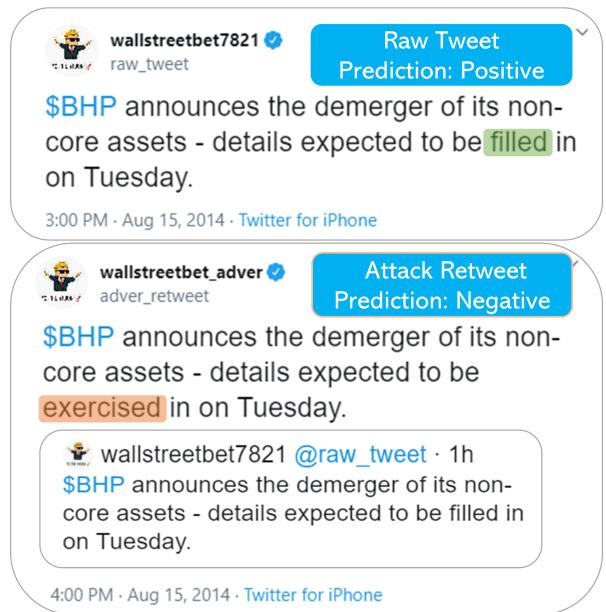  
Figure 1: An example of word-replacement adversarial attack. (Top) benign tweet leads Stocknet to predict stock going UP; (Bottom) adding an adversarial retweet leads Stocknet to predict stock going DOWN.

It is now known that text-based deep learning models can be vulnerable to adversarial attacks (Szegedy et al., 2014; Goodfellow et al., 2015). The perturbation can be at the sentence level (e.g., Xu et al., 2021; Iyyer et al., 2018; Ribeiro et al., 2018), the word level (e.g., Zhang et al., 2019; Alzantot et al., 2018; Zang et al., 2020; Jin et al., 2020; Lei et al., 2019; Zhang et al., 2021; Lin et al., 2021), or both (Chen et al., 2021). We are interested in whether such adversarial attack vulnerability also exists in stock prediction models, as these models embrace more and more human-generated media data (e.g., Twitter, Reddit, Stocktwit, Yahoo News (Xu and Cohen, 2018; Sawhney et al., 2021)). The adversarial robustness is a more critical issue in the context of stock prediction as anyone can post perturbed tweets or news to influence forecasting models. For example, a fake news (“Two Explosions in the White House and Barack Obama is Injured”) posted by a hacker using the Associated-Press’s Twitter account on 04/23/2013 erased \$136 billion market value in just 60 seconds (Fisher, 2013). Although the event doesn’t fall into the category of adversarial attack, it rings the alarm for traders who use (social) media information for their trading decisions.

To our best knowledge, it is the first paper to consider the adversarial attack in the financial NLP literature. Many attacks modify benign text directly (manipulation attack) and use them as model input; However, in our case, adversarial retweets enter the model along with benign tweets (concatenation attack), which is more realistic as malicious Twitter users can not modify others’ tweets. In other words, we formulate the task as a text-concatenating attack (Jia and Liang, 2017; Le et al., 2021): we implement the attack by injecting new tweets instead of manipulating existing benign tweets. Our task is inspired and mimics the retweet function on social media, and uses it to feed the adversarial samples into the dataset. Despite various algorithms are proposed to generate manipulation attack, literature of concatenation attack on classification models is rare, with exceptions Le et al. (2021), Song et al. (2021) and Wang et al. (2020). Our paper provides extra evidence of their difference by investigating their performances in the financial domain.

The main challenge is to craft new and effective adversarial tweets. We solve the task by aligning the semantics with benign tweets so that the potential human and machine readers can’t detect our adversarial tweets. To achieve that, we consider the generation task as a combinatorial optimization problem (Zang et al., 2020; Guo et al., 2021). Specific tweets are first selected, which are used as the target of perturbation on a limit number of words within the tweets. We then examine our attack method on three financial forecast models with attack success rate, F1 and potential profit and loss as evaluation metrics. Results show that our attack method consistently achieves good success rate on the victim models. More astonishingly, the attack can cause additional loss of 23% to 32% if an investor trades on the predictions of the victim models (Fig. 4).

## 2 Adversarial Attack on Stock Prediction Models with Tweet Data

Attack model: Adversarial tweets. In the case of Twitter, adversaries can post malicious tweets which are crafted to manipulate downstream models that take them as input. We propose to attack by posting semantically similar adversarial tweets as retweets on Twitter, so that they could be identified as relevant information and collected as model input. For example, as shown in Fig 1, the original authentic tweet by the user wallstreetbet7821 was “\$BHP announces the demerger of its noncore assets - details expected to be filled in on Tuesday.” An adversarial sentence could be “\$BHP announces the demerger of its non-core assets - details expected to be exercised in on Tuesday.”. The outcome of the victim model switches to negative prediction from positive prediction when the retweet is added to the input.

The proposed attack method takes the practical implementation into its design consideration, thus has many advantages. First, the adversarial tweets are crafted based on carefully-selected relevant tweets, so they are more likely to pass the models’ tweet filter and enter the inference data corpus. Secondly, adversarial tweets are optimized to be semantically similar to the original tweets so that they are not counterfactual and very likely to fool human sanity checks as well as the Twitter’s content moderation system.

Attack generation: Hierarchical perturbation. The challenge of our attack method centers around how to select the optimal tweets and the token perturbations with the constraints of semantic similarity. In this paper, we formulate the task as a hierarchical perturbation consisting of three steps: tweet selection, word selection and word perturbation. In the first step, a set of optimal tweets is first selected as the target tweets to be perturbed and retweeted. For each selected tweet in the pool, the word selection problem is then solved to find one or more optimal words to apply perturbation. Word and tweet budgets are also introduced to quantify the strength of the perturbation.

We consider the word replacement and deletion for word perturbation (Garg and Ramakrishnan, 2020; Li et al., 2020). In the former case, the final step is to find the optimal candidate as replacement. A synonym as replacement is widely adopted in the word-level attack since it is a natural choice to preserve semantics (Zang et al., 2020; Dong et al., 2021; Zhang et al., 2019; Jin et al., 2020). Therefore, we replace target words with their synonyms chosen from synonym sets which contain the semantically closest words measured by the similarity of the GLOVE embedding (Jin et al., 2020).

Mathematical Formulation. We consider a multimodal stock forecast model $f ( \cdot )$ that takes tweet collections $\{ c _ { t } \} _ { t = 1 } ^ { T }$ and numerical factors $\{ p _ { t } \} _ { t = 1 } ^ { T }$ as input, where t indexes the date when the data is collected. Peeking into the tweet collection, it contains $\left| c _ { t } \right|$ tweets for date t, namely, $\boldsymbol { c _ { t } } = \{ s _ { t } ^ { 1 } , s _ { t } ^ { 2 } , . . . , s _ { t } ^ { | \boldsymbol { c _ { t } } | } \}$ . Each tweet $s _ { t } ^ { i }$ is a textbased sentence of length $| s _ { t } ^ { i } |$ , denoted as $s _ { t } ^ { i }$ = $( w _ { t } ^ { i , 1 } , . . . , w _ { t } ^ { i , j } , . . . , w _ { t } ^ { i , | s _ { t } ^ { i } | } )$ , for $i = 1 , . . . , | { \boldsymbol { c } } _ { t } |$ . A directional financial forecast model takes domains of tweets and numerical factors as input, and yields prediction for stocks’ directional movement $y \in \{ - 1 , 1 \}$

$$
\hat { y } _ { t + 1 } = f ( c _ { t - h : t } , p _ { t - h : t } ) ,\tag{1}
$$

h is the looking-back window for historical data.

The hierarchical perturbation can be cast as a combinatorial problem for tweet selection m, word selection z and replacement selection u. The boolean vector m indicates the tweets to be selected. For i-th tweet, vector $z _ { i }$ indicates the word to be perturbed. As for the word perturbation task, another boolean vector $u _ { i , j }$ selects the best replacement. It follows that the hierarchical perturbation can be formulated as

$$
\begin{array} { r } { c _ { t } ^ { \prime } = ( 1 - m \cdot z ) \cdot \boldsymbol { c } _ { t } + m \cdot z \cdot \boldsymbol { u } \cdot S ( \boldsymbol { c } _ { t } ) , } \end{array}\tag{2}
$$

where denotes element-column wise product, $m \cdot z$ indicates the selected words in selected tweets, $m \cdot z \cdot u$ indicates selected synonyms for each selected word, and $S ( \cdot )$ is a element-wise synonym generating function. Consequently, given attack loss ${ \mathcal { L } } ,$ generation of adversarial retweets can be formulated as the optimization program min $\mathcal { L } ( c _ { t } ^ { \prime } \cup c _ { t - h : t } , c _ { t - h : t } | p _ { t - h : t } , f )$ , subject to m,z,u   
the budget constraints: a) $\mathbf { 1 } ^ { T } m \leq b _ { s } , b ) \mathbf { 1 } ^ { T } z _ { i } \leq$ $b _ { w } , \forall i$ and $c ) \ \mathbf { 1 } ^ { T } \mathbf { u } _ { i , j } = 1 , \forall i , j$ , where $b _ { s }$ and $b _ { w }$ denote the tweet and word budgets. It is worth to stress that perturbation is only applied to the date (t) when the attack is implemented to preserve the temporal order.

To solve the program, we follow the convex relaxation approach developed in (Srikant et al., 2021). Specifically, the boolean variables (for tweet and word selection) are relaxed into the continuous space so that they can be optimized by gradientbased methods over a convex hull. Two main implementations of the optimization-based attack generation method are proposed: joint optimization (JO) solver and alternating greedy optimization (AGO) solver. JO calls projected gradient descent method to optimize the tweet and word selection variables and word replacement variables simultaneously. AGO uses an alternative optimization procedure to sequentially update the discrete selection variables and the replacement selection variables. More details on the optimization program and the solvers can be found in Appendix A.

## 3 Experiments

Dataset & victim models. We evaluate our adversarial attack on a stock prediction dataset consisting of 10,824 instances including relevant tweets and numerical features of 88 stocks from 2014 to 2016 (Xu and Cohen, 2018). Three models (Stocknet (Xu and Cohen, 2018), FinGRU based on GRU (Cho et al., 2014) and FinLSTM based on LSTM (Hochreiter and Schmidhuber, 1997)) of binary classification are considered as victims in this paper. We apply our attack to instances on which the victim models make correct predictions.

Evaluation metrics. Attack performance is evaluated by two metrics: Attack Success Rate (ASR) and victim model’s F1 drop after attack. ASR is defined as the percentage of the attack efforts that changes the model output. The two metrics gauge the efficacy of the attack and its impact on model performance: More efficient attack leads to higher ASR and more decline of F1. Moreover, we simulate a Long-Only Buy-Hold-Sell strategy (Sawhney et al., 2021; Feng et al., 2019) with victim models, and calculate the Profit and Loss (PnL) for each simulation. Assume a portfolio starts with initial net value \$10000 (100%), its net value at the end of test period reflects the profitability of the trading strategy and the underlying model. Consequently, the change in PnLs measures the monetary impact of our attack. More details on the dataset, victim models and evaluation metrics are housed in Appendix B.

## 4 Results

Attack performance with single perturbation. The experiment results for the concatenation attack with word replacement perturbation is shown in Table 1 (with tweet and word budgets both as 1). For both JO and AGO, ASR increases by roughly 10% and F1 drops by 0.1 on average in comparison to the random attack. Such performance drop is considered significant in the context of stock prediction given that the state-of-the-art prediction

accuracy of interday return is only about 60%.
<table><tr><td rowspan="2">Model</td><td colspan="4">ASR(%)</td><td colspan="4">F1</td></tr><tr><td>NA</td><td>RA</td><td>JO</td><td>AGO</td><td>NA</td><td>RA</td><td>JO</td><td>AGO</td></tr><tr><td>Stocknet</td><td>0</td><td>4.5</td><td>16.8</td><td>11.8</td><td>1</td><td>0.96</td><td>0.84</td><td>0.88</td></tr><tr><td>FinGRU</td><td>0</td><td>5.1</td><td>16.4</td><td>14.1</td><td>1</td><td>0.95</td><td>0.85</td><td>0.87</td></tr><tr><td>FinLSTM</td><td>0</td><td>11.9</td><td>16.5</td><td>19.7</td><td>1</td><td>0.89</td><td>0.85</td><td>0.78</td></tr></table>

Table 1: Performance of the various adversarial attacks. NA: no attack; RA: random attack; JO: joint optimization; and AGO: alternating greedy optimization.

Effect of attack budget. We report the effect of different attack budgets on the attack performance in Fig. 2. We observe that the more budgets allowed (perturbing more tweets and words), the better the attack performance, but the increase is not significant. It appears that the attack performance becomes saturated if we keep increasing the attack budgets. In fact, the attack with budget of one tweet and one word is the most cost effective, provided that it introduces minimum perturbation but achieves a relatively similar ASR.

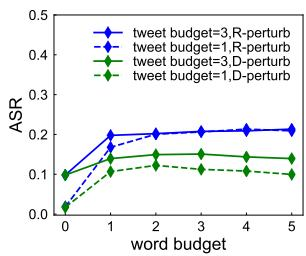

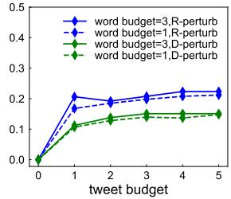  
Figure 2: Effect of attack budgets on ASR with Stocknet as victim model and with JO solver. r-perturb: word replacement; d-perturb: word deletion.

Manipulation vs concatenation attack. We focus on concatenation attack in this paper since we believe it is distinct from manipulation attack. We investigate the difference by applying the same method of tweet generation to implement manipulation attack, where the adversarial tweets replace target tweets instead. The experiment runs with one word budget and one twee budget, and the results are reported in Fig. 3.

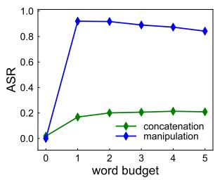

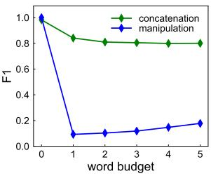  
Figure 3: Comparison between manipulation and concatenation attacks with word-replacement perturbation method. Stocknet is the victim model.

It is clear that manipulation attack remarkably outperforms concatenation attack in terms of ASR and F1. Even though the success rate of concatenation attack lags behind the state-of-the-art textual attack, the manipulation attack achieves performance of the same ballpark, which demonstrates the efficacy of optimization-based attack and our solvers. More importantly, it implies that the attack is not transferable between the two tasks, documenting more evidence on language attack transferability (Yuan et al., 2021; He et al., 2021). The bottom line is that they are two different tasks under different assumptions. Researchers should take downstream scenarios into account when develop attack models.

Trading simulation. The ultimate measure of a stock prediction model’s performance is profitability. Fig. 4 plots the profit and loss of the same trading strategy with Stocknet as the prediction model with or without the attack – JO is used to generate adversarial retweets. For each simulation, the investor has \$10K (100%) to invest; the results show that the proposed attack method with a retweet with only a single word replacement can cause the investor an additional \$3.2K (75%-43%) loss to their portfolio after about 2 years.

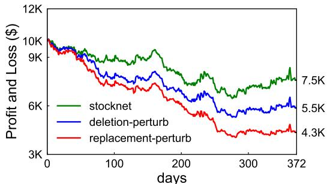  
Figure 4: Profit and Loss with Stocknet as the victim model using Long-Only Buy-Hold-Sell strategy for 2 years with \$10K initial investment. Green line: trading using Stocknet without attack; Blue line: concatenation attack with deletion perturbation; Red line: concatenation attack with replacement perturbation.

## 5 Conclusion

This work demonstrates that our adversarial attack method consistently fools various financial forecast models even with physical constraints that the raw tweet can not be modified. Adding a retweet with only one word replaced, the attack can cause 32% additional loss to our simulated investment portfolio. Via studying financial model’s vulnerability, our goal is to raise financial community’s awareness of the AI model’s risks, so that in the future we can develop more robust human-in-theloop AI architecture (Wang et al., 2019) to cope with this and other real-world attacks, including black-box attack, unknown input domains, etc.

## References

Moustafa Alzantot, Yash Sharma, Ahmed Elgohary, Bo-Jhang Ho, Mani Srivastava, and Kai-Wei Chang. 2018. Generating natural language adversarial examples. In Proceedings of the 2018 Conference on Empirical Methods in Natural Language Processing, pages 2890–2896, Brussels, Belgium. Association for Computational Linguistics.

Werner Antweiler and Murray Z Frank. 2004. Is all that talk just noise? the information content of internet stock message boards. The Journal offinance, 59(3):1259–1294.

Yangyi Chen, Jin Su, and Wei Wei. 2021. Multigranularity textual adversarial attack with behavior cloning. In Proceedings of the 2021 Conference on Empirical Methods in Natural Language Processing, pages 4511–4526, Online and Punta Cana, Dominican Republic. Association for Computational Linguistics.

Kyunghyun Cho, Bart van Merriënboer, Caglar Gulcehre, Dzmitry Bahdanau, Fethi Bougares, Holger Schwenk, and Yoshua Bengio. 2014. Learning phrase representations using RNN encoder–decoder for statistical machine translation. In Proceedings of the 2014 Conference on Empirical Methods in Natural Language Processing (EMNLP), pages 1724– 1734, Doha, Qatar. Association for Computational Linguistics.

J Anthony Cookson and Marina Niessner. 2020. Why don’t we agree? evidence from a social network of investors. The Journal ofFinance, 75(1):173–228.

Nhan Cach Dang, María N Moreno-García, and Fernando De la Prieta. 2020. Sentiment analysis based on deep learning: A comparative study. Electronics, 9(3):483.

Xiao Ding, Yue Zhang, Ting Liu, and Junwen Duan. 2015. Deep learning for event-driven stock prediction. In Proceedings of the Twenty-Fourth International Joint Conference on Artificial Intelligence, IJCAI 2015, Buenos Aires, Argentina, July 25-31, 2015, pages 2327–2333. AAAI Press.

Xinshuai Dong, Anh Tuan Luu, Rongrong Ji, and Hong Liu. 2021. Towards robustness against natural language word substitutions. In 9th International Conference on Learning Representations, ICLR 2021, Virtual Event, Austria, May 3-7, 2021. OpenReview.net.

Fuli Feng, Xiangnan He, Xiang Wang, Cheng Luo, Yiqun Liu, and Tat-Seng Chua. 2019. Temporal relational ranking for stock prediction. ACM Trans. Inf. Syst., 37(2).

Max Fisher. 2013. Syrian hackers claim AP hack that tipped stock market by \$136 billion. Is it terrorism? Washington Post.

Siddhant Garg and Goutham Ramakrishnan. 2020. BAE: BERT-based adversarial examples for text classification. In Proceedings of the 2020 Conference on Empirical Methods in Natural Language Processing (EMNLP), pages 6174–6181, Online. Association for Computational Linguistics.

Ian J. Goodfellow, Jonathon Shlens, and Christian Szegedy. 2015. Explaining and harnessing adversarial examples. In 3rd International Conference on Learning Representations, ICLR 2015, San Diego, CA, USA, May 7-9, 2015, Conference Track Proceedings.

Chuan Guo, Alexandre Sablayrolles, Hervé Jégou, and Douwe Kiela. 2021. Gradient-based adversarial attacks against text transformers. In Proceedings of the 2021 Conference on Empirical Methods in Natural Language Processing, pages 5747–5757, Online and Punta Cana, Dominican Republic. Association for Computational Linguistics.

Xuanli He, Lingjuan Lyu, Lichao Sun, and Qiongkai Xu. 2021. Model extraction and adversarial transferability, your BERT is vulnerable! In Proceedings ofthe 2021 Conference ofthe North American Chapter of the Association for Computational Linguistics: Human Language Technologies, pages 2006–2012, Online. Association for Computational Linguistics.

Joshua Zoen Git Hiew, Xin Huang, Hao Mou, Duan Li, Qi Wu, and Yabo Xu. 2019. Bert-based financial sentiment index and lstm-based stock return predictability. ArXiv preprint, abs/1906.09024.

Sepp Hochreiter and Jürgen Schmidhuber. 1997. Long short-term memory. Neural computation, 9(8):1735–1780.

Mohit Iyyer, John Wieting, Kevin Gimpel, and Luke Zettlemoyer. 2018. Adversarial example generation with syntactically controlled paraphrase networks. In Proceedings of the 2018 Conference of the North American Chapter of the Association for Computational Linguistics: Human Language Technologies, Volume 1 (Long Papers), pages 1875–1885, New Orleans, Louisiana. Association for Computational Linguistics.

Robin Jia and Percy Liang. 2017. Adversarial examples for evaluating reading comprehension systems. In Proceedings of the 2017 Conference on Empirical Methods in Natural Language Processing, pages 2021–2031, Copenhagen, Denmark. Association for Computational Linguistics.

Di Jin, Zhijing Jin, Joey Tianyi Zhou, and Peter Szolovits. 2020. Is BERT really robust? A strong baseline for natural language attack on text classification and entailment. In The Thirty-Fourth AAAI Conference on Artificial Intelligence, AAAI 2020, The Thirty-Second Innovative Applications of Artificial Intelligence Conference, IAAI 2020, The Tenth AAAI Symposium on Educational Advances in Artificial Intelligence, EAAI 2020, New York, NY,

USA, February 7-12, 2020, pages 8018–8025. AAAI Press.

Diederik P. Kingma and Jimmy Ba. 2015. Adam: A method for stochastic optimization. In 3rd International Conference on Learning Representations, ICLR 2015, San Diego, CA, USA, May 7-9, 2015, Conference Track Proceedings.

Thai Le, Noseong Park, and Dongwon Lee. 2021. A sweet rabbit hole by DARCY: Using honeypots to detect universal trigger’s adversarial attacks. In Proceedings of the 59th Annual Meeting of the Association for Computational Linguistics and the 11th International Joint Conference on Natural Language Processing (Volume 1: Long Papers), pages 3831– 3844, Online. Association for Computational Linguistics.

Qi Lei, Lingfei Wu, Pin-Yu Chen, Alex Dimakis, Inderjit S. Dhillon, and Michael J. Witbrock. 2019. Discrete adversarial attacks and submodular optimization with applications to text classification. In Proceedings of Machine Learning and Systems 2019, MLSys 2019, Stanford, CA, USA, March 31 - April 2, 2019. mlsys.org.

Linyang Li, Ruotian Ma, Qipeng Guo, Xiangyang Xue, and Xipeng Qiu. 2020. BERT-ATTACK: Adversarial attack against BERT using BERT. In Proceedings of the 2020 Conference on Empirical Methods in Natural Language Processing (EMNLP), pages 6193–6202, Online. Association for Computational Linguistics.

Bill Yuchen Lin, Wenyang Gao, Jun Yan, Ryan Moreno, and Xiang Ren. 2021. RockNER: A simple method to create adversarial examples for evaluating the robustness of named entity recognition models. In Proceedings of the 2021 Conference on Empirical Methods in Natural Language Processing, pages 3728–3737, Online and Punta Cana, Dominican Republic. Association for Computational Linguistics.

Pekka Malo, Ankur Sinha, Pekka J. Korhonen, Jyrki Wallenius, and Pyry Takala. 2014. Good debt or bad debt: Detecting semantic orientations in economic texts. Journal ofthe Associationfor Information Science and Technology, 65.

Dang Lien Minh, Abolghasem Sadeghi-Niaraki, Huynh Duc Huy, Kyungbok Min, and Hyeonjoon Moon. 2018. Deep learning approach for short-term stock trends prediction based on twostream gated recurrent unit network. Ieee Access, 6:55392–55404.

Shuhuai Ren, Yihe Deng, Kun He, and Wanxiang Che. 2019. Generating natural language adversarial examples through probability weighted word saliency. In Proceedings of the 57th Annual Meeting of the Association for Computational Linguistics, pages 1085–1097, Florence, Italy. Association for Computational Linguistics.

Marco Tulio Ribeiro, Sameer Singh, and Carlos Guestrin. 2018. Semantically equivalent adversarial rules for debugging NLP models. In Proceedings of the 56th Annual Meeting of the Association for Computational Linguistics (Volume 1: Long Papers), pages 856–865, Melbourne, Australia. Association for Computational Linguistics.

Ramit Sawhney, Shivam Agarwal, Arnav Wadhwa, and Rajiv Ratn Shah. 2020a. Deep attentive learning for stock movement prediction from social media text and company correlations. In Proceedings of the 2020 Conference on Empirical Methods in Natural Language Processing (EMNLP), pages 8415–8426, Online. Association for Computational Linguistics.

Ramit Sawhney, Piyush Khanna, Arshiya Aggarwal, Taru Jain, Puneet Mathur, and Rajiv Ratn Shah. 2020b. VolTAGE: Volatility forecasting via text audio fusion with graph convolution networks for earnings calls. In Proceedings of the 2020 Conference on Empirical Methods in Natural Language Processing (EMNLP), pages 8001–8013, Online. Association for Computational Linguistics.

Ramit Sawhney, Arnav Wadhwa, Shivam Agarwal, and Rajiv Ratn Shah. 2021. FAST: Financial news and tweet based time aware network for stock trading. In Proceedings of the 16th Conference of the European Chapter of the Association for Computational Linguistics: Main Volume, pages 2164–2175, Online. Association for Computational Linguistics.

Liwei Song, Xinwei Yu, Hsuan-Tung Peng, and Karthik Narasimhan. 2021. Universal adversarial attacks with natural triggers for text classification. In Proceedings of the 2021 Conference of the North American Chapter of the Association for Computational Linguistics: Human Language Technologies, pages 3724–3733, Online. Association for Computational Linguistics.

Shashank Srikant, Sijia Liu, Tamara Mitrovska, Shiyu Chang, Quanfu Fan, Gaoyuan Zhang, and Una-May O’Reilly. 2021. Generating adversarial computer programs using optimized obfuscations. In 9th International Conference on Learning Representations, ICLR 2021, Virtual Event, Austria, May 3-7, 2021. OpenReview.net.

Christian Szegedy, Wojciech Zaremba, Ilya Sutskever, Joan Bruna, Dumitru Erhan, Ian J. Goodfellow, and Rob Fergus. 2014. Intriguing properties of neural networks. In 2nd International Conference on Learning Representations, ICLR 2014, Banff, AB, Canada, April 14-16, 2014, Conference Track Proceedings.

Yla R Tausczik and James W Pennebaker. 2010. The psychological meaning of words: Liwc and computerized text analysis methods. Journal of language and social psychology, 29(1):24–54.

Boxin Wang, Hengzhi Pei, Boyuan Pan, Qian Chen, Shuohang Wang, and Bo Li. 2020. T3: Treeautoencoder regularized adversarial text generation

for targeted attack. In Proceedings of the 2020 Conference on Empirical Methods in Natural Language Processing (EMNLP), pages 6134–6150.

Dakuo Wang, Justin D Weisz, Michael Muller, Parikshit Ram, Werner Geyer, Casey Dugan, Yla Tausczik, Horst Samulowitz, and Alexander Gray. 2019. Human-ai collaboration in data science: Exploring data scientists’ perceptions of automated ai. Proceedings ofthe ACM on Human-Computer Interaction, 3(CSCW):1–24.

Frank Z Xing, Erik Cambria, and Roy E Welsch. 2018. Natural language based financial forecasting: a survey. Artificial Intelligence Review, 50(1):49–73.

Ying Xu, Xu Zhong, Antonio Jimeno Yepes, and Jey Han Lau. 2021. Grey-box adversarial attack and defence for sentiment classification. In Proceedings of the 2021 Conference of the North American Chapter of the Association for Computational Linguistics: Human Language Technologies, pages 4078–4087, Online. Association for Computational Linguistics.

Yumo Xu and Shay B. Cohen. 2018. Stock movement prediction from tweets and historical prices. In Proceedings of the 56th Annual Meeting of the Association for Computational Linguistics (Volume 1: Long Papers), pages 1970–1979, Melbourne, Australia. Association for Computational Linguistics.

Linyi Yang, Tin Lok James Ng, Barry Smyth, and Ruihai Dong. 2020. HTML: hierarchical transformerbased multi-task learning for volatility prediction. In WWW ’20: The Web Conference 2020, Taipei, Taiwan, April 20-24, 2020, pages 441–451. ACM / IW3C2.

Liping Yuan, Xiaoqing Zheng, Yi Zhou, Cho-Jui Hsieh, and Kai-Wei Chang. 2021. On the transferability of adversarial attacks against neural text classifier. In Proceedings of the 2021 Conference on Empirical Methods in Natural Language Processing, pages 1612–1625, Online and Punta Cana, Dominican Republic. Association for Computational Linguistics.

Yuan Zang, Fanchao Qi, Chenghao Yang, Zhiyuan Liu, Meng Zhang, Qun Liu, and Maosong Sun. 2020. Word-level textual adversarial attacking as combinatorial optimization. In Proceedings of the 58th Annual Meeting of the Association for Computational Linguistics, pages 6066–6080, Online. Association for Computational Linguistics.

Huangzhao Zhang, Hao Zhou, Ning Miao, and Lei Li. 2019. Generating fluent adversarial examples for natural languages. In Proceedings of the 57th Annual Meeting of the Association for Computational Linguistics, pages 5564–5569, Florence, Italy. Association for Computational Linguistics.

Lei Zhang, Shuai Wang, and Bing Liu. 2018. Deep learning for sentiment analysis: A survey. Wiley Interdisciplinary Reviews: Data Mining and Knowledge Discovery, 8(4):e1253.

Xinze Zhang, Junzhe Zhang, Zhenhua Chen, and Kun He. 2021. Crafting adversarial examples for neural machine translation. In Proceedings of the 59th Annual Meeting of the Association for Computational Linguistics and the 11th International Joint Conference on Natural Language Processing (Volume 1: Long Papers), pages 1967–1977, Online. Association for Computational Linguistics.

## A Mathematical Formation

## A.1 Financial Forecast Model

Massive amounts of text data are generated by millions of users on Twitter every day. Among a variety of discussion, stock analysis, picking and prediction are consistently one of the trending topics. And investors often use the Twitter cashtag function (a \$ symbol followed by a ticker) to organize their particular thoughts around one single stock, e.g., \$AAPL, so that users can click and see the ongoing discussions. Textual data on Twitter is collectively generated by all of its users via posting tweets. Financial organizations and institutional investors often ingest the massive text data in real time and incorporate them or their latent representation into their stock prediction models.

We consider the multimodal stock forecast models that take tweet collections $\{ c _ { t } \} _ { t = 1 } ^ { T }$ and numerical factors $\{ p _ { t } \} _ { t = 1 } ^ { T }$ as input,where t indexes the date when the data is collected. The numerical factors are usually mined from historical price, fundamentals and other alternative data sources. In this paper, we assume that the domain of numerical factors is unassailable since they are directly derived from public records. Therefore, the objective of adversary is to manipulate model output by injecting perturbation to the textual domain $\{ c _ { t } \} _ { t = 1 } ^ { T }$ Peeking into the tweet collection, it contains $\left| c _ { t } \right|$ tweets for date t, namely, $\boldsymbol { c _ { t } } = \{ s _ { t } ^ { 1 } , s _ { t } ^ { 2 } , . . . , s _ { t } ^ { | c _ { t } | } \}$ Each tweet $s _ { t } ^ { i }$ is a text-based sentence of length $| s _ { t } ^ { i } |$ , denoted as $\mathbf { } ~ _ { } ^ { s _ { t } ^ { i } } ~ = ~ ( w _ { t } ^ { i , 1 } , . . . , w _ { t } ^ { i , j } , . . . , w _ { t } ^ { i , | s _ { t } ^ { i } | } )$ for $i = 1 , . . . , | \boldsymbol { c } _ { t } |$ . A directional financial forecast model takes domains of tweets and numerical factors as input, and yields prediction for stocks directional movement $y \in \{ - 1 , 1 \}$

$$
\hat { y } _ { t + 1 } = f ( c _ { t - h : t } , p _ { t - h : t } ) ,\tag{3}
$$

where $h$ is the looking-back window for historical data.

## A.2 Attack Model

Let $\boldsymbol { c } _ { t } ^ { \prime }$ be the perturbed tweet collection at time t created by solving the hierarchical perturbation problem. To formalize the perturbation task, we introduce boolean vector variable $m \in \{ 0 , 1 \} ^ { n _ { \eta } }$ m to indicate the tweets to be selected. If $m _ { i } = 1$ then i-th tweet is the target tweet to be perturbed and retweeted. Besides, for i-th tweet, vector $z _ { i } \in \{ 0 , 1 \} ^ { n _ { z } }$ indicates the word to be perturbed. As for the word perturbation task, another boolean vector $u _ { i , j } ~ \in ~ \{ 0 , 1 \} ^ { n _ { u } }$ selects the best replacement. $n _ { m }$ and $n _ { z }$ and $n _ { u }$ denote the maximum amount of tweets, maximum amount of words in each tweet, and the amount of synonyms for each word, respectively. We identify deletion perturbation as a special case of replacement with $u _ { i , j , k } = 1$ only for padding token, so that the task degenerates to tweet selection and word selection. Let vector $z \in \{ 0 , 1 \} ^ { n _ { m } \times n _ { z } }$ denote $n _ { m }$ different $z _ { i }$ vector, and $\pmb { u } \in \{ 0 , 1 \}$ nm×nz×nu denote $n _ { m } \times n _ { z }$ different $u _ { i , j }$ vectors. It follows that the hierarchical perturbation can be defined as

$$
\begin{array} { r } { \begin{array} { l } { c _ { t } ^ { \prime } = ( 1 - m \cdot z ) \cdot c _ { t } + m \cdot z \cdot u \cdot S ( c _ { t } ) } \\ { s . t . \quad 1 ^ { T } m \leq b _ { s } , } \\ { \quad 1 ^ { T } z _ { i } \leq b _ { w } , \forall i , } \\ { \quad 1 ^ { T } u _ { i , j } = 1 , \forall i , j , } \end{array} } \end{array}\tag{4}
$$

where denotes element-column wise product, $b _ { s }$ denotes tweet budget, $b _ { w }$ denotes word budget and $S ( \cdot )$ is element-wise synonym generating function.

Adversarial retweets are the then passed into downstream financial forecast model $f ( \cdot )$ along with benign tweets. Attack success is achieved if the adversarial tweets manage to fool the downstream model, and change the model output. Financial forecast model usually takes observation of multiple steps as input to appreciate the temporal dependence. However, adversary can only inject adversarial retweets at present time. That is, when run the model on day t to predict price movement on day $t + 1$ , retweets only enter tweet collection for day t; collections for days prior to t remain static. Consequently, generation of successful adversarial retweets is formulated as the following optimization program:

$$
\begin{array} { r l } { \underset { m , z , u } { \operatorname* { m i n } } } & { \mathcal { L } ( c _ { t } ^ { \prime } \cup c _ { t - h : t } , c _ { t - h : t } | p _ { t - h : t } , f ) } \\ { s . t . } & { \mathrm { c o n s t r a i n t ~ i n ~ } ( 4 ) , } \end{array}\tag{5}
$$

where denotes the attack loss. We adopt the crossentropy loss for our attack since it is untargeted attack (Srikant et al., 2021). Other classificationrelated loss may be applied according to adversary’s objective. Furthermore, we also add entropybased regularization to encourage sparsity of optimization variables (Dong et al., 2021).

## A.3 Methodology

The challenge of solving program (5) lies in the combinatorial and hierarchical nature. We first relax the boolean variables into continuous space so that they can be solved by gradient-based solvers. A common workaround for combinatorial optimization is to solve an associated continuous optimization over convex hull (Dong et al., 2021; Srikant et al., 2021). An computationally efficient fashion is to optimize over a convex hull constructed with linear combination of candidate set, and the optimal replacement goes with word with highest weight (Dong et al., 2021). However, this approach doesn’t fit in the hierarchical tweet and word selection problem. For example, in order to select the optimal target word, one need to sum over the embedding of all words in the tweet, so the tweet collapses into embedding for one hypothetical word. Similarly, different tweets collapse to one hypothetical tweet, or one hypothetical word when one jointly selects tweets and words.

Joint optimization solver (JO). As a remedy, we propose a joint optimization solver that combines projected gradient descent and convex hull to jointly optimize m, z and u. Replacement selection is optimized over the convex hull:

$$
\boldsymbol { c } _ { t } ^ { \prime } = ( 1 - \boldsymbol { m } \cdot \boldsymbol { z } ) \cdot \boldsymbol { c } _ { t } + \boldsymbol { m } \cdot \boldsymbol { z } \cdot c o n v ( \boldsymbol { u } , S ( \boldsymbol { c } _ { t } ) ) ,
$$

where

$$
c o n v ( { \pmb u } , S ( { \pmb c } _ { t } ) ) = \{ \sum _ { k } { \hat { u } } _ { i , j , k } S ( w _ { i , j , k } ) , \forall i , j \} ,
$$

and

$$
\hat { u } _ { i , j , k } = \frac { e x p ( u _ { i , j , k } ) } { \sum _ { k } e x p ( u _ { i , j , k } ) } .
$$

The problem of (5) is then solved by optimizing uˆ. Unlike u, m and z are optimized directly via projected gradient descent (PGD). Moreover, when m is one-hot vector, it determines the tweets to be retweeted, and those retweets are then added into tweet collection. However, m is continuous during optimization, so we retweet all the collected tweets and add them into tweet collection, which helps generate and back-propagate gradients for all the entries of m. After the optimization is solved, we map the continuous solution into one-hot vector by selecting top $b _ { s }$ highest $m _ { i }$

Alternating greedy optimization solver (AGO). Greedy optimization is usually computational ineffective since a vast amount of inquiries is required when we collect large amount of tweets and have high attack budget. To mitigate the problem, we alternate the optimization over m, z and u. The aforementioned convex hull approach is adopted for finding optimal u. The difference lies on the path to solve tweet and word selection problems. More specifically, we alternatively search the optimal target tweets and words which achieve the highest increases in prediction loss. For tweet selection, we mimic the physical attack scenario, and new retweets are added into tweet collection during the greedy search. Depending on the adversary’s objective, different metrics may be used to measure the importance of each tweet and word. For example, Alzantot et al. (2018) use predicting probability to determine the selection of words; Ren et al. (2019) propose probability weighted word saliency as criterion for word selection; Jin et al. (2020) calculate the prediction change before and after deletion as word importance.

## B Experimental Settings

## B.1 Dataset

We evaluate our adversarial attack on a stock prediction dataset (Xu and Cohen, 2018). The dataset contains both tweets and historical prices (e.g., open, close, high, etc) for 88 stocks of 9 industries: Basic Materials, Consumer Goods, Healthcare, Services, Utilities, Conglomerates, Financial, Industrial Goods and Technology. Since we consider the task of binary classification, data instances are supposed to labelled positive and negative for upward and downward movement respectively.

Moreover, it is observed that the dataset contains a number of instances with exceptionally minor price movements. In practice, minor movement is hard to be monetized due to the existence of transaction cost. Therefore, an upper threshold of 0.55% and a lower threshold of -0.5% are introduced. Specifically, stocks going up more than 0.55% in a day are labeled as positive, those going down more than -0.5% are labeled as negative, and the minor moves in between are filtered out. As argued in (Xu and Cohen, 2018), the particular thresholds are carefully selected to balance the two classes.

In addition, the sampling period spans from 01/01/2014 to 01/01/2016. We split the dataset into train and test set on a rolling basis. This special program improves the similarity between distributions of train set and test set, which is widely adopted on temporal dataset. It leaves us 9416 train instances and 1408 test instances in 7 nonconsecutive periods. For the text domain, the dataset contains

57533 tweets in total.

## B.2 Victim Models

Stocknet. A variational Autoencoder (VAE) that takes both tweets and price as input (Xu and Cohen, 2018). Tweets are encoded in hierarchical manner within days, and then modeled sequentially along with price features. It consists of three main components in bottom-up fashion. Market Information Encoder first encodes tweets and prices to a latent representation of 50 dimensions for each day. Variational Movement Decoder infers latent vectors of 150 dimensions and then decodes stock movements. At last, a module called Attentive Temporal Auxiliary integrates temporal loss through an attention mechanism. We train the model on the dataset from scratch with the same configurations as Xu and Cohen (2018).

FinGRU. A binary classifier that takes numerical features and tweets as input. All features are encoded sequentially by GRU (Cho et al., 2014) to exploit the temporal dependence. The model adopts the same Market Information Encoder as Stocknet. Latent representation of tweets and prices are then fed into a layer of GRU with attention mechanism to integrate temporal information. We train the model with an Adam optimizer (Kingma and Ba, 2015) and learning rate of 0.005. The checkpoint achieves the best performance on test dataset among 100 epochs is adopted as the victim model.

FinLSTM. A binary classifier identical to Fin-GRU, but utilizes LSTM (Hochreiter and Schmidhuber, 1997) to encode temporal dependence. The model is trained in the same manner as FinGRU.

## B.3 Evaluation Metrics

Following Srikant et al. (2021), we evaulate the attack on those examples in the test set that are correctly classified by the target models. It provides direct evidence of the adversarial effect of the input perturbation and the model robustness. In the specific application of financial forecast, it makes more sense to manipulate correct prediction than incorrect ones. The following two common metrics are adopted to evaluate attack performance.

Attack Success Rate. ASR is defined as the percentage of the attack efforts that make the victim model misclassify the instances that are originally correctly classified. Mathematically, ASR = $\begin{array} { r } { \sum _ { t } \delta ( \hat { y } _ { t } ^ { \prime } \ne y _ { t } ) } \\ { \sum _ { t } \delta ( \hat { y } _ { t } = y _ { t } ) } \end{array}$ , where $\hat { y } _ { t }$ is the unperturbed model prediction, $\hat { y } _ { t } ^ { \prime }$ the model prediction with perturbation, and $y _ { t }$ the ground-truth label. ASR characterizes the capability of the attack model, and higher the ASR, the better the attack.

F1 Score. F1 gauges the prediction performance of the victim models. Since we only consider the samples that are correctly predicted, the F1 score in the case of no attack is 1. Apparently, the drop of the F1 score of caused by the perturbation demonstrates the performance of the attack method. Unlike ASR, the drops of F1 score gauge the direct impact on the model performance: more successful attack leads to lower post-attack F1 score.

Profit and Loss. This widely-used financial indicator measures the profitability of a trading strategy. Assume that the initial net values are \$10K (100%), accumulate profit and loss for each trade, we can then calculate the final net value of the portfolio and profit and loss. A binary financial forecast model can be exploited in many ways, and support various trading strategies, which usually lead to different PnLs. In this paper, we use a simple Long-Only Buy-Hold-Sell strategy (Sawhney et al., 2021; Feng et al., 2019). More specifically, we buy stock(s) on Day T if the model predicts these stocks go up on Day T + 1, hold for one day, and sell these stocks the next day no matter what prices will be, and repeat it. We do not short a stock even if the model predicts a negative move in the second day.

Besides, when the model makes positive prediction on more than one stocks, the money is evenly invested to the stock pool of positive prediction. For example, suppose that we stand on day 4 with portfolio value \$12K. If the model gives positive prediction on 10 of 88 stocks for day 5, we invest 10% of the total wealth (\$1.2K) to each stock, and sell them at closing prices of day 5. The process continues until the end of the test periods, and the resulting net value of the portfolio is used to calculate the profit and loss of the underlying model.

The buy-hold-sell strategy monetizes the prediction performance of financial forecast models by betting on the their predictions. The PnL reflects the profitability of the underlying models, even if it is usually influenced by many other confounding factors. Most importantly, the changes of PnLs caused by perturbation on the victim models only gauge the monetary consequence of our attack,

<table><tr><td rowspan="2">Model</td><td colspan="4">ASR(%)</td><td colspan="4">F1</td></tr><tr><td>NA</td><td>RA</td><td>JO</td><td>AGO</td><td>NA</td><td>RA</td><td>JO</td><td>AGO</td></tr><tr><td>Stocknet</td><td>0</td><td>3.6</td><td>12.1</td><td>11.0</td><td>1</td><td>0.97</td><td>0.89</td><td>0.89</td></tr><tr><td>FinGRU</td><td>0</td><td>4.0</td><td>10.2</td><td>10.6</td><td>1</td><td>0.96</td><td>0.85</td><td>0.91</td></tr><tr><td>FinLSTM</td><td>0</td><td>11.9</td><td>12.1</td><td>11.6</td><td>1</td><td>0.89</td><td>0.89</td><td>0.89</td></tr></table>

Table 2: Results for concatenation attack with deletion perturbation and budgets 1. NA and RA stand for no attack and random attack respectively, serving as benchmarks.

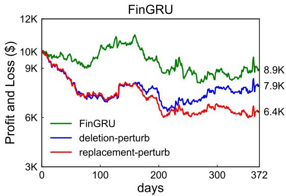

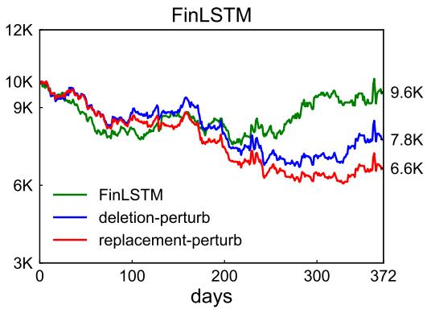  
Figure 5: Effect on Profit and Loss of various perturbation methods on FinGRU and FinLSTM.

since all else are equal.

## C Supplemental Experiment Results

## C.1 Replacement vs deletion perturbation.

We report results for concatenation attack with only the replacement perturbation in the main text in Table 1. Here we also report results for the deletion perturbation in Table 2. Attacks conducted via deletion perturbation in general perform worse than the results of replacement perturbation. We observe ASRs via JO and AGO fall by 5.1% and 4.1% respectively compared with the replacement perturbation. Accordingly, F1 slightly increases as attack performance worsens. There is no significant difference between the two optimizers (JO and AGO) in the case of deletion perturbation, but JO is preferable in terms of optimization efficiency.

Moreover, we also simulate the trading profit and loss based on FinGRU and FinLSTM. For the sake of consistency, the two models are under concatenation attack with replacement perturbation. Same as our main results, the attack is optimized by JO solver. The simulation results are reported in Figure 5, which provides further evidence for the potential monetary loss caused by our adversarial attack. Replacement perturbation again outperforms deletion perturbation in the case of FinGRU and FinLSTM.

## C.2 Effect of Iteration Number

We experiment with the optimizer to perform gradient descent or greedy search for up to 10 rounds before yielding the final solution. To visualize the effect of iteration, we plot the loss trajectory and ASR along with the optimization iterations in Figure 6. We also collect the average model loss of attack instances at each iteration, and then normalize the loss to set the initial loss as 1. Therefore, the loss trajectory visualization reveals the percentage loss drop during the optimization. We consider two different perturbations (replacement and deletion) under concatenation attacks. The attack is optimized with the JO solver.

The three charts on the first row of Figure 6 show that optimizations on all three victim models quickly converge after 4 iterations in our experiment. Accordingly, ASRs rise gradually during the first 4 iterations, but then flattens or even slides afterward. Such results suggest that our solvers can find the convergence in just a few iterations. Therefore, it makes our attack computationally effective, and insensitive to hyperparameter of iteration number.

## D Regularization on Attack Loss.

The experiment results reported in the main text are generated with the sparsity regularization. We also run ablation experiments that remove sparsity regularization. The results are consistent with our conclusion. Furthermore, inspired by (Srikant et al., 2021), we try smoothing attack loss to stabilize the optimization. We add Gaussian noise to optimization variables and evaluate the attack 10 times. The loss average is then used as the final loss for backpropagation. The results show that loss smoothing does not contribute to attack performance in our experiment as it does in Srikant et al. (2021).

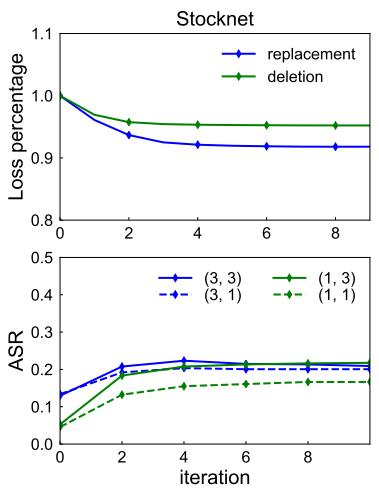

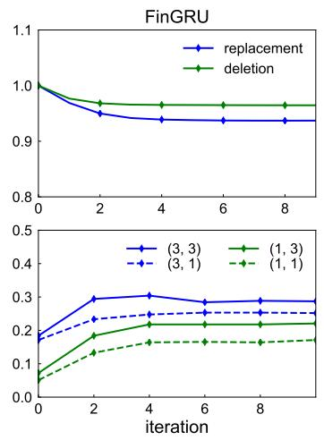

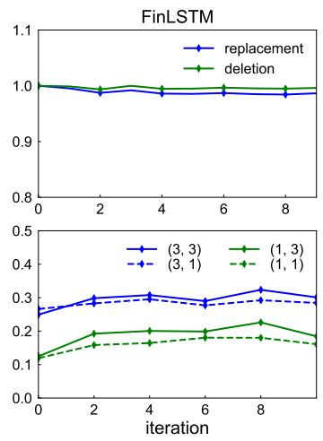  
Figure 6: Iteration number effect on prediction loss and attack success rate. The three plots on the first row show the loss trajectory during optimization for the three victim models, and the bottom row reports the ASRs trajectory. The legends for the bottom-row charts read as (tweet budget, word budget).

## E Attack Word Analysis

To qualitatively understand what kinds of words and tweets are being selected in the perturbation and retweet, we compare our tweet corpus and the selected word replacements with 15 corpora of different genres in Brown corpus via Linguistic Inquiry and Word Count program (LIWC) (Tausczik and Pennebaker, 2010). As Brown corpus does not have a financial genre, we also use Financial Phrase Bank (Malo et al., 2014). We then run Kmeans clustering on these 18 corpora based on the feature matrix from LIWC. As shown in Figure 7, financial corpora (red), Brown general word corpus (green), and attack words (blue) are grouped into three clusters, indicating the inherent difference of those text genres. Moreover, we observe that target words identified by our solvers (red “tweet” and blue “attack words” dots) are closer to financial corpora than “random attack words”.

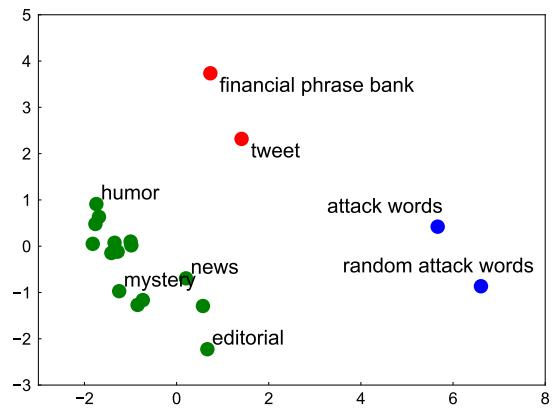  
Figure 7: Corpora clusters. 18 corpora are grouped into 3 clusters based on features from LIWC. In order to visualize the clusters, principal component analysis is applied to the features to find the first 2 principal components, which are then used as x-axis and y-axis to generate this figure.

## F Example of Adversarial Retweet

Table 3 reports 10 adversarial retweets generated in concatenation attack mode with JO and AGO solver and replacement perturbation. For all the examples, the victim model predicts positive outcomes originally, and but predicts negative outcomes after adding the adversarial retweet.

<table><tr><td rowspan=1 colspan=1>Adversarial Retweets Generated by AGO</td></tr><tr><td rowspan=1 colspan=1>Benign tweet: $BHP announces the demerger of its non-core assets - details expected to befilled in on Tuesday.Adversarial retweet: $BHP announces the demerger of its non-core assets - details expectedto be exercised in on Tuesday</td></tr><tr><td rowspan=1 colspan=1>Benign tweet: Mover and Shakers... Losers- $KO $ABX $DD. Winners- $LAND $CHL$BHP.Adversarial retweet: Shoulder and Shakers... Losers- $KO $ABX $DD. Winners- $LAND$CHL $BHP.</td></tr><tr><td rowspan=1 colspan=1>Benign tweet: Latest information on #stocks like $TDS $DIS $CPWR $BLOX Give it a try.Adversarial retweet: Latest advance on #stocks like $TDS $DIS $CPWR $BLOX Give it atry.</td></tr><tr><td rowspan=1 colspan=1>Benign tweet: Top Buy Stocks for July 29: $AMX, $EXC, $NLY, $ORCL, $XRX.Adversarial retweet: Top unsettled Stocks for July 29: $AMX, $EXC, $NLY, $ORCL, $XRX.</td></tr><tr><td rowspan=1 colspan=1>Benign tweet: $JKHY #Stocks you might want to buy $HRS $SRCL $PCLN #singedinvestor.Adversarial retweet: $JKHY #Stocks you might confirm to buy $HRS $SRCL $PCLN#singedinvestor.</td></tr><tr><td rowspan=1 colspan=1>Adversarial Retweets Generated by JO</td></tr><tr><td rowspan=1 colspan=1>Benign tweet: #Stocks you migh want to Sell $CERN $CAT $PX $DO Try this http://t.co/95PUim108L.Adversarial retweet: #Stocks you migh announce to Sell $CERN $CAT $PX $DO Try thishttp://t.co/95PUim108L.</td></tr><tr><td rowspan=1 colspan=1>Benign tweet: The Most Accurate Stock Alert Service Made $240,000 Yesterday http://t.co/8WvnrVmkBS .. $SNY $SO $SOL.Adversarial retweet: The Most Accurate Stock preserving Service Made $240,000 Yesterdayhttp://t.co/8WvnrVmkBS .. $SNY $SO $SOL.</td></tr><tr><td rowspan=1 colspan=1>Benign tweet: Is it breakout time on $HON $CF $LEG $IBM Give it a try.Adversarial retweet: Is it appealing time on $HON $CF $LEG $IBM Give it a try.</td></tr><tr><td rowspan=1 colspan=1>Benign tweet: Latest information on #stocks like $PETM $UTX $BRCD $CI #moneymanage-ment.Adversarial retweet: Latest discovery on #stocks like $PETM $UTX $BRCD $CI #money-management.</td></tr><tr><td rowspan=1 colspan=1>Benign tweet: $BABA actually showing signs of life...would love a move back toward 90although seems unlikely at moment.Adversarial retweet: $BABA actually showing signs of life...would love a move back toward90 although seems unlikely at playday.</td></tr></table>

Table 3: Ten examples of adversarial retweets generated by the concatenation attack