# ACTUNE: Uncertainty-Based Active Self-Training for Active Fine-Tuning of Pretrained Language Models

Yue Yu1, Lingkai Kong1, Jieyu Zhang2, Rongzhi Zhang1, Chao Zhang1 1Georgia Institute of Technology, Atlanta, GA 2University of Washington, Seattle, WA {yueyu, lkkong, rongzhi.zhang, chaozhang}@gatech.edu, jieyuz2@cs.washington.edu

## Abstract

While pre-trained language model (PLM) finetuning has achieved strong performance in many NLP tasks, the fine-tuning stage can be still demanding in labeled data. Recent works have resorted to active fine-tuning to improve the label efficiency of PLM fine-tuning, but none of them investigate the potential of unlabeled data. We propose ACTUNE, a new framework that leverages unlabeled data to improve the label efficiency of active PLM fine-tuning. ACTUNE switches between data annotation and model self-training based on uncertainty: it selects high-uncertainty unlabeled samples for active annotation and lowuncertainty ones for model self-training. Under this framework, we design (1) a regionaware sampling strategy that reduces redundancy when actively querying for annotations and (2) a momentum-based memory bank that dynamically aggregates the model’s pseudo labels to suppress label noise in self-training. Experiments on 6 text classification datasets show that ACTUNE outperforms the strongest active learning and self-training baselines and improves the label efficiency of PLM finetuning by 56.2% on average. Our implementation is available at https://github. com/yueyu1030/actune.

## 1 Introduction

Fine-tuning pre-trained language models (PLMs) has achieved much success in natural language processing (NLP) (Devlin et al., 2019; Liu et al., 2019; Brown et al., 2020). One benefit of PLM fine-tuning is the promising performance it offers when consuming only a few labeled data (Bansal et al., 2020; Gao et al., 2021). However, there are still significant gaps between few-shot and fully-supervised PLM fine-tuning in many tasks. Besides, the performance of few-shot PLM finetuning can be sensitive to different sets of training data (Bragg et al., 2021). Therefore, there is a crucial need for approaches that make PLM finetuning more label-efficient and robust to selection of training data, especially for applications where labeled data are scarce and expensive to obtain.

Towards this goal, researchers have recently resorted to activefine-tuning of PLMs and achieved comparable performance to fully-supervised methods with much less annotated samples (Ein-Dor et al., 2020; Margatina et al., 2021a,b; Yuan et al., 2020). Nevertheless, they usually neglect unlabeled data, which can be useful for improving label efficiency for PLM fine-tuning (Du et al., 2021). To incorporate unlabeled data into active learning, efforts have been made in the semi-supervised active learning literature (Wang et al., 2016; Rottmann et al., 2018; Siméoni et al., 2020). However, the query strategies proposed in these works can return highly redundant samples due to limited representation power, resulting in suboptimal label efficiency. Moreover, they usually rely on pseudo-labeling to utilize unlabeled data, which requires greater (yet often absent) care to denoise the pseudo labels, otherwise the errors could accumulate and hurt model performance. This issue can be even more severe for PLMs, as the fine-tuning process is often sensitive to different weight initialization and data orderings (Dodge et al., 2020). Thus, it still remains open and challenging to design robust and label efficient method for active PLM fine-tuning.

To tackle the above challenges, we propose AC-TUNE, a new method that improves the label efficiency and robustness of active PLM fine-tuning. Based on the estimated model uncertainty, AC-TUNE tightly couples active learning with selftraining in each learning round: (1) when the average uncertainty of a region is low, we trust the model’s predictions and select its most certain predictions within the region for self-training; (2) when the average uncertainty of a region is high, indicating inadequate observations for parameter learning, we actively annotate its most uncertain samples within the region to improve model performance. Different from existing AL methods that only leverage uncertainty for querying labels, our uncertainty-driven self-training paradigm gradually leverages unlabeled data with low uncertainty via self-training, while reducing the chance of error propagation triggered by highly-uncertain mislabeled data.

To further boost model performance for AC-TUNE, we design two techniques to improve the query strategy and suppress label noise, namely region-aware sampling (RS) and momentum-based memory bank (MMB). Inspired by the fact that existing uncertainty-based AL methods often end up with choosing uncertain yet repetitive data (Ein-Dor et al., 2020; Margatina et al., 2021b), we design the region-aware sampling technique to promote both diversity and representativeness by leveraging the representation power of PLMs. Specifically, we first estimate the uncertainties of the unlabeled data with PLMs, then cluster the data using their PLM representations and weigh the data by the corresponding uncertainty. Such a clustering scheme partitions the embedding space into small sub-regions with an emphasis on highly-uncertain samples. Finally, by sampling over multiple highuncertainty regions, our strategy selects data with high uncertainty and low redundancy.

To rectify the erroneous pseudo labels derived by self-training, we design a simple but effective way to select low-uncertainty data for selftraining. Our method is motivated by the fact that fine-tuning PLMs suffer from instability issues — different initializations and data orders can lead to large variance in model performance (Dodge et al., 2020; Zhang et al., 2020b; Mosbach et al., 2021). However, previous approaches only select pseudo-labeled data based on the prediction of the current round and are thus less reliable. In contrast, we maintain a dynamic memory bank to save the predictions of unlabeled samples for later use. We propose a momentum updating method to dynamically aggregate the predictions from preceding rounds (Laine and Aila, 2016) and select lowuncertainty samples based on aggregated prediction. As a result, only the samples with high prediction confidence over multiple rounds will be used for self-training, which mitigates the issue of label noise. We highlight that our active self-training approach is an efficient substitution to existing AL methods, requiring little extra computational cost.

Our key contributions are: (1) an active selftraining paradigm ACTUNE that integrates selftraining and active learning to minimize the labeling cost for fine-tuning PLMs; (2) a region-aware querying strategy to enforce both the informativeness and the diversity of queried samples during AL; (3) a simple and effective momentum-based method to leverage the predictions in preceding rounds to alleviate the label noise in self-training and (4) experiments on 6 benchmarks demonstrating ACTUNE improves the label efficiency over existing self-training and active learning baselines by 56.2%.

## 2 Uncertainty-aware Active Self-training

## 2.1 Problem Formulation

We study active fine-tuning of pre-trained language models for text classification, formulated as follows: Given a small number of labeled samples $\mathcal { X } _ { l } ~ = ~ \{ ( x _ { i } , y _ { i } ) \} _ { i = 1 } ^ { L }$ and unlabeled samples $\mathcal { X } _ { u } = \{ x _ { j } \} _ { j = 1 } ^ { U } \left( | \mathcal { X } _ { l } | \ll | \mathcal { X } _ { u } | \right)$ , we aim to fine-tune a pre-trained language model $f ( \pmb { x } ; \theta ) : \mathcal { X }  \mathcal { Y }$ in an interactive way: we perform active self-training for $T$ rounds with the total labeling budget $b .$ In each round, we aim to query $B = b / T$ samples denoted as $\boldsymbol { B }$ from $\mathcal { X } _ { u }$ to fine-tune a pre-trained language model $f ( \pmb { x } ; \theta )$ with both $\mathcal { X } _ { l } , B$ and $\mathcal { X } _ { u }$ to maximize the performance on downstream text classification tasks. Here $\mathcal { X } = \mathcal { X } _ { l } \cup \mathcal { X } _ { u }$ denotes all samples, and $\mathcal { Y } = \{ 1 , 2 , \cdots , C \}$ is the label set where $C$ is the number of classes.

## 2.2 Overview of ACTUNE Framework

We now present our active self-training paradigm ACTUNE underpinned by estimated uncertainty. We begin the active self-training loop by finetuning a BERT $f ( \theta ^ { ( 0 ) } )$ on the initial labeled data $\mathcal { X } _ { L }$ . Formally, we solve the following optimization problem

$$
\operatorname* { m i n } _ { \theta } \ \frac { 1 } { | \mathcal { X } _ { L } | } \sum _ { ( \pmb { x } _ { i } , y _ { i } ) \in \mathcal { X } _ { L } } \ell _ { \mathrm { C E } } \left( f ( \pmb { x } _ { i } ; \theta ^ { ( 0 ) } ) , y _ { i } \right)\tag{1}
$$

In round $t \left( 1 \leq t \leq T \right)$ of active self-training, we first calculate the uncertainty score based on a given function $a _ { i } ^ { ( t ) } = a ( \pmb { x } _ { i } , \pmb { \theta } ^ { ( t ) } ) ^ { \ 1 }$ for all $\pmb { x } _ { i } \in \mathcal { X } _ { u }$ . Then, we query labeled samples and generate pseudolabels for unlabeled data $\mathcal { X } _ { u }$ simultaneously to facilitate self-training. For each sample $\mathbf { \nabla } _ { \mathbf { x } _ { i } }$ , the pseudo-label $\widetilde { y }$ is calculated based on the current

Algorithm 1: Training Procedures of ACTUNE.   
Input: Initial labeled samples ; Unlabeled samples   
$\lambda _ { u } ;$ Pre-trained LM $f ( \cdot ; \theta )$ , number of active   
self-training rounds T.   
// Fine-tune the LM with initial labeled data.   
1. Calculate $\theta ^ { ( 0 ) }$ based on Eq. (1).   
2. Initialize the memory bank $g ( \pmb { x } ; \theta ^ { t } )$ based on the   
current prediction.   
// Conduct active self-training with all data.   
for $t = 1 , 2 , \cdots , T$ do   
1. Run weighted K-Means (Eq. (3), (4)) until   
convergence.   
2. Select sample set ${ \mathcal Q } ^ { ( t ) }$ for AL and $\boldsymbol { S } ^ { ( t ) }$ for   
self-training from $\mathcal { X } _ { u }$ based on Eq. (11) or (13).   
3. Augment the labeled set $\mathcal { X } _ { L } = \hat { \mathcal { X } } _ { L } \cup \mathcal { Q } ^ { ( t ) }$   
4. Obtain $\boldsymbol { \theta } ^ { ( t ) }$ by finetuning $f ( \cdot ; \theta ^ { t } )$ with $\mathcal { L } _ { \mathrm { S T } }$ (   
Eq. (14)) using AdamW.   
5. Update memory bank $g ( \pmb { x } ; \theta ^ { t } )$ with Eq. (10)   
or (12).   
Output: The final fine-tuned model $f ( \cdot ; \theta ^ { T } )$

model’s output:

$$
\hat { \widetilde { y } } = \underset { j \in \mathcal { Y } } { \operatorname { a r g m a x } } \left[ f ( \pmb { x } ; \pmb { \theta } ^ { ( t ) } ) \right] _ { j } ,\tag{2}
$$

where $f ( \pmb { x } ; \pmb { \theta } ^ { ( t ) } ) ~ \in ~ \mathbb { R } ^ { C }$ is a probability simplex and $[ f ( \pmb { x } ; \pmb { \theta } ^ { ( t ) } ) ] _ { j }$ is the j-th entry. The procedure of ACTUNE is summarized in Algorithm 1.

## 2.3 Region-aware Sampling for Active Learning on High-uncertainty Data

After obtaining the uncertainty for unlabeled data, we aim to query annotation for high-uncertainty samples. However, directly sampling the most uncertain samples gives suboptimal results as it tends to query repetitive data (Ein-Dor et al., 2020) that represent the overall data distribution poorly.

To tackle this issue, we propose region-aware sampling to capture both uncertainty and diversity during active self-training. Specifically, in the tth round, we first conduct the weighted K-means clustering (Huang et al., 2005), which weights samples based on their uncertainty. Denote by K the number of clusters and ${ \pmb v } _ { i } ^ { ( t ) } = { \bf B } { \bf E } { \bf R } { \bf T } ( { \pmb x } _ { i } )$ the representation of $\mathbf { \mathcal { x } } _ { i }$ from the penultimate layer of BERT. The weighted K-means process first initializes the center of each each cluster $\mu _ { i } ( 1 \leq i \leq K )$ via K-Means++ (Arthur and Vassilvitskii, 2007). Then, it jointly updates the centroid of each cluster and assigns each sample to cluster $c _ { i }$ as

$$
c _ { i } ^ { ( t ) } = \underset { k = 1 , \ldots , K } { \operatorname { a r g m i n } } \ : \| \pmb { v } _ { i } - \pmb { \mu } _ { k } \| ^ { 2 } ,\tag{3}
$$

$$
\pmb { \mu } _ { k } ^ { ( t ) } = \frac { \sum _ { \pmb { x } _ { i } \in \mathcal { C } _ { k } ^ { ( t ) } } a ( \pmb { x } _ { i } , \pmb { \theta } ^ { ( t ) } ) \cdot \pmb { v } _ { i } ^ { ( t ) } } { \sum _ { \pmb { x } \in \mathcal { C } _ { k } ^ { ( t ) } } a ( \pmb { x } _ { i } , \pmb { \theta } ^ { ( t ) } ) }\tag{4}
$$

where ${ \mathcal C } _ { k } ^ { ( t ) } = \{ { \pmb x } _ { i } ^ { ( t ) } | c _ { i } ^ { ( t ) } = k \} ( k = 1 , \ldots , K )$ stands for the k-th cluster. The above two steps in Eq. (3), (4) are repeated until convergence. Compared with vanilla K-Means method, the weighting scheme increases the density of the samples with high uncertainty, thus enabling the K-Means methods to discover clusters with high uncertainty. After obtaining K regions with the corresponding data $\mathcal { C } _ { k } ^ { ( t ) }$ , we calculate the uncertainty of each region as

$$
u _ { k } ^ { ( t ) } = U ( \mathcal { C } _ { k } ^ { ( t ) } ) + \beta I ( \mathcal { C } _ { k } ^ { ( t ) } )\tag{5}
$$

where

$$
U ( \mathcal { C } _ { k } ^ { ( t ) } ) = \frac { 1 } { | \mathcal { C } _ { k } ^ { ( t ) } | } \sum _ { \pmb { x } _ { i } \in \mathcal { C } _ { k } ^ { ( t ) } } a ( \pmb { x } _ { i } , \pmb { \theta } ^ { ( t ) } ) ,\tag{6}
$$

is the average uncertainty of samples and

$$
I ( \mathcal { C } _ { k } ^ { ( t ) } ) = - \sum _ { j \in C } f _ { j } ^ { ( t ) } \log f _ { j } ^ { ( t ) }\tag{7}
$$

is the inter-class diversity within cluster k and $\begin{array} { r } { f _ { j } ^ { ( t ) } = \frac { \sum _ { i } 1 \{ \widetilde { y } _ { i } = j \} } { | \mathcal { C } _ { k } ^ { ( t ) } | } } \end{array}$ is the frequency of class $j$ on cluster k. Notably, the term $U ( \mathcal { C } _ { k } ^ { ( t ) } )$ assigns higher score for clusters with more uncertain samples, and $I ( \mathcal { C } _ { k } ^ { ( t ) } )$ grants higher scores for clusters containing samples with more diverse predicted classes from pseudo labels since such clusters would be closer to the decision boundary.

Then, we rank the clusters in an ascending order in $u _ { k } ^ { ( t ) }$ . A high score indicates high uncertainty of the model in these regions, and we need to actively annotate the member instances to reduce uncertainty and improve the model’s performance. We adopt a hierarchical sampling strategy: we first select the M clusters with the highest uncertainty, and then sample $\begin{array} { r } { \theta ^ { \prime } = \lfloor \frac { B } { M } \rfloor } \end{array}$ data with the highest uncertainty to form the batch $\mathcal { Q } ^ { ( t ) } . ^ { 2 }$

$$
\begin{array} { l } { { \displaystyle { \mathcal K } _ { a } ^ { ( t ) } = \operatorname * { t o p - M } _ { k \in \{ 1 , \ldots , K \} } u _ { k } ^ { ( t ) } , } } \\ { { \displaystyle { \mathcal Q } ^ { ( t ) } = \bigcup _ { k \in { \mathcal K } _ { a } ^ { ( t ) } } { \mathcal C } _ { a , k } ^ { ( t ) } \mathrm { ~ w h e r e ~ } { \mathcal C } _ { a , k } ^ { ( t ) } = \operatorname * { T o p - b } ^ { \prime } a ( { \pmb x } _ { i } , { \boldsymbol \theta } ^ { ( t ) } ) } . } \\ { { \displaystyle \qquad { \pmb x } _ { i } \in { \mathcal C } _ { k } ^ { ( t ) } } } \end{array}\tag{8}
$$

We remark that such a hierarchical sampling strategy queries most uncertain samples from different regions, thus the uncertainty and diversity of queried samples can be both achieved.

## 2.4 Self-training over Confident Samples from Low-uncertainty Regions

For self-training, we aim to select unlabeled samples which are most likely to have been correctly classified by the current model. This requires the sample to have low uncertainty. Therefore, we select the top k samples from the M lowest uncertainty regions to form the acquired batch ${ \mathbf { } } S ^ { ( t ) }$

$$
\begin{array} { r l } & { \mathcal { C } _ { s } ^ { ( t ) } = \bigcup _ { k \in \mathcal { K } _ { s } ^ { ( t ) } } \mathcal { C } _ { k } ^ { ( t ) } \mathrm { ~ w h e r e ~ } \mathcal { K } _ { s } ^ { ( t ) } = \underset { k \in \{ 1 , \dots , K \} } { \mathrm { b o t t o m } \mathrm { - M } } u _ { k } ^ { ( t ) } , } \\ & { \mathcal { S } ^ { ( t ) } = \mathrm { b o t t o m } \mathrm { - k } a ( \pmb { x } _ { i } , \theta ^ { ( t ) } ) . } \\ & { \quad \quad \pmb { x } _ { i } \in \mathcal { C } _ { s } ^ { ( t ) } } \end{array}\tag{9}
$$

Momentum-based Memory Bank for Selftraining. As PLMs are sensitive to the stochasticity involved in fine-tuning, the model suffers from the instability issue — different weight initialization and data orders may result in different predictions on the same dataset (Dodge et al., 2020). Additionally, if the model gives inconsistent predictions in different rounds for a specific sample, then it is potentially uncertain about the sample, and adding it to the training set may harm the active self-training process. For example, for a twoclass classification problem, suppose we obtain $f ( \pmb { x } ; \theta ^ { ( t - 1 ) } ) = [ 0 . 6 5 , 0 . 3 5 ]$ for sample x the round (t 1) and $f ( \pmb { x } ; \pmb { \theta } ^ { ( t ) } ) = [ 0 . 0 5 , 0 . 9 5 ]$ for the round t. Although the model is quite ‘confident’ on the class of x when we only consider the result of the round t, it gives contradictory predictions over these two consecutive rounds, which indicates that the model is actually uncertain to which class x belongs.

To effectively mitigate the noise and stabilize the active self-training process, we maintain a dynamic memory bank to save the results from previous rounds, and use momentum update (He et al., 2020; Laine and Aila, 2016) to aggregate the results from both the previous and current rounds. Then, during active self-training, we will select samples with the highest aggregated score. In this way, only those samples that the model is certain about over all previous rounds will be selected for self-training. We design two variants for the memory bank, namely prediction-based and value-based aggregation.

Prediction based Momentum Update. We adopt an exponential moving average approach to aggregate the prediction $g ( \pmb { x } ; \pmb { \theta } ^ { ( t ) } )$ on round t as

$$
g ( { \pmb x } ; { \pmb \theta } ^ { ( t ) } ) = m _ { t } f ( { \pmb x } ; { \pmb \theta } ^ { ( t ) } ) + ( 1 - m _ { t } ) g ( { \pmb x } ; { \pmb \theta } ^ { ( t - 1 ) } ) ,\tag{10}
$$

where $\begin{array} { r } { m _ { t } = ( 1 - \frac { t } { T } ) m _ { L } + \frac { t } { T } m _ { H } \ ( 0 < m _ { L } \leq } \end{array}$ mH 1) is a momentum coefficient. We gradually increase the weight for models on later rounds, since they are trained with more labeled data thus being able to provide more reliable predictions. Then, we calculate the uncertainty based on $g ( \pmb { x } ; \pmb { \theta } ^ { ( t ) } )$ and rewrite Eq. (9) and (2) as

$$
\begin{array} { c } { { \mathcal { S } ^ { ( t ) } = \displaystyle \mathrm { b o t t o m - k } a \left( \pmb { x } _ { i } , g ( \pmb { x } ; \boldsymbol { \theta } ^ { ( t ) } ) , \boldsymbol { \theta } ^ { ( t ) } \right) } } \\ { { \displaystyle \widetilde { \boldsymbol { y } } = \arg \operatorname* { m a x } \left[ g ( \pmb { x } ; \boldsymbol { \theta } ^ { ( t ) } ) \right] _ { j } , } } \end{array}\tag{11}
$$

Value-based Momentum Update. For methods that do not directly use prediction for uncertainty estimation, we aggregate the uncertainty value as $g ( { \pmb x } ; { \pmb \theta } ^ { ( t ) } ) = m _ { t } a ( { \pmb x } ; { \pmb \theta } ^ { ( t ) } ) + ( 1 - m _ { t } ) g ( { \pmb x } ; { \pmb \theta } ^ { ( t - 1 ) } )$ . (12) Then, we use Eq. (12) to sample low-uncertainty data for self-training as3

$$
\begin{array} { r l r } & { } & { \mathcal { S } ^ { ( t ) } = \underset { \pmb { x } _ { i } \in \mathcal { C } _ { s } ^ { ( t ) } } { \mathrm { b o t t o m - k } } g ( \pmb { x } _ { i } , \theta ^ { ( t ) } ) , } \\ & { } & { \widetilde { y } = \underset { j \in \mathcal { V } } { \mathrm { a r g m a x } } \left[ f ( \pmb { x } ; \theta ^ { ( t ) } ) \right] _ { j } . } \end{array}\tag{13}
$$

By aggregating the prediction results over previous rounds, we filter the sample with inconsistent predictions to suppress noisy labels.

## 2.5 Model Learning and Update

After obtaining both the labeled data and pseudolabeled data, we fine-tune a new pre-trained BERT model $\theta ^ { ( t + 1 ) }$ on them. Although we only include low-uncertainty samples during self-training, it is difficult to eliminate all the wrong pseudo-labels, and such mislabeled samples can still hurt model performance. To suppress such label noise, we use a threshold-based strategy to further remove noisy labels by selecting samples that agree with the corresponding pseudo labels. The loss objective of optimizing $\theta ^ { ( \bar { t } + \bar { 1 } ) }$ is

$$
\begin{array} { r l } & { \mathcal { L } _ { \mathrm { S T } } = \displaystyle \frac { 1 } { \big | \mathcal { L } ^ { ( t ) } \big | } \sum _ { \pmb { x } _ { i } \in \mathcal { L } ^ { ( t ) } } \ell _ { \mathrm { C E } } \left( f \big ( \pmb { x } _ { i } ; \pmb { \theta } ^ { ( t + 1 ) } \big ) , y _ { i } \right) } \\ & { \qquad + \displaystyle \frac { \lambda } { \big | \mathcal { S } ^ { ( t ) } \big | } \sum _ { \widetilde { \pmb { x } } _ { i } \in \mathcal { S } ^ { ( t ) } } \omega _ { i } \ell _ { \mathrm { C E } } \left( f \big ( \widetilde { \pmb { x } } _ { i } ; \pmb { \theta } ^ { ( t + 1 ) } \big ) , \widetilde { y } _ { i } \right) , } \end{array}\tag{14}
$$

where $\smash {  { \mathcal { L } } ^ { ( t ) } ~ = ~  { \mathcal { X } } _ { L } \cup  { \mathcal { Q } } ^ { ( t ) } }$ is the labeled set, $\lambda$ is a hyper-parameter balancing the weight between clean and pseudo labels, and $\begin{array} { r l } { \omega _ { i } } & { { } = } \end{array}$ $\mathbb { 1 } \{ \left[ f ( \pmb { x } _ { i } ; \pmb { \theta } ^ { ( t + 1 ) } ) \right] _ { \widetilde { \pmb { y } _ { i } } } > \gamma \}$ stands for the thresholding function.

Complexity Analysis. The running time of AC-TUNE is mainly consisted of two parts: the inference time $O ( | \mathcal { X } _ { u } | )$ and the time for K-Means clustering $O ( d K | \mathcal { X } _ { u } | )$ , where d is the dimension of the BERT feature v. For self-training, the size of the memory bank $g ( { \pmb x } ; \theta )$ is proportional to $| { \mathcal { X } } _ { u } |$ while the extra computation of maintaining this dictionary is ignorable since we do not inference over the unlabeled data for multiple times in each round as BALD (Gal et al., 2017) does. The running time of ACTUNE will be shown in section C.

<table><tr><td rowspan=1 colspan=1>Dataset</td><td rowspan=1 colspan=1>Label Type</td><td rowspan=1 colspan=1># Class</td><td rowspan=1 colspan=1># Train</td><td rowspan=1 colspan=1># Dev</td><td rowspan=1 colspan=1>#Test</td></tr><tr><td rowspan=2 colspan=1>SST-2AG NewsPubmedDBPedia</td><td rowspan=1 colspan=1>Sentiment</td><td rowspan=1 colspan=1>2</td><td rowspan=1 colspan=1>60.6k</td><td rowspan=1 colspan=1>0.8k</td><td rowspan=2 colspan=1>1.8k7.6k30.1k70k</td></tr><tr><td rowspan=1 colspan=1>News TopicMedical AbstractWikipedia Topic</td><td rowspan=1 colspan=1>4514</td><td rowspan=1 colspan=1>119k180k280k</td><td rowspan=1 colspan=1>1k1k1k</td></tr><tr><td rowspan=2 colspan=1>TRECChemprot</td><td rowspan=2 colspan=1>QuestionMedical Abstract</td><td rowspan=2 colspan=1>610</td><td rowspan=1 colspan=1>5.0k</td><td rowspan=2 colspan=1>0.5k0.5k</td><td rowspan=2 colspan=1>0.5k1.6k</td></tr><tr><td rowspan=1 colspan=1>12.8k</td></tr></table>

Table 1: Dataset Statistics. For DBPedia, we randomly sample 20k sample from each class due to the limited computational resource.

## 3 Experiments

## 3.1 Experiment Setup

Tasks and Datasets. In our main experiments, we use 4 datasets, including SST-2 (Socher et al., 2013) for sentiment analysis, AGNews (Zhang et al., 2015) for news topic classification, Pubmed-RCT (Dernoncourt and Lee, 2017) for medical abstract classification, and DBPedia (Zhang et al., 2015) for wikipedia topic classification. For weakly-supervised text classification, we choose 2 datasets, namely TREC (Li and Roth, 2002) and Chemprot (Krallinger et al., 2017) from the WRENCH benchmark (Zhang et al., 2021) for evaluation. The statistics are shown in Table 1.

Active Learning Setups. Following (Yuan et al., 2020), we set the number of rounds $T = 1 0$ , the overall budget for all datasets b = 1000 and the initial size of the labeled is set to 100. In each AL round, we sample a batch of 100 samples from the unlabeled set $\mathcal { X } _ { u }$ and query their labels. Since large development sets are impractical in low-resource settings (Kann et al., 2019), we keep the size of development set as 1000, which is the same as the labeling budget4. For weakly-supervised text classification, since the datasets are much smaller, we keep the labeling budget and the size of development set to b = 500.

Implementation Details. We choose RoBERTabase (Liu et al., 2019) from the HuggingFace codebase (Wolf et al., 2020) as the backbone for AC-TUNE and all baselines except for Pubmed and Chemprot, where we use SciBERT (Beltagy et al., 2019), a BERT model pre-trained on scientific corpora. In each round, we train from scratch to avoid overfitting the data collected in earlier rounds as observed by Hu et al. (2019). More details are in Appendix B.

Hyperparameters. The hyperparameters setting is in Appendix B.5. In the t-th round of active self-training, we increase the number of pseudolabeled samples by k, where k is 500 for TREC and Chemprot, 3000 for SST-2 and Pubmed-RCT, and 5000 for others. For the momentum factor, we tune $m _ { L }$ from [0.6, 0.7, 0.8] and $m _ { H }$ from [0.8, 0.9, 1.0] and report the best $\{ m _ { L } , m _ { H } \}$ based on the performance of the development set.

## Baselines.

Self-training Methods: (1) Self-training (ST, Lee (2013)): It is the vanilla self-training method that generates pseudo labels for unlabeled data. (2) UST (Mukherjee and Awadallah, 2020; Rizve et al., 2021): It is an uncertainty-based self-training method that only uses low-uncertainty data for selftraining. (3) COSINE (Yu et al., 2021): It uses self-training to fine-tune LM with weakly-labeled data, which achieves SOTA performance on various text datasets in WRENCH benchmark (Zhang et al., 2021). Note that for these two baselines, we randomly sample b labeled data as the initialization.

Active Learning Methods: (1) Random: It acquires annotation randomly, which serves as a baseline for all methods. (2) Entropy (Holub et al., 2008): It is an uncertainty-based method that acquires annotations on samples with the highest predictive entropy. (3) BALD (Gal et al., 2017): It is also an uncertainty-based method, which calculates model uncertainty using MC Dropout (Gal and Ghahramani, 2015). (4) BADGE (Ash et al., 2020): It first selects high uncertainty samples then uses KMeans++ over the gradient embedding to sample data. (5) ALPS (Yuan et al., 2020): It uses the masked language model (MLM) loss of BERT to query labels for samples. (6) CAL (Margatina et al., 2021b) is the most recent AL method for pretrained LMs. It calculates the uncertainty of each sample based on the KL divergence between the prediction of itself and its neighbors’ prediction.

Semi-supervised Active Learning (SSAL) Methods: (1) ASST (Tomanek and Hahn, 2009; Siméoni et al., 2020) is an active semi-supervised learning method that jointly queries labels for AL and samples pseudo labels for self-training. (2) CEAL (Wang et al., 2016) acquires annotations on informative samples, and uses high-confidence samples with predicted pseudo labels for weights updating. (3) BASS (Rottmann et al., 2018) is similar to CEAL, but use MC dropout for querying labeled sample. (4) REVIVAL (Guo et al., 2021) is the most recent SSAL method, which uses an adversarial loss to query samples and leverage label propagation to exploit adversarial examples.

Our Method: We experiment with both Entropy and CAL as uncertainty measures for ACTUNE. Note that when compared with active learning baselines, we do not augment the train set with pseudolabeled data (Eq. (9)) to ensure fair comparisons.

## 3.2 Main Result

Figure 1 reports the performance of ACTUNE and the baselines on 4 benchmarks. From the results, we have the following observations:

ACTUNE consistently outperforms baselines in most of the cases. Different from studies in the computer vision (CV) domain (Siméoni et al., 2020) where the model does not perform well in the low-data regime, pre-trained LM has achieved competitive performance with only a few labeled data, which makes further improvements to the vanilla fine-tuning challenging. Nevertheless, AC TUNE surpasses baselines in more than 90% of the rounds and achieves 0.4%-0.7% and 0.3%-1.5% absolute gain at the end of AL and SSAL respectively. Figure 3 quantitatively measures the number of labels needed for the most advanced active learning model and self-training model (UST) to outperform ACTUNE with 1000 labels. These baselines need >2000 clean labeled samples to reach the performance as ours. ACTUNE saves on average 56.2% and 57.0% of the labeled samples than most advanced active learning and selftraining baselines respectively, which justifies its promising performance under low-resource scenarios. Such improvements show the merits of two key designs under our active self-training framework: the region-aware sampling for active learning and the momentum-based memory bank for robust self training, which will be discussed in the section 3.5. Compared with the previous AL baselines, AC-TUNE can bring consistent performance gain, while previous semi-supervised active learning methods cannot. For instance, BASS is based on BALD for active learning, but sometimes it performs even worse than BALD with the same number of la beled data (see Fig. 1(b) and Fig. 1(f)). This is mainly because previous methods simply combine noisy pseudo labels with clean labels for training without explicitly rectifying the wrongly-labeled data, which will cause the LM to overfit these hazardous labels. Moreover, previous methods do not exploit momentum updates to stabilize the learning process, as there are oscillations in the beginning rounds. In contrast, ACTUNE achieves a more stable learning process and enables an active selftraining process to benefit from more labeled data. The self-training methods (ST & UST) achieve superior performance with limited labels. However, they mainly focus on leveraging unlabeled data for improving the performance, while our results demonstrate that adaptive selecting the most useful data for fine-tuning is also important for improving the performance. With a powerful querying policy, ACTUNE can improve these self-training baselines by 1.05% in terms of accuracy on average.

## 3.3 Weakly-supervised Learning

ACTUNE can be naturally used for weaklysupervised classification, where l is a set of noisy labels derived from linguistic patterns or rules. Since the initial label set is noisy, the model trained with Eq. (1) can overfit the label noise (Zhang et al., 2022a), and we can actively query labeled data to refine the model. We conduct experiments on the TREC and Chemprot dataset5, where we first use Snorkel (Ratner et al., 2017) to obtain weak label set $\mathcal { X } _ { l }$ , then fine-tune the pre-trained LM $f ( \theta ^ { ( 0 ) } )$ on . After that, we adopt ACTUNE for active self-training.

Fig. 2 shows the results of these two datasets6. When combining ACTUNE with CAL, the performance is unsatisfactory. We believe it is because CAL requires clean labels to calculate uncertainties. When labels are inaccurate, it will prevent AC-TUNE from querying informative samples. In contrast, ACTUNE achieves the best performance over baselines when using Entropy as the uncertainty measure. The performance gain is more notable on the TREC dataset, where we achieve 96.68% accuracy, close to the fully supervised performance (96.80%) with only 6% of clean labels.

## 3.4 Combination with Other AL Methods

Fig. 5(a) demonstrates the performance of AC-TUNE combined with other AL methods (e.g. BADGE, ALPS) on SST-2 dataset. It is clear that even if the AL methods are not uncertainty-based (e.g. BADGE), when using the entropy as an uncertainty measure to select pseudo-labeled data for self-training, ACTUNE can further boost the performance. This indicates that ACTUNE is a general active self-training approach, as it can serve as an efficient plug-in module for existing AL methods.

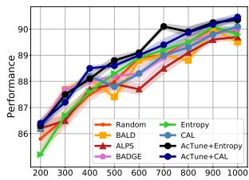  
(a) SST-2, AL

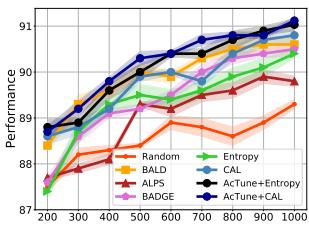  
(b) AG News, AL

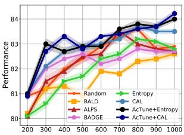

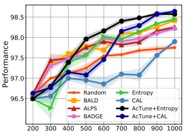

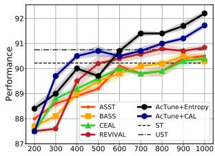

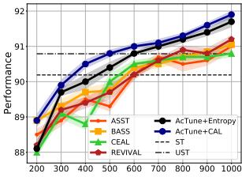  
(e) SST-2, SSAL  
(f) AG News, SSAL

(d) DBPedia, AL  
(c) Pubmed, AL  
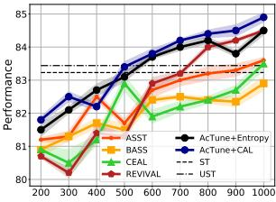  
(g) Pubmed, SSAL

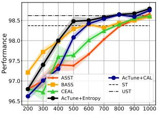  
(h) DBPedia, SSAL†

Figure 1: The comparision of ACTUNE with active learning, semi-supervised active learning and self-training baselines. The first row is the result under active learning setting (AL, i.e. no unlabeled data is used), the second row is the result under semi-supervised active learning (SSAL) setting. The metric is accuracy. †: REVIVAL causes OOM error for DBPedia dataset.  
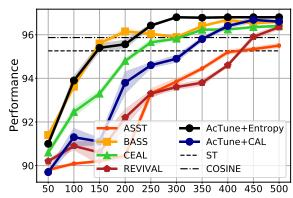

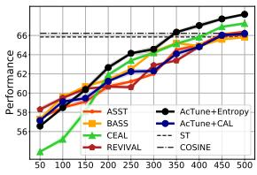  
(b) Chemprot

(a) TREC  
Figure 2: The comparison of ACTUNE and baselines on weakly-supervised classification tasks.  
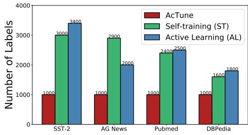  
Figure 3: The label-efficiency of ACTUNE compared with AL and self-training baselines. According to Fig. 1, the best AL method is Entropy for DBPedia and CAL for others.

## 3.5 Ablation and Hyperparameter Study

The Effect of Different Components in AC-TUNE. We inspect different components of ACTUNE, including the region-sampling (RS), momentum-based memory bank (MMB), and weighted clustering (WClus)7. Experimental results (Fig. 5(b)) shows that all the three components contribute to the final performance, as removing any of them hurts the classification accuracy. Also, we find that when removing MMB, the performance hurts most in the beginning rounds, which indicates that MMB effectively suppresses label noise when the model’s capacity is weak. Conversely, removing WClus hurts the performance on later rounds, as it enables the model to select most informative samples.

Hyperparameter Study. We study two hyperparameters, namely β and K used in querying labels. Figure 4(a) and 4(b) show the results. In general, the model is insensitive to β as the performance difference is less than 0.6%. The model cannot perform well with smaller K since it cannot pinpoint to high-uncertainty regions. For larger K, the performance also drops as some of the high-uncertainty regions can be outliers and sampling from them would hurt the model performance (Karamcheti et al., 2021).

A Closer Look at the Momentum-based Memory Bank. To examine the role of MMB, we show the overall accuracy of pseudo-labels on AG News dataset in Fig. 4(c). From the result, it is clear that the momentum-based memory bank can stabilize the active self-training process, as the accuracy of pseudo labels increases around 1%, especially in later rounds. Fig 4(d) and 4(e) illustrates the model performance with different $m _ { L }$ and $m _ { H } .$ . Overall, we find that our model is robust to different choices as ACTUNE outperform the baseline without momentum update consistently. Moreover, we find that the larger $m _ { H }$ will generally lead to better performance in later rounds. This is mainly because in later rounds, the model’s prediction is more reliable. Conversely, at the beginning of the training, the model’s prediction might be oscillating on unlabeled data. In this case, using a smaller mL will favor samples with consistent predictions to improve the robustness of active self-training.

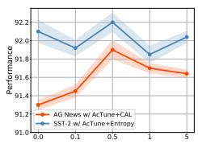  
(a) Effect of β

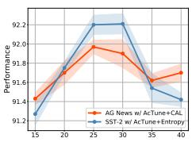  
(b) Effect of K

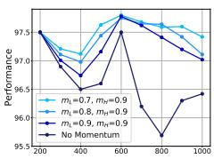  
(c) Acc. of PL

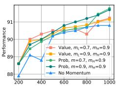  
(d) Entropy

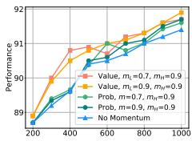  
(e) CAL

Figure 4: Parameter study. Note the effect of different $m _ { L }$ and $m _ { H }$ is conducted on AG News dataset.  
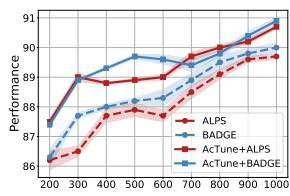

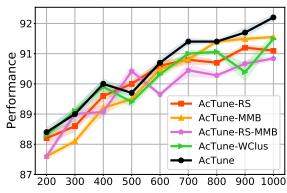  
(a) Combining w/ AL Methods  
(b) Ablation Study  
Figure 5: Results of ACTUNE with different AL methods (SST-2), ablation study (SST-2 with AC-TUNE+Entropy).

Another finding is that for different AL methods, the optimal memory bank can be different. For Entropy, probability-based memory bank leads to a better result, while for CAL, simple aggregating over uncertainty score achieves better performance. This is mainly because the method used in CAL is more complicated, and using probability-based memory bank may hurt the uncertainty calculation.

## 3.6 Case Study

We give an example of our querying strategy on AG News dataset for the 1st round of active selftraining process in figure 6. Note that we use t-SNE algorithm (Van der Maaten and Hinton, 2008) for dimension reduction, and the black triangle stands for the queried samples while other circles stands for the unlabeled data. We can see that the existing uncertainty-based methods such as Entropy and CAL, are suffered from the issue of limited diversity. However, when combined with ACTUNE, the diversity is much improved. Such results, compared with the main results in figure 1, demonstrate the efficacy of ACTUNE empirically.

## 4 Related Work

Active Learning. Active learning has been widely applied to various NLP tasks (Yuan et al., 2020; Shelmanov et al., 2021; Karamcheti et al., 2021). So far, AL methods can be categorized into uncertainty-based methods (Gal et al., 2017; Margatina et al., 2021a,b), diversity-based methods (Ru et al., 2020; Sener and Savarese, 2018) and hybrid methods (Yuan et al., 2020; Ash et al., 2020). Ein-Dor et al. (2020) offer an empirical study of active learning with PLMs. Very recently, there are also several works attempted to query labeling functions for weakly-supervised learning (Boecking et al., 2020; Hsieh et al., 2022; Zhang et al., 2022b). In our study, we leverage the power of unlabeled instances via self-training to further promote the performance of AL.

Semi-supervised Active Learning (SSAL). Gao et al. (2020); Guo et al. (2021) design query strategies for specific semi-supervised methods, Zhang et al. (2020a); Jiang et al. (2020) combine active learning with data augmentation and Tomanek and Hahn (2009); Rottmann et al. (2018); Siméoni et al. (2020) exploit the most-certain samples from the unlabeled with pseudo-labeling to augment the training set. So far, most of the SSAL approaches are designed for CV domain and it remains unknown how this paradigm performs with PLMs on NLP tasks. In contrast, we propose ACTUNE to effectively leverage unlabeled data during finetuing PLMs for NLP tasks.

Self-training. Self-training is one of the earliest and simplest approaches to semi-supervised learning (Lee, 2013). It first generates pseudo labels for high-confidence samples, then fits a new model on pseudo labeled data to improve the generalization ability. However, it is known to be vulnerable to error propagation (Arazo et al., 2020; Rizve et al., 2021; Zuo et al., 2021). To alleviate this, we adopt a simple momentum-based method to select high confidence samples, effectively reducing the pseudo labels noise for active learning. Note that although Mukherjee and Awadallah (2020); Rizve et al. (2021) also leverage uncertainty information for self-training, their focus is on developing better self-training methods, while we aim to jointly query high-uncertainty samples and generate pseudo-labels for low-uncertainty samples. The experiments in Sec. 3 show that with appropriate querying methods, ACTUNE can further improve the performance of self-training.

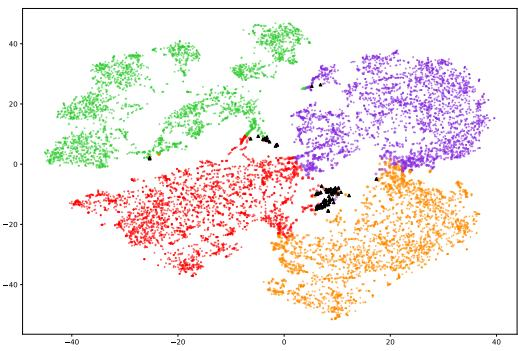  
(a) AG News, Entropy

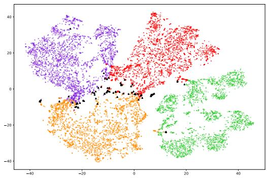  
(b) AG News, ACTUNE w/ Entropy

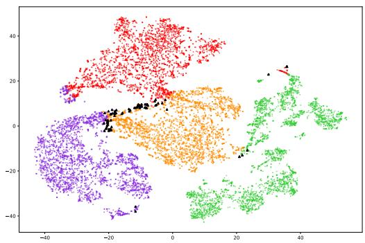  
(c) AG News, CAL

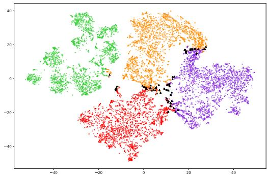  
(d) AG News, ACTUNE w/ CAL  
Figure 6: Visualization of the querying strategy of ACTUNE. Black dots stand for the queried data points. Different colors indicates different categories.

## 5 Conclusion and Discussion

In this paper, we develop ACTUNE, a general active self-training framework for enhancing both label efficiency and model performance in fine-tuning pre-trained language models (PLMs). We propose a region-aware sampling approach to guarantee both the uncertainty the diversity for querying labels. To combat the label noise propagation issue, we design a momentum-based memory bank to effectively utilize the model predictions for preceding AL rounds. Empirical results on 6 public text classification benchmarks suggest the superiority of ACTUNE to conventional active learning and semi-supervised active learning methods for fine-tuning PLMs with limited resources.

There are several directions to improve ACTUNE. First, since our focus is on fine-tuning pre-trained language models, we use the representation of [CLS] token for classification. In the future work, we can consider using prompt tuning (Gao et al., 2021; Schick and Schütze, 2021), a more dataefficient method for adopting pre-trained language models on classification tasks to further promote the efficiency. Also, due to the computational resource constraints, we do not use larger pre-trained language models such as RoBERTa-large (Liu et al., 2019) which shown even better performance with only a few labels (Du et al., 2021). Moreover, we can explore more advanced uncertainty estimation approach (Kong et al., 2020) into ACTUNE to further improve the performance. Last, apart from the text classification task, we can also extend our work into other tasks such as sequence labeling and natural language inference (NLI).

## Acknowledgements

We thank the anonymous reviewers for their feedback. This work was supported in part by NSF IIS-2008334, IIS-2106961, CAREER IIS-2144338, and ONR MURI N00014-17-1-2656.

## References

Eric Arazo, Diego Ortego, Paul Albert, Noel E O’Connor, and Kevin McGuinness. 2020. Pseudolabeling and confirmation bias in deep semisupervised learning. In 2020 International Joint Conference on Neural Networks (IJCNN), pages 1–8. IEEE.

David Arthur and Sergei Vassilvitskii. 2007. Kmeans++: The advantages of careful seeding. In Proceedings of the Eighteenth Annual ACM-SIAM Symposium on Discrete Algorithms, page 1027–1035, USA.

Jordan T. Ash, Chicheng Zhang, Akshay Krishnamurthy, John Langford, and Alekh Agarwal. 2020. Deep batch active learning by diverse, uncertain gradient lower bounds. In International Conference on Learning Representations.

Trapit Bansal, Rishikesh Jha, Tsendsuren Munkhdalai, and Andrew McCallum. 2020. Self-supervised meta-learning for few-shot natural language classification tasks. In Proceedings ofthe 2020 Conference on Empirical Methods in Natural Language Processing (EMNLP), pages 522–534, Online. Association for Computational Linguistics.

Iz Beltagy, Kyle Lo, and Arman Cohan. 2019. SciB-ERT: A pretrained language model for scientific text. In Proceedings ofthe 2019 Conference on Empirical Methods in Natural Language Processing and the 9th International Joint Conference on Natural Language Processing (EMNLP-IJCNLP), pages 3615– 3620.

Benedikt Boecking, Willie Neiswanger, Eric Xing, and Artur Dubrawski. 2020. Interactive weak supervision: Learning useful heuristics for data labeling. arXiv preprint arXiv:2012.06046.

Jonathan Bragg, Arman Cohan, Kyle Lo, and Iz Beltagy. 2021. Flex: Unifying evaluation for few-shot nlp. Advances in Neural Information Processing Systems, 34.

Tom Brown, Benjamin Mann, Nick Ryder, Melanie Subbiah, Jared D Kaplan, Prafulla Dhariwal, Arvind Neelakantan, et al. 2020. Language models are fewshot learners. In Advances in Neural Information Processing Systems, volume 33, pages 1877–1901.

Franck Dernoncourt and Ji Young Lee. 2017. PubMed 200k RCT: a dataset for sequential sentence classification in medical abstracts. In Proceedings of the Eighth International Joint Conference on Natural Language Processing (Volume 2: Short Papers), pages 308–313, Taipei, Taiwan. Asian Federation of Natural Language Processing.

Jacob Devlin, Ming-Wei Chang, Kenton Lee, and Kristina Toutanova. 2019. BERT: Pre-training of deep bidirectional transformers for language understanding. In Proceedings of the 2019 Conference of the North American Chapter of the Association

for Computational Linguistics: Human Language Technologies, Volume 1 (Long and Short Papers), pages 4171–4186, Minneapolis, Minnesota. Association for Computational Linguistics.

Jesse Dodge, Gabriel Ilharco, Roy Schwartz, Ali Farhadi, Hannaneh Hajishirzi, and Noah A. Smith. 2020. Fine-tuning pretrained language models: Weight initializations, data orders, and early stopping. CoRR, abs/2002.06305.

Rotem Dror, Gili Baumer, Segev Shlomov, and Roi Reichart. 2018. The hitchhiker’s guide to testing statistical significance in natural language processing. In Proceedings of the 56th Annual Meeting of the Association for Computational Linguistics (Volume 1: Long Papers), pages 1383–1392.

Jingfei Du, Edouard Grave, Beliz Gunel, Vishrav Chaudhary, Onur Celebi, Michael Auli, Veselin Stoyanov, and Alexis Conneau. 2021. Self-training improves pre-training for natural language understanding. In Proceedings of the 2021 Conference of the North American Chapter of the Association for Computational Linguistics: Human Language Technologies, pages 5408–5418. Association for Computational Linguistics.

Liat Ein-Dor, Alon Halfon, Ariel Gera, Eyal Shnarch, Lena Dankin, Leshem Choshen, Marina Danilevsky, Ranit Aharonov, Yoav Katz, and Noam Slonim. 2020. Active Learning for BERT: An Empirical Study. In Proceedings of the 2020 Conference on Empirical Methods in Natural Language Processing (EMNLP), pages 7949–7962. Association for Computational Linguistics.

Yarin Gal and Zoubin Ghahramani. 2015. Bayesian convolutional neural networks with bernoulli approximate variational inference. CoRR, abs/1506.02158.

Yarin Gal, Riashat Islam, and Zoubin Ghahramani. 2017. Deep bayesian active learning with image data. In International Conference on Machine Learning, pages 1183–1192. PMLR.

Mingfei Gao, Zizhao Zhang, Guo Yu, Sercan Ö Arık, Larry S Davis, and Tomas Pfister. 2020. Consistency-based semi-supervised active learning: Towards minimizing labeling cost. In European Conference on Computer Vision, pages 510–526. Springer.

Tianyu Gao, Adam Fisch, and Danqi Chen. 2021. Making pre-trained language models better few-shot learners. In Proceedings of the 59th Annual Meeting ofthe Associationfor Computational Linguistics and the 11th International Joint Conference on Natural Language Processing (Volume 1: Long Papers), pages 3816–3830, Online. Association for Computational Linguistics.

Jiannan Guo, Haochen Shi, Yangyang Kang, Kun Kuang, Siliang Tang, Zhuoren Jiang, Changlong

Sun, Fei Wu, and Yueting Zhuang. 2021. Semisupervised active learning for semi-supervised models: Exploit adversarial examples with graph-based virtual labels. In Proceedings of the IEEE/CVF International Conference on Computer Vision (ICCV), pages 2896–2905.

Kaiming He, Haoqi Fan, Yuxin Wu, Saining Xie, and Ross Girshick. 2020. Momentum contrast for unsupervised visual representation learning. In Proceedings of the IEEE/CVF Conference on Computer Vision and Pattern Recognition (CVPR).

Alex Holub, Pietro Perona, and Michael C Burl. 2008. Entropy-based active learning for object recognition. In 2008 IEEE Computer Society Conference on Computer Vision and Pattern Recognition Workshops, pages 1–8. IEEE.

Cheng-Yu Hsieh, Jieyu Zhang, and Alexander Ratner. 2022. Nemo: Guiding and contextualizing weak supervision for interactive data programming. arXiv preprint arXiv:2203.01382.

Peiyun Hu, Zack Lipton, Anima Anandkumar, and Deva Ramanan. 2019. Active learning with partial feedback. In International Conference on Learning Representations.

Joshua Zhexue Huang, Michael K Ng, Hongqiang Rong, and Zichen Li. 2005. Automated variable weighting in k-means type clustering. IEEE transactions on pattern analysis and machine intelligence, 27(5):657–668.

Zhuoren Jiang, Zhe Gao, Yu Duan, Yangyang Kang, Changlong Sun, Qiong Zhang, and Xiaozhong Liu. 2020. Camouflaged Chinese spam content detection with semi-supervised generative active learning. In Proceedings ofthe 58th Annual Meeting ofthe Association for Computational Linguistics, pages 3080– 3085, Online. Association for Computational Linguistics.

Katharina Kann, Kyunghyun Cho, and Samuel R. Bowman. 2019. Towards realistic practices in lowresource natural language processing: The development set. In Proceedings ofthe 2019 Conference on Empirical Methods in Natural Language Processing and the 9th International Joint Conference on Natu ral Language Processing (EMNLP-IJCNLP), pages 3342–3349, Hong Kong, China. Association for Computational Linguistics.

Siddharth Karamcheti, Ranjay Krishna, Li Fei-Fei, and Christopher Manning. 2021. Mind your outliers! investigating the negative impact of outliers on active learning for visual question answering. In Proceedings of the 59th Annual Meeting of the Association for Computational Linguistics and the 11th International Joint Conference on Natural Language Processing (Volume 1: Long Papers), pages 7265–7281, Online. Association for Computational Linguistics.

Lingkai Kong, Jimeng Sun, and Chao Zhang. 2020. Sde-net: Equipping deep neural networks with uncertainty estimates. In International Conference on Machine Learning, pages 5405–5415. PMLR.

Martin Krallinger, Obdulia Rabal, Saber A Akhondi, et al. 2017. Overview of the biocreative VI chemical-protein interaction track. In BioCreative evaluation Workshop, volume 1, pages 141–146.

Samuli Laine and Timo Aila. 2016. Temporal ensembling for semi-supervised learning. arXiv preprint arXiv:1610.02242.

Dong-Hyun Lee. 2013. Pseudo-label: The simple and efficient semi-supervised learning method for deep neural networks. In ICML Workshop on challenges in representation learning, volume 3, page 896.

Xin Li and Dan Roth. 2002. Learning question classifiers. In The 19th International Conference on Computational Linguistics.

Chen Liang, Yue Yu, Haoming Jiang, Siawpeng Er, Ruijia Wang, Tuo Zhao, and Chao Zhang. 2020. Bond: Bert-assisted open-domain named entity recognition with distant supervision. In Proceedings of the 26th ACM SIGKDD International Conference on Knowledge Discovery & Data Mining, pages 1054–1064.

Yinhan Liu, Myle Ott, Naman Goyal, Jingfei Du, Mandar Joshi, Danqi Chen, Omer Levy, Mike Lewis, Luke Zettlemoyer, and Veselin Stoyanov. 2019. Roberta: A robustly optimized bert pretraining approach. arXiv preprint arXiv:1907.11692.

Katerina Margatina, Loic Barrault, and Nikolaos Aletras. 2021a. Bayesian active learning with pretrained language models. arXiv preprint arXiv:2104.08320.

Katerina Margatina, Giorgos Vernikos, Loïc Barrault, and Nikolaos Aletras. 2021b. Active learning by acquiring contrastive examples. In Proceedings of the 2021 Conference on Empirical Methods in Natural Language Processing, pages 650–663, Online and Punta Cana, Dominican Republic. Association for Computational Linguistics.

Marius Mosbach, Maksym Andriushchenko, and Dietrich Klakow. 2021. On the stability of fine-tuning {bert}: Misconceptions, explanations, and strong baselines. In International Conference on Learning Representations.

Subhabrata Mukherjee and Ahmed Awadallah. 2020. Uncertainty-aware self-training for few-shot text classification. Advances in Neural Information Processing Systems, 33.

Alexander Ratner, Stephen H Bach, Henry Ehrenberg, Jason Fries, Sen Wu, and Christopher Ré. 2017. Snorkel: Rapid training data creation with weak supervision. In Proceedings of the VLDB Endowment., volume 11, page 269.

Mamshad Nayeem Rizve, Kevin Duarte, Yogesh S Rawat, and Mubarak Shah. 2021. In defense of pseudo-labeling: An uncertainty-aware pseudolabel selection framework for semi-supervised learning. In International Conference on Learning Representations.

Matthias Rottmann, Karsten Kahl, and Hanno Gottschalk. 2018. Deep bayesian active semisupervised learning. In 2018 17th IEEE International Conference on Machine Learning and Applications (ICMLA), pages 158–164. IEEE.

Dongyu Ru, Jiangtao Feng, Lin Qiu, Hao Zhou, Mingxuan Wang, Weinan Zhang, Yong Yu, and Lei Li. 2020. Active sentence learning by adversarial uncertainty sampling in discrete space. In Findings of the Association for Computational Linguistics: EMNLP 2020, pages 4908–4917, Online. Association for Computational Linguistics.

Timo Schick and Hinrich Schütze. 2021. Exploiting cloze-questions for few-shot text classification and natural language inference. In Proceedings of the 16th Conference of the European Chapter of the Association for Computational Linguistics: Main Volume, pages 255–269, Online. Association for Computational Linguistics.

Ozan Sener and Silvio Savarese. 2018. Active learning for convolutional neural networks: A core-set approach. In International Conference on Learning Representations.

Artem Shelmanov, Dmitri Puzyrev, Lyubov Kupriyanova, Denis Belyakov, Daniil Larionov, Nikita Khromov, Olga Kozlova, Ekaterina Artemova, Dmitry V. Dylov, and Alexander Panchenko. 2021. Active learning for sequence tagging with deep pre-trained models and Bayesian uncertainty estimates. In Proceedings of the 16th Conference of the European Chapter of the Association for Computational Linguistics: Main Volume, pages 1698–1712, Online. Association for Computational Linguistics.

Oriane Siméoni, Mateusz Budnik, Yannis Avrithis, and Guillaume Gravier. 2020. Rethinking deep active learning: Using unlabeled data at model training. In the 25th International Conference on Pattern Recognition (ICPR), pages 1220–1227. IEEE.

Richard Socher, Alex Perelygin, Jean Wu, Jason Chuang, Christopher D. Manning, Andrew Ng, and Christopher Potts. 2013. Recursive deep models for semantic compositionality over a sentiment treebank. In Proceedings of the 2013 Conference on Empirical Methods in Natural Language Processing, pages 1631–1642. Association for Computational Linguistics.

Katrin Tomanek and Udo Hahn. 2009. Semisupervised active learning for sequence labeling. In Proceedings of the Joint Conference of the 47th Annual Meeting of the ACL and the 4th International

Joint Conference on Natural Language Processing ofthe AFNLP, pages 1039–1047.

Laurens Van der Maaten and Geoffrey Hinton. 2008. Visualizing data using t-sne. Journal of machine learning research, 9(11).

Keze Wang, Dongyu Zhang, Ya Li, Ruimao Zhang, and Liang Lin. 2016. Cost-effective active learning for deep image classification. IEEE Transactions on Circuits and Systems for Video Technology, 27(12):2591–2600.

Thomas Wolf, Lysandre Debut, Victor Sanh, Julien Chaumond, Clement Delangue, Anthony Moi, Pierric Cistac, Tim Rault, Remi Louf, Morgan Funtowicz, and Others. 2020. Transformers: State-of-theart natural language processing. In Proceedings of the 2020 Conference on Empirical Methods in Natural Language Processing: System Demonstrations, pages 38–45, Online. Association for Computational Linguistics.

Qizhe Xie, Zihang Dai, Eduard Hovy, Thang Luong, and Quoc Le. 2020. Unsupervised data augmentation for consistency training. Advances in Neural Information Processing Systems, 33.

Yue Yu, Simiao Zuo, Haoming Jiang, Wendi Ren, Tuo Zhao, and Chao Zhang. 2021. Fine-tuning pretrained language model with weak supervision: A contrastive-regularized self-training approach. In Proceedings of the 2021 Conference of the North American Chapter of the Association for Computational Linguistics: Human Language Technologies, pages 1063–1077. Association for Computational Linguistics.

Michelle Yuan, Hsuan-Tien Lin, and Jordan Boyd-Graber. 2020. Cold-start active learning through self-supervised language modeling. In Proceedings of the 2020 Conference on Empirical Methods in Natural Language Processing (EMNLP), pages 7935–7948, Online. Association for Computational Linguistics.

Jieyu Zhang, Cheng-Yu Hsieh, Yue Yu, Chao Zhang, and Alexander Ratner. 2022a. A survey on programmatic weak supervision. arXiv preprint arXiv:2202.05433.

Jieyu Zhang, Yue Yu, Yinghao Li, Yujing Wang, Yaming Yang, Mao Yang, and Alexander Ratner. 2021. WRENCH: A comprehensive benchmark for weak supervision. In Thirty-fifth Conference on Neural Information Processing Systems Datasets and Benchmarks Track.

Rongzhi Zhang, Yue Yu, Pranav Shetty, Le Song, and Chao Zhang. 2022b. Prboost: Promptbased rule discovery and boosting for interactive weakly-supervised learning. arXiv preprint arXiv:2203.09735.

Rongzhi Zhang, Yue Yu, and Chao Zhang. 2020a. SeqMix: Augmenting active sequence labeling via sequence mixup. In Proceedings of the 2020 Conference on Empirical Methods in Natural Language Processing (EMNLP), pages 8566–8579, Online. Association for Computational Linguistics.

Tianyi Zhang, Felix Wu, Arzoo Katiyar, Kilian Q Weinberger, and Yoav Artzi. 2020b. Revisiting few-sample bert fine-tuning. arXiv preprint arXiv:2006.05987.

Xiang Zhang, Junbo Zhao, and Yann LeCun. 2015. Character-level convolutional networks for text classification. Advances in neural information processing systems, 28:649–657.

Simiao Zuo, Yue Yu, Chen Liang, Haoming Jiang, Siawpeng Er, Chao Zhang, Tuo Zhao, and Hongyuan Zha. 2021. Self-training with differentiable teacher. arXiv preprint arXiv:2109.07049.

## A Datasets Details

## A.1 Data Source

The seven benchmarks in our experiments are all publicly available. Below are the links to downloadable versions of these datasets.

SST-2: We use the datasets from $\mathtt { h t t p s : } / \nearrow$ huggingface.co/datasets/glue.

AGNews: We use the datasets from https:// huggingface.co/datasets/ag\_news.

Pubmed-RCT: Dataset is available at https: //github.com/Franck-Dernoncourt/ pubmed-rct.

◇ DBPedia: Dataset is available at https://huggingface.co/datasets/ dbpedia\_14.

For two weakly-supervised classification tasks, we use the data from WRENCH benchmark (Zhang et al., 2021).

◇ TREC: Dataset is available at https: //drive.google.com/drive/u/1/ folders/1v55IKG2JN9fMtKJWU48B\_5\_ DcPWGnpTq.

◇ ChemProt: The raw dataset is available at http://www.cbs.dtu.dk/ services/ChemProt/ChemProt-2.0/. The preprocessed dataset is available at https://drive.google.com/drive/u/ 1/folders/1v55IKG2JN9fMtKJWU48B\_ 5\_DcPWGnpTq.

## A.2 Train/Test Split

For all the datasets, we use the original train/dev/test split from the web. To keep the size of the development set small, we randomly sample 1000 data for SST-2, AGNews, Pubmed-RCT, DB-Pedia and randomly sample 500 samples for TREC, ChemProt.

## B Details on Implementation and Experiment Setups

## B.1 Computing Infrastructure

System: Ubuntu 18.04.3 LTS; Python 3.6; Pytorch 1.6.

CPU: Intel(R) Core(TM) i7-5930K CPU @3.50GHz.

GPU: NVIDIA 2080Ti.

## B.2 Number of Parameters

ACTUNE and all baselines use Roberta-base (Liu et al., 2019) with a task-specific classification head on the top as the backbone, which contains 125M trainable parameters. We do not introduce any other parameters in our experiments.

## B.3 Experiment Setups

Following (Ein-Dor et al., 2020; Yuan et al., 2020; Margatina et al., 2021b), all of our methods and baselines are run with 3 different random seed and the result is based on the average performance on them. This indeed creates 4 (the number of datasets) 3 (the number of random seeds) 11 (the number of methods) 10 (the number of fine-tuning rounds in $\mathbf { A L } ) = 1 3 2 0$ experiments for fine-tuning PLMs, which is almost the limit of our computational resources, not to mention additional experiments on weakly-supervised text classification as well as different hyper-parameter tuning. We have show both the mean and the standard deviation of the performance in our experiment sections. All the results have passed a paired t-test with $p < 0 . 0 5$ (Dror et al., 2018).

## B.4 Hyper-parameters for General Experiments

We use AdamW as the optimizer, and the learning rate is chosen from $1 \times 1 0 ^ { - 5 } , 2 \times 1 0 ^ { - 5 } \}$ . A linear learning rate decay schedule with warm-up 0.1 is used, and the number of training epochs is 15 for fine-tuning. For active self-training & SSAL baselines, we tune the model with 2000 steps, and evaluate the performance on the development set in every 50 steps. Finally, we use the model with best performance on the development set for testing.

## B.5 Hyper-parameters for ACTUNE

Although ACTUNE introduces several hyperparameters including K, M, mL, mH, β, γ, λ, most of them are keep fixed during our experiments, thus it does not require heavy hyper-parameter tuning. All results are reported as the average over three runs.

In our experiments, we keep $\beta = 0 . 5 , \lambda = 1$ for all datasets. For other parameters, we use a grid search to find the optimal setting for each datasets. Specifically, we search γ from [0.5, 0.6, 0.7], mL from [0.6, 0.7, 0.8], mH from [0.8, 0.9, 1]. For AC-TUNE with Entropy, we use probability based aggregation and for ACTUNE with CAL, we use value

<table><tr><td rowspan=1 colspan=1>Hyper-parameter</td><td rowspan=1 colspan=2>SST-2 AG Newss |</td><td rowspan=1 colspan=1>Pubmed</td><td rowspan=1 colspan=1>DBPedia</td><td rowspan=1 colspan=1>TREC</td><td rowspan=1 colspan=1>Chemprot</td></tr><tr><td rowspan=1 colspan=1>Dropout Ratio</td><td rowspan=1 colspan=6>0.1</td></tr><tr><td rowspan=1 colspan=1>Maximum Tokens</td><td rowspan=1 colspan=1>32</td><td rowspan=1 colspan=1>96</td><td rowspan=1 colspan=1>96</td><td rowspan=1 colspan=1>64</td><td rowspan=1 colspan=1>64</td><td rowspan=1 colspan=1>128</td></tr><tr><td rowspan=1 colspan=1>Batch Size for $\overline { { \mathcal { X } _ { l } } }$ </td><td rowspan=1 colspan=6>8</td></tr><tr><td rowspan=1 colspan=1>Batch Size for $\mathcal { X } _ { u }$ in Self-training</td><td rowspan=1 colspan=1>32</td><td rowspan=1 colspan=1>48</td><td rowspan=1 colspan=1>48</td><td rowspan=1 colspan=1>32</td><td rowspan=1 colspan=1>16</td><td rowspan=1 colspan=1>24</td></tr><tr><td rowspan=1 colspan=1>Weight Decay</td><td rowspan=1 colspan=6>10-8</td></tr><tr><td rowspan=1 colspan=1>Learning Rate</td><td rowspan=1 colspan=6> $2 \times 1 0 ^ { - 5 }$ </td></tr><tr><td rowspan=1 colspan=1>β</td><td rowspan=1 colspan=6>0.5</td></tr><tr><td rowspan=1 colspan=1>M</td><td rowspan=1 colspan=1>25</td><td rowspan=1 colspan=1>30</td><td rowspan=1 colspan=1>30</td><td rowspan=1 colspan=1>40</td><td rowspan=1 colspan=1>40</td><td rowspan=1 colspan=1>40</td></tr><tr><td rowspan=1 colspan=1>K</td><td rowspan=1 colspan=1>5</td><td rowspan=1 colspan=5>10</td></tr><tr><td rowspan=1 colspan=1>γ</td><td rowspan=1 colspan=1>0.7</td><td rowspan=1 colspan=5>0.6</td></tr><tr><td rowspan=1 colspan=1>mL</td><td rowspan=1 colspan=1>0.8</td><td rowspan=1 colspan=1>0.9</td><td rowspan=1 colspan=1>0.7</td><td rowspan=1 colspan=1>0.8</td><td rowspan=1 colspan=1>0.8</td><td rowspan=1 colspan=1>0.8</td></tr><tr><td rowspan=1 colspan=1>mH</td><td rowspan=1 colspan=1>0.9</td><td rowspan=1 colspan=1>0.9</td><td rowspan=1 colspan=1>0.8</td><td rowspan=1 colspan=1>0.9</td><td rowspan=1 colspan=1>0.9</td><td rowspan=1 colspan=1>1.0</td></tr><tr><td rowspan=1 colspan=1>λ</td><td rowspan=1 colspan=6>1</td></tr></table>

Table 2: Hyper-parameter configurations. Note that we only keep certain number of tokens.

<table><tr><td rowspan=2 colspan=1>Method</td><td rowspan=1 colspan=2>Dataset</td></tr><tr><td rowspan=1 colspan=1>Pubmed</td><td rowspan=1 colspan=1>DBPedia</td></tr><tr><td rowspan=1 colspan=1>Finetune (Random)</td><td rowspan=1 colspan=1>&lt;0.1s</td><td rowspan=1 colspan=1>&lt;0.1s</td></tr><tr><td rowspan=1 colspan=1>Entropy (Holub et al., 2008)</td><td rowspan=1 colspan=1>461s</td><td rowspan=1 colspan=1>646s</td></tr><tr><td rowspan=1 colspan=1>BALD (Gal et al., 2017)</td><td rowspan=1 colspan=1>4595s</td><td rowspan=1 colspan=1>6451s</td></tr><tr><td rowspan=1 colspan=1>ALPS (Yuan et al., 2020)</td><td rowspan=1 colspan=1>488s</td><td rowspan=1 colspan=1>677s</td></tr><tr><td rowspan=1 colspan=1>BADGE (Ash et al., 2020)</td><td rowspan=1 colspan=1>554s</td><td rowspan=1 colspan=1>1140s</td></tr><tr><td rowspan=1 colspan=1>CAL (Margatina et al., 2021b)</td><td rowspan=1 colspan=1>493s</td><td rowspan=1 colspan=1>688s</td></tr><tr><td rowspan=1 colspan=1>REVIVAL (Guo et al., 2021)</td><td rowspan=1 colspan=1>3240s</td><td rowspan=1 colspan=1>OOM</td></tr><tr><td rowspan=1 colspan=1>ACTUNE + Entropy</td><td rowspan=1 colspan=1>477s</td><td rowspan=1 colspan=1>733s</td></tr><tr><td rowspan=1 colspan=1>w/ RS for Active Learning</td><td rowspan=1 colspan=1>15.8s</td><td rowspan=1 colspan=1>44.9s</td></tr><tr><td rowspan=1 colspan=1>w/ MMB for Self-training</td><td rowspan=1 colspan=1>0.12s</td><td rowspan=1 colspan=1>0.18s</td></tr><tr><td rowspan=1 colspan=1>ACTUNE + CAL</td><td rowspan=1 colspan=1>510s</td><td rowspan=1 colspan=1>735s</td></tr><tr><td rowspan=1 colspan=1>w/ RS for Active Learning</td><td rowspan=1 colspan=1>16.6s</td><td rowspan=1 colspan=1>46.4s</td></tr><tr><td rowspan=1 colspan=1>w/ MMB for Self-training</td><td rowspan=1 colspan=1>0.12s</td><td rowspan=1 colspan=1>0.18s</td></tr></table>

Table 3: The running time of different baselines. Note that for ASST, CEAL and BASS, they directly use existing active learning methods so we do not list the running time here.

millions of parameters8.

based aggregation by default.

## C Runtime Analysis

Table 3 shows the time in one active learning round of ACTUNE and baselines. Here we highlight that the additional time for region-aware sampling and momentum-based memory bank is rather small compared with the inference time. Also, we find that BALD and REVIVAL are not so efficient. For BALD, it needs to infer the uncertainty of the model by passing the data to model with multitple times. Such an operation will make the total inference time for PLMs very long. For REVIVAL, we find that calculating the adversarial gradient needs extra forward passes and backward passes, which could be time-consuming for PLMs with