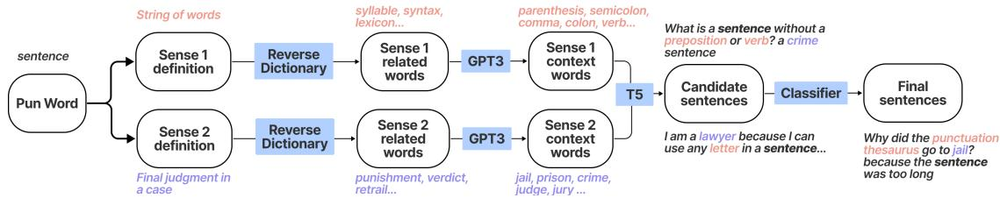
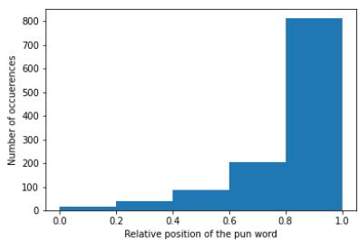

# AMBIPUN: Generating Puns with Ambiguous Context

Anirudh Mittal2∗ †, Yufei Tian1\*, Nanyun Peng1

1 Computer Science Department, University of California, Los Angeles, 2 Centre for Machine Intelligence and Data Science, Indian Institute of Technology Bombay anirudhmittal@cse.iitb.ac.in, {yufeit, violetpeng}@cs.ucla.edu

## Abstract

We propose a simple yet effective way to generate pun sentences that does not require any training on existing puns. Our approach is inspired by humor theories that ambiguity comes from the context rather than the pun word itself. Given a pair of definitions of a pun word,1 our model first produces a list of related concepts through a reverse dictionary to identify unambiguous words to represent the pun and the alternative senses. We then utilize one-shot GPT3 to generate context words and then generate puns incorporating context words from both senses. Human evaluation shows that our method successfully generates puns 52% of the time, outperforming well crafted baselines and the state-of-the-art models by a large margin.

## 1 Introduction

Computational humor has garnered interest in the NLP community (Petrovic and Matthews´ , 2013; Miller et al., 2017; Zou and Lu, 2019; Garimella et al., 2020; Yang et al., 2020). In this paper, we tackle the problem of generating homographic puns (Miller et al., 2017): two or more meanings of a word form an intended humorous effect. For example, the three puns listed in Figure 1 exploit two contrasting meanings of the word sentence: 1) a grammatical string of words and 2) the punishment by a court assigned to a guilty person.

Due to the lack of sizeable training data, existing approaches are heavy-weighted in order to not rely on pun sentences for training. For example, (Yu et al., 2018) train a constrained neural language model (Mou et al., 2015) from a general text corpus and then use a joint decoding algorithm to promote puns. He et al. (2019) propose a local-global surprisal principle, and Luo et al. (2019) leverage the Generative Adversarial Nets (Goodfellow et al.,

<table><tr><td rowspan=1 colspan=1>Sense 1Definition</td><td rowspan=1 colspan=1>a string of words that is complete in itself, typicallycontaining a subject and predicate</td></tr><tr><td rowspan=1 colspan=1>Sense 2Definition</td><td rowspan=1 colspan=1>(criminal law) a final judgment of guilty in acriminal case and the punishment that is imposed</td></tr><tr><td rowspan=1 colspan=1>Ours 1</td><td rowspan=1 colspan=1>The sentence isungrammatical. Thejurydidn&#x27;thear it.</td></tr><tr><td rowspan=1 colspan=1>Ours 2</td><td rowspan=1 colspan=1>I&#x27;m sorry Isaidthe sentence was too long butpunishmentsare endless.</td></tr><tr><td rowspan=1 colspan=1>Human</td><td rowspan=1 colspan=1>TheJudgehas got astutter. Looks like I am notgetting a sentence.</td></tr></table>

Figure 1: An illustration of homographic puns. The target pun word ‘sentence’ and the two sense definitions are given as input. To make the target word interpretable in both senses, we propose to include context words (highlighted in blue and pink) related to both senses.

2014) to encourage ambiguity of the outputs via reinforcement learning. We, on the other hand, propose a simple yet effective way to tackle this problem: encouraging ambiguity by incorporating context words related to each sense.

Inspired by humor theories (Attardo, 2010), we hypothesize that it is the contextual connections rather than the pun word itself that are crucial for the success of pun generation. For instance, in Figure 1 we observe that context related to both senses (e.g., ungrammatical and jury) appear in a punning sentence. Such observation is important as the error analysis of the SOTA model (Luo et al., 2019) shows that 46% of the outputs fail to be puns due to single word sense, and another 27% fail due to being too general, both of which can be resolved by introducing more context.

Specifically, given the two sense definitions of a target pun word, we first use a reverse dictionary to generate related words that are monosemous for both senses. This first step helps us circumvent the obstacle of processing pun words with the same written form. We then propose to use context words to link the contrasting senses and make our target pun word reasonable when interpreted in both definitions. We explore three different settings: extractive-based, similarity-based, and generative-based. Finally, we finetune the

  
Figure 2: Overview of the approach. We also give an example for pun word ‘sentence’ for each step. Figure 2: Overview of the approach. We also giv

T5 model (Raffel et al., 2020) on general nonhumorous texts to generate coherent sentences given the pun word and contexts words as input.

Our experimental results show that retrieve-andextract context words outperforms the giant fewshot GPT3 model in terms of generating funny pun sentences, although the latter has shown to be much more powerful in many sophisticated tasks (Brown et al., 2020). Our simple pipeline remarkably outperforms all of the more heavy-weighted approaches. Our code and data is available at https://github.com/PlusLabNLP/AmbiPun.

## 2 Methodology

Overview and Motivation Our input is the target pun word (p) and its two sense definitions (S1, S2), and the output is a list of humorous punning sentences. We implement the ambiguity principle proposed in (Kao et al., 2016): a pun sentence should contain one or more context words corresponding to each of the two senses.2 The overview of our approach is visualized in Figure 2.

Given S1 and S2, we first use a reverse dictionary to generate a list of words that semantically match the query descriptions. We call them related words (Section 2.1). However, those related words are synonyms of the pun word and are rarely observed as it is in humorous sentences. For example, for the sentence: “The Judge has got a stutter. Looks like I am not getting a sentence.”, The word representing the first sense (i.e. a final judgment of guilty in a criminal case) is represented by Judge, which could not be generated using the sense definition.

Considering such nuances, in Section 2.2 we propose three different methods to obtain the context words. They are extractive, similarity, and generative based. Finally, in Section 2.3 and 2.4, we introduce a keyword-to-text generator to generate candidate sentences , and a humor classifier to rule out some of the non-pun sentences. Final sentences are then randomly sampled for evaluation. All our training data is general, non-humorous corpus except for the humor classifier.

## 2.1 Generating Related Words

We aim at differentiating the two senses of a polysemy by taking the related words, so that each sense will be represented by a set of monosemous words. To this end, we leverage the Reverse Dictionary (Qi et al., 2020; Zhang et al., 2020) which takes as input a description and generates multiple related words whose semantic meaning match the query description. For each sense definition, we generate five words.

## 2.2 Generating Context Words

For context words, we compare three different approaches. As an example, we compare the output of context words for the pun word ‘sentence’ in Table 5 in the appendix. Refinement of the context words is mentioned in section A.2 in the appendix. Method 1: Extractive (TF-IDF) For each related word, we retrieve sentences from the One Billion Word dataset containing that word and then extract keywords using RAKE (Rose et al., 2010) from the retrieved sentences. Based on this TF-IDF value, we choose the top 10 context words that are mostly likely to be used along with the related words and therefore the pun word.

Method 2: Similarity (Word2Vec) Inspired by the idea that “a word is characterized by the company it keeps”, we propose to get context words from word2vec. (Ghazvininejad et al., 2016) have also shown that the training corpus for word2vec plays a crucial role on the quality of generated context words. Hence, we train on Wikipedia which has a comprehensive coverage of diverse topics.

Method 3: Generative (Few-shot GPT3) For the generative version, we provide the powerful language model GPT3 (Brown et al., 2020) with two examples and generate context words. Details about the prompt can be found in section E of the appendix.

## 2.3 Candidate Sentence generation

After receiving context words for each sense, we generate humorous puns. We finetune a keywordto-sentence model using T5 (Raffel et al., 2020), as it is capable of handling text-to-text tasks. The prompt provides the pun word, and two context words from each of the two senses. For example for the word ‘sentence’, a possible prompt can be generate sentence: sentence, judge, trial, noun, comma. Moreover, we also investigate whether the position of the pun word will affect the quality of generated sentences. We insert the pun word in the first, third, and fifth place of the prompt. We discuss our findings in Section 5.

## 2.4 Humor Classification

Finally, we introduce a classification model to assist us in selecting (i.e., ranking) punning sentences. Since we do not have sizable training data for puns, we propose to train our classification model on humorous dataset in a distantly supervised fashion. Specifically, we train BERT-large (Devlin et al., 2018) on the ColBERT dataset (Annamoradnejad and Zoghi, 2020) that contains 200,000 jokes and non-jokes used for humor detection. We use the probability produced by the classification model to rank our candidate sentences.

Our error analysis in section Appendix.B shows that our classifier can successfully rule out the bad generations, i.e., non-puns, as puns are humorous by nature. However, the model is not great at choosing the best samples. Therefore, we use this classifier only to remove the bottom third candidates. We leave this for open future work to accurately pick out high-quality punning sentences instead of funny sentences.

## 3 Experiments

## 3.1 Datasets

Training: For the context word generation step, we use the One Billion word dataset (Chelba et al., 2013) to retrieve sentences for a given word and calculate TF-IDF values. This dataset contains roughly 0.8B words and is obtained from WMT 2011 News crawl data. For the humor classifier and candidate generation module, we use ColBERT dataset (Annamoradnejad and Zoghi, 2020). It contains 100k jokes and 100k non-jokes.

Evaluation dataset: Following other pun generation works, we use the SemEval 2017 Task 7 (Miller et al., 2017) for evaluation. The dataset contains 1,163 human written punning jokes with a total of 895 unique pun words. Each sentence has the target pun word, location of the pun word and the WordNet sense keys of the two senses.

<table><tr><td rowspan="2">Model</td><td rowspan="2">Avg Seq Len</td><td colspan="2">Corpus-Div</td><td colspan="2">Sentence-Div</td></tr><tr><td>Dist-1</td><td>Dist-2</td><td>Dist-1</td><td>Dist-2</td></tr><tr><td>Few-shot GPT3 Neural Pun Pun GAN</td><td>12.3 12.6 9.7</td><td>37.1 30.2 34.6</td><td>80.4 73.0 71.9</td><td>94.5 91.3 90.2</td><td>85.7 90.5 87.6</td></tr><tr><td>Sim AMBIPUN Gen AMBIPUN Ext AMBIPUN</td><td>13.4 13.5 14.0</td><td>32.4 32.8 31.7</td><td>77.1 77.8 78.7</td><td>92.9 93.6 96.3</td><td>91.2 91.2 92.3</td></tr><tr><td>Human</td><td>14.1</td><td>36.6</td><td>81.9</td><td>95.5</td><td>92.4</td></tr></table>

Table 1: Results of automatic evaluation on average sequence length, sentence-level and corpus-level diversity. Boldface denotes the best performance and underline denotes the second best performance among systems.
<table><tr><td>Model</td><td>Success Rate</td><td>Fun</td><td>Coherence</td></tr><tr><td>Few-shot GPT3</td><td>13.0%</td><td>1.82</td><td>3.77</td></tr><tr><td>Neural Pun</td><td>35.3%</td><td>2.17</td><td>3.21</td></tr><tr><td>Pun GAN</td><td>35.8%</td><td>2.28</td><td>2.97</td></tr><tr><td>Sim AMBIPUN</td><td>45.5%</td><td>2.69</td><td>3.38</td></tr><tr><td>Gen AMBIPUN</td><td>50.5%</td><td>2.94</td><td>3.53</td></tr><tr><td>Ext AMBIPUN</td><td>52.2%*</td><td>3.00*</td><td>3.48</td></tr><tr><td>Human</td><td>70.2%</td><td>3.43</td><td>3.66</td></tr></table>

Table 2: Human evaluation results on all the pun generation systems. We show the success rates, and average scores of funniness and coherence. Overall, Ext AM-BIPUN performs the best. The superiority of our model in terms of success rate and funniness is statistically significant over the best baseline and is marked by \*.

## 3.2 Baselines

Neural Pun Yu et al. (2018) propose the first neural approach to homographic puns based on a constrained beam search algorithm to jointly decode the two distinct senses of the same word.

Pun-GAN The SOTA introduced by Luo et al. (2019) that adopts the Generative Adversarial Net to generate homographic puns.

Few-shot GPT3 We generate puns with a few examples feeding into GPT3 davinci-instruct-beta, the most capable model in the GPT3 family for creative generation. We provide the target pun word and its two senses in our prompt, along with the instruction to generate puns.

Ablations of our own models We also compare three methods proposed by us to obtain the context words (described in Section 2.2). We call them Ext AMBIPUN, Sim AMBIPUN, and Gen AMBIPUN.

## 3.3 Evaluation

Automatic Evaluation We follow Luo et al. (2019); Yu et al. (2018) to calculate distinct unigram and bigrams as the diversity (Li et al., 2016) in terms of sentence level and corpus level. We also report the the average sentence length produced. Human Evaluation We randomly select 100 sentences and collected our human ratings on Amazon Mechanical Turk (AMT). For each sentence, three workers are explicitly given the target pun word and its two sense definitions provided by the Sem-Eval 2017 Task 7. We first ask them to judge if a given sentence is a successful pun sentence. Then, they are asked to rate the funniness and coherence on a scale from 1 (not at all) to 5 (extremely). Besides detailed instructions and explanation for each criteria, we also adopt attention questions and qualification types to rule out irresponsible workers. We conduct paired t-test for significance testing. The difference between our best performing model and the best baseline is significant.

<table><tr><td>Pun word Sense 1 Sense 2</td><td colspan="3">Irrational Real but not expressible as the quotient of two integers Not consistent with or using reason</td></tr><tr><td>Model</td><td>Example</td><td>Pun</td><td>Funny</td></tr><tr><td>GPT3 Neural Pun</td><td>I can&#x27;t make a decision with all this irrationality going on.</td><td>No Yes</td><td>1.4 2.4</td></tr><tr><td>Pun-GAN</td><td>Note that this means that there is an irrational problem. It can be use the irrational system.</td><td>No</td><td>1.2</td></tr><tr><td>Ext AMBIPUN</td><td>I have an irrational paranoja about mathematical integers</td><td>Yes</td><td>3.8</td></tr><tr><td>Gen AMBIPUN</td><td></td><td>Yes</td><td>3.4</td></tr><tr><td>Human</td><td>My calculator is unjust and illogic. It&#x27;s irrational.</td><td>Yes</td><td>3.8</td></tr><tr><td></td><td>Old math teachers never die, they just become irrational.</td><td></td><td></td></tr><tr><td>Pun word Sense 1</td><td colspan="3">Drive</td></tr><tr><td>Sense 2</td><td>A journey in a vehicle (usually an automobile) The trait of being highly motivated</td><td></td><td></td></tr><tr><td></td><td></td><td></td><td></td></tr><tr><td>Model</td><td>Example</td><td>Pun</td><td>Funny</td></tr><tr><td>GPT3</td><td>I am exhausted, I need a nap before I can drive any more.</td><td>No</td><td>2.0 1.6</td></tr><tr><td>Neural Pun</td><td>It is that it can be use to drive a variety of function?</td><td>No No</td><td>1.2</td></tr><tr><td>Pun-GAN</td><td>In he drive to the first three years. What do you call a geniuş with cunning drive? racecar driver.</td><td>Yes</td><td></td></tr><tr><td>Ext AMBIPUN</td><td></td><td>Yes</td><td>3.6</td></tr><tr><td>Gen AMBIPUN</td><td>I have the determination to travel to my destination. But i don&#x27;t have the drive.</td><td></td><td>4.0</td></tr><tr><td>Human</td><td>A boy saving up for a car has a lot of drive.</td><td>Yes</td><td>4.2</td></tr></table>

Table 3: Generated sentences for the word ‘Irrational’ and ‘Drive’and their sense definitions. We underline the context words that are related to each sense. All the generations are evaluated by external annotators, not the authors.

## 4 Results and Analysis

## 4.1 Pun Generation Results

Automatic Evaluation Results of the automatic evaluation can be seen in Table 1. The average sentence length of our model is closest to human and gets the highest sentence-level diversity. Although our baseline Pun-GAN and Few-shot GPT3 have higher distinct unigram ratios at the corpus level, that is because all baseline models generate one sentence per pun word, while AMBIPUN generates tens of sentences per pun word, which inevitably sacrifices topical diversity. Nevertheless, AMBIPUN achieves the highest corpus-level bi-gram diversity.

Human Evaluation Results from the automatic evaluation can be seen in Table 2. We evaluate the success rate, funniness, and coherence of the generated outputs. The superiority of our models are obvious. For significance testing, we conducted paired t-test, where our systems outperformed the best baseline in terms of success rate and funniness (p-value < 0.05). On the other hand, GPT3 could generate even more coherently than humans.

Analysis between extractive and generative method. Interestingly, the extractive method has higher success rates (p-value < 0.05) and is funnier (p-value < 0.07) than the generative method, indicating that extracting salient words from human written sentences could introduce more surprising and uncommon words than language models. We posit that those atypical words refresh people’s eyes and thus boost the pun success rate as well as the funniness score. On the other hand, we also tried to equip GPT3 with greater creatively by top-k sampling with a large temperature T. However, larger Ts also result in arbitrary responses that humans may find unreadable. We hope our discovery could draw the community’s attention to those traditional techniques for creative generation.

## 4.2 Case Study

To better understand the advantages of our method, we conduct a case study for the pun word “Irrational” and “Drive” in Table 3. For both target pun words, at most one of the baselines successfully generates a punning sentence. As discussed earlier, one possible reason is the absence of both senses. On the other hand, both Ext AMBIPUN and Sim AMBIPUN introduce context words for the two senses and thus are able to generate of high quality puns that almost match the human written puns in terms of the funniness score.

<table><tr><td></td><td>Success Rate</td></tr><tr><td>Beginning</td><td>46.7%</td></tr><tr><td>Middle</td><td>52.0%</td></tr><tr><td>End</td><td>54.7%</td></tr></table>

Table 4: The pun success rate sentences based on their position annotated by human.

## 5 The Position of Pun Words

As is mentioned in Section 2.3, we play with the position of the pun word in the prompt given to the candidate sentence generation model. We try three variants by putting the target pun word at the start, in the middle, and at the end. For each variant, we ask Mechanical Turkers to judge if the given sentences are puns. Again, each sentence is rated by three Turkers and we take the majority answer if the workers disagree. Results from this analysis can be seen in Table 4. We observe that people find a sentence more likely to be a pun when the target word appears at the end.

To verify such hypothesis, we also calculate the position of the pun words of 1,163 human written pun sentences from SemEval 2017 Task 7 and report the distribution in Figure 3 in the Appendix. The histogram corroborates with the human annotated samples in that both suggest that keeping the pun word at the end of the sentence generates funnier puns. Theory of humor which says that the "joke" in a funny sentences some towards the end of the sentence (Shahaf et al., 2015) validates our analysis.

## 6 Related Works

## 6.1 Creative Text Generation

Pun generation. Many of the previous works on pun generation have focused on phonological or syntactic pattern rather than semantic pattern (Miller and Gurevych, 2015; Hong and Ong, 2009; Petrovic and Matthews´ , 2013; Valitutti et al., 2013) thus lacking creativity and flexibility. He et al. (2019) make use of local-global surprisal principle to generate homophonic puns and Yu et al. (2020) uses constrained lexical rewriting for the same task. Hashimoto et al. (2018) use a retrieve and edit approach to generate homographic puns and Yu et al. (2018); Luo et al. (2019) propose complex neural model architecture such as constrained language model and GAN, and do not put emphasis on the linguistic structure of puns. We identify their absence of both the senses as a shortcoming and build our approach from there.

Humor generation. Humor generation still remains an unsolved problem, and is usually studied in a specific setting. Petrovic and Matthews ´ (2013) generates joke of the type ‘I like my X like I like my Y, Z’. Garimella et al. (2020) develops a model to fill blanks in madlibs format and Yang et al. (2020) edit headlines to make them funny. More research is required to generate humorous sentences that are not constrained by their semantic structure.

Figurative language generation. In addition to pun, there are many attempts to generate figurative language such as metaphor, simile (Chakrabarty et al., 2020b), sarcasm, etc. Yu and Wan (2019) use metaphorically used verbs to generate metaphors in an unsupervised fashion, while Chakrabarty et al. (2021); Stowe et al. (2021) generate metaphors using symbolism and discriminative and conceptual mapping. Mishra et al. (2019) propose a modular architecture for unsupervised sarcasm generation, and Chakrabarty et al. (2020a) use commonsense knowledge for the same task. Tian et al. (2021) on the other hand are the first leverage semantic structure and commonsense and counterfactual knowledge to generate hyperboles.

## 6.2 Pun detection

SemEval 2017 Task 7 (Miller et al., 2017) introduced the challenge of pun detection, location detection and sense interpretation for homographic and homophonic puns. Diao et al. (2019) make use of Gated Attention network to detection homophonic puns. Zou and Lu (2019) introduces a tagging schemes which lets them detect puns as well as their location. They apply this approach to both homophonic and homographic puns.

## 7 Conclusion

We propose a novel approach towards homographic puns generation. Unlike previous works that are mathematically heavy, our approach is backed by the humor theory that ambiguity is achieved by the context. Automatic and human evaluations show that our model AMBIPUN outperforms the current state-of-the-art model by a large margin.

## Acknowledgments

The authors would like to thank the members of PLUSLab and the anonymous reviewers for helpful comments. Yufei Tian is supported by an Amazon Fellowship.

## References

Issa Annamoradnejad and Gohar Zoghi. 2020. Colbert: Using bert sentence embedding for humor detection. arXiv preprint arXiv:2004.12765.

Salvatore Attardo. 2010. Linguistic Theories ofHumor. De Gruyter Mouton.

Pavel Braslavski, Vladislav Blinov, Valeria Bolotova, and Katya Pertsova. 2018. How to evaluate humorous response generation, seriously? In Proceedings ofthe 2018 Conference on Human Information Interaction & Retrieval, pages 225–228.

Tom B Brown, Benjamin Mann, Nick Ryder, Melanie Subbiah, Jared Kaplan, Prafulla Dhariwal, Arvind Neelakantan, Pranav Shyam, Girish Sastry, Amanda Askell, et al. 2020. Language models are few-shot learners. arXiv preprint arXiv:2005.14165.

Tuhin Chakrabarty, Debanjan Ghosh, Smaranda Muresan, and Nanyun Peng. 2020a. R3: Reverse, retrieve, and rank for sarcasm generation with commonsense knowledge. arXiv preprint arXiv:2004.13248.

Tuhin Chakrabarty, Smaranda Muresan, and Nanyun Peng. 2020b. Generating similes effortlessly like a pro: A style transfer approach for simile generation. arXiv preprint arXiv:2009.08942.

Tuhin Chakrabarty, Xurui Zhang, Smaranda Muresan, and Nanyun Peng. 2021. Mermaid: Metaphor generation with symbolism and discriminative decoding.

Ciprian Chelba, Tomas Mikolov, Mike Schuster, Qi Ge, Thorsten Brants, Phillipp Koehn, and Tony Robinson. 2013. One billion word benchmark for measuring progress in statistical language modeling. arXiv preprint arXiv:1312.3005.

Jacob Devlin, Ming-Wei Chang, Kenton Lee, and Kristina Toutanova. 2018. Bert: Pre-training of deep bidirectional transformers for language understanding. arXiv preprint arXiv:1810.04805.

Yufeng Diao, Hongfei Lin, Liang Yang, Xiaochao Fan, Di Wu, Dongyu Zhang, and Kan Xu. 2019. Heterographic pun recognition via pronunciation and spelling understanding gated attention network. In The World Wide Web Conference, WWW ’19, page 363–371, New York, NY, USA. Association for Computing Machinery.

Aparna Garimella, Carmen Banea, Nabil Hossain, and Rada Mihalcea. 2020. “judge me by my size (noun), do you?” YodaLib: A demographic-aware humor generation framework. In Proceedings of the 28th International Conference on Computational Linguistics, pages 2814–2825, Barcelona, Spain (Online). International Committee on Computational Linguistics.

Marjan Ghazvininejad, Xing Shi, Yejin Choi, and Kevin Knight. 2016. Generating topical poetry. In Proceedings of the 2016 Conference on Empirical Methods in Natural Language Processing, pages 1183–1191.

Ian Goodfellow, Jean Pouget-Abadie, Mehdi Mirza, Bing Xu, David Warde-Farley, Sherjil Ozair, Aaron Courville, and Yoshua Bengio. 2014. Generative adversarial nets. Advances in neural information processing systems, 27.

Tatsunori B. Hashimoto, Kelvin Guu, Yonatan Oren, and Percy Liang. 2018. A retrieve-and-edit framework for predicting structured outputs.

He He, Nanyun Peng, and Percy Liang. 2019. Pun generation with surprise. In 2019 Conference ofthe North American Chapter ofthe Associationfor Computational Linguistics: Human Language Technologies, NAACL HLT 2019, pages 1734–1744. Association for Computational Linguistics (ACL).

Bryan Anthony Hong and Ethel Ong. 2009. Automatically extracting word relationships as templates for pun generation. In Proceedings of the Workshop on Computational Approaches to Linguistic Creativity, pages 24–31, Boulder, Colorado. Association for Computational Linguistics.

Justine T Kao, Roger Levy, and Noah D Goodman. 2016. A computational model of linguistic humor in puns. Cognitive science, 40(5):1270–1285.

Jiwei Li, Michel Galley, Chris Brockett, Jianfeng Gao, and Bill Dolan. 2016. A diversity-promoting objective function for neural conversation models. In HLT-NAACL.

Fuli Luo, Shunyao Li, Pengcheng Yang, Lei Li, Baobao Chang, Zhifang Sui, and Xu Sun. 2019. Pun-gan: Generative adversarial network for pun generation. In Proceedings of the 2019 Conference on Empirical Methods in Natural Language Processing and the 9th International Joint Conference on Natural Language Processing (EMNLP-IJCNLP), pages 3388–3393.

Tristan Miller and Iryna Gurevych. 2015. Automatic disambiguation of English puns. In Proceedings of the 53rd Annual Meeting ofthe Associationfor Computational Linguistics and the 7th International Joint Conference on Natural Language Processing (Volume 1: Long Papers), pages 719–729, Beijing, China. Association for Computational Linguistics.

Tristan Miller, Christian F Hempelmann, and Iryna Gurevych. 2017. Semeval-2017 task 7: Detection and interpretation of english puns. In Proceedings of the 11th International Workshop on Semantic Evaluation (SemEval-2017), pages 58–68.

Abhijit Mishra, Tarun Tater, and Karthik Sankaranarayanan. 2019. A modular architecture for unsupervised sarcasm generation. In Proceedings of the 2019 Conference on Empirical Methods in Natural Language Processing and the 9th International Joint Conference on Natural Language Processing (EMNLP-IJCNLP), pages 6144–6154.

Lili Mou, Rui Yan, Ge Li, Lu Zhang, and Zhi Jin. 2015. Backward and forward language modeling for constrained sentence generation. arXiv preprint arXiv:1512.06612.

Saša Petrovic and David Matthews. 2013.´ Unsupervised joke generation from big data. In Proceedings of the 51st Annual Meeting ofthe Associationfor Computational Linguistics (Volume 2: Short Papers), pages 228–232, Sofia, Bulgaria. Association for Computational Linguistics.

Fanchao Qi, Lei Zhang, Yanhui Yang, Zhiyuan Liu, and Maosong Sun. 2020. Wantwords: An open-source online reverse dictionary system. In Proceedings of the 2020 Conference on Empirical Methods in Natural Language Processing: System Demonstrations, pages 175–181.

Colin Raffel, Noam Shazeer, Adam Roberts, Katherine Lee, Sharan Narang, Michael Matena, Yanqi Zhou, Wei Li, and Peter J Liu. 2020. Exploring the limits of transfer learning with a unified text-to-text transformer. Journal ofMachine Learning Research, 21:1– 67.

Stuart Rose, Dave Engel, Nick Cramer, and Wendy Cowley. 2010. Automatic keyword extraction from individual documents. Text mining: applications and theory, 1:1–20.

Dafna Shahaf, Eric Horvitz, and Robert Mankoff. 2015. Inside jokes: Identifying humorous cartoon captions. In Proceedings of the 21th ACM SIGKDD International Conference on Knowledge Discovery and Data Mining, pages 1065–1074.

Kevin Stowe, Tuhin Chakrabarty, Nanyun Peng, Smaranda Muresan, and Iryna Gurevych. 2021. Metaphor generation with conceptual mappings.

Yufei Tian, Arvind krishna Sridhar, and Nanyun Peng. 2021. HypoGen: Hyperbole generation with commonsense and counterfactual knowledge. In Findings of the Association for Computational Linguistics: EMNLP 2021, pages 1583–1593, Punta Cana, Dominican Republic. Association for Computational Linguistics.

Alessandro Valitutti, Hannu Toivonen, Antoine Doucet, and Jukka Toivanen. 2013. "let everything turn well in your wife": Generation of adult humor using lexical constraints. volume 2.

Ziqing Yang, Yiming Cui, Zhipeng Chen, Wanxiang Che, Ting Liu, Shijin Wang, and Guoping Hu. 2020. TextBrewer: An Open-Source Knowledge Distillation Toolkit for Natural Language Processing. In Proceedings ofthe 58th Annual Meeting ofthe Association for Computational Linguistics: System Demonstrations, pages 9–16, Online. Association for Computational Linguistics.

Zhiwei Yu, Jiwei Tan, and Xiaojun Wan. 2018. A neural approach to pun generation. In Proceedings of the 56th Annual Meeting of the Association for Computational Linguistics (Volume 1: Long Papers), pages 1650–1660.

Zhiwei Yu and Xiaojun Wan. 2019. How to avoid sentences spelling boring? towards a neural approach to unsupervised metaphor generation. In Proceedings of the 2019 Conference of the North American Chapter ofthe Associationfor Computational Linguistics: Human Language Technologies, Volume 1 (Long and Short Papers), pages 861–871, Minneapolis, Minnesota. Association for Computational Linguistics.

Zhiwei Yu, Hongyu Zang, and Xiaojun Wan. 2020. Homophonic pun generation with lexically constrained rewriting. In Proceedings ofthe 2020 Conference on Empirical Methods in Natural Language Processing (EMNLP), pages 2870–2876, Online. Association for Computational Linguistics.

Lei Zhang, Fanchao Qi, Zhiyuan Liu, Yasheng Wang, Qun Liu, and Maosong Sun. 2020. Multi-channel reverse dictionary model. In Proceedings of the AAAI Conference on Artificial Intelligence, pages 312–319.

Yanyan Zou and Wei Lu. 2019. Joint detection and location of English puns. In Proceedings of the 2019 Conference of the North American Chapter of the Associationfor Computational Linguistics: Human Language Technologies, Volume 1 (Long and Short Papers), pages 2117–2123, Minneapolis, Minnesota. Association for Computational Linguistics.

## Appendix

## A Details in Experiments

## A.1 An Example of Context Words

We list the output of context words for the pun word ‘sentence’ in Table 5. The table lists two sense definitions and the related words obtained from the sense definitions using reverse dictionary. We then obtain context words using three different mechanisms: TF-IDF, Word2Vec, and GPT3.

## A.2 Implementation Details

Experimental Settings For the word2vec model we train a continuous-bag-of-words model with window size 40 and word vector dimension 200. For the candidate generation module, we train the T5-base model on 10 epochs and select the best performing model based on validation loss. Max sequence length for target and source is set to 30. Batch size is set to 64.

Data Refinement The process to generate both related and context words can entail many words that are not ideal. Continuing with these words would further propagate and enlarge the noise. Hence, to minimize this noise, we implement the following data refinement steps to ensure the keywords stick to our standards: we avoid using polysemous words as keywords during intermediate steps because their perceived sense is highly ambiguous. We also disregard any numbers and special characters produced by our systems.

## A.3 Human Evaluation

The workers are paid \$20 per hour. For pun success judgement (yes/no question), we take the majority vote among three workers, while for funniness and coherence (1 to 5), we take the average ratings. We then use the pairwise kappa coefficient to measure the inter-annotator agreement (IAA). The average inter-annotator agreement of all raters for pun success, funniness and coherence are 0.55, 0.48 and 0.40, meaning that annotators moderately agree with each other. Considering the subjectivity of this task (Braslavski et al., 2018), and the higher IAA in terms of pun success and funniness over coherence, we argue that our collected results are reasonably reliable for the purpose of pun generation. Besides, we conducted paired t-test and show that the success rate and funniness ratings of our systems differentiate from the best baseline model with statistical significance (p-value < 0.5).

  
Figure 3: Analysis of the position of pun word in 1,163 human written puns. The y-axis indicates the number of sentences and the x-axis indicates the position of pun word on a scale from 0 (start) to 1 (end).

## B Humor Classifier Results for Selecting Puns

To further discuss the accuracy and recall of our humor classifier, we show a representative output in Table 6. The table contains a few selected sentences ranked my the humor classifier. We also label each sentence as yes, no, and maybe to indicate if it is a pun or not. As discussed in the methodology, we train our classifier on humor dataset. As puns are an important part of humor generation, this model can help rule out some options. Basic theories of humor such as incongruity and surprise apply to both of them. As can be seen in the table, our classifier is able to successfully pull aside unfunny or non-coherent sentences. Looking at the examples at the top and the middle, it can be observed that some better examples are classified lower than others. Making this observation across many pun words, we decided to use the classifier only to rule out the bottom third samples. For the rest of the generations, we randomly sample them.

On manual observation, we realised that when we as humans peruse the generated candidates, there are many sentences that meet our expectations. Therefore, building a classifier that can accurately find these sentences can increase the accuracy by a large margin. We treat this as an opportunity for future work.

## C Analysis of Human Written Puns

we calculate the position of the pun words of 1,163 human written pun sentences from SemEval 2017 Task 7 and report the distribution. The histogram corroborates with the human annotated samples in that both suggest that keeping the pun word at the end of the sentence generates funnier puns. Theory of humor which says that the “joke” in a funny sentences some towards the end of the sentence validates our analysis.

<table><tr><td colspan="2">Sense 1</td><td>Sense 2</td></tr><tr><td>Definition</td><td>a string of words satisfying the grammatical rules of a language</td><td>a final judgment of guilty in a criminal case and the punishment that is imposed</td></tr><tr><td>Related words</td><td>syllable, syntax, lexicon, thesaurus grammatical</td><td>punishment, verdict, sentencing, retrial, penalty</td></tr><tr><td>TF-IDF</td><td>syllables, words, three, spelling, even, said, describe, typos</td><td>cruel, expected, end, court, scheduled, set, spector, seeking</td></tr><tr><td>Word2Vec</td><td>syllable, pronounced, words, rhyme, verbs, meaning, hence, example</td><td>punished, crimes, offender, torture, moral, guilt, abuse, offender</td></tr><tr><td>GPT3</td><td>words, letters, punctuation, grammar, synonym, dictionary, meaning, comma</td><td>prison, judge, jury, trial, justice, lawyer, court, evidence</td></tr></table>

Table 5: Comparison of the three different context word generation mechanism for the pun word ‘sentence’. The table lists two sense definitions and the related words obtained from the sense definitions using reverse dictionary. For these related words, we obtain context words using three different mechanisms.
<table><tr><td>Sentence</td><td>Rank</td><td>Pun</td></tr><tr><td>What&#x27;s the interest rate on a home mortgage? No interest.</td><td>1</td><td>Yes</td></tr><tr><td>My bank said I think they&#x27;re interested in me. I said no.</td><td>2</td><td>No</td></tr><tr><td>My girlfriend said she had an interest in banking so i loan her a quarter</td><td>3</td><td>Yes</td></tr><tr><td>I have no interest in being a guardian. It&#x27;s free.</td><td>4</td><td>Maybe</td></tr><tr><td>I&#x27;ve never had interest placed on borrowings. It&#x27;s a waste of time.</td><td>5</td><td>Yes</td></tr><tr><td>Why did the republican attack the bank? Because it was in its interest.</td><td>6</td><td>Maybe</td></tr><tr><td>What is the republican&#x27;s strategy? The interest rate.</td><td>7</td><td>No</td></tr><tr><td>What is the most dispensable interest in investment?</td><td>8</td><td>No</td></tr><tr><td>If trump had an interest in president he would make it an president-of-interest.</td><td>9</td><td>No</td></tr></table>

Table 6: An example of candidate pun sentences ranked by the humor classifier. As can be seen, the model is able to rule out non-pun sentences but fails to pick out high-quality ones.

## D More Examples of Generated Puns

We compile more examples generated by AM-BIPUNin Table 7 for the following pun words: sentence, case, bugs, delivery. This table further supports our claim that our approach would benefit from a better classification module to select humanlike sentences.

## E GPT3 for context words generation

We make use of few shot GPT3 to generate context words. The prompy to GPT3 included 2 pair of prompt and its completion. One example of a pair would be “generate seven keywordsfor laptop: battery, macbook, internet, technology, keyboard, technology, portable”. These example are followed by the prompt “generate seven keywords for X:” where X is a related word. This way we generate seven keywords for each related word.

<table><tr><td>Target word</td><td>sentence</td></tr><tr><td>Sense 1</td><td>A string of words satisfying the grammatical rules of a language</td></tr><tr><td>Sense 2</td><td>(Criminal law) a final judgment of guilty in a criminal case and the punishment that is imposed</td></tr><tr><td>1</td><td>The word jail is a sentence.</td></tr><tr><td>2</td><td>What&#x27;s the punishment for using antonyms in a sentence syntax is it a sentence?</td></tr><tr><td>3</td><td>I&#x27;m sorry I said the sentence was too long but punishments are endless.</td></tr><tr><td>4</td><td>The sentence in the dictionary doesn&#x27;t sound very guilty.</td></tr><tr><td>Target word</td><td>case</td></tr><tr><td>Sense 1</td><td>A portable container for carrying several objects</td></tr><tr><td>Sense 2</td><td>A statement of facts and reasons used to support an argument</td></tr><tr><td>1</td><td>What&#x27;s the most durable luggage for a detective? jury case</td></tr><tr><td>2</td><td>A jury just found a container of leather there&#x27;s no reason to argue it&#x27;s a case</td></tr><tr><td>3</td><td>What do you call a container used for investigation research? a case study</td></tr><tr><td>4</td><td>Why did the cardboard get into a trial? because it was an investigation case</td></tr><tr><td>Target word</td><td>bugs</td></tr><tr><td>Sense 1</td><td>General term for any insect or similar creeping or crawling invertebrate</td></tr><tr><td>Sense 2</td><td>A fault or defect in a computer program, system, or machine</td></tr><tr><td>1</td><td>Why did the garden restart its computer? it had bugs in it.</td></tr><tr><td>2</td><td>What do you call a pest that&#x27;s slow programmer? bugs bug</td></tr><tr><td>3</td><td>Why did the compost crash? it had bugs in it.</td></tr><tr><td>4</td><td>What do you call a bug that&#x27;s disgusting? a glitch in the internet</td></tr><tr><td>Target word</td><td>delivery</td></tr><tr><td>Sense 1</td><td>the act of delivering or distributing something (as goods or mail)</td></tr><tr><td>Sense 2</td><td>your characteristic style or manner of expressing yourself orally</td></tr><tr><td>1</td><td>What did the letter say to the parcel? clear delivery!</td></tr><tr><td>2</td><td>What do you call a trucking truckdriver with no articulation? delivery driver.</td></tr><tr><td>3</td><td>The distribution center has a pronunciation dictionary. it&#x27;s a delivery service</td></tr><tr><td>4</td><td>What do you call a parcel with no dialogue and an accent? delivery service.</td></tr></table>

Table 7: More examples generated by Ext AMBIPUN.