Deconstructing NLG Evaluation: Evaluation Practices, Assumptions, and Their Implications

Kaitlyn Zhou Stanford University katezhou@stanford.edu

Su Lin Blodgett Microsoft Research sublodge@microsoft.com

Adam Trischler Microsoft Research adtrisch@microsoft.com

Hal Daumé III   
Microsoft Research &   
University of Maryland   
me@hal3.name

Kaheer Suleman Microsoft Research kasulema@microsoft.com

Alexandra Olteanu Microsoft Research aloltea@microsoft.com

## Abstract

There are many ways to express similar things in text, which makes evaluating natural language generation (NLG) systems difficult. Compounding this difficulty is the need to assess varying quality criteria depending on the deployment setting. While the landscape of NLG evaluation has been well-mapped, practitioners’ goals, assumptions, and constraints— which inform decisions about what, when, and how to evaluate—are often partially or implicitly stated, or not stated at all. Combining a formative semi-structured interview study of NLG practitioners (N=18) with a survey study of a broader sample of practitioners (N=61), we surface goals, community practices, assumptions, and constraints that shape NLG evaluations, examining their implications and how they embody ethical considerations.

## 1 Introduction

Evaluating natural language generation (NLG) models and systems—that generate new or altered text—is notoriously difficult, as often there are many valid ways to express similar content in text. This difficulty is often compounded by the need for NLG systems to meet a variety of goals— often measured in competing and imperfect ways— depending on their deployment settings (Sai et al., 2021). Such challenges have been mapped out for a variety of NLG tasks, systems, and settings (Novikova et al., 2017; Howcroft et al., 2020; Liang and Li, 2021), including examinations of how their design, deployment, and evaluation can give rise to ethical concerns (Cercas Curry and Rieser, 2018; Schlesinger et al., 2018; Hovy et al., 2020; Sheng et al., 2021; Abercrombie et al., 2021).

These challenges also mean that practitioners seeking to evaluate their NLG systems must decide on their goals for the system (e.g., help users write fluently), what quality criteria to use to reflect those goals (e.g., output fluency), and how to operationalize the measurement of those criteria (e.g., perplexity or crowd judgments). Such decisions are often guided by deployment settings, by evaluation norms in a research community (Gkatzia and Mahamood, 2015), by assumptions about “proper" NLG model or system behavior, as well as by realworld constraints (Sai et al., 2022; Gehrmann et al., 2021). Although the landscape of quality criteria and operationalizations has been surveyed, much less is known about how practitioners’ goals, assumptions, and constraints shape their decisions about which criteria to use, when, how, and why. Limited visibility into how these factors shape NLG evaluations can, however, make it difficult to anticipate issues these factors might give rise to, or even what we can learn about research progress.

In this paper, we surface goals, assumptions, community practices, and constraints that NLG practitioners¹ work with when evaluating NLG systems, including limitations and ethical implications. These tacit elements of NLG evaluation are challenging to ascertain from literature surveys, as they are often unstated or only partially stated.

To reveal otherwise latent aspects of NLG evaluation practice, we apply a mixed-methods approach from human-computer interaction (HCI). Specifically, we conduct a formative semi-structured interview study (N=18) and a survey study (N=61) of NLG practitioners (§2) in order to identify common themes related to practitioners’ goals (§3.1), practices (§3.2), and assumptions and constraints (§3.3) when evaluating NLG systems, including ethical considerations (§3.4). By recognizing more tacit elements of NLG evaluation, our work aims to provide scaffolding for discerning the issues they may give rise to and help re-think NLG evaluations.

## 2 Background and Methods

To examine NLG evaluation practices—along with the goals, assumptions, and constraints that inform them—and whether they incorporate assessments of possible adverse impacts, we first conducted a formative semi-structured interview study of NLG practitioners (§2.1). To probe the themes emerging from our interviews at greater scale, we subsequently conducted a survey study with a broader sample of practitioners (§2.2).

Participant recruitment and IRB. We recruited NLG practitioners using snowball sampling (Parker et al., 2019), via targeted emails and social media posts, with a request to share with relevant groups. Each interviewee received a \$25 gift card for a 45 minute video-conference interview, while survey participants could enter a raffle for one of ten \$50 gift cards. Both studies were IRB approved, and we obtained informed consent from all participants.

## 2.1 Interview Study

To design our study, we drew on the measurement modeling framework (Jacobs and Wallach, 2021) to tease apart practitioners’ conceptualization of quality criteria from how they measure those criteria. We also investigated how current NLG evaluation practice grapples with possible adverse impacts, such as fairness and inclusion issues (Sheng et al., 2021; Weidinger et al., 2021).

We began our interviews with a) background questions on participants’ NLG projects and experience to establish context. Subsequent questions broadly asked about b) practitioners' overall project goals, c) the quality criteria they want to assess their system on, and d) how they measure those criteria—with c) and d) following the measurement modeling framework. We also asked participants about adverse impacts of their work, and whether they measure or assess them.

Before conducting the final interviews, we first ran pilot interviews (N=5) with practitioners from both product and research organizations to identify possible clarity issues with our questions and study protocol. The full interview protocol is available in Appendix A. Overall, we interviewed 18 practitioners from 12 organizations (Table 1).

Identifying interview themes. To analyze interview transcripts, we used a bottom-up approach rooted in grounded theory (Strauss and Corbin, 1997; Charmaz, 2014), following Robertson et al. (2021). We iteratively coded and thematically sorted interview excerpts by looking for relations with or among already assigned codes. Specifically, we first distributed the interview transcripts across all authors for open coding, with the resulting codes being then discussed by all authors to identify and agree upon clusters of common themes.

<table><tr><td>Sector</td><td>Interview</td><td>Survey</td></tr><tr><td>Academia</td><td>8</td><td>31</td></tr><tr><td>Industry</td><td>8</td><td>17</td></tr><tr><td>Academia &amp; Industry</td><td>2</td><td>10</td></tr><tr><td>Gov./NGO</td><td>一</td><td>3</td></tr><tr><td>Role</td><td></td><td></td></tr><tr><td>Professor</td><td>2</td><td>12</td></tr><tr><td>Researcher or Postdoc</td><td>9</td><td>16</td></tr><tr><td>Graduate Student</td><td>5</td><td>17</td></tr><tr><td>Manager</td><td>1</td><td>3</td></tr><tr><td>Engineer or Data Scientist</td><td>1</td><td>6</td></tr><tr><td>Other</td><td>一</td><td>7</td></tr><tr><td>Total</td><td>18</td><td>61</td></tr></table>

Table 1: Overview of interview and survey participants

To organize codes into themes, we drew again on measurement modeling to distinguish between codes for what practitioners want to measure (quality criteria) and codes for how practitioners operationalize those measurements (evaluation practices). To examine which factors affect practitioners’ decisions about what criteria they prioritize and operationalize, we also consider the goals, assumptions and constraints that underpin their evaluation practices, clustering codes into related themes. Finally, we identify themes on how practitioners conceptualize and embody possible adverse impacts.

## 2.2 Survey Study

We designed our survey around themes from the interview study, starting again with questions about participants' background, and organizing the remaining questions under a few broad themes a) quality criteria and goals, b) evaluation practices, c) evaluation rationales (including assumptions and constraints), and d) adverse impacts and ethical considerations—with different sets of questions matching different themes. Similarly with the interview study, before sharing and advertising our survey, we piloted it with a few industry researchers (N=3) to identify possible clarity issues with our survey questions and protocol. See Appendix B for full survey script. To filter out spammers, we relied on 3 of the open-text questions—the description of participants' occupation, description of their NLG project, and their reflections on how to improve NLG evaluation. After removing spammers, we analyzed responses from 61 participants (Table 1).

## 3 Interview and Survey Findings

Across both studies, we observe common themes in participants' responses that we overview below. Interview participant quotes—anonymized and paraphrased for brevity and clarity—are followed by “P” and a participant ID, while quotes from survey responses are only marked by “SP." Statistics based on survey responses are followed by “SQ” and the question number. We report disaggregated statistics as (X% academic, Y% non-academic) when gaps exist between academic and non-academic participants. We note, however, that the statistics we report are only indicative as our respondent sample is skewed towards industry and academic researchers (Table 1), and not necessarily representative of the broader NLG community.

## 3.1 Evaluation Goals and Quality Criteria

What practitioners want their NLG systems or models to do (goals) and what they aim to assess to determine whether those goals are met (quality criteria) both shape which evaluation practices they are likely to follow. Participants' reflections on what success looks like for their projects and which quality criteria they deem critical could thus help discern the implications of the resulting practices.

The goals of NLG work are often disconnected from deployment settings or users. Our participants describe diverse goals, like imbuing bots with social skills or helping users write fluently. However, many practitioners do not have clarity about or consider possible deployment settings or users, e.g., “[W]e were not really thinking [about users], usually I try not to think about [users]" [P8]. This is especially true when participants had no deployment plans, including in non-academic settings— 26% of all survey participants (39% academic, 13% non-academic) [SQ16]. A lack of clarity about possible deployment scenarios, however, can make it difficult to assess how appropriate certain metrics are (Blodgett et al., 2021) or even to imagine adverse impacts (Boyarskaya et al., 2020).

While practitioners conduct NLG evaluations to report to a variety of audiences, paper reviewers and the research community are most often mentioned. While we see differences between academic and non-academic participants with the latter thinking more about specific audiences like their team or manager (19% academic, 53% non-academic) or other teams (16% academic, 50% non-academic)—77% of survey participants say one goal of their evaluation was to report results in a paper (90% academic, 63% non-academic) and 59% to report to a research community (67% academic, 50% non-academic) [SQ13]. If reporting results in papers or to research communities represents a significant goal of many practitioners, however, then evaluations already legible to a research community may be over-incentivized, and quality criteria and measurements unfamiliar or uncommon to that community may be discouraged.

Quality criteria like correctness, usability, coherence, and fluency are often prioritized. While our participants mention a diversity of criteria, 77% of survey respondents deemed correctness among most important criteria (83% academic, 70% non-academic), followed by 49% usability (38% academic, 60% non-academic), 47% coherence, and 44% fluency; with criteria like readability (21%) and clarity (21%) being least frequently selected [SQ14]. Interview participants mention similar criteria, e.g., “[W]ithout [even] figuring out how we measure [these criteria], we want the [text] to be informative [and] fluent" [P4]. This corroborates prior work that found task usefulness, fluency, grammaticality, relevance, or generic notions of output quality among most commonly used criteria for NLG evaluation (Howcroft et al., 2020; Liang and Li, 2021). This may stem from an assumption that criteria like correctness, coherence, and fluency, as intrinsic properties of text, are easier to measure and better-suited to automatic metrics (Gkatzia and Mahamood, 2015) than more extrinsic criteria related to how text is used (i.e., usability).

User engagement is often foregrounded in deployment settings. When systems are deployed, practitioners want “users to be happy [and] engaged" [P12] and may prioritize feedback and engagement-based metrics, like “whether [the generated suggestions] would be accepted by the end user" [SP] and “the number [of] clicks [or] of times people accept your suggestions" [P7]. However, users and their feedback may not be representative and may, e.g., “skew[] heavily towards enterprise customers" [P12]. In and of itself, focusing on specific, non-representative groups is not necessarily problematic, but designing to meet the needs of an existing user base might have exclusionary outcomes if that user base is not reflective of a larger population.

Practitioners may conflate different quality criteria if they lack a shared understanding of their meanings, or if the criteria lack clear conceptualizations. As in prior work (Belz et al., 2020; Gkatzia and Mahamood, 2015; Howcroft et al., 2020; Liang and Li, 2021; Sai et al., 2022), we see a tendency to conflate different quality criteria. A participant noted that “[linguists tell] me [fluency and grammaticality] are clearly distinct from each other [but in NLP] most people don't know that distinction" [P8], and another that “a lot of these descriptive [terms for quality criteria] have overlap" which is particularly noticeable when “trying to evaluate them by hand" [P3]. Different understandings of criteria or the conflation of criteria may have consequences beyond the concern that good measurements require clarity about what is being measured (Blodgett et al., 2021). If e.g., grammaticality is understood as adherence to Mainstream U.S. English grammar rules (often the case due to standard language ideologies (Rosa and Flores, 2017)), then it will exclude other language varieties, like Appalachian English (Luhman, 1990) or African American Language (Lanehart, 2015) and thus their speakers. Given the focus on fluency, this exclusion may be compounded if grammaticality and fluency are conflated.

Quality criteria are also conflated with measurements of those criteria. When asked about key performance criteria, some participants instead talk about what metrics they use, e.g., “we have to make [a text] generator that's good [and] we ensured the perplexity [was] on par with the state of the art perplexity. Perplexity was [the] performance metric we [used]" [P17]. To determine if perplexity is a good metric for the “goodness" of a text generator, however, we must clearly articulate what quality criteria a good generator should meet. Without this clarity, we may focus too strongly on a metric—like perplexity—and risk losing the ability to assess the metric's appropriateness and distinguish between the metric and the original goal

## 3.2 Evaluation Practices

Existing evaluation practices can also provide insight into what is deemed important to evaluate, what is overlooked during evaluation, and how quality criteria are being operationalized.

Although routine, the use of automatic metrics may lack justification and validation, as “[e]veryone is in this in-between phase of just using everything they can find" [P3]. Automatic metrics commonly include training/validation loss, perplexity, and string or word matching metrics (e.g., BLEU, ROUGE, METEOR, NIST), with 85% of survey participants reporting always or often using automatic metrics (94% academic, 77% nonacademic) [SQ18]. Metrics developed for one task (“BLEU was [developed for] MT" [P3]) are also often adapted or used as-is for other tasks (“we [compute] BLEU for language modeling" [P8]), with 57% of participants saying they always or often use metrics developed for other NLG tasks (68% academic, 47% non-academic) [SQ18]. This practice can be risky if metrics validated in one setting do not capture key criteria in other settings.

Different types of human evaluation are often used to complement automatic metrics; one participant noted they conduct “human evaluation[s] just 'cause NLG metrics are still so messy" [P3]. When our interview participants discussed what human evaluations they conducted, they described several types, including crowdsourcing, user feedback or engagement metrics, expert evaluations, and qualitative examinations by practitioners or their colleagues. Overall, 89% of survey participants report always or often using some form of human evaluation (94% academic, 83% nonacademic) [SQ18]. This also means “human evaluation" is often imprecisely used to refer to many types of evaluations and settings.

Automatic metrics often gate which models are evaluated by crowdsourcing. While 34% of survey participants report always or often performing crowdsourced evaluations [SQ18], many interview participants also say they select models based on their performance on automatic metrics before investing in crowdsourced evaluations, since “[there's a] huge search space [and we] pick those that get good automatic metric values" [P12]. Indeed, 47% of those who report performing crowdsourced evaluations also note crowdsourcing is always or often contingent on performing well on automatic metrics (57% academic, 36% nonacademic) [SQ18]. However, this practice might overlook models for which human evaluations anticorrelate with automatic metrics, as “automatic metrics may show something and the human evaluation may show the complete opposite. Unless you do human evaluations, you will not have a thorough picture of [how well your system is doing]" [P2].

Human evaluations may draw on usage or feedback data in deployed settings, but many practitioners lack access to either deployment settings or usage data. 30% of survey participants report conducting evaluations with users in deployed settings, with a sizeable gap among academics (12%) and non-academics (46%) [SQ18]. Interview participants also noted “this gap between academic [evaluations and the] things that matter when you actually deploy something out in the world" [P15]. Since feedback from users of a deployed system might more accurately reflect their in-situ needs than feedback from e.g., crowdworkers, practitioners without access to deployment settings may miss critical evaluation data and have little visibility into possible adverse impacts.

Practitioners manually assess generated texts, but rarely follow a formal method when doing so. For some participants, manual assessment is more of an art than a science, and many do not follow any established methods or a self-devised protocol when doing so: “it just comes down to me reading a lot of samples and then choosing the one which overall seems to be better" [P5]. Indeed, while 77% of survey participants report always or often manually examining generated texts, of those who perform such qualitative examinations, only 38% report always or often applying a formal method (30% academic, 47% nonacademic) [SQ18], and even fewer describe such a method, with a few using a labeling scheme or a sampling protocol for selecting which examples to assess [SQ19]. While common, the practice of (informally and) manually examining generated text to assess quality is rarely detailed in the literature. It can be problematic if results of error analyses (Van Miltenburg et al., 2021) are shown without describing how assessments were made. Practitioners also may not be representative of those who use NLG systems or are reflected in generated text (Hovy and Spruit, 2016).

While expert evaluations are sought after, it can be unclear what type of expertise is needed. Practitioners also seek out evaluators with certain expertise, like English teachers or linguists, e.g., "we hire English teachers [who are] experts, do a much better job and give very detailed feedback" [P8]. In our survey, 25% of participants report seeking out expert judges for evaluation purposes (32% academic, 17% non-academic) [SQ18]. Yet even “experts” may need to “[see] a lot of [generated] text and [internalize] the sort of a language [a model tends to produce]" [P17].

Practitioners often know little about those represented in or contributing to data creation and annotation, or to crowdsourced evaluation. Only 18% of survey participants report always or often having demographic information about the annotators or authors who created the datasets they use [SQ18]. Of those who report using crowdsourcing, only 30% report always or often having demographic information about crowdsourcing judges [SQ18]. Such information can provide crucial insight into the speakers, communities, language varieties, and perspectives represented in and shaping datasets; without it, some datasets—whose text may read to some as if “it's written by [a] small group of people" [P17]—risk being used as representative while excluding wide swaths of people.

Many practitioners re-purpose datasets created for other tasks, with 59% of survey participants reporting always or often doing so [SQ18], while only 48% of survey participants report always or often using datasets created in-house for their project (42% academic, 53% non-academic) [SQ18]. Datasets' suitability should however be carefully interrogated before being re-purposed. If datasets custom-built or validated for other tasks do not properly capture the new task's peculiarities or the desired quality criteria, they can pose threats to the validity of the task and its evaluation.

## 3.3 Rationales for Evaluation Practices

To further probe participants about assumptions, constraints and other considerations that shape their evaluation practices, we also explicitly asked them about what guided their NLG evaluations.

While many practitioners recognize their limitations, automatic metrics are often assumed reliable enough. A participant noted they “wouldn't trust any sort of automatic measure of a text generation system [as they need] more than just a good BLEU or ROUGE score before [they'd] sign off on using a language model" [P11], while others questioned whether automatic metrics “capture anything meaningful" [P13] when assessing latent constructs like creativity.

Despite these and other documented shortcomings (Gkatzia and Mahamood, 2015; Novikova et al., 2017; Kuribayashi et al., 2021; Liang and Li, 2021), practitioners do rely broadly on automatic metrics: 50% of survey participants agree or strongly agree that automatic metrics represent reliable ways to assess NLG systems or models [SQ20], while 43% say that metrics developed for one NLG task can be reliably used or adapted to evaluate other NLG tasks (32% academic, 53% non-academic) [SQ22]. One participant remarked that “automatic metric[s are] still more scalable and objective than human evaluation" [SP]. This trust in automatic metrics’ reliability across tasks may entrench their use, possibly crowding out other measurement approaches, especially as publication processes may reward metrics that allow for easy comparison to existing models.

When it comes to automatic metrics, many practitioners believe more is better. A participant noted “the current status is you kind of just throw it all at the wall. So if there's another automatic metric, great, let's add that to the suite of metrics we're running”" [P13], and another that they “ended up having a lot of metrics because none of them is a superset of any others. They all have issues" [P17]. 54% of survey participants also agree or strongly agree it is a good practice to evaluate with as many automatic metrics as possible [SQ22]. Yet a “kitchen sink" approach to evaluation risks obfuscating quality with quantity, yielding apparent model improvements that may not correlate with actual performance, or may result in expectations to see improvements on certain metrics, even when those may not be necessary or desirable. This approach may exist partly to pay a “tech debt," where metrics are included mainly to compare to legacy baselines assessed with them.

Human evaluations are often assumed to be the gold standard, but the term refers to many things. A participant said they “always trust the human evaluations, that's the gold standard. If the human evaluation is not great, then we would not consider that a good solution" [P9]. This was also echoed by survey participants, with 69% believing automatic metrics should always or often be judged by how they correlate with human evaluations (74% academic, 63% non-academic) [SQ23]. Most participants assume human evaluations can be reliably used for NLG evaluation, with 56% agreeing or strongly agreeing that is the case for crowdsourcing; 71% for manual inspection by practitioners themselves; and 89% for metrics based on usage patterns in deployment settings [SQ20]. Given these variations in practitioners’ trust in different types of human evaluations, the blanket use of the term “human evaluation"to refer to them collectively can make it hard to calibrate claims about human evaluation results.

Expert evaluations are believed to help elicit insights that are hard to obtain via crowdsourcing. Without proper training, a layperson might struggle to adequately assess generated text (Clark et al., 2021; Karpinska et al., 2021). One participant noted people “often get very impressed by neural text when researchers might be aware that it looks impressive because it stay[s] safe [and] just say[s] generic things" [P17]. In our survey, 87% of participants believe experts always or often contribute to the evaluation in ways standard crowdsourcing cannot [SQ23]. Experts may however be even less representative of those using a NLG system and may inject their shared biases into evaluations (van der Lee et al., 2019).

Practitioners say NLG evaluations are most constrained by datasets, annotators, lack of metrics, and inability to deploy. When asked to rank resources by how much they constrain their evaluations, 59% of survey participants ranked relevant datasets among their top 3 most limiting resources (48% academic, 70% non-academic), 50% ranked expert annotators, 42% the ability to deploy, 37% crowdsourcing costs (45% academic, 30% non-academic), 36% relevant metrics; with compute and engineering resources being least frequently ranked among top limiting resources.

Existing practices, metrics and data shape the evaluation choices of many practitioners. Participants noted that “academic benchmarks are very important [as] they're [an] easy measure to figure out whether your experiments are working" [P15] or that “we used all the basic standard automatic [metrics in] that suit" [P2]. When asked to rank considerations that guide their evaluations, 55% of survey participants ranked among their top 3 existing standards and practices (67% academic, 43% non-academic), 36% ranked dataset and metrics availability (45% academic, 26% non-academic), and 29% maintaining performance in deployed settings (12% academic, 46% non-academic) [SQ26]. This emphasis on existing practices, metrics and data may be due to challenges to developing them, expectations of audiences like a research community or a team, or to make it easy to compare with prior work. This reliance also makes their proper development and validation even more critical.

Poor performance is most often attributed to poor data quality, with some practitioners also believing “one [way] of driving quality upwards is by feeding in more data to these models" [P12]. Others echoed this belief, explaining how their “model tends to talk about things similar to its training data; whatever you feed into the model, that's what the model [will] output" [P7] as “language models are kind of bottom up, you have a pile of historical data and you learn the patterns of language used in that data" [P11]. In our survey, 62% of practitioners agree or strongly agree that output quality is primarily impacted by the quality of the training data (55% academic, 70% non-academic) [SQ22]. Practitioners may thus rely mostly on expanding or curating datasets to improve performance, overlooking other approaches (e.g., optimization methods, UX design) or offloading issues onto dataset builders (Sambasivan et al., 2021).

Practitioners believe datasets should be formally evaluated, but that rarely happens. 71% of survey participants say there is always or often a need to evaluate the quality of training datasets (77% academic, 63% non-academic), and 87% say so for evaluation datasets (97% academic, 77% nonacademic) [SQ23]. An interview participant, however, pointed to the “concern of who is in charge of validating all these datasets. I'm sure some slightly harmful things can fall through the cracks, that no one takes a look at just due to the sheer size of these datasets" [P3]. Datasets that are not carefully evaluated may not be well-matched to what they aim to measure (Blodgett et al., 2021) or give rise to harms (e.g., Prabhu and Birhane, 2021).

## 3.4 Ethical Considerations and Impacts

Finally, we solicited practitioners’ reflections on ethical issues or adverse impacts stemming from their projects, and if they try to measure or mitigate such issues. We use the term fairness and inclusion (F&I) to refer to a broad range of adverse impacts, like allocational and representational harms (Barocas et al., 2017; Blodgett et al., 2020). Instead of imposing our definitions, we deliberately asked broadly about F&I issues and other adverse impacts and ethical considerations to understand how practitioners conceptualize them.

Practitioners worry about adverse impacts, but NLG evaluations rarely include assessments of F&I issues. A participant emphasized that “developing [an] ethically correct [system that] takes care of things like safety and even fairness and inclusion is really important, [but] tackling that is not trivial" [P10]. While this interest in possible adverse impacts is encouraging, about 37% of survey participants thought their project had no adverse impacts [SQ28], and only 20% report systematically measuring F&I issues beyond toxicity (10% academic, 30% non-academic) [SQ31]. Furthermore, while some practitioners were “glad things like [stereotyping benchmarks] are coming out, [although those are] pretty insufficient," [P12] and “there are currently no good evaluation practices for [F&I issues]" [SP]. Thus, their “metrics don’t capture [F&I] right now" [P1] or were not “specifically designed to capture [F&I] issues" [P8].

To incorporate F&I in their evaluations, practitioners want more ready-to-use and scalable metrics. Participants also described how there are “20 metrics trying to measure gender and occupation [bias], but that's so narrow and [it's only] one indicator we have [and] often we don't know how [it] might relate to other forms of bias" [P15], and how there is no “ImageNet[-like option] for responsible AI [to do things at that] scale for language" [P7] that “practitioners and product teams [can] leverage in an easier way to scale these things up" [P14]. A notable 34% of survey participants also agree or strongly agree it is possible to develop automatic metrics to adequately assess F&I [SQ33]. This preference for scale and ease-of-use, however, may nudge practitioners towards relying on new metrics before their validity and reliability are properly assessed (e.g., Blodgett et al., 2021).

For some practitioners, F&I is a concern only for deployed models or systems. A participant noted they did not think “much [about ethical issues, as] the models [they] built never got deployed anywhere, never will most likely [get deployed], [they were] mostly just a proof of concept" [P8]. Furthermore, 34% of survey respondents agree or strongly agree F&I issues are less important for academic prototypes (26% academic, 43% nonacademic), while 18% agree or strongly agree F&I is only relevant if NLG systems are deployed, and 33% that F&I issues can only be effectively measured in deployed settings (26% academic, 40% non-academic) [SQ33]. Models and prototypes are however sometimes repurposed, and deployed systems built upon prototypes or academic work not meant to be deployed may give rise to F&I issues.

F&I work is often seen as separate from NLG work, or deferred to someone else. 36% of survey participants agree or strongly agree F&I is a separate research area from NLG evaluation (26% academic, 47% non-academic) [SQ33]. Interview participants also echoed this, with even those doing F&I work “having [separate papers] dedicated to studying toxicity or bias in language" since “the only concerns reviewers [have] is how many benchmarks we ran our model [on], they're not concerned about whether our [model] is more or less biased than [other models]" [P17]. Participants also defer the responsibility of F&I work to others working, e.g., on user facing features and “who [will later] further refine [a model's output]," or to researchers as “product team[s don't] get enough time to research [F&I] metrics" [P1]. Deferring F&I work to later stages of NLG development or to others may produce workflows where teams must frequently react and correct arising issues.

Ethical considerations are often reduced to “toxic" speech. When probed about ethical issues, many interview participants were concerned about generating or reproducing hateful, offensive, or toxic language: “a big consideration is [that] a lot of the data [could] in some ways be toxic content of different varieties" [P15] and “so often what these models will do is generate something that is very very unsafe and in some cases toxic" [P10]. This narrow focus on toxicity may inadvertently crowd out other F&I issues. Surprisingly, despite this focus on toxic language, only 30% of survey participants reported systematically evaluating whether generated text contains such language (23% academic, 37% non-academic) [SQ31], meaning even these issues might be under-reported.

Practitioners hold a range of beliefs about what properties the language in their datasets or generated by NLG systems should embody. 52% of survey participants agree or strongly agree that generated text should adhere to standard grammar rules of the language it is generated in [SQ33], and 57% say neutrality is a property NLG systems should embody [SQ37]. Many also want their system or model to capture either a “neutral voice"(30%), “no voice" (8%), or not to capture any particular writing or speaking voice (33% overall; 45% academic, 20% non-academic) [SQ35].

By contrast, only 18% believed the datasets they use do not capture any voice, and 18% say they capture a neutral voice [SQ34], while 21% also believe their systems or models do not capture any voice, and 16% say they capture a neutral voice (10% academic, 23% non-academic) [SQ36]. Notably, while 13% of non-academic participants think their system captures a specific, non-neutral voice, none of the academic participants do; this is also reflected in the interviews, where multiple industry participants aim to capture a specific type of voice like matching a "company voice" [P6]. Such beliefs about language are consistent with pervasive language ideologies—“the cultural system of ideas about social and linguistic relationships" (Irvine, 1989)—including that some kinds of language (and their speakers) are inherently correct, neutral, or appropriate for public use (Rosa and Burdick, 2017), and thus that generated language can be neutral or voiceless. Since assumptions about language are rarely named or interrogated, it remains unclear how they shape practitioners' evaluations. But they can give rise to harm; for example, a belief that race-related language is inherently inappropriate if generated (Schlesinger et al., 2018) can erase language by or topics important to minoritized users.

The topics and linguistic style of generated text are rarely systematically measured. When asked if they measured the linguistic style of generated text, a participant, under the assumption that “these models [just] follow the training data," noted they “don't necessarily analyze the generated output" [P9]. Only 25% of survey participants report systematically measuring what topics their system tends to generate, while 18% report systematically measuring the linguistic style of generated text (10% academic, 27% non-academic) [SQ31] (notably, though, 43% report informally assessing style or tone, e.g., via eyeballing). Coupled with assumptions about neutral or voiceless language, this suggests that the over- or under-representation of topics, perspectives, or language varieties may not be generally conceptualized as F&I issues and measured. NLG systems may, however, unintentionally prioritize “voices" over-represented in datasets, especially when assumed neutral and not examined.

To mitigate F&I issues, practitioners seek control over what is generated, as many do not want “an uncontrolled model to spew out random information" [P2]. Others want their systems “to divert the conversation into [less sensitive] domains" [P6] by “trying to control [what is generated using] different [e.g.] types of sampling”" [P7]. While such mechanisms may prevent the generation of some problematic texts, most are just “blunt means of controlling the generation" [P12], and can lead to e.g., erasure harms if topics important to minoritized groups are deemed inappropriate (Schlesinger et al., 2018; Dodge et al., 2021): “[RJefusing to talk about these issues probably means you are distributionally refusing to talk about things marginalized populations care about more" [P5].

Blocklists are often the go-to mitigation technique for F&I issues. A majority of interview participants report using blocklists as an F&I mitigation approach—including to control system outputs—and 21% of survey participants report always or often using blocklists (7% academic, 37% non-academic) [SQ30], with notably more use in non-academic settings. However, as one participant noted, "we have blocklists and phrasal blocklists [to help] prevent some of the major categories of failure, and they're understandable and explainable and adjustable, which is the upside. But is the coverage good? I don't think it is" [P12].

## 4 Conclusion

We identify practices and assumptions that shape the evaluations of NLG systems, which we argue deserve further attention due to their potential adverse impacts, particularly when those practices and assumptions go partly stated, or are not stated at all. Our findings suggest a number of approaches and future directions, including some raised by survey participants when asked how to improve NLG evaluation [SQ38].

First, the range of implicit assumptions and choices we uncover indicates that future evaluations might be strengthened by making these assumptions and choices explicit, including how quality criteria are conceptualized, how manual analysis is conducted and shapes decisions, and whether some evaluation approaches gate others (as automatic evaluations often gate human ones).

Participants also suggested several opportunities for evaluation; one respondent raised the possibility of lab studies to explore people's perceptions and uncover failure modes without fully deploying a system, while another emphasized the need to study systems in interaction given the importance of social and task context. Industry participants described a range of practices, including user engagement metrics, red teaming, and blocklists, which may be less well-studied in academia.

The challenges surrounding the use of automatic metrics—particularly the pressure towards a “kitchen sink" approach despite widespread recognition of many existing metrics' limitations—may not have an easy remedy. A “kitchen sink" approach should be thoroughly justified, and not used only because practitioners lack clarity about their goals and quality criteria. Beyond clarity about goals and quality criteria, a better understanding of evaluation datasets and metrics—whose perspectives and language are contained in datasets, what datasets and metrics can and cannot capture, and how metrics are connected to user or downstream outcomes—may also clarify their appropriateness for different settings, and disincentivize simply evaluating with as many of them as possible.

Furthermore, human evaluations, particularly those grounded in specific deployment settings or involving extensive participation, tend to be costly. Not only is such work expensive, but it may also involve qualitative or participatory approaches less familiar to NLP practitioners (than using automatic metrics), or may slow down product releases or publications. Industry teams often constrained by tight deadlines may be especially unlikely to adopt qualitative or participatory approaches in the absence of readily available, well-validated methods and guidance for their use. While such approaches will never be as inexpensive as many automatic metrics, user studies or design workshops with users to help develop and solidify methods and guidance might lower barriers to their broader adoption. Finally, shifting publication incentives towards work grounded in deployment scenarios, as well as work engaging with methods from other disciplines (e.g., HCI or sociolinguistics) may encourage the investment of time and resources needed to carry out more thorough evaluations.

Turning to ethical considerations, our participants often raised the need for investment in the development of resources for conceptualizing and measuring F&I issues. These include better frameworks of harms (to help anticipate issues beyond toxicity), appropriate datasets, additional frameworks to guide (and scale) qualitative evaluations, task-specific metrics to combat automatic metric reuse without proper validation, and approaches for measuring latent qualities such as voice, style, and topic (which remain longstanding open questions). Other opportunities include broader disciplinary shifts. Several participants desired clearer community standards addressing not only best practices in modeling, but also meta-level questions—e.g., who makes decisions on what ethical considerations to prioritize (for evaluation and beyond), or how to develop repeatable mechanisms for surfacing, reporting, and addressing failures as they arise.

## 5 Ethical Considerations

Our interview and survey studies—which are intended to uncover community assumptions, constraints, and practices—necessarily surface those of some but not all practitioners. Although we aimed to recruit as widely as possible, our participants were recruited via snowball sampling, seeded with researchers and industry groups that were wellknown to us, as well as on social media (and therefore biased by our followers). Additionally, our interviews and surveys were only in English. Those who participated largely focus on research, work on English language NLG systems, and live and work in the Global North. While this may reflect the NLG research community and who has been able to participate in it, our findings may not reflect the assumptions or practices of practitioners working in other settings.

The results of our studies are also rather descriptive, and (though we think they are comprehensive) they cannot provide an exhaustive set of assumptions, practices, or F&I concerns, and should be interpreted accordingly. While our goal is to encourage further reflections about practices, the factors that shape them, and possible implications, we may risk instead inadvertently discouraging certain evaluation practices.

## Acknowledgements

We sincerely thank Adam Atkinson, Alessandro Sordoni, Angelina Wang, Chad Atalla, Dallas Card, Eric Yuan, Jackie Chi Kit Cheung, Lucy Li, Marion Zepf, Tong Wang, the MSR FATE Group, and our anonymous reviewers for their support, and helpful reviews and feedback. We also want to thank our interview and survey participants for taking the time to participate in our research and for sharing their experiences with us. This research has been supported in part by a Stanford Graduate Fellowship.

## References

Gavin Abercrombie, Amanda Cercas Curry, Mugdha Pandya, and Verena Rieser. 2021. Alexa, Google, Siri: What are your pronouns? gender and anthropomorphism in the design and perception of conversational assistants. In Proceedings of the 3rd Workshop on Gender Bias in Natural Language Processing, pages 24–33, Online. Association for Computational Linguistics.

Solon Barocas, Kate Crawford, Aaron Shapiro, and Hanna Wallach. 2017. The problem with bias: Allocative versus representational harms in machine learning. In Proceedings of SIGCIS, Philadelphia, PA.

Anya Belz, Simon Mille, and David M. Howcroft 2020. Disentangling the properties of human evaluation methods: A classification system to support comparability, meta-evaluation and reproducibility testing. In Proceedings of the 13th International Conference on Natural Language Generation, pages 183–194, Dublin, Ireland. Association for Computational Linguistics.

Su Lin Blodgett, Solon Barocas, Hal Daumé III, and Hanna Wallach. 2020. Language (technology) is power: A critical survey of “bias" in NLP. In Proceedings of the 58th Annual Meeting of the Association for Computational Linguistics, pages 5454– 5476, Online. Association for Computational Linguistics.

Su Lin Blodgett, Gilsinia Lopez, Alexandra Olteanu, Robert Sim, and Hanna Wallach. 2021. Stereotyping Norwegian salmon: An inventory of pitfalls in fairness benchmark datasets. In Proceedings of the 59th Annual Meeting of the Association for Computational Linguistics and the 11th International Joint Conference on Natural Language Processing (Volume 1: Long Papers), pages 1004–1015, Online. Association for Computational Linguistics.

Margarita Boyarskaya, Alexandra Olteanu, and Kate Crawford. 2020. Overcoming failures of imagination in AI infused system development and deployment. Navigating the Broader Impacts of AI Research Workshop at NeurIPS 2020.

Amanda Cercas Curry and Verena Rieser. 2018. #MeToo Alexa: How conversational systems respond to sexual harassment. In Proceedings of the Second ACL Workshop on Ethics in Natural Language Processing, pages 7–14, New Orleans, Louisiana, USA. Association for Computational Linguistics.

Kathy Charmaz. 2014. Constructing grounded theory. SAGE.

Elizabeth Clark, Tal August, Sofia Serrano, Nikita Haduong, Suchin Gururangan, and Noah A. Smith. 2021. All that's human' is not gold: Evaluating human evaluation of generated text. In Proceedings of the 59th Annual Meeting of the Association for Computational Linguistics and the 11th International Joint Conference on Natural Language Processing (Volume 1: Long Papers), pages 7282–7296, Online. Association for Computational Linguistics.

Jesse Dodge, Maarten Sap, Ana Marasović, William Agnew, Gabriel Ilharco, Dirk Groeneveld, Margaret Mitchell, and Matt Gardner. 2021. Documenting large webtext corpora: A case study on the colossal clean crawled corpus. In Proceedings of the

2021 Conference on Empirical Methods in Natural Language Processing, pages 1286–1305, Online and Punta Cana, Dominican Republic. Association for Computational Linguistics.

Sebastian Gehrmann, Tosin Adewumi, Karmanya Aggarwal,Pawan Sasanka Ammanamanchi, Anuoluwapo Aremu, Antoine Bosselut, Khyathi Raghavi Chandu, Miruna-Adriana Clinciu, Dipanjan Das, Kaustubh Dhole, Wanyu Du, Esin Durmus, Ondřej Dušek, Chris Chinenye Emezue, Varun Gangal, Cristina Garbacea, Tatsunori Hashimoto, Yufang Hou, Yacine Jernite, Harsh Jhamtani, Yangfeng Ji, Shailza Jolly, Mihir Kale, Dhruv Kumar, Faisal Ladhak, Aman Madaan, Mounica Maddela, Khyati Mahajan, Saad Mahamood, Bodhisattwa Prasad Majumder, Pedro Henrique Martins, Angelina McMillan-Major, Simon Mille, Emiel van Miltenburg, Moin Nadeem, Shashi Narayan, Vitaly Nikolaev, Andre Niyongabo Rubungo, Salomey Osei, Ankur Parikh, Laura Perez-Beltrachini, Niranjan Ramesh Rao, Vikas Raunak, Juan Diego Rodriguez, Sashank Santhanam, João Sedoc, Thibault Sellam, Samira Shaikh, Anastasia Shimorina, Marco Antonio Sobrevilla Cabezudo, Hendrik Strobelt, Nishant Subramani, Wei Xu, Diyi Yang, Akhila Yerukola, and Jiawei Zhou. 2021. The GEM benchmark: Natural language generation, its evaluation and metrics. In Proceedings of the 1st Workshop on Natural Language Generation, Evaluation, and Metrics (GEM 2021), pages 96–120, Online. Association for Computational Linguistics.

Dimitra Gkatzia and Saad Mahamood. 2015. A snapshot of NLG evaluation practices 2005 - 2014. In Proceedings of the 15th European Workshop on Natural Language Generation (ENLG), pages 57–60, Brighton, UK. Association for Computational Linguistics.

Dirk Hovy, Federico Bianchi, and Tommaso Fornaciari. 2020. “you sound just like your father" commercial machine translation systems include stylistic biases. In Proceedings of the 58th Annual Meeting of the Association for Computational Linguistics, pages 1686–1690, Online. Association for Computational Linguistics.

Dirk Hovy and Shannon L. Spruit. 2016. The social impact of natural language processing. In Proceedings of the 54th Annual Meeting of the Association for Computational Linguistics (Volume 2: Short Papers), pages 591–598, Berlin, Germany. Association for Computational Linguistics.

David M. Howcroft, Anya Belz, Miruna-Adriana Clinciu, Dimitra Gkatzia, Sadid A. Hasan, Saad Mahamood, Simon Mille, Emiel van Miltenburg, Sashank Santhanam, and Verena Rieser. 2020. Twenty years of confusion in human evaluation: NLG needs evaluation sheets and standardised definitions. In Proceedings of the 13th International Conference on Natural Language Generation, pages

169–182, Dublin, Ireland. Association for Computational Linguistics.

Judith T. Irvine. 1989. When talk isn't cheap: Language and political economy. American Ethnologist, 16(2):248–267.

Abigail Z. Jacobs and Hanna Wallach. 2021. Measurement and fairness. Proceedings of the 2021 ACM Conference on Fairness, Accountability, and Transparency.

Marzena Karpinska, Nader Akoury, and Mohit Iyyer. 2021. The perils of using Mechanical Turk to evaluate open-ended text generation. In Proceedings of the 2021 Conference on Empirical Methods in Natural Language Processing, pages 1265–1285, Online and Punta Cana, Dominican Republic. Association for Computational Linguistics.

Tatsuki Kuribayashi, Yohei Oseki, Takumi Ito, Ryo Yoshida, Masayuki Asahara, and Kentaro Inui. 2021. Lower perplexity is not always human-like. In Proceedings of the 59th Annual Meeting of the Association for Computational Linguistics and the 11th International Joint Conference on Natural Language Processing (Volume 1: Long Papers), pages 5203– 5217, Online. Association for Computational Linguistics.

Sonja Lanehart. 2015. The Oxford Handbook of African American Language. Oxford University Press.

Chris van der Lee, Albert Gatt, Emiel van Miltenburg, Sander Wubben, and Emiel Krahmer. 2019. Best practices for the human evaluation of automatically generated text. In Proceedings of the 12th International Conference on Natural Language Generation, pages 355–368, Tokyo, Japan. Association for Computational Linguistics.

Hongru Liang and Huaqing Li. 2021. Towards standard criteria for human evaluation of chatbots: A survey. arXiv preprint arXiv:2105.11197.

Reid Luhman. 1990. Appalachian english stereotypes: language attitudes in kentucky. Language in Society, 19(3):331–348.

Jekaterina Novikova, Ondřej Dušek, Amanda Cercas Curry, and Verena Rieser. 2017. Why we need new evaluation metrics for NLG. In Proceedings of the 2017 Conference on Empirical Methods in Natural Language Processing, pages 2241–2252, Copenhagen, Denmark. Association for Computational Linguistics.

Charlie Parker, Sam Scott, and Alistair Geddes. 2019. Snowball sampling. SAGE research methods foundations.

Vinay Uday Prabhu and Abeba Birhane. 2021. Large image datasets: A pyrrhic win for computer vision? 2021 IEEE Winter Conference on Applications of Computer Vision (WACV), pages 1536–1546.

Ronald Robertson, Alexandra Olteanu, Fernando Diaz, Milad Shokouhi, and Peter Bailey. 2021. "I can't reply with that": Characterizing problematic email reply suggestions. In CHI Conference on Human Factors in Computing Systems (CHI ’21). ACM.

Jonathan Rosa and Christa Burdick. 2017. Language Ideologies, pages 103–124. Oxford University Press.

Jonathan Rosa and Nelson Flores. 2017. Unsettling race and language: Toward a raciolinguistic perspective. Language in Society, 46(5):621–647.

Ananya B. Sai, Tanay Dixit, Dev Yashpal Sheth, Sreyas Mohan, and Mitesh M. Khapra. 2021. Perturbation CheckLists for evaluating NLG evaluation metrics. In Proceedings of the 2021 Conference on Empirical Methods in Natural Language Processing, pages 7219–7234, Online and Punta Cana, Dominican Republic. Association for Computational Linguistics.

Ananya B. Sai, Akash Kumar Mohankumar, and Mitesh M. Khapra. 2022. A Survey of Evaluation Metrics Used for NLG Systems. ACM Comput. Surv., 55(2).

Nithya Sambasivan, Shivani Kapania, Hannah Highfill Diana Akrong, Praveen Paritosh, and Lora M Aroyo. 2021. “everyone wants to do the model work, not the data work": Data cascades in high-stakes ai. In Proceedings of the 2021 CHI Conference on Human Factors in Computing Systems, CHI '21, New York, NY, USA. Association for Computing Machinery.

Ari Schlesinger, Kenton P. O'Hara, and Alex S. Taylor. 2018. Let's talk about race: Identity, chatbots, and ai. In Proceedings of the 2018 CHI Conference on Human Factors in Computing Systems, CHI ’18, page 1–14, New York, NY, USA. Association for Computing Machinery.

Emily Sheng, Kai-Wei Chang, Prem Natarajan, and Nanyun Peng. 2021. Societal biases in language generation: Progress and challenges. In Proceedings of the 59th Annual Meeting of the Association for Computational Linguistics and the 11th International Joint Conference on Natural Language Processing (Volume 1: Long Papers), pages 4275–4293, Online. Association for Computational Linguistics.

Anselm Strauss and Juliet M Corbin. 1997. Grounded theory in practice. Sage.

Emiel Van Miltenburg, Miruna Clinciu, Ondřej Dušek, Dimitra Gkatzia, Stephanie Inglis, Leo Leppänen, Saad Mahamood, Emma Manning, Stephanie Schoch, Craig Thomson, et al. 2021. Underreporting of errors in nlg output, and what to do about it. In Proceedings of the 14th International Conference on Natural Language Generation, pages 140–153.

Laura Weidinger, John Mellor, Maribeth Rauh, Conor Griffin, Jonathan Uesato, Po-Sen Huang, Myra Cheng, Mia Glaese, Borja Balle, Atoosa Kasirzadeh, et al. 2021. Ethical and social risks of harm from language models. arXiv preprint arXiv:2112.04359.

# Appendix for: Deconstructing NLG Evaluation: Evaluation Practices, Assumptions, and Their Implications

## A Interview Script

## A.1 Introduction

We are conducting a semi-structured interview regarding your experience with natural language generation models and systems evaluation. We hope to learn about general practices, goals, constraints and assumptions researchers and practitioners make when evaluating NLG systems. Before we start, could I get verbal consent from you that it is okay to record this meeting and take notes?

We aim to have the interviews last 45 minutes, and we will cover about 15 high-level questions. Finally, we would love to hear your thoughts about this process and what can be improved. We will also send you a gift card via email. Do you have any questions before we begin?

## A.2 Background Information

[IQ1] Could you describe your experience with developing, deploying, and researching NLG systems?

[IQ2] Of the projects you’ve been involved with, can you describe one or two of them?

• What does it do? Why is it needed?

• Who are your customers or stakeholders?

• Try to focus on one, but feel free to bring in examples and anecdotes from others as you see fit.

## A.3 What are the stakeholders and goals?

[IQ3] What performance criteria are important for your system/project/model?

• What does success look like for your system/project/model?

• What are the goals of your system/project/model?

• Who are you optimizing for?

[IQ4] Can you describe the decision-making process for evaluating NLG models/systems on your team?

• For example, what does the process of adding a new evaluation metric look like?

• What constraints do you have on your project?

• Can you describe the makeup of your team? What is your role?

[IQ5] What are you trying to demonstrate with these results?

• Who are you trying to convince?

[IQ6] Are there any ethical issues or adverse impacts that you are concerned about in the context of your project?

• Are there also any F&I concerns you have related to your system/project/model?

## A.4 What do you want to measure?

[IQ7] Which criteria does your evaluation aim to capture? Possible criteria can include: fluency, readability, coherence, naturalness, quality, correctness, usability, clarity, informativeness, accuracy. Feel free to add others.

[IQ8] [If nothing on fairness] Are your metrics trying to capture issues related to ethical AI or NLP? This can include qualities or metrics related to or for fairness and inclusion.

• Fairness issues: e.g., do you look for performance disparities, bias, lack of representation

• Inclusion issues: e.g., politeness, professionalism, accessibility, hate speech

• What are barriers to evaluating for F&I?

• What F&I issues are and aren't being captured well?

[IQ9] How would you characterize your experience with practices and metrics that aim at examining issues related to ethical AI/NLP? Possible answers could be: no experience, a bit of experience, I have worked on it, the focus of my work

## A.5 What do you measure? How?

[IQ10] Are you using automatic metrics like BLEU, ROUGE, METEOR, NIST in the development process? When?

• Which ones? Why?

• Are you using metrics based on some sort of “gold" or “reference" responses/datasets?

• Are your datasets made in-house specifically for your project or re-used from prior work?

• Do you have metadata about who created the references and how they were created?

• Is your system optimizing for a specific sort of prototypical voice or persona that is captured by these references?

[IQ11] Are you using human evaluations? When?

• If applicable, is this contingent on a certain performance on automatic metrics?

• If system is deployed, do you conduct evaluations with real users? How?

• What is your typical budget for evaluations both time and money?

• Which criteria do these human evaluations capture that your automatic metrics miss?

[IQ12] If your evaluation metrics give conflicting results, which metrics do you trust?

• Which evaluation metrics do you consider to be the most useful in your development process?

[IQ13] Are there any other approaches you use to evaluate?

[IQ14] Do you try to measure how representative the content produced by your NLG system/model is?

• What does your model avoid “talking" about and what it tends to “talk" about?

• Do you use red teaming to test for worst-case scenarios and/or blocklists to avoid known issues? If no, can you describe what it could be?

• Are there any noticeable tendencies in the content produced by your systemmodel?

[IQ15] Do you measure the linguistic style and tone of your model?

• Are you aware of whether the content produced by your system/model has a certain tone?

• Is there a specific linguistic style or tone that you are aiming for?

• Do you measure what the style or tone of the content generated by your model is?

• Does it tend to represent a certain type of voice or persona?

• If applicable, do you know if users respond differently to the different voices captured by your system/model? If no, can you describe what it could be?

## A.6 Reflections on your practices

[IQ16] Finally, are you aware of other evaluation practices? Are your practices in line? Is there anything else you'd like us to know?

## B Online Survey Questions

## B.1 Consent Form

[SQ1] Do you understand and consent to these terms? R: Yes, no

[SQ2] Please type your initial here if we may contact you in the future to request consent for uses of your identifiable data that are not covered in this consent form. R: Write-in

[SQ3] Please type your initial here if we may contact you in the future with information about follow-up or other future studies. R: Write-in

## B.2 Background

[SQ4] Do you have experience with developing, deploying, or researching natural language generation (NLG) systems or tasks?

• No, I have never worked with or on NLG

• I have limited experience with NLG

• Developing, deploying and researching NLG is part of my day-to-day job

• I am an expert in NLG

[SQ5] Do you have experience with evaluating natural language generation systems or tasks?

• No, I have never worked with or on NLG evaluation

• I have limited experience with NLG evaluation

• NLG evaluation is part of my day-to-day job

• I am an expert in NLG evaluation

[SQ6] What type of NLG system(s) or task(s) have you worked on or with? Check all that apply.

• Machine translation, Paraphrasing and summarization, Question answering, Style transfer, Image captioning, Storytelling and narrative generation, Writing assistant, Content and text planning, Affect/emotion generation, Dialogue system, NLG for embodied agents and robots, Prompt completion, Other

[SQ7] What is the title of your occupation? R: Write-in

[SQ8] What sector(s) are you employed in? (Select all that apply)

• Academia, Industry, Government, Non-profit, Other

[SQ9] How many years of experience do you have in your current field of occupation?

• Less than 1 year, 1 – 4 years, 5 – 9 years, 10-20 years, More than 20 years

[SQ10] Is research publication the goal of your work?

• Never, Rarely, Sometimes, Often, Always

[SQ11] How many people are working on your particular NLG system or task? (How big is your team? If your project is open-sourced, approximately how many regular contributors do you have?)

• 1-2, 3-4, 5-9, 10-19, 20+

[SQ12] In a couple of sentences, what is the overarching goal of your NLG system or task? Feel free to include additional pertinent context for the project such as domain, dataset, task, user base etc. If you have worked on multiple NLG systems and/or tasks, please pick the one you have the most experience with, in terms of evaluation. Please answer the remainder of the survey questions with this system in mind. R: Write-in

## B.3 Quality criteria and goals: what do you want and try to measure at evaluation time?

For the following questions, please consider the NLG system or task you briefly described earlier.

[SQ13] When you evaluate your system/model, what are the goals of this evaluation? Check all that apply.

• Evaluation for reporting in a paper.

• Evaluation for reporting to a research community.

• Evaluation for reporting to your team or manager.

• Evaluation for reporting to other teams or third-party platforms.

• Evaluation for model development, tuning and hyperparameter search.

• Evaluation for ensuring the on-going performance of a deployed system.

• Write-in

[SQ14] Of the following, which are the most important performance criteria to evaluate for your NLG system or task? Select up to three or write your own. For more detailed definitions, please refer to the appendix here: https://aclanthology.org/2020.inlg-1.23.pdf

• Fluency (the output text flows well', and is not a sequence of unconnected parts)

• Readability (the output text is easy to read)

• Coherence (the output text is presented in a well-structured, logical and meaningful way)

• Naturalness (the output text is likely to be used or be written by a native speaker)

• Correctness (the output text is correct/true relative to the input)

• Usability (the output text is usable in the context of a given task/application)

• Clarity (the output text is easy to understand)

• Informativeness (the amount of information conveyed by the output text)

• Write-in

[SQ15] Are there other criteria (than those listed above) that are important for your NLG system or task? R: Write-in

[SQ16] Is your work (or will your work be) part of an NLG system that is deployed to users in real settings (users who use the system for their own reasons, self-incentivized, and are not paid as test subjects/crowd workers)?

• Yes, no, maybe

[SQ17] Is your goal or one of your future goals to personalize the voice of your system for users? By voice we mean that it may capture a particular style of speaking or writing, or a particular persona.

• Yes, no, maybe

## B.4 Evaluation practices: what do you do during evaluation?

[SQ18] For the following statements, please answer how often you or others on your team do the following.

Never, Rarely, Sometimes, Often, Always, (N/A)

• Use automatic evaluation metrics

• Use automated metrics originally developed for other NLG tasks (off the shelf).

• Use online crowdsourcing for model/system evaluation (e.g., Mechanical Turk)

• If used, online crowdsourcing evaluation is contingent on your system or model achieving a certain performance level on some automatic metrics.

• During development, you or others on your team manually examine or evaluate the outputs of your NLG system or model.

• Follow a formal method or procedure when you or your team members are manually inspecting/evaluating the system/model output (beyond just “eyeballing"; e.g., applying a coding scheme)

• Evaluate with users in actual deployed settings (users who use the system for their own reasons, self-incentivized, and are not paid as test subjects/crowd workers)

• Seek out judges or annotators with certain specific expertise to assist with your system or model evaluation (e.g., linguistics)

• Use datasets that were made in-house specifically for your project

• Re-use datasets (as-is or modified) that were created for other tasks or work (typically by others outside your team)

• Have demographic information about the judges, annotators, or writers who created the datasets or reference solutions you use

• Have demographic information about online crowdsourcing judges or annotators who evaluated the outputs of your system/task

[SQ19] If you follow a formal method or procedure for your manual evaluation or inspection of the system/model output, could you please describe your method? R: Write-in

## B.5 Evaluation rationales: why do you follow certain evaluation practices?

[SQ20] For the system or task, you described earlier, do you agree or disagree that the following evaluation methods are reliable ways to assess performance? Strongly agree, agree, neither agree nor disagree, disagree, strongly disagree

• Using standard automatic metrics (e.g., BLEU, ROUGE, METEOR, NIST, perplexity)

• Researchers and practitioners themselves manually examining the system/ model output

• Using online crowdsourced evaluations (e.g., Mechanical Turk)

• Metrics based on how the system or model is being used in actual deployed settings (by users who use the system for their own reasons, self-incentivized, and are not are paid as test subjects/crowd workers)

[SQ21] For the system or task, you described earlier, other than those listed above, are there other evaluation methods you believe are (or would be) reliable ways to assess the performance of your system or on your task? R: Write-in

[SQ22] In general, please answer if you agree or disagree with the following statement about evaluating NLG systems or tasks: Strongly agree, agree, neither agree or disagree, disagree, strongly disagree

• Metrics developed for one NLG task or system can be reliably used or adapted to evaluate other NLG tasks or systems.

• It is a good practice to evaluate NLG systems or models on as many automatic metrics as possible.

• The quality of NLG systems or models’ output is primarily impacted by the quality of the training data.

• Online crowdsourced evaluations are a good proxy for evaluations with users.

[SQ23] In general, please answer how often the following statements are true: Never, Rarely, Sometimes, Often, Always, (N/A)

• Automatic metrics should be judged by the degree to which they correlate with human evaluations (e.g., online crowdsourced, expert evaluation, team evaluation).

• Judges or annotators with specific qualifications or expertise can contribute to the evaluation in ways that standard crowdsourcing cannot.

• The quality of training datasets needs to be formally evaluated.

• The quality of evaluation datasets needs to be formally evaluated.

## B.6 Constraints and other considerations

[SQ24] Rank which of the following resources currently limit the evaluation for your particular system or task the most. Top choice being the most limiting resource.

• Insufficient access to relevant datasets for evaluation

• Insufficient access to relevant metrics for evaluation

• Insufficient access to online paid crowdsourcing (due to cost, availability, time, or any other reason)

• Insufficient access to being able to deploy systems or models to real world settings

• Insufficient access to users who use the system for their own reasons (self-incentivized, rather than because they are paid as test subjects/crowd workers)

• Insufficient access to judges or annotators with certain qualifications or expertise

• Insufficient access to compute resources

• Insufficient access to engineering resources (e.g., lack of engineers, lack of time)

• Other

[SQ25] If there are other limiting resources for evaluation, please elaborate. R: Write-in

[SQ26] Rank which of the following considerations currently guide your evaluation practices the most.

Top choice being the most influential consideration.

• Potential concerns raised by research paper reviewers

• Community guidance, standards, or practices

• The need to convince yourself or your team

• The need to convince other stakeholders

• Availability of relevant datasets and metrics

• Financial considerations

• The number of anticipated users that the system is expected to reach

• Public relations/public image

• The need for the system to perform well in real deployment settings (i.e., ecological validity)

• Other

[SQ27] If there are other considerations for evaluation, please elaborate. R: Write-in

## B.7 Adverse impacts and ethical considerations

[SQ28] Are there any ethical issues or adverse impacts that you’re concerned about in the context of your project, and if so, what are they? R: Write-in

[SQ29] Are there any of the ethical issues or adverse impacts you mentioned above that are particularly hard to evaluate or that you are unable to evaluate? If so, what are they? R: Write-in

## B.8 Adverse impacts and ethical considerations (continued)

[SQ30] Do you intentionally try to block certain type of content from your generation? (e.g., by using blocklists or classifiers, cleaning the training data, etc.)

• Never, Rarely, Sometimes, Often, Always, (N/A)

[SQ31] For the following questions, for your system, how do you measure the following? Fairness and Inclusion states that NLG systems should treat all people equally, empowering and engaging everyone by providing equal benefit and access to e.g., opportunities and resources. Systematically, Informally (eyeballing), Indirectly (through another metric), No evaluation/not sure

• Which topics your system or model tends to generate and what it tends to avoid generating

• The linguistic style or tone of the content generated by your system or model

• Toxic, hateful, or offensive language produced by your system or model

• Other fairness and inclusion issues aside from toxic, hateful, and offensive language

[SQ32] If you assess other fairness and inclusion issues, please briefly explain what do you measure and how. R: Write-in

[SQ33] In general, for the following statements, please answer if you agree or disagree with each statement for NLG systems' evaluation. Strongly agree, agree, neither agree or disagree, disagree, strongly disagree

• It's possible to develop automatic metrics that can reliably evaluate the fairness and inclusion of a system.

• Fairness and inclusion metrics are only relevant for NLG systems that are deployed to real users.

• Fairness and inclusion is a separate research area from NLG evaluation.

• The language an NLG system or model generates should adhere to standard grammar rules of the language the content is generated in. E.g., an English model should adhere to the grammar rules of standard English.

• Fairness and inclusion is less important for academic prototypes.

• Fairness and inclusion of a system can only be effectively measured in a real deployed setting. [SQ34] Do the training or evaluation dataset(s) you use for your system or model capture a particular voice? By voice we mean that it may capture a particular style of speaking or writing, or a particular persona.

• They capture a non-neutral, specific voice (a particular persona or style).

• They capture an assemblage of voices.

• They capture a neutral voice.

• They do not capture any voice.

• They could be capturing a voice but I'm not sure what it is.

[SQ35] Do you aim for your system or model to capture a particular voice?

• We aim for it to capture a non-neutral, specific voice (a particular persona).

• We aim for it to capture an assemblage of voices.

• We aim for it to capture a neutral voice.

• We aim for it to capture no voice.

• We do not aim for it to capture any voice.

[SQ36] Does your system or model capture a particular voice?

• It captures a non-neutral, specific voice (a particular persona or style).

• It captures an assemblage of voices.

• It captures a neutral voice.

• It does not capture any voice.

• It could be capturing a voice but I'm not sure what it is.

[SQ37] Is neutrality of voice something your system or model should embody?

• Definitely yes, yes, maybe, no, definitely no, I don't know

## B.9 Final thoughts

[SQ38] How do you think NLG evaluation could be improved? R: Write-in

[SQ39] How would you characterize your experience with practices and metrics aimed at ethical AI? This does not have to be related to your NLG work.

• No, I have no experience, I have a bit of experience, I have worked on ethical AI related issues, Ethical AI is the focus of my work

[SQ40] If you would like enter the raffle drawing for one of the ten \$50 amazon gift cards, for anonymity purposes, after submitting this form you will be provided with a link to another form to fill in your email address and enter the raffle. For this, please also write down a key phrase here, which you will also be asked to re-enter on the raffle form. We will only be use this key phrase to validate that the raffle participants have completed the survey. Please don't use a key phrase that is associated any accounts. R: Write-in

## C Comprehensive Survey Results

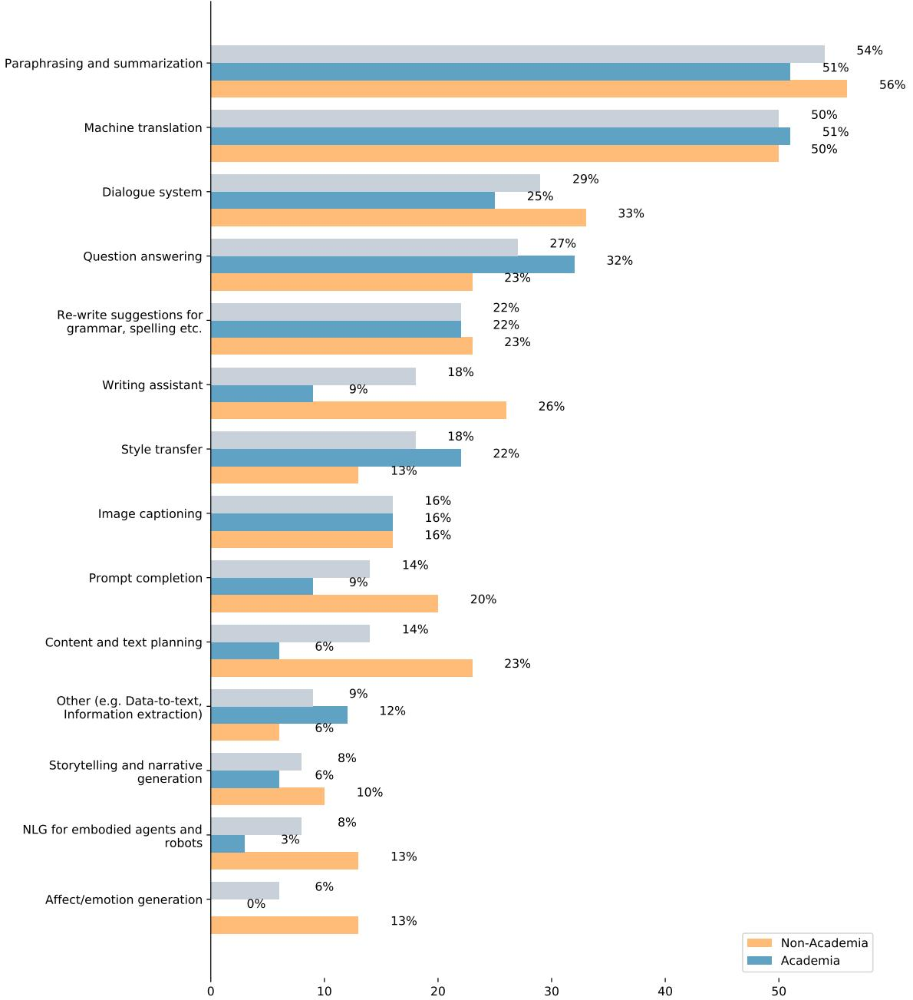  
Figure 1: Question 6: What type of NLG system(s) or task(s) have you worked on or with? Check all that apply

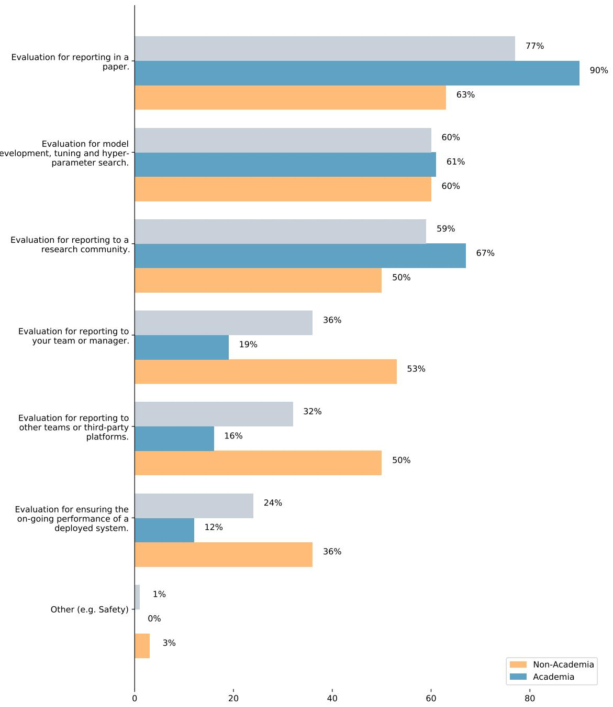  
Figure 2: Question 13: When you evaluate your system/model, what are the goals of this evaluation? Check all that apply.

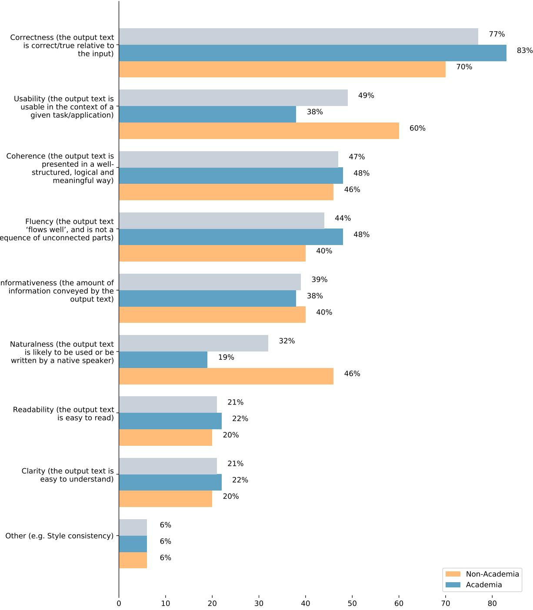

Figure 3: Question 14: Of the following, which are the most important performance criteria to evaluate for your NLG system or task? Select up to three or write your own. For more detailed definitions, please refer to the appendix here: https://aclanthology.org/2020.inlg-1.23.pdf  
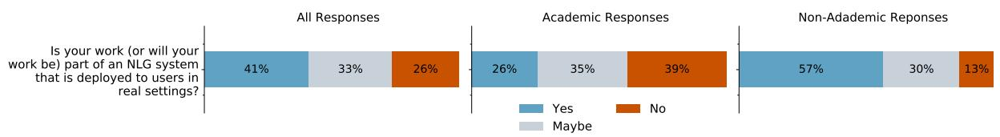  
Figure 4: Question 16: Is your work (or will your work be) part of an NLG system that is deployed to users in real settings (users who use the system for their own reasons, self-incentivized, and are not paid as test subjects/crowd workers)?

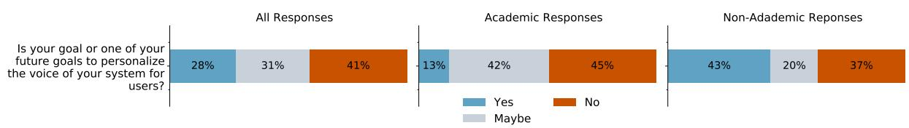

Figure 5: Question 17: Is your goal or one of your future goals to personalize the voice of your system for users? By voice we mean that it may capture a particular style of speaking or writing, or a particular persona  
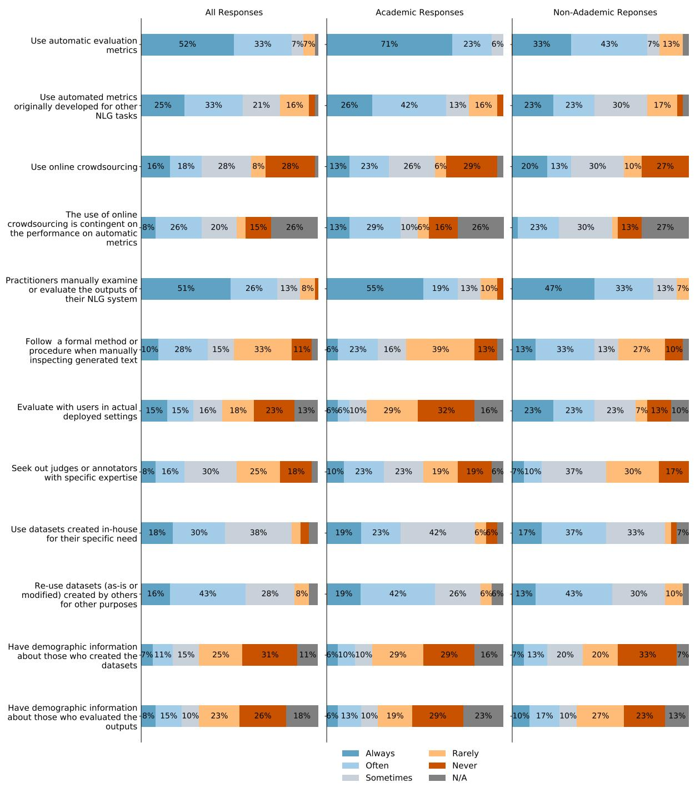  
Figure 6: Question 18: For the following statements, please answer how often you or others on your team do the following.

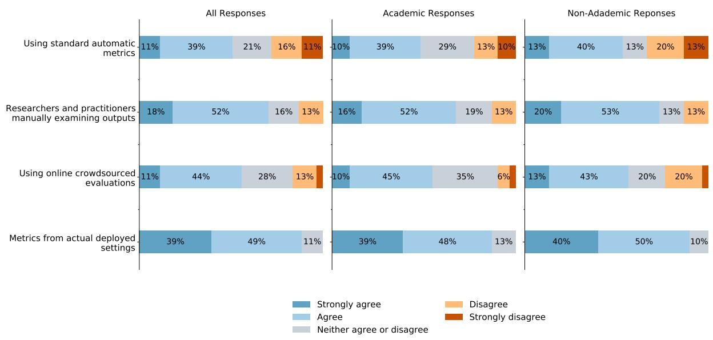  
Figure 7: Question 20: For the system or task, you described earlier, do you agree or disagree that the following evaluation methods are reliable ways to assess performance?

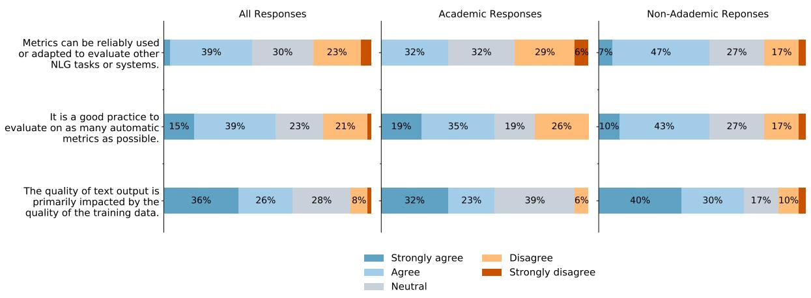  
Figure 8: Question 22: In general, please answer if you agree or disagree with the following statement about evaluating NLG systems or tasks

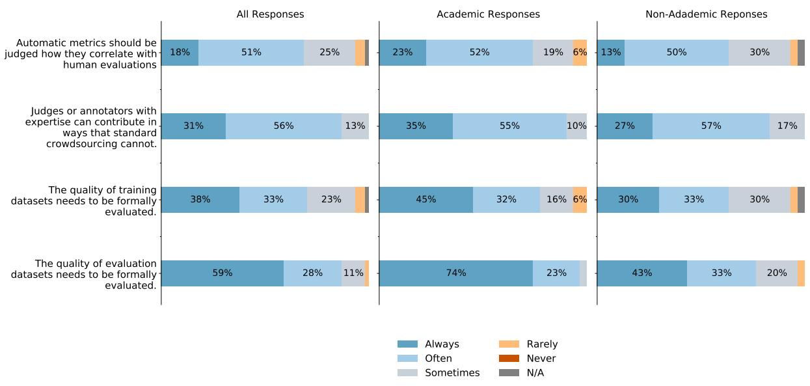  
Figure 9: Question 23: In general, please answer how often the following statements are true:

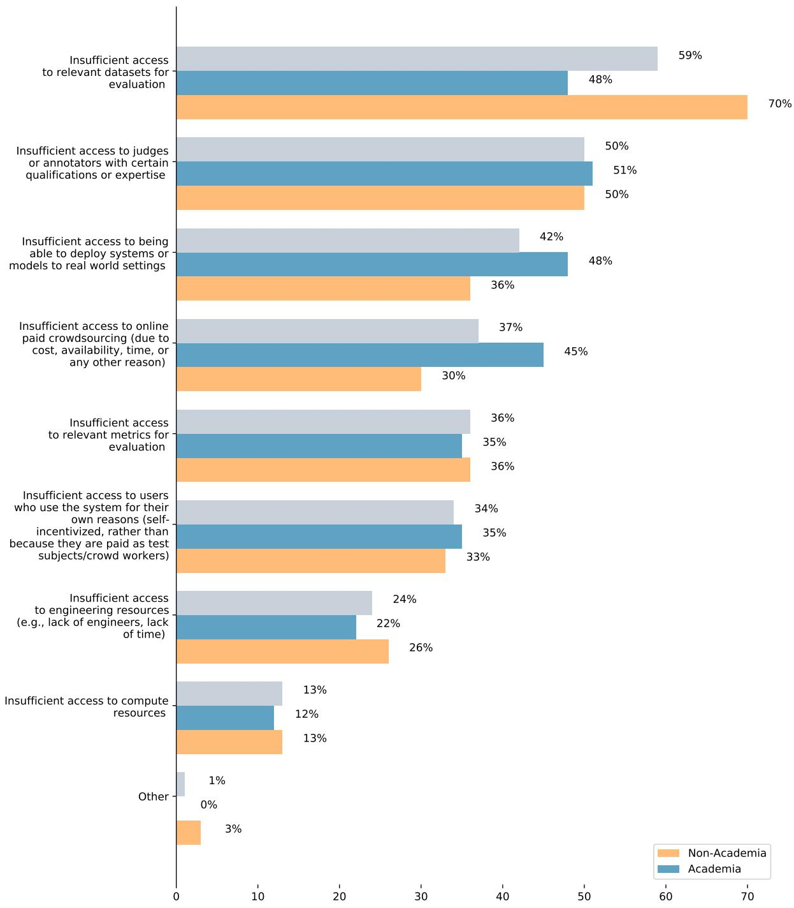  
Figure 10: Question 24: Rank which of the following resources currently limit the evaluation for your particular system or task the most. Top choice being the most limiting resource. Visualizing top 3 choices.

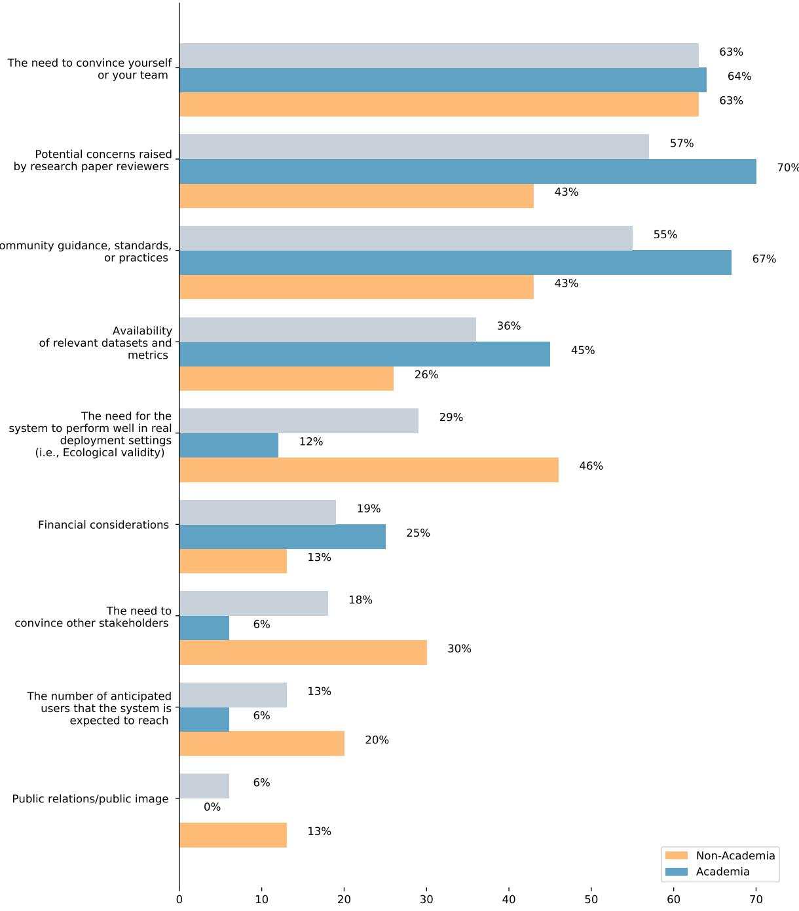

Figure 11: Question 26: Rank which of the following considerations currently guide your evaluation practices the most. Top choice being the most influential consideration. Visualizing top 3 choices.  
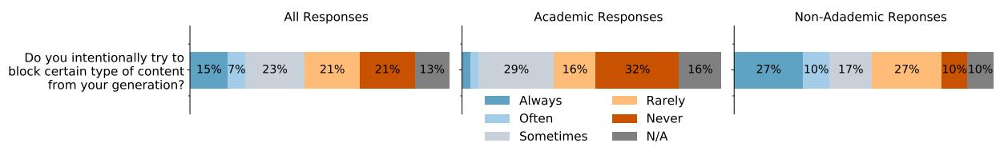  
Figure 12: Question 30: Do you intentionally try to block certain type of content from your generation? (e.g., by using blocklists or classifiers, cleaning the training data, etc.)

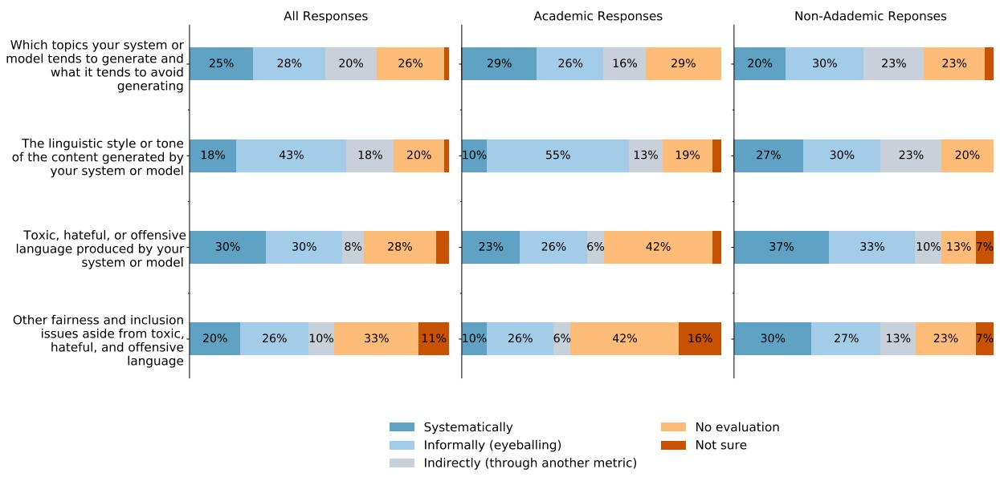  
Figure 13: Question 31: For the following questions, for your system, how do you measure the following? Fairness and Inclusion states that NLG systems should treat all people equally, empowering and engaging everyone by providing equal benefit and access to e.g., opportunities and resources.

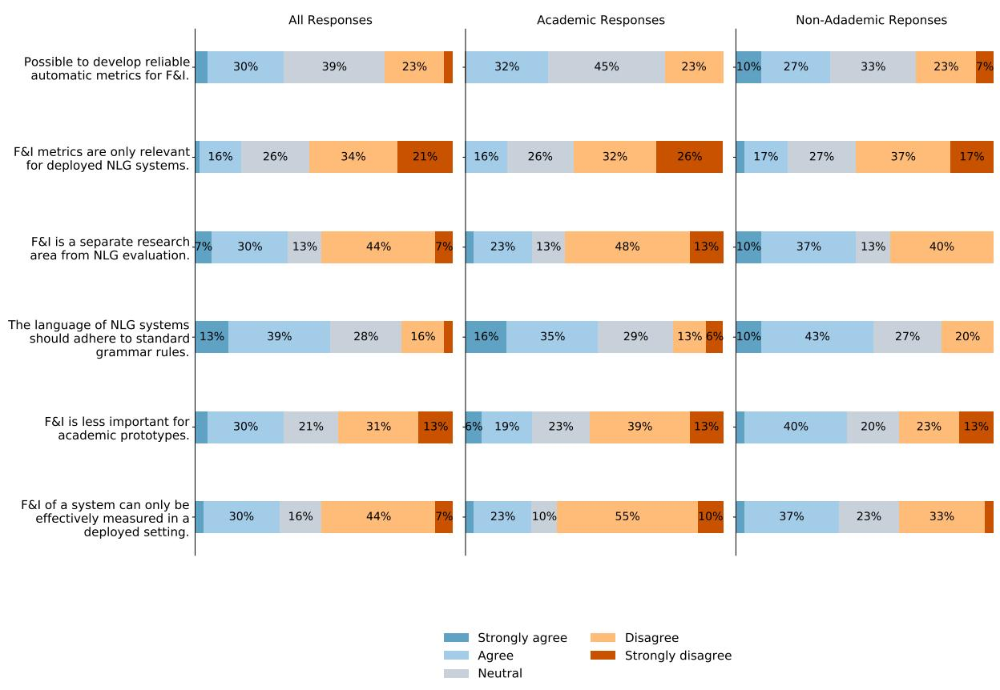  
Figure 14: Question 33: In general, for the following statements, please answer if you agree or disagree with each statement for NLG systems' evaluation.

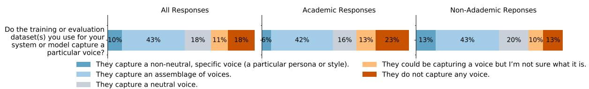

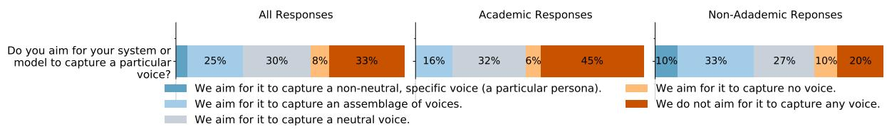

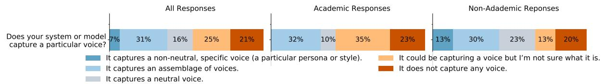

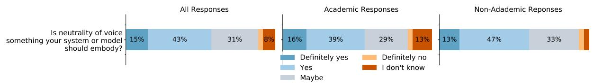  
Figure 15: Questions 34 - 37 on whether a NLG system or model captures a particular voice. By voice we mean that it may capture a particular style of speaking or writing, or a particular persona.

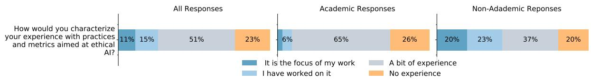  
Figure 16: Question 39: How would you characterize your experience with practices and metrics aimed at ethical AI? This does not have to be related to your NLG work.