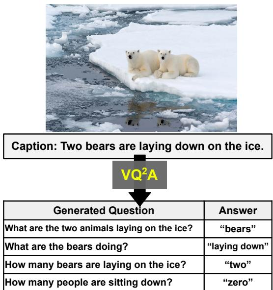
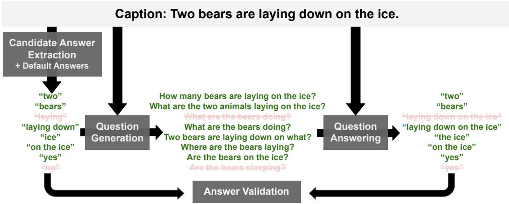
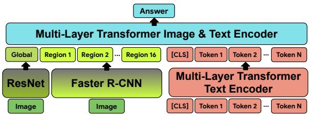
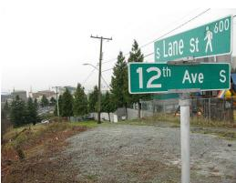
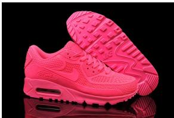
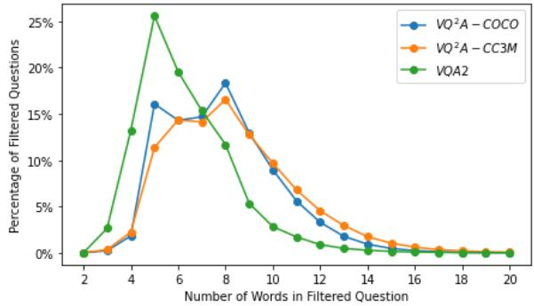
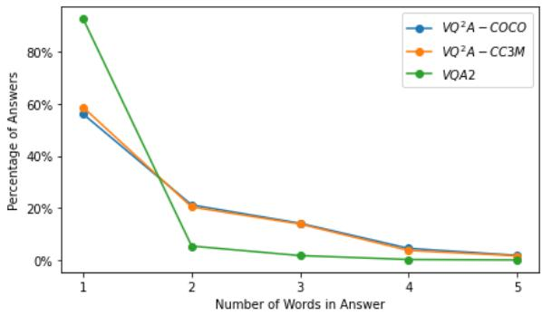
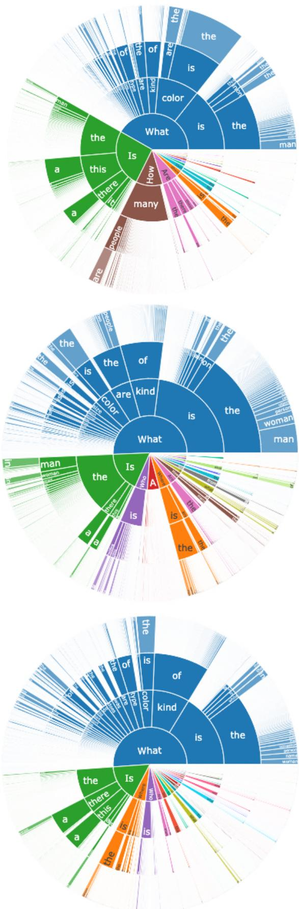

# All You May Need for VQA are Image Captions

Soravit Changpinyo∗ Doron Kukliansky∗ Idan Szpektor Xi Chen Nan Ding Radu Soricut

Google Research

{schangpi,doronk,szpektor,chillxichen,dingnan,rsoricut}@google.com

## Abstract

Visual Question Answering (VQA) has benefited from increasingly sophisticated models, but has not enjoyed the same level of engagement in terms of data creation. In this paper, we propose a method that automatically derives VQA examples at volume, by leveraging the abundance of existing image-caption annotations combined with neural models for textual question generation. We show that the resulting data is of high-quality. VQA models trained on our data improve state-of-the-art zero-shot accuracy by double digits and achieve a level of robustness that lacks in the same model trained on human-annotated VQA data.

## 1 Introduction

Visual Question Answering (VQA) is a complex multimodal task that, to be successfully modeled and evaluated, requires large amounts of annotations that are not naturally produced by existing business processes, the way translation-pair annotations (Guo et al., 2018) or image alt-text annotations (Sharma et al., 2018) are produced.

At present, a main bottleneck for developing robust VQA systems that are useful for downstream applications, such as for visually-impaired people and in the medical and education domains, appears to be a lack of large image-question-answer training triplets (on the order of millions). Manual annotation of such triplets is costly, time-consuming, and prone to a variety of human biases that are difficult to account for (Yuan, 2021). In addition, the brittleness of VQA systems trained on such manual annotations is well-understood and documented (Agrawal et al., 2018; Kafle and Kanan, 2017).

To address the data limitation, we turn to a potential source for creating VQA examples: image-English caption pairs (Chen et al., 2015; Sharma et al., 2018). Large-scale image caption datasets exist with millions (Changpinyo et al., 2021), several hundreds millions (Radford et al., 2021), or even billions (Jia et al., 2021) of examples. Captions come mostly in the form of declarative sentences, e.g., “two bears are laying down on the ice”. Yet, the task of converting declarative captions into VQA question/answer pairs is still largely unexplored. It requires automatically inducing candidate answers fitting the VQA task, along with their respective questions based on the caption text (Fig. 1). We note that transforming declarative form to interrogative form plus answer(s) seems crucial, as there exists evidence that a vision-andlanguage model trained on declarative-language data cannot be successfully adapted or transferred “out-of-the-box" for VQA (Wang et al., 2021).

  
Figure 1: Given an English caption (along with its corresponding image), our VQ2A method generates high-quality question-answer pairs. These image-question-answer triplet data can be automatically produced at volume (millions of examples) and used to effectively train VQA systems.

In this paper, we explore the automatic creation of millions of VQA training data using neural models for textual question generation and question answering. We refer to this method as VQ2A, for Visual Question Generation with Question Answering validation. We demonstrate that VQA models trained on such data, with no exposure to human-annotated VQA data at all, exhibit high zero-shot performance. Our best models obtain 61.1% accuracy on VQA2.0, 52.1% on GQA, around 15-17 points higher than previous zero-shot state-of-the-art results, and getting close to fullysupervised performance. In addition, taking our generated examples as a test set, we provide further evidence for the brittleness of VQA systems built with human-annotated examples, as well as evidence for the robustness of VQA systems built with the automatically-induced $\mathrm { V Q ^ { 2 } A }$ data.

## 2 Related Work

## 2.1 Question generation in NLP

Question Generation (QG) is an active research topic in NLP. It is explored as a standalone task (Heilman and Smith, 2009; Nema et al., 2019), as a pre-training task for language models (Narayan et al., 2020) and as a component in solutions for other textual tasks, such as question answering (Alberti et al., 2019; Puri et al., 2020), information retrieval (Mass et al., 2020; Gaur et al., 2021) and generation evaluation (Durmus et al., 2020; Wang et al., 2020; Honovich et al., 2021). There are two main directions to QG: template-based (Heilman and Smith, 2009; Lyu et al., 2021; Dhole and Manning, 2020) and neural-based, with the latter achieving state-of-the-art results (Alberti et al., 2019; Narayan et al., 2020).

## 2.2 Question generation in computer vision

Question generation in computer vision aims at generating visual questions about a given image (or video), either for generating questions without knowing the answer (Mostafazadeh et al., 2016; Zhang et al., 2017; Yang et al., 2018; Uehara et al., 2018; Krishna et al., 2019), e.g., for them to to be answered by humans, or to help improving the VQA task (Kafle et al., 2017; Li et al., 2018; Shah et al., 2019; Xu et al., 2021; Kil et al., 2021; Akula et al., 2021), e.g., for additional evaluation and as means of data augmentation. Such QG models are typically based on VQA triplets as training data, whose language complexity is often limited, or require the collection of visual QG data (Mostafazadeh et al., 2016). We take a different approach by leveraging models trained on textual QA datasets instead.

Multiple works leverage image captions or video transcripts as training sources (Ren et al., 2015a; Banerjee et al., 2021; Yang et al., 2021a; Lee et al., 2021). In this approach, question-answer pairs are automatically generated from the text, ignoring the visual source, and are then combined with the related image/video to produce image-questionanswer triplets. Banerjee et al. (2021) propose WeaQA, in which they generate questions from MSCOCO image captions (Chen et al., 2015) using an improved template-based approach in CO-COQA (Ren et al., 2015a) as well as QA-SRL methods, enhanced by paraphrasing and backtranslation for linguistic variations. Lee et al. (2021) similarly train a VQA model from question-answer pairs derived from MSCOCO Captions but only use noun phrases as candidate answers, focusing on using it to verify generated captions but not on the VQA task itself. Yang et al. (2021a) generate question-answer pairs from instructional video ASR transcripts, which are then coupled with the related video.

In this work, we follow this direction, investigating what requires to generate data with good coverage for the VQA task in the image domain. We show that our neural-based textual question generation approach with captions is much more effective than previous approaches. Further, unlike previous work, we also explore automatically-curated out-of-domain image-text data sources.

## 2.3 Transfer learning for and in VQA

Existing work also explores the relationship between the image captioning task and the VQA task without question generation (Section 2.2). Fisch et al. (2020) perform image captioning by anticipating visual questions (i.e., using VQA data as additional supervision and post-inference evaluation). Wu et al. (2019) generate question-relevant image captions to aid VQA. Yang et al. (2021b) prompt the GPT-3 (Brown et al., 2020) to answer knowledge-based visual questions based on generated captions and tags and a few VQA examples.

Evidence suggests that image-text pre-training, especially when performed at scale, benefits visionand-language tasks, including VQA (Lu et al., 2019; Li et al., 2019; Chen et al., 2020; Tan and Bansal, 2019; Su et al., 2020; Lu et al., 2020; Zhou et al., 2020; Li et al., 2020; Zhang et al., 2021; Cho et al., 2021; Wang et al., 2021; Yuan et al., 2021). However, these approaches do not work well without fine-tuning on the downstream VQA data (Wang et al., 2021). Further, prompt-based learning and inference (Liu et al., 2021) from a pre-trained image-text model that works for VQA is still an open research problem. In contrast, our approach directly works with the training data, explicitly transforms them into the interrogative form of question-answer pairs.

Our focus is the zero-shot transfer setting in WeaQA (Banerjee et al., 2021) in which no manually-created VQA triplets are available during training. Note that the term zero-shot here is different from the one used in (Teney and Hengel, 2016), in which the model still has access to manually-created VQA triplets but is evaluated with unseen questions at test time. Similar to this, Chao et al. (2018b) explore cross-dataset VQA but they solely focus on human-annotated data along with approaches to transfer.

## 3 Textual Question Generation for VQA

We study whether automatically producing VQA annotations from existing image-text resources can alleviate or completely replace the need for manual data annotation. We only focus on English in this paper. To this end, we follow and improve upon some of the recent directions in Section 2.2 on automatic question-answer generation from text.

We start with a given dataset of image-caption pairs $D { = } \{ \operatorname* { i m g } _ { i } , \operatorname { c a p } _ { i } \} _ { i = 1 } ^ { N }$ . An important assumption we take is that the information conveyed by the caption is, in the vast majority of cases, present in the image, i.e., captions do not contain an excessive amount of external-world or personal knowledge (e.g., “my friend at my birthday party”).

For each pair $\{ \mathrm { i m g } _ { i } , \mathrm { c a p } _ { i } \}$ , an initial set of candidate answers $\{ \mathrm { a } _ { i , j } \} _ { j = 1 } ^ { M _ { i } }$ is first automatically derived from cap . For each such candidate answer, a question is generated by a neural model $\mathrm { q } _ { i , j }$ = $Q G ( \mathrm { a } _ { i , j } , \mathrm { c a p } _ { i } )$ . Each generated question-answer pair undergoes a validation step, and, if validated, is coupled with the corresponding image imgi to induce a VQA example triplet $\{ \mathrm { i m g } _ { i } , \mathrm { q } _ { i , j } , \mathrm { a } _ { i , j } \}$

We refer to this method as $\mathrm { V Q ^ { 2 } A }$ (Visual Question Generation with Question Answering validation). Figure 2 provides an overview of our approach. We next detail the steps in $\mathrm { V Q ^ { 2 } A }$

## 3.1 Candidate Answer Extraction

The only prior work on neural question generation from captions we are aware of, Lee et al.

(2021), focuses on noun phrases as candidate answers. Yet, these are not enough to cover the answer types included in typical VQA benchmarks such as VQA2.0 (as we will show in Section 5.1), such as boolean, attribute, and verb answers, to name a few, which are required for questions like as “Is there...”, “What color...”, “What is the dog doing”. We present a method that covers all of these answer types.

To extract candidate answers from a given caption, we parse it using $\operatorname { s p a C y } ^ { 1 }$ and then extract candidates based on the Part-of-Speech (POS) and dependency parse tree annotations, as follows:

Noun Phrases. We extract all noun phrases annotated by spaCy, including named entities.

POS Spans. We extract sequences that begin with an open-class POS (nouns, verbs, adjectives and adverbs), that end with an open-class POS or an adverbial particle, and that do not contain any other POS in between except closed-class POS for determiners, adpositions and conjunctions.

Parse Tree Spans. We consider all sub-trees that include at least one open-class POS and no more than 3 words altogether. We only extract maximal spans, i.e., not extracting sub-trees that are fully included in other extracted sub-trees.

Boolean. Boolean questions are frequent in VQA benchmarks (Goyal et al., 2017). Yet, ‘yes’ and $\cdot _ { n o ^ { \prime } }$ are not found in captions, and so cannot be extracted as candidates by extracting text spans from captions. To this end, we also add ‘yes’ and $\cdot _ { n o ^ { \prime } }$ as candidate answers and generate one question per candidate (see Section 3.2).

How many? 0. Captions do not normally contain mentions of ‘zero’ object counts. Hence, marking spans in a caption does not generate questions with the answer $^ { \bullet } O ^ { \bullet }$ . Therefore, we randomly sample a generated “How many?” question (with a non-zero answer) from a different caption and add it with the answer changed to ‘zero’ to the candidate set of the target caption. This procedure is potentially noisy because the answer for the sampled question could be non-zero also for the target image. From a manual inspection of 200 such questions, we found this to happen infrequently – about 4.5%.

Our extraction method covers various answer candidates such as compound nouns, noun phrases, named entities, boolean answers, cardinal and ordinal numbers, verbs and their compounds, (multiword) adjectives and prepositional phrases. Table 1 provides an example of candidate answers of various types and the mechanism used to extract them.

Figure 2: Visual Question Generation with Question Answering validation $\mathrm { ( V Q ^ { 2 } A ) }$ has three main stages: Candidate Answer Extraction (Section 3.1), Question Generation (Section 3.2), and Question-Answering Filtering (Question Answering + Answer Validation, Section 3.3).
<table><tr><td rowspan=1 colspan=1>CandidateAnswer</td><td rowspan=1 colspan=1>NounPhrase</td><td rowspan=1 colspan=1>POS</td><td rowspan=1 colspan=1>ParseTree</td><td rowspan=1 colspan=1>Boolean</td></tr><tr><td rowspan=1 colspan=1>&#x27;two&#x27;‘bears&#x27;‘two bears&#x27;&#x27;laying&#x27;&#x27;laying down&#x27;‘ice&#x27;‘the ice&#x27;‘on the ice&#x27; $\cdot _ { n o } ,$  $_ { y e s } ,$ </td><td rowspan=1 colspan=1>VVV</td><td rowspan=1 colspan=1>VVVVV</td><td rowspan=1 colspan=1>VV</td><td rowspan=1 colspan=1>VV</td></tr></table>

Table 1: Answer candidates extracted from the sentence “two bears are laying down on the $i c e ^ { , }$ and the mechanism used to extract them.

## 3.2 Question Generation

Our question generation model, $\mathrm { q } = Q G ( \mathrm { a } , \mathrm { c a p } )$ takes as input a caption, cap, and a candidate answer span within it, a, and generates a question ${ \mathrm { \mathbf { q } } } ,$ whose answer given the input caption is the input answer span. Importantly, the answer a does not need to appear verbatim in the caption, enabling the generation of questions for answer types like boolean and zero counts (see Section 3.1).

Given the advances in neural text generation, including models like T5 (Raffel et al., 2020), we choose to use a neural generation model as QG. Concretely, we use a T5-XXL model and further fine-tune it on SQuAD1.1 (Rajpurkar et al., 2016) for question generation. We take the top-scoring generated question for each caption-answer input. We note that our QG model is trained on a question answering dataset that is not caption-specific, and therefore is not optimized for caption inputs. From manual inspection of hundreds of generated questions, our QG model copes well with captions as input; see examples in Table 2 and Section 3.5.

## 3.3 Question-Answer Filtering

Generative models may hallucinate, that is, generate content that is inconsistent with its input source (Alberti et al., 2019; Honovich et al., 2021). To mitigate this, we follow (Alberti et al., 2019) and apply round-trip consistency by answering the generated question on the caption text with a question answering model. If the answer does not match the answer candidate offered as input to the question generation model, the generated question is discarded.

We use the token-level F1 score (Wang et al., 2020) to determine if the candidate answer and the QA model’s answer is a match; If the score is above a threshold (manually set to 0.54, exemplified in Table 2), the pair is a match. For question answering, we use a T5-XXL model and further fine-tune it on SQuAD2.0 (Rajpurkar et al., 2018) and Natural Questions (Kwiatkowski et al., 2019).

## 3.4 Sources of Image/Caption Data

To gain insights on $\mathrm { V Q ^ { 2 } A }$ potential performance, we generate VQA triplets with VQ2A from two sources of image captions: MSCOCO Captions (COCO-CAP) (Chen et al., 2015) and Conceptual Captions (CC3M) (Sharma et al., 2018). COCO-CAP captions contains 123,287 images from the COCO dataset (Lin et al., 2014), each with 5 gold captions manually created by raters with careful guidelines. CC3M contains 3.32M images automatically-collected from the web, each with one associated alt-text which we treat as a silver caption.

<table><tr><td>Candidate Answer</td><td>Generated Question</td><td>Validated Answer</td><td>Match Score &amp; Result</td></tr><tr><td> $\overline { { \cdot _ { t w o } } } ^ { }$ </td><td>How many bears are laying on the  $\overline { { i c e ? } }$ </td><td> $\overline { { \cdot _ { t w o } } } ^ { }$ </td><td>1.0 (Pass)</td></tr><tr><td> $_ { b e a r s ^ { \prime } }$ </td><td>‘What are the two animals laying on  $t h e \ i c e ? { }$ </td><td> $_ { b e a r s } ,$ </td><td>1.0 (Pass)</td></tr><tr><td> $\cdot _ { t w o \ : b e a r s } ,$ </td><td>How many bears are laying on the  $i c e ? ^ { , }$ </td><td> $\cdot _ { t w o } ,$ </td><td>1.0 (Pass)</td></tr><tr><td> $^ { \circ } l a y i n g ^ { \prime }$ </td><td> $" W h a t a r e t h e b e a r s d o i n g ? ^ { \prime }$ </td><td> $\cdot l a y i n g d o w n o n t h e i c e ^ { , }$ </td><td>0.4 (Fail)</td></tr><tr><td>&#x27;laying down&#x27;</td><td> $" W h a t a r e t h e b e a r s d o i n g ? ^ { \prime }$ </td><td> $\cdot l a y i n g d o w n o n t h e i c e ^ { , }$ </td><td>0.7 (Pass)</td></tr><tr><td> $\cdot _ { i c e } ,$ </td><td> $^ { \ast } T w o b e a r s a r e l a y i n g d o w n o n w h a t ? ^ { \ast }$ </td><td> $\cdot _ { t h e \ i c e } ,$ </td><td>1.0 (Pass)</td></tr><tr><td> $^ { \circ } t h e \ i c e ^ { \prime }$ </td><td> $^ { \cdot } W h e r e a r e t h e b e a r s l a y i n g ? ^ { \prime }$ </td><td> $\cdot o n t h e i c e ^ { , }$ </td><td>0.7 (Pass)</td></tr><tr><td> $\cdot _ { o n t h e i c e } ,$ </td><td> $^ { \cdot } W h e r e a r e t h e b e a r s l a y i n g ? ^ { \prime }$ </td><td> $\cdot o n t h e i c e ^ { , }$ </td><td>1.0 (Pass)</td></tr><tr><td> $\cdot _ { n o ^ { \prime } }$ </td><td>Are the bears sleeping?&#x27;</td><td> $_ { y e s } ,$ </td><td>0.0 (Fail)</td></tr><tr><td> $_ { y e s } ,$ </td><td>Are the bears on the  $i c e ? ^ { , }$ </td><td> $_ { y e s } ,$ </td><td>1.0 (Pass)</td></tr><tr><td> $\cdot _ { z e r o } ,$ </td><td>How many people are sitting down?&#x27;</td><td></td><td>Pass by definition</td></tr></table>

Table 2: Question/answer pairs generated from the sentence “two bears are laying down on the $i c e ^ { , }$ and the filtering decision. For answer candidate $\cdot _ { z e r o } ,$ , no validation is performed .
<table><tr><td rowspan="2">Dataset</td><td colspan="2">Image</td><td colspan="2">VQA examples</td></tr><tr><td>train</td><td>dev</td><td>train</td><td>dev</td></tr><tr><td>VQ2A COCO</td><td>114.9K</td><td>8.4K</td><td>3.50M</td><td>257.5K</td></tr><tr><td>VQ2A CC3M</td><td>3.32M</td><td>15.8K</td><td>13.29M</td><td>61.2K</td></tr><tr><td>COCOQA VQA2.0</td><td>64.5K</td><td>4.7K</td><td>108.7K</td><td>38.6K</td></tr><tr><td>GQA</td><td>114.9K 82.4K</td><td>8.4K</td><td>582K</td><td>65.1K</td></tr><tr><td>OKVQA</td><td>9K</td><td>0.4K 5K</td><td>1.08M 8.3K</td><td>12.6K 4.7K</td></tr></table>

Table 3: Sizes of our generated $\mathrm { V Q ^ { 2 } A }$ data (top two rows) and VQA datasets used in our experiments.

These datasets are quite different. Both the amount and the domain of CC3M images are larger and its captions look more plausible for capturing a larger set of object/attribute/action annotations. On the other hand, COCO-CAP’s captions are cleaner and represent image content more adequately (see also Section 3.5). Thus, using COCO-CAP would show the potential of training a VQA model using VQ2A in a “cleaner” zero-shot setup, where captions are human-curated. Using CC3M would indicate the potential of training on noisy web image– alt-text pairs, where scaling up to billions of examples is possible.

To quantify the impact of our method, we focus on VQA classification for the VQA2.0 (Goyal et al., 2017), GQA (Hudson and Manning, 2019), and OKVQA (Marino et al., 2019) benchmarks (see Section 4.2). We thus restrict our classifier to top 5,971 answers that are part of a unified answer vocabulary from these benchmarks (Appendix B.1). To this end, we remove triplets whose answers are not in the target answer vocabulary, and leave the study of using all generated triplets to future work. We then split our datasets into train/dev sets. In particular, since the images in VQA2.0 are taken from COCO, we split the COCO dataset based on the standard VQA2.0 train/dev splits of \*train2014 and minival2014 (Jiang et al.,

$2 0 1 8 ) ^ { 2 }$ . For the CC3M dataset, we use the default CC3M train/dev splits (Sharma et al., 2018). For each unique image-question pair in the dev split, we construct an answer target of size 10, following VQA2.0, by reducing or expanding the set of seed answers that occur for this image-question pair. Additional details are in Appendix B.1.

Table 3 depicts the size of the induced datasets, named $\mathrm { V Q ^ { 2 } A { \cdot } C O C O }$ and VQ2A-CC3M, as well as the VQA datasets used in our experiments.

## 3.5 Quality Analysis

To measure the quality of the generated datasets, we sampled 800 examples from each of the $\mathrm { V Q ^ { 2 } A } .$ COCO and $\mathrm { V Q ^ { 2 } A \mathrm { - } C C 3 M }$ datasets. The sample was split between four authors, who assessed whether the answer to the question in an example is justified based on the example’s image. For each dataset, 50 examples were rated by all raters, resulting in a free-margin Kappa (Randolph, 2005) of 0.71 for VQ2A-COCO and 0.59 for VQ2A-CC3M, corresponding to high inter-rater agreement. The measured percentage of valid triplets is 87.3% for VQ2A-COCO and 66.0% for VQ2A-CC3M. This shows the difference between the high-quality captions of COCO-CAP and the noisier web-based ones of CC3M.

Fig. 3 demonstrates the diversity of questions generates in the $\mathrm { V Q ^ { 2 } A }$ datasets. One can see that a significant amount of questions generated by $\mathrm { V Q ^ { 2 } A }$ for the shared VQA2.0/COCO image do not appear in VQA2.0. Additional analysis and examples are in Appendix A.

## 4 Visual Question Answering (VQA)

To assess the effectiveness of our automatic generation of VQA annotations, we perform extrinsic evaluations of the generated data by measuring its impact on a variety of established VQA benchmarks. We first describe the model, followed by the experimental setup and the results.

<table><tr><td>Question</td><td>Answers</td></tr><tr><td>How many pieces of fruit are in the bowl</td><td>“0”</td></tr><tr><td>Is there a refrigerator in the kitchen</td><td>“yes&quot;</td></tr><tr><td>What color are the cabinets in the kitchen</td><td>&quot;white&quot;</td></tr><tr><td>Is the kitchen lit or dark</td><td>&quot;lit&quot;</td></tr><tr><td>Is there a stove in the kitchen</td><td>&quot;no”</td></tr><tr><td>What color is the formica in the kitchen</td><td>&quot;white&quot;</td></tr><tr><td>What is on the door of the refrigerator</td><td>&quot;papers”,</td></tr><tr><td>Where are the papers on the refrigerator</td><td>&quot;several papers&quot; &quot;door&quot;</td></tr><tr><td>What kind of kitchen does the house have</td><td>&quot;small white formica kitchen&quot;</td></tr></table>

<table><tr><td>Question</td><td>Answers</td></tr><tr><td>What is flying over the ocean What color is the bird&#x27;s head</td><td>“eagle&quot;, &quot;brown eagle&quot; &quot;white&quot;</td></tr><tr><td>What color is the bird Is the brown eagle flying over land</td><td>“brown&quot; &quot;no”</td></tr><tr><td>Is the brown eagle flying over the ocean What does the bird do over the water</td><td>&quot;yes&quot; &quot;glides&quot;</td></tr><tr><td>Which part of the bird is white</td><td>&quot;head&quot;</td></tr><tr><td>What color are the bird&#x27;s wings</td><td>&quot;brown&quot;,</td></tr><tr><td>What color is the eagle in the picture</td><td>&quot;brown wings&quot; &quot;brown&quot;</td></tr></table>

<table><tr><td></td><td>Question</td><td>Answers</td></tr><tr><td></td><td>Is the tumbler dishwasher safe</td><td>&quot;no&quot;</td></tr><tr><td></td><td>Is the tumbler insulated</td><td>&quot;yes&quot;</td></tr><tr><td></td><td>What color is the tumbler What kind of blue is on the tumbler</td><td>&quot;blue&quot;, &quot;shiny blue&quot;</td></tr><tr><td>L</td><td></td><td>&quot;shiny&quot;</td></tr><tr><td></td><td>What is the name of the blue drinkware item</td><td>&quot;tumbler&quot;</td></tr><tr><td></td><td>What is ceramic used for in the tumbler</td><td>&quot;lining&quot;</td></tr><tr><td></td><td>Which part of the tumbler is made of stainless steel</td><td>&quot;exterior&quot;</td></tr><tr><td></td><td>Which part of the tumbler is ceramic</td><td>&quot;inner&quot;</td></tr><tr><td></td><td>What is the purpose of the stainless steel exterior of the tumbler</td><td>&quot;insulating&quot;</td></tr><tr><td></td><td>What kind of steel is on the outside of the tumbler</td><td>&quot;stainless&quot;</td></tr><tr><td></td><td>What material is the inside of the tumbler made of</td><td>&quot;ceramic&quot;</td></tr><tr><td></td><td>What material is the outside of the tumbler made of</td><td>&quot;steel&quot;, &quot;stainless steel&quot;</td></tr></table>

<table><tr><td>Question</td><td>Answers</td></tr><tr><td>What type of art is this</td><td>“vector”</td></tr><tr><td>Aside from watches what else is included in the illustration</td><td>&quot;clocks&quot;</td></tr><tr><td>What is the illustration of</td><td>&quot;clocks and watches&quot;</td></tr><tr><td>Is this a hand drawn clock and watch set</td><td>&quot;yes&quot;</td></tr><tr><td>How were the clocks and watches drawn</td><td>&quot;hand&quot;</td></tr><tr><td>In addition to gold what color is used for the clocks and watches in this illustration</td><td>&quot;gray&quot;</td></tr><tr><td>What colors are the clocks and watches in the illustration</td><td>&quot;gray and gold&quot;</td></tr><tr><td>What kind of illustration is this</td><td>&quot;vector art&quot;</td></tr></table>

Figure 3: Examples from VQ2A COCO (top) and VQ2A CC3M (bottom). Questions with the green background are also present in VQA2.0.  
  
Figure 4: VQA model used in our experiments. The text encoder is initialized from a T5-base checkpoint, while the image-text encoder is initialized from scratch. The parameters of ResNet and Faster R-CNN are frozen during VQA training.

## 4.1 VQA Formulation and Model

Following the literature, we treat VQA as a classification task, i.e., vocab-based VQA. In particular, we treat our target answers as labels, where a label could be multi-token (e.g., "Christmas tree", "black and white", "play tennis"). We define our set of labels based on top answers in the training set of downstream VQA datasets, which allows for a fair comparison with most work in the VQA literature since Antol et al. (2015).

Since our work explores the impact of automatically-generated training data, we fix the VQA model architecture across all experimental conditions. Our model fuses the input image and question (Fig. 4). On the image side, we take global image features from ResNet-152 (He et al., 2016) pre-trained on ImageNet (Russakovsky et al., 2015) plus 16 region-of-interest image features from Faster R-CNN (Ren et al., 2015b) pre-trained on Visual Genome (Krishna et al., 2017), following the bottom-up-features paradigm (Anderson et al., 2018). On the question side, we use the encoder of a pre-trained T5-base checkpoint (Raffel et al., 2020). Given the image features and the output token embeddings of the question encoder, a Transformer (Vaswani et al., 2017) fuses the multi-modal intermediate representation and classifies it into the predefined answer space. We train the (randomlyinitialized) fusing encoder and the text encoder end-to-end using standard cross-entropy loss. The parameters of both ResNet and Faster R-CNN are frozen during training. Additional details are given in Appendix B.2.

## 4.2 Experimental Setup

We consider three VQA benchmarks: VQA2.0 (Goyal et al., 2017), GQA (Hudson and Manning, 2019), and OKVQA (Marino et al., 2019). These datasets have their own characteristics and thus test different capability of VQA models. For instance, GQA puts emphasis on reasoning and OKVQA on external knowledge, whereas VQA2.0 is more general; VQA2.0 and GQA are order-of-magnitude larger than OKVQA; GQA is generated using a question engine while VQA2.0 and OKVQA are human-annotated.

For training and evaluating on VQA2.0, we use the standard train/dev splits \*train2014 and minival2014 (Jiang et al., 2018). For GQA, we use the balanced v1.2 and combine the train and val splits for training and use the testdev split for evaluation, following the official guideline3 and (Tan and Bansal, 2019). For OKVQA, we use the train/val splits for training/evaluation. Table 3 summarizes the sizes of the different datasets.

Evaluation Settings and Baselines. The main goal of our experiments is to explore the utility of our $\mathrm { V Q ^ { 2 } A }$ data for transfer learning, as training or evaluation data.

Our main focus in this paper is on zero-shot evaluation. Still, fine-tuning would provide additional insight on using our induced data for pre-training. Therefore, following (Banerjee et al., 2021), we train VQA models on the generated $\mathrm { V Q ^ { 2 } A }$ data and then evaluate them in two settings: (i) zero-shot evaluation, in which we evaluate our models as-is on the dev split of VQA2.0, GQA, or OKVQA; and (ii) fully-supervised fine-tuning evaluation, in which we further fine-tune our models on the training split of $\mathrm { V Q ^ { 2 } A }$ , GQA, or OKVQA before evaluating them. When training on $\mathrm { V Q ^ { 2 } A }$ data, we explore training on $\mathrm { V Q ^ { 2 } A \mathrm { - } C O C O }$ only, $\mathrm { V Q ^ { 2 } A \mathrm { - } C C 3 M }$ only, and a two-stage training VQ2A-CC3M followed by VQ2A-COCO (VQ2A CC3M COCO).

Our baselines, which do not use $\mathrm { V Q ^ { 2 } A }$ data, include (i) our VQA model trained on templatebased question generation data $\mathrm { C O C O Q A ^ { 4 } }$ (Ren et al., 2015a), (ii) state-of-the-art zero-shot WeaQA (Banerjee et al., 2021) and its fully-supervised variants, and (iii) our VQA model trained supervisely on each of the target benchmarks’ training data.

Metrics. To be compatible with prior work, on VQA2.0 and OKVQA we measure the standard VQA Accuracy. It is the average score over 9 subsets of the ground-truth 10 answers5, where each score is: $\begin{array} { r } { m i n ( \frac { \# a n s w e r \ o c c u r r e n c e s } { 3 } , 1 ) } \end{array}$ . On GQA, we measure Top-1 Accuracy against the single ground-truth answer.

## 5 Results

We report several sets of experimental results that shed light both on the accuracy and on the robustness of VQA models trained on $\mathrm { V Q ^ { 2 } A }$ data in this section, with additional results, analysis and ablation studies in Appendix C.

## 5.1 Zero-Shot Setting

Table 4 summarizes the outcomes of our VQA experiments on various benchmarks. Our main result is that the $\mathrm { V Q ^ { 2 } A }$ models achieve new state-of-theart results in the zero-shot transfer learning setting. The improvement in performance is large: to the best of our knowledge, previous state-ofthe-art zero-shot accuracy was 46.8% on VQA2.0 and 33.7% on GQA by WeaQA (Banerjee et al., 2021), which also induces their training VQA data from COCO Captions. Our VQ2A-COCO model reaches 60.0% on VQA2.0 and 51.3% on GQA, an absolute improvement of +13.2% and +17.6%, respectively. Even higher accuracy for the zero-shot setting – 61.1% (VQA2.0) and 52.1% (GQA) – is reached with the VQ2A CC3M COCO model (trained first on the CC3M-derived data and then fine-tuned on the COCO-derived data), establishing new state-of-the-art results.

<table><tr><td rowspan=2 colspan=1>Approach</td><td rowspan=1 colspan=3>Evaluation Benchmark</td></tr><tr><td rowspan=1 colspan=3>VQA2.0  GQA  OKVQA</td></tr><tr><td rowspan=1 colspan=4>Zero-shot</td></tr><tr><td rowspan=1 colspan=1>VQ2A COCO, nouns onlyCOCOQA</td><td rowspan=1 colspan=1>10.511.7</td><td rowspan=1 colspan=1>4.4</td><td rowspan=1 colspan=1>6.3</td></tr><tr><td rowspan=1 colspan=1>WeaQA ZSL</td><td rowspan=1 colspan=1>46.8</td><td rowspan=1 colspan=1>33.7</td><td rowspan=1 colspan=1></td></tr><tr><td rowspan=2 colspan=1>VQ2A COCOVQ2A CC3MVQ2A CC3M → COCO</td><td rowspan=2 colspan=1>60.056.561.1</td><td rowspan=1 colspan=1>51.3</td><td rowspan=1 colspan=1>18.0</td></tr><tr><td rowspan=1 colspan=1>49.952.1</td><td rowspan=1 colspan=1>19.119.7</td></tr><tr><td rowspan=1 colspan=1>VQ2A CC3M +D</td><td rowspan=1 colspan=1>57.9</td><td rowspan=1 colspan=1>50.0</td><td rowspan=1 colspan=1>19.8</td></tr></table>

Fully-supervised
<table><tr><td rowspan=1 colspan=1>WeaQA FSL</td><td rowspan=1 colspan=1>65.3</td><td rowspan=1 colspan=1>55.2</td><td rowspan=1 colspan=1>-</td></tr><tr><td rowspan=1 colspan=1>w/o VQ2A data</td><td rowspan=1 colspan=1>68.8</td><td rowspan=1 colspan=1>61.8</td><td rowspan=1 colspan=1>22.1</td></tr><tr><td rowspan=1 colspan=1>w. VQ2A COCOw. VQ2A CC3Mw. VQ2A CC3M → COCO</td><td rowspan=1 colspan=1>71.671.371.4</td><td rowspan=1 colspan=1>63.363.464.0</td><td rowspan=1 colspan=1>36.039.039.3</td></tr><tr><td rowspan=1 colspan=1>Human performance</td><td rowspan=1 colspan=1>82.4†</td><td rowspan=1 colspan=1>89.3</td><td rowspan=1 colspan=1>82.8†</td></tr></table>

† from the inter-annotator agreement of ground-truth answers. ‡ from (Hudson and Manning, 2019).  
Table 4: $\mathrm { V Q ^ { 2 } A }$ as training data. Accuracy in zero-shot and fully-supervised settings. All results use our architecture, except WeaQA ZSL and WeaQA FSL, which are the zero-shot (ZSL + Patches + Encoder) and fullysupervised (FSL + Patches + Encoder) models in (Banerjee et al., 2021), respectively. +D stands for recovered raw CC3M alt-texts with digits.

Training the same model architecture on the manually-constructed VQA2.0 and GQA training sets in a fully-supervised manner achieves 68.8% and 61.8% accuracy, respectively. Hence, our results significantly close the performance gap between automatically-generated and manuallyconstructed training sources, indicating that the $\mathrm { V Q ^ { 2 } A }$ method may reduce the need for human curated VQA training examples.

The captions for COCO images are carefully annotated to be of high-quality (Chen et al., 2015). Additionally, the VQA2.0 images are taken from COCO. To test the robustness of $\mathrm { V Q ^ { 2 } A }$ , we also evaluate a $\mathrm { V Q ^ { 2 } A }$ -CC3M model. While CC3M contains more image–alt-text pairs than COCO (see Table 3), the images are from a different distribution and the text annotations are noisier and may represent a larger spectrum of discourse intents (Alikhani et al., 2020). In spite of these differences, the gap between COCO-based and CC3M-based $\mathrm { V Q ^ { 2 } A }$ models is not large, 60.0% vs 56.5% on VQA2.0 and 51.3% vs. 49.9% on GQA. This result strengthens our previous observation, in that it does not seem to be crucial that the starting captions are manually-annotated; it appears that “silver” annotations such as the ones provided by CC3M are competitive in zero-shot VQA performance.

To cover the types of answers present in VQA benchmarks, there is a need for thorough extraction of various answer/question types (Section 3). The QACE model (Lee et al., 2021), for example, focuses only on noun-phrases as answer types. By analyzing the VQA2 devset, we find that only 32% of its answers are nouns. As such, it makes sense that, when limiting to only this answer type, the VQA Accuracy of $\mathrm { V Q ^ { 2 } A }$ -COCO is 10.5%, compared to the 60% achieved with a full coverage. As another example, our model trained COCOQA (Ren et al., 2015a), which focuses on a few answer types and one-word answers, barely surpasses the accuracy of our COCO, nouns only baseline. For similar reasons, we want to be able to generate ‘how many questions from the CC3M data, even though the published annotations have been stripped of digits and numerals. To solve this problem, we recover the original captions from the CC3M URLs, generate questions of the type ‘how many’, and train an additional VQ2A-CC3M +D model. The results in Table 4 show a small but consistent improvement over vanilla VQ2A-CC3M, further closing the gap between $\mathrm { V Q ^ { 2 } A }$ models using curated “gold” captions and noisier “silver” captions.

To gain further insights, we provide a breakdown of VQA Accuracy per VQA2.0 question types in Table 5. Boolean questions are the easiest and all models perform well on them. More challenging question types are ‘How many?’ and ‘What $i s ^ { \prime }$ One reason could be the validity of various answers, like “several” for counts. ‘What time?’ is the most difficult, probably due to lack of such information in captions.

Finally, we provide zero-shot results on the more difficult OKVQA benchmark. In this setting, a supervised model reaches 22.1% accuracy, while $\mathrm { V Q ^ { 2 } A }$ models in zero-shot setting achieve close to that – 18.0% with COCO and 19.1% with CC3M, while their combination reaches 19.7%, -2.4% shy of the supervised level. This result also supports the conclusion that creating training data with the $\mathrm { V Q ^ { 2 } A }$ method is a good replacement for smallscale supervised training data.

<table><tr><td>Question Prefix</td><td>VQA2.0 Supervised</td><td>VQ2A-COCO Zero-shot</td><td>VQ2A-CC3M Zero-shot</td></tr><tr><td>Boolean</td><td>96.3</td><td>93.2</td><td>94.2</td></tr><tr><td> $4 W h a t c o l o r '$ </td><td>69.2</td><td>64.8</td><td>56.8</td></tr><tr><td> $\cdot W h a t k i n d / i s ^ { \prime }$ </td><td>52.6</td><td>36.9</td><td>32.1</td></tr><tr><td> $\cdot H o w m a n y ^ { , }$ </td><td>49.3</td><td>29.4</td><td>19.5</td></tr><tr><td> ${ ^ { \circ } W h e r e \ a r \ ' e } / i s ^ { \circ }$ </td><td>38.0</td><td>30.0</td><td>25.3</td></tr><tr><td> $\cdot W h a t d o e s ^ { \prime }$ </td><td>33.0</td><td>24.1</td><td>20.3</td></tr><tr><td> $^ { \circ } W h a t ~ t i m e ^ { \circ }$ </td><td>23.6</td><td>11.9</td><td>12.7</td></tr></table>

Table 5: Aggregated average Accuracy on VQA2.0 for the most common question types.

## 5.2 Fully-Supervised Setting

Another aspect of the $\mathrm { V Q ^ { 2 } A }$ method that we want to evaluate is whether it produces training data that is similar with the human-annotated data, or it complements it. To this end, we perform experiments in which we first train a model using the $\mathrm { V Q ^ { 2 } A }$ data, and then fine-tune it in a supervised manner using the human-annotated training data.

The results, in the Fully-supervised part of Table 4, tell two stories. For VQA2.0 and GQA, there is a small yet consistent improvement of the finetuned models on top of a model trained directly on the supervised data in each benchmark (labeled w/o $\mathrm { V Q ^ { 2 } A ) }$ . This indicates that, at least for these two benchmarks, there is a high overlap in the nature of the signal between the human-annotated data and the $\mathrm { V Q ^ { 2 } A }$ data.

The results on OKVQA show a different trend. Here, training first with $\mathrm { V Q ^ { 2 } A }$ boosts performance by +17.2% compared to supervised training without VQ2A (22.1% 39.3%). The small scale of the OKVQA training set (Table 3) certainly contributes to this effect, but it also points to another aspect: question-answer pairs that subsume world knowledge can only be made available at-scale to models by means that are not bottlenecked by human-annotation processes.

## 5.3 Robustness of Existing VQA Training Sets

So far we have assessed the capability of models trained on $\mathrm { V Q ^ { 2 } A }$ data. As a complementary study, we use 500 manually-validated random samples (see Section 3.5) from the dev part of each $\mathrm { V Q ^ { 2 } A }$ dataset to assess VQA robustness for various training setups. We use the VQA Accuracy metric for the $\mathrm { V Q ^ { 2 } A }$ datasets (10 target answers, see Section 3.4), and Top-1 Accuracy on COCOQA (one target answer).

Table 6 shows the results. The fully-supervised models (diagonal, similar training and test distributions) achieve in-domain Accuracy around 70%, with $\mathrm { V Q ^ { 2 } A }$ CC3M achieving slightly higher 76.4% Accuracy. When tested on out-of-domain (nondiagonal), however, each model poses performance degradation at different degrees. First, the model based on template-generated COCOQA does not generalize at all. Second, the VQA2.0 model sees significant accuracy drops, even on the COCO (44.4%) and COCOQA (35.9%), which share a similar image domain with VQA2.0. This result provides another evidence that progress made on the VQA2.0 benchmark may not reflect progress on the VQA task in full (Chao et al., 2018a; Bras et al., 2020).

<table><tr><td rowspan=2 colspan=1>Trainingdata</td><td rowspan=1 colspan=4>Evaluation Benchmark (Acc %)</td></tr><tr><td rowspan=1 colspan=1>COCO-QA</td><td rowspan=1 colspan=1>VQA2.0</td><td rowspan=1 colspan=1>VQ2ACOCO</td><td rowspan=1 colspan=1>VQ2ACC3M</td></tr><tr><td rowspan=1 colspan=1>COCOQA</td><td rowspan=1 colspan=1>70.3</td><td rowspan=1 colspan=1>11.7</td><td rowspan=1 colspan=1>13.2</td><td rowspan=1 colspan=1>5.8</td></tr><tr><td rowspan=1 colspan=1>VQA2.0</td><td rowspan=1 colspan=1>35.9</td><td rowspan=1 colspan=1>68.8</td><td rowspan=1 colspan=1>44.4</td><td rowspan=1 colspan=1>41.6</td></tr><tr><td rowspan=1 colspan=1>VQ2A COCOVQ2A CC3M</td><td rowspan=1 colspan=1>55.942.1</td><td rowspan=1 colspan=1>60.056.5</td><td rowspan=1 colspan=1>72.665.6</td><td rowspan=1 colspan=1>56.876.4</td></tr></table>

Table 6: Manually-validated $\mathrm { V Q ^ { 2 } A }$ data for robustness evaluation: Accuracy of training on "row" and tested on "column"; diagonal (gray) numbers denote supervised setting, non-diagonal numbers denote zeroshot cross-dataset setting. Best zero-shot is in bold.

In contrast, both $\mathrm { V Q ^ { 2 } A }$ COCO and $\mathrm { V Q ^ { 2 } A }$ CC3M perform robustly with more modest performance drops. For instance, on COCOQA, VQ2A CC3M achieves even better performance than VQA2.0 (42.1% vs. 35.9%) despite being tested on out-of-domain images. This suggests that the VQ2A training data possesses a higher degree of question variations, provides better answer coverage, and exhibits less biases than the manuallycurated VQA2.0 training data, at least enough to address these different benchmarks.

## 6 Considerations and Limitations

Automatic data generation is prone to erroneous outputs. In $\mathrm { V Q ^ { 2 } A }$ these may include hallucinations of the generative model, incorrect negative sampling, and bad answer span extraction. In addition, the image captions may contain details not in the image, e.g. additional details only aware to the photo taker or personal opinions, or information that is inconsistent with the image due to human mistakes and biases. We address some of these issues automatically, filtering bad generations via question answering round-trip validation. In addition, the classification task itself curbs the effects of such errors through the use of a fixed answer vocabulary. Yet, for automatic generation to be more robust, additional methods to narrow down mistakes or mismatches need to be developed.

The resulting VQA model incorporates and may reinforce some of the biases and stereotypes present in the data. For instance, it may learn that answering questions such as “What is the gender of this person?” is a binary choice dictated by shallow cues, or that the answer to “For whom is this room decorated?” depends on stereotypical features present (or not) in the room depicted in the image. Mitigation strategies for such issues go beyond the scope of this paper, but we encourage the research community to consider addressing these issues as central for the successful deployment of this technology.

## 7 Conclusions

In this paper, we show that high-quality VQA training data can be automatically induced at scale from existing image-caption datasets. Our method, $\mathrm { V Q ^ { 2 } A }$ , annotates candidate answers using syntactic parsing of the captions and then derives questions for them using neural models for question generation and question answering verification. We demonstrate that VQA models trained only on such data exhibit high zero-shot performance with new state-of-the-art results on VQA2.0 and GQA. Additionally, we provide evidence for the brittleness of VQA systems built with humanannotated examples compared to the ones built with automatically-induced image-question-answer triplets using $\mathrm { V Q ^ { 2 } A }$

For future work, we plan to explore even larger automatically-curated image-text datasets, consisting of billions of examples. In addition, we want to test the applicability of $\mathrm { V Q ^ { 2 } A }$ to languages other than English, for which human-annotated VQA data is scarce.

Acknowledgments. We would like to thank Or Honovich, Hagai Taitelbaum and Roee Aharoni for their help with question generation, Sebastian Goodman for his help with the VQA infrastructure, Piyush Sharma for his help with the Conceptual Captions, Nassim Oufattole for his early exploration of question generation, Gal Elidan, Sasha Goldshtein, and Avinatan Hassidim for their useful feedback.

## References

Aishwarya Agrawal, Dhruv Batra, Devi Parikh, and Aniruddha Kembhavi. 2018. Don’t just assume; look and answer: Overcoming priors for visual question answering. In CVPR.

Arjun Akula, Soravit Changpinyo, Boqing Gong, Piyush Sharma, Song-Chun Zhu, and Radu Soricut. 2021. CrossVQA: Scalably generating benchmarks for systematically testing vqa generalization. In EMNLP.

Chris Alberti, Daniel Andor, Emily Pitler, Jacob Devlin, and Michael Collins. 2019. Synthetic QA corpora generation with roundtrip consistency. In ACL.

Malihe Alikhani, Piyush Sharma, Shengjie Li, Radu Soricut, and Matthew Stone. 2020. Cross-modal coherence modeling for caption generation. In ACL.

Peter Anderson, Xiaodong He, Chris Buehler, Damien Teney, Mark Johnson, Stephen Gould, and Lei Zhang. 2018. Bottom-up and top-down attention for image captioning and visual question answering. In CVPR.

Stanislaw Antol, Aishwarya Agrawal, Jiasen Lu, Margaret Mitchell, Dhruv Batra, C. Lawrence Zitnick, and Devi Parikh. 2015. VQA: Visual question answering. In ICCV.

Pratyay Banerjee, Tejas Gokhale, Yezhou Yang, and Chitta Baral. 2021. WeaQA: Weak supervision via captions for visual question answering. In Findings ofACL-IJCNLP.

Ronan Le Bras, Swabha Swayamdipta, Chandra Bhagavatula, Rowan Zellers, Matthew E. Peters, Ashish Sabharwal, and Yejin Choi. 2020. Adversarial filters of dataset biases. In ICML.

Tom B. Brown, Benjamin Mann, Nick Ryder, Melanie Subbiah, Jared Kaplan, Prafulla Dhariwal, Arvind Neelakantan, Pranav Shyam, Girish Sastry, Amanda Askell, Sandhini Agarwal, Ariel Herbert-Voss, Gretchen Krueger, T. J. Henighan, Rewon Child, Aditya Ramesh, Daniel M. Ziegler, Jeff Wu, Clemens Winter, Christopher Hesse, Mark Chen, Eric Sigler, Mateusz Litwin, Scott Gray, Benjamin Chess, Jack Clark, Christopher Berner, Sam McCandlish, Alec Radford, Ilya Sutskever, and Dario Amodei. 2020. Language models are few-shot learners. In NeurIPS.

Soravit Changpinyo, Piyush Sharma, Nan Ding, and Radu Soricut. 2021. Conceptual 12M: Pushing web-scale imagetext pre-training to recognize long-tail visual concepts. In CVPR.

Wei-Lun Chao, Hexiang Hu, and Fei Sha. 2018a. Being negative but constructively: Lessons learnt from creating better visual question answering datasets. In NAACL.

Wei-Lun Chao, Hexiang Hu, and Fei Sha. 2018b. Crossdataset adaptation for visual question answering. In CVPR.

Xinlei Chen, Hao Fang, Tsung-Yi Lin, Ramakrishna Vedantam, Saurabh Gupta, Piotr Dollár, and C. Lawrence Zitnick. 2015. Microsoft COCO Captions: Data collection and evaluation server. arXiv preprint arXiv:1504.00325.

Yen-Chun Chen, Linjie Li, Licheng Yu, Ahmed El Kholy, Faisal Ahmed, Zhe Gan, Yu Cheng, and Jingjing Liu. 2020. UNITER: Learning UNiversal Image-TExt Representations. In ECCV.

Jaemin Cho, Jie Lei, Hao Tan, and Mohit Bansal. 2021. Unifying vision-and-language tasks via text generation. In ICML.

Kaustubh D. Dhole and Christopher D. Manning. 2020. Syn-QG: Syntactic and shallow semantic rules for question generation. In ACL.

Esin Durmus, He He, and Mona Diab. 2020. FEQA: A question answering evaluation framework for faithfulness assessment in abstractive summarization. In ACL.

Adam Fisch, Kenton Lee, Ming-Wei Chang, Jonathan H. Clark, and Regina Barzilay. 2020. CapWap: Captioning with a purpose. In EMNLP.

Manas Gaur, Kalpa Gunaratna, Vijay Srinivasan, and Hongxia Jin. 2021. Iseeq: Information seeking question generation using dynamic meta-information retrieval and knowledge graphs. arXiv preprint arXiv:2112.07622.

Yash Goyal, Tejas Khot, Douglas Summers-Stay, Dhruv Batra, and Devi Parikh. 2017. Making the V in VQA matter: Elevating the role of image understanding in visual question answering. In CVPR.

Mandy Guo, Qinlan Shen, Yinfei Yang, Heming Ge, Daniel Cer, Gustavo Abrego, Keith Stevens, Noah Constant, Yun-Hsuan Sung, Brian Strope, and Ray Kurzweil. 2018. Effective parallel corpus mining using bilingual sentence embeddings. In WMT.

Kaiming He, Xiangyu Zhang, Shaoqing Ren, and Jian Sun. 2016. Deep residual learning for image recognition. In CVPR.

Michael Heilman and Noah A. Smith. 2009. Question generation via overgenerating transformations and ranking. Technical report, Carnegie Mellon University.

Or Honovich, Leshem Choshen, Roee Aharoni, Ella Neeman, Idan Szpektor, and Omri Abend. 2021. Q2: Evaluating factual consistency in knowledge-grounded dialogues via question generation and question answering. In EMNLP.

Drew A. Hudson and Christopher D. Manning. 2019. GQA: A new dataset for real-world visual reasoning and compositional question answering. In CVPR.

Chao Jia, Yinfei Yang, Ye Xia, Yi-Ting Chen, Zarana Parekh, Hieu Pham, Quoc V. Le, Yunhsuan Sung, Zhen Li, and Tom Duerig. 2021. Scaling up visual and vision-language representation learning with noisy text supervision. In ICML.

Yu Jiang, Vivek Natarajan, Xinlei Chen, Marcus Rohrbach, Dhruv Batra, and Devi Parikh. 2018. Pythia v0.1: the winning entry to the vqa challenge 2018. arXiv preprint arXiv:1807.09956.

Kushal Kafle and Christopher Kanan. 2017. An analysis of visual question answering algorithms. In ICCV.

Kushal Kafle, Mohammed Yousefhussien, and Christopher Kanan. 2017. Data augmentation for visual question answering. In INLG.

Jihyung Kil, Cheng Zhang, Dong Xuan, and Wei-Lun Chao. 2021. Discovering the unknown knowns: Turning implicit knowledge in the dataset into explicit training examples for visual question answering. In EMNLP.

Ranjay Krishna, Michael Bernstein, and Li Fei-Fei. 2019. Information maximizing visual question generation. In CVPR.

Ranjay Krishna, Yuke Zhu, Oliver Groth, Justin Johnson, Kenji Hata, Joshua Kravitz, Stephanie Chen, Yannis Kalantidis, Li-Jia Li, David A. Shamma, Michael Bernstein, and Li Fei-Fei. 2017. Visual Genome: Connecting language and vision using crowdsourced dense image annotations. IJCV, 123(1):32–73.

Tom Kwiatkowski, Jennimaria Palomaki, Olivia Redfield, Michael Collins, Ankur Parikh, Chris Alberti, Danielle Epstein, Illia Polosukhin, Jacob Devlin, Kenton Lee, , Kristina Toutanova, Llion Jones, Matthew Kelcey, Ming-Wei Chang, Andrew M. Dai, Jakob Uszkoreit, Quoc Le, and Slav Petrov. 2019. Natural Questions: a benchmark for question answering research. TACL, 7:453–466.

Hwanhee Lee, Thomas Scialom, Seunghyun Yoon, Franck Dernoncourt, and Kyomin Jung. 2021. QACE: Asking questions to evaluate an image caption. In Findings of EMNLP.

Liunian Harold Li, Mark Yatskar, Da Yin, Cho-Jui Hsieh, and Kai-Wei Chang. 2019. VisualBERT: A simple and performant baseline for vision and language. arXiv preprint arXiv:1908.03557.

Xiujun Li, Xi Yin, Chunyuan Li, Xiaowei Hu, Pengchuan Zhang, Lei Zhang, Lijuan Wang, Houdong Hu, Li Dong, Furu Wei, Yejin Choi, and Jianfeng Gao. 2020. Oscar: Object-semantics aligned pre-training for vision-language tasks. In ECCV.

Yikang Li, Nan Duan, Bolei Zhou, Xiao Chu, Wanli Ouyang, Xiaogang Wang, and Ming Zhou. 2018. Visual question generation as dual task of visual question answering. In CVPR.

Tsung-Yi Lin, Michael Maire, Serge Belongie, Lubomir Bourdev, Ross Girshick, James Hays, Pietro Perona, Deva Ramanan, C. Lawrence Zitnick, and Piotr Dollár. 2014. Microsoft COCO: Common objects in context. In ECCV.

Pengfei Liu, Weizhe Yuan, Jinlan Fu, Zhengbao Jiang, Hiroaki Hayashi, and Graham Neubig. 2021. Pre-train, prompt, and predict: A systematic survey of prompting methods in natural language processing. arXiv preprint arXiv:2107.13586.

Jiasen Lu, Dhruv Batra, Devi Parikh, and Stefan Lee. 2019. ViLBERT: Pretraining task-agnostic visiolinguistic representations for vision-and-language tasks. In NeurIPS.

Jiasen Lu, Vedanuj Goswami, Marcus Rohrbach, Devi Parikh, and Stefan Lee. 2020. 12-in-1: Multi-task vision and language representation learning. In CVPR.

Chenyang Lyu, Lifeng Shang, Yvette Graham, Jennifer Foster, Xin Jiang, and Qun Liu. 2021. Improving unsupervised question answering via summarization-informed question generation. In EMNLP.

Kenneth Marino, Mohammad Rastegari, Ali Farhadi, and Roozbeh Mottaghi. 2019. OK-VQA: A visual question answering benchmark requiring external knowledge. In CVPR.

Yosi Mass, Boaz Carmeli, Haggai Roitman, and David Konopnicki. 2020. Unsupervised FAQ retrieval with question generation and BERT. In ACL.

Nasrin Mostafazadeh, Ishan Misra, Jacob Devlin, Margaret Mitchell, Xiaodong He, and Lucy Vanderwende. 2016. Generating natural questions about an image. In ACL.

Shashi Narayan, Gonçalo Simoes, Ji Ma, Hannah Craighead, and Ryan Mcdonald. 2020. QURIOUS: Question generation pretraining for text generation. arXiv preprint arXiv:2004.11026.

Preksha Nema, Akash Kumar Mohankumar, Mitesh M. Khapra, Balaji Vasan Srinivasan, and Balaraman Ravindran. 2019. Let’s ask again: Refine network for automatic question generation. In EMNLP-IJCNLP.

Raul Puri, Ryan Spring, Mohammad Shoeybi, Mostofa Patwary, and Bryan Catanzaro. 2020. Training question answering models from synthetic data. In EMNLP.

Alec Radford, Jong Wook Kim, Chris Hallacy, Aditya Ramesh, Gabriel Goh, Sandhini Agarwal, Girish Sastry, Amanda Askell, Pamela Mishkin, Jack Clark, Gretchen Krueger, and Ilya Sutskever. 2021. Learning transferable visual models from natural language supervision. In ICML.

Colin Raffel, Noam Shazeer, Adam Roberts, Katherine Lee, Sharan Narang, Michael Matena, Yanqi Zhou, Wei Li, and Peter J. Liu. 2020. Exploring the limits of transfer learning with a unified text-to-text transformer. JMLR.

Pranav Rajpurkar, Robin Jia, and Percy Liang. 2018. Know what you don’t know: Unanswerable questions for SQuAD. In ACL.

Pranav Rajpurkar, Jian Zhang, Konstantin Lopyrev, and Percy Liang. 2016. SQuAD: 100,000+ questions for machine comprehension of text. In EMNLP.

Justus J. Randolph. 2005. Free-marginal multirater kappa (multiraterκfree): An alternative to Fleiss’ fixed-marginal multirater kappa. Joensuu Learning and Instruction Symposium.

Mengye Ren, Ryan Kiros, and Richard Zemel. 2015a. Exploring models and data for image question answering. In NIPS.

Shaoqing Ren, Kaiming He, Ross Girshick, and Jian Sun. 2015b. Faster R-CNN: Towards real-time object detection with region proposal networks. In NIPS.

Olga Russakovsky, Jia Deng, Hao Su, Jonathan Krause, Sanjeev Satheesh, Sean Ma, Zhiheng Huang, Andrej Karpathy, Aditya Khosla, Michael Bernstein, Alexander C. Berg, and Li Fei-Fei. 2015. ImageNet large scale visual recognition challenge. IJCV, 115(3):211–252.

Meet Shah, Xinlei Chen, Marcus Rohrbach, and Devi Parikh. 2019. Cycle-consistency for robust visual question answering. In CVPR.

Piyush Sharma, Nan Ding, Sebastian Goodman, and Radu Soricut. 2018. Conceptual Captions: A cleaned, hypernymed, image alt-text dataset for automatic image captioning. In ACL.

Noam Shazeer and Mitchell Stern. 2018. Adafactor: Adaptive learning rates with sublinear memory cost. In ICLR.

Amanpreet Singh, Vedanuj Goswami, Vivek Natarajan, Yu Jiang, Xinlei Chen, Meet Shah, Marcus Rohrbach, Dhruv Batra, and Devi Parikh. 2020. MMF: A multimodal framework for vision and language research. https: //github.com/facebookresearch/mmf.

Weijie Su, Xizhou Zhu, Yue Cao, Bin Li, Lewei Lu, Furu Wei, and Jifeng Dai. 2020. VL-BERT: Pre-training of generic visual-linguistic representations. In ICLR.

Hao Tan and Mohit Bansal. 2019. LXMERT: Learning crossmodality encoder representations from transformers. In EMNLP-IJCNLP.

Damien Teney and Anton van den Hengel. 2016. Zero-shot visual question answering. arXiv preprint arXiv:1611.05546.

Kohei Uehara, Antonio Tejero-de-Pablos, Yoshitaka Ushiku, and Tatsuya Harada. 2018. Visual question generation for class acquisition of unknown objects. In ECCV.

Ashish Vaswani, Noam Shazeer, Niki Parmar, Jakob Uszkoreit, Llion Jones, Aidan N. Gomez, Lukasz Kaiser, and Illia Polosukhin. 2017. Attention is all you need. In NeurIPS.

Alex Wang, Kyunghyun Cho, and Mike Lewis. 2020. Asking and answering questions to evaluate the factual consistency of summaries. In ACL.

Zirui Wang, Jiahui Yu, Adams Wei Yu, Zihang Dai, Yulia Tsvetkov, and Yuan Cao. 2021. SimVLM: Simple visual language model pretraining with weak supervision. arXiv preprint arXiv:2108.10904.

Jialin Wu, Zeyuan Hu, and Raymond J. Mooney. 2019. Generating question relevant captions to aid visual question answering. In NeurIPS.

Xing Xu, Tan Wang, Yang Yang, Alan Hanjalic, and Heng Tao Shen. 2021. Radial graph convolutional network for visual question generation. IEEE Transactions on Neural Networks and Learning Systems, 32(4):1654–1667.

Antoine Yang, Antoine Miech, Josef Sivic, Ivan Laptev, and Cordelia Schmid. 2021a. Just ask: Learning to answer questions from millions of narrated videos. In ICCV.

Jianwei Yang, Jiasen Lu, Stefan Lee, Dhruv Batra, and Devi Parikh. 2018. Visual curiosity: Learning to ask questions to learn visual recognition. In CoRL.

Zhengyuan Yang, Zhe Gan, Jianfeng Wang, Xiaowei Hu, Yumao Lu, Zicheng Liu, and Lijuan Wang. 2021b. An empirical study of GPT-3 for few-shot knowledge-based VQA. arXiv preprint arXiv:2109.05014.

Desen Yuan. 2021. Language bias in visual question answering: A survey and taxonomy. arXiv preprint arXiv:2111.08531.

Lu Yuan, Dongdong Chen, Yi-Ling Chen, Noel Codella, Xiyang Dai, Jianfeng Gao, Houdong Hu, Xuedong Huang, Boxin Li, Chunyuan Li, Ce Liu, Mengchen Liu, Zicheng Liu, Yumao Lu, Yu Shi, Lijuan Wang, Jianfeng Wang, Bin Xiao, Zhen Xiao, Jianwei Yang, Michael Zeng, Luowei Zhou, and Pengchuan Zhang. 2021. Florence: A new foundation model for computer vision. arXiv preprint arXiv:2111.11432.

Pengchuan Zhang, Xiujun Li, Xiaowei Hu, Jianwei Yang, Lei Zhang, Lijuan Wang, Yejin Choi, and Jianfeng Gao. 2021. VinVL: Revisiting visual representations in visionlanguage models. In CVPR.

Shijie Zhang, Lizhen Qu, Shaodi You, Zhenglu Yang, and Jiawan Zhang. 2017. Automatic generation of grounded visual questions. In IJCAI.

Luowei Zhou, Hamid Palangi, Lei Zhang, Houdong Hu, Jason J. Corso, and Jianfeng Gao. 2020. Unified visionlanguage pre-training for image captioning and VQA. In AAAI.

## A Additional Examples and Analysis of Generated Data

Fig. 5 provides additional examples of $\mathrm { V Q ^ { 2 } A }$ COCO and CC3M generated VQA triplets, showing the diversity compared to what can be found in VQA2.0.

Table 7 presents the top question prefixes and their distribution in the VQA2.0 and $\mathrm { \bar { V } Q ^ { 2 } A }$ -based dev sets, showing significant differences between datasets. Many questions in VQA2.0 are of boolean answer type, e.g. ‘is the’, ‘is there’ and ‘does the’, summing to 29.2%. In addition, (‘how many’) questions are frequent, 11%. Finally, questions for the color attribute are standing out with 9%. On the other hand, COCO and CC3M questions are more explanatory in nature, with the majority of questions (45.5% in COCO, 43.9% in CC3M) of the form ‘what is/are/do/does/type’. Another type that is more prominent in COCO and CC3M are ‘where is/are’ questions, which are more than twice frequent compared to VQA2.0.

Another difference between the manually curated VQA2.0 dataset and the $\mathrm { V Q ^ { 2 } A }$ automatically generated datasets is question and answer word length distribution (Fig. 6 and 7). The questions in VQ2A-CC3M and VQ2A-COCO have an average word length of 8.3 and 7.8 respectively, while the average VQA2.0 is 6.3. Inspecting the generated questions, we noticed that QG model tends to quote parts of the caption, extending the question length. The average answer word length in VQ2A-CC3M and VQ2A-COCO is 1.76 and 1.85 words respectively, while in VQA2.0 it is 1.1. While all answers tend to be short, the $\mathrm { V Q ^ { 2 } A }$ -induced datasets have more “detailed” answers of length 2-3 words.

Fig. 8 offers a more visual view of the differences between question type distribution presented in Table 7.

Table 8 depicts the percentage of questions of each type (prefix) that were retained (not filtered out) when applying the question answer validation phase of VQ2A (Section 3.3).

## B Implementation Details

## B.1 Details on Data Processing

Our default question and answer preprocessor is based on (Jiang et al., 2018; Singh et al., 2020)6, with the exception of GQA which we use 7. The unified answer vocabulary used in our experiments is the union of top answers from existing COCObased VQA benchmarks: VQA2.0 (3,128, minimum answer frequency=9), GQA (1,843, all), OKVQA (2,000, top), and Visual7W (3,140, minimum answer frequency=3) of total size 5,971

For each image-unique question pair generated by our $\mathrm { V Q ^ { 2 } A }$ approach, we reduce or expand a list of possibly different candidate answers based on the list length, such that we eventually have a target list of answers of size 10. In particular, we first sort the answers based on their lengths ("dog" before "black dog"), and select up to top-10 answers. If the list legnth is less than 10, we replicate each of the top answers one-by-one until we have the list of size 10, similar to the process in OKVQA(Marino et al., 2019). This is to ensure that we can adopt VQA Accuracy to make the performance comparison.

## B.2 Details on Training and Evaluating Visual Question Answering

Our code for the VQA model is based on the Flaxformer framework8. Both the text encoder and the multi-modal encoder have 6 blocks of Transformers, each of which consists of self-attention and a feed-forward network. We use 12 heads of inner dimension of 64, the embedding dimension of 768, and the MLP dimension of 2048. During training, we use Adafactor (Shazeer and Stern, 2018), with an initial learning rate of 0.0025, a linear warm-up step of 5K for (pre-)training and 1K for fine-tuning, and an “inverse square root” learning rate schedule $\scriptstyle { \frac { 1 } { \sqrt { \operatorname* { m a x } ( n , k ) } } }$ , where n is the current training iteration and k is the number of warm-up steps. We use a dropout rate of 0.0. We train each of the models with data parallelism using 16 Cloud TPU Pods9, each with a batch size of 256, unless otherwise stated.

The default numbers of training steps during training and fine-tuning are 100K and 30K, respectively. The exceptions are OKVQA (30K/15K) and VQ2A CC3M (150K/NA). In addition, in the twostage training where we fine-tune a VQ2A-CC3M model with VQ2A COCO, we also use 100K steps. Each single training run on average took fewer than 10 hours, including the time used to evaluate a checkpoint — every 1K iterations. For instance, training on VQA2.0 took approximately 7 hours, VQ2A COCO 13 hours, VQ2A CC3M 10 hours. Note that VQ2A COCO has larger evaluation set than other datasets, hence taking longer time to to

<table><tr><td>Question</td><td>Answers</td></tr><tr><td>What is in the middle of the photo</td><td>“coffee&quot;</td></tr><tr><td>Where is the coffee in the three frame photo combination</td><td>“middle&quot;, &quot;in middle&quot;</td></tr><tr><td>How many frames are in the photo</td><td>“3&quot;, “3 frame&quot;</td></tr><tr><td>How many plates have desserts on them</td><td>“2&quot;</td></tr><tr><td>How much of the pastry had been eaten</td><td>&quot;partially&quot;</td></tr><tr><td>Is there a cup of juice in the puzzle</td><td>&quot;no”</td></tr><tr><td>Is there a pie in the middle of the photo</td><td>&quot;no&quot;</td></tr><tr><td>Are the desserts on the two plates the same or different &quot;different&quot;</td><td></td></tr><tr><td>A beverage is displayed in what type of glassware What is the medium of the images of the desserts</td><td>“cup” &quot;photos&quot;</td></tr></table>

<table><tr><td>Question</td><td>Answers</td></tr><tr><td>How many people are in the picture</td><td>“0”</td></tr><tr><td>Is there a stoplight at the intersection of S Lane St. and 12th Ave S.</td><td>“no&quot;</td></tr><tr><td>Is there a street sign in the picture</td><td>&quot;yes&quot;</td></tr><tr><td>On what is a street sign pictured</td><td>&quot;hill&quot;</td></tr><tr><td>What color is the street sign next to the dirt field by the playground</td><td>&quot;green”</td></tr><tr><td>What is in front of the street sign</td><td>&quot;gravel”</td></tr><tr><td>Which avenue meets S Lane St</td><td>&quot;12th&quot;</td></tr><tr><td>Which street does 12th Ave S intersect with</td><td>&quot;lane st&quot;</td></tr><tr><td>What does a street sign do at the intersection of S Lane St. and 12th Ave S.</td><td>&quot;marks”</td></tr></table>

<table><tr><td>Question</td><td>Answers</td></tr><tr><td>Where is the woman in the photo</td><td>“car”</td></tr><tr><td>Is the woman in the picture doing her makeup</td><td>&quot;yes&quot;</td></tr><tr><td>What adjective would you use to describe the woman in the car</td><td>&quot;pretty”</td></tr><tr><td>Who is in the car doing makeup</td><td>&quot;pretty young woman&quot;</td></tr><tr><td>What is the woman in the car doing</td><td>“makeup&quot; &quot;doing makeup&quot;</td></tr></table>

<table><tr><td>Question</td><td>Answers</td></tr><tr><td>Pink shoes are for whom</td><td>&quot;women&quot;</td></tr><tr><td>What are the pink shoes for</td><td>&quot;for women&quot;</td></tr><tr><td>What item for women is all pink</td><td>&quot;shoes”</td></tr><tr><td>What are all pink</td><td>“shoes for women&quot;</td></tr></table>

Figure 5: Additional examples from VQ2A COCO (top) and VQ2A CC3M (bottom). Questions with the green background are present in VQA2.0.
<table><tr><td>Question Prefix</td><td>VQA2.0 %</td><td>VQ2A-COCO %</td><td>VQ2A-CC3M %</td><td>Question Example from VQ2A-COCO</td></tr><tr><td>&#x27;What is&#x27;</td><td>0.140</td><td>0.288</td><td>0.217</td><td>&#x27;What is the man swinging?&#x27;</td></tr><tr><td>‘How many&#x27;</td><td>0.110</td><td>0.022</td><td>0.005</td><td>How many people are standing in front of a tv?’</td></tr><tr><td>&#x27;Is the&#x27;</td><td>0.098</td><td>0.084</td><td>0.053</td><td>&#x27;Is the baby wearing a Santa hat?’</td></tr><tr><td> $4 W h a t c o l o r '$ </td><td>0.090</td><td>0.022</td><td>0.018</td><td>‘What color is the man&#x27;s hair?&#x27;</td></tr><tr><td> $\cdot I s \ t h i s ^ { \prime }$ </td><td>0.082</td><td>0.008</td><td>0.015</td><td>&#x27;Is this a safe way to fly?’</td></tr><tr><td> $" I s ~ t h e r e "$ </td><td>0.037</td><td>0.011</td><td>0.022</td><td>Is there a pool in the backyard?&#x27;</td></tr><tr><td> $\mathbf { \dot { W } } h a t ~ k i n d ^ { * }$ </td><td>0.025</td><td>0.049</td><td>0.078</td><td>&#x27;What kind of truck is the yellow one?&quot;</td></tr><tr><td> $\mathbf { \dot { \nabla } } W h a t { \ a r e } ^ { * }$ </td><td>0.024</td><td>0.049</td><td>0.022</td><td>‘What are the sheep and other animals roaming?&#x27;</td></tr><tr><td> $\mathbf { \bar { \xi } } A r e t h e ^ { \prime }$ </td><td>0.024</td><td>0.022</td><td>0.007</td><td>Are the apples on the cutting board green?&quot;</td></tr><tr><td> $\cdot { \bf \nabla } _ { A r e \ t h e r e } ,$ </td><td>0.020</td><td>0.002</td><td>0.004</td><td>Are there any exceptions to this rule?’</td></tr><tr><td> $^ { \circ } W h e r e \ i s ^ { \prime }$ </td><td>0.019</td><td>0.071</td><td>0.034</td><td>&#x27;Where is the tennis player pictured?&#x27;</td></tr><tr><td> $^ { \circ } W h a t \ t y p e ^ { \circ }$ </td><td>0.018</td><td>0.006</td><td>0.022</td><td>&#x27;What type of picture is this?&#x27;</td></tr><tr><td> $\cdot _ { I s \ i t ^ { * } }$ </td><td>0.017</td><td>0.001</td><td>0.005</td><td>Is it possible to eat a whole pizza?&#x27;</td></tr><tr><td> $\cdot D o e s t h e ^ { , }$ </td><td>0.014</td><td>0.007</td><td>0.007</td><td>&#x27;Does the adult giraffe have any young?&#x27;</td></tr><tr><td> $\cdot W h a t d o e s ^ { \prime }$ </td><td>0.011</td><td>0.015</td><td>0.038</td><td>‘What does a giraffe do with its long neck?</td></tr><tr><td> $^ { \circ } W h e r e \ a r e ^ { \circ }$ </td><td>0.006</td><td>0.032</td><td>0.014</td><td>&#x27;Where are the skateboarders in the photo?&#x27;</td></tr><tr><td> $\cdot W h o \ i s ^ { \prime }$ </td><td>0.005</td><td>0.054</td><td>0.020</td><td>&#x27;Who is in the photo?&#x27;</td></tr><tr><td> $^ { \bullet } W h a t ~ d o ^ { \bullet }$ </td><td>0.002</td><td>0.003</td><td>0.018</td><td>&#x27;What do the father and son ride?’&#x27;</td></tr><tr><td> $\cdot W h a t w a s ^ { * }$ </td><td>0.000</td><td>0.009</td><td>0.023</td><td>&#x27;What was the woman looking at?’</td></tr><tr><td> $\cdot W h a t d i d ^ { \prime }$ </td><td>0.000</td><td>0.001</td><td>0.021</td><td>&#x27;What did the cat lay inside of?’</td></tr></table>

Table 7: Most popular question prefix distribution on valid questions whose answers are in the 6k target vocabulary.

  
Figure 6: Question length distributions per dataset.

  
Figure 7: Answer length distributions per dataset.

train then VQ2A CC3M.

The hyperparameters for Transformers are selected to be consistent with a T5-base checkpoint, which has 220 million parameters (Raffel et al., 2020) (except that now we have 2 encoders rather than an encoder and a decoder). We initially tuned the initial learning rate (0.0125, 0.075, 0025, 0.00125, 0.00075) and the dropout rate (0.0, 0.1, 0.2) on a fully-supervised model on VQA2.0 baseline using VQA Accuracy and observed that 0.0025 and 0.0 work robustly across our experiments but we did not extensively tuned them in all of our experiments.

  
Figure 8: VQA2.0 (top), VQ2A-COCO (middle), VQ2A-CC3M (bottom) sunburst plots of question prefixes.

<table><tr><td>Question Prefix</td><td>VQ2A-COCO Filter Pass Ratio</td><td>VQ2A-CC3M Filter Pass Ratio</td></tr><tr><td> $\overline { { { \bf \cdot } W h a t ~ i s ^ { 3 } } }$ </td><td>0.73</td><td>0.65</td></tr><tr><td> $" I s ~ t h e '$ </td><td>0.64</td><td>0.39</td></tr><tr><td> $\mathbf { \dot { \theta } } W h a t ~ k i n d ^ { \circ }$ </td><td>0.84</td><td>0.80</td></tr><tr><td> $\cdot H o w m a n y ^ { , }$ </td><td>0.83</td><td>0.51</td></tr><tr><td> $4 W h a t c o l o r ^ { , }$ </td><td>0.92</td><td>0.90</td></tr><tr><td> $^ { \circ } W h e r e \ i s ^ { \prime }$ </td><td>0.79</td><td>0.79</td></tr><tr><td> $" I s ~ t h i s "$ </td><td>0.83</td><td>0.62</td></tr><tr><td> $^ { \bullet } W h a t { a r e } ^ { \bullet }$ </td><td>0.75</td><td>0.71</td></tr><tr><td> $^ { \circ } W h o \ i s ^ { \prime }$ </td><td>0.85</td><td>0.79</td></tr><tr><td> $" I s ~ t h e r e "$ </td><td>0.73</td><td>0.47</td></tr><tr><td> $\cdot W h a t d o e s ^ { \ast }$ </td><td>0.75</td><td>0.67</td></tr><tr><td> $\mathbf { \nabla } ^ { \circ } A r e \ t h e ^ { \prime }$ </td><td>0.58</td><td>0.32</td></tr><tr><td> $^ { \circ } W h e r e \ a r e ^ { \circ }$ </td><td>0.80</td><td>0.81</td></tr><tr><td> $^ { \circ } W h a t \ t y p e ^ { \circ }$ </td><td>0.84</td><td>0.81</td></tr><tr><td> $^ { \circ } W h a t w a s ^ { \prime }$ </td><td>0.72</td><td>0.67</td></tr><tr><td> $\cdot D o e s ~ t h e '$ </td><td>0.60</td><td>0.43</td></tr><tr><td> $\cdot { \bf \delta } _ { A r e \ t h e r e } ,$ </td><td>0.80</td><td>0.62</td></tr><tr><td> $^ { \bullet } W h a t ~ d o ^ { \bullet }$ </td><td>0.76</td><td>0.72</td></tr><tr><td> $\cdot W h a t d i d ^ { \prime }$ </td><td>0.69</td><td>0.64</td></tr><tr><td> $\cdot _ { I s \ i t ^ { \prime } }$ </td><td>0.62</td><td>0.59</td></tr></table>

Table 8: Question filtering stats.

We implement VQA Accuracy ourselves based on the official challenge page for $\mathrm { V Q A } 2 . 0 ^ { 1 0 }$

## C Additional Results

Table 9 offers the Accuracy of the supervised VQA2.0 model, as well as of the zero-shot $\mathrm { V Q ^ { 2 } A }$ models, on the VQA2.0 devset, split by most common question prefixes. The Table is sorted by the supervised model’s Accuracy. It shows a several performance differences, first between all types of boolean questions, which all have high precision on all models, vs. other types, which show not only lower performance for all models, but also more significant performance drop between the supervised and zreo-shot models.

Table 10 shows the zero-shot performance of models when using all of the $\mathrm { V Q ^ { 2 } A }$ dev sets, not only the manually validated sample, for which Table 6 reports results. What we see is that the difference in performance on the whole $\mathrm { V Q ^ { 2 } A }$ dev sets (Table 10) is similar in magnitude to that of the manually validated dev samples (Table 6), and most importantly, it keeps the order of models in terms of capabilities/performance. We therefore suggests that the utility of the VQ2A approach could go beyond training; it can be used as an automatic test-bed for VQA robustness, if not for absolute figures, for ranking models for robustness zero-shot capabilities.

<table><tr><td rowspan=1 colspan=1>QuestionPrefix</td><td rowspan=1 colspan=1>VQA2.0Supervised</td><td rowspan=1 colspan=1>VQ2A-COCOZero-shot</td><td rowspan=1 colspan=1>VQ2A-CC3MZero-shot</td></tr><tr><td rowspan=3 colspan=1> $\overline { { \cdot _ { i s } t h e r e } }$  $\cdot _ { a r e t h e r e } ,$  $\cdot d o e s t h i s$ </td><td rowspan=1 colspan=1>98.6</td><td rowspan=1 colspan=1>98.1</td><td rowspan=1 colspan=1>98.2</td></tr><tr><td rowspan=1 colspan=1>98.0</td><td rowspan=1 colspan=1>97.1</td><td rowspan=1 colspan=1>97.2</td></tr><tr><td rowspan=1 colspan=1>98.0</td><td rowspan=1 colspan=1>95.1</td><td rowspan=1 colspan=1>95.8</td></tr><tr><td rowspan=2 colspan=1> $\cdot _ { a r e } t h e y '$  $\cdot d o e s t h e ^ { , }$ </td><td rowspan=1 colspan=1>96.9</td><td rowspan=1 colspan=1>95.0</td><td rowspan=1 colspan=1>95.3</td></tr><tr><td rowspan=1 colspan=1>96.4</td><td rowspan=1 colspan=1>95.2</td><td rowspan=1 colspan=1>95.9</td></tr><tr><td rowspan=1 colspan=1> $\cdot _ { i s \ i t ^ { \prime } }$ </td><td rowspan=1 colspan=1>96.3</td><td rowspan=1 colspan=1>91.4</td><td rowspan=1 colspan=1>92.7</td></tr><tr><td rowspan=2 colspan=1> $\cdot _ { i s \ t h i s } ,$  $\cdot _ { a r e t h e } ,$ </td><td rowspan=1 colspan=1>96.1</td><td rowspan=1 colspan=1>91.2</td><td rowspan=1 colspan=1>92.8</td></tr><tr><td rowspan=1 colspan=1>95.6</td><td rowspan=1 colspan=1>92.1</td><td rowspan=1 colspan=1>93.1</td></tr><tr><td rowspan=2 colspan=1> $\cdot _ { i s t h e } ,$ ‘are these&#x27;</td><td rowspan=1 colspan=1>95.3</td><td rowspan=1 colspan=1>91.7</td><td rowspan=1 colspan=1>92.9</td></tr><tr><td rowspan=1 colspan=1>95.1</td><td rowspan=1 colspan=1>90.7</td><td rowspan=1 colspan=1>92.2</td></tr><tr><td rowspan=2 colspan=1>&#x27;what color&#x27; $\ ` _ { w h a t k i n d } \textmd { . }$ </td><td rowspan=1 colspan=1>69.2</td><td rowspan=1 colspan=1>64.8</td><td rowspan=1 colspan=1>56.8</td></tr><tr><td rowspan=1 colspan=1>56.3</td><td rowspan=1 colspan=1>35.8</td><td rowspan=1 colspan=1>31.4</td></tr><tr><td rowspan=8 colspan=1> $\mathbf { \dot { \omega } } _ { w h a t } t y p e ^ { \mathbf { \gamma } }$  $\mathbf { \bar { \rho } } _ { w h a t ~ a r e } ,$  $\cdot h o w \ m a n y '$  $\cdot _ { w h a t ~ i s } ,$  $\cdot _ { w h e r e a r e } ,$  $\cdot _ { w h e r e ~ i s } ,$  $\cdot _ { w h a t d o e s } ,$  $\dot { } w h a t \ t i m e ^ { , }$ </td><td rowspan=1 colspan=1>54.4</td><td rowspan=1 colspan=1>32.3</td><td rowspan=1 colspan=1>30.8</td></tr><tr><td rowspan=1 colspan=1>51.3</td><td rowspan=1 colspan=1>40.2</td><td rowspan=1 colspan=1>33.9</td></tr><tr><td rowspan=1 colspan=1>49.3</td><td rowspan=1 colspan=1>29.4</td><td rowspan=1 colspan=1>19.5</td></tr><tr><td rowspan=1 colspan=1>48.5</td><td rowspan=1 colspan=1>39.4</td><td rowspan=1 colspan=1>32.2</td></tr><tr><td rowspan=1 colspan=1>40.9</td><td rowspan=1 colspan=1>33.9</td><td rowspan=1 colspan=1>27.6</td></tr><tr><td rowspan=1 colspan=1>35.1</td><td rowspan=1 colspan=1>26.0</td><td rowspan=1 colspan=1>23.0</td></tr><tr><td rowspan=1 colspan=1>33.0</td><td rowspan=1 colspan=1>24.1</td><td rowspan=2 colspan=1>20.312.7</td></tr><tr><td rowspan=1 colspan=1>23.6</td><td rowspan=1 colspan=1>11.9</td></tr></table>

Table 9: Average accuracy (%) on VQA2.0 for the most common question prefixes.
<table><tr><td rowspan=2 colspan=1>Trainingdata</td><td rowspan=1 colspan=3>Evaruation Bencmark</td></tr><tr><td rowspan=1 colspan=1>COCO-QA</td><td rowspan=1 colspan=1>VQA2.0</td><td rowspan=1 colspan=1>VQ2A  VQ2ACOCO  CC3M</td></tr><tr><td rowspan=1 colspan=1>COCOQA</td><td rowspan=1 colspan=1>70.3</td><td rowspan=1 colspan=1>11.7</td><td rowspan=1 colspan=1>11.5     3.7</td></tr><tr><td rowspan=1 colspan=1>VQA2.0</td><td rowspan=1 colspan=1>35.9</td><td rowspan=1 colspan=1>68.8</td><td rowspan=1 colspan=1>41.1    33.3</td></tr><tr><td rowspan=1 colspan=1>VQ2A COCOVQ2A CC3M</td><td rowspan=1 colspan=1>55.942.1</td><td rowspan=1 colspan=1>60.056.5</td><td rowspan=1 colspan=1>71.2    49.360.3    69.5</td></tr></table>

Table 10: $\mathrm { V Q ^ { 2 } A }$ as evaluation data for measuring robustness: VQA Accuracy when training on "row" and tested on "column"; diagonal (gray) numbers denote the supervised setting, non-diagonal numbers denote zero-shot cross-dataset setting. Best zero-shot is bold.

Table 11 shows the effect of candidate answer types on the VQA2.0 performance. We train our model on VQ2A COCO or VQ2A CC3M subsets with questions with (i) noun answers, (ii) yes/no answers, (iii) answers containing color-related tokens based on a list of common colors from Wikipedia, and (iv) answers containing digits from 0 to 100. We then evaluate models trained on these subsets on VQA2.0 using VQA Accuracy and the normalized version (by the percentage of evaluation questions with corresponding answer types. This highlights the importance of incorporating diverse answer candidates in our datasets. We also observe that VQ2A CC3M is on par with VQ2A COCO on yes/no-answer questions but are behind on nouns, color, and number, which we attribute to their lower degree image-text relevance, less mentioning of colors (due to the style of alt-texts vs. captions), and digit substitution.

<table><tr><td rowspan="2">Training data</td><td colspan="2">VQA Accuracy on VQA2.0</td></tr><tr><td>Standard</td><td>Normalized</td></tr><tr><td>VQ2A COCO</td><td>60.0 10.5</td><td>60.0 32.5</td></tr><tr><td>VQ2A COCO nouns VQ²A COCO yes/no VQ2A COCO color VQ²A COCO number</td><td>38.4 6.7 3.9</td><td>94.3 55.6 25.4</td></tr><tr><td>VQ2A CC3M</td><td>56.5</td><td>56.5</td></tr><tr><td>VQ2A CC3M nouns</td><td>8.8</td><td>27.2</td></tr><tr><td>VQ2A CC3M yes/no</td><td>38.4</td><td>94.4</td></tr><tr><td>VQ2A CC3M color</td><td>6.0</td><td>49.5</td></tr><tr><td>VQ2A CC3M number</td><td>3.4</td><td>22.1</td></tr><tr><td></td><td></td><td></td></tr></table>

Table 11: Effect of candidate answer types on the VQA2.0 performance.
<table><tr><td rowspan=1 colspan=1>Training data</td><td rowspan=1 colspan=1>VQA Accuracyon VQA2.0</td></tr><tr><td rowspan=1 colspan=1>VQ2A COCO (100%)</td><td rowspan=1 colspan=1>60.0</td></tr><tr><td rowspan=1 colspan=1>VQ2A COCO (50%)VQ2A COCO (20%)VQ2A COCO (10%)</td><td rowspan=1 colspan=1>58.556.755.4</td></tr><tr><td rowspan=1 colspan=1>VQ2A CC3M (100%)</td><td rowspan=1 colspan=1>56.5</td></tr><tr><td rowspan=1 colspan=1>VQ2A CC3M (50%)VQ2A CC3M (20%)VQ2A CC3M (10%)</td><td rowspan=1 colspan=1>55.854.853.8</td></tr></table>

Table 12: Effect of dataset sizes on the VQA2.0 performance.

Table 12 shows the effect of scale on the VQA2.0 performance. We randomly sampled 10%, 20%, and 50% of VQ2A COCO or VQ2A CC3M training data. We observe that the bigger the data, the higher the accuracy. However, the gain is diminishing. We identify improving the data generation process to achieve higher degree of diversity in the output as interesting future work.

Table 13 provides question-only baselines (no image features as input). Interestingly, the models trained on our generated VQ2A data has similar answer distributions to those of existing VQA benchmarks. At the same time, this reveals the exploitation of the language bias, suggesting that additional research on bias mitigation is needed, both in terms of model and data (existing benchmarks and our datasets).

## D Further Considerations

Information that names or uniquely identifies individual people or offensive content. COCO

<table><tr><td></td><td colspan="3">Evaluation Benchmark</td></tr><tr><td>Approach</td><td>VQA2.0</td><td>GQA</td><td>OKVQA</td></tr><tr><td colspan="4">Zero-shot</td></tr><tr><td>questions  $\overline { { \mathrm { V Q } ^ { 2 } \mathrm { A } } }$  COCO</td><td>48.9</td><td>44.4</td><td>11.4</td></tr><tr><td>questions  $\mathrm { V Q ^ { 2 } A }$  CC3M</td><td>47.8</td><td>44.6</td><td>11.9</td></tr><tr><td> $\mathrm { \overline { { V Q ^ { 2 } A } } }$  COCO</td><td>60.0</td><td>51.3</td><td>18.0</td></tr><tr><td> $\mathrm { V Q ^ { 2 } A }$  CC3M</td><td>56.5</td><td>49.9</td><td>19.1</td></tr></table>

Table 13: Zero-shot question-only baselines using $\mathrm { V Q ^ { 2 } A }$ as training data.

Captions are human-curated and cleaned while the approach to collection of CC3M upholds rigorous privacy and ethics standards such as the removal of offensive content and hypernymization. This significantly mitigates the risks that our $\mathrm { V Q ^ { 2 } A }$ datasets would contain such information.

Intended uses. Due to considerations and limitations as we mention in Section 6, COCO Captions, CC3M, and our induced $\mathrm { V Q ^ { 2 } A }$ are intended to be used for research-only purposes.