# An Exploration of Post-Editing Effectiveness in Text Summarization

Vivian Lai∗ 1, Alison Smith-Renner 2, Ke Zhang 2, Ruijia Cheng∗ 3,

Wenjuan Zhang 2, Joel Tetreault 2, Alejandro Jaimes 2

1 University of Colorado Boulder, vivian.lai@colorado.edu

3 University of Washington, rcheng6@uw.edu

2 Dataminr Inc., {arenner,kzhang,wzhang,jtetreault,ajaimes}@dataminr.com

## Abstract

Automatic summarization methods are efficient but can suffer from low quality. In comparison, manual summarization is expensive but produces higher quality. Can humans and AI collaborate to improve summarization performance? In similar text generation tasks (e.g., machine translation), human-AI collaboration in the form of “post-editing” AIgenerated text reduces human workload and improves the quality of AI output. Therefore, we explored whether post-editing offers advantages in text summarization. Specifically, we conducted an experiment with 72 participants, comparing post-editing provided summaries with manual summarization for summary quality, human efficiency, and user experience on formal (XSum news) and informal (Reddit posts) text. This study sheds valuable insights on when post-editing is useful for text summarization: it helped in some cases (e.g., when participants lacked domain knowledge) but not in others (e.g., when provided summaries include inaccurate information). Participants’ different editing strategies and needs for assistance offer implications for future human-AI summarization systems.

## 1 Introduction

Text summaries provide short overviews of long documents or document collections, allowing readers to understand the content without the need to read full documents. For example, news summaries outline key points so that readers do not have to read the entire article. For scientific papers, abstracts allow readers to easily understand the extent of the work and decide whether the paper is relevant to them. While these human-written summaries are typically high quality, a human’s time and energy is limited and such tasks require heavy cognitive load (Kirkland and Saunders, 1991).

Therefore, increasing research effort has explored machine models to generate summaries automatically (Tas and Kiyani, 2007; Nenkova and McKeown, 2012; El-Kassas et al., 2021). While recent advances in learning algorithms and data have resulted in models that can generate relatively high-quality summaries, human summarization is still the gold standard. Further, training models require large, high-quality summarization datasets that are expensive to curate.

Taking advantage of the complementary strengths of humans and AI, can they collaborate to improve summarization performance? In the area of machine translation, a common method of human-AI collaboration is human post-editing of AI-generated text, which increases human productivity and improves the quality of translation (Koponen, 2016; Vieira, 2019). However, in spite of its potential impact, studies of post-editing for summarization have been very limited, e.g. Moramarco et al. (2021), in the medical domain.

To bridge this gap, we performed a large-scale human subject experiment (72 participants) investigating the utility of post-editing provided summaries in text summarization for informal (Reddit) and formal (news) datasets. We expect tradeoffs in quality and efficiency (i.e., it might take longer to write better summaries), so we are interested in whether post-editing can actually improve efficiency or quality over manual methods, as well as the effects on users’ experience. This work is an important step toward understanding the benefits and drawbacks of post-editing as opposed to manual text summarization.

Our main contributions can be summarized as follows: (1) we present the first large, human subjects experiment of post-editing for text summarization; (2) we show how post-editing impacts summary quality, efficiency, and user experience— where it is useful and where it is not; and (3) we create, and make public, two new datasets, each with

360 human-evaluated summaries for news and Reddit posts—either written manually or post-edited on provided summaries.

## 2 Related work

## 2.1 Automatic Text Summarization

The field of automatic text summarization can be traced back to 1950s (Luhn, 1958); and since then much research has been devoted to developing algorithms, datasets, and evaluation metrics to developing summarization systems that can approach the quality of a human (El-Kassas et al., 2021). There are two primary automatic methods: (1) extractive (Dorr et al., 2003; Nallapati et al., 2017), where the model selects important sentences from the input document, and (2) abstractive (Rush et al., 2015; Paulus et al., 2018), where important parts of the input document are paraphrased to form new sentences. While recent deep learning-based summarization methods have significantly advanced the quality of AI-generated summaries, they face some common issues, including hallucination, also known as contextual inconsistency (Maynez et al., 2020) and factual inconsistency (Cao et al., 2018; Kryscinski et al., 2020). These critical issues limit the utility of automatic summarization if unaddressed; in fact, humans can be in the loop to manually fix identified mistakes, thus iteratively improving AI models (Zhang and Fung, 2012; Gidiotis and Tsoumakas, 2021).

## 2.2 Human Text Summarization

Summaries written by humans often serve as gold standard references to train and evaluate AI models (Bhandari et al., 2020). One natural source of human summaries is shared and collected on the web, e.g., titles of news articles (See et al., 2017; Narayan et al., 2018), TL;DR of Reddit posts (Völske et al., 2017; Kim et al., 2019), talk transcripts of scientific papers (Lev et al., 2019), and government bill summaries (Kornilova and Eidelman, 2019). Those are generated to serve specific goals and audiences, and often contribute datasets at scale to build AI models, although the data quality is not guaranteed (Kryscinski et al., 2019; Bommasani and Cardie, 2020). Alternatively, human summaries can be annotated by dedicated professionals or crowd-workers for domain-specific documents (Jiang et al., 2018). Annotators are often trained with guidance and summarization criteria, yet quality control (Daniel et al., 2018), due to subjectivity and inconsistency between annotators (Tang et al., 2021), is a challenge. While the annotation process is costly and time-consuming, human summarization, often by domain experts, yields higher quality compared to automatic methods (Zhang et al., 2020). In this work, we turn to a common method of human-AI collaboration— human post-editing of AI-generated text—as an exploration for a viable solution.

## 2.3 Post-Editing AI-Generated Text

Post-editing is a common technique in machine translation, where translators edit the translations produced by automatic methods (opposed to completing the translations manually). It has been shown to increase productivity and improve translation quality (Plitt and Masselot, 2010; Koponen, 2016; Vieira, 2019), particularly when initial translations are good. However, post-editing longer segments can require more cognitive effort to identify errors and plan corrections (Koponen, 2012).

As summarization shares similarities to machine translation, post-editing is a promising paradigm, yet it is underexplored. One exception is Moramarco et al. (2021), who evaluated post-editing in the medical domain. In a study with 3 physicians, participants took less time to post-edit other physician’s written notes as compared to AI-generated notes, and post-editing any type of notes was faster than writing an entire note from scratch. Participants’ note-taking style differences also affected post-editing time. For example, Doctor A wrote shorter notes and only edited AI-generated notes when there were substantial issues while Doctor B was more meticulous and edited the AI-generated notes extensively. We build on prior work and explore post-editing for text summarization at a larger scale (72 participants) over two domains.

## 3 Evaluating Post-Editing for Text Summarization

We explored how providing summaries for postediting affects (RQ1) final summary quality, (RQ2) efficiency, and (RQ3) user experience, compared to fully manual or fully automatic approaches for two domains: social media and news. Participants reviewed documents and summarized them, either without any assistance (manual) or provided with a human-written or AI-generated summary that they could edit (post-edit). A distinct set of annotators then evaluated the quality of the summaries.

We included both human-written and AI-generated summaries in our study to explore post-editing for different summary types and qualities.

## 3.1 Data and Model

We chose social media posts and news articles for our study as they could be understood by a general audience and are commonly experimented with automatic summarization literature. We also chose these datasets as they vary in writing formality, which might impact how humans understand and summarize text. Specifically, we used the Reddit-TIFU dataset (Kim et al., 2019) (informal, Reddit “Today I F’d Up” posts) and the Extreme Summarization (XSum) dataset (Narayan et al., 2018) (formal, British news articles). Each of these datasets includes human-written “reference” summaries for the original documents: Reddit-TIFU uses the “TL;DR” written by the author of the post1 while XSum uses the introductory sentences—written by journalists—as the summaries (see Table 3).

For participants to summarize during our study, we randomly selected 120 documents from the test sets (10 documents per participant, per condition),2 with length between the 25th and 75th percentile to balance task difficulty and time. The average length of the Reddit posts is 243.8 words, and the average length of the XSum articles is 223.3 words (see Appendix A.1.1 for length distribution).

We used the Pegasus model (Zhang et al., 2020) to generate summaries for the two datasets. Pegasus is a masked language model pre-trained with a novel self-supervised objective, gap-sentences generation, and fine-tuned on downstream abstractive summarization tasks. The model achieved state-of-the-art performance on multiple datasets, including XSum and Reddit-TIFU. We directly applied the off-the-shelf Pegasus models downloaded from HuggingFace, with one already finetuned on XSum3 and the other on Reddit-TIFU4.

We did not introduce summaries from any other models besides Pegasus, as the goal of this paper was not to compare models but to understand how human post-editing of provided summaries compares to manual and automatic methods. And, while Pegasus is currently high-performing compared to other, weaker models, the summaries we provided for post-editing in our study were of varied quality, particularly between datasets (see §4.1). This gave us an opportunity to explore how summary (or assistance) quality might affect human post-editing.

## 3.2 Study Design

This study consists of two phases: (1) summary collection and (2) human evaluation of the collected summaries. For summary collection, we used a between-subjects experimental design, with three conditions: (1) Manual, where participants wrote summaries without any assistance; (2) AI post-edit, where participants post-edited AI-generated summaries; and (3) Human post-edit, where participants post-edited human-written summaries. Participants summarized either informal Reddit posts or formal XSum news articles. For the Human post-edit condition, participants were provided the human written “reference” summaries from each of the datasets. In the following, we describe the participants and procedure for the summary collection phase, followed by details of the evaluation phase.

<table><tr><td></td><td>Condition</td><td>WPM (M, σ)</td></tr><tr><td>Reddit</td><td>Manual</td><td>334,113</td></tr><tr><td></td><td>AI post-edit</td><td>374,175</td></tr><tr><td></td><td>Human post-edit</td><td>363,104</td></tr><tr><td>XSum</td><td>Manual</td><td>327,112</td></tr><tr><td></td><td>AI post-edit</td><td>360,241</td></tr><tr><td></td><td>Human post-edit</td><td>396,178</td></tr></table>

Table 1: Average reading speed per condition per dataset. WPM represents words per minute. Strategic assignment to conditions ensured no significant differences between reading speed.

## 3.3 Summary Collection Participants

We recruited 72 participants (45 female, 22 male, 3 non-binary, 2 preferred not to disclose) from Upwork.5 They were on average 32 years old (σ=12) and were required to be native or bilingual English speakers, have at least a 90% job success score, and possess expertise in writing, journalism, or communication. To ensure participants had some familiarity with the summarization domains, they described their experience reading or posting on Reddit and knowledge of British news. Specifically, participants rated the extent of the respective knowledge based on a 7-point Likert scale, and were selected if they responded at a rating of 4 or above. Finally, participants reported their reading (in words per minute, WPM) and comprehension scores,6 which we used to (1) eliminate those with comprehension less than 75% and (2) account for reading speed when assigning conditions. To account for differences in participants’ reading speed that could affect our results, we assigned participants into conditions, ensuring a similar average reading speed across conditions (Table 1). The average reading speed for participants in our study was 358 WPM (σ = 158).

## 3.4 Summary Collection Procedure

Based on pilot studies (see Appendix A.1.2), we anticipated the summary collection task sessions would take an hour and we paid participants \$20. Each participant took on average 33.9 minutes (σ=15.0) to perform the summarization task.7 Of the 72 participants, an equal number (12) were randomly assigned to each dataset (Reddit or XSum) and summarization condition (Manual, Human post-edit, AI post-edit), ensuring a similar average reading time for each condition (see Table 1). During the study, participants completed three phases: (1) instructions, tutorial and practice, (2) summarization task, and (3) post-task survey.

Participants first reviewed task instructions, the criteria for writing a good summary (from Stiennon et al. (2020)), and examples of good and bad summaries with explanations. For consistency, we used the same criteria when asking annotators (a distinct set of human evaluators) to evaluate the summary quality. Participants then reviewed 10 documents (either all Reddit posts or all XSum news articles, depending on their assignment) and summarized each, either manually (Manual) or post-editing a provided human summary (Human post-edit) or AI-generated summary (AI post-edit). Fig. 1 shows an example of the task interface for the AIpost-edit condition and XSum. Participants were not made aware of the source of their provided summaries– whether human or AI. Per condition, each participant summarized a unique set of 10 documents. Participants had access to the summarization criteria as guidance while summarizing. After completing each summary, participants rated the difficulty for summarizing the original document. Finally, after finishing all 10 summaries, participants completed a survey about their experience. See A.1.3 for details on the procedure and tutorial examples.

  
Figure 1: Sample task interface for the AI post-edit condition for XSum, showing the provided, AI-generated summary in the text box.

## 3.5 Human Evaluation of Summary Quality

To evaluate the quality of the summaries written during our study, we recruited a distinct set of annotators from Amazon Mechanical Turk. To ensure quality ratings, we only employed turkers who satisfied the following criteria: (1) completed 5000 HITs; (2) 97% HIT approval rate; (3) reside in the United States, Australia, and United Kingdom. Annotators underwent tutorials and multiple attentioncheck questions before performing the task (see A.2.2). We also eliminated annotators with validation procedures (see A.2.3). Annotators were paid \$1.50 per HIT (see A.2.2) and were allowed to perform multiple HITs, assuming they would improve at the evaluation task over time. Each annotator performed 9.4 HITs on average.

The annotators evaluated six different summaries for each original document (XSum article or Reddit post) from our study: (1) the Manual summary written without any assistance, (2) the summary written in the AI post-edit condition, given (3) the AI-generated summary from the Pegasus model, (4) the summary written in the Human post-edit condition, given (5) the human reference from the dataset, and, finally, (6) a random summary generated by randomly selecting two sentences from the opposite dataset. See Table 3 in A.2.1 for examples of each summary type. The random summary was used as selection criteria to identify annotators who were not paying attention during the task. Following Stiennon et al. (2020), annotators evaluated each summary on four axes: coherence, accuracy, coverage, and overall. Each summary was evaluated by five annotators; we removed outliers then averaged the remaining annotators ratings to determine the final rating for each summary. Refer to A.2 for additional details on the human summary evaluation procedure, annotators, and quality control.

## 3.6 Measures

We report on summary quality, efficiency, user experience for the summarization task. Summary quality is measured using human ratings and efficiency is measured by the amount of time to read and write a summary for each document. We additionally measured user workload as edit distance or the difference between the provided summary and the final summary.

We also report on three subjective user experience measures collected using 7 point rating scales (from strongly disagree to strongly agree) either on the task-level (at the end of the task) or instancelevel (after each summary): task difficulty, “I found it difficult to summarize the article well.” (instancelevel);frustration, or “performing the summarization tasks was frustrating.” (task-level); and assistance utility, or “the provided summaries were not useful to me when I was performing the summarization tasks” (task-level).8 All task-level measures were paired with follow up “why did you feel this way” open-ended questions.

## 3.7 Data and Analysis

72 participants wrote 720 summaries (manually or post-editing provided summaries) and 113 annotators evaluated those summaries, resulting in 6360 summary quality ratings; after removing outliers (see A.2.3). Averaging resulted in one final quality rating (on four axes) for each summary. We make this dataset of summaries and their ratings public to promote future research.

To find out if any statistical differences exist between the means of the conditions, we used oneway ANOVA for each objective and subjective (rating scale) measure. Using post-hoc Tukey’s HSD, we also performed pairwise comparison to determine which two conditions are significantly different.

We qualitatively coded the open-ended responses related to the subjective measures of frustration, task difficulty, and assistance utility, as well as responses on likes, dislikes, and desired improvements. One researcher read the data to identify emergent codes, followed by a discussion period to merge and update the themes in the codebook. Two researchers then independently coded all the open-ended responses respectively, achieving a high average inter-rater reliability (Cohen’s κ >= .85) for each of the open-ended responses. See A.2.4 for details on thematic coding. We refer to participants as P1-P72.

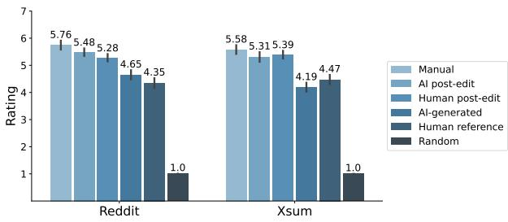  
Figure 2: Average overall quality ratings for the summaries by type and dataset. For Reddit, the human reference was the worst (aside from the Random summary). For XSum, the AI-generated summary was the worst.

## 4 Results

We report on the impact of post-editing on summary quality, efficiency, and user experience.

## 4.1 Summary Quality

We discuss quality ratings for the summaries for each dataset (Fig. 2). For simplicity, we report only on overall quality ratings from the human evaluation (see Appendix A.3.1 for other axes).

For Reddit, post-editing improved the quality of the provided summaries but manual summaries were the best. Reddit summaries produced by participants in the Manual condition were rated highest overall quality; the provided summaries, AIgenerated followed by the Human reference were the lowest quality (Fig. 2). Interestingly, our evaluation finds that the AI-generated summaries are significantly higher quality than the human references (p = .02). This is different from Zhang et al. (2020), for which the same Pegasus model achieved comparable performance to human references (but not better).

Comparing summarization conditions, we find significant differences for final summary quality (p < .01, F = 9.3): Manual summaries outperformed summaries produced by participants in both the AI post-edit (p = .03) and Human post-edit $( p < . 0 1 )$ conditions. Finally, summaries resulting from AI post-edit and Human post-edit were significantly better than the provided summaries for those conditions, Human reference $( p < . 0 1 )$ and AI-generated $( p < . 0 1 )$ , meaning participants improved the quality of the summaries they were given.

For XSum, post-editing improved the quality of the provided summaries and was just as good as manual. XSum summaries produced by participants in the Manual condition were rated the highest and the provided summaries (Human reference followed by AI-generated) were the lowest (Fig. 2). However, for XSum, summary quality was not significantly impacted by AI assistance $( p = . 0 8 , F = 2 . 5 )$ , meaning there was no significant difference in quality between the Manual, AI post-edit, or Human post-edit summaries.

Similar to Reddit, AI post-edit and Human postedit summaries were significantly better than the provided summaries for those conditions $( p < . 0 1 )$ . But, opposite of Reddit, the XSum Human reference summaries were significantly better than the AI-generated summaries $\left( p = . 0 2 \right)$

## 4.2 Efficiency

Post-editing human references slowed Reddit summarization but post-editing AI-generated summaries was faster for XSum. Summarization conditions significantly differed in efficiency (Fig. 3) for both Reddit $( p = . 0 4 , F = 3 . 2 )$ and XSum $( p = . 0 2 , F = 3 . 8 )$ . For Reddit, it took significantly longer to post-edit human references (Human post-edit) than manually (Manual, $p = . 0 3 )$ or given AI-generated summaries (AI post-edit, $p = . 0 2 )$ . We discuss possible reasons for this (e.g., problematic Reddit references) in §4.3.

For XSum, post-editing AI-generated summaries (AI post-edit) was faster than Manual $( p = . 1 1 )$ or given human references (Human post-edit, $p =$ .08). However, no pairwise comparisons were significant after correction.10

Provided summary quality did not impact the number of edits. Anticipating that participants might have needed to make more edits to improve on worse summaries, we compared the edit distance to provided summary quality (overall) using Spearman correlation. However, for neither Reddit nor XSum, did summary quality have a strong relationship to edit distance. In some cases participants made many edits to both good and bad summaries, whereas in others, they made very few edits regardless of quality (see A.3.2 for correlation plots), due in part to participants’ diverse editing styles, where some desired to make changes regardless of the provided summary quality; Moramarco et al. (2021) made similar observations. For example, P10 (Reddit, AI post-edit) “did not use [the provided summaries] at all” and P55 (Reddit, Human post-edit) edited all the summaries to match their preferred writing style, stating “I found the casual writing style confusing [...] I just did it my way.”

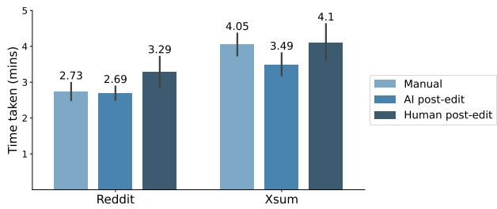  
Figure 3: Comparison between conditions for average time to summarize (per document) for Reddit and XSum. In general, participants in XSum took longer to complete the task, likely due to unfamiliarity with the domain.

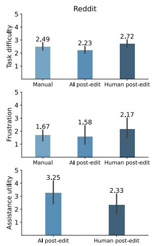

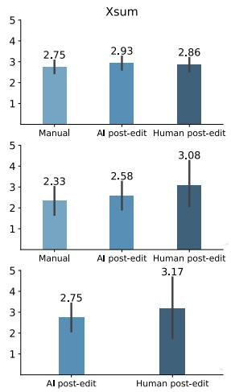  
Figure 4: User experience plots for task difficulty, “I found it difficult to summarize the article well”, frustration, “Performing the summarization tasks was frustrat-$\operatorname { i n g } ^ { \prime \prime }$ , and assistance utility, “The provided summaries were not useful to me when I was performing the summarization tasks” for Reddit (Left) and XSum (Right). Responses were collected using 7 point rating scales.

## 4.3 User Experience

We measured user experience with task difficulty, frustration, and assistance utility (Fig. 4). We also surfaced insights about participants’ experiences from the qualitative analysis.

Participants found it harder to post-edit Reddit references. Summarization conditions significantly differed for task difficulty for Reddit (p = .04, $F = 3 . 2 )$ , but not for XSum $( p = . 7 2 , F = . 3 )$ Specifically, summarizing when provided a Reddit human reference (Human post-edit) was perceived significantly more difficult than summarizing when provided an AI-generated summary (AI post-edit, $p = . 0 4 )$ . Other pairwise comparisons were not significant. Recall that post-editing human references also took longer than other conditions for Reddit; this difficultly might be due to the fact that Reddit human reference data consisted of poorly written TL;DRs, many of which add extra details not found in the original posts. As participants like P63 (Reddit, Human post-edit) and P58 (Reddit, Human post-edit) commented, some provided Reddit summaries were “really bad” or “off a bit.”

Participants were mixed on whether the provided summaries were useful. Assistance utility did not significantly differ between summarization condition for Reddit (p = .12, F = 2.4) or XSum $( p = . 6 3 , F = . 2 )$ , due in part to the high variability in participants’ responses. However, participants provided mixed responses on the utility of the summaries: while many thought they were helpful “starting points” in their summarization process, others found they sometimes missed important points or contained information that was unneeded, incorrect, or incongruous with the original article.

Participants, therefore, used the provided summaries in different ways. Some, like P59 (Reddit, Human post-edit) used the summary as a starting point or guideline and made edits on top of it, “the provided summaries did the job pretty well, I just added some details.” Others ignored the provided summary. As P61 (Reddit, Human post-edit) said, “it might have been easier to do blind summaries rather than having the provided examples.” Some participants, like P31 (XSum, Human post-edit), chose to “read the passage, write my summary, and then look at the given summary.”

Participants’ had other concerns about postediting the provided summaries during the task. Some thought it took high cognitive load to make edits and summarize at the same time, “it clouded my memory of what information the passage had actually provided” (P31 XSum, Human post-edit).

Others struggled with originality. While they perceived it “a bit like cheating” (P44 Reddit, AI postedit) to use the provided summary instead of writing their own, many also “found it difficult to provide a better summary than what was provided” (P32 XSum, AI post-edit). Finally, some participants noticed that they had the tendency to overrely on the provided summary. For example, P6 (XSum, Human post-edit) found that they were distracted from their own thinking and unlikely to challenge the provided summary, “the provided summaries deterred me from writing my own and gleaning my own major points from the articles. Instead, I would defer to the information given in the provided summaries and edit a few things, but not add anything major.”

Comprehension of the original text can impact summarization. Participants found it challenging to summarize documents that lacked context, were overly detailed, or had poor quality. While we intentionally recruited participants with some expertise for the two data types (Reddit posts and British news), many were hindered by a lack of background knowledge, especially for the British news articles (XSum). For example, P18 (XSum, Manual) said it was difficult to summarize particular articles about “the British government” because “it’s not something I am familiar with so it was hard to determine what information to include in the summary.” Similarly, P15 (XSum, Manual) mentioned difficultly summarizing articles about Cricket, which contained “sport-specific jargon or proper nouns that I was wholly unfamiliar with.” In fact, 50% of participants summarizing XSum described a lack ofcontextual knowledge compared to only 8% of participants summarizing Reddit posts. Post-editing can help in this case by providing a useful starting point so that users do not need to fully understand the document and write manually.

Participants also found it difficult to decide what was important from overly detailed original documents, particularly when summarizing manually. For example, P17 (XSum, Manual) stated, “some articles gave so many details and it took a while to decide which were important to keep in a summary.” Finally, participants were hindered by the poor quality of the original documents. For example, P60 (Reddit, Human post-edit) viewed the “lack of capitalization and proper punctuation that is common with Reddit posts” as the greatest frustration in the summarization process. Participants found it challenging to match the tone and style of these documents in their summaries. For example, in P46’s (Reddit, AI post-edit) words, it is “hard to match in the winding, anecdotal writing style often found on Reddit.”

## 4.4 Summary

Post-editing yielded better quality summaries than the automatic methods. However, compared to manual summarization, the results were mixed. For formal news articles, post-editing lead to similar quality summaries with improved efficiency, helping when participants lacked domain knowledge. However, post-editing produced worse summaries, more slowly for Reddit posts, likely due to the informal writing style and sometimes inaccurate TL;DR references provided in that case. We did not find a correlation between edit distance and provided summary quality, instead, some participants tended to make more edits—due to style or writing preferences—while others made fewer edits, instead of relying on the provided summaries— regardless of the quality of the summary they were editing.

## 5 Discussion

This work is the first large-scale study of postediting for text summarization, providing valuable insights on the benefits and drawbacks. We discuss these, as well as outline future research directions and design recommendations for post-editing summarization systems. Finally, we discuss the limitations of our experiments.

Post-editing was useful when domain context is needed. As our participants were not well-versed in the British news content of XSum, the provided summary was “useful” as a starting point (as described in qualitative responses), so that they did not have to write from scratch. This is similar to machine translation literature, which suggests that monolingual editors, despite lacking the knowledge of the other language, can still effectively improve the quality of translation via post-editing (Koehn, 2010). Beyond post-editing, systems could provide additional support when users lack domain knowledge or context, such as inline web searching to learn about unknown terms or phrases (e.g., the rules of Cricket).

Post-editing was less useful when the provided summaries were low quality. Low quality, particularly inaccurate or incoherent, provided summaries can be confusing and hard to edit, making them less “useful” as summarization assistance. Ideally, such summaries are not provided for postediting, as manual summarization would be better in those cases. Future systems should explore techniques for determining whether to provide a summary or not, based on desired summary qualities. Finally, systems might provide transparency, e.g., highlighting the important details in the original text (Lai and Tan, 2019). Then users can then decide for themselves whether or not those details are important and the summary should be trusted or ignored.

Post-editing can lead to over-reliance and stifle creativity. Humans have a tendency to overrely on AI systems (Bussone et al., 2015; Buçinca et al., 2021): prior work on text generation found users consider the provided text as an “authority” and thus feel apprehensive to make significant edits (Bhat et al., 2021). In our experiment, some participants reported a similar tendency to over-rely on the provided summary or were distracted from writing their own version of the summary; some even developed their own combative strategies: writing their summaries manually first and then referring to the provided assistance. Therefore, future systems might allow different workflows, where summaries are shown before or after manual summarization (or not at all).

Post-editing systems should cater to varied users’ preferences and needs. Users have varied summarization strategies and needs for assistance as a result of personal preferences and their experience with the domain. In our study, some preferred more control over the final summary, making lots of edits, while others made fewer edits, and a few did not use the provided summaries at all. These differences in writing style (and their effects on post-editing in text summarization) are also noted in prior work (Moramarco et al., 2021). Therefore, systems should give users control over the assistance they receive and alternative workflows, based on their preferences and needs.

Users’ needs also vary by their target audience; users might desire summaries that are longer or shorter, or more formal or informal based on who they expect will read them. Post-editing can help, allowing users to tailor summaries to different audiences with the same underlying content. Future post-editing systems might provide multiple summary options, with diverse content and/or style, from which users can choose.

Limitations. We note possible limitations of our results due to the length and nature of the task: participants only interacted with the summarization system for a short time (less than an hour) and for a task, for which they lacked ownership; also, including more participants would have given more statistical power for comparing conditions. Future work should perform experiments with more realistic and longer-term summarization engagements. Regarding our datasets, we chose two to differentiate between formal writing (i.e., news articles) and informal writing (i.e., social media posts). However, we did not experiment with more societally critical summarization tasks, such as medical or legal documents. While post-editing was useful when more domain context was needed, it is unclear how our findings would generalize to more high-risk scenarios.

## 6 Conclusion

To take advantage of the complimentary strengths of AI—which can produce summaries quickly— and humans—which can write summaries well— we explored how human-AI collaboration (i.e. postediting) impacts summary quality, human efficiency, and user experience for text summarization. Through the first large-scale study on post-editing for text summarization, we provide valuable insights on the benefits and drawbacks: compared to summarizing manually, post-editing was helpful for formal news articles, where participants lacked domain knowledge, while post-editing was less helpful for informal social media posts, for which the reference TL;DR summaries sometimes included inaccurate information. We also observed differences in participants editing strategies and needs as well as concerns of over reliance, all of which deserve future exploration. We hope this initial exploration provides a starting point for future research on post-editing in text summarization.

## References

Manik Bhandari, Pranav Narayan Gour, Atabak Ashfaq, Pengfei Liu, and Graham Neubig. 2020. Reevaluating evaluation in text summarization. In Proceedings of the 2020 Conference on Empirical Methods in Natural Language Processing (EMNLP), pages 9347–9359, Online. Association for Computational Linguistics.

Advait Bhat, Saaket Agashe, and Anirudha Joshi. 2021. How do people interact with biased text prediction models while writing? In Proceedings of the First Workshop on Bridging Human–Computer Interaction and Natural Language Processing, pages 116– 121.

Rishi Bommasani and Claire Cardie. 2020. Intrinsic evaluation of summarization datasets. In Proceedings of the 2020 Conference on Empirical Methods in Natural Language Processing (EMNLP), pages 8075–8096, Online. Association for Computational Linguistics.

Zana Buçinca, Maja Barbara Malaya, and Krzysztof Z Gajos. 2021. To trust or to think: cognitive forcing functions can reduce overreliance on ai in aiassisted decision-making. Proceedings of the ACM on Human-Computer Interaction, 5(CSCW1):1–21.

Adrian Bussone, Simone Stumpf, and Dympna O’Sullivan. 2015. The role of explanations on trust and reliance in clinical decision support systems. In 2015 international conference on healthcare informatics, pages 160–169. IEEE.

Ziqiang Cao, Furu Wei, Wenjie Li, and Sujian Li. 2018. Faithful to the original: Fact aware neural abstractive summarization. In Proceedings of the AAAI Conference on Artificial Intelligence, volume 32.

Florian Daniel, Pavel Kucherbaev, Cinzia Cappiello, Boualem Benatallah, and Mohammad Allahbakhsh. 2018. Quality control in crowdsourcing: A survey of quality attributes, assessment techniques, and assurance actions. ACM Computing Surveys (CSUR), 51(1):1–40.

Bonnie Dorr, David Zajic, and Richard Schwartz. 2003. Hedge trimmer: A parse-and-trim approach to headline generation. Technical report, MARYLAND UNIV COLLEGE PARK INST FOR ADVANCED COMPUTER STUDIES.

Wafaa S. El-Kassas, Cherif R. Salama, Ahmed A. Rafea, and Hoda K. Mohamed. 2021. Automatic text summarization: A comprehensive survey. Expert Systems with Applications, 165:113679.

Alexios Gidiotis and Grigorios Tsoumakas. 2021. Uncertainty-aware abstractive summarization. arXiv preprint arXiv:2105.10155.

Youxuan Jiang, Catherine Finegan-Dollak, Jonathan K. Kummerfeld, and Walter Lasecki. 2018. Effective crowdsourcing for a new type of summarization task.

In Proceedings ofthe 2018 Conference ofthe North American Chapter of the Association for Computational Linguistics: Human Language Technologies, Volume 2 (Short Papers), pages 628–633, New Orleans, Louisiana. Association for Computational Linguistics.

Byeongchang Kim, Hyunwoo Kim, and Gunhee Kim. 2019. Abstractive summarization of Reddit posts with multi-level memory networks. In Proceedings of the 2019 Conference of the North American Chapter of the Association for Computational Linguistics: Human Language Technologies, Volume 1 (Long and Short Papers), pages 2519–2531, Minneapolis, Minnesota. Association for Computational Linguistics.

Margaret R Kirkland and Mary Anne P Saunders. 1991. Maximizing student performance in summary writing: Managing cognitive load. Tesol Quarterly, 25(1):105–121.

Philipp Koehn. 2010. Enabling monolingual translators: Post-editing vs. options. In Human Language Technologies: The 2010 Annual Conference of the North American Chapter ofthe Associationfor Computational Linguistics, pages 537–545.

Maarit Koponen. 2012. Comparing human perceptions of post-editing effort with post-editing operations. In Proceedings of the seventh workshop on statistical machine translation, pages 181–190.

Maarit Koponen. 2016. Is machine translation postediting worth the effort? a survey of research into post-editing and effort. The Journal of Specialised Translation, 25:131–148.

Anastassia Kornilova and Vladimir Eidelman. 2019. BillSum: A corpus for automatic summarization of US legislation. In Proceedings of the 2nd Workshop on New Frontiers in Summarization, pages 48–56, Hong Kong, China. Association for Computational Linguistics.

Wojciech Kryscinski, Nitish Shirish Keskar, Bryan Mc-Cann, Caiming Xiong, and Richard Socher. 2019. Neural text summarization: A critical evaluation. In Proceedings of the 2019 Conference on Empirical Methods in Natural Language Processing and the 9th International Joint Conference on Natural Language Processing (EMNLP-IJCNLP), pages 540– 551, Hong Kong, China. Association for Computational Linguistics.

Wojciech Kryscinski, Bryan McCann, Caiming Xiong, and Richard Socher. 2020. Evaluating the factual consistency of abstractive text summarization. In Proceedings of the 2020 Conference on Empirical Methods in Natural Language Processing (EMNLP), pages 9332–9346, Online. Association for Computational Linguistics.

Vivian Lai and Chenhao Tan. 2019. On human predictions with explanations and predictions of machine

learning models: A case study on deception detection. In Proceedings of the conference on fairness, accountability, and transparency, pages 29–38.

Guy Lev, Michal Shmueli-Scheuer, Jonathan Herzig, Achiya Jerbi, and David Konopnicki. 2019. Talk-Summ: A dataset and scalable annotation method for scientific paper summarization based on conference talks. In Proceedings of the 57th Annual Meeting ofthe Associationfor Computational Linguistics, pages 2125–2131, Florence, Italy. Association for Computational Linguistics.

Hans Peter Luhn. 1958. The automatic creation of literature abstracts. IBM Journal of research and development, 2(2):159–165.

Joshua Maynez, Shashi Narayan, Bernd Bohnet, and Ryan McDonald. 2020. On faithfulness and factuality in abstractive summarization. In Proceedings of the 58th Annual Meeting of the Association for Computational Linguistics, pages 1906–1919, Online. Association for Computational Linguistics.

Francesco Moramarco, Alex Papadopoulos Korfiatis, Aleksandar Savkov, and Ehud Reiter. 2021. A preliminary study on evaluating consultation notes with post-editing. EACL 2021, page 62.

Ramesh Nallapati, Feifei Zhai, and Bowen Zhou. 2017. Summarunner: A recurrent neural network based sequence model for extractive summarization of documents. In AAAI.

Shashi Narayan, Shay B. Cohen, and Mirella Lapata. 2018. Don’t give me the details, just the summary! topic-aware convolutional neural networks for extreme summarization. In Proceedings of the 2018 Conference on Empirical Methods in Natural Language Processing, pages 1797–1807, Brussels, Belgium. Association for Computational Linguistics.

Ani Nenkova and Kathleen McKeown. 2012. A survey of text summarization techniques. In Mining text data, pages 43–76. Springer.

Romain Paulus, Caiming Xiong, and Richard Socher. 2018. A deep reinforced model for abstractive summarization. In International Conference on Learning Representations.

Mirko Plitt and François Masselot. 2010. A productivity test of statistical machine translation post-editing in a typical localisation context. In Prague Bull. Math. Linguistics.

Alexander M. Rush, Sumit Chopra, and Jason Weston. 2015. A neural attention model for abstractive sentence summarization. In Proceedings of the 2015 Conference on Empirical Methods in Natural Language Processing, pages 379–389, Lisbon, Portugal. Association for Computational Linguistics.

Abigail See, Peter J. Liu, and Christopher D. Manning. 2017. Get to the point: Summarization with pointergenerator networks. In ACL (1), pages 1073–1083.

Nisan Stiennon, Long Ouyang, Jeff Wu, Daniel M Ziegler, Ryan Lowe, Chelsea Voss, Alec Radford, Dario Amodei, and Paul Christiano. 2020. Learning to summarize from human feedback. arXiv preprint arXiv:2009.01325.

Xiangru Tang, Alexander R Fabbri, Ziming Mao, Griffin Adams, Borui Wang, Haoran Li, Yashar Mehdad, and Dragomir Radev. 2021. Investigating crowdsourcing protocols for evaluating the factual consistency of summaries. arXiv preprint arXiv:2109.09195.

Oguzhan Tas and Farzad Kiyani. 2007. A survey automatic text summarization. PressAcademia Procedia, 5(1):205–213.

Lucas Nunes Vieira. 2019. Post-editing of machine translation. In The Routledge Handbook of Translation and Technology, pages 319–336. Routledge.

Michael Völske, Martin Potthast, Shahbaz Syed, and Benno Stein. 2017. Tl; dr: Mining reddit to learn automatic summarization. In Proceedings ofthe Workshop on New Frontiers in Summarization, pages 59– 63.

Jingqing Zhang, Yao Zhao, Mohammad Saleh, and Peter Liu. 2020. Pegasus: Pre-training with extracted gap-sentences for abstractive summarization. In International Conference on Machine Learning, pages 11328–11339. PMLR.

Justin Jian Zhang and Pascale Fung. 2012. Active learning with semi-automatic annotation for extractive speech summarization. ACM Transactions on Speech and Language Processing (TSLP), 8(4):1– 25.

## A Appendix

Our study explored how providing summaries for post-editing affects summary quality, efficiency, and user experience compared to fully manual or fully automatic approaches. The study involved two phases: (1) summary collection (Appendix A.1) and (2) human evaluation of the collected summaries (Appendix A.2). We also report on additional results (Appendix A.3)

## A.1 Summary Collection

We collected summaries through a summarization task, where participants first reviewed documents (from either Reddit or XSum) and summarized them, either without any assistance or provided with a human-written or model-generated summary they could edit.

In the following, we describe details on the documents included in our study, how we piloted the task and interface, and more information about the study procedure.

## A.1.1 Document Length Distribution

Participants summarized 120 documents from the test sets (10 documents per participant, per condition),11 with length between the 25th and 75th percentile to balance task difficulty and time. Figure 5 gives the length distribution for both datasets.

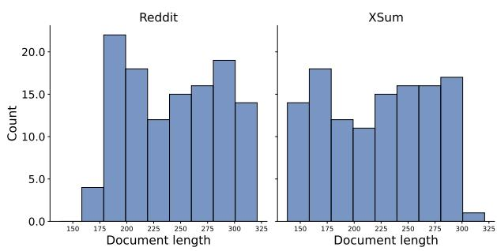  
Figure 5: This figure shows the document length of distribution of both datasets. The average length of the Reddit posts is 243.8 words, and the average length of the XSum articles is 222.3 words.

## A.1.2 Piloting the Summarization Task and Interface

We performed two pilot study sessions (with researchers and Upwork pilot participants) for feedback on the web application, procedure, and to estimate session duration. The first was conducted among five researchers from our lab and the second was conducted with 12 representative users from Upwork (see §3), which were later included in the main study.

<table><tr><td>Criteria</td><td>Explanation</td></tr><tr><td>Essence</td><td>The summary is a good representation of the post.</td></tr><tr><td>Clarity</td><td>The summary is reader-friendly. It expresses ideas clearly.</td></tr><tr><td>Accuracy</td><td>The summary contains the same information as the longer post</td></tr><tr><td>Purpose</td><td>The summary serves the same purpose as the original post.</td></tr><tr><td>Style</td><td>The summary is written in the same style as the original post.</td></tr></table>

Table 2: We showed this set of summary criteria to the participants in both tutorial and actual task.

## A.1.3 Summarization Study Procedure

During the study, participants completed three phases: (1) instructions, tutorial, and practice; (2) summarization task; and (3) post-task survey. During the instructions, tutorial, and practice phase, participants reviewed task instructions, the criteria for writing a good summary (Table 2), and examples of good and bad summaries with explanations (Fig. 6 and Fig. 7). Participants then applied what they learned and practiced to write a good summary. To refrain from any confusion, the interface in the practice phase is exactly the same as the actual summarization task phase. Participants have access to the criteria as guidance at any time during the task (Fig. 8a). Participants then performed the summarization task as described in §3.4. After completing each summary, participants rated their agreement for the following statements (Fig. 8b): (1) I found it difficult to understand the content of the document; (2) I found it difficult to summarize the document well. Finally, participants responded to an exit survey before ending the study, where they answered questions regarding task ease, frustration, their familiarity with the domain (i.e., Reddit, British news and culture), if the provided assistance was useful, and what they liked and disliked about the summarization task and interface.

## A.2 Human Evaluation of the Collected Summaries

We used human evaluation to assess the quality of the summaries we collected during our study. Each annotation task involved reading a news article or Reddit post and evaluating six different summaries for that document.

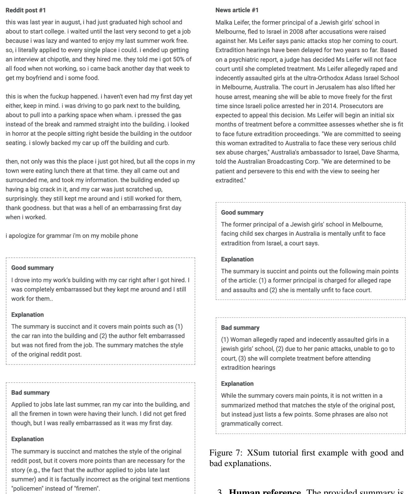  
Figure 6: Reddit tutorial first example with good and bad explanations.

## A.2.1 Example Summaries

We evaluated six types of summaries:

1. Manual. It was written without assistance.

2. AI-generated. The provided summary was generated by the Pegasus model.

3. Human reference. The provided summary is from the original dataset.

4. AI + post-edit. It was written by a human who was shown a AI-generated summary.

5. Human + post-edit. It was written by a human who was shown a reference summary.

6. Random. It was generated by randomly selecting two sentences from another dataset. This summary helped to weed out annotators who did not pay attention. For instance, if the participant sees a Reddit post, the Random summary is a summary generated from a news article from the XSum dataset.

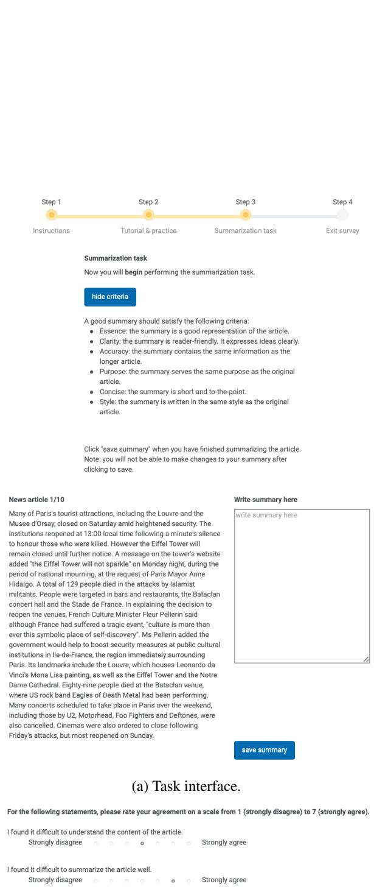  
(b) Questions regarding the summarization task.  
Figure 8: Task interface and questions on the summarization task.

Table 3 demonstrate the six example summaries for one document.

## A.2.2 Summary Evaluation Procedure

The annotator went through two phases during the human evaluation task: (1) tutorial (Fig. 9a) and attention check (Fig. 9b); and (2) evaluating summaries (Fig. 9c and Fig. 9d). A tutorial with two examples was provided at the start of the task to teach the participant how to evaluate a summary. To further solidify their understanding, we also included two examples with ratings and explanations. Explanations were curated by the researchers and iterated a few times upon getting feedback. We included an attention check open-ended question to ensure that the participant read through and understood the tutorial. The task would only begin when they give the correct answer. Before the actual task, to ensure that annotators read the document, we asked them to write a short title after they read it. During the task, anchors for the original post and definition of axis are easily accessible, allowing annotators to refer to them whenever they wanted to. A HIT 12 included reading a document and evaluating six different types of summaries of it. For each HIT an annotator does, they are paid \$1.50. After removing annotators that failed the attention check, the average time taken to complete a HIT is 13.5 minutes (SD=5.7). Although the hourly rate may seem low, we learned from the annotators that turkers tend to open up to 25 tabs of HIT while working. As such, the time taken also included idle time, meaning that the actual average time taken could be less than 13.5 minutes. Additionally, annotators did 9.4 HITs on average.

## A.2.3 Eliminating the bad apples.

To ensure high-quality evaluations, we performed quality control to eliminate annotators with validation procedures: attention check with a “random” summary, batched deployment, and removing outliers. We detail each of these procedures in the following.

Attention check: random summary. We incorporated an attention check to weed out annotators who did not pay attention and simply clicked through the rating scales. For this, we inserted a random summary to rate, which was generated by randomly selecting two sentences from the opposite dataset. Further, we randomize the order of summaries, ensuring that the random summary would not always appear in the same position.Since the random summary is created with sentences from a document from an entirely different dataset, it is fair to assume that the content will not cover nor be accurate as a summary. Therefore, we eliminated annotators (and discarded their responses) who did not give a rating of 1 to both coverage and accuracy.

<table><tr><td>Condition Document</td><td>Reddit</td><td>XSum</td></tr><tr><td></td><td>so today i went to the zoomarine in algarve, portugal and my family decided to go watch the interactive pirate show (basicly pirates play around with the crowd), so far so good... we sit down and to my right, this long hair, tatooed, bearded, baggy clothes, pirate looking guy sits down by himself. a bit after my mom without moving her head asks me if i have seen the pirate &quot;hiding&quot; which i quietly answer to with &quot;yeah&quot;. here i am thinking &quot;nice! he is probably gonna let me take a photo with him!&quot;. so, i get my camera and ask him if i could take a picture with him. well, just when i am starting to pose for the picture, he stands up and starts cursing giberish in spannish (in other words: not in portuguese) and got everyone in the audience and my entire family looking at me and him like it is part of the show... at this point my mom looks even more confused than me thinking what i could have done. needless</td><td>The former Tottenham player, 29, is the Spanish clubś first signing since Neymar left to join Paris St-Germain in a world record transfer. Meanwhile, Barcaś Uruguayan forward Luis Suarez will be out for &quot;four to five weeks&quot; after he was injured in the Super Cup defeat by Real Madrid. He will also miss World Cup qualifiers against Argentina and Paraguay. Paulinho joined Tottenham for £17m from Corinthians in 2013, before moving to China in 2015. He helped Evergrande win last seasonś Chi- nese Super League and leaves the team top of the table in the current campaign. Paulinho said: &quot;You have to face challenges with courage. I will try to do my job and I am prepared. Itś a very satisfying mo- ment. The dream I have been looking for has come true. I will give everything.&quot; Barcelona are also keen on Liverpool midfielder Philippe Coutinho and Borussia Dortmund forward Ousmane Dembele. to say, later in the show the pirate my mom was</td></tr><tr><td>Manual</td><td>My family and I went to an interactive pirate show and accidentally mistook a shabbily dressed audi- ence member for a secret pirate actor by asking to take a picture with him.</td><td>This week in sport&#x27;s news, Spanish club has signed its first player since Neymar left to join Paris St- Germain, he gives motivation words ahead of sea- son. While, Uruguayan forward Luis Suarez will be out recovering from an injury from Super Cup defeat.</td></tr><tr><td>AI post-edit</td><td>asked a pirate if i could take a picture with him, he started cursing in spannish and got everyone in the audience and my entire family looking at me and him like it is part of the show.</td><td>Barcelona have signed Brazil midfielder Paulinho from Chinese club Guangzhou Evergrande for an undisclosed fee.</td></tr><tr><td>Human post-edit</td><td>went to pirate show, saw a pirate looking guy, tried to take selfie with him, it was an evil hipster.</td><td>Barcelona have signed Brazil midfielder Paulinho from Chinese club Guangzhou Evergrande for 40m euro (£36.4m).</td></tr><tr><td>AI-generated</td><td>today at the zoomarine in algarve, portugal i wanted to take a picture with a pirate but he started cursing and then things got weird</td><td>Barcelona have signed Brazil midfielder Paulinho from Chinese club Guangzhou Evergrande for an undisclosed fee. Suarez to be out four to five weeks with an injury.</td></tr><tr><td>Human reference</td><td>Was watching an interactive pirate show and thought the guy next to me was an actor. Asked to take a selfie and got yelled at in Spanish. He wasn&#x27;t an actor.</td><td>Barcelona signs Paulinho, while also seeking out Philippe Coutinho and Ousmane Dembele. Suarez is expected to miss two World Cup qualifying games due to injury.</td></tr><tr><td>Random</td><td>Avon and Somerset Police have named the victim as Matthew Symonds, 34, of no fixed address in Swindon, and said his death was being treated as unexplained. A post-mortem examination is due to be carried out later.</td><td>would anyone really mind if i just kept internet explorer (**my school computers have no other internet browsers help**) open on the side and just read some funny tifus??? the whole class bursts out laughing.</td></tr></table>

Table 3: Reddit and XSum example summaries.

Batched deployments. To ensure only highperforming annotators participated in our evaluations and maintain the integrity of our results, we followed a batched deployment procedure opposed to deploying all evaluations at once. We deployed a total of 1200 evaluations (i.e., 120 HITs x 2 datasets x 5 samples) on Amazon Mechanical Turk, splitting the assignments into 10 batches. At the end of a batch deployment, annotators who failed the attention check (random summary) had their qualification revoked and not allowed to accept future HITs for our evaluation task. A total of 113 annotators completed the 1200 evaluations.

Removing outliers. Finally, while we had 5 annotators evaluating a summary, not all five ratings were taken into consideration. We removed any outlier ratings following a standard approach: 1.5 more or less than the inter quartile range (IQR). Table 4 show the variance for each condition per dataset after removing outliers.

## A.2.4 Thematic Coding

We performed thematic coding to analyze the openended responses in our study. A researcher in the team first manually coded the data and iteratively developed themes from answers of each question. For example, "lack of context knowledge" is one of the themes developed from the answers to the question on why participants rated the task as difficult. The researcher then discussed the themes with the team, merged and updated the themes, then recoded the data again. To validate the coding results, a second researcher also coded the data based on the themes developed by the first researcher.

## A.2.5 Summary Quality Criteria: Coherence, Accuracy, Coverage, and Overall

Annotators were tasked to evaluate a summary according to four axes on a scale of 1 to 7 (Stiennon et al., 2020). The definition of each axis is listed as below:

1. Coherence. A summary is coherent if, when read by itself, it’s easy to understand and free of English errors. A summary is not coherent if it’s difficult to understand what the summary is trying to say. Generally, it’s more important that the summary is understandable than it being free of grammar errors.

2. Accuracy. A summary is accurate if it doesn’t say things that aren’t in the article, it doesn’t mix up people, and generally is not misleading. If the summary says anything at all that is not mentioned in the article or contradicts something in the article, it should be given a maximum score of 5.

3. Coverage. A summary has good coverage if it mentions the main information from the article that’s important to understand the situation described in the article. A summary has poor coverage if someone reading only the summary would be missing several important pieces of information about the situation in the article. A summary with good coverage should also match the purpose of the original article (e.g. to ask for advice).

4. Overall. This can encompass all of the above axes of quality, as well as others you feel are important. If it’s hard to find ways to make the summary better, give the summary a high score. If there are lots of different ways the summary can be made better, give the summary a low score.

<table><tr><td></td><td>Condition</td><td>Rating (σ)</td></tr><tr><td rowspan="5">Reddit</td><td>Manual</td><td>0.81</td></tr><tr><td>AI post-edit</td><td>0.95</td></tr><tr><td>Human post-edit</td><td>1.05</td></tr><tr><td>AI-generated</td><td>0.63</td></tr><tr><td>Human reference</td><td>0.66</td></tr><tr><td rowspan="4">XSum</td><td>Manual</td><td>0.85</td></tr><tr><td>AI post-edit</td><td>0.84</td></tr><tr><td>Human post-edit</td><td>0.89</td></tr><tr><td>AI-generated</td><td>1.02</td></tr><tr><td></td><td>Human reference</td><td>0.63</td></tr></table>

Table 4: Variance between ratings for each condition per dataset for the Overall rating.

## A.2.6 Research Experiment Ethics

Participants from Upwork and annotators from Amazon Mechanical Turk were aware of how the data collected would be used. They were assured that no personally identifiable information was collected from them. For participants on Upwork, the written summaries and exit survey responses were collected from them. Similarly, for annotators on Amazon Mechanical Turk, only responses and ratings were collected. Before working on the task, participants and annotators were made to read a description of the task and working on the task meant that they were aware of what was collected.

## A.3 Results

## A.3.1 Ratings on Coherence, Accuracy, and Coverage

In the main paper, we reported only overall ratings. Fig. 10 shows the plots for coherence, accuracy, and coverage ratings. Both Reddit and XSum summaries produced by participants in the Manual condition were rated highest accuracy and coverage quality.

In Reddit, AI assistance significantly impacted coherence $( p < . 0 1 , F = 1 5 . 4 )$ and coverage $( p <$ .01, F = 7.9) but not accuracy $( p = . 4 8 , F =$ .7): Manual summaries outperformed summaries produced by participants in both the AI post-edit (p = .01 for coherence, $p = . 0 1$ for accuracy) and Human post-edit $( p < . 0 1$ for coherence, p = .01 for accuracy) conditions.

In XSum, AI assistance significantly impacted accuracy $( p = . 0 3 , F = 3 . 5 )$ and coverage (p = .02, F = 3.8) but not coherence (p = .84, F = .17): Manual summaries outperformed summaries produced by participants in Human post-edit (p = .03 for accuracy) and AI post-edit (p = .01 for coverage).

## A.3.2 Correlation between Edit Distance and Summary Quality

We compared edit distance and overall summary rating and found weak to no correlation (p = $0 . 4 , \rho = - 0 . 0 5$ for Reddit and $p = . 0 2 , \rho = - 0 . 2$ for XSum) between the two factors. For XSum, while this suggests that the bigger the edit distance, the poorer the overall summary rating, the correlation score is very small. On the other hand, there is no correlation between edit distance and overall summary rating in Reddit. Fig. 11 shows the plots for both datasets.

## A.3.3 User Experience

In the main paper, we reported insights from qualitative analysis for task difficulty, frustration, and assistance utility (§4.3). We also conducted thematic coding on why participants enjoyed working on the summarization task.

The summarization task was enjoyable and educational. Many participants enjoyed working on the task, describing the experience as educational (e.g., P14 (XSum, Manual), “it made me think about the information I had read and how to best condense it”). Others enjoyed reading the original text (e.g., P53 (Reddit, AI post-edit), “these stories are quite interesting, the summaries make me make sure I understood what I just read"), and felt a sense of achievement when finished (e.g., P36 (XSum, Human post-edit), “it was satisfying to reduce a block of text down to a succinct sentence or two”).

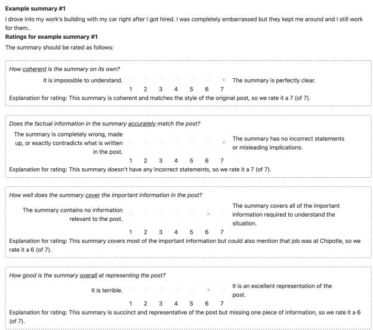

(a) Tutorial interface.  
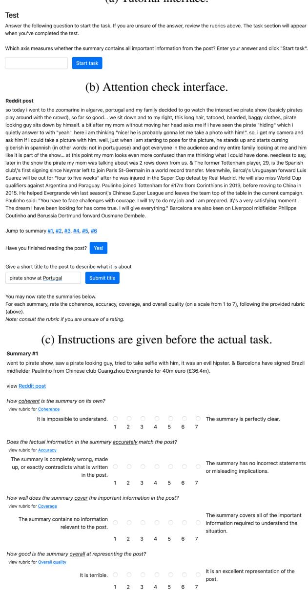  
(d) Evaluation interface.  
Figure 9: Annotation interfaces.

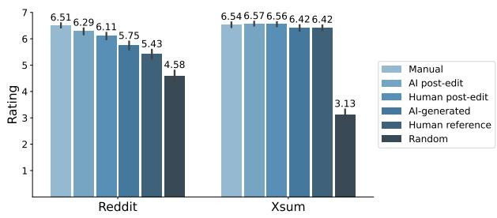

(a) Coherence rating.  
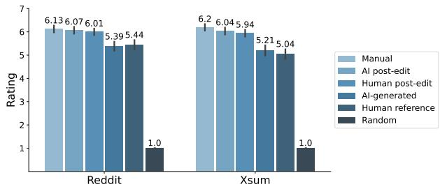

(b) Accuracy rating.  
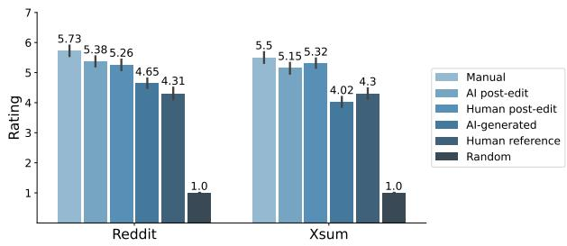  
(c) Coverage rating.  
Figure 10: Human evaluation rating on coherence, accuracy, and coverage.

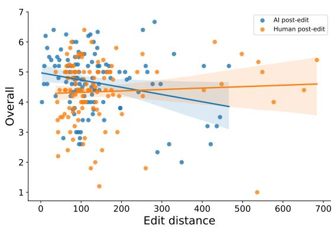

(a) Reddit  
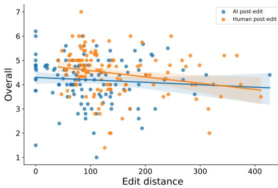  
(b) XSum  
Figure 11: Edit distance vs. Overall rating