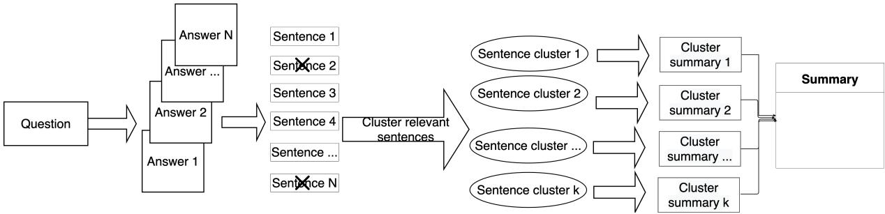
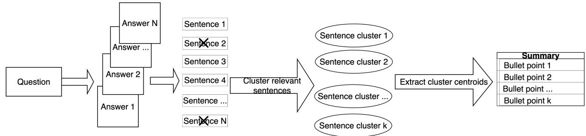
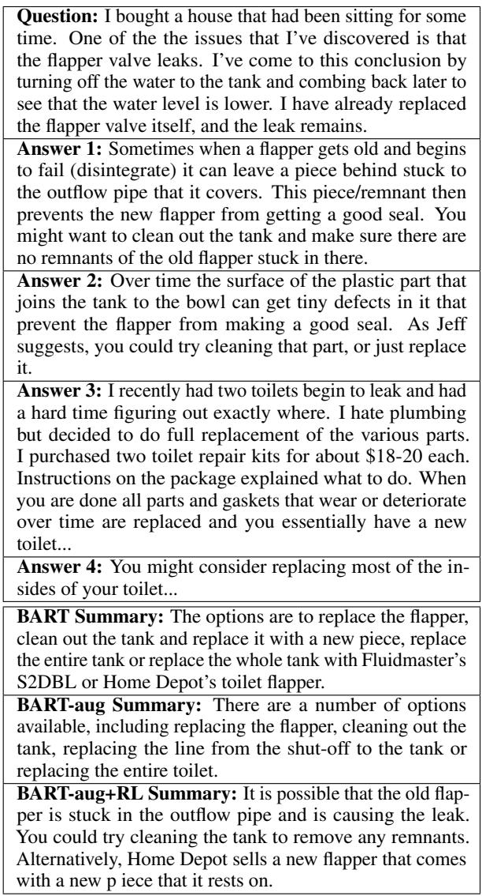

# AnswerSumm: A Manually-Curated Dataset and Pipeline for Answer Summarization

Alexander R. Fabbri† ∗ Xiaojian Wu‡ Srini Iyer‡ Haoran Li‡ Mona Diab‡

† Yale University ‡ Facebook AI

afabbri@salesforce.com

{xiaojianwu,sviyer,aimeeli,mdiab}@fb.com

## Abstract

Community Question Answering (CQA) fora such as Stack Overflow and Yahoo! Answers contain a rich resource of answers to a wide range of community-based questions. Each question thread can receive a large number of answers with different perspectives. One goal of answer summarization is to produce a summary that reflects the range of answer perspectives. A major obstacle for this task is the absence of a dataset to provide supervision for producing such summaries. Recent works propose heuristics to create such data, but these are often noisy and do not cover all answer perspectives present. This work introduces a novel dataset of 4,631 CQA threads for answer summarization curated by professional linguists. Our pipeline gathers annotations for all subtasks of answer summarization, including relevant answer sentence selection, grouping these sentences based on perspectives, summarizing each perspective, and producing an overall summary. We analyze and benchmark state-of-the-art models on these subtasks and introduce a novel unsupervised approach for multi-perspective data augmentation that boosts summarization performance according to automatic evaluation. Finally, we propose reinforcement learning rewards to im prove factual consistency and answer coverage and analyze areas for improvement.

## 1 Introduction

In a world of information overload and the ubiquity of discussion fora, there is a need for text summarization as a means of distilling relevant information into a concise form. The problem is even more pertinent for question answering within the context of Community Question Answering (CQA) fora, where a person poses a question and can get an abundance of answers to sift through. Ideally, an answer summary should cover the multiple perspectives found in the answers, where available. Table 1 illustrates such an example where a person poses a question about relocating to the US and obtaining a credit score and a credit card. We present a sample of the 8 answers to that question on StackExchange and a manually-curated summary covering the answers’ main perspectives. Answer summarization is a form of query-based, multi-document summarization (Ernst et al., 2020), and creating answer summaries that reflect the underlying varying perspectives entails several subtasks: selection of answer sentences relevant to the question (query sentence relevance), grouping these sentences based on perspectives (clustering), summarizing each perspective (cluster summarization), and producing an overall fused summary (fusion).

<table><tr><td rowspan=1 colspan=1>Question: I recently relocated to USA and have no CreditScore. Is Secure Credit Card is the only option for me tostart building my credit score? Also please recommendwhich other credit cards are available for people like meto build credit score</td></tr><tr><td rowspan=1 colspan=1>Answer 1: If you have an AMEX from another country,you can get an AMEX in the US. American Express has aseparate system that is not as strongly country-dependentas, say, VISA and MasterCard...</td></tr><tr><td rowspan=1 colspan=1>Answer 2: Secured credit cards are usually not very costeffective for building credit. Find a local credit union, ofmedium to large size. A credit union is like a bank, butoperates under slightly different rules, and is non-profit...</td></tr><tr><td rowspan=1 colspan=1>Answer 3: If you have had an American Express cardabroad, you can try and get a US Amex...</td></tr><tr><td rowspan=1 colspan=1>Answer 4: If the country you came from has an HSBC,you can ask HSBC to use your credit rating from thatcountry to give you an HSBC Mastercard in the US...</td></tr><tr><td rowspan=1 colspan=1>Summary:</td></tr><tr><td rowspan=1 colspan=1>There are a range of options available to you, althoughyour chance of success will depend on the bank that youapply with. However, if you have previously had a cardwith HSBC or American Express, the process may besimpler. Other options could include borowing from acredit union or asking a friend or family member to be anadditional cardholder with you.</td></tr></table>

Table 1: An example summary from our AnswerSumm dataset, illustrating the multiple viewpoints present manually-written summaries, and a subset of the 8 user answers to which the summary can be aligned.

To date, most CQA fora have a notion of a ’best answer,’ which is either manually chosen by the person who asked the question or by a moderator, or obtained via community ratings. Work in this field typically makes use of this best answer as a proxy for summaries, i.e. the focus is on extractivelike summaries (Tomasoni and Huang, 2010; Chan et al., 2012; Pande et al., 2013; Wang et al., 2014; Song et al., 2017). Datasets such as WikiHowQA (Deng et al., 2020a), which consists of a question, a long answer, and an answer summary, focus on answer selection and the summarization of a single answer. While CQASumm (Chowdhury and Chakraborty, 2019) uses the chosen best answer as the answer summary, they also apply heuristics to ensure token overlap with the remaining answers. However, the best answer only presents one person’s perspective and rarely captures the variety of perspectives discussed in a thread. Furthermore, we find that the heuristics applied in CQASumm generally promote only long answers instead of multiple perspectives. To validate our hypothesis, we examine a set of 30 summaries from CQASumm and found that only 37% of the examples contained multi-perspective answers. In contrast, 75% of our dataset requires multi-perspective summaries.

As alluded to above, although answer summarization is an important research topic with practical applications, there are no relevant datasets or techniques to address it effectively, i.e. no manually-curated dataset exists for the answer summarization problem, and no dataset decomposes the task into its constituent subtasks. This work tries to close the research gap in answer summarization; we develop an annotation pipeline for multiperspective abstractive answer summarization. We introduce the largest human-annotated dataset for answer summarization, containing components for sentence relevance, clustering, cluster summarization, and global answer summarization. We enlist ten professional linguists to contribute to our annotation efforts. We iterate over instructions and devise pre-pilot, pilot, and final annotation stages as well as re-annotation for quality assurance. We collect over 4,631 high-quality data points. For validation of our curated data set, we benchmark stateof-the-art models on the subtasks of this dataset and perform qualitative analysis to provide a clear baseline and directions for future work. We then propose a data augmentation pipeline to further boost summarization performance. To generate a silver multi-perspective summarization dataset, we introduce a pipeline for automatically creating multi-perspective bullet-point answer summaries for data augmentation, which boosts performance. We find that a strong baseline model trained on our human-annotated data inherently outputs factually consistent summaries, and model performance is improved by adding data from our automated pipeline. Finally, we introduce entailment-based and semantic area RL rewards namely to analyze its effect on factual consistency and semantic coverage, ensuring we are capturing all factually relevant perspectives. 1

## 2 Related Work

Extractive Answer Summarization: Much work has focused on the extractive summarization setting as an answer-ranking problem (Chan et al., 2012; Pande et al., 2013; Wang et al., 2014). Liu et al. (2008) find that only 48% of the best answers on Yahoo! Answers are unique best answers; there are multiple correct ways to answer a question. Other recent work has focused on sentence extraction using metadata (Tomasoni and Huang, 2010), sparse-coding frameworks (Song et al., 2017), or answer-aware sequential extraction (Deng et al., 2020b). Our focus is on an answer summarization pipeline which ultimately results in abstractive answer summaries.

Abstractive Answer Summarization: Another line of work has attempted abstractive answer summarization by treating the tagged best answer as the gold summary of all the other answers (Chowdhury and Chakraborty, 2019; Chowdhury et al., 2020). Recent work summarizes answers to medical questions via a medical concept graph Zhang et al. (2020) and incorporates multi-hop reasoning (Zhang et al., 2020) and answer relevance from a QA model into the summarization model (Su et al., 2021). Most related to our dataset creation, Chowdhury and Chakraborty (2019) present CQASumm, a dataset of about 100k automatically-created examples consisting of the best answer as the gold summary, which, however, contains noise due to automatic creation.

Multi-document Summarization: Answer summarization can be viewed as a query-based multidocument summarization (MDS) problem. Approaches to query-focused multi-document summarization have dealt with data sparsity via data augmentation (Pasunuru et al., 2021) by restructuring the title and paragraphs of news articles to match the target task, coarse to fine-grained modeling Xu and Lapata (2020), and by converting generic summarization data into proxy queries (Xu and Lapata, 2021) Several large-scale MDS datasets have been introduced in the news domain (Fabbri et al., 2019; Gu et al., 2020; Gholipour Ghalandari et al., 2020), for creating Wikipedia lead-paragraphs (Liu et al., 2018) and for long-form question answering (Fan et al., 2019). However, Wikipedia summarization is topic-based and less granular than our setting, and the ELI5 dataset (Fan et al., 2019) summarizes web documents rather than direct query answers.

## 3 AnswerSumm

We introduce our annotation protocol and the characteristics of our manually-curated answer summarization dataset. Our annotation pipeline is illustrated in Figure 1.

Annotation Protocol Our annotation pipeline consists of four steps 1) Answer Sentence Selection (SentSelect), 2) Clustering (SentCluster), 3) Cluster Summarization (ClusterSumm), and 4) Cluster Summary Fusion (ClusterSummFusion). We refer to the task of taking forum answers and producing final overall summaries E2ESumm. We believe that this pipeline mirrors the process by which humans create summaries of multiple answers by narrowing and organizing information, followed by paraphrasing. Furthermore, dividing the summarization task in such a way paves the way for future work in understanding the steps by which a model creates a final summary, and recent work has similarly divided multi-document summarization into these subtasks (Ernst et al., 2020). For consistency, the same annotator completes all four steps for a given example. However, we surmise that if each subtask is performed well, then multiple annotators can be involved for a given example.

For a given question thread, we present the annotator with the question, the forum from which the question came, the title of the post, and the tags that the original poster associated with the question. The user answers are then presented, where each answer has been automatically segmented into individual sentences using SpaCy (Honnibal et al., 2020). It is worth noting that sentence-level granularity is chosen as a simplifying assumption as an appropriate level of segmentation. We are cognizant that clause level might be more accurate, however, given state-of-the-art clause detection as well as the precedence for sentence-level modeling in previous work (Tomasoni and Huang, 2010; Song et al., 2017), we opted for sentence-level segmentation.

Answer Sentence Selection (SentSelect): We ask the annotators to mark each sentence as relevant or not depending on whether it provides information useful in answering the user’s question. Annotators are instructed to mark as irrelevant sentences that do not function as independent units, such as those which need additional context to be understood as an answer to the question. As a result, noise from sentence segmentation may cause certain sentences to be marked as not relevant, but upon manual inspection, we found this to not be an issue.

Clustering (ClusterSumm): Annotators then cluster found relevant sentences into groups of the same topic. Sentences that are on the same topic but have different polarities are grouped together. We do not pre-define a desired number of clusters. Furthermore, clusters consisting of a single item are allowed, and a sentence can belong to multiple clusters. A sentence in multiple clusters may occur in the case of complex sentences which present multiple viewpoints.

Cluster Summarization (ClustSumm): The annotators summarize each individual cluster of relevant sentences from the previous step. Each cluster summary should typically consist of 1-4 complete sentences. To allow for abstract summaries, we instruct the annotators to try to use their own words (paraphrase) instead of copying large segments of the sentence clusters verbatim. Using the sentences’ exact words is allowed, but they should not copy more than five consecutive words from a sentence. Additionally, the summary should function as an answer rather than as an analysis of the summary sentences. So, rather than stating, “Most of the answers indicate that it is highly subjective,” the annotator writes directly “It is highly subjective.” To ensure that the summary information can be found in the input answers, we also instruct the annotators to focus solely on the answer threads and not their external knowledge of the subject. The summary should solely (1) summarize the viewpoint present in the sentence cluster; and, (2) try to include some specific details from the assertions and anecdotes made by the answer sentences.

  
Figure 1: An illustration of our dataset annotation pipeline. Given a question and answers to that question, professional linguists 1) select relevant sentences, 2) cluster those selected sentences, 3) summarize each cluster’s sentences, and 4) fuse clusters into a coherent, overall summary.

We leave it to the annotator’s judgment to leave out details from clusters that are too minute.

Cluster Summary Fusion (ClusterSummFusion): The annotator combines the cluster summaries from the previous step into a single, coherent summary. The annotators can apply additional paraphrasing and need not simply insert each cluster summary; they may combine some cluster summaries into a single sentence. The annotator is asked to order and insert discourse connectives as necessary to increase inter-sentential coherence in the final summary.

Data Filtering We selected question threads for annotation from the StackExchange data release2, as it is publicly available and has been shared using a Creative Commons ShareAlike license. We created a whitelist of non-technical fora which do not require domain knowledge to summarize, similar to work on non-technical email summarization (Ulrich et al., 2008). We sampled from 38 fora. Table 3 illustrates the top 20 fora and their frequency. In addition to this preliminary filtering, we further prompted annotators to discard any examples for which they felt unable to adequately assess the relevance of answer sentences to a question due to lack of required domain knowledge or context.

The filtering of question threads was motivated by heuristics detailed in Tomasoni and Huang (2010), which aims to find threads suitable for summarization. We only include answers with a nonnegative community score which is determined by the number of upvotes by community members minus the number of downvotes. Moreover, they do not include comments to answers for simplicity, although future work may incorporate this into modeling. Threads were removed if 1) there were less than four answers, 2) the sum of the length of all answers was outside of (100, 1500) words, and 3) the average length of answers was outside of the (50, 300) words interval. Questions include the subject of the post and the content of the post when available. Out of about 870k question threads, about 8k met these criteria. While this filtering may be strict, it avoids threads that contain short or single answers for which summarization may be superfluous, thus creating a higher-quality, diverse, dataset as confirmed by our analysis that 75% of our examples require multi-perspective summaries

Quality Controls Our annotators are 10 professional linguists recruited through a professional vendor. We provide the linguists with an example of an annotated question thread for clarity and discussed the instructions in-depth with the vendors to avoid ambiguities. To ensure that the linguists are well-trained and that the annotations meet our requirements, we completed our annotations in three stages. We began with a pre-pilot of 50 example question threads, followed by a pilot of 500 examples and then a final set of 5000 examples. We divide annotation files into groups of 50 examples, which are split among the annotators. We make use of the pilot and final annotation sets for our dataset release. To determine inter-annotator agreement (IAA), 250 examples were repeated across three annotation files. A Fleiss Kappa of 0.25 was achieved for sentence relevance selection, the first task. The IAA score indicates fair agreement.

Dataset Statistics and Comparison We provide statistics about the subtasks from our dataset pipeline in Table 2. There does not exist a manually-curated dataset for abstractive answer summarization. CQASumm is the closest dataset with our desired answer summarization qualities, although it is created automatically based on heuristics which simply promote answers as summaries rather than truly summarizing answers. We also present a comparison of dataset statistics between our dataset AnswerSumm, and the standard XSum and CNN-Daily Mail (Nallapati et al., 2016) summarization datasets in Table 4. In general, we find our dataset to be more abstractive than CNN-DailyMail and less so than XSum. Furthermore, the average number of input tokens for the E2ESumm task, is larger than those two datasets, confirming that the input to our tasks provides reasonable grounds for requiring summarization.

<table><tr><td>Task</td><td>Input</td><td>Output</td></tr><tr><td>SentSelect</td><td>6.4 Ans 40.3 Sents 787 Words</td><td>9.2 Sents</td></tr><tr><td>SentCluster</td><td>9.2 Sents</td><td>2.6 Clusters</td></tr><tr><td>ClusterSumm</td><td>3.4 Sents 77 Words</td><td>21 Words</td></tr><tr><td>ClusterSummFusion</td><td>55 Words</td><td>47 Words</td></tr></table>

Table 2: Average statistics for input and output across the four Answersumm subtasks. E2ESumm’s input is that of the SentSelect and the output is that of Cluster-SummFusion.
<table><tr><td>Forum</td><td>Frequency</td><td>Forum</td><td>Frequency</td></tr><tr><td>English</td><td>662</td><td>Travel</td><td>356</td></tr><tr><td>Cooking</td><td>636</td><td>Music</td><td>262</td></tr><tr><td>Gaming</td><td>485</td><td>Bicycles</td><td>242</td></tr><tr><td>SciFi</td><td>408</td><td>DIY</td><td>213</td></tr><tr><td>ELL</td><td>378</td><td>Aviation</td><td>190</td></tr></table>

Table 3: The ten most frequent forums found in the AnswerSumm dataset and their associated counts.

## 4 Pipeline for Data Augmentation

Manually annotating data at the scale of other existing summarization datasets such as CNN-DailyMail is impractical. Taking advantage of the abundance of unlabeled StackExchange fora available, we develop a pipeline to automatically create data similar to that which is manually annotated above. This process provides augmented data for training summarization models.

Data Filtering Similar to filtering for manual annotation, we obtained question threads from StackExchange and applied heuristics motivated by Tomasoni and Huang (2010) to find threads suitable for summarization. Threads are removed if: 1) there are less than three answers; 2) the longest answer is at least 400 words; 3) the input token length of all answers is not between 100 and 1000 words;

<table><tr><td>Dataset</td><td>Novel unigrams</td><td>Ext. Oracle</td><td>Input Len</td><td>Summ Len</td></tr><tr><td>AnswerSumm</td><td>21.0</td><td>40.05/18.45/35.70</td><td>787</td><td>47</td></tr><tr><td>XSUM</td><td>35.8</td><td>29.79/8.81/22.65</td><td>431</td><td>23</td></tr><tr><td>CNN</td><td>16.8</td><td>50.38/28.55/46.58</td><td>761</td><td>46</td></tr><tr><td>DailyMail</td><td>17.0</td><td>55.23/30.55/51.24</td><td>653</td><td>55</td></tr></table>

Table 4: Comparison between AnwerSumm and the XSum (Narayan et al., 2018) and CNN-DailyMail (Nallapati et al., 2016) datasets, with data statistics from (Narayan et al., 2018). Oracle Extractive and Length refer to the maximum ROUGE (Lin, 2004) score achievable by an extractive model, and the average length of the input and summaries, respectively.

and, 4) the average length of answers is between 50 and 300 words. Heuristics were chosen to provide enough examples for data augmentation, leaving about 130k question threads in total.

Pipeline Overview The input to our pipeline is a user question and its answers. We select question threads from StackExchange and operate on the sentence-level of these answers, as in our manuallycreated data. Our automatic dataset pipeline consists of the following components which aim to mirror the manual pipeline: 1) a relevance model to select relevant sentences and remove irrelevant ones; 2) a clustering model to cluster similar content – reflecting various perspectives; and, 3) input and abstractive summary creation from cluster centroids, resulting in bullet points for the various perspectives reflected in the answers. Figure 2 illustrates the pipeline.

Relevance model: A sentence-level relevance model trained on CQA fora is leveraged to eliminate irrelevant sentences from the input (collection of answers to a question). The output from this stage serves as input to the clustering stage. Model details are found in Section 6.

Clustering: Typical K-Means clustering for short text (Xu et al., 2017; Hadifar et al., 2019; Rakib et al., 2020) does not work for our setting as the value of K is not known a priori. In fact, it varies from question to question. Accordingly, we use the sentence-transformers library (Reimers and Gurevych, 2019a) to perform clustering. Specifically, we start with a RoBERTa-based model finetuned for sentence embeddings on an entailment dataset, which is further fine-tuned for semantic similarity. Clustering parameters are chosen based on a StackOverflow clustering dataset containing labeled clusters, as provided in Rakib et al. (2020). We apply Agglomerative clustering with average linkage, cosine distance, and a maximum distance of 0.65. Parameters are empirically chosen.

  
Figure 2: An illustration of our automatic dataset pipeline which mirrors the manual pipeline for data augmentation. Given a question and answers, relevant sentences are selected and clustered. Then, the cluster centroid sentence of non-singleton clusters is removed from the input to use as bullet point summaries.

To create the final summaries, we locate the centroid of clusters with at least two sentences and select these centroids as bullet-point summaries. Further, we remove the centroid sentences from the sentence-segmented input answers to create a challenging abstractive summarization dataset analogous to the XSum dataset (Narayan et al., 2018). Since each cluster contains at least two sentences, we assume that given a perfect clustering algorithm, a related sentence can help generate the removed centroid sentence. While removing sentences naturally decreases coherence, we believe that this introduces a tolerable level of noise. We also experimented with cluster centroid paraphrasing and not removing from the input, but this did not improve downstream performance, which we use to measure the value of this dataset and the level of noise.

## 5 RL-Based Training

Cross-entropy loss in standard sequence-tosequence model training suffers from exposure bias and also does not directly optimize evaluation metrics (Ranzato et al., 2016). The REINFORCE algorithm (Williams, 1992), on the other hand, allows for optimizing the evaluation metrics using nondifferentiable rewards. We use an RL multi-reward objective to promote summaries with both high coverage of the input answers and faithfulness.

## 5.1 Multi-Reward Optimization

We follow the settings of Pasunuru and Bansal (2018) for optimizing multiple rewards. In the equations which follow, $x = \{ x _ { 1 } , x _ { 2 } , . . . , x _ { n ^ { \prime } } \}$ refers to the input source tokens (e.g. a question and its answers), and $y ^ { * } ~ = ~ \{ y _ { 1 } ^ { * } , ~ y _ { 2 } ^ { * } , ~ . ~ . ~ . ~ , ~ y _ { N } ^ { * } \}$ refers to the gold target summary which consists of $\{ y _ { 1 _ { s } } ^ { * } , y _ { s _ { s } } ^ { * } , . . . , y _ { N _ { s } } ^ { * } \}$ sentences. Standard training minimizes the negative log-likelihood (NLL) loss using teacher forcing (Williams and Zipser, 1989):

$$
L _ { m l } = - \sum _ { t = 1 } ^ { N } \log p ( y _ { t } ^ { * } | y _ { 1 } ^ { * } , . . . , y _ { t - 1 } ^ { * } , x )\tag{1}
$$

For our RL optimization, we use self-critical policy gradient training as in Paulus et al. (2018); Rennie et al. (2017). At each time-step, we produce an output $y ^ { s }$ by sampling from the current decoding probability, $p ( y _ { t } ^ { s } | y _ { 1 } ^ { s } , . . . , y _ { t - 1 } ^ { s } , x )$ , as well as an output $\hat { y }$ obtained by greedily decoding from the current probability distribution. We define a reward function $r ( y , x , y ^ { * } ) \in [ 0 , 1 ]$ , i.e., the reward function compares y with x and $y ^ { * }$ . The RL loss function $L _ { r l } ( x , y ^ { * } ) = :$

$$
\begin{array} { r } { \big ( r ( \hat { y } , x , y ^ { * } ) - r ( y ^ { s } , x , y ^ { * } ) \big ) \sum _ { t = 1 } ^ { N } \log p ( y _ { t } ^ { s } | y _ { 1 } ^ { s } , . . . , y _ { t - 1 } ^ { s } , x ) } \end{array}\tag{2}
$$

As in Paulus et al. (2018) and Pasunuru and Bansal (2018), we use a mixture of the two losses above:

$$
L _ { m i x e d } = \gamma _ { r l } L _ { r l } + \gamma _ { m l } L _ { m l } ,\tag{3}
$$

where $\gamma _ { r l }$ and $\gamma _ { m l }$ are tunable hyperparameters used as scaling factors. Rather than applying weights to each reward, we follow Pasunuru and Bansal (2018) and optimize $L _ { m i x e d }$ by alternating rewards in each minibatch.

## 5.2 Rewards

We use the following RL reward functions: (1) textual entailment (NLI) for faithfulness, and (2) semantic area to measure the coverage of a summary in a semantic space.

NLI for Faithful Summarization: We use the degree of entailment of summaries given input answers as a reward to promote faithfulness of answer summarization. Falke et al. (2019) define NLI as a measure of faithfulness for ranking summaries as follows: Let be an NLI model which, given a claim c and a premise $p ,$ computes $\mathcal { N } ( p , c )$ , the probability that the claim is entailed by the premise. We use this to calculate the NLI score for a summary y consisting of $N _ { s }$ sentences:

$$
\mathrm { N L I } ( y , x ) = \frac { 1 } { N _ { s } } \sum _ { i = 1 } ^ { N _ { s } } \operatorname* { m a x } _ { s \in x } \mathcal { N } ( s , y _ { i _ { s } } )\tag{4}
$$

Semantic Area for Multi-Perspective Summarization: We aim to reward summaries that include more of the perspectives found in the input answers. To achieve diverse extractive summariza tion, Yogatama et al. (2015) embed sentences in the semantic space and then select those sentences whose convex hull maximizes the volume in that space. This idea of semantic volume is also used to measure the semantic overlap between summaries and references in Jung et al. (2019). We use se mantic volume as a proxy for covering multiple perspectives; the summary with the larger semantic volume covers a wider range of views discussed in the input. We make use of sentence-transformers (Reimers and Gurevych, 2019b) to obtain sentence embeddings for each sentence. We project each embedding onto two dimensions using Principal Component Analysis (PCA) as in Jung et al. (2019), and thus, our volume calculation reduces to an area calculation, which we refer to as Semantic Area. We use min-max normalization to keep the reward between 0 and 1. We split the dataset into training, validation, and testing sets of size 3131, 500, and 1000 examples. For relevance labeling, we train RoBERTa (Liu et al., 2019) for binary relevance classification with the user question and sentence as inputs. We train with a polynomial decay learning rate scheduler with learning rate 2e 5, using the Adam optimizer (Kingma and Ba, 2015) for three epochs. We compare this model to one trained on the ANTIQUE (Hashemi et al., 2020) relevance data for query-sentence relevance. The data consists of Yahoo! answers and relevance labels on a scale from 1-4, with 1-2 not relevant and 3-4 relevant.

For experiments in ClusterSumm and E2ESumm, our baseline abstractive text summarization model is BART (Lewis et al., 2020), a pretrained denoising autoencoder that builds off of the sequence-tosequence transformer of Vaswani et al. (2017). For E2ESumm results, our primary focus, we also apply several state-of-the-art abstractive summarization models such as T5-base (Raffel et al., 2019). For the cluster summarization task, the input is the individual sentences clustered by the annotators, while for the cluster fusion step, the input is the concatenation of the cluster summaries. For E2ESumm, input to the models is the question concatenated with input answers. For both summarization tasks, we fine-tune BART using a polynomial decay learning rate scheduler with learning rate $3 \times 1 0 ^ { - 5 }$ , using the Adam optimizer (Kingma and Ba, 2015). We train with 500 warm-up steps and 20,000 total steps and pick the model with the best label-smoothed cross-entropy (Szegedy et al., 2016) validation loss. T5 is trained for 3 epochs with a linear learning rate scheduler. In RL experiments, we train using BART from scratch, as opposed to using a model already fine-tuned on answer summarization, as we found that this model better learned to follow the given rewards. Following similar ratios in Lu et al. (2019), we set $( \gamma _ { r l } , \gamma _ { m l } ) = ( 0 . 9 , 0 . 1 )$ . Hyperparameters are tuned on the validation set.

<table><tr><td rowspan=1 colspan=1></td><td rowspan=1 colspan=1>True Rel</td><td rowspan=1 colspan=1>True Not Rel</td></tr><tr><td rowspan=1 colspan=1>Predicted Rel</td><td rowspan=1 colspan=1>4324</td><td rowspan=1 colspan=1>3349</td></tr><tr><td rowspan=1 colspan=1>Predicted Not Rel</td><td rowspan=1 colspan=1>5664</td><td rowspan=1 colspan=1>25088</td></tr></table>

Table 5: RoBERTa confusion matrix on SentSelect.

## 6 Results & Discussion

We provide strong baseline results for the SentSelect, ClusterSumm, ClusterSummFusion, and E2ESumm subtasks of AnswerSumm as a basis for future work.

The best results for SentSelect are yielded by RoBERTa relevance classification as illustrated in Table 5. RoBERTa yields an F1 score of 0.49. Despite being the highest, the relatively low result points to the difficulty and subjectivity of selecting relevant sentences for community question answering fora. This is further supported by the observed low IAA of fair agreement (Fleiss Kappa of 0.25). Moreover, concatenating the sentences labeled as relevant on the test set as a final summary results in long summaries with high recall (82.81 ROUGE-1 Recall). This suggests that much of the important information to be summarized can be captured by this relevance model. The ANTIQUE-trained model obtains an F1 score of 0.41 and notably predicts many false positives (71%). While this model performs worse on this relevance classification task, we find that using this trained model for automatically generated data allows for an improved downstream summarization model, when compared to the better classifier trained solely on our manually-annotated data. Accordingly, we opt for using the ANTIQUE-trained model in our overall summarization task. The improved performance is likely due to more sentences being labeled as relevant (implicitly encoding a recall bias), allowing for more sentences to be sent to the clustering algorithm, a noisy step itself, ensuring better quality clusters.

<table><tr><td rowspan=1 colspan=1>Task</td><td rowspan=1 colspan=1>ROUGE-1/2/L</td></tr><tr><td rowspan=1 colspan=1>ClusterSumm</td><td rowspan=1 colspan=1>30.98/10.61/26.22</td></tr><tr><td rowspan=1 colspan=1>ClusterSummFusion</td><td rowspan=1 colspan=1>51.64/32.67/47.13</td></tr></table>

Table 6: ROUGE scores for ClustSumm and Fusion summarization tasks, showing ClustSumm as one of the bottlenecks in E2ESumm performance.

<table><tr><td rowspan=1 colspan=1>Model</td><td rowspan=1 colspan=1>ROUGE-1/2/L</td></tr><tr><td rowspan=1 colspan=1>BART-large (Lewis et al., 2020)</td><td rowspan=1 colspan=1>28.17/8.61/24.01</td></tr><tr><td rowspan=1 colspan=1>BART-large-aug</td><td rowspan=1 colspan=1>29.10/9.15/24.63</td></tr><tr><td rowspan=1 colspan=1>T5-base (Raffel et al., 2019)</td><td rowspan=1 colspan=1>25.10/6.58/21.30</td></tr><tr><td rowspan=1 colspan=1>BART-rel-oracle</td><td rowspan=1 colspan=1>30.98/10.61/26.22</td></tr></table>

Table 7: Model comparison for E2ESumm.

Results for ClusterSumm and ClusterSummFusion are shown in Table 6. These results point to the difficulty of ClusterSumm as one of the sources of difficulty for E2ESumm performance, as Cluster-SummFusion can be done fairly easily. We believe that some difficulties found in ClusterSumm are also found in the E2ESumm task.

The results for E2ESumm are presented in Table 7. BART-large outperforms T5 model, but scores are rather low when compared to the extractive oracle above. To investigate this further, we train a BART-only model using the question concatenated with the oracle relevant sentences chosen by the annotators, BART-rel-oracle. BART-rel-oracle significantly outperforms the vanilla model. This suggests that improved content selection would boost performance. However, we believe that the primary cause of the low performance is the difficulty in learning the compression rate and abstractiveness of the gold summaries. The percentage of novel uni-grams in BART is only 4%, as opposed to the 21% present in the gold summaries. This suggests that despite being trained on more abstractive data, BART is not learning (not generalizing) how to abstract well enough. We also note the model trained on additional augmented data through our automatic pipeline, BART-aug, achieves a large performance boost compared to vanilla BART, thereby validating the efficacy of our automatic pipeline for potential applications to new domains. It should be noted that we experimented with augmenting our manually-curated data with data from CQASumm, but performance did not improve over vanilla BART. Hence, the task is indeed sensitive to the quality and type of data used for augmentation.

<table><tr><td rowspan=1 colspan=1>Task</td><td rowspan=1 colspan=1>ROUGE-1/2/L</td><td rowspan=1 colspan=1>NLI</td><td rowspan=1 colspan=1>Semantic Area</td></tr><tr><td rowspan=1 colspan=1>BART</td><td rowspan=1 colspan=1>28.17/8.61/24.01</td><td rowspan=1 colspan=1>0.74</td><td rowspan=1 colspan=1>0.04</td></tr><tr><td rowspan=1 colspan=1>BART-aug</td><td rowspan=1 colspan=1>29.10/9.15/24.63</td><td rowspan=1 colspan=1>0.77</td><td rowspan=1 colspan=1>0.01</td></tr><tr><td rowspan=1 colspan=1>BART-aug + RL</td><td rowspan=1 colspan=1>28.81/8.96/24.72</td><td rowspan=1 colspan=1>0.76</td><td rowspan=1 colspan=1>0.05</td></tr></table>

Table 8: A comparison of model ROUGE, NLI, and Semantic Area scores.

The results of adding RL rewards to BART trained with data augmentation are shown in Table 8. Both BART with augmented data and RL rewards achieve higher NLI scores than the baseline, while only the model with RL rewards obtains a higher Semantic Area score. The improved ROUGE score for BART-aug likely results from training on additional data that resembles the target domain, as in Fabbri et al. (2021), while noise in the unsupervised data may reduce the Semantic Area scores. The addition of RL rewards improves the semantic area score over the augmented model, although the slight decrease in ROUGE-1/2 show that semantic area does not completely align with ROUGE score. We analyzed 25 model outputs for factual consistency and found that the models are largely factually consistent, and very extractive (BART-aug + RL having the fewest novel unigrams at 3.9\$). This suggests these differences in NLI score do not exhibit a large qualitative difference in faithfulness, and the lower NLI score of the RL model may be from the introduction of the semantic area reward. Also, we note that the gold summaries themselves have low NLI and Semantic Area scores of 0.46 and 0.03. As the gold summaries are more abstractive, the entailment relationship between them and the input may not be as straightforward as the primarily extractive model outputs. This phenomenon suggests the need for improved metrics and rewards for abstractive factual consistency and semantic coverage. We provide example summaries in the supplementary materials.

## 7 Conclusion and Future Work

We develop an annotation pipeline for multiperspective answer summarization, introducing the largest human-annotated dataset for this task. We benchmark state-of-the-art models on the content selection, cluster summarization, and end-to-end summarization subtasks of this dataset. We also introduce a pipeline for answer summarization data augmentation that boosts summarization performance. Through an analysis of the effects of reinforcement-learning rewards and qualitative examination of model outputs, we point to difficulties in these tasks and areas for future improvement in content selection, abstraction levels, and metrics for model comparison.

## 8 Ethical Considerations

As we propose a novel conversation summarization dataset creation pipeline and modeling components, this section is divided into the following two parts.

## 8.1 New Dataset

Intellectual Properties and Privacy Rights We make use of publicly-available StackExchange data for all our annotations. We manually reviewed our dataset output for quality and potential problems.

Compensation for Annotators Compensation was determined by standard in-house rates, amounting to about \$6 per data point collected.

## 8.2 NLP Application

Bias Biases may exist in the datasets, such as political bias and gender bias in Yahoo! Answers. Thus, models trained on these datasets may propagate these biases.

Misuse Potential and Failure Mode When used as intended, applying the summarization models described in this paper can save people much time. However, the current models are still prone to producing hallucinated summaries, and in such a case, they may contribute to misinformation on the internet. We move the needle in faithful summarization in this paper, but further research is needed to ensure the faithfulness of abstractive summaries to address this issue, as this issue is present among all current abstractive summarization models.

Environmental Cost The experiments described in the paper make use of V100 GPUs. We used up to 8 GPUs per experiment. The experiments may take several hours. Several dozen experiments were run due to parameter search, and future work should experiment with distilled models for more light-weight training. We note that while our work required extensive experiments to draw sound conclusions, future work will be able to draw on these insights and need not run as many large-scale comparisons. Models in production may be trained once for use using the most promising settings.

## References

Wen Chan, Xiangdong Zhou, Wei Wang, and Tat-Seng Chua. 2012. Community answer summarization for multi-sentence question with group L1 regularization. In Proceedings of the 50th Annual Meeting of the Association for Computational Linguistics (Volume 1: Long Papers), pages 582–591, Jeju Island, Korea. Association for Computational Linguistics.

Tanya Chowdhury and Tanmoy Chakraborty. 2019. Cqasumm: Building references for community question answering summarization corpora. In Proceedings of the ACM India Joint International Conference on Data Science and Management of Data, pages 18–26.

Tanya Chowdhury, Sachin Kumar, and Tanmoy Chakraborty. 2020. Neural abstractive summarization with structural attention. In Proceedings of the Twenty-Ninth International Joint Conference on Artificial Intelligence, IJCAI 2020, pages 3716–3722. ijcai.org.

Yang Deng, Wai Lam, Yuexiang Xie, Daoyuan Chen, Yaliang Li, Min Yang, and Ying Shen. 2020a. Joint learning of answer selection and answer summary generation in community question answering. In The Thirty-Fourth AAAI Conference on Artificial Intelligence, AAAI 2020, The Thirty-Second Innovative Applications of Artificial Intelligence Conference, IAAI 2020, The Tenth AAAI Symposium on Educational Advances in Artificial Intelligence, EAAI 2020, New York, NY, USA, February 7-12, 2020, pages 7651–7658. AAAI Press.

Yang Deng, Wenxuan Zhang, Yaliang Li, Min Yang, Wai Lam, and Ying Shen. 2020b. Bridging hierarchical and sequential context modeling for questiondriven extractive answer summarization. pages 1693–1696.

Ori Ernst, Ori Shapira, Ramakanth Pasunuru, Michael Lepioshkin, Jacob Goldberger, Mohit Bansal, and Ido Dagan. 2020. Superpal: Supervised proposition alignment for multi-document summarization and derivative sub-tasks. ArXiv preprint, abs/2009.00590.

Alexander Fabbri, Simeng Han, Haoyuan Li, Haoran Li, Marjan Ghazvininejad, Shafiq Joty, Dragomir Radev, and Yashar Mehdad. 2021. Improving zero

and few-shot abstractive summarization with intermediate fine-tuning and data augmentation. In Proceedings ofthe 2021 Conference ofthe North American Chapter of the Association for Computational Linguistics: Human Language Technologies, pages 704–717, Online. Association for Computational Linguistics.

Alexander Fabbri, Irene Li, Tianwei She, Suyi Li, and Dragomir Radev. 2019. Multi-news: A large-scale multi-document summarization dataset and abstractive hierarchical model. In Proceedings of the 57th Annual Meeting of the Association for Computational Linguistics, pages 1074–1084, Florence, Italy. Association for Computational Linguistics.

Tobias Falke, Leonardo F. R. Ribeiro, Prasetya Ajie Utama, Ido Dagan, and Iryna Gurevych. 2019. Ranking generated summaries by correctness: An interesting but challenging application for natural language inference. In Proceedings of the 57th Annual Meeting of the Association for Computational Linguistics, pages 2214–2220, Florence, Italy. Association for Computational Linguistics.

Angela Fan, Yacine Jernite, Ethan Perez, David Grangier, Jason Weston, and Michael Auli. 2019. ELI5: Long form question answering. In Proceedings of the 57th Annual Meeting of the Association for Computational Linguistics, pages 3558–3567, Florence, Italy. Association for Computational Linguistics.

Demian Gholipour Ghalandari, Chris Hokamp, Nghia The Pham, John Glover, and Georgiana Ifrim. 2020. A large-scale multi-document summarization dataset from the Wikipedia current events portal. In Proceedings of the 58th Annual Meeting of the Association for Computational Linguistics, pages 1302–1308, Online. Association for Computational Linguistics.

Xiaotao Gu, Yuning Mao, Jiawei Han, Jialu Liu, You Wu, Cong Yu, Daniel Finnie, Hongkun Yu, Jiaqi Zhai, and Nicholas Zukoski. 2020. Generating representative headlines for news stories. In WWW ’20: The Web Conference 2020, Taipei, Taiwan, April 20- 24, 2020, pages 1773–1784. ACM / IW3C2.

Amir Hadifar, Lucas Sterckx, Thomas Demeester, and Chris Develder. 2019. A self-training approach for short text clustering. In Proceedings of the 4th Workshop on Representation Learning for NLP (RepL4NLP-2019), pages 194–199, Florence, Italy. Association for Computational Linguistics.

Helia Hashemi, Mohammad Aliannejadi, Hamed Zamani, and W Bruce Croft. 2020. Antique: A nonfactoid question answering benchmark. In European Conference on Information Retrieval, pages 166–173. Springer.

Matthew Honnibal, Ines Montani, Sofie Van Landeghem, and Adriane Boyd. 2020. spaCy: Industrial-strength Natural Language Processing in Python.

Taehee Jung, Dongyeop Kang, Lucas Mentch, and Eduard Hovy. 2019. Earlier isn’t always better: Subaspect analysis on corpus and system biases in summarization. In Proceedings of the 2019 Conference on Empirical Methods in Natural Language Processing and the 9th International Joint Conference on Natural Language Processing (EMNLP-IJCNLP), pages 3324–3335, Hong Kong, China. Association for Computational Linguistics.

Diederik P. Kingma and Jimmy Ba. 2015. Adam: A method for stochastic optimization. In 3rd International Conference on Learning Representations, ICLR 2015, San Diego, CA, USA, May 7-9, 2015, Conference Track Proceedings.

Mike Lewis, Yinhan Liu, Naman Goyal, Marjan Ghazvininejad, Abdelrahman Mohamed, Omer Levy, Veselin Stoyanov, and Luke Zettlemoyer. 2020. BART: Denoising sequence-to-sequence pretraining for natural language generation, translation, and comprehension. In Proceedings of the 58th Annual Meeting of the Association for Computational Linguistics, pages 7871–7880, Online. Association for Computational Linguistics.

Chin-Yew Lin. 2004. ROUGE: A package for automatic evaluation of summaries. In Text Summarization Branches Out, pages 74–81, Barcelona, Spain. Association for Computational Linguistics.

Peter J. Liu, Mohammad Saleh, Etienne Pot, Ben Goodrich, Ryan Sepassi, Lukasz Kaiser, and Noam Shazeer. 2018. Generating wikipedia by summarizing long sequences. In 6th International Conference on Learning Representations, ICLR 2018, Vancouver, BC, Canada, April 30 - May 3, 2018, Conference Track Proceedings. OpenReview.net.

Yinhan Liu, Myle Ott, Naman Goyal, Jingfei Du, Mandar Joshi, Danqi Chen, Omer Levy, Mike Lewis, Luke Zettlemoyer, and Veselin Stoyanov. 2019. Roberta: A robustly optimized bert pretraining approach. ArXiv preprint, abs/1907.11692.

Yuanjie Liu, Shasha Li, Yunbo Cao, Chin-Yew Lin, Dingyi Han, and Yong Yu. 2008. Understanding and summarizing answers in community-based question answering services. In Proceedings ofthe 22nd International Conference on Computational Linguistics (Coling 2008), pages 497–504, Manchester, UK. Coling 2008 Organizing Committee.

Yao Lu, Linqing Liu, Zhile Jiang, Min Yang, and Randy Goebel. 2019. A multi-task learning framework for abstractive text summarization. In The Thirty-Third AAAI Conference on Artificial Intelligence, AAAI 2019, The Thirty-First Innovative Applications ofArtificial Intelligence Conference, IAAI 2019, The Ninth AAAI Symposium on Educational Advances in Artificial Intelligence, EAAI 2019, Honolulu, Hawaii, USA, January 27 - February 1, 2019, pages 9987–9988. AAAI Press.

Ramesh Nallapati, Bowen Zhou, Cicero dos Santos, Çaglar Gulçehre, and Bing Xiang. 2016. ˘ Abstractive text summarization using sequence-to-sequence RNNs and beyond. In Proceedings of The 20th SIGNLL Conference on Computational Natural Language Learning, pages 280–290, Berlin, Germany. Association for Computational Linguistics.

Shashi Narayan, Shay B. Cohen, and Mirella Lapata. 2018. Don’t give me the details, just the summary! topic-aware convolutional neural networks for extreme summarization. In Proceedings of the 2018 Conference on Empirical Methods in Natural Language Processing, pages 1797–1807, Brussels, Belgium. Association for Computational Linguistics.

Vinay Pande, Tanmoy Mukherjee, and Vasudeva Varma. 2013. Summarizing answers for community question answer services. In Language Processing and Knowledge in the Web, pages 151–161. Springer.

Ramakanth Pasunuru and Mohit Bansal. 2018. Multireward reinforced summarization with saliency and entailment. In Proceedings of the 2018 Conference of the North American Chapter of the Association for Computational Linguistics: Human Language Technologies, Volume 2 (Short Papers), pages 646– 653, New Orleans, Louisiana. Association for Computational Linguistics.

Ramakanth Pasunuru, Asli Celikyilmaz, Michel Galley, Chenyan Xiong, Yizhe Zhang, Mohit Bansal, and Jianfeng Gao. 2021. Data augmentation for abstractive query-focused multi-document summarization. In AAAI.

Romain Paulus, Caiming Xiong, and Richard Socher. 2018. A deep reinforced model for abstractive summarization. In 6th International Conference on Learning Representations, ICLR 2018, Vancouver, BC, Canada, April 30 - May 3, 2018, Conference Track Proceedings. OpenReview.net.

Colin Raffel, Noam Shazeer, Adam Roberts, Katherine Lee, Sharan Narang, Michael Matena, Yanqi Zhou, Wei Li, and Peter J Liu. 2019. Exploring the limits of transfer learning with a unified text-to-text transformer. ArXiv preprint, abs/1910.10683.

Md Rashadul Hasan Rakib, Norbert Zeh, Magdalena Jankowska, and Evangelos Milios. 2020. Enhancement of short text clustering by iterative classification. In International Conference on Applications of Natural Language to Information Systems, pages 105–117. Springer.

Marc’Aurelio Ranzato, Sumit Chopra, Michael Auli, and Wojciech Zaremba. 2016. Sequence level training with recurrent neural networks. In 4th International Conference on Learning Representations, ICLR 2016, San Juan, Puerto Rico, May 2-4, 2016, Conference Track Proceedings.

Nils Reimers and Iryna Gurevych. 2019a. Sentence-BERT: Sentence embeddings using Siamese BERTnetworks. In Proceedings ofthe 2019 Conference on Empirical Methods in Natural Language Processing and the 9th International Joint Conference on Natural Language Processing (EMNLP-IJCNLP), pages 3982–3992, Hong Kong, China. Association for Computational Linguistics.

Nils Reimers and Iryna Gurevych. 2019b. Sentence-BERT: Sentence embeddings using Siamese BERTnetworks. In Proceedings ofthe 2019 Conference on Empirical Methods in Natural Language Processing and the 9th International Joint Conference on Natural Language Processing (EMNLP-IJCNLP), pages 3982–3992, Hong Kong, China. Association for Computational Linguistics.

Steven J. Rennie, Etienne Marcheret, Youssef Mroueh, Jerret Ross, and Vaibhava Goel. 2017. Self-critical sequence training for image captioning. In 2017 IEEE Conference on Computer Vision and Pattern Recognition, CVPR 2017, Honolulu, HI, USA, July 21-26, 2017, pages 1179–1195. IEEE Computer Society.

Hongya Song, Zhaochun Ren, Shangsong Liang, Piji Li, Jun Ma, and Maarten de Rijke. 2017. Summarizing answers in non-factoid community questionanswering. In Proceedings of the Tenth ACM International Conference on Web Search and Data Mining, WSDM 2017, Cambridge, United Kingdom, February 6-10, 2017, pages 405–414. ACM.

Dan Su, Tiezheng Yu, and Pascale Fung. 2021. Improve query focused abstractive summarization by incorporating answer relevance. In Findings of the Association for Computational Linguistics: ACL-IJCNLP 2021, pages 3124–3131, Online. Association for Computational Linguistics.

Christian Szegedy, Vincent Vanhoucke, Sergey Ioffe, Jonathon Shlens, and Zbigniew Wojna. 2016. Rethinking the inception architecture for computer vision. In 2016 IEEE Conference on Computer Vision and Pattern Recognition, CVPR 2016, Las Vegas, NV, USA, June 27-30, 2016, pages 2818–2826. IEEE Computer Society.

Mattia Tomasoni and Minlie Huang. 2010. Metadataaware measures for answer summarization in community question answering. In Proceedings of the 48th Annual Meeting of the Association for Computational Linguistics, pages 760–769, Uppsala, Sweden. Association for Computational Linguistics.

Jan Ulrich, Gabriel Murray, and Giuseppe Carenini. 2008. A publicly available annotated corpus for supervised email summarization. In Proc. of aaai email-2008 workshop, chicago, usa.

Ashish Vaswani, Noam Shazeer, Niki Parmar, Jakob Uszkoreit, Llion Jones, Aidan N. Gomez, Lukasz Kaiser, and Illia Polosukhin. 2017. Attention is all you need. In Advances in Neural Information Processing Systems 30: Annual Conference on Neural

Information Processing Systems 2017, December 4- 9, 2017, Long Beach, CA, USA, pages 5998–6008.

Lu Wang, Hema Raghavan, Claire Cardie, and Vittorio Castelli. 2014. Query-focused opinion summarization for user-generated content. In Proceedings of COLING 2014, the 25th International Conference on Computational Linguistics: Technical Papers, pages 1660–1669, Dublin, Ireland. Dublin City University and Association for Computational Linguistics.

R. J. Williams. 1992. Simple statistical gradientfollowing algorithms for connectionist reinforcement learning. Machine Learning, 8:229–256.

Ronald J Williams and David Zipser. 1989. A learning algorithm for continually running fully recurrent neural networks. Neural computation, 1(2):270– 280.

Jiaming Xu, Bo Xu, Peng Wang, Suncong Zheng, Guanhua Tian, and Jun Zhao. 2017. Self-taught convolutional neural networks for short text clustering. Neural Networks, 88:22–31.

Yumo Xu and Mirella Lapata. 2020. Coarse-to-fine query focused multi-document summarization. In Proceedings of the 2020 Conference on Empirical Methods in Natural Language Processing (EMNLP), pages 3632–3645, Online. Association for Computational Linguistics.

Yumo Xu and Mirella Lapata. 2021. Generating query focused summaries from query-free resources. In Proceedings of the 59th Annual Meeting of the Association for Computational Linguistics and the 11th International Joint Conference on Natural Language Processing (Volume 1: Long Papers), pages 6096–6109, Online. Association for Computational Linguistics.

Dani Yogatama, Fei Liu, and Noah A. Smith. 2015. Extractive summarization by maximizing semantic volume. In Proceedings of the 2015 Conference on Empirical Methods in Natural Language Processing, pages 1961–1966, Lisbon, Portugal. Association for Computational Linguistics.

Ningyu Zhang, Shumin Deng, Juan Li, Xi Chen, Wei Zhang, and Huajun Chen. 2020. Summarizing Chinese medical answer with graph convolution networks and question-focused dual attention. In Findings of the Association for Computational Linguistics: EMNLP 2020, pages 15–24, Online. Association for Computational Linguistics.

Table 9: Sample input and model outputs. The outputs are factually consistent and cover multiple perspectives present in the input answers.

## A Appendix

We provide sample model outputs in Tables 9 and 10 which characterize the factual consistency and multi-perspective nature of the models.

<table><tr><td rowspan=1 colspan=1>Question: I wonder how secure my deadbolt lock is. Howdifficult is it for a professional to open such a lock?</td></tr><tr><td rowspan=1 colspan=1>Answer 1: Any lock can be opened. The questions are:How long will it take? How much skill is required? Whattools are needed? ...</td></tr><tr><td rowspan=1 colspan=1>Answer 2: In general, a professional is going to be ableto open anything you have, because that&#x27;s what they doall day. The reality though is that with the exception ofhigh security locks like Medeco, it doesn&#x27;t even take aprofessional to open them. ...</td></tr><tr><td rowspan=1 colspan=1>Answer 3: Absolutely. Anyone with a bump key or lock-pick can open a deadbolt. ...</td></tr><tr><td rowspan=1 colspan=1>Answer 4: Bottom line is that if someone wants to getinto your house ... they can. I’ve never seen a fool proofsystem. ...</td></tr><tr><td rowspan=1 colspan=1>Answer ...:</td></tr><tr><td rowspan=1 colspan=1>BART Summary: The answer to this question will besubjective and will depend on the type of lock. However,it is generally agreed that any lock can be opened by aprofessional and that it is not harder to pick than a normallock.</td></tr><tr><td rowspan=1 colspan=1>BART-aug Summary: The answer to this question willdepend on the type of lock and the tools needed. However,it is generally agreed that any lock can be opened by aprofessional.</td></tr><tr><td rowspan=1 colspan=1>BART-aug+RL Summary: Any lock can be opened. Adeadbolt is more about resisting kicking open or using acredit card to slide in and raise the bolt. It&#x27;s not so muchabout being harder to pick, as the lock mechanism in it isgoing to be very similar to a normal door handle.</td></tr></table>

Table 10: Additional sample input and model outputs. The outputs are factually consistent and cover multiple perspectives present in the input answers.