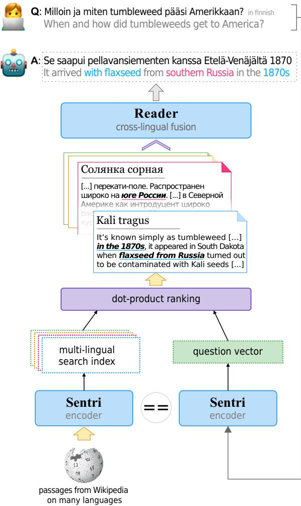
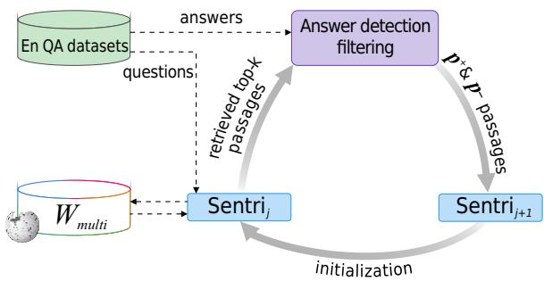

# Ask Me Anything in Your Native Language

Nikita Sorokin Dmitry Abulkhanov

Moscow Institute

Irina Piontkovskaya Valentin Malykh Huawei Noah’s Ark lab

of Physics and Technology

sorokin.na@phystech.edu,abulkhanov.dmitry@huawei.com, piontkovskaya.irina@huawei.com,valentin.malykh@huawei.com

## Abstract

Cross-lingual question answering is a thriving field in the modern world, helping people to search information on the web more efficiently. One of the important scenarios is to give an an swer even there is no answer in the language a person asks a question with. We present a novel approach based on single encoder for query and passage for retrieval from multi-lingual collection, together with cross-lingual generative reader. It achieves a new state of the art in both retrieval and end-to-end tasks on the XOR TyDi dataset outperforming the previous results up to 10% on several languages. We find that our approach can be generalized to more than 20 languages in zero-shot approach and outperform all previous models by 12%.

## 1 Introduction

Question answering (QA) is an important tool for information search on the Internet. Since it is natural for a person to ask a question to get some information, the QA systems are designed to meet this requirement. QA provides a wide range of tasks, from engineering to cornerstone scientific tasks. Open-domain QA, in this direction, is an interesting example of a problem that connects both: multilingual knowledge sources form differing knowledge and supplement gaps in each specific language. The requirement for modern language models to be cross-lingual is gradually becoming more and more important and is being incorporated into popular benchmarks such as XGLUE (Ruder et al., 2021) or XTREME (Liang et al., 2020), where the systems are evaluated not only by their performance metrics on single language tasks but the ones on many languages.

  
Figure 1: Overview of Sentri and a case example of answering a Finnish question using non-Finnish sources. In short, at the first step system retrieves information from factoid knowledge sources (Wikipedia’s) on diverse languages. In the second step it fuses the retrieved information regardless of the language of each part, even in the absence of texts on query language. Finally, it produces an answer on the query language that aggregates all (as it can) diverse pieces from other languages.

For this particular example, there is no answer1in Finnish Wikipedia. One of the reasons is that there aren’t many articles in Finnish Wikipedia because Finnish is a low-resource language in general. Moreover, the answer can be found in rich-resources languages such as English or Russian for example.

Generally, passage retriever is based on the so called dual-encoder, i.e. two independent modules of the same architecture for the question and context encoding. However, in previous works (Qu et al., 2021; Gao and Callan, 2021) authors found out that on the one hand dual-encoder is not noiseresistant and on the other hand large batch training can improve stability of resulting embedding space. For instance, in (Qu et al., 2021; Gao and Callan, 2021) authors used 512 8 and 512 4 respectively.

Ouguz et al. (2021) present DPR-PAQ model combining large semi-supervised corpus for pre-training with the better and larger LM $R o B E R T a _ { l a r g e }$ , DPR-PAQ achieves the state of the art results on Natural Questions dataset. Nevertheless, large models and large batch training require abundance of GPU memory. The mentioned models are represent dual-encoder scheme, where two independent encoders are used – one for the questions and one for the passages. To reduce memory usage, we present a system including a single encoder used for both tasks, moreover, we show that the system using single encoder can learn an embedding space better suited for transfer learning and thus improve result in cross-lingual question answering in zero-shot scenario.

The system, we call Sentri, achieves a new state of the art on XOR TyDi QA cross-lingual dataset (Asai et al., 2021a) outperforming the previous approaches by 10% on retrieval task and 7% on end-to-end question answering task. In addition, on MKQA multi-lingual dataset (Longpre et al., 2020), which contains translations of Natural Questions to different languages, in zero-shot scenario our system outperforms a strong baseline by 8%.

The overall contribution of this paper is two-fold: (i) we present a system, including single encoder for questions and contexts, that achieves state-ofthe-art results in the retrieval and end-to-end tasks of the XOR TyDi dataset, (ii) we provide an analysis of the system behaviour in zero-shot scenario on unseen languages proving the its transferability and lower resource consumption.

The rest of the paper is organized as follows. Section 6 presents an overview of the recent studies on multilingual QA models. Section 2 which details the dataset design choices, outlines the data preparation pipeline and data used for evaluation.

  
Figure 2: Iterative training framework that adopts the idea of self-training. At first, we retrieve top-k passages from Wikipedia for each question from the initial QA training set with $S e n t r i _ { j }$ model. Secondly, we select the positive $( p ^ { + } )$ passages for each question and treat the rest as hard negative $( p ^ { -- } )$ examples. Finally we train the new $S e n t r i _ { j + 1 }$ model closing a circle.

Section 3 presents the engineering choices and describes the resulting model and its training process. We describe experimental setup and describe the achieved results in Section 4. We provide additional results analysis in Section 5, and Section 7 concludes the paper.

## 2 Datasets

In this work, we use XOR TyDi and MKQA to evaluate our system onto and several datasets to (pre-)train it.

XOR TyDi (Asai et al., 2021a) is a multilingual open-retrieval QA dataset that enables crosslingual answer retrieval. The dataset, based on questions from TyDi QA (Clark et al., 2020), articulates three new tasks that involve finding documents in different languages using multilingual and English resources. It consists of questions written by information-seeking native speakers in 7 typologically diverse languages: Arabian, Bengali, Finnish, Japanese, Korean, Russian and Telugu. Answer annotations are retrieved from multilingual document collections. XOR-Retrieve is a crosslingual retrieval task where a question is written in the target language (e.g., Japanese), and a system is required to retrieve an English document that answers the question. XOR-English Span is a cross-lingual retrieval task where a question is written in the target language (e.g., Japanese), and a system is required to output a short answer in English. XOR-Full is a cross-lingual retrieval task where a question is written in the target language (e.g., Japanese), and a system is required to output a short answer in the target language. In our work, we concentrate on XOR-Retrieve and XOR-Full tasks and use XOR TyDi to train and evaluate our system.

## 2.1 Training Dataset Pre-processing

Since there are low-resource languages in the XOR TyDi dataset, the task of preparing data is of priority importance. To generate data in different languages, we used NQ and Trivia QA datasets described above. Both NQ and Trivia QA are English language datasets. To use them for training purposes in our setup we had to translate them to the languages of XOR TyDi. The quality of machine translation still does not match the human translation quality in most of the languages and domains. However, questions and answers in NQ and Trivia QA datasets are short and easy to translate.

For each pair of question q and answer a from the datasets, we made translations from English to each language $L _ { i }$ using the M2M100 model described in (Fan et al., 2020), it is a state-of-the-art model for translation for many languages, including the ones we are interested in. Thus we translated question-answer pairs and we got an aligned dataset. The pairs are not enough, since the opendomain QA task is based on so-called support passages retrieved from some document collection. To overcome this issue we mined the positive and hard negative sample passages for each language $L _ { i }$ . We consider a paragraph from a document to be a positive sample if it is ranked high by a retriever model and includes the answer. We use complicated morphology-aware answer detection technique which we describe in Appendix. If a paragraph is highly ranked but contains no answer, we consider it as a hard negative sample. The resulting statistics and analysis of the training dataset we also present in Appendix.

Information Retrieval We took into account that most XOR TyDi languages have complex morphology and other linguistic features, which makes information retrieval less effective for the models using token comparison. Thus we decided to normalize the morphology for at least the languages, which has publicly available stemmers, namely, Arabic1, Bengali2, Korean3, and Russian1. The Telugu language has no publicly available stemmer, but there is a lemmatizer4, which we used.

For Korean we apply token splitting by the partof-speech tag, i.e. modifier POS as a Josa and Eomi are treated as separate tokens. Unfortunately, we have not found accessible stemmers and/or lemmatizers for Japanese and Finnish languages. We use this normalisation to improve positive passage mining for self-training procedure. More details on normalisation could be found in Appendix.

Natural Questions (NQ) (Kwiatkowski et al., 2019) dataset is designed for end-to-end question answering. The questions are mined from real Google search queries and the answers are spans in Wikipedia articles identified by annotators. We use this dataset in two ways. One way is for training and another one is for zero-shot evaluation. The latter option is provided to us by MKQA dataset (Longpre et al., 2020). It is a translation of 10 thousand question-answer pairs from NQ to 26 different languages, thus giving us an aligned dataset of 260 thousand question-answer pairs total. The former option is described below.

We also use Trivia QA for pre-training of our model. Joshi et al. (2017) presented Trivia QA, a large-scale question-answering dataset that includes so-called evidence documents, allowing one to state a task of information retrieval. Trivia QA includes 95 thousand question-answer pairs authored by trivia enthusiasts and independently gathered evidence documents, six per question on average ending with 650 thousand total triples.

## 3 Method

The open domain question answering task heavily relies on retrieval from some (possibly more than one) document collections. In the case of the crosslingual variant of this task, the usage of several (at least two - in English and in a target language) document collections is almost inevitable. We evaluate our model in two cross-lingual setups: using English Wikipedia $( W _ { e n g } )$ to search for a relevant passage containing the answer to the question or using collection of multilingual reference passages from Arabic, Russian, English, Finnish, Telugu, Bengali, Japanese, Korean Wikipedia $( W _ { m u l t i } )$ . More formally, given a question q in language $L _ { i } ,$ a system retrieves the documents from $W _ { e n g }$ or $W _ { m u l t i }$ , and formulates an answer a. Thus the system could be virtually split to retriever, which creates a list of relevant documents, and reader, which generates an answer using the most relevant documents. The sample of the system output is presented on Fig. 1.

## 3.1 Single Encoder Retriever

We follow common (Qu et al., 2021; Asai et al., 2021b; Ouguz et al., 2021) dual-encoder approach in data representation. The system consists of question encoder $E _ { q } ( \cdot )$ and passage encoder $E _ { p } ( \cdot )$ which maps text to d-dimensional real-valued vectors. Before run-time, $E _ { p } ( \cdot )$ applied to all passages in knowledge source to create search index. To find out relevant passages to certain question system operates a similarity function:

$$
\sin ( \boldsymbol { q } , \boldsymbol { p } ) = E _ { \boldsymbol { q } } ( \boldsymbol { q } ) ^ { \intercal } \cdot E _ { \boldsymbol { p } } ( \boldsymbol { p } ) .\tag{1}
$$

i.e. similarity between the question and the passage defined by the dot product of their vectors.

In this work we investigate case when $E _ { q } ( \cdot ) = E _ { p } ( \cdot )$ and call this approach as Single Encoder. In addition to it, a model with $E _ { q } ( \cdot ) \neq E _ { p } ( \cdot )$ we call Bi-Encoder to avoid confusion.

The architecture that utilizes Single encoder approach for retrieval (Sentri) shares one encoder for $E _ { q } ( \cdot )$ and $E _ { p } ( \cdot )$ contrary to bi-encoder which based on two separate models.

Since our model is used in a multi-lingual setting, the choice of multilingual models is natural for base model. We use XLM-RoBERTa (Conneau et al., 2020) (large) in our experiments.

  
Figure 3: An example of overlap in positive passages $( p ^ { + } )$ for different instances of a question.

Training Sentri is trained to give positive passages higher scores than negative passages. More specifically, given a question $q _ { i }$ in a language from L together with its positive passage $p _ { i } ^ { + }$ and m negative passages $\{ p _ { i , j } ^ { - } \} _ { j = 1 } ^ { m }$ sampled from $W _ { m u l t i }$ , we minimize the loss function:

$$
\begin{array} { l } { { \displaystyle { \mathcal L } ( q _ { i } , p _ { i } ^ { + } , \{ p _ { i , j } ^ { - } \} _ { j = 1 } ^ { m } ) } \ ~ } \\ { { \displaystyle ~ = - \log \frac { e ^ { \sin ( q _ { i } , p _ { i } ^ { + } ) } } { \sum _ { j = 1 } ^ { m } e ^ { \sin ( q _ { i } , p _ { i , j } ^ { - } ) } + e ^ { \sin ( q _ { i } , p _ { i } ^ { + } ) } } , } } \end{array}\tag{2}
$$

where we aim to optimize the negative loglikelihood of the positive passage against a set of m negative passages.

For each question, we treat other passages in the training batch that do not answer this particular question as negative passages (in-batch negative trick, Henderson et al. 2017; Karpukhin et al. 2020) In particular, for batch size n each question can be further paired with $m = n - 1 + n$ negatives (i.e., positive and hard negative passages of the rest questions) without sampling additional negatives. Furthermore, in the case of multilingual data, it helps enforce the cross-lingual ability of the model because of an increasing number of cross-language pairs.

## 3.2 In-batch False Negatives Filtering

Although the above strategy can increase the number of negatives, some of them may turn out to be false negatives. We analyze the batches generated for the training and found out that different questions in the same batch could have the same positive passages. Since these positive passages are used for in-batch negative training that produces false negative pairs. For English Wikipedia this overlap is significant but not so crucial like for lower resource Wikipedias. For instance, for Natural Questions passages in 44% training triplets (questions, answer, passage) are used more than once in the dataset. The sample of positive passage overlap for NQ is presented on Fig. 3. We use in-batch filtering allowing us to eliminate this overlap from generated batches and thus improve the overall system quality.

## 3.3 Self-Training

Several works (Qu et al., 2021; Izacard and Grave, 2020a) refer to iterative learning as a source of model quality improvement. We use this idea in the form described below, which we call self-training. Fig. 2 presents the framework which we use in this work. $S e n t r i _ { j }$ model retrieves top-k passages from Wikipedia for each question from the initial QA training set. Then we select the positive $( p ^ { + } )$ passages for each question (we know the ones for the initial training set) and treat the rest as hard negative $( p ^ { -- } )$ examples. Afterwards, we train new iteration $S e n t r i _ { j + 1 }$ model using the passages marked up previously. In contrast to (Asai et al., 2021b) we train iteratively only a retrieval part of the whole system.

<table><tr><td rowspan="2"></td><td colspan="6">R@2kt</td><td rowspan="2"></td><td colspan="8"></td><td rowspan="2"></td></tr><tr><td>Ar</td><td>Bn</td><td>Fi</td><td>Ja</td><td>Ko</td><td>Ru</td><td>Te</td><td>Ar</td><td>Bn</td><td>Fi</td><td>Ja</td><td>R@5kt Ko</td><td>Ru</td><td>Avg</td></tr><tr><td></td><td></td><td></td><td></td><td></td><td></td><td></td><td></td><td>Dev Set</td><td></td><td></td><td></td><td></td><td></td><td></td><td></td><td></td></tr><tr><td>DPR + BM25 + MT</td><td>43.4</td><td>53.9</td><td>55.1</td><td>40.2</td><td>50.5</td><td>30.8</td><td>20.2</td><td>42.0</td><td>52.4</td><td>62.8</td><td>61.8</td><td>48.1</td><td>58.6</td><td>37.8</td><td>32.4</td><td>50.6</td></tr><tr><td>CORA (Asai et al., 2021b)</td><td>32.0</td><td>42.8</td><td>39.5</td><td>24.9</td><td>33.3</td><td>31.2</td><td>30.7</td><td>33.5</td><td>42.7</td><td>52.0</td><td>49.0</td><td>32.8</td><td>43.5</td><td>39.2</td><td>41.6</td><td>43.0</td></tr><tr><td>Bi-Encoder1</td><td>47.0</td><td>38.8</td><td>40.7</td><td>49.7</td><td>30.2</td><td>42.1</td><td>34.1</td><td>40.4</td><td>54.0</td><td>41.5</td><td>49.5</td><td>56.0</td><td>40.2</td><td>52.6</td><td>43.7</td><td>48.2</td></tr><tr><td>Bi-Encoder2</td><td>47.8</td><td>39.1</td><td>48.9</td><td>51.2</td><td>40.2</td><td>41.2</td><td>49.4</td><td>45.4</td><td>55.1</td><td>43.3</td><td>59.5</td><td>59.4</td><td>51.2</td><td>52.0</td><td>56.9</td><td>53.9</td></tr><tr><td>Sentri</td><td>47.6</td><td>48.1</td><td>53.1</td><td>46.6</td><td>49.6</td><td>44.3</td><td>67.9</td><td>51.0</td><td>56.8</td><td>62.2</td><td>65.5</td><td>53.2</td><td>55.5</td><td>52.3</td><td>80.3</td><td>60.8</td></tr><tr><td></td><td colspan="2"></td><td></td><td></td><td></td><td></td><td colspan="4">Test Set</td><td></td><td></td><td></td><td></td><td></td><td></td></tr><tr><td>DPR + BM25 + MT</td><td>48.3</td><td>54.4</td><td>56.7</td><td>41.8</td><td>39.4</td><td>39.6</td><td>18.7</td><td>42.7</td><td>52.5</td><td>63.2</td><td>65.9</td><td>52.1</td><td>46.5</td><td>47.3</td><td>22.7</td><td>50.0</td></tr><tr><td>GAAMA (Ferritto et al., 2020)</td><td></td><td></td><td></td><td></td><td></td><td></td><td></td><td>52.8</td><td></td><td></td><td></td><td></td><td></td><td></td><td></td><td>59.9</td></tr><tr><td>Sentri</td><td>53.8</td><td>66.7</td><td>55.4</td><td>42.9</td><td>46.8</td><td>55.1</td><td>48.7</td><td>52.8</td><td>63.0</td><td>72.4</td><td>63.5</td><td>53.1</td><td>56.9</td><td>61.8</td><td>56.4</td><td>61.0</td></tr></table>

Table 1: Performance on XOR-Retrieve task. The best result is given in bold, the second best is in underlined italic. We note that at extremely low-resource languages such as Finnish and Telugu Sentri shows consistent performance, similar to results on moderate-resource languages such as Russian.

At stage 0 when there is no trained model available, we use well-known BM25 model (Sanderson, 2010) as a retriever in our experiments. The important feature of this model is that it does not need any kind of training, thus it could be used to retrieve documents from collections in languages with little or no training data.

For Sentri system we report the results for the second stage of self-training below. For Bi-Encoder we report results for stages 1 and 2 adding the specifying index.

## 3.4 Answer Generation

We have experimented with both extractive and abstractive answer generation and found out that abstractive is more profitable. Here we describe the abstractive reader approach we use as primary one. We decided to use the FiD model (Izacard and Grave, 2020a) as a reader model in Sentri for end to end question answering task XOR-Full since it allows us to exclude the translator from a pipeline and to aggregate information in a cross-lingual setup. Since the original FiD model is monolingual, we present extension of this work, multilingual version which we call MFiD. To train MFiD, we use several QA datasets, listed in Sec. 2, namely XOR-Full, XOR TyDi, Natural Questions, and Trivia QA datasets, the same ones used for training the retriever part of the Sentri model. For each question from the QA datasets we retrieve top-50 passages from multi-language knowledge source using our retriever model. And then use it for training

MFiD as cross-lingual fusion reader. We also experimented with standard extractive reader. The details on extractive approach could be found in Sec. 5.

## 4 Experiments

We have conducted a series of experiments with number of models, namely these are Sentri model combined with different reader parts and Bi-Encoder model with one or two stages of selftraining. Bi-Encoder model is using standard extractive reader (plus machine translation where applicable). The main difference between Sentri and Bi-Encoder, that the latter is based on classic dualencoder architecture, while the former is using single encoder for questions and paragraphs.

## 4.1 Results on XOR TyDi

Tables 1 and 2 contain results for our system in retrieval and end-to-end setups, XOR-Retrieve and XOR-Full respectively. These two tables contain the results of the models’ evaluation on the development and test parts of the XOR TyDi dataset. It is important to mention that we use name Sentri for our model in both tasks, while in XOR-Retrieve task the reader part is not used, since it is essentially a passage ranking evaluation. Also, you can find results for our models titled as Bi-Encoder1 and Bi-Encoder2 (for first and stages of self-training respectively). As one can see Sentri significantly outperforms these baseline models and existing state-of-the-art models. We provide more detailed analysis in section Ablation Study.

Tab. 1 displays recall scores for 2000 and 5000 first tokens (R@2kt and R@5kt respectively). That means that we expect to find an answer span in the first l tokens. This metric was proposed in (Asai et al., 2021a) as alternative to more common Recall@N in purpose to make more fair comparison across various models with different passage size used.

<table><tr><td></td><td colspan="6">Target Language</td><td colspan="4">Macro Average</td></tr><tr><td></td><td>Ar</td><td>Bn</td><td>Fi</td><td>Ja</td><td>Ko</td><td>Ru</td><td>Te</td><td>F1</td><td>EM</td><td>BLEU</td></tr><tr><td></td><td colspan="10">Dev Set</td></tr><tr><td>DPR + BM25 + MT</td><td>9.2</td><td>15.8</td><td>14.4</td><td>4.8</td><td>7.9</td><td>5.2</td><td>0.5</td><td>8.3</td><td>4.6</td><td>7.5</td></tr><tr><td>CORA (Asai et al., 2021b)</td><td>42.9</td><td>26.9</td><td>41.4</td><td>36.8</td><td>30.4</td><td>33.8</td><td>30.9</td><td>34.7</td><td>25.8</td><td>23.3</td></tr><tr><td>Bi-Encoder1</td><td>15.0</td><td>8.7</td><td>11.5</td><td>6.2</td><td>7.5</td><td>8.5</td><td>9.1</td><td>9.5</td><td>5.7</td><td>10.5</td></tr><tr><td>Bi-Encoder2</td><td>18.9</td><td>11.2</td><td>21.1</td><td>3.9</td><td>10.6</td><td>8.1</td><td>13.9</td><td>12.5</td><td>7.7</td><td>13.5</td></tr><tr><td>Sentri + ext. reader + MT</td><td>20.8</td><td>14.5</td><td>21.3</td><td>10.7</td><td>16.1</td><td>12.1</td><td>17.3</td><td>16.1</td><td>10.1</td><td>16.5</td></tr><tr><td>Sentri + MFiD</td><td>52.5</td><td>31.2</td><td>45.5</td><td>44.9</td><td>43.1</td><td>41.2</td><td>30.7</td><td>41.3</td><td>34.9</td><td>30.7</td></tr></table>

Table 2: End-to-end performance on XOR-Full task. Our best model, Sentri + MFiD, at large margin outperforms existing systems.
<table><tr><td></td><td colspan="10">R@2kt</td></tr><tr><td></td><td>Da De</td><td>Es</td><td>Fr</td><td></td><td>He</td><td>Hu</td><td>It</td><td>Km</td><td>Ms</td><td>NI</td><td>No</td></tr><tr><td>CORA (Asai et al., 2021b) BM25 + MT*</td><td>44.5</td><td>44.6</td><td>45.3</td><td>44.8</td><td>27.3</td><td>39.1</td><td>44.2</td><td>22.2</td><td>44.3</td><td>47.3</td><td>48.3</td></tr><tr><td>Bi-Encoder2</td><td>44.1</td><td>43.3</td><td>44.9</td><td>42.5</td><td>36.9</td><td>39.3</td><td>40.1</td><td>31.3</td><td>42.5</td><td>46.5</td><td>43.3</td></tr><tr><td>Sentri</td><td>50.0 57.6</td><td>47.8 56.5</td><td>48.7 55.9</td><td>47.4 55.1</td><td>37.7 47.9</td><td>43.4 51.8</td><td>41.8 54.3</td><td>37.8</td><td>49.5</td><td>47.3 56.3</td><td>49.1 56.5</td></tr><tr><td></td><td></td><td></td><td></td><td></td><td></td><td></td><td></td><td>43.9</td><td>56.0</td><td></td><td></td></tr><tr><td>CORA (Asai et al., 2021b)</td><td>Pl</td><td>Pt</td><td>Sv</td><td>Th</td><td>Tr</td><td>Vi</td><td>Zh-cn</td><td>Zh-hk</td><td></td><td>Zh-tw</td><td>Avg</td></tr><tr><td>BM25 + MT*</td><td>44.8 46.5</td><td>40.8 45.7</td><td>43.6</td><td>45.0</td><td>34.8</td><td>33.9</td><td>33.5</td><td>41.5</td><td></td><td>41.0</td><td>41.1</td></tr><tr><td>Bi-Encoder2</td><td>47.0</td><td>47.7</td><td>49.7 50.0</td><td>46.5 46.5</td><td>42.5 45.6</td><td>43.5 47.3</td><td>37.5 42.6</td><td>37.5</td><td></td><td>36.1 41.0</td><td>42.0 45.3</td></tr><tr><td></td><td>55.8</td><td></td><td>56.9</td><td>55.3</td><td>53.0</td><td>54.4</td><td>50.2</td><td>41.5</td><td></td><td>49.4</td><td>53.3</td></tr><tr><td>Sentri</td><td></td><td>54.8</td><td></td><td></td><td></td><td></td><td></td><td>50.7</td><td></td><td></td><td></td></tr></table>

Table 3: Zero-shot cross-lingual retrieval results on MKQA dataset.

Our system outperforms the previous state-ofthe-art system in both R@2kt and R@5kt metrics by a wide margin on four languages, namely Arabic, Japanese, Russian, and Telugu. More importantly, our system outperforms the previous system on average for all the languages. Interestingly, selftraining improves the results in all the languages, with the intriguing exception of the Russian language. This fact requires an additional investigation, we leave it as future work for now.

Table 2 displays F1, Exact Match (EM), and BLEU scores for the end-to-end setup where given a question in target language $L _ { i }$ and Wikipedia in both English and $L _ { i } ,$ , a system is required to generate an answer in the target language. F1 measure is computed per token for an answer span. Exact Match compares the golden answer span with the system output for exact equality. BLEU metric, defined as in (Papineni et al., 2002), computes the number of overlapping n-gram between the golden answer and the system output. In this experiment, we see a somewhat different behaviour of the model. Our model outperform previous state of the art system for all languages, with exception for Telugu where CORA model (Asai et al., 2021b) shows insignificantly higher score.

## 4.2 Zero-Shot Cross-Lingual Transfer

We investigated the transferability across the languages for the trained system. We used the MKQA dataset in similar to the XOR-Retrieve setup, i.e. we retrieved the passages from English Wikipedia, extracted the answer from the top-ranked passage, and translated it with a machine translation model. Here we again use M2M100 model for machine translation task. As a baseline for this task, we utilized BM25 with extractive reader and the machine translation model at the end of pipeline. We selected from MKQA such unseen languages that were not presented to the system during the training process. The achieved results presented in Tab. 3 show that even in such a zero-shot setting our system significantly outperforms both the strong baseline and previous approaches in all languages. Additional details on zero-shot transfer could be found in Appendix.

## 5 Ablation Study

Sentri model has five important features which differentiate it from the previous work: self-training, a single encoder model for passage and question processing as a retriever, a generative model as a reader, in-batch negative filtering, usage of the machine translated data during the training process.

(I) The effect of the first of mentioned features could be analysed basing on Tab. 1 (upper part of the table, showing results on development set) and 2. Self-training for Bi-Encoder model improves results by 3% on average for the XOR-Full task and about 5% for the XOR-Retrieve task (Bi-Encoder vs Bi-Encoder ).

(II) The usage of a single encoder could be estimated as again 3% for the XOR-Full task and about 5-6% for the XOR-Retrieve task (Sentri + ext. reader vs. Bi-Encoder ). In Tab. 4 we demonstrate key motivation of using shared encoder model. We observe that the single encoder approach superior to the Bi-Encoder in terms of memory efficiency and overall performance. With the same size (less than 2% difference) it achieves more than 12% relative improvement or 6-7 difference in absolute points in retrieval task. Note that Sentri and Bi-Encoder2 trained in the same setting and same QA datasets except used base model variants (base and large respectively). We do it for the sake of the matching number of parameters, matched memory consumption and similar training time of both

<table><tr><td rowspan="2"></td><td colspan="2">Base architecture</td><td rowspan="2">#params overall</td><td colspan="2">XOR</td></tr><tr><td>Eq</td><td> $E _ { p }$ </td><td>R@2kt</td><td>R@5kt</td></tr><tr><td rowspan="2">Bi-Encoder2 Sentri</td><td>XLM-Rbase</td><td>XLM-Rbase</td><td>540 M</td><td>45.4</td><td>53.9</td></tr><tr><td>XLM-Rlarge (shared)</td><td></td><td>550 M</td><td>51.0</td><td>60.8</td></tr></table>

Table 4: Comparison of architectures of single and biencoder models. The single encoder approach signif icantly outperform dual-encoder one using almost the same memory amount.

<table><tr><td></td><td>Most-effective</td><td colspan="3">Macro Average</td></tr><tr><td></td><td>top-k</td><td>F1</td><td>EM</td><td>BLEU</td></tr><tr><td>Sentri + ext. reader + MT</td><td>5</td><td>16.1</td><td>10.1</td><td>16.5</td></tr><tr><td>Sentri + CORA Reader</td><td>15</td><td>30.7</td><td></td><td></td></tr><tr><td>Sentri + MFiD</td><td>100</td><td>41.3</td><td>34.9</td><td>30.7</td></tr></table>

Table 5: Comparison of different reader models.

models.

(III) The replacement of standard extractive reader, i.e. span-tagging model, with a generative one, MFiD model in our case, turned out to add up to 34% of F1 measure (for Japanese) and 25% on average. We observe that with the number of contexts more than 5 performance of extractive reader degrades. Contrary that using more contexts for answer generation can significantly improve model quality. We further evaluate generative reader usage by adding the one described in (Asai et al., 2021b), it uses only 15 top-ranked contexts due to memory constraints. Unlike that, MFiD can use up to 100 top-ranked contexts thanks to the independent processing of passages in the reader’s encoder. The results are presented in Tab. 5.

(IV & V) The importance of the last two features could be estimated basing on Tab. 6. While the former one adds up to 2 per cent, the latter is of crucial importance adding up to 20% depending on task and measure.

We could conclude that all the features are important for our approach to present state-of-the-art results in retrieval and end-to-end tasks.

## 5.1 Languages Used

It is also interesting to know if the system is actually using the data in other languages for answer generation. In other words, if our model is truly cross-lingual. The analysis of the top-100 paragraphs for all the questions in validation set of XOR TyDi, namely the breakdown on the languages used, is shown on Tab. 7. As one can see, there are several interesting features could be spotted in the table. The highest self-usage (i.e. when a question and a paragraph are in the same language) percentage is shown by Korean language (almost entirely, 97.6%), with negligible usage of other languages, except English with 1.4%. On the contrary, Finnish language is shown the lowest self-usage of 52.9% with 34.6% usage of English. These two facts could be explained as Korean having unique writing system, thus it has almost nonexistent intersection with other languages in terms. In the contrary Finnish is Latin-based and is in close contact with Swedish language since the Middle Ages, while Swedish is close German language for English. But this speculation has its downside: the second most-used language for Finnish is Japanese (7.4%), which is both unrelated and uses other script. Interestingly, Japanese language is the second language by usage for almost all the languages, including Korean but with only 0.7%. For Telugu the second most used language is Bengali, which is related to it. But surprisingly, the other way around it is almost unused. Another peculiar feature is that Russian language is significant in usage for almost all the languages with exception for Korean. We hypothesise that it is due to the proportion of Russian data in the training set, this language being the second by size in the dataset. It is important to mention that the largest present language is Arabic, but its influence is lower than Russian. The influence of Arabic, Russian, and Japanese need more in-depth future investigation.

<table><tr><td></td><td colspan="2">R@2kt</td><td colspan="2">R@5kt</td></tr><tr><td></td><td>MKQA</td><td>XOR</td><td>MKQA</td><td>XOR</td></tr><tr><td>Sentri</td><td>53.3</td><td>51.0</td><td>60.3</td><td>60.8</td></tr><tr><td>Sentri w/o false negative filtering</td><td>52.1</td><td>49.3</td><td>60.1</td><td>60.3</td></tr><tr><td>Sentri w/o weight-sharing (Bi-Encoder approach)</td><td>45.3</td><td>45.4</td><td>52.9</td><td>53.9</td></tr><tr><td>Sentri w/o multi-language translations of training set</td><td>41.5</td><td>30.8</td><td>45.8</td><td>42.3</td></tr></table>

Table 6: Ablation experiments on MKQA and XOR development sets.

## 6 Related Work

Datasets The cross-lingual question answering datasets were scarce before recent years. Fortunately, these years left us with several publicly available datasets. Lewis et al. (2020) introduced MLQA dataset. It consists of parallel QA pairs in several languages. Liu et al. (2019) have presented XQA dataset, with training set in English and validation and test sets in the other languages. Crosslingual Question Answering Dataset (XQuAD) benchmark presented in Artetxe et al. (2020). It consists of a subset of 240 paragraphs and 1190 question-answer pairs from SQuAD v1.1 (Rajpurkar et al., 2016) together with their translations into ten languages.

Systems Open-domain question answering task assumes answering factoid questions without a predefined domain (Kwiatkowski et al., 2019). Recent research was focused on creating non-English question answering datasets and applying crosslingual transfer learning techniques, from English to other languages. Until recently, the availability of appropriate train and test datasets has been a key factor in the development of the field: however, in recent years, many works have focused on the collection of loosely aligned data obtained through automatic translation or by parsing similar multilingual sources. Artetxe et al. (2020) studied cross-lingual transferability of monolingual representations of a transformer-based masked language model.

In most previous approaches the authors use extractive models to generate the actual answer. This could be explained by the mental inertia from SQuAD-like datasets. By SQuAD-like we mean a dataset where labelled data includes an explicitly stated question, a passage, containing an answer, and a span markup for the answer. Such markup was presented for the question answering task called SQuAD in (Rajpurkar et al., 2016). But recently there were presented cross-lingual generation of answers from raw texts. Kumar et al. (2019); Chi et al. (2019) studied cross-lingual question generation. Shakeri et al. (2020) proposed a method to generate multilingual question and answer pairs by a generative model (namely, a fine-tuned multilingual T5 model), it is based on automatically translated samples from English to the target domain. Generative question answering was mostly considered in previous work for long answers datasets. However, FiD model (Izacard and Grave, 2020b) archives competitive results on SQuAD-like datasets, where an answer is supposed to be short text span. For open domain question answering, one of the first approaches named RAG used generative models was presented in (Lewis et al., 2021). A key idea of this RAG model is to process several (top k) passages from the retriever in the encoder simultaneously. The produced dense representations of the passages are used in the decoder for the answer generation, this process is called fusion. Processing the passages independently in the encoder allows a model to scale to many contexts, as it only runs self-attention over one context at a time. FiD model follows this paradigm further improving the results in question generation.

<table><tr><td rowspan=1 colspan=1></td><td rowspan=1 colspan=1>Ar</td><td rowspan=1 colspan=1>Bn</td><td rowspan=1 colspan=1>Fi</td><td rowspan=1 colspan=1>Ja</td><td rowspan=1 colspan=1>Ko</td><td rowspan=1 colspan=1>Ru</td><td rowspan=1 colspan=1>Te</td><td rowspan=1 colspan=1>En</td></tr><tr><td rowspan=1 colspan=1>Ar</td><td rowspan=1 colspan=1>80.6</td><td rowspan=1 colspan=1>0.2</td><td rowspan=1 colspan=1>0.1</td><td rowspan=1 colspan=1>7.1</td><td rowspan=1 colspan=1>0.2</td><td rowspan=1 colspan=1>1.2</td><td rowspan=1 colspan=1>0.0</td><td rowspan=1 colspan=1>10.5</td></tr><tr><td rowspan=1 colspan=1>Bn</td><td rowspan=1 colspan=1>0.3</td><td rowspan=1 colspan=1>89.8</td><td rowspan=1 colspan=1>0.1</td><td rowspan=1 colspan=1>4.8</td><td rowspan=1 colspan=1>0.2</td><td rowspan=1 colspan=1>0.8</td><td rowspan=1 colspan=1>0.1</td><td rowspan=1 colspan=1>3.7</td></tr><tr><td rowspan=1 colspan=1>Fi</td><td rowspan=1 colspan=1>0.8</td><td rowspan=1 colspan=1>1.4</td><td rowspan=1 colspan=1>52.9</td><td rowspan=1 colspan=1>7.4</td><td rowspan=1 colspan=1>0.3</td><td rowspan=1 colspan=1>2.1</td><td rowspan=1 colspan=1>0.1</td><td rowspan=1 colspan=1>34.6</td></tr><tr><td rowspan=1 colspan=1>Ja</td><td rowspan=1 colspan=1>0.8</td><td rowspan=1 colspan=1>3.7</td><td rowspan=1 colspan=1>0.2</td><td rowspan=1 colspan=1>77.5</td><td rowspan=1 colspan=1>1.1</td><td rowspan=1 colspan=1>1.7</td><td rowspan=1 colspan=1>0.2</td><td rowspan=1 colspan=1>14.5</td></tr><tr><td rowspan=1 colspan=1>Ko</td><td rowspan=1 colspan=1>0.0</td><td rowspan=1 colspan=1>0.0</td><td rowspan=1 colspan=1>0.0</td><td rowspan=1 colspan=1>0.7</td><td rowspan=1 colspan=1>97.6</td><td rowspan=1 colspan=1>0.1</td><td rowspan=1 colspan=1>0.0</td><td rowspan=1 colspan=1>1.4</td></tr><tr><td rowspan=1 colspan=1>Ru</td><td rowspan=1 colspan=1>0.9</td><td rowspan=1 colspan=1>0.8</td><td rowspan=1 colspan=1>0.3</td><td rowspan=1 colspan=1>8.7</td><td rowspan=1 colspan=1>0.3</td><td rowspan=1 colspan=1>74.5</td><td rowspan=1 colspan=1>0.0</td><td rowspan=1 colspan=1>14.2</td></tr><tr><td rowspan=1 colspan=1>Te</td><td rowspan=1 colspan=1>0.2</td><td rowspan=1 colspan=1>8.3</td><td rowspan=1 colspan=1>0.0</td><td rowspan=1 colspan=1>3.8</td><td rowspan=1 colspan=1>0.4</td><td rowspan=1 colspan=1>0.4</td><td rowspan=1 colspan=1>75.5</td><td rowspan=1 colspan=1>11.2</td></tr></table>

Table 7: Breakdown on the languages that the Sentri+MFiD model uses for answer generation.

## 7 Conclusion

Nowadays multi-lingual and cross-lingual problems are coming to the stage once the natural language models become more and more powerful. One of these problems is that where the systems answer the questions using various mutually disjoint language data, as it stated in XOR TyDi task. This task is based on a specific XOR TyDi dataset (Asai et al., 2021a), which ensured such information asymmetry in the different language data. We introduced the cross-lingual system to solve the XOR task. While the XOR TyDi is a challenging test that stimulates cross-linguality in NLP systems, we have outperformed the existing models in two subtasks: XOR-Retrieve and XOR-Full without using external APIs. The first task is a classical passage retrieval task, while the second one is an end-to-end question-answering task. Besides showing the state of the art results on these two subtasks, our system is demonstrated the ability the transfer to the unseen languages in retrieval task, including the languages which were not presented in the pre-trained language model we use as an encoder for the retriever part of our Sentri model. And last we found that the previous works ignored the existence of the morphology in XOR TyDi presented languages, thus missing many results in information retrieval. We propose to solve this issue by using stemming or lemmatization for such languages.

Our system has five differentiating features, which are self-training (using the output of the previously trained models), single encoder (allowing us to reduce the number of parameters about twice in retriever), usage of a generative model to get the question from retrieved passages, in-batch negative filtering, and usage of the machine translated data during the training process. All of these features are proved to make a share in the achieved significant quality improvement demonstrated by our model. Although, our system has several flaws, e.g. passage selection strategy and stemming for the languages, we consider these flaws as our future work. But we hope that current study will foster research in cross-lingual question answering tasks.

## References

Mikel Artetxe, Sebastian Ruder, and Dani Yogatama. 2020. On the cross-lingual transferability of monolingual representations. In Proceedings of the 58th Annual Meeting of the Association for Computational Linguistics, pages 4623–4637, Online. Association for Computational Linguistics.

Akari Asai, Jungo Kasai, Jonathan H Clark, Kenton Lee, Eunsol Choi, and Hannaneh Hajishirzi. 2021a. Xor qa: Cross-lingual open-retrieval question answering. Proceedings ofNAACL-HLT’2021.

Akari Asai, Xinyan Yu, Jungo Kasai, and Hannaneh Hajishirzi. 2021b. One question answering model for many languages with cross-lingual dense passage retrieval. Proceedings ofNeurIPS 2021.

Zewen Chi, Li Dong, Furu Wei, Wenhui Wang, Xian-Ling Mao, and Heyan Huang. 2019. Cross-lingual natural language generation via pre-training.

Jonathan H Clark, Eunsol Choi, Michael Collins, Dan Garrette, Tom Kwiatkowski, Vitaly Nikolaev, and Jennimaria Palomaki. 2020. Tydi qa: A benchmark for information-seeking question answering in ty pologically di verse languages. Transactions ofthe Associationfor Computational Linguistics, 8:454–470.

Alexis Conneau, Kartikay Khandelwal, Naman Goyal, Vishrav Chaudhary, Guillaume Wenzek, Francisco Guzman,´ Edouard Grave, Myle Ott, Luke Zettle-´ moyer, and Veselin Stoyanov. 2020. Unsupervised cross-lingual representation learning at scale. In Proceedings of the 58th Annual Meeting of the Association for Computational Linguistics, pages 8440– 8451.

Angela Fan, Shruti Bhosale, Holger Schwenk, Zhiyi Ma, Ahmed El-Kishky, Siddharth Goyal, Mandeep Baines, Onur Celebi, Guillaume Wenzek,

Vishrav Chaudhary, Naman Goyal, Tom Birch, Vitaliy Liptchinsky, Sergey Edunov, Edouard Grave, Michael Auli, and Armand Joulin. 2020. Beyond english-centric multilingual machine translation. CoRR, abs/2010.11125.

Anthony Ferritto, Sara Rosenthal, Mihaela Bornea, Kazi Hasan, Rishav Chakravarti, Salim Roukos, Radu Florian, and Avirup Sil. 2020. A multilingual reading comprehension system for more than 100 languages. In Proceedings ofthe 28th International Conference on Computational Linguistics: System Demonstrations, pages 41–47.

Luyu Gao and Jamie Callan. 2021. Unsupervised corpus aware language model pre-training for dense passage retrieval. ArXiv, abs/2108.05540.

Matthew L. Henderson, Rami Al-Rfou, Brian Strope, Yun-Hsuan Sung, Laszl´ o Luk´ acs, Ruiqi Guo, Sanjiv´ Kumar, Balint Miklos, and Ray Kurzweil. 2017. Efficient natural language response suggestion for smart reply. CoRR, abs/1705.00652.

Gautier Izacard and Edouard Grave. 2020a. Distilling knowledge from reader to retriever for question answering.

Gautier Izacard and Edouard Grave. 2020b. Leveraging passage retrieval with generative models for open domain question answering.

Mandar Joshi, Eunsol Choi, Daniel S Weld, and Luke Zettlemoyer. 2017. Triviaqa: A large scale distantly supervised challenge dataset for reading comprehension. In Proceedings of the 55th Annual Meeting of the Associationfor Computational Linguistics (Volume 1: Long Papers), pages 1601–1611.

Vladimir Karpukhin, Barlas Oguz, Sewon Min, Patrick Lewis, Ledell Wu, Sergey Edunov, Danqi Chen, and Wen-tau Yih. 2020. Dense passage retrieval for opendomain question answering. In Proceedings of the 2020 Conference on Empirical Methods in Natural Language Processing (EMNLP), pages 6769–6781.

Vishwajeet Kumar, Nitish Joshi, Arijit Mukherjee, Ganesh Ramakrishnan, and Preethi Jyothi. 2019. Cross-lingual training for automatic question generation. In Proceedings ofthe 57th Annual Meeting of the Association for Computational Linguistics, pages 4863–4872. Association for Computational Linguistics.

Tom Kwiatkowski, Jennimaria Palomaki, Olivia Redfield, Michael Collins, Ankur Parikh, Chris Alberti, Danielle Epstein, Illia Polosukhin, Jacob Devlin, Kenton Lee, et al. 2019. Natural questions: a benchmark for question answering research. Transactions ofthe Association for Computational Linguistics, 7:453– 466.

Patrick Lewis, Barlas Oguz, Ruty Rinott, Sebastian Riedel, and Holger Schwenk. 2020. Mlqa: Evaluating cross-lingual extractive question answering.

In Proceedings ofthe 58th Annual Meeting ofthe Association for Computational Linguistics, pages 7315– 7330.

Patrick Lewis, Ethan Perez, Aleksandra Piktus, Fabio Petroni, Vladimir Karpukhin, Naman Goyal, Heinrich Kuttler, Mike Lewis, Wen tau Yih,¨ Tim Rocktaschel, Sebastian Riedel, and Douwe¨ Kiela. 2021. Retrieval-augmented generation for knowledge-intensive nlp tasks.

Yaobo Liang, Nan Duan, Yeyun Gong, Ning Wu, Fenfei Guo, Weizhen Qi, Ming Gong, Linjun Shou, Daxin Jiang, Guihong Cao, Xiaodong Fan, Ruofei Zhang, Rahul Agrawal, Edward Cui, Sining Wei, Taroon Bharti, Ying Qiao, Jiun-Hung Chen, Winnie Wu, Shuguang Liu, Fan Yang, Daniel Campos, Rangan Majumder, and Ming Zhou. 2020. Xglue: A new benchmark dataset for cross-lingual pre-training, understanding and generation. arXiv, abs/2004.01401.

Jiahua Liu, Yankai Lin, Zhiyuan Liu, and Maosong Sun. 2019. Xqa: A cross-lingual open-domain question answering dataset. In Proceedings of the 57th Annual Meeting of the Association for Computational Linguistics, pages 2358–2368.

Shayne Longpre, Yi Lu, and Joachim Daiber. 2020. MKQA: A linguistically diverse benchmark for multilingual open domain question answering. TACL.

Barlas Ouguz, Kushal Lakhotia, Anchit Gupta, Patrick Lewis, Vladimir Karpukhin, Aleksandra Piktus, Xilun Chen, Sebastian Riedel, Wen tau Yih, Sonal Gupta, and Yashar Mehdad. 2021. Domain-matched pre-training tasks for dense retrieval. ArXiv, abs/2107.13602.

Kishore Papineni, Salim Roukos, Todd Ward, and Wei-Jing Zhu. 2002. Bleu: a method for automatic evaluation of machine translation. In Proceedings of the 40th annual meeting ofthe Associationfor Computational Linguistics, pages 311–318.

Yingqi Qu, Yuchen Ding, Jing Liu, Kai Liu, Ruiyang Ren, Xin Zhao, Daxiang Dong, Hua Wu, and Haifeng Wang. 2021. Rocketqa: An optimized training approach to dense passage retrieval for open-domain question answering. ArXiv, abs/2010.08191.

Pranav Rajpurkar, Jian Zhang, Konstantin Lopyrev, and Percy Liang. 2016. Squad: 100,000+ questions for machine comprehension of text.

Sebastian Ruder, Noah Constant, Jan Botha, Aditya Siddhant, Orhan Firat, Jinlan Fu, Pengfei Liu, Junjie Hu, Graham Neubig, and Melvin Johnson. 2021. Xtremer: Towards more challenging and nuanced multilingual evaluation. arXiv preprint arXiv:2104.07412.

Mark Sanderson. 2010. Christopher d. manning, prabhakar raghavan, hinrich schutze, introduction to in-¨ formation retrieval, cambridge university press. 2008. isbn-13 978-0-521-86571-5, xxi+ 482 pages. Natural Language Engineering, 16(1):100–103.

Siamak Shakeri, Noah Constant, Mihir Sanjay Kale, and Linting Xue. 2020. Multilingual synthetic question and answer generation for cross-lingual reading comprehension. arXiv preprint arXiv:2010.12008v1.

Thomas Wolf, Lysandre Debut, Victor Sanh, Julien Chaumond, Clement Delangue, Anthony Moi, Pierric Cistac, Tim Rault, Remi Louf, Morgan Funtowicz,´ et al. 2019. Huggingface’s transformers: State-ofthe-art natural language processing. arXiv preprint arXiv:1910.03771.

## A Implementation Details

For our system, we have adapted models from the Huggingface Transformers library (Wolf et al., 2019). We trained the question and passage encoders using the in-batch negative sampling with a batch size of 16, one hard negative per question. We trained the system for 40 epochs with a learning rate of $1 0 ^ { - 5 }$ using Adam, linear scheduling with warm-up and dropout rate of 0.1. For training and validation, we used NQ, Trivia, XOR and TyDi QA datasets. The number of hard negative passages was 32 and 50 for the first and second stages respectively. All experiments were carried out on four nVIDIA V100 GPUs (with 32Gb RAM each).

## B Data Distribution

The overall statistics on mined data from the mentioned datasets are available in Tab. 8. As one can see, the data acquired is following the rough pattern: most of the samples come from TriviaQA, the second source is NQ, while the rest comes from XOR TyDi QA. In the perspective of languages the pattern follows the XOR TyDi distribution, with Arabic being the largest non-English language, and Korean being the smallest one.

<table><tr><td rowspan=1 colspan=1></td><td rowspan=1 colspan=1>NQ</td><td rowspan=1 colspan=1>TriviaQA</td><td rowspan=1 colspan=1>XOR QA</td><td rowspan=1 colspan=1>Total</td></tr><tr><td rowspan=1 colspan=1>Ar</td><td rowspan=1 colspan=1>16420</td><td rowspan=1 colspan=1>38652</td><td rowspan=1 colspan=1>10496</td><td rowspan=1 colspan=1>65568</td></tr><tr><td rowspan=1 colspan=1>Bn</td><td rowspan=1 colspan=1>10165</td><td rowspan=1 colspan=1>25178</td><td rowspan=1 colspan=1>1973</td><td rowspan=1 colspan=1>37316</td></tr><tr><td rowspan=1 colspan=1>Fi</td><td rowspan=1 colspan=1>10787</td><td rowspan=1 colspan=1>23145</td><td rowspan=1 colspan=1>4688</td><td rowspan=1 colspan=1>38620</td></tr><tr><td rowspan=1 colspan=1>Ja</td><td rowspan=1 colspan=1>15357</td><td rowspan=1 colspan=1>26877</td><td rowspan=1 colspan=1>2869</td><td rowspan=1 colspan=1>45103</td></tr><tr><td rowspan=1 colspan=1>Ko</td><td rowspan=1 colspan=1>1327</td><td rowspan=1 colspan=1>2247</td><td rowspan=1 colspan=1>721</td><td rowspan=1 colspan=1>4295</td></tr><tr><td rowspan=1 colspan=1>Ru</td><td rowspan=1 colspan=1>18499</td><td rowspan=1 colspan=1>35081</td><td rowspan=1 colspan=1>3981</td><td rowspan=1 colspan=1>57561</td></tr><tr><td rowspan=1 colspan=1>Te</td><td rowspan=1 colspan=1>4964</td><td rowspan=1 colspan=1>12880</td><td rowspan=1 colspan=1>1481</td><td rowspan=1 colspan=1>19325</td></tr></table>

Table 8: The number of mined samples from training part of Natural Questions, TriviaQA, and XOR TyDi QA datasets

## C Effects of Normalisation

Since we are using normalisation for the retrieval, we decided to look into the evaluation process. The metrics used for the evaluation, namely pertoken F1, Exact Match, and BLEU, are based on simple token comparison. Such comparison is inefficient for the languages with rich morphology, like Russian or Japanese. So we applied the same normalisation as in retrieval for the generated and gold answers. Table 9 shows the achieved results. As one can see normalisation helps to achieve less strict and thus more informative comparison for the morphology-rich languages. Since Japanese and Finnish are both synthetic agglutinative languages, we suppose that the results on them could also be improved with usage of the stemming/lemmatization, thus improving the crosslingual average further. Given that we think the usage of some kind of normalisation should be recommended for any cross-lingual QA task including morphology-rich languages.

<table><tr><td rowspan="2"></td><td colspan="3">w/o stemming</td><td colspan="3">with stemming</td></tr><tr><td>F1</td><td>EM</td><td>BLEU</td><td>F1</td><td>EM</td><td>BLEU</td></tr><tr><td>Ar</td><td>18.9</td><td>12.2</td><td>19.7</td><td>21.2</td><td>14.6</td><td>18.0</td></tr><tr><td>Bn</td><td>11.2</td><td>6.1</td><td>12.9</td><td>11.7</td><td>6.6</td><td>13.1</td></tr><tr><td>Fi</td><td>21.1</td><td>14.8</td><td>22.9</td><td>21.1</td><td>14.8</td><td>22.9</td></tr><tr><td>Ja</td><td>3.9</td><td>0.9</td><td>4.0</td><td>3.9</td><td>0.9</td><td>4.0</td></tr><tr><td>Ko</td><td>10.6</td><td>6.7</td><td>7.5</td><td>11.8</td><td>8.1</td><td>8.3</td></tr><tr><td>Ru</td><td>8.1</td><td>4.1</td><td>11.0</td><td>14.6</td><td>7.4</td><td>18.1</td></tr><tr><td>Te</td><td>13.9</td><td>8.8</td><td>16.7</td><td>14.2</td><td>8.9</td><td>15.3</td></tr><tr><td>Avg</td><td>12.5</td><td>7.7</td><td>13.5</td><td>14.1</td><td>8.8</td><td>14.2</td></tr></table>

Table 9: Results for Sentri model with and without normalisation.

## D Zero-Shot Cross-Lingual Transfer

In addition to the MKQA results on which were presented in main contents, we used M2M100 model to translate the MKQA English subset to all known to it languages, thus extending MKQA to 98 languages. We provide the results on the this extended dataset in Tab. 10.

## E Unseen Languages

We thoroughly analysed the (partially) unseen languages and found out that our system performs reasonably well even for those languages, which are not present in the pre-trained XLM Roberta used as an encoder in our model. The results are presented

in Tab. 11. We also provide aggregated results for the unseen on training stage languages and seen in the training stage ones. As one could see, our model performs surprisingly well on the languages which were not presented on any training stage, although the training improves Recall by 12 and 13 per cent on average, while pre-training adds 13.8% of Recall. We think this is another evidence of the great generalizability of the pre-trained language models.
<table><tr><td rowspan="2">Query language</td><td colspan="2">Metric</td><td rowspan="2">Query</td><td colspan="2">Metric</td></tr><tr><td>R@2kt R@5kt</td><td>language</td><td>R@2kt</td><td>R@5kt</td></tr><tr><td>Af</td><td>47.9</td><td>56.4</td><td>Lv</td><td>44.1</td><td>52.6</td></tr><tr><td>Sw</td><td>35.8</td><td>44.2</td><td>Bs</td><td>46.0</td><td>54.5</td></tr><tr><td>Is</td><td>44.1</td><td>52.3</td><td>Ps</td><td>35.9</td><td>44.0</td></tr><tr><td>Tl</td><td>44.3</td><td>54.2</td><td>Hu</td><td>51.8</td><td>59.8</td></tr><tr><td>Id</td><td>49.3</td><td>56.5</td><td>Lt</td><td>42.8</td><td>51.1</td></tr><tr><td>Ff</td><td>9.9</td><td>15.9</td><td>Ln</td><td>9.2</td><td>14.6</td></tr><tr><td>Sd</td><td>33.0</td><td>41.1</td><td>Gl</td><td>45.5</td><td>53.4</td></tr><tr><td>Bg</td><td>47.5</td><td>55.6</td><td>Pa</td><td>25.1</td><td>31.2</td></tr><tr><td>Ast</td><td>36.5</td><td>44.4</td><td>Sk</td><td>49.0</td><td>56.8</td></tr><tr><td>Ro</td><td>48.7</td><td>56.4</td><td>Oc</td><td>35.8</td><td>44.5</td></tr><tr><td>Yo</td><td>18.4</td><td>25.3</td><td>Lb</td><td>35.8</td><td>39.1</td></tr><tr><td>Ig</td><td>23.9</td><td>32.2</td><td>Br</td><td>10.3</td><td>14.1</td></tr><tr><td>Et</td><td>43.8</td><td>52.6</td><td>Jv</td><td>39.6</td><td>48.1</td></tr><tr><td>Sr</td><td>45.4</td><td>53.8</td><td>Gd</td><td>21.8</td><td>29.6</td></tr><tr><td>Hr</td><td>47.2</td><td>55.4</td><td>Sq</td><td>43.6</td><td>51.9</td></tr><tr><td>Or</td><td>6.7</td><td>11.1</td><td>Mi</td><td>40.0</td><td>47.7</td></tr><tr><td>Tn</td><td>37.2</td><td>19.6</td><td>Yi</td><td>32.7</td><td>40.7</td></tr><tr><td>Bn</td><td>13.5</td><td>49.2</td><td>Ss</td><td>21.0</td><td>27.6</td></tr><tr><td>Kn</td><td>25.2</td><td>31.4</td><td>Ba</td><td>21.3</td><td>27.0</td></tr><tr><td>Fa</td><td>44.0</td><td>51.9</td><td>Az</td><td>40.0</td><td>47.8</td></tr><tr><td>Fy</td><td>41.1</td><td>49.2</td><td>Ca</td><td>45.0</td><td>53.2</td></tr><tr><td>Hi</td><td>45.1</td><td>53.6</td><td>Lg</td><td>20.0</td><td>26.3</td></tr><tr><td>Ilo</td><td>39.0</td><td>46.0</td><td>Cy</td><td>33.9</td><td>41.9</td></tr><tr><td>El</td><td>46.3</td><td>53.9</td><td>So</td><td>26.9</td><td>34.9</td></tr><tr><td>Mr</td><td>38.8</td><td>47.3</td><td>Ne</td><td>14.6</td><td>19.9</td></tr><tr><td>Mg</td><td>21.4</td><td>36.5</td><td>Ceb</td><td>28.5</td><td>36.6</td></tr><tr><td>Ha</td><td>28.6</td><td>40.0</td><td>Cs</td><td>48.5</td><td>56.9</td></tr><tr><td>Gu</td><td>31.1</td><td>44.3</td><td>Ht</td><td>19.1</td><td>25.6</td></tr><tr><td>Tn</td><td>41.4</td><td>19.6</td><td>Ns</td><td>14.0</td><td>19.6</td></tr><tr><td>Bn</td><td>30.9</td><td>49.2</td><td>mn</td><td>36.2</td><td>43.2</td></tr><tr><td>Kn</td><td>25.2</td><td>31.4</td><td>Xh</td><td>28.7</td><td>36.8</td></tr><tr><td>Fa</td><td>44.0</td><td>51.9</td><td>Mk</td><td>46.7</td><td>54.6</td></tr><tr><td>Fy</td><td>41.1</td><td>49.2</td><td>Be</td><td>41.5</td><td>49.9</td></tr><tr><td>Hi</td><td>45.1</td><td>53.6</td><td>Ga</td><td>9.6</td><td>14.3</td></tr><tr><td>ILo</td><td>46.0</td><td>46.0</td><td>Si</td><td>41.5</td><td>49.0</td></tr><tr><td>El</td><td>46.3</td><td>53.9</td><td>Su</td><td>37.0</td><td>45.1</td></tr><tr><td>Mr</td><td>38.8</td><td>47.3</td><td>Uz</td><td>27.4</td><td>34.5</td></tr><tr><td>Kk</td><td>38.8</td><td>28.2</td><td>Am</td><td>27.3</td><td>34.7</td></tr><tr><td>Mg</td><td>21.4</td><td>36.5</td><td>Wo</td><td>14.0</td><td>19.2</td></tr><tr><td>Ha</td><td>28.6</td><td>40.0</td><td>Ta</td><td>40.0</td><td>47.5</td></tr><tr><td>Ur</td><td>45.5</td><td>49.5</td><td>Ka</td><td>40.5</td><td>48.5</td></tr><tr><td>Pa</td><td>25.1</td><td>31.2</td><td>Hy</td><td>36.9</td><td>44.0</td></tr></table>

Table 10: Results on MKQA dataset translated to 98 languages.

<table><tr><td>Setting</td><td>Language</td><td>Script</td><td>R@2kt</td><td>R@5kt</td></tr><tr><td rowspan="18">Unseen at training and pre-training</td><td>Bashkir</td><td>Cyrillic</td><td>21.3</td><td>27.0</td></tr><tr><td>Armenian</td><td>Armenian</td><td>36.9</td><td>44.0</td></tr><tr><td>Haitian</td><td>Latin</td><td>19.1</td><td>25.6</td></tr><tr><td>Cebuano</td><td>Latin</td><td>28.5</td><td>36.6</td></tr><tr><td>Lao</td><td>Thai</td><td>39.0</td><td>46.0</td></tr><tr><td>Occitan</td><td>Latin</td><td>35.8</td><td>44.5</td></tr><tr><td>Luxembourgish</td><td>Latin</td><td>35.8</td><td>39.1</td></tr><tr><td>Yiddish</td><td>Hebrew</td><td>32.7</td><td>40.7</td></tr><tr><td>Fulah</td><td>Latin</td><td>9.9</td><td>15.9</td></tr><tr><td>Igbo</td><td>Latin</td><td>23.9</td><td>32.2</td></tr><tr><td>Ganda</td><td>Latin</td><td>20.0</td><td>26.3</td></tr><tr><td>Lingala</td><td>Latin</td><td>9.2</td><td>14.6</td></tr><tr><td>Swati</td><td>Latin</td><td>21.0</td><td>27.6</td></tr><tr><td>Tswana</td><td>Latin</td><td>13.5</td><td>19.6</td></tr><tr><td>Wolof</td><td>Latin</td><td>14.0</td><td>19.2</td></tr><tr><td>Yoruba</td><td>Latin</td><td>18.4</td><td>25.3</td></tr><tr><td>Zulu</td><td>Latin</td><td>30.9</td><td>38.6</td></tr><tr><td>Unseen at training and pre-training</td><td>Avg</td><td></td><td>24.1</td><td>30.8</td></tr><tr><td>Unseen at training</td><td>Avg</td><td></td><td>36.4</td><td>44.0</td></tr><tr><td>Seen</td><td>Avg</td><td></td><td>50.2</td><td>57.8</td></tr></table>

Table 11: Recall of Sentri model on machine-translated MKQA dataset.