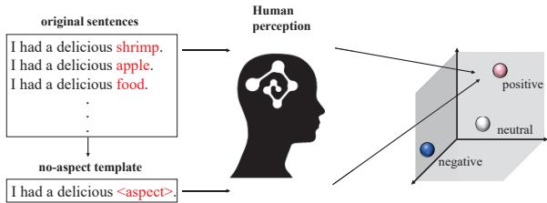
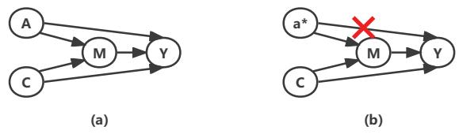
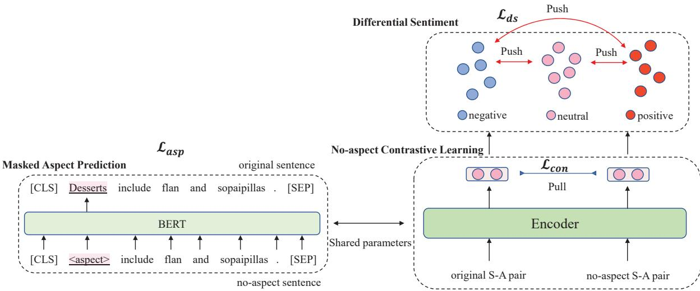
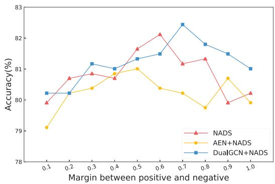
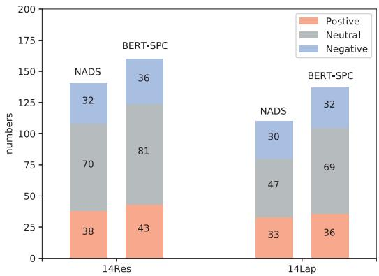

# Aspect Is Not You Need: No-aspect Differential Sentiment Framework for Aspect-based Sentiment Analysis

Jiahao Cao, Rui Liu, Huailiang Peng∗, Lei Jiang, Xu Bai Institute of Information Engineering, Chinese Academy of Sciences School of Cyber Security, University of Chinese Academy of Sciences {caojiahao,liurui3221,penghuailiang,jianglei,baixu}@iie.ac.cn

## Abstract

Aspect-based sentiment analysis (ABSA) is a fine-grained sentiment classification task. Most recent efforts adopt pre-trained model to clas sify the sentences with aspects. However, the aspect sentiment bias from pre-trained model brings some noise to the ABSA task. Besides, traditional methods using cross-entropy loss are hard to find the potential associations between sentiment polarities. In this work, we analyze the ABSA task from a novel cognition perspective: humans can often judge the sentiment of an aspect even if they do not know what the aspect is. Moreover, it is easier to distinguish positive and negative sentiments than others for human beings because positive and negative are two opposite sentiments. To this end, we pro pose a no-aspect differential sentiment (NADS) framework for the ABSA task. We first design a no-aspect template by replacing the aspect with a special unbiased character to eliminate the sentiment bias and obtain a stronger representation. To better get the benefits from the template, we adopt contrastive learning between the no-aspect template and the original sentence. Then we propose a differential sentiment loss instead of the cross-entropy loss to better classify the sentiments by distinguishing the different distances between sentiments. Our proposed model is a general framework and can be combined with almost all traditional ABSA methods. Experiments on SemEval 2014 show that our framework is still able to predict the sentiment of the aspect even we don’t konw what the aspect is. Moreover, our NADS framework boosts three typical ABSA methods and achieves state-of-the-art performance.

## 1 Introduction

Aspect-based sentiment analysis (ABSA) (Jiang et al., 2011) aims to identify the sentiment polarity (i.e., negative, neutral, or positive) of each specific aspect term in a piece of text (Hou et al., 2021;

Dai et al., 2021; Li et al., 2021). For example, in “The food is great, but the service is terrible”, the sentiment towards “food” is positive while the sentiment towards “service” is negative. We need to predict the sentiments of different aspect terms in a sentence.

Previous works usually employ pre-trained model to extract the embedding of the concatenation of the sentence and the aspect term. In this way, the attention mechanism in pre-trained model enhances the connection between aspect and its context (Tang et al., 2016; Song et al., 2019). The experiment results verify its appealing performance. However, the pre-trained model on largescale raw corpora tends to internalize aspects’ intrinsic attributes (Huang et al., 2020) and brings some noise to the ABSA task. For example, for the sentence “Desserts include flan and sopaipillas”, a typical model BERT-SPC (Song et al., 2019) based on BERT (Devlin et al., 2019) tends to classify the sentiment towards “Desserts” as positive, while the label is neutral. This is because in pre-trained corpora, “Desserts” often appears with words that contain positive sentiment, causing the word “Desserts” to internalize positive sentiment as well. Moreover, traditional text classification methods using the cross-entropy loss have some shortcomings. On the one hand, the cross-entropy loss suffers from lacking of robustness to noisy labels (Zhang and Sabuncu, 2018) and the possibility of poor margins (Elsayed et al., 2018). On the other hand, the cross-entropy loss ignores the potential relationships between different sentiment polarities. Meanwhile, the non-smooth anisotropic semantic space induced by pre-trained model (Li et al., 2020) also brings difficulty in distinguishing potential relationships between sentiments.

To tackle these problems, we analyze the ABSA task from a human cognition perspective. People often pay attention to the learning strategy and feature representation in many NLP tasks, but ignore the organization of concepts between human and artificial intelligence. Intuitively, human can still perform well in the ABSA task without knowing the meaning of aspect. As shown in Figure 1, in “I had a delicious shrimp.”, maybe we don’t know what the “shrimp” is (it is a kind of food), we can also easily classify the sentiment polarity of this word as positive. Because we can judge the sentiment of the aspect through its context. Moreover, in human perception, “positive” and “negative” are two completely opposite sentiments and “neutral” sentiment is in between. The distance between “positive” and “neutral” is obviously closer than “positive” and “negative”.

  
Figure 1: Human performance on the ABSA task.

Inspired by the human cognition, we propose the no-aspect template differential sentiment (NADS) framework. We first design a no-aspect template by replacing the aspect term in the sentence with the special sentiment unbiased character “< aspect >” and utilize the contrastive learning between the noaspect template and the original sentence. In this way, we can not only eliminate the sentiment bias in original sentence, but also learn a wider range of sentence patterns as shown in Figure 1 to enhance the robustness of our framework. Moreover, it helps our NADS framework to judge the sentiment of the aspect without knowing the specific meaning of it, just like human beings. Then, in order to reduce the semantic loss caused by the special character “< aspect >”, we utilize the masked aspect prediction to keep the original semantic information. Morever, we design the differential sentiment loss to find the different distances between different sentiments and better distinguish different sentiments. Our main contributions are:

• We propose a no-aspect template and utilize the no-aspect contrastive learning to consider a wider range of sentence patterns and eliminate the sentiment bias in the aspect embedding. This also enables our model to predict the sentiment of the aspect without knowing what the aspect is, just like human beings.

• We design the differential sentiment loss to help us better distinguish different distances between different sentiments. Moreover, our differential sentiment loss can make samples with the same sentiment as close as possible, and samples with different sentiments as far away as possible.

• Experiments on SemEval 2014 show that our model enhances the performance of three typical ABSA methods and achieves new stateof-the-art. Additionally, the experiments on an aspect robustness test set ARTS show our NADS model can greatly improve the robustness of the model.

## 2 Related Work

Aspect-based sentiment analysis is a fine-grained sentiment classification task. Recently, some works on ABSA have focused on leveraging syntactic knowledge through syntactic trees. (Wang et al., 2020) reshaped the syntactic tree with aspect terms as the center and utilized a relational graph attention network to encode the new tree structure for sentiment prediction. (Hou et al., 2021) combined the dependency relations from different parses before applying GNNs over the resulting graph.

Another trend utilizes various attention mechanisms to find the semantic relation of an aspect and its context (Tan et al., 2019; Li et al., 2018; Fan et al., 2018; Huang et al., 2018). Attention mechanism helps to focus on the context related to aspect and shield the irrelevant context. Besides, some works tried to integrate syntax tree and attention mechanism. Most recent work (Li et al., 2021) utilized a mutual biaffine attention mechanism to fuse syntactic information and semantic information from syntactic tree.

In parallel, the pre-trained language model BERT (Devlin et al., 2019) has achieved remarkable performance in many NLP tasks. Experiments show that using BERT in ABSA can achieve better results (Li et al., 2021; Zhang et al., 2019) than using static word embeddings such as Word2vec (Mikolov et al., 2013) and GloVe (Pennington et al., 2014). However, (Wang et al., 2021) showed that the sentiment bias of aspect caused by the pretrained model may perplex the ABSA task. They utilized external sentiment knowledge SentiWord-Net (Esuli and Sebastiani, 2006) to extract prior three-categorical sentiment for aspect terms. Then they proposed an adversarial network to eliminate the prior sentiment of aspect terms. However, it is not known whether the aspect sentiment polarity labeled from SentiWordNet is consistent with the sentiment bias in the pre-trained model. In addition, previous works using cross-entropy loss also ignored the potential associations between different sentiment polarities.

  
Figure 2: (a) and (b) are the causal graphs for traditional ABSA methods and our NADS. A: aspect terms. C: context. M: the fusing information of aspect and context. Y: sentiment of the aspect. $a ^ { * } \colon$ the special character without sentiment bias.

In this paper, we propose a no-aspect template and utilize contrastive learning to eliminate sentiment bias and learn a wider range of sentence patterns to improve the robustness of the model. Moreover, we design the differential sentiment loss to better distinguish the different distances between different sentiments and cluster the same sentiment.

## 3 Preliminaries

In this section, we use causal inference (Pearl et al., 2000; Robins, 2003) to illustrate the theoretical basis of our framework. We illustrate the traditional ABSA methods and our NADS framework by using a causal graph described in Figure 2. Causal graph reflects the causal relationship between variables and we use “ ” denotes the direct effect. For the ABSA task, the factors affecting sentiment prediction include the specific aspect term A that we need to predict and the context of the aspect C. Both A and C are important to ABSA task because C contains the sentiment information and we need to know which aspect A to predict sentiment for.

In traditional methods’ causal graph as shown in Figure 2 (a), the context and aspect capture the direct effect of sentiment via $C  Y$ and $A  Y$ The fusing information captures the indirect effect of A and C on Y via the $M , i . e . , A , C  M  Y$ The predicted result that Y would obtain if A is set to a and C is set to c as:

$$
Y _ { a , c } = Y ( A = a , C = c , M = m )\tag{1}
$$

where $m = M _ { a , c }$ denotes the information about the fusion of aspect a and context c. According to this formula, traditional methods well consider the role of the aspect and its context in the ABSA task. However, in human cognition, the specific meaning of aspect does not affect people’s judgment of its sentiment. Traditional methods ignored the aspect sentiment bias which makes aspect have a direct impact on the prediction results Y via $A  Y$ . It may cause ABSA models to suffer from the spurious correlation between aspect and sentiment, and thus fail to conduct effective reasoning.

In our NADS framework, we propose to exclude aspect sentiment bias effect on $A  Y$ in ABSA as shown in Figure 2 (b). We utilize a special character $^ { 6 6 } <$ aspect $> ^ { \mathfrak { n } }$ that without sentiment bias to replace the original aspect in the sentence and employ the masked aspect prediction to keep the original semantic information of the sentence. We get the sentiment prediction Y as:

$$
Y _ { a ^ { * } , c } = Y ( A = a ^ { * } , C = c , M = m ^ { * } )\tag{2}
$$

where $a ^ { * } = ^ { * } <$ aspect $> ^ { \ast }$ and $m ^ { * } = M _ { a ^ { * } , c } .$ In this way, we eliminate the direct impact of aspect’s sentiment bias on the prediction results and keep the original semantic information.

## 4 Proposed NADS

In the ABSA task, given a sentence $\begin{array} { r l } { S } & { { } = } \end{array}$ $\{ \omega _ { 1 } , \omega _ { 2 } , . . . , \omega _ { \tau } , . . . , \omega _ { \tau + t } , . . . , \omega _ { n } \}$ and an aspect term $A = \{ \omega _ { \tau } , \omega _ { \tau + 1 } , . . . , \omega _ { \tau + t - 1 } \}$ , the purpose is to predict the sentiment polarity of A in this S. As shown in Figure 3, our NADS framework consists of three parts. We first propose no-aspect template and utilize contrastive learning between the noaspect template and original sentence to consider a wider range of sentence patterns and eliminate the sentiment bias in the aspect embedding. Then, in order to make the sentence with the special characters “< aspect $> ^ { \mathfrak { n } }$ keep the original semantic information, we utilize the masked aspect prediction. Finally we design the differential sentiment loss to learn the different distances between different sentiment polarities. We elaborate the details of our proposed NADS.

## 4.1 No-aspect Contrastive Learning

For each $\{ S , A \}$ pair, we utilize a special character $\begin{array} { r } { \cdots { } a s p e c t > \cdots } \end{array}$ without sentiment bias to replace the whole aspect term A in the sentence. We denote the no-aspect template as T:

$$
T = R e p l a c e ( \{ S | A = a \} , < a s p e c t > )\tag{3}
$$

  
Figure 3: An overview of proposed no-aspect differential sentiment (NADS) framework.

To better use the information from no-aspect template and regularize pre-trained anisotropic embedding space, we utilize contrastive learning between the original sentence and no-aspect template. Specifically, for each sentence-aspect pair $( s _ { i } , a _ { i } )$ we denote the positive sentence as:

$$
s _ { i } ^ { + } = T _ { i }\tag{4}
$$

where $T _ { i }$ is the no-aspect template of $s _ { i }$ . Thus we get a positive instance $( s _ { i } ^ { + } , < \ : a s p e c t > )$ for $( s _ { i } , a _ { i } )$ . We obtain feature representation for each sentence-aspect pair and positive instance through the encoder $f _ { \theta } ( \cdot )$

$$
h _ { i } = f _ { \theta } ( s _ { i } , a _ { i } )\tag{5}
$$

$$
h _ { i } ^ { + } = f _ { \theta } ( s _ { i } ^ { + } , < a s p e c t > )\tag{6}
$$

where $h _ { i }$ and $h _ { i } ^ { + }$ denote the feature representation of original sentence-aspect pair and positive instance. In our NADS framework, we utilize BERT to get the embedding of each sentence-aspect pair by inputting the concatenation of the aspect term and the sentence. For other models we use their methods as the encoder to get the embedding for each pair $( s _ { i } , a _ { i } )$ . We denote all other sentences in the mini-batch as negative instances, so the contrastive loss is:

$$
\mathcal { L } _ { c o n } = - l o g \frac { e ^ { s i m ( h _ { i } , h _ { i } ^ { + } ) / \tau } } { \Sigma _ { j = 1 } ^ { N } e ^ { s i m ( h _ { i } , h _ { j } ^ { + } ) / \tau } }\tag{7}
$$

where $\tau$ is the temperature hyperparameter and $s i m ( \cdot )$ is the cosine similarity. N is the batch size.

By comparing the original sentence with the noaspect template, we eliminate the sentiment bias caused by the aspect terms in the original sentence and learn not only the information of a sentence, but also the information of a group of sentence patterns. This helps us to improve the robustness of the model. Moreover, contrastive learning helps us regularize pre-trained anisotropic embedding space to prepare for differential sentiment loss.

## 4.2 Masked Aspect Prediction

In section 4.1, we utilize the “< aspect $> ^ { \mathfrak { n } }$ to construct the no-aspect template. However, we think that directly using a special character “< aspect $> ^ { \ast }$ that does not exist in the pre-trained model may cause trouble to remain the semantic information. Therefore, we utilize masked aspect prediction for the special characters $^ { 6 6 } <$ aspect $> ^ { \ast }$ to keep the original semantics. Specifically, we mask the aspects by using $^ { 6 6 } <$ aspect $> ^ { \mathfrak { n } }$ and predict the original aspect terms in the position of $^ { 6 6 } <$ aspect $> ^ { \ast }$ in our ABSA training dataset. According to (Hong et al., 2021), our purpose is to train the embedding of $^ { 6 6 } <$ < aspect $> ^ { \ast }$ to keep the complete semantic information. For our NADS framework, we denote the embedding of $^ { 6 6 } <$ aspect $> ^ { \ast }$ position as $h _ { [ < a s p > ] }$ . We feed $h _ { [ < a s p > ] }$ into a softmax layer to predict the original aspect:

$$
\widehat { Y } ^ { a } = s o f t m a x ( W _ { 1 } h _ { [ < a s p > ] } + b _ { 1 } )\tag{8}
$$

where the $W _ { 1 }$ and $b _ { 1 }$ are trainable parameters, ${ \widehat { Y } } ^ { a }$ bindicates the predict probability of the aspect word at its position. We get the masked aspect prediction loss through the cumulative of log-likelihood on predictions of each $^ { 6 6 } <$ aspect $> ^ { \mathfrak { n } }$ position:

$$
\mathcal { L } _ { a s p } = - \Sigma l o g p ( \widehat { Y } ^ { a } )\tag{9}
$$

Specially, we only predict the position of $^ { 6 6 } <$ aspect $> ^ { \ast }$ in sentences. The masked aspect prediciton helps us keep the original semantic information of the sentence after replacing the aspect.

## 4.3 Differential Sentiment Loss

After regularizing pre-trained anisotropic embedding space by using the contrastive learning between original and no-aspect template, we design our differential sentiment loss to better distinguish different sentiments. We first embed our labels into the same size of $h _ { i }$ . We convert positive, neutral and negative sentiment labels into label embeddings $L = \{ l _ { p o s } , l _ { n e u } , l _ { n e g } \}$ . The distance between the sentence-aspect pair embedding $h _ { i }$ and label embedding $l _ { i }$ is:

$$
d ( h _ { i } , l _ { i } ) = 1 - \frac { h _ { i } ^ { \top } l _ { i } } { \| h _ { i } \| \cdot \| l _ { i } \| }\tag{10}
$$

For each sentence-aspect pair embedding $h _ { i } ,$ , the distance between $h _ { i }$ and its label $l _ { i }$ should be closer than other label embeddings in $L .$ Thus, we utilize a triplet loss to make $h _ { i }$ closer to the right label embedding $l _ { i }$ and further to the other label embeddings. For each $h _ { i }$ , the positive instance is the label embedding $l _ { i }$ and the negative instances are the other label embeddings in L. Moreover, in human cognition, the distances between different sentiments are different. Thus, we set a specific margin for each negative instance to better distinguish the different distances between different sentiments. Our differential sentiment loss is given as:

$$
\begin{array} { r } { \mathcal { L } _ { d s } = \Sigma _ { l _ { i } ^ { ' } \in L , l _ { i } ^ { ' } \neq l _ { i } } m a x ( d ( h _ { i } , l _ { i } ) } \\ { - d ( h _ { i } , l _ { i } ^ { ' } ) + m ( l _ { i } , l _ { i } ^ { ' } ) , 0 ) } \end{array}\tag{11}
$$

where $m ( l _ { i } , l _ { i } ^ { ' } )$ is the specific margin for label $l _ { i }$ and $l _ { i } ^ { ' } .$ . According to human cognition, we denote that positive and negative sentiments should have the same distance to neutral sentiment and the distance between positive and negative is further. Thus, we set $m ( p o s , n e u ) \ = \ m ( n e g , n e u )$ and $m ( p o s , n e g ) > m ( p o s , n e u )$ in our model. Compared with the cross-entropy loss, our differential sentiment loss can better classify the sentiments through distinguishing the differences between sentiments. Moreover, our differential sentiment loss can jointly train the model and label embeddings and make our framework converge faster.

<table><tr><td>Dataset</td><td>Division</td><td>#Pos</td><td>#Neu</td><td>#Neg</td></tr><tr><td rowspan="2">Laptop</td><td>Train</td><td>976</td><td>455</td><td>851</td></tr><tr><td>Test</td><td>337</td><td>167</td><td>128</td></tr><tr><td rowspan="2">Restaurant</td><td>Train</td><td>2164</td><td>637</td><td>807</td></tr><tr><td>Test</td><td>727</td><td>196</td><td>196</td></tr></table>

Table 1: Statistics on two datasets of ABSA.

In order to judge the sentiment polarity of the sentence-aspect pair, we utilize cosine similarity to construct our scoring function:

$$
S ( h , l ) = \frac { h ^ { \top } l } { \| h \| \cdot \| l \| }\tag{12}
$$

where $h$ is the embedding of the sentence-aspect pair, and l is the embedding of the label. We take the l with the largest score as our prediction result.

Our training goal is to minimize the following total objective function:

$$
\mathcal { L } = \mathcal { L } _ { d s } + \lambda _ { 1 } \mathcal { L } _ { c o n } + \lambda _ { 2 } \mathcal { L } _ { a s p }\tag{13}
$$

where $\lambda _ { 1 }$ and $\lambda _ { 2 }$ are the weights of contrastive leanrning loss and masked aspect prediction loss.

## 5 Experiments

## 5.1 Datasets

We evaluate our model on two ABSA task public datasets: Restaurant and Laptop reviews from SemEval 2014 Task 4 (Pontiki et al., 2014). We remove several examples with “conflict” sentiment polarity labels in the reviews. Table 1 shows the statistics of these datasets.

## 5.2 Baseline Methods

We compare our NADS with state-of-the-art baselines. The models are described as follows.

1) BERT-SPC (Song et al., 2019) utilizes BERT to encode the sentence-aspect pair as : "[CLS] sentence [SEP] aspect [SEP]" and gets the embedding of “[CLS]”. Our NADS framework utilizes BERT-SPC as the encoder.

2) AEN+BERT (Song et al., 2019) utilizes BERT and several attention layers to encoder sentenceaspect pair. The embedding of the sentence and the embedding of the aspect are obtained respectively. 3) CapsNet+BERT (Jiang et al., 2019) combines the BERT and capsule networks in ABSA.

<table><tr><td rowspan="2">Models</td><td rowspan="2">Strategy</td><td colspan="2">14Rest</td><td colspan="2">14Lap</td></tr><tr><td>Accuracy</td><td>Macro-F1</td><td>Accuracy</td><td>Macro-F1</td></tr><tr><td>CapsNet+BERT (Jiang et al., 2019)</td><td>Ori</td><td>85.09</td><td>77.75</td><td>78.21</td><td>73.34</td></tr><tr><td>BERT-ADA (Rietzler et al., 2020)</td><td>Ori</td><td>87.14</td><td>80.05</td><td>79.19</td><td>74.18</td></tr><tr><td>SDGCN-BERT (Zhao et al., 2020)</td><td>Ori</td><td>83.57</td><td>76.47</td><td>81.35</td><td>78.34</td></tr><tr><td>R-GAT+BERT (Wang et al., 2020)</td><td>Ori</td><td>86.60</td><td>81.35</td><td>78.21</td><td>74.07</td></tr><tr><td>DGEDT+BERT (Tang et al., 2020)</td><td>Ori</td><td>86.30</td><td>80.00</td><td>79.80</td><td>75.60</td></tr><tr><td rowspan="4">BERT-SPC (Song et al., 2019) NADS</td><td>Ori</td><td>84.46</td><td>76.98</td><td>78.99</td><td>75.03</td></tr><tr><td>Noasp</td><td>81.77</td><td>70.81</td><td>75.47</td><td>69.65</td></tr><tr><td>Unite</td><td>84.45</td><td>77.40</td><td>78.16</td><td>73.06</td></tr><tr><td>Ori</td><td>87.49</td><td>82.09</td><td>82.12</td><td>79.13</td></tr><tr><td rowspan="3">AEN+BERT (Song et al., 2019)</td><td>Noasp</td><td>87.04</td><td>81.77</td><td>81.01</td><td>77.69</td></tr><tr><td>Unite</td><td>87.58</td><td>81.73</td><td>81.96</td><td>78.87</td></tr><tr><td>Ori</td><td>83.12</td><td>73.76</td><td>79.93</td><td>76.31</td></tr><tr><td rowspan="4">AEN+NADS</td><td>Noasp</td><td>80.70</td><td>68.86</td><td>77.06</td><td>72.41</td></tr><tr><td>Unite</td><td>80.97</td><td>71.65</td><td>78.16</td><td>74.39</td></tr><tr><td>Ori</td><td>84.00</td><td>75.88</td><td>81.33</td><td>77.78</td></tr><tr><td>Noasp</td><td>86.51</td><td>80.16</td><td>80.22</td><td>76.88</td></tr><tr><td rowspan="3">DualGCN+BERT (Li et al., 2021)</td><td>Unite</td><td>86.68</td><td>79.69</td><td>81.48</td><td>78.07</td></tr><tr><td>Ori</td><td>87.13</td><td>81.16</td><td>81.80</td><td>78.10</td></tr><tr><td>Noasp</td><td>81.95</td><td>72.42</td><td>77.53</td><td>73.49</td></tr><tr><td rowspan="3">DualGCN+NADS</td><td>Unite</td><td>84.90</td><td>77.24</td><td>78.64</td><td>74.43</td></tr><tr><td>Ori</td><td>87.49</td><td>82.07</td><td>82.75</td><td>79.95</td></tr><tr><td>Noasp Unite</td><td>86.86 87.67</td><td>81.23 82.59</td><td>81.49 82.75</td><td>78.02 79.72</td></tr></table>

Table 2: Comparison of our NADS on three traditional methods to other baselines on two datasets.

4) BERT-ADA (Rietzler et al., 2020) utilizes domain data to enhance the BERT and then uses task data to make supervised fine-tuning.

5) SDGCN+BERT (Zhao et al., 2020) employs graph convolution network for sentences with multiple aspects.

6) R-GAT+BERT (Wang et al., 2020) proposes an aspect-oriented tree and encodes new dependency trees with a relational GAT.

7) DGEDT+BERT (Tang et al., 2020) proposes a mutual biaffine module to jointly consider the representations learned from Transformer and the GNN model over the dependency tree.

8) DualGCN+BERT (Li et al., 2021) utilizes dependency tree to extract syntax information and self attention to extract semantic information.

Moreover, in order to prove the effectiveness of our NADS framework, we adopt our NADS to BERT-SPC, AEN+BERT and DualGCN+BERT.

## 5.3 Implementation Details

We utilize the bert-base-uncased English version. Following the DualGCN (Li et al., 2021), we use

LAL-Parser (Mrini et al., 2019) to get dependency tree for DualGCN+NADS. We randomly initialize the embedding of three sentiments and we set the $\lambda _ { 1 } = 0 . 4 , \lambda _ { 2 } = 0 . 1$ during our training. The different margins (m(pos, neu), m(pos, neg)) are set to (0.4, 0.6), (0.4, 0.6) for the laptop and restaurant datasets for our NADS framework. During training, we use AdamW as the optimizer and set the learning rate to $2 \times 1 0 ^ { - 5 }$ . We train the model up to 15 epochs with a batch size of 16.

## 5.4 Comparison Results

We utilize the accuracy and macro-averaged F1- score to evaluate ABSA task. In order to better predict the correct sentiment in the test, we adopt three different ways to test our NADS framework.

1) Original test: utilizing the concatenation of the original aspect and the original sentence as the input and extract the embedding for prediction.

2) Noasp test: utilizing the concatenation of the “< aspect >” and the no-aspect template as the input of encoder. This test method can help us judge whether the model can correctly predict sentiment without knowing the specific meaning of the aspect like human beings.

3) Unite test: using both Original test mode and Noasp test mode to get the scores of each label for each sentence-aspect pair and sum the scores of same label after normalization.

Table 2 shows our main experimental results. As we can see, our NADS framework outperforms all baselines on laptop and restaurant datasets, and the performance of the three traditional models: BERT-SPC, AEN+BERT and DualGCN+BERT has been improved after adding our NADS framework. Our NADS outperforms the BERT-SPC by 3.03%/3.13% on Restaurant/Laptop. The result demonstrates that our NADS framework effectively utilizes the way of human cognitive and plays a better role in the ABSA task. Compared with traditional methods, our no-aspect template eliminates the sentiment bias of aspect and learns more information of a group of sentence patterns, which can reduce the noise caused by aspect sentiment bias and enhance the robustness of our framework. Moreover, our differential sentiment loss can better classify the sentiment through distinguishing the difference in these three different sentiment polarities after contrastive learning. The experiments on three traditional methods also show that our framework well fits most of the existing models and boosts their performance.

In parallel, according to the experimental results of Noasp test, the performance of traditional methods drops significantly without knowing what aspect is. However, our NADS framework can still perform well without knowing the aspect just like human beings. In Noasp test mode, BERT-SPC drops 2.69%/3.52% on Restaurant/Laptop. By contrast, our NADS framework drops only 0.45%/1.11% on Restaurant/Laptop. We also find AEN+NADS increases 2.51% on Restaurant dataset, while the AEN+BERT drops 2.42%. This shows that our NADS can still perform well without knowing the specific meaning of the aspect. Comparing these three test modes, we can also find that the Unite test mode can achieve the most stable result in different models.

## 5.5 Ablation Study

In order to further study the role of different modules in our framework, we conduct extensive ablation experiments. The results are shown in Table 3. NADS w/o NOASP denotes that we only utilize the original sentence and remove the contrastive learning. Without contrastive learning between no-aspect template and original sentence, the sentiment bias of aspect perplexes the prediction result and more importantly, differential sentiment loss will not work because of the anisotropic in BERT model. Therefore, its performance is degraded on both two datasets. NADS w/o MAP means that we remove the masked aspect prediction module so that we may lose the original semantic information of the sentence. NADS w/o DS indicates that we utilize the cross-entropy loss function instead of our differential sentiment loss. Without differential sentiment loss, the model cannot find the different distances between sentiments. Experiments show that every module is indispensable in our NADS framework.

<table><tr><td rowspan="2">Models</td><td colspan="2">14Rest</td><td colspan="2">14Lap</td></tr><tr><td>Acc</td><td>Macro-F1</td><td>Acc</td><td>Macro-F1</td></tr><tr><td>NADS</td><td>87.49</td><td>82.09</td><td>82.12</td><td>79.13</td></tr><tr><td>NADS w/o NOASP</td><td>85.22</td><td>78.88</td><td>79.43</td><td>75.30</td></tr><tr><td>NADS w/o MAP</td><td>87.04</td><td>81.73</td><td>81.18</td><td>78.51</td></tr><tr><td>NADS w/o DS</td><td>87.22</td><td>81.71</td><td>81.01</td><td>77.26</td></tr></table>

Table 3: Experimental results of ablation study.

  
Figure 4: Effect of different m(pos, neg) while set m(pos, neu) = 0.4 in laptop dataset.

## 5.6 Selection of Margin

We experiment with different margins in the differential sentiment loss. In our framework, we only consider the m(pos, neu) and m(pos, neg). Figure 4 shows the accuracy of different m(pos, neg) when we set m(pos, neu) = 0.4 in our three methods based on our NADS framework on Laptop dataset. As we can see, the accuracy increases first and then decreases in the process of m(pos, neg) gradually increasing. The three models perform best when the m(pos, neg) is set to 0.6, 0.5 and 0.7. This experiment shows that the distance between positive and negative is indeed farther than that between positive and neutral. It proves the effectiveness of our differential sentiment loss.

<table><tr><td># Case</td><td></td><td>BERT-SPC</td><td>AEN+BERT</td><td>DualGCN+BERT</td><td>NADS</td></tr><tr><td>2</td><td>I asked for a simple medium rare steak . Desserts include flan and sopaipillas. We started with the scallops and asparagus</td><td> $\overline { { ( \mathsf { P } _ { \times } ) } }$   $( \boldsymbol { \mathrm { P } } _ { \times } , \boldsymbol { \mathrm { P } } _ { \times } , \boldsymbol { \mathrm { P } } _ { \times } )$ </td><td> $\overline { { ( \mathsf { P } _ { \times } ) } }$   $( \boldsymbol { \mathrm { P } } _ { \times } , \boldsymbol { \mathrm { P } } _ { \times } , \boldsymbol { \mathrm { P } } _ { \times } )$ </td><td> $\overline { { ( \mathsf { P } _ { \times } ) } }$   $( \boldsymbol { \mathrm { P } } _ { \times } , \boldsymbol { \mathrm { P } } _ { \times } , \boldsymbol { \mathrm { P } } _ { \times } )$ </td><td> $\overline { { ( \mathbf { O } _ { \checkmark } ) } }$   $( \boldsymbol { 0 } _ { \checkmark } , \boldsymbol { \mathrm { P } } _ { \times } , \boldsymbol { \mathrm { P } } _ { \times } )$ </td></tr><tr><td>3</td><td>and also had the soft shell crab as well as the cheese plate.</td><td> $( 0 \ J , \mathbf { P } _ { \times } , \mathbf { P } _ { \times } , \mathbf { P } _ { \times } )$ </td><td> $( \mathbf { P } _ { \times } , \mathbf { P } _ { \times } , \mathbf { P } _ { \times } , \mathbf { P } _ { \times } )$ </td><td> $( 0 \ J , 0 \ J , \mathbf { P } _ { \times } , \mathbf { P } _ { \times } )$ </td><td> $( 0 \small { \sqrt { , 0 \sqrt { , 0 \sqrt { , 1 } } } } )$ </td></tr><tr><td>4</td><td>Try the rose roll (not on menu ).</td><td> $( \mathbf { N } _ { \times } )$ </td><td> $( \mathbf { N } _ { \times } )$ </td><td> $( 0 _ { \checkmark } )$ </td><td>(0√)</td></tr><tr><td>5</td><td>There was only one waiter for the whole restaurant upstairs.</td><td> $( \mathrm { N } _ { \times } )$ </td><td> $( \mathrm { N } _ { \times } )$ </td><td> $( 0 _ { \checkmark } )$ </td><td> $( 0 _ { \checkmark } )$ </td></tr></table>

Table 4: Case study. Comparison of our NADS model to different baselines. Marker ✓ indicates correct prediction while indicates incorrect prediction.

  
Figure 5: Distribution of bad cases of our NADS framework and BERT-SPC.

## 5.7 Sentiment Bias Elimination

In order to better understand the ability of our NADS framework to eliminate sentiment bias, we find several examples whose labels are neutral and show their prediction results in different models in Table 4, where P, N, O represent positive, negative, and neutral sentiments. We highlight the aspect words in red. We can see that our NADS framework outperforms all other models. For the aspect “steak” in the first sample, previous methods ignore the positive sentiment bias of “steak” and incorrectly predict the sentiment as positive. In contrast, our NADS eliminates the positive sentiment bias through no-aspect template and predicts the correct sentiment as neutral. Moreover, we also show the distribution of bad cases in Figure 5. The bad cases of neutral aspects terms in our NADS framework are significantly less than BERT-SPC. This proves the effectiveness of our NADS framework in eliminating sentiment bias. However, there are still some neutral aspect terms in our framework that are incorrectly predicted as shown in Table 4.

<table><tr><td rowspan="2">Models</td><td>Rest</td><td>Lap</td></tr><tr><td>Acc→ARS(Change)</td><td>Acc→ARS(Change)</td></tr><tr><td>BERT-PT</td><td>86.70→59.29(↓27.41)</td><td>78.53→53.29(↓25.24)</td></tr><tr><td>RGAT</td><td>84.41→56.54(↓27.87)</td><td>78.08→51.37(↓26.72)</td></tr><tr><td>BERT-SPC</td><td>83.04→54.82(↓28.22)</td><td>77.59→50.94(↓26.65)</td></tr><tr><td>NADS</td><td>87.49→64.55(↓22.94)</td><td>82.12→58.77(↓23.35)</td></tr><tr><td>AEN+BERT</td><td>83.12→25.45(↓57.67)</td><td>79.93→30.09(↓49.84)</td></tr><tr><td>AEN+NADS</td><td>84.00→26.61(↓57.39)</td><td>81.33→37.15(↓44.18)</td></tr><tr><td>DualGCN+BERT</td><td>87.13→63.57(↓23.56)</td><td>81.80→57.99(↓23.81)</td></tr><tr><td>DualGCN+NADS</td><td>87.49→66.16(↓21.33)</td><td>82.75→60.82(↓21.93)</td></tr></table>

Table 5: Our NADS performance on aspect robustness test set. We compare the accuracy on original and the new test sets, and calculate the change of accuracy.
<table><tr><td rowspan="2">Models</td><td rowspan="2">Strategy</td><td>Rest</td><td>Lap</td></tr><tr><td>Acc→ARS(Change)</td><td>Acc→ARS(Change)</td></tr><tr><td rowspan="3">NADS</td><td>Ori</td><td>87.49→64.55(↓22.94)</td><td>82.12→58.77(↓23.35)</td></tr><tr><td>Noasp</td><td>87.04→64.38(↓22.66)</td><td>81.01→59.56(↓21.35)</td></tr><tr><td>Unite</td><td>87.58→64.91(↓22.67)</td><td>81.96→60.19(↓21.77)</td></tr><tr><td rowspan="3">AEN+NADS</td><td>Ori</td><td>84.00→26.61(↓57.39)</td><td>81.33→37.15(↓44.18)</td></tr><tr><td>Noasp</td><td>86.51→60.00(↓26.51)</td><td>80.22→57.88(↓22.34)</td></tr><tr><td>Unite</td><td>86.68→56.34(↓30.34)</td><td>81.48→50.78(↓30.70)</td></tr><tr><td rowspan="3">DualGCN+NADS</td><td>Ori</td><td>87.49→66.16(↓21.33)</td><td>82.75→60.82(↓21.93)</td></tr><tr><td>Noasp</td><td>86.86→64.46(↓22.40)</td><td>81.49→60.03(↓21.46)</td></tr><tr><td>Unite</td><td>87.67→65.36(↓22.31)</td><td>82.75→60.66(↓22.09)</td></tr></table>

Table 6: Comparison of three test modes on aspect robustness test set.

A possible reason is that there may be other words in a sentence carrying the sentiment bias in addition to the current aspect.

## 5.8 Robustness Study

In order to verify the robustness of our NADS, we test the robustness score of our framework on the Aspect Robustness Test Set (ARTS) (Xing et al., 2020). The datasets enrich 14Lap and 14Rest according to three strategies: reverse the original sentiment of the target aspect (REVTGT), perturb the sentiments of the non-target aspects (REVNON) and generate more non-target aspect terms that have opposite sentiment polarities to the target (AD-DDIFF). They take the original sentence and the three variants as an unit. Only if the original sentence and all variants are correct, the unit is correct. Calculate the accuracy of the units in the datasets as the final Aspect Robustness Score (ARS).

We compare the ARS of the three models before adding our NADS framework and after adding NADS. The results in Table 5 show that the ARS of the model has been significantly improved after adding our NADS framework. Our NADS framework adding DualGCN performs significantly better than other models with 21.33% and 21.93% decline on Restaurant and Laptop. This shows that our framework utilizing human cognition has better robustness than other models.

Moreover, we utilize the three test modes to test on the ARTS as shown in Table 6. As we can see, the AEN+NADS model with 57.39% and 44.18% decline on Restaurant and Laptop when using Original test mode. However, with 26.51% and 22.34% decline when utilizing Noasp test mode. In the overall scheme, the Noasp test mode and Unite test mode can get a more stable result than the Original test mode on the ARTS. Utilizing no-aspect template in test may be a more stable robustness test method.

## 6 Conclusion

In this paper, we propose a NADS framework which is more in line with human cognition for the ABSA task. Our NADS framework utilizes no-aspect contrastive learning to eliminate the sentiment bias of aspects and enhance the sentence representations. In addition, we construct a differential sentiment loss to better classify the sentiments through distinguishing the different distances between sentiment polarities. Extensive experiments show that our NADS framework boosts three typical ABSA methods and outperforms baselines. Moreover, our NADS framework can still perform well even we don’t know what the aspect is. The test on the robustness dataset shows that our NADS framework significantly improves the robustness of the model.

## Acknowledgements

This paper is supported by Pilot Projects of Chinese Academy of Sciences (NO.XDC02030000).

## References

Junqi Dai, Hang Yan, Tianxiang Sun, Pengfei Liu, and Xipeng Qiu. 2021. Does syntax matter? a strong baseline for aspect-based sentiment analysis with RoBERTa. In Proceedings ofthe 2021 Conference of the North American Chapter of the Association for Computational Linguistics: Human Language Technologies, pages 1816–1829, Online. Association for Computational Linguistics.

Jacob Devlin, Ming-Wei Chang, Kenton Lee, and Kristina Toutanova. 2019. BERT: Pre-training of deep bidirectional transformers for language understanding. In Proceedings of the 2019 Conference of the North American Chapter ofthe Associationfor Computational Linguistics: Human Language Technologies, Volume 1 (Long and Short Papers), pages 4171–4186, Minneapolis, Minnesota. Association for Computational Linguistics.

Gamaleldin Elsayed, Dilip Krishnan, Hossein Mobahi, Kevin Regan, and Samy Bengio. 2018. Large margin deep networks for classification. Advances in Neural Information Processing Systems, 31:842–852.

Andrea Esuli and Fabrizio Sebastiani. 2006. Sentiwordnet: A publicly available lexical resource for opinion mining. In Proceedings of the Fifth International Conference on Language Resources and Evaluation (LREC’06).

Feifan Fan, Yansong Feng, and Dongyan Zhao. 2018. Multi-grained attention network for aspect-level sentiment classification. In Proceedings ofthe 2018 Conference on Empirical Methods in Natural Language Processing, pages 3433–3442, Brussels, Belgium. Association for Computational Linguistics.

Jimin Hong, TaeHee Kim, Hyesu Lim, and Jaegul Choo. 2021. AVocaDo: Strategy for adapting vocabulary to downstream domain. In Proceedings of the 2021 Conference on Empirical Methods in Natural Language Processing, pages 4692–4700, Online and Punta Cana, Dominican Republic. Association for Computational Linguistics.

Xiaochen Hou, Peng Qi, Guangtao Wang, Rex Ying, Jing Huang, Xiaodong He, and Bowen Zhou. 2021. Graph ensemble learning over multiple dependency trees for aspect-level sentiment classification. In Proceedings ofthe 2021 Conference ofthe North American Chapter ofthe Associationfor Computational Linguistics: Human Language Technologies, pages 2884–2894, Online. Association for Computational Linguistics.

Binxuan Huang, Yanglan Ou, and Kathleen M Carley. 2018. Aspect level sentiment classification with attention-over-attention neural networks. In International Conference on Social Computing, Behavioral-Cultural Modeling and Prediction and Behavior Representation in Modeling and Simulation, pages 197– 206. Springer.

Po-Sen Huang, Huan Zhang, Ray Jiang, Robert Stanforth, Johannes Welbl, Jack Rae, Vishal Maini, Dani Yogatama, and Pushmeet Kohli. 2020. Reducing sentiment bias in language models via counterfactual evaluation. In Findings ofthe Associationfor Computational Linguistics: EMNLP 2020, pages 65–83, Online. Association for Computational Linguistics.

Long Jiang, Mo Yu, Ming Zhou, Xiaohua Liu, and Tiejun Zhao. 2011. Target-dependent Twitter sentiment classification. In Proceedings of the 49th Annual Meeting ofthe Associationfor Computational

Linguistics: Human Language Technologies, pages 151–160, Portland, Oregon, USA. Association for Computational Linguistics.

Qingnan Jiang, Lei Chen, Ruifeng Xu, Xiang Ao, and Min Yang. 2019. A challenge dataset and effective models for aspect-based sentiment analysis. In Proceedings of the 2019 Conference on Empirical Methods in Natural Language Processing and the 9th International Joint Conference on Natural Language Processing (EMNLP-IJCNLP), pages 6280– 6285, Hong Kong, China. Association for Computational Linguistics.

Bohan Li, Hao Zhou, Junxian He, Mingxuan Wang, Yiming Yang, and Lei Li. 2020. On the sentence embeddings from pre-trained language models. In Proceedings of the 2020 Conference on Empirical Methods in Natural Language Processing (EMNLP), pages 9119–9130, Online. Association for Computational Linguistics.

Lishuang Li, Yang Liu, and AnQiao Zhou. 2018. Hierarchical attention based position-aware network for aspect-level sentiment analysis. In Proceedings of the 22nd Conference on Computational Natural Language Learning, pages 181–189, Brussels, Belgium. Association for Computational Linguistics.

Ruifan Li, Hao Chen, Fangxiang Feng, Zhanyu Ma, Xiaojie Wang, and Eduard Hovy. 2021. Dual graph convolutional networks for aspect-based sentiment analysis. In Proceedings of the 59th Annual Meeting of the Association for Computational Linguistics and the 11th International Joint Conference on Natu ral Language Processing (Volume 1: Long Papers), pages 6319–6329, Online. Association for Computational Linguistics.

Tomas Mikolov, Kai Chen, Greg Corrado, and Jeffrey Dean. 2013. Efficient estimation of word representations in vector space. arXiv preprint arXiv:1301.3781.

Khalil Mrini, Franck Dernoncourt, Trung Bui, Walter Chang, and Ndapa Nakashole. 2019. Rethinking self-attention: An interpretable self-attentive encoderdecoder parser. CoRR, abs/1911.03875.

Judea Pearl et al. 2000. Models, reasoning and inference. Cambridge, UK: CambridgeUniversityPress, 19.

Jeffrey Pennington, Richard Socher, and Christopher Manning. 2014. GloVe: Global vectors for word representation. In Proceedings of the 2014 Conference on Empirical Methods in Natural Language Processing (EMNLP), pages 1532–1543, Doha, Qatar. Association for Computational Linguistics.

Maria Pontiki, Dimitris Galanis, John Pavlopoulos, Harris Papageorgiou, Ion Androutsopoulos, and Suresh Manandhar. 2014. SemEval-2014 task 4: Aspect based sentiment analysis. In Proceedings ofthe 8th

International Workshop on Semantic Evaluation (SemEval 2014), pages 27–35, Dublin, Ireland. Association for Computational Linguistics.

Alexander Rietzler, Sebastian Stabinger, Paul Opitz, and Stefan Engl. 2020. Adapt or get left behind: Domain adaptation through BERT language model finetuning for aspect-target sentiment classification. In Proceedings of the 12th Language Resources and Evaluation Conference, pages 4933–4941, Marseille, France. European Language Resources Association.

James M Robins. 2003. Semantics of causal dag models and the identification of direct and indirect effects. Oxford Statistical Science Series, pages 70–82.

Youwei Song, Jiahai Wang, Tao Jiang, Zhiyue Liu, and Yanghui Rao. 2019. Attentional encoder network for targeted sentiment classification. arXiv preprint arXiv:1902.09314.

Xingwei Tan, Yi Cai, and Changxi Zhu. 2019. Recognizing conflict opinions in aspect-level sentiment classification with dual attention networks. In Proceedings ofthe 2019 Conference on Empirical Methods in Natural Language Processing and the 9th International Joint Conference on Natural Language Processing (EMNLP-IJCNLP), pages 3426–3431, Hong Kong, China. Association for Computational Linguistics.

Duyu Tang, Bing Qin, Xiaocheng Feng, and Ting Liu. 2016. Effective lstms for target-dependent sentiment classification. In Proceedings ofCOLING 2016, the 26th International Conference on Computational Linguistics: Technical Papers, pages 3298–3307.

Hao Tang, Donghong Ji, Chenliang Li, and Qiji Zhou. 2020. Dependency graph enhanced dual-transformer structure for aspect-based sentiment classification. In Proceedings of the 58th Annual Meeting of the Association for Computational Linguistics, pages 6578– 6588, Online. Association for Computational Linguistics.

Bo Wang, Tao Shen, Guodong Long, Tianyi Zhou, and Yi Chang. 2021. Eliminating sentiment bias for aspect-level sentiment classification with unsupervised opinion extraction. In Findings ofthe Associationfor Computational Linguistics: EMNLP 2021, pages 3002–3012, Punta Cana, Dominican Republic. Association for Computational Linguistics.

Kai Wang, Weizhou Shen, Yunyi Yang, Xiaojun Quan, and Rui Wang. 2020. Relational graph attention network for aspect-based sentiment analysis. In Proceedings of the 58th Annual Meeting of the Association for Computational Linguistics, pages 3229– 3238, Online. Association for Computational Linguistics.

Xiaoyu Xing, Zhijing Jin, Di Jin, Bingning Wang, Qi Zhang, and Xuanjing Huang. 2020. Tasty burgers, soggy fries: Probing aspect robustness in aspectbased sentiment analysis. In Proceedings ofthe 2020

Conference on Empirical Methods in Natural Language Processing (EMNLP), pages 3594–3605, Online. Association for Computational Linguistics.

Chen Zhang, Qiuchi Li, and Dawei Song. 2019. Aspectbased sentiment classification with aspect-specific graph convolutional networks. In Proceedings of the 2019 Conference on Empirical Methods in Natural Language Processing and the 9th International Joint Conference on Natural Language Processing (EMNLP-IJCNLP), pages 4568–4578, Hong Kong, China. Association for Computational Linguistics.

Zhilu Zhang and Mert R Sabuncu. 2018. Generalized cross entropy loss for training deep neural networks with noisy labels. In 32nd Conference on Neural Information Processing Systems (NeurIPS).

Pinlong Zhao, Linlin Hou, and Ou Wu. 2020. Modeling sentiment dependencies with graph convolutional networks for aspect-level sentiment classification. Knowledge-Based Systems, 193:105443.