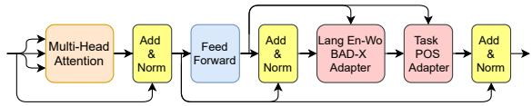
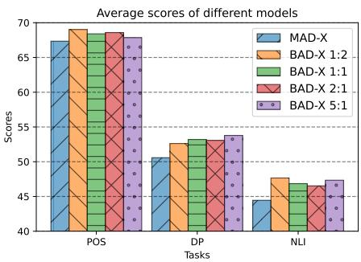

# BAD-X: Bilingual Adapters Improve Zero-Shot Cross-Lingual Transfer

Marinela Parovic´1 Goran Glavaš2 Ivan Vulic´1 Anna Korhonen1

1Language Technology Lab, TAL, University of Cambridge

2CAIDAS, University of Würzburg

{mp939,iv250,alk23}@cam.ac.uk

goran.glavas@uni-wuerzburg.de

## Abstract

Adapter modules enable modular and efficient zero-shot cross-lingual transfer, where current state-of-the-art adapter-based approaches learn specialized language adapters (LAs) for individual languages. In this work, we show that it is more effective to learn bilingual language pair adapters (BAs) when the goal is to optimize performance for a particular sourcetarget transfer direction. Our novel BAD-X adapter framework trades off some modularity of dedicated LAs for improved transfer performance: we demonstrate consistent gains in three standard downstream tasks, and for the majority of evaluated low-resource languages.

## 1 Introduction

Massively multilingual Transformers (MMTs) such as mBERT (Devlin et al., 2019), XLM-R (Conneau et al., 2020), and mT5 (Xue et al., 2021) have dominated research in multilingual NLP and cross-lingual transfer recently. Pretrained on large amounts of unlabelled data in 100+ languages, they have been shown to achieve impressive performance for a wide range of languages and tasks, and in zero-shot cross-lingual transfer in particular (Wu and Dredze, 2019; K et al., 2019). However, their representational capacity is known to be limited by the curse ofmultilinguality: a trade-off between the language coverage and model capacity (Conneau et al., 2020), which typically favors high-resource languages. Their limitations are thus especially pronounced in low-resource scenarios, in transfer between distant languages and towards resourcepoor target languages (Hu et al., 2020; Lauscher et al., 2020; Ansell et al., 2021, inter alia).

A standard approach to zero-shot cross-lingual transfer with MMTs (i) fine-tunes the full MMT on task-specific data in the source language and then (ii) applies it directly to make predictions in the target language (Hu et al., 2020). On top of the expensive fine-tuning of the entire large model, this standard procedure also does not ‘prepare’ the MMT to excel at a particular target language or for a particular source-target transfer direction.

This has been alleviated through modular parameter-efficient adaptations of the MMTs (Bapna and Firat, 2019; Philip et al., 2020; He et al., 2021) which bypass full fine-tuning, most prominently through lightweight adapters (Rebuffi et al., 2017; Houlsby et al., 2019): additional trainable parameters inserted into the MMT’s layers. They have recently been used for language and task specialization of the MMTs (Pfeiffer et al., 2020b), offering improved and more efficient zeroshot cross-lingual transfer.

Previous work (Pfeiffer et al., 2020b; Üstün et al., 2020, 2021; Vidoni et al., 2020; Ansell et al., 2021, inter alia) focused on creating: 1) dedicated language adapters (LAs) for each individual language, and 2) individual task adapters (TAs). Creating single-language LAs enables a very modular approach to cross-lingual transfer, where a source language LA (used in training) can be directly swapped with any target language LA at inference. Yet, this procedure still does not prepare nor adapt the MMT for a particular source-target transfer direction. Put simply, if one’s incentive is to optimize the performance of a particular target language Lt given annotated data in a particular source language Ls, especially under low-data regimes, one might try to capture the interplay between the two languages instead of learning separate LAs.

To address this gap, in this work we introduce the BAD-X framework: bilingual adapters (BAs) for zero-shot cross-lingual transfer (see Figure 1), designed towards improving transfer performance for a particular transfer direction, with a focus on low-resource target languages. The goal of BAD-X is to specialize the MMT for a particular language pair, while preserving all its existing knowledge encoded into the MMT’s parameters.

We experiment with three standard tasks in crosslingual transfer (Lauscher et al., 2020; Ansell et al., 2021): part-of-speech tagging (POS), dependency parsing (DP) and natural language inference (NLI), and with a total of 20 low-resource target languages. Our results demonstrate that trading off modularity of single-language LAs for less modular BAs (tailored for language pairs) indeed yields improved transfer performance over the current state-of-theart (SotA) adapter-based transfer framework MAD-X (Pfeiffer et al., 2020b), in all three tasks and for the large majority of target languages. We also show that, under the fixed fine-tuning budget and resources, further task performance gains can be achieved by varying the ratio of $L _ { s } – \mathbf { V } \mathbf { S } – L _ { t }$ unannotated data when learning BAs. Finally, aiming to delve deeper into the trade-off between modularity and training efficiency, we experiment with multilingual adapters that are trained on the source language and all target languages under consideration at once. We show that such adapters, despite being more efficient to train, are unable to match the performance of their more specialized counterparts across a diverse set of target languages.

We share our code and pretrained BAs online at: https://github.com/parovicm/BADX.

## 2 BAD-X: Methodology

Motivation and Overview. The main idea can be summarized into the following: instead of adapting the MMT to languages $L _ { s }$ and $L _ { t }$ separately as done in the SotA adapter-based MAD-X framework (Pfeiffer et al., 2020b), cross-lingual transfer might be more effective by adapting the MMT directly to the language pair $( L _ { s } , L _ { t } )$ . This means that we learn a bilingual language-pair adapter instead of two separate monolingual LAs. We then learn a task adapter directly on top of the BA: since we focus on the zero-shot setting, this means using task-annotated examples only from $L _ { s }$ to fine-tune the TA. This procedure is summarized in Figure 1.1

BAD-X Adapters. BAD-X adapts the MAD-X adapter framework, where BAs are learnt instead of single-language LAs. The architecture of the adapter in each layer l consists of a down- and up-projection with a residual connection. More specifically, let the down-projection be a matrix $\bar { \mathbf { D } } _ { l } ~ \in ~ \mathbb { R } ^ { \bar { h } \times d }$ and the up-projection be a matrix $\mathbf { U } _ { l } \in \mathbb { R } ^ { d \times h }$ where h is a hidden size of the MMT and d is the hidden size of the adapter. Let us denote MMT’s hidden state and the residual at layer l as $\mathbf { h } _ { l }$ and $\mathbf { r } _ { l } ,$ respectively. The adapter computation of layer l is then given by:

  
Figure 1: BAD-X adapter module at one MMT layer, showing the BAD-X BA for one language pair (English-Wolof: En-Wo) and the POS TA. The same module (but different parameters) is added at each MMT layer.

$$
A _ { l } \big ( { \bf h } _ { l } , { \bf r } _ { l } \big ) = { \bf U } _ { l } \big ( \mathrm { R e L U } \big ( { \bf D } _ { l } \big ( { \bf h } _ { l } \big ) \big ) \big ) + { \bf r } _ { l } ,\tag{1}
$$

with ReLU as the activation function. This formulation subsumes LAs and TAs in MAD-X, as well as BAs and TAs in BAD-X, where LAs/BAs receive the input from the (frozen) Transformer layer, while TAs receive the input from the (frozen) LA/BA put on top of the frozen Transformer layer (Figure 1).2

MAD-X LAs are trained via masked-language modeling (MLM) objective on the Wikipedia of the corresponding language, while TAs are trained on annotated task data. Once LA for $L _ { s }$ is available, TA is trained by stacking it on top of the fixed source LA. Transfer is done by replacing the $L _ { s }$ LA with the $L _ { t } \mathbf { L A }$ . Unlike MAD-X, BAD-X trains a single bilingual adapter via MLM, alternating between the unlabelled (Wikipedia) data from both $L _ { s }$ and $L _ { t }$ . The ‘data alternations’ are done according to a predefined ratio: e.g., the ratio of N:1 denotes that the model would see N $L _ { s }$ sentences followed by 1 $L _ { t }$ sentence. The motivation for this is twofold: 1) seeing a data mixture from the two languages could produce a BA that is better for transfer than having two independent LAs; 2) LAs for low-resource $L _ { t ^ { - \mathbf { S } } }$ might otherwise overfit due to unlabelled data scarcity in $L _ { t } .$ and thus could benefit from additional $L _ { s }$ data.

In BAD-X, TA is then again trained on top of the fixed BA, and the same BA-TA configuration is retained at inference, see Figure 1 again.

Advantages and Limitations. BAD-X allows parameter-efficient transfer to arbitrary tasks and languages by learning modular bilingual and task representations. It trades-off some modularity of MAD-X for increased performance and expressiveness when the goal is to perform a transfer for a fixed pair of languages. A disadvantage of BAD-X with respect to modularity is that it no longer offers a zero-cost transfer (once all LAs are learnt) between all language pairs under consideration: it requires training of separate BAs for all pairs of interest. However, as we show further in §3, BAD-X might be preferable over MAD-X in the cases when the goal is to improve a particular source-target direction, which is our targeted use-case.

## 3 Experiments and Results

Tasks and Languages. We evaluate BAD-X on three standard cross-lingual tasks which allow for experimentation with low-resource target languages: POS, DP, and NLI. For POS and DP, we sample ten low-resource languages from the Universal Dependencies (UD) 2.7 dataset (Zeman et al., 2020), taking into account: 1) the availability and the size of the corresponding Wikipedia; and 2) typological diversity to ensure that different language families are covered.3 For NLI, we rely on the recent AmericasNLI dataset (Ebrahimi et al., 2022), spanning ten low-resource languages from the Americas. For AmericasNLI languages, we use Wikipedia if available; otherwise we use the unlabelled data previously used by Ansell et al. (2022). English is the source language in all experiments for all tasks.4 All languages along with their language codes are listed in Table 3 in the Appendix.

## 3.1 Experimental Setup

MMT. In all our experiments, we use mBERT, an MMT model pretrained on the Wikipedias of 104 languages (Devlin et al., 2019).5

Training Setup: LAs, BAs. To enable a fair comparison between MAD-X and BAD-X under the same training and inference conditions, we train our own MAD-X LAs from scratch with the MLM objective on monolingual Wikipedias: training is run for 25,000 steps, with a batch size of 64 and a learning rate of 1e 4. We evaluate the LAs every 500 training steps and finally choose the LA that yields the lowest perplexity, as evaluated on the 5% of the Wikipedia data that acts as a validation set.

Pfeiffer et al. (2020b) empirically established that strong task performance of MAD-X on lowresource languages can be achieved already after 20,000 LA training steps, and that longer training offers only modest to negligible performance gains. Driven by their findings, we train MAD-X LAs for 25,000 iterations due to computational constraints, a large number of experiments, and the low-resource nature of our target languages.

BAD-X BAs are trained on the Wikipedia data of both $L _ { s }$ and $L _ { t }$ . The standard BAD-X variant termed Balanced BAD-X (also BAD-X 1:1) is trained by alternating one batch of the $L _ { s }$ data (i.e. English) followed by one batch of the $L _ { t }$ data, for 50,000 iterations (i.e., this way we match the total number of iterations performed by training MAD-X $L _ { s }$ and $L _ { t }$ LAs for 25,000 iterations each), and we adopt all the hyperparameters from MAD-X LA training. We select as the final BA the one with the lowest $L _ { t }$ perplexity. Bilinguality of the BAD-X BAs allows us to directly train TA on top of it and perform the inference with the same configuration.

Multilingual Adapter (MA). Given N target languages of interest, one could alternatively train a multilingual adapter on unlabelled text from $L _ { s }$ and all N target languages $L _ { t } \mathrm { : }$ while this is more computationally efficient than both BAD-X and MAD-X6 it could, presumably, again lead to the “curse of multilinguality”, as the adapter parameters would be shared across N+1 languages. On the other hand, MA has the chance to benefit from similarities between target languages (especially in the case of AmericasNLI). Concretely, we train two multilingual adapters: one for the set of UD languages and the other for the set of AmericasNLI languages. Multilingual UD adapter is trained by alternating one batch of English Wikipedia and one batch from each of 10 UD languages’ Wikipedia for 50,000 iterations. Multilingual AmericasNLI adapter is obtained following the same procedure, only using Wikipedias of the NLI target languages.

Training Setup: TAs. For POS and DP, TA is trained by stacking it on top of the source (i.e. English) LA (with MAD-X), the English- $. L _ { t }$ BA (with BAD-X) or the multilingual adapter MA and performing 15,000 steps with a batch size of 8 and a learning rate of $5 e - 5$ . We evaluate the TAs every 250 steps on English validation set, and select as the final TAs the ones with the best accuracy (POS) and LAS score (DP). The adapter reduction factor (Pfeiffer et al., 2020a) is 2 for LAs and BAs and 16 for TAs. For AmericasNLI, we train its TA using the English MultiNLI data (Williams et al., 2018) following the setup of Ebrahimi et al. (2022): 5 epochs with a batch size of 32, and a learning rate of $2 e { - 5 }$ . We evaluate the TA every 625 steps and choose the one with the best English validation accuracy.

BAD-X: BA Variants. Besides Balanced BAD-X, we consider other variants of BAD-X BAs that differ in the data ratios between $L _ { s }$ and $L _ { t } ;$ we denote these variants as BAD-X 1:N, where 1 batch of $L _ { s }$ data is followed by N batches of $L _ { t }$ data, and vice versa: BAD-X N:1. With these variants, we aim to answer the following question: given a fixed number of MLM training steps (i.e., a fixed computational budget) for BAs, is it possible to further impact/improve transfer performance? Is the optimal data sampling ratio task-dependent?

## 3.2 Results and Discussion

The results for all languages and tasks with MAD-X and Balanced BAD-X are summarized in Table 1, with additional results in the appendix. As a general trend, we observe that the proposed Balanced BAD-X variant outperforms MAD-X and MAs over a majority of languages and across all three tasks: besides offering higher average results, we also report gains on 8/10 (POS; accuracy), 9/10 (DP; UAS), and 8/10 (NLI; accuracy) target languages. This confirms the positive impact of BA training, which is able to capture additional interactions of each language pair, in lieu of LA training.

Performance across Tasks. In particular, BAD-X gains on average 1.06% in accuracy and 0.66% in $F _ { 1 }$ compared to MAD-X on POS task. It outscores the multilingual adapter on POS even more: 3.55% in accuracy and 2.87% in F1 on average. The gains over MAD-X are even more pronounced on the more complex DP task, which shares the target languages set with POS: BAD-X outperforms MAD-X on average with a gap of 2.62% in UAS and 2.38% in LAS scores. The gain is particularly high for Wolof, a West-African language spoken by more than five million people, with \~9% improvement over MAD-X in both UAS and LAS scores. Wolof is also a language with one of the highest gains in POS. In the DP task, BAD-X achieves similar gains over the multilingual adapter: 2.22% UAS and 2.82% in LAS scores on average. Multilingual adapter achieves high scores on Wolof, which re-establishes Wolof as a language that highly benefits from the involvement of other languages during training. We also observe the superiority of Balanced BAD-X over MAD-X on NLI, now on another set of low-resource languages, with average accuracy gains of 2.4%. The highest improvement of 6.67% is observed for Wixarika.

Performance across Languages. Importantly, we find that improvements in all three tasks are met for target languages coming from diverse language families (e.g., for Uralic, Indo-European, Niger-Congo, Turkic, Aymaran families) and with diverse typological traits. We speculate that stacking TAs on top of BAs instead of an English-specialized LA forces the model to also take into account information from the target language, which mitigates overfitting to English-only language properties. Furthermore, coupling two languages in the BA training might also allow for some information flow between the languages (e.g., some sharing at lexical level). This also might provide a positive impact on transfer performance, while this effect cannot be achieved with individual LAs as in MAD-X. Multilingual adapters lag behind MAD-X and BAD-X as they aim to fit too many languages into a small number of adapter parameters, which demonstrates the necessity of language and especially language-pair specialization when performance for a particular source-target transfer direction is paramount.

BAD-X Variants. Figure 2 shows the ‘averageacross-languages’ scores for MAD-X and for all tested BAD-X variants (based on data sampling ratios at BA training; §3.1). The results indicate several findings. First, all BAD-X variants outperform MAD-X on all three tasks on average. Second, there is no single best-performing BAD-X variant for all tasks, that is, the ‘winning’ variant seems to be task-dependent. In particular, DP benefits the most from 5:1 sampling, while for POS and NLI the 1:2 variant outscores the others although DP and POS share exactly the same BA training data.

<table><tr><td>Task</td><td>Method</td><td>AF</td><td>BM</td><td>EU</td><td>MYV</td><td>KPV</td><td>MT</td><td>MR</td><td>TE</td><td>UG</td><td>WO</td><td>avg</td></tr><tr><td rowspan="3">POS</td><td>MAD-X</td><td>85.43*</td><td>41.61</td><td>58.90</td><td>66.84</td><td>47.63</td><td>69.94*</td><td>52.65</td><td>75.27</td><td>47.07*</td><td>61.78</td><td>60.71</td></tr><tr><td>MA</td><td>84.49</td><td>42.89*</td><td>58.87</td><td>61.59</td><td>42.95</td><td>62.24</td><td>52.73</td><td>75.41</td><td>40.79</td><td>61.05</td><td>58.50</td></tr><tr><td>BAD-X</td><td>84.94</td><td>42.40</td><td>59.48*</td><td>68.11*</td><td>50.26*</td><td>69.40</td><td>52.35</td><td>75.63*</td><td>46.67</td><td>64.50*</td><td>61.37</td></tr><tr><td rowspan="4">DP</td><td>MAD-X</td><td>54.50</td><td>12.17</td><td>32.06</td><td>33.64</td><td>23.01</td><td>44.16*</td><td>27.49</td><td>48.54</td><td>15.13</td><td>24.84</td><td>31.55</td></tr><tr><td>MA</td><td>55.08</td><td>14.91*</td><td>31.33</td><td>33.36</td><td>17.79</td><td>40.32</td><td>26.19</td><td>47.91</td><td>13.08</td><td>31.17</td><td>31.11</td></tr><tr><td>BAD-X</td><td>55.75*</td><td>14.47</td><td>33.30*</td><td>37.74*</td><td>25.81*</td><td>42.45</td><td>29.19*</td><td>51.51*</td><td>15.11</td><td>33.93*</td><td>33.93</td></tr><tr><td></td><td>CNI</td><td>AYM</td><td>BZD</td><td>GN</td><td>NAH</td><td>OTO</td><td>QUY</td><td>TAR</td><td>SHP</td><td>HCH</td><td>avg</td></tr><tr><td rowspan="3">NLI</td><td>MAD-X</td><td>42.53</td><td>46.67</td><td>44.53</td><td>54.53</td><td>47.56</td><td>41.18</td><td>49.47</td><td>37.87</td><td>41.73</td><td>38.40</td><td>44.45</td></tr><tr><td>MA</td><td>42.67</td><td>38.30</td><td>44.00</td><td>42.53</td><td>44.17</td><td>40.64</td><td>43.33</td><td>42.40*</td><td>46.67</td><td>42.80</td><td>42.80</td></tr><tr><td>BAD-X</td><td>48.13*</td><td>47.33*</td><td>44.93</td><td>58.00*</td><td>48.24*</td><td>41.44</td><td>49.33</td><td>38.93</td><td>47.07</td><td>45.07*</td><td>46.85</td></tr></table>

Table 1: Results of multilingual adapters (MA), MAD-X, and BAD-X (Balanced BAD-X, 1:1) on all tasks and languages. Standard evaluation measures: $F _ { 1 }$ for POS, LAS for DP, and accuracy for NLI. Bold: the best performing approach. An asterisk (\*) indicates significant gains over the the other two competitor models (Student’s t-test with p = 0.05).

  
Figure 2: The average accuracy (POS and NLI) and UAS scores of MAD-X and different BAD-X variants (see §3.1). Full results are available in Appendix C.

Note that, due to computational constraints, we did not extensively search for the best sampling ratios of the source and target language during BA training, thus the optimal strategy might not be covered by our experiments. However, these findings warrant further investigation in future work.

Multiple Runs. To validate that our results hold in the presence of different parameter initializations, we perform a comparison of MAD-X and Balanced BAD-X when the scores are averages of 3 runs with the same random seeds both for MAD-X and BAD-X. Due to computational constraints, we select only a subset of languages for this evaluation. In particular, we choose 4 UD (MYV, KPV, TE and WO) and 4 AmericasNLI languages (CNI, GN, SHP and HCH) and compare MAD-X and Balanced BAD-X by taking the average scores obtained from 3 runs. The results are shown in Table 2, and again point to BAD-X’s superiority over MAD-X in terms of transfer performance in all three tasks.

<table><tr><td>Task</td><td>Method</td><td>MYV</td><td>KPV</td><td>TE</td><td>WO</td><td>avg</td></tr><tr><td>POS</td><td>MAD-X BAD-X</td><td>67.13 68.40</td><td>47.86 48.95</td><td>75.66 76.07</td><td>59.56 63.86</td><td>62.55 64.32</td></tr><tr><td>DP</td><td>MAD-X BAD-X</td><td>34.19 37.95</td><td>22.41 23.66</td><td>49.07 50.20</td><td>24.64 34.51</td><td>32.58 36.58</td></tr><tr><td></td><td></td><td>CNI</td><td>GN</td><td>SHP</td><td>HCH</td><td>avg</td></tr><tr><td>NLI</td><td>MAD-X BAD-X</td><td>44.49 47.82</td><td>55.24 56.98</td><td>43.78 47.60</td><td>40.49 43.16</td><td>46.00 48.89</td></tr></table>

Table 2: Robustness of BAs: average scores across 3 runs (i.e., three different random seeds) for MAD-X and BAD-X (Balanced, 1:1) for a subset of target languages.

## 4 Conclusion

We have presented BAD-X, a novel adapter-based framework for zero-shot cross-lingual transfer. BAD-X targets improving transfer performance for particular fixed source-target transfer directions through the introduction and use of dedicated bilingual language-pair adapters (BAs). The effectiveness of the BAs and the BAD-X framework has been demonstrated on three standard transfer tasks, across a plethora of low-resource languages. In future work, we will experiment with more efficient approaches to bilingual adapters, e.g., based on contextual parameter generation (Ansell et al., 2021), and port the BAD-X framework to more languages and tasks.

## Acknowledgements

⋆⋆⋆ ⋆ ⋆⋆ ⋆ ⋆ This work has been supported by the ERC PoC Grant MultiConvAI (no. 957356) and a Huawei research donation to the University of Cambridge. Marinela Parovic is supported by Trinity College ´ External Research Studentship. We would like to thank Alan Ansell and Jonas Pfeiffer for interesting discussions and suggestions.

## References

Alan Ansell, Edoardo Maria Ponti, Anna Korhonen, and Ivan Vulic. 2022. ´ Composable sparse fine-tuning for cross-lingual transfer. In Proceedings ofthe 59th Annual Meeting ofthe Associationfor Computational Linguistics (ACL 2022), Dublin, Ireland. Association for Computational Linguistics.

Alan Ansell, Edoardo Maria Ponti, Jonas Pfeiffer, Sebastian Ruder, Goran Glavaš, Ivan Vulic, and Anna´ Korhonen. 2021. MAD-G: Multilingual adapter generation for efficient cross-lingual transfer. In Findings of the Association for Computational Linguistics: EMNLP 2021, pages 4762–4781, Punta Cana, Dominican Republic. Association for Computational Linguistics.

Ankur Bapna and Orhan Firat. 2019. Simple, scalable adaptation for neural machine translation. In Proceedings of the 2019 Conference on Empirical Methods in Natural Language Processing and the 9th International Joint Conference on Natural Language Processing (EMNLP-IJCNLP), pages 1538– 1548, Hong Kong, China. Association for Computational Linguistics.

Alexis Conneau, Kartikay Khandelwal, Naman Goyal, Vishrav Chaudhary, Guillaume Wenzek, Francisco Guzmán, Edouard Grave, Myle Ott, Luke Zettlemoyer, and Veselin Stoyanov. 2020. Unsupervised cross-lingual representation learning at scale. In Proceedings of the 58th Annual Meeting of the Associationfor Computational Linguistics, pages 8440– 8451, Online. Association for Computational Linguistics.

Jacob Devlin, Ming-Wei Chang, Kenton Lee, and Kristina Toutanova. 2019. BERT: Pre-training of deep bidirectional transformers for language understanding. In Proceedings ofthe 2019 Conference of the North American Chapter ofthe Associationfor Computational Linguistics: Human Language Technologies, Volume 1 (Long and Short Papers), pages 4171–4186, Minneapolis, Minnesota. Association for Computational Linguistics.

Abteen Ebrahimi, Manuel Mager, Arturo Oncevay, Vishrav Chaudhary, Luis Chiruzzo, Angela Fan, John Ortega, Ricardo Ramos, Annette Rios, Ivan Vladimir, Gustavo A. Giménez-Lugo, Elisabeth Mager, Graham Neubig, Alexis Palmer, Rolando A. Coto Solano, Ngoc Thang Vu, and Katharina Kann. 2022. AmericasNLI: evaluating zero-shot natural language understanding of pretrained multilingual models in truly low-resource languages. In Proceedings ofthe 59th Annual Meeting of the Association for Computational Linguistics (ACL 2022), Dublin, Ireland. Association for Computational Linguistics.

Junxian He, Chunting Zhou, Xuezhe Ma, Taylor Berg-Kirkpatrick, and Graham Neubig. 2021. Towards a unified view of parameter-efficient transfer learning. CoRR, abs/2110.04366.

Neil Houlsby, Andrei Giurgiu, Stanislaw Jastrzebski, Bruna Morrone, Quentin De Laroussilhe, Andrea Gesmundo, Mona Attariyan, and Sylvain Gelly. 2019. Parameter-efficient transfer learning for NLP. In Proceedings of the 36th International Conference on Machine Learning, volume 97 of Proceedings of Machine Learning Research, pages 2790–2799. PMLR.

Junjie Hu, Sebastian Ruder, Aditya Siddhant, Graham Neubig, Orhan Firat, and Melvin Johnson. 2020. XTREME: A massively multilingual multitask benchmark for evaluating cross-lingual generalisation. In Proceedings of the 37th International Conference on Machine Learning, volume 119 of Proceedings ofMachine Learning Research, pages 4411–4421. PMLR.

Karthikeyan K, Zihan Wang, Stephen Mayhew, and Dan Roth. 2019. Cross-lingual ability of multilingual BERT: An empirical study. CoRR, abs/1912.07840.

Anne Lauscher, Vinit Ravishankar, Ivan Vulic, and´ Goran Glavaš. 2020. From zero to hero: On the limitations of zero-shot language transfer with multilingual Transformers. In Proceedings of the 2020 Conference on Empirical Methods in Natural Language Processing (EMNLP), pages 4483–4499, Online. Association for Computational Linguistics.

Jonas Pfeiffer, Andreas Rücklé, Clifton Poth, Aishwarya Kamath, Ivan Vulic, Sebastian Ruder, Kyunghyun´ Cho, and Iryna Gurevych. 2020a. AdapterHub: A framework for adapting transformers. In Proceedings ofthe 2020 Conference on Empirical Methods in Natural Language Processing: System Demonstrations, pages 46–54, Online. Association for Computational Linguistics.

Jonas Pfeiffer, Ivan Vulic, Iryna Gurevych, and Se-´ bastian Ruder. 2020b. MAD-X: An Adapter-Based Framework for Multi-Task Cross-Lingual Transfer. In Proceedings ofthe 2020 Conference on Empirical Methods in Natural Language Processing (EMNLP), pages 7654–7673, Online. Association for Computational Linguistics.

Jerin Philip, Alexandre Berard, Matthias Gallé, and Laurent Besacier. 2020. Monolingual adapters for zero-shot neural machine translation. In Proceedings ofthe 2020 Conference on Empirical Methods in Natural Language Processing (EMNLP), pages 4465–4470, Online. Association for Computational Linguistics.

Sylvestre-Alvise Rebuffi, Hakan Bilen, and Andrea Vedaldi. 2017. Learning multiple visual domains with residual adapters. In Advances in Neural Information Processing Systems, volume 30. Curran Associates, Inc.

Ahmet Üstün, Alexandre Berard, Laurent Besacier, and Matthias Gallé. 2021. Multilingual unsupervised neural machine translation with denoising adapters. In Proceedings of the 2021 Conference on Empirical Methods in Natural Language Processing, pages

6650–6662, Online and Punta Cana, Dominican Republic. Association for Computational Linguistics.

Ahmet Üstün, Arianna Bisazza, Gosse Bouma, and Gertjan van Noord. 2020. UDapter: Language adaptation for truly Universal Dependency parsing. In Proceedings ofthe 2020 Conference on Empirical Methods in Natural Language Processing (EMNLP), pages 2302–2315, Online. Association for Computational Linguistics.

Marko Vidoni, Ivan Vulic, and Goran Glavaš. 2020.´ Orthogonal language and task adapters in zero-shot cross-lingual transfer. CoRR, abs/2012.06460.

Adina Williams, Nikita Nangia, and Samuel Bowman. 2018. A broad-coverage challenge corpus for sentence understanding through inference. In Proceedings ofthe 2018 Conference ofthe North American Chapter of the Association for Computational Linguistics: Human Language Technologies, Volume 1 (Long Papers), pages 1112–1122, New Orleans, Louisiana. Association for Computational Linguistics.

Shijie Wu and Mark Dredze. 2019. Beto, bentz, becas: The surprising cross-lingual effectiveness of BERT. In Proceedings ofthe 2019 Conference on Empirical Methods in Natural Language Processing and the 9th International Joint Conference on Natural Language Processing (EMNLP-IJCNLP), pages 833–844, Hong Kong, China. Association for Computational Linguistics.

Linting Xue, Noah Constant, Adam Roberts, Mihir Kale, Rami Al-Rfou, Aditya Siddhant, Aditya Barua, and Colin Raffel. 2021. mT5: A massively multilingual pre-trained text-to-text transformer. In Proceedings ofthe 2021 Conference ofthe North American Chapter ofthe Associationfor Computational Linguistics: Human Language Technologies, pages 483–498, Online. Association for Computational Linguistics.

Daniel Zeman, Joakim Nivre, et al. 2020. Universal dependencies 2.7. LINDAT/CLARIAH-CZ digital library at the Institute of Formal and Applied Linguistics (ÚFAL), Faculty of Mathematics and Physics, Charles University.

## A Details of the Experimental Setup

Computing Infrastucture. All experiments were run on a single NVIDIA GeForce RTX 3090 GPU; training one BAD-X BA or multilingal LA for 50,000 iterations took around 24 hours (MAD-X LA for 25,000 steps took around 12 hours). Training of any TA took less than two hours. Evaluation is performed within the AdapterHub framework (Pfeiffer et al., 2020a).

Hyperparameters. All hyperparameters were taken from (Pfeiffer et al., 2020b), as discussed in the main paper, and no hyperparameter search was done. All reported results except those in table 2 are from a single run.

## B Languages

The list of languages in each task along with their language codes is provided in Table 3.

## C BAD-X: Full results

Full results on all languages for MAD-X and all BAD-X variants are given in Tables 4, 5 and 6 for POS, DP and NLI, respectively.

<table><tr><td>Tasks Languages</td><td colspan="11"></td></tr><tr><td>POS, DP</td><td>Afrikaans</td><td>Bambara</td><td>Basque</td><td>Erzya</td><td>Komi-Zyryan</td><td>Maltese</td><td>Marathi</td><td>Telugu</td><td>Uyghur</td><td>Wolof</td></tr><tr><td></td><td>AF</td><td>BM</td><td>EU</td><td>MYV</td><td>KPV</td><td>MT</td><td>MR</td><td>TE</td><td>UG</td><td>WO</td></tr><tr><td>Treebank</td><td>AfriBooms</td><td>CRB</td><td>BDT</td><td>JR</td><td>Lattice</td><td>MUDT</td><td>UFAL</td><td>MTG</td><td>UDT</td><td>WTB</td></tr><tr><td rowspan="2">NLI</td><td>Asháninka</td><td>Aymara</td><td>Bribri</td><td>Guarani</td><td>Náhuatl</td><td>Otomí</td><td>Quechua</td><td>Rarámuri</td><td>Shipibo-Konibo</td><td>Wixarika</td></tr><tr><td>CNI</td><td>AYM</td><td>BZD</td><td>GN</td><td>NAH</td><td>OTO</td><td>QUY</td><td>TAR</td><td>SHP</td><td>HCH</td></tr></table>

Table 3: Lists of tasks with all of the languages.

<table><tr><td rowspan="2">Method</td><td rowspan="2">AF</td><td rowspan="2">BM</td><td rowspan="2">EU</td><td rowspan="2">MYV</td><td rowspan="2">KPV</td><td rowspan="2">MT</td><td rowspan="2">MR</td><td rowspan="2">TE</td><td rowspan="2">UG</td><td rowspan="2">WO</td><td rowspan="2">avg</td></tr><tr><td></td></tr><tr><td>MAD-X</td><td>86.97/85.43</td><td>45.92/41.61</td><td>70.68/58.90</td><td>72.92/66.84</td><td>57.18/47.63</td><td>74.12/69.94</td><td>57.58/52.65</td><td>79.81/75.27</td><td>60.26/47.07</td><td>68.00/61.78</td><td>67.34/60.71</td></tr><tr><td>BAD-X 1:2</td><td>87.09/85.53</td><td>48.40/43.91</td><td>72.03/60.88</td><td>75.55/69.49</td><td>57.88/48.43</td><td>72.79/68.40</td><td>59.45/54.31</td><td>81.33/76.63</td><td>63.86/46.53</td><td>71.78/65.74</td><td>69.02/61.98</td></tr><tr><td>BAD-X 1:1</td><td>86.68/84.94</td><td>47.05/42.40</td><td>71.16/59.48</td><td>74.52/68.11</td><td>59.67/50.26</td><td>73.54/69.40</td><td>57.64/52.35</td><td>80.40/75.63</td><td>62.86/46.67</td><td>70.48/64.50</td><td>68.40/61.37</td></tr><tr><td>BAD-X 2:1 BAD-X 5:1</td><td>87.01/85.26</td><td>45.59/40.96</td><td>71.58/60.19</td><td>75.37/69.28</td><td>58.22/49.41</td><td>73.85/70.21</td><td>59.33/54.24</td><td>80.28/75.56</td><td>62.67/46.99</td><td>71.92/65.99</td><td>68.58/61.81</td></tr><tr><td></td><td>86.98/85.44</td><td>48.67/44.35</td><td>70.75/59.76</td><td>75.98/69.59</td><td>57.68/48.52</td><td>71.62/67.66</td><td>58.81/54.21</td><td>79.28/74.58</td><td>58.39/43.45</td><td>70.30/64.55</td><td>67.85/61.21</td></tr></table>

Table 4: Results of MAD-X and all BAD-X variants on POS. Scores are accuracy/F1. The last column is the average score over all languages.

<table><tr><td rowspan="2">Method</td><td rowspan="2">AF</td><td rowspan="2">BM</td><td rowspan="2">EU</td><td rowspan="2">MYV</td><td rowspan="2">KPV</td><td rowspan="2">MT</td><td rowspan="2">MR</td><td rowspan="2">TE</td><td rowspan="2">UG</td><td rowspan="2">WO</td><td rowspan="2">avg</td></tr><tr><td></td></tr><tr><td>MAD-X</td><td>66.64/54.50</td><td>35.19/12.17</td><td>54.71/32.06</td><td>55.18/33.64</td><td>43.74/23.01</td><td>60.74/44.16</td><td>46.08/27.49</td><td>63.77/48.54</td><td>33.74/15.13</td><td>46.04/24.84</td><td>50.58/31.55</td></tr><tr><td>BAD-X 1:2</td><td>67.83/55.42</td><td>37.70/15.10</td><td>53.88/31.84</td><td>58.46/38.07</td><td>44.20/22.95</td><td>61.79/43.29</td><td>48.71/30.53</td><td>68.93/52.58</td><td>33.03/14.94</td><td>51.72/30.77</td><td>52.62/33.55</td></tr><tr><td>BAD-X 1:1</td><td>68.02/55.75</td><td>37.20/14.47</td><td>55.42/33.30</td><td>58.61/37.74</td><td>44.34/25.81</td><td>61.87/42.45</td><td>48.01/29.19</td><td>68.69/51.51</td><td>35.07/15.11</td><td>54.82/33.93</td><td>53.20/33.93</td></tr><tr><td>BAD-X 2:1 BAD-X 5:1</td><td>67.81/55.70</td><td>36.35/14.11</td><td>54.78/33.40</td><td>58.78/37.58</td><td>43.04/22.81</td><td>63.18/43.68</td><td>49.88/30.40</td><td>66.90/49.98</td><td>34.31/14.40</td><td>55.66/33.69</td><td>53.07/33.58</td></tr><tr><td></td><td>68.03/56.03</td><td>36.56/14.40</td><td>53.65/31.84</td><td>62.03/42.22</td><td>45.86/24.67</td><td>62.68/42.28</td><td>49.52/30.40</td><td>66.65/48.54</td><td>35.74/14.31</td><td>57.08/36.78</td><td>53.78/34.15</td></tr></table>

Table 5: Results of MAD-X and all BAD-X variants on DP. Scores are UAS/LAS. The last column is the average score over all languages.

<table><tr><td>Method</td><td>CNI</td><td>AYM</td><td>BZD</td><td>GN</td><td>NAH</td><td>OTO</td><td>QUY</td><td>TAR</td><td>SHP</td><td>HCH</td><td>avg</td></tr><tr><td>MAD-X</td><td>42.53</td><td>46.67</td><td>44.53</td><td>54.53</td><td>47.56</td><td>41.18</td><td>49.47</td><td>37.87</td><td>41.73</td><td>38.40</td><td>44.45</td></tr><tr><td>BAD-X 1:2</td><td>45.60</td><td>52.13</td><td>45.47</td><td>56.93</td><td>45.53</td><td>45.05</td><td>54.13</td><td>39.07</td><td>47.20</td><td>45.47</td><td>47.66</td></tr><tr><td>BAD-X 1:1</td><td>48.13</td><td>47.33</td><td>44.93</td><td>58.00</td><td>48.24</td><td>41.44</td><td>49.33</td><td>38.93</td><td>47.07</td><td>45.07</td><td>46.85</td></tr><tr><td>BAD-X 2:1</td><td>46.27</td><td>50.27</td><td>46.13</td><td>51.47</td><td>48.10</td><td>40.51</td><td>53.20</td><td>37.60</td><td>48.13</td><td>43.60</td><td>46.53</td></tr><tr><td>BAD-X 5:1</td><td>43.20</td><td>52.13</td><td>45.73</td><td>56.27</td><td>46.75</td><td>43.18</td><td>55.73</td><td>37.47</td><td>50.40</td><td>42.53</td><td>47.34</td></tr></table>

Table 6: Results of MAD-X and all BAD-X variants on NLI. Scores are accuracy. The last column is the average score over all languages.