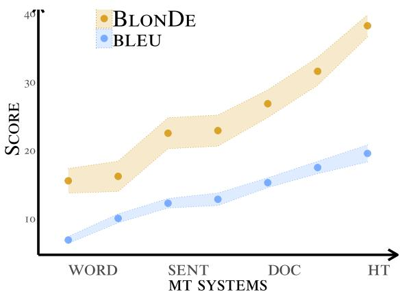
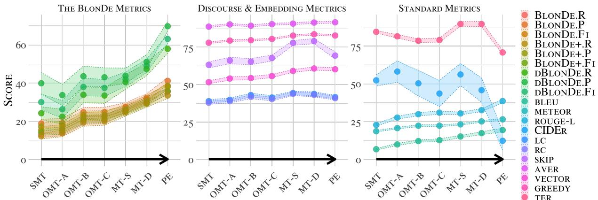
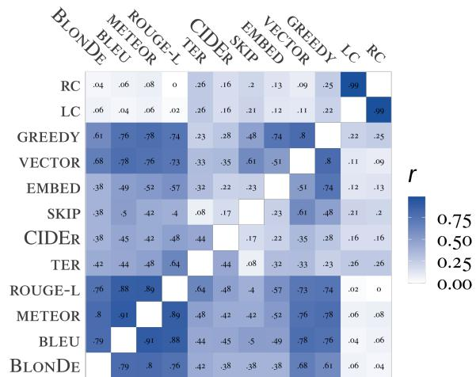

# BLONDE: An Automatic Evaluation Metric for Document-level Machine Translation

Yuchen Eleanor Jiang1∗ Tianyu Liu1 Shuming Ma2 Dongdong Zhang2 Jian Yang2   
Haoyang Huang2 Rico Sennrich3 Mrinmaya Sachan1 Ryan Cotterell1 Ming Zhou4 1ETH Zürich 2Microsoft Research Asia 3Universität Zürich 4Langboat.com {yucjiang,tianyu.liu,ryan.cotterell,mrinmaya.sachan}@inf.ethz.ch {shuming.ma,dongdong.zhang,t-jianya,haohua}@microsoft.com sennrich@cl.uzh.ch ming.zhou@chuangxin.com

## Abstract

Standard automatic metrics, e.g., BLEU, are not reliable for document-level MT evaluation. They can neither distinguish document-level improvements in translation quality from sentence-level ones, nor identify the discourse phenomena that cause context-agnostic translations. This paper introduces a novel automatic metric BLONDE1 to widen the scope of automatic MT evaluation from the sentence to the document level. BLONDE takes discourse coherence into consideration by categorizing discourse-related spans and calculating the similarity-based F1 measure of categorized spans. We conduct extensive comparisons on a newly constructed document-level translation dataset BWB. The experimental results show that BLONDE possesses better selectivity and interpretability at the document-level, and is more sensitive to document-level nuances. In a large-scale human study, BLONDE also achieves significantly higher Pearson’s r correlation with human judgments compared to previous metrics.

https://github.com/EleanorJiang/BlonDe

## 1 Introduction

Over the past years neural machine translation (NMT) models have become the models of choice in Machine Translation (MT; Luong et al., 2015; Vaswani et al., 2017; Zhang et al., 2018, inter alia). Although some recent work (Hassan et al., 2018; Popel, 2018; Bojar et al., 2018) suggests that NMT has achieved human parity at the sentence level, the reliability of these human-parity claims was quickly contested by Läubli et al. (2018, 2020), showing that there is a larger difference between human and machine translation quality when intersentential context is taken into account.

  
Figure 1: BLONDE is more selective than BLEU for document-level MT, and also shows a larger quality difference between human and machine translations.

Therefore, document-level machine translation has received increased attention in the MT community. However, despite various modeling advances, the MT community still lacks an efficient and effective evaluation metric for document-level translation. Standard evaluation metrics for MT, e.g., BLEU (Papineni et al., 2002), TER (Snover et al., 2006) and METEOR (Banerjee and Lavie, 2005), focus on the quality of translations at the sentence level and do not consider discourse-level features.

Thus, test suites that perform context-aware evaluation by targeting characteristic discourse-level phenomena have been proposed (Hardmeier et al., 2015; Guillou and Hardmeier, 2016; Burchardt et al., 2017; Isabelle et al., 2017; Rios Gonzales et al., 2017; Müller et al., 2018; Bawden et al., 2018; Voita et al., 2019; Guillou and Hardmeier, 2018, inter alia) for document-level MT. However, such test suites need to be re-created for new domains or even language pairs, and their construction can be very labor-intensive. We still lack an easy-to-use automatic metric that can reliably discriminate the quality of document-level translation.

In this paper, we curate a large-scale documentlevel parallel corpus (BWB) from heterogeneous data sources, and quantify document-level translation mistakes by performing a large human study. On this dataset, we found that inconsistency,2 ellipsis, and ambiguity were the most noticeable phenomena critical for document-level MT, together amounting to 86.73% of MT mistakes. Based on this analysis, we propose BLONDE, an automatic metric that evaluates translation quality at the document level. At the core of the metric is the similarity-based bijection between subsets of reference and system categories, e.g., pronouns, inflected forms, discourse relations and lexicons, and phrases, e.g., named entities. It computes recall, precision and F1, along with the corresponding measure of n-grams. Furthermore, BLONDE can incorporate human annotation easily by computing scores of human-annotated categories in the same way.

We compare BLONDE with 11 other metrics and demonstrate that BLONDE is better at distinguishing between context-aware and context-agnostic MT systems. We also observe that the degree to which BLONDE correlates with sentence-level metrics (e.g., BLEU) is lower than the degree to which the sentence-level metrics correlate with each other. This signals that BLONDE indeed captures additional aspects of translation quality beyond the sentence-level. Finally, our human evaluation also reveals significantly higher Pearson’s r correlation coefficients between BLONDE and human assessments compared to other metrics.

## 2 BWB: Bilingual Web Book Dataset

To design a metric that is sensitive to documentlevel phenomena, we first curate a document-level Chinese–English parallel corpus, called BWB (Bilingual Web Books). BWB consists of Chinese web novels across multiple genres (sci-fi, romance, action, fantasy, comedy, inter alia) and their corresponding English translations crawled from the Internet.

Dataset Creation. The novels are translated by professional native English speakers, and are corrected by editors. The sentence alignment of the training set is done by Bluealign3 (Sennrich and Volk, 2011). We hired four bilingual graduate students to manually evaluate 163 randomly selected documents from the resulting BWB parallel corpus and observe an alignment accuracy rate of 93.1%. We further asked the same batch of annotators to correct such misalignments in both the development and the test set. The details of the corpus creation and quality control are described in Appendix A.

<table><tr><td>Statistic</td><td>Train</td><td>Test</td><td>Dev</td><td>Total</td></tr><tr><td>#Docs</td><td>196,304</td><td>80</td><td>79</td><td>196,463</td></tr><tr><td>#Sents</td><td>9,576,566</td><td>2,632</td><td>2,618</td><td>9,581,816</td></tr><tr><td>#Words</td><td>325.4M</td><td>68.0K</td><td>67.4K</td><td>460.8M</td></tr></table>

Table 1: Statistics of the BWB dataset.

Statistics. Table 1 summarizes the statistics of the BWB dataset. It is a much larger dataset, and contains longer documents and richer discourse phenomena compared to all previous documentlevel datasets (Lison and Tiedemann, 2016; Koehn and Knowles, 2017; Barrault et al., 2019; Koehn, 2005; Liu and Zhang, 2020). To the best of our knowledge, this is the largest Chinese–English document-level translation dataset to date.

Dataset Split. We treat chapters in our books as documents. The maximum, median, and minimum number of sentences per document are 46, 30 and 18, respectively. To prevent any train–test leakage, we split the dataset into a training, development and a test set such that chapters from the same book are part of the same split. We use 377 books for training, and randomly select 80 and 79 documents from the 3,018 documents in the remaining 6 books as the development and test sets, respectively.4

## 3 Analyzing Discourse Errors

Next, we conduct a human study on the test set of BWB, in which we identify and categorize the discourse errors made by MT systems that are not captured in sentence-level evaluation. This human study is conducted by eight professional translators. The annotators are asked to classify translation errors into DOCUMENT-level and SENTENCE-level errors (some cases can be both). SENTENCE-level errors refer to those errors that render the translations to be inadequate or not fluent as stand-alone sentences, while DOCUMENT-level errors reflect a coherence violation across multiple sentences in the document. DOCUMENT-level errors are further categorized according to the linguistic phenomena leading to the lower performance in the context-dependent translation.5

<table><tr><td>Error Type</td><td>#</td><td>%</td></tr><tr><td>NO ERROR</td><td>451</td><td>17.1%</td></tr><tr><td>SENTENCE</td><td>1351</td><td>51.3%</td></tr><tr><td>DOCUMENT</td><td>1893</td><td>71.9%</td></tr><tr><td>INCONSISTENCY</td><td>1695</td><td>64.4%</td></tr><tr><td>NAMED ENTITY</td><td>1139</td><td>43.3%</td></tr><tr><td>TENSE</td><td>1018</td><td>38.7%</td></tr><tr><td>ELLIPSIS</td><td>534</td><td>20.3%</td></tr><tr><td>PRONOUN</td><td>456</td><td>17.3%</td></tr><tr><td>OTHER</td><td>103</td><td>4.0%</td></tr><tr><td>AMBIGUITY</td><td>193</td><td>7.3%</td></tr></table>

Table 2: The statistics of translation errors in human analysis.

Table 2 shows the result of our error analysis. A substantial proportion of translations have document-level errors (71.9%). This supports the claim that BWB contains rich discourse phenomena that common MT systems cannot address. We observe that three categories, i.e., inconsistency (64.4%), ellipsis (20.3%) and ambiguity (7.3%), account for the vast majority of document-level errors. Below we discuss these three categories of DOCUMENT-level errors and the design intuitions behind BLONDE.

Inconsistency. We consider two kinds of consistency in translation: lexical and grammatical. Lexical consistency is defined as a repetitive term that keeps the same translation throughout the whole document (Carpuat and Simard, 2012). Inconsistent translation of named entities can significantly impact translation output, although BLEU may not be adversely affected (Agrawal and Singla, 2012; Hermjakob et al., 2008). Therefore, in the design of BLONDE, we also focus on the reiteration of named entities (e.g., Qiao in Figure 3). On the other hand, typical examples of grammatical consistency are tense and gender consistency. Tense consistency refers to the tense being compatible with the context, rather than being exactly the same across the whole document. Tense inconsistency can arise when the source language is an isolating language and does not mark tense explicitly, e.g., in Chinese,

SRC 你在看(kan)什么？《复仇者联盟》。

REF What are you watching? The Avengers.

MT What are you looking at? The Avengers.

Figure 2: An example of ambiguity. 看(kan) corresponds to look, see, watch and view. The correct translation can only be inferred from the next sentence (The Avengers).

and the target language is a synthetic language, e.g., English (teal in Figure 3), where tense is marked explicitly. In the same spirit, the same entity should maintain a consistent grammatical gender.

Ellipsis. Ellipsis denotes the omission from a clause of one or more words that are nevertheless inferred in the context of the remaining elements (Yamamoto and Sumita, 1998; Voita et al., 2019). Translation errors arise when there are elliptical constructions in the source language while the target language does not allow for the same types of ellipsis. For example, the ellipsis of subjects or objects is very common in Chinese while it is ungrammatical in English—especially for pronouns. In Figure 3, she (Qiao) is omitted in Chinese. However, it is hard to guess the gender of Qiao from this stand-alone sentence: the correct pronoun choice can only be inferred from context (there is a her in the previous sentence). Another common form of ellipsis is the omission of discourse markers, especially when the source language has more zero connective structures (Po-Ching and Rimmington, 2004) than the target language. In the example, However and So are ignored in SRC, which misleads the sentence-level system MTA to ignore the discourse relations between sentences.

Ambiguity. Translation ambiguity occurs when a word in one language can be translated in more than one way into another language (Tokowicz and Degani, 2010). The cross-language ambiguity comes from several sources of within-language ambiguity including lexical ambiguity, polysemy, and near-synonymy. A unified feature of these is that ambiguous terms satisfy the form of one-to-many mappings. For the example in Figure 2, the word 看(kan) can be translated to look, see, watch or view. Without access to the context, all the lexical choices are sensible.

<table><tr><td></td><td></td><td>ENTITY E</td><td>TENSE V</td><td>PRONOUN P</td><td>DM M</td></tr><tr><td>SRC</td><td>a)小乔(Qiao)看着(look)相片回忆(recall) 起了二十年前。 b)那个满脸胡须的男人(man)正是(be)她(she)的新婚丈夫。 c)那却是(be)他们之间初次见面(meet)。 d) 小乔(Qiao)一见到他(he) 心里就咯噔(jolt) 了一下， 噌的站(stand)起来。</td><td>[Qiao]</td><td>[VBD, VBZ]</td><td>[masculine, feminine, epicene, neuter]</td><td>[contingency, temporal, expansion, comparison]</td></tr><tr><td></td><td>a) Qiao looked at the photo and recalled twenty years ago. b) This bearded man was her newlywed husband, c) [yet] this was the first time they were meeting with each other. d) [So] Qiao&#x27;s heart jolted as soon as [she] saw him, and [she] quickly stood up.</td><td>凹河河川</td><td>[2,0] [1, 0] [2, 0] [2, 0]</td><td>[0,0,0,0] [0, 1, 0, 0] [0, 0, 1, 0] [1, 2, 0, 0]</td><td>[0, 0, 0, 0] [0, 0, 0, 1] [1, 0, 0, 0]</td></tr><tr><td>MTA</td><td>a) Qiao looked at the photo and recalled twenty years ago. b) This bearded man is her newlywed husband. c) This is the first time they meet with each other. d)Joe&#x27;s heart is squeaky as soon as [he] saw him, and [he] quickly stands up.</td><td>凹河河河</td><td>[2,0] [0, 1] [0, 2] [0, 2]</td><td>[0, 0, 0, 0] [0, 1, 0, 0] [0, 0, 1, 0] [3, 1, 0, 0]</td><td>[0, 0, 0, 0] [0, 0, 0, 0] [0, 0, 0, 0]</td></tr><tr><td>MTB</td><td>a) Qiao looked at the photo and recalled the past twenty years ago. b) This man with the beard was her newly-wed husband. c) [However], that was the first time they met. d) [So] as soon as Qiao saw him, [her] heart became squeaky, and [she] swiftly stood up.</td><td>凹河河</td><td>[2, 0] [1, 0] [2, 0] [2, 0]</td><td>[0, 0, 0, 0] [0, 1, 1, 0] [0,0, 1, 0] [1, 2, 0, 0]</td><td>[0, 0, 0, 0] [0, 0, 0, 1] [1, 0, 0, 0]</td></tr></table>

Figure 3: An example containing inconsistency and ellipsis in BWB. For inconsistency, the same entities are marked in the same color (Qiao and Husband), and verbs are marked in teal. For ellipsis, omissions are marked with . DM stands for discourse markers ( ). The translation mistakes are underlined. MTB is intuitively a better system than MTA to human readers.

## 4 BLONDE

The aforementioned document-level phenomena have little impact on the n-gram statistics of translations. However, as is shown in Section 3, they can be key considerations for human readers when evaluating translations at the document level. Standard automatic metrics ignore the importance of contextual coherence of translations, which implies that the document-level nuances are not being properly modeled (Zhou et al., 2008; Xiong and Zhang, 2014). In this section, we describe BLONDE, an automatic metric that explicitly tracks discourse phenomena.

## 4.1 Document-Level Evaluation

We first give the formulation of measuring discourse phenomena. We define a document D = $[ S _ { 1 } , \ldots , S _ { N } ]$ as a sequence of N sentences. We take a sentence S of length T to be a string of tokens $t _ { 1 } \cdot \cdot \cdot t _ { T }$ where each token $t _ { i }$ is taken from the vocabulary . Let spans $( S ) = \{ m _ { 1 } , m _ { 2 } , . . . \}$ be the set of spans in the sentence S. Here, a span is a subsequence of the tokens in $S = t _ { 1 } \cdot \cdot \cdot t _ { T }$

Let us assume that we are interested in K discourse categories. Each of these categories capture a discourse phenomenon of interest. As shown in Section 3, named entity inconsistency, tense inconsistency and pronoun ellipsis make up the majority of discourse errors (67.8%) on the data analyzed. We therefore introduce three types of categories: ENTITY, TENSE and PRONOUN. In addition, we introduce discourse markers DM as a category, which are the essential contextual links between the various discourse segments (See Figure 3).

For a certain discourse category of interest, k, we assume that there are $L _ { k }$ features. In our case, the features of ENTITY are a list of named entities in D; the features of TENSE are $\begin{array} { r l r } { \mathcal { V } } & { = } & { [ \mathsf { M D } , \mathsf { V B D } , \mathsf { V B N } , \mathsf { V B P } , \mathsf { V B Z } , \mathsf { V B G } , \mathsf { V B } ] , ^ { 7 } } \end{array}$ the features of PRONOUN are $\begin{array} { r l } { \mathcal { P } } & { { } = } \end{array}$ [masculine, feminine, neuter, epicene];8 the features of DM are = [contingency, temporal, expansion, comparison].9 Note that different categories can have different numbers of features and the number of features can be dynamic:  depends on D while and are fixed. The intuition behind this is that we want to encourage the system output to keep consistent tense and pronouns as well as the consistent translation for a specific named entity.

Let us now define $\mathbf { C } _ { k , l } \left( S \right) \subseteq { \mathsf { s p a n s } } \left( S \right)$ as the set of spans in S that share the $l ^ { \mathrm { t h } }$ feature in the $k ^ { \mathrm { { t h } } }$ discourse category. To give a concrete example, let us assume that TENSE is the $k ^ { \mathrm { { t h } } }$ category and VBD is the $l ^ { \mathrm { t h } }$ feature in this category. The corresponding $\mathbf { C } _ { k , l } ( S )$ is the set of the spans (in this case, unigrams) tagged with VBD in the sentence $S .$ In Figure 3, all the spans are colored. We then let $\mathbf { C } _ { k } ( S )$ refer to a vector of size $L _ { k }$ where each element of that vector is the set $\mathbf { C } _ { k , l } ( S )$ . The sets of spans for ENTITY, TENSE, PRONOUN and DM can be produced by an NER model, a POS tagger, a rule-based string match and a discourse marker, respectively. We also define a weight vector $\pmb { w } _ { k } \ = \ [ w _ { k , l } : l \in \{ 1 , \ldots , L _ { k } \} ]$ for each discourse category $k ,$ where each entry $w _ { k , l }$ corresponds to the weight given to a feature.

We then define the discourse representation of sentence $S$ as the concatenation of all categories:

$$
\mathbf { C } ( S ) = [ \mathbf { C } _ { k } \left( S \right) : k \in \left\{ 1 , \ldots , K \right\} ]\tag{1}
$$

Similarity. Let sim $: \mathrm { ~ \bf ~ C ( } S ^ { s } ) \mathrm { ~ \bf ~ \times ~ } { \bf C } ( S ^ { r } ) \mathrm { ~  ~  ~ }$ $\mathbb { R } ^ { K }$ represent a similarity vector which measures category-wise similarity between the discourse representations of two sentences $S ^ { r }$ and $S ^ { s }$ . Each entry of the vector sim takes non-negative values: The entry being zero if $S ^ { s }$ and $S ^ { r }$ have no shared spans with the same discourse category.

The similarity vector sim defined here can be implemented in several ways. A possible implementation of sim can be achieved by counting the number of functionally similar spans for each feature and then taking a weighted sum over all features:

$$
\begin{array} { c } { \mathsf { s i m } ( S ^ { s } , S ^ { r } ) = } \\ { \mathsf { \Gamma } [ \mathsf { s i m } _ { k } ( S ^ { s } , S ^ { r } ) : k \in \{ 1 , \ldots , K \} ] } \end{array}\tag{2}
$$

where each entry sim $\mathbf { \eta } ^ { \mathsf { 1 } } k$ is defined as follows:

$$
\begin{array} { r l r } {  { \mathbf { s i m } _ { k } ( S ^ { s } , S ^ { r } ) = } } & { ( 3 ) } \\ & { \pmb { w } _ { k } \odot \operatorname* { m i n } ( \mathbf { c o u n t } ( \mathbf { C } _ { k } ( S ^ { s } ) ) , \mathbf { c o u n t } ( \mathbf { C } _ { k } ( S ^ { r } ) ) ) } \end{array}
$$

where

$$
\begin{array} { r l } & { \mathbf { c o u n t } ( \mathbf { C } _ { k } ( \cdot ) ) } \\ & { \qquad = [ | \mathbf { C } _ { k , l } ( \cdot ) | : l \in \{ 1 , \dots , L _ { k } \} ] } \end{array}\tag{4}
$$

denotes the cardinality of ${ \bf C } _ { k , l }$ applied entry-wise and min denotes the minimum function applied element-wise. Intuitively, sim , measures the number of functionally similar spans shared by $S ^ { s }$ and $S ^ { r }$ . Assume that TENSE is the $k ^ { \mathrm { { t h } } }$ category.10

It is worth noting that there are many other reasonable ways to operationalize sim. For ENTITY, partial credit could be assigned to two named entities if they have overlapping tokens; for TENSE and PRONOUN, partial credit could be assigned to two similar categories, e.g., VBP and VB; for DM, partial credit could be assigned according to the sense hierarchy and the confidences in the detected discourse markers. We leave the expansion of the sim definition to future work.

A Document-level Similarity Measure. Now we turn from measuring the similarity at the sentence level to the document level. We first lift sim $( \cdot , \cdot )$ to measure the similarity between two documents:

$$
\mathsf { s i m } ( \mathfrak { D } ^ { s } , \mathfrak { D } ^ { r } ) = \sum _ { S ^ { s } \in \mathfrak { D } ^ { s } , } \mathsf { s i m } ( S ^ { s } , S ^ { r } )\tag{5}
$$

where the sum is applied element-wise.

We then define sim $( \cdot , \cdot )$ for a system document ${ \mathfrak { D } } ^ { s }$ and a set of reference documents $\mathbb { D } ^ { r } =$ $\{ \mathfrak { D } ^ { r _ { 1 } } , \mathfrak { D } ^ { r _ { 2 } } , \dots \}$ by aggregating the sim of all sentences in ${ \mathfrak { D } } ^ { s }$ and $\mathbb { D } ^ { r }$ :

$$
\mathsf { s i m } \left( \mathfrak { D } ^ { s } , \mathbb { D } ^ { r } \right) = \sum _ { S ^ { s } \in \mathfrak { D } ^ { s } } \bigoplus _ { S ^ { r } \in \mathbb { D } ^ { r } } \mathsf { s i m } ( S ^ { s } , S ^ { r } )\tag{6}
$$

Here, is a generic aggregator over multiple references, e.g., = max, if we take the reference which has the maximum similarity with the system output; or $\oplus = \sum$ if we sum up the similarity scores of all references. Again, is applied element-wise.11 We also reuse the notation sim( , ) for two sets of documents Ds and $\mathbb { D } ^ { r }$ :

$$
\mathsf { s i m } \left( \mathbb { D } ^ { s } , \mathbb { D } ^ { r } \right) = \bigoplus _ { \mathfrak { D } ^ { s } \in \mathbb { D } ^ { s } } \mathsf { s i m } \left( \mathfrak { D } ^ { s } , \mathbb { D } ^ { r } \right)\tag{7}
$$

Note that the similarity vector can also be computed for the same (set of) documents. For example, if sim is implemented as counting the number of functionally similar spans for each feature, then, sim $( \mathfrak { D } ^ { s } , \mathfrak { D } ^ { s } )$ and sim (Dr, Dr) denote the total number of spans of each category in the system output and the reference, respectively.12

Scoring. We are now ready to define the “goodness” of a system output with respect to our discourse phenomenon of interest. We compute the precision, recall and F1 for all K discourse categories defined as follows:

$$
p ( \mathfrak { D } ^ { s } , \mathbb { D } ^ { r } ) = \frac { \mathsf { s i m } \left( \mathfrak { D } ^ { s } , \mathbb { D } ^ { r } \right) } { \mathsf { s i m } \left( \mathfrak { D } ^ { s } , \mathfrak { D } ^ { s } \right) } ,\tag{8}
$$

$$
r ( \mathfrak { D } ^ { s } , \mathbb { D } ^ { r } ) = \frac { \mathbf { \mathfrak { s i m } } ( \mathfrak { D } ^ { s } , \mathbb { D } ^ { r } ) } { \mathbf { \mathfrak { s i m } } ( \mathbb { D } ^ { r } , \mathbb { D } ^ { r } ) } ,\tag{9}
$$

$$
F ( { \mathfrak { D } } ^ { s } , \mathbb { D } ^ { r } ) = 2 \cdot { \frac { p \odot r } { p + r } } .\tag{10}
$$

Here, $\pmb { p } ( \mathfrak { D } ^ { s } , \mathbb { D } ^ { r } ) , \pmb { r } ( \mathfrak { D } ^ { s } , \mathbb { D } ^ { r } )$ and $\pmb { F } ( \mathfrak { D } ^ { s } , \mathbb { D } ^ { r } )$ are all K-dimensional vectors; where, the $k ^ { \mathrm { { t h } } }$ element of these vectors represents the precision, recall and F-score for the $k ^ { \mathrm { { \hat { t h } } } }$ category. Thus, the addition, multiplication and division operations above are also defined element-wise.13

BLOND-D. Further, we combine the scores of all categories into an overall score with a simple weighted average, named BLOND-D. By computing BLOND-D, one can distill the document-level translation quality from translation quality at the sentence level. More formally, we have

(11)

$$
\begin{array} { r l r } { \mathrm { B L O N D - D . P } ( \mathfrak { D } ^ { s } , \mathbb { D } ^ { r } ) = } & { } & \\ & { } & { \displaystyle { \left( \prod _ { k = 1 } ^ { K } ( p _ { k } ( \mathfrak { D } ^ { s } , \mathbb { D } ^ { r } ) ^ { a _ { k } } ) ^ { 1 / \sum _ { k = 1 } ^ { K } a _ { k } } \right. } } \\ & { } & { \mathrm { B L O N D - D . R } ( \mathfrak { D } ^ { s } , \mathbb { D } ^ { r } ) = } \\ & { } & { \displaystyle { \left. \left( \prod _ { k = 1 } ^ { K } ( r _ { k } ( \mathfrak { D } ^ { s } , \mathbb { D } ^ { r } ) ^ { a _ { k } } ) ^ { 1 / \sum _ { k = 1 } ^ { K } a _ { k } } \right. \right. } } \end{array}\tag{12}
$$

where $a _ { k }$ denotes the importance weight of the $k ^ { \mathrm { { t h } } }$ category, and ${ \pmb p } _ { k }$ and $\mathbfit { r } _ { k }$ denote the $\bar { k ^ { \mathrm { { t h } } } }$ entry of $_ p$ and r, respectively.14 Therefore, BLOND-D.F1 is defined as follows:

$$
\begin{array} { r l } & { \mathrm { B L O N D - D . F 1 } ( \mathfrak { D } ^ { s } , \mathbb { D } ^ { r } ) = } \\ & { \qquad 2 \cdot \frac { \mathrm { B L O N D - D . P } \cdot \mathrm { B L O N D - D . R } } { \mathrm { B L O N D - D . P } + \mathrm { B L O N D - D . R } } } \end{array}\tag{13}
$$

<table><tr><td>P</td><td>BLEU</td><td>P</td><td>BLONDE R</td><td>F1</td><td>BLOND-D F1</td></tr><tr><td>MTA</td><td>41.5</td><td>10.5</td><td>51.3</td><td>17.4</td><td>7.6</td></tr><tr><td>MTB</td><td>35.9</td><td>60.6</td><td>58.9</td><td>59.8</td><td>97.7</td></tr></table>

Table 3: The BLEU and BLONDE scores of the two system outputs in Figure 3. P, R and F1 represent precision, recall and F1, respectively.

Whenever not otherwise specified, we simply use BLOND-D to refer to BLOND-D.F1.15

## 4.2 BLONDE: Combining BLOND-D with n-grams

However, focusing on discourse phenomena solely is not enough to provide comprehensive MT evaluation that correlates strongly with human judgments. Consider the following example:

## (1) REF Qiao lifted her heavy eyelids. MT Qiao scrunched her brows together.

The output of MT is far from “good” in terms of adequacy, whereas ${ \bf B } \mathrm { L O N D - D } \big ( \mathrm { M T } \big ) = 1$ , since MT translates both named entities and tenses correctly. Thus, in order to account for sentence-level adequacy of our final metric BLONDE, we augment the set of categories and features to include each ngram (for a value of n) as a category and each span of n-tokens as a feature for the n-gram category. Formally, we have

$$
\begin{array} { r } { \mathbf { C } ^ { \prime } ( S ) = \qquad } \\ { [ \mathbf { C } _ { k } \left( S \right) : k \in \{ 1 , \dots , K + N \} ] } \end{array}\tag{14}
$$

where we define

$$
\mathbf { C } _ { K + n } = \{ n { \mathrm { - g r a m } } : n \in \{ 1 , \dots , N \} \}\tag{15}
$$

The calculation of BLONDE.P, BLONDE.R and BLONDE.F1 is then done exactly in the same manner as BLOND-D. Whenever not specified, we simply use BLONDE to refer to BLONDE.F1.

BLONDE covers both discourse coherence features and sentence-level adequacy, thus providing a comprehensive measurement of translation quality. Table 3 compares BLONDE with BLEU using the two MT outputs found in Figure 3. It is striking that BLEU rates MTA higher than MTB given that MTB is clearly better than MTA to human readers. In sharp contrast, their BLONDE scores reflect the correct ranking in translation quality.

## 4.3 BLOND+: Combining BLONDE with Human Annotations

BLONDE is easy to generalize—for instance, it would be easy to incorporate human annotations, e.g., one could annotate spans related to discourse errors and treat them as categories. The automatically inferred categories and human annotated categories are then combined by adopting the same weighted averaging approach, which we call BLOND+. We hired the same translators who analyzed discourse errors in Section 3 to annotate ambiguous and omitted word/phrases on the test set of BWB.17

## 5 Experiments

In this section, we examine the effectiveness of BLONDE at the document-level MT evaluation through experiments. We answer the following question: Do differences in BLONDE reliably reflect differences in the document-level translation quality of different MT systems? To answer this question, we run several MT baselines and compare their BLONDE scores to eleven other metrics:

Standard Sentence-level Metrics. BLEU (Papineni et al., 2002), METEOR (Banerjee and Lavie, 2005), TER (Snover et al., 2006), ROUGE-L (Lin, 2004), CIDER (Vedantam et al., 2015).

Document-level Metrics. LC and RC (Wong and Kit, 2012)—these are ratios between the number of lexical cohesion devices (repetition and collocation) and repeated content words over the total number of content words in a target document, which are direct measurements of lexical cohesion.

Embedding-based Metrics. We consider four embedding-based metrics in this work: SkipThought cosine similarity (SKIP; Kiros et al.,

2015), embedding average cosine similarity (AVER; Sharma et al., 2017), Vector extrema cosine similarity (VECTOR; Forgues et al., 2014), Greedy Match (GREEDY; Rus and Lintean, 2012).

## 5.1 MT Systems

We test BLONDE on the following system outputs: an SMT system (Chiang, 2007), three wellknown commercial NMT systems (OMT-A, OMT-B, OMT-C), a sentence-level transformer-based system (MT-S) and a document-level system (MT-D) trained on BWB. MT-D (Zhang et al., 2018) trains sentence-level model parameters and then estimates document-level model parameters while keeping the sentence-level Transformer model parameters fixed. We adopt Transformer Big (Vaswani et al., 2017) for both MT-S and MT-D. The final “system” is a human post-editing (PE) on OMT-C provided by professional translators, so it is supposed to be the strongest baseline.18

## 5.2 The BLONDE Evaluation

Firstly, we leverage the test set of BWB and evaluate the above-mentioned systems by BLONDE and other metrics. Figure 4 presents the means of all metrics along with the 95% confidence interval estimated from bootstrap resampling. We observe that the BLONDE scores demonstrate an exponentially increasing trend from sentence-level towards document-level and human post-editing, while the trends of standard metrics are mostly linear. Specifically, the difference between the BLONDE scores of MT-S and MT-D (denoted as ∆(MT-S, MT-D)) is significantly higher than the difference between the ∆(MT-S, MT-D) in their BLEU scores. An even larger ∆ between MT-D and PE in their BLONDE scores is observed, indicating MT-D is still far away from achieving human parity. Note that the trend of BLOND-D scores is even more exponential, which indicates that BLOND-D indeed distills documentlevel translation quality.

The t-statistics of the paired sample t-tests of individual documents are given in Table 4. Unlike BLEU, METEOR and other metrics, which either fails to distinguish human and machine translation or has lower discriminative power compared to distinguishing different machine translations, the BLONDE family maintain similar discriminative power across the pair-wise comparisons. Interestingly but not surprisingly, the non-reference-based LC and RC fail to distinguish both (MT-S, MT-D) and (MT-D, PE), since sentence-level MT is by nature more repetitive than human translation and thus it is hard to distinguish accidental repetition from document-level cohesion.

Figure 4: The mean scores of different system outputs given by different metrics on the BWB test set. Shaded region represents 95% confidence interval.
<table><tr><td rowspan="2"></td><td rowspan="2">BLEU</td><td colspan="3">BLONDE</td><td colspan="3">BLOND+</td><td colspan="3">BLOND-D</td><td colspan="3">Categories</td></tr><tr><td>R</td><td>P</td><td>F1</td><td>R</td><td>P</td><td>F1</td><td>R</td><td>P</td><td>F1</td><td>ε</td><td>V P</td><td>M</td></tr><tr><td>SMT→ MT-S</td><td>25.8</td><td>13.5</td><td>7.42</td><td>10.9</td><td>14.5</td><td>8.51</td><td>12.0</td><td>8.02</td><td>1.32</td><td>5.10</td><td>-2.12</td><td>23.6 11.4</td><td>13.6</td></tr><tr><td>MT-S→ MT-D</td><td>8.97</td><td>6.32</td><td>5.45</td><td>5.92</td><td>6.58</td><td>5.61 6.13</td><td>4.85</td><td>4.57</td><td>4.79</td><td>4.93</td><td>1.88</td><td>7.43</td><td>1.62</td></tr><tr><td>MT-D→ PE</td><td>2.6</td><td>4.51</td><td>7.77</td><td>6.06</td><td>4.20</td><td>7.27</td><td>5.66</td><td>6.44</td><td>11.1 8.58</td><td>12.9</td><td>2.44</td><td>2.76</td><td>5.35</td></tr></table>

<table><tr><td></td><td colspan="4">Other Standard Metrics</td><td colspan="2">Discourse Cohesion</td><td colspan="4">Embedding-based Metrics</td></tr><tr><td></td><td>METEOR</td><td>ROUGE-L</td><td>TER</td><td>CIDER</td><td>LC</td><td>RC</td><td>SKIP</td><td>AVER</td><td>VECTOR</td><td>GREEDY</td></tr><tr><td>SMT→ MT-S</td><td>25.3</td><td>19.8</td><td>-8.28</td><td>.853</td><td>11.7</td><td>12.9</td><td>12.2</td><td>9.50</td><td>18.0</td><td>22.3</td></tr><tr><td>MT-S→ MT-D</td><td>13.4</td><td>11.8</td><td>.148</td><td>-3.03</td><td>-1.23</td><td>-1.45</td><td>1.62</td><td>3.13</td><td>5.05</td><td>5.83</td></tr><tr><td>MT-D→ PE</td><td>3.58</td><td>9.65</td><td>19.9</td><td>-6.67</td><td>-4.23</td><td>-4.44</td><td>-6.23</td><td>.628</td><td>-1.03</td><td>-3.15</td></tr></table>

Table 4: The paired t-statistics of different MT systems. The cells with p-value > .05 are marked in gray. While BLEU distinguishes SMT and the sentence-level MT-S significantly, it fails to possess the same discriminative power towards documentlevel and human translations. BLONDE maintains similar discriminative power across the three t-tests.

  
Figure 5: Absolute Pearson correlation pairs of automatic metrics. Computed over the scores of individual documents in BWB test set.

In addition, the t-statistics of BLOND-D categories provide rich diagnostic information. As can be seen, although transformer-based NMT models have substantially higher BLEU scores than SMT systems, MT-S is not statistically superior to SMT in terms of named entity translation. However, human post-editing scores significantly better on entity translation—meaning that named entity translation accounts for a substantial part of quality differences between machine and human. In terms of TENSE and and DM translation, MT-D does not significantly out-perform MT-S, which could be taken into consideration in future document-level MT model designs.

We also show the pairwise Pearson correlations between different metrics in Figure 5. It illustrates the homogeneity/heterogeneity of different metrics. We report the absolute value of the correlation for TER. We see that while sentence-level metrics (BLEU, METEOR and ROUGE-L) have strong correlations with each other, BLONDE correlates less well with those metrics.

<table><tr><td rowspan=1 colspan=3>UnitADE  FLU</td><td rowspan=1 colspan=3>SENTENCE</td></tr><tr><td rowspan=1 colspan=2>BLONDE.R</td><td rowspan=1 colspan=1>.363  .327</td><td></td><td rowspan=1 colspan=2>.436†  .371†</td></tr><tr><td rowspan=1 colspan=2>BLONDE.P</td><td rowspan=1 colspan=1>.331  .296</td><td></td><td rowspan=1 colspan=2>.383†  .344†</td></tr><tr><td rowspan=1 colspan=2>BLONDE.F1</td><td rowspan=1 colspan=1>.35  .314</td><td rowspan=3 colspan=3>.39†  .349†</td></tr><tr><td rowspan=1 colspan=2>BLOND+.R</td><td rowspan=1 colspan=1>.364  .329</td></tr><tr><td rowspan=1 colspan=2>BLOND+.P</td><td rowspan=1 colspan=1>.334   .3</td></tr><tr><td rowspan=1 colspan=2>BLOND+.F1</td><td rowspan=1 colspan=1>.351  .318</td><td></td><td rowspan=1 colspan=2>.422†  .362†</td></tr><tr><td rowspan=1 colspan=2>BLEU</td><td rowspan=1 colspan=1>.325  .308</td><td></td><td rowspan=1 colspan=2>.343   .266</td></tr><tr><td rowspan=1 colspan=2>METEOR</td><td rowspan=1 colspan=1>.338  .31</td><td></td><td rowspan=1 colspan=2>.339   .278</td></tr><tr><td rowspan=1 colspan=2>ROUGE-L</td><td rowspan=1 colspan=1>.275  .262</td><td></td><td rowspan=1 colspan=2>.29    .211</td></tr><tr><td rowspan=3 colspan=2>TERCIDERSKIP</td><td rowspan=1 colspan=1>.063  .027</td><td></td><td rowspan=1 colspan=2>.044   .092</td></tr><tr><td rowspan=1 colspan=1>.139  .116</td><td></td><td rowspan=1 colspan=2>.114   .087</td></tr><tr><td rowspan=1 colspan=1>.213  .174</td><td></td><td rowspan=1 colspan=2>.163   .171</td></tr><tr><td rowspan=1 colspan=2>AVER</td><td rowspan=1 colspan=1>.163  .163</td><td></td><td rowspan=1 colspan=2>.16   .111</td></tr><tr><td rowspan=2 colspan=2>VECTORGREEDY</td><td rowspan=1 colspan=1>.25  .243</td><td></td><td rowspan=1 colspan=2>.248   .218</td></tr><tr><td rowspan=1 colspan=1>.323   .3</td><td></td><td rowspan=1 colspan=2>.307   .265</td></tr><tr><td rowspan=2 colspan=2>LCRC</td><td rowspan=1 colspan=1>.086  .061</td><td></td><td rowspan=2 colspan=2>.153   .116.169   .13</td></tr><tr><td rowspan=1 colspan=1>.096  .07</td><td></td></tr></table>

Table 5: Absolute Pearson correlation with human judgments on BWB. The highest correlations are in bold. Correlation of metrics not significantly outperformed by any other metrics are highlighted with . The BLONDE family are not tested against each other.

## 5.3 Human Evaluation

We then evaluate BLONDE along with other metrics in terms of their Pearson correlation with human assessment. Our human assessment is provided by four professional Chinese to English translators and four native English revisers. Two experimental units (SENTENCE vs DOCUMENT) are assessed independently in terms of FLUENCY and ADEQUACY, respectively. In the SENTENCE-level evaluation, we show the raters isolated sentences, while in the DOCUMENT-level evaluation, we show them entire documents and we only ask raters to evaluate the overall quality of sequential blocks of sentences (5 sentences per block) as used in the Relative Ranking (RR) evaluation (Bojar et al., 2016). We use the Williams significance test (Williams, 1959; Graham and Baldwin, 2014) following the practice adopted by WMT (Mathur et al., 2020) to identify correlation differences are statistically significant. The detailed protocol is presented in Appendix D.

The results are shown in Table 5. BLONDE obtains the highest correlation with human assessment at both the sentence level and the document level. However, BLONDE correlates remarkably better with human assessment when context is taken into account, and it only significantly outperforms all other metrics at document level.

It is worth noting that BLONDE also correlates well with FLUENCY assessment, even though it is, in essence, still a reference-based metric. One possible explanation for this unexpected positive result is that it tracks span categories that directly relate to cohesion and coherence. Another important observation is that the recall-based BLONDE variants generally correlate better with human assessment, yet appears to be less selective compared to the precision-based variants (see MT-D PE in Table 4). This provides support for adopting the F1 in order to get the best of both worlds.

## 6 Related Work

There have been a few studies on automatic evaluation metrics for specific discourse phenomena.

Pronoun Translation. Hardmeier and Federico (2010) measured the precision and recall of pronouns directly and Miculicich Werlen and Popescu-Belis (2017) proposed to estimate the accuracy of pronoun translation (APT) by aligning source and target texts. However, as shown in Guillou and Hardmeier (2018), APT does not take the antecedents of an anaphoric pronoun into account. They cannot handle the mismatches in the numbers of pronouns either. Jwalapuram et al. (2019) also proposed a specialized measure for pronoun evaluation which involves training. In comparison, BLONDE does not rely on any alignment or training.

Lexical Cohesion. Wong and Kit (2012) proposed LC and RC. Gong et al. (2015) described a cohesion function to measure text cohesion via lexical chain and a gist consistency score based on topic model. However, they fail to distinguish accidental repetition from document-level cohesion.

Discourse Relations. Hajlaoui and Popescu-Belis (2013) proposed to assess the accuracy of connective translation (ACT). However, such an assessment requires a bilingual dictionary of all possible DM translations, whereas BLONDE only requires a list of monolingual DMs. Guzmán et al. (2014) and Joty et al. (2014) compute a metric based on the similarity between the discourse trees of reference and system output. Those discourserepresentation-based metrics are indirect, and rely on discourse parsing tools, which are much more inaccurate than syntactic and semantic parsing tools used in BLONDE. Unlike previously proposed metrics, BLONDE does not only focus on one specific discourse phenomenon, and thus has significantly higher Pearson correlation coefficients with human assessments.

## 7 Conclusion

In this paper, we build a large-scale parallel dataset for document-level translation, BWB. We analyze it for common document-level translation errors in practice and propose BLONDE, an interpretable automatic metric for document-level MT evaluation. We further improve BLONDE by diagnosing and distilling discourse-related errors in MT outputs and human-annotations to obtain two improved metrics BLOND-D and BLOND+. These metrics were shown to have better selectivity than various sentence-level metrics and correlate better with human judgments.

## Ethical Considerations

The annotators were paid a fair wage and the annotation process did not solicit any sensitive information from the annotators. Finally, while our approach is not tuned for any specific real-world application, the approach could be used in sensitive contexts such as legal or health-care settings, and any work must use our approach undertake extensive quality-assurance and robustness testing before using it in their setting.

Replicability. As part of our contributions, we will release the annotated BWB test set, and release the crawling script of the training set under Fair Use rules. The BLONDE package is also publicly available at https://github.com/EleanorJiang/BlonDe.

## Acknowledgements

Mrinmaya Sachan acknowledges support from an ETH Zürich Research grant (ETH-19 21-1) and a grant from the Swiss National Science Foundation (project #201009) for partially supporting this work.

## References

Neeraj Agrawal and Ankush Singla. 2012. Using named entity recognition to improve machine translation. Technical report, Stanford University.

Ebrahim Ansari, Amittai Axelrod, Nguyen Bach, Ondˇrej Bojar, Roldano Cattoni, Fahim Dalvi, Nadir Durrani, Marcello Federico, Christian Federmann, Jiatao Gu, Fei Huang, Kevin Knight, Xutai Ma, Ajay Nagesh, Matteo Negri, Jan Niehues, Juan Pino, Elizabeth Salesky, Xing Shi, Sebastian Stüker, Marco

Turchi, Alexander Waibel, and Changhan Wang. 2020. Findings of the IWSLT 2020 evaluation campaign. In Proceedings ofthe 17th International Conference on Spoken Language Translation, pages 1– 34, Online. Association for Computational Linguistics.

Satanjeev Banerjee and Alon Lavie. 2005. METEOR: An automatic metric for MT evaluation with improved correlation with human judgments. In Proceedings of the ACL Workshop on Intrinsic and Extrinsic Evaluation Measures for Machine Translation and/or Summarization, pages 65–72, Ann Arbor, Michigan. Association for Computational Linguistics.

Loïc Barrault, Ondˇrej Bojar, Marta R. Costa-jussà, Christian Federmann, Mark Fishel, Yvette Graham, Barry Haddow, Matthias Huck, Philipp Koehn, Shervin Malmasi, Christof Monz, Mathias Müller, Santanu Pal, Matt Post, and Marcos Zampieri. 2019. Findings of the 2019 conference on machine translation (WMT19). In Proceedings of the Fourth Conference on Machine Translation (Volume 2: Shared Task Papers, Day 1), pages 1–61, Florence, Italy. Association for Computational Linguistics.

Rachel Bawden, Rico Sennrich, Alexandra Birch, and Barry Haddow. 2018. Evaluating discourse phenomena in neural machine translation. In Proceedings of the 2018 Conference of the North American Chapter of the Association for Computational Linguistics: Human Language Technologies, Volume 1 (Long Papers), pages 1304–1313, New Orleans, Louisiana. Association for Computational Linguistics.

Ondˇrej Bojar, Christian Federmann, Mark Fishel, Yvette Graham, Barry Haddow, Philipp Koehn, and Christof Monz. 2018. Findings of the 2018 conference on machine translation (WMT18). In Proceedings ofthe Third Conference on Machine Translation: Shared Task Papers, pages 272–303, Belgium, Brussels. Association for Computational Linguistics.

Ondˇrej Bojar, Yvette Graham, Amir Kamran, and Miloš Stanojevic. 2016.´ Results of the WMT16 metrics shared task. In Proceedings of the First Conference on Machine Translation: Volume 2, Shared Task Papers, pages 199–231, Berlin, Germany. Association for Computational Linguistics.

Aljoscha Burchardt, Vivien Macketanz, Jon Dehdari, Georg Heigold, Peter Jan-Thorsten, and Philip Williams. 2017. A linguistic evaluation of rule-based, phrase-based, and neural MT engines. The Prague Bulletin of Mathematical Linguistics, 108(1):159.

Marine Carpuat. 2009. One translation per discourse. In Proceedings of the Workshop on Semantic Evaluations: Recent Achievements and Future Directions (SEW-2009), pages 19–27, Boulder, Colorado. Association for Computational Linguistics.

Marine Carpuat and Michel Simard. 2012. The trouble with SMT consistency. In Proceedings of the Seventh Workshop on Statistical Machine Translation, pages 442–449, Montréal, Canada. Association for Computational Linguistics.

David Chiang. 2007. Hierarchical phrase-based translation. Computational Linguistics, 33(2):201–228.

Gabriel Forgues, Joelle Pineau, Jean-Marie Larchevêque, and Réal Tremblay. 2014. Bootstrapping dialog systems with word embeddings. In Workshop on Modern Machine Learning and Natural Language Processing, volume 2.

Zhengxian Gong, Min Zhang, and Guodong Zhou. 2015. Document-level machine translation evaluation with gist consistency and text cohesion. In Proceedings of the Second Workshop on Discourse in Machine Translation, pages 33–40, Lisbon, Portugal. Association for Computational Linguistics.

Cleotilde Gonzalez, Brad Best, Alice F. Healy, James A. Kole, and Lyle E. Bourne Jr. 2011. A cognitive modeling account of simultaneous learning and fatigue effects. Cognitive Systems Research, 12(1):19–32.

Yvette Graham and Timothy Baldwin. 2014. Testing for significance of increased correlation with human judgment. In Proceedings of the 2014 Conference on Empirical Methods in Natural Language Processing (EMNLP), pages 172–176, Doha, Qatar. Association for Computational Linguistics.

Liane Guillou. 2013. Analysing lexical consistency in translation. In Proceedings of the Workshop on Discourse in Machine Translation, pages 10–18, Sofia, Bulgaria. Association for Computational Linguistics.

Liane Guillou and Christian Hardmeier. 2016. PROTEST: A test suite for evaluating pronouns in machine translation. In Proceedings of the Tenth International Conference on Language Resources and Evaluation (LREC’16), pages 636–643, Portorož, Slovenia. European Language Resources Association (ELRA).

Liane Guillou and Christian Hardmeier. 2018. Automatic reference-based evaluation of pronoun translation misses the point. In Proceedings of the 2018 Conference on Empirical Methods in Natural Language Processing, pages 4797–4802, Brussels, Belgium. Association for Computational Linguistics.

Francisco Guzmán, Shafiq Joty, Lluís Màrquez, and Preslav Nakov. 2014. Using discourse structure improves machine translation evaluation. In Proceedings of the 52nd Annual Meeting of the Association for Computational Linguistics (Volume 1: Long Papers), pages 687–698, Baltimore, Maryland. Association for Computational Linguistics.

Najeh Hajlaoui and Andrei Popescu-Belis. 2013. Assessing the accuracy of discourse connective translations: Validation of an automatic metric. In International Conference on Intelligent Text Processing and Computational Linguistics, pages 236–247. Springer.

Christian Hardmeier and Marcello Federico. 2010. Modelling pronominal anaphora in statistical machine translation. In Proceedings of the 7th International Workshop on Spoken Language Translation: Papers, pages 283–289, Paris, France.

Christian Hardmeier, Preslav Nakov, Sara Stymne, Jörg Tiedemann, Yannick Versley, and Mauro Cettolo. 2015. Pronoun-focused MT and cross-lingual pronoun prediction: Findings of the 2015 DiscoMT shared task on pronoun translation. In Proceedings of the Second Workshop on Discourse in Machine Translation, pages 1–16, Lisbon, Portugal. Association for Computational Linguistics.

Hany Hassan, Anthony Aue, Chang Chen, Vishal Chowdhary, Jonathan Clark, Christian Federmann, Xuedong Huang, Marcin Junczys-Dowmunt, William Lewis, Mu Li, et al. 2018. Achieving human parity on automatic chinese to english news translation. arXiv preprint arXiv:1803.05567.

Ulf Hermjakob, Kevin Knight, and Hal Daumé III. 2008. Name translation in statistical machine translation - learning when to transliterate. In Proceedings of ACL-08: HLT, pages 389–397, Columbus, Ohio. Association for Computational Linguistics.

Matthew Honnibal and Ines Montani. 2017. spaCy 2: Natural language understanding with Bloom embeddings, convolutional neural networks and incremental parsing. To appear.

Pierre Isabelle, Colin Cherry, and George Foster. 2017. A challenge set approach to evaluating machine translation. In Proceedings of the 2017 Conference on Empirical Methods in Natural Language Processing, pages 2486–2496, Copenhagen, Denmark. Association for Computational Linguistics.

Shafiq Joty, Francisco Guzmán, Lluís Màrquez, and Preslav Nakov. 2014. DiscoTK: Using discourse structure for machine translation evaluation. In Proceedings of the Ninth Workshop on Statistical Machine Translation, pages 402–408, Baltimore, Maryland, USA. Association for Computational Linguistics.

Prathyusha Jwalapuram, Shafiq Joty, Irina Temnikova, and Preslav Nakov. 2019. Evaluating pronominal anaphora in machine translation: An evaluation measure and a test suite. In Proceedings ofthe 2019 Conference on Empirical Methods in Natural Language Processing and the 9th International Joint Conference on Natural Language Processing (EMNLP-IJCNLP), pages 2964–2975, Hong Kong, China. Association for Computational Linguistics.

Ryan Kiros, Yukun Zhu, Russ R Salakhutdinov, Richard Zemel, Raquel Urtasun, Antonio Torralba, and Sanja Fidler. 2015. Skip-thought vectors. In Advances in Neural Information Processing Systems, volume 28.

Aniket Kittur, Ed H. Chi, and Bongwon Suh. 2008. Crowdsourcing user studies with mechanical turk. In Proceedings of the SIGCHI Conference on Human Factors in Computing Systems, pages 453–456.

Philipp Koehn. 2005. Europarl: A parallel corpus for statistical machine translation. In Proceedings of Machine Translation Summit X: Papers, pages 79– 86, Phuket, Thailand.

Philipp Koehn and Rebecca Knowles. 2017. Six challenges for neural machine translation. In Proceedings ofthe First Workshop on Neural Machine Translation, pages 28–39, Vancouver. Association for Computational Linguistics.

Samuel Läubli, Sheila Castilho, Graham Neubig, Rico Sennrich, Qinlan Shen, and Antonio Toral. 2020. A set of recommendations for assessing human– machine parity in language translation. Journal of Artificial Intelligence Research, 67:653–672.

Samuel Läubli, Rico Sennrich, and Martin Volk. 2018. Has machine translation achieved human parity? A case for document-level evaluation. In Proceedings of the 2018 Conference on Empirical Methods in Natural Language Processing, pages 4791–4796, Brussels, Belgium. Association for Computational Linguistics.

Chin-Yew Lin. 2004. ROUGE: A package for automatic evaluation of summaries. In Text Summarization Branches Out, pages 74–81, Barcelona, Spain. Association for Computational Linguistics.

Pierre Lison and Jörg Tiedemann. 2016. OpenSubtitles2016: Extracting large parallel corpora from movie and TV subtitles. In Proceedings ofthe Tenth International Conference on Language Resources and Evaluation (LREC’16), pages 923–929, Portorož, Slovenia. European Language Resources Association (ELRA).

Pierre Lison, Jörg Tiedemann, and Milen Kouylekov. 2018. OpenSubtitles2018: Statistical rescoring of sentence alignments in large, noisy parallel corpora. In Proceedings ofthe Eleventh International Conference on Language Resources and Evaluation (LREC 2018), Miyazaki, Japan. European Language Resources Association (ELRA).

Siyou Liu and Xiaojun Zhang. 2020. Corpora for document-level neural machine translation. In Proceedings of the 12th Language Resources and Evaluation Conference, pages 3775–3781, Marseille, France. European Language Resources Association.

Thang Luong, Hieu Pham, and Christopher D. Manning. 2015. Effective approaches to attention-based neural machine translation. In Proceedings of the

2015 Conference on Empirical Methods in Natural Language Processing, pages 1412–1421, Lisbon, Portugal. Association for Computational Linguistics.

Nitika Mathur, Johnny Wei, Markus Freitag, Qingsong Ma, and Ondˇrej Bojar. 2020. Results of the WMT20 metrics shared task. In Proceedings of the Fifth Conference on Machine Translation, pages 688–725, Online. Association for Computational Linguistics.

Lesly Miculicich Werlen and Andrei Popescu-Belis. 2017. Validation of an automatic metric for the accuracy of pronoun translation (APT). In Proceedings ofthe Third Workshop on Discourse in Machine Translation, pages 17–25, Copenhagen, Denmark. Association for Computational Linguistics.

Mathias Müller, Annette Rios, Elena Voita, and Rico Sennrich. 2018. A large-scale test set for the evaluation of context-aware pronoun translation in neural machine translation. In Proceedings ofthe Third Conference on Machine Translation: Research Papers, pages 61–72, Brussels, Belgium. Association for Computational Linguistics.

Myle Ott, Sergey Edunov, Alexei Baevski, Angela Fan, Sam Gross, Nathan Ng, David Grangier, and Michael Auli. 2019. fairseq: A fast, extensible toolkit for sequence modeling. In Proceedings of the 2019 Conference of the North American Chapter of the Association for Computational Linguistics (Demonstrations), pages 48–53, Minneapolis, Minnesota. Association for Computational Linguistics.

Kishore Papineni, Salim Roukos, Todd Ward, and Wei-Jing Zhu. 2002. BLEU: A method for automatic evaluation of machine translation. In Proceedings of the 40th Annual Meeting ofthe Associationfor Computational Linguistics, pages 311–318, Philadelphia, Pennsylvania, USA. Association for Computational Linguistics.

Yip Po-Ching and Don Rimmington. 2004. Chinese: A Comprehensive Grammar. Routledge.

Martin Popel. 2018. CUNI transformer neural MT system for WMT18. In Proceedings of the Third Conference on Machine Translation: Shared Task Papers, pages 482–487, Belgium, Brussels. Association for Computational Linguistics.

Annette Rios Gonzales, Laura Mascarell, and Rico Sennrich. 2017. Improving word sense disambiguation in neural machine translation with sense embeddings. In Proceedings ofthe Second Conference on Machine Translation, pages 11–19, Copenhagen, Denmark. Association for Computational Linguistics.

Vasile Rus and Mihai Lintean. 2012. A comparison of greedy and optimal assessment of natural language student input using word-to-word similarity metrics. In Proceedings of the Seventh Workshop on Building

Educational Applications Using NLP, pages 157– 162, Montréal, Canada. Association for Computational Linguistics.

Rico Sennrich and Martin Volk. 2011. Iterative, MTbased sentence alignment of parallel texts. In Proceedings of the 18th Nordic Conference of Computational Linguistics (NODALIDA 2011), pages 175– 182, Riga, Latvia. Northern European Association for Language Technology (NEALT).

Shikhar Sharma, Layla El Asri, Hannes Schulz, and Jeremie Zumer. 2017. Relevance of unsupervised metrics in task-oriented dialogue for evaluating natural language generation. CoRR, abs/1706.09799.

Damien Sileo, Tim Van De Cruys, Camille Pradel, and Philippe Muller. 2019. Mining discourse markers for unsupervised sentence representation learning. In Proceedings of the 2019 Conference of the North American Chapter of the Association for Computational Linguistics: Human Language Technologies, Volume 1 (Long and Short Papers), pages 3477–3486, Minneapolis, Minnesota. Association for Computational Linguistics.

Matthew Snover, Bonnie Dorr, Rich Schwartz, Linnea Micciulla, and John Makhoul. 2006. A study of translation edit rate with targeted human annotation. In Proceedings ofthe 7th Conference ofthe Association for Machine Translation in the Americas: Technical Papers, pages 223–231, Cambridge, Massachusetts, USA. Association for Machine Translation in the Americas.

Natasha Tokowicz and Tamar Degani. 2010. Translation ambiguity: Consequences for learning and processing. Research on Second Language Processing and Parsing, pages 281–293.

Ashish Vaswani, Noam Shazeer, Niki Parmar, Jakob Uszkoreit, Llion Jones, Aidan N. Gomez, Łukasz Kaiser, and Illia Polosukhin. 2017. Attention is all you need. In Advances in Neural Information Processing Systems, volume 30.

Ramakrishna Vedantam, C. Lawrence Zitnick, and Devi Parikh. 2015. CIDEr: Consensus-based image description evaluation. In Proceedings of IEEE Computer Society Conference on Computer Vision and Pattern Recognition, pages 4566–4575.

Elena Voita, Rico Sennrich, and Ivan Titov. 2019. When a good translation is wrong in context: Context-aware machine translation improves on deixis, ellipsis, and lexical cohesion. In Proceedings of the 57th Annual Meeting of the Association for Computational Linguistics, pages 1198–1212, Florence, Italy. Association for Computational Linguistics.

Evan James Williams. 1959. Regression Analysis, volume 14. Wiley.

Billy T. M. Wong and Chunyu Kit. 2012. Extending machine translation evaluation metrics with lexical cohesion to document level. In Proceedings of the 2012 Joint Conference on Empirical Methods in Natural Language Processing and Computational Natural Language Learning, pages 1060–1068, Jeju Island, Korea. Association for Computational Linguistics.

Deyi Xiong and Min Zhang. 2014. Semantics, discourse and statistical machine translation. In Proceedings ofthe 52nd Annual Meeting ofthe Associationfor Computational Linguistics: Tutorials, pages 11–12, Baltimore, Maryland, USA. Association for Computational Linguistics.

Kazuhide Yamamoto and Eiichiro Sumita. 1998. Feasibility study for ellipsis resolution in dialogues by machine-learning technique. In 36th Annual Meeting of the Association for Computational Linguistics and 17th International Conference on Computational Linguistics, Volume 2, pages 1428–1435, Montreal, Quebec, Canada. Association for Computational Linguistics.

Jiacheng Zhang, Huanbo Luan, Maosong Sun, Feifei Zhai, Jingfang Xu, Min Zhang, and Yang Liu. 2018. Improving the transformer translation model with document-level context. In Proceedings ofthe 2018 Conference on Empirical Methods in Natural Language Processing, pages 533–542, Brussels, Belgium. Association for Computational Linguistics.

Ming Zhou, Bo Wang, Shujie Liu, Mu Li, Dongdong Zhang, and Tiejun Zhao. 2008. Diagnostic evaluation of machine translation systems using automatically constructed linguistic check-points. In Proceedings of the 22nd International Conference on Computational Linguistics, pages 1121–1128, Manchester, UK.

## A Dataset Creation

The Background of Translators. The original Chinese books are translated by professional native English speakers, and are corrected by editors.

Data Collection. This process is implemented by a python web crawler, and certain data cleaning is also done in the process. We crawl the books chapter by chapter, and convert the text to UTF-8. After deduplication, we remove the chapters with less than 5 sentences. We further remove the titles of each chapter, because most of them are neither translated properly nor in the document-level.

Alignment and Quality Control. After collecting the web books, we align the bilingual books chapter by chapter according to the indices, while removing those chapters without parallel data. Then, we use Bluealign, which is an MT-based sen tence alignment tool, to align the chapters into parallel sentences, while retaining the document-level information. We further deduplicate the parallel corpus and filter the pairs with a sequence ratio of 3.0. The scale of the final corpus is 384 books with 9,581,816 sentence pairs (a total of 460 million words). To estimate the accuracy of this process, we hired 4 bilingual graduate students to manually evaluate 163 randomly selected documents from the resulting BWB parallel corpus. These students are native Chinese speakers who are proficient in English. More specifically, they were asked to distinguish whether a document is well aligned at the sentence level by counting the number of misalignment. For example, if Line 39 in English actually corresponds to Line 39 and Line 40 in Chinese, but the tool made a mistake that it combines the two sentences, it is identified as a misalignment. We observe an alignment accuracy rate of 93.1%.

We further asked the same batch of annotators to correct such misalignments in both the development and the test set. The annotation result shows that 7.3% lines are corrected.

## B Error Analysis and BLOND+ Annotation

Error analysis and BLOND+ annotation are conducted together. This task is conducted by eight professional Chinese-English translators who are native in Chinese and fluent in English.

The guideline is as follows:

• First, identify cases which have translation errors. The annotators are instructed to mark examples as “translations with no error” only if it satisfies the criteria of both adequacy and fluency as well as satisfies the criterion that it is coherent in the context.

• Second, identify whether the translation contains document-level error or sentence-level error (or both). The annotators are instructed to mark examples as “cases with sentencelevel errors” when they are not adequate or fluent as stand-alone sentences; while “document-level errors” mean those errors that cause the example violating the global criterion of coherence.

• Third, categorize the examples with document-level errors according to the linguistic phenomena that lead to errors in MT outputs when considering context.

We first conduct a test annotation and observe that the annotators categorize document-level errors into mainly into 3 categories, namely inconsistency, ellipsis, and ambiguity. According to this observation, we instruct annotators to mark documentlevel errors as inconsistency, ellipsis, and ambiguity, or other document-level error during the annotation process for the entire test set.

In the formal annotation process, we also added the requirement to annotate BLOND+ spans. The detailed requirement is as follows:

• Third, categorize the examples with document-level into 4 categories: inconsistency, ellipsis, and ambiguity, or other document-level error which cannot be categorized.

• Fourth, if the example is categorized as ambiguity, mark the specific word/phrase in the reference (English) that cause ambiguity and give the correct word/phrase.

• Fifth, if the example is categorized as ellipsis and it is not related to pronouns or discourse markers, mark the omitted word/phrase in the reference (English).

## C Human Post-Editing

This task is conducted by the same eight professional Chinese-English translators who carry out the annotation in Appendix B. We asked them to follow guidelines for achieving “good enough”

<table><tr><td></td><td>CATEGORIES DESCRIPTION</td><td>MARKERS</td></tr><tr><td>contingency</td><td>only consider “cause&quot;</td><td>[&quot;but&quot;, &quot;while&quot;, &quot;however&quot;, &quot;although&quot;, &quot;though&quot;, &quot;still&quot;, “yet&quot;, &quot;whereas&quot;, &quot;on the other hand&quot;, “&quot;in contrast&quot;, “by contrast&quot;, &quot;by comparison&quot;, &quot;conversely&quot;]</td></tr><tr><td>comparison</td><td>combine “concession&quot; and “contrast&quot;</td><td>[“if”, &quot;because”, &quot;so&quot;, &quot;since&quot;, &quot;thus&quot;, &quot;hence”, &quot;as a result&quot;, &quot;therefore&quot;, &quot;thereby&quot;, “accordingly&quot;, “conse- quently&quot;, “in consequence&quot;, “for this reason&quot;]</td></tr><tr><td>expansion</td><td>only consider “conjunction&quot;</td><td>[“also”, “in addition”&quot;, &quot;moreover”, “additionally”, &quot;be- sides&quot;, &quot;else,&quot;, &quot;plus&quot;]</td></tr><tr><td>temporal</td><td>“synchronous&quot; &quot;asynchronous&quot;</td><td>[“meantime”, &quot;meanwhile&quot;, &quot;simultaneously&quot;] [“when&quot;, “after&quot;, &quot;then”, &quot;before&quot;, &quot;until&quot;, &quot;later&quot;, “once”, “afterward”, “next&quot;]</td></tr></table>

Table 6: Explanations of the discourse marker types (discourse relations) in DM.
<table><tr><td>Dataset</td><td>Domain</td><td>#Docs</td><td>#Sents</td></tr><tr><td>WMT (Barrault et al., 2019)</td><td>News</td><td>68.4k</td><td>3.63M</td></tr><tr><td>OpenSubtitles (Lison et al., 2018)</td><td>Subtitles</td><td>29.1k</td><td>31.2k</td></tr><tr><td>TED (Ansari et al., 2020)</td><td>Talks</td><td>1K</td><td>219M</td></tr><tr><td>BWB</td><td>Books</td><td>196k</td><td>9M</td></tr></table>

Table 7: Comparison of different document-level datasets.

quality at the sentence-level (comprehensible, accurate but as not being stylistically compelling) but especially pay attention to document-level errors and correct them.

## D The Human Evaluation Protocol

The human evaluation is conducted on outputs of four systems (OMT-B, MT-S, CTX, PE) and human translation. We follow the protocol proposed by (Läubli et al., 2018, 2020). We conduct the evaluation experiment with a 2 2 mixed factorial design, carrying both DOCUMENT-level and SEN-TENCE-level evaluation in terms of ADEQUACY and FLUENCY. In the SENTENCE-level evaluation, we show raters isolated sentences in random order; while in the DOCUMENT-level evaluation, entire documents are presented and we only ask raters to evaluate a sequence of 5 sequential sentences at a time in order.

To avoid reference bias, the ADEQUACY evaluation is only based on source texts, while no source texts nor references are presented in the FLUENCY evaluation. We adopt Relative Ranking (RR): raters are presented with outputs from the aforementioned five systems, which they are asked to evaluate relative to each other, e.g., to determine system A is better than system B (with ties allowed).

We use source sentences and documents from the BWB test set, but blind their origins by randomizing both the order in which the system outputs are presented. Note that in the DOCUMENT-level evaluation, the same ordering of systems is used within a document. The order of experimental items is also randomised. Sentences are randomly drawn from these documents, regardless of their position.

We also use spam items for quality control (Kittur et al., 2008): In a small fraction of items, we render one of the five options nonsensical by randomly shuffling the order of all translated words, except for 10% at the beginning and end. If a rater marks a spam item as better than or equal to an actual translation, this is a strong indication that they did not read both options carefully. At the DOCUMENT-level, we render one of the five options nonsensical by randomly shuffling the order of all translated sentences, except for the first and the last sentence.

We recruit four professional Chinese to English translators and four native English revisers for the adequacy and fluency conditions respectively. Note that the eight translators are different from those professional translators who carry out the human translation PE. We deliberately invite another group of specialists for human evaluation to avoid making unreasonable judgments biased towards PE. In each condition, each raters evaluate 162 documents (plus 18 spam items) and 162 sentences (plus 18 spam items). We use two non-overlapping sets of documents and two non-overlapping sets of sentences, and each is evaluated by two raters. Specifically, we refer the first half of the test set as PART1 and the second half as PART2. Note that PART1 and PART2 are chosen from different books. Each rater evaluates both sentences and documents, but never the same text in both conditions so as to avoid repetition priming (Gonzalez et al., 2011): RATER1 and RATER2 conduct the DOCUMENT-level ADE-QUACY evaluation on 180 documents sampled from PART1 and the SENTENCE-level ADEQUACY evaluation for PART2; RATER3 and RATER4 conduct the SENTENCE-level FLUENCY evaluation on 180 documents sampled from PART1 and the DOCUMENTlevel FLUENCY evaluation for PART2; RATER5 and RATER6 conduct the DOCUMENT-level FLUENCY evaluation on 180 documents sampled from PART1 and the SENTENCE-level FLUENCY evaluation for PART2; RATER7 and RATER8 conduct the SEN-TENCE-level FLUENCY evaluation on 180 documents sampled from PART1 and the DOCUMENTlevel FLUENCY evaluation for PART2.

<table><tr><td></td><td>SENTENCE</td><td>DOCUMENT</td></tr><tr><td>RATER1-RATER2</td><td>.171</td><td>.169</td></tr><tr><td>RATER3-RATER4</td><td>.294</td><td>.346</td></tr><tr><td>RATER5-RATER6</td><td>.323</td><td>.402</td></tr><tr><td>RATER7-RATER8</td><td>.378</td><td>.342</td></tr></table>

Table 8: Inter-rater agreements measure by Cohen’s $\kappa ,$ where RATER1-4 are professional translators whose native language is Chinese, RATER5-8 are native English revisers.

## E Statistical Analysis of Human Evaluation

We calculate Cohen’s kappa coefficient:

$$
\kappa = { \frac { P ( A ) - P ( E ) } { 1 - P ( E ) } }\tag{16}
$$

where $P ( A )$ is the proportion of times that two raters agree, and $P ( E )$ is the likelihood of agreement by chance. We report pairwise inter-rater agreement in Table 8.

## F Experiment Settings

## F.1 BLONDE

We use the named entity recognition module and the POS tagger of spaCy (Honnibal and Montani, 2017) to implement the categorizing function cat

for ENTITY and TENSE, respectively. We use the script provided by Sileo et al. (2019) as the discourse marker minor.

## F.2 Model Hyperparameters

We follow the setup of Transformer big model for BWB experiments. More precisely, the parameters in the big encoders and decoders are $N = 1 2$ the number of heads per layer is $h = 1 6 .$ the dimensionality of input and output is $d _ { m o d e l } = 1 0 2 4 .$ and the inner-layer of a feed-forward networks has dimensionality $d _ { f f } \ = \ 4 0 9 6 .$ The dropout rate is fixed as 0.3. We adopt Adam optimizer with $\beta _ { 1 } = 0 . 9 , \beta _ { 2 } = 0 . 9 8 , \epsilon = 1 0 ^ { - 9 }$ , and set learning rate 0.1 of the same learning rate schedule as Transformer. We set the batch size as 6,000 and the update frequency as 16 for updating parameters to imitate 128 GPUs on a machine with 8 V100 GPU. The datasets are encoded by BPE with 60K merge operations.