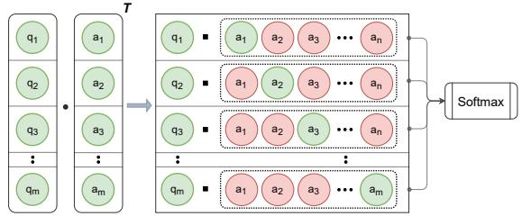

# Batch-Softmax Contrastive Loss for Pairwise Sentence Scoring Tasks

Anton Chernyavskiy<sup>1</sup>, Dmitry Ilvovsky<sup>1</sup>, Pavel Kalinin<sup>2</sup>, Preslav Nakov<sup>3</sup>

<sup>1</sup>HSE University, Russia

<sup>2</sup>Yandex, Russia

<sup>3</sup>Qatar Computing Research Institute, HBKU, Qatar {acherniavskii, dilvovsky}@hse.ru kalinin.pavel.v@gmail.com pnakov@hbku.edu.qa

## Abstract

The use of contrastive loss for representation learning has become prominent in computer vision, and it is now getting attention in Natural Language Processing (NLP). Here, we explore the idea of using a batch-softmax contrastive loss when fine-tuning large-scale pretrained transformer models to learn better taskspecific sentence embeddings for pairwise sentence scoring tasks. We introduce and study a number of variations in the calculation of the loss as well as in the overall training procedure; in particular, we find that a special data shuffling can be quite important. Our experimental results show sizable improvements on a number of datasets and pairwise sentence scoring tasks including classification, ranking, and regression. Finally, we offer detailed analysis and discussion, which should be useful for researchers aiming to explore the utility of contrastive loss in NLP.

## 1 Introduction

Recent years have seen a revolution in Natural Language Processing (NLP) thanks to the advances in machine learning. A lot of attention has been paid to architectures, especially for deep learning, as well as to loss functions. Notably, loss functions based on similar ideas were proposed in unrelated papers in different machine learning fields under different names. This can cause difficulties when solving new problems or when designing new experiments based on previous results. To a greater extent, this applies to “universal” loss functions, which can be applied in different machine learning areas and tasks such as Computer Vision (CV), Recommendation Systems, and NLP. An example of such loss function is the batch-softmax contrastive (BSC) loss, which we will discuss below. For many NLP tasks, it is important to obtain representations of sentences for semantic matching problems, since they can be used for further analysis, e.g., for finding the best answer to a question.

Sentence BERT is a recent popular approach for this (Reimers and Gurevych, 2019): it can be trained with different loss functions, and we show that the choice of a loss function is important. Moreover, we show that it will not be optimal to take the “standard” batch-softmax contrastive loss, which is used for training SimCSE (Gao et al., 2021), a recent alternative to Sentence BERT, and we suggest ways to improve its efficiency. Our contributions can be summarized as follows:

• We study the use of a batch-softmax contrastive loss for fine-tuning large-scale transformers to learn better task-specific embeddings for pairwise sentence scoring tasks.

• We introduce and study a number of novel variations in the calculation of the loss such as symmetrization, incorporating labeled negatives, aligning scores on the similarity matrix diagonal, normalizing over the batch axis, as well as in the overall training procedure, e.g., shuffling, trainable temperature, and sequential pre-training.

• We demonstrate sizable improvements for a number of pairwise sentence scoring tasks such as classification, ranking, and regression.

• We offer detailed analysis and discussion, which would be useful for future research.

• We release our code at https://github. com/aschern/BSC-loss

## 2 Related Work

The contrastive loss was proposed by Hadsell et al. (2006) as metric learning that contrasts Euclidean distances between embeddings of samples from one class and between samples from different classes. Weinberger et al. (2006) suggested the triplet loss, which is based on a similar idea, but uses triplets (anchor, positive, negative), and aims for the difference between the distances for (anchor, positive) and for (anchor, negative) to be larger than a margin.

N-pair loss was presented as a generalization of the contrastive and the triplet losses as a way to solve the problem of extensive construction of hard negative pairs and triplets (Sohn, 2016). A batch of N pairs of examples from N different classes is sampled, and the first element in each pair is considered to be an anchor. Thus, for each anchor, <sup>there</sup> <sup>are</sup> <sup>one</sup> <sup>positive</sup> <sup>and</sup> N ´1 <sup>negative</sup> <sup>pairs.</sup> <sup>The</sup> loss contrasts the distances simultaneously using the softmax function over dot-product similarities. The approach was used successfully in CV tasks.

The same method of Multiple Negative Ranking for training Dot-Product Scoring Models was applied to ranking natural language responses to emails (Henderson et al., 2017), where the loss uses labeled pairs. A similar idea, called Negative Sharing, was used to reduce the computational cost when training recommender systems (Chen et al., 2017). Wu et al. (2018) presented an approach with N-pairs like logic, as a Non-Parametric Softmax Classifier, replacing the weights in the softmax with embeddings of samples from such classes. It was also proposed to use L2 normalization and temperature. Yang et al. (2018) used Multiple Negative Ranking to train general sentence representations on data from Reddit and SNLI. Logeswaran and Lee (2018) presented a Quick-Thoughts approach to learn sentence embeddings, which constructs batches of contiguous sets of sentences, and for each sentence, contrasts the next sentence in the text and all other candidates.

A lot of subsequent work focused on maximizing Mutual Information (MI). van den Oord et al. (2018) presented a loss function based on Noise-Contrastive Estimation, called InfoNCE. It models the “similarity” function that estimates the MI between the target (future) and the context (present) signals, and maximizes the MI between temporally nearby signals. If this “similarity” function expresses the dot-product between embeddings, the InfoNCE loss is equivalent to the N-pair loss up to some constants. It was also shown that InfoNCE is equivalent to the Mutual Information Neural Estimator (MINE) up to a constant (Belghazi et al., 2018), which maximizes a lower bound on MI. Deep InfoMax (DIM) (Hjelm et al., 2019) improves MINE, and can be modified to incorporate some autoregression as InfoNCE. However, the effectiveness of loss functions such as DIM and InfoNCE might be primarily connected to MI, rather than to deep metric learning (Tschannen et al., 2020).

The idea gained a lot of popularity in the field of Computer Vision with the advent of SimCLR (a Simple framework for Contrastive Learning of visual Representations), which introduced NT-Xent (normalized temperature-scaled cross-entropy loss) (Chen et al., 2020). It uses self-supervised learning, where augmentations of the same image are used as positive examples and augmentations of different images are used as negative examples. Thus, the task is as follows: for each example in a batch, find its paired positive augmentation. Here, the N-pairs loss is modified with a temperature parameter and with an L2 normalization of embeddings to the unit hypersphere. The loss was further extended for supervised learning as SupCon loss (Khosla et al., 2020), which aggregates all positive examples (from the same class) in the softmax numerator.

Subsequently, similar kinds of loss functions were also introduced to the field of Natural Language Processing (NLP). Gunel et al. (2021) combined the SupCon loss with the cross-entropy loss and obtained state-of-the-art results for several downstream NLP tasks using RoBERTa. Giorgi et al. (2021), Fang and Xie (2020) and Meng et al. (2021) used NT-Xent to pre-train Transformers, considering spans sampled from the same document, sentences augmented with back-translation as positive examples, and sequences corrupted with MLM. Luo et al. (2020) proposed to use NT-Xent in a self-supervised setting to learn noise-invariant sequence representations, where sentences augmented with masking were considered as positive examples. Finally, Gao et al. (2021) introduced the SimCLR loss to NLP under the name SimCSE (Simple Contrastive Learning of Sentence Embeddings), where sentences processed by a neural network with dropout served as augmentations of the original sentences. Here, we explore various ways to use a similar loss function for pairwise sentence scoring tasks.

While the above-described loss functions have different names, they are all based on similar ideas. Below, we will use the name Batch-Softmax Contrastive (BSC) loss, which we believe reflects the main idea best. In our experiments below, we will use the “modern” variant of the loss: with temperature, normalization, and symmetrization components (described in more detail in Section 3.1). These components were not used for NLP in combination before.

  
Figure 1: For the set of positives pairs $( q _ { i } , a _ { i } )$ e.g., question–answer, for each $q _ { i }$ , the BSC loss contrasts the scores between $q _ { i }$ and $a _ { i }$ (positive examples) vs. between $q _ { i }$ and $a _ { j }$ for all $j \neq i$ (negative examples) using softmax. Here ‚ denotes the dot-product.

We further introduce a number of novel and important modifications in the definition of the loss and in the training procedure, which make it more efficient, and we show that using the resulting loss yields better task-specific sentence embeddings for pairwise sentence scoring tasks.

## 3 Method

## 3.1 Batch-Softmax Contrastive (BSC) Loss

Pointwise approaches for training models for pairwise sentence scoring tasks, such as mean squared error (MSE), are problematic as the loss does not take the relative order into account. For instance, for two pairs with correct target scores (0.4, 0.5), the loss function would equally penalize answers like (0.3, 0.6) and (0.5, 0.4). However, the first pair is better, as it keeps the correct ranking, while the second one does not. This is addressed in pairwise approaches, e.g., in triplet loss, where the model directly learns an ordering. Yet, there is a problem for constructing pairs or triplets in the training set, as it is hard to find non-trivial negatives examples.

Unlike traditional pairwise loss functions, the BSC loss treats all other possible pairs of examples in the batch as “negatives.” That is, only positive pairs are needed for training. Consider a batch X of pairs from a question-answering dataset. In general, let $Q _ { m \times n }$ and $A _ { m \times n }$ be the matrices of embeddings produced by a query model and an answer model. We define the loss function as follows:

$$
\begin{array} { r l } & { \mathcal { L } _ { B S C } ( X ) = \mathcal { L } _ { 0 } ( X ) + \mathcal { L } _ { 1 } ( X ) } \\ & { = - \operatorname* { m e a n } \left( \log \left( d i a g \left( \operatorname { s o f t m a x } \left( \frac { Q A ^ { T } } { \tau } \right) \right) \right) \right) } \\ & { - \operatorname* { m e a n } \left( \log \left( d i a g \left( \operatorname { s o f t m a x } \left( \frac { A Q ^ { T } } { \tau } \right) \right) \right) \right) } \end{array}\tag{1}
$$

Here, softmax is applied by rows (Figure 1), and $\tau$ is the temperature. Both components can be rewritten, e.g., $\mathcal { L } _ { 0 } ( X )$ can be written as follows:

$$
- \frac { 1 } { m \tau } \sum _ { i = 1 } ^ { m } q _ { i } ^ { T } a _ { i } + \frac { 1 } { m } \sum _ { i = 1 } ^ { m } \log \sum _ { j = 1 } ^ { m } \exp \left( \frac { q _ { i } ^ { T } a _ { j } } { \tau } \right)\tag{2}
$$

Mathematically, this loss function is similar to the one presented in (Chen et al., 2020). The difference is that we do not use augmentations, and we do not compare $q _ { i }$ to $q _ { j }$ (or $a _ { i }$ to $a _ { j } )$ due to their different nature: we want to compare a question to an answer, not a question to a question or an answer to an answer. Thus, we apply the symmetrization in the formula. So, the difference from SimCSE (Gao et al., 2021) is that we compare not only $q _ { i }$ to all $a _ { j }$ , but also $a _ { i }$ to all $q _ { j }$ in the batch.

Note that, although a frequent short answer may fit multiple questions in a batch, such pairs are considered as “negative” examples in the loss. However, the loss learns Mutual Information (Tschannen et al., 2020), that is $p ( q _ { i } , a _ { i } ) / ( p ( q _ { i } ) p ( a _ { i } ) )$ , and thus it is robust to this false negatives problem.

Early research has already shown the importance of properly configuring and using some BSC loss settings. For example, low temperatures are equivalent to optimizing for hard positives/negatives (Khosla et al., 2020), while L2 normalization of vectors to the unit hypersphere along with temperature effectively weighs different examples (Chen et al., 2020). We further propose a number of important modifications that can have a major impact on the performance for a number of tasks.

## 3.2 Batch Construction

In computer vision, it is common to use a batch size of 5,000, which in turn would naturally be very likely to contain some hard negative examples. In NLP, fine-tuning Transformers with large batch sizes requires very large amounts of memory. Thus, much smaller batches are used in practice, and it becomes important to make sure these batches do contain some hard negative examples. We achieve this by fixing the content of the batches at each training epoch. Note that this is much simpler than mining hard negatives, as we only need to increase the likelihood that there would be a hard negative example present in the batch, but we do not need to know which particular example in the batch would be hard. Inside the batch, this would be controlled by the temperature parameter.

Example-based shuffling The key idea of this method is to batch several groups, so that within each group all pairs are similar based on their first or their second elements. In this way, each positive pair would be accompanied by hard negatives from the same group and by simpler negatives from the remaining examples inside the batch (which come from other groups). We use the k-nearest neighbors for an input example to form a group for it, and Faiss (Johnson et al., 2021) to quickly find these nearest neighbors in the embedding space. Let the pairs be grouped by their first elements $q _ { i }$ Algorithm 1 summarizes the proposed method.

```latex
Algorithm 1 Example-based shuffling
Input: sequence $D ,$ , group size s
initialize $R \gets \left[ \right] \vartriangle { \ v { u } } \ v { u } \sim \left[ \begin{array} { r l } \end{array} \right]$ sequence to store the result
initialize $U \gets \emptyset$ set of used examples
randomly shuffle $D$
for $\ominus$ in D do
$\mathbf { i f } \in \not \in U$ then
find the n nearest neighbors of $\ominus$ from D
choose the top $s - 1$ that are not in U
add them and e to R and also to U
return reversed R
Note that in this approach we use two stages
in kNN to limit the range of possible candidates
and thus to reduce the computational costs (both
in terms of time and memory). We first extract
the top-n neighbors (for some large n, e.g., 500),
and then we take the top-k from them, so that no
duplicates appear in the final sequence (for some
small $k = 7 )$ . The time complexity of such a check
is O(1). If all such neighbors are already used, then
only the considered example will be added to the
resulting sequence. This case will often arise for
the last examples, and thus batches will consist of
simple 1-element groups. Therefore, we reverse
the sequence to start with these simple batches, as
in curriculum learning.
```

By default, we assume that there should be one positive example for each question/answer (on the diagonal of the matrix), and thus identical neighbors could be optionally filtered. Still, if there are the same $q _ { i }$ in the batch X, the loss definition (eq. 1) does not change. Indeed, let $P _ { q } = \{ i | q _ { i } =$ $q , ( q _ { i } , a _ { i } ) \in X \}$ , then $\forall i , j \in P _ { q } : ( q _ { i } , a _ { j } )$ form a positive pair. According to Khosla et al. (2020), for each $q ,$ all $\tilde { q } \in { \cal P } _ { q }$ should be placed in the softmax numerator and then averaging over all such $\tilde { q }$ should be performed outside the logarithm.

Thus, in $\mathcal { L } _ { 0 } ( X )$ (eq. 2) only the first sum would change as follows:

$$
\begin{array} { c } { { \displaystyle \sum _ { i \in P _ { q } } q _ { i } ^ { T } a _ { i } \ \{ \bf { \sigma }  \ \displaystyle \sum _ { \it { i \in P _ { q } } } \frac { 1 } { | P _ { q } | } \sum _ { j \in P _ { q } } q _ { i } ^ { T } a _ { j } } }  \\ { { = \displaystyle \sum _ { j \in P _ { q } } \frac { 1 } { | P _ { q } | } \sum _ { i \in P _ { q } } q ^ { T } a _ { j } = \displaystyle \sum _ { j \in P _ { q } } q _ { j } ^ { T } a _ { j } } } \end{array}\tag{3}
$$

$$
{ \mathcal { L } } _ { 1 } ( X ) ;
$$

$$
\begin{array} { c } { { \displaystyle \sum _ { i \in P _ { q } } q _ { i } ^ { T } a _ { i } \ \{ \scriptstyle \{ \longrightarrow } \ \displaystyle \sum _ { i \in P _ { q } } \frac { 1 } { | P _ { q } | } \sum _ { j \in P _ { q } } q _ { j } ^ { T } a _ { i } }   \\ { { = \displaystyle \sum _ { i \in P _ { q } } \frac { 1 } { | P _ { q } | } \sum _ { j \in P _ { q } } q ^ { T } a _ { i } = \displaystyle \sum _ { i \in P _ { q } } q _ { i } ^ { T } a _ { i } } } \end{array}\tag{4}
$$

In order to select the groups even better, we consider task-specific embeddings. To this end, we apply the current model to encode all pairs at each epoch.

Algorithm 2 Shuffling by words   
Input: sequence D, group size k, shingle size t   
for $\ominus$ in D do   
e.shingle random subset of t words   
of e (ignoring stop-words)   
sort D by e.shingle   
initialize gID  random uint64  group ID   
initialize s 0 current group size   
initialize prev first element of D   
for e in D do   
if e.shingle  prev.shingle then   
gID random uint64   
$\mathbf { i f } \mathrm { \mathbf { \ s } \geqslant }$ k then   
gID random uint64   
s  0   
<sup>e.gID</sup> Ð <sup>gID</sup>   
$s \gets s + 1$   
prev e   
sort D by $\in \cdot \operatorname { g I D }$   
return $D$

Fast shuffling For extremely large datasets, example-based shuffling is time-consuming even with Faiss; thus, we propose several effective options to perform a less-thorough shuffling. We choose some attribute by which we will group the examples, that is, we guarantee some closeness of the examples. Thus, the examples are close if they share the same words, the same cluster number or the same nearest neighbors.

First, consider the case of words and grouping by the first elements of the pairs (the case of second elements is the same). Algorithm 2 presents the shuffling process. We choose a random word or phrase (shingle) in each element and sort the dataset by these shingles. Since examples with the same shingles will be in a sequence, we assign group IDs sequentially. We split a group if it is too large. Then we shuffle (sort) the dataset by group IDs. The resulting algorithmic complexity is equal to the complexity of two sorts of the dataset.

To produce a shuffle by clusters, we apply the same algorithm, where each sentence is replaced by its cluster number. Thus, each individual shingle is of size $t = 1$ . To make a shuffle by nearest neighbors, we create shingles by “sentences,” where the words are the positions of the top-k nearest neighbors in the input sequence (for some small value of k). All these approaches, including k-means clustering, can be effectively implemented using MapReduce and parallel computations.

## 3.3 Labeled Negatives

Usually, when the data size is small, hard negative examples may be hard to obtain even with data shuffling, e.g., when all examples are semantically distant. Nonetheless, if the dataset contains a labeled negative pair with some anchor, then its elements are semantically close by traditional rules of dataset construction. Thus, using such a pair inside the batch, where this anchor is present, will add the necessary hard negative example.

The only change that is added in the loss function is the masking of negative examples—we have no guarantees that the selected negative example is closer to the anchor than the rest of the examples inside the batch. Let $y _ { i }$ be a binary label, where $y _ { i } = 1$ if the i-th pair is positive. Then, we have

$$
\begin{array} { l } { { \displaystyle { \mathcal { L } } _ { 0 } ( X ) = - \frac { 1 } { m \tau } \sum _ { i = 1 } ^ { m } \mathbb { 1 } \big [ y _ { i } = 1 \big ] q _ { i } ^ { T } a _ { i } } \ ~ } \\ { { \displaystyle ~ + \frac { 1 } { m } \sum _ { i = 1 } ^ { m } \mathbb { 1 } \big [ y _ { i } = 1 \big ] \log \sum _ { j = 1 } ^ { m } \exp \left( \frac { q _ { i } ^ { T } a _ { j } } { \tau } \right) } } \end{array}\tag{5}
$$

## 3.4 Combo Loss

Theoretically, it is beneficial to use several loss functions for training if they are calculated on the same batch (and thus do not require additional computations). That is, joint training of BSC and MSE losses combines the advantages of pointwise and of pairwise approaches.

This ensures that for positives examples, the values on the diagonal of the dot-product matrix are not only greater than the rest, but are also close to 1 or to some target similarity. Note that here $\begin{array} { r } { L _ { M S E } ( X ) = \frac { 1 } { m } \sum _ { i } ^ { \bar { m } } ( ( q _ { i } ^ { T } a _ { i } ) - \bar { y } _ { i } ) ^ { 2 } } \end{array}$ for target positive similarities $y _ { i } ,$ and thus we do not force all other similarities to zero. At the same time, the BSC loss adds new examples (i.e., “negative” pairs) to the training set.

In order to use the BSC loss when training a model for tasks with non-binary labels, we modify the indicator function in equation (5) as 1 $\mathrm { \nabla } J y _ { i } > t ]$ where t is a configurable binarization threshold. Then, we use their convex combination with a configurable hyperparameter $\mu \in ( 0 , 1 )$

$$
L ( X ) = \mu L _ { B S C } ( X ) + ( 1 - \mu ) L _ { M S E } ( X )\tag{6}
$$

## 3.5 Normalization

L2 normalization of matrices A and B means that $a _ { i } ^ { T } b _ { j }$ will be equivalent to cosine similarity. The embeddings can also be normalized by the batch dimension (by coordinates), which can bring additional regularization. In our experiments, we confirm the importance of this, e.g., new representations can be calculated with L2 normalization by coordinates or in a min-max scale.

## 4 Datasets

NLP tasks that compare pairs of sentences can be roughly divided into three general categories: regression (predicting a similarity score), classification (e.g., similar vs. dissimilar), and ranking (search for the best matches). They differ only by the quality assessment functions, and thus they all can benefit from the above losses.

Note that it is important to calculate the sentence representations for ranking tasks in advance, as when independently calculating the embeddings of the individual elements in the pairs, the inference time of the model becomes linear instead of quadratic. Therefore, we use Sentence-BERT (SBERT), which is trained as a Siamese BERT model, and offers a way to obtain state-of-the-art sentence embeddings, which have been proven useful for a number of tasks (Reimers and Gurevych, 2019; Thakur et al., 2021). At inference time, we first use SBERT to obtain independently a representation for the individual sentences, and then we calculate the cosine similarities between the corresponding embeddings as we construct pairs as part of the process of ranking.

We use a variety of public English datasets and tasks for the evaluation. In particular, we have four ranking tasks (ranking answers to non-factoid questions, ranking questions by their similarity with respect to other questions, ranking comments by their similarity to a given question, ranking factchecked claims by their relevance with respect to an input claim), two binary classification tasks (paraphrases identification, and duplicate question identification), and one regression task (semantic sentence similarity).

Antique The dataset contains 2,626 non-factoid questions with answer choices (Hashemi et al., 2020), asked by users on Yahoo! Answers. There are a total of 34,011 question–answer pairs: 27,422 for training and 6,589 for validation. Each answer is annotated with a relevance score with respect to the question on a scale from 1 to 4 (where 4 denotes the highest relevance), and the task is to rank the answers by their relevance. To model relevance as a cosine similarity, we normalize the scores to the 0, 1 interval. We use Mean Reciprocal Rank (MRR) as the main evaluation measure.

CQA-A This dataset was used in SemEval-2017 Task 3 on Community Question Answering subtask A (Nakov et al., 2017). The goal is to rank the first ten answers in a question thread on Qatar Living, so that good answers are ranked higher than bad ones. We used the clean part of the dataset, which consists of 14,110 and 2,440 labeled question–comments pairs for training and development, respectively. The evaluation measure is Mean Average Precision (MAP). This dataset contains important metadata, e.g., the date and time of the comment, and sorting the comments by time yields a strong baseline; yet, we only use the text. To train the model with the triplet loss, we group the pairs by the first element (anchor).

CQA-B This dataset was developed for SemEval-2017 Task 3, subtask B (Nakov et al., 2017), whose goal was to rank ten potentially related questions by their similarity with respect to an input question. These questions were retrieved from the Qatar Living forum using Google and the input question as a query. We use the clean part of the dataset, which consists of 19,990 training and 5,500 development labeled question-question pairs. The main evaluation measure here is MAP. There is additional information, e.g., the rank of the retrieved question in the Google search results, which we do not use.

PFCC-S Shaar et al. (2020) presented a dataset for detecting Previously Fact-Checked Claims on Snopes (PFCC-S), aimed at facilitating the solution of a fact-checking problem: given an input claim, it asks to rank claims that have been previously fact-checked, so that claims that can help verify the input claim are ranked as high as possible. The dataset has 800 positive input–verified claim pairs for training and 200 such positive pairs for testing, and they are to be matched against a database of 10,369 verified claims. The evaluation is performed in terms of a HasPositive@k metric, which checks whether there is a positive match among the first k results in the ranked list. There are no negative examples in the dataset, but about eight million such pairs can be created. Thus, in order to train models using MSE or triplet loss, we sampled negatives according to the following scheme. First, we encoded all sentences using SBERT (we used the model pretrained on STSb and NLI). Then, we selected the first element in each positive pair as an anchor and we sorted all other examples by their similarity to this anchor. The assumption is that positive examples will be concentrated in the beginning, e.g., among the top-100. Thus, we selected negatives starting from 101 on, logarithmically: on positions 100 2<sup>k</sup>, k N. As a result, we obtained many hard negative examples and a small number of easy ones. Finally, we oversampled the positive pairs to correct the balance of positive and negative examples.

Microsoft Research Paraphrase Corpus (MRPC) It was created by Dolan et al. (2004) and contains 5,800 pairs of sentences, extracted from online news sources. Each pair was labeled with a tag indicating whether the sentences are paraphrases (semantically equivalent). There are 3,668, 407, and 1,725 pairs in the training, development, and test subsets. As it is a binary classification task with class imbalance, it is evaluated in terms of F1.

Quora Question Pairs (QQP) Quora presented a dataset containing over 500,000 sentences with over 400,000 lines of potential duplicate questions. Each line has a binary label indicating whether the line truly contains a duplicate pair. Due to the sampling method, which returns mostly positive pairs, the authors supplemented the dataset with negative pairs composed of “related questions.” Following Thakur et al. (2021), we sampled randomly 10,000 examples for training, and we used F1 score as the main evaluation measure.

Semantic Textual Similarity Benchmark (STSb) The STS benchmark comprises a selection of English datasets used in the STS tasks organized in the context of SemEval between 2012 and 2017 (Cer et al., 2017). The benchmark comprises 8,628 sentence pairs. The pairs were annotated with similarity scores on a scale from 0 to 5 (with 5 indicating complete equivalence). There are a total of 5,749, 1,500 and 1,379 pairs in the training, in the development, and in the testing split, respectively. The main evaluation measure is Spearman’s rank correlation. As for the Antique dataset, here we also normalized the scores to the 0, 1 interval and then we binarized them based on a threshold of 0.6.

## 5 Experimental Setup

Below, we describe our baselines and hyperparameter settings.

## 5.1 Baselines

We used BERT-base uncased in all our experiments to be able to perform direct comparison for tasks such as MRPC, QQP, and STS to previous work (Reimers and Gurevych, 2019; Thakur et al., 2021).

We considered SimCSE (sup-simcse-bert-baseuncased checkpoint) (Gao et al., 2021) as an unsupervised baseline as it uses the base version of the BSC loss, which we modified. Below, by BSC we will denote using optimal settings in the tables, and variants like BSC - random shuffle would mean that instead of these optimal settings, we applied random shuffling.

## 5.2 Hyperparameters Setting

We set the number of warm-up steps to 10% of the total steps, and we limited the input sequence length to 90 subtokens. We used a batch size of 30 in all tasks, except for Antique and QQP, where we used 50. Note that an order of magnitude larger batch sizes would probably yield better results, but they would also require much more memory. We tried learning rates from {5e-6, 1e-5, 2e-5, 3e-5}, and we selected (on dev) 3e-5 for CQA-B and 2e-5 for all other experiments. We used the AdamW optimizer with the bias correction for the CQA tasks, and without bias correction for the rest. We trained the model for five epochs for Antique, CQA-A and STSb, for six epochs for QQP, MRPC and PFCC-S, and for seven epochs for CQA-B, saving a checkpoint after each one, and we selected the best checkpoint on the development set.

As recommended by Thakur et al. (2021), due to instability, we did seed optimization, running each experiment five times and selecting the best one (on dev). To train with the BSC loss, we used minmax normalization by coordinates with $\tau = 1 . 2$ for PFCC-S and QQP, standard L2 normalization with τ 0.055 for CQA-A, $\tau = 0 . 0 7$ for CQA-B, and $\tau = 0 . 1$ for all other tasks (to find the optimal τ , we made it trainable for one run). We applied examplebased shuffling to train with the BSC loss. We used a group size of four in MRPC, of five in CQA-B, and of eight in all other tasks. We iterated over µ values from the set 0.1, 0.5, 0.9 , and we chose $\mu = 0 . 1$ to train the combo approach for CQA-A, MRPC, QQP and STSb tasks, and $\mu = 0 . 9$ for the other experiments.

Our experiments demonstrated that there is only a minor impact of changing the values of these hyperparameters. For example, the maximum quality drop from µ (0.1 vs. 0.5) is 0.4%, i.e., almost at the noise level, while we obtained gains of up to 10% when using our proposed modifications.

We trained the triplet loss variant from (Reimers and Gurevych, 2019) with margin 0.6 for PFCC-S, and margin  0.5 for all other tasks. As we have no answers for the test set in MRPC, and no test sets in Antique and PFCC-S, we split the training set into 9:1 to tune the hyper-parameters. The time for training SBERT with the BSC loss (or combo loss) was almost equal to the time for training with the standard MSE loss. The most complex example-based shuffling only adds 8% to the training time. Note that it is several times faster than triplet loss, as only positive examples are used for training, and thus the dataset becomes several times smaller. We ran all experiments on a GeForce GTX 1080 GPU Ti. Training SBERT-base took up to ten minutes per epoch depending on dataset size.

## 6 Results

Below, we describe the evaluation results.

Antique The results are shown in Table 1. Our best approach of combo-training the MSE and the BSC losses outperforms all other variants and the approach proposed in (Hashemi et al., 2020), where specific negative sampling and a triplet loss were used. Besides, the best BSC configuration achieves higher scores than MSE. We can see the importance of using predefined hand-crafted negative examples, which brings additional difficult cases and increases MRR by 0.02.

<table><tr><td>Approach / Metric</td><td>MRR</td><td>P@1</td><td>nDCG@1</td></tr><tr><td>MSE</td><td>0.781</td><td>0.660</td><td>0.769</td></tr><tr><td>BSC</td><td>0.804</td><td>0.680</td><td>0.754</td></tr><tr><td>BSC - positives</td><td>0.784</td><td>0.655</td><td>0.744</td></tr><tr><td>BSC - random shuffle</td><td>0.799</td><td>0.670</td><td>0.754</td></tr><tr><td>Combo BSC + MSE</td><td>0.822</td><td>0.710</td><td>0.773</td></tr><tr><td>SimCSE (unsup.)</td><td>0.681</td><td>0.525</td><td>0.686</td></tr><tr><td>Hashemi et al. (2020)</td><td>0.797</td><td>0.709</td><td>0.713</td></tr></table>

Table 1: Results for Antique.

<table><tr><td>Approach / Metric</td><td>MAP</td><td>MRR</td><td>MAP</td><td>MRR</td></tr><tr><td>MSE BSC</td><td>0.869</td><td>0.911</td><td>0.471</td><td>0.513</td></tr><tr><td></td><td>0.801</td><td>0.867</td><td>0.495</td><td>0.534</td></tr><tr><td>BSC - clusters shuffle BSC - random shuffle</td><td>0.787</td><td>0.859</td><td>0.493</td><td>0.534</td></tr><tr><td>BSC - w/o shuffle</td><td>0.763</td><td>0.828</td><td>0.487</td><td>0.530</td></tr><tr><td></td><td>0.816</td><td>0.884</td><td>0.481</td><td>0.532</td></tr><tr><td>Combo BSC + MSE</td><td>0.872</td><td>0.912</td><td>0.496</td><td>0.540</td></tr><tr><td>Triplet loss</td><td>0.857</td><td>0.917</td><td>0.475</td><td>0.529</td></tr><tr><td>SimCSE (unsup.)</td><td>0.684</td><td>0.735</td><td>0.439</td><td>0.478</td></tr><tr><td>Nakov et al. (2017)</td><td>0.884</td><td>0.928</td><td>0.472</td><td>0.501</td></tr></table>

Table 2: Results for CQA-A and CQA-B.

CQA-A The results for CQA subtask A are shown in Table 2. A comparison with (Nakov et al., 2017) is not very fair, as we did not use the metadata, e.g., the comment position, which was crucial for the best systems. Besides, we use SBERT, which is inferior to a fine-tuned BERT. Nevertheless, our best approach of combo training with MSE and BSC losses yielded competitive results. We further compared different shuffling strategies. The data is ordered by questions, and keeping this order turns out to be best. That is, the model learns to distinguish positive answers for each question from manually selected negative ones and from answers to other questions. Also, note that random shuffling completely eliminates this structure, and MAP drops by 6% absolute. Fast shuffling by 300 clusters, an advanced version of shuffling by words, improves these results. Example-based shuffling finds a data order similar to the initial one, and the quality does not degrade much.

CQA-B The evaluation results for CQA-B are shown in Table 2. Again, we did not use the question position, which is a critically important feature for the best systems. We can see that the BSC loss achieved the best score, noticeably outperforming MSE and triplet losses. The experiments also demonstrate the importance of data order when training with the BSC loss. Since the dataset is small, the model overfits when the original data order is fixed.

<table><tr><td>Approach / Metric</td><td>HP@1</td><td>HP@5</td><td>HP@50</td></tr><tr><td>MSE</td><td>0.362</td><td>0.508</td><td>0.709</td></tr><tr><td>BSC</td><td>0.673</td><td>0.844</td><td>0.899</td></tr><tr><td>BSC - 1-dim norm</td><td>0.588</td><td>0.764</td><td>0.899</td></tr><tr><td>BSC - no norm BSC - random shuffle</td><td>0.608</td><td>0.744</td><td>0.884</td></tr><tr><td>Triplet loss</td><td>0.663 0.668</td><td>0.794 0.794</td><td>0.915 0.899</td></tr><tr><td></td><td></td><td></td><td></td></tr><tr><td>SimCSE (unsup.)</td><td>0.412</td><td>0.693</td><td>0.849</td></tr><tr><td>Shaar et al. (2020)</td><td>0.402</td><td>0.653</td><td>0.784</td></tr></table>

Table 3: Results for PFCC-S.

<table><tr><td>Approach / Metric</td><td>MRPC (F1)</td><td>QQP (F1)</td></tr><tr><td>MSE</td><td>89.08</td><td>74.29</td></tr><tr><td>BSC</td><td>86.73</td><td>73.13</td></tr><tr><td>Combo BSC + MSE</td><td>89.46</td><td>75.07</td></tr><tr><td>SimCSE (unsup.)</td><td>85.43</td><td>68.65</td></tr><tr><td>Thakur et al. (2021)</td><td>87.89 (88.55)</td><td>74.97 (79.77)</td></tr></table>

Table 4: Results for MRPC and QQP.

PFCC-S Table 3 shows the results for PFCC-S (HP@k stands for HasPositives@k). Note that the scores from (Shaar et al., 2020) are for the pre-trained SBERT without fine-tuning. We observed that even when using oversampling to improve class imbalance, fine-tuning with MSE performed worse than their results. Here, we used only positives examples to train with BSC, and normalizing by the zero dimension. Overall, the approaches using BSC and triplet loss were comparable. However, the dataset size for training with the BSC loss was much smaller, which is also true for MSE. Thus, the BSC loss is faster, and preferable.

MRPC Table 4 shows the results for MRPC. MSE outperformed the BSC loss, but combo achieved a slightly higher F1 score.

QQP The results for QQP are shown in Table 4. We also show results for SBERT and augmented SBERT (in parentheses) from (Thakur et al., 2021). They trained SBERT with MSE using another random training sample, but nonetheless, the F1 score is close to ours. The combo approach outperformed separate training with BSC or MSE.

STSb Table 5 shows the results for STS. It is the only task where combo with the BSC loss was worse than MSE. This could be due to hard negatives not appearing in the batch in any of the shuffling procedures. Moreover, we observed only marginal improvement when fine-tuning with a BSC model initially trained with MSE. However, if it was pretrained with BSC up to overfitting, finetuning it with MSE yielded sizable improvements.

<table><tr><td>Approach / Metric</td><td>ρ× 100</td></tr><tr><td>MSE</td><td>84.80</td></tr><tr><td>BSC</td><td>83.26</td></tr><tr><td>Combo BSC + MSE</td><td>84.59</td></tr><tr><td>Fine-tuning MSE with BSC</td><td>84.95</td></tr><tr><td>Fine-tuning BSC with MSE</td><td>85.71</td></tr><tr><td>SimCSE (unsup.)</td><td>84.25</td></tr><tr><td>Reimers and Gurevych (2019)</td><td>84.86</td></tr></table>

Table 5: Results for STSb: Spearman rank correlation.

## 7 Discussion

We highlight the following observations:

• Combo-training with BSC and MSE losses generally yields the best results (the only exception is STSb), and it outperforms the triplet loss with advanced negative sampling.

• The order in which the data is presented for training can be critical, as we have seen in the cases of CQA-A and CQA-B.

• The use of labeled negative examples generally improves the results by 1-2% absolute.

• Embedding normalization during training is important. Moreover, it is useful to normalize to the zero dimension (e.g., for PFCC-S).

• A temperature τ of order 0.1 should be used with the standard normalization, and τ of order 1-3 for coordinate normalization.

• A suboptimal setup may hurt performance by over 10%, as was demonstrated for (i) filtering out negative examples for which no positives were given in the dataset (Table 1), (ii) using poorly formed batches (highest impact in Table 2), (iii) suboptimal normalization (Table 3), and (iv) wrong temperature value.

• BSC is more suitable for ranking tasks (Antique, CQA, and PFCC-S), but it can help for other tasks (classification and regression tasks, e.g., for MRPC, QQP, and STSb) if applied as pre-training or in joint training with MSE.

Selecting a loss function is important. For instance, if the model optimizes Pearson correlation, it achieves a score of 85.57 on the STS task. Thus, it outperforms almost all considered approaches. Moreover, the combination of such a loss with BSC allows the model to achieve an F1 score of 89.88 in the MRPC task (a classification task).

Finally, we would like to draw a parallel between our work and Augmented SBERT (Thakur et al., 2021). When using the BSC loss, some negatives are implicitly added to the dataset. Augmented SBERT adds new examples too and retrieves them using BM25 or Semantic Search samplings. These methods are comparable to our fast shuffling by words (n-grams) and to example-based shuffling, respectively. Moreover, the task-specific model is used to encode the data in both cases. However, we do not need to label such pairs with another model (cross-encoder) due to the BSC loss definition.

## 8 Conclusion and Future Work

We explored the idea of using a batch-softmax contrastive loss for fine-tuning large-scale pre-trained transformers to learn better task-specific sentence embeddings for pairwise sentence scoring tasks. We introduced and studied a number of variations in the calculation of the loss as well as in the overall training procedure. Our experimental results have shown sizable improvements on a number of datasets and pairwise sentence scoring tasks including ranking, classification, and regression.

In future work, we want to explore new variations of the loss, and to gain better understanding of when to use which variation. We further plan experiments with a larger set of NLP tasks.

## Ethics and Broader Impact

We would like to warn that the use of large-scale Transformers requires a lot of computations and the use of GPUs/TPUs for training, which contributes to global warming (Strubell et al., 2019). This is a bit less of an issue in our case, as we do not train such models from scratch; rather, we fine-tune them on relatively small datasets. Moreover, running on a CPU for inference, once the model is fine-tuned, is perfectly feasible, and CPUs contribute much less to global warming.

## Acknowledgments

The article was prepared within the framework of the HSE University Basic Research Program. It is also part of the Tanbih mega-project, developed at the Qatar Computing Research Institute, HBKU, which aims to limit the impact of “fake news,” propaganda, and media bias by making users aware of what they are reading, thus promoting media literacy and critical thinking.

## References

Mohamed Ishmael Belghazi, Aristide Baratin, Sai Rajeshwar, Sherjil Ozair, Yoshua Bengio, Aaron Courville, and Devon Hjelm. 2018. Mutual information neural estimation. In Proceedings ofthe 35th International Conference on Machine Learning, volume 80 of ICML ’18, pages 531–540, Stockholm, Sweden. PMLR.

Daniel M. Cer, Mona T. Diab, Eneko Agirre, Iñigo Lopez-Gazpio, and Lucia Specia. 2017. SemEval-2017 task 1: Semantic textual similarity multilingual and crosslingual focused evaluation. In Proceedings ofthe 11th International Workshop on Semantic Evaluation, SemEval ’2017, pages 1–14, Vancouver, Canada. Association for Computational Linguistics.

Ting Chen, Simon Kornblith, Mohammad Norouzi, and Geoffrey Hinton. 2020. A simple framework for contrastive learning of visual representations. In Proceedings of the 37th International Conference on Machine Learning, volume 119 of ICML ’20, pages 1597–1607. PMLR.

Ting Chen, Yizhou Sun, Yue Shi, and Liangjie Hong. 2017. On sampling strategies for neural networkbased collaborative filtering. In Proceedings of the 23rd ACM SIGKDD International Conference on Knowledge Discovery and Data Mining, KDD ’17, pages 767–776, Halifax, NS, Canada. Association for Computing Machinery.

Bill Dolan, Chris Quirk, and Chris Brockett. 2004. Unsupervised construction of large paraphrase corpora: Exploiting massively parallel news sources. In Proceedings of the 20th International Conference on Computational Linguistics, COLING ’04, pages 350– 356, Geneva, Switzerland. Association for Computational Linguistics.

Hongchao Fang and Pengtao Xie. 2020. CERT: Contrastive self-supervised learning for language understanding. CoRR, abs/2005.12766.

Tianyu Gao, Xingcheng Yao, and Danqi Chen. 2021. SimCSE: Simple contrastive learning of sentence embeddings. In Proceedings ofthe 2021 Conference on Empirical Methods in Natural Language Processing, EMNLP ’21, pages 6894–6910, Online and Punta Cana, Dominican Republic. Association for Computational Linguistics.

John Giorgi, Osvald Nitski, Bo Wang, and Gary Bader. 2021. DeCLUTR: Deep contrastive learning for unsupervised textual representations. In Proceedings of the 59th Annual Meeting of the Association for Computational Linguistics and the 11th International Joint Conference on Natural Language Processing (Volume 1: Long Papers), NAACL-HLT ’21, pages 879–895, Online. Association for Computational Linguistics.

Beliz Gunel, Jingfei Du, Alexis Conneau, and Veselin Stoyanov. 2021. Supervised contrastive learning for

pre-trained language model fine-tuning. In Proceedings ofthe 9th International Conference on Learning Representations, ICLR 2021, Virtual Event, Austria.

Raia Hadsell, Sumit Chopra, and Yann LeCun. 2006. Dimensionality reduction by learning an invariant mapping. In Proceedings of the 2006 IEEE Computer Society Conference on Computer Vision and Pattern Recognition, CVPR ’06, pages 1735–1742, New York, NY, USA. IEEE Computer Society.

Helia Hashemi, Mohammad Aliannejadi, Hamed Zamani, and W. Bruce Croft. 2020. ANTIQUE: A non-factoid question answering benchmark. In Advances in Information Retrieval, pages 166–173, Cham. Springer International Publishing.

Matthew Henderson, Rami Al-Rfou, Brian Strope, Yun hsuan Sung, Laszlo Lukacs, Ruiqi Guo, Sanjiv Kumar, Balint Miklos, and Ray Kurzweil. 2017. Efficient natural language response suggestion for smart reply. ArXiv, abs/1705.00652.

Devon Hjelm, Alex Fedorov, Samuel Lavoie-Marchildon, Karan Grewal, Phil Bachman, Adam Trischler, and Yoshua Bengio. 2019. Learning deep representations by mutual information estimation and maximization. In Proceedings of the 7th International Conference on Learning Representations, ICLR ’19, New Orleans, Louisiana, USA.

Jeff Johnson, Matthijs Douze, and Hervé Jégou. 2021. Billion-scale similarity search with GPUs. IEEE Transactions on Big Data, 7(3):535–547.

Prannay Khosla, Piotr Teterwak, Chen Wang, Aaron Sarna, Yonglong Tian, Phillip Isola, Aaron Maschinot, Ce Liu, and Dilip Krishnan. 2020. Supervised contrastive learning. In Advances in Neural Information Processing Systems: Annual Conference on Neural Information Processing Systems, volume 33 of NeurIPS ’20, pages 18661–18673. Curran Associates, Inc.

Lajanugen Logeswaran and Honglak Lee. 2018. An efficient framework for learning sentence representations. In Proceedings of the 6th International Conference on Learning Representations, ICLR 2018, Vancouver, Canada.

Fuli Luo, Pengcheng Yang, Shicheng Li, Xuancheng Ren, and Xu Sun. 2020. CAPT: contrastive pretraining for learning denoised sequence representations. CoRR, abs/2010.06351.

Yu Meng, Chenyan Xiong, Payal Bajaj, Saurabh Tiwary, Paul Bennett, Jiawei Han, and Xia Song. 2021. COCO-LM: Correcting and contrasting text sequences for language model pretraining. In Advances in Neural Information Processing Systems: Annual Conference on Neural Information Processing Systems, NeurIPS ’21, pages 23102–23114, Virtual Event.

Preslav Nakov, Doris Hoogeveen, Lluís Màrquez, Alessandro Moschitti, Hamdy Mubarak, Timothy Baldwin, and Karin Verspoor. 2017. SemEval-2017 task 3: Community question answering. In Proceedings ofthe 11th International Workshop on Semantic Evaluation, SemEval ’17, pages 27–48, Vancouver, Canada. Association for Computational Linguistics.

Nils Reimers and Iryna Gurevych. 2019. Sentence-BERT: Sentence embeddings using Siamese BERTnetworks. In Proceedings of the 2019 Conference on Empirical Methods in Natural Language Processing and the 9th International Joint Conference on Natural Language Processing, EMNLP-IJCNLP ’19, pages 3982–3992, Hong Kong, China. Association for Computational Linguistics.

Shaden Shaar, Nikolay Babulkov, Giovanni Da San Martino, and Preslav Nakov. 2020. That is a known lie: Detecting previously fact-checked claims. In Proceedings ofthe 58th Annual Meeting ofthe Association for Computational Linguistics, ACL ’20, pages 3607–3618, Online. Association for Computational Linguistics.

Kihyuk Sohn. 2016. Improved deep metric learning with multi-class n-pair loss objective. In Advances in Neural Information Processing Systems: Annual Conference on Neural Information Processing Systems, volume 29, pages 1857–1865. Curran Associates, Inc.

Emma Strubell, Ananya Ganesh, and Andrew McCallum. 2019. Energy and policy considerations for deep learning in NLP. In Proceedings of the 57th Annual Meeting ofthe Associationfor Computational Linguistics, ACL ’19, pages 3645–3650, Florence, Italy. Association for Computational Linguistics.

Nandan Thakur, Nils Reimers, Johannes Daxenberger, and Iryna Gurevych. 2021. Augmented SBERT: Data augmentation method for improving bi-encoders for pairwise sentence scoring tasks. In Proceedings of the 2021 Conference of the North American Chapter ofthe Associationfor Computational Linguistics: Human Language Technologies, NAACL-HLT ’21, pages 296–310, Online. Association for Computational Linguistics.

Michael Tschannen, Josip Djolonga, Paul K. Rubenstein, Sylvain Gelly, and Mario Lucic. 2020. On mutual information maximization for representation learning. In Proceedings of the 8th International Conference on Learning Representations, ICLR 2020, Addis Ababa, Ethiopia.

Aäron van den Oord, Yazhe Li, and Oriol Vinyals. 2018. Representation learning with contrastive predictive coding. CoRR, abs/1807.03748.

Kilian Q Weinberger, John Blitzer, and Lawrence Saul. 2006. Distance metric learning for large margin nearest neighbor classification. In Advances in Neural Information Processing Systems: Annual Conference on Neural Information Processing Systems, volume 18 of NIPS ’06, pages 1473–1480. MIT Press.

Zhirong Wu, Yuanjun Xiong, Stella X. Yu, and Dahua Lin. 2018. Unsupervised feature learning via nonparametric instance discrimination. In Proceedings of the 2018 IEEE Conference on Computer Vision and Pattern Recognition, CVPR ’18, pages 3733– 3742, Salt Lake City, Utah, USA. Computer Vision Foundation / IEEE Computer Society.

Yinfei Yang, Steve Yuan, Daniel Cer, Sheng-yi Kong, Noah Constant, Petr Pilar, Heming Ge, Yun-Hsuan Sung, Brian Strope, and Ray Kurzweil. 2018. Learning semantic textual similarity from conversations. In Proceedings ofthe Third Workshop on Representation Learningfor NLP, RepL4NLP ’18, pages 164– 174, Melbourne, Australia. Association for Computational Linguistics.