# Beyond Emotion: A Multi-Modal Dataset for Human Desire Understanding

Ao Jia1∗, Yu He2∗, Yazhou Zhang2†, Sagar Uprety3, Dawei Song1,4, Christina Lioma5

1Beijing Institute of Technology

2Zhengzhou University of Light Industry

3Bravura Solutions

4The Open University

5University of Copenhagen

{jiaao, dwsong}@bit.edu.cn, y.u.he@outlook.com yzzhang@zzuli.edu.cn, sagaruprety@gmail.com, c.lioma@di.ku.dk

## Abstract

Desire is a strong wish to do or have something, which involves not only a linguistic expression, but also underlying cognitive phenomena driving human feelings. As the most primitive and basic human instinct, conscious desire is often accompanied by a range of emotional responses. As a strikingly understudied task, it is difficult for machines to model and understand desire due to the unavailability of benchmarking datasets with desire and emotion labels. To bridge this gap, we present MSED, the first multi-modal and multi-task sentiment, emotion and desire dataset, which contains 9,190 textimage pairs, with English text. Each multimodal sample is annotated with six desires, three sentiments and six emotions. We also propose the state-of-the-art baselines to evaluate the potential of MSED and show the importance of multi-task and multi-modal clues for desire understanding. We hope this study provides a benchmark for human desire analysis. MSED will be publicly available for research1.

## 1 Introduction

Multi-modal sentiment and emotion analysis has immense potential in dialogue analysis and generation, emotion communication, etc., which has been an active field of research in natural language processing (NLP) (Liu et al., 2021; Zhang et al., 2021c). Although numerous advanced models and datasets have been proposed, covering different levels of granularity, such as sentence, aspect, conversation, human desire behind emotions is still relatively unexplored. Human desire understanding models and datasets can benefit different areas of NLP and AI. Research in AI is a step closer to recognizing human emotional intelligence if a machine is able to achieve a deeper understanding of human desires and even make reasonable desire-aware responses (Hofmann and Nordgren, 2015). With researchers’ increasing understanding of emotional intelligence and advancements in multi-modal language analysis, desire understanding and analysis comes into view (Goldberg et al., 2009; Ruffman et al., 2003).

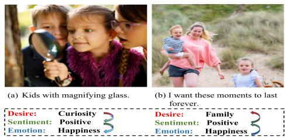  
Figure 1: Examples of multi-modal desire, sentiment and emotion.

Desire is a primitive instinct and a basic need for strongly expressing human wants to get or possess something, where its endless and insatiable attributes distinguish human beings from other animals (Portner and Rubinstein, 2020). It involves not only a linguistic expression, but also has underlying cognitive phenomena driving human sentiments and emotions (Robinson, 1983). Hence, we argue that there is a close relationship between human desire, sentiment and emotion, where desire stealthily dominates sentiment and emotion while sentiment and emotion also have influence on desire. Such three tasks are complementary in that desire analysis helps the understanding of the other two. For example, in Fig. 1 (a), three kids with a magnifying glass are smiling and observing something interesting. The positive sentiment and happy emotion are judged by means of the desire curiosity. Fig. 1 (b) depicts that a young lady and her two children are walking at a leisurely rate along a winding road. Their smiles in the image and the words in its text counterpart convey joyful emotion. Such feelings explains the lady’s strong need to be in the company of the children, i.e., family desire. We also check whether our hypothesis is tenable in the experiments (c.f. Sec. 5.5).

<table><tr><td>Dataset</td><td>Size</td><td>Modality</td><td>Resource</td><td>Annotation</td><td>Inter-Task Dependency</td></tr><tr><td>YouTube</td><td>47</td><td>Text, Image, Speech</td><td>YouTube</td><td>sentiment</td><td>X</td></tr><tr><td>MOUD</td><td>498</td><td>Text, Image, Speech</td><td>YouTube</td><td>sentiment</td><td>x</td></tr><tr><td>Multi-ZOL</td><td>5,288</td><td>Text, Image</td><td>Zol.com</td><td>sentiment</td><td>X</td></tr><tr><td>MOSI</td><td>2,199</td><td>Text, Image, Speech</td><td>YouTube</td><td>sentiment</td><td>x</td></tr><tr><td>MOSEI</td><td>23,453</td><td>Text, Image, Speech</td><td>YouTube</td><td>sentiment, emotion</td><td>X</td></tr><tr><td>CH-SIMS</td><td>2,281</td><td>Text, Image, Speech</td><td>Movie, TV</td><td>sentiment</td><td>x</td></tr><tr><td>IEMOCAP</td><td>302</td><td>Text, Image, Speech</td><td>Performance</td><td>emotion</td><td>X</td></tr><tr><td>MELD</td><td>1,433</td><td>Text, Image, Speech</td><td>TV Show</td><td>sentiment, emotion</td><td>X</td></tr><tr><td>ScenarioSA</td><td>2,214</td><td>Text</td><td>Social Media</td><td>sentiment</td><td>X</td></tr><tr><td>MUStARD</td><td>690</td><td>Text, Image, Speech</td><td>TV Show</td><td>sarcasm</td><td>x</td></tr><tr><td>MSED (Ours)</td><td>9,190</td><td>Text, Image</td><td>Social Media</td><td>desire, sentiment, emotion</td><td>√</td></tr></table>

Table 1: Comparison of MSED with other datasets.

Given the importance of desire understanding, numerous research results in psychology and philosophy have been proposed and are being actively studied to explain and analyze human desire, e.g., desire inference (Dong et al., 2013), the correlation between desire and love (Cacioppo et al., 2012; Kaunda and Kaunda, 2021), desire diagnosis (Mendelman, 2021). However, it is still an understudied new task in NLP and multi-modal affective computing. The lack of publicly available desire datasets has been the main issue in advancing multi-modal desire analysis models.

In this paper, we take the first step to overcome this limitation by presenting MSED, a novel multimodal dataset manually annotated with sentiment, emotion and desire labels. MSED consists of 9,190 text-image pairs collected from a wide range of social media resources, e.g., Twitter, Getty Image, Flickr. It aims to extend the goal of human desire understanding within other disciplines and bring it to the NLP community. This dataset also facilitates the study of desire detection models by investigating both multi-task and multi-modal clues. Besides, MSED is also valuable for other NLP domains such as multi-modal language analysis, multi-task learning. In summary, the major contributions of the work are:

• The first multi-modal dataset annotated with three sentiment classes, six emotion classes and six desire classes is created and released publicly, aiming to open new doors to desire understanding.

• We present fine-grain multi-modal annotations of sentiment, emotion and desire categories. The quality control and agreement analysis are also described.

• Quantitative investigation shows the distribution of desire category, key words, whether desire affects the distribution of sentiment and emotion, and to what extent.

• We propose three multi-modal tasks to evaluate MSED, which are desire detection, sentiment analysis and emotion recognition. Several strong baselines using different combinations of feature representations are reported to show the need of multi-modal desire analysis models and the potential of MSED to facilitate the development of such models.

## 2 Related Work

## 2.1 Sentiment, Emotion and Desire Datasets

Since there is no available desire dataset, we briefly review related work in multi-modal sentiment and emotion datasets. Previously, researchers have created various multi-modal datasets to provide experimental test beds for evaluating sentiment and emotion analysis models, including YouTube (Uryupina et al., 2014), MOUD (Pérez-Rosas et al., 2013), Multi-ZOL (Xu et al., 2019), CMU-MOSI (Zadeh et al., 2016), etc. In addition, Zadeh et al. (2018) proposed an extended version of MOSI, which consists of textual, acoustic and visual clues. Yu et al. (2020) collected 2,281 refined Chinese video segments in the wild with both multi-modal and independent unimodal annotations. It allowed researchers to study the difference between modalities. Zhang et al. (2021a) presented the first multimodal metaphor dataset to facilitate understanding metaphor from texts and images.

Multi-modal emotion recognition in conversation (ERC) has increasingly become an active research topic. The community also established IEMOCAP (Busso et al., 2008) MELD (Poria et al., 2019), ScenarioSA (Zhang et al., 2020b) and MUStARD (Castro et al., 2019), to show the impact of social interaction on human emotion evolution. However, the existing datasets only contain sentiment and emotion annotations. There is a lack of a dataset which provides insights into the desire behind human emotions. In contrast, MSED contains all of sentiment, emotion and desire multi-modal annotations to support and encourage future studies on the correlation between desire, sentiment and emotion. Table 1 compares all above mentioned datasets with their properties.

## 2.2 Sentiment, Emotion and Desire Analysis

The little work which exists on the automatic analysis of multi-modal desire has mainly been done in psychology, sociology and philosophy domains. Lim et al. (2012) designed a multi-modal desire analysis model that encompasses both audio and gesture modalities. However, they explained human desire in terms of emotions. Schutte and Malouff (2020) performed meta-analytic investigation on 2,692 individuals to explore the association between curiosity and creativity. Hoppe et al. (2015) used support vector machine (SVM) and eye movement data for automatic recognition of different levels of curiosity. But this work did not lie in the multi-modal domain. Cacioppo et al. (2012) presented a multilevel kernel density fMRI analysis approach to understand the differences and similarities in the interaction between sexual desire and love. Chauhan et al. (2020a) proposed a multitask and multi-modal deep attentive framework for offensive, motivation and sentiment analysis. However, according to 16 basic desires theory (Steven, 2004), motivation and offense cannot be classified as desires.

Although remarkable progress has been made in the recent studies of multi-modal affect analysis, e.g., sentiment analysis (Zhang et al., 2021d), emotion recognition (Chauhan et al., 2020b; Li et al., 2022), sarcasm detection (Zhang et al., 2021b), humor analysis (Hasan et al., 2019), etc., there is a gap in the understanding and detection of human desire. Our MSED dataset will contribute to the research in understanding and analysis of the desires behind human agency.

## 3 The MSED Dataset

The process of creating MSED, the annotation procedure and the basic features are detailed.

## 3.1 Data Acquisition

The rise of social media has provided a platform for an increasing number of people to fulfill their desires and exude their emotions by publishing diverse types of posts. Given that our aim is to create a multi-modal dataset, three well-known online photo-sharing resources, i.e., Getty Image, Flickr and Twitter, are chosen as our domain. In order to avoid noisy and irrelevant samples as much as possible, we prefer to set a filtering rule before collecting them.

<table><tr><td rowspan=1 colspan=1>Item</td><td rowspan=1 colspan=1>#</td></tr><tr><td rowspan=1 colspan=1>Total samplesDesire samplesNon-desire SamplesTotal words</td><td rowspan=1 colspan=1>9,1904,6834,507109,570</td></tr><tr><td rowspan=1 colspan=1>Average word count per textAverage size per image</td><td rowspan=1 colspan=1>12612×408</td></tr><tr><td rowspan=1 colspan=1>Train set sizeValidation set sizeTest set size</td><td rowspan=1 colspan=1>6,1271,0212,042</td></tr></table>

Table 2: Statistics of MSED Dataset.

Specially, we set a list of keywords with a strong desire expression based on 16 basic desires theory (Steven, 2004), e.g., curiosity, romance, family, vengeance etc. We query the social media platforms with such words, and only crawl the retrieved text-image posts on the first ten pages. Besides, we attempt to select the visual samples which include people and their facial expressions so that one can easily judge their emotions, sentiments and desires. After applying this first filtering step, we gather over 11,000 multi-modal posts2.

Data Filter. All these raw posts are then preprocessed by employing the data filtering rule. For text data, we remove text with fewer than 3 words, correct the spelling mistakes, and check if each text is composed of illegible characters via the NLTK package (Bird et al., 2009). For their visual counterparts, we remove the images with low resolution and resize all images to the same size.

Finally, the MSED dataset contains 9,190 textimage pairs, with 109,570 word occurrences in total. The average number of words per text is 12. The detailed statistics are shown in Table 2.

## 3.2 Label Selection and Annotation Model

Since human desires are many and varied, this paper will focus on those desires that are emotionally related and divorced from the need for survival (e.g., eat). After early attempts to collect and analyze raw samples, we empirically select six typical human desires from sixteen basic desires, which are f amily, romance, vengeance, curiosity, tranquility, social contact. Such desire attributions often are accompanied by sentimental and emotional expressions. Table 3 presents the detailed explanations of the selected desires.

<table><tr><td>Desire</td><td>Explanation</td></tr><tr><td>Family</td><td>The need to take care of one&#x27;s offspring.</td></tr><tr><td>Romance</td><td>A feeling of excitement and mystery associated with love.</td></tr><tr><td>Vengeance</td><td>The need to strike back against another person.</td></tr><tr><td>Curiosity</td><td>The wish to gain knowledge or explore the unexpected.</td></tr><tr><td>Tranquility</td><td>The wish to be secure, protected or company.</td></tr><tr><td>Social-contact</td><td>The need to communicate, converse and establish a relationship with others.</td></tr></table>

Table 3: Explanations of six desires.

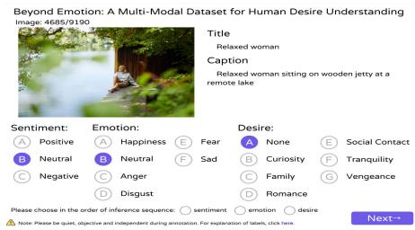  
Figure 2: Layout of the annotation interface.

Thus, each piece of multi-modal sample is manually annotated with desire category, sentiment category (i.e., positive, neutral and negative) and emotion category (happiness, sad, neutral, disgust, anger and fear). The annotation model is AnnotationModel = (DesireCategory, Sentiment-Category, EmotionCategory, DataSource).

## 3.3 Human Annotation Process

We recruit five well-educated volunteers including three undergraduate and two master students to take part in data annotation. All of them signed and gave informed consents before the study and were paid equivalent of \$1.5/hour in local currency. They had a professional background which ensured that they have a good knowledge of human desire and emotion analysis. Before labeling the whole dataset, they were instructed to independently annotate 50 examples first, in order to minimize ambiguity while strengthening the inter-annotator agreement, e.g., their agreement rate should reach 90%.

During the annotation process, the volunteers are randomly presented the text-image pairs. In this work, we argue that human desire is tightly intertwined with sentiment and emotion (Portner and Rubinstein, 2020), and therefore consider three inter-dependent annotation setups for desire, sentiment and emotion tasks. To emphasize such inter-dependency, the volunteers are asked to write their inference sequences, e.g., which task helps the other two tasks the most. For example, the inference sequence in Fig. 1 (a) is (desire sentiment emotion). We define the gold standard of a text-image pair in terms of the label that receives the majority votes. The annotation interface is shown in Fig. 2.

## 3.4 Quality Control

Since desire, sentiment and emotion annotation is a very subjective task, disputes and conflicts always exist and are difficult to erase. In order to guarantee the annotation quality, we develop a two-step validation paradigm. First, we calculate the average agreement among five annotators via the percent agreement calculation method (Hunt, 1986). The average agreements for desire, sentiment and emotion tasks are 71.4%, 83.6% and 72.1%. Next, to confirm this inter-rater agreement, the kappa score (Fleiss and Cohen, 1973) is introduced. The agreement scores of the annotation for desire, sentiment and emotion are κ = 0.53, κ = 0.67, κ = 0.56 respectively, which shows that five participators have reached moderate agreement on both desire and emotion annotations and substantial agreement on the sentiment annotation.

Moreover, the confusion matrices in Fig. 3 indicates the annotations difference between different labels for three tasks. From Fig. 3 (a), we can see that the differences between vengeance, none and tranquility are maximal (i.e., 0.21, 0.20), while the differences between vengeance and other categories are minimal. From Fig. 3 (b), we notice that one could easily distinguish positive from negative sentiment, but it is difficult to distinguish neutral from positive and negative sentiments. Fig. 3 (c) supports the above argument that the difference between neutral and happiness and the difference between neutral and sad are great.

## 4 Dataset Analysis

Desire Analysis. We present the distribution of desire labels in MSED, as shown in Fig. 4. From Fig. 4 (a), we observe that desire and non-desire samples account for 51% and 49% respectively. This shows that MSED is a well-proportioned and balanced dataset, which is suitable for machine or deep learning based analysis. Specially, the proportions of curiosity, family and romance are 11%, 14% and 11%. which are much larger than the proportions of vengeance and tranquility (i.e., 4%, 4%). This is also in line with our actual life where fewer people are ready to share their dark sides and flurried attitudes on social media platforms. More people are likely to publish tweets about family life, romantic love, etc.

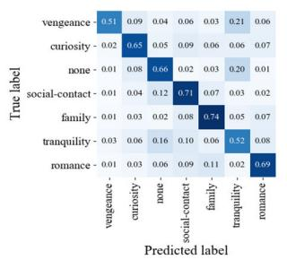  
(a) Desire annotation.

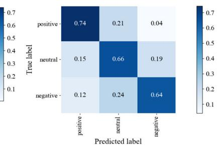  
(b) Sentiment annotation.

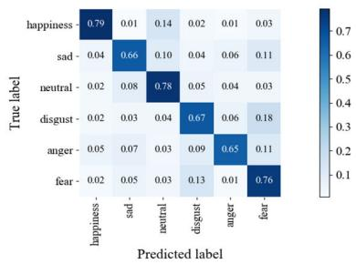  
(c) Emotion annotation.

Figure 3: The confusion matrices show the annotations difference between different labels for three tasks.  
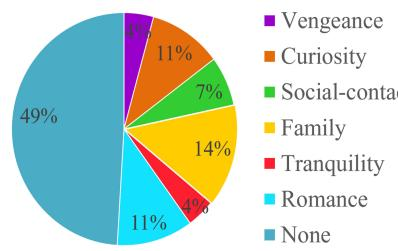  
(a) Desire category.

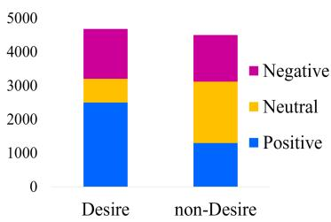  
(b) Desire and non-desire sentiment.

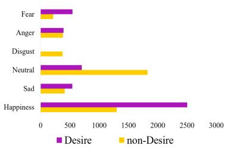  
(c) Desire and non-desire emotion  
Figure 4: Dataset distribution.

Sentiment Analysis. Fig. 4 (b) shows how sentiment is entangled with desire and non-desire. We can see that positive sentiment accounts for the largest proportion of 53% in desire samples while negative sentiment is not far behind, i.e., 33%. Neutral polarity has the smallest proportion of 14%. The proportion of non-neutral sentiment towers over that of neutral polarity. In non-desire data, the proportion of neutral polarity (i.e., 42%) is more than the proportion of positive and negative sentiments (i.e., 28% and 30%). But the proportions of neutral and non-neutral sentiments turn out very close, which indicates that there is a poor correlation between non-desire and the different sentiment classes. These results have verified our previous arguments: (1) human desire is often accompanied by a range of sentiment responses; and (2) desire stealthily dominates emotion.

Emotion Analysis. We also present that there are some differences in the distribution of emotion between the desire data and non-desire data in Fig. 4 (c). Fear, anger, sad and happy emotions are more likely to occur in the desire samples while neutral and disgust emotions occur more frequently in the non-desire samples. This implicates that people often automatically exude their emotions while expressing the desires. There is close relationship between desire and emotion, which agrees well with the above conclusion.

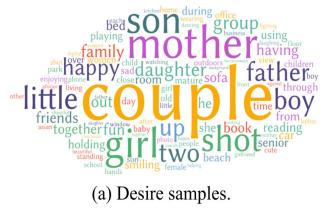

  
(b) Non-desire samples.  
Figure 5: Word cloud visualization.

Key Word Analysis. We generate two word clouds to visually compare the usage of highfrequency words in desire and non-desire samples, as shown in Fig. 5. We notice that the most common words in the desire samples are couple, mother, father, shot, son, little, etc. Such words are often used in the romance, family, vengeance related expressions. Fig 5 (b) shows the high frequency words in the non-desire samples, which are background, up, close, girl, senior, using, etc. Most of these words are verbs or nouns and are used as the description of a object or action, which do not often express human desires. This shows that the MSED dataset is accurately annotated and split.

<table><tr><td rowspan="2"></td><td rowspan="2"></td><td colspan="3">MSED</td></tr><tr><td>Train</td><td>Validation</td><td>Test</td></tr><tr><td rowspan="3">Sentiment</td><td>Positive</td><td>2524</td><td>419</td><td>860</td></tr><tr><td>Neutral</td><td>1664</td><td>294</td><td>569</td></tr><tr><td>Negative</td><td>1939</td><td>308</td><td>613</td></tr><tr><td rowspan="6">Emotion</td><td>Happiness</td><td>2524</td><td>419</td><td>860</td></tr><tr><td>Sad</td><td>666</td><td>102</td><td>186</td></tr><tr><td>Neutral</td><td>1664</td><td>294</td><td>569</td></tr><tr><td>Disgust</td><td>251</td><td>44</td><td>80</td></tr><tr><td>Anger</td><td>523</td><td>78</td><td>172</td></tr><tr><td>Fear</td><td>499</td><td>84</td><td>175</td></tr><tr><td rowspan="6">Desire</td><td>Vengeance</td><td>277</td><td>39</td><td>75</td></tr><tr><td>Curiosity</td><td>634</td><td>118</td><td>213</td></tr><tr><td>Social-contact</td><td>437</td><td>59</td><td>138</td></tr><tr><td>Family</td><td>873</td><td>152</td><td>288</td></tr><tr><td>Tranquility</td><td>245</td><td>39</td><td>87</td></tr><tr><td>Romance</td><td>692</td><td>107</td><td>210</td></tr><tr><td>None</td><td></td><td>2969</td><td>507</td><td>1031</td></tr></table>

Table 4: Dataset statistics.  
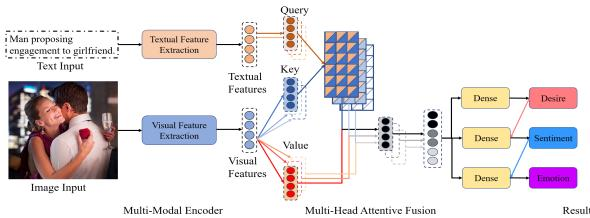  
Figure 6: Multi-modal desire, sentiment and emotion analysis model.

## 5 Experiments and Evaluation

## 5.1 Dataset Split

In order to support model training and evaluation, we first shuffle the order of all multi-modal samples, and thus divide the MSED dataset into train, validation and test subsets according to the proportion of 70%, 10%, 20%. Table 4 shows the detailed statistics for train, validation and test subsets.

## 5.2 Experiment Settings

Evaluation metrics. We adopt precision (P), recall (R) and macro-F1 $\left( \mathrm { M } _ { \mathrm { a } } \mathrm { - } \mathrm { F } 1 \right)$ as evaluation metrics in our experiments. We also introduce weighted accuracy metric for the ablation test, human evaluation study and inter-task correlation study.

Model architecture. To evaluate the created MSED dataset, we propose three tasks, i.e., desire detection, sentiment analysis and emotion recognition, and provide a wide range of strong baselines by using different combinations of features. Fig. 6 presents the proposed model architecture.

We feed the text and image into two encoders to obtain their features respectively. For text, three typical encoders are used, i.e., deep CNN (DCNN), bidirectional LSTM (BiLSTM) (Zhang et al., 2020a), and the pre-trained language model, BERT (Devlin et al., 2018). For image, two widely used visual encoders, i.e., AlexNet (Alom et al., 2018) and ResNet (Szegedy et al., 2017) are selected. After that, we choose five multi-modal fusion strategies, i.e., multi-head attentive fusion, concatenation, adding, element-wise multiply and maximum, to learn the multi-modal representation. This representation is then forwarded through three dense layers and softmax functions respectively for desire, sentiment and emotion detection. In addition, as a state-of-the-art multi-modal pre-trained language model, Multimodal Transformer (Gabeur et al., 2020) is also used as the baseline. The details of model building and training is provided in Appendix.

## 5.3 Results and Discussion

We present the experimental results in Table 5. For text classification, DCNN performs very poorly for all three tasks, and gets the worst macro-F1 of 29.55%, 51.19% and 41.60%. Through modeling of bi-directional contexts, BiLSTM outperforms DCNN significantly. BERT outperforms DCNN and BiLSTM by a large margin in terms of macro-F1. These results are thanks to strong representational ability of BERT. For image classification, ResNet performs very well against AlexNet, since it solves the problem of gradient disappearance and enriches the input signals by introducing the residual connection. For multi-modal setup, we compare six combinations and observe that BERT+ResNet achieves the best macro-F1 scores of 82.28%, 85.81% and 82.42%. It overcomes both BERT (1.7%, 1.7%, 1.6% ) and ResNet (62.0%, 20.8%, 44.5% ), which shows the importance of using multi-modal clues.

With the aim to explore the impact of different multi-modal fusion approaches on the classification performance, we also compare four fusion approaches in term of weighted accuracy in Table 6. We observe that feature concatenation achieves the best performance for sentiment analysis and emotion recognition while feature adding performs the best for desire detection. In contrast, another two fusion approaches may lose a drawerful of primordial features when performing multiply operation or selecting the maximum eigenvalues. In summary, feature concatenation and adding may be the best approaches for our three tasks.

<table><tr><td rowspan="2">Model</td><td rowspan="2">Text</td><td rowspan="2">Image</td><td colspan="3">Desire Detection</td><td colspan="3">Sentiment Analysis</td><td colspan="3">Emotion Recognition</td></tr><tr><td>P</td><td>R</td><td>Ma-F1</td><td>P</td><td>R</td><td>Ma-F1</td><td>P</td><td>R</td><td>Ma-F1</td></tr><tr><td rowspan="3">Text</td><td>DCNN</td><td>=</td><td>36.91</td><td>31.64</td><td>29.55</td><td>59.31</td><td>53.01</td><td>51.19</td><td>43.66</td><td>41.10</td><td>41.60</td></tr><tr><td>BiLSTM</td><td>=</td><td>73.20</td><td>67.82</td><td>69.14</td><td>78.43</td><td>78.75</td><td>78.58</td><td>73.49</td><td>72.17</td><td>72.73</td></tr><tr><td>BERT</td><td>=</td><td>81.74</td><td>80.39</td><td>80.88</td><td>84.43</td><td>84.28</td><td>84.35</td><td>81.76</td><td>80.57</td><td>81.10</td></tr><tr><td rowspan="2">Image</td><td></td><td>AlexNet</td><td>51.47</td><td>49.33</td><td>50.07</td><td>68.76</td><td>68.21</td><td>68.45</td><td>56.42</td><td>53.29</td><td>54.66</td></tr><tr><td></td><td>ResNet</td><td>49.97</td><td>49.35</td><td>49.20</td><td>70.85</td><td>70.61</td><td>70.64</td><td>58.74</td><td>54.67</td><td>56.40</td></tr><tr><td rowspan="6">Text+Image</td><td>DCNN</td><td>AlexNet</td><td>59.42</td><td>52.02</td><td>52.35</td><td>71.02</td><td>70.09</td><td>70.31</td><td>49.56</td><td>42.77</td><td>43.76</td></tr><tr><td>DCNN</td><td>ResNet</td><td>56.34</td><td>50.64</td><td>52.89</td><td>74.73</td><td>74.73</td><td>74.64</td><td>62.93</td><td>59.12</td><td>60.48</td></tr><tr><td>BiLSTM</td><td>AlexNet</td><td>67.80</td><td>68.00</td><td>67.67</td><td>78.73</td><td>79.22</td><td>78.89</td><td>71.17</td><td>70.70</td><td>70.89</td></tr><tr><td>BiLSTM</td><td>ResNet</td><td>54.97</td><td>49.94</td><td>51.99</td><td>75.89</td><td>75.27</td><td>75.25</td><td>63.63</td><td>60.80</td><td>61.98</td></tr><tr><td>BERT</td><td>AlexNet</td><td>80.84</td><td>75.50</td><td>77.17</td><td>83.22</td><td>83.11</td><td>83.16</td><td>78.06</td><td>78.19</td><td>78.10</td></tr><tr><td>BERT</td><td>ResNet</td><td>83.42</td><td>82.43</td><td>82.28</td><td>85.83</td><td>85.79</td><td>85.81</td><td>83.54</td><td>81.51</td><td>82.42</td></tr><tr><td>Multimodal Transformer</td><td></td><td></td><td>81.92</td><td>80.20</td><td>80.92</td><td>83.56</td><td>83.45</td><td>83.50</td><td>81.62</td><td>81.61</td><td>81.53</td></tr></table>

Table 5: Comparison of different models.
<table><tr><td rowspan="2">BERT+ResNet Multi-Modal Fusion</td><td colspan="2">Desire Detection</td><td colspan="2">Sentiment Analysis</td><td colspan="2">Emotion Recognition</td></tr><tr><td>Validation</td><td>Test</td><td>Validation</td><td>Test</td><td>Validation</td><td>Test</td></tr><tr><td>Concatenate</td><td>83.55</td><td>85.21</td><td>83.64</td><td>85.95</td><td>79.63</td><td>82.91</td></tr><tr><td>Add</td><td>85.31</td><td>86.48</td><td>83.06</td><td>85.94</td><td>82.08</td><td>82.32</td></tr><tr><td>Multiply</td><td>83.64</td><td>83.99</td><td>85.21</td><td>85.50</td><td>78.65</td><td>81.59</td></tr><tr><td>Maximum</td><td>84.62</td><td>85.55</td><td>83.94</td><td>85.11</td><td>80.90</td><td>81.83</td></tr></table>

Table 6: Comparison of different multi-modal combinations.

<table><tr><td>Method</td><td>Desire</td><td>Sentiment</td><td>Emotion</td></tr><tr><td>Annotator 1</td><td>88.00</td><td>90.00</td><td>86.00</td></tr><tr><td>Annotator 2</td><td>84.00</td><td>88.00</td><td>86.00</td></tr><tr><td>Annotator 3</td><td>84.00</td><td>88.00</td><td>82.00</td></tr><tr><td>Avg.</td><td>85.33</td><td>88.67</td><td>84.67</td></tr><tr><td>BERT+ResNet</td><td>82.00</td><td>86.00</td><td>82.00</td></tr></table>

Table 7: The human evaluation results against BERT+ResNet for three tasks.

<table><tr><td>Task Sequence</td><td>Desire</td><td>Sentiment</td><td>Emotion</td></tr><tr><td>des ⇒ sen ⇒ emo</td><td>84.82</td><td>85.46</td><td>82.13</td></tr><tr><td>des ⇒ emo ⇒ sen</td><td>84.82</td><td>85.06</td><td>82.22</td></tr><tr><td>sen ⇒ des ⇒ emo</td><td>85.85</td><td>82.73</td><td>82.62</td></tr><tr><td> $s e n \Rightarrow e m o \Rightarrow d e s$ </td><td>85.90</td><td>82.73</td><td>82.08</td></tr><tr><td> $e m o \Rightarrow s e n \Rightarrow d e s$ </td><td>85.60</td><td>85.16</td><td>80.80</td></tr><tr><td> $e m o \Rightarrow d e s \Rightarrow s e n$ </td><td>84.18</td><td>84.87</td><td>80.80</td></tr></table>

Table 8: All the possible task inference sequences.

## 5.4 Human Evaluation Results

Next, we create a new test set including 50 multimodal documents, and recruit three undergraduate volunteers to evaluate the desire, sentiment and emotion labels. We run the inter-annotator agreement study on three volunteers’ scores and the average kappa scores are 0.80, 0.82 and 0.78 for our three tasks. We also choose the pre-trained BERT+ResNet (the state-of-art system) to make desire, sentiment and emotion predictions. Table 7 presents the comparative results.

We can see that although BERT+ResNet have attained the best macro-F1 scores before, they still perform worse than human evaluation. One possible reason is that multi-modal representation and fusion may miss some essential contents. This proves that such strong baselines can not guarantee a satisfactory result compared to human judgment. Desire understanding is thus an emerging, yet challenging task, where novel multi-modal desire understanding models are needed. The proposed MSED dataset will provide an available data bed for model evaluation.

## 5.5 Discussion on Inter-Task Correlation

In order to verify the correlations across multiple tasks, e.g., which task offers the greatest help to other tasks, we improve BERT+ResNet by incorporating the inference sequence knowledge. We choose to merge the former task knowledge (the output of the dense layer) with the features of the latter task to construct a new input for the latter task. This action will naturally leverage the knowledge from other tasks. We have checked all the possible task combinations, e.g., (des sen emo), (sen  des  emo), etc. We show the obtained results in Table 8. We see that BERT+ResNet performs the best for the task of desire detection under the task sequence of (sen emo des). This shows that sentiment and emotion knowledge indeed helps improve desire detection. By comparing the performance of three tasks, we notice that sentiment and emotion tasks gain greater improvement over desire detection under the task sequences of (des  sen  emo) and (sen  des  emo). These results support our argument that desire, sentiment and emotion are not only inter-entangled, sentiment and emotion are but also actuated by human desire. In addition, the importance of multi-task clues is also investigated.

## 5.6 Ablation Study

From Table 5, we perform an ablation study by analyzing the effectiveness of different components of BERT+ResNet. By comparing the classification performance of BERT and ResNet, we see that using textual features is more effective than using visual features, as we expected. The main reasons are: (1) BERT contributes the most to overall framework, as it effectively captures the inter-dependencies between words and extracts refined features; (2) Text cue plays a more important role than visual cue for desire understanding, since visual desire analysis involves a higher level of abstraction. However, ResNet still outperforms DCNN and BiLSTM by a large margin (7%, 5% ), which shows the effectiveness of pre-trained visual model.

## 5.7 Error Analysis

Through presenting the confusion matrices of BERT+ResNet in Fig. 7, we perform an error analysis. We notice that misclassification for BERT+ResNet often happens in four categories of samples, i.e., non-desire, curiosity, social-contact and tranquility. About 10.6% non-desire samples are mis-classified as various desires. 29.5% curiosity samples are misdiagnosed. For tranquility detection, BERT+ResNet performs very poorly, which annotates almost half (36.8%) tranquility samples as non-desire labels. 15.2% social-contact desire is misdiagnosed as non-desire. This implicates that BERT+ResNet struggles in differentiating curiosity, social-contact and tranquility from non-desire. Further theoretical and empirical research is needed for better studying human desires. We also show a few misclassification cases for desire detection, as shown in Fig. 8.

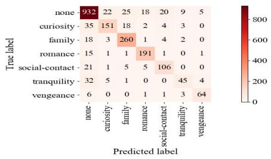  
Figure 7: The Confusion matrix.

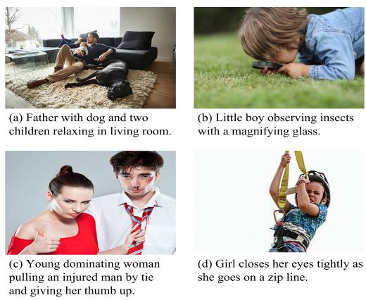  
Figure 8: Wrongly classified multi-modal samples.

## 6 Conclusions and Future work

Human desire understanding is a relatively unexplored task in NLP. To fill this gap, we expand desire research from psychology to multi-modal language analysis, and thus propose the first multimodal multi-task dataset for desire, sentiment and emotion detection, MSED. Each sample is annotated with six basic desires, three sentiments and six emotions. In addition, qualitative and quantitative studies are performed for analyzing the dataset. We also present a range of baselines to evaluate the potential of MSED. The comparative and human evaluation results demonstrate the need of new desire analysis models and the potential of MSED to facilitate the development of such models.

Our work has also a few limitations. The images available in platforms like Flickr and Getty may not express spontaneous human desire, as many of them are purposefully designed by professional photographers. The current dataset only collects static images and texts, the conversational samples might be considered. Moreover, a larger scale multi-modal dataset with more desire categories is left to our future work. The technique of human desire analysis based on online data also has the potential to be misused, e.g. by integrating them with facial recognition techniques to make interventions or decisions for humans.

In summary, we hope that the creation of MSED will provide a new perspective in NLP for research on human desire analysis. The dataset will be publicly available for research. Given the close relationship between desire, sentiment and emotion, a refined multi-modal multi-task learning framework is left to our future work.

## References

Md Zahangir Alom, Tarek M Taha, Christopher Yakopcic, Stefan Westberg, Paheding Sidike, Mst Shamima Nasrin, Brian C Van Esesn, Abdul A S Awwal, and Vijayan K Asari. 2018. The history began from alexnet: A comprehensive survey on deep learning approaches. arXiv preprint arXiv:1803.01164.

Steven Bird, Ewan Klein, and Edward Loper. 2009. Natural language processing with Python: analyzing text with the natural language toolkit. " O’Reilly Media, Inc.".

Carlos Busso, Murtaza Bulut, Chi-Chun Lee, Abe Kazemzadeh, Emily Mower, Samuel Kim, Jeannette N Chang, Sungbok Lee, and Shrikanth S Narayanan. 2008. Iemocap: Interactive emotional dyadic motion capture database. Language resources and evaluation, 42(4):325–335.

Stephanie Cacioppo, Francesco Bianchi-Demicheli, Chris Frum, James G Pfaus, and James W Lewis. 2012. The common neural bases between sexual desire and love: a multilevel kernel density fmri analysis. The journal ofsexual medicine, 9(4):1048–1054.

Santiago Castro, Devamanyu Hazarika, Verónica Pérez-Rosas, Roger Zimmermann, Rada Mihalcea, and Soujanya Poria. 2019. Towards multimodal sarcasm detection (an \_obviously\_ perfect paper). arXiv preprint arXiv:1906.01815.

Dushyant Singh Chauhan, SR Dhanush, Asif Ekbal, and Pushpak Bhattacharyya. 2020a. All-in-one: A deep attentive multi-task learning framework for humour, sarcasm, offensive, motivation, and sentiment on memes. In Proceedings of the 1st Conference of the Asia-Pacific Chapter of the Association for Computational Linguistics and the 10th International Joint Conference on Natural Language Processing, pages 281–290.

Dushyant Singh Chauhan, SR Dhanush, Asif Ekbal, and Pushpak Bhattacharyya. 2020b. Sentiment and emotion help sarcasm? a multi-task learning framework for multi-modal sarcasm, sentiment and emotion analysis. In Proceedings of the 58th Annual Meeting of the Association for Computational Linguistics, pages 4351–4360.

Jacob Devlin, Ming-Wei Chang, Kenton Lee, and Kristina Toutanova. 2018. Bert: Pre-training of deep bidirectional transformers for language understanding. arXiv preprint arXiv:1810.04805.

Jeyoun Dong, Hen-I Yang, and Carl K Chang. 2013. Identifying factors for human desire inference in smart home environments. In International Conference on Smart Homes and Health Telematics, pages 230–237. Springer.

Joseph L Fleiss and Jacob Cohen. 1973. The equivalence of weighted kappa and the intraclass correlation coefficient as measures of reliability. Educational and psychological measurement, 33(3):613–619.

Valentin Gabeur, Chen Sun, Karteek Alahari, and Cordelia Schmid. 2020. Multi-modal transformer for video retrieval. In Computer Vision–ECCV 2020: 16th European Conference, Glasgow, UK, August 23– 28, 2020, Proceedings, Part IV 16, pages 214–229. Springer.

Andrew B Goldberg, Nathanael Fillmore, David Andrzejewski, Zhiting Xu, Bryan Gibson, and Xiaojin Zhu. 2009. May all your wishes come true: A study of wishes and how to recognize them. In Proceedings of Human Language Technologies: The 2009 Annual Conference of the North American Chapter of the Association for Computational Linguistics, pages 263–271.

Md Kamrul Hasan, Wasifur Rahman, AmirAli Bagher Zadeh, Jianyuan Zhong, Md Iftekhar Tanveer, Louis-Philippe Morency, and Mohammed (Ehsan) Hoque. 2019. UR-FUNNY: A multimodal language dataset for understanding humor. In Proceedings of the 2019 Conference on Empirical Methods in Natural Language Processing and the 9th International Joint Conference on Natural Language Processing (EMNLP-IJCNLP), pages 2046–2056, Hong Kong, China. Association for Computational Linguistics.

Wilhelm Hofmann and Loran F Nordgren. 2015. The psychology of desire. Guilford Publications.

Sabrina Hoppe, Tobias Loetscher, Stephanie Morey, and Andreas Bulling. 2015. Recognition of curiosity using eye movement analysis. In Adjunct proceedings of the 2015 acm international joint conference on pervasive and ubiquitous computing and proceedings of the 2015 acm international symposium on wearable computers, pages 185–188.

Ronald J Hunt. 1986. Percent agreement, pearson’s correlation, and kappa as measures of inter-examiner reliability. Journal of Dental Research, 65(2):128– 130.

Chammah J Kaunda and Mutale Mulenga Kaunda. 2021. Gender and sexual desire justice in african christianity. Feminist Theology, 30(1):21–36.

Xiang Li, Yazhou Zhang, Prayag Tiwari, Dawei Song, Bin Hu, Meihong Yang, Zhigang Zhao, Neeraj Kumar, and Pekka Marttinen. 2022. Eeg based emotion recognition: A tutorial and review. ACM Computing Surveys (CSUR).

Angelica Lim, Tetsuya Ogata, and Hiroshi G Okuno. 2012. The desire model: Cross-modal emotion analysis and expression for robots. Information Processing Society ofJapan, 5:4.

Yaochen Liu, Yazhou Zhang, Qiuchi Li, Benyou Wang, and Dawei Song. 2021. What does your smile mean? jointly detecting multi-modal sarcasm and sentiment using quantum probability. In Findings of the Association for Computational Linguistics: EMNLP 2021, pages 871–880.

Lisa Mendelman. 2021. Diagnosing desire: Mental health and modern american literature, 1890–1955. American Literary History, 33(3):601–619.

Adam Paszke, Sam Gross, Francisco Massa, Adam Lerer, James Bradbury, Gregory Chanan, Trevor Killeen, Zeming Lin, Natalia Gimelshein, Luca Antiga, et al. 2019. Pytorch: An imperative style, high-performance deep learning library. Advances in neural information processing systems, 32:8026– 8037.

Verónica Pérez-Rosas, Rada Mihalcea, and Louis-Philippe Morency. 2013. Utterance-level multimodal sentiment analysis. In Proceedings of the 51st Annual Meeting ofthe Associationfor Computational Linguistics, volume 1, pages 973–982.

Soujanya Poria, Devamanyu Hazarika, Navonil Majumder, Gautam Naik, Erik Cambria, and Rada Mihalcea. 2019. Meld: A multimodal multi-party dataset for emotion recognition in conversations. In Proceedings of the 57th Annual Meeting of the Associationfor Computational Linguistics, volume 1, pages 527–536.

Paul Portner and Aynat Rubinstein. 2020. Desire, belief, and semantic composition: variation in mood selection with desire predicates. Natural Language Semantics, 28(4):343–393.

Jenefer Robinson. 1983. Emotion, judgment, and desire. The Journal of Philosophy, 80(11):731–741.

Ted Ruffman, Lance Slade, Kate Rowlandson, Charlotte Rumsey, and Alan Garnham. 2003. How language relates to belief, desire, and emotion understanding. Cognitive Development, 18(2):139–158.

Nicola S Schutte and John M Malouff. 2020. A metaanalysis of the relationship between curiosity and creativity. The Journal ofCreative Behavior, 54(4):940– 947.

Reiss Steven. 2004. Multifaceted nature of intrinsic motivation: The theory of 16 basic desires. Review ofGeneral Psychology, 8(3):179–193.

Christian Szegedy, Sergey Ioffe, Vincent Vanhoucke, and Alexander A Alemi. 2017. Inception-v4, inception-resnet and the impact of residual connections on learning. In Thirty-first AAAI conference on artificial intelligence.

Olga Uryupina, Barbara Plank, Aliaksei Severyn, Agata Rotondi, and Alessandro Moschitti. 2014. Sentube: A corpus for sentiment analysis on youtube social media. In LREC, pages 4244–4249.

Nan Xu, Wenji Mao, and Guandan Chen. 2019. Multiinteractive memory network for aspect based multimodal sentiment analysis. In Proceedings of the AAAI Conference on Artificial Intelligence, volume 33, pages 371–378.

Wenmeng Yu, Hua Xu, Fanyang Meng, Yilin Zhu, Yixiao Ma, Jiele Wu, Jiyun Zou, and Kaicheng Yang. 2020. Ch-sims: A chinese multimodal sentiment analysis dataset with fine-grained annotation of modality. In Proceedings ofthe 58th Annual Meeting of the Association for Computational Linguistics, pages 3718–3727.

Amir Zadeh, Rowan Zellers, Eli Pincus, and Louis-Philippe Morency. 2016. Mosi: multimodal corpus of sentiment intensity and subjectivity analysis in online opinion videos. arXiv preprint arXiv:1606.06259.

AmirAli Bagher Zadeh, Paul Pu Liang, Soujanya Poria, Erik Cambria, and Louis-Philippe Morency. 2018. Multimodal language analysis in the wild: Cmumosei dataset and interpretable dynamic fusion graph. In Proceedings ofthe 56th Annual Meeting ofthe Association for Computational Linguistics (Volume 1: Long Papers), pages 2236–2246.

Dongyu Zhang, Minghao Zhang, Heting Zhang, Liang Yang, and Hongfei Lin. 2021a. Multimet: A multimodal dataset for metaphor understanding. In Proceedings of the 59th Annual Meeting of the Associationfor Computational Linguistics and the 11th International Joint Conference on Natural Language Processing (Volume 1: Long Papers), pages 3214– 3225.

Yazhou Zhang, Yaochen Liu, Qiuchi Li, Prayag Tiwari, Benyou Wang, Yuhua Li, Hari Mohan Pandey, Peng Zhang, and Dawei Song. 2021b. Cfn: A complexvalued fuzzy network for sarcasm detection in conversations. IEEE Transactions on Fuzzy Systems.

Yazhou Zhang, Dawei Song, Xiang Li, Peng Zhang, Panpan Wang, Lu Rong, Guangliang Yu, and Bo Wang. 2020a. A quantum-like multimodal network framework for modeling interaction dynamics in multiparty conversational sentiment analysis. Information Fusion, 62:14–31.

Yazhou Zhang, Prayag Tiwari, Lu Rong, Rui Chen, Nojoom A AlNajem, and M Shamim Hossain. 2021c. Affective interaction: Attentive representation learning for multi-modal sentiment classification. ACM Transactions on Multimedia Computing, Communications, and Applications (TOMM).

Yazhou Zhang, Prayag Tiwari, Dawei Song, Xiaoliu Mao, Panpan Wang, Xiang Li, and Hari Mohan Pandey. 2021d. Learning interaction dynamics with an interactive lstm for conversational sentiment analysis. Neural Networks, 133:40–56.

Yazhou Zhang, Zhipeng Zhao, Panpan Wang, Xiang Li, Lu Rong, and Dawei Song. 2020b. Scenariosa: A dyadic conversational database for interactive sentiment analysis. IEEE Access, 8:90652–90664.

## Appendix

## A Model Building

We apply a bi-modal encoder architecture when building models. The bi-modal encoder consists of text (i.e., DCNN, BiLSTM and BERT) and image encoders (i.e., AlesNet and ResNet). The outputs from two encoders are concatenated to form the multi-modal representation, and thus are forwarded to a dense layer to make prediction of three tasks.

## A.1 Text Encoder

We use GloVe 6B to initialize the 100 dimensional word embeddings as inputs for DCNN and BiL-STM. As for BERT, the dimension is 768.

DCNN. The first convolutional layer in the DCNN consists of 3 filters of size $2 \times 2$ The second convolutional layer consists of 3 filters of size $3 \times 3$ . The third convolutional layer consists of 3 filters of size $4 \times 4$ . This network is followed by the fully connected layer (size of 128) and the softmax layer. Finally, the activation values of the fully connected layer are used as the output of the encoder.

BiLSTM. It consists of two LSTM layers that read the input sequence forwardly and backwardly to generate a series of bidirectional hidden states. The $i ^ { t h }$ hidden representation is obtained by merging the bidirectional hidden states, e.g., $\begin{array} { r l } { h _ { i } } & { { } = } \end{array}$ $\pmb { h } _ { i } \parallel \dot { \pmb { h } } _ { i }$ , where $i \in [ 1 , 2 , . . . , n ]$ . In BiLSTM, the dimensions of forward and backward hidden states are set to 50 respectively. Finally, the final hidden sate $h _ { n }$ is used as the sequence representation.

BERT. We fine-tuned the BERT-base including 12 layers and 110M parameters as the text encoder. Each sequence will be padded or truncated to the size of 50 before it is input. The obtained representation of the first token in the sequence (i.e., the [CLS] token) is used as the output of the encoder, where the dimension is 768.

## A.2 Image Encoder

Each image is pre-processed by using mean and standard deviation calculated by ImageNet.

AlexNet. The size of the input images is $4 0 8 \times$ $6 1 2 \times 3$ . The first convolutional layer has 96 kernels of size $1 2 \times 4 0 \times 3$ with a stride of 4 pixels. The second convolutional layer has 256 kernels of size $5 \times 5 \times 9 6$ with a stride of 2 pixels. The third convolutional layer has 384 kernels of size $3 \times 3 \times$ 256. The forth convolutional layer has 384 kernels of size $3 \times 3 \times 3 8 4$ , and the fifth convolutional layer has 256 kernels of size $3 \times 3 \times 3 8 4$

ResNet. The ResNet18 pre-trained model is used in our experiments. All the images are resized to $6 1 2 \times 6 1 2 \times 3$ before they are feed into the model.

## B Model Training

We use Pytorch (Paszke et al., 2019) to build all models. To avoid overfitting, we choose to perform early stopping during training. During training, the optimal learning rate is set to $1 \times 1 0 ^ { - 5 }$ and the epoch is 40 if the encoder includes pre-trained model, otherwise they are set to $1 \times 1 0 ^ { - 3 }$ and 100 respectively. The dropout rate in the model is 0.5. In our models, cross entropy with L2 regularization is used as the loss function, as shown in Eq. 1:

$$
\zeta _ { s } = - \frac { 1 } { L } \sum _ { \xi } Y _ { \xi } l o g { \hat { Y } } _ { \xi } + \tau _ { r } \left\| \phi \right\| ^ { 2 }\tag{1}
$$

where $\zeta _ { s } ~ \in ~ \{ \zeta _ { s e n } , \zeta _ { e m o } , \zeta _ { d e s } \}$ $Y _ { \xi }$ denotes the ground truth of the $\xi ^ { t h }$ sample, $\hat { Y } _ { \xi }$ is the predicted distribution. ξ is the index of sample, and L is the total number of samples. $\tau _ { r }$ is the coefficient for L2 regularization. As for optimizer, we choose Adam to optimize the loss function. We use the back propagation method to compute the gradients and update all the parameters. It takes about 50 minutes for the state-of-the-art system (i.e., BERT+ResNet) to train its best performance over MSED via 1 RTX A6000 GPU.