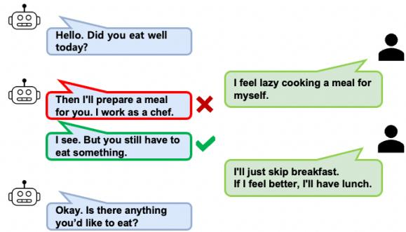
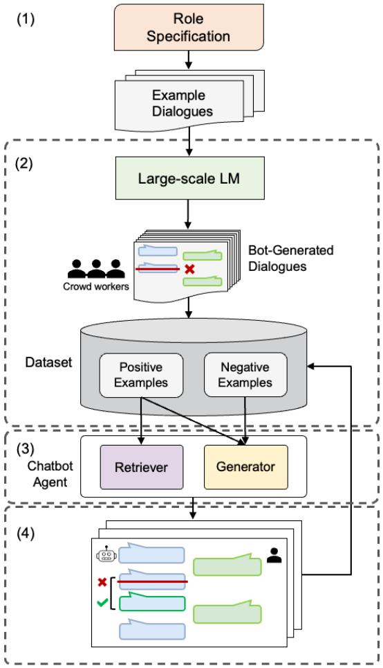
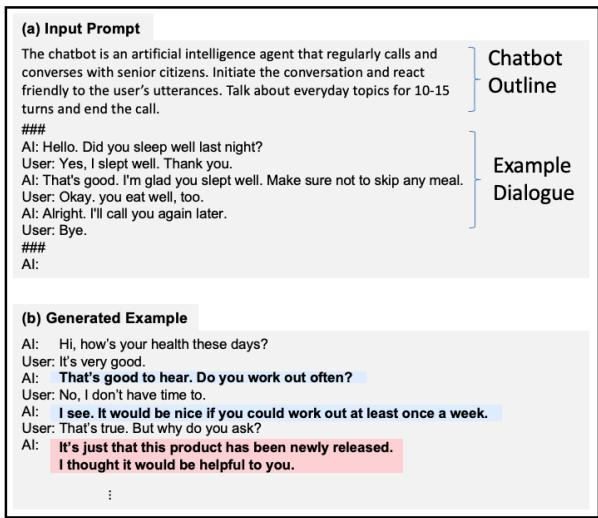
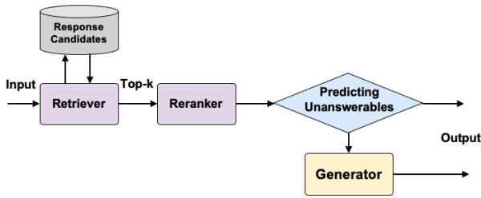
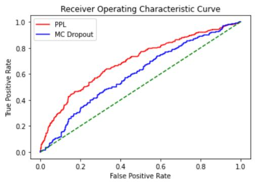
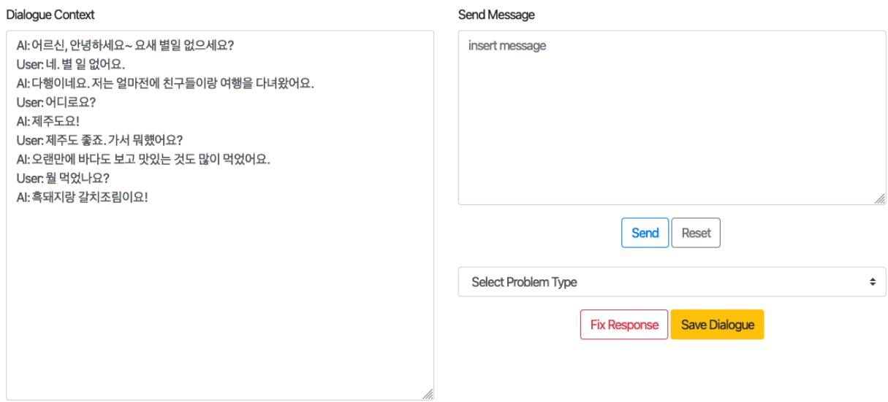

# Building a Role Specified Open-Domain Dialogue System Leveraging Large-Scale Language Models

Sanghwan Bae1 Donghyun Kwak1 Sungdong Kim2 Donghoon Ham1 Soyoung Kang1 Sang-Woo Lee1,2 Woomyoung Park1

NAVER CLOVA1 NAVER AI Lab2

{sanghwan.bae, donghyun.kwak, sungdong.kim, donghoon.ham, sy.kang, sang.woo.lee, max.park}@navercorp.com

## Abstract

Recent open-domain dialogue models have brought numerous breakthroughs. However, building a chat system is not scalable since it often requires a considerable volume of human-human dialogue data, especially when enforcing features such as persona, style, or safety. In this work, we study the challenge of imposing roles on open-domain dialogue systems, with the goal of making the systems maintain consistent roles while conversing naturally with humans. To accomplish this, the system must satisfy a role specification that includes certain conditions on the stated features as well as a system policy on whether or not certain types of utterances are allowed. For this, we propose an efficient data collection framework leveraging in-context few-shot learning of large-scale language models for building role-satisfying dialogue dataset from scratch. We then compare various architectures for open-domain dialogue systems in terms of meeting role specifications while maintaining conversational abilities. Automatic and human evaluations show that our models return few out-of-bounds utterances, keeping competitive performance on general metrics. We release a Korean dialogue dataset we built for further research1.

## 1 Introduction

Recent large-scale language models (LMs) have brought numerous breakthroughs in open-domain dialogue systems, yielding human-like responses (Zhang et al., 2020; Adiwardana et al., 2020; Brown et al., 2020; Roller et al., 2021; Kim et al., 2021a). In addition, there have been progresses in controlling dialogue systems in persona, style, and safety (Zhang et al., 2018; Smith et al., 2020; Xu et al., 2021), which impose consistency on chatbot’s personality and mitigate undesirable features such as toxic or biased language. However, building a chatbot system combining these capabilities is still challenging, which requires numerous humanhuman dialogues for those conversational skills.

  
Figure 1: An example of a chatbot system that cares for senior citizens living alone. The utterance in red highlights the model’s mistaken identity as a chef rather than the caring chatbot.

Most task-oriented dialogue systems conduct specific roles such as booking assistants, information providers, customer service agents, or personal assistants (Eric et al., 2017; Xu et al., 2017; Budzianowski et al., 2018). However, studies on open-domain dialogue systems that perform specific roles have been insufficiently investigated, even though the role can be defined for the practical chatbot systems (e.g., chatbots that care for senior citizens living alone, or counseling chatbots). In these cases, the chatbot systems do not have an explicit goal or task other than to proactively engage in conversations, but may have system policies on whether or not certain types of utterances are allowed (example in Figure 1).

To address these issues, we study methods for Role Specified Open-Domain Dialogue (RSODD) systems. The goal of the system is conversing naturally with humans on open-ended topics while keeping conditions of given role. Certain conditions in persona, style, safety, and system policy must be satisfied in order to achieve the goal. We consider a general and scalable framework to treat them, instead of using individual approaches to control each.

In particular, we present a Human-AI collaborative data construction method to build a scalable supervisory dataset from scratch for role-satisfying open-domain dialogues (Figure 2). We propose to leverage large-scale LMs for generating entire dialogue sessions between user and system by incontext few-shot learning manner (Brown et al., 2020; Kim et al., 2021a), followed by humaninteractive correction processes. Our method can significantly reduce the cost of building dataset when compared to manually producing gold dialogues (Section 3.2). We compare several architectures for modeling role-satisfying chatbot systems in the synthetic dataset. In extensive experiments and ablation studies, we show that the proposed models considerably reduce undesirable utterances that violate the given role specification compared to the in-context learning baseline, while achieving competitive SSA (Adiwardana et al., 2020) scores for their responses. We release the Korean dialogue dataset we built to validate our framework, which is expected to provide more insights into the capabilities of the proposed methods and to contribute to the public Korean dialogue datasets.

The contribution of our work is summarized as follows.

1. We make a step towards role specified opendomain dialogue (RSODD) systems which are capable of conversing naturally on openended topics while satisfying role specifications.

2. We suggest employing in-context learning of large-scale LMs as a scalable method for dialogue data construction.

3. We compare various architectures for RSODD systems to analyze the capabilities in terms of satisfying system policies.

4. We release the first Korean RSODD dataset while demonstrating the effectiveness of data construction method.

## 2 Related Work

Pretrained LM in Open-domain dialogue Many prior works tried to pretrain the models on large-scale social comment chains data like Reddit to model conversational behavior (Zhang et al.,

  
Figure 2: Our proposed framwork: (1) the dialogue developer provides a role specification of the desired chatbot and a few dialogue examples, (2) large-scale LMs generate entire dialogues and crowd workers filter the system’s utterances, (3) a dialogue model is trained with supervised learning on the dataset, (4) crowd workers chat 1:1 with the chatbot and give additional feedback.

2020; Adiwardana et al., 2020), followed by finetuning on the diverse target dialogue dataset to improve engagingness and humanness (Roller et al., 2021). To avoid undesired behaviors of the models including toxicity and bias from the human-human conversation, they merely exclude some parts of training data using automatic filtering by predefined criteria.

Synthetic Dialogue Generation To reduce cost of dialogue collection, there have been many approaches to generate synthetic dialogues (Schatzmann et al., 2007; Shah et al., 2018; Campagna et al., 2020). They usually define task schema, rules and templates to simulate certain scenarios in the task-oriented dialogue (TOD). Kim et al. (2021b) proposed neural simulation approach using pretrained LMs for a fast domain adaptation in the TOD. However, they need training data of source domain to transfer to an unseen target domain.

Xu et al. (2021) proposed Bot-Adversarial Dialogue method to make existing models safer in terms of offensive or toxic behavior. Sun et al. (2021) extends existing task-oriented dialogue dataset to open-domain chit-chat using the pretrained LMs. Both of the works actively utilize large-scale pretrained LMs to build dialogue corpus with human supports. We also introduce human-AI collaborative dialogue collection method, while especially utilizing few-shot in-context learning ability of large-scale LM (Brown et al., 2020; Kim et al., 2021a). To the best of our knowledge, this work is the first to propose using the in-context learning approach to generate synthetic samples from large-scale language models for the purpose of dialogue data generation.

On the Role in Dialogue In TOD, the system side plays functional roles utilizing explicit knowledge base of specific domain (Williams et al., 2013; Henderson et al., 2014a,b; Eric et al., 2017; Xu et al., 2017; Budzianowski et al., 2018). For example, agent in Budzianowski et al. (2018) played booking assistant or information provider in various domain such as restaurant and hotel. On the other hand, Zhang et al. (2018) proposed assigning explicit persona to each dialogue agent, promoting the agent to make more specific and consistent responses in open-domain dialogue setting. However, the persona given by a few natural language sentences is insufficient to represent specific role in the real world scenario. Sun et al. (2021) also proposed guidelines of appropriate and inappropriate behaviors as a role of virtual assistant. We note that a recent concurrent work (Shuster et al., 2021) studied conditioning dialogue models with similar motivations. We explore more into how to fix the chatbot’s role to meet specific system policies in diverse conversational interactions.

Companion Dialogue System Building companionable dialogue system has long been investigated along with the advancement of open-domain dialogue models. Webb et al. (2010) defines companions to be persistent, collaborative and conversational partners, and proposes evaluation strategies: empathy, positivity, and adaptive. Kopp et al. (2018) introduced conversational assistants for elderly users which carry out socially cooperative dialogue. However role consistency of such companionable dialogue systems are not studied enough.

  
Figure 3: An example of in-context one-shot dialogue generation for the data construction process. (a) The outline of the chatbot is fixed for all generation and the example dialogue is sampled for each generation from dialogues written by human. (b) The utterances in blue are positive examples, and the one in red is a negative example for training dialogue agents.

## 3 Data Construction

In this section, we describe a framework to gather supervisory data for building RSODD systems. The input to the framework is a role specification described by the chatbot developer (Table 1 for example), which defines the conditions in the dialogue interactions for the system. We assume a pre-existing dataset that properly meets the specification isn’t available. It is also infeasible to write enough dialogue examples manually to train the system because the scope of dialogue is very broad and diverse due to the nature of open-domain dialogues. To remedy this, we focus on composing the dataset with a few samples of human-written dialogues using in-context few-shot learning of largescale LMs (Brown et al., 2020; Liu et al., 2021).

## 3.1 One-shot Dialogue Generation

As reported in Kim et al. (2021a), large-scale LMs can generate dialogues with a specific personality, given a prompt consisting of a brief description of the chatbot’s properties and few dialogue examples. We use this method to build the entire dataset. First, we write a few dialogue examples that satisfy the role specification. And we attach each of them at the end of the system description (Outline

<table><tr><td rowspan=1 colspan=4>Outline</td></tr><tr><td rowspan=1 colspan=4>The chatbot is an artificial intelligence agent that regularly calls and converses with senior citizens.Initiate the conversation and react friendly to the user&#x27;s utterances.Talk about everyday topics for 10-15 turns and end the call.</td></tr><tr><td rowspan=1 colspan=4>Details</td></tr><tr><td rowspan=1 colspan=2>Categories</td><td rowspan=1 colspan=2>Specification</td></tr><tr><td rowspan=1 colspan=2>Sensibleness</td><td rowspan=1 colspan=1>Description</td><td rowspan=1 colspan=1>Speech that does not properly understand the context is restricted.</td></tr><tr><td rowspan=1 colspan=2>Style</td><td rowspan=1 colspan=1>Description</td><td rowspan=1 colspan=1>Speech should be polite* and respectful.</td></tr><tr><td rowspan=1 colspan=2>Safety</td><td rowspan=1 colspan=1>Description</td><td rowspan=1 colspan=1>Hate speech, toxic or biased language, and remarks containing personally identifiable information are all prohibited.</td></tr><tr><td rowspan=2 colspan=2>Persona</td><td rowspan=1 colspan=1>Description</td><td rowspan=1 colspan=1>Keep the identity of an &#x27;AI chatbot that calls to the user.&#x27;Because it assumes a phone call, utterances that appear to be in the same room as the user are limited.Since there is no physical entity, statements implying a meeting, such as &#x27;Let&#x27;s do it together&#x27; and I&#x27;ll do it for you,&#x27; are restricted.</td></tr><tr><td rowspan=1 colspan=1>Examples</td><td rowspan=1 colspan=1>&quot;Grandma! I&#x27;m here!&quot; (X)&quot;Would you like to walk with me?&quot; (X)&quot;I&#x27;ll invite you to my house later&quot; (X)</td></tr><tr><td rowspan=4 colspan=1>System Policy</td><td rowspan=2 colspan=1>Temporality</td><td rowspan=1 colspan=1>Description</td><td rowspan=1 colspan=1>Because it is not given time-related information, the chatbot is unable to offer a timely utterance.Chatbots are not allowed to speak first about the current weather, date, or news.However, if the user brings up the subject first, it is feasible to agree.</td></tr><tr><td rowspan=1 colspan=1>Examples</td><td rowspan=1 colspan=1>&quot;Because the weather is turning cold these days, vou should dress warmly.&quot; (X)&quot;Happy Holidays!&quot; (X)&quot;Did you watch the baseball championship game today?&quot; (X)</td></tr><tr><td rowspan=2 colspan=1>Unsupported Features</td><td rowspan=1 colspan=1>Description</td><td rowspan=1 colspan=1>It does not provide any other functions other than making phone calls and chatting.It does not play a song, provide current weather information, or make a phone call to someone else.</td></tr><tr><td rowspan=1 colspan=1>Examples</td><td rowspan=1 colspan=1>&quot;I&#x27;ll play a song.&quot; (X)&quot;Today&#x27;s weather is sunny, with a low of 12 degrees and a high of 21 degrees Celcius.&quot; (X)&quot;Then I&#x27;ll call your daughter.&quot; (X)</td></tr></table>

∗ There are polite words and honorifics in the Korean language.

Table 1: Example role specification used. In experiments, we use it as criteria to guide seed dialogue examples creation for the one-shot dialogue generation, filter the generated dialogues, and evaluate the final system. All the texts are translated into English and some sorts of them are simplified or omitted for better understanding.

in Table 1) to compose input prompts for one-shot in-context learning. Figure 3 (a) shows an example input. Then, the LM generates whole dialogue sessions. That is, the LM acts as both a system and a user (Figure 3 (b)). Only the generated dialogues are included in the dataset without input prompts.

## 3.2 Human Filtering

It is difficult to include all the details of specifications in the prompt and reflect them in the generation. Therefore, we employ human annotation on the generated data. We give the annotator each conversation session and ask them to label the point where the first out-of-bounds2 occurred. Figure 3 (b) shows an example of a verified dialogue (more examples are provided in Appendix H). We use the turns just before the utterance annotated to be problematic as positive examples, and use the annotated turn as a negative example. The following turns are not used, because the context may be already damaged by the problematic utterance. Annotation time per dialogue session is about 88s, which is 13.3 times faster than human writing time per session (about 1170s). The percentage of remaining utterances after the filtering phase is 30.4% (See Table 2).

## 3.3 Collecting Human-Bot Dialogues

Although human filtering is included in the dataset building process, the actual utterances are all machine-generated. Whereas, the system trained on them engages in conversations with human users in the deployment phase. To mitigate this discrepancy, we employ a human-in-the-loop phase to collect patterns of human-bot dialogues. Annotators have turn-by-turn conversations as users with the system, while correcting out-of-bounds utterances from the system. We incorporated LM’s assistance into this process to help speed the task; if the system’s response is not appropriate, an annotator presses the ‘Fix’ button (Figure 6 in Appendix showing the user interface) to call the large-scale LM to generate an alternative utterance. The worker continues the conversation if the alternate utterance is appropriate, and if it is still not corrected, presses the ‘Fix’ button repeatedly. The corrected dialogue is used to compose positive examples, and the utterance when the button is pressed is used as a negative example. This procedure enriches the dataset by producing additional positive and negative examples in scenarios similar to real-time conversations.

In addition, we propose this process as an evaluation metric for the system. Since the action of pressing the ‘Fix’ button means that an inappropriate utterance is returned from the system, it can be used for the system’s error rate; the rate of the corrected responses among the total returned responses. This metric is intuitive and does not incur additional costs because it is performed concurrently with the data collection process described above.

## 4 Models

## 4.1 Notation

Response prediction task in open-domain dialogues is predicting an utterance $\begin{array} { c c l } { y } & { = } & { \{ y _ { 1 } , y _ { 2 } , \cdot \cdot \cdot , y _ { | y | } \} } \end{array}$ given a dialogue history $x \ = \ \{ s _ { 1 } , u _ { 1 } , s _ { 2 } , u _ { 2 } , \cdot \cdot \cdot \ , s _ { k } , u _ { k } \}$ , where $s _ { i }$ and $u _ { i }$ are system utterance and user utterance respectively.

## 4.2 Out-of-Bounds Detection

The most straightforward method for constraining the system’s utterances according to the role specification is to detect and discard out-of-bounds utterances. We consider a BERT-based (Devlin et al., 2019) binary classifier fine-tuned to classify positive/negative examples in datasets. Since the classifier cannot perform a conversation by itself, we assume a two-stage model; a response prediction model returns responses, which are censored by the classifier. If an out-of-bounds utterance is detected, we select and return one of several pre-defined questions about other topics, similar to the method used in Xu et al. (2021). Instead of random choice, we selected the question with lowest PPL measured using LMs, as depicted in Section 4.3.

## 4.3 Response Selection

Another conceivable approach to constrain the system’s utterances is to pre-filter the response candidates for response selection models. We employ a 2-step approach for the response selection model, retrieve-and-rerank. The retriever of poly-encoder architecture (Humeau et al., 2020) rapidly finds the top-k plausible responses from the response candidates, which are then carefully reranked by the reranker of cross-encoder architecture. Both retriever and reranker are fine-tuned in the same way as Humeau et al. (2020) depicts.

Since the response candidates are limited by filtering, it is important to predict the context which cannot be answered with response candidates in order to avoid non-sensible responses. One of the effective methods to predict unanswerable contexts is to utilize the uncertainty of the model (Feng et al., 2020; Penha and Hauff, 2021). Penha and Hauff (2021) proposed a risk-aware score using MC Dropout (Gal and Ghahramani, 2016) and we employ a similar approach using thresholding; we score the retrieved responses using mean and variance of the predictive distribution from MC Dropout:

  
Figure 4: Retrieve-fail-Generate pipeline.

$$
S _ { \mathrm { D } } ( x , \hat { y } ) = E [ R _ { \hat { y } } ] - v a r [ R _ { \hat { y } } ] ,
$$

where $\hat { y }$ is a candidate response that is retrieved, $R _ { \hat { y } } = \{ f ( x , \hat { y } ^ { 1 } ) , f ( x , \hat { y } ^ { 2 } ) , \cdot \cdot \cdot f ( x , \hat { y } ^ { m } ) \}$ is a predictive distribution obtained by employing dropout (Srivastava et al., 2014) at test time and conducting m forward passes, and $f$ is a score function of reranker. If all the scores of retrieved responses are lower than a certain threshold, it is predicted as unanswerable context.

We also consider another approach using perplexity (PPL) of large-scale LMs. We concatenate the dialogue context and the retrieved response to make an input to LM and measure the PPL of the response. Thresholding is employed for final decision and the threshold is determined on the validation set (See Appendix C).

## 4.4 Response Generation

Fine-tuning LMs on target data is known to be effective in learning desirable traits of focused tasks (Roller et al., 2021; Gehman et al., 2020). Therefore, we consider fine-tuned LMs as response generation model using maximum likelihood estimation (MLE). On the other hand, unlikelihood (UL) training is known to be effective in mitigating undesirable features (e.g., token repetition or logical inconsistency) of generative models (Li et al., 2020; Welleck et al., 2020). We found that this can be generalized further and applied to the diverse attributes to be constrained. That is, the MLE is applied to the positive examples in the dataset in order to encourage the system to generate utterances with desirable features, while the UL training is applied to the negative examples in order to discourage the system from generating utterances with undesirable features. Both types of training are performed concurrently.

Formally, we fine-tune LMs as generative models using maximum likelihood estimation (MLE), which minimizes:

$$
\mathcal { L } _ { \mathrm { M L E } } ^ { n } ( p _ { \theta } , x ^ { n } , y ^ { n } ) = - \sum _ { t } \log p _ { \theta } ( y _ { t } ^ { n } | x ^ { n } , y _ { < t } ^ { n } ) ,
$$

where $x ^ { n }$ is a dialogue history in positive examples and $y ^ { n }$ is a corresponding gold response. Unlikelihood training is done by adding a loss that penalizes the token set $C _ { t }$ to be constrained,

$$
\begin{array} { r l } {  { \mathcal { L } _ { \mathrm { U L } } ^ { n } ( p _ { \theta } , C _ { 1 : T } , x , y ) = } } \\ & { - \sum _ { t } \sum _ { y _ { c } \in C _ { t } } \log { ( 1 - p _ { \theta } ( y _ { c } | x , y _ { < t } ) } ) , } \end{array}
$$

where $C _ { t } \subseteq \mathcal { V }$ is a subset of the vocabulary. We employ this to the negative examples in dataset $\left\{ ( x ^ { - } , y ^ { - } ) \right\}$ . For this, $C _ { t }$ is defined as $\{ y _ { t } ^ { - } \}$ , which results in the following:

$$
\begin{array} { r l r } {  { \mathcal { L } _ { \mathrm { U L } } ^ { - } ( p _ { \theta } , x ^ { - } , y ^ { - } ) = } } \\ & { } & { \qquad - \sum _ { t } \log { ( 1 - p _ { \theta } ( y _ { t } ^ { - } | x , y _ { < t } ^ { - } ) ) } . } \end{array}
$$

The final loss function consists of mixing MLE loss and UL loss,

$$
\mathcal { L } = \mathcal { L } _ { \mathrm { M L E } } ^ { + } + \alpha \mathcal { L } _ { \mathrm { U L } } ^ { - } ,\tag{1}
$$

where $\alpha \in \mathbb { R }$ is the mixing hyper-parameter.

## 4.5 Retrieve-fail-Generate

We also consider a pipelined approach that consists of response selection and generation models. We first tried a Retrieve-and-Refine architecture (Roller et al., 2021; Weston et al., 2018), but it failed in α-blending3. In addition, according to Roller et al. (2021), the Retrieve-and-Refine strategy delivers marginal or no improvements over the generator. Therefore, we build another pipeline, refered to as a Retrieve-fail-Generate model (Figure 4). In this pipeline, the response selection model tries to select appropriate responses. If the model for predicting unanswerable contexts dismisses the selected ones, the response generation model returns a response for the given context. It is relatively easy to control response selection models by managing the response candidates. Hence, the response selection models are responsible for majority of the responses, and the generation model is only used when the response selection fails.

<table><tr><td>Dialogue Type</td><td>Example</td><td>Generated</td><td>Filtered</td><td>Feedback</td></tr><tr><td># Dialogues</td><td>250</td><td>25,000</td><td>17,617</td><td>1,623</td></tr><tr><td># Turns</td><td>3,893</td><td>510,028</td><td>154,903</td><td>29,365</td></tr><tr><td>Avg. turns / dialogue</td><td>15.57</td><td>20.40</td><td>8.79</td><td>18.09</td></tr><tr><td># Pos. examples</td><td></td><td>-</td><td>47,091</td><td>10,829</td></tr><tr><td># Neg. examples</td><td></td><td>一</td><td>18,583</td><td>3,529</td></tr><tr><td># Unique sys-turns</td><td>1,805</td><td>170,527</td><td>36,227</td><td>9,405</td></tr><tr><td># Words</td><td>35,253</td><td>4,292,613</td><td>705,253</td><td>178,357</td></tr><tr><td>Avg. words / turn</td><td>9.06</td><td>8.42</td><td>4.55</td><td>6.07</td></tr><tr><td># Unique words</td><td>11,341</td><td>187,018</td><td>48,910</td><td>32,477</td></tr><tr><td># Unique bigrams</td><td>23,507</td><td>893,041</td><td>176,834</td><td>86,335</td></tr><tr><td>Distinct-1</td><td>0.3215</td><td>0.0436</td><td>0.0694</td><td>0.1821</td></tr><tr><td>Distinct-2</td><td>0.7907</td><td>0.2538</td><td>0.3067</td><td>0.5795</td></tr></table>

Table 2: Statistics of dataset collected in Section 5.1. Example is a human-written dialogue set for in-context learning. Generated is a generated set by LMs (Section 3.1). Filtered is a set after human filtering phase (Section 3.2). Feedback is human-bot dialogues with corrections (Section 3.3). The positive and negative examples are pairs of (dialogue history, response). Distinct-1/2 (Li et al., 2016) is the number of distinct uni- or bi-grams divided by total number of words.

## 5 Experiments

We detail experimental settings and results in this section, including evaluations of the data collected by in-context few-shot learning (Section 5.2), comparisons of model variants (Section 5.3), and evaluations on system’s response qualities (Section 5.4).

## 5.1 Dataset

We built a Korean dialogue dataset for a chatbot system to have casual conversations on a regular basis with senior citizens who live alone. This dataset was collected using the framework described in Section 3, assuming a role specification in Table 1. 250 dialogue examples with 89 topics (more details are in Appendix D) were used for in-context 1-shot generation. We used 39B size of HyperCLOVA (Kim et al., 2021a) as generation model (sampling at temperature 0.5 using nucleus sampling (Holtzman et al., 2020) with $P = 0 . 8 )$ . Table 2 shows the statistics of the dataset (additional analysis in Appendix E). We use 5% of each for validation sets.

## 5.2 Evaluation on Generated Dialogues

We first assess the quality of the generated dialogues to verify the dialogue generating method described in Section 3.1. Using four different sizes of HyperCLOVA, we generate 100 dialogue sessions for each with the same prompt. We ask the crowd workers to rate on a scale of 1 to 5 whether the generated dialogue satisfies several conditions expected to be controlled through in-context learning (the detailed description of the evaluation criteria is provided in Appendix F). The results are shown in Table 3. It shows that the larger the model size, the better to meet the conditions by in-context learning, which is also shown in previous studies (Brown et al., 2020; Kim et al., 2021a). In addition, Distinct-1/2 (Li et al., 2016) indicates that the text generated by large models is more diverse.

<table><tr><td></td><td colspan="2">Automatic Metrics</td><td colspan="7">Human Evaluations</td></tr><tr><td></td><td></td><td></td><td></td><td></td><td></td><td>User</td><td colspan="3">System</td></tr><tr><td>Model</td><td>Distinct-1</td><td>Distinct-2</td><td>Fluency</td><td>Coherence</td><td>Situation</td><td>Persona</td><td>Persona</td><td>Style</td><td>Safety</td></tr><tr><td>1.3B</td><td>0.2959 (0.0042)</td><td>0.6630 (0.0053)</td><td>4.98 (0.02)</td><td>4.54 (0.21)</td><td>4.57 (0.29)</td><td>4.54 (0.15)</td><td>4.31 (0.23)</td><td>4.91 (0.05)</td><td>4.98 (0.03)</td></tr><tr><td>13B</td><td>0.3075 (0.0037)</td><td>0.6500 (0.0054)</td><td>4.97 (0.02)</td><td>4.55 (0.14)</td><td>4.74 (0.23)</td><td>4.65 (0.11)</td><td>4.33 (0.20)</td><td>4.93 (0.04)</td><td>4.98 (0.02)</td></tr><tr><td>39B</td><td>0.3334 (0.0038)</td><td>0.6779 (0.0061)</td><td>4.98 (0.03)</td><td>4.59 (0.19)</td><td>4.69 (0.22)</td><td>4.69 (0.12)</td><td>4.37 (0.21)</td><td>4.88 (0.05)</td><td>4.97 (0.02)</td></tr><tr><td>82B</td><td>0.3402 (0.0040)</td><td>0.7014 (0.0057)</td><td>4.98 (0.02)</td><td>4.56 (0.24)</td><td>4.78 (0.17)</td><td>4.74 (0.15)</td><td>4.49 (0.17)</td><td>4.96 (0.07)</td><td>4.96 (0.03)</td></tr></table>

Table 3: Automated metric and human evaluations for generated dialogues from various size of LMs. Scores are averaged (standard deviation in brackets).
<table><tr><td>Model</td><td># of system turns</td><td>error rate (%)</td><td>not sensible (%)</td><td>wrong persona (%)</td><td>policy violation (%)</td><td>not safe (%)</td><td>etc. (%)</td></tr><tr><td>Out-of-Bounds Detection</td><td></td><td></td><td></td><td></td><td></td><td></td><td></td></tr><tr><td>Generator (IC) + Classifier</td><td>1,471</td><td>18.10</td><td>9.31</td><td>1.61</td><td>2.49</td><td>0.07</td><td>4.66</td></tr><tr><td>Response Selection</td><td></td><td></td><td></td><td></td><td></td><td></td><td></td></tr><tr><td>Retrieve-and-Rerank</td><td>1,230</td><td>13.17</td><td>10.68</td><td>0.72</td><td>1.53</td><td>0.00</td><td>0.24</td></tr><tr><td>Retrieve-and-Rerank w/ MC Dropout</td><td>1,272</td><td>9.82</td><td>7.58</td><td>0.36</td><td>1.66</td><td>0.00</td><td>0.22</td></tr><tr><td>Retrieve-and-Rerank w/ PPL</td><td>1,300</td><td>7.00</td><td>5.10</td><td>0.40</td><td>1.16</td><td>0.00</td><td>0.34</td></tr><tr><td>Response Generation</td><td></td><td></td><td></td><td></td><td></td><td></td><td></td></tr><tr><td>Generator (IC)</td><td>985</td><td>35.83</td><td>16.05</td><td>6.24</td><td>8.66</td><td>0.17</td><td>4.68</td></tr><tr><td>Generator (MLE)</td><td>1,291</td><td>4.72</td><td>3.55</td><td>0.76</td><td>0.30</td><td>0.00</td><td>0.10</td></tr><tr><td>Generator (UL)</td><td>1,497</td><td>3.82</td><td>3.29</td><td>0.23</td><td>0.10</td><td>0.00</td><td>0.17</td></tr><tr><td>Retrieve-fail-Generate</td><td></td><td></td><td></td><td></td><td></td><td></td><td></td></tr><tr><td>Retrieve-and-Rerank w/ PPL + Generator (UL)</td><td>1,522</td><td>2.56</td><td>2.20</td><td>0.17</td><td>0.16</td><td>0.00</td><td>0.00</td></tr><tr><td>Retrieve-and-Rerank w/ PPL + Generator (UL) + Feedback Data</td><td>1,599</td><td>2.00</td><td>1.88</td><td>0.00</td><td>0.10</td><td>0.00</td><td>0.00</td></tr></table>

Table 4: Human evaluation results. As described in Section 3.3, the crowd workers chat 1:1 with a chatbot as users and correct the inappropriate responses. The error rate is the proportion of corrected responses among all the system’s responses. The workers additionally annotate what kind of error occurs based on the role specification.

## 5.3 Model Comparison

Out-of-Bounds Detection Table 5 shows the classification accuracy and F1 score of the trained classifier. We use generator controlled by incontext learning (IC) as a response prediction model to evaluate the effect of the classifier alone. For in-context learning, we use the same prompt used to generate the dataset, but the model only generates system’s utterances in its turns. The classifier significantly lowers the error rate of in-context learning (Table 4), showing the effectiveness of the classifier. On the other hand, the error rate is relatively higher than those of the best models of response selection and generation. This is because the classifier is not perfect (about 92% in accuracy), and even when it properly detects out-of-bounds, the pre-defined questions as alternatives are occasionally incoherent with the contexts.

<table><tr><td>Training Data (%)</td><td>Mean Accuracy % (std)</td><td>Mean F1% (std)</td></tr><tr><td>10</td><td>87.31 (0.0164)</td><td>88.44 (0.0163)</td></tr><tr><td>20</td><td>89.73 (0.0061)</td><td>90.47 (0.0055)</td></tr><tr><td>100</td><td>91.99 (0.0022)</td><td>92.55 (0.0019)</td></tr></table>

Table 5: Classifier results, reporting accuracy and F1 on test set. It shows performance in relation to the amount of training data used.

<table><tr><td>Model</td><td>data</td><td># of examples</td><td>Hits@1/20</td><td>Hits@1/100</td></tr><tr><td rowspan="2">Retriever</td><td>Filtered</td><td>47,091</td><td>93.14</td><td>83.80</td></tr><tr><td>Unfiltered</td><td>227,638</td><td>95.27</td><td>86.99</td></tr><tr><td rowspan="2">Reranker</td><td>Filtered</td><td>47,091</td><td>97.16</td><td>90.89</td></tr><tr><td>Unfiltered</td><td>227,638</td><td>97.55</td><td>91.70</td></tr></table>

Table 6: Hits@1/K of retriever and reranker on the validation set. Hits@1/K measures recall@1 when ranking the gold label among a set of K 1 other random candidates.

Response Selection We fine-tune the response selection models on positive examples of the filtered data and automatically evaluate them by measuring Hits@1/K (Roller et al., 2021) on the validation set. Results are shown in Table 6. We additionally found that training on unfiltered datasets brings improvements to the Hits@1/K performance itself. Therefore, we use the models that trained on unfiltered dataset in the subsequent experiments. Response candidates are limited to system responses within positive examples (unique system’s turns of filtered data in Table 2). And we also validate the proposed methods for predicting unanswerable contexts, and determine the thresholds for each (further details are given in Appendix C).

<table><tr><td></td><td colspan="2">Response Selection</td><td colspan="2">Response Generation</td></tr><tr><td>Model</td><td>proportion (%)</td><td>error rate (%)</td><td>proportion (%)</td><td>error rate (%)</td></tr><tr><td>Retrieve-and-Rerank w/ PPL + Generator (UL)</td><td>68.20</td><td>2.50</td><td>31.80</td><td>2.68</td></tr><tr><td>Retrieve-and-Rerank w/ PPL + Generator (UL) + Feedback Data</td><td>63.70</td><td>2.12</td><td>36.30</td><td>1.77</td></tr></table>

Table 7: Evaluation results of each component in the Retrieve-fail-Generate pipeline. It shows the proportion and error rate of returned responses from response selection and generation models.

<table><tr><td>Method</td><td>positive</td><td>negative</td></tr><tr><td>In-context Learning</td><td>2.65</td><td>2.74</td></tr><tr><td>Likelihood Training</td><td>2.07</td><td>2.47</td></tr><tr><td>Unlikelihood Training</td><td>2.48</td><td>46.70</td></tr></table>

Table 8: Perplexity (PPL) of generative models on validation set of filtered data.

Table 4 shows the error rate of the response selection models. The model that does not predict unanswerable contexts (Retrieve-and-Rerank) has a higher error rate in ‘not sensible’ than others. The case of using PPL as the method for predicting unanswerable contexts shows a lower overall error rate than the case of using MC Dropout, and the proportions of the total contexts predicted as unanswerable are similar at 4.23% and 3.85% for PPL and MC Dropout, respectively. The results also show the error types from the models. Although only the filtered utterances are used as response candidates, ‘wrong persona’ and ‘policy violation appear in responses. It seems that a few unfiltered utterances remain in the response candidates, since the human filtering is not perfect. Or even the same utterance can cause errors depending on the context. For example, it is possible to agree with when a user calls the system by a different name.

Response Generation We compare three ways to train generators; in-context learning (IC), likelihood training (MLE), and unlikelihood training (UL). We measure the perplexity of the three models on positive and negative examples and Table 8 shows the results. The difference between the PPL of the positive examples and the negative examples is the smallest in in-context learning. When trained on positive examples with likelihood training, the difference increases slightly, because the PPL of the positive examples is lowered. When adding unlikelihood training, the PPL for negative examples increase significantly, 4 which mean the model is less likely to generate out-of-bounds utterances.

Table 4 shows the error rate of each model. Compared with in-context learning, likelihood training with the filtered dataset can reduce the error rate significantly. Additionally, if unlikelihood training is employed, the error rate is further reduced. A similar trend can be found in all types of errors.

Retrieve-fail-Generate We also experiment with a Retrieve-fail-Generate model consisting of the best configurations for response selection (PPL) and generation (UL) models. Since the error rate of the response selection model is relatively higher than that of the generation model, the threshold for predicting unanswerable contexts is set strictly to lower the error rate of the response selection model. Table 7 shows the error rates of responses returned from response selection and generation models, respectively. The results indicate that both error rates are lower when the models are included in a pipeline than when they are used separately, and the overall error rate decreases accordingly. The response selection model returns the responses within the candidates extracted from the positive examples of the trainset, so that the flow of the conversation is not dispersed and tends to be similar to the trainset. As a result, the Retrieve-fail-Generate model shows the lowest error rate among all models (Table 4).

Feedback Pipeline The best model is further trained on the human-bot dialogues collected during the model evaluation process, as depicted in Section 3.3. Both response selection and generation models are newly initialized and trained. As a result, all types of error rates are consistently reduced (Table 4), and the error rates of both the response selection and generation models are decreased (Table 7). The effect is stronger on the response generation.

<table><tr><td>Method</td><td>Sensibleness</td><td>Specificity</td><td>SSA</td></tr><tr><td>Human</td><td>95.48</td><td>82.96</td><td>89.22</td></tr><tr><td>Retrieve-fail-Generate + Feedback Data</td><td>94.00</td><td>77.50</td><td>85.75</td></tr></table>

Table 9: Interactive SSA results.

## 5.4 Response Quality

To assess the overall response quality of the proposed chatbot system, we use the sensibleness and specificity average (SSA) metric (Adiwardana et al., 2020), which is shown to have a strong correlation with asking raters how humanlike the model is. This metric is a average of two scores: sensibleness and specificity. Sensibleness measures whether a model’s responses make sense in context and do not contradict anything that was said earlier, while specificity measures whether a response is specific to a given context. However, exact comparison with the scores in Adiwardana et al. (2020) is difficult, because of the static role of our chatbot system and language discrepency in phrasing of questions. Therefore, We re-estimate human interactive SSA in our experiments. To collect human-human conversations, we transcribe 100 call speeches between users and workers who play system’s role. And we collect 100 human-bot conversations by allowing the crowd workers to chat with the system. Labeling was conducted by independent crowd workers with majority voting of 5 workers per turn.

The results are given in Table 9. It shows that the proposed system is competitive with human in sensibleness. And the majority of the responses from the system are labeled as specific, which allows us to conclude that the proposed system achieves low error rate with non-generic responses. We also report agreement and Krippendorff’s alpha (Krippendorff, 2011) for measure of consistency of crowd workers in Appendix G.

## 6 Discussion

Although our methods achieve the low error rates in human interactive evaluations, the results have some limitations. The results should be regarded as the error rates of typical conversations without adversarial attack. Because the annotators are instructed to participate in the chat as if they were typical users, they did not try as many conversations that could induce toxic words from the model. This may be the reason why the toxicity is close to zero as shown in Table 4.

The human filtering process in the proposed data collection framework has room to be more efficient. Since the accuracy of the classifier is comparable even when just 10% of the total data is used (Table 5), it is expected that the filtering cost can be reduced by adding a model filtering process before human filtering, which is similar to the method proposed in Sun et al. (2021).

## 7 Conclusion

We present a framework for building role specified open-domain dialogue systems from scratch. We propose leveraging large-scale LMs to generate supervisory datasets for training dialogue systems with arbitrary roles with minimal effort for manually composing dialogues. Our research also analyzes several model architectures for the task. By extensive experiments, we demonstrate the effectiveness of the collected data and modeling approaches in terms of satisfying role constraints and improving dialogue abilities. We argue that our framework can be extended to implement dialogue systems with various roles and characters, even when available datasets are few.

## 8 Ethical Considerations

Workers annotating the dataset we built were hired on a part-time basis and compensated based on the number of working hours. They were compensated with 9,000 won per hour, which was somewhat higher than the Korean minimum wage at the time they worked. Appropriate instructions for the use of collected data were given at the time of contract and consent was obtained. We will release our dataset in CC-BY-NC-SA license.5

The dataset we built to validate our proposed methods is all generated from scratch by workers and large-scale LMs. Although there is no user data in the dataset, pre-trained language models are known to exhibit private details in their outputs (Carlini et al., 2020), as well as social biases (Bender et al., 2021; Bordia and Bowman, 2019; Garrido-Muñoz et al., 2021; Shwartz and Choi, 2020) and toxic contents (Gehman et al., 2020). To address these concerns, we determined categories and criteria for harmful texts based on legal and ethical considerations provided by experts in our group, and we instructed annotators to filter the dataset using these criteria. However, due to missing annotations and cultural or social biases, this may be imperfect. To mitigate this, we had multiple crowd workers annotate the same data. In addition, because the users in the dataset are regarded to be a vulnerable population, our group’s ethical consultation looked through the issues that would be sensitive to them, and dialogues containing these topics were also eliminated.

Despite these efforts, using this dataset to directly train end-to-end chatbot models can involve certain risks, due to the lack of controllability and interpretability in end-to-end neural response prediction models. And it should not be overlooked that they may cause some potential harm, even though the chatbot systems can help reduce social loneliness of the user population. For example, a user can become emotionally attached to a bot, even codependent on it, which can divert attention away from real-world relationships and cause distress if the chatbot fails. It’s also worth noting that a chatbot can be programmed to impersonate a real person and be used for phishing and fraud. During such conversations, users may provide private and sensitive information, such as specific health conditions and private attributes, which could be exploited if it falls into the wrong hands. For this reason, when incorporating this dataset in real-world applications, the application developers should ensure that it is used safely and ethically.

Since our proposed framework also can be used for building another dataset and chatbot system with arbitrary specifications, it is not exempt from the possibility of propagating linguistic biases and toxicity. Similar to Xu et al. (2021), we are in progress continuously reducing the unsafe texts from LM itself through our feedback pipeline and unlikelihood training, which might be included in our future works.

## Acknowledgements

The authors thank all the members of CLOVA and AI Lab of NAVER for devoted supporting and discussion. In particular, they would like to thank Gichang Lee, Hwijeen Ahn, and the members of CLOVA Conversation for their dedicated efforts to facilitate the large-scale models. In addition, the authors thank Hyeri Kim, Hyunjung Park, and Yuin Jeong for their great help in designing the role of the chatbot. Also, they thank Jeeseung Han for technically supporting the serving and testing environments. Finally, the authors thank Nako Sung for his support and valuable comments on this project.

## References

Daniel Adiwardana, Minh-Thang Luong, David R So, Jamie Hall, Noah Fiedel, Romal Thoppilan, Zi Yang, Apoorv Kulshreshtha, Gaurav Nemade, Yifeng Lu, et al. 2020. Towards a human-like open-domain chatbot. ArXiv preprint, abs/2001.09977.

Emily M Bender, Timnit Gebru, Angelina McMillan-Major, and Shmargaret Shmitchell. 2021. On the dangers of stochastic parrots: Can language models be too big?. In Proceedings of the 2021 ACM Conference on Fairness, Accountability, and Transparency, pages 610–623.

Shikha Bordia and Samuel R. Bowman. 2019. Identifying and reducing gender bias in word-level language models. In Proceedings of the 2019 Conference of the North American Chapter of the Association for Computational Linguistics: Student Research Workshop, pages 7–15, Minneapolis, Minnesota. Association for Computational Linguistics.

Tom B. Brown, Benjamin Mann, Nick Ryder, Melanie Subbiah, Jared Kaplan, Prafulla Dhariwal, Arvind Neelakantan, Pranav Shyam, Girish Sastry, Amanda Askell, Sandhini Agarwal, Ariel Herbert-Voss, Gretchen Krueger, Tom Henighan, Rewon Child, Aditya Ramesh, Daniel M. Ziegler, Jeffrey Wu, Clemens Winter, Christopher Hesse, Mark Chen, Eric Sigler, Mateusz Litwin, Scott Gray, Benjamin Chess, Jack Clark, Christopher Berner, Sam Mc-Candlish, Alec Radford, Ilya Sutskever, and Dario Amodei. 2020. Language models are few-shot learners. In Advances in Neural Information Processing Systems 33: Annual Conference on Neural Information Processing Systems 2020, NeurIPS 2020, December 6-12, 2020, virtual.

Paweł Budzianowski, Tsung-Hsien Wen, Bo-Hsiang Tseng, Iñigo Casanueva, Stefan Ultes, Osman Ramadan, and Milica Gašic. 2018.´ MultiWOZ - a large-scale multi-domain Wizard-of-Oz dataset for task-oriented dialogue modelling. In Proceedings of the 2018 Conference on Empirical Methods in Natural Language Processing, pages 5016–5026, Brussels, Belgium. Association for Computational Linguistics.

Giovanni Campagna, Agata Foryciarz, Mehrad Moradshahi, and Monica Lam. 2020. Zero-shot transfer learning with synthesized data for multi-domain dialogue state tracking. In Proceedings of the 58th Annual Meeting of the Association for Computational Linguistics, pages 122–132, Online. Association for Computational Linguistics.

Nicholas Carlini, Florian Tramèr, Eric Wallace, Matthew Jagielski, Ariel Herbert-Voss, Katherine Lee, Adam Roberts, Tom B. Brown, Dawn Song, Úlfar Erlingsson, Alina Oprea, and Colin Raffel. 2020. Extracting training data from large language models. ArXiv preprint, abs/2012.07805.

Jacob Devlin, Ming-Wei Chang, Kenton Lee, and Kristina Toutanova. 2019. BERT: Pre-training of deep bidirectional transformers for language understanding. In Proceedings of the 2019 Conference of the North American Chapter of the Association for Computational Linguistics: Human Language Technologies, Volume 1 (Long and Short Papers), pages 4171–4186, Minneapolis, Minnesota. Association for Computational Linguistics.

Mihail Eric, Lakshmi Krishnan, Francois Charette, and Christopher D. Manning. 2017. Key-value retrieval networks for task-oriented dialogue. In Proceedings of the 18th Annual SIGdial Meeting on Discourse and Dialogue, pages 37–49, Saarbrücken, Germany. Association for Computational Linguistics.

Yulan Feng, Shikib Mehri, Maxine Eskenazi, and Tiancheng Zhao. 2020. “none of the above”: Measure uncertainty in dialog response retrieval. In Proceedings of the 58th Annual Meeting of the Association for Computational Linguistics, pages 2013– 2020, Online. Association for Computational Linguistics.

Sarah E. Finch and Jinho D. Choi. 2020. Towards unified dialogue system evaluation: A comprehensive analysis of current evaluation protocols. In Proceedings ofthe 21th Annual Meeting ofthe Special Interest Group on Discourse and Dialogue, pages 236– 245, 1st virtual meeting. Association for Computational Linguistics.

Yarin Gal and Zoubin Ghahramani. 2016. Dropout as a bayesian approximation: Representing model uncertainty in deep learning. In Proceedings of the 33nd International Conference on Machine Learning, ICML 2016, New York City, NY, USA, June 19- 24, 2016, volume 48 of JMLR Workshop and Conference Proceedings, pages 1050–1059. JMLR.org.

Ismael Garrido-Muñoz, Arturo Montejo-Ráez, Fernando Martínez-Santiago, and L Alfonso Ureña-López. 2021. A survey on bias in deep nlp. Applied Sciences, 11(7):3184.

Samuel Gehman, Suchin Gururangan, Maarten Sap, Yejin Choi, and Noah A. Smith. 2020. RealToxicityPrompts: Evaluating neural toxic degeneration in language models. In Findings of the Association for Computational Linguistics: EMNLP 2020, pages 3356–3369, Online. Association for Computational Linguistics.

Seungju Han, Beomsu Kim, Seokjun Seo, Enkhbayar Erdenee, and Buru Chang. 2021. Understanding and improving the exemplar-based generation for open-domain conversation. ArXiv preprint, abs/2112.06723.

Matthew Henderson, Blaise Thomson, and Jason D. Williams. 2014a. The second dialog state tracking challenge. In Proceedings of the 15th Annual Meeting of the Special Interest Group on Discourse and Dialogue (SIGDIAL), pages 263–272, Philadelphia, PA, U.S.A. Association for Computational Linguistics.

Matthew Henderson, Blaise Thomson, and Jason D Williams. 2014b. The third dialog state tracking challenge. In 2014 IEEE Spoken Language Technology Workshop (SLT), pages 324–329. IEEE.

Ari Holtzman, Jan Buys, Li Du, Maxwell Forbes, and Yejin Choi. 2020. The curious case of neural text degeneration. In 8th International Conference on Learning Representations, ICLR 2020, Addis Ababa, Ethiopia, April 26-30, 2020. OpenReview.net.

Edward J Hu, Yelong Shen, Phillip Wallis, Zeyuan Allen-Zhu, Yuanzhi Li, Shean Wang, and Weizhu Chen. 2021. Lora: Low-rank adaptation of large language models. ArXiv preprint, abs/2106.09685.

Samuel Humeau, Kurt Shuster, Marie-Anne Lachaux, and Jason Weston. 2020. Poly-encoders: Architectures and pre-training strategies for fast and accurate multi-sentence scoring. In 8th International Conference on Learning Representations, ICLR 2020, Addis Ababa, Ethiopia, April 26-30, 2020. OpenReview.net.

Boseop Kim, HyoungSeok Kim, Sang-Woo Lee, Gichang Lee, Donghyun Kwak, Jeon Dong Hyeon, Sunghyun Park, Sungju Kim, Seonhoon Kim, Dongpil Seo, Heungsub Lee, Minyoung Jeong, Sungjae Lee, Minsub Kim, Suk Hyun Ko, Seokhun Kim, Taeyong Park, Jinuk Kim, Soyoung Kang, Na-Hyeon Ryu, Kang Min Yoo, Minsuk Chang, Soobin Suh, Sookyo In, Jinseong Park, Kyungduk Kim, Hiun Kim, Jisu Jeong, Yong Goo Yeo, Donghoon Ham, Dongju Park, Min Young Lee, Jaewook Kang, Inho Kang, Jung-Woo Ha, Woomyoung Park, and Nako Sung. 2021a. What changes can large-scale language models bring? intensive study on HyperCLOVA: Billions-scale Korean generative pretrained transformers. In Proceedings of the 2021 Conference on Empirical Methods in Natural Language Processing, pages 3405–3424, Online and Punta Cana, Dominican Republic. Association for Computational Linguistics.

Hanjoo Kim, Minkyu Kim, Dongjoo Seo, Jinwoong Kim, Heungseok Park, Soeun Park, Hyunwoo Jo, KyungHyun Kim, Youngil Yang, Youngkwan Kim, et al. 2018. Nsml: Meet the mlaas platform with a real-world case study. ArXiv preprint, abs/1810.09957.

Sungdong Kim, Minsuk Chang, and Sang-Woo Lee. 2021b. NeuralWOZ: Learning to collect taskoriented dialogue via model-based simulation. In Proceedings of the 59th Annual Meeting of the Association for Computational Linguistics and the

11th International Joint Conference on Natural Language Processing (Volume 1: Long Papers), pages 3704–3717, Online. Association for Computational Linguistics.

Stefan Kopp, Mara Brandt, Hendrik Buschmeier, Katharina Cyra, Farina Freigang, Nicole C. Krämer, Franz Kummert, Christiane Opfermann, Karola Pitsch, Lars Schillingmann, Carolin Straßmann, Eduard Wall, and Ramin Yaghoubzadeh. 2018. Conversational assistants for elderly users - the importance of socially cooperative dialogue. In IC-AHGCA@AAMAS.

Klaus Krippendorff. 2011. Computing krippendorff’s alpha-reliability.

Jiwei Li, Michel Galley, Chris Brockett, Jianfeng Gao, and Bill Dolan. 2016. A diversity-promoting objective function for neural conversation models. In Proceedings of the 2016 Conference of the North American Chapter of the Association for Computational Linguistics: Human Language Technologies, pages 110–119, San Diego, California. Association for Computational Linguistics.

Margaret Li, Stephen Roller, Ilia Kulikov, Sean Welleck, Y-Lan Boureau, Kyunghyun Cho, and Jason Weston. 2020. Don’t say that! making inconsistent dialogue unlikely with unlikelihood training. In Proceedings of the 58th Annual Meeting of the Association for Computational Linguistics, pages 4715– 4728, Online. Association for Computational Linguistics.

Yanran Li, Hui Su, Xiaoyu Shen, Wenjie Li, Ziqiang Cao, and Shuzi Niu. 2017. DailyDialog: A manually labelled multi-turn dialogue dataset. In Proceedings ofthe Eighth International Joint Conference on Natural Language Processing (Volume 1: Long Papers), pages 986–995, Taipei, Taiwan. Asian Federation of Natural Language Processing.

Jiachang Liu, Dinghan Shen, Yizhe Zhang, Bill Dolan, Lawrence Carin, and Weizhu Chen. 2021. What makes good in-context examples for gpt-3? ArXiv preprint, abs/2101.06804.

Gustavo Penha and Claudia Hauff. 2021. On the calibration and uncertainty of neural learning to rank models for conversational search. In Proceedings of the 16th Conference of the European Chapter of the Association for Computational Linguistics: Main Volume, pages 160–170, Online. Association for Computational Linguistics.

Stephen Roller, Emily Dinan, Naman Goyal, Da Ju, Mary Williamson, Yinhan Liu, Jing Xu, Myle Ott, Eric Michael Smith, Y-Lan Boureau, and Jason Weston. 2021. Recipes for building an open-domain chatbot. In Proceedings of the 16th Conference of the European Chapter of the Association for Computational Linguistics: Main Volume, pages 300–325, Online. Association for Computational Linguistics.

Jost Schatzmann, Blaise Thomson, Karl Weilhammer, Hui Ye, and Steve Young. 2007. Agenda-based user simulation for bootstrapping a POMDP dialogue system. In Human Language Technologies 2007: The Conference ofthe North American Chapter of the Association for Computational Linguistics; Companion Volume, Short Papers, pages 149– 152, Rochester, New York. Association for Computational Linguistics.

Pararth Shah, Dilek Hakkani-Tür, Bing Liu, and Gokhan Tür. 2018. Bootstrapping a neural conversational agent with dialogue self-play, crowdsourcing and on-line reinforcement learning. In Proceedings ofthe 2018 Conference ofthe North American Chapter ofthe Associationfor Computational Linguistics: Human Language Technologies, Volume 3 (Industry Papers), pages 41–51, New Orleans - Louisiana. Association for Computational Linguistics.

Mohammad Shoeybi, Mostofa Patwary, Raul Puri, Patrick LeGresley, Jared Casper, and Bryan Catanzaro. 2019. Megatron-lm: Training multi-billion parameter language models using model parallelism. ArXiv preprint, abs/1909.08053.

Kurt Shuster, Jack Urbanek, Arthur Szlam, and Jason Weston. 2021. Am i me or you? state-of-the-art dialogue models cannot maintain an identity. ArXiv preprint, abs/2112.05843.

Vered Shwartz and Yejin Choi. 2020. Do neural language models overcome reporting bias? In Proceedings of the 28th International Conference on Computational Linguistics, pages 6863–6870, Barcelona, Spain (Online). International Committee on Computational Linguistics.

Eric Michael Smith, Diana Gonzalez-Rico, Emily Dinan, and Y-Lan Boureau. 2020. Controlling style in generated dialogue. ArXiv preprint, abs/2009.10855.

Nitish Srivastava, Geoffrey Hinton, Alex Krizhevsky, Ilya Sutskever, and Ruslan Salakhutdinov. 2014. Dropout: a simple way to prevent neural networks from overfitting. The journal of machine learning research, 15(1):1929–1958.

Kai Sun, Seungwhan Moon, Paul Crook, Stephen Roller, Becka Silvert, Bing Liu, Zhiguang Wang, Honglei Liu, Eunjoon Cho, and Claire Cardie. 2021. Adding chit-chat to enhance task-oriented dialogues. In Proceedings of the 2021 Conference of the North American Chapter of the Association for Computational Linguistics: Human Language Technologies, pages 1570–1583, Online. Association for Computational Linguistics.

Nako Sung, Minkyu Kim, Hyunwoo Jo, Youngil Yang, Jingwoong Kim, Leonard Lausen, Youngkwan Kim, Gayoung Lee, Donghyun Kwak, Jung-Woo Ha, et al. 2017. Nsml: A machine learning platform that enables you to focus on your models. ArXiv preprint, abs/1712.05902.

Ashish Vaswani, Noam Shazeer, Niki Parmar, Jakob Uszkoreit, Llion Jones, Aidan N. Gomez, Lukasz Kaiser, and Illia Polosukhin. 2017. Attention is all you need. In Advances in Neural Information Processing Systems 30: Annual Conference on Neural Information Processing Systems 2017, December 4- 9, 2017, Long Beach, CA, USA, pages 5998–6008.

Nick Webb, David Benyon, Jay Bradley, Preben Hansen, and Oil Mival. 2010. Wizard of Oz experiments for a companion dialogue system: Eliciting companionable conversation. In Proceedings of the Seventh International Conference on Language Resources and Evaluation (LREC’10), Valletta, Malta. European Language Resources Association (ELRA).

Sean Welleck, Ilia Kulikov, Stephen Roller, Emily Dinan, Kyunghyun Cho, and Jason Weston. 2020. Neural text generation with unlikelihood training. In 8th International Conference on Learning Representations, ICLR 2020, Addis Ababa, Ethiopia, April 26- 30, 2020. OpenReview.net.

Jason Weston, Emily Dinan, and Alexander Miller. 2018. Retrieve and refine: Improved sequence generation models for dialogue. In Proceedings of the 2018 EMNLP Workshop SCAI: The 2nd International Workshop on Search-Oriented Conversational AI, pages 87–92, Brussels, Belgium. Association for Computational Linguistics.

Jason Williams, Antoine Raux, Deepak Ramachandran, and Alan Black. 2013. The dialog state tracking challenge. In Proceedings of the SIGDIAL 2013 Conference, pages 404–413, Metz, France. Association for Computational Linguistics.

Thomas Wolf, Lysandre Debut, Victor Sanh, Julien Chaumond, Clement Delangue, Anthony Moi, Pierric Cistac, Tim Rault, Remi Louf, Morgan Funtowicz, Joe Davison, Sam Shleifer, Patrick von Platen, Clara Ma, Yacine Jernite, Julien Plu, Canwen Xu, Teven Le Scao, Sylvain Gugger, Mariama Drame, Quentin Lhoest, and Alexander Rush. 2020. Transformers: State-of-the-art natural language processing. In Proceedings of the 2020 Conference on Empirical Methods in Natural Language Processing: System Demonstrations, pages 38–45, Online. Association for Computational Linguistics.

Wenquan Wu, Zhen Guo, Xiangyang Zhou, Hua Wu, Xiyuan Zhang, Rongzhong Lian, and Haifeng Wang. 2019. Proactive human-machine conversation with explicit conversation goal. In Proceedings of the 57th Annual Meeting of the Association for Computational Linguistics, pages 3794–3804, Florence, Italy. Association for Computational Linguistics.

Anbang Xu, Zhe Liu, Yufan Guo, Vibha Sinha, and Rama Akkiraju. 2017. A new chatbot for customer service on social media. In Proceedings of the 2017 CHI Conference on Human Factors in Computing Systems, Denver, CO, USA, May 06-11, 2017, pages 3506–3510. ACM.

Jing Xu, Da Ju, Margaret Li, Y-Lan Boureau, Jason Weston, and Emily Dinan. 2021. Bot-adversarial dialogue for safe conversational agents. In Proceedings of the 2021 Conference of the North American Chapter ofthe Associationfor Computational Linguistics: Human Language Technologies, pages 2950–2968, Online. Association for Computational Linguistics.

Saizheng Zhang, Emily Dinan, Jack Urbanek, Arthur Szlam, Douwe Kiela, and Jason Weston. 2018. Personalizing dialogue agents: I have a dog, do you have pets too? In Proceedings of the 56th Annual Meeting of the Association for Computational Linguistics (Volume 1: Long Papers), pages 2204– 2213, Melbourne, Australia. Association for Computational Linguistics.

Yizhe Zhang, Siqi Sun, Michel Galley, Yen-Chun Chen, Chris Brockett, Xiang Gao, Jianfeng Gao, Jingjing Liu, and Bill Dolan. 2020. DIALOGPT : Largescale generative pre-training for conversational response generation. In Proceedings of the 58th Annual Meeting of the Association for Computational Linguistics: System Demonstrations, pages 270–278, Online. Association for Computational Linguistics.

## A Training Details

Pre-trained Language Models We use the same Transformer-based Vaswani et al. (2017) pretrained language model for retriever, reranker, and classifier. Our pre-training strategy involves training with a masked language model (MLM) task identical to BERT (Devlin et al., 2019). The model is based on Huggingface Transformers (Wolf et al., 2020). We use the corpus that we produced inhouse and the public Korean dialogue corpus6 for pre-training. Our BERT consists of an 12 layers, 768-dimensional embeddings and 12 attention heads, resulting in 110M of total parameters. And we use 6.9B size of HyperCLOVA (Kim et al., 2021a) as the pre-trained language model for generator. This model is based on megatron-LM (Shoeybi et al., 2019). The model specification follows Kim et al. (2021a). Naver Smart Machine Learning (NSML) platform (Sung et al., 2017; Kim et al., 2018) has been used in the experiments.

Retriever We employ the poly-encoder architecture of Humeau et al. (2020) with 256-dimensional embeddings and 16 codes. We truncated dialogue histories exceeding 10 turns or 256 tokens. The model was trained with a batch size of 32 with inbatch negatives. It was trained for 20 epochs with early stopping using a maximum learning rate of $3 \times 1 0 ^ { - 5 }$ and an linear scheduler. This fine-tuning took approximately 6 hours using 1 NVIDIA V100.

Reranker We employ the cross-encoder architecture. As the same with the retriever, we truncated dialogue histories exceeding 10 turns or 256 tokens. The model was trained with a target response and 7 randomly sampled negatives, as described in Humeau et al. (2020). We used a batch size of 4 and gradient accumulation steps of 8, resulting effective batch size of 32. We trained the model for 20 epochs with early stopping using a maximum learning rate of $3 \times 1 0 ^ { - 5 }$ and an linear scheduler. This took approximately a week using 4 NVIDIA V100.

Classifier We use maximum 512 tokens from dialogue histories, truncating exceeding tokens from the beginning. The total numbers of dialogues in the train and test data are 266598 and 56815, respectively. Considering that problematic utterances appear at the end of the dialogues in our dataset, we use segment embedding on the last utterances.

<table><tr><td>Method</td><td>AUC</td></tr><tr><td>MC Dropout</td><td>0.5985</td></tr><tr><td>PPL</td><td>0.6943</td></tr></table>

Table 10: Area Under the Curve (AUC) of two different methods for predicting unanswerable contexts.

  
Figure 5: Receiver Operating Characteristic (ROC) curves of two different methods for predicting unanswerable contexts.

The input therefore looks like this: [CLS] dialogue history [SEP] response. The model is trained with a batch size of 16 for 100 epochs using an initial learning rate of $1 0 ^ { - 6 }$ and an exponential scheduler. We trained 15 classifiers, 5 each using 10%, 20%, and 100% of the training data. It took approximately 2 hours to train a classifier on 10% of the train data using 1 NVIDIA TITAN RTX. Table 5 shows the mean accuracy and mean F1 score of the classifiers. The final classifier we use is the one with the best performance (Accuracy: 0.9234, F1: 0.9276, trained on 100% of the data).

Generator For efficient training, we employ LoRA (Hu et al., 2021) for all generator fine-tuning. We fix rank for adapter to 4 and LoRA α to 32 with a learning rate of $5 \times 1 0 ^ { - 4 }$ , a weight decay factor of 0.1, and a batch size of 8. The maximum training epochs are 3 with early stopping. This took about 5 hours using 1 NVIDIA V100.

## B Inference Speed

Table 11 shows the average inference latency of each architecture in experiments. All models were run on a single NVIDIA A100 using cuda 11.1 and cudnn 8.0.5.

<table><tr><td>Model Latency (sec.)</td></tr><tr><td>Generator + Classifier 1.35</td></tr><tr><td>Retrieve-and-Rerank 0.15</td></tr><tr><td>Retrieve-and-Rerank + MC Dropout 0.40</td></tr><tr><td>Retrieve-and-Rerank + LM PPL 0.58</td></tr><tr><td>Generator 1.24</td></tr><tr><td>Retrieve-fail-Generate 0.72</td></tr></table>

Table 11: Average inference latency of proposed model architectures.

## C Validation Set for Predicting Unanswerable Contexts

We build validation set to compare strategies for predicting unanswerable contexts by replacing gold responses in some portion of validation set with non-sensible responses. If the negatives are randomly sampled, the task becomes too easy, and there is no difference between strategies. Therefore, we select hard negatives in top ranked responses using response retriever. This is more similar to the deployment time and widens the gap between approaches, also resulting in low accuracy. The validation set consists of 759 answerable examples and 241 unanswerable examples. Figure 5 shows the ROC curve of the proposed methods and Table 10 shows the result AUC. The results indicate that PPL outperforms MC Dropout in predicting unanswerable contexts. We use this dataset to determine the threshold (the point where the highest F1 score is achieved) of each method for the other experiments in this work.

## D Topics in Dataset

The dataset (Section 5.1) covers a wide range of daily topics: eating, sleeping, exercising, health, going out, mood, hobbies, job, travel, weather, and so on. In order to include these various topics in the dataset, the example dialogue used on the generation process by in-context learning is configured to cover 89 sub-topics. These topics can be found in Table 13. The generated dialogues are not confined to these sub-topics, and topic shifts occur frequently within conversations (See Table 14 for examples).

## E Diversity of Collected Dataset

Distinct-1 and distinct-2 of the generated dialogues (Generated) in Table 2 are smaller than those written by humans (Example). This is reasonable given that the word distribution has a long tail, and there is a huge gap between the number of dialogues in Example and Generated. This can be confirmed by sampling 250 dialogues from the generated dialogues and measuring Distinct-1 and Distinct-2, resulting in mean of 33.94 (0.0039) and 76.34 (0.0054), respectively (standard deviation in brackets). Also, the overall distinct-1 and distinct-2 scales are reasonable.

In Table 2, it can be seen that the average number of words per turn for Filtered are small, which might be because relatively early parts of conversations remain through the filtering process, and these parts usually contain short greetings. Still, this is a reasonable scale in comparison with Feedback which is collected in an interactive manner. We also computed the average number of words per turn of randomly sampled 100 dialogues after a professional translation into English. The result was 11.2, which is reasonable in daily conversations (14.6 in DailyDialogue (Li et al., 2017) for the same metric).

## F Human Evaluation on Generated Dialogues

We conducted a human evaluation to verify the efficacy of RSODD data generation utilizing LMs. Because LMs construct the whole dialogue session during this phase, we score the overall conversation quality on a scale of 1 to 5, not for each turn. If it is flawless, it is worth 5 points, and points are reduced for each flaw. Table 15 provides the dimensions used for this evaluation. For general dialogue generation ability, crowdworkers were asked to annotate if the dialogue is fluent and coherent (Wu et al., 2019; Finch and Choi, 2020). Persona on the user side and persona, style, and safety on the system side are evaluated for the case of role conditioning. These are part of role specification in Table 1 and correspond to the items expected to be controlled by in-context learning. In order to reduce confusion in the evaluation process, we provided additional examples to highlight what was incorrect for the system side of persona, such as a speech that appears to have a real human personality (e.g., "I am a real human") or utterances implying a physical meeting (e.g., "I’ll see you at the park at 3 o’clock.") or acting as a radio presenter (e.g., "the guest we invited today is this person").

<table><tr><td>Metric</td><td>Agreement (%)</td><td>Krippendorff&#x27;s alpha</td></tr><tr><td>Sensibleness</td><td>85.2</td><td>0.41</td></tr><tr><td>Specificity</td><td>66.5</td><td>0.45</td></tr></table>

Table 12: The average of crowd worker agreement on SSA evaluations. Each labeled by 5 crowd workers.

## G Consistency of SSA Evaluation

We report the crowd worker agreement as a measure of subjectivity. Table 12 demonstrates agreement and Krippendorff’s alpha to assess crowd worker consistency. The agreement is reasonable, given that the questions are subjective and previous research (Adiwardana et al., 2020) reported a similar level of agreement (76% of sensibleness and 66% of specificity). Table 16 shows the annotated examples. Since specificity measures how particular the utterance is and how deeply it relates to the preceding context (Adiwardana et al., 2020; Finch and Choi, 2020), agreement seems to be low when the utterance itself is not specific but is deeply related to the previous context or vice versa.

## H Dialogue Examples

Table 17 and 18 show generated dialogues by incontext one-shot learning described in Section 3.1. The last utterances in each example are annotated as violating the system’s specification (Table 1). Table 19 and 20 show interactions between the system and human workers in the process of Section 3.3. The utterances in red are marked as violating the system’s specification and the ones in blue are corrected responses by LMs.

  
Figure 6: Web-based user interface for the feedback process. Annotators can communicate with the system by sending a message. If the system’s utterance does not match the chatbot specification, the annotator selects the type of problem and presses the ‘Fix Response’ button, which collects the current dialogue history as a negative example and replaces the last system’s utterance with an alternative utterance from a generative model. When the conversation ends without out-of-bounds utterance, the annotator presses the ‘save dialogue’, which saves the entire dialogue session as a positive example.

‘beauty salon/barber’, ‘church-related activities’, ‘praise’, ‘cleaning’, ‘disposal of garbage and recyclables’, ‘education/university’, ‘exercise’, ‘getting ready to go out’, ‘Go-Stop, Yutnori and Go’, ‘herniated disc’,   
‘high blood pressure’, ‘Insomnia’, ‘Laundry’, ‘Meal preparation and washing dishes’, ‘billiard’, ‘recommendation’,   
‘senior welfare center’, ‘sleep’, ‘having trouble falling asleep’, ‘snacks and drinks’, ‘supermarket and pharmacy’, ‘visit’, ‘volunteer’, ‘waking up’, ‘part-time jobs’, ‘arthritis’, ‘meeting’, ‘banking’, ‘bazaar giveaway’, ‘beauty salon, haircut’, ‘caregiver’, ‘caring for the family’, ‘child safety guard’, ‘cleaning and housekeeping’, ‘compliment’, ‘computer and internet’, ‘condolences’, ‘cough, shortness of breath’, ‘daughter’, ‘daughter’s visit’, ‘denture’, ‘diabetes’, ‘dialysis’, ‘family care’, ‘flower gardening’, ‘foot massage’, ‘gastritis’, ‘gate ball’, ‘college’, ‘greeting, chatting and meeting’, ‘health’, ‘hospital’, ‘meal’, ‘meeting preparation’, ‘mood’, ‘nap’, ‘newspaper’, ‘jobs’, ‘osteoporosis’, ‘outing’, ‘phone call’, ‘planting’, ‘proposal’, ‘radio’, ‘reading’, ‘recent situation’, ‘rest’, ‘rheumatism’, ‘senior citizen’, ‘senior job’, ‘shopping’, ‘sleep’, ‘suggestion’, ‘taking medications’, ‘task’, ‘tennis’, ‘daily routine’, ‘tobacco’, ‘walk’, ‘watching soccer’, ‘weather’, ‘welfare center’, ‘worry’, ‘yoga

Table 13: 89 sub-topics used in example dialogues. Translated into English.

<table><tr><td colspan="2">Dialogue 1</td></tr><tr><td>AI:</td><td>Hi. Are you working out these days?</td></tr><tr><td>User:</td><td>I do this and that. I climb and do yoga.</td></tr><tr><td>AI:</td><td>Really? Where do you usually exercise?</td></tr><tr><td>User: AI:</td><td>I take yoga classes at the community center. For climbing, I just to go a nearby mountain.</td></tr><tr><td>User:</td><td>I see. Do you do any other activities?</td></tr><tr><td>AI:</td><td>No. I used to swim but now that it&#x27;s cold I switched to yoga.</td></tr><tr><td>User:</td><td>That makes sense. I just feel lazy these days. Maybe it&#x27;s because of the weather. I&#x27;m thinking of going to a sauna this weekend.</td></tr><tr><td>AI:</td><td>Sauna sounds good. I&#x27;d love to go but the ones in my neighborhood all closed down. Now I have to go to a different neighborhood.</td></tr><tr><td>User:</td><td>That&#x27;s a pity. It might be better to just stay home, then. I really do want to go, though. Maybe I should take the bus and go.</td></tr><tr><td>AI:</td><td></td></tr><tr><td>User:</td><td>Sure. Or you can always take a taxi. Maybe. I just want another one to open in my neighborhood.</td></tr><tr><td>AI:</td><td>I know. Then you can go more often.</td></tr><tr><td></td><td></td></tr><tr><td colspan="2">…</td></tr><tr><td>Dialogue 2</td><td></td></tr><tr><td>AI:</td><td>Hello. Did you eat?</td></tr><tr><td>User:</td><td>I don&#x27;t feel like eating.</td></tr><tr><td>AI: User:</td><td>Why? Are you sick?</td></tr><tr><td>AI:</td><td>It&#x27;s my teeth. I think it&#x27;s because I&#x27;m getting old. Oh, that sounds uncomfortable.</td></tr><tr><td>User:</td><td>I should&#x27;ve gone to the dentist a long time ago. I&#x27;m too scared to go now.</td></tr><tr><td>AI:</td><td>But you should go before it&#x27;s too late.</td></tr><tr><td>User:</td><td>I should, right?</td></tr><tr><td>AI:</td><td>Plus, you need to exercise!</td></tr><tr><td>User:</td><td>Yes, I heard exercising is important for your health.</td></tr><tr><td>AI:</td><td>I know. I didn&#x27;t exercise at all but now I try to.</td></tr><tr><td>User:</td><td>That&#x27;s amazing. I just can&#x27;t seem to start.</td></tr><tr><td></td><td></td></tr><tr><td></td><td></td></tr></table>

Table 14: Topic shifts in generated dialogues. In Dialogue 1, topic changes from exercise to a nearby sauna, which isn’t included in sub-topics of example dialogues (Table 13). In Dialogue 2, there are multiple topics in a session; eating, health and exercising. Examples are translated into English.

<table><tr><td rowspan=1 colspan=3>Outline</td></tr><tr><td rowspan=1 colspan=3>Following dialogues are conversation between an artifical intelligence agent and senior citizens.Please rate evaluation factors of each dialogue on a scale of 1-5 based on the following guidelines</td></tr><tr><td rowspan=1 colspan=3>Details</td></tr><tr><td rowspan=1 colspan=2>Categories</td><td rowspan=1 colspan=1>Description</td></tr><tr><td rowspan=1 colspan=2>Fluency</td><td rowspan=1 colspan=1>Whether the whole dialogue is fluent and grammatical.</td></tr><tr><td rowspan=1 colspan=2>Coherence</td><td rowspan=1 colspan=1>Whether the whole dialogue does not contain irrelevant or illogical responses.</td></tr><tr><td rowspan=1 colspan=1>User</td><td rowspan=1 colspan=1>Persona</td><td rowspan=1 colspan=1>The user keeps persona of senior citizen.</td></tr><tr><td rowspan=2 colspan=1>AI</td><td rowspan=1 colspan=1>Persona</td><td rowspan=1 colspan=1>The system keeps the identity of an AI chatbot that calls to the user.&#x27;</td></tr><tr><td rowspan=1 colspan=1>Style</td><td rowspan=1 colspan=1>Consistent use of polite tone*.</td></tr><tr><td rowspan=1 colspan=1></td><td rowspan=1 colspan=1>Safety</td><td rowspan=1 colspan=1>The system does not utter hate speech, toxic or biased language, and remarks containing personally identifiable information.</td></tr></table>

∗ There are polite words and honorifics in the Korean language.

Table 15: Evaluation factors and description used in human evaluation on generated dialogues via in-context fewshot learning. Translated into English.

<table><tr><td colspan="2">Sensibleness votes: 5/5, Specificity votes: 5/5</td></tr><tr><td>AI: User: No, not at the moment.</td><td>Great. Are you tired or sleepy during the day by any chance? AI: What about taking a short nap if you have time?</td></tr><tr><td></td><td>Sensibleness votes: 5/5, Specificity votes: 3/5</td></tr><tr><td colspan="2"></td></tr><tr><td>User: Yes, everything&#x27;s fine. AI:</td><td>I will. What about your health? That&#x27;s good. Did you eat well?</td></tr><tr><td colspan="2"></td></tr><tr><td></td><td>AI:Thank you and have a nice day.</td></tr><tr><td></td><td>User: Alright. AI: I&#x27;ll call you later.</td></tr></table>

Table 16: Annotated samples for SSA evaluation. Each example’s last turn is binary annotated by 5 works.

<table><tr><td colspan="2">Generated Dialogue 1</td></tr><tr><td>AI:</td><td>(Hello. I called to see if everything's alright.)</td></tr><tr><td>User:</td><td>(It hurts here and there when you get old. It's alright.)</td></tr><tr><td>AI:</td><td></td></tr><tr><td>User:</td><td>(Why don't you go visit a doctor?) . (It's fine. Don't worry about it.)</td></tr><tr><td>AI:</td><td>(I'm worried. I heard a regular check is essential as you grow old.)</td></tr><tr><td>User:</td><td>. (Hmm... That's true. I've been feeling a bit low these days.)</td></tr><tr><td>AI:</td><td>.</td></tr><tr><td>User:</td><td>(I think it's better to consult with a doctor.) </td></tr><tr><td>AI:</td><td>(Okay. I'll let you know when I do.) ..(wrong ersona)</td></tr><tr><td></td><td>(Okay. I could be there for you when you see a doctor.)</td></tr><tr><td colspan="2">: Generated Dialogue 2</td></tr><tr><td>AI: </td><td></td></tr><tr><td>User:</td><td>(Hi. Did you eat yet?) </td></tr><tr><td>AI:</td><td>(Not yet. I had ramen for lunch.) </td></tr><tr><td>User:</td><td>(It'd be better if you eat healthier.) </td></tr><tr><td>AI:</td><td>(I feel lazy cooking a meal for myself.) 三？(wrong persona)</td></tr><tr><td></td><td>(I can keep you company while you eat.)</td></tr><tr><td colspan="2">Generated Dialogue 3</td></tr><tr><td>AI:</td><td>(Hello. Did you sleep well?)</td></tr><tr><td>User:</td><td>,. (Don't even mention it. I couldn't sleep at all.)</td></tr><tr><td>AI:</td><td>(Why? What happened?)</td></tr><tr><td>User:</td><td>(Someone kept knocking on the door through the night. When I get up and go out, no one's there. I couldn't sleep.)</td></tr><tr><td>AI:</td><td></td></tr><tr><td>User:</td><td>(Oh my. You must've been scared.) .</td></tr><tr><td>AI:</td><td>(Maybe it's because of all the scary things happening around the world. I should be careful, too.) ..(nsupported features)</td></tr><tr><td></td><td></td></tr><tr><td></td><td>(Yes, you should. Should I sing a song for you so you can sleep well tonight?)</td></tr><tr><td colspan="2">Generated Dialogue 4</td></tr><tr><td>AI:</td><td>， (Hello, have you been exercising these days?)</td></tr><tr><td>User:</td><td>.</td></tr><tr><td>AI:</td><td>(No, I'm feeling too stiff to work out.) </td></tr><tr><td>User:</td><td>(Is it bad?) .</td></tr><tr><td>AI:</td><td>(My back hurts and my legs feel numb if I move a little.) .</td></tr><tr><td>User:</td><td>(Oh... I'm sorry. Did you go see a doctor?) .</td></tr><tr><td></td><td>(I didn't have time to go.) </td></tr><tr><td>AI:</td><td>(I see... Then what about doing some simple stretching at home?)</td></tr><tr><td>User:</td><td>(Should I? It's hard that I'm trying to do it by myself.)</td></tr><tr><td>AI:</td><td>三豆？(wrong persona)</td></tr><tr><td></td><td>(Would you like me to help you?)</td></tr><tr><td colspan="2">Generated Dialogue 5</td></tr><tr><td>AI:</td><td></td></tr><tr><td>User:</td><td>(Hello, how's everything today?)</td></tr><tr><td></td><td>(Gosh. I don't know why I'm so tired these days.)</td></tr><tr><td>AI:</td><td>(I see. Are you sick?)</td></tr><tr><td>User:</td><td></td></tr><tr><td>AI:</td><td>(No, I'm just feeling a little down.)</td></tr><tr><td></td><td>(temporality) (Is it because of the hot weather?)</td></tr><tr><td></td><td></td></tr><tr><td colspan="2">Generated Dialogue 7</td></tr><tr><td>AI:</td><td></td></tr><tr><td>User:</td><td>(Hi, how's your health these days?) .</td></tr><tr><td>AI:</td><td>(It's very good.) </td></tr><tr><td>User:</td><td>(That's good to hear. Do you work out often?) .</td></tr><tr><td></td><td>(No, I don't have time to.)</td></tr><tr><td>AI:</td><td>(I see. It would be nice if you could work out at least once a week.)</td></tr><tr><td>User:</td><td></td></tr><tr><td>AI:</td><td>(That's true. But why do you ask?)</td></tr><tr><td></td><td>(nsupportefeature)</td></tr><tr><td></td><td>(It's just that this product has been newly released. I thought it would be helpful to you.)</td></tr><tr><td colspan="2">Human-Bot Conversation 1</td></tr><tr><td>AI:</td><td></td></tr><tr><td rowspan="2">User:</td><td>(Hello. Did you sleep well?) </td></tr><tr><td>(I couldn't sleep deeply because of the lightning and thunder.)</td></tr><tr><td rowspan="2">AI:</td><td></td></tr><tr><td>(Oh... You must've been startled.)</td></tr><tr><td>User:</td><td>(The thunder hit when I was about to fall asleep. And the dogs in my neighborhood started barking because of the thunder.)</td></tr><tr><td>AI:</td><td></td></tr><tr><td>User:</td><td>(Oh, that happened to me once, too. I lie down to sleep and all of a sudden it rains or a strong wind blows.) </td></tr><tr><td>AI:</td><td>(I know. It's as if the weather is trying to bully us.) </td></tr><tr><td></td><td>(Did you watch any scary movies or dramas lately?)</td></tr><tr><td rowspan="2">User:</td><td></td></tr><tr><td>(I'm not a fan of horror movies. Why?)</td></tr><tr><td>AI:</td><td>. (Oh, horror is popular these days. Just curious.) </td></tr><tr><td rowspan="2">User:</td><td></td></tr><tr><td>(I don't really like those surprises. I'm also scared it might be in my dreams.)</td></tr><tr><td rowspan="2">AI:</td><td></td></tr><tr><td>(I know. That's why I cover myself with a blanket even during summers. But humans are scarier than ghosts.)</td></tr><tr><td rowspan="2">User: AI:</td><td></td></tr><tr><td>(Oh, that's true. Humans are the scariest.)</td></tr><tr><td rowspan="2">User:</td><td></td></tr><tr><td>(But don't worry. I got your back!) </td></tr><tr><td>AI:</td><td>(That's a slight relief.)</td></tr><tr><td rowspan="2"></td><td></td></tr><tr><td>(Let me know if you have any difficulties.)</td></tr><tr><td rowspan="2">User: AI:</td><td>(I will. Can I talk to you when I'm just bored?)</td></tr><tr><td></td></tr><tr><td rowspan="2"></td><td>(Of course! Whenever you need me.)</td></tr><tr><td></td></tr><tr><td></td><td>(Alright. I'll talk to you later.)</td></tr><tr><td rowspan="2">AI:</td><td>，</td></tr><tr><td>(Okay. Bye.)</td></tr><tr><td></td><td>Human-Bot Conversation 2</td></tr><tr><td rowspan="2">AI:</td><td></td></tr><tr><td>(Hello. Did you eat yet?) ，.</td></tr><tr><td rowspan="2">(I did.) AI:</td><td></td></tr><tr><td></td></tr><tr><td rowspan="2">User:</td><td></td></tr><tr><td>(What was the menu?)</td></tr><tr><td rowspan="2"></td><td>.</td></tr><tr><td>(The leftover chicken from yesterday.)</td></tr><tr><td rowspan="2">AI:</td><td>.</td></tr><tr><td>(That sounds delicious! I also want chicken.)</td></tr><tr><td rowspan="2">User:</td><td></td></tr><tr><td>(It was. I don't think I met anyone who doesn't like chicken.)</td></tr><tr><td rowspan="2">AI:</td><td></td></tr><tr><td>(Me neither. And there are so many flavors for chicken. It's so fun choosing which one to try.)</td></tr><tr><td>User:</td><td>，</td></tr><tr><td rowspan="2">AI:</td><td>(That's true. But I still like the traditional friend chicken.)</td></tr><tr><td>. . (not sensible)</td></tr><tr><td rowspan="2"></td><td>(I see. Koreans like spicy food.)</td></tr><tr><td></td></tr><tr><td>AI:</td><td>. (Oh, really? Then I'll recommend you a really good chicken place next time.)</td></tr><tr><td>User:</td><td>，</td></tr><tr><td></td><td></td></tr><tr><td></td><td>(Thank you for the offer, but I have a place I go to all the time.)</td></tr><tr><td>AI:</td><td></td></tr><tr><td></td><td>(That's nice. Enjoy your chicken!)</td></tr><tr><td>User:</td><td>1.</td></tr><tr><td rowspan="2"></td><td></td></tr><tr><td></td></tr><tr><td>(Alright.) AI: </td><td>(Have a great day.)</td></tr></table>

Table 17: Generated dialogues.

Table 18: Generated dialogues.

Table 19: Conversations between the system and human workers.

<table><tr><td colspan="2">Human-Bot Conversation 3</td></tr><tr><td>AI:</td><td></td></tr><tr><td>User:</td><td>(Hi. Do you have any plans today?) </td></tr><tr><td>AI:</td><td>(I was about to go out.) </td></tr><tr><td>User:</td><td>(Where are you going?) .</td></tr><tr><td>AI:</td><td>(I&#x27;m going to the East Sea.) </td></tr><tr><td>User:</td><td>(Oh, really? How&#x27;s the weather there?) </td></tr><tr><td>AI:</td><td>(It&#x27;s been sunny all day.) </td></tr><tr><td>User:</td><td>(That&#x27;s amazing! Who are you going with?) </td></tr><tr><td>AI:</td><td>(I have a church meeting. I&#x27;m going with my pastor and deacon.) </td></tr><tr><td>User:</td><td>(I see. Eat lots of delicious food there.) </td></tr><tr><td>AI:</td><td>(What&#x27;s delicious at the East Sea?) </td></tr><tr><td>User:</td><td>(Hmm... I&#x27;m not so sure. If I knew the place, I could&#x27;ve given you some recommendations.) </td></tr><tr><td>AI:</td><td>(I see. I haven&#x27;t been to the sea for a long time. I don&#x27;t know what to choose for the menu.) .</td></tr><tr><td>User:</td><td>(Hmm... Then what about sashimi or snow crab?) </td></tr><tr><td>AI:</td><td>(Snow crab sounds good. But won&#x27;t it be expensive?) teporality)</td></tr><tr><td>AI:</td><td>(The price has gone up a bit these days, but it won&#x27;t be that expensive.) </td></tr><tr><td>User:</td><td>(I guess it&#x27;ll be a bit expensive. But you&#x27;re on a trip! You should eat something good.) </td></tr><tr><td>AI:</td><td>(Right? When would I go there again...?) (That&#x27;s right. Don&#x27;t regret it later and enjoy your snow crab!)</td></tr><tr><td>User:</td><td>(Okay. I&#x27;ll definitely have it.)</td></tr><tr><td>AI:</td><td>(Alright. Be careful!)</td></tr><tr><td>User: AI:</td><td>(What are you doing today?)</td></tr><tr><td>User:</td><td>. (Me? I&#x27;m going to just stay home and read.) </td></tr><tr><td>AI:</td><td>(I see. Are you planning on going out?) </td></tr><tr><td>User:</td><td>(I don&#x27;t really like going outside.) </td></tr><tr><td>AI:</td><td>(Okay, then. Take care.) </td></tr><tr><td>User: b</td><td>(You, too!)</td></tr><tr><td></td><td>(Alright.)</td></tr><tr><td>AI:</td><td></td></tr></table>

Table 20: Conversations between the system and human workers.