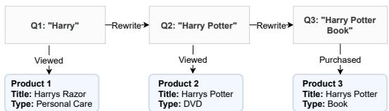
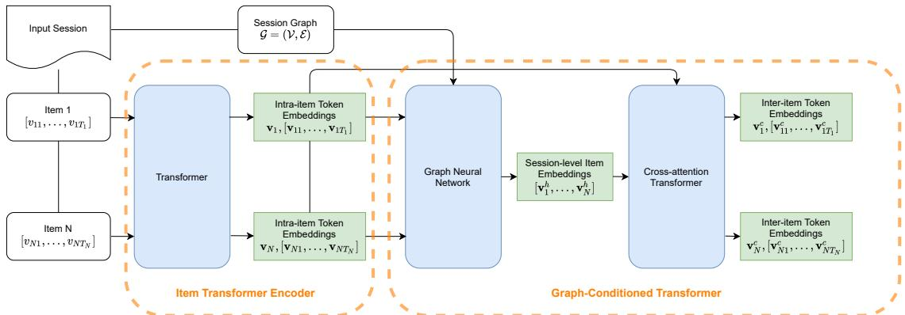
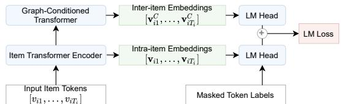
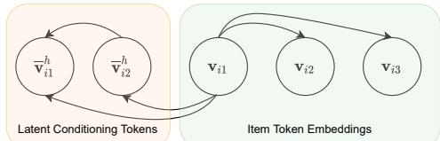
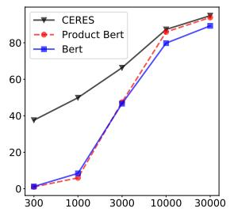
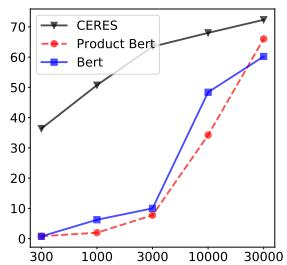
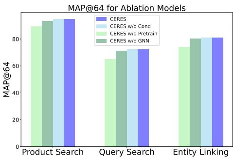

# CERES: Pretraining of Graph-Conditioned Transformer for Semi-Structured Session Data

Rui Feng†, Chen Luo‡, Qingyu Yin‡, Bing Yin‡, Tuo Zhao† and Chao Zhang†

†Georgia Institute of Technology

‡Amazon Inc.

{rfeng, tourzhao, chaozhang}@gatech.edu {cheluo,qingyy, alexbyin}@amazon.com

## Abstract

User sessions empower many search and recommendation tasks on a daily basis. Such session data are semi-structured, which encode heterogeneous relations between queries and products, and each item is described by the unstructured text. Despite recent advances in self-supervised learning for text or graphs, there lack of self-supervised learning models that can effectively capture both intra-item semantics and inter-item interactions for semi-structured sessions. To fill this gap, we propose CERES, a graph-based transformer model for semi-structured session data. CERES learns representations that capture both inter- and intra-item semantics with (1) a graph-conditioned masked language pretraining task that jointly learns from item text and item-item relations; and (2) a graph-conditioned transformer architecture that propagates inter-item contexts to itemlevel representations. We pretrained CERES using 468 million Amazon sessions and find that CERES outperforms strong pretraining baselines by up to 9% in three session search and entity linking tasks.

## 1 Introduction

User sessions are ubiquitous in online e-commerce stores. An e-commerce session contains customer interactions with the platform in a continuous period. Within one session, the customer can issue multiple queries and take various actions on the retrieved products for these queries, such as clicking, adding to cart, and purchasing. Sessions are important in many e-commerce applications, e.g., product recommendation (Wu et al., 2019a), query recommendation (Cucerzan and White, 2007), and query understanding (Zhang et al., 2020).

This paper considers sessions as semi-structured data, as illustrated in Figure 1. At the higher level, sessions are heterogeneous graphs that contain interactions between items. At the lower level, each graph node has unstructured text descriptions: we can describe queries by search keywords and products by titles, attributes, customer reviews, and other descriptors. Our goal is to simultaneously encode both the graph and text aspects of the session data to understand customer preferences and intents in a session context.

  
Figure 1: Illustration of a customer session. A session consists of two types of items: queries and products. The customer searched for 3 keywords sequentially and interacted with the products returned by the search engine.

Pretraining on semi-structured session data remains an open problem. First, existing works on learning from session data usually treat a session as a sequence or a graph (Xu et al., 2019; You et al., 2019; Qiu et al., 2020b). While they can model inter-item relations, they do not capture the rich intra-item semantics when text descriptions are available. Furthermore, these models are usually large neural networks that require massive labeled data to train from scratch. Another line of research utilizes large-scale pretrained language models (Lan et al., 2019; Liu et al., 2019; Clark et al., 2020) as text encoders for session items. However, they fail to model the relational graph structure. Several works attempt to improve language models with a graph-structured knowledge base, such as in (Liu et al., 2020; Yao et al., 2019; Shen et al., 2020). While adjusting the semantics of entities according to the knowledge graph, they fail to encode general graph structures in sessions.

We propose CERES (Graph Conditioned Encoder Representations for Session Data), a pretraining model for semi-structured e-commerce session data, which can serve as a generic session encoder that simultaneously captures both intraitem semantics and inter-item relations. Beyond training a potent language model for intra-item semantics, our model also conditions the language modeling task on graph-level session information, thus encouraging the pretrained model to learn how to utilize inter-item signals. Our model architecture tightly integrates two key components: (1) an item Transformer encoder, which captures text semantics of session items; and (2) a graph conditioned Transformer, which aggregates and propagates inter-item relations for cross-item prediction. As a result, CERES models the higher-level interactions between items.

We have pretrained CERES using 468,199,822 sessions and performed experiments on three session-based tasks: product search, query search, and entity linking. By comparing with publicly available state-of-the-art language models and domain-specific language models trained on alternative representations of session data, we show that CERES outperforms strong baselines on various session-based tasks by large margins. Experiments show that CERES can effectively utilize sessionlevel information for downstream tasks, better capture text semantics for session items, and perform well even with very scarce training examples.

We summarize our contributions as follows: 1) We propose CERES , a pretrained model for semistructured e-commerce session data. CERES can effectively encode both e-commerce items and sessions and generically support various sessionbased downstream tasks. 2) We propose a new graph-conditioned transformer model for pretraining on general relational structures on text data. 3) We conducted extensive experiments on a largescale e-commerce benchmark for three sessionrelated tasks. The results show the superiority of CERES over strong baselines, including mainstream pretrained language models and state-ofthe-art deep session recommendation models.

## 2 Customer Sessions

A customer session is the search log before a final purchase action. It consists of customer-queryproduct interactions: a customer submits search queries obtains a list of products. The customer may take specific actions, including view and purchase on the retrieved products. Hence, a session contains two types of items: queries and products, and various relations between them established by customer actions.

We define each session as a relational graph $G = ( \nu , \mathcal { E } )$ that contains all queries and products in a session and their relations. The vertex set $\boldsymbol { \nu } = ( \boldsymbol { \mathcal { Q } } , \mathcal { P } )$ is partitioned into ordered query set $\mathcal { Q }$ and unordered product set $\mathcal { P }$ . The queries $\mathcal { Q } =$ $( q _ { 1 } , \ldots , q _ { n } )$ are indexed by order of the customer ${ \bf \dot { s } }$ searches. The edge set $\mathcal { E }$ contains two types of edges: $\{ ( q _ { i } , q _ { j } ) , i < j \}$ are one-directional edges that connect each query to its previous queries; and $\{ q _ { i } , p _ { j } , a _ { i j } \}$ are bidirectional edges that connects the ith query and jth product, if the customer took action $a _ { i j }$ on product $p _ { j }$ retrieved by query $q _ { j }$

The queries and products are represented by textual descriptions. Specifically, each query is represented by customer-generated search keywords. Each product is represented with a table of textual attributes. Each product is guaranteed to have a product title and description. In this paper, we call “product sequence” as the concatenation of title and description. A product may have additional attributes, such as product type, color, brand, and manufacturer, depending on their specific categories.

## 3 Our Method

In this section we present the details of CERES. We first describe our designed session pretraining task in Section 3.1, and then describe the model architecture of CERES in Section 3.2.

## 3.1 Graph-Conditioned Masked Language Modeling Task

Suppose $\mathcal { G } = ( \nu , \mathcal { E } )$ is a graph on $T$ text items as vertices, $v _ { 1 } , \ldots , v _ { T }$ , each of which is a sequence of text tokens: $v _ { i } = [ v _ { i 1 } , \ldots , v _ { i T _ { i } } ] , i = 1 , \ldots , T$ We propose graph-conditioned masked language modeling (GMLM), where masked tokens are predicted with both intra-item context and inter-item context:

$$
p _ { \mathbf { G M L M } } ( v _ { \mathrm { m a s k e d } } ) = \prod _ { j \mathrm { t h } \mathrm { m a s k e d } } \mathbb { P } ( v _ { i j } | \mathcal { G } , \{ v _ { i k } \} _ { k \mathrm { t h u n m a s k e d } } ) ,\tag{1}
$$

which encourages the model to leverage information graph-level inter-item semantics efficiently in order to predict masked tokens. To optimize (1), we need to learn token-level embeddings that are infused with session-level information, which we introduce in Section 3.2.2. Suppose certain tokens in the input sequence of items as masked (detailed below), we optimize the predictions of the masked tokens with cross entropy loss. The pretraining framework is illustrated in Figure 3.

  
Figure 2: Model illustration. CERES first produces intra-item embeddings in the Item Transformer Encoder. Then, the Graph-Conditioned Transformer aggregates and propagates session-level information to obtain interitem embeddings.

  
Figure 3: Pretraining framework illustration. CERES learns both inter-item and intra-item embeddings for item tokens for Masked LM and Graph-Conditioned Masked LM. In practice, we find it beneficial to optimize both.

Token Masking Strategy. To mask tokens in long sequences, including product titles and descriptions, we follow (Devlin et al., 2018) and choose 15% of the tokens for masking. For short sequences, including queries and product attributes, there is a 50% probability that a short sequence will be masked, and for those sequences 50% of their tokens are randomly selected for masking.

## 3.2 Model Architecture

To model the probability in (1), we design two key components in the CERES model: 1) a Transformer-based item encoder, which produces token-level intra-item embeddings that contain context information within a single item; and 2) a graph-conditioned Transformer for session encoding, which produces session-level embeddings that encodes inter-item relations, and propagates the session information back to the token-level. We illustrate our model architecture in Figure 2.

## 3.2.1 Item Transformer Encoder

The session item encoder aims to encode intra-item textual information for each item in a session. We design the item encoder based on Transformers, which allows CERES to leverage the expressive power of the self-attention mechanism for modeling domain-specific language in e-commerce sessions. Given an item i, the transformer-based item encoder compute its token embeddings as follows:

$$
\begin{array} { r l } & { \bigl [ \mathbf { v } _ { i 1 } , \ldots , \mathbf { v } _ { i T _ { i } } \bigr ] = \mathrm { T r a n s f o r m e r } _ { \mathrm { i t e m } } \bigl ( \bigl [ v _ { i 1 } , \ldots , v _ { i T _ { i } } \bigr ] \bigr ) } \\ & { \qquad \mathbf { v } _ { i } = \mathrm { P o o l } ( \bigl [ v _ { i 1 } , \ldots , v _ { i T _ { i } } \bigr ] \bigr ) , } \end{array}\tag{2}
$$

where $\mathbf { v } _ { i j }$ is the embedding of the jth token in the ith item, and $\mathbf { v } _ { i }$ is the pooled embedding of the ith item. At this stage, $\{ \mathbf { v } _ { i j } \} , \{ \mathbf { v } _ { i } \}$ are embeddings that only encode the intra-item information.

Details of Item Encoding. We detail the encoding method for the two types of items, queries and products, in the following paragraphs.

Each query $q _ { i } = [ q _ { i 1 } , \ldots , q _ { i T _ { i } } ]$ is a sequence of tokens generated by customers as search keywords. We add a special token at the beginning of the queries, [SEARCH], to indicate that the sequence represents a customer’s search keywords. Then, to obtain the token-level embedding of the queries and the pooled query embedding by taking the embedding of the special token [SEARCH].

Each product $p _ { i }$ is a table of K attributes: $p ^ { 1 } , \ldots , \hat { p ^ { K } }$ , where $p ^ { 1 }$ is always the product sequence, which is the concatenation of product title and bullet description. Each attribute $p _ { i } ^ { k } \ = \ [ p _ { i 1 } ^ { k } , p _ { i 2 } ^ { k } , . . . ]$ starts with a special token [ATTRTYPE], where ATTRTYPE is replaced with the language descriptor of the attribtue. Then, the Transformer is used to compute token and sentence embeddings for all attributes. The product embedding is obtained by average pooling of all attribute’s sentence embeddings.

## 3.2.2 Graph-Conditioned Session Transformer

The Graph-Conditioned Session Transformer aims to infuse intra-item and inter-item information to produce item and token embeddings. For this purpose, we first design a position-aware graph neural network (PGNN) to capture the interitem dependencies in a session graph to produce item embeddings. The effect of PGNN is analyzed in Section 4.4. Then conditioned on the PGNN-learned item embedding, we propose a cross-attention Transformer, which produces infused item and token embeddings for the Graph-Conditioned Masked Language Modeling task.

  
Figure 4: Illustration of cross-attention over latent conditioning tokens. The item token embeddings perform self-attention as well as cross-attention over latent conditioning tokens, thus incorporating session-level information. Latent conditioning tokens perform selfattention to update their embeddings, but do not attend to item tokens to preserve session-level information.

Position-Aware Graph Neural Network. We use a GNN to capture inter-item relations. This will allow CERES to obtain item embeddings that encode the information from other locally correlated items in the session. Let $\left[ \mathbf { v } _ { 1 } , \ldots , \mathbf { v } _ { N } \right]$ denote the item embeddings produced by the intra-item transformer encoder. We treat them as hidden states of nodes in the session graph  and feed them to the GNN model, obtaining session-level item embeddings $[ \mathbf { v } _ { 1 } ^ { h } , \ldots , \mathbf { v } _ { N } ^ { h } ]$

The items in a session graph are sequential according to the order the customers generated them. To let the GNN model learn of the positional information of items, we train an item positional embedding in the same way BERT (Devlin et al., 2018) trains positional embeddings of tokens. Before feeding the item embeddings to GNN, the pooled item embeddings are added item positional embeddings according to their positions in the session’s item sequence. In this way, the item embeddings $\{ \mathbf { v } ^ { i } \} _ { i \in \mathcal { V } }$ are encoded their positional information as well.

Cross-Attention Transformer. Conditioned on PGNN, we design a cross-attention transformer which propagates session-level information in PGNN-produced item embeddings to all tokens to produce token embeddings that are infused with both intra-item and inter-item information.

In order to propagate item embeddings to tokens, we treat item embeddings as latent tokens that can be treated as a $\mathbf { \dot { \vec { p } } } \mathbf { a r t } ^ { \mathbf { \vec { p } } }$ of item texts. for each item i, we first expand $\mathbf { v } _ { i } ^ { h }$ to K latent conditioning tokens by using a multilayer perceptron module to map $\mathbf { v } _ { i } ^ { h }$ to $K$ embedding vectors $[ \mathbf { v } _ { i 1 } ^ { h } , \ldots , \mathbf { v } _ { i K } ^ { h } ]$ of the same size. For each item i, we compute its latent conditioning tokens by averaging all latent tokens in its neighborhood. Suppose $N ( i )$ is the set of all neighboring items in the session graph, itself included. In each position, we take the average of the latent token embeddings in $N ( i )$ as the kth latent conditioning token, $\overline { { \mathbf { v } } } _ { i k } ^ { h }$ , for the ith item. Then, we concatenate the latent conditioning token embeddings and the item token embeddings obtained by the session item encoder:

$$
[ \overline { { \mathbf { v } } } _ { i 1 } ^ { h } , \ldots , \overline { { \mathbf { v } } } _ { i K } ^ { h } , \mathbf { v } _ { i 1 } , \ldots , \mathbf { v } _ { i N _ { i } } ] .\tag{3}
$$

Finally, we compute the token-level embeddings with session information by feeding the concatenated sequence to a shallow cross-attention Transformer. The cross-attention Transformer is of the same structure as normal Transformers. The difference is that we prohibit the latent conditioning tokens from attending over original item tokens to prevent the influx of intra-item information potentially diluating session-level information stored in latent conditioning tokens. Illustration of crossattention Transformer is provided in Figrue 4.

We use the embeddings produced by this crossattention Transformer as the final embeddings for modeling the token probabilities in Equation (1) and learning the masked language modeling tasks. During training, the model is encouraged to learn good token embeddings with the Item Transformer Encoder, as better embeddings $\{ \mathbf { v } _ { i j } \} _ { j = 1 } ^ { N _ { i } }$ is necessary to improve the quality of $\{ \mathbf { v } _ { i j } ^ { c } \} _ { j = 1 } ^ { N _ { i } }$ The Graph-Conditioned Transformer will be encouraged to produce high-quality session-level embeddings for the GMLM task. Hence, CERES is encouraged to produce high-quality embeddings that unify both intra-item and inter-item information.

## 3.3 Finetuning

When finetuning CERES for downstream tasks, we first obtain session-level item embeddings. The session embedding is computed as the average of all item embeddings. To obtain embedding for a single item without session context, such as for retrieved items in recommendation tasks, only the Item Transformer Encoder is used.

To measure the relevance of an item to a given session, we first transform the obtained embeddings by separate linear maps. Denote the transformed session embeddings as s and item embeddings as y. The similarity between them is computed by cosine similarity $\mathrm { d } _ { \mathbf { c o s } } ( \mathbf { s } , \mathbf { y } )$ . To finetune the model, we optimize a hinge loss on the cosine similarity between sessions and items.

## 4 Experiments

## 4.1 Experiment Setup

Dataset. We collected customer sessions from Amazon for pretraining and finetuning on downstream tasks. 468,199,822 customer sessions are collected from August 1 2020 to August 31 2020 for pretraining. 30,000 sessions are collected from September 2020 to September 7 2020 for downstream tasks. The pretraining and downstreaming datasets are from disjoint time spans to prevent data leakage. All data are cleaned and anonymized so that no personal information about customers was used. Each session is collected as follows: when a customer perform a purchase action, we backtrace all actions by the customer in 600 seconds before the purchase until a previous purchase is encountered. The actions of customers include: 1) search, 2) view, 3), add-to-cart, and 4) purchase. Search action is associated with customer generated query keywords. View, add-to-cart, and purchase are associated with the target products. All the products in the these sessions are gathered with their product title, bullet description, and various other attributes, including color, manufacturer, product type, size, etc. In total, we have 37,580,637 products. The sessions have an average of 3.24 queries and 4.36 products. Queries have on average 5.63 tokens, while product titles and bullet descriptions have averagely 17.42 and 96.01 tokens.

Evaluation Tasks and Metrics. We evaluate all the compared models on the following tasks: 1) Product Search. In this task, given observed customer behaviors in a session, the model is asked to predict which product will be purchased from a pool of candidate products. The purchased products are removed from sessions to avoid trivial inference. The candidate product pool is the union of all purchased products in the test set and the first 10 products returned by the search engine of all sessions in the test set.

2) Query Search. Query Search is a recommendation task where the model retrieves next queries for customers which will lead to a purchase. Given a session, we hide the last query along with products associated with it, i.e. viewed or purchased with the removed query. Then, we ask the model to predict the last query from a pool of candidate queries. The candidate query pool consists of all last queries in the test set.

3) Entity Linking. In this task we try to understand the deeper semantics of customer sessions. Specifically, if customer purchases a product in a session, the task is to predict the attributes of the purchased product from the rest contexts in the session. In total, we have 60K possible product attributes.

Baselines. The compared baselines can be categorized into three groups:

1) General-domain pretrained language models which include BERT (Devlin et al., 2018), RoBERTa (Liu et al., 2019), and ELECTRA (Clark et al., 2020). These models are state-of-the-art pretrained language models, which can serve as general-purpose language encoders for items and enable downstream session-related tasks. Specifically, the language encoders produce item embeddings first, and compose session embeddings by pooling the items in sessions. To retrieve items for sessions, one can compare the cosine similarity between sessions and retrieved items.

2) Pretrained session models which are pretrained models on e-commerce session data. Specifically, we pretrain the following language models using our session data: a) Product-BERT, which is a domain-specific BERT model pretrained with product information; b) SQSP-BERT, where SQSP is short for Single-query Single-Product. SQSP-BERT is pretrained on query-product interaction pairs with language modeling and contrastive learning objectives. They are used in the same manner in downstream tasks as general-domain pretrained language models. The detailed configurations are provided in the Appendix.

3) Session-based recommendation methods including SR-GNN (Wu et al., 2019b) and NISER+ (Gupta et al., 2019), which are state-ofthe-art models for session-based product recommendation on traditional benchmarks, including YOOCHOOSE and DIGINETICA; and Nvidia’s MERLIN (Mobasher et al., 2001), which is the bestperforming model in the recent SIGIR Next Items Prediction challenge (Kallumadi et al., 2021)

To evaluate the performance on these tasks, we employ standard metrics for recommendation systems, including MAP@K, and Recall@K.

## 4.2 Implementation Details

The implementation details for pretraining and finetuning stages are described as follows.

Pretraining details. We developed our model based on Megatron-LM (Shoeybi et al., 2019). We used 768 as the hidden size, a 12-layer transformer blocks as the backbone language model, a twolayer Graph Attention Network and three-layer Transformer as the conditioned language model layers. In total, our model has 141M parameters. The model is trained for 300,000 steps with a batch size of 512 sessions. The parameters are updated with Adam, with peak learning rate as 3e  5, 1% steps for linear warm-up, and linear learning rate decay after warm-up until the learning rate reaches the minimum 1e 5. We trained our model on 16 A400 GPUs on Amazon AWS for one week.

Finetuning details. For each downstream task, we collected 30,000 sessions for training, 3000 for validation and 5000 for testing. For each of the pretrained model, we finetune them for 10 epochs with a maximal learning rate chosen from [1e-4, 1e-5, 5e-5, 5e-6] to maximize MAP@1 on the validation set. The rest of the configuration of optimizers is the same as in pretraining.

## 4.3 Main Results

## 4.3.1 Product Search

Table 1 shows the performance of different methods for the product search task. We observe that CERES outperforms domain-specific methods by more than 1% and general-domain methods by over 6% in MAP@1. The second best performing model is Product-BERT, which is pretrained on product information alone.

We also compared with session-based recommendation systems. SR-GNN and NISER+ model only session graph structure but not text semantics; hence they have limited performance because of the suboptimal representation of session items. While MERLIN can capture better text semantics, its text encoder is not trained on domain-specific e-commerce data. While it can outperform generaldomain methods, its performance is lower than Product-BERT and CERES. The benefits of joint modeling of text and graph data and the Graph-Conditioned MLM allow CERES to outperform existing session recommendation models.

## 4.3.2 Query Search

Table 2 shows the performance of different methods on Query Search. Query Search is a more difficult task than Product Search because customergenerated next queries are of higher variance. In this challenging task, CERES outperforms the best domain-specific model by over 7% and generaldomain model by 12% in all metrics.

## 4.3.3 Entity Linking

Table 3 shows the results on Entity Linking. Similar to Query Search, this task also requires the models to tie text semantics (queries/product attributes) to a customer session, which requires a deeper understanding of customer preferences. It is easier than Query Search as product attributes are of lower variance. However, the product attributes that the customer prefer rely more on session information, as they may have been reflected in the past search queries and viewed products. In this task, CERES outperforms domain-specific models and general-domain models by averagely 9% in MAP@1 and 6% in MAP@32 and MAP@64.

## 4.4 Further Analysis and Ablation Studies

In this section we present further studies to understand: 1) the effect of training data sizes in the downstream task; 2) the effects of different components in CERES for both the pretraining and finetuning stages. following observations:

CERES is highly effective when training data are scarce. We compare CERES with two strongest baselines (BERT, and Product-BERT) when the training sample size varies. Figure 5 shows the MAP@64 scores of these methods on Product Search and Query Search when training size varies. Clearly, the advantage of CERES is greater when training data is extremely small. With a training size of 300, CERES can achieve a decent performance of about 37.55% in Product Search and 36.37% in Query Search, while the baseline models cannot be trained sufficiently with such small-sized data. This shows that the efficient utilization of session-level information in pretraining and fine-tuning stages make the model more data efficient than other pretrained models.



  
(a) Product Search  
(b) Query Search  
Figure 5: Effect of sample size on Product Search and Query Search. x-axis represents the training data size and y-axis represents MAP@64.

<table><tr><td>Method</td><td>map@1</td><td>recall@1</td><td>map@32</td><td>recall@32</td><td>map@64</td><td>recall@64</td></tr><tr><td>SR-GNN</td><td>36.313</td><td>37.284</td><td>50.683</td><td>99.592</td><td>60.413</td><td>99.689</td></tr><tr><td>NISER+</td><td>37.193</td><td>38.144</td><td>52.855</td><td>98.293</td><td>62.371</td><td>99.111</td></tr><tr><td>MERLIN</td><td>89.744</td><td>90.166</td><td>93.067</td><td>98.98</td><td>93.075</td><td>99.33</td></tr><tr><td>BERT</td><td>85.096</td><td>84.688</td><td>89.172</td><td>99.082</td><td>89.18</td><td>99.301</td></tr><tr><td>RoBERTa</td><td>79.647</td><td>78.963</td><td>83.207</td><td>95.396</td><td>83.25</td><td>97.494</td></tr><tr><td>Electra</td><td>85.897</td><td>86.32</td><td>89.841</td><td>99.344</td><td>89.845</td><td>99.519</td></tr><tr><td>Product-Bert</td><td>91.026</td><td>91.71</td><td>93.856</td><td>99.563</td><td>93.856</td><td>99.563</td></tr><tr><td>SQSP-Bert</td><td>85.577</td><td>85.795</td><td>90.049</td><td>99.038</td><td>90.057</td><td>99.301</td></tr><tr><td>CERES</td><td>92.628</td><td>93.094</td><td>94.848</td><td>99.551</td><td>94.853</td><td>99.65</td></tr></table>

Table 1: The performance of different methods for Product Search, after fine-tuning with 30,000 training sessions.
<table><tr><td>Method</td><td>map@1</td><td>recall@1</td><td>map@32</td><td>recall@32</td><td>map@64</td><td>recall@64</td></tr><tr><td>BERT</td><td>47.276</td><td>47.627</td><td>60.143</td><td>92.553</td><td>60.214</td><td>95.417</td></tr><tr><td>RoBERTa</td><td>26.603</td><td>26.323</td><td>37.722</td><td>74.468</td><td>37.839</td><td>80.196</td></tr><tr><td>Electra</td><td>32.853</td><td>32.788</td><td>47.512</td><td>90.426</td><td>47.632</td><td>95.663</td></tr><tr><td>Product-BERT</td><td>52.724</td><td>52.973</td><td>66.035</td><td>95.99</td><td>66.065</td><td>97.463</td></tr><tr><td>SQSP-BERT</td><td>45.833</td><td>46.29</td><td>60.195</td><td>92.881</td><td>60.26</td><td>95.499</td></tr><tr><td>CERES</td><td>59.936</td><td>60.284</td><td>72.329</td><td>97.463</td><td>72.331</td><td>97.627</td></tr></table>

Table 2: The performance of different methods for Query Search, after fine-tuning with 30,000 training sessions.

Graph-Conditioned Transformer is Vital to Pretraining. Without the Graph-Conditioned Transformer in pretraining, our model is essentially the same as domain-specific baselines, such as Product-BERT, which are trained on session data but only with intra-item text signals. While SQSP-BERT has access to session-level information when maximizing the masked language modeling objective, the lack of a dedicated module for GMLM results in worse performance, as shown in the main experiment results.

We could train the Graph-Conditioned Transformer from scratch in the finetuning stage. We present a model called CERES w/o Pretrain, which attaches the Graph-Conditioned Session Transformer to Product-BERT as the Item Transformer Encoder. As shown in Figure 6, this ablation method achieves MAP@64 scores of 89.341% in Product Search, 64.890% in Query Search, and 74.031% in Entity Linking, which are below Product-BERT. This shows that the pretraining stage of the Graph-Conditioned Transformer is necessary to facilitate its ability to aggregate and propagate session-level information for downstream tasks.

Graph-Conditioned Transformer Improves Item-level Embeddings. We also present CERES w/o Cond, which has the same pretrained model as CERES, but only uses the Item Transformer Encoder in the finetuning stage. The Item Transformer Encoder is used to compute session item embeddings that contain only item-level information, and then takes the average of these embeddings as session embedding. As shown in Figure 6, CERES w/o Cond acheives 94.741%, 72.175%, and 81.03% respectively in Product

  
Figure 6: Results on three tasks on ablation models. yaxis represents MAP@64. CERES w/o Cond is CERES without the Graph-Conditioned Transformer in the finetuning stage. CERES w/o Pretrain is CERES without pretraining the Graph-Conditioned Transformer, but instead training it from scratch in the finetuning stage. CERES w/o GNN is CERES pretrained without the GNN module.

Search, Query Search, and Entity Linking, observing a drop of 0.1% to 0.2% in performance compared with CERES. The performance drop is minor and CERES w/o Cond still outperforms baseline pretrained language models. Hence, the Graph-Conditioned Transformer in the pretraining stage helps the Item Transformer Encoder to learn better item-level embeddings that can be used for more effective leveraging of session information in the downstream tasks.

Graph Neural Networks Improve Representation of Sessions. In CERES w/o GNN, we pretrain a CERES model without a Graph Neural Network. Specifically, CERES w/o GNN skips the neighborhood information aggregation for items, and uses item-level embeddings obtained by the Item Transformer Encoder directly as latent conditioning tokens. We train and finetune this model with the same setup as CERES. Without GNN, the model’s performance is consistently lower than CERES, achieving 93.453%, 71.231%, 80.26% MAP@64 in three downstream tasks, observing a 1.13% performance drop. This shows that GNN’s aggregation of information can help item-level embeddings encode more session-level information, improving performance in downstream tasks.

<table><tr><td>Method</td><td>map@1</td><td>recall@1</td><td>map@32</td><td>recall@32</td><td>map@64</td><td>recall@64</td></tr><tr><td rowspan="3">BERT RoBERTa Electra</td><td>55.609</td><td>55.353</td><td>66.386</td><td>90.511</td><td>66.481</td><td>95.073</td></tr><tr><td>66.506</td><td>65.754</td><td>74.516</td><td>93.248</td><td>74.561</td><td>95.438</td></tr><tr><td>62.321</td><td>62.365</td><td>62.985</td><td>68.296</td><td>63.122</td><td>74.318</td></tr><tr><td rowspan="3">Product-Bert SQSP-Bert CERES</td><td>66.827</td><td>66.393</td><td>74.611</td><td>94.404</td><td>74.641</td><td>96.046</td></tr><tr><td>63.942</td><td>64.872</td><td>72.232</td><td>91.241</td><td>72.307</td><td>94.891</td></tr><tr><td>75.481</td><td>75.456</td><td>81.121</td><td>95.255</td><td>81.16</td><td>96.898</td></tr></table>

Table 3: The performance of different methods for Entity Linking, after fine-tuning with 30,000 training sessions.

Model Efficiency. CERES has additional few GNN and Transformer layers attached to the end of the model. The additional layers bring 20% additional inference time compared to standard BERT with 12 layers and 768 hidden size.

## 5 Related work

Pretrained language models such as BERT (Devlin et al., 2018), BART (Lewis et al., 2019), ELEC-TRA (Clark et al., 2020), RoBERTa (Liu et al., 2019) have pushed the frontiers of many NLP tasks by large margins. Their effectiveness and efficiency in parallelism have made them popular and generalpurpose language encoders for many text-rich applications. However, they are not designed to model relational and graph data, and hence are not the best fit for e-commerce session data.

Researchers have also sought to enhance text representations in pretrained models with knowledge graphs (Shen et al., 2020; Liu et al., 2020; Yao et al., 2019; Sun et al., 2020, 2021). While these models consider a knowledge graph structure on top of text data, they generally use entities or relations in knowledge graphs to enhance text representations, but cannot encode arbitrary graph structures. This is not sufficient in session-related applications as session structures are ignored.

Many works have been proposed to learn pretrained graph neural networks. Initially, methods were proposed for domain-specific graph pretraining (Hu et al., 2019a,b; Shang et al., 2019). However, they rely on pre-extracted domain-specific node-level features, and cannot be extended to either session data or text data as nodes. Recently, many works have been proposed to pretrain on general graph structure (Hu et al., 2020; You et al., 2020; Qiu et al., 2020a). However, they cannot encode the semantics of text data as nodes.

Contextual information in sessions have been shown beneficial to various related recommendation tasks, such as product recommendation (Wu et al., 2019b; Dehghani et al., 2017; Jannach and Ludewig, 2017; Gupta et al., 2019) and query rewriting (Li et al., 2017; Cucerzan and White, 2007). Many existing session-based recommendation methods seek to exploit the transitions between items (Yap et al., 2012; Rendle et al., 2010; Wang et al., 2018; Li et al., 2017) and considering sessions as graphs (Xu et al., 2019; Ruihong et al., 2021; Wang et al., 2020).

## 6 Limitations and Risks

This paper limits the application of CERES to session data with text descriptions. CERES has the potential of being a universal pretraining framework for arbitrary heterogeneous data. For example, sessions can include product images and customer reviews for more informative multimodal graphs. We leave this extension for future work.

Session data are personalized experience for customers and could cause privacy issues if data are not properly anonymized. In application, the model should be used to avoid exploitation or leakage of customers personal profiles and preferences.

## 7 Conclusion

We proposed a pretraining framework, CERES, for learning representations for semi-structured ecommerce sessions. We are the first to jointly model intra-item text and inter-item relations in session graphs with an end-to-end pretraining framework. By modeling Graph-Conditioned Masked Language Modeling, our model is encouraged to learn high-quality representations for both intraitem and inter-item information during its pretraining on massive unlabeled session graphs. Furthermore, as a generic session encoder, our model enabled effective leverage of session information in downstream tasks. We conducted extensive experiments and ablation studies on CERES in comparison to state-of-the-art pretrained models and recommendation systems. Experiments show that CERES can produce higher quality text representations as well as better leverage of session graph structure, which are important to many ecommerce related tasks, including product search, query search, and query understanding.

## 8 Acknowledgement

This work was supported in part by NSF IIS-2008334, IIS-2106961, CAREER IIS-2144338, and ONR MURI N00014-17-1-2656.

## References

Kevin Clark, Minh-Thang Luong, Quoc V Le, and Christopher D Manning. 2020. Electra: Pre-training text encoders as discriminators rather than generators. arXiv preprint arXiv:2003.10555.

Silviu Cucerzan and Ryen W White. 2007. Query suggestion based on user landing pages. In Proceedings of the 30th annual international ACM SIGIR conference on Research and development in information retrieval, pages 875–876.

Mostafa Dehghani, Sascha Rothe, Enrique Alfonseca, and Pascal Fleury. 2017. Learning to attend, copy, and generate for session-based query suggestion. In Proceedings of the 2017 ACM on Conference on Information and Knowledge Management, pages 1747–1756.

Jacob Devlin, Ming-Wei Chang, Kenton Lee, and Kristina Toutanova. 2018. Bert: Pre-training of deep bidirectional transformers for language understanding. arXiv preprint arXiv:1810.04805.

Priyanka Gupta, Diksha Garg, Pankaj Malhotra, Lovekesh Vig, and Gautam M Shroff. 2019. Niser: Normalized item and session representations with graph neural networks. arXiv preprint arXiv:1909.04276.

Weihua Hu, Bowen Liu, Joseph Gomes, Marinka Zitnik, Percy Liang, Vijay Pande, and Jure Leskovec. 2019a. Pre-training graph neural networks. arXiv preprint arXiv:1905.12265.

Weihua Hu, Bowen Liu, Joseph Gomes, Marinka Zitnik, Percy Liang, Vijay Pande, and Jure Leskovec. 2019b. Strategies for pre-training graph neural networks. arXiv preprint arXiv:1905.12265.

Ziniu Hu, Yuxiao Dong, Kuansan Wang, Kai-Wei Chang, and Yizhou Sun. 2020. Gpt-gnn: Generative pre-training of graph neural networks. In Proceedings of the 26th ACM SIGKDD International Conference on Knowledge Discovery & Data Mining, pages 1857–1867.

Dietmar Jannach and Malte Ludewig. 2017. When recurrent neural networks meet the neighborhood for session-based recommendation. In Proceedings of the Eleventh ACM Conference on Recommender Systems, pages 306–310.

Surya Kallumadi, Tracy Holloway King, Shervin Malmasi, and Maarten de Rijke. 2021. Ecom’21: The sigir 2021 workshop on ecommerce. In Proceedings of the 44th International ACM SIGIR Conference on Research and Development in Information Retrieval, pages 2685–2688.

Zhenzhong Lan, Mingda Chen, Sebastian Goodman, Kevin Gimpel, Piyush Sharma, and Radu Soricut. 2019. Albert: A lite bert for self-supervised learning of language representations. arXiv preprint arXiv:1909.11942.

Mike Lewis, Yinhan Liu, Naman Goyal, Marjan Ghazvininejad, Abdelrahman Mohamed, Omer Levy, Ves Stoyanov, and Luke Zettlemoyer. 2019. Bart: Denoising sequence-to-sequence pre-training for natural language generation, translation, and comprehension. arXiv preprint arXiv:1910.13461.

Jing Li, Pengjie Ren, Zhumin Chen, Zhaochun Ren, Tao Lian, and Jun Ma. 2017. Neural attentive session-based recommendation. In Proceedings of the 2017 ACM on Conference on Information and Knowledge Management, pages 1419–1428.

Weijie Liu, Peng Zhou, Zhe Zhao, Zhiruo Wang, Qi Ju, Haotang Deng, and Ping Wang. 2020. K-bert: Enabling language representation with knowledge graph. In Proceedings of the AAAI Conference on Artificial Intelligence, volume 34, pages 2901–2908.

Yinhan Liu, Myle Ott, Naman Goyal, Jingfei Du, Mandar Joshi, Danqi Chen, Omer Levy, Mike Lewis, Luke Zettlemoyer, and Veselin Stoyanov. 2019. Roberta: A robustly optimized bert pretraining approach. arXiv preprint arXiv:1907.11692.

Bamshad Mobasher, Honghua Dai, Tao Luo, and Miki Nakagawa. 2001. Effective personalization based on association rule discovery from web usage data. In Proceedings of the 3rd international workshop on Web information and data management, pages 9–15.

Jiezhong Qiu, Qibin Chen, Yuxiao Dong, Jing Zhang, Hongxia Yang, Ming Ding, Kuansan Wang, and Jie Tang. 2020a. Gcc: Graph contrastive coding for graph neural network pre-training. In Proceedings of the 26th ACM SIGKDD International Conference on Knowledge Discovery & Data Mining, pages 1150–1160.

Ruihong Qiu, Zi Huang, Jingjing Li, and Hongzhi Yin. 2020b. Exploiting cross-session information for session-based recommendation with graph neural networks. ACM Transactions on Information Systems (TOIS), 38(3):1–23.

Steffen Rendle, Christoph Freudenthaler, and Lars Schmidt-Thieme. 2010. Factorizing personalized markov chains for next-basket recommendation. In Proceedings ofthe 19th international conference on World wide web, pages 811–820.

Qiu Ruihong, Huang Zi, Chen Tong, and Yin Hongzhi. 2021. Exploiting positional information for session-based recommendation. arXiv preprint arXiv:2107.00846.

Junyuan Shang, Tengfei Ma, Cao Xiao, and Jimeng Sun. 2019. Pre-training of graph augmented transformers for medication recommendation. arXiv preprint arXiv:1906.00346.

Tao Shen, Yi Mao, Pengcheng He, Guodong Long, Adam Trischler, and Weizhu Chen. 2020. Exploiting structured knowledge in text via graphguided representation learning. arXiv preprint arXiv:2004.14224.

Mohammad Shoeybi, Mostofa Patwary, Raul Puri, Patrick LeGresley, Jared Casper, and Bryan Catanzaro. 2019. Megatron-lm: Training multi-billion parameter language models using model parallelism. arXiv preprint arXiv:1909.08053.

Yu Sun, Shuohuan Wang, Shikun Feng, Siyu Ding, Chao Pang, Junyuan Shang, Jiaxiang Liu, Xuyi Chen, Yanbin Zhao, Yuxiang Lu, et al. 2021. Ernie 3.0: Large-scale knowledge enhanced pre-training for language understanding and generation. arXiv preprint arXiv:2107.02137.

Yu Sun, Shuohuan Wang, Yukun Li, Shikun Feng, Hao Tian, Hua Wu, and Haifeng Wang. 2020. Ernie 2.0: A continual pre-training framework for language understanding. In Proceedings ofthe AAAI Conference on Artificial Intelligence, volume 34, pages 8968– 8975.

Shoujin Wang, Liang Hu, Longbing Cao, Xiaoshui Huang, Defu Lian, and Wei Liu. 2018. Attentionbased transactional context embedding for next-item recommendation. In Proceedings of the AAAI Con ference on Artificial Intelligence, volume 32.

Ziyang Wang, Wei Wei, Gao Cong, Xiao-Li Li, Xian-Ling Mao, and Minghui Qiu. 2020. Global context enhanced graph neural networks for session-based recommendation. In Proceedings of the 43rd International ACM SIGIR Conference on Research and Development in Information Retrieval, pages 169– 178.

Shu Wu, Yuyuan Tang, Yanqiao Zhu, Liang Wang, Xing Xie, and Tieniu Tan. 2019a. Session-based recommendation with graph neural networks. In Proceedings of the AAAI Conference on Artificial Intelligence, volume 33, pages 346–353.

Shu Wu, Yuyuan Tang, Yanqiao Zhu, Liang Wang, Xing Xie, and Tieniu Tan. 2019b. Session-based recommendation with graph neural networks. In Proceedings of the AAAI Conference on Artificial Intelligence, volume 33, pages 346–353.

Chengfeng Xu, Pengpeng Zhao, Yanchi Liu, Victor S Sheng, Jiajie Xu, Fuzhen Zhuang, Junhua Fang, and Xiaofang Zhou. 2019. Graph contextualized selfattention network for session-based recommendation. In IJCAI, volume 19, pages 3940–3946.

Liang Yao, Chengsheng Mao, and Yuan Luo. 2019. Kgbert: Bert for knowledge graph completion. arXiv preprint arXiv:1909.03193.

Ghim-Eng Yap, Xiao-Li Li, and S Yu Philip. 2012. Effective next-items recommendation via personalized sequential pattern mining. In International conference on database systems for advanced applications, pages 48–64. Springer.

Jiaxuan You, Yichen Wang, Aditya Pal, Pong Eksombatchai, Chuck Rosenburg, and Jure Leskovec. 2019. Hierarchical temporal convolutional networks for dynamic recommender systems. In The world wide web conference, pages 2236–2246.

Yuning You, Tianlong Chen, Yongduo Sui, Ting Chen, Zhangyang Wang, and Yang Shen. 2020. Graph contrastive learning with augmentations. Advances in Neural Information Processing Systems, 33:5812– 5823.

Hanchu Zhang, Leonhard Hennig, Christoph Alt, Changjian Hu, Yao Meng, and Chao Wang. 2020. Bootstrapping named entity recognition in ecommerce with positive unlabeled learning. arXiv preprint arXiv:2005.11075.

<table><tr><td>Attribute Value</td></tr><tr><td>Title Pour-over Coffee Maker</td></tr><tr><td>Bullet Description Just coffee maker.</td></tr><tr><td>Color N/A</td></tr><tr><td>Brand Chemex</td></tr><tr><td>Manufacturer Chemex</td></tr><tr><td>Product Type Coffee Maker</td></tr></table>

Table 4: Example Product Table. Each product is guaranteed to have a title. Most products have bullet descriptions, which can be split into multiple entries. Products could have other attributes, such as color, brand, product type, etc. as well.

## A Details on Session Data

## A.1 Product Attributes.

A product is represented with a table of attributes. Each product is guaranteed to have a product title and bullet description. In this paper, we regard the product title as the representative sequence of the product, called “product sequence”. A product may have additional attributes, such as product type, color, brand, and manufacturer, depending on specific products.

## A.2 Alternative Pretraining Corpora

In this section we introduce alternative pretraining corpora that encode information in a session, including products and queries, but not treating sessions as a whole.

## A.2.1 Product Corpus

In this corpus, we gathered all product information that appeared in the sessions from August 2020 to September 2020. Each product will have descriptions such as product title and bullet description, and other attributes like entity type, product type, manufacturer, etc. Particularly, bullet description is composed of several lines of descriptive facts about the product. All products without titles are removed. Each of the remaining product forms a paragraph, where the product title comes as the first sentence, followed by the entries of bullet descriptions each as a sentence, and product attributes.

An example document in this corpora is as follows:

[Title] product title

[Description] description

[Product Type] product type

[Color] color

## A.2.2 Single-Query Single-Product (SQSP) Corpus

In this corpus, we treat each session as a document and each query-product pair as a sentence. A queryproduct pair in the document are the pairs of queries and products that are either viewed or clicked with the given queries. A query-product pair looks like the follows:

```ini
[SEARCH] search keywords
[TITLE] product title
[DESCRIPTION] description
[ENTITY_TYPE] entity type
```

where the first [SEARCH] special token indicates a field of query keywords, and [TITLE] indicates fields of product information starting with product tittles. In this corpus, we model the one-to-one relation between queries and products.

## A.2.3 Session Corpus

In this corpus, we treat each session as a document and sequentially put text representations of items in a session to the document with special tokens indicating the fields of items. An example document looks like the follows:

[SEARCH] keywords 1

[SEARCH] keywords 2 [CLICK]

[TITLE] product 1

[SEARCH] keywords 3

[PURCHASE]

[TITLE] product 2

In this example, the customer first attempted to search with keywords 1 and then modified the keywords to keywords 2. The customer then clicked on product 1. At last, the customer modified his search to keywords 3 and purchased product 2. In this corpus, session information is present in a document, but the specific relations between elements are not specified. The comparison of different datasets are in Table 5.

## A.3 Alternative Pretraining Methods

We introduce the alternative pretraining models.

• Product-Bert. It is pretrained on the Product Corpus. Specifically, we treat each product in the Product Corpus as an article. Product titles is always the first sentence, followed by paragraphs of bullet descriptions, which can contain multiple sentences. Then, each additional product attribute is a sentence added after the bullet descriptions.

<table><tr><td>Corpus</td><td>Product Info</td><td>Query Info</td><td>Relational</td><td>Session Context</td></tr><tr><td>Product</td><td>√</td><td>X</td><td>X</td><td>X</td></tr><tr><td>SQSP</td><td>√</td><td>√</td><td>√</td><td>X</td></tr><tr><td>Session-Corpus</td><td>√</td><td>√</td><td>X</td><td>√</td></tr><tr><td>Session-Graph</td><td>√</td><td>√</td><td>√</td><td>√</td></tr></table>

Table 5: Comparision of different pretraining dataset. Product Corpus has access only to product information. SQSP models on the queries and query-product relations, without access to session context. Session Corpus has access to contextual information in a session, but does not model on relations between objects. Session-Graph has access to all information and models on the relational nature of nodes in the session graph.

Product Bert is trained for 300,000 steps, with a 12-layer transformer with a batch size of 6144 and peak learning rate of 1e-3, 1% linear warm-up steps, and 1e 2 linear weight decay to a minimum learning rate of 1e-5.

• SQSP-Bert. It is pretrained on SQSP Corpus. The SQSP Bert uses the same Transformer backbone as Product Bert. Given each query-product pair, SQSP feeds the text pair sequence to the Transformer for token embeddings for masked language modeling loss. In addition to language modeling, for each queryproduct pair, we sample a random product for the query as a negative query-product pair. The text pair sequence of the negative sample is also fed to the Transformer. Then, a discriminator is trained in the pretraining stage to distinguish the ground-truth query-product pairs and randomly sampled pairs. The discriminator’s classification loss should serve as a contrastive loss.

SQSP Bert is trained with the same configuration of Product Bert.

## B Details on Evaluation Metrics

Mean Average Precision. Suppose that for a session, m items are relevant and N items are retrieved by the model, the Average Precision (AP) of a session is defined as

$$
\mathrm { A P @ N } = \frac { 1 } { \operatorname* { m i n } ( m , N ) } \sum _ { k = 1 } ^ { N } P ( k ) \mathrm { r e l } ( k ) ,\tag{4}
$$

where $P ( k )$ is the precision of the top k retrieved items, and $r e l ( k )$ is an indicator function of whether the kth item is relevant. As we have at most one relevant item for each session, the above metric reduces to ${ \frac { 1 } { r } } .$ , where r is the rank of the relevant item in the retrieved list, and $k = \infty$ when the relevant item is not retrieved. MAP@N averages

AP@N over all sessions,

$$
\mathrm { M A P @ N } = \frac { 1 } { | S | } \sum _ { s \in S } \frac { 1 } { r _ { s } }\tag{5}
$$

where $r _ { s }$ is the rank of the relevant item for a specific session s. MAP in this case is equivalent to MRR.

Mean Average Precision by Queries (MAPQ). Different from MAP, MAPQ averages AP over last queries instead of sessions. Suppose  is the set of unique last queries, and $S ( q ) , q \in \mathcal { Q }$ is the set of sessions whose last queries are q, then the average precision for one query q is

$$
{ \frac { 1 } { \sum _ { i = 1 } ^ { k } \operatorname { r e l } ( k ) } } \sum _ { k = 1 } ^ { N } \operatorname* { m i n } ( 1 , { \frac { \sum _ { r _ { s } \leq k } \operatorname { r e l } ( k ) } { k } } )\tag{6}
$$

then we sum over all queries to obtain MAPQ@N.

Mean Reciprocal Rank by Queries (MRRQ). MRRQ averages MRR over session last queries instead of sessions.

$$
M R R Q @ N = \frac { 1 } { | \mathcal { Q } | } \sum _ { q \in \mathcal { Q } } \operatorname* { m a x } _ { s \in S ( q ) } { ( r _ { s } ) }\tag{7}
$$

Recall. Recall@N calculates the percentage of sessions whose relevant items were retrieved among the top N predictions.