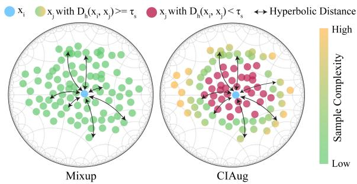
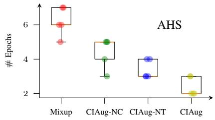
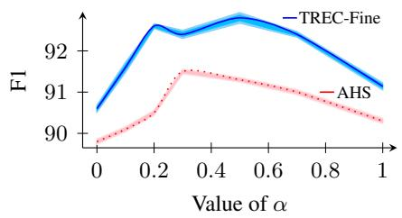

# CIAug: Equipping Interpolative Augmentation with Curriculum Learning

Ramit Sawhney†∗, Ritesh Soun♣∗, Shrey Pandit§∗, Megh Thakkar§∗, Sarvagya Malaviya⋆, Yuval Pinter△

†Georgia Institute of Technology ♣Sri Venkateswara College, DU §BITS, Pilani ⋆Manipal University Jaipur △Ben-Gurion University of the Negev rsawhney31@gatech.edu, uvp@cs.bgu.ac.il

## Abstract

Interpolative data augmentation has proven to be effective for NLP tasks. Despite its merits, the sample selection process in mixup is random, which might make it difficult for the model to generalize better and converge faster. We propose CIAug, a novel curriculum-based learning method that builds upon mixup. It leverages the relative position of samples in hyperbolic embedding space as a complexity measure to gradually mix up increasingly difficult and diverse samples along training. CIAug achieves state-of-the-art results over existing interpolative augmentation methods on 10 benchmark datasets across 4 languages in text classification and named-entity recognition tasks. It also converges and achieves benchmark F1 scores 3 times faster. We empirically analyze the various components of CIAug, and evaluate its robustness against adversarial attacks.

## 1 Introduction

Data augmentation is an effective tool for avoiding overfitting in model training in cases where there is an absence of sufficient training data (Liu et al., 2021). Interpolative augmentation techniques, such as Mixup (Zhang et al., 2018), have shown an increase in model performance across various modalities, with further improvements gained by applying Mixup at latent representation layers (Chen et al., 2020a). Current implementations of Mixup select samples for interpolation at random, not leveraging the potential for adaptive selection techniques which have been shown to lead to better generalizability (Chen et al., 2020b). In addition, these methods do not account for the spatial distribution of linguistic data, known to extend beyond the capacities of euclidean space (Nickel and Kiela, 2017).

  
Figure 1: Overview of CIAug showing curriculumbased sample selection using hyperbolic distance to perform interpolation.

We propose CIAug1, a method which addresses these challenges by offering an augmentation procedure that selects samples in an adaptive fashion and is geometrically sound. CIAug’s sampling strategy follows the idea that selecting easier mixing samples first and gradually increasing sample difficulty based on relative spatial position would generate more suitable synthetic inputs, resulting in better model training (Xu et al., 2021). This notion ties in with the framework of curriculum learning (Krueger and Dayan, 2009), where training data is presented in a similarly staggered way, increasing model capabilities (Bengio et al., 2009). CIAug’s selection strategy performs distance operations in hyperbolic space, applying insights about language data spatial distribution to its definition of ‘similar samples’ (Tifrea et al., 2019). We first train CIAug by sampling pairs of sentences similar to each other for mixing, then gradually as training progresses, we sample sentences that are dissimilar, following the curriculum learning strategy.

Through experiments on 10 benchmark datasets in English, Arabic, Turkish and German, we show that CIAug outperforms state-of-the-art models in classification and named-entity recognition tasks. We probe the effectiveness of CIAug in conjunction with different similarity measures and qualitatively evaluate it. We show that CIAug converges faster than traditional Mixup while being both generalizable across tasks and languages, as well as more resilient to adversarial classification examples.

## 2 Methodology

We illustrate CIAug’s sample selection strategy in Figure 1. In this section, we first introduce Mixup (§2.1), and follow by formulating CIAug and its relative sample distribution component (§2.2).

## 2.1 Interpolative Mixup

Given two data samples $x _ { i } , x _ { j } \in X$ with labels $y _ { i } , y _ { j } \in Y$ , where $i , j \in [ 1 , \overset { \cdot } { N } ]$ , Mixup (Zhang et al., 2018) performs a linear interpolation with ratio r between these two samples according to eq. (1), creating a new synthetic data point $x ^ { \prime }$ and its label $y ^ { \prime } { \mathrm { : } }$

$$
\begin{array} { r } { x ^ { \prime } = \mathbf { M i x u p } ( x _ { i } , x _ { j } ) = r \cdot x _ { i } + ( 1 - r ) \cdot x _ { j } } \\ { y ^ { \prime } = \mathbf { M i x u p } ( y _ { i } , y _ { j } ) = r \cdot y _ { i } + ( 1 - r ) \cdot y _ { j } } \end{array}\tag{1}
$$

Interpolative Mixup (Chen et al., 2020a) performs linear interpolation over the latent representations of models. Let $f _ { \theta } ( \cdot )$ be a model with parameters θ having K layers. $f _ { \theta , n } ( \cdot )$ denotes the n-th layer of the model, $h _ { n }$ the hidden space vector at layer n for $n \in [ 1 , K ]$ , and $h _ { 0 }$ the input vector. Interpolative Mixup at a layer $k \sim [ 1 , K ]$ can be done by separately calculating the latent representation of the layers before the k-th layer. For input sample xi, we let $h _ { n } ^ { i }$ denote the hidden state representations at layer $n _ { : }$

$$
\begin{array} { r } { h _ { n } ^ { i } = f _ { \theta , n } ( h _ { n - 1 } ^ { i } ) , \quad n \in [ 1 , k ] } \\ { h _ { n } ^ { j } = f _ { \theta , n } ( h _ { n - 1 } ^ { j } ) , \quad n \in [ 1 , k ] } \end{array}\tag{2}
$$

We then perform Mixup over individual hidden state representations $h _ { k } ^ { i } , h _ { k } ^ { j }$ from layer k as,

$$
h _ { k } = \operatorname { M i x } \operatorname { u p } ( h _ { k } ^ { i } , h _ { k } ^ { j } ) = r \cdot h _ { k } ^ { i } + ( 1 - r ) \cdot h _ { k } ^ { j }\tag{3}
$$

The mixed hidden representation $h _ { k }$ is used as the input for the continuing forward pass,

$$
h _ { n } = f _ { \theta , n } ( h _ { n - 1 } ) ; \quad n \in [ k + 1 , K ] .\tag{4}
$$

Algorithm 1 CIAug   
M Learnable distance matrix initialized with hyperbolic   
distances   
N No. of training samples   
X  Training samples   
Y Training labels   
m No. of epochs   
τs Diversity threshold $\in ( 0 , 1 )$   
τ Curriculum threshold (0, 1) for sample complexity   
for $k \in \{ 1 , \ldots , m \}$ do   
for $i \stackrel { \cdot } { \in } \{ 1 , \ldots , N \}$ do   
Si SSET $( \dot { X , } M _ { i } , \tau _ { s } , \tau _ { c } )$ (6)   
Select $\boldsymbol { x } _ { j } \in _ { R } \boldsymbol { S ^ { \prime } } _ { i }$   
x′i CIMixup(xi, xj) (8)   
$y _ { \textit { i } } ^ { \prime } \gets \mathrm { C I M i x u p } ( y _ { i } , y _ { j } )$   
yout = Predict(x′i)   
$\underbrace { \mathrm { L o s s } } _ { \textit { \textbf { c o } } } ( y _ { o u t } , y _ { \textit { i } } ^ { \prime } )$   
end for   
τc UPDATE(τc) (7)   
end for

## 2.2 CIAug

Although Mixup helps models generalize better, it selects samples for interpolation randomly. Deriving information from the spatial distributions of the samples to be mixed, and utilising it to introduce curriculum and diversity in sample selection, can lead to performance improvements.

We present steps involved in CIAug in Algorithm 1. CIAug encodes the relative complexity between instances in a learnable matrix $\mathbf { M } \in \mathbb { R } ^ { \hat { N } \times N }$ which we initialize using a distance metric. Motivated by evidence that euclidean space, where models typically operate, is not able to effectively capture the complex properties of natural language data (Ganea et al., 2018), we use hyperbolic distance as our metric for modeling representations while performing interpolative operations (Sawhney et al., 2021). The hyperbolic distance $\mathcal { D } _ { h }$ between embeddings $e _ { i } = f _ { \theta } ( x _ { i } )$ and $e _ { j } = f _ { \theta } ( x _ { j } )$ is defined as:

$$
\mathcal { D } _ { h } ( e _ { i } , e _ { j } ) = 2 \tan ^ { - 1 } ( \lVert ( - e _ { j } ) \oplus e _ { i } \rVert ) ,\tag{5}
$$

where $\bigoplus$ represents Möbius addition (A.1).

In contrast to Mixup, CIAug is defined for one sample. Given a sample $x _ { i } ,$ we create a set Si of increasingly diverse samples in the dataset relative to $x _ { i }$ using an operation labeled SSET and thresholds $\tau _ { s }$ and $\tau _ { c } .$

$$
S _ { i } = { \bf S } { \bf S } \mathrm { E T } ( X , M _ { i } , \tau _ { s } , \tau _ { c } ) : = \{ x _ { k } | x _ { k } \in X , \tau _ { s } \leq { \bf M } _ { i k } \leq \tau _ { c } \} ,\tag{6}
$$

where $\tau _ { s } = \mathbf { T } { \cdot } \operatorname* { m a x } ( \mathbf { M } _ { i } )$ at each step of training, and $\mathrm { T } \in ( 0 , 1 )$ is a hyperparameter. $\tau _ { s }$ helps in sampling the most diverse samples relative to $x _ { i }$ . Although sample diversity helps the model generalize, it may not guarantee global convergence. Exposing the model to extremely diverse samples early in the training process can be detrimental to its performance. Therefore, we introduce a distance-based learning curriculum using a second threshold, $\tau _ { c } ,$ which selects mixing samples which are increasingly diverse from $x _ { i } { ' } s$ perspective. $\tau _ { c }$ is dynamically updated during training using an UPDATE operation:

$$
\mathrm { U P D A T E } \big ( \tau _ { c } \big ) : = \tau _ { c } + \alpha ,\tag{7}
$$

where $\alpha \in ( 0 , 1 )$ is a hyperparameter and $\tau _ { c } = 0 . 1$ initially.

We then sample a random instance from $x _ { j } \in S _ { i }$ to perform Mixup with $x _ { i }$

Using M, we change the Mixup formulation (Equation 1) for samples i and $j$ and define CIMixup as,

$$
\mathrm { C I M i x u p } ( x _ { i } , x _ { j } ) = ( 1 - \mathbf { M } _ { i j } ) \cdot x _ { i } + \mathbf { M } _ { i j } \cdot x _ { j }\tag{8}
$$

Finally, we formulate CIAug as:

$$
\mathrm { C I A U G } ( x _ { i } ) = \mathbf { C I M I X U P } ( x _ { i } , x _ { j } ) , \quad x _ { j } \in S _ { i } .\tag{9}
$$

We replace the Mixup operation from Equation 3 with the CIAug operation in Equation 9 to evaluate CIAug. The final hidden state output $h _ { K }$ is passed through a multi-layer perceptron (MLP) $g _ { \phi }$ for classification. We optimize the network using KL Divergence loss between the final output $g _ { \phi } { \left( h _ { K } \right) }$ and mixed label $y ^ { \prime } = \mathtt { C I M i x u p } ( y _ { i } , y _ { j } )$ which also trains the matrix M end-to-end.

## 3 Experimental Setup

We evaluate CIAug on classification and NER tasks in various settings across 4 languages, and on GLUE datasets (Wang et al., 2018).

## 3.1 Training Setup

We use BertAdam optimizer (Wolf et al., 2020) with a learning rate of 2e-5, batch size of 8 and weight decay of 0.01, trained for 10 epochs. CIAug is performed over a layer randomly sampled from all model layers. For the datasets in English we use BERT (Devlin et al., 2019) as our base model $f _ { \theta } ,$ and for other languages we use mBERT. For calculating distances between instances, we use the [CLS] token representation from the sentence embeddings. Due to lack of powerful computational resources, we train on 10,000 samples for SST-2 dataset, and keep the validation and test set unchanged.

<table><tr><td></td><td> $f _ { \theta }$ </td><td>WMix</td><td>SMix</td><td>HMix</td><td>CIAug</td></tr><tr><td>SST-2</td><td>90.32</td><td>91.34</td><td>91.21</td><td>56.31</td><td>92.93 米</td></tr><tr><td>TREC-Fine</td><td>90.16</td><td>87.13</td><td>87.89</td><td>11.70</td><td>92.80* 4</td></tr><tr><td>TREC-Coarse</td><td>97.52</td><td>96.10</td><td>96.59</td><td>25.80</td><td>98.20* 4</td></tr><tr><td>COLA</td><td>84.91</td><td>84.95</td><td>85.15</td><td>69.31</td><td>95.32* 4</td></tr><tr><td>TTC</td><td>91.30</td><td>90.18</td><td>91.15</td><td>23.66</td><td>91.50*</td></tr><tr><td>AHS</td><td>70.25</td><td>72.20</td><td>71.70</td><td>54.14</td><td>74.14*</td></tr><tr><td>RTE</td><td>65.56</td><td>67.50</td><td>62.81</td><td>46.42</td><td>68.23 *</td></tr><tr><td>MRPC</td><td>86.37</td><td>85.78</td><td>85.29</td><td>68.38</td><td>87.01 水</td></tr><tr><td>CONLL-en</td><td>85.35</td><td>86.29</td><td>85.94</td><td>76.77</td><td>86.85*</td></tr><tr><td>CONLL-de</td><td>90.91</td><td>91.73</td><td>91.86</td><td>80.36</td><td>92.64*</td></tr></table>

Table 1: Performance comparison of CIAug with other baseline augmentation methods. Improvements are shown in blue . Bold shows the best result. ∗ shows significant (p<0.01) improvement over baseline $f _ { \theta }$
<table><tr><td></td><td>Non-trainable M Euc-CIAug CIAug</td><td>Trainable M Euc-CIAug CIAug</td></tr><tr><td>SST-2</td><td>91.17 92.67</td><td>91.71 92.93*</td></tr><tr><td>Trec-fine</td><td>92.10 93.00</td><td>92.40 92.80</td></tr><tr><td>Trec-coarse 97.50</td><td>97.80</td><td>97.61 98.20*</td></tr><tr><td>CoLA 87.76</td><td>91.92</td><td>92.55 95.32*</td></tr><tr><td>TTC 90.87</td><td>91.33</td><td>91.00 91.50*</td></tr><tr><td>AHS 67.42</td><td>72.57</td><td>70.42 74.14*</td></tr><tr><td>RTE</td><td>68.95</td><td>62.09</td></tr><tr><td>64.62 MRPC 84.55</td><td>85.04</td><td>68.23 84.31 87.00*</td></tr><tr><td>CoNLL-en 85.49</td><td>86.77</td><td>86.63 86.85*</td></tr><tr><td>CoNLL-de 91.05</td><td>92.32</td><td>91.91 92.64*</td></tr></table>

Table 2: Ablation study of CIAug with different distance constraints. Bold shows the best result. ∗ shows significant (p<0.01) improvement over Euc-CIAug-NT

## 3.2 Evaluation

For a comprehensive evaluation, we compare CIAug with some standard baselines: word-mixup (WMix), sentence-mixup (SMix) (Guo et al., 2019), HypMix(HMix) (Sawhney et al., 2021). We use F1 score as a metric for evaluating CIAug and comparing it with other baselines.

## 4 Results and Analysis

We present our main results in Table 1. We observe that CIAug outperforms the baseline $f _ { \theta } ,$ , validating that selecting diverse samples based on similarity enhances the model performance. We further find that the hyperbolic variant of sample selection performs better than the Euclidean CIAug (Table 5 in the appendix). This validates that hyperbolic space is more capable of capturing the complex hierarchical information present in the sentence representation, leading to better comparison and sample selection.

<table><tr><td rowspan="3">T</td><td></td><td> $\tau _ { s }$  Euc</td><td>Hyp</td></tr><tr><td>Euc</td><td>91.71</td><td>92.43</td></tr><tr><td>Hyp</td><td>91.82</td><td>92.93</td></tr></table>

(a) SST-2 Dataset

<table><tr><td rowspan="2">T</td><td colspan="2"> $\tau _ { s }$  Euc Hyp</td></tr><tr><td>Euc Hyp</td><td>62.09 64.26 63.17 68.23</td></tr></table>

(b) RTE Dataset

Table 3: F1-score with different distance metrics for diversity and curriculum threshold, $\tau _ { s }$ and $\tau _ { c } .$  
  
Figure 2: Convergence comparison of Mixup with CIAug-NC (No curriculum), CIAug-NT, CIAug as number of training epochs needed to reach a benchmark F1 score. (AHS benchmark score:72%).

We also compare CIAug with its non-trainable matrix counterpart where sample selection is based on the relative position of sentences, using a constant matrix M. We observe that this variant performs worse, suggesting that M is able to capture sample-specific information relative to other samples, generating more suitable sample selection and mixing ratio while performing interpolative data augmentation.

Impact of distance metric We explore the effectiveness of CIAug with the euclidean and hyperbolic distance measures as diversity and complexity metric for the thresholds, $\tau _ { s }$ and $\tau _ { c } .$ The results, presented in Table 3, show that utilizing hyperbolic distance for both thresholds yields the best results, suggesting that hyperbolic space captures the hierarchical properties of textual data better, gauging the relative diversity and complexity of samples effectively.

Analysing the convergence of CIAug For all benchmark datasets, we observe that CIAug reaches a benchmark F1 score faster than Mixup method, as shown in Figure 2.2 As CIAug selects samples for Mixup based on a learning curriculum, it leads to generation of more suitable synthetic samples in a staggered manner resulting in better training (Xu et al., 2021) and faster convergence.

<table><tr><td>Method</td><td>Accuracy</td><td>Adversarial Accuracy</td></tr><tr><td>Mixup</td><td>65.56</td><td>55.95</td></tr><tr><td>CIAug-NT</td><td>68.95</td><td>66.06</td></tr><tr><td>CIAug</td><td>68.23</td><td>64.62</td></tr></table>

Table 4: Performance on adversarial examples generated using synonym substitution on RTE.

  
Figure 3: Change in performance in terms of F1 with varying α for CIAug

Adversarial Robustness Adversarial attacks confuse a model by providing specifically designed inputs. We compare the robustness of CIAug with Mixup by performing black-box adversarial attacks. Using the NLPAug library (Ma, 2019) we substitute up to 10% of the words in each sentence with their synonyms found in WordNet (Feinerer and Hornik, 2020) and present the results in Table 4. We observe that both CIAug-NT and CIAug are more robust compared to regular Mixup by a difference of 6.72% and 6% respectively. This robustness towards adversarial attacks could be attributed to the curriculum-learning-based interpolative technique which resulted in better training and generalizibility of underlying model.

Curriculum threshold We perform a study on CIAug by varying α in the the curriculum learning threshold $\tau _ { c }$ as in equation 7, and present it in Figure 3. A lower value of α would result in the slow increase of $\tau _ { c } ,$ which can lead the underlying model to not converge properly, whereas a higher value of $\alpha$ would result in accelerated increase of $\tau _ { c } ,$ losing the advantages of curriculum learning. Figure 3 shows the existence of an optimal α for curriculum learning.

## 5 Conclusion

We propose CIAug, a novel mixup technique that uses curriculum learning, leveraging the relative spatial positions of the samples in the embedding space as a measure of complexity to signal curriculum learning. CIAug achieves state-of-the-art results over existing interpolative data augmentation methods on 10 standard and multilingual datasets in English, Arabic, Turkish and German. CIAug converges faster than the traditional Mixup technique, while being generalizable across different tasks and modalities.

## References

Nuha Albadi, Maram Kurdi, and Shivakant Mishra. 2018. Are they our brothers? analysis and detection of religious hate speech in the arabic twittersphere. In Proceedings ofthe 2018 IEEE/ACM International Conference on Advances in Social Networks Analysis and Mining, pages 69–76. ACM.

Yoshua Bengio, Jérôme Louradour, Ronan Collobert, and Jason Weston. 2009. Curriculum learning. In Proceedings ofthe 26th Annual International Conference on Machine Learning, ICML ’09, page 41–48, New York, NY, USA. Association for Computing Machinery.

Luisa Bentivogli, Peter Clark, Ido Dagan, and Danilo Giampiccolo. 2009. The fifth pascal recognizing textual entailment challenge. In TAC.

Jiaao Chen, Zichao Yang, and Diyi Yang. 2020a. Mix-Text: Linguistically-informed interpolation of hidden space for semi-supervised text classification. In Proceedings of the 58th Annual Meeting of the Associationfor Computational Linguistics, pages 2147– 2157, Online. Association for Computational Linguistics.

Ting Chen, Simon Kornblith, Mohammad Norouzi, and Geoffrey Hinton. 2020b. A simple framework for contrastive learning of visual representations. arXiv preprint arXiv:2002.05709.

Jacob Devlin, Ming-Wei Chang, Kenton Lee, and Kristina Toutanova. 2019. Bert: Pre-training of deep bidirectional transformers for language understanding.

William B Dolan and Chris Brockett. 2005. Automatically constructing a corpus of sentential paraphrases. In Proceedings ofthe Third International Workshop on Paraphrasing (IWP2005).

Ingo Feinerer and Kurt Hornik. 2020. wordnet: Word-Net Interface. R package version 0.1-15.

Octavian-Eugen Ganea, Gary Bécigneul, and Thomas Hofmann. 2018. Hyperbolic neural networks.

Hongyu Guo, Yongyi Mao, and Richong Zhang. 2019. Augmenting data with mixup for sentence classification: An empirical study. arXiv preprint arXiv:1905.08941.

Ganesh Jawahar, Benoît Sagot, and Djamé Seddah. 2019. What does BERT learn about the structure of language? In Proceedings ofthe 57th Annual Meeting ofthe Associationfor Computational Linguistics,

pages 3651–3657, Florence, Italy. Association for Computational Linguistics.

Amit Jindal, Arijit Ghosh Chowdhury, Aniket Didolkar, Di Jin, Ramit Sawhney, and Rajiv Ratn Shah. 2020. Augmenting NLP models using latent feature interpolations. In Proceedings ofthe 28th International Conference on Computational Linguistics, pages 6931– 6936, Barcelona, Spain (Online). International Committee on Computational Linguistics.

Deniz Kilinç, Akin Ozcift, Fatma Bozyigit, Pelin˘ Yildirim, Fatih Yucalar, and Emin Borandag. 2017.˘ Ttc-3600: A new benchmark dataset for turkish text categorization. Journal ofInformation Science, 43:174–185.

Kai A. Krueger and Peter Dayan. 2009. Flexible shaping: How learning in small steps helps. Cognition, 110(3):380–394.

James P Lee-Thorp, Joshua Ainslie, Ilya Eckstein, and Santiago Ontañón. 2021. Fnet: Mixing tokens with fourier transforms. ArXiv, abs/2105.03824.

Xin Li and Dan Roth. 2002. Learning question classifiers. In COLING 2002: The 19th International Conference on Computational Linguistics.

Linlin Liu, Bosheng Ding, Lidong Bing, Shafiq Joty, Luo Si, and Chunyan Miao. 2021. MulDA: A multilingual data augmentation framework for lowresource cross-lingual NER. In Proceedings of the 59th Annual Meeting ofthe Associationfor Computational Linguistics and the 11th International Joint Conference on Natural Language Processing (Volume 1: Long Papers), pages 5834–5846, Online. Association for Computational Linguistics.

Edward Ma. 2019. Nlp augmentation. https://github.com/makcedward/nlpaug.

Maximillian Nickel and Douwe Kiela. 2017. Poincaré embeddings for learning hierarchical representations. Advances in neural information processing systems, 30:6338–6347.

Ramit Sawhney, Megh Thakkar, Shivam Agarwal, Di Jin, Diyi Yang, and Lucie Flek. 2021. HypMix: Hyperbolic interpolative data augmentation. In Proceedings ofthe 2021 Conference on Empirical Methods in Natural Language Processing, pages 9858– 9868, Online and Punta Cana, Dominican Republic. Association for Computational Linguistics.

Richard Socher, Alex Perelygin, Jean Wu, Jason Chuang, Christopher D. Manning, Andrew Ng, and Christopher Potts. 2013. Recursive deep models for semantic compositionality over a sentiment treebank. In Proceedings of the 2013 Conference on Empirical Methods in Natural Language Processing, pages 1631–1642, Seattle, Washington, USA. Association for Computational Linguistics.

Alexandru Tifrea, Gary Becigneul, and Octavian-Eugen Ganea. 2019. Poincare glove: Hyperbolic word embeddings. In International Conference on Learning Representations.

Erik F. Tjong Kim Sang and Fien De Meulder. 2003. Introduction to the conll-2003 shared task: Languageindependent named entity recognition. In Proceedings of the Seventh Conference on Natural Language Learning at HLT-NAACL 2003 - Volume 4, CONLL ’03, page 142–147, USA. Association for Computational Linguistics.

Alex Wang, Amanpreet Singh, Julian Michael, Felix Hill, Omer Levy, and Samuel Bowman. 2018. GLUE: A multi-task benchmark and analysis platform for natural language understanding. In Proceedings ofthe 2018 EMNLP Workshop BlackboxNLP: Analyzing and Interpreting Neural Networks for NLP, pages 353–355, Brussels, Belgium. Association for Computational Linguistics.

Sinong Wang, Han Fang, Madian Khabsa, Hanzi Mao, and Hao Ma. 2021. Entailment as few-shot learner. ArXiv, abs/2104.14690.

Alex Warstadt, Amanpreet Singh, and Samuel R Bowman. 2018. Neural network acceptability judgments. arXiv preprint arXiv:1805.12471.

Thomas Wolf, Lysandre Debut, Victor Sanh, Julien Chaumond, Clement Delangue, Anthony Moi, Pierric Cistac, Tim Rault, Remi Louf, Morgan Funtowicz, Joe Davison, Sam Shleifer, Patrick von Platen, Clara Ma, Yacine Jernite, Julien Plu, Canwen Xu, Teven Le Scao, Sylvain Gugger, Mariama Drame, Quentin Lhoest, and Alexander Rush. 2020. Transformers: State-of-the-art natural language processing. In Proceedings ofthe 2020 Conference on Empirical Methods in Natural Language Processing: System Demonstrations, pages 38–45, Online. Association for Computational Linguistics.

Shusheng Xu, Xingxing Zhang, Yi Wu, and Furu Wei. 2021. Sequence level contrastive learning for text summarization. ArXiv, abs/2109.03481.

Zhilin Yang, Zihang Dai, Yiming Yang, Jaime G. Carbonell, Ruslan Salakhutdinov, and Quoc V. Le. 2019. Xlnet: Generalized autoregressive pretraining for language understanding. In NeurIPS.

Soyoung Yoon, Gyuwan Kim, and Kyumin Park. 2021. SSMix: Saliency-based span mixup for text classification. In Findings of the Association for Computational Linguistics: ACL-IJCNLP 2021, pages 3225–3234, Online. Association for Computational Linguistics.

Hongyi Zhang, Moustapha Cisse, Yann N. Dauphin, and David Lopez-Paz. 2018. mixup: Beyond empirical risk minimization. In International Conference on Learning Representations.

<table><tr><td>Model</td><td>SST-2 CoLA</td><td>TREC-Coarse</td><td>TREC-Fine</td></tr><tr><td>XLNet (2019)</td><td>97.00 70.20</td><td>94.58</td><td>87.49</td></tr><tr><td>EFL (2021)</td><td>96.90 86.40</td><td>93.36</td><td>80.90</td></tr><tr><td>FNet (2021)</td><td>94.00 78.00</td><td>96.89</td><td>89.97</td></tr><tr><td>SSMix (2021)</td><td>92.95 86.76</td><td>97.60</td><td>90.24</td></tr><tr><td>EMix (2020)</td><td>91.13 85.21</td><td>97.44</td><td>90.04</td></tr><tr><td>CIAug (Ours)</td><td>92.93 95.32</td><td>98.20</td><td>92.80</td></tr></table>

Table 5: Performance comparison with additional baselines and interpolative augmentation methods.

## A Hyperbolic Geometry

## A.1 Möbius Addition

Möbius addition  for a pair of points $x , y \in B .$ defined as,

$$
x \oplus y : = { \frac { ( 1 + 2 \langle x , y \rangle + | | y | | ^ { 2 } ) x + ( 1 - | | x | | ^ { 2 } ) y } { 1 + 2 \langle x , y \rangle + | | x | | ^ { 2 } | | y | | ^ { 2 } } }\tag{10}
$$

$\langle . , . \rangle , | | \cdot | |$ are Euclidean inner product and norm.

## B Extended Analysis

We compare the performance of CIAug with some recent baselines and interpolative augmentation techniques like (Jindal et al., 2020) and (Yoon et al., 2021) on standard English and GLUE datasets.

## C Dataset Details

1. TTC. (Kilinç et al., 2017), Turkish Text Categorization dataset consists of 3600 Turkish documents (news/texts) classified into 6 classes.

2. CoLA. (Warstadt et al., 2018), abbreviation for the Corpus of Linguistic Acceptability is a part of GLUE (Wang et al., 2018) benchmark. It is a collection of English sentences from 23 linguistic publications that are annotated for their grammatical acceptability.

3. SST-2. (Socher et al., 2013) is a GLUE (Wang et al., 2018) benchmark dataset consisting of English sentences from movie reviews. Samples in the dataset are annotated for sentiment classification task.

4. TREC-Coarse. (Li and Roth, 2002), The Text REtrieval Conference-Coarse is a question classification dataset consisting of 6 classes. The data is sourced from English questions by USC, TREC 8, TREC 9, TREC 10 and manually constructed questions.

5. TREC-Fine. (Li and Roth, 2002) contains the same set of questions as TREC-Coarse grouped into 47 fine-grained classes.

6. AHS. (Albadi et al., 2018) is an Arabic hate speech classification dataset focusing mainly on Saudi Twittersphere.

7. RTE. (Bentivogli et al., 2009) The Recognizing Textual Entailment (RTE) datasets come from a series of textual entailment challenges. Data from RTE1, RTE2, RTE3 and RTE5 is combined. Examples are constructed based on news and Wikipedia text. Metric used here is accuracy

8. MRPC.(Dolan and Brockett, 2005) The Microsoft Research Paraphrase Corpus is a corpus of sentence pairs automatically extracted from online news sources, with human annotations for whether the sentences in the pair are semantically equivalent. Metric used here is accuracy

9. CONLL. (Tjong Kim Sang and De Meulder, 2003) It is a named entity recognition dataset released as a part of CoNLL-2003 shared task: language-independent named entity recognition. The data consists of eight files covering two languages: English and German.

## D Experimental Setup

We provide a detailed explanation of our experimental setup in table 6

<table><tr><td rowspan=1 colspan=1>Parameter                                  Value</td></tr><tr><td rowspan=1 colspan=1>Optimizer                       BERTAdam 2020</td></tr><tr><td rowspan=1 colspan=1>Learning Rate                                2e-5</td></tr><tr><td rowspan=1 colspan=1>Batch Size                                       8</td></tr><tr><td rowspan=1 colspan=1> $\beta _ { 1 } , \beta _ { 2 } , \epsilon$                            0.9, 0.999, 1e-6</td></tr><tr><td rowspan=1 colspan=1># Epochs                                       10</td></tr><tr><td rowspan=1 colspan=1>Evaluation Metric                        F1 Score</td></tr><tr><td rowspan=1 colspan=1>BERT-base-uncased,Base ModelBERT-base-multilingual-uncased</td></tr><tr><td rowspan=1 colspan=1>ClassifierLinear layer(over architecture)</td></tr><tr><td rowspan=1 colspan=1>Hardware                            Nvidia V100</td></tr></table>

Table 6: Model and training setup for CIAug.

<table><tr><td>Mixup Layer Set</td><td>AHS MRPC</td></tr><tr><td>{3,4}</td><td>71.12 82.84</td></tr><tr><td>{1,2}</td><td>72.21 85.62</td></tr><tr><td>{6,7,9}</td><td>72.57 83.08</td></tr><tr><td>{7,9,12}</td><td>73.77 84.06</td></tr><tr><td>{3,4,6,7,9,12} 74.14</td><td>87</td></tr></table>

Table 7: Layer-wise ablation score (F1) when performing interpolative augmentation.

## E Qualitative Analysis

## E.1 Layer-wise Ablation

We compare the performance of CIAug on different set of mixup layers in table 7. TMix attains best performance on layer set 7,9,12 is used because layers 6,7,9,12 contains the most amount of syntactic and semantic information (Chen et al., 2020a). CIAug achieves best performance on layer set 3,4,6,7,9,12, this suggests other than syntactic and semantic information, curriculum learning based approach in CIAug helps to capture the surface-level information in layer 3 and 4 (Jawahar et al., 2019).

## F Limitations

Even though CIAug converges faster and performs better than other baseline interpolative techniques, the computational power required is not so fairly available in many devices. We plan to work on improving the efficiency of the parameterized matrices involved in the computation, such as using sparse matrices.