# COSIM: Commonsense Reasoning for Counterfactual Scene Imagination

Hyounghun Kim\* Abhay Zala\* Mohit Bansal UNC Chapel Hill {hyounghk, aszala, mbansal}@cs.unc.edu

## Abstract

As humans, we can modify our assumptions about a scene by imagining alternative objects or concepts in our minds. For example, we can easily anticipate the implications of the sun being overcast by rain clouds (e.g., the street will get wet) and accordingly prepare for that. In this paper, we introduce a new dataset called Commonsense Reasoning for Counterfactual Scene Imagination (COSIM) which is designed to evaluate the ability of AI systems to reason about scene change imagination. To be specific, in this multimodal task/dataset, models are given an image and an initial questionresponse pair about the image. Next, a counterfactual imagined scene change (in textual form) is applied, and the model has to predict the new response to the initial question based on this scene change. We collect 3.5K high-quality and challenging data instances, with each in stance consisting of an image, a commonsense question with a response, a description of a counterfactual change, a new response to the question, and three distractor responses. Our dataset contains various complex scene change types (such as object addition/removal/state change, event description, environment change, etc.) that require models to imagine many different scenarios and reason about the changed scenes. We present a baseline model based on a vision-language Transformer (i.e., LXMERT) and ablation studies. Through human evaluation, we demonstrate a large human-model performance gap, suggesting room for promising future work on this challenging, counterfactual multimodal task.1

## 1 Introduction

Anticipating what would happen when there is a condition change in a situation is an important ability as it allows preparation for the implications of the change. For example, when swimming in the sea on a clear day, you might feel safe. However, if someone told you a storm warning has been issued and dark clouds are coming in soon, you would know that it is no longer safe to swim and return to land. It will be also very useful to have AI systems that could reason about the implications of such scenario changes and provide appropriate guidance/warnings; however, current AI systems will have a hard time performing such counterfactual commonsense reasoning.

Many efforts have been made to teach machines how to reason about images (Antol et al., 2015; Zhu et al., 2016; Johnson et al., 2017; Hudson and Manning, 2019) and videos (Tapaswi et al., 2016; Jang et al., 2017; Zhu et al., 2017; Lei et al., 2018). This area has been built upon further by efforts to teach machines to use commonsense knowledge when analyzing visual scenes (Pirsiavash et al., 2014; Wagner et al., 2018; Zellers et al., 2019; Park et al., 2020). Through these efforts, many AI systems have reached near human-level performance on scene understanding tasks. On the other hand, more complex reasoning on scene ‘changes’ has been less explored. Sampat et al. (2021) applies simple condition manipulations (e.g., “Paint the small green ball with cyan color”) on synthetic images in a visual question answering setup. However, this task is based on simple block objects that might not require complex implicit reasoning. Thus, complicated counterfactual commonsense reasoning on scene changes on real-world images and situations remains widely unexplored.

Therefore, in this paper, we introduce a new dataset called Commonsense Reasoning for Counterfactual Scene Imagination (COSIM) to evaluate the commonsense reasoning ability of agents about counterfactual visual scenes imagined via textual descriptions. To be specific, one data instance in our COSIM dataset consists of an image, an initial question-response pair, an imagined visual scene change, and a new response with three distractors. The question is about commonsense which can be inferred from the image and the initial response includes a reasoning/justification for its answer. The imagined visual scene change is a textual description of what to modify in the scene to alter the conditions. The new response follows the same format as the initial response, but should be influenced by the imagined change (see Figure 1).

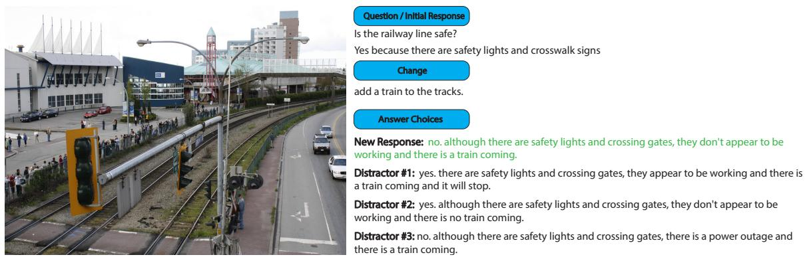  
Figure 1: Example from our COSIM dataset. An image is associated with an initial commonsense question-response pair, a described counterfactual change to the image, and a new response to the question with three distractors.

A model for this task needs to take this context information as input and try to predict the correct new response among other distractors. The distractors look similar to the correct new response but have subtle differences and are semantically different from the correct new response, thus a good model on this challenging new multimodal task cannot take shortcuts and needs to fully understand what each choice means based on the context. For example, as shown in Figure 1, given an image, the initial question-response pair (“Is the railway line safe?” - “Yes because there are safety lights and crosswalk signs”), and the scene change (“add a train to the tracks.”), models should choose the correct new response (“no. although there are safety lights and crossing gates, they don’t appear to be working and there is a train coming.") among other distractors (“no. although there are safety lights and crossing gates, there is a power outage and there is a train coming.”, etc.). To solve this problem, models need to be able to understand the implications of an incoming train and how safety lights and gates operate at a railroad crossing.

We collect 3.5K high-quality and challenging data instances for this new multimodal reasoning task via a crowd-sourcing annotation platform. To collect each data instance and to help reduce individual crowd-worker load, we break the task up into three separate phases: the question collection phase, the scene change collection phase, and the distractor collection phase. During the distractor collection phase, to help avoid unexpected biases such as text-only, we implement a modified version of Human-And-Model-in-the-Loop Enabled Training (HAMLET) adversarial data collection (Nie et al., 2020) for the validation and test splits. We deploy the model trained on only the textual data and allow annotators to test their distractors against the model as they write (see Figure 2).

Our COSIM dataset features several diverse types of imagined scene changes (object addition/removal, object state changes, etc.; see Sec. 5.2 for the full change type list and examples) which requires to deeply understand the contexts, making the task very challenging. For example, to understand the scene change of “Add another person to the dock ...”, the model should figure out what a dock is, where it is located in the image and be able to add one more person onto it via imagination.

As a baseline model for this new multimodal reasoning task, we employ a vision-language Transformer (based on LXMERT (Tan and Bansal, 2019)) which computes vision and language feature matching scores via multi-head self-attention layers followed by cross-modal attention layers, and we report ablation studies on input modality and scene change types. We also show a large human-model performance gap allowing more effective future work from the community on this new challenging multimodal task on commonsense reasoning for imagined counterfactual scene changes.

## 2 Related Work

Visual Question Answering. There have been many efforts to teach machines how to reason about images (Antol et al., 2015; Zhu et al., 2016; Johnson et al., 2017; Hudson and Manning, 2019) and videos (Tapaswi et al., 2016; Jang et al., 2017; Zhu et al., 2017; Lei et al., 2018), and in some of these tasks, machine performance is approaching human levels. Although these tasks require a complicated reasoning process, they provide very explicit context to solve the problems and might not be enough to evaluate the ability to reason about implicit aspects (i.e., commonsense).

Visual Commonsense Reasoning. Another actively explored line of study has been on visual commonsense reasoning (Pirsiavash et al., 2014; Wagner et al., 2018; Zellers et al., 2019; Park et al., 2020). In addition to using the provided clues in the context, these tasks require commonsense knowledge to reason about given problems, making these tasks more challenging since machines should be equipped with prior or external information. However, these tasks handle static scene understanding for which contexts and conditions are not changed during the reasoning process. On the other hand, our proposed COSIM introduces an additional dimension of difficulty by integrating imagined scene changes in the context. Moreover, the changes in our COSIM dataset are imagined (textually) and counterfactual, so imagination-based commonsense is required for the reasoning.

Textual Scene Change. Recent effort has been made on visual understanding by requiring mental simulation of changes to the scene (Sampat et al., 2021). These tasks require simulating change without any visible result, hence increasing the difficulty of VQA tasks. They, however, have been completed in the simpler context of basic shapes and objects and simple questions (E.g. “How many blue objects will be present in this scene?”). Our COSIM dataset is based on complex real-world images/situations requiring commonsense reasoning about imagined counterfactual scene changes, allowing for evaluation of the ability to anticipate the implications of complex situation changes, thus, future events.

## 3 Task

Given a real-world image, models should predict a new response conditioned on the initial questionresponse pair and the imagined counterfactual scene change.

Initial Question and Response. The initial question-response pair is created only from a given image. The question and response themselves require quite an amount of commonsense reasoning to understand. For example, to understand the response to the question in Figure 1 (“Is the railway line safe?”), models should know that the ‘safety lights’ and ‘crosswalk signs’ are devised for keeping people safe around the railway (“Yes because there are safety lights and crosswalk signs”).

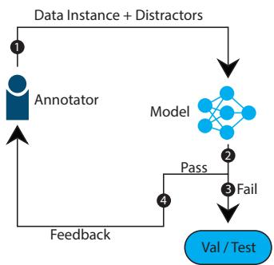  
Figure 2: HAMLET cycle for distractor collection on validation and test splits.

Imagined Counterfactual Scene Change. The imagined counterfactual scene change is a textual description that modifies the scene in the image. The change affects the reasoning process of the initial question and response, and provides a new context for the new response (“add a train to the tracks.”).

Response on the Scene Change. Models should respond to the initial question with a proper reason based on the imagined counterfactual scene change.2 The task is a multi-choice setup to pick the correct response among other distractors (“no. although there are safety lights and crossing gates, they don’t appear to be working and there is a train coming.”). To choose the correct response, models should understand what the implications and safety concerns of an incoming train are and that the safety lights should be turning on and the crossing gates should be closing when a train is in proximity.

## 4 Dataset

Our COSIM dataset is composed of 3.5K3 images paired with a commonsense question-response pair, a description of an imagined counterfactual change to the image, a new response to the question based on the effect of the described change, and then three distractor responses to the question (all text is in English).

We employ annotators from the crowd-sourcing platform Amazon Mechanical Turk4. Our data collection is broken into three separate phases (question, change, and distractor) in order to reduce the workload for each worker. In the question phase, workers are asked to select an image (from three random images) to use, write a commonsense question and then respond to it. In the change phase, they are asked to describe a counterfactual scene change for the image and then write a new response to the initial question. Lastly, in the distractor phase, they are asked to write three distractor responses for the question.

Commonsense Question Collection. To collect the initial question and response, we present three images to the workers and then ask them to choose the one that they want to use (images are taken from Visual Genome (Krishna et al., 2017)). Then using that image, they should come up with a commonsense question about the image. We define a commonsense question as a question that requires logical thought and understanding of what is happening in the image to be able to answer. Then workers are asked to write a response to their question (the initial response). A response consists of two parts, an “answer” that is a direct answer to the question (e.g. “Yes, ...”) and then a “justification” that uses visual clues from the image to prove the answer is correct (e.g. “..., because everyone is wearing shorts and short-sleeved shirts and a woman can be seen wearing sunglasses.”). See Appendix for the collection interface.

Counterfactual Scene Change Collection. In this phase, workers are given the image chosen from the previous commonsense question collection phase and the corresponding initial commonsense question-response pair. Then workers are asked to describe a counterfactual scene change for the image and write a new response to the question based on that scene change (the new response). To help ensure that workers describe a reasonable counterfactual scene change, we provide two guide templates for them to follow when they write. Workers are asked to select the guide template that they believe makes the most sense for them to use for each data instance (see Appendix for collection interface and guide template details).

Distractor Collection. Workers are given the image, the initial commonsense question-response pair, as well as the counterfactual scene change and new response. Then they are told to write three distractor responses that are similar to the new response but incorrect. To help ensure the distractors pose a challenge but are still distinct, we pre-fill the worker’s textboxes with the new response. Then they are told to edit the text enough so the answers become false and distinct.

HAMLET Data Collection. To avoid having unexpected biases such as context+response bias in our textual data, when collecting distractors for the validation and test splits, we implement a HAM-LET style collection (see Figure 2). We deploy the model trained only with textual data and allow workers to test their distractors directly against the model in real-time and check whether they are able to fool it. Workers are also permitted to edit the new response from the previous collection phase if it helps make distractor writing better (they must maintain the original meaning/intent of the new response if they choose to edit).

Data Verification. At each collection phase, we ask workers to verify the previous phase’s work. If the previous set of work is not good, workers are given a place to flag and describe the reason for flagging. This reasoning is manually reviewed and if it is fair, then that data is removed and prevented from progressing to the next phase.

Worker Qualifications and Payment. For all 3 phases, workers are required to pass certain qualifications before they could begin. As all of the phases require reading and writing English, they were required to be from native English-speaking countries. Workers were also required to have at least 1,000 approvals from other tasks and a 95% or higher approval rating. Then for each phase, we require workers to pass a qualification test that tests their understanding of their task at each phase. See Appendix for worker totals and pay (+bonus) rates.

## 5 Data Analysis

We collect 3.5K task instances (3.5K images, initial questions-response pairs, scene changes, new responses, and 10.5K distractors).

## 5.1 Statistics

Length. Lengths of each part of the data instances are shown in Table 1. While the lengths of questions are relatively short, the lengths of responses and the changes are long. This means that question itself does not contain detailed clues and models should figure out which information is needed to answer the question. On the other hand, the long responses contain reasons to justify their answers and require models to deeply understand the reasoning process to solve the problem. Furthermore, models should also carefully read the long textual scene change to capture all the condition modifications and apply them to images.

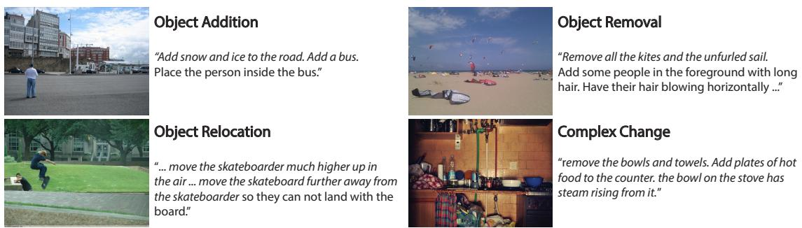  
Figure 3: Scene change examples from our COSIM dataset. The relevant portions of the change are in italics. Complex changes contain three or more changes within them (this example contains Object Removal, Object Addition, Object State Change).

<table><tr><td rowspan=1 colspan=1>Component</td><td rowspan=1 colspan=1>max.</td><td rowspan=1 colspan=1>min.</td><td rowspan=1 colspan=1>avg.</td><td rowspan=1 colspan=1>sd.</td></tr><tr><td rowspan=1 colspan=1>Question</td><td rowspan=1 colspan=1>22</td><td rowspan=1 colspan=1>3</td><td rowspan=1 colspan=1>7.6</td><td rowspan=1 colspan=1>3.03</td></tr><tr><td rowspan=1 colspan=1>Initial Response</td><td rowspan=1 colspan=1>59</td><td rowspan=1 colspan=1>4</td><td rowspan=1 colspan=1>18.62</td><td rowspan=1 colspan=1>8.06</td></tr><tr><td rowspan=1 colspan=1>Scene Change</td><td rowspan=1 colspan=1>127</td><td rowspan=1 colspan=1>3</td><td rowspan=1 colspan=1>16.08</td><td rowspan=1 colspan=1>13.01</td></tr><tr><td rowspan=1 colspan=1>New Response</td><td rowspan=1 colspan=1>109</td><td rowspan=1 colspan=1>5</td><td rowspan=1 colspan=1>23.38</td><td rowspan=1 colspan=1>12.40</td></tr><tr><td rowspan=1 colspan=1>Distractor</td><td rowspan=1 colspan=1>111</td><td rowspan=1 colspan=1>5</td><td rowspan=1 colspan=1>23.57</td><td rowspan=1 colspan=1>12.40</td></tr></table>

Table 1: In our COSIM dataset, each part has a different length according to its role and contained information.

Vocabulary. Among all data instances in our COSIM dataset, there are 9,946 total unique words. Within the commonsense questions, initial responses, scene changes, new responses, and the distractors, there are 3,261 / 4,397 / 4,637 / 5,318 / 6,404 unique words, respectively. The unique word count reflects what is shown by the lengths. Questions are on average the shortest part of each data instance and they have the fewest unique words. The new responses and distractors have long lengths and high unique word counts. The high unique word count for the distractors shows their diversity. Figure 4 shows the most commonly occurring keywords in our dataset. Many of the words are related to people and directional positioning.

## 5.2 Scene Change Type.

Different imagined scene change types are present in our COSIM dataset. Imagined scenes changes describe a change (with counterfactual thought) to the image by applying various properties. Some of these scene change types include object addition/removal, object state changes, environment changes, etc. (see Figure 3 for some scene change types and their examples; see Appendix for a figure with a complete list of all the types with examples). These scene change types, while they are seemingly easy to visualize, require a complex understanding of the effect of the change on other elements in the scene. See Figure 5 for type frequencies.

<table><tr><td rowspan=1 colspan=1>Number of changes present</td><td rowspan=1 colspan=1>Frequency</td></tr><tr><td rowspan=1 colspan=1>1</td><td rowspan=1 colspan=1>34.70%</td></tr><tr><td rowspan=1 colspan=1>2</td><td rowspan=1 colspan=1>35.82%</td></tr><tr><td rowspan=1 colspan=1>3</td><td rowspan=1 colspan=1>21.39%</td></tr><tr><td rowspan=1 colspan=1>Greater than 3</td><td rowspan=1 colspan=1>8.08%</td></tr></table>

Table 2: Frequency of number of change types present per instance (from the validation split).

Human/Object Addition. These two scene change types involve introducing new human(s)/object(s) into the image that was not there prior (“A bunch of old men are standing next to the birds ...” / “There are tears in his eyes ...”). The object addition scene change type is the most commonly appearing one.

Human/Object Removal. These two scene change types involve removing human(s)/object(s) that are visible in the image (“... remove the workers ...” / “Remove the two people’s coats”).

Object Replacement. This scene change type involves removing object(s) from the image and replacing them with something else (“... replace the plates offruit by plates ofdog biscuits ...”).

Object Relocation. This scene change type involves re-positioning object(s). Rather than changing it directly, this type changes its relation to other objects (“space the zebras out. move them a little

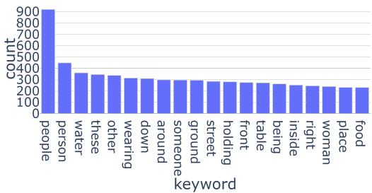  
Figure 4: Most commonly occurring keywords in our COSIM dataset. Many of them are related to people and directional positioning.

## further away”).

Object State Change. This scene change type involves altering the state of object(s) present in the image (“... change her luggage to all have a Burberry pattern ...”). The alteration of object(s) can occur in various forms such as changing color, size, shape, and orientation (e.g., opening a door).

Event Description. This scene change type involves the creation of an event or a description of motion or interaction between objects in the image. This type includes human actions and changes to human emotions (“A pack oflions are approaching the sheep.”).

Environment Change. This scene change type involves changes that cause large-scale changes to the entire environment either by drastically altering the current environment, creating a new environment, or causing changes in the weather (“there is very thick dust everywhere”).

Complex Changes. We define a complex change as a change that contains three or more different scene change types. For example, “someone is throwing snow ball at her” this change introduces a new human, a new object, and defines an interaction between all these and involves someone already present in the image. These complex changes require much thought to understand their full effect and implications. Complex changes make up about 30% of our dataset. See Table 2 for change types per instance statistics.

## 6 Models

We employ a vision-language Transformer as the base architecture of our baseline model for the COSIM task. To be specific, we use LXMERT (Tan and Bansal, 2019) to compute the score of each context-response pair given an image feature, and select one with the highest score among them.

We employ Faster R-CNN (Ren et al.,

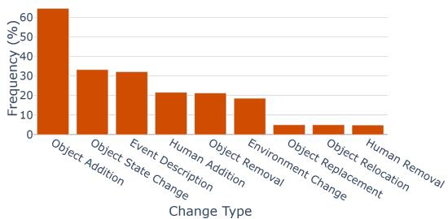  
Figure 5: Frequencies of the change types in our COSIM dataset (from the validation split).

2015) to extract object-level visual features $\begin{array} { r l r } { { \cal O } } & { { } = } & { \left\{ o _ { 1 } , o _ { 2 } , . . . , o _ { N _ { O } } \right\} } \end{array}$ and bound boxes $B = \{ b _ { 1 } , b _ { 2 } , . . . , b _ { N _ { O } } \}$ from an image I, where $N _ { O }$ is the number of detected object features. For textual feature encoding we use BERT (Devlin et al., 2019) as it is used in LXMERT. We concatenate all the textual data, i.e., question $Q = \{ q _ { 1 } , . . . , q _ { N _ { Q } } \}$ initial response $\begin{array} { r c l } { R _ { i } } & { = } & { \{ r _ { i 1 } , . . . , r _ { i N _ { R _ { i } } } \} } \end{array}$ , scene change $\textit { C } = \{ c _ { 1 } , . . . , c _ { N _ { C } } \}$ , and new response $\begin{array} { r l r } { { \cal R } _ { n } } & { { } = } & { \left\{ r _ { n 1 } , . . . , r _ { n N _ { { \cal R } _ { n } } } \right\} } \end{array}$ along with [CLS] and [SEP] tokens to create a sequence W = [CLS], Q, [SEP], Ri, [SEP], C, [SEP], $R _ { n } , [ \mathrm { S E P } ] \}$ where $N _ { Q } , N _ { R _ { i } } , N _ { C } .$ , and $N _ { R _ { n } }$ are the lengths of question, initial response, scene change, and new response, respectively.

$$
O , B = \mathrm { F R C N N } ( I )\tag{1}
$$

$$
\hat { O } = \mathrm { L i n e a r } _ { O } ( [ \mathrm { [ V \mathrm { - } T o k } _ { O } ] ; O ] _ { \mathrm { d i m = t } } )
$$

$$
\hat { B } = \mathrm { L i n e a r } _ { B } ( [ \mathrm { [ V - T o k } _ { B } ] ; B ] _ { \mathrm { d i m = t } } )\tag{2}
$$

$$
\hat { V } = \mathrm { L i n e a r } _ { { \cal O B } } ( [ \hat { { \cal O } } ; \hat { { \cal B } } ] _ { \mathrm { d i m = f } } )\tag{3}
$$

(4)

$$
L = \operatorname { E m b } ( W ) , \hat { L } = \operatorname { T F } _ { L } ( L )\tag{5}
$$

where LinearO, Linear $\mathbf { \partial } \cdot \mathbf { B } \mathbf { : }$ , and LinearOB are linear layers. $[ \mathrm { V - T o k } _ { O } ]$ and $[ \mathrm { V - T o k } _ { B } ]$ are visual token attached to object and bounding box sequences (like [CLS] for a language sequence), respectively, and $[ ; ] _ { \mathrm { d i m = t } }$ is concatenation operation along the tokendimension and $[ ; ] _ { \mathrm { d i m = f } }$ is along feature-dimension. $\mathrm { T F } _ { L }$ is a language Transformer (Vaswani et al., 2017) which consists of self-attention layers. The ith attention head in the lth layer $a _ { i , l }$ is computed this way:

$$
a _ { i , l } = \mathrm { S o f t m a x } ( \frac { Q K ^ { \top } } { \sqrt { d _ { h } } } ) V\tag{6}
$$

$$
Q = W _ { l } ^ { q } H _ { l - 1 } , K = W _ { l } ^ { k } H _ { l - 1 } , V = W _ { l } ^ { v } H _ { l - 1 }\tag{7}
$$

$$
H _ { l } = [ a _ { 0 , l } ; a _ { 1 , l } ; . . . ; a _ { N _ { A } , l } ]\tag{8}
$$

where $W _ { l } ^ { q } , W _ { l } ^ { k }$ , and $W _ { l } ^ { v }$ are trainable parameters, $N _ { A }$ is the number of attention head, and $d _ { h }$ is the

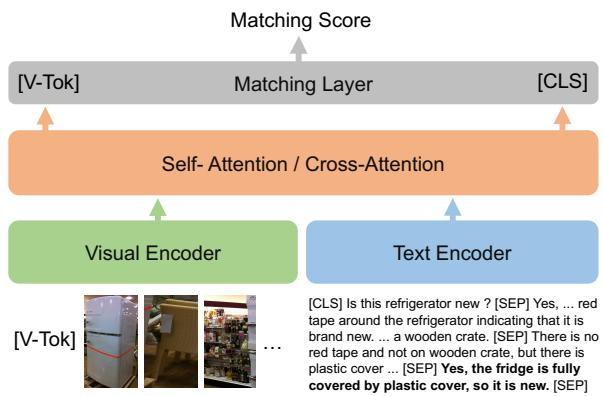  
New Answer: Yes, the fridge is ful y covered by plastic cover, so it is new.can see a red tape around the Figure 6: The full model computes the matching scores because the owner is moving it to somewhere else.Distractor #2: No, the fridge is ful y covered by plastic between [V-Tok] token feature and each [CLS] token and it is on wooden stack, so it is new.the fridge everywhere .feature of the response candidates (a ground-truth re-Original Answer: Yes, as you can see a red tape around the is fully covered by plastic sponse and three distractors), and selects the highest one uct is on a woodas a final prediction.

New Answer: Yes, the fridge is fully covered by plastic ants to protect the paint that is dimension of each attention head. Then, $\hat { V }$ and $\hat { L }$ is new.are fed to the cross-attention layers: $\bar { V } , \bar { L } =$ $\mathrm { T F } _ { X } ( \hat { V } , \hat { L } )$ ause the owne, where $\mathrm { T F } _ { X }$ g it to somewhere else.is cross-attention layers Distractor #2: No, the fridge is fully covered by plastic of vision and language Transformer which consists Question: Is this refrigerator new ? Question: Is this refrigerator new ?of self-attention layers as well as cross-attention efrigerator indicating that it is brand new. Also the prod-refrigerator in icating that it is brand new. Also the prod-layers. Scores are computed between visual feature Change: There is no red tape and not on wooden crate , Change: There is no red tape and not on wooden crate , and each of the 4 language features (1 ground-truth New Answer: Yes, the fridge is fully covered by pNew Anand 3 distractors) pair: $s _ { k } = \mathrm { L i n e a r } ( \bar { V } _ { 0 } \ast \bar { L } _ { k , 0 } )$ where  is the element-wise product, $\hat { V } _ { 0 }$ is the vibecause the owner is moving it to somewhere else.because the owner is moving it to somewhere else.sual token (i.e., [V-Tok]) that is attached in the cover because the owner wants tinput layer, and $\hat { L } _ { k , 0 }$ the paint that is over because the owner wants to protect the paint that iis the first token (i.e., [CLS]) Distractor #3: Yes, the fridge is fully covered by plastic cover Distractor #3: Yes, the fridge is fully covered by plastic covof k-th language feature. The model compares the 4 scores to select the pair with the highest score as the final answer. The loss is computed by crossentropy: $\begin{array} { r } { \mathcal { L } = - \sum _ { j } ^ { N } \log p ( s _ { j } ^ { * } ) } \end{array}$ ), where $s _ { j } ^ { * }$ is a score for the ground-truth pair.

## 7 Experiments

Data Splits. We split the dataset into 1,924/800/800 (train/val/test).

Training Details. We use 768 as the hidden size and use Adam (Kingma and Ba, 2015) as the optimizer, setting the learning rate to $1 \times 1 0 ^ { - 5 }$ . See Appendix for more details.

Human Upper Bound Evaluation Setup. We conduct a human evaluation of our COSIM task to estimate the upper bound that models can reach. We take 50 samples from the validation split and ask two experts to complete the task and average their scores.

Scene Change Types. We collect the type of the Scene Change for the validation set. Two experts are shown each change and then asked to label it into one or more types. See Figure 5 for the change

<table><tr><td rowspan=2 colspan=1></td><td rowspan=2 colspan=1>Model</td><td rowspan=1 colspan=2>Accuracy (%)</td></tr><tr><td rowspan=1 colspan=1>Val</td><td rowspan=1 colspan=1>Test</td></tr><tr><td rowspan=1 colspan=1>1</td><td rowspan=1 colspan=1>Response-Only</td><td rowspan=1 colspan=1>38.37</td><td rowspan=1 colspan=1>-</td></tr><tr><td rowspan=1 colspan=1>2</td><td rowspan=1 colspan=1>TC-Response</td><td rowspan=1 colspan=1>44.62</td><td rowspan=1 colspan=1>-</td></tr><tr><td rowspan=1 colspan=1>3</td><td rowspan=1 colspan=1>Full (Image-TC-Response)</td><td rowspan=1 colspan=1>49.25</td><td rowspan=1 colspan=1>40.87</td></tr><tr><td rowspan=1 colspan=1>4</td><td rowspan=1 colspan=1>Human</td><td rowspan=1 colspan=1>98</td><td rowspan=1 colspan=1>-</td></tr></table>

Table 3: Model results. Human performance is quite high, showing large room for model improvement (TC: Textual Context). We only include the test performance for the full final model based on standard practice of not reporting ablations on test split.
<table><tr><td rowspan=1 colspan=1></td><td rowspan=1 colspan=1>Scene Change Type</td><td rowspan=1 colspan=1>Accuracy (%)</td></tr><tr><td rowspan=1 colspan=1>1</td><td rowspan=1 colspan=1>Object Addition</td><td rowspan=1 colspan=1>46.41</td></tr><tr><td rowspan=1 colspan=1>2</td><td rowspan=1 colspan=1>Object Removal</td><td rowspan=1 colspan=1>37.87</td></tr><tr><td rowspan=1 colspan=1>3</td><td rowspan=1 colspan=1>Object Replacement</td><td rowspan=1 colspan=1>43.59</td></tr><tr><td rowspan=1 colspan=1>4</td><td rowspan=1 colspan=1>Object Relocation</td><td rowspan=1 colspan=1>48.72</td></tr><tr><td rowspan=1 colspan=1>5</td><td rowspan=1 colspan=1>Object State Change</td><td rowspan=1 colspan=1>51.70</td></tr><tr><td rowspan=1 colspan=1>6</td><td rowspan=1 colspan=1>Human Addition</td><td rowspan=1 colspan=1>56.40</td></tr><tr><td rowspan=1 colspan=1>7</td><td rowspan=1 colspan=1>Human Removal</td><td rowspan=1 colspan=1>42.10</td></tr><tr><td rowspan=1 colspan=1>8</td><td rowspan=1 colspan=1>Environment Change</td><td rowspan=1 colspan=1>52.70</td></tr><tr><td rowspan=1 colspan=1>9</td><td rowspan=1 colspan=1>Event Description</td><td rowspan=1 colspan=1>51.56</td></tr></table>

Table 4: Model performance on different change types. While the model generally shows balanced scores over all scene change types, the performance on removal types seems to be lower than addition types.

types.

Multi-Task / Contrastive Learning. To exploit extra commonsense reasoning information, we explore multi-task learning (MTL) with a largescaled visual commonsense reasoning dataset, VCR (Zellers et al., 2019) dataset through alternating mini-batch training. In one mini-batch, the model is trained on our COSIM dataset, and in the next, the model is trained on the VCR dataset, and so on. Also, we try contrastive learning to explore potential improvement. Specifically, we compute matching scores between each visual token and [CLS] token of each ground truth text feature in a mini-batch, and compute contrastive loss.

## 8 Results

Modality Ablation. We build models with different input modalities and conduct an ablation study. As shown in Table 3, the Response-Only model (which only takes the new response/distractors as input) does not do well (row 1). The TC-Response model (which takes all text data as input) obtains a better score than the Response-Only model (row 1 and 2), but still performs poorly. The Full model (which takes the full image and text data as input) does best (row 3), meaning models need all the visual and textual input to perform reasonably.5,6

IR: No, it is a pier with lots of boats in and out, so it wouldn't be safe to swim. CH: there are not a lot of boats, but there is a shark Model choice: no, there is a shark in the boat.
<table><tr><td rowspan=1 colspan=1>Number of Scene Change Types</td><td rowspan=1 colspan=1>Accuracy (%)</td></tr><tr><td rowspan=1 colspan=1>1</td><td rowspan=1 colspan=1>52.35</td></tr><tr><td rowspan=1 colspan=1>2</td><td rowspan=1 colspan=1>46.34</td></tr><tr><td rowspan=1 colspan=1>3 or more</td><td rowspan=1 colspan=1>49.15</td></tr></table>

Table 5: Model performance on different numbers of change types, showing instances with single scene change type are relatively easier.
<table><tr><td rowspan=1 colspan=1></td><td rowspan=1 colspan=1>Model</td><td rowspan=1 colspan=1>Accuracy (%)</td></tr><tr><td rowspan=1 colspan=1>1</td><td rowspan=1 colspan=1>MTL with VCR</td><td rowspan=1 colspan=1>47.37</td></tr><tr><td rowspan=1 colspan=1>2</td><td rowspan=1 colspan=1>Contrastive Learning</td><td rowspan=1 colspan=1>49.50</td></tr></table>

Table 6: Model performance on multi-task and contrastive learning approaches.

Human Evaluation. We conduct a human evaluation to check the upper performance bound for the COSIM task. As shown in row 4 of Table 3, the score is quite high7, indicating a large room for improvement from future work.

Scene Change Types. As shown Table 4, our model shows balanced scores over all scene change types in general, however, comparing the addition and removal types (row 1 and 2 for object, row 6 and 7 for human), the performance on removal types is lower than addition types. That is possibly because removing something from an image might be harder to imagine.

Number of Scene Change Types. As shown Table 5, instances with a single scene change type seem to be relatively easier to address than ones with multiple scene change types. This might imply that multiple scene changes make the reasoning process more complex and challenging.

Multi-Task / Contrastive Learning. As shown in row 1 of Table 6, multi-task training with VCR does not seem to help improve performance on our COSIM dataset, implying our dataset is challenging to address and requires a more complex reasoning process. The performance of the contrastive learning (row 2) is also very close to the Full model’s (row 3 in Table 3), meaning more advanced approaches might be needed to tackle our COSIM dataset/task.

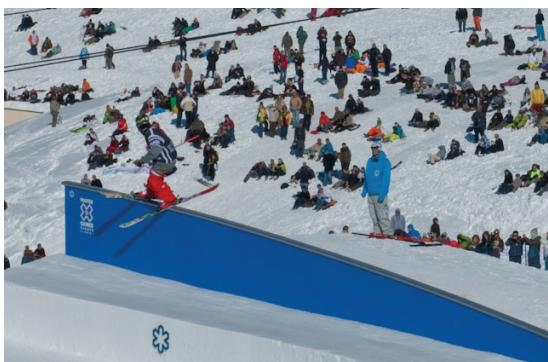  
Q: Is it a good place for a beginner to learn to snowboard?  
IR: No, because it is really crowded and there is not much space to practice.

  
Q: Is it safe to swim here?

Figure 7: Model output examples (Q: question, IR: initial response, CH: scene change).

Output Examples. As shown in the upper example of Figure 7, our model predicts the correct response by understanding the implication of “steep slopes” in the change. In the bottom example, our model fails to understand that “there is a shark” must mean the shark is in the water (as sharks live in the water), and choose a wrong response. We also split changes into sub-parts and compute scores for each part to see on which part the model focuses to answer questions. As shown in Figure 8, the model looks at “Add labels to the spines of all the books” to choose the answer.

## 9 Conclusion

We introduced a challenging counterfactual commonsense reasoning task/dataset called COSIM which features imagined counterfactual scene changes requiring models to imagine the changed

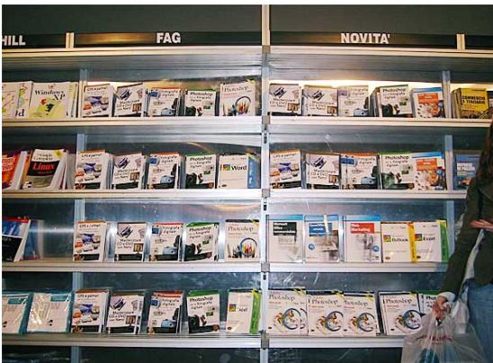  
Q: Are the books for sale?

IR: Yes, as you can see the books are organized by names and authors on the shelves for the customers. CH: Add a trolley in the foreground with many books replaced on it. Add labels to the spines of all the books.

Answer: It seems from the trolley that this is a library. the books on display are probable for reading and maybe to be borrowed but they are likely not for sale.

Figure 8: The model focuses on a crucial part in the scene change to properly select the answer.

situation to answer questions. We collected 3.5K high-quality instances that consist of an image, an initial question-response pair on the image, an imagined scene change, and a new response (with three distractors). The scene changes have different challenging types (such as object addition/removal/replacement, environment change, etc.). We presented a baseline model as a starting point with useful ablation studies and showed a large human-model performance gap allowing useful future works.

## Acknowledgments

We thank the reviewers for their helpful comments. This work was supported by NSF Award 1840131, ARO Award W911NF2110220, DARPA MCS Grant N66001-19-2-4031, and a Google Focused Award. The views contained in this article are those of the authors and not of the funding agency.

## References

Stanislaw Antol, Aishwarya Agrawal, Jiasen Lu, Margaret Mitchell, Dhruv Batra, C. Lawrence Zitnick, and Devi Parikh. 2015. VQA: Visual Question Answering. In International Conference on Computer Vision (ICCV).

Jacob Devlin, Ming-Wei Chang, Kenton Lee, and

Kristina Toutanova. 2019. Bert: Pre-training of deep bidirectional transformers for language understanding. In Proceedings ofNAACL-HLT.

Drew A Hudson and Christopher D Manning. 2019. Gqa: A new dataset for real-world visual reasoning and compositional question answering. In Proceedings ofthe IEEE/CVF Conference on Computer Vision and Pattern Recognition, pages 6700–6709.

Yunseok Jang, Yale Song, Youngjae Yu, Youngjin Kim, and Gunhee Kim. 2017. Tgif-qa: Toward spatiotemporal reasoning in visual question answering. In Proceedings of the IEEE Conference on Computer Vision and Pattern Recognition, pages 2758–2766.

Justin Johnson, Bharath Hariharan, Laurens Van Der Maaten, Li Fei-Fei, C Lawrence Zitnick, and Ross Girshick. 2017. Clevr: A diagnostic dataset for compositional language and elementary visual reasoning. In Proceedings ofthe IEEE Conference on Computer Vision and Pattern Recognition, pages 2901–2910.

Diederik P Kingma and Jimmy Ba. 2015. Adam: A method for stochastic optimization. In ICLR.

Ranjay Krishna, Yuke Zhu, Oliver Groth, Justin Johnson, Kenji Hata, Joshua Kravitz, Stephanie Chen, Yannis Kalantidis, Li-Jia Li, David A Shamma, et al. 2017. Visual genome: Connecting language and vision using crowdsourced dense image annotations. International journal of computer vision, 123(1):32– 73.

Jie Lei, Licheng Yu, Mohit Bansal, and Tamara Berg. 2018. Tvqa: Localized, compositional video question answering. In Proceedings of the 2018 Conference on Empirical Methods in Natural Language Processing, pages 1369–1379.

Yixin Nie, Adina Williams, Emily Dinan, Mohit Bansal, Jason Weston, and Douwe Kiela. 2020. Adversarial nli: A new benchmark for natural language understanding. In Proceedings of the 58th Annual Meeting of the Association for Computational Linguistics, pages 4885–4901.

Jae Sung Park, Chandra Bhagavatula, Roozbeh Mottaghi, Ali Farhadi, and Yejin Choi. 2020. Visualcomet: Reasoning about the dynamic context of a still image. In In Proceedings ofthe European Conference on Computer Vision (ECCV).

Adam Paszke, Sam Gross, Soumith Chintala, Gregory Chanan, Edward Yang, Zachary DeVito, Zeming Lin, Alban Desmaison, Luca Antiga, and Adam Lerer. 2017. Automatic differentiation in PyTorch. In NIPS AutodiffWorkshop.

Hamed Pirsiavash, Carl Vondrick, and Antonio Torralba. 2014. Inferring the why in images. Technical report, MASSACHUSETTS INST OF TECH CAM-BRIDGE.

Shaoqing Ren, Kaiming He, Ross B Girshick, and Jian Sun. 2015. Faster r-cnn: Towards real-time object detection with region proposal networks. In NIPS.

Shailaja Keyur Sampat, Akshay Kumar, Yezhou Yang, and Chitta Baral. 2021. Clevr\_hyp: A challenge dataset and baselines for visual question answering with hypothetical actions over images. In Proceedings of the 2021 Conference of the North American Chapter of the Association for Computational Linguistics: Human Language Technologies, pages 3692–3709.

Hao Tan and Mohit Bansal. 2019. Lxmert: Learning cross-modality encoder representations from transformers. In Proceedings ofthe 2019 Conference on Empirical Methods in Natural Language Processing.

Makarand Tapaswi, Yukun Zhu, Rainer Stiefelhagen, Antonio Torralba, Raquel Urtasun, and Sanja Fidler. 2016. Movieqa: Understanding stories in movies through question-answering. In Proceedings of the IEEE conference on computer vision and pattern recognition, pages 4631–4640.

Ashish Vaswani, Noam Shazeer, Niki Parmar, Jakob Uszkoreit, Llion Jones, Aidan N Gomez, Łukasz Kaiser, and Illia Polosukhin. 2017. Attention is all you need. In Proceedings ofthe 31st International Conference on Neural Information Processing Systems.

Misha Wagner, Hector Basevi, Rakshith Shetty, Wenbin Li, Mateusz Malinowski, Mario Fritz, and Ales Leonardis. 2018. Answering visual what-if questions: From actions to predicted scene descriptions. In Proceedings of the European Conference on Computer Vision (ECCV) Workshops, pages 0–0.

Jianwei Yang, Jiasen Lu, Dhruv Batra, and Devi Parikh. 2017. A faster pytorch implementation of faster rcnn. https://github.com/jwyang/faster-rcnn.pytorch.

Rowan Zellers, Yonatan Bisk, Ali Farhadi, and Yejin Choi. 2019. From recognition to cognition: Visual commonsense reasoning. In The IEEE Conference on Computer Vision and Pattern Recognition (CVPR).

Linchao Zhu, Zhongwen Xu, Yi Yang, and Alexander G Hauptmann. 2017. Uncovering the temporal context for video question answering. International Journal ofComputer Vision, 124(3):409–421.

Yuke Zhu, Oliver Groth, Michael Bernstein, and Li Fei-Fei. 2016. Visual7w: Grounded question answering in images. In Proceedings of the IEEE conference on computer vision and pattern recognition, pages 4995–5004.

## A Data Collection

We implement different interfaces for our data collection. The commonsense question collection interface allows for workers to choose which image they would like to use when making the question, as well as an object to focus on (Figure 9). The counterfactual scene change collection and the distractor collection interfaces (Figure 10 and Figure 11) feature a verification checkbox. Workers can check the box if the quality of the data from the previous phase is poor. If it is flagged, the reason is reviewed.8 If the reasoning is valid, the instance is removed from the dataset/no longer progressed through the collection phases.

## A.1 Counterfactual Change Collection templates

The first guide template is “Keep A, Flip B” and the second is “Flip A, Keep B” (where ‘A’ means answer and ‘B’ means justification). For “Keep A, Flip B”, workers are told to describe a change that results in the “answer” part of initial response to be the same, but with a different “justification” part (E.g. “yes because people are wearing jackets and winter clothes.”  “yes because you can see some snow ...”). In the change they write, they should negate/remove the “justification” part of initial response and add something that could be used for a new “justification”. For “Flip A, Keep B”, workers are told to describe a change that results in the opposite “answer”. The change should also modify the context so that the initial response “justification” part is true, but is no longer valid in proving the answer and a new “justification” part is needed. (e.g., “no, as you can see the man is not soaking wet.”  “yes, the man isn’t wet and he is under a structure, however ...”).9

## A.2 Worker Totals and Payment

We had a total of 182, 97, 194 workers pass testing for question collection, change collection, distractor collection, respectively. For the question collection phase and the change collection phase, workers are paid 0.35 USD per instance they complete (each takes about 2 minutes). As the distractor collection phase is faster and easier, workers are paid 0.30 USD per instance (takes around 1.5 minutes). In all three phases, an additional bonus of 0.02 USD is given for each high-quality instance they completed, and then for every subsequent group of 25 high-quality instances completed, the bonus per instance is increased by 0.01 USD (0.02 USD bonus per instance for the first 25, 0.03 USD bonus for the next 25, 0.04 USD bonus for the next 25, and so on). Since there is no limit on how much a worker can write, they can keep stacking the bonus as much as they want. All the payments are at a reasonable hourly rate of 11-12 USD.

## B Scene Change Types

The scene change types, while they are seemingly easy to visualize, require a complex understanding of what effect the change has on other elements in the scene. The Object Addition scene change type (the most commonly occurring one) involves introducing new object(s) into the image that was not there prior. The Object State Change scene change type involves altering the state of object(s) present in the image. The alteration of object(s) can take place in various forms such as changing color, size, shape, and orientation (e.g., opening a door). The Event Description scene change type involves the creation of an event or a description of motion or interaction between objects in the image. Please see Figure 12 for the full list of the scene change types and examples.

## C Training Details (Reproducibility)

All the model experiments are conducted on a Ubuntu 16.04 system using the NVIDIA GeForce GTX 1080 Ti GPU and Intel Xeon CPU E5- 2630. We employ PyTorch1.4 (Paszke et al., 2017) to build our models. We run models up to 50 epochs (each epoch takes around 8 mins) and choose the best ones based on the validation split evaluation. We use 768 as the hidden size and use Adam (Kingma and Ba, 2015) as the optimizer, setting the learning rate to $1 \times 1 0 ^ { - 5 }$ We initialize the language layer with the pretrained BERT weights and cross-attention layers with the pretrained LXMERT weights. We use 1234/2345/3456 as the random seed values. The number of trainable parameters of our full model is 173M. We employ accuracy as the evaluation metric. We use manual hyperparameter tuning (e.g, learning- $\scriptstyle \cdot \mathrm { r a t e } = \{ 1 \times 1 0 ^ { - 3 } , . . . , 1 \times 1 0 ^ { - 6 } \}$ , numof-cross- $ \mathrm { \cdot l a y e r } { = } \{ 1 , 2 , . . . , 5 \}$ , batch- $_ { \mathrm { s i z e } = \{ 2 , 4 , 6 , 8 \} }$ ， etc.) based on validation scores. We use the implementation of Yang et al. (2017) for the Faster R-CNN (Ren et al., 2015) model. The evaluation splits of our COSIM dataset are not overlapped with the training split of the Faster R-CNN.

## D Potential Risk

Potential models trained on our dataset may learn misleading information accidentally and create unsafe suggestions; therefore, careful use is required when deploying models in a real-world application.

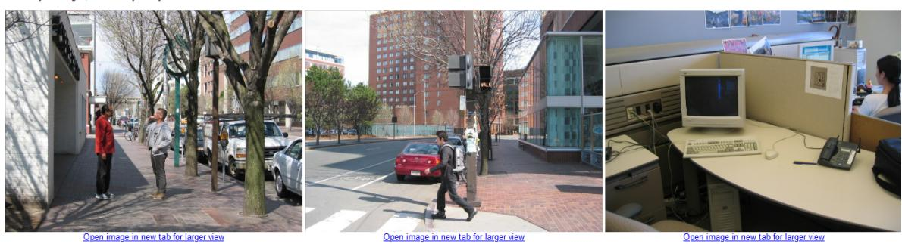

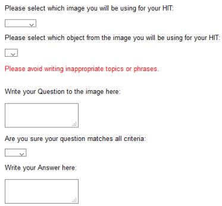  
Figure 9: Collection interface for the commonsense question collection phase. Workers are given three images, and they select the one they wish to use. Then workers are given space to write their question and response. Workers are told to select an object in the image they choose to help them focus their question around something specific.

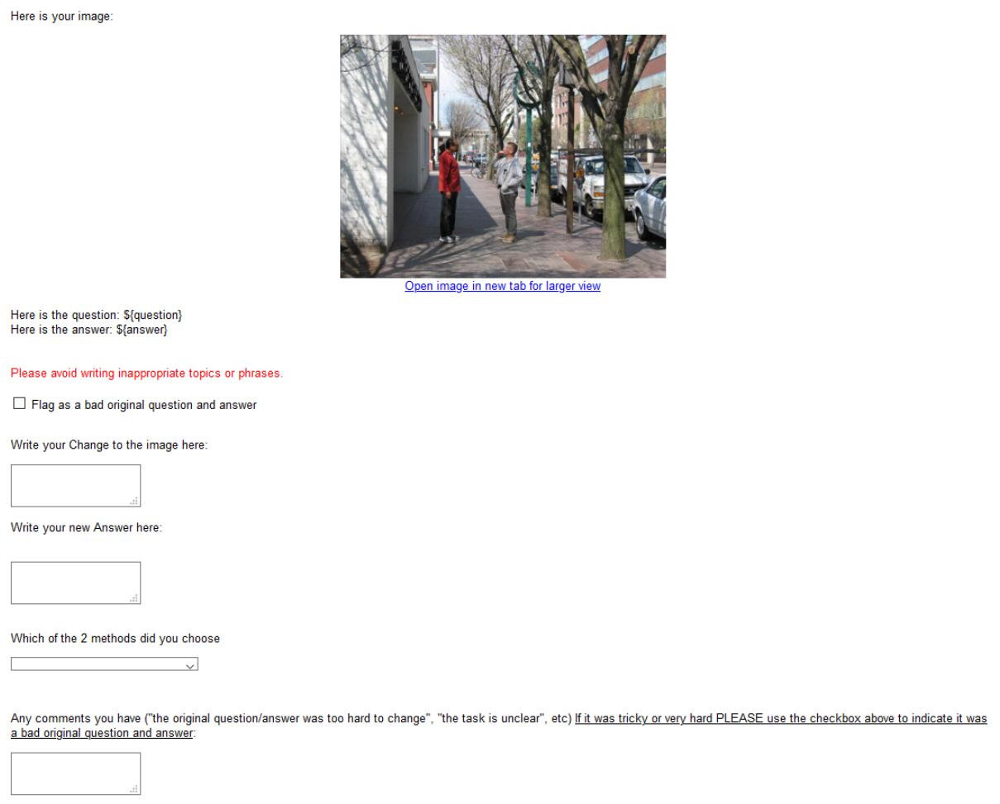  
Figure 10: Collection interface for the change collection phase. Workers are given the selected image and the written question and response from the commonsense question collection phase and then asked to write a change and new response based off that change.

Open image in new tab for larger view

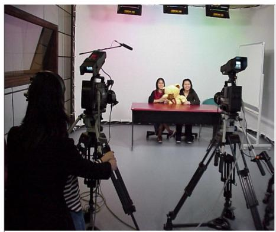

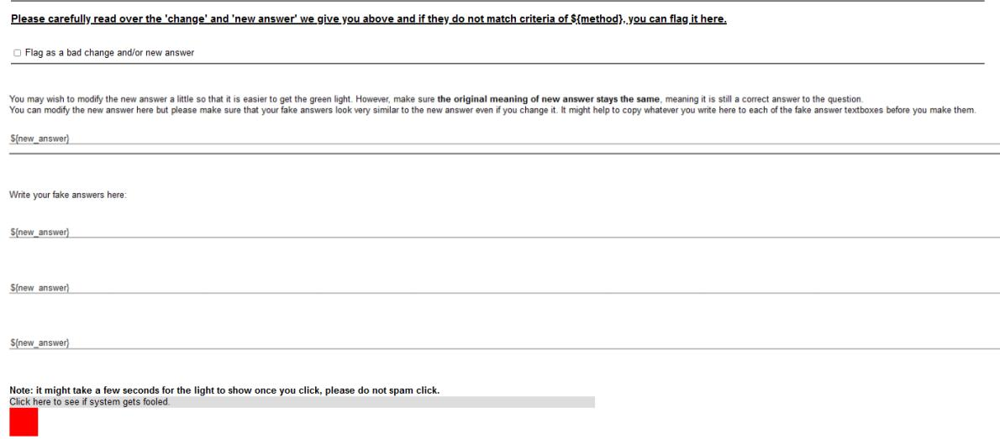  
Figure 11: Collection interface for the distractor collection phase. Workers are given the image and all the context from the previous phases and then asked to write three distractors that are similar to the new response but are distinct/semantically different. The distractor textboxes are prefilled with the new response and during HAMLET collection, workers are given a section to check their distractors against the model. Note: This interface is quite large and relevant portions are stitched together.

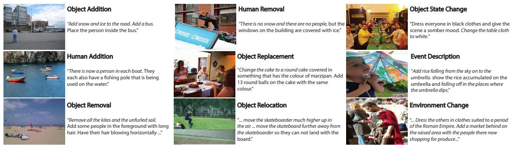  
Figure 12: Scene change examples from our dataset. The relevant portions of the change are in italics.