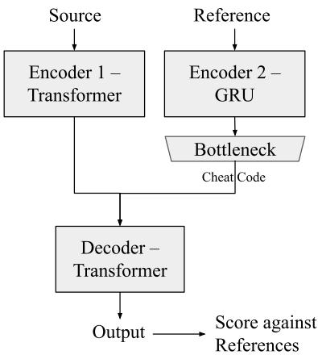
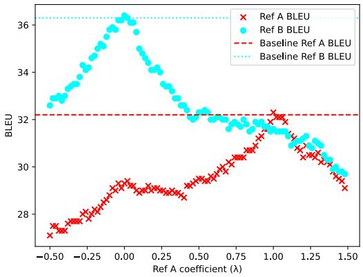

# Cheat Codes to Quantify Missing Source Information in Neural Machine Translation

Proyag Pal and Kenneth Heafield School of Informatics, University of Edinburgh, Scotland {proyag.pal,kheafiel}@ed.ac.uk

## Abstract

This paper describes a method to quantify the amount of information H(t s) added by the target sentence t that is not present in the source s in a neural machine translation system. We do this by providing the model the target sentence in a highly compressed form (a “cheat code”), and exploring the effect of the size of the cheat code. We find that the model is able to capture extra information from just a single float representation of the target and nearly reproduces the target with two 32-bit floats per target token.

## 1 Introduction

Given a sentence s in the source language, a machine translation system generates a translation t in the target language. However, for any sentence of non-trivial complexity, the translation t is not unique. Therefore, to reproduce a reference translation, a model requires some amount of extra information. The aim of this work is to quantify the amount of information that is missing in the source s that is required to generate the translation t.

To quantify this information, we modify the model architecture to provide the target sentence to the model as an auxiliary input, and observe the effect of varying the size of the representation of the target sentence from the minimum that provides any useful information to the decoder to the size that enables a near-perfect reproduction of the target. Since the model seeing the target as an input is a form of “cheating”, we refer to these compressed representations of the target as “cheat codes”.

## 2 Related Work

Zoph and Knight (2016) use multiple encoders to provide input in multiple languages to machine translation models to improve translation quality. Dual encoder networks have been used in language generation tasks to inject extra information (Sharath T et al., 2017), encode input at different levels of granularity (Yao et al., 2020), or for context awareness (Li et al., 2020). Junczys-Dowmunt and Grundkiewicz (2017) use very similar dualencoder architectures for automatic post-editing, but without bottlenecking the second encoder output, and the second input in that case is machine translation output instead of a reference. Dinu et al. (2019) train models to inject custom terminology by providing an additional input, but instead of using a second encoder, this is done using inline annotations for the terms to be generated and using factors to demarcate these annotations.

## 3 Method

## 3.1 Architecture

We use the Marian framework (Junczys-Dowmunt et al., 2018) to implement1 a modified dual-encoder transformer architecture (Zoph and Knight, 2016) similar to the one used by Junczys-Dowmunt and Grundkiewicz (2018), but without the tied encoder parameters.

The first encoder is a standard transformer-base encoder (Vaswani et al., 2017) which takes the source sentence as input, while the second encoder generates a highly compressed representation of the second input. The decoder attends to both encoder contexts – each decoder layer has a multi-head attention block for each encoder and these blocks are stacked (see Figure 1 in Junczys-Dowmunt and Grundkiewicz (2018)). Figure 1 shows our model architecture along with the separate inputs and cheat codes.

For the second encoder, we use a GRU (Cho et al., 2014) with hidden size 256, optionally average its outputs over all the states to get a fixedlength representation, and apply a linear bottleneck layer. This generates the highly compressed representation of the second input that the decoder attends to.

  
Figure 1: Model architecture with inputs and cheat codes

## 3.2 Cheat Codes

At training time, we provide the target sentence as the second input to the model, so the model essentially cheats by seeing the translation it is supposed to generate. At inference time, we can provide the reference translation or any other sentence as the second input, which should guide the generation towards this provided input.

Alternatively, this second encoder can be bypassed to directly provide context vectors for the decoder to attend to. As an example, we can use this feature to interpolate between the representation of two different references and provide that as a cheat code, and thus explore whether we can obtain alternative translations in some semantic space between the two references (Section 4.4).

We vary the size of the cheat codes and observe their effect on the output translations. The size is varied in three different ways:

• Using fixed-length representations of n floating-point numbers, where we can vary n, by averaging over all the output states of the second encoder, and then applying the bottleneck layer to project the result down to n dimensions.

• Using variable-length representations of n floating-point numbers per token, which is simply the output of the second encoder, with the bottleneck layer applied on each output state.

• Using representations smaller than one floating-point number by applying quantization on a one-dimensional representation. We do this using a simple linear quantization scheme similar to Miyashita et al. (2016) and Hubara et al. (2017). To quantize a scalar x to k bits:

$$
\begin{array} { l } { r = \mathrm { r o u n d } ( x * m ) } \\ { c = \mathrm { c l i p } ( r , - 2 ^ { k - 1 } , 2 ^ { k - 1 } - 1 ) } \\ { \mathrm { Q u a n t } _ { k } ( x ) = c / m } \end{array}
$$

where m is a multiplier chosen to ensure the quantized scalar covers the full range of the k-bit number after quantization. We observe that our single float32 cheat codes are in [-2, 2], so we use $m = 2 ^ { k - 2 }$ so that r is spread over $[ - 2 ^ { k - 1 } , 2 ^ { k - 1 } ]$ without getting clipped.

## 4 Experiments

All our experiments use Chen et al. (2021)’s cleaned version of the WMT21 German English dataset (Akhbardeh et al., 2021). We do not use back-translated data since we observed no improvement in quality upon adding it, consistent with Chen et al. (2021)’s findings. We evaluate on both references A and B in the test set using $\mathrm { B L E U } ^ { 2 }$ and $\mathrm { C h r F } ^ { 3 }$ metrics from SacreBLEU (Post, 2018), and COMET and COMET-QE4 (Rei et al., 2020).

Table 1 shows the results for our different models with references A or B provided as cheat codes and being evaluated on both references. We see that the models can score higher than the transformer baseline on a given reference when the same reference is supplied as a second input, which indicates that the model is able to “cheat” and capture useful extra information from just a single floating-point representation of the target sentence.

## 4.1 Increasing bottleneck size

As we increase the size of the bottleneck layer, we see that the model captures more information from the larger cheat codes and the outputs approach the reference translations, as shown by much higher BLEU and ChrF compared to the baseline. However, this is not always reflected in the COMET and COMET-QE scores and we suspect this is due to how COMET is trained. This issue is further discussed in Section 4.5.

<table><tr><td rowspan="2">Model/input</td><td colspan="3">Score on Reference A</td><td colspan="4">Score on Reference B</td></tr><tr><td>BLEU</td><td>ChrF</td><td>COMET</td><td>BLEU</td><td>ChrF</td><td>COMET</td><td>COMET-QE</td></tr><tr><td>Transformer baseline</td><td>32.2</td><td>60.3</td><td>0.5565</td><td>36.3</td><td>62.6</td><td>0.5640</td><td>0.3472</td></tr><tr><td colspan="8">References scored against each other / with COMET-QE:</td></tr><tr><td>Reference A</td><td>100</td><td>100</td><td>0.9934</td><td>29.5</td><td>58.5</td><td>0.5316</td><td>0.3265</td></tr><tr><td>Reference B</td><td>29.5</td><td>57.7</td><td>0.5643</td><td>100</td><td>100</td><td>1.0015</td><td>0.3829</td></tr><tr><td colspan="8">Reference A as second input, fixed-length cheat codes:</td></tr><tr><td>1 × int4</td><td>31.1</td><td>58.9</td><td>0.4781</td><td>31.8</td><td>59.0</td><td>0.4610</td><td>0.2924</td></tr><tr><td>1 × int8</td><td>31.3</td><td>59.1</td><td>0.4885</td><td>31.0</td><td>58.8</td><td>0.4707</td><td>0.3067</td></tr><tr><td>1 × int16</td><td>32.0</td><td>59.7</td><td>0.5320</td><td>31.2</td><td>59.2</td><td>0.4913</td><td>0.3107</td></tr><tr><td>1 × float32</td><td>32.3</td><td>59.6</td><td>0.5153</td><td>31.6</td><td>59.2</td><td>0.4917</td><td>0.3092</td></tr><tr><td>2 × float32</td><td>33.5</td><td>60.3</td><td>0.5177</td><td>29.6</td><td>58.2</td><td>0.4602</td><td>0.2979</td></tr><tr><td>4 × float32</td><td>36.7</td><td>61.6</td><td>0.4935</td><td>27.0</td><td>56.3</td><td>0.3893</td><td>0.2558</td></tr><tr><td>8 × float32</td><td>40.7</td><td>63.7</td><td>0.5023</td><td>25.1</td><td>54.9</td><td>0.3206</td><td>0.2235</td></tr><tr><td>12 × float32</td><td>47.0</td><td>67.4</td><td>0.5202</td><td>23.7</td><td>53.9</td><td>0.2790</td><td>0.2245</td></tr><tr><td>16 × float32</td><td>57.2</td><td>73.3</td><td>0.6553</td><td>24.4</td><td>54.0</td><td>0.3100</td><td>0.2404</td></tr><tr><td>25 × float32</td><td>67.0</td><td>80.0</td><td>0.7333</td><td>24.6</td><td>54.4</td><td>0.3191</td><td>0.2561</td></tr><tr><td></td><td></td><td></td><td></td><td></td><td></td><td></td><td></td></tr><tr><td colspan="8">Reference A as second input, variable-length cheat codes:</td></tr><tr><td>1 × float32 / token</td><td>40.1</td><td>64.2</td><td>0.5962</td><td>28.7</td><td>57.8</td><td>0.4587</td><td>0.2948</td></tr><tr><td>2 × float32 / token</td><td>92.4</td><td>96.1</td><td>0.9148</td><td>28.4</td><td>57.6</td><td>0.4473</td><td>0.2778</td></tr><tr><td>4 × float32 / token</td><td>91.2</td><td>95.2</td><td>0.9017</td><td>28.5</td><td>57.6</td><td>0.4434</td><td>0.2773</td></tr><tr><td>8 × float32 / token</td><td>89.7</td><td>94.1</td><td>0.8877</td><td>28.6</td><td>57.6</td><td>0.4438</td><td>0.2810</td></tr><tr><td>12 × float32 / token</td><td>94.1</td><td>97.4</td><td>0.9377</td><td>28.6</td><td>57.8</td><td>0.4750</td><td>0.2971</td></tr><tr><td>16 × float32 / token</td><td>95.8</td><td>98.6</td><td>0.9779</td><td>28.7</td><td>57.9</td><td>0.5107</td><td>0.3152</td></tr><tr><td>25 × float32 / token</td><td>93.9</td><td>96.8</td><td>0.9211</td><td>28.6</td><td>57.5</td><td>0.4526</td><td>0.2888</td></tr><tr><td>32 × float32 / token</td><td>96.6</td><td>98.7</td><td>0.9593</td><td>28.7</td><td>57.9</td><td>0.4720</td><td>0.2920</td></tr><tr><td colspan="8">Reference B as second input, fixed-length cheat codes:</td></tr><tr><td>1 × int4 1 × int8</td><td>29.8</td><td>58.0</td><td>0.4624 0.4824</td><td>34.5 34.9</td><td>60.5 60.6</td><td>0.4735 0.5147</td><td>0.2981 0.3121</td></tr><tr><td>1 × int16</td><td>28.9 29.1</td><td>57.9 57.9</td><td>0.4942</td><td>36.3</td><td>61.7</td><td>0.5375</td><td>0.3145</td></tr><tr><td>1 × float32</td><td>29.3</td><td>58.2</td><td>0.4865</td><td>36.4</td><td>61.9</td><td>0.5153</td><td>0.3111</td></tr><tr><td>2 × float32</td><td>27.5</td><td>57.0</td><td>0.4706</td><td>38.3</td><td>62.9</td><td>0.5249</td><td>0.3056</td></tr><tr><td>4 × float32</td><td>25.7</td><td>55.6</td><td>0.4210</td><td>41.8</td><td>64.4</td><td>0.5344</td><td>0.2827</td></tr><tr><td>8 × float32</td><td>24.6</td><td>54.3</td><td>0.3677</td><td>46.6</td><td>67.1</td><td>0.5500</td><td>0.2621</td></tr><tr><td>12 × float32</td><td>24.1</td><td>53.8</td><td>0.3354</td><td>54.3</td><td>71.5</td><td>0.6147</td><td>0.2562</td></tr><tr><td>16 × float32</td><td></td><td>53.6</td><td>0.3510</td><td>62.8</td><td>76.3</td><td>0.6995</td><td>0.2771</td></tr><tr><td>25 × float32</td><td>24.3 24.9</td><td>53.9</td><td>0.3657</td><td>70.7</td><td>81.8</td><td>0.7734</td><td>0.2899</td></tr><tr><td>Reference B as second input, variable-length cheat codes:</td><td></td><td></td><td></td><td></td><td></td><td></td><td></td></tr><tr><td colspan="8"></td></tr><tr><td>1 × float32 / token</td><td>26.9</td><td>56.6</td><td>0.4725</td><td>46.0</td><td>67.0</td><td>0.6275</td><td>0.3125</td></tr><tr><td>2 × float32 / token</td><td>28.4</td><td>56.7</td><td>0.4785</td><td>92.5</td><td>95.5</td><td>0.9130</td><td>0.3234</td></tr><tr><td>4 × float32 / token</td><td>28.7</td><td>57.0</td><td>0.4959</td><td>92.0</td><td>95.3</td><td>0.9156</td><td>0.3303</td></tr><tr><td>8× float32 / token</td><td>28.6</td><td>56.8</td><td>0.4919</td><td>90.6</td><td>94.4</td><td>0.8997</td><td>0.3320</td></tr><tr><td>12 × float32 / token</td><td>28.7</td><td>57.0</td><td>0.5123</td><td>94.0</td><td>96.9</td><td>0.9514</td><td>0.3439</td></tr><tr><td>16 × float32 / token</td><td>28.7</td><td>57.0</td><td>0.5349</td><td>95.6</td><td>98.0</td><td>0.9783</td><td>0.3599</td></tr><tr><td>25 × float32 / token</td><td>28.8</td><td>57.0</td><td>0.5082</td><td>93.8</td><td>96.4</td><td>0.9331</td><td>0.3438</td></tr><tr><td>32 × float32 / token</td><td>28.7</td><td>57.0</td><td>0.5097</td><td>96.1</td><td>98.0</td><td>0.9576</td><td>0.3468</td></tr></table>

Table 1: Evaluation with references A and B as second input

## 4.2 Minimizing bottleneck size

We have already observed that the model is able to capture useful information from a single 32-bit float. To find the lower bound of the cheat code size that is still useful to the model, we reduce it to less than one float, for which we quantize the 32-bit representations from the second encoder to 16, 8, or 4 bits. We see that the 16-bit cheat codes work almost as well as the 32-bit ones. With less than 16 bits, it appears that the model is unable to capture any extra information from the target.

## 4.3 Variable-length cheat codes

Since the amount of information contained in sentences can vary widely, it makes sense that the size of cheat codes required to encode them can vary. To this end, we also train models where the size of the cheat code is proportional to sentence length.

For these models, we observe that due to the increased capacity of the second encoder, training a model to “cheat” from the start makes it too dependent on the target, i.e. it does not learn to use the source fully, resulting in the cheat code estimating H(t) instead of $H ( t | s )$ as intended. Therefore, we first train with a blank second input for the model to learn to use the source, then we continue training with both inputs to train the second encoder.

As expected, we observe a similar pattern of more information being captured as we make the cheat codes larger. At just 2 floats per token, the model scores 92.4 BLEU/96.1 ChrF on reference A with the same reference as input, and likewise 92.5 BLEU/95.5 ChrF on reference B. At 16 floats per token, it scores more than 98 ChrF, which is very close to perfectly reproducing the references.

## 4.4 Interpolating between references

For models which use fixed-length representations of the second input, we can directly feed the decoder a cheat code instead of an actual input sentence. We use this to interpolate between the encoded forms of the two references. Figure 2 shows the performance of the model with single float32 cheat codes while providing λ enc(refA)+(1 λ) enc(refB) as the cheat code. We can see the emergence of a continuous space of cheat codes such that codes close to reference A result in outputs closer to reference A and moving towards reference B moves the output closer to reference B.

## 4.5 Evaluating with COMET-QE

BLEU and ChrF, along with most commonly used machine translation metrics, are reference-based metrics. This automatically makes it more likely that the model will score highest on a reference when given that exact reference as the cheat code. In Figure 2, for example, we see how the performance on each reference peaks exactly when we provide that reference as input. Since the two references are quite different from each other – they only score 29.5 BLEU when they are scored against each other – using one as the cheat code does not produce good results on the other.

We expected to see COMET-QE scores increase with cheat code size, similar to BLEU and ChrF scores. However, we see that COMET-QE scores remain below the baseline even for most models with large cheat codes and near-perfect BLEU/ChrF scores. We even observe that COMET-QE scores Reference A lower than the baseline output. We conclude that since COMET-QE is a metric trained on machine translation outputs and their human evaluation scores, it does not work well for near-perfect translations and is unable to score them higher than the best MT output. For the same reason, even though COMET scores (with reference) increase for large cheat codes, the pattern is less clear than for the string-matching metrics.

  
Figure 2: Interpolating between representations of references A and B.

## 5 Conclusions and Future Work

This paper has shown that by letting machine translation models use a highly compressed representation of the target sentence as an auxiliary input, we can estimate the amount of information missing from the source that the model captures from the target. By varying the size of these representations (cheat codes), we see that the model can capture useful information from as little as a 16- or 32-bit scalar representation of the target. We also see that the model approaches perfect reproduction of the target (>92BLEU/95ChrF) from as little as 2 floats per target token.

A limitation of our method is that it can only estimate the amount of missing information from the source based on the size of cheat code, but we do not get any insight into what this information actually is. In future work, this method can be extended to qualitatively analyze what the missing information is, and how it can possibly be provided to the model in other ways to improve translation quality without “cheating”. Another limitation is that the model, if not trained carefully for larger cheat codes, can learn to copy the target without using the source. This is countered by careful training regimes as discussed in Section 4.3.

Since the model is able to capture extra information from the second input, it could be possible to use this to guide the output in other ways than just to reproduce the references. For example, given a small enough representation, we could sweep through the entire range of cheat codes and produce diverse high-quality translations (He et al., 2018; Roberts et al., 2020).

## Acknowledgements

This work was supported by funding from the European Union’s Horizon 2020 research and innovation programme under grant agreement No 825303 (Bergamot).

## References

Farhad Akhbardeh, Arkady Arkhangorodsky, Magdalena Biesialska, Ondˇrej Bojar, Rajen Chatterjee, Vishrav Chaudhary, Marta R. Costa-jussa, Cristina España-Bonet, Angela Fan, Christian Federmann, Markus Freitag, Yvette Graham, Roman Grundkiewicz, Barry Haddow, Leonie Harter, Kenneth Heafield, Christopher Homan, Matthias Huck, Kwabena Amponsah-Kaakyire, Jungo Kasai, Daniel Khashabi, Kevin Knight, Tom Kocmi, Philipp Koehn, Nicholas Lourie, Christof Monz, Makoto Morishita, Masaaki Nagata, Ajay Nagesh, Toshiaki Nakazawa, Matteo Negri, Santanu Pal, Allahsera Auguste Tapo, Marco Turchi, Valentin Vydrin, and Marcos Zampieri. 2021. Findings of the 2021 Conference on Machine Translation (WMT21). In Proceedings ofthe Conference on Machine Translation at the 2021

Conference on Empirical Methods in Natural Language Processing, Punta Cana, Dominican Republic.

Pinzhen Chen, Jindˇrich Helcl, Ulrich Germann, Laurie Burchell, Nikolay Bogoychev, Antonio Valerio Miceli Barone, Jonas Waldendorf, Alexandra Birch, and Kenneth Heafield. 2021. The University of Edinburgh’s English-German and English-Hausa submissions to the WMT21 news translation task. In Proceedings ofthe Conference on Machine Translation at the 2021 Conference on Empirical Methods in Natural Language Processing, Punta Cana, Dominican Republic.

Kyunghyun Cho, Bart van Merriënboer, Caglar Gulcehre, Dzmitry Bahdanau, Fethi Bougares, Holger Schwenk, and Yoshua Bengio. 2014. Learning phrase representations using RNN encoder–decoder for statistical machine translation. In Proceedings of the 2014 Conference on Empirical Methods in Natural Language Processing (EMNLP), pages 1724– 1734, Doha, Qatar. Association for Computational Linguistics.

Georgiana Dinu, Prashant Mathur, Marcello Federico, and Yaser Al-Onaizan. 2019. Training neural machine translation to apply terminology constraints. In Proceedings of the 57th Annual Meeting of the Association for Computational Linguistics, pages 3063– 3068, Florence, Italy. Association for Computational Linguistics.

Xuanli He, Gholamreza Haffari, and Mohammad Norouzi. 2018. Sequence to sequence mixture model for diverse machine translation. In Proceedings of the 22nd Conference on Computational Natural Language Learning, pages 583–592, Brussels, Belgium. Association for Computational Linguistics.

Itay Hubara, Matthieu Courbariaux, Daniel Soudry, Ran El-Yaniv, and Yoshua Bengio. 2017. Quantized neural networks: Training neural networks with low precision weights and activations. The Journal of Machine Learning Research, 18(1):6869–6898.

Marcin Junczys-Dowmunt and Roman Grundkiewicz. 2017. An exploration of neural sequence-tosequence architectures for automatic post-editing. In Proceedings of the Eighth International Joint Conference on Natural Language Processing (Volume 1: Long Papers), pages 120–129, Taipei, Taiwan. Asian Federation of Natural Language Processing.

Marcin Junczys-Dowmunt and Roman Grundkiewicz. 2018. MS-UEdin submission to the WMT2018 APE shared task: Dual-source transformer for automatic post-editing. In Proceedings of the Third Conference on Machine Translation: Shared Task Papers, pages 822–826, Belgium, Brussels. Association for Computational Linguistics.

Marcin Junczys-Dowmunt, Kenneth Heafield, Hieu Hoang, Roman Grundkiewicz, and Anthony Aue. 2018. Marian: Cost-effective high-quality neural machine translation in C++. In Proceedings of the

2nd Workshop on Neural Machine Translation and Generation, pages 129–135, Melbourne, Australia. Association for Computational Linguistics.

Bei Li, Hui Liu, Ziyang Wang, Yufan Jiang, Tong Xiao, Jingbo Zhu, Tongran Liu, and Changliang Li. 2020. Does multi-encoder help? a case study on contextaware neural machine translation. In Proceedings of the 58th Annual Meeting of the Association for Computational Linguistics, pages 3512–3518, Online. Association for Computational Linguistics.

Daisuke Miyashita, Edward H. Lee, and Boris Murmann. 2016. Convolutional neural networks using logarithmic data representation.

Matt Post. 2018. A call for clarity in reporting BLEU scores. In Proceedings of the Third Conference on Machine Translation: Research Papers, pages 186– 191, Brussels, Belgium. Association for Computational Linguistics.

Ricardo Rei, Craig Stewart, Ana C Farinha, and Alon Lavie. 2020. COMET: A neural framework for MT evaluation. In Proceedings of the 2020 Conference on Empirical Methods in Natural Language Processing (EMNLP), pages 2685–2702, Online. Association for Computational Linguistics.

Nicholas Roberts, Davis Liang, Graham Neubig, and Zachary C. Lipton. 2020. Decoding and diversity in machine translation. CoRR, abs/2011.13477.

S Sharath T, Shubhangi Tandon, and Ryan Bauer. 2017. A dual encoder sequence to sequence model for opendomain dialogue modeling. arXiv e-prints, pages arXiv–1710.

Ashish Vaswani, Noam Shazeer, Niki Parmar, Jakob Uszkoreit, Llion Jones, Aidan N Gomez, Łukasz Kaiser, and Illia Polosukhin. 2017. Attention is all you need. In Advances in Neural Information Processing Systems, volume 30. Curran Associates, Inc.

Kaichun Yao, Libo Zhang, Dawei Du, Tiejian Luo, Lili Tao, and Y. Wu. 2020. Dual encoding for abstractive text summarization. IEEE Transactions on Cybernet ics, 50:985–996.

Barret Zoph and Kevin Knight. 2016. Multi-source neural translation. In Proceedings ofthe 2016 Conference ofthe North American Chapter ofthe Associationfor Computational Linguistics: Human Language Technologies, pages 30–34, San Diego, California. Association for Computational Linguistics.