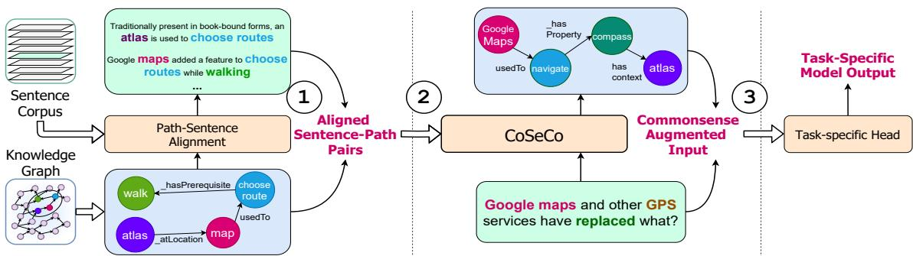
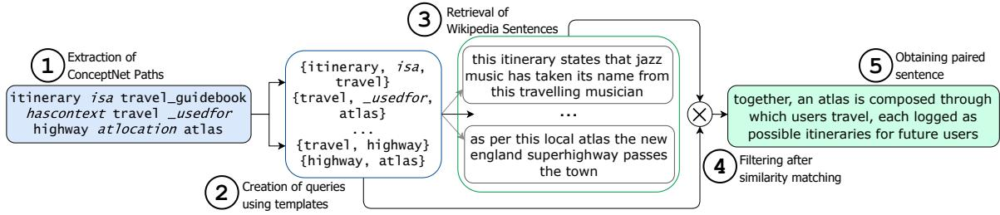
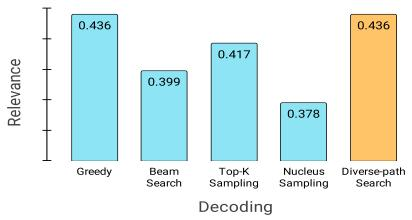
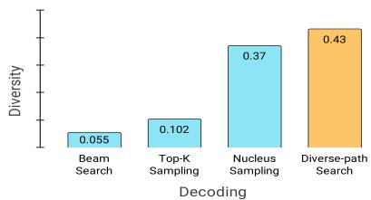

# CoSe-Co: Text Conditioned Generative CommonSense Contextualizer

Rachit Bansal1∗ Milan Aggarwal2 Sumit Bhatia2

Jivat Neet Kaur3∗ Balaji Krishnamurthy2

1 Delhi Technological University 2 Media and Data Science Research Lab, Adobe, India Microsoft Research, India

racbansa@gmail.com, {milaggar, sumbhati, kbalaji}@adobe.com jivatneet@gmail.com

## Abstract

Pre-trained Language Models (PTLMs) have been shown to perform well on natural language tasks. Many prior works have leveraged structured commonsense present in the form of entities linked through labeled relations in Knowledge Graphs (KGs) to assist PTLMs. Retrieval approaches use KG as a separate static module which limits coverage since KGs contain finite knowledge. Generative methods train PTLMs on KG triples to improve the scale at which knowledge can be obtained. However, training on symbolic KG entities limits their applicability in tasks involving natural language text where they ignore overall context. To mitigate this, we propose a CommonSense Contextualizer (CoSe-Co) conditioned on sentences as input to make it generically usable in tasks for generating knowledge relevant to the overall context of input text. To train CoSe-Co, we propose a novel dataset comprising of sentence and commonsense knowledge pairs. The knowledge inferred by CoSe-Co is diverse and contain novel entities not present in the underlying KG. We augment generated knowledge in Multi Choice QA and Open-ended CommonSense Reasoning tasks leading to improvements over current best methods on CSQA, ARC, QASC and OBQA datasets. We also demonstrate its applicability in improving performance of a baseline model for paraphrase generation task.

## 1 Introduction

While dealing with natural language text, commonsense allows humans to expand salient concepts and infer additional information. For example, by reading a sign like Men at Work on a road, we implicitly know to slow down our vehicles, look carefully for workers. This implicit process of using common sense to make logical inferences is critical to natural language understanding (Xie and

Pu, 2021). A natural question to ask then is how we can incorporate common sense in now-ubiquitous language models (LMs) (Devlin et al., 2019; Radford et al., 2018a; Raffel et al., 2019).

There have been various efforts (Bao et al., 2016; Feng et al., 2020; Wang et al., 2020b) to leverage structured knowledge present in commonsense knowledge graphs - KGs (we use KG as a shorthand for Commonsense Knowledge Graph) (Xie and Pu, 2021). Such works have primarily focused on either retrieving or generating required knowledge. Retrieval methods rely heavily on structure of downstream task like multi-choice question answering (QA) to leverage knowledge in a KG (Yasunaga et al., 2021) and are not applicable beyond a specific task. Further, retrieval can restrict total knowledge that can be garnered since static KGs lack coverage due to sparsity (Bordes et al., 2013; Guu et al., 2015). The other body of work addresses this comprising of generative methods that learn commonsense through training a LM on symbolic entities and relations between them in a KG. They have either been designed for KG completion (Bosselut et al., 2019), i.e. generate tail entity of a KG triple given head entity and relation, or to generate commonsense paths connecting a pair of entities which suffer from two shortcomings. Firstly, applying such methods in downstream tasks require entity extraction from text as a prerequisite step and secondly, they generate knowledge between entity pairs ignoring overall context of sentence (Wang et al., 2020b). Hence, applying such methods is sub-optimal since most NLP tasks comprise of sentences. Further, being trained on entities, applying them directly on sentences is infeasible and lead to train-inference input type mismatch.

To address these limitations, we propose CommonSense Contextualizer - CoSe-Co, a generative framework which generates relevant commonsense knowledge given natural language sentence as input. We condition it on sentences to make it learn to incorporate overall text context and enable it to dynamically select entities/phrases from an input sentence as well as output novel yet relevant entities as part of commonsense inferences generated. We consider commonsense knowledge in the form of paths, i.e., sequence of entities connected through relations. We first create sentencepath paired dataset by - 1) sampling paths from an underlying KG; 2) sampling a subset of entities from a path; and 3) retrieving & filtering sentences (from a sentence corpus) that are semantically similar to the path. The paired data is then used to train a generative language model to generate a path given a sentence as input.

To analyse the usefulness of generated commonsense, we augment it in various downstream tasks. The reasoning ability of NLP systems is commonly analysed using QA. Hence, we choose two such tasks: 1) Multi-Choice QA, where given a question and set of choices, the model has to identify the most appropriate answer choice. However, often more than one choice is a suitable answer. To mitigate this, 2) OpenCSR (Open-ended Common-Sense Reasoning) (Lin et al., 2021a) was proposed, where each question is labeled with a set of answers which have to be generated without choices. We also show applicability of CoSe-Co in improving performance on paraphrase generation task (§4.5).

Our contributions can be summarised as:

1. We propose a CommonSense Contextualizer (CoSe-Co) to generate knowledge relevant to overall context of given natural language text. CoSe-Co is conditioned on sentence as input to make it generically usable in tasks without relying on entity extraction.

2. We devise a method to extract sentencerelevant commonsense knowledge paths and create the first sentence-path paired dataset. We release the dataset and make it available to the community along with the trained models and corresponding code1.

3. Since CoSe-Co is based on generative LM, it infers relevant and diverse knowledge containing novel entities not present in the underlying KG (§4.2). Augmenting generated knowledge in Multi-Choice QA (§4.3) and OpenCSR (§4.4) tasks leads to improvements over current SoTA methods. Further, it is observed that CoSe-Co helps in generalising better in low training data regime.

## 2 Related Work

Commonsense Knowledge Graphs (KGs) are structured knowledge sources comprising of entity nodes in the form of symbolic natural language phrases connected through relations (Speer et al., 2017; Sap et al., 2019a; Ilievski et al., 2021; Zhang et al., 2020). The knowledge in KGs is leveraged to provide additional context in NLP tasks (Bao et al., 2016; Sun et al., 2018; Lin et al., 2019) and perform explainable structured reasoning (Ren\* et al., 2020; Ren and Leskovec, 2020). Additionally, a variety of Natural Language Inference (NLI) and generation tasks requiring commonsense reasoning have been proposed over the years (Zellers et al., 2018; Talmor et al., 2019; Sap et al., 2019b; Lin et al., 2020, 2021a,b). Pre-trained language models (PTLMs) (Devlin et al., 2019) trained over large text corpus have been shown to posses textual knowledge (Jiang et al., 2020; Petroni et al., 2019; Roberts et al., 2020) and semantic understanding (Li et al., 2021). Consequently, they have been used for reasoning where they perform well to some extent (Bhagavatula et al., 2020; Huang et al., 2019). However, it remains unclear whether this performance can be genuinely attributed to reasoning capability or if it is due to unknown data correlation (Mitra et al., 2019; Niven and Kao, 2019; Kassner and Schütze, 2020; Zhou et al., 2020).

Due to this, various LM + KG systems have been explored (Feng et al., 2020; Wang et al., 2019; Lv et al., 2020) to combine broad textual coverage of LMs with KG’s structured reasoning capability. Early works on KG guided QA retrieve sub-graph relevant to question entities but suffer noise due to irrelevant nodes (Bao et al., 2016; Sun et al., 2018). Hybrid graph network based methods generate missing edges in the retrieved sub-graph while filtering out irrelevant edges (Yan et al., 2020). Graph Neural Networks (GNNs) have been used to model embeddings of KG nodes (Wang et al., 2020a). More recently, Yasunaga et al. (2021) proposed an improved framework (QA-GNN) leveraging a static KG by unifying GNN based KG entity embeddings with LM based QA representations. Although, such frameworks extract relevant evidence from a KG, it undesirably restricts knowledge that can be garnered since knowledge source is static and might lack coverage due to sparsity (Bordes et al., 2013; Guu et al., 2015). Contrarily, we train a generative model on a given KG to enable it to dynamically generate relevant commonsense inferences making it more generalizable and scalable.

  
Figure 1: Our proposed approach consists of: (1) Path to Sentence Alignment to create the training data for CoSe-Co, (2) Training a CommonSense Contextualizer (CoSe-Co) to generate commonsense inferences relevant to a given natural language sentence. CoSe-Co can be used to infer knowledge in downstream task.

Bosselut et al. (2019) cast commonsense acquisition by LMs as KG completion. They propose COMET, a GPT (Radford et al., 2018b) based framework to generate tail entity given head and relation in a KG triple as input. Owing to training on symbolic KG nodes, using COMET in downstream tasks involving natural language text is not straightforward. Specifically, it requires extracting entities from text as a prerequisite (Becker et al., 2021). Further, training on single triples makes its application in tasks requiring multi-hop reasoning challenging due to large relation search space (Bosselut et al., 2021). To address this, Path Generator (PGQA) was proposed to generate commonsense paths between entities pair (Wang et al., 2020b). Designed for multi-choice QA, they extract question entities and generate paths between each question entity and answer choice pair. Even though generated paths are multi-hop, training on entities limits applying it directly on sentences due to train-inference input type mismatch. Further, being conditioned only on question-choice entity pairs, paths are generated ignoring overall question context. To mitigate this, we design CoSe-Co as a generic framework to dynamically generate multi-hop commonsense inference given natural language sentence as input. Separately, retrieval methods have been explored to search relevant sentences to generate text corresponding to concepts (Wang et al., 2021). Different from this task, we retrieve sentences relevant to paths in a KG to create paired sentence-path data.

## 3 Proposed CoSe-Co Framework

Problem Setting Given a commonsense knowledge graph $\mathcal { G } = ( \mathcal { E } , \mathcal { R } )$ , where is the set of entity nodes and is the set of labeled directed relational edges between entities, we aim to model a CommonSense Contextualizer (CoSe-Co) which generates a set of commonsense inferences in the form of paths derived using ${ \mathcal { G } } ,$ that are relevant to a natural language text given as input. It is desirable that such a generative commonsense knowledge model should be generic, task agnostic, and takes into account the overall context of language input while generating commonsense. Since most tasks comprise of text in the form of sentences, we model the input to CoSe-Co as a sentence. In order to train such a model, a dataset is required which comprises of mappings of the form $\left\{  \left( { { s _ { 1 } } , { p _ { 1 } } } \right) , { { \left( { { s _ { 2 } } , { p _ { 2 } } } \right) } , . . . , { \left( { { s _ { N } } , { p _ { N } } } \right) } } \right\}$ , where $s _ { j }$ and $p _ { j }$ are relevant sentence-commonsense inference path pair. However, no existing dataset consists of such mappings. To bridge this gap, we first devise a methodology to create a dataset comprising of sentences paired with relevant commonsense inference paths. Broadly, we first extract a large corpus constituting sentences $\{ s _ { 1 } , s _ { 2 } , . . . , s _ { | C | } \}$ . Subsequently, we sample a set of paths $\mathcal { P } = \{ p _ { 1 } , p _ { 2 } , . . . , p _ { | \mathcal { P } | } \}$ from $\mathcal { G }$ such that each $p \in \mathcal P$ is of the form $p = \{ e _ { 1 } , r _ { 1 } , e _ { 2 } , r _ { 2 } , . . . , e _ { | p | + 1 } \}$ where $e _ { i } \in \mathcal { E }$ and $r _ { i } \in \mathcal { R }$ . For each $p \in \mathcal P$ , a set of contextually and semantically relevant sentences $S \subset { \mathcal { C } }$ is retrieved and mapped to $p .$ We then train a generative LM based commonsense knowledge model using . During inference, given a sentence $s ^ { \prime } ,$ it generates commonsense paths of the form $p ^ { \prime } = \{ e _ { 1 } ^ { \prime } , r _ { 1 } ^ { \prime } , e _ { 2 } ^ { \prime } , r _ { 2 } ^ { \prime } , . . . , e _ { | p ^ { \prime } | + 1 } ^ { \prime } \}$ such that $e _ { i } ^ { \prime } \in \mathcal { E } ^ { \prime }$ and $r _ { i } ^ { \prime } \in \mathcal { R }$ . Here, $\mathcal { E } ^ { \prime } = \widetilde { \mathcal { E } } \cup \mathcal { E } _ { n o v e l }$ where $\mathcal { E } _ { n o v e l }$ are novel entities not present in $\mathcal { G }$ . These include phrases present in an input sentence but not in  as well as entirely novel entities which the pre-trained LM based backbone enables it to generate through transfer learning. The generated commonsense inference paths from CoSe-Co can then be used to augment context in downstream tasks. An overview of our framework is shown in Figure 1.

  
Figure 2: Obtaining the sentence-path paired dataset. We begin with paths from the knowledge graph and employ a two-step matching and filtering process to obtain relevant paired sentences from the given text corpora. Here we accompany each step with corresponding examples that we observed.

## 3.1 Sentence-Path Paired Dataset Creation

In order to train CoSe-Co, we create a novel dataset comprising of related sentencecommonsense path pairs. To obtain set ${ \mathcal P } _ { \mathrm { { : } } }$ we perform random walk in $\mathcal { G }$ to extract multi-hop paths of the form $\boldsymbol { p } = \{ e _ { 1 } , r _ { 1 } , e _ { 2 } , r _ { 2 } , . . . , e _ { | p | + 1 } \}$ where the number of hops, denoted as path length $| p | ,$ is in range $[ l _ { 1 } , l _ { 2 } ]$ . To avoid noisy paths which do not convey useful information, we employ relational heuristics in (described in appendix E.1). Separately, the sentence corpus  is indexed using Apache Solr which is queried to retrieve sentences relevant to a path. We now explain this in detail.

Broadly, we map each path $p \in \mathcal P$ to a set of sentences $S \subset { \mathcal { C } }$ based on semantic similarity and overlap between entities in p and sentences. For this, consider a path $\boldsymbol { p } = \{ e _ { 1 } , r _ { 1 } , e _ { 2 } , . . . , e _ { | p | + 1 } \}$ To ensure that retrieved sentences are similar to $p ,$ we devise two types of query templates - Q1 and Q2 which are used to create multiple queries per path while querying Solr. We design Q1 to capture relation information between entities in p in addition to entities themselves. Specifically, we extract non-contiguous entity-relation triples of the form $\{ ( e _ { i } , r _ { i } , e _ { i + 2 } ) \}$ and $\{ ( e _ { i } , r _ { i + 1 } , e _ { i + 2 } ) \}$ . Here, we do not query entire path while retrieving sentences to ensure better coverage since we observed that no sentence exists which contains all entities and relations present in a given path. In Q2, we extract queries comprising of connected entities pairs $\{ ( e _ { i } , e _ { i + 1 } ) \}$ . For each query q obtained from p according to Q1 and Q2, we query Solr and select sentences containing entities present in $q .$ Subsequently, we rank retrieved sentences based on similarity between sentence embedding and embedded representation of the corresponding query q (including the relation in case of Q1). The embeddings are obtained using SBERT (Reimers and Gurevych, 2019) since it is trained on siamese objective to learn semantically meaningful representations. Based on the ranking, we retain a maximum of top K’ (= 10) sentences to ensure most semantically relevant sentences-path pairs are obtained and also to prevent CoSe-Co from getting biased towards generating particular paths. One thing to notice is that even though sentences are retrieved using templated sub-parts within a path, the retrieved sentences are finally paired up with the entire path and later used to train a generative commonsense model that learns to generate the path given sentence as input. Figure 2 illustrates the entire sentence-path pairing process using an example from the dataset.

Using queries of type Q1 templates enables us to retrieve sentences that are relatively more semantically related to the overall path. For instance, consider a path ‘violin hasproperty strings \_hasprequistite guitar atlocation concert’. Sentences retrieved using queries like strings, atlocation, concert (of the form $( e _ { i } , r _ { i + 1 } , e _ { i + 2 } ) )$ are more likely to be related to other entities in the path such as ‘guitar’. Further, sentences that contain entities that are not directly connected in the corresponding path induce an inductive bias in CoSe-Co to generate paths that consist of intermediate entities which connect them. We perform ablations regarding query templates in §4.3.1. We study quality of the generated dataset to check for possible data leaks and relevance between sentence-path pairs

We determine the extent of n-gram overlap between questions in the CSQA test set and sentences in our sentence-path training set as indicators of any possible data leakage. For this, we obtain the set of n-grams in a question, determine the sentence in the training set with which the question has maximum matching n-grams and divide the matching n-gram count with the total number of n-grams in the question. Finally, this fraction is averaged over all the questions in the test split of CSQA. Following this scheme, an overlap of 0.15 is observed for

1-grams, 0.07 for 2-grams, 0.002 for 3-grams, and 0.00 for 4-grams which shows that the extent of overlap is very less (on a scale of 0 to 1). Further, we noted that 1-gram overlap does not necessarily indicate leakage. For instance, consider CSQA test question - ‘If a person is tired how can they be refreshed?’. Even though, it has matching 1-grams with the sentence- ‘a person may feel tired without having engaged in any physical activity’, but it can be noted that they have an entirely different context. From the low n-gram overlap values, we conclude that extent of leakage is negligible.

To gauge the degree of relevance between the final set of sentence-path pairs, we measure the cosine similarity between the S-BERT embeddings of the complete path and the corresponding sentence in the dataset. We observe a high normalized cosine similarity score of 0.783 when averaged over all sentence-path pairs in training dataset which shows that sentence and corresponding path pairs are semantically related.

## 3.2 Sentence Commonsense Generator

The sentence-commonsense paired dataset obtained in §3.1 is used to train a path generator model $\mathsf { C o s e - C o } _ { \theta }$ to generate commonsense inference path p relevant to the input sentence s. For this, we initialise the parameters θ of CoSe-Co with weights of a generative pre-trained LM as backbone (eg. T5, GPT etc). Consider T5-base (Raffel et al., 2019) as backbone, given a sentence $s = \{ x _ { 1 } ^ { s } , x _ { 2 } ^ { s } , . . . , x _ { \left| s \right| } ^ { s } \}$ comprising of a sequence of tokens, it is processed by T5 encoder $E _ { \theta _ { 1 } }$ to give a sequence of outputs $O _ { E } = \{ o _ { 1 } ^ { E } , o _ { 2 } ^ { E } , . . . , o _ { | s | } ^ { E } \}$ . T5 decoder $D _ { \theta _ { 2 } }$ is trained to sequentially generate the corresponding path tokens $p = \{ x _ { 1 } ^ { p } , x _ { 2 } ^ { p } , . . . , x _ { N } ^ { p } \}$ During the decoding phase at time step $t , D _ { \theta _ { 2 } }$ is jointly conditioned on encoder outputs $O _ { E }$ and past tokens $x _ { < t } ^ { p }$ in the path $p$ while generating current path token $x _ { t } ^ { p } . ~ E _ { \theta _ { 1 } }$ and $D _ { \theta _ { 2 } }$ , where $\theta = \theta _ { 1 } \bigcup \theta _ { 2 }$ are jointly optimized by minimizing loss $\mathcal { L } \mathrm { : ~ }$

$$
\begin{array} { r } { \mathcal { L } = - \sum _ { t = 1 } ^ { N } \log P ( x _ { t } ^ { p } | x _ { < t } ^ { p } , O _ { E } ) , \mathrm { w h e r e } } \\ { P ( x _ { t } ^ { p } | x _ { < t } ^ { p } , O _ { E } ) = \mathsf { C o S e - C o } _ { \theta } ( s , x _ { < t } ^ { p } ) } \end{array}
$$

We design a variant where given a sentence-path pair, we randomly select an entity that co-occurs in sentence and path and mask it in the sentence. Whether a sentence is masked during training is controlled by a probability $p _ { m a s k }$ . The model is then trained to generate path containing masked entity given masked sentence as input. The intuition is to enforce CoSe-Co to capture context better through identifying masked entity during path generation. We discuss and perform ablations to compare masked CoSe-Co with varying values of $p _ { m a s k }$ in §4.3.1. Separately, we discuss and observe that using GPT-2 as backbone LM for CoSe-Co performs similar to T5-base in Appendix B.

## 3.3 Path Decoding During Inference

As in most sequence generation tasks, teacher forcing is used to train the model, while a decoding strategy is used to generate diverse outputs during inference (Vaswani et al., 2017). To maximise contextual knowledge obtained from paths for each sentence in a downstream task, we generate multiple paths. To improve diversity between paths while not losing relevance, we implement a path-specific variant of beam search, diverse-path search. Diversity is ensured by sampling top-k most probable tokens at first generation step followed by decoding most probable sequence for each of them, thus returning k paths. This approach is motivated by observation that when generating a path, initial entity guide overall decoding of path.

## 4 Experiments and Evaluation

## 4.1 Implementation Details

We choose Wikipedia as the sentence corpus , and ConceptNet (Speer et al., 2017) as the knowledge graph . The subset of Wikipedia that we use comprises of 5M articles, from which we extract 92.6M sentences. ConceptNet comprises of 8 million nodes as concepts linked through 34 unique commonsense relations with 21 million links in total. We sample 28M paths that have a length $| p |$ in the range $l _ { 1 } = 2$ and $l _ { 2 } = 5$ . We obtain a total of 290K sentence-path pairs. CoSe-Co is trained until validation loss across an epoch does not increase, with maximum number of epochs $= 5 . \ : p _ { m a s k }$ is set to 0.33 based on tuning on CSQA dev set and number of paths per sentence $k = 5$ during inference. AdamW optimizer (Loshchilov and Hutter, 2017) is used to train parameters with a learning rate of $5 e - 4$ , weight decay of 0.01 and epsilon of $1 e - 8$ using a single A-100 GPU with batch-size 8 and 4 gradient accumulation steps.

## 4.2 Analysing Generated Paths

We analyse quality of generated paths on three aspects - Relevance, Diversity and Novelty, evaluated on test split of our sentence-path dataset. We estimate Relevance by treating each triple in generated and ground truth paths (for a given test sample) as one uni-gram followed by determining BLEU score (Papineni et al., 2002) between them. To estimate Diversity, we extract top-k = 5 paths for each sentence, consider each pair combination amongst them and estimate fractional overlap (intersection over union of set of path entities) between them. Compliment of overlap (1  overlap) followed by mean over entire test split conveys how diverse paths are. Figure 3 shows corresponding results. It is observed that paths generated using nucleus sampling are diverse but lack relevance, while an opposite trend is observed for top-k sampling. Diverse-path search provides best balance between relevance (0.436) and diversity (0.43). We estimate Novelty as a fraction of total entities in a generated path that are not present in any training path followed by averaging over test split. CoSe-Co attains a novelty of 23.28% which shows that good fraction of entities in generated path are novel. Further discussion on the quantitative analysis of generated paths can be found in appendix F. Table 1 shows a few examples of generated paths. CoSe-Co generates paths contextually relevant to question in addition to inferring novel entities.

  
(a) Relevance: BLEU score of generated paths computed using ground truth paths

  
(b) Diversity: Compliment of fraction overlap between top-5 sampled paths.

Figure 3: Analysis and comparison of generated paths across different decoding strategies
<table><tr><td>Input</td><td>CoSe-Co Outputs</td></tr><tr><td>What do people typically do while playing guitar?</td><td>(playing_guitar causes singing usedfor people capableof feeling_sad) (playing_guitar hassubeventsing _causesdesire singing _occupation musician genre folk_rock) (play_guitar _usedfor guitar atlocation symphony_halls_or_musical_instruments_or_bands _atlocation people )</td></tr><tr><td>Where are you likely to find a hamburger?</td><td>(burger _isa hamburger atlocation fast_food_restaurantusedfor eating_food) (burger_king _usedfor hamburger atlocation fast_food_restaurant isa place capableof take_car_for_drive) (fast_food_restaurant _isa taco_bell product hamburger madeof wheat_flour_and_salt)</td></tr><tr><td>In what Spanish speaking North American country can you get a great cup of coffee?</td><td>(bretagne partof north_america _atlocation cup_of_coffee hascontext usa isa country) (hot_beverage _isa coffee atlocation cup_of_coffee hascontext north_america _partof grenada) (good_coffee hasa caffiene_in_milk_and_sugar atlocation in_ canada</td></tr></table>

Table 1: Commonsense paths generated by CoSe-Co for questions in CommonsenseQA data. Potential answers observed in path itself are highlighted , context-enriching concepts are coloured.

## 4.3 Multi-Choice Question Answering

We perform multiple choice question answering on the CSQA dataset (Talmor et al., 2019). Here, a question is given with 5 answer choices and the model has to predict the correct one. As an example, consider a question ‘Where could you see an advertisement while reading news?’ with answer choices ‘television, bus, email, web page, and la villa’. One of the prior works for this task - PGQA (Wang et al., 2020b), comprises of a knowledge module which generates commonsense and a QA module which identifies correct choice using this knowledge (see appendix D for details). Since our aim is not to design an improved QA module but a better commonsense generator, for fair comparison with PGQA, we use their QA module with CoSe-Co. The QA module embeds the question + choices using RoBERTa (Liu et al., 2019) and uses the CLS token output to perform attention over path embeddings generated using the commonsense module. The output of attention module together with embedding of question and answer choices is used to predict the correct answer.

Table 2 shows results on CSQA which are usually averaged over 5 runs on this benchmark. We compare against several baselines broadly classified into ones using static KG such as MH-GRN (Feng et al., 2020), QA-GNN (Yasunaga et al., 2021) etc. and others which train a dynamic path generator (PGQA) (Wang et al., 2020b) as commonsense module. We also compare with T5-base since it is backbone LM for CoSe-Co.

<table><tr><td rowspan="2">Methods</td><td rowspan="2">20% Train IHtest (%)</td><td rowspan="2">60% Train IHtest (%)</td><td colspan="2">100% Train</td></tr><tr><td>IHdev (%)</td><td>IHtest (%)</td></tr><tr><td>T5-base (w/o KG) (Raffel et al., 2019)</td><td>一</td><td>一</td><td>61.88 (±0.08)</td><td>57.34 (±0.21)</td></tr><tr><td>RoBERTa-large (w/o KG)</td><td>46.25 (±0.63)</td><td>52.30 (±0.16)</td><td>73.07 (±0.45)</td><td>68.69 (±0.56)</td></tr><tr><td>+ RGCN (Schlichtkrull et al., 2018)</td><td>45.12 (±0.69)</td><td>54.71 (±0.37)</td><td>72.69 (±0.19)</td><td>68.41 (±0.66)</td></tr><tr><td>+ GconAttn (Wang et al., 2019)</td><td>47.95 (±0.11)</td><td>54.96 (±0.69)</td><td>72.61(±0.39)</td><td>68.59 (±0.96)</td></tr><tr><td>+ KagNet (Lin et al., 2019)</td><td></td><td></td><td>73.47 (±0.22)</td><td>69.01 (±0.76)</td></tr><tr><td>+ RN (Santoro et al., 2017)</td><td>45.12 (±0.69)</td><td>54.23 (±0.28)</td><td>74.57 (±0.91)</td><td>69.08 (±0.21)</td></tr><tr><td>+ MHGRN (Feng et al., 2020)</td><td></td><td></td><td>74.45 (±0.10)</td><td>71.11 (±0.81)</td></tr><tr><td>+ PGQA (Wang et al., 2020b)</td><td>58.25 (±0.43)</td><td>69.66 (±0.97)</td><td>77.53 (±0.47)q</td><td>71.19 (±0.49)</td></tr><tr><td>+ QA-GNN (Yasunaga et al., 2021)</td><td>59.08 (±1.25)</td><td>68.70 (±0.62)</td><td>75.54 (±0.42)</td><td>72.29 (±0.43)p</td></tr><tr><td>+ CoSe-Co (Ours)</td><td>61.20 (±0.19)p,q</td><td>70.23 (±0.40)a</td><td>78.15 (±0.23)p,q</td><td>72.87 (±0.31)p,q</td></tr></table>

Table 2: Performance comparison on in-house dev (IHdev) and test (IHtest) split of CommonsenseQA dataset (Talmor et al., 2019). All scores are averaged across 5 runs. First row depicts amount of training data used. The second-best number for each column is underlined while best is in bold. Superscripts ‘p’ and ‘q’ denote statistically significant differences (p-value of 0.05) in comparison to two of our baselines- PGQA and QA-GNN, respectively.

When using entire training data, we observe that CoSe-Co performs better than all baselines2 on test set. We outperform PGQA with a gain of 1.68% in accuracy on test split signifying the relevance and applicability of inferences generated by CoSe-Co. CoSe-Co performs better than QA-GNN (Yasunaga et al., 2021) also particularly in low training data regimes with performance gains of 2% (and 3% over PGQA) showing that while QA-GNN is more sensitive towards amount of training data used, CoSe-Co is more robust and helps in generalizing better. Qualitatively, consider the question - ‘Where could you see an advertisement while reading news?’ PGQA generates the path - ‘read\_news hassubevent read relatedto news atlocation television’ ignoring the context that advertisement is being seen along with reading news and ends up predicting television as answer which is wrong. While CoSe-Co generates - ‘spread\_information \_capableof advertisement atlocation web\_page usedfor reading\_news’. Here it can be seen that CoSe-Co identifies that seeing the advertisement and reading news is happening together and generates path accordingly to relate them with ‘web page’ which is the correct answer. We also conduct a thorough qualitative comparison (appendix A) where we observe that evaluators find CoSe-Co paths to be significantly more contextually relevant than PGQA.

We conduct a human study wherein we presented evaluators with questions from CSQA dataset with corresponding commonsense paths generated by CoSe-Co and PGQA in an anonymized manner to compare the generative commonsense methods. We asked them to compare the paths based on their contextual relevance with the complete sentence and classify them into one of three categories - 1) ‘CoSe-Co is better than PGQA’, 2) ‘PGQA is better than CoSe-Co’, 3) ‘Both are of the similar quality’. A total of 150 questions samples were randomly sampled from the test set and presented to 6 evaluators (25 samples each). Following are our observations:

• Number of samples where CoSe-Co is better: 62 (41.33% of 150 samples)

• Number of samples where PGQA is better: 38 (25.33% of 150 samples)

• Number of samples where both are of similar quality: 50 (33.33% of 150 samples)

This shows that commonsense generated by CoSe-Co is found to be more relevant in human evaluation. Also, if we exclude neutral samples and consider the 100 samples where the commonsense paths generated by one of either approach is found to be better, CoSe-Co’s paths are found to be more relevant in 62 samples (62% of 100 samples) while PGQA’s paths are more relevant in 38 samples (38% of 100 samples).

We also study the effect of using a different generative LM (GPT-2 as used by PGQA) as backbone for CoSe-Co in appendix B and empirically establish that performance gains over PGQA are independent of which LM is used.

<table><tr><td colspan="2">Entity masking for training</td><td colspan="2">Query template for path-sentence</td><td colspan="2">Entity masking for inference</td></tr><tr><td>Pmask</td><td>IHdev (%)</td><td>Query</td><td>IHdev (%)</td><td>Type</td><td>IHdev (%)</td></tr><tr><td>0.0</td><td>77.52 (±0.44)</td><td>Q1</td><td>77.69 (±0.43)</td><td>Interrogative</td><td>78.07 (±0.56)</td></tr><tr><td>0.50 0.67</td><td>77.38 (±0.40) 77.61 (±0.79)</td><td></td><td></td><td></td><td></td></tr><tr><td>1.0</td><td>77.71 (±1.17)</td><td>Q2</td><td>77.25 (±0.64)</td><td>Random</td><td>77.90 (±0.84)</td></tr><tr><td>0.33</td><td>78.15 (±0.23)</td><td> $\mathbf { Q 1 + Q 2 }$ </td><td>78.15 (±0.23)</td><td>No Masking</td><td>78.15 (±0.23)</td></tr></table>

Table 3: Studying the effect of ablation variants through comparison on CommonsenseQA dev set.

## 4.3.1 Ablation Study

Entity masking during training As described in §3.2, a parameter $p _ { m a s k }$ is used to decide whether entities in an input sentence will be masked. We tune $p _ { m a s k }$ over the CSQA IHdev set and determine 0.33 as optimal value. Table 3 shows comparison where masking during training works better than not masking. We show qualitative analysis for different $p _ { m a s k }$ in appendix C. Further, $0 < p _ { m a s k } < 1$ ensures trained CoSe-Co can be used for both masked and unmasked inputs.

Path-sentence query templates As described in §3.1, we used two query templates—Q1 (includes relation information) and Q2 (does not capture relations)—while creating our path-sentence paired dataset. Here we study the effect of using these different query templates (Table 3). We observe that training CoSe-Co on a combined dataset, $Q 1 + Q 2$ , results in the best performance, followed by that on using Q1 alone, that further outperforms Q2. This indicates the influence of including relation information in the training dataset.

Entity masking during inference Since CoSe-Co is given a masked sentence as input during training $( p _ { m a s k } = 0 . 3 3 )$ , we explore the effect of similar type of masking during inference. Specifically, certain parts of input sentence can be replaced with masked token to enable CoSe-Co to generate paths that lead towards filling the mask. As reported in Table 3, the variant where no masking is done performs marginally better than when Interrogative or Random tokens in sentence are masked. Thus, by default we do not perform masking during inference unless otherwise stated.

## 4.4 OpenCSR: Open-Ended CommonSense Reasoning

In CSQA, often multiple choices are appropriate and model gets penalised unfairly if it predicts suitable answer which does not match with single ground truth. To mitigate this, Lin et al. (2019) re-configured three multi-choice QA datasets for OpenCSR as a generative task where interrogative tokens are replaced with blanks (“\_ \_”) and a set of singleton tokens is labeled as ground truth. To generate a set of paths P, we use inference masking variant of CoSe-Co since question contains a blank. Given a question q, blank (“\_ \_”) is replaced with mask token. To inject our paths, we devise a supervised method where we adapt a separate T5- base model for OpenCSR such that concatenation of q and paths is given as input to T5 along with the prefix ‘fill mask to answer question: ’. T5 is trained to generate one of the answers in ground truth set. During inference, top-K answers, determined on basis of generation likelihood from T5 decoder, are taken as answer candidates.

Table 4 shows comparison between DrFact3 (Lin et al., 2021a) (current state-of-the-art based on BERT-base) and our supervised method which uses CoSe-Co’s paths. Specifically, we evaluate - 1) ‘Paths from CoSe-Co’ where generated paths are concatenated; and 2) ‘Concepts from CoSe-Co’ where only entities in generated paths are appended. Since our supervised method is based on pre-trained T5, for fair comparison and to probe if performance changes are due to T5, we compare against another baseline: T5-base fine tuned for OpenCSR without paths. We evaluate two metrics as used in Lin et al. (2021a): 1) Hits@K: Determined on basis of whether generated and ground truth answer sets have non-empty intersection; 2) Recall@K: Estimates how many predicted answers match at least one ground truth answer. We vary value of K to be {10, 30, 50}. We evaluate on three datasets - ARC (Clark et al., 2018), QASC (Khot et al., 2020), and OBQA (Mihaylov et al., 2018). CoSe-Co performs significantly better than both baselines on all datasets uniformly. Specifically, ‘Concepts from CoSe-Co’ usually performs better which shows entities in paths generated by CoSe-Co are useful. Our approach provides performance gains of upto 8%, 6%, 10% in Hits@50 and 8%, 3%, 6% in Recall@50 over DrFact on ARC, QASC and OBQA respectively. Even though T5-base baseline performs better than DrFact, commonsense from CoSe-Co augmented with T5 achieves new state of the art on this task with performance gains upto 2.3%, 3.9%, 7.5% in Hits@50 and 1.2%, 2.5%, 3.7% in Recall@50 over T5-base on ARC, QASC and OBQA respectively.

<table><tr><td></td><td colspan="3">ARC</td><td colspan="3">QASC</td><td colspan="3">OBQA</td></tr><tr><td>Hits@K</td><td>H@10</td><td>H@30</td><td>H@50</td><td>H@10</td><td>H@30</td><td>H@50</td><td>H@10</td><td>H@30</td><td>H@50</td></tr><tr><td>DrFact (Lin et al., 2021a)</td><td>36.09</td><td>53.25</td><td>64.50</td><td>21.78</td><td>37.62</td><td>51.49</td><td>12.08</td><td>23.77</td><td>35.13</td></tr><tr><td>T5-base (Raffel et al., 2019)</td><td>49.70</td><td>67.46</td><td>71.01</td><td>33.66</td><td>47.52</td><td>53.47</td><td>17.42</td><td>29.55</td><td>37.88</td></tr><tr><td>+ CoSe-Co Paths</td><td>50.89</td><td>63.91</td><td>69.23</td><td>30.69</td><td>47.52</td><td>56.44</td><td>20.45</td><td>34.09</td><td>45.45</td></tr><tr><td>+ CoSe-Co Concepts</td><td>44.97</td><td>66.86</td><td>73.37</td><td>35.64</td><td>47.52</td><td>57.43</td><td>21.21</td><td>35.61</td><td>42.42</td></tr><tr><td>Recall@K</td><td>R@10</td><td>R@30</td><td>R@50</td><td>R@10</td><td>R@30</td><td>R@50</td><td>R@10</td><td>R@30</td><td>R@50</td></tr><tr><td>DrFact (Lin et al., 2021a)</td><td>12.60</td><td>21.05</td><td>27.27</td><td>12.38</td><td>22.28</td><td>29.70</td><td>6.12</td><td>11.85</td><td>16.51</td></tr><tr><td>T5-base (Raffel et al., 2019)</td><td>15.98</td><td>28.30</td><td>33.93</td><td>18.98</td><td>26.40</td><td>30.53</td><td>8.52</td><td>14.61</td><td>18.71</td></tr><tr><td>+ CoSe-Co Paths</td><td>16.87</td><td>27.45</td><td>33.73</td><td>17.49</td><td>28.05</td><td>33.33</td><td>9.90</td><td>16.53</td><td>22.42</td></tr><tr><td>+ CoSe-Co Concepts</td><td>15.12</td><td>28.99</td><td>35.21</td><td>19.64</td><td>28.05</td><td>33.00</td><td>9.96</td><td>17.35</td><td>21.10</td></tr></table>

Table 4: Performance comparison on Hits@K and Recall@K metrics for OpenCSR (Lin et al., 2021a) on ARC, QASC and OBQA datasets. DrFact is a BERT-based current state of the art method.

## 4.5 Effect of Concatenating CoSe-Co Knowledge in Generation Task

We explore augmenting CoSe-Co paths for text generation where our aim is not to obtain SOTA results but to analyse if it improves performance of a base model. Specifically, we study Paraphrase Generation: given a sentence, generate another sentence expressing same meaning using different words where commonsense is usually needed while rephrasing. Since T5 (Raffel et al., 2019) is designed for generation tasks, we fine-tune T5-base to generate annotated paraphrase given a sentence as input on MRPC dataset (Dolan and Brockett, 2005). Generated paths are appended as string to input. Please refer to appendix E.4 for elaborated implementation details and discussion.

MRPC Paraphrase Generation
<table><tr><td></td><td>BLEU-4</td><td>METEOR</td><td>ROUGE-L</td><td>CIDEr</td><td>SPICE</td></tr><tr><td>T5-base</td><td>43.10</td><td>36.10</td><td>61.80</td><td>36.33</td><td>47.10</td></tr><tr><td>+ CoSe-Co Paths</td><td>44.50</td><td>36.70</td><td>62.50</td><td>37.34</td><td>48.50</td></tr></table>

Table 5: Using CoSe-Co Paths leads to improvements in paraphrase generation task on MRPC dataset. Generative commonsense methods like PGQA which rely on answer choices cannot be applied in tasks like paraphrase generation where entities are not available.

Table 5 summarises results evaluated through commonly used generation metrics - BLEU (Papineni et al., 2002), METEOR (Banerjee and Lavie, 2005), ROUGE-L (Lin, 2004), CIDEr (Vedantam et al., 2015) and SPICE (Anderson et al., 2016). Amongst these, SPICE is considered to correlate most with human judgement. Using CoSe-Co paths results in better paraphrase generation as indicated by 1-1.5% improvement in most metrics.

## 5 Conclusion

We presented CoSe-Co, a framework to generate commonsense inferences that are relevant to the overall context of a given natural language text. We created a novel dataset of <sentence, commonsense paths> pairs for training CoSe-Co and make it available to the community4. Empirical evaluation shows that commonsense inferences generated by CoSe-Co are relevant, diverse, and also contain novel entities not present in KG. We augment knowledge generated by CoSe-Co in commonsense tasks such as Multi-Choice QA and Open-ended CommonSense Reasoning, achieving SoTA results for these tasks. Further, we also used CoSe-Co for NLP tasks such as paraphrase generation achieving improved performance. While, using ConceptNet as our base KG allowed us to perform an exhaustive fair comparison with a variety of benchmark methods—where the motivation is to provide more relevant knowledge (in symbolic form as in KG) to tasks—CoSe-Co can further be enhanced by utilizing other commonsense KGs. Our work can be extended to explore better ways of integrating the generated knowledge generically across a variety of KGs and LMs, and is a potential direction for future work.

## References

Peter Anderson, Basura Fernando, Mark Johnson, and Stephen Gould. 2016. Spice: Semantic propositional image caption evaluation. In European conference on computer vision, pages 382–398. Springer.

Satanjeev Banerjee and Alon Lavie. 2005. Meteor: An automatic metric for mt evaluation with improved correlation with human judgments. In Proceedings of the acl workshop on intrinsic and extrinsic evaluation measuresfor machine translation and/or summarization, pages 65–72.

Junwei Bao, Nan Duan, Zhao Yan, Ming Zhou, and Tiejun Zhao. 2016. Constraint-based question answering with knowledge graph. In Proceedings of COLING 2016, the 26th International Conference on Computational Linguistics: Technical Papers, pages 2503–2514, Osaka, Japan. The COLING 2016 Organizing Committee.

Maria Becker, Katharina Korfhage, Debjit Paul, and Anette Frank. 2021. Co-nnect: A framework for revealing commonsense knowledge paths as explicitations of implicit knowledge in texts. In Proceedings of the 14th International Conference on Computational Semantics (IWCS), pages 21–32, Groningen, The Netherlands (online). Association for Computational Linguistics.

Chandra Bhagavatula, Ronan Le Bras, Chaitanya Malaviya, Keisuke Sakaguchi, Ari Holtzman, Hannah Rashkin, Doug Downey, Wen tau Yih, and Yejin Choi. 2020. Abductive commonsense reasoning. In International Conference on Learning Representations.

Antoine Bordes, Nicolas Usunier, Alberto Garcia-Duran, Jason Weston, and Oksana Yakhnenko. 2013. Translating embeddings for modeling multirelational data. Advances in neural information processing systems, 26.

Antoine Bosselut, Ronan Le Bras, and Yejin Choi. 2021. Dynamic neuro-symbolic knowledge graph construction for zero-shot commonsense question answering. In Thirty-Fifth AAAI Conference on Artificial Intelligence, AAAI 2021, Thirty-Third Conference on Innovative Applications ofArtificial Intelligence, IAAI 2021, The Eleventh Symposium on Educational Advances in Artificial Intelligence, EAAI 2021, Virtual Event, February 2-9, 2021, pages 4923–4931. AAAI Press.

Antoine Bosselut, Hannah Rashkin, Maarten Sap, Chaitanya Malaviya, Asli Celikyilmaz, and Yejin Choi. 2019. COMET: Commonsense transformers for automatic knowledge graph construction. In Proceedings of the 57th Annual Meeting of the Association for Computational Linguistics, pages 4762–4779, Florence, Italy. Association for Computational Linguistics.

Peter Clark, Isaac Cowhey, Oren Etzioni, Tushar Khot, Ashish Sabharwal, Carissa Schoenick, and Oyvind

Tafjord. 2018. Think you have solved question answering? try arc, the ai2 reasoning challenge. arXiv preprint arXiv:1803.05457.

Jacob Devlin, Ming-Wei Chang, Kenton Lee, and Kristina Toutanova. 2019. BERT: Pre-training of deep bidirectional transformers for language understanding. In Proceedings ofthe 2019 Conference of the North American Chapter ofthe Associationfor Computational Linguistics: Human Language Technologies, Volume 1 (Long and Short Papers), pages 4171–4186, Minneapolis, Minnesota. Association for Computational Linguistics.

William B. Dolan and Chris Brockett. 2005. Automatically constructing a corpus of sentential paraphrases. In Proceedings of the Third International Workshop on Paraphrasing (IWP2005).

Yanlin Feng, Xinyue Chen, Bill Yuchen Lin, Peifeng Wang, Jun Yan, and Xiang Ren. 2020. Scalable multihop relational reasoning for knowledge-aware question answering. In Proceedings of the 2020 Conference on Empirical Methods in Natural Language Processing (EMNLP), pages 1295–1309, Online. Association for Computational Linguistics.

Kelvin Guu, John Miller, and Percy Liang. 2015. Traversing knowledge graphs in vector space. In Proceedings ofthe 2015 Conference on Empirical Methods in Natural Language Processing, pages 318–327, Lisbon, Portugal. Association for Computational Linguistics.

Lifu Huang, Ronan Le Bras, Chandra Bhagavatula, and Yejin Choi. 2019. Cosmos QA: Machine reading comprehension with contextual commonsense reasoning. In Proceedings of the 2019 Conference on Empirical Methods in Natural Language Processing and the 9th International Joint Conference on Natural Language Processing (EMNLP-IJCNLP), pages 2391–2401, Hong Kong, China. Association for Computational Linguistics.

Filip Ilievski, Pedro Szekely, and Bin Zhang. 2021. Cskg: The commonsense knowledge graph. In European Semantic Web Conference, pages 680–696. Springer.

Zhengbao Jiang, Frank F Xu, Jun Araki, and Graham Neubig. 2020. How can we know what language models know? Transactions ofthe Associationfor Computational Linguistics, 8:423–438.

Nora Kassner and Hinrich Schütze. 2020. Negated and misprimed probes for pretrained language models: Birds can talk, but cannot fly. In Proceedings of the 58th Annual Meeting of the Association for Computational Linguistics, pages 7811–7818, Online. Association for Computational Linguistics.

Tushar Khot, Peter Clark, Michal Guerquin, Peter Jansen, and Ashish Sabharwal. 2020. Qasc: A dataset for question answering via sentence composition. Proceedings of the AAAI Conference on Artificial Intelligence, 34(05):8082–8090.

Belinda Z. Li, Maxwell Nye, and Jacob Andreas. 2021. Implicit representations of meaning in neural language models. In Proceedings of the 59th Annual Meeting of the Association for Computational Linguistics and the 11th International Joint Conference on Natural Language Processing (Volume 1: Long Papers), pages 1813–1827, Online. Association for Computational Linguistics.

Xiang Li, Aynaz Taheri, Lifu Tu, and Kevin Gimpel. 2016. Commonsense knowledge base completion. In Proceedings of the 54th Annual Meeting of the Association for Computational Linguistics (Volume 1: Long Papers), pages 1445–1455, Berlin, Germany. Association for Computational Linguistics.

Bill Yuchen Lin, Xinyue Chen, Jamin Chen, and Xiang Ren. 2019. KagNet: Knowledge-aware graph networks for commonsense reasoning. In Proceedings ofthe 2019 Conference on Empirical Methods in Natural Language Processing and the 9th International Joint Conference on Natural Language Processing (EMNLP-IJCNLP), pages 2829–2839, Hong Kong, China. Association for Computational Linguistics.

Bill Yuchen Lin, Haitian Sun, Bhuwan Dhingra, Manzil Zaheer, Xiang Ren, and William Cohen. 2021a. Differentiable open-ended commonsense reasoning. In Proceedings of the 2021 Conference of the North American Chapter of the Association for Computational Linguistics: Human Language Technologies, pages 4611–4625, Online. Association for Computational Linguistics.

Bill Yuchen Lin, Ziyi Wu, Yichi Yang, Dong-Ho Lee, and Xiang Ren. 2021b. Riddlesense: Reasoning about riddle questions featuring linguistic creativity and commonsense knowledge. In Findings of the Association for Computational Linguistics: ACL-IJCNLP 2021, pages 1504–1515.

Bill Yuchen Lin, Wangchunshu Zhou, Ming Shen, Pei Zhou, Chandra Bhagavatula, Yejin Choi, and Xiang Ren. 2020. CommonGen: A constrained text generation challenge for generative commonsense reasoning. In Findings ofthe Associationfor Computational Linguistics: EMNLP 2020, pages 1823–1840, Online. Association for Computational Linguistics.

Chin-Yew Lin. 2004. Rouge: A package for automatic evaluation of summaries. In Text summarization branches out, pages 74–81.

Yinhan Liu, Myle Ott, Naman Goyal, Jingfei Du, Mandar Joshi, Danqi Chen, Omer Levy, Mike Lewis, Luke Zettlemoyer, and Veselin Stoyanov. 2019. Roberta: A robustly optimized BERT pretraining approach. CoRR, abs/1907.11692.

Ilya Loshchilov and Frank Hutter. 2017. Fixing weight decay regularization in adam. CoRR, abs/1711.05101.

Shangwen Lv, Daya Guo, Jingjing Xu, Duyu Tang, Nan Duan, Ming Gong, Linjun Shou, Daxin Jiang,

Guihong Cao, and Songlin Hu. 2020. Graph-based reasoning over heterogeneous external knowledge for commonsense question answering. Proceedings of the AAAI Conference on Artificial Intelligence, 34(05):8449–8456.

Todor Mihaylov, Peter Clark, Tushar Khot, and Ashish Sabharwal. 2018. Can a suit of armor conduct electricity? a new dataset for open book question answering. In Proceedings of the 2018 Conference on Empirical Methods in Natural Language Processing, pages 2381–2391, Brussels, Belgium. Association for Computational Linguistics.

Arindam Mitra, Pratyay Banerjee, Kuntal Kumar Pal, Swaroop Mishra, and Chitta Baral. 2019. Exploring ways to incorporate additional knowledge to improve natural language commonsense question answering. arXiv preprint arXiv:1909.08855.

Timothy Niven and Hung-Yu Kao. 2019. Probing neural network comprehension of natural language arguments. In Proceedings of the 57th Annual Meeting of the Association for Computational Linguistics, pages 4658–4664, Florence, Italy. Association for Computational Linguistics.

Kishore Papineni, Salim Roukos, Todd Ward, and Wei-Jing Zhu. 2002. Bleu: a method for automatic evaluation of machine translation. In Proceedings of the 40th annual meeting of the Association for Computational Linguistics, pages 311–318.

Fabio Petroni, Tim Rocktäschel, Sebastian Riedel, Patrick Lewis, Anton Bakhtin, Yuxiang Wu, and Alexander Miller. 2019. Language models as knowledge bases? In Proceedings of the 2019 Conference on Empirical Methods in Natural Language Processing and the 9th International Joint Conference on Natural Language Processing (EMNLP-IJCNLP), pages 2463–2473, Hong Kong, China. Association for Computational Linguistics.

Alec Radford, Karthik Narasimhan, Tim Salimans, and Ilya Sutskever. 2018a. Improving language understanding by generative pre-training.

Alec Radford, Karthik Narasimhan, Tim Salimans, and Ilya Sutskever. 2018b. Improving language understanding by generative pre-training.

Colin Raffel, Noam Shazeer, Adam Roberts, Katherine Lee, Sharan Narang, Michael Matena, Yanqi Zhou, Wei Li, and Peter J. Liu. 2019. Exploring the limits of transfer learning with a unified text-to-text transformer. CoRR, abs/1910.10683.

Nils Reimers and Iryna Gurevych. 2019. Sentence-BERT: Sentence embeddings using Siamese BERTnetworks. In Proceedings ofthe 2019 Conference on Empirical Methods in Natural Language Processing and the 9th International Joint Conference on Natural Language Processing (EMNLP-IJCNLP), pages 3982–3992, Hong Kong, China. Association for Computational Linguistics.

Hongyu Ren\*, Weihua Hu\*, and Jure Leskovec. 2020. Query2box: Reasoning over knowledge graphs in vector space using box embeddings. In International Conference on Learning Representations.

Hongyu Ren and Jure Leskovec. 2020. Beta embeddings for multi-hop logical reasoning in knowledge graphs. In Advances in Neural Information Processing Systems, volume 33, pages 19716–19726. Curran Associates, Inc.

Adam Roberts, Colin Raffel, and Noam Shazeer. 2020. How much knowledge can you pack into the parameters of a language model? In Proceedings of the 2020 Conference on Empirical Methods in Natural Language Processing (EMNLP), pages 5418–5426, Online. Association for Computational Linguistics.

Adam Santoro, David Raposo, David G Barrett, Mateusz Malinowski, Razvan Pascanu, Peter Battaglia, and Timothy Lillicrap. 2017. A simple neural network module for relational reasoning. In Advances in Neural Information Processing Systems, volume 30. Curran Associates, Inc.

Maarten Sap, Ronan Le Bras, Emily Allaway, Chandra Bhagavatula, Nicholas Lourie, Hannah Rashkin, Brendan Roof, Noah A Smith, and Yejin Choi. 2019a. Atomic: An atlas of machine commonsense for ifthen reasoning. In Proceedings of the AAAI Conference on Artificial Intelligence, volume 33, pages 3027–3035.

Maarten Sap, Hannah Rashkin, Derek Chen, Ronan Le Bras, and Yejin Choi. 2019b. Social IQa: Commonsense reasoning about social interactions. In Proceedings of the 2019 Conference on Empirical Methods in Natural Language Processing and the 9th International Joint Conference on Natural Language Processing (EMNLP-IJCNLP), pages 4463– 4473, Hong Kong, China. Association for Computational Linguistics.

Michael Schlichtkrull, Thomas N Kipf, Peter Bloem, Rianne Van Den Berg, Ivan Titov, and Max Welling. 2018. Modeling relational data with graph convolutional networks. In European semantic web conference, pages 593–607. Springer.

Robyn Speer, Joshua Chin, and Catherine Havasi. 2017. Conceptnet 5.5: An open multilingual graph of general knowledge. In Proceedings ofthe AAAI Conference on Artificial Intelligence, volume 31.

Haitian Sun, Bhuwan Dhingra, Manzil Zaheer, Kathryn Mazaitis, Ruslan Salakhutdinov, and William Cohen. 2018. Open domain question answering using early fusion of knowledge bases and text. In Proceedings of the 2018 Conference on Empirical Methods in Natural Language Processing, pages 4231–4242, Brussels, Belgium. Association for Computational Linguistics.

Alon Talmor, Jonathan Herzig, Nicholas Lourie, and Jonathan Berant. 2019. CommonsenseQA: A question answering challenge targeting commonsense

knowledge. In Proceedings ofthe 2019 Conference ofthe North American Chapter ofthe Associationfor Computational Linguistics: Human Language Technologies, Volume 1 (Long and Short Papers), pages 4149–4158, Minneapolis, Minnesota. Association for Computational Linguistics.

Ashish Vaswani, Noam Shazeer, Niki Parmar, Jakob Uszkoreit, Llion Jones, Aidan N Gomez, Ł ukasz Kaiser, and Illia Polosukhin. 2017. Attention is all you need. In Advances in Neural Information Processing Systems, volume 30. Curran Associates, Inc.

Ramakrishna Vedantam, C Lawrence Zitnick, and Devi Parikh. 2015. Cider: Consensus-based image description evaluation. In Proceedings of the IEEE conference on computer vision and pattern recognition, pages 4566–4575.

Han Wang, Yang Liu, Chenguang Zhu, Linjun Shou, Ming Gong, Yichong Xu, and Michael Zeng. 2021. Retrieval enhanced model for commonsense generation. In Findings of the Association for Computational Linguistics: ACL-IJCNLP 2021, pages 3056– 3062, Online. Association for Computational Linguistics.

Hongwei Wang, Hongyu Ren, and Jure Leskovec. 2020a. Entity context and relational paths for knowledge graph completion. arXiv preprint arXiv:2002.06757.

Peifeng Wang, Nanyun Peng, Filip Ilievski, Pedro A. Szekely, and Xiang Ren. 2020b. Connecting the dots: A knowledgeable path generator for commonsense question answering. In Proceedings ofthe 2020 Conference on Empirical Methods in Natural Language Processing: Findings, EMNLP 2020, Online Event, 16-20 November 2020, volume EMNLP 2020 of Findings ofACL, pages 4129–4140. Association for Computational Linguistics.

Xiaoyan Wang, Pavan Kapanipathi, Ryan Musa, Mo Yu, Kartik Talamadupula, Ibrahim Abdelaziz, Maria Chang, Achille Fokoue, Bassem Makni, Nicholas Mattei, and Michael Witbrock. 2019. Improving natural language inference using external knowledge in the science questions domain. Proceedings of the AAAI Conference on Artificial Intelligence, 33(01):7208–7215.

Yubo Xie and Pearl Pu. 2021. How commonsense knowledge helps with natural language tasks: A survey of recent resources and methodologies. arXiv preprint arXiv:2108.04674.

Jun Yan, Mrigank Raman, Aaron Chan, Tianyu Zhang, Ryan Rossi, Handong Zhao, Sungchul Kim, Nedim Lipka, and Xiang Ren. 2020. Learning contextualized knowledge structures for commonsense reasoning. arXiv preprint arXiv:2010.12873.

Michihiro Yasunaga, Hongyu Ren, Antoine Bosselut, Percy Liang, and Jure Leskovec. 2021. QA-GNN: Reasoning with language models and knowledge

graphs for question answering. In Proceedings of the 2021 Conference of the North American Chapter ofthe Associationfor Computational Linguistics: Human Language Technologies, pages 535–546, Online. Association for Computational Linguistics.

Rowan Zellers, Yonatan Bisk, Roy Schwartz, and Yejin Choi. 2018. SWAG: A large-scale adversarial dataset for grounded commonsense inference. In Proceedings of the 2018 Conference on Empirical Methods in Natural Language Processing, pages 93–104, Brussels, Belgium. Association for Computational Linguistics.

Hongming Zhang, Xin Liu, Haojie Pan, Yangqiu Song, and Cane Wing-Ki Leung. 2020. Aser: A large-scale eventuality knowledge graph. In Proceedings of The Web Conference 2020, pages 201–211.

Pei Zhou, Rahul Khanna, Seyeon Lee, Bill Yuchen Lin, Daniel Ho, Jay Pujara, and Xiang Ren. 2020. Rica: Evaluating robust inference capabilities based on commonsense axioms. arXiv preprint arXiv:2005.00782.

## A Qualitative Comparison

Table 7 shows qualitative comparison between CoSe-Co and baselines on the CSQA dataset.

## B Comparison with GPT-2 as backbone language model

We decided to use T5-base as a design choice as we were required to train a text-to-text model where given a sentence as input, the model has to generate the relevant path as output. Since T5-base is a textto-text generation language model, we felt that it is a suitable choice.

<table><tr><td colspan="3">100% Train</td></tr><tr><td>Methods</td><td>IHdev (%)</td><td>IHtest (%)</td></tr><tr><td>RoBERTa-large (w/o KG)</td><td>73.07 (±0.45)</td><td>68.69 (±0.56)</td></tr><tr><td>+ PGQA w/ GPT-2 + CoSe-Co w/ GPT-2</td><td>77.53 (±0.47) 77.90 (±0.37)</td><td>71.19 (±0.49) 72.67 (±0.18)</td></tr><tr><td>+ PGQA w/ T5-base</td><td>77.56 (±0.32)</td><td>71.31 (±0.44)</td></tr><tr><td>+ CoSe-Co w/ T5-base</td><td>78.15 (±0.23)</td><td>72.87 (±0.31)</td></tr></table>

Table 6: Performance comparison between using T5- base and GPT-2 as backbone language model for PGQA and CoSe-Co for multi-choice QA task on CSQA dataset.

To empirically establish that improvements over PGQA are not due to using T5-base instead of GPT-2, we performed an experiment to replace T5-base with GPT-2 as the backbone language model of CoSe-Co. We train GPT-2 using the same sentencepath dataset as we used for T5-base by providing it as input the sentence followed by a [SEP] token and adapting GPT-2 to generate the corresponding path. Additionally, we also experiment with replacing the language model in PGQA from GPT-2 to T5- base. Table 6 summarises the results obtained for multi-choice QA on CSQA where it can be seen that using GPT-2 vs T5 does not lead to noticeable changes in the performance. The test accuracy attained by CoSe-Co with T5-base is 72.87% which is almost the same as for CoSe-Co with GPT-2: 72.67%. A similar observation is seen for PGQA where using T5-base backbone gives 71.31% and using GPT-2 gives 71.19%. Further, we would like to highlight that CoSe-Co with GPT-2 backbone attains 72.67% accuracy and performs better than PGQA with GPT-2 (71.19%).

Based on these observations, we can conclude that performance gains of CoSe-Co over PGQA are not due to using different backbone but because CoSe-Co is trained over semantically related sentence-commonsense pairs that enables it to generate contextually more relevant commonsense.

## C Entity masking while training CoSe-Co

Table 8 shows the various kinds of paths obtained from CoSe-Co when trained with different values of $p _ { m a s k }$ , across the same original question. A number of observations can be made. First, the paths obtained from the variant which is trained without any masking $( p _ { m a s k } = 0 . 0 )$ produces inferences that enrich the overall context of certain entities in question but do not necessarily capture the inter-relation between them and thus the overall intention of the question. With the configurations that are trained with $p _ { m a s k } \neq 0$ , the various paths capture the overall context in an answer-oriented manner. These configurations also allow us to mask concepts in the original question such that CoSe-Co can exploit the unmasked entities to direct its generated paths in a manner that best suit the blank. This is evident from the second half of Table 8. When the interrogative element is masked in the first example, the paths are directed towards actually finding the best answer, while when ‘Google maps’ is replaced in the third example, the paths are clearly focused on predicting concepts related to GPS systems.

## D Details of PGQA Baseline

PGQA (Wang et al., 2020b) leverages the commonsense paths generated by their path generator module along with the question and candidate answer choices to perform multi-choice QA on CSQA dataset (Talmor et al., 2019). Specifically, given a question q with corresponding candidate answer choices set $C = \{ c _ { 1 } , \ldots , c _ { n } \}$ , the PGQA framework generates commonsense inferences for each pair of answer choice $c _ { i }$ and entities extracted from $q .$ A total of k paths corresponding to each answer choice $c _ { i }$ are obtained to get a resultant set of paths $\_ P _ { q - c _ { i } }$ . Further, an average over the hidden representations corresponding to sequence of decoded tokens from the final layer of their path generator decoder are used as path embedding and combined as - $H _ { S } \in R ^ { k \times h _ { D } }$ to represent the paths in $P _ { q - c _ { i } } .$ Following this, they augment the choice into q by replacing the interrogative phrase in $q$ with $c _ { i }$ to obtain $q ^ { \prime } .$ . For instance, given the question ‘Google maps and other GPS services have replaced wha $? ?$ the answer choice ‘atlas’ is augmented into the question as: ‘Google maps and other GPS services have replaced atlas.’

<table><tr><td rowspan="2">Question</td><td colspan="3">Predictions</td><td colspan="2">Generated Paths</td></tr><tr><td>PGQA</td><td>QA-GNN</td><td>Ours</td><td>PGQA (read_news hassubevent read</td><td>CoSe-Co (spread_information_capableof advertisement</td></tr><tr><td rowspan="2">Where could you see an advert- -isement while reading news?</td><td rowspan="2">television</td><td rowspan="2">web page</td><td rowspan="2">web page</td><td>relatedto news atlocation television)</td><td>atlocation web_page usedfor reading_news)</td></tr><tr><td>(read_news hassubevent read relatedto page)</td><td>(news_article isa article atlocation web_page receivesaction advertisement)</td></tr><tr><td rowspan="2">What can years of playing tennis lead to?</td><td rowspan="2">becoming tired</td><td rowspan="2">becoming tired</td><td rowspan="2">tennis elbow</td><td>(playing_tennis causes becoming_tired)</td><td>(injury _hassubevent playing_tennis hasprerequisite practice_taking_care_of_sports_equipment)</td></tr><tr><td>(play antonym fun usedfor playing_tennis causes tennis_elbow)</td><td>(playing_tennis hassubevent injury hasprerequisite practice _hasfirstsubevent be_better_at_new_things)</td></tr><tr><td rowspan="2">A person writes a check to a clerk, where does the clerk put them?</td><td rowspan="2">desk drawer</td><td rowspan="2">cash register</td><td rowspan="2">cash register</td><td>(put relatedto desk partof drawer)</td><td>(make_payments _capableof clerk desires check _atlocation cash_registers _usedfor to_pay_for_goods)</td></tr><tr><td>(check relatedto cash relatedto register)</td><td>(cash_registers _usedfor clerk isa person desires clean_house hasprerequisite put_things_into_places)</td></tr><tr><td rowspan="2">Where could you find some large pieces of paper that are not for sale?</td><td rowspan="2">office supply store</td><td rowspan="2">cabinet</td><td rowspan="2">artist&#x27;s studio</td><td>(write relatedto desk partof drawer) (large relatedto note relatedto paper relatedto office_supply)</td><td>(shredded_paper usedfor sale _hassubevent buying_products _nothasproperty artist_studio)</td></tr><tr><td>(pieces relatedto part relatedto</td><td>(write_letters _usedfor paper receivesaction</td></tr><tr><td rowspan="2">What do humans take in while</td><td rowspan="2">air</td><td rowspan="2">oxygen</td><td rowspan="2">oxygen</td><td>paper relatedto office_supply) (humans relatedto air)</td><td>sell_for_money atlocation store) (breathing hassubevent inhale motivatedbygoal fresh_air _atlocation oxygen)</td></tr><tr><td>(breathing hassubevent air)</td><td></td></tr><tr><td>breathing?</td><td></td><td></td><td></td><td>(human relatedto breathing</td><td>(inhaling _hassubevent breathing causes life _usedfor living_life hasprerequisite good_health)</td></tr></table>

Table 7: Comparison between predictions made by PGQA (Wang et al., 2020b), QA-GNN (Yasunaga et al., 2021), and CoSe-Co on a subset of CSQA’s in-house test set (Talmor et al., 2019). Commonsense paths that are responsible for the corresponding predictions are also given for both the path-based models. Underlined portions represent the meaningful path sub-structures which direct the overlying model towards the correct answer.

To embed the augmented question and corresponding answer choice, they use a pre-trained LM encoder E (such as RoBERTa (Liu et al., 2019)) to embed the query - ‘[CLS] $q ^ { \prime }$ [SEP] $\boldsymbol { c } _ { i } ^ { \phantom { } , }$ corresponding to $c _ { i }$ . The representation corresponding to [CLS] token is extracted from the final hidden layer as $h _ { U S } \in R ^ { h _ { E } }$ . In order to leverage relevant knowledge from the generated commonsense inferences, the question and choice embeddings are used to attend over generated paths as:

$$
\alpha _ { p } = S o f t m a x ( t a n h ( H _ { S } W ^ { A } ) h _ { U S } )
$$

$$
h _ { S ^ { \prime } } = \sum _ { h \in H _ { S } } \alpha _ { p } ^ { h } \cdot h
$$

where, $W ^ { A } \in \mathit { R } ^ { h _ { D } \times h _ { E } } , \alpha _ { p } \in \mathit { R } ^ { k }$ and $h _ { S ^ { \prime } } \in$ $R ^ { h _ { D } }$ . Finally, a linear layer is applied over the concatenation of $\{ h _ { U S } , h _ { S ^ { \prime } } \}$ to project it as a scalar. A softmax is taken over concatenation of scalars obtained corresponding to each answer choice to obtain their likelihood followed by cross entropy loss for training.

## E Further Implementation Details

## E.1 Relation Heuristics

As mentioned in §3.1, we employ heuristics on the basis of contained relations to perform filtering of ConceptNet paths. Particularly, we use the following rules:

<table><tr><td>Input</td><td>CoSe-Co Variant</td><td>CoSe-Co Outputs</td></tr><tr><td>Google maps and other GPS services have replaced what?</td><td> $p _ { m a s k } = 0 . 0$ </td><td>(orienteering _usedfor map _isa navigation _hascontext GPS _product gsrc) (satellite_gear hascontext maps capableof help_find_places _usedfor map_store_in_city) (similar_to_gps _hasproperty google hascontext maps capableof show_live_places) (geospatial _isa navigation _usedfor google hascontext maps capableof show_people_places)</td></tr><tr><td>Google maps and other GPS services have replaced what?</td><td> $p _ { m a s k } = 1 . 0$ </td><td>(gps hascontext navigation _usedfor satellite atlocation orbital_stations_in_space) (satellite_navigation _usedforcompasscapableof point_north _hassubevent driving_car) (navigation _usedfor satellite _isa gps hascontext navigation _entails competition) (location_where_go_gallery _definedas navigation _usedfor satellite _hascontext gps)</td></tr><tr><td>Google maps and other GPS services have replaced what?</td><td> $p _ { m a s k } = 0 . 5$ </td><td>(compass _isa google_maps usedfor navigation _hascontext gps isa navigating_map) (location_where_go_camping _isa location _usedfor map _product google_maps) (satellite_gear _isa GPS usedfor navigation _hascontext gps isa navigating_map) (navigation_maps _usedfor map _isa navigation_map hascontext navigation)</td></tr><tr><td>Google maps and other GPS services have replaced what?</td><td> $p _ { m a s k } = 0 . 3 3$ </td><td>(orienteering _usedfor maps _isa google_maps _hasprerequisite looking_through_telescope) (location_where_go_shopping _definedas where_go_shopping _usedfor map) (navigation_maps _isa maps _usedfor satellite locatednear planet) (satellite_navigation _usedfor maps _hascontext google_maps capableof show_locations)</td></tr><tr><td>Google maps and other GPS services have replaced [MASK]</td><td> $p _ { m a s k } = 0 . 3 3$ </td><td>(gps hascontext maps _usedfor satellite locatednear planet) (navigation_maps isa navigation _usedfor compass capableof point_north_handle) (satellite_navigation _usedforcompasscapableof point_north_or_south_hemispheres) (location_where_go_if_near_beach _definedas map usedfor navigation _mannerof sport)</td></tr><tr><td>Google maps and other GPS services have [MASK] what?</td><td> $p _ { m a s k } = 0 . 3 3$ </td><td>(orienteering _usedfor map _isa google_maps _hascontext gps) (location_where_go_if_need_to _definedas location _isa map usedfor information) (located_in_latin_america _receivesaction israel _language latin_america) (navigation_maps usedfor find_place _hasprerequisite go_to_market) (satellite_navigation _usedfor maps capableof show_locations_and_routes)</td></tr><tr><td>[MASK] and other GPS services have replaced what?</td><td> $p _ { m a s k } = 0 . 3 3$ </td><td>(navigation_system _isa GPS hascontext astronomy _field edmond_halley) (location_where_go_if_in_accident _usedfor map _atlocation GPS_systems) (radio_frequency_messaging _isa GPS hasproperty useful) (receiver partof radio _isa gps hascontext navigation _usedfor compass)</td></tr></table>

Table 8: Examples of commonsense inferences obtained for different input forms of the same question from CoSe-Co when trained with different values of $p _ { m a s k }$ . Potential answers which are observed in a path are highlighted while context-enriching concepts are coloured.

1. We discard any path that uses the same two relations to connect any three neighbouring entities occurring in it. That is, for any subpath $\{ e _ { i } , r _ { i } , e _ { i + 1 } , r _ { i + 1 } , e _ { i + 2 } \}$ in a given path $p ,$ we only consider p as a part of our dataset if $r _ { i } \neq r _ { i + 1 }$

2. Following (Wang et al., 2020b), we do not consider paths that contain any relations from the set HasContext, RelatedTo, Synonym, Antonym, DerivedFrom, FormOf, EtymologicallyDerivedFrom, EtymologicallyRelatedTo . We observed that entities connected through these relations were often largely dissimilar and thus not useful for our case.

## E.2 Multi-Choice QA

In §4.3, we discuss commonsense question answering task where we use framework developed by Wang et al. (2020b) and just replace the commonsense knowledge used by them with the paths generated by CoSe-Co. We use the same hyperparameters as used by them and mention them here for reference. The model is trained on a batch size of 16, dropout of 0.1 for 15 epochs. A learning rate of 2e-6 is used for encoder LM (Roberta-large) used for embedding question and choice context and an lr of 1e-3 is used for remaining path attention and classification layer parameters. We perform the evaluation on CSQA (Talmor et al., 2019) dataset downloaded from here. The train split comprises of 8,500, dev split contains 1,221 and in-house test split contains 1,241 samples.

## E.3 OpenCSR

In this section, we discuss the implementation details used for OpenCSR in §4.4. The dataset has been downloaded from here. The training splits of ARC, QASC, and OBQA datasets comprises of 5355, 6883, and 4199 samples respectively while the development split comprises of 562, 731, and 463 samples respectively. The test set is hidden and authors who proposed the task with reformulated dataset are yet to set up a leaderboard on the hidden test set. They run their proposed model DrFact (which is based on BERT-base and is the current state-of-the-art on this task) on a single seed which takes about 2-3 days to train one model on a given dataset. While fine-tuning T5-base (with and without CoSe-Co knowledge), we train the model for 5 epochs with a learning rate of 5e-4, weight decay of 0.01 and batch size 8 using AdamW optimizer (Loshchilov and Hutter, 2017).

## E.4 Paraphrase Generation

For paraphrase generation on MRPC (Dolan and Brockett, 2005) dataset, we fine-tune T5-base (with and without CoSe-Co knowledge) at a learning rate of 5e-4 for 5 epochs with weight decay of 0.01 and 4 gradient accumulation steps using AdamW (Loshchilov and Hutter, 2017) optimizer. The training set of MRPC comprises of 2,661 paraphrases while the test set comprises of 1,088 paraphrases. The dataset has been downloaded from here.

## F Further Analysis of Generated Paths

• Correctness of Novel Triples : Since there is no ground truth to check the correctness of triple comprising of novel entities, we attempt to evaluate them by leveraging a commonsense knowledge base completion model - Bilinear AVG (Li et al., 2016) which has been shown to achieve an accuracy of 92.5% on knowledge completion task and is also used to score triples. We extract triples comprising of at least one novel entity from the paths generated by CoSe-Co for the test split of sentence-path dataset and provide the triple to Bilinear AVG to obtain a score. The average score over all the triples is 0.414 (on a scale of 0 to 1).

• Further, we perform KG completion (predicting tail entity given head entity and relation of a KG triple) using CoSe-Co since it generates paths which essentially comprise of triples. We compare the performance with COMET (Bosselut et al., 2019). We consider test split of sentence-path dataset comprising of 11, 264 paths and extract triples. We filter out triples appearing in training paths of CoSe-Co and train set triples of COMET yielding 717 test triples in total. CoSe-Co achieves an accuracy of 24.12% which is significantly better than COMET which provides accuracy of 9.76%. To perform comparison with COMET (Bosselut et al., 2019) we take their code and pre-trained model from here.

• In Figure 3(b), greedy decoding cannot be compared for diversity with other methods since it generates only a single unique path.

• Since generated paths diversity estimates can be affected by path length, we measure the standard deviation of the number of entities in paths generated corresponding to test split sentences and found it to be 0.76 which shows that variance in the lengths of generated paths is very low (<1) and hence, the diversity of 0.43 (on a scale 0 to 1) attained by CoSe-Co is not due to length bias.

## G Ethics statement

• The sentence - commonsense dataset created to train CoSe-Co has been derived using standardized Wikipedia Corpus and ConceptNet knowledge graph which are publicly available and commonly used without containing any info/text that could potentially lead to risk impacts.

• We have used open source Wikipedia corpus and ConceptNet which are publicly available and already standardized for research works.

• The links to all the previous works, their provided open-source github repos, artifacts and datasets have been provided in appropriate sections where they are discussed/used/compared along with their citations (Sections - 2, 4, Appendix E etc.). The links to any resources used provide permissions to use them for our research work.