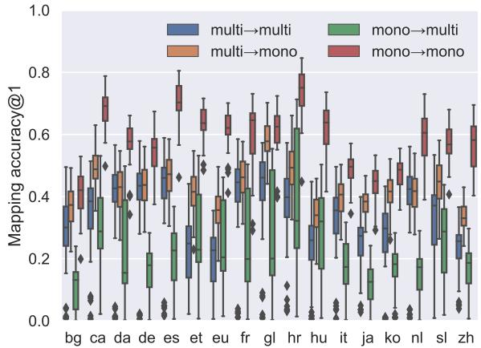
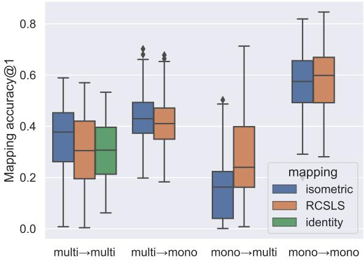
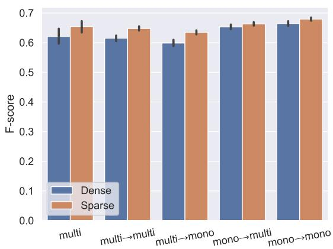
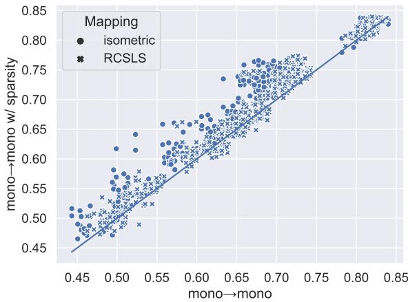
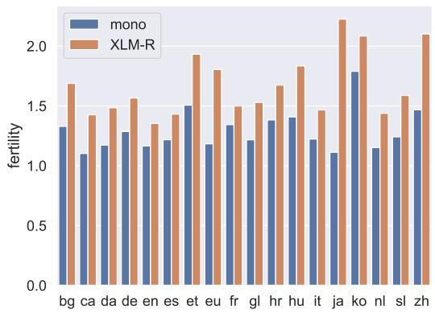
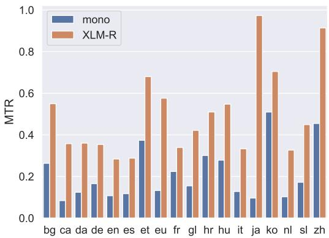
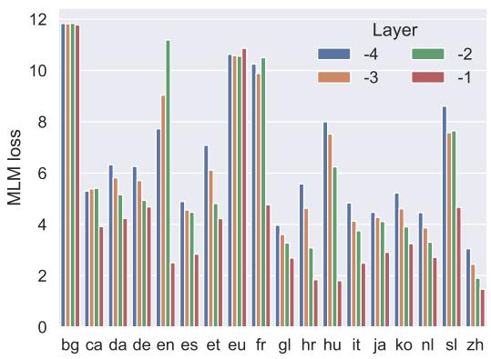
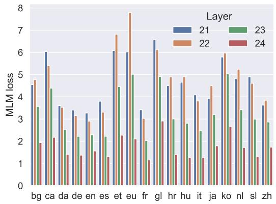

# Combating the Curse of Multilinguality in Cross-Lingual WSD by Aligning Sparse Contextualized Word Representations

Gábor Berend Institute of Informatics, University of Szeged berendg@inf.u-szeged.hu

## Abstract

In this paper, we advocate for using large pretrained monolingual language models in cross lingual zero-shot word sense disambiguation (WSD) coupled with a contextualized mapping mechanism. We also report rigorous experiments that illustrate the effectiveness of employing sparse contextualized word representations obtained via a dictionary learning procedure. Our experimental results demonstrate that the above modifications yield a significant improvement of nearly 6.5 points of increase in the average F-score (from 62.0 to 68.5) over a collection of 17 typologically diverse set of target languages. We release our source code for replicating our experiments at https://github.com/begab/ sparsity\_makes\_sense.

## 1 Introduction

Word sense disambiguation (WSD) is a longstanding and fundamental problem of Natural Language Processing, known to be affected by the knowledge acquisition bottleneck (Gale et al., 1992). Large pre-trained neural language models are known to effectively mitigate the problems related to the paucity of high quality, large-coverage sense annotated training data for WSD (Loureiro and Jorge, 2019; Loureiro et al., 2021b; inter alia).

Most recently, the knowledge acquisition bottleneck has been identified as an immense problem in the cross-lingual setting as well (Pasini, 2020). A straightforward solution for handling this problem is to apply large multilingual pre-trained language models in a zero-shot setting, however, this approach has a potential limitation owing to the curse ofmultilinguality (Conneau et al., 2020a), i.e., the inability of such models to handle the large number of languages involved during training such models to an equally good quality.

The research community replied to the limitations of large massively multilingual models by developing language-specific monolingual language

ISO Huggingface model identifier bg DeepPavlov/bert-base-bg-cs-pl-ru-cased (Arkhipov et al., 2019) ca PlanTL-GOB-ES/roberta-base-ca (Armengol-Estapé et al., 2021) da Maltehb/danish-bert-botxo de bert-base-german-cased es dccuchile/bert-base-spanish-wwm-cased (Cañete et al., 2020) et EMBEDDIA/finest-BERT (Ulcar and Robnik-Šikonjaˇ , 2020) eu ixa-ehu/berteus-base-cased (Agerri et al., 2020) fr camembert-base (Martin et al., 2020) gl dvilares/bertinho-gl-base-cased (Vilares et al., 2021) hr EMBEDDIA/crosloengual-bert (Ulcar and Robnik-Šikonjaˇ , 2020) hu SZTAKI-HLT/hubert-base-cc (Nemeskey, 2021) it Musixmatch/umberto-commoncrawl-cased-v1 ja cl-tohoku/bert-base-japanese-whole-word-masking ko snunlp/KR-BERT-char16424 nl GroNLP/bert-base-dutch-cased (de Vries et al., 2019) sl EMBEDDIA/sloberta zh bert-base-chinese

Table 1: Monolingual models from the transformers library (Wolf et al., 2020) covering all the (non-English) languages of the XL-WSD dataset (Pasini et al., 2021).

models.1 Table 1 provides a shortlist of recently published monolingual large pre-trained language models, related to the languages involved in the cross-lingual WSD test suit, XL-WSD (Pasini et al., 2021).

With the prevalence of large monolingual pretrained models, the important research question arises if their language-specific nature can be successfully exploited during zero-shot learning. Our research provides a thorough comparison of the application of large multilingual and monolingual pre-trained language models for zero-shot WSD.

Another crucial aspect that we carefully investigate in this paper is the integration of sparse contextualized word representations into cross-lingual zero-shot WSD. Sparse word representations have a demonstrated ability to align with word senses (Balogh et al., 2020; Yun et al., 2021). While the benefits of employing sparsity has been shown for WSD in English (Berend, 2020a), its viability in the cross-lingual setting has not yet been verified.

In order to conduct such an analysis, we propose an algorithm for obtaining cross-lingual sparse contextualized word representations from independently trained monolingual language models.

## 2 Related work

The analysis and the investigation of the transfer capabilities of large pre-trained language models (such as mBERT or XLM) across languages has spurred significant research interest (Pires et al., 2019; Wu and Dredze, 2019, 2020; K et al., 2020). In contrast to the availability of multilingual neural language models, a series of recent papers have argued for the creation of dedicated neural language models for different languages (see e.g. Table 1). While monolingual neural language models can more accurately model the distinct languages, models that are trained in isolation of other languages cannot directly benefit from downstream application-specific annotated training data available in different languages.

Artetxe et al. (2020) proposed an approach for making monolingual models compatible with each other by first pre-training a masked language model on a source language, then freezing its parameters apart from its embedding layer that get replaced and trained for additional target languages using a standard masked language modeling objective. Note that this approach is complementary and strictly more resource intensive to ours, as it involves the pre-training of a (freezed) transformer model with respect its embedding layer for a target language. In contrast, our approach can operate on monolingual language models fully pre-trained in total isolation from the source language encoder. Also, our approach learns substantially fewer parameters in the form of an alignment matrix between the hidden representations of the contextualized target and source language spaces.

Conneau et al. (2020b) analyzed the multilingual patterns emerging in large pre-trained language models. The authors found that “language universal representations emerge in pre-trained models without the requirement of any shared vocabulary or domain similarity”. That work have demonstrated that monolingual BERT models can be effectively mapped for performing zero-shot crosslingual named entity recognition and syntactic parsing. Similarly, Wang et al. (2019); Schuster et al. (2019) also illustrated the efficacy of linear transformations for using BERT-derived representations in cross-lingual dependency parsing.

WSD has been a fundamental and challenging problem in NLP for many decades, dating back to (Weaver, 1949/1955). The utilization of contextualized word representations was first advocated by Peters et al. (2018), later popularized by (Loureiro and Jorge, 2019; Loureiro et al., 2021a). Bevilacqua et al. (2021) offers a survey of the recent approaches.

Most recently, Rezaee et al. (2021) have explored the usage of multilingual language models (XLM) in zero-shot WSD. While the experiments in (Rezaee et al., 2021) cover four related target languages (German, Spanish, French and Italian), our investigation involves a typologically diverse set of 17 target languages (beyond English) from (Pasini et al., 2021). Our work also extends that line of research in important aspects, as we show that the application of monolingual neural language models can vastly improve the performance of crosslingual zero-shot WSD. Additionally, we also provide a careful evaluation of sparse contextualized word representations in zero-shot WSD.

Berend (2020a) introduced sparse contextualized word representations via the application of dictionary learning, and showed that sense representations that are obtained from the co-occurrence statistics of the sparsity structure of the contextualized word representations and their sense annotations can provide significant improvement in monolingual WSD. Our work relates to that line of research by providing a mapping-based procedure, which enables the usage of such sense representations created in some source language to be applied in other target languages as well. The kind of mapping we employ can be viewed as a generalization of the approach introduced in (Berend, 2020b) with the notable exception that in this work, we obtain sparse word representations for contextualized models as opposed to static word embeddings.

## 3 Methodology

In order to allow for zero-shot transfer between monolingual language models pre-trained in isolation from each other, we need to determine a mapping between their hidden representations. We first introduce our methodology for doing so, then we integrate this to the creation of sparse contextualized word representations.

## 3.1 Mapping hidden representations

The alignment of word representations between independently constructed semantic spaces can be conveniently and efficiently performed via linear transformations. This has been a standard approach for non-contextualized word embeddings (Mikolov et al., 2013; Xing et al., 2015; Smith et al., 2017), but it has been shown to be useful in the contextualized case as well (Conneau et al., 2020b).

The standard approach is to obtain a collection of pairs of anchor points $\{ \pmb { x } _ { i } , \pmb { y } _ { i } \} _ { i = 1 } ^ { n }$ with $\mathbf { \mathcal { x } } _ { i }$ and ${ \bf { \nabla } } \pmb { { \mu } } _ { i }$ denoting the representation of semantically equivalent words in the target and source languages, respectively. The mapping W is then obtained as

$$
\operatorname* { m i n } _ { W } \sum _ { i = 1 } ^ { n } \lVert W x _ { i } - { \pmb y } _ { i } \rVert _ { 2 } ^ { 2 } .\tag{1}
$$

As we deal with contextualized models, we can obtain various representations for a word even in the same context, by considering the hidden representations from different layers of the neural language models employed. Additionally, as constraining the mapping matrix to be an isometric one have proven to be a useful requirement, we define our learning task to be of the form

$$
\operatorname* { m i n } _ { W \ s . t . \ W \tau W = I } \sum _ { i = 1 } ^ { n } \lVert W \pmb { x } _ { i } ^ { ( l _ { t } ) } - \pmb { y } _ { i } ^ { ( l _ { s } ) } \rVert _ { 2 } ^ { 2 } ,\tag{2}
$$

with I denoting the identity matrix, $\pmb { x } _ { i } ^ { ( l _ { t } ) }$ and $\mathbf { \pmb { y } } _ { i } ^ { ( l _ { s } ) }$ denoting the hidden representations obtained from the ${ l _ { t } } ^ { \mathrm { { t h } } }$ and ${ l _ { s } } ^ { \mathrm { t h } }$ layers of the target and source language neural language models, respectively.

Finding the optimal isometric W can be viewed as an instance of the orthogonal Procrustes problem (Schönemann, 1966) which can be solved by $W _ { \perp } = U V$ , with U and V originating from the singular value decomposition of the matrix product $Y \bar { Y } X$ , where X and Y include the stacked target and source language contextual representations of pairs of semantically equivalent words.

As words of the input sequences to the neural language models can be split into multiple subtokens, we followed the common practice of obtaining word-level neural representations by performing mean pooling of the subword representations. Throughout our experiments, we also relied on the RCSLS criterion (Joulin et al., 2018), which offers a retrieval-based alternative of obtaining a mapping from the target to the source language representations.

## 3.2 Cross-lingual sparse contextualized word representations

Our approach extends the information theoretic algorithm introduced in (Berend, 2020a) for its application in the cross-lingual zero-shot WSD setting. In order to obtain sparse contextualized representations for the source language, we first populate $Y \in \mathbb { R } ^ { d \times N }$ with d-dimensional contextualized representations of words determined for texts in the source language, and minimize the objective

$$
\operatorname* { m i n } _ { \substack { D \in \mathcal { C } , \alpha _ { i } \in \mathbb { R } _ { \geq 0 } ^ { k } } } \sum _ { i = 1 } ^ { N } \frac { 1 } { 2 } \| \pmb { y } _ { i } - D \pmb { \alpha } _ { i } \| _ { 2 } ^ { 2 } + \lambda \| \pmb { \alpha } _ { i } \| _ { 1 } ,\tag{3}
$$

where denotes the convex set of $d \times k$ matrices with column norm at most 1, λ is a regularization coefficient and the sparse coefficients in α are required to be non-negative. We used the SPAMS library (Mairal et al., 2009) for calculating D and α.

Having obtained D for the source language, we determine a sparse contextualized word representation for a target language word with dense contextualized representation $\mathbf { \nabla } x _ { i }$ as

$$
\operatorname* { m i n } _ { \alpha _ { i } \in \mathbb { R } _ { \geq 0 } ^ { k } } \frac { 1 } { 2 } \| W \pmb { x } _ { i } - D \pmb { \alpha } _ { i } \| _ { 2 } ^ { 2 } + \lambda \| \pmb { \alpha } _ { i } \| _ { 1 } ,\tag{4}
$$

where W is the alignment transformation as described earlier in Section 3.1. Eq. (4) reveals that the cross-lingual applicability of the sparse codes are assured by the mapping transformation W and the fact that the sparse target language representations are also using the same D that was determined for the source language, which also ensures the efficient calculation of sparse representations during inference time.

Apart from these crucial extensions we made for providing the use of contextualized sparse representations in the cross-lingual setting, the way we utilized them for the determination of sense representation and inference is identical to (Berend, 2020a). That is, for all sense-annotated words in the training corpus, we calculated a weighted cooccurrence statistics between a word pertaining to a specific semantic category and having non-zero coordinates along a specific dimension in their sparse contextualied word representations. These statistics are then transformed into pointwise mutual information (PMI) scores, resulting in a sense representation for all the senses in the training sense inventory.

Sense representations obtained that way measure the strength of the relation of the senses to the different (sparse) coordinates. Inference for a word with sparse representation α is simply taken as arg max Φα⊺, where Φ is the previously defined matrix of PMI values and s corresponds to the sense at which position the above matrix–vector products takes its largest value.

## 4 Experimental results

All the neural language models that we relied on during our experiments were obtained from the transformers library (Wolf et al., 2020). We used four NVIDIA Titan 2080 GPUs for our experiments.

As the multilingual language model, we used the 24-layer transformer architecture, XLM-RoBERTa (XLM-R for short) (Conneau et al., 2020a). We chose the cased BERT (Devlin et al., 2019) large model as the monolingual model for encoding English text. As for the rest of the monolingual language models involved in our experiments, we relied on the models listed in Table 1. These monolingual models have the same size as the BERT-base model, i.e., they consist of 12 transformer blocks and employ hidden representations of 768 dimensions.

For evaluation purposes, we used the extra-large cross-lingual evaluation benchmark XL-WSD, recently proposed in (Pasini et al., 2021). The database contains a high-quality sense annotated corpus for English as the concatenation of the Sem-Cor dataset (Miller et al., 1994) and the sense definitions and example sentences from WordNet (Fellbaum, 1998). XL-WSD uses the unified crosslingual sense inventory of BabelNet (Navigli and Ponzetto, 2012).

The dataset contains 17 additional typologically diverse languages besides English (that we listed in Table 1). The authors also released machine translated silver standard sense annotated training corpora for all the languages, which makes the language-specific fine-tuning of monolingual models possible, however, as shown in (Pasini et al., 2021), that approach resulted in inferior results compared to the application of multilingual models in the zero-shot setting.

Throughout the application of sparse contextualized representations, we employ the same set of hyperparameters that were used in (Berend, 2020a), i.e., we set the number of the regularization coefficient to λ = 0.05 and the number of (sparse) coordinates to k = 3000. There made one optional change, i.e., we decided whether to use the normalization of PMI values (Bouma, 2009) during the calculation of the sense representation matrix Φ on a per language basis based on development set performances. An ablation study related to the (optional) normalization of PMI scores is reported in Table 5, Appendix B.

When we do not employ the sparsification of the contextualized word representations for determining the sense representations, we follow the approach introduced in (Loureiro and Jorge, 2019). That is, we take the centroid of word vectors belonging to a particular sense as the representation of that sense, and perform a nearest neighbor search during inference.

## 4.1 Alignment of contextualized representations

As the different layers of neural language models have been shown to provide different levels of utility towards different tasks, we experimented with mappings between different combinations of layers from the target and source language neural language models. Since the last few layers of the neural models are generally agreed to be the most useful for semantics-related tasks (Peters et al., 2018; Tenney et al., 2019; Reif et al., 2019), we decided to learn mappings between the hidden representations of any of the last four layers of the target and source language encoders.

We used BERT as the language specific encoder for the source language texts in English, but we also investigated the application of XLM-R, so that we can see the effects of replacing it by an encoder especially tailored for English. As for the target languages, we used the respective models for each language as listed in Table 1. Similar to the source language, we also investigated the case when target languages were encoded by the multilingual model.

In what follows, we label the different experimental settings according to the followings:

• multi multi means that we map the target language representations obtained by the multilingual (XLM-R) model to the representation space of the source language also obtained by the multilingual (XLM-R) encoder,

• multi mono, means that we map the target language representations obtained by the multilingual (XLM-R) model to the representation space of the source language obtained by the monolingual (English BERT) encoder,

• mono multi, means that we map the target language representations obtained by their respective monolingual language model to the representation space of the source language obtained by the multilingual (XLM-R) encoder,

• mono mono, means that we map the target language representations obtained by their respective monolingual language model to the representation space of the source language obtained by the monolingual (English BERT) encoder.

In order to obtain the cross-representational mappings, we accessed the Tatoeba corpus (Tiedemann, 2012) through the datasets library (Lhoest et al., 2021). The Tatoeba corpus contains translated sentence pairs for several hundreds of languages which we used for obtaining the pivot word mention pairs together with their contexts.

In addition to the Tatoeba corpus, we used the word2word library (Choe et al., 2020) containing word translation pairs between more than 3,500 language pairs. By denoting $( S _ { s _ { i } } , S _ { t _ { i } } )$ the $i ^ { \mathrm { t h } }$ translated sentence pair from the Tatoeba corpus, we treated those $( w _ { s } \in S _ { s _ { i } } , w _ { t } \in S _ { t _ { i } } )$ word occurrences as being semantically equivalent, for which the $w _ { t } ~ \in ~ T r a n s l a t i o n O f ( w _ { s } )$ and the ws TranslationOf(wt) relations simultaneously held according to the translation list provided by word2word.

As an example, given the German-English translation pair from Tatoeba, {’de:’ ’Es steht ein Glas auf dem Tisch.’, ’en’: ’There is a glass on the table.}, underlined pairs of words with the same color would be treated as contextualized translation pairs of each other.

One benefit of our approach for determining contextual alignment of word pairs is that it does not require word level alignment of the parallel sentences, hence it suits such lower resource scenarios better, when only parallel sentences (without word level alignments) and a list of word translation pairs are provided. Naturally, different contextual alignment approaches could be integrated into our approach at this point, and this is something that we regard as potential future extension of our work.

We evaluated the quality of the mapping learned between the target and the source language representations by defining a contextualized translation retrieval task and evaluating it on its accuracy@1 metric, i.e., for what fraction of the contextualized translation pairs – not seen during the determination of the mapping between the two representation spaces – are we able to rank the original translated context as the highest.

<table><tr><td colspan="2">Language</td><td>#sentences</td><td>Train</td><td>Test</td></tr><tr><td>bg</td><td>Bulgarian</td><td>17,797</td><td>14,212</td><td>3,554</td></tr><tr><td>ca</td><td>Catalan</td><td>1,663</td><td>3,912</td><td>979</td></tr><tr><td>da</td><td>Danish</td><td>30,089</td><td>20,000</td><td>5,000</td></tr><tr><td>de</td><td>German</td><td>299,769</td><td>20,000</td><td>5,000</td></tr><tr><td>es</td><td>Spanish</td><td>207,517</td><td>20,000</td><td>5,000</td></tr><tr><td>et</td><td>Estonian</td><td>2,428</td><td>2,365</td><td>592</td></tr><tr><td>eu</td><td>Basque</td><td>2,062</td><td>3,956</td><td>990</td></tr><tr><td>fr</td><td>French</td><td>262,078</td><td>20,000</td><td>5,000</td></tr><tr><td>gl</td><td>Galician</td><td>1,013</td><td>2,356</td><td>590</td></tr><tr><td>hr</td><td>Croatian</td><td>2,420</td><td>1,946</td><td>487</td></tr><tr><td>hu</td><td>Hungarian</td><td>107,133</td><td>20,000</td><td>5,000</td></tr><tr><td>it</td><td>Italian</td><td>482,948</td><td>20,000</td><td>5,000</td></tr><tr><td>ja</td><td>Japanese</td><td>204,893</td><td>20,000</td><td>5,000</td></tr><tr><td>ko</td><td>Korean</td><td>3,434</td><td>5,632</td><td>1,408</td></tr><tr><td>nl</td><td>Dutch</td><td>72,391</td><td>20,000</td><td>5,000</td></tr><tr><td>sl</td><td>Slovenian</td><td>3,210</td><td>1,285</td><td>322</td></tr><tr><td>zh</td><td>Chinese</td><td>46,114</td><td>20,000</td><td>5,000</td></tr></table>

Table 2: The number of sentence pairs included in the Tatoeba corpus between English and a target language and the number of contextualized translation pairs extracted for training and testing the mappings.

In the multi multi case, i.e., when both the target and source languages are encoded by the same multilingual model (XLM-R), it also makes sense to use the identity matrix as the mapping operator for mapping the target language contextual text representations to the semantic space of the source language (as long as the target and source language texts are obtained from the same layer of the multilingual encoder). We also evaluated the quality of this approach in our experiments that we refer to as the identity approach.

We list the statistics of the Tatoeba corpus and the size of the training and test contextualized translation pairs in Table 2. Our results on the top-1 contextualized translation retrieval accuracies along the different languages and combination of target and source encoder usage are reported in Figure 1. The quality of the combination which uses monolingual encoders for both the target and source languages (mono mono) performed the best.

  
(a) Mapping accuracies per languages.

  
(b) Mapping accuracies aggregated over languages.

Figure 1: The results of translation retrieval over the test sets of the different languages and different combinations of transformers used for the (English) source and the target languages.
<table><tr><td colspan="3">BERT</td><td colspan="2">XLM-R</td></tr><tr><td>Layer</td><td>Dense</td><td>Sparse</td><td>Dense</td><td>Sparse</td></tr><tr><td>21</td><td>74.39</td><td>77.45</td><td>69.29</td><td>74.51</td></tr><tr><td>22</td><td>74.87</td><td>77.60</td><td>67.87</td><td>74.50</td></tr><tr><td>23</td><td>74.45</td><td>77.86</td><td>67.48</td><td>74.26</td></tr><tr><td>24</td><td>73.58</td><td>76.21</td><td>64.50</td><td>70.06</td></tr></table>

Table 3: English results expressed in F-score.

## 4.2 Monolingual evaluation

We first conducted evaluations in the monolingual setting, i.e., we used the sense annotated training data to train and evaluate WSD models in English. The results of these experiments – depending on the encoder architecture used (BERT/XLM-R), the layer of the encoder utilized ({21,. . . ,24}), and whether the sparsification of the contextualized representations took place (Dense/Sparse) – are included in Table 3.

Unsurprisingly, the application of the languagespecific BERT model achieved better scores compared to that of XLM-R. An interesting observation though, is that the drop in performance is much more subtle for those cases when the contextualized representations are enhanced via sparsification, i.e., the typical loss in performance across the layers is only 3 points (apart from the final layer), opposed to the typical loss of 4-7 points in the dense case.

## 4.3 Cross-lingual zero-shot evaluation

Table 4 includes the zero-shot cross-lingual WSD results for a collection of baseline approaches (Table 4a) from (Pasini et al., 2021), followed by our models not utilizing the sparsification of the contextualized embeddings (Table 4b) and the ones that additionally benefit from sparsification as well (Table 4c). It is useful to note that the mono→\* approaches are strictly more resource efficient during inference as they are based on 12-layer encoders instead of the 24 layers of the multilingual XLM-R model.

At this point, we separate the multi→multi results into two, i.e., 1) those obtained when relying on the hidden representations from the same layer of XLM-R without mapping (or equivalently, with the identity mapping from the target to source representations); and 2) those obtained when the target and source language contextual representations could originate from different layers of the XLM-R encoder, and a non-identity (either isometric or RC-SLS) mapping was employed. We keep referring to the latter as multi→multi, and denote the former type of experiments as multi (without the →multi suffix as there were no real mappings performed in these cases). Inspecting the first two rows of Table 4b and Table 4c reveals that enhancing the multilingual encoder towards the treatment of a particular pair of languages by providing it a language pair specific mapping has a larger positive effect when using dense vectors. In fact, it increased the micro-averaged F-score over the 17 languages by 1.72 and 0.11 points for the dense and the sparse cases, respectively.

Overall, the micro-averaged F-score of our final approach managed to improve nearly 6.5 points (cf. the first row of Table 4b and the last row in Table 4c). A 5 point average improvement is due to the replacement of the XLM-R encoder for both the source language during training and target languages for inference (cf. the first and last row of Table 4b) and an additional 1.5 points of improvement was an effect of our sparsification in the crosslingual setting. The inspection of the third and fourth rows in both Table 4b and Table 4c reveals that using a monolingual encoder during inference helps more compared to the application of a monolingual encoder for encoding the source language during training.

<table><tr><td></td><td>bg</td><td>ca</td><td>da</td><td>de</td><td>es</td><td>et</td><td>eu</td><td>fr</td><td>gl</td><td>hr</td><td>hu</td><td>it</td><td>ja</td><td>ko</td><td>nl</td><td>sl</td><td>zh</td><td>Avg.</td></tr><tr><td>XLMR-Large</td><td>72.00</td><td>49.97</td><td>80.61</td><td>83.18</td><td>75.85</td><td>66.13</td><td>47.15</td><td>83.88</td><td>66.28</td><td>72.29</td><td>67.64</td><td>77.66</td><td>61.87</td><td>64.20</td><td>59.20</td><td>68.36</td><td>51.62</td><td>65.66</td></tr><tr><td>XLMR-Base</td><td>71.59</td><td>47.77</td><td>79.18</td><td>82.13</td><td>76.55</td><td>64.73</td><td>43.86</td><td>82.33</td><td>64.79</td><td>72.13</td><td>68.36</td><td>76.73</td><td>61.46</td><td>63.65</td><td>58.77</td><td>66.34</td><td>49.77</td><td>64.82</td></tr><tr><td>MBERT</td><td>68.78</td><td>47.35</td><td>76.04</td><td>80.63</td><td>74.66</td><td>64.33</td><td>42.41</td><td>81.64</td><td>68.07</td><td>70.65</td><td>65.24</td><td>76.16</td><td>60.34</td><td>63.37</td><td>56.64</td><td>62.16</td><td>48.99</td><td>62.84</td></tr><tr><td>EWISER (2020)</td><td>68.64</td><td>42.99</td><td>76.67</td><td>80.86</td><td>71.85</td><td>65.98</td><td>42.85</td><td>80.86</td><td>59.41</td><td>70.60</td><td>66.17</td><td>74.06</td><td>55.77</td><td>63.38</td><td>57.50</td><td>59.74</td><td>48.30</td><td>62.16</td></tr><tr><td>SyntagRank</td><td>61.10</td><td>43.98</td><td>72.93</td><td>75.99</td><td>68.58</td><td>56.31</td><td>42.91</td><td>69.57</td><td>67.56</td><td>68.35</td><td>57.98</td><td>69.57</td><td>57.46</td><td>50.29</td><td>56.00</td><td>52.25</td><td>41.23</td><td>57.68</td></tr><tr><td>Babelfy</td><td>60.39</td><td>36.52</td><td>71.33</td><td>77.84</td><td>64.07</td><td>49.62</td><td>36.65</td><td>67.41</td><td>64.17</td><td>63.75</td><td>51.99</td><td>64.22</td><td>51.91</td><td>51.95</td><td>44.27</td><td>35.38</td><td>34.94</td><td>52.85</td></tr><tr><td>MCS</td><td>58.16</td><td>27.17</td><td>64.33</td><td>75.99</td><td>55.65</td><td>46.87</td><td>32.72</td><td>59.31</td><td>60.85</td><td>62.88</td><td>47.29</td><td>52.77</td><td>48.71</td><td>52.48</td><td>44.61</td><td>36.71</td><td>29.62</td><td>49.13</td></tr></table>

(a) Baseline results (MCS stands for Most Common Sense) from (Pasini et al., 2021).

<table><tr><td></td><td>bg</td><td>ca</td><td>da</td><td>de</td><td>es</td><td>et</td><td>eu</td><td>fr</td><td>gl</td><td>hr</td><td>hu</td><td>it</td><td>ja</td><td>ko</td><td>nl</td><td>sl</td><td>zh</td><td>Avg.</td></tr><tr><td>multi</td><td>67.07</td><td>47.46</td><td>76.58</td><td>80.74</td><td>70.61</td><td>65.23</td><td>42.53</td><td>75.60</td><td>56.85</td><td>70.63</td><td>65.42</td><td>71.38</td><td>58.45</td><td>63.88</td><td>54.86</td><td>61.91</td><td>48.98</td><td>61.98</td></tr><tr><td>multi→multi</td><td>68.99</td><td>51.62</td><td>78.56</td><td>80.51</td><td>70.02</td><td>65.28</td><td>44.68</td><td>78.62</td><td>57.44</td><td>71.59</td><td>68.99</td><td>70.90</td><td>61.40</td><td>64.41</td><td>57.73</td><td>61.17</td><td>50.65</td><td>63.71</td></tr><tr><td>multi→mono</td><td>68.82</td><td>44.17</td><td>79.75</td><td>84.69</td><td>70.88</td><td>64.68</td><td>40.95</td><td>79.66</td><td>56.58</td><td>71.34</td><td>68.07</td><td>69.93</td><td>59.71</td><td>64.49</td><td>59.25</td><td>61.37</td><td>50.77</td><td>63.30</td></tr><tr><td>mono→multi</td><td>69.68</td><td>52.95</td><td>78.90</td><td>82.02</td><td>68.34</td><td>66.33</td><td>49.62</td><td>80.17</td><td>58.30</td><td>72.34</td><td>70.75</td><td>74.01</td><td>64.35</td><td>65.02</td><td>59.32</td><td>64.76</td><td>54.95</td><td>65.57</td></tr><tr><td>mono→mono</td><td>71.17</td><td>53.31</td><td>81.21</td><td>83.29</td><td>72.56</td><td>66.48</td><td>51.08</td><td>81.55</td><td>63.14</td><td>73.76</td><td>72.76</td><td>72.52</td><td>65.26</td><td>66.57</td><td>60.52</td><td>67.42</td><td>55.45</td><td>66.96</td></tr></table>

(b) Our results relying on dense sense vectors.

<table><tr><td></td><td>bg</td><td>ca</td><td>da</td><td>de</td><td>es</td><td>et</td><td>eu</td><td>fr</td><td>gl</td><td>hr</td><td>hu</td><td>it</td><td>ja</td><td>ko</td><td>nl</td><td>sl</td><td>zh</td><td>Avg.</td></tr><tr><td>multi</td><td>70.69</td><td>51.52</td><td>81.41</td><td>83.53</td><td>76.45</td><td>67.78</td><td>47.85</td><td>83.62</td><td>64.47</td><td>73.06</td><td>70.10</td><td>76.65</td><td>63.73</td><td>64.67</td><td>58.00</td><td>64.12</td><td>53.29</td><td>66.04</td></tr><tr><td>multi→multi</td><td>70.91</td><td>51.52</td><td>80.50</td><td>82.37</td><td>75.96</td><td>66.13</td><td>47.09</td><td>83.79</td><td>63.26</td><td>72.94</td><td>70.01</td><td>77.17</td><td>64.47</td><td>64.73</td><td>60.16</td><td>66.49</td><td>53.05</td><td>66.15</td></tr><tr><td>multi→mono</td><td>71.91</td><td>50.54</td><td>81.21</td><td>79.93</td><td>76.93</td><td>64.83</td><td>44.05</td><td>83.62</td><td>62.87</td><td>71.64</td><td>69.26</td><td>77.48</td><td>63.59</td><td>64.59</td><td>60.39</td><td>61.07</td><td>53.48</td><td>65.82</td></tr><tr><td>mono→multi</td><td>70.76</td><td>52.49</td><td>79.67</td><td>82.25</td><td>75.09</td><td>67.83</td><td>50.89</td><td>83.19</td><td>60.68</td><td>73.99</td><td>72.97</td><td>75.33</td><td>63.80</td><td>65.86</td><td>61.57</td><td>65.70</td><td>55.65</td><td>66.79</td></tr><tr><td>mono→mono</td><td>72.00</td><td>57.47</td><td>81.15</td><td>83.76</td><td>76.12</td><td>68.88</td><td>51.71</td><td>83.10</td><td>63.92</td><td>74.40</td><td>75.52</td><td>76.12</td><td>67.47</td><td>67.52</td><td>61.95</td><td>67.47</td><td>57.05</td><td>68.47</td></tr></table>

(c) Our results based on sparse sense vectors.  
Table 4: Test set results on the XL-WSD benchmark. The hyperparameters of the individual approaches (e.g. which layer of the target language encoder to align with which layer of the source language encode) were determined based on the development set of each language.

We conducted the McNemar test between our system outputs when a non-identity mapping was used between a pair of languages. Our investigation revealed that all such puts from Table 4b and Table 4c differ significantly from each other with $p < 0 . 0 0 0 7$ , with only four exceptions, i.e, 1) multi→multi and multi→mono from Table 4b; 2) multi→multi and multi→mono from Table 4c; 3) mono→multi from Table 4c and mono→mono from Table 4b; 4) multi→mono from Table 4c and mono→multi from Table 4b.

Figure 2 summarizes the results of all the possible runs conducted. When using the multilingual encoder for both the target and source languages without a mapping step between the two (multi), we ran 4 different experiments per each language based on the hidden representations obtained from one of the last 4 layers of the multilingual encoder. For the remaining experiments relying on the dense and sparse representations, there were 32 and 64 experiments for each language, respectively. The 32 experiments were a result of choosing any of the 16 possible combination of the final four layers on the target and source language encoder, coupled with the type of mapping utilized (isometric/RCSLS). For the experiments involving the sparse representations, there was an extra parameter, whether the normalization of the PMI scores for obtaining the sense representations to be performed, resulting in $2 \times 3 2$ experiments all together. Our ablation study in Table 5 illustrates that this extra factor of 2 for the sparse experiments did not provided us an unfair advantage, i.e., when fixing the value of normalization in any way, the overall results did not differ substantially.

  
Figure 2: Overall averaged results for all the experiments conducted for the different approaches.

  
Figure 3: Comparison of the two best performing systems when the same hyperparameters were employed.

The difference in the average performance of our approach transforming sparse contextualized representations obtained by monolingual models is significant (using unpaired t-test2, $p < 0 . 0 0 5 )$ compared to any other configuration. This suggests that the mono mono approach has a robust advantage over alternative variants, and the improvements seen in Table 4 are not an effect of careful hyperparameter selection, but they generalize over a wide range of choices.

This effect is further corroborated in Figure 3, which offers a comparison between the two systems with the best average performance, i.e., mono mono that operates with the dense vectors (results are along the x-axis) and the same model but with the enhancement of sparsification (results are along the y-axis). Each data point corresponds to a setting with the same hyperparameter choices, and points above the diagonal line with slope one demonstrate the benefits of sparsification.

We have demonstrated the improved utility of mapping language-specific sparse contextualized representations for conducting zero-shot WSD, requiring large pre-trained language-specific text encoders for the target languages. While such models are available for all languages in XL-WSD, a variety of the existing languages lack their dedicated language-specific pre-trained language model.

As such, an important question emerges whether it is possible to enjoy the benefits of mapping sparse contextualized representations for zero-shot WSD in the absence of a large pre-trained language model dedicated to the target language. To this end, we shall inspect the results of our multi→mono approach in Table 4, a series of mapping-based experiments in which we acted as if the monolingual language models (other than the one for English) did not exist. In these experiments, the sense embeddings were obtained with bert-large-cased (being specialized to English), and the mapping to the non-English target languages were performed towards their XLM-R representations during the evaluation. This way, we could simulate the effects of the absence of language-specific models.

The multi→mono approach provided a substantially better average performance compared to the mere utilization of a multilingual encoder in the case of dense contextualized representations as it can be seen in Table 4b. The average results of multi→mono are slightly inferior (albeit statistically insignificantly) to that of the multi approach for the application of sparse contextualized representations. However, when comparing the multi→multi results with that of multi→mono, we can see that by relying on a multilingual encoder alone, and allowing a mapping to be employed between its hidden representations pertaining to different languages, one can obtain the same (or even slightly better) performance as with the multi→mono approach. This highlights the importance of monolingual encoders for the target language, which seems to be more important than having access to a monolingual encoder for the source language.

## 5 Conclusions

In this paper we provided a systematic investigation of the benefits of using large monolingual pretrained language models in place of multilingual language models, such as XLM-R. We have shown that since monolingual neural language models are specifically tailored for a single (or at most a few related) languages, they can effectively mitigate the curse ofmultilinguality typical of multilingual models, and their application can significantly improve the F-scores in zero-shot WSD. We additionally showed that the benefits of sparse contextualized word representations, obtained via a dictionary learning procedure, also convey to the cross-lingual setting, and that it provides complementary improvements to the usage of monolingual neural language models.

## Acknowledgments

The research was supported by the Ministry of Innovation and Technology NRDI Office within the framework of the Artificial Intelligence National Laboratory Program. Additionally, we are thankful for the usage of ELKH Cloud (https://sciencecloud.hu/) that helped us achieving the results published in this paper.

## References

Judit Ács. 2019. Exploring BERT’s Vocabulary. Blog Post.

Rodrigo Agerri, Iñaki San Vicente, Jon Ander Campos, Ander Barrena, Xabier Saralegi, Aitor Soroa, and Eneko Agirre. 2020. Give your text representation models some love: the case for Basque. In Proceedings of the 12th Language Resources and Evaluation Conference, pages 4781–4788, Marseille, France. European Language Resources Association.

Mikhail Arkhipov, Maria Trofimova, Yuri Kuratov, and Alexey Sorokin. 2019. Tuning multilingual transformers for language-specific named entity recognition. In Proceedings ofthe 7th Workshop on Balto-Slavic Natural Language Processing, pages 89–93, Florence, Italy. Association for Computational Linguistics.

Jordi Armengol-Estapé, Casimiro Pio Carrino, Carlos Rodriguez-Penagos, Ona de Gibert Bonet, Carme Armentano-Oller, Aitor Gonzalez-Agirre, Maite Melero, and Marta Villegas. 2021. Are multilingual models the best choice for moderately underresourced languages? A comprehensive assessment for Catalan. In Findings ofthe Associationfor Computational Linguistics: ACL-IJCNLP 2021, pages 4933–4946, Online. Association for Computational Linguistics.

Mikel Artetxe, Sebastian Ruder, and Dani Yogatama. 2020. On the cross-lingual transferability of monolingual representations. In Proceedings of the 58th Annual Meeting ofthe Associationfor Computational Linguistics, pages 4623–4637, Online. Association for Computational Linguistics.

Vanda Balogh, Gábor Berend, Dimitrios I. Diochnos, and György Turán. 2020. Understanding the semantic content of sparse word embeddings using a commonsense knowledge base. In The Thirty-Fourth AAAI Conference on Artificial Intelligence, AAAI 2020, The Thirty-Second Innovative Applications of

Artificial Intelligence Conference, IAAI 2020, The Tenth AAAI Symposium on Educational Advances in Artificial Intelligence, EAAI 2020, New York, NY, USA, February 7-12, 2020, pages 7399–7406. AAAI Press.

Gábor Berend. 2020a. Sparsity makes sense: Word sense disambiguation using sparse contextualized word representations. In Proceedings of the 2020 Conference on Empirical Methods in Natural Language Processing (EMNLP), pages 8498–8508, Online. Association for Computational Linguistics.

Gábor Berend. 2020b. Massively multilingual sparse word representations. In International Conference on Learning Representations.

Michele Bevilacqua and Roberto Navigli. 2020. Breaking through the 80% glass ceiling: Raising the state of the art in word sense disambiguation by incorporating knowledge graph information. In Proceedings of the 58th Annual Meeting of the Association for Computational Linguistics, pages 2854–2864, Online. Association for Computational Linguistics.

Michele Bevilacqua, Tommaso Pasini, Alessandro Raganato, and Roberto Navigli. 2021. Recent trends in word sense disambiguation: A survey. In Proceedings ofthe Thirtieth International Joint Conference on Artificial Intelligence, IJCAI-21, pages 4330– 4338. International Joint Conferences on Artificial Intelligence Organization. Survey Track.

G. Bouma. 2009. Normalized (pointwise) mutual information in collocation extraction. In From Form to Meaning: Processing Texts Automatically, Proceedings ofthe Biennial GSCL Conference 2009, volume Normalized, pages 31–40, Tübingen.

José Cañete, Gabriel Chaperon, Rodrigo Fuentes, Jou-Hui Ho, Hojin Kang, and Jorge Pérez. 2020. Spanish pre-trained bert model and evaluation data. In PML4DC at ICLR 2020.

Yo Joong Choe, Kyubyong Park, and Dongwoo Kim. 2020. word2word: A collection of bilingual lexicons for 3,564 language pairs. In Proceedings of the 12th Language Resources and Evaluation Conference, pages 3036–3045, Marseille, France. European Language Resources Association.

Alexis Conneau, Kartikay Khandelwal, Naman Goyal, Vishrav Chaudhary, Guillaume Wenzek, Francisco Guzmán, Edouard Grave, Myle Ott, Luke Zettlemoyer, and Veselin Stoyanov. 2020a. Unsupervised cross-lingual representation learning at scale. In Proceedings of the 58th Annual Meeting of the Associationfor Computational Linguistics, pages 8440– 8451, Online. Association for Computational Linguistics.

Alexis Conneau, Shijie Wu, Haoran Li, Luke Zettlemoyer, and Veselin Stoyanov. 2020b. Emerging cross-lingual structure in pretrained language models. In Proceedings of the 58th Annual Meeting of

the Association for Computational Linguistics, pages 6022–6034, Online. Association for Computational Linguistics.

Wietse de Vries, Andreas van Cranenburgh, Arianna Bisazza, Tommaso Caselli, Gertjan van Noord, and M. Nissim. 2019. Bertje: A dutch bert model. ArXiv, abs/1912.09582.

Jacob Devlin, Ming-Wei Chang, Kenton Lee, and Kristina Toutanova. 2019. BERT: Pre-training of deep bidirectional transformers for language understanding. In Proceedings ofthe 2019 Conference of the North American Chapter ofthe Associationfor Computational Linguistics: Human Language Technologies, Volume 1 (Long and Short Papers), pages 4171–4186, Minneapolis, Minnesota. Association for Computational Linguistics.

Christiane Fellbaum. 1998. WordNet: An Electronic Lexical Database. Bradford Books.

William A. Gale, Kenneth W. Church, and David Yarowsky. 1992. A method for disambiguating word senses in a large corpus. Computers and the Humanities, 26(5):415–439.

Armand Joulin, Piotr Bojanowski, Tomas Mikolov, Hervé Jégou, and Edouard Grave. 2018. Loss in translation: Learning bilingual word mapping with a retrieval criterion. In Proceedings ofthe 2018 Conference on Empirical Methods in Natural Language Processing, pages 2979–2984, Brussels, Belgium. Association for Computational Linguistics.

Karthikeyan K, Zihan Wang, Stephen Mayhew, and Dan Roth. 2020. Cross-lingual ability of multilingual bert: An empirical study. In International Conference on Learning Representations.

Quentin Lhoest, Albert Villanova del Moral, Yacine Jernite, Abhishek Thakur, Patrick von Platen, Suraj Patil, Julien Chaumond, Mariama Drame, Julien Plu, Lewis Tunstall, Joe Davison, Mario Šaško, Gunjan Chhablani, Bhavitvya Malik, Simon Brandeis, Teven Le Scao, Victor Sanh, Canwen Xu, Nicolas Patry, Angelina McMillan-Major, Philipp Schmid, Sylvain Gugger, Clément Delangue, Théo Matussière, Lysandre Debut, Stas Bekman, Pierric Cistac, Thibault Goehringer, Victor Mustar, François Lagunas, Alexander Rush, and Thomas Wolf. 2021. Datasets: A community library for natural language processing. In Proceedings of the 2021 Conference on Empirical Methods in Natural Language Processing: System Demonstrations, pages 175–184, Online and Punta Cana, Dominican Republic. Association for Computational Linguistics.

Daniel Loureiro and Alípio Jorge. 2019. Language modelling makes sense: Propagating representations through WordNet for full-coverage word sense disambiguation. In Proceedings of the 57th Annual Meeting of the Association for Computational Linguistics, pages 5682–5691, Florence, Italy. Association for Computational Linguistics.

Daniel Loureiro, Alípio Mário Jorge, and Jose Camacho-Collados. 2021a. LMMS reloaded: Transformerbased sense embeddings for disambiguation and beyond.

Daniel Loureiro, Kiamehr Rezaee, Mohammad Taher Pilehvar, and Jose Camacho-Collados. 2021b. Analysis and Evaluation of Language Models for Word Sense Disambiguation. Computational Linguistics, 47(2):387–443.

Julien Mairal, Francis Bach, Jean Ponce, and Guillermo Sapiro. 2009. Online dictionary learning for sparse coding. In Proceedings ofthe 26th Annual International Conference on Machine Learning, ICML ’09, pages 689–696, New York, NY, USA. ACM.

Louis Martin, Benjamin Muller, Pedro Javier Ortiz Suárez, Yoann Dupont, Laurent Romary, Éric de la Clergerie, Djamé Seddah, and Benoît Sagot. 2020. CamemBERT: a tasty French language model. In Proceedings of the 58th Annual Meeting of the Association for Computational Linguistics, pages 7203– 7219, Online. Association for Computational Linguistics.

Tomas Mikolov, Quoc V. Le, and Ilya Sutskever. 2013. Exploiting similarities among languages for machine translation. CoRR, abs/1309.4168.

George A. Miller, Martin Chodorow, Shari Landes, Claudia Leacock, and Robert G. Thomas. 1994. Using a semantic concordance for sense identification. In HUMAN LANGUAGE TECHNOLOGY: Proceedings of a Workshop held at Plainsboro, New Jersey, March 8-11, 1994.

Roberto Navigli and Simone Paolo Ponzetto. 2012. Babelnet: The automatic construction, evaluation and application of a wide-coverage multilingual semantic network. Artif. Intell., 193:217–250.

Dávid Márk Nemeskey. 2021. Introducing huBERT. In XVII. Magyar Számítógépes Nyelvészeti Konferencia (MSZNY 2021), pages 3–14, Szeged.

Tommaso Pasini. 2020. The knowledge acquisition bottleneck problem in multilingual word sense disambiguation. In Proceedings ofthe Twenty-Ninth International Joint Conference on Artificial Intelligence, IJCAI-20, pages 4936–4942. International Joint Conferences on Artificial Intelligence Organization. Survey track.

Tommaso Pasini, Alessandro Raganato, and Roberto Navigli. 2021. Xl-wsd: An extra-large and crosslingual evaluation framework for word sense disambiguation. Proceedings ofthe AAAI Conference on Artificial Intelligence, 35(15):13648–13656.

Matthew E. Peters, Mark Neumann, Mohit Iyyer, Matt Gardner, Christopher Clark, Kenton Lee, and Luke Zettlemoyer. 2018. Deep contextualized word representations. In Proceedings of the 2018 Conference of the North American Chapter of the Association for

Computational Linguistics: Human Language Technologies, Volume 1 (Long Papers), pages 2227–2237, New Orleans, Louisiana. Association for Computational Linguistics.

Telmo Pires, Eva Schlinger, and Dan Garrette. 2019. How multilingual is multilingual BERT? In Proceedings of the 57th Annual Meeting of the Association for Computational Linguistics, pages 4996–5001, Florence, Italy. Association for Computational Linguistics.

Emily Reif, Ann Yuan, Martin Wattenberg, Fernanda B Viegas, Andy Coenen, Adam Pearce, and Been Kim. 2019. Visualizing and measuring the geometry of bert. In Advances in Neural Information Processing Systems, volume 32. Curran Associates, Inc.

Kiamehr Rezaee, Daniel Loureiro, Jose Camacho-Collados, and Mohammad Taher Pilehvar. 2021. On the cross-lingual transferability of contextualized sense embeddings. In Proceedings of the 1st Workshop on Multilingual Representation Learning, pages 107–115, Punta Cana, Dominican Republic. Association for Computational Linguistics.

Phillip Rust, Jonas Pfeiffer, Ivan Vulic, Sebastian Ruder,´ and Iryna Gurevych. 2021. How good is your tokenizer? on the monolingual performance of multilingual language models. In Proceedings of the 59th Annual Meeting ofthe Associationfor Computational Linguistics and the 11th International Joint Conference on Natural Language Processing (Volume 1: Long Papers), pages 3118–3135, Online. Association for Computational Linguistics.

Peter H. Schönemann. 1966. A generalized solution of the orthogonal Procrustes problem. Psychometrika, 31(1).

Tal Schuster, Ori Ram, Regina Barzilay, and Amir Globerson. 2019. Cross-lingual alignment of contextual word embeddings, with applications to zeroshot dependency parsing. In Proceedings of the 2019 Conference of the North American Chapter of the Associationfor Computational Linguistics: Human Language Technologies, Volume 1 (Long and Short Papers), pages 1599–1613, Minneapolis, Minnesota. Association for Computational Linguistics.

Samuel L. Smith, David H. P. Turban, Steven Hamblin, and Nils Y. Hammerla. 2017. Offline bilingual word vectors, orthogonal transformations and the inverted softmax. In Proceedings ofthe 5th International Conference on Learning Representations (ICLR 2017).

Ian Tenney, Dipanjan Das, and Ellie Pavlick. 2019. BERT rediscovers the classical NLP pipeline. In Proceedings of the 57th Annual Meeting of the Associationfor Computational Linguistics, pages 4593– 4601, Florence, Italy. Association for Computational Linguistics.

Jörg Tiedemann. 2012. Parallel data, tools and interfaces in OPUS. In Proceedings of the Eighth International Conference on Language Resources and

Evaluation (LREC’12), pages 2214–2218, Istanbul, Turkey. European Language Resources Association (ELRA).

Matej Ulcar and Marko Robnik-Šikonja. 2020. Finest ˇ bert and crosloengual bert. In Text, Speech, and Dialogue, pages 104–111, Cham. Springer International Publishing.

David Vilares, Marcos García, and Carlos Gómez-Rodríguez. 2021. Bertinho: Galician BERT representations. Proces. del Leng. Natural, 66:13–26.

Yuxuan Wang, Wanxiang Che, Jiang Guo, Yijia Liu, and Ting Liu. 2019. Cross-lingual BERT transformation for zero-shot dependency parsing. In Proceedings of the 2019 Conference on Empirical Methods in Natural Language Processing and the 9th International Joint Conference on Natural Language Processing (EMNLP-IJCNLP), pages 5721–5727, Hong Kong, China. Association for Computational Linguistics.

Warren Weaver. 1949/1955. Translation. In William N. Locke and A. Donald Boothe, editors, Machine Translation of Languages, pages 15–23. MIT Press, Cambridge, MA. Reprinted from a memorandum written by Weaver in 1949.

Thomas Wolf, Lysandre Debut, Victor Sanh, Julien Chaumond, Clement Delangue, Anthony Moi, Pierric Cistac, Tim Rault, Remi Louf, Morgan Funtowicz, Joe Davison, Sam Shleifer, Patrick von Platen, Clara Ma, Yacine Jernite, Julien Plu, Canwen Xu, Teven Le Scao, Sylvain Gugger, Mariama Drame, Quentin Lhoest, and Alexander Rush. 2020. Transformers: State-of-the-art natural language processing. In Proceedings ofthe 2020 Conference on Empirical Methods in Natural Language Processing: System Demonstrations, pages 38–45, Online. Association for Computational Linguistics.

Shijie Wu and Mark Dredze. 2019. Beto, bentz, becas: The surprising cross-lingual effectiveness of BERT. In Proceedings of the 2019 Conference on Empirical Methods in Natural Language Processing and the 9th International Joint Conference on Natural Language Processing (EMNLP-IJCNLP), pages 833–844, Hong Kong, China. Association for Computational Linguistics.

Shijie Wu and Mark Dredze. 2020. Are all languages created equal in multilingual BERT? In Proceedings ofthe 5th Workshop on Representation Learningfor NLP, pages 120–130, Online. Association for Computational Linguistics.

Chao Xing, Dong Wang, Chao Liu, and Yiye Lin. 2015. Normalized word embedding and orthogonal transform for bilingual word translation. In Proceedings ofthe 2015 Conference ofthe North American Chapter ofthe Associationfor Computational Linguistics: Human Language Technologies, pages 1006–1011, Denver, Colorado. Association for Computational Linguistics.

Zeyu Yun, Yubei Chen, Bruno Olshausen, and Yann Le-Cun. 2021. Transformer visualization via dictionary learning: contextualized embedding as a linear superposition of transformer factors. In Proceedings of Deep Learning Inside Out (DeeLIO): The 2nd Workshop on Knowledge Extraction and Integration for Deep Learning Architectures, pages 1–10, Online. Association for Computational Linguistics.

## A Analysis of the language models

We compare some of the basic properties of the pretrained language models that we employed in Figure 4 and Figure 5. This can be useful as the monolingual quality of the language models we used could influence and account for their utility when used in conjunction with our mapping-based algorithm.

Figure 4 includes quantitative scores over the different languages related to the subword tokenizers employed by the various language models. Fertility in Figure 4a refers to the average number of subtokens a single token gets separated into by the tokenizer of the given language model. Multi-token ratio (MTR) in Figure 4b indicates the fraction of tokens that gets split into more than one piece upon tokenization (Ács, 2019; Rust et al., 2021). Smaller values of MTR mean a better adaptation of the tokenizer to the peculiarities of the given language. It can be seen that the monolingual models do a much better job compared to XLM-R, which can be part of the reason why mapping independently trained monolingual .

In Figure 5a, we refer to the last four layers of the investigated models as {-4,-3,-2,-1} as the English BERT is a 24-layer model, whereas the rest of the monolingual models consist of 12 layers. This means that layer -1 refers to layer 24 for English and layer 12 for some non-English model. Even though Figure 5a shows pathological masked language modeling (MLM) losses for certain monolingual models (e.g. Bulgarian or Basque) when measured on the XL-WSD database, their mappingbased utilization in zero-shot WSD was still possible as indicated by our main results (see Table 4). A further interesting phenomenon is that the performance of XLM-R exceeds that of the bert-largecased model in terms of MLM for English. These results suggest that the masked language modeling performance of pretrained language models and their utility in WSD are not strongly related with each other.

## B Analysis on using the normalization of PMI scores

Upon the calculation of the sense representation matrix Φ, involving the calculation of PMI scores between the various senses from the sense inventory and the coordinates of a sparse contextual representation being non-zero, Berend (2020a) suggested the use of normalized PMI scores (Bouma, 2009). Our preliminary results suggested that the normalization of PMI scores can have a mixed effect over the different languages. Table 5 includes a detailed breakdown on this effect for the individual languages.

  
(a) Fertility

  
(b) Multi-token ratio (MTR)

Figure 4: Comparison of the tokenizers of the multilingual (XLM-R) and the monolingual language models.  
  
(a) MLM loss of the monolingual models

  
(b) MLM loss of XLM-R

Figure 5: The comparison of the multilingual (XLM-R) and the monolingual neural language models in terms of subword tokenization and their MLM objective.
<table><tr><td>multi</td><td>70.69</td><td>49.46</td><td>81.38</td><td>83.53</td><td>76.45</td><td>67.23</td><td>47.22</td><td>83.62</td><td>64.47</td><td>72.16 68.29</td><td>76.65</td><td></td><td>62.79 64.70</td><td>59.02</td><td></td><td>67.96</td><td>53.29 65.82</td></tr><tr><td>multi→multi</td><td>70.91</td><td>49.31</td><td>80.81</td><td>82.37</td><td>75.96</td><td>67.28</td><td>44.30</td><td>83.79</td><td>62.63 71.89</td><td>69.24</td><td>77.17</td><td>63.26</td><td>64.52</td><td>60.16</td><td>66.49</td><td>52.82</td><td>65.71</td></tr><tr><td>multi→mono</td><td>71.91</td><td>48.79</td><td>81.64</td><td>79.93</td><td>76.93 64.83</td><td>42.72</td><td>83.62</td><td>62.87</td><td>71.34</td><td>69.29</td><td>77.48</td><td>62.58</td><td>64.59</td><td>60.68</td><td>63.09</td><td>52.44</td><td>65.54</td></tr><tr><td>mono→multi</td><td>70.76</td><td>50.49</td><td>79.93</td><td>83.41</td><td>75.09 66.13</td><td>49.37</td><td>83.19</td><td>60.68</td><td>73.11</td><td>71.66</td><td>75.33</td><td>63.01</td><td>64.44</td><td>60.70</td><td>66.63</td><td>55.14</td><td>66.23</td></tr><tr><td>mono→mono</td><td>72.00</td><td>54.90</td><td>81.27</td><td>83.76</td><td>76.12</td><td>67.28 49.87</td><td>83.10</td><td>63.92</td><td>73.33</td><td>74.12</td><td>76.12</td><td>65.57</td><td>66.31</td><td>61.55</td><td>67.47</td><td>56.32</td><td>67.69</td></tr></table>

(a) Our results based on sparse sense vectors when always using the normalization of PMI scores as done in (Berend, 2020a).

<table><tr><td></td><td>bg</td><td>ca</td><td>da</td><td>de</td><td>es</td><td>et</td><td>eu</td><td>fr</td><td>gl</td><td>hr</td><td>hu</td><td>it</td><td>ja</td><td>ko</td><td>nl</td><td>sl</td><td>zh</td><td>Avg.</td></tr><tr><td>multi</td><td>69.62</td><td>51.52</td><td>81.41</td><td>82.25</td><td>74.01</td><td>67.78</td><td>47.85</td><td>82.76</td><td>62.79</td><td>73.06</td><td>70.10</td><td>74.32</td><td>63.73</td><td>64.67</td><td>58.00</td><td>64.12</td><td>53.62</td><td>65.68</td></tr><tr><td>multi→multi</td><td>69.97</td><td>51.52</td><td>80.50</td><td>82.13</td><td>74.07</td><td>66.13</td><td>47.09</td><td>82.76</td><td>63.26</td><td>72.94</td><td>70.01</td><td>74.63</td><td>64.47</td><td>64.73</td><td>60.16</td><td>65.55</td><td>53.05</td><td>65.82</td></tr><tr><td>multi→mono</td><td>71.56</td><td>50.54</td><td>81.21</td><td>83.18</td><td>74.45</td><td>65.68</td><td>44.05</td><td>79.05</td><td>61.77</td><td>71.64</td><td>69.26</td><td>74.19</td><td>63.59</td><td>64.41</td><td>60.39</td><td>61.07</td><td>53.48</td><td>65.51</td></tr><tr><td>mono→multi</td><td>70.16</td><td>52.49</td><td>79.67</td><td>82.25</td><td>70.77</td><td>67.83</td><td>50.89</td><td>81.29</td><td>58.65</td><td>73.99</td><td>72.97</td><td>73.92</td><td>63.80</td><td>65.86</td><td>61.57</td><td>65.70</td><td>55.65</td><td>66.42</td></tr><tr><td>mono→mono</td><td>71.31</td><td>57.47</td><td>81.15</td><td>82.25</td><td>72.29</td><td>68.88</td><td>51.71</td><td>81.38</td><td>61.03</td><td>74.40</td><td>75.52</td><td>73.49</td><td>67.47</td><td>67.52</td><td>61.95</td><td>65.94</td><td>57.05</td><td>67.96</td></tr></table>

(b) Our results based on sparse sense vectors when not using the normalization of PMI scores as done in (Berend, 2020a).

<table><tr><td></td><td>bg</td><td>ca</td><td>da</td><td>de</td><td>es</td><td>et</td><td>eu</td><td>fr</td><td>gl</td><td>hr</td><td>hu</td><td>it</td><td>ja</td><td>ko</td><td>nl</td><td>sl</td><td>zh</td><td>Avg.</td></tr><tr><td>multi</td><td>70.69</td><td>51.52</td><td>81.41</td><td>83.53</td><td>76.45</td><td>67.78</td><td>47.85</td><td>83.62</td><td>64.47</td><td>73.06</td><td>70.10</td><td>76.65</td><td>63.73</td><td>64.67</td><td>58.00</td><td>64.12</td><td>53.29</td><td>66.04</td></tr><tr><td>multi→multi</td><td>70.91</td><td>51.52</td><td>80.50</td><td>82.37</td><td>75.96</td><td>66.13</td><td>47.09</td><td>83.79</td><td>63.26</td><td>72.94</td><td>70.01</td><td>77.17</td><td>64.47</td><td>64.73</td><td>60.16</td><td>66.49</td><td>53.05</td><td>66.15</td></tr><tr><td>multi→mono</td><td>71.91</td><td>50.54</td><td>81.21</td><td>79.93</td><td>76.93</td><td>64.83</td><td>44.05</td><td>83.62</td><td>62.87</td><td>71.64</td><td>69.26</td><td>77.48</td><td>63.59</td><td>64.59</td><td>60.39</td><td>61.07</td><td>53.48</td><td>65.82</td></tr><tr><td>mono→multi</td><td>70.76</td><td>52.49</td><td>79.67</td><td>82.25</td><td>75.09</td><td>67.83</td><td>50.89</td><td>83.19</td><td>60.68</td><td>73.99</td><td>72.97</td><td>75.33</td><td>63.80</td><td>65.86</td><td>61.57</td><td>65.70</td><td>55.65</td><td>66.79</td></tr><tr><td>mono→mono</td><td>72.00</td><td>57.47</td><td>81.15</td><td>83.76</td><td>76.12</td><td>68.88</td><td>51.71</td><td>83.10</td><td>63.92</td><td>74.40</td><td>75.52</td><td>76.12</td><td>67.47</td><td>67.52</td><td>61.95</td><td>67.47</td><td>57.05</td><td>68.47</td></tr></table>

(c) Our results based on sparse sense vectors when the normalization of PMI scores was optional and based on the development set for each language.  
Table 5: The effects of making the normalization of PMI scores (Bouma, 2009) (a) mandatory, (b) prohibited, (c) optional to use (based on development set results) during the creation of the sparse sense representations.