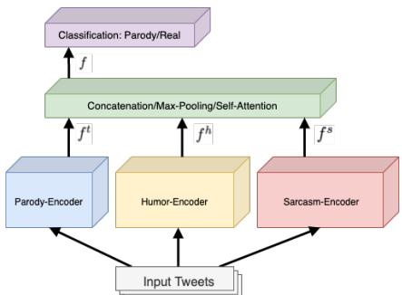
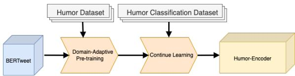
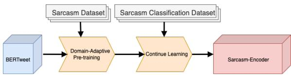

# Combining Humor and Sarcasm for Improving Political Parody Detection

Xiao Aoα Danae Sánchez Villegasα Daniel Preo¸tiuc-Pietroβ Nikolaos Aletrasα

α Computer Science Department, University of Sheffield, UK

β Bloomberg

{xao3,dsanchezvillegas1,n.aletras}@sheffield.ac.uk

dpreotiucpie@bloomberg.net

## Abstract

Parody is a figurative device used for mimicking entities for comedic or critical purposes. Parody is intentionally humorous and often involves sarcasm. This paper explores jointly modelling these figurative tropes with the goal of improving performance of political parody detection in tweets. To this end, we present a multi-encoder model that combines three parallel encoders to enrich parody-specific representations with humor and sarcasm information. Experiments on a publicly available data set of political parody tweets demonstrate that our approach outperforms previous state-of-the-art methods.1

## 1 Introduction

Parody is a figurative device which imitates entities such as politicians and celebrities by copying their particular style or a situation where the entity was involved (Rose, 1993). It is an intrinsic part of social media as a relatively new comedic form (Vis, 2013). A very popular type of parody is political parody, which is used to express political opposition and civic engagement (Davis et al., 2018).

One of the hallmarks of parody expression is the deployment of other figurative devices, such as humor and sarcasm, as emphasized on studies of parody in linguistics (Haiman et al., 1998; Highfield, 2016). For example, in Table 1 the text expresses sarcasm about Myspace2 being a ‘winning technology’, while mocking the fact that three more popular social media sites were unavailable. This example also highlights the similarities between parody and real tweets, which may pose issues to misinformation classification systems (Mu and Aletras, 2020).

<table><tr><td rowspan=1 colspan=1>TwitterHandle</td><td rowspan=1 colspan=1>@Queen_UK</td></tr><tr><td rowspan=3 colspan=1>Parodytweet</td><td rowspan=1 colspan=1>Boris Johnson on the phone. Very</td></tr><tr><td rowspan=1 colspan=1>smug that#myspacehasn&#x27;t gonedown. Says he&#x27;s always backedwinning technologies#whatsappdown</td></tr><tr><td rowspan=1 colspan=1>#instagramdown #FacebookIsDown</td></tr></table>

Table 1: Example of a parody tweet3 by the Twitter handle @Queen\_UK. Humor and sarcasm are expressed simultaneously.

These figurative devices have so far been studied in isolation to parody. Previous work on modeling humor in computational linguistics has focused on identifying jokes, i.e., short comedic passages that end with a hilarious line (Hetzron, 1991), based on linguistic features (Taylor and Mazlack, 2004; Purandare and Litman, 2006; Kiddon and Brun, 2011) and deep learning techniques (Chen and Soo, 2018; Weller and Seppi, 2019; Annamoradnejad and Zoghi, 2020). Similarly, computational approaches for modeling sarcasm (i.e., a form of verbal irony used to mock or convey content) in texts have been explored (Davidov et al., 2010; González-Ibáñez et al., 2011; Liebrecht et al., 2013; Rajadesingan et al., 2015; Ghosh et al., 2020, 2021), including multi-modal utterances, i.e. texts, images, and videos (Cai et al., 2019; Castro et al., 2019; Oprea and Magdy, 2020). Recently, parody has been studied with natural language processing (NLP) methods by Maronikolakis et al. (2020) who introduced a data set of political parody accounts. Their method for automatic recognition of posts shared by political parody accounts on Twitter is solely based on vanilla transformer models.

In this paper, we hypothesize that humor and sarcasm information could guide parody specific text encoders towards detecting nuances of figurative language. For this purpose, we propose a multi-encoder model (§2) consisting of three parallel encoders that are subsequently fused for parody classification. The first encoder learns parody specific information subsequently enhanced using the representations learned by a humor and sarcasm encoder respectively.

  
Figure 1: The structure of our multi-encoder model for combining humor and sarcasm information for political parody prediction.

Our contributions are: (1) new state-of-the-art results on political parody detection in Twitter, consistently improving predictive performance over previous work by Maronikolakis et al. (2020); and (2) insights on the limitations of neural models in capturing various linguistic characteristics of parody from extensive qualitative and quantitative analyses.

## 2 Multi-Encoder Model for Political Parody Prediction

Maronikolakis et al. (2020) define political parody prediction as a binary classification task where a social media post T, consisting of a sequence of tokens $T = \{ t _ { 1 } , . . . , t _ { n } \}$ , is classified as real or parody. Real posts have been authored by actual politicians (e.g., realDonaldTrump) while parody posts come from their corresponding parody accounts (e.g., realDonaldTrFan).

Parody tends to express complex tangled semantics of both humor and sarcasm simultaneously (Haiman et al., 1998; Highfield, 2016). To better exploit this characteristic of parody, we propose a multi-encoder model that consists of three parallel encoders, a feature-fusion layer and a parody classification layer depicted in Fig.1.4.

  
Figure 2: Humor Encoder.

  
Figure 3: Sarcasm Encoder.

## 2.1 Text Encoders

Parody As a task-specific parody encoder, we use the vanilla pretrained BERTweet (Nguyen et al., 2020), a BERT (Devlin et al., 2019) based model pre-trained on a corpus of English Tweets and finetuned on the parody data set (§3.1).

Humor To capture humor specific characteristics in social media text, we use the data set introduced by Annamoradnejad and Zoghi (2020) which contains humorous and non-humorous short texts collected from Reddit and Huffington Post. First, we adapt BERTweet using domain-adaptive pre-training (Sun et al., 2020a; Gururangan et al., 2020) on 10,000 randomly selected humor-only short texts with masked language modeling. Subsequently, we use a continual learning strategy (Li and Hoiem, 2018; Sun et al., 2020b) to gradually learn humor-specific properties by further finetuning BERTweet on a humor classification task (i.e., predicting whether a text is humorous or not) by using 40,000 randomly selected humorous and non-humorous short texts from the humor corpus described above (see Figure 2).

Sarcasm Similar to humor, we extract sarcasmrelated semantic information from a post T by using sarcasm annotated data sets from Oprea and Magdy (2020) and Rajadesingan et al. (2015). The first data set consists of 777 and 3,707 sarcasm and non-sarcasm posts from Twitter and the second data set consists of 9,104 sarcasm and more than 90,000 non-sarcasm posts from Twitter. We first perform domain-adaptive pre-training of BERTweet on all sarcastic posts with masked language modeling. Then, we fine-tune the model on a sarcasm classification task, similar to the humor encoder (see Figure 3). For the fine-tuning step, we use the 9,881 sarcastic tweets and 10,000 randomly sampled nonsarcasm tweets from the two data sets (i.e., 3,707 from the first and 6,293 from the second).

We compute parody $f ^ { t } ,$ , humor $f ^ { h }$ , and sarcasm $f ^ { s }$ representations by extracting the ‘classification [CLS] token from each encoder respectively, where $f \in \mathbf { R } ^ { 7 6 8 }$

## 2.2 Combining Encoders

We explore three approaches to combine $f ^ { t } , f ^ { h }$ and $f ^ { s }$ representations.

Concatenation First, the three text representations are simply concatenated to form a combined representation $f \in { \bf R } ^ { 7 6 8 \times 3 }$

Self-Attention We also use a 4-head selfattention5 mechanism (Vaswani et al., 2017) on $f ^ { t } , f ^ { h } , f ^ { s }$ . The goal is to find correlations between representations and learn the contribution of each encoder in the final representation.

Max-Pooling Finally, we perform a max-pooling operation on each dimension of $f ^ { t } , f ^ { h } , f ^ { s }$ to obtain a representation $f \in \mathbf { R } ^ { 7 6 8 }$ . The aim is to use the most dominant features learned by each encoder.

## 2.3 Classification

Finally, we pass the combined representation $f$ to a classification layer with a sigmoid activation function for predicting whether a post is a parody or not. Three encoders are fine-tuned simultaneously on the parody data set (§3.1).6

## 3 Experimental Setup

## 3.1 Data

We use the data set introduced by Maronikolakis et al. (2020) which contains 131,666 tweets written in English, with 65,956 tweets from political parody accounts and 65,710 tweets posted by real politician accounts. The data set is publicly available7 and allows us to compare our results to stateof-the-art parody detection methods.

We use the three data splits provided: (i) Person Split, each split (train, dev, test) contains tweets from different real – parody account pairs; (ii) Gender Split, two different splits based on the gender of the politicians (i.e., female accounts in train/dev and male in test, and male accounts in train/dev and female in test); Location Split, data is split according to the location of the politicians in three groups (US, UK, Rest of the World or RoW). Each group is assigned to the test set and the other two groups to the train and dev sets.

## 3.2 Baselines

We compare our multi-encoder models with transformers for parody detection (Maronikolakis et al., 2020): BERT (Devlin et al., 2019) and RoBERTa (Liu et al., 2019). Also, we compare our models to BERTweet (Nguyen et al., 2020).

## 3.3 Implementation details

Humor Encoder For adaptive pre-training, the batch-size is set to 16 and the number of training epochs is set to 3 with a learning rate of 2e−5. For humor classification, we use batch size of 128 and the number of epochs is set to 2 with a learning rate of $3 e ^ { - 5 }$

Sarcasm Encoder We pretrain using a batch-size of 16 over 5 epochs with a learning rate of $2 e ^ { - 5 }$ For fine-tuning on a sarcasm classification task, we use the 9, 881 sarcasm tweets and 10, 000 randomly sampled non-sarcasm tweets from the two data sets (i.e., 3, 707 from the first and 6, 293 from the second) using the same hyperparameters to the humor-specific encoder.

Multi-encoder For the complete multi-encoder model, we use a batch size of 128 and the learning rate is set to $2 e ^ { - 5 }$ . The entire model is fine-tuned for 2 epochs.

## 3.4 Evaluation

We evaluate the performance of all models using F1 score as Maronikolakis et al. (2020). Results are obtained over 3 runs using different random seeds reporting average and standard deviation.

## 4.1 Predictive Performance

## 4 Results

Table 2 shows the results for parody detection on the Person Split. We observe that BERTweet has the best performance (F1: 90.72) among transformerbased models (BERT, RoBERTa, BERTweet), outperforming previous state-of-the-art by Maronikolakis et al. (2020). This is due to the fact that BERTweet has been specifically pre-trained on

<table><tr><td rowspan=1 colspan=2>Person</td></tr><tr><td rowspan=1 colspan=1>Model</td><td rowspan=1 colspan=1>F1</td></tr><tr><td rowspan=1 colspan=1>Single-Encoder</td><td rowspan=1 colspan=1></td></tr><tr><td rowspan=1 colspan=1>BERT**</td><td rowspan=1 colspan=1> $8 7 . 6 5 \pm 0 . 1 8$ </td></tr><tr><td rowspan=1 colspan=1>RoBERTa**</td><td rowspan=1 colspan=1> $8 9 . 6 6 \pm 0 . 3 3$ </td></tr><tr><td rowspan=1 colspan=1>BERTweet</td><td rowspan=1 colspan=1> $9 0 . 7 2 \pm 0 . 3 1$ </td></tr><tr><td rowspan=1 colspan=1>Multi-encoder (</td><td rowspan=1 colspan=1>Ours)</td></tr><tr><td rowspan=1 colspan=1>Concatenation</td><td rowspan=1 colspan=1> $8 8 . 9 9 \pm 0 . 1 7$ </td></tr><tr><td rowspan=1 colspan=1>Self-Attention</td><td rowspan=1 colspan=1> ${ \bf 9 1 . 1 9 \pm 0 . 3 1 }$ </td></tr><tr><td rowspan=1 colspan=1>Max-Pooling</td><td rowspan=1 colspan=1> $9 1 . 0 5 \pm 0 . 3 0$ </td></tr></table>

Table 2: F1-scores for parody detection on the Person Split. ∗∗ Results from Maronikolakis et al. (2020). Best results are in bold.
<table><tr><td rowspan=1 colspan=5>Gender</td></tr><tr><td rowspan=1 colspan=3>Model</td><td rowspan=1 colspan=2>M→F         F→M</td></tr><tr><td rowspan=1 colspan=3>Single-Encoder</td><td rowspan=1 colspan=2></td></tr><tr><td rowspan=2 colspan=3>BERTRoBERTa*BERTweet</td><td rowspan=1 colspan=1> $8 5 . 8 5 \pm 0 . 2 8$ </td><td rowspan=1 colspan=1> $8 4 . 4 0 \pm 0 . 3 5$ </td></tr><tr><td rowspan=1 colspan=1>BERTa**</td><td rowspan=1 colspan=1> $8 7 . 1 1 \pm 0 . 3 1$  $8 8 . 0 1 \pm 0 . 2 9$ </td><td rowspan=1 colspan=1> $8 4 . 8 7 \pm 0 . 3 8$  $8 5 . 5 7 \pm 0 . 2 7$ </td></tr><tr><td rowspan=1 colspan=3>Multi-encoder (</td><td rowspan=1 colspan=2>Ours)</td></tr><tr><td rowspan=2 colspan=3>ConcatenationSelf-AttentionMax-Pooling</td><td rowspan=1 colspan=1> $8 6 . 8 4 \pm 0 . 1 5$ </td><td rowspan=2 colspan=1> $8 4 . 2 1 \pm 0 . 2 2$  ${ \bf 8 8 . 5 6 \pm 0 . 3 9 }$  $8 6 . 8 9 \pm 0 . 5 6$ </td></tr><tr><td rowspan=1 colspan=1> ${ \bf 8 9 . 9 7 \pm 0 . 3 4 }$  $8 8 . 3 9 \pm 0 . 2 7$ </td></tr></table>

Table 3: F1-scores on the Gender Split. ∗∗ Results from Maronikolakis et al. (2020). Best results are in bold.

Twitter text. Similar behavior is observed on the Gender and Location splits (see Table 3 and 4 respectively).

Our proposed multi-encoder achieves the best performance when using Self-Attention to combine the three parallel encoders (F1: 91.19; 89.97, 88.56; 88.37, 87.91, 87.16; for Person, Gender, and Location splits respectively). Moreover, it outperforms the best single-encoder model BERTweet in the majority of cases which corroborates that parody detection benefits from combining general contextual representations with humor and sarcasm specific information, as humor and sarcasm are important characteristics of parody (Haiman et al., 1998; Highfield, 2016). On the other hand, simply concatenating the three parallel encoders degrades the performance across different splits (Person: 88.99; Gender: 86.84, 84.21 Location: 85.41, 84.74, 83.62). This happens because the concatenation operation treats the three encoders as equally important. While humor and sarcasm are related to parody, they may not necessarily have the same relevance as indicators of parody.

Our best performing model (Self-Attention) outperforms the vanilla BERTweet by 3 F1 points when trained on female accounts and by almost 2 F1 points when trained on male accounts. We speculate that the additional linguistic information from the two encoders (i.e., sarcasm and humor) is more beneficial in low data settings. The number of female politicians is considerably smaller than males in the data set (see Maronikolakis et al. (2020) for more details).

<table><tr><td rowspan=1 colspan=4>Location</td></tr><tr><td rowspan=1 colspan=1>Model</td><td rowspan=1 colspan=1>UK+US $\mathbf { \Gamma } \to \mathbf { R o W }$ </td><td rowspan=1 colspan=1> $\mathbf { \overline { { R o W + U S } } }$  $ \mathbf { U } \mathbf { K }$ </td><td rowspan=1 colspan=1>RoW+UK $ \mathbf { U } \mathbf { S }$ </td></tr><tr><td rowspan=1 colspan=4>Single-Encoder</td></tr><tr><td rowspan=1 colspan=1>BERTRoBERTa**</td><td rowspan=1 colspan=1> $8 6 . 6 9 \pm 0 . 4 5$  $8 7 . 7 0 \pm 0 . 4 5$ </td><td rowspan=1 colspan=1> $8 3 . 7 8 \pm 0 . 1 9$  $8 5 . 1 0 \pm 0 . 2 7$ </td><td rowspan=2 colspan=1> $8 3 . 1 2 \pm 0 . 6 0$  $8 5 . 9 9 \pm 0 . 6 1$  ${ \bf 8 7 . 1 8 \pm 0 . 4 1 }$ </td></tr><tr><td rowspan=1 colspan=1>BERTweet</td><td rowspan=1 colspan=1> $8 8 . 2 1 \pm 0 . 2 6$ </td><td rowspan=1 colspan=1> $8 7 . 8 5 \pm 0 . 2 4$ </td></tr><tr><td rowspan=1 colspan=2>Multi-encoder (Ours)</td><td rowspan=1 colspan=1></td><td rowspan=1 colspan=1></td></tr><tr><td rowspan=1 colspan=1>Concatenation</td><td rowspan=1 colspan=1> $8 5 . 4 1 \pm 0 . 2 6$ </td><td rowspan=1 colspan=1> $8 4 . 7 4 \pm 0 . 2 0$ </td><td rowspan=3 colspan=1> $8 3 . 6 2 \pm 0 . 3 5$  $8 7 . 1 6 \pm 0 . 3 7$  $8 6 . 5 4 \pm 0 . 4 1$ </td></tr><tr><td rowspan=2 colspan=1>Self-AttentionMax-Pooling</td><td rowspan=1 colspan=1> ${ \bf 8 8 . 3 7 \pm 0 . 2 8 }$ </td><td rowspan=1 colspan=1> ${ \bf 8 7 . 9 1 \pm 0 . 1 9 }$ </td></tr><tr><td rowspan=1 colspan=1> $8 8 . 2 5 \pm 0 . 3 9$ </td><td rowspan=1 colspan=1> $8 6 . 4 9 \pm 0 . 3 3$ </td></tr></table>

Table 4: F1-scores on the Location Split. ∗∗ Results from Maronikolakis et al. (2020). Best results are in bold.

## 4.2 Ablation Study

We also examine the effect of combining parodyspecific representations with humor and sarcasm information by running an ablation study. We compare performance of four models: using parody representations only (P), and combining parody representations with humor (P+H), or sarcasm (P+S) information, as well as with both (P+S+H). The results of this analysis are depicted in Tables 5, 6 and 7. We observe that both sarcasm and humor contribute to the performance gain, but using both is more beneficial. Modelling sarcasm leads to more gains than humor and this could be attributed to the characteristics of the parody corpus, namely that it focuses primarily on the political domain, which have a high sarcastic component (Anderson and Huntington, 2017).

## 5 Error Analysis

Finally, we perform an error analysis to examine the behavior and limitations of our best-performing model (multi-encoder with Self-Attention).

The next two examples correspond to real tweets that were misclassified as parody:

(1) Congratulations, <mention>! <url>.

(2) It’s a shame that Boris isn’t here answering questions from the public this evening.

We speculate that the model misclassified these tweets as parody because they contain terms that are related to sarcastic short texts such as user mentions, punctuation marks (!), and negation (isn’t) (González-Ibáñez et al., 2011; Highfield, 2016).

<table><tr><td colspan="2">Person</td></tr><tr><td>Model</td><td>F1</td></tr><tr><td colspan="2">Single-Encoder</td></tr><tr><td>BERTweet (P)</td><td> $9 0 . 7 2 \pm 0 . 3 1$ </td></tr><tr><td colspan="2">Multi-encoder (Ours)</td></tr><tr><td>Concatenation (P+S+H) Concatenation (P+S) Concatenation (P+H) Self-Attention (P+S+H) Self-Attention (P+S) Self-Attention (P+H) Max-Pooling (P+S+H)</td><td> $8 8 . 9 9 \pm 0 . 1 7$   $9 0 . 5 1 \pm 0 . 2 6$   $8 9 . 9 8 \pm 0 . 2 3 $   ${ \bf 9 1 . 1 9 \pm 0 . 3 1 }$   $9 1 . 1 4 \pm 0 . 4 0$   $9 0 . 9 8 \pm 0 . 3 6$   $9 1 . 0 5 \pm 0 . 3 0$   $9 1 . 0 6 \pm 0 . 3 9$ </td></tr></table>

Table 5: F1-scores for parody detection on the Person Split with various settings: parody (P) representations only, and combining parody representations with humor (P+H), or sarcasm (P+S) information, as well as with both (P+S+H). Best results are in bold.
<table><tr><td rowspan=1 colspan=3>Gender</td></tr><tr><td rowspan=1 colspan=1>Model</td><td rowspan=1 colspan=1>M→F</td><td rowspan=1 colspan=1>F→M</td></tr><tr><td rowspan=1 colspan=1>Single-Encoder</td><td rowspan=1 colspan=2></td></tr><tr><td rowspan=1 colspan=1>BERTweet (P)</td><td rowspan=1 colspan=1>88.01 ± 0.29</td><td rowspan=1 colspan=1> $8 5 . 5 7 \pm 0 . 2 7$ </td></tr><tr><td rowspan=1 colspan=1>Multi-encoder (Ours)</td><td rowspan=1 colspan=2></td></tr><tr><td rowspan=9 colspan=1>Concatenation (P+S+H)Concatenation (P+S)Concatenation (P+H)Self-Attention (P+S+H)Self-Attention (P+S)Self-Attention (P+H)Max-Pooling (P+S+H)Max-Pooling (P+S)Max-Pooling (P+H)</td><td rowspan=1 colspan=1> $8 6 . 8 4 \pm 0 . 1 5$ </td><td rowspan=1 colspan=1> $8 4 . 2 1 \pm 0 . 2 2$ </td></tr><tr><td rowspan=1 colspan=1> $8 6 . 9 3 \pm 0 . 4 0$ </td><td rowspan=1 colspan=1> $8 3 . 7 0 \pm 0 . 4 1$ </td></tr><tr><td rowspan=1 colspan=1> $8 6 . 5 8 \pm 0 . 3 1$ </td><td rowspan=1 colspan=1> $8 3 . 3 4 \pm 0 . 3 8$ </td></tr><tr><td rowspan=1 colspan=1> ${ \bf 8 9 . 9 7 \pm 0 . 3 4 }$ </td><td rowspan=1 colspan=1> ${ \bf 8 8 . 5 6 \pm 0 . 3 9 }$ </td></tr><tr><td rowspan=1 colspan=1> $8 9 . 4 9 \pm 0 . 3 7$ </td><td rowspan=1 colspan=1> $8 8 . 2 3 \pm 0 . 4 4$ </td></tr><tr><td rowspan=1 colspan=1> $8 8 . 7 1 \pm 0 . 4 2$ </td><td rowspan=1 colspan=1> $8 7 . 6 2 \pm 0 . 5 0$ </td></tr><tr><td rowspan=1 colspan=1> $8 8 . 3 9 \pm 0 . 2 7$ </td><td rowspan=1 colspan=1> $8 6 . 8 9 \pm 0 . 5 6$ </td></tr><tr><td rowspan=1 colspan=1> $8 8 . 3 6 \pm 0 . 4 6$ </td><td rowspan=1 colspan=1> $8 6 . 5 5 \pm 0 . 4 9$ </td></tr><tr><td rowspan=1 colspan=1> $8 8 . 1 4 \pm 0 . 5 2$ </td><td rowspan=1 colspan=1> $8 6 . 5 3 \pm 0 . 5 3$ </td></tr></table>

Table 6: F1-scores for parody detection on the Gender Split with various settings: parody (P) representations only, and combining parody representations with humor (P+H), or sarcasm (P+S) information, as well as with both (P+S+H). Best results are in bold.

The following two examples correspond to parody tweets that were misclassified as real:

(3) Hey America, it’s time to use your safe word.

(4) I fully support the Digital Singles Market.

Example (3) is a call-to-action message, while Example (4) is a statement expressing support for a particular subject. These statements are written in a style that is similar to political slogans or campaign speeches (Fowler et al., 2021) that the model fails to recognise. As a result, in addition to humor and sarcasm semantics, the model might be improved by integrating knowledge from the political domain such as from political speeches.

<table><tr><td rowspan=1 colspan=4>Location</td></tr><tr><td rowspan=2 colspan=1>Model</td><td rowspan=1 colspan=1>UK+US</td><td rowspan=1 colspan=1>RoW+US</td><td rowspan=1 colspan=1>R₀W+UK</td></tr><tr><td rowspan=1 colspan=1> $ \mathbf { R 0 W }$ </td><td rowspan=1 colspan=1>→ UK</td><td rowspan=1 colspan=1>→ US</td></tr><tr><td rowspan=1 colspan=1>Single-Encoder</td><td rowspan=1 colspan=1></td><td rowspan=1 colspan=1></td><td rowspan=1 colspan=1></td></tr><tr><td rowspan=1 colspan=1>BERTweet (P)</td><td rowspan=1 colspan=1> $8 8 . 2 1 \pm 0 . 2 6$ </td><td rowspan=1 colspan=1> $8 7 . 8 5 \pm 0 . 2 4$ </td><td rowspan=1 colspan=1> ${ \bf 8 7 . 1 8 \pm 0 . 4 1 }$ </td></tr><tr><td rowspan=1 colspan=1>Multi-encoder (Ours)</td><td rowspan=1 colspan=1></td><td rowspan=1 colspan=1></td><td rowspan=1 colspan=1></td></tr><tr><td rowspan=3 colspan=1>Concatenation (P+S+H)Concatenation (P+S)Concatenation (P+H)</td><td rowspan=1 colspan=1> $8 5 . 4 1 \pm 0 . 2 6$ </td><td rowspan=1 colspan=1> $8 4 . 7 4 \pm 0 . 2 0$ </td><td rowspan=1 colspan=1> $8 3 . 6 2 \pm 0 . 3 5$ </td></tr><tr><td rowspan=1 colspan=1> $8 5 . 9 2 \pm 0 . 2 4$ </td><td rowspan=1 colspan=1> $8 5 . 6 7 \pm 0 . 1 8$ </td><td rowspan=1 colspan=1> $8 4 . 0 9 \pm 0 . 3 9$ </td></tr><tr><td rowspan=1 colspan=1> $8 5 . 3 9 \pm 0 . 2 9$ </td><td rowspan=1 colspan=1> $8 5 . 3 3 \pm 0 . 2 6$ </td><td rowspan=1 colspan=1> $8 3 . 7 5 \pm 0 . 4 4$ </td></tr><tr><td rowspan=1 colspan=1>Self-Attention (P+S+H)</td><td rowspan=1 colspan=1> ${ \bf 8 8 . 3 7 \pm 0 . 2 8 }$ </td><td rowspan=1 colspan=1> ${ \bf 8 7 . 9 1 \pm 0 . 1 9 }$ </td><td rowspan=1 colspan=1> $8 7 . 1 6 \pm 0 . 3 7$ </td></tr><tr><td rowspan=3 colspan=1>Self-Attention (P+S)Self-Attention (P+H)Max-Pooling (P+S+H)</td><td rowspan=1 colspan=1> $8 8 . 2 4 \pm 0 . 3 3$ </td><td rowspan=1 colspan=1> $8 7 . 8 8 \pm 0 . 2 3$ </td><td rowspan=1 colspan=1> $8 6 . 4 7 \pm 0 . 3 2$ </td></tr><tr><td rowspan=1 colspan=1> $8 8 . 1 3 \pm 0 . 3 5$ </td><td rowspan=1 colspan=1> $8 7 . 0 5 \pm 0 . 2 8$ </td><td rowspan=1 colspan=1> $8 5 . 3 6 \pm 0 . 4 0$ </td></tr><tr><td rowspan=1 colspan=1> $8 8 . 2 5 \pm 0 . 3 9$ </td><td rowspan=1 colspan=1> $8 6 . 4 9 \pm 0 . 3 3$ </td><td rowspan=1 colspan=1> $8 6 . 5 4 \pm 0 . 4 1$ </td></tr><tr><td rowspan=2 colspan=1>Max-Pooling (P+S)Max-Pooling (P+H)</td><td rowspan=1 colspan=1> $8 8 . 2 8 \pm 0 . 4 2$ </td><td rowspan=1 colspan=1> $8 7 . 8 3 \pm 0 . 3 9$ </td><td rowspan=1 colspan=1> $8 6 . 5 6 \pm 0 . 3 6$ </td></tr><tr><td rowspan=1 colspan=1> $8 8 . 2 2 \pm 0 . 5 2 $ </td><td rowspan=1 colspan=1> $8 6 . 4 4 \pm 0 . 4 2$ </td><td rowspan=1 colspan=1> $8 5 . 9 6 \pm 0 . 4 5$ </td></tr></table>

Table 7: F1-scores for parody detection on the Location Split with various settings: parody (P) representations only, and combining parody representations with humor (P+H), or sarcasm (P+S) information, as well as with both (P+S+H). Best results are in bold.

## 6 Conclusion

In this paper, we studied the impact of jointly modelling figurative devices to improve predictive performance of political parody detection in tweets. Our motivation was based on studies in linguistics which emphasize the humorous and sarcastic components of parody (Haiman et al., 1998; Highfield, 2016). We presented a method that combines parallel encoders to capture parody, humor, and sarcasm specific representations from input sequences, which outperforms previous state-of-the-art proposed by Maronikolakis et al. (2020).

In the future, we plan to combine information from other modalities (e.g., images) for improving parody detection (Sánchez Villegas and Aletras, 2021; Sánchez Villegas et al., 2021).

## Acknowledgements

We would like to thank all reviewers for their valuable feedback. DSV is supported by the Centre for Doctoral Training in Speech and Language Technologies (SLT) and their Applications funded by the UK Research and Innovation grant EP/S023062/1.

## References

Ashley A Anderson and Heidi E Huntington. 2017. Social media, science, and attack discourse: How twitter

discussions of climate change use sarcasm and incivility. Science Communication, 39(5):598–620.

Issa Annamoradnejad and Gohar Zoghi. 2020. Colbert: Using bert sentence embedding for humor detection. arXiv preprint arXiv:2004.12765.

Yitao Cai, Huiyu Cai, and Xiaojun Wan. 2019. Multimodal sarcasm detection in Twitter with hierarchical fusion model. In Proceedings of the 57th Annual Meeting of the Association for Computational Linguistics, pages 2506–2515, Florence, Italy. Association for Computational Linguistics.

Richard Caruana. 1993. Multitask learning: A knowledge-based source of inductive bias. pages 41–48.

Santiago Castro, Devamanyu Hazarika, Verónica Pérez-Rosas, Roger Zimmermann, Rada Mihalcea, and Soujanya Poria. 2019. Towards multimodal sarcasm detection (an \_Obviously\_ perfect paper). In Proceedings ofthe 57th Annual Meeting ofthe Associationfor Computational Linguistics, pages 4619–4629, Florence, Italy. Association for Computational Linguistics.

Peng-Yu Chen and Von-Wun Soo. 2018. Humor recognition using deep learning. In Proceedings of the 2018 Conference of the North American Chapter of the Associationfor Computational Linguistics: Human Language Technologies, Volume 2 (Short Papers), pages 113–117, New Orleans, Louisiana. Association for Computational Linguistics.

Dmitry Davidov, Oren Tsur, and Ari Rappoport. 2010. Semi-supervised recognition of sarcasm in Twitter and Amazon. In Proceedings ofthe Fourteenth Conference on Computational Natural Language Learning, pages 107–116, Uppsala, Sweden. Association for Computational Linguistics.

Jenny L Davis, Tony P Love, and Gemma Killen. 2018. Seriously funny: The political work of humor on social media. New Media & Society, 20(10):3898– 3916.

Jacob Devlin, Ming-Wei Chang, Kenton Lee, and Kristina Toutanova. 2019. BERT: Pre-training of deep bidirectional transformers for language understanding. In Proceedings of the 2019 Conference of the North American Chapter ofthe Associationfor Computational Linguistics: Human Language Technologies, Volume 1 (Long and Short Papers), pages 4171–4186, Minneapolis, Minnesota. Association for Computational Linguistics.

Erika Franklin Fowler, Michael M Franz, Gregory J Martin, Zachary Peskowitz, and Travis N Ridout. 2021. Political advertising online and offline. American Political Science Review, 115(1):130–149.

Debanjan Ghosh, Elena Musi, and Smaranda Muresan. 2020. Interpreting verbal irony: Linguistic strategies

and the connection to theType of semantic incongruity. In Proceedings of the Society for Computation in Linguistics 2020, pages 82–93, New York, New York. Association for Computational Linguistics.

Debanjan Ghosh, Ritvik Shrivastava, and Smaranda Muresan. 2021. “laughing at you or with you”: The role of sarcasm in shaping the disagreement space. In Proceedings ofthe 16th Conference ofthe European Chapter of the Association for Computational Linguistics: Main Volume, pages 1998–2010, Online. Association for Computational Linguistics.

Roberto González-Ibáñez, Smaranda Muresan, and Nina Wacholder. 2011. Identifying sarcasm in Twitter: A closer look. In Proceedings ofthe 49th Annual Meeting ofthe Associationfor Computational Linguistics: Human Language Technologies, pages 581–586, Portland, Oregon, USA. Association for Computational Linguistics.

Suchin Gururangan, Ana Marasovic, Swabha´ Swayamdipta, Kyle Lo, Iz Beltagy, Doug Downey, and Noah A. Smith. 2020. Don’t stop pretraining: Adapt language models to domains and tasks. In Proceedings of the 58th Annual Meeting of the Association for Computational Linguistics, pages 8342–8360, Online. Association for Computational Linguistics.

John Haiman et al. 1998. Talk is cheap: Sarcasm, alienation, and the evolution oflanguage. Oxford University Press on Demand.

Robert Hetzron. 1991. On the structure of punchlines.

Tim Highfield. 2016. News via voldemort: Parody accounts in topical discussions on twitter. New Media Soc., 18(9):2028–2045.

Chloé Kiddon and Yuriy Brun. 2011. That’s what she said: Double entendre identification. In Proceedings of the 49th Annual Meeting of the Association for Computational Linguistics: Human Language Technologies, pages 89–94, Portland, Oregon, USA. Association for Computational Linguistics.

Zhizhong Li and Derek Hoiem. 2018. Learning without forgetting. IEEE Transactions on Pattern Analysis and Machine Intelligence, 40(12):2935–2947.

Christine Liebrecht, Florian Kunneman, and Antal van den Bosch. 2013. The perfect solution for detecting sarcasm in tweets #not. In Proceedings of the 4th Workshop on Computational Approaches to Subjectivity, Sentiment and Social Media Analysis, pages 29–37, Atlanta, Georgia. Association for Computational Linguistics.

Yinhan Liu, Myle Ott, Naman Goyal, Jingfei Du, Mandar Joshi, Danqi Chen, Omer Levy, Mike Lewis, Luke Zettlemoyer, and Veselin Stoyanov. 2019. Roberta: A robustly optimized bert pretraining approach. arXiv preprint arXiv:1907.11692.

Antonis Maronikolakis, Danae Sánchez Villegas, Daniel Preotiuc-Pietro, and Nikolaos Aletras. 2020. Analyzing political parody in social media. In Proceedings of the 58th Annual Meeting of the Association for Computational Linguistics, pages 4373–4384, Online. Association for Computational Linguistics.

Yida Mu and Nikolaos Aletras. 2020. Identifying twitter users who repost unreliable news sources with linguistic information. PeerJ Computer Science, 6:e325.

Dat Quoc Nguyen, Thanh Vu, and Anh Tuan Nguyen. 2020. BERTweet: A pre-trained language model for English tweets. In Proceedings of the 2020 Conference on Empirical Methods in Natural Language Processing: System Demonstrations, pages 9–14, Online. Association for Computational Linguistics.

Silviu Oprea and Walid Magdy. 2020. iSarcasm: A dataset of intended sarcasm. In Proceedings of the 58th Annual Meeting ofthe Associationfor Computational Linguistics, pages 1279–1289, Online. Association for Computational Linguistics.

Amruta Purandare and Diane Litman. 2006. Humor: Prosody analysis and automatic recognition for F\*R\*I\*E\*N\*D\*S\*. In Proceedings ofthe 2006 Conference on Empirical Methods in Natural Language Processing, pages 208–215, Sydney, Australia. Association for Computational Linguistics.

Ashwin Rajadesingan, Reza Zafarani, and Huan Liu. 2015. Sarcasm detection on twitter: A behavioral modeling approach. Proceedings of the Eighth ACM International Conference on Web Search and Data Mining.

Margaret A Rose. 1993. Parody: ancient, modern and post-modern. Cambridge University Press.

Danae Sánchez Villegas and Nikolaos Aletras. 2021. Point-of-interest type prediction using text and images. In Proceedings of the 2021 Conference on Empirical Methods in Natural Language Processing, pages 7785–7797, Online and Punta Cana, Dominican Republic. Association for Computational Linguistics.

Danae Sánchez Villegas, Saeid Mokaram, and Nikolaos Aletras. 2021. Analyzing online political advertisements. In Findings of the Association for Computational Linguistics: ACL-IJCNLP 2021, pages 3669– 3680, Online. Association for Computational Linguistics.

Chi Sun, Xipeng Qiu, Yige Xu, and Xuanjing Huang. 2020a. How to fine-tune bert for text classification? arXiv:1905.05583.

Yu Sun, Shuohuan Wang, Yukun Li, Shikun Feng, Hao Tian, Hua Wu, and Haifeng Wang. 2020b. Ernie 2.0: A continual pre-training framework for language understanding. Proceedings of the AAAI Conference on Artificial Intelligence, 34(05):8968–8975.

J.M. Taylor and L.J. Mazlack. 2004. Humorous wordplay recognition. 4:3306–3311 vol.4.

Ashish Vaswani, Noam Shazeer, Niki Parmar, Jakob Uszkoreit, Llion Jones, Aidan N Gomez, Ł ukasz Kaiser, and Illia Polosukhin. 2017. Attention is all you need. In Advances in Neural Information Processing Systems, volume 30. Curran Associates, Inc.

Farida Vis. 2013. Twitter as a reporting tool for breaking news: Journalists tweeting the 2011 uk riots. Digit. J., 1(1):27–47.

Orion Weller and Kevin Seppi. 2019. Humor detection: A transformer gets the last laugh. In Proceedings of the 2019 Conference on Empirical Methods in Natural Language Processing and the 9th International Joint Conference on Natural Language Processing (EMNLP-IJCNLP), pages 3621–3625, Hong Kong, China. Association for Computational Linguistics.

## A Multitask-Learning

We also tested applying multi-task learning approaches (Caruana, 1993) to use either sarcasm prediction (P+S), humor prediction (P+H) or both (P+S+H) as auxiliary tasks for parody detection. We utilize BERTweet as the share encoder and independent classification layers for parody and humor or sarcasm. Three sets of weights are applied to losses from each independent classification layer and the three layers are stacked. The best results are chosen and depicted in Table 8, Table 9 and Table 10.

<table><tr><td rowspan=1 colspan=2>Person</td></tr><tr><td rowspan=1 colspan=1>Model</td><td rowspan=1 colspan=1>F1</td></tr><tr><td rowspan=1 colspan=2>Single-Encoder</td></tr><tr><td rowspan=1 colspan=1>BERTweet (P)</td><td rowspan=1 colspan=1> ${ \bf 9 0 . 7 2 \pm 0 . 3 1 }$ </td></tr><tr><td rowspan=1 colspan=1>Multi-Task</td><td rowspan=1 colspan=1></td></tr><tr><td rowspan=1 colspan=1>P+S+H</td><td rowspan=1 colspan=1> $8 7 . 4 6 \pm 0 . 1 8$ </td></tr><tr><td rowspan=1 colspan=1>P+S</td><td rowspan=1 colspan=1> $8 9 . 4 1 \pm 0 . 3 1$ </td></tr><tr><td rowspan=1 colspan=1>P+H</td><td rowspan=1 colspan=1> $8 7 . 4 1 \pm 0 . 3 8$ </td></tr></table>

Table 8: F1-scores for parody detection on the Person Split using Multi-task Learning models (P: Parody, S: Sarcasm, H: Humor). Best results are in bold.

<table><tr><td rowspan=1 colspan=3>Gender</td></tr><tr><td rowspan=1 colspan=1>Model</td><td rowspan=1 colspan=1>M→F</td><td rowspan=1 colspan=1>F→M</td></tr><tr><td rowspan=1 colspan=1>Single-Encoder</td><td rowspan=1 colspan=1></td><td rowspan=1 colspan=1></td></tr><tr><td rowspan=1 colspan=1>BERTweet (P)</td><td rowspan=1 colspan=1> $8 8 . 0 1 \pm 0 . 2 9$ </td><td rowspan=1 colspan=1> $8 5 . 5 7 \pm 0 . 2 7$ </td></tr><tr><td rowspan=1 colspan=1>Multi-Task</td><td rowspan=1 colspan=2></td></tr><tr><td rowspan=1 colspan=1>P+S+H</td><td rowspan=1 colspan=1> $8 5 . 2 8 \pm 0 . 2 9$ </td><td rowspan=1 colspan=1> $8 4 . 1 0 \pm 0 . 3 7$ </td></tr><tr><td rowspan=1 colspan=1>P+SP+H</td><td rowspan=1 colspan=1> ${ \bf 8 8 . 1 3 \pm 0 . 2 1 }$  $8 4 . 5 3 \pm 0 . 3 1$ </td><td rowspan=1 colspan=1> ${ \bf 8 6 . 0 7 \pm 0 . 4 4 }$  $8 6 . 0 7 \pm 0 . 4 7$ </td></tr></table>

Table 9: F1-scores on the Gender Split using Multi-task Learning models (P: Parody, S: Sarcasm, H: Humor). Best results are in bold.

<table><tr><td rowspan=1 colspan=5>Location</td></tr><tr><td rowspan=1 colspan=2>Model</td><td rowspan=1 colspan=1>UK+US→ RoW</td><td rowspan=1 colspan=1>R₀W+US→ UK</td><td rowspan=1 colspan=1>RoW+UK→ US</td></tr><tr><td rowspan=1 colspan=5>Single-Encoder</td></tr><tr><td rowspan=1 colspan=2>BERTweet (P)</td><td rowspan=1 colspan=3> ${ \bf 8 8 . 2 1 \pm 0 . 2 6 }$    ${ \bf 8 7 . 8 5 \pm 0 . 2 4 }$    ${ \bf 8 7 . 1 8 \pm 0 . 4 1 }$ </td></tr><tr><td rowspan=1 colspan=2>Multi-Task</td><td rowspan=1 colspan=3></td></tr><tr><td rowspan=1 colspan=2>P+S+H</td><td rowspan=1 colspan=1> $8 6 . 4 1 \pm 0 . 1 7$ </td><td rowspan=1 colspan=1> $8 6 . 2 3 \pm 0 . 2 0$ </td><td rowspan=1 colspan=1> $8 5 . 1 3 \pm 0 . 2 9$ </td></tr><tr><td rowspan=1 colspan=1>P+S</td><td rowspan=1 colspan=1></td><td rowspan=1 colspan=1> $8 7 . 7 4 \pm 0 . 3 6$ </td><td rowspan=1 colspan=1> $8 7 . 2 6 \pm 0 . 3 4$ </td><td rowspan=1 colspan=1> $8 6 . 6 7 \pm 0 . 4 3$ </td></tr><tr><td rowspan=1 colspan=2>P+H</td><td rowspan=1 colspan=1> $8 5 . 5 4 \pm 0 . 3 8$ </td><td rowspan=1 colspan=1> $8 4 . 7 8 \pm 0 . 4 7$ </td><td rowspan=1 colspan=1> $8 4 . 1 5 \pm 0 . 5 6$ </td></tr></table>

Table 10: F1-scores on the Location Split using Multitask Learning models (P: Parody, S: Sarcasm, H: Humor). Best results are in bold.