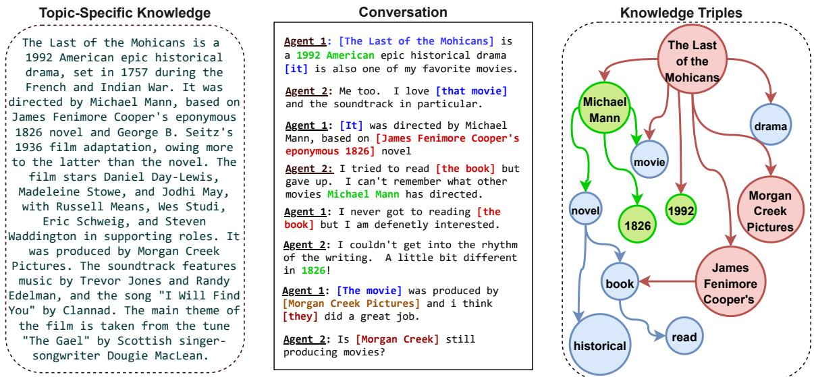
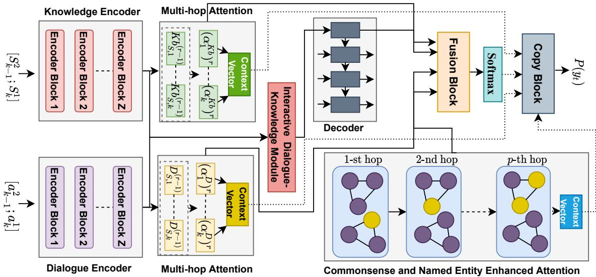

# Commonsense and Named Entity Aware Knowledge Grounded Dialogue Generation

Deeksha Varshney†, Akshara Prabhakar‡∗ Asif Ekbal†

†Department of Computer Science and Engineering,

Indian Institute of Technology Patna, India

‡Department of Information Technology,

National Institute of Technology Karnataka, Surathkal

1821cs13,asif @iitp.ac.in akshblr555@gmail.com

## Abstract

Grounding dialogue on external knowledge and interpreting linguistic patterns in dialogue history context, such as ellipsis, anaphora, and co-references is critical for dialogue comprehension and generation. In this paper, we present a novel open-domain dialogue generation model which effectively utilizes the large-scale commonsense and named entity based knowledge in addition to the unstructured topic-specific knowledge associated with each utterance. We enhance the commonsense knowledge with named entity-aware structures using co-references. Our proposed model utilizes a multi-hop attention layer to preserve the most accurate and critical parts of the dialogue history and the associated knowledge. In addition, we employ a Commonsense and Named Entity Enhanced Attention Module, which starts with the extracted triples from various sources and gradually finds the relevant supporting set of triples using multi-hop attention with the query vector obtained from the interactive dialogue-knowledge module. Empirical results on two benchmark dataset demonstrate that our model significantly outperforms the state-of-the-art methods in terms of both automatic evaluation metrics and human judgment. Our code is publicly available at https://github.com/deekshaVarshney/CNTF; https://www.iitp.ac.in/-ai-nlp-ml/resources/ codes/CNTF.zip.

## 1 Introduction

Neural language models usually focus on fewer language components such as sentences, phrases, or words for text analysis. However, language acts on a much broader scale - there is frequently a central theme to a conversation, and the speakers share common information in order to comprehend one another. Information is frequently reused, however to avoid overuse, same things and persons are referred in the dialogue multiple times by using relevant expressions. A dialogue becomes coherent and speakers can understand each other when all of this information is delivered in a structured, logical, and consistent manner.

Semantic understanding of dialogues can be aided by commonsense knowledge or world facts. Additionally, as a key human language phenomena, co-reference simplifies human languages while being a significant barrier for machines to understand, particularly for pronouns, which are difficult to parse due to their weak semantic meanings (Ehrlich, 1981). Grounded response generation approaches (Ghazvininejad et al., 2018; Dinan et al., 2018) can provide replication of facts in open-domain settings, whereas commonsense knowledge is critical for creating successful interactions since socially constructed commonsense knowledge is the collection of contextual details that humans are expected to understand and use during a conversation.

Despite demonstrating efficacy in empirical evaluation, past work has a few significant drawbacks. There is no explicit representation of entities, semantic relations, or conversation structures, in particular. To solve such restrictions, asking a conversation model to identify relevant structures in dialogue histories can be used to directly test the level of dialogue understanding. We focus on named entity level knowledge in this paper, and analyze references to entities in a dialogue history context.

To ensure the generalizability of our model, we directly incorporate entities in the form of triplets, which is the most common format of modern knowledge graphs, instead of encoding it with features or rules as in conventional approaches. Take, for example, Figure 1, where the dialogue consists of eight utterances. In the third utterance, to know if there exists any relation between the director “Micheal Mann" and the movie “The Last of the Mohicans", we need to resolve the co-reference relationship between the pronoun [It] and the entity [The Last of the Mohicans]. Using co-reference resolution, we get an important triple for the movie “The Last of the Mohicans" viz. (The Last ofthe Mohicans, RelatedTo, Micheal Mann). Similarly, from the second last utterance, we obtain another triple as (The Last of the Mohicans, RelatedTo, Morgan Creek Pictures). Thus, for instance, to generate the fourth utterance "I tried to read the book but gave up. I can’t remember what other movies Michael Mann has directed.", it is important for the model to know that there is a relation between the concept word “movie" and the named entities “Micheal Mann", “The Last of the Mohicans", to get a correct understanding of the dialogue context.

  
Figure 1: An example of named entity and concept based knowledge triples being used for grounding dialogues in addition to topic-specific knowledge sentences. In the conversation, various shades indicate the different coreference clusters obtained. Blue nodes correspond to the concepts obtained from ConceptNet, red nodes correspond to the named entities obtained from the utterances in the dialogue. Named Entities other than the ones present in co-reference chains are highlighted in green in the conversation.

We create a conversational model called CNTF, Commonsense, Named Entity and Topical Knowledge Fused neural network to generate successful responses by leveraging both topic-specific document information and using structured entity and commonsense knowledge. We first construct triples based on named entity after resolving co-references in the dialogues to enhance the already existing commonsense triples obtained from the Concept-Net (Speer and Havasi, 2012). We use multi-hop attention to iterate over the multi-source information. We obtain a weighted query vector from the interactive dialogue-knowledge module, which is used to query over the dialogue, topical knowledge and the corresponding triples. In each round,

CNTF reasons on the dialogue history and knowledge sentences, using which we filter out relevant information from the dialogue context and topical knowledge. Similarly, to reason over the triples, we again iterate in multiple rounds, masking out irrelevant triples.

Our work makes the following contributions:

1. We propose CNTF, a novel knowledge grounded dialogue generation model that utilizes dialogue context, unstructured textual information, and structural knowledge to facilitate explicit reasoning.

2. We enhance the commonsense triples extracted from the ConceptNet database with named entity-aware structures using coreference resolution.

3. We define an effective sliding window mechanism in order to remove irrelevant information from longer dialogue context and ensure efficient memory utilization. We use an interactive dialogue-knowledge module to generate a weighted query vector which captures the interactions between the conversation and the topical knowledge.

4. Through extensive qualitative and quantitative validation on publicly available datasets, we show that our model outperforms the strong baselines.

## 2 Related Work

Sequence-to-sequence models (Vinyals and Le, 2015; Sutskever et al., 2014) have long been used for natural language generation (NLG) tasks. Stemming off the vanilla encoder-decoder architecture - introduced initially for neural machine translation (Shang et al., 2015), a variety of models have been developed to enhance the quality of the responses generated (Li et al., 2016a; Zhao et al., 2017; Tao et al., 2018); to effectively select the conversational context in multi-turn dialogues (Serban et al., 2016, 2017; Xing et al., 2017; Zhang et al., 2019); and to model persona while conversing (Li et al., 2016b; Zhang et al., 2018). Recent advances on dialogue systems aim at enhancing dialogue generation by making it more humanized by means of incorporating knowledge based on the dialogue context or from external sources, such as unstructured documents (Li et al., 2019; Qin et al., 2019) or knowledge graphs (Moon et al., 2019; Tuan et al., 2019).

Numerous pre-trained language models (Devlin et al., 2019; Radford et al., 2019) have been utilized for dialogue generation (Edunov et al., 2019; Zhang et al., 2020). They have been extended to leverage the knowledge from the unstructured documents and other auxiliary sources via knowledge selection and various attention fusion techniques (Zhao et al., 2020c; Cao et al., 2020). The task was explored in low-resource setting (Zhao et al., 2020b) using a disentangled response decoder, and the usability of language models itself as a knowledge base has also been investigated in Zhao et al. (2020d). An issue with language models is the noise which these introduce during knowledge selection. In order to limit the noise by generative models, termlevel weighting (Zheng et al., 2021) for response generation after knowledge selection were studied. Zhao et al. (2020a) proposed a pre-training based multiple knowledge syncretic transformer that uses a single framework to integrate knowledge from multiple sources. Knowledge based end-to-end memory networks have been developed for taskoriented dialogue generation (Raghu et al., 2019; Reddy et al., 2019; Chen et al., 2019; Wang et al., 2020; Varshney and Singh, 2021) using multi-level, working, and dynamic types of memory. In Dual Dynamic Memory Network (DDMN) (Wang et al., 2020), the flow of history information during conversations is dynamically tracked to retain the important parts from both dialogue and KB, using a memory manager for each.

Prior studies (Young et al., 2018; Zhou et al., 2018a; Wu et al., 2020b) have demonstrated the feasibility of including commonsense knowledge into the dialogue systems. Further, in ConKADI (Wu et al., 2020a), felicitous facts highly relevant to the context were selected and effectively integrated in the generated response by means of fusion mechanisms. Recently, co-reference resolution has been utilized for obtaining coref-informed pre-trained models (Ye et al., 2020), task-oriented dialogue generation (Quan et al., 2019), and dialogue understanding (Zhang et al., 2021). Further, (Huang et al., 2021) demonstrated the improvement upon explicitly incorporating co-reference information to enhance the attention mechanism for the reading comprehension task.

In this paper, we show how both structured and unstructured knowledge can be used to improve the task of document-grounded dialogue generation. We propose an effective knowledge-grounded dialogue model named CNTF, which is built with multi-source heterogeneous knowledge. Experiments on knowledge-based dialogue generation benchmark datasets, viz. Wizard of Wikipedia and CMU\_DoG, have shown the efficacy of our proposed approach. Our method employs a large-scale named entity enhanced commonsense knowledge network as well as a domain-specific factual knowledge base to aid in the comprehension of an utterance as well as the generation of a response using a novel mutli-hop attention based model.

## 3 Methodology

## 3.1 Problem Formulation

Formally, let $D ~ = ~ \{ d _ { i } \} _ { i = 1 } ^ { K }$ denote a conversation composed of K dialogue turns, where $d _ { i }$ $( a _ { i } ^ { 1 } , a _ { i } ^ { 2 } )$ is an exchange of dialogues between the two agents. Associated with each utterance $a _ { i } ^ { 1 }$ and $a _ { i } ^ { 2 }$ are the relevant documents $S _ { i } ^ { 1 }$ and $S _ { i } ^ { 2 }$ with topicspecific knowledge. We utilize common sense and named entity oriented knowledge by creating the set of triples $\tau = \{ \tau _ { 1 } , \tau _ { 2 } , . . . , \tau _ { | \tau | } \}$ , where $\tau _ { i }$ is of the form (head, relation, tail), from the following sources:

(a) extracting relations from ConceptNet for every word in the utterances (if the word is a concept-word from ConceptNet), and

(b) forming named entity based triples by using co-reference resolution method

For any arbitrary turn k, given the dialogue history $\{ d _ { j } \} _ { j = 1 } ^ { k - 1 }$ , the associated documents as well as the target document $\{ S _ { j } ^ { 1 } , S _ { j } ^ { 2 } \} _ { j = 1 } ^ { k }$ , and the associated knowledge triples τ , the objective is to generate an appropriate response $Y = \{ y _ { 1 } , y _ { 2 } , . . . , y _ { | Y | } \}$ The architecture of CNTF is shown in Figure 2.

  
Figure 2: Proposed CNTF architecture. The dialogue encoder encodes the dialogue context in multi-turn con versation. Similarly, the knowledge encoder takes as input the document(s) associated with the utterances in the conversation. The multi-hop attention modules are used to extract relevant information from dialogue and knowledge whereas the Commonsense and Named Entity Enhanced Attention module is used to effectively incorporate the knowledge triples.

## 3.2 Encoder

## 3.2.1 Dialogue Encoder

The Dialogue Encoder, that keeps track of the dialogue context in multi-turn conversations, encodes the utterances turn by turn. The input at each turn is a sequence of tokens $x = ( x _ { 1 } , x _ { 2 } , . . . , x _ { n } )$ , where n is the number of tokens. For the first turn, a1 is fed as input, while for the subsequent turns $( j > 1 )$ , the input is the concatenation of the previous turn’s second agent’s response and current turn’s first agent’s utterance, $[ a _ { j - 1 } ^ { 2 } ; a _ { j } ^ { 1 } ]$ . The encoder then exploits Bidirectional Encoder Representations from Transformers (BERT) (Devlin et al., 2019) to obtain the representations $H _ { D } = \{ h _ { i } \} _ { i = 1 } ^ { n }$

Using the dialogue representations, we maintain two different states for the dialogue, $D _ { S }$ and $D _ { H }$ which are both initialized with the encoder hidden states $H _ { D }$ , of the first turn. We then follow a sliding window mechanism to update both $D _ { S }$ and $D _ { H }$ for the succeeding turns. A window of size $" l "$ means we concatenate hidden states of only the previous $^ { \ast } l \cdot l ^ { \prime \prime }$ turns. This helped in removing noise for longer dialogue contexts and saving memory. $D _ { H }$ remains fixed and stores the hidden states for the dialogue context, while $D _ { S }$ gets updated at each turn, with the goal of capturing proper history information for accurate response generation.

## 3.2.2 Knowledge Encoder

Similarly, the Knowledge Encoder takes as input the document(s) associated with the utterances viz. $[ S _ { j - 1 } ^ { 2 } ; S _ { j } ^ { 1 } ]$ for turn $j > 1$ , else $S _ { 1 } ^ { 1 }$ for the first turn, truncated to a max token count of 400. We then again employ a BERT model and obtain the encoded features $H _ { K b } = \{ h _ { i } \} _ { i = 1 } ^ { m }$ , where $m$ is the number of tokens in the document(s). To incorporate the external topic-specific knowledge effectively, we have knowledge states $K b _ { S }$ and $K b _ { H }$ Similar to the dialogue states $D _ { S }$ and $D _ { H }$ , these are initialized with the hidden states $H _ { K b }$ of the relevant documents associated with each utterance. Unlike the sliding window mechanism used for the dialogue states for the upcoming turns, $K b _ { S }$ and $K b _ { H }$ store only the current turn’s hidden states obtained from the BERT based knowledge encoder.

## 3.3 Multi-hop Attention

We adopt the dual and dynamic graph attention mechanism (Wang et al., 2020) to mimic human’s step-by-step exploring and reasoning behavior. In each step, we assume that the dialogue and knowledge states have some information to disseminate. At each hop r, we compute an attention vector $\alpha _ { t } ^ { ( r ) }$ using the query embedding $q _ { t }$ at the k-th turn using $D _ { S } ^ { ( r - 1 ) }$ at time step t. $D _ { H , k , t }$ and the attention scores are used to obtain the context representation $c _ { t } ^ { ( r ) }$

$$
\alpha _ { k , t } ^ { ( r ) } = s o f t m a x ( e _ { k , t } )\tag{1}
$$

$$
e _ { k , t } = { ( v _ { 1 } ^ { ( r ) } ) } ^ { \prime } \mathrm { t a n h } ( W _ { 1 } ^ { ( r ) } q _ { k , t } + W _ { 2 } ^ { ( r ) } D _ { S , k , t } ^ { ( r - 1 ) } )\tag{2}
$$

$$
c _ { k , t } ^ { ( r ) } = \sum _ { j = 1 } ^ { K } a _ { k , t } ^ { ( r ) } D _ { H , k , t }\tag{3}
$$

where $v _ { 1 } ^ { ( r ) } , W _ { 1 } ^ { ( r ) }$ and $W _ { 2 } ^ { ( r ) }$ are the learnable parameters.

$D _ { S }$ is updated using the forget and add operations. To find more details on updating $D _ { S }$ refer to Appendix A.

## 3.4 Constructing Named Entity based Triples using Co-reference Resolution

To add more useful links to the already existing commonsense triples, we use the co-reference chains and named entities extracted from the dialogues. Firstly, we use AllenNLP co-reference resolution module to identify co-reference chains in the dialogue. For example, in the dialogue shown in Fig. 1, using the first co-reference chain: [The Last of the Mohicans: it, that movie, It] we rewrite the dialogue with resolved mentions in the utterances as: “[The Last of the Mohicans] is a 1992 American epic historical drama [The Last of the Mohicans] is also one of my favorite movies. Me too. I love [The Last of the Mohicans] and the soundtrack in particular. [The Last of the Mohicans] was directed by Michael Mann, based on [James Fenimore Cooper’s eponymous 1826] novel and so on". We then use Spacy Named Entity tagging module to recognize named entities from the augmented dialogue. Simultaneously, we also identify all the concept words using ConceptNet in the newly formed dialogue.

The new set of triples is obtained using the named entities and concepts as nodes, and the corresponding edges are built as follows:

(a) between every pair of named entities that appear in the same dialogue, and

(b) between a named entity node and other concepts within the same dialogue.

We may note that resolving the co-references first and then extracting named entities ensures that entities across multiple utterances are connected in a certain way. Also, we explicitly form a triplet having the RelatedTo relation as it suits well for most of the cases because it indicates a relation between the two named entities and their different references or aliases across the conversation.

## 3.5 Commonsense and Named Entity Enhanced Attention Module

For each dialogue, the final set of triples is composed of both commonsense and named entity based triples. We obtain triples’ head and tail entity embedding from the trainable embedding layers i.e. $E = \mathrm { e m b \_ l a y e r } ( \tau )$ . Formally, a query is used to loop over the triple embedding and compute the attention weights at each hop $p .$

$$
\alpha _ { k , t } ^ { ( p ) } = s o f t m a x ( q _ { t } ^ { ( p - 1 ) } E ^ { ( p - 1 ) } )\tag{4}
$$

Finally, the weighted context for knowledge triples, $\left( c ^ { T } \right) ^ { \left( p \right) }$ , is obtained by weighting the current set of triple embedding, $E ^ { ( p ) }$ using the attention scores, $\mathbf { a } ^ { ( p ) }$ . A query update mechanism is used, where the query embeddings are updated using the weighted triple embeddings of the current step.

$$
\left( c _ { k , t } ^ { T } \right) ^ { p } = \sum _ { j = 1 } ^ { n } \mathbf { a } _ { k , t } ^ { p } E ^ { p }
$$

$$
q _ { t } ^ { p } = q _ { t } ^ { p - 1 } + \bigl ( c _ { k , t } ^ { T } \bigr ) ^ { p }\tag{5}
$$

(6)

## 3.6 Decoder

3.6.1 Interactive Dialogue-Knowledge Module As each utterance is linked to topic-specific unstructured knowledge, we employ an interactive mechanism to attend to both the dialogue and the knowledge sentences. We can improve information extraction from dialogue as well as knowledge hidden states for response generation by using the encoded weighted dialogue context as the initial query vector $q _ { t }$ . To obtain the weighted dialogue context $W H _ { D }$ , we apply the multi-hop attention as described in Section 3.3 between $H _ { D }$ and $H _ { K }$ which are the hidden states received from the dialogue and knowledge encoder, respectively.

We use a GRU based decoder to generate responses word by word, and initialize the initial hidden states of the decoder with W $H _ { D }$ . Then at time step t, the decoder state $s _ { t }$ can be updated as

$$
s _ { t } = \mathbf { G } \mathbf { R } \mathbf { U } ( e ( y _ { t - 1 } ) , s _ { t - 1 } )\tag{7}
$$

where $e ( y _ { t - 1 } )$ is the embedding of the previous word $y _ { t - 1 }$ . Here, $s _ { t }$ is regarded as the updated query vector, which is used to attend to the dialogue, topic-specific knowledge and the structured knowledge triples, and obtain the weighted context, knowledge and triple representation as $c _ { t } ^ { D } , c _ { t } ^ { K }$ and $c _ { t } ^ { T }$ , respectively.

## 3.6.2 Fusion Block

The probability distribution over the vocabulary $P _ { g } ( y _ { t } )$ words is obtained by fusing $c _ { t } ^ { D } , c _ { t } ^ { K } , c _ { t } ^ { T }$ and the decoder state, $s _ { t }$ , and then passing them through a softmax layer.

$$
P _ { g } ( y _ { t } ) = \mathrm { s o f t m a x } ( W _ { 5 } [ s _ { t } ; c _ { t } ^ { D } ; c _ { t } ^ { K } ; c _ { t } ^ { T } ] )\tag{8}
$$

where $W _ { 5 }$ is a trainable parameter.

## 3.6.3 Copy Block

In particular, a word at time step t is either generated from the vocabulary or copied from either the dialogue history, knowledge history, or using entities from the triples. Following the copy mechanism (Gulcehre et al., 2016), the attention scores are viewed as the probability to form the copy distribution. We use the attention score $\alpha _ { k , t } ^ { D }$ of the dialogue and $\alpha _ { k , t } ^ { K b }$ of the unstructured knowledge at the last round viz. $\begin{array} { r } { P _ { D } ( y _ { t } = w ) = \sum _ { t j : w _ { t j } = w } \alpha _ { k , t } ^ { D } ; } \end{array}$ $\begin{array} { r } { P _ { K b } ( y _ { t } = w ) = \sum _ { t j : w _ { t j } = w } \alpha _ { k , t } ^ { K b } } \end{array}$ . The copy distribution over the triples is given by $P ^ { T } ( y _ { t } = w ) =$ $\textstyle \sum _ { t j : w _ { i } ^ { t } = w } \alpha _ { k , t } ^ { T }$ . We use the soft gates $g _ { 1 } , g _ { 2 }$ and $g _ { 3 }$ to control whether a word is generated from the vocabulary or it is being copied by combining $P _ { g } ( y _ { t } )$ $P _ { D } ( y _ { t } ) , P _ { K b } ( y _ { t } )$ , and $P _ { T } ( y _ { t } )$

$$
g _ { 1 } = \mathrm { S i g m o i d } ( W _ { 8 } [ s _ { t } ; c _ { t } ^ { D } ] + b _ { 2 } )\tag{9}
$$

$$
P _ { k n } ( y _ { t } ) = g _ { 1 } P _ { g } ( y _ { t } ) + ( 1 - g _ { 1 } ) P _ { D } ( y _ { t } )\tag{10}
$$

$$
g _ { 2 } = \mathrm { S i g m o i d } ( W _ { 9 } [ s _ { t } ; c _ { t } ^ { K } ] + b _ { 3 } )\tag{11}
$$

$$
P _ { t p } ( y _ { t } ) = g _ { 2 } P _ { K b } ( y _ { t } ) + ( 1 - g _ { 2 } ) P _ { k n } ( y _ { t } )\tag{12}
$$

$$
g _ { 3 } = \mathrm { S i g m o i d } ( W _ { 1 0 } [ s _ { t } ; c _ { t } ^ { T } ] + b _ { 4 } )\tag{13}
$$

$$
P ( y _ { t } ) = g _ { 3 } P _ { T } ( y _ { t } ) + ( 1 - g _ { 3 } ) P _ { t p } ( y _ { t } )\tag{14}
$$

where, $W _ { 8 } , \ W _ { 9 } , \ W _ { 1 0 }$ are the parameters to be learned.

Therefore, the decoder loss is the cross-entropy between the predicted distribution $P ( y _ { t } )$ and the reference distribution, $p _ { t }$ , denoted as $L o s s \ =$ $- \sum p _ { t } l o g ( P ( y _ { t } ) )$

## 4 Datasets and Experimental Setup

In this section, we present the details of the datasets and the other experimental setups. Implementation details can be found in Appendix C.

## 4.1 Dataset Description

## 4.1.1 Knowledge Grounded Dialogue Dataset

We test our proposed technique on two knowledgegrounded dialogue generation benchmark datasets, viz. Wizard of Wikipedia (Dinan et al., 2018) and CMU Document Grounded Conversations (Zhou et al., 2018b). The WoZ and CMU\_DoG datasets consist of approximately  22K and  4K dialogs, respectively, covering more than 1,365 and 90 topics. The datasets are summarized in Appendix B. The statistics of the datasets are shown in Table 4 of the Appendix.

## 4.1.2 Commonsense Knowledge Base

We use ConceptNet, an open-domain repository of commonsense knowledge. It includes the relationships between concepts that are commonly used in everyday situations, such as "Mango is a fruit." This function is desirable in our experiments because it is critical to be able to identify the informal relationships between common concepts in an open-domain conversation setting. We remove triples containing multi-word entities when filtering words based on dataset vocabulary, and 147, 676 triples were retained with 27, 468 entities and 44 relations for Wizard of Wikipedia dataset. For CMU\_DoG dataset, we have a total of 14, 689 entities, 74, 485 triples and 42 relations.

## 4.2 Baselines

We use the following models as the baselines:

1. Transformer Memory Network (TMN) (Dinan et al., 2018): To encode dialogue, a shared transformer-based encoder is used. After knowledge selection, memory networks are used to reencode the dialogue information. Finally, a transformer decoder is used to decode the responses.

2. DialogGPTfinetune(Zhao et al., 2020d): It utilises a DialoGPT (345M) model fine-tuned on training examples from the Topical Chat dataset to determine whether the pre-trained models can serve as knowledge bases for open-domain dialogue generation.

3. Incremental Transformer with Deliberation Decoder (ITDD) (Li et al., 2019): It uses an incremental transformer-based model to encode utterances and documents and a deliberation decoder to decode responses.

4. Disentangled Response Decoder (DRD) (Zhao et al., 2019): It is made up of three modules: a language model, a context processor, and a knowledge processor for decoding responses. The response decoder is broken down into independent components in this case to investigate knowledgebased dialogue generation.

<table><tr><td rowspan=1 colspan=4></td><td rowspan=1 colspan=6>Wizard of Wikipedia</td><td rowspan=1 colspan=6>CMU_DoG</td></tr><tr><td rowspan=1 colspan=4>Models</td><td rowspan=1 colspan=1>PPL(Seen/Unseen)</td><td rowspan=1 colspan=1>F1%(Seen/Unseen)</td><td rowspan=1 colspan=1>BLEU-4(Seen/Unseen)</td><td rowspan=1 colspan=1>EmbeddingAverage(Seen/Unseen)</td><td rowspan=1 colspan=1>VectorExtrema(Seen/Unseen)</td><td rowspan=1 colspan=1>GreedyMatching(Seen/Unseen)</td><td rowspan=1 colspan=1>PPL</td><td rowspan=1 colspan=1>F1%</td><td rowspan=1 colspan=1>BLEU-4</td><td rowspan=1 colspan=1>EmbeddingAverage</td><td rowspan=1 colspan=1>VectorExtrema</td><td rowspan=1 colspan=1>GreedyMatching</td></tr><tr><td rowspan=2 colspan=4>TMNITDD</td><td rowspan=2 colspan=1>66.5 / 103.617.8 / 44.8</td><td rowspan=1 colspan=1>15.9 / 14.3</td><td rowspan=1 colspan=1>0.017 / 0.009</td><td rowspan=1 colspan=1>0.844 / 0.839</td><td rowspan=1 colspan=1>0.427 / 0.408</td><td rowspan=1 colspan=1>0.658 / 0.645</td><td rowspan=1 colspan=1>75.2</td><td rowspan=1 colspan=1>9.9</td><td rowspan=1 colspan=1>0.007</td><td rowspan=1 colspan=1>0.789</td><td rowspan=1 colspan=1>0.399</td><td rowspan=1 colspan=1>0.615</td></tr><tr><td rowspan=1 colspan=2></td><td rowspan=1 colspan=1>16.2 / 11.4</td><td rowspan=1 colspan=1>0.025 / 0.011</td><td rowspan=1 colspan=1>0.841 / 0.826</td><td rowspan=1 colspan=1>0.425 / 0.364</td><td rowspan=1 colspan=1>0.654 / 0.624</td><td rowspan=1 colspan=1>26.0</td><td rowspan=1 colspan=1>10.4</td><td rowspan=1 colspan=1>0.009</td><td rowspan=1 colspan=1>0.748</td><td rowspan=1 colspan=1>0.390</td><td rowspan=1 colspan=1>0.587</td></tr><tr><td rowspan=2 colspan=4>DialogGPTfinetuneDRD</td><td rowspan=1 colspan=1></td><td rowspan=1 colspan=1>16.2 / 20.4</td><td rowspan=1 colspan=1>19.0/17.6</td><td rowspan=1 colspan=1>0.023 / 0.017</td><td rowspan=1 colspan=1>0.871 / 0.869</td><td rowspan=1 colspan=1>0.461 / 0.451</td><td rowspan=1 colspan=1>0.683 / 0.674</td><td rowspan=1 colspan=1>15.9</td><td rowspan=1 colspan=1>13.7</td><td rowspan=1 colspan=1>0.015</td><td rowspan=1 colspan=1>0.812</td><td rowspan=1 colspan=1>0.430</td></tr><tr><td rowspan=1 colspan=2></td><td rowspan=1 colspan=1>19.4 / 23.0</td><td rowspan=1 colspan=1>19.3 / 17.9</td><td rowspan=1 colspan=1>0.044 / 0.037</td><td rowspan=1 colspan=1>0.864 / 0.862</td><td rowspan=1 colspan=1>0.455 / 0.444</td><td rowspan=1 colspan=1>0.679 / 0.671</td><td rowspan=1 colspan=1>54.4</td><td rowspan=1 colspan=1>10.7</td><td rowspan=1 colspan=1>0.012</td><td rowspan=1 colspan=1>0.809</td><td rowspan=1 colspan=1>0.413</td><td rowspan=1 colspan=1>0.633</td></tr><tr><td rowspan=2 colspan=4>KnowledGPT</td><td rowspan=1 colspan=1>onKADI</td><td rowspan=1 colspan=1>89.4 / 93.0</td><td rowspan=1 colspan=1>13.3 / 15.9</td><td rowspan=1 colspan=1>0.016/ 0.014</td><td rowspan=1 colspan=1>0.726 / 0.662</td><td rowspan=1 colspan=1>0.355 / 0.324</td><td rowspan=1 colspan=1>0.599 / 0.601</td><td rowspan=1 colspan=1>84.4</td><td rowspan=1 colspan=1>8.7</td><td rowspan=1 colspan=1>0.006</td><td rowspan=2 colspan=1>0.7680.837</td><td rowspan=2 colspan=1>0.3260.437</td></tr><tr><td rowspan=1 colspan=1>19.2 / 22.3</td><td rowspan=1 colspan=1>22.0 / 20.5</td><td rowspan=1 colspan=1>0.058 / 0.047</td><td rowspan=1 colspan=1>0.872 / 0.870</td><td rowspan=1 colspan=1>0.463 / 0.452</td><td rowspan=1 colspan=1>0.682 / 0.674</td><td rowspan=1 colspan=1>20.6</td><td rowspan=1 colspan=1>13.5</td><td rowspan=1 colspan=1></td><td></td></tr><tr><td rowspan=1 colspan=4>CNTF</td><td rowspan=1 colspan=1>24.4 / 28.6</td><td rowspan=1 colspan=1>32.5 / 31.4</td><td rowspan=1 colspan=1>0.119 / 0.110</td><td rowspan=1 colspan=1>0.911 / 0.910</td><td rowspan=1 colspan=1>0.577 / 0.570</td><td rowspan=1 colspan=1>0.758 / 0.752</td><td rowspan=1 colspan=1>46.0</td><td rowspan=1 colspan=1>14.6</td><td rowspan=1 colspan=1>0.018</td><td rowspan=1 colspan=1>0.882</td><td rowspan=1 colspan=1>0.518</td><td rowspan=1 colspan=1>0.708</td></tr><tr><td rowspan=1 colspan=4>CNTF-DKIC</td><td rowspan=1 colspan=1>24.3 / 28.5</td><td rowspan=1 colspan=1>33.1 / 32.9</td><td rowspan=1 colspan=1>0.118 / 0.117</td><td rowspan=1 colspan=1>0.913 / 0.913</td><td rowspan=1 colspan=1>0.582 / 0.581</td><td rowspan=1 colspan=1>0.761 / 0.758</td><td rowspan=1 colspan=1>44.5</td><td rowspan=1 colspan=1>15.1</td><td rowspan=1 colspan=1>0.018</td><td rowspan=1 colspan=1>0.882</td><td rowspan=1 colspan=1>0.518</td><td rowspan=2 colspan=1>0.7080.707</td></tr><tr><td rowspan=1 colspan=4>CNTF-DKI</td><td rowspan=1 colspan=1>26.8 / 31.8</td><td rowspan=1 colspan=1>32.4 /31.5</td><td rowspan=1 colspan=1>0.114/ 0.110</td><td rowspan=1 colspan=1>0.911 / 0.912</td><td rowspan=1 colspan=1>0.576 / 0.575</td><td rowspan=1 colspan=1>0.758 / 0.754</td><td rowspan=1 colspan=1>45.3</td><td rowspan=1 colspan=1>14.2</td><td rowspan=1 colspan=1>0.015</td><td rowspan=1 colspan=1>0.881</td><td rowspan=1 colspan=1>0.514</td></tr><tr><td rowspan=2 colspan=4>CNTF-DKCNTF-D</td><td rowspan=1 colspan=1>25.9/31.1</td><td rowspan=1 colspan=1>30.9 /29.8</td><td rowspan=1 colspan=1>0.105 / 0.101</td><td rowspan=1 colspan=1>0.909 / 0.909</td><td rowspan=1 colspan=1>0.567 / 0.564</td><td rowspan=1 colspan=1>0.752 / 0.746</td><td rowspan=1 colspan=1>45.9</td><td rowspan=2 colspan=1>14.111.8</td><td rowspan=2 colspan=1>0.0140.013</td><td rowspan=2 colspan=1>0.8800.880</td><td rowspan=2 colspan=1>0.5050.492</td><td rowspan=2 colspan=1>0.7000.693</td></tr><tr><td rowspan=1 colspan=1>47.5 / 96.3</td><td rowspan=1 colspan=1>15.3 / 13.5</td><td rowspan=1 colspan=1>0.022 / 0.015</td><td rowspan=1 colspan=1>0.884 / 0.883</td><td rowspan=1 colspan=1>0.456 / 0.440</td><td rowspan=1 colspan=1>0.689 / 0.679</td><td rowspan=1 colspan=1>47.9</td></tr></table>

Table 1: Automatic evaluation results marked in bold fonts indicate the best outcome for the measure and improvement over the best baseline, and is statistically significant (t-test with p-value at 0.05 significance level). The scores on the ablation models are shown in the last four rows. The values for baseline models are derived from (Zhao et al., 2020c) and (Zhao et al., 2020d). (-) indicates that the value was not reported.
<table><tr><td>Models</td><td>Fluency (Seen/Unseen)</td><td>Adequacy (Seen/Unseen)</td><td>Knowledge Existence (Seen/Unseen)</td><td>Knowledge Correctness (Seen/Unseen)</td><td>Knowledge Relevance (Seen/Unseen)</td><td>Kappa (Seen/Unseen)</td></tr><tr><td>TMN</td><td>1.314 /1.197</td><td>1.262 / 0.934</td><td>1.046 / 0.811</td><td>1.005 / 0.691</td><td>0.867 / 0.487</td><td>0.931 / 0.888</td></tr><tr><td>ITDD</td><td>1.135 / 1.290</td><td>0.545 / 0.965</td><td>0.515 / 0.382</td><td>0.301 / 0.188</td><td>0.184 / 0.101</td><td>0.940 / 0.930</td></tr><tr><td>KnowledGPT</td><td>1.813 / 1.817</td><td>1.568 / 1.556</td><td>1.493 / 1.139</td><td>1.430 / 1.390</td><td>1.172 / 1.040</td><td>0.810 /0.811</td></tr><tr><td>CNTF</td><td>1.561 / 1.554</td><td>1.647 / 1.469</td><td>1.653 / 1.285</td><td>1.770 / 1.422</td><td>1.732 / 1.376</td><td>0.830 / 0.869</td></tr><tr><td>Gold Response</td><td>1.865 / 1.883</td><td>1.891 / 1.883</td><td>1.825 / 1.864</td><td>1.908 / 1.916</td><td>1.903 / 1.904</td><td>0.890 / 0.854</td></tr></table>

Table 2: Human assessment results for the baseline and proposed model on WoZ dataset. Bolded results of the proposed model against the baselines are statistically significant using t-test at 0.05% significance level.

5. ConKADI (Wu et al., 2020a): It includes a Felicitous Fact mechanism to help the model focus on knowledge facts that are highly significant; additionally, two techniques, Context-Knowledge Fusion and Flexible Mode Fusion, are proposed to assist ConKADI in integrating the knowledge information.

6. KnowledGPT (Zhao et al., 2020c): This model implements response generation by combining a pre-trained language model with a knowledge selection module, and it intends to jointly optimize knowledge selection and response generation with unlabeled dialogues using an unsupervised approach.

## 4.3 Evaluation Metrics

To evaluate the predicted responses, we choose BLEU (Papineni et al., 2002), PPL, F1 and Embedding-based metrics (Liu et al., 2016). For human evaluation, we use fluency, adequacy, knowledge existence, knowledge correctness and knowledge relevance. Appendix D provides more infor-

mation on these metrics.

## 5 Results and Analysis

## 5.1 Results of Automatic Evaluation

Table 1 shows the results on automatic evaluation metrics on Wizard of Wikipedia and CMU\_DoG datasets. On WoZ, CNTF gives a significant rise of 48% on Test Seen and 53% on Unseen in F1 score and around two times more on both Seen and Unseen, in terms of BLEU-4, compared to the strongest baseline, KnowledGPT. On CMU\_DoG too, where the average turn length is roughly 2.5 times that of WoZ, CNTF surpasses the previous best on F1 and BLEU-4 by 8% and 20% respectively. Hence, CNTF achieves new state-of-the-art on both datasets.

Existing models struggle to generate engaging responses for dialogues based on new topics that were not encountered during the training phase, which most likely explains the observed low performance on Test Unseen. On the contrary, CNTF is capable of capturing the dialogue context and effectively utilizing external commonsense knowledge and parse the implicit mentions made to various entities through the conversation to produce accurate responses, as evidenced by the magnitude of improvement achieved. On embedding-based metrics, all three measures have significantly improved, demonstrating the efficacy of our methodology. Comparison to more baseline models can be found in Appendix E.1.

## 5.2 Human Evaluation Results

Human evaluation results are shown in Table 2. We only compare our proposed model against KnowledGPT, ITDD and TMN on WoZ, as manual evaluation is expensive. It is clear that CNTF outperforms the baselines on both adequacy and knowledgerelated criteria, demonstrating consistency with the results of automatic evaluation, and has comparable fluency performance. It is important to note that, despite providing contextually appropriate responses, KnowledGPT failed to capture the accurate knowledge associated with the input sequences, resulting in low scores. The strength of CNTF can be seen from the knowledge existence, correctness and relevance scores. This can be attributed to the fact that the multi-hop attention module and the interactive attention module incorporate the knowledge bases efficiently. The knowledge in the generated response is relevant with the contexts and is factually correct. Furthermore, the responses are more effective at exchanging information than at casual chat. The proposed model also makes good use of commonsense knowledge and named entities due to attention module as explained in Section 3.5. All of the kappa values are greater than 0.75, indicating that the annotators agree.

In Table 3, we present a few example conversations as predicted by the proposed (CNTF) and the strongest baseline (KnowledGPT) on Test Seen from Wizard of Wikipedia. In utterance 3, CNTF is able to decipher that the context of the conversation is dr. pepper using the triple (drink, RelatedTo, pepper) obtained using the mechanism explained in Section 3.5 unlike KnowledGPT which starts talking about 7up. Additionally, CNTF efficiently utilizes the commonsense knowledge triples by correctly copying the entities in the triples associated with the word flavor. As seen in the fourth utterance, the model correctly decodes the response using more detailed knowledge from the topicspecific knowledge base as opposed to KnowledGPT. Triples such as (1904, RelatedTo, pepper), (sold, RelatedTo, Europe) which were created using Section 3.4 have aided it in understanding the context better.

## 5.3 Ablation Study

To analyze the impact of the constituent modules in our model on performance (Table 1), we compare CNTF with the following variants:

(i) CNTF-D: This configuration only employs the dialogue encoder with multi-hop attention to demonstrate the significance of employing a knowledge encoder. This results in a 53% decrease in F1 score on Test Seen, demonstrating the effectiveness of our knowledge module with multi-hop attention. The score reduction in CMU\_DoG is less severe because workers do not rely as heavily on external knowledge as the Wizard does, where it is highly correlated with available knowledge. (ii) CNTF-DK: Interactive attention is essential for generating insightful responses while decoding the answer. We remove the Interactive Dialogue-Knowledge module, as explained in Section 3.6.1, to demonstrate its utility. This results in a significant decrease in both BLEU and F1 scores. (iii) CNTF-DKI: We conduct experiments with only the dialogue and knowledge modules, as well as the interactive module, to demonstrate the benefit of using structured knowledge in the form of triples for gauging the implicit references made throughout the conversation. We see a significant drop in scores here as well. (iv) CNTF-DKIC: This model is used to show the effectiveness of co-reference based named entity triples. We see a drop in BLEU-4 scores for the seen testset, but we see an improvement on the unseen testset by using only commonsense knowledge. This could be attributed to the fact that for unseen data, the same entities are usually not present because they have conversations on topics that are rarely seen in the training set.

We may note that CNTF beats the SOTA models on every metric however due to the addition of new triples (more than 60% increment in triples on an average for both the datasets) which may have added to noise in the model, and hence it shows lower scores on some metrics than CNTF-DKIC.

## 5.4 Error Analysis

Using the generated responses, we perform a thorough examination of our proposed model and categorize the errors it encounters as follows:

1. Repetition: There are some instances where certain words are repeated in the generated responses. For example, Predicted response: “i’ m not sure, but it is similar to violet, violet and violet."

<table><tr><td>Utterance 1</td><td>Agent 1: i love dr pepper</td></tr><tr><td>Knowledge 1</td><td>dr pepper is a carbonated soft drink marketed as having a unique flavor.</td></tr><tr><td>Triples</td><td>(pepper, RelatedTo, soda), (soda, IsA, drink), (flavor, RelatedTo, drink), (carbonated, Synonym, soda), (soft, RelatedTo, drink), (drink, RelatedTo, like)...</td></tr><tr><td>CNTF</td><td>yeah i love dr pepper. it is marketed by having a unique flavor.</td></tr><tr><td>KnowledGPT</td><td>i love dr pepper too! it&#x27;s a carbonated soft drink marketed as having a unique flavor.</td></tr><tr><td>Utterance 2 Knowledge 2</td><td>Agent 2: Oh same, it&#x27;s my favorite Dr Pepper is a carbonated soft drink Agent 1: oh yea? its such a good soda</td></tr><tr><td>Triples</td><td>7 up (stylized as 7 up outside the u.s.) is a brand of lemon-lime flavored, non-caffeinated soft drink. (flavor, RelatedTo, drink), (pepper, RelatedTo, soda), (soda, IsA, drink), (carbonated, Synonym, soda), (soft, RelatedTo, drink), (US, RelatedTo,</td></tr><tr><td>CNTF</td><td>pepper), (great, RelatedTo, super) ... yea 7 up (stylized as 7up outside the u.s.) is a brand of lemon-line.</td></tr><tr><td>KnowledGPT Utterance 3</td><td>it was created in the 1880s by pharmacist charles alderton in waco, texas and first served around 1885.</td></tr><tr><td>Knowledge 3</td><td>Agent 2: oh yeah, i also like 7-up, 5 a brand of lemon-lime flavor. Agent 1: oh yeah thats great too the drink was created in the 1880s by pharmacist charles alderon in waco, texas and first served around 1885.</td></tr><tr><td>Triples</td><td>(flavor, RelatedTo, drink), (1880s, RelatedTo, wild),(1880s, RelatedTo, created),(1880s, RelatedTo, pharmacist), (drink, RelatedTo, pepper) ...</td></tr><tr><td>CNTF KnowledGPT</td><td>yeah , the drink was created in the 1880s by pharmacist charles alderton in waco.</td></tr><tr><td>Utterance 4 Knowledge 4</td><td>yeah, 7 up was created by charles leiper grigg, who launched his st. louis based company the howdy corporation in 1920 Agent 2: but, dr pepper was created in 1880s by a pharmacist. isn&#x27;t that wild? Agent 1: yea wow it is so old</td></tr><tr><td>Triples</td><td>dr pepper was first nationally marketed in the united states in 1904, and is now also sold in europe, asia, canada, mexico, australia, and south america, as well as new zealand and south africa as an imported good.</td></tr><tr><td>CNTF KnowledGPT</td><td>(1904, RelatedTo, pepper), (sold, RelatedTo, Europe), (pepper, RelatedTo, Australia), (pepper, RelatedTo, Canada) ... yea dr pepper was first nationally sold in the us in 1904, and is now also sold in europe.</td></tr><tr><td>Utterance 5 Knowledge 5</td><td>it was first served in waco, texas in 1885. i wonder how long it has been around? Agent 2: oh yeah, and it didn&#x27;t make it into the us until it was first nationally marketed in the united states in 1904 Agent 1: thats super crazy</td></tr><tr><td>Triples</td><td>dr pepper was first nationally marketed in the united states in 1904, and is now also sold in europe, asia, canada, mexico, australia, and south america, as well as new zealand and south africa as an imported good. (1904, RelatedTo, marketed), (States, RelatedTo, 1904), (United, RelatedTo, 1904), (1904, RelatedTo, US), (1904, RelatedTo, first), (first,</td></tr><tr><td>CNTF</td><td>RelatedTo, marketed) ... yea dr pepper was first nationally marketed in the us in 1904 , and is now also sold in</td></tr><tr><td>KnowledGPT</td><td>it was formulated by a pharmacist named charles alderton in morrison&#x27;s old corner drug store in waco, texas</td></tr></table>

Table 3: Samples from Test Seen of WoZ dataset. The gold response for the (k)-th example is Agent 2’s utterance in the (k + 1)-th example. The displayed knowledge is the supporting sentence for the gold response to that utterance.

2. Incomplete response: As shown in the response for the last example in Table 3, incomplete responses result in lower fluency scores. We discovered that the ground truth responses in the dataset are generated by copying incomplete sentences from the document knowledge. Since our model augments knowledge, it learns to produce responses in the same manner. For example: Document knowledge: “there is no scientifically precise definition of genius, and the question of whether the notion itselfhas any real meaning has long been a subject of debate, although psychologists are converging on a definition that emphasizes creativity and eminent achievement.”; Gold Response: “there is no scientifically precise definition of genius”. As can be seen, the response picked is incomplete and less fluent if it is compared to the knowledge sentence. We have evaluated our gold responses considering this in Table 2. We observed that the fluency score is 1.865 / 1.883 for both the test seen / unseen set. A few more error cases with examples are shown in the Appendix E.2.

## 6 Conclusion

We present a Commonsense, Named Entity, and Topical Knowledge Fused neural network (CNTF) to address reasoning over multiple knowledge bases in this paper. We propose, in particular, multihop attention over both structured and unstructured knowledge. Unlike previous approaches in Dialog, CNTF can find relevant supporting named entities in dialogs at each step of multi-hop attention in addition to already present commonsense knowledge. We test CNTF on WoZ and CMU\_DoG and achieve excellent results. Furthermore, our analysis shows that CNTF can generate consistent results.

In the future, we hope to expand our work to build models which include emotions for knowledge grounded dialogues. Also, to tackle repetition and incomplete response, we aim to introduce rewards functions for these factors. Currently, our model does not consider the relation attribute in our proposed framework and hence the use of “RelatedTo” relation is not really affecting the performance of the proposed approach. We aim to incorporate relation attributes for triple representations.

## 7 Ethical Declaration

Our work relies solely on publicly available data. We followed the policies for using the data and did not violate any copyright issues.

## Acknowledgement

Asif Ekbal acknowledges the Young Faculty Research Fellowship (YFRF), supported by Visvesvaraya Ph.D. scheme for Electronics and IT, Ministry of Electronics and Information Technology (MeitY), Government of India, being implemented by Digital India Corporation (formerly Media Lab Asia).

## References

Yu Cao, Wei Bi, Meng Fang, and Dacheng Tao. 2020. Pretrained language models for dialogue generation with multiple input sources. In Findings of the Association for Computational Linguistics: EMNLP 2020, pages 909–917, Online. Association for Computational Linguistics.

Xiuyi Chen, Jiaming Xu, and Bo Xu. 2019. A working memory model for task-oriented dialog response generation. In Proceedings of the 57th Annual Meeting of the Association for Computational Linguistics, pages 2687–2693, Florence, Italy. Association for Computational Linguistics.

Maxime De Bruyn, Ehsan Lotfi, Jeska Buhmann, and Walter Daelemans. 2020. Bart for knowledge grounded conversations. In Converse@ KDD.

Jacob Devlin, Ming-Wei Chang, Kenton Lee, and Kristina Toutanova. 2019. BERT: Pre-training of deep bidirectional transformers for language understanding. In Proceedings ofthe 2019 Conference of the North American Chapter of the Association for Computational Linguistics: Human Language Technologies, Volume 1 (Long and Short Papers), pages 4171–4186, Minneapolis, Minnesota. Association for Computational Linguistics.

Emily Dinan, Stephen Roller, Kurt Shuster, Angela Fan, Michael Auli, and Jason Weston. 2018. Wizard of wikipedia: Knowledge-powered conversational agents. In International Conference on Learning Representations.

Sergey Edunov, Alexei Baevski, and Michael Auli. 2019. Pre-trained language model representations for language generation. In Proceedings ofthe 2019 Conference ofthe North American Chapter ofthe Associationfor Computational Linguistics: Human Language Technologies, Volume 1 (Long and Short Papers), pages 4052–4059, Minneapolis, Minnesota. Association for Computational Linguistics.

Kate Ehrlich. 1981. Search and inference strategies in pronoun resolution: An experimental study. In 19th Annual Meeting of the Association for Computational Linguistics, pages 89–93.

Joseph L Fleiss. 1971. Measuring nominal scale agreement among many raters. Psychological bulletin, 76(5):378.

Marjan Ghazvininejad, Chris Brockett, Ming-Wei Chang, Bill Dolan, Jianfeng Gao, Wen-tau Yih, and Michel Galley. 2018. A knowledge-grounded neural conversation model. In Thirty-Second AAAI Conference on Artificial Intelligence.

Karthik Gopalakrishnan, Behnam Hedayatnia, Qinglang Chen, Anna Gottardi, Sanjeev Kwatra, Anu Venkatesh, Raefer Gabriel, Dilek Hakkani-Tür, and Amazon Alexa AI. 2019. Topical-chat: Towards knowledge-grounded open-domain conversations.

Caglar Gulcehre, Sungjin Ahn, Ramesh Nallapati, Bowen Zhou, and Yoshua Bengio. 2016. Pointing the unknown words. In Proceedings ofthe 54th Annual Meeting ofthe Associationfor Computational Linguistics (Volume 1: Long Papers), pages 140–149.

Baorong Huang, Zhuosheng Zhang, and Hai Zhao. 2021. Tracing origins: Coref-aware machine reading comprehension. arXiv preprint arXiv:2110.07961.

Diederik P Kingma and Jimmy Ba. 2014. Adam: A method for stochastic optimization. arXiv preprint arXiv:1412.6980.

Jiwei Li, Michel Galley, Chris Brockett, Jianfeng Gao, and Bill Dolan. 2016a. A diversity-promoting objective function for neural conversation models. In Proceedings of the 2016 Conference of the North American Chapter ofthe Association for Computational Linguistics: Human Language Technologies, pages 110–119, San Diego, California. Association for Computational Linguistics.

Jiwei Li, Michel Galley, Chris Brockett, Georgios Spithourakis, Jianfeng Gao, and Bill Dolan. 2016b. A persona-based neural conversation model. In Proceedings of the 54th Annual Meeting of the Associationfor Computational Linguistics (Volume 1: Long Papers), pages 994–1003, Berlin, Germany. Association for Computational Linguistics.

Zekang Li, Cheng Niu, Fandong Meng, Yang Feng, Qian Li, and Jie Zhou. 2019. Incremental transformer with deliberation decoder for document grounded conversations. In Proceedings of the 57th Annual Meeting of the Association for Computational Linguistics, pages 12–21.

Chia-Wei Liu, Ryan Lowe, Iulian Serban, Mike Noseworthy, Laurent Charlin, and Joelle Pineau. 2016. How NOT to evaluate your dialogue system: An empirical study of unsupervised evaluation metrics for dialogue response generation. In Proceedings of the 2016 Conference on Empirical Methods in Natural Language Processing, pages 2122–2132, Austin, Texas. Association for Computational Linguistics.

Seungwhan Moon, Pararth Shah, Anuj Kumar, and Rajen Subba. 2019. OpenDialKG: Explainable conversational reasoning with attention-based walks over knowledge graphs. In Proceedings of the 57th Annual Meeting ofthe Associationfor Computational Linguistics, pages 845–854, Florence, Italy. Association for Computational Linguistics.

Kishore Papineni, Salim Roukos, Todd Ward, and Wei-Jing Zhu. 2002. Bleu: a method for automatic evaluation of machine translation. In Proceedings of the 40th annual meeting on association for computational linguistics, pages 311–318. Association for Computational Linguistics.

Lianhui Qin, Michel Galley, Chris Brockett, Xiaodong Liu, Xiang Gao, Bill Dolan, Yejin Choi, and Jianfeng Gao. 2019. Conversing by reading: Contentful neural conversation with on-demand machine reading. In Proceedings of the 57th Annual Meeting of the Association for Computational Linguistics, pages 5427–5436, Florence, Italy. Association for Computational Linguistics.

Jun Quan, Deyi Xiong, Bonnie Webber, and Changjian Hu. 2019. GECOR: An end-to-end generative ellipsis and co-reference resolution model for taskoriented dialogue. In Proceedings of the 2019 Conference on Empirical Methods in Natural Language Processing and the 9th International Joint Conference on Natural Language Processing (EMNLP-IJCNLP), pages 4547–4557, Hong Kong, China. Association for Computational Linguistics.

Alec Radford, Jeffrey Wu, Rewon Child, David Luan, Dario Amodei, Ilya Sutskever, et al. 2019. Language models are unsupervised multitask learners. OpenAI blog, 1(8):9.

Dinesh Raghu, Nikhil Gupta, and Mausam. 2019. Disentangling Language and Knowledge in Task-Oriented Dialogs. In Proceedings ofthe 2019 Conference ofthe North American Chapter ofthe Associationfor Computational Linguistics: Human Language Technologies, Volume 1 (Long and Short Papers), pages 1239–1255, Minneapolis, Minnesota. Association for Computational Linguistics.

Revanth Gangi Reddy, Danish Contractor, Dinesh Raghu, and Sachindra Joshi. 2019. Multi-level memory for task oriented dialogs. In Proceedings ofthe 2019 Conference ofthe North American Chapter of the Associationfor Computational Linguistics: Human Language Technologies, Volume 1 (Long and Short Papers), pages 3744–3754.

Iulian V Serban, Alessandro Sordoni, Yoshua Bengio, Aaron Courville, and Joelle Pineau. 2016. Building end-to-end dialogue systems using generative hierarchical neural network models. In Thirtieth AAAI Conference on Artificial Intelligence.

Iulian Vlad Serban, Alessandro Sordoni, Ryan Lowe, Laurent Charlin, Joelle Pineau, Aaron Courville, and Yoshua Bengio. 2017. A hierarchical latent variable

encoder-decoder model for generating dialogues. In Thirty-First AAAI Conference on Artificial Intelligence.

Lifeng Shang, Zhengdong Lu, and Hang Li. 2015. Neural responding machine for short-text conversation. In Proceedings of the 53rd Annual Meeting of the Association for Computational Linguistics and the 7th International Joint Conference on Natural Language Processing (Volume 1: Long Papers), pages 1577–1586.

Robyn Speer and Catherine Havasi. 2012. Representing general relational knowledge in ConceptNet 5. In Proceedings ofthe Eighth International Conference on Language Resources and Evaluation (LREC’12), pages 3679–3686, Istanbul, Turkey. European Language Resources Association (ELRA).

Ilya Sutskever, Oriol Vinyals, and Quoc V Le. 2014. Sequence to sequence learning with neural networks. In Advances in neural information processing systems, pages 3104–3112.

Chongyang Tao, Shen Gao, Mingyue Shang, Wei Wu, Dongyan Zhao, and Rui Yan. 2018. Get the point of my utterance! learning towards effective responses with multi-head attention mechanism. In Proceedings of the 27th International Joint Conference on Artificial Intelligence, pages 4418–4424.

Yi-Lin Tuan, Yun-Nung Chen, and Hung-yi Lee. 2019. DyKgChat: Benchmarking dialogue generation grounding on dynamic knowledge graphs. In Proceedings of the 2019 Conference on Empirical Methods in Natural Language Processing and the 9th International Joint Conference on Natural Language Processing (EMNLP-IJCNLP), pages 1855– 1865, Hong Kong, China. Association for Computational Linguistics.

Deeksha Varshney and Asif Ekbal Anushkha Singh. 2021. Knowledge grounded multimodal dialog generation in task-oriented settings. In Proceedings of the 35th Pacific Asia Conference on Language, Information and Computation, pages 425–435.

Oriol Vinyals and Quoc Le. 2015. A neural conversational model. arXiv preprint arXiv:1506.05869.

Jian Wang, Junhao Liu, Wei Bi, Xiaojiang Liu, Kejing He, Ruifeng Xu, and Min Yang. 2020. Dual dynamic memory network for end-to-end multi-turn task-oriented dialog systems. In Proceedings of the 28th International Conference on Computational Linguistics, pages 4100–4110, Barcelona, Spain (Online). International Committee on Computational Linguistics.

Sixing Wu, Ying Li, Dawei Zhang, Yang Zhou, and Zhonghai Wu. 2020a. Diverse and informative dialogue generation with context-specific commonsense knowledge awareness. In Proceedings of the 58th Annual Meeting of the Association for Computational Linguistics, pages 5811–5820, Online. Association for Computational Linguistics.

Sixing Wu, Ying Li, Dawei Zhang, Yang Zhou, and Zhonghai Wu. 2020b. Topicka: Generating commonsense knowledge-aware dialogue responses towards the recommended topic fact. In Proceedings of the Twenty-Ninth International Joint Conference on Artificial Intelligence, IJCAI, pages 3766–3772.

Chen Xing, Wei Wu, Yu Wu, Jie Liu, Yalou Huang, Ming Zhou, and Wei-Ying Ma. 2017. Topic aware neural response generation. In Proceedings of the AAAI Conference on Artificial Intelligence, volume 31.

Deming Ye, Yankai Lin, Jiaju Du, Zhenghao Liu, Peng Li, Maosong Sun, and Zhiyuan Liu. 2020. Coreferential Reasoning Learning for Language Representation. In Proceedings of the 2020 Conference on Empirical Methods in Natural Language Processing (EMNLP), pages 7170–7186, Online. Association for Computational Linguistics.

Tom Young, Erik Cambria, Iti Chaturvedi, Hao Zhou, Subham Biswas, and Minlie Huang. 2018. Augmenting end-to-end dialogue systems with commonsense knowledge. In Proceedings ofthe AAAI Conference on Artificial Intelligence, volume 32.

Hainan Zhang, Yanyan Lan, Liang Pang, Jiafeng Guo, and Xueqi Cheng. 2019. Recosa: Detecting the relevant contexts with self-attention for multi-turn dialogue generation. In Proceedings ofthe 57th Annual Meeting of the Association for Computational Linguistics, pages 3721–3730.

Saizheng Zhang, Emily Dinan, Jack Urbanek, Arthur Szlam, Douwe Kiela, and Jason Weston. 2018. Personalizing dialogue agents: I have a dog, do you have pets too? In Proceedings of the 56th Annual Meeting of the Association for Computational Linguistics (Volume 1: Long Papers), pages 2204–2213.

Wei-Nan Zhang, Yue Zhang, Hanlin Tang, Zhengyu Zhao, Caihai Zhu, and Ting Liu. 2021. What did you refer to? Evaluating co-references in dialogue. In Findings of the Association for Computational Linguistics: ACL-IJCNLP 2021, pages 5075–5084, Online. Association for Computational Linguistics.

Yizhe Zhang, Siqi Sun, Michel Galley, Yen-Chun Chen, Chris Brockett, Xiang Gao, Jianfeng Gao, Jingjing Liu, and Bill Dolan. 2020. DIALOGPT : Large-scale generative pre-training for conversational response generation. In Proceedings ofthe 58th Annual Meeting of the Association for Computational Linguistics: System Demonstrations, pages 270–278, Online. Association for Computational Linguistics.

Tiancheng Zhao, Ran Zhao, and Maxine Eskenazi. 2017. Learning discourse-level diversity for neural dialog models using conditional variational autoencoders. In Proceedings of the 55th Annual Meeting of the Association for Computational Linguistics (Volume 1: Long Papers), pages 654–664.

Xiangyu Zhao, Longbiao Wang, Ruifang He, Ting Yang, Jinxin Chang, and Ruifang Wang. 2020a. Multiple knowledge syncretic transformer for natural dialogue generation. In Proceedings of The Web Conference 2020, pages 752–762.

Xueliang Zhao, Wei Wu, Chongyang Tao, Can Xu, Dongyan Zhao, and Rui Yan. 2019. Low-resource knowledge-grounded dialogue generation. In International Conference on Learning Representations.

Xueliang Zhao, Wei Wu, Chongyang Tao, Can Xu, Dongyan Zhao, and Rui Yan. 2020b. Low-resource knowledge-grounded dialogue generation. In International Conference on Learning Representations.

Xueliang Zhao, Wei Wu, Can Xu, Chongyang Tao, Dongyan Zhao, and Rui Yan. 2020c. Knowledgegrounded dialogue generation with pre-trained language models. In Proceedings of the 2020 Conference on Empirical Methods in Natural Language Processing (EMNLP), pages 3377–3390, Online. Association for Computational Linguistics.

Yufan Zhao, Wei Wu, and Can Xu. 2020d. Are pre-trained language models knowledgeable to ground open domain dialogues? arXiv preprint arXiv:2011.09708.

Wen Zheng, Natasa Milic-Frayling, and Ke Zhou. 2021. Knowledge-grounded dialogue generation with termlevel de-noising. In Findings of the Association for Computational Linguistics: ACL-IJCNLP 2021, pages 2972–2983, Online. Association for Computational Linguistics.

Hao Zhou, Tom Young, Minlie Huang, Haizhou Zhao, Jingfang Xu, and Xiaoyan Zhu. 2018a. Commonsense knowledge aware conversation generation with graph attention. In Proceedings of the 27th International Joint Conference on Artificial Intelligence, pages 4623–4629.

Kangyan Zhou, Shrimai Prabhumoye, and Alan W Black. 2018b. A dataset for document grounded conversations. In Proceedings of the 2018 Conference on Empirical Methods in Natural Language Processing, pages 708–713, Brussels, Belgium. Association for Computational Linguistics.

## A Methodology

To update $D _ { S }$ , we use another Gated Recurrent Unit (GRU) network to emulate the decoder at round r, obtaining the “intermediate” hidden states, $\tilde { s } _ { t } ^ { ( r ) }$

$$
\tilde { \boldsymbol { s } } _ { t } ^ { ( r ) } = \mathbf { G } \mathbf { R } \mathbf { U } ( c _ { t } ^ { ( r ) } , q _ { t } )\tag{15}
$$

$$
\tilde { \boldsymbol { u } } _ { t } ^ { ( r ) } = \boldsymbol { u } _ { t } ^ { ( r - 1 ) } ( 1 - \tilde { \boldsymbol { a } } _ { t } ^ { ( r ) } \boldsymbol { F } _ { t } ^ { ( r ) } )\tag{16}
$$

$$
\boldsymbol { F } _ { t } ^ { ( r ) } = \mathrm { S i g m o i d } ( \boldsymbol { W } _ { 3 } ^ { ( r ) } , \tilde { \boldsymbol { s } } _ { t } ^ { ( r ) } )
$$

$$
D _ { S , t } ^ { ( r ) } = \tilde { u } _ { t } ^ { ( r ) } + \tilde { a } _ { t } ^ { ( r ) } A _ { t } ^ { ( r ) }\tag{17}
$$

(18)

$$
\boldsymbol { A } _ { t } ^ { ( r ) } = \mathrm { S i g m o i d } ( \boldsymbol { W } _ { 4 } ^ { ( r ) } , \tilde { \boldsymbol { s } } _ { t } ^ { ( r ) } )\tag{19}
$$

$W _ { 3 } ^ { ( r ) }$ and $W _ { 4 } ^ { ( r ) }$ are the learnable parameters. $\tilde { \boldsymbol { a } } _ { t } ^ { ( r ) }$   
is computed similar to the manner defined in Eq 1.

## B Datasets

Experiments are carried out on two benchmark datasets, viz. Wizard of Wikipedia (Dinan et al., 2018) and CMU\_DoG (Zhou et al., 2018b).

Wizard of Wikipedia (WoZ) is one of the most comprehensive knowledge-based conversation datasets, covering 1,365 open-domain topics. Each conversation takes place between a wizard who can retrieve knowledge about a specific topic and form a response based on it and an apprentice who is simply eager to speak with the wizard but lacks access to external knowledge. The test set is further divided into two parts: Test Seen and Test Unseen. The former contains conversations about topics that have previously been seen in the training set, whereas the latter contains conversations about topics that have never been seen in either the training or validation sets.

CMU\_DoG focuses on the movie domain, and the conversations take place between two users who both have access to the relevant documents. Every document includes information, such as the title of the film, the cast, an introduction, ratings, and a few scenes. We consider subsequent utterances by the same person as a single one. ConceptNet database can be downloaded from https://conceptnet.io.

<table><tr><td rowspan=1 colspan=5>Wizard of Wikipedia</td><td rowspan=1 colspan=3>CMU_DoG</td></tr><tr><td rowspan=1 colspan=1></td><td rowspan=1 colspan=1>Train</td><td rowspan=1 colspan=1>Valid</td><td rowspan=1 colspan=1>TestSeen</td><td rowspan=1 colspan=1>TestUnseen</td><td rowspan=1 colspan=1>Train</td><td rowspan=1 colspan=1>Valid</td><td rowspan=1 colspan=1>Test</td></tr><tr><td rowspan=1 colspan=1>#Conversation</td><td rowspan=1 colspan=1>18,430</td><td rowspan=1 colspan=1>1,948</td><td rowspan=1 colspan=1>965</td><td rowspan=1 colspan=1>968</td><td rowspan=1 colspan=1>3,373</td><td rowspan=1 colspan=1>229</td><td rowspan=1 colspan=1>619</td></tr><tr><td rowspan=1 colspan=1>#Utterances</td><td rowspan=1 colspan=1>166,787</td><td rowspan=1 colspan=1>17,715</td><td rowspan=1 colspan=1>8,715</td><td rowspan=1 colspan=1>8,782</td><td rowspan=1 colspan=1>74,717</td><td rowspan=1 colspan=1>4,993</td><td rowspan=1 colspan=1>13,646</td></tr><tr><td rowspan=1 colspan=1>Avg. # of Turns</td><td rowspan=1 colspan=1>9.0</td><td rowspan=1 colspan=1>9.1</td><td rowspan=1 colspan=1>9.0</td><td rowspan=1 colspan=1>9.1</td><td rowspan=1 colspan=1>22.2</td><td rowspan=1 colspan=1>21.8</td><td rowspan=1 colspan=1>22.0</td></tr><tr><td rowspan=1 colspan=1>#TopicsDocuments</td><td rowspan=1 colspan=1>1,247</td><td rowspan=1 colspan=1>599</td><td rowspan=1 colspan=1>533</td><td rowspan=1 colspan=1>58</td><td rowspan=1 colspan=1>30</td><td rowspan=1 colspan=1>30</td><td rowspan=1 colspan=1>30</td></tr></table>

Table 4: Dataset Statistics

## C Implementation Details

For our proposed CNTF model, we set the word embedding dimension as 300, and use GloVe word embeddings. The hidden size of GRU is sampled from 128, 256 . Both the number of rounds R, the number of hops K are sampled from 2, 3 , and the sliding window size is sampled from 1, 2 . We use the ADAM optimizer (Kingma and Ba, 2014) whose learning rate is fixed to 0.0005 and set the beam size to 4, while decoding the responses. We truncate utterances to a max token count of 200 and knowledge base to 400. To handle the long-text knowledge base of CMU\_DoG, for every utterance and knowledge sentence we compute a TF-IDF vector. We then compute the cosine similarity between an utterance and every sentence in the knowledge base and retain the top-2 knowledge sentences, similar to the procedure adopted in Enriched Topical Chat dataset (Gopalakrishnan et al., 2019). The conversation and knowledge base vocabulary is shared and comprises of 30,004 words, while common sense vocabulary is maintained separately. We choose batch size as 2 and 8 for CMU\_DoG and Wizard of Wikipedia, respectively, for training the models. There are roughly 83M parameters for our model when trained on Wizard of Wikipedia, and 38M on CMU\_DoG, the difference in size is due to the vocabulary variation. These are much lesser than large pre-trained models which have much greater parameters (KnowledGPT which uses GPT-2). It is trained for 10-15 epochs. We choose the best model when the loss on the validation set does not decrease. The variances of the results are at most 1e-3 after three runs with random initialization for each method, and they have no effect on the trend. We have adapted the code framework from DDMN (Wang et al., 2020). We have used GeForce GTX 1080 Ti as the computing infrastructure. We used the AllenNLP co-reference resolution module (https://github.com/allenai/allennlp-models) for coreference resolution. We used the spacy toolkit (https://github.com/huggingface/neuralcoref) to identify named entities in the text.

## D Evaluation Metrics

## D.1 Automatic Evaluation:

For evaluating our baseline and proposed models, we used F11, BLEU (Papineni et al., 2002), PPL and Embedding-based metrics2 (Liu et al., 2016) such as Vector Extrema, Greedy Matching and Embedding Average for evaluation. Perplexity (PPL) is a metric used to assess how well a probability model predicts a sentence. The term intersection between the gold response and output response by the model is calculated using BLEU (BLEU-4) and the unigram F1-score. Word-matching-based metrics are an alternative to embedding-based metrics. These metrics allocate a vector to each term in the sentence in order to truly understand the intended meaning of the predicted sentence, as described by word embedding. Using the above standard metrics, we evaluate our models on both the seen and unseen test sets of the Wizard of Wikipedia dataset, as well as the test set of the CMU\_DoG dataset.

## D.2 Human Evaluation:

However apart from the automatic evaluation metrics, for evaluating samples from human perspective we randomly selected 100 samples from the Wizard of Wikipedia’s Test Seen and Test Unseen sets. We hire four professionals, each with a postgraduate degree and experience, to serve as human judgment annotators. The annotators are regular employees (paid monthly in accordance with university policy) earning Rs 35,000 per month. The annotators are members of our research team and have been working on similar projects for the past three years. For each example, we provide our annotators with model responses and human groundtruth. We use the following metrics for evaluation:

(i) Fluency: It is a metric that measures whether or not a sentence is comprehensible. (ii) Adequacy: This metric assesses the cohesiveness of the generated response with respect to the conversation context. (iii) Knowledge Existence (KE): This metric determines whether the response contains knowledge or not. (iv) Knowledge Correctness (KC): This metric determines whether the knowledge in the predicted response is correct. (v) Knowledge Relevance (KR): This metric is used to determine whether the knowledge is correct and relevant to the topic of the conversation. The annotators assign a score of 0 to 2 to each response (representing "incorrect," "moderately correct," and "perfect"). Fleiss’ kappa (Fleiss, 1971) is used to calculate the annotators’ agreement.

## E Results

## E.1 Automatic Evaluation

We also compare our proposed CNTF model to (Zhao et al., 2020a) and (Zheng et al., 2021). MKST (Zhao et al., 2020a) obtains a F1-score of 22.2 / 21.3 and BLEU-4 score of 0.077 / 0.072 on test seen / unseen of WoZ dataset. KTWM (Zhao et al., 2020a) obtains a BLEU-4 score of 0.033 / 0.022 with an embedding average, extrema and greedy score of 0.682 / 0.668, 0.394 / 0.379, 0.574 / 0.542 respectively. Our model clearly outperforms these baselines by obtaining a BLEU-4 score of 0.119 / 0.110, F1-score of 32.5 / 31.4 with an embedding average, extrema and greedy score of

0.911 / 0.910, 0.577 / 0.570, 0.758 / 0.752, respectively. In addition, our model clearly outperforms the BART based models for knowledge grounded generation (De Bruyn et al., 2020) on F1-score (Test Seen - 12.2 / 20.1; Test Unseen 14.9 /19.3) by a huge margin on both the test set of WoZ dataset.

## E.2 Error Analysis

For a dialogue with no topic specific knowledge sentences usually our model fails to keep the conversation going by generating inadequate responses and also misses several entities. For example, Input utterance: that’s not uncommon! there are rescue groups that specialize in finding homes for retired sled dogs. I bet they retire them at a certain age then they need a home huh; Predicted Response (CNTF): that’s cute! i’m sure they’re cute!; Gold Response: yes. huskies got their name from the word referring to eskimos. As it can be clearly seen the model fails to capture the entity huskies and instead generates a generic response.