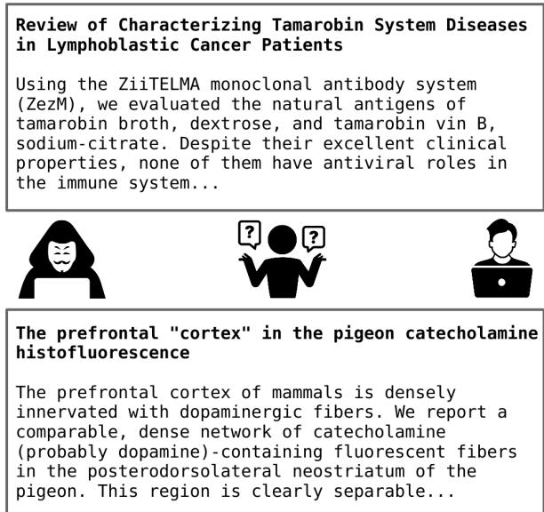
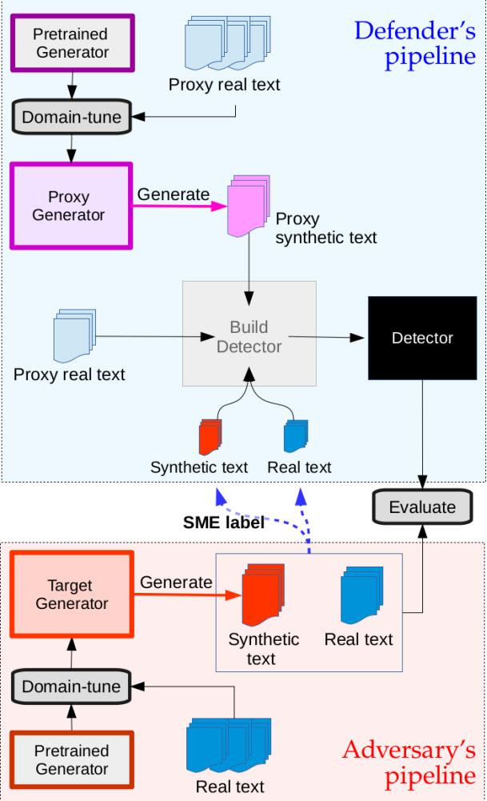
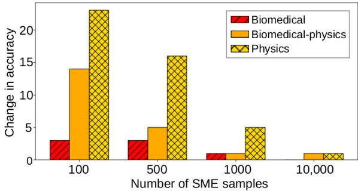
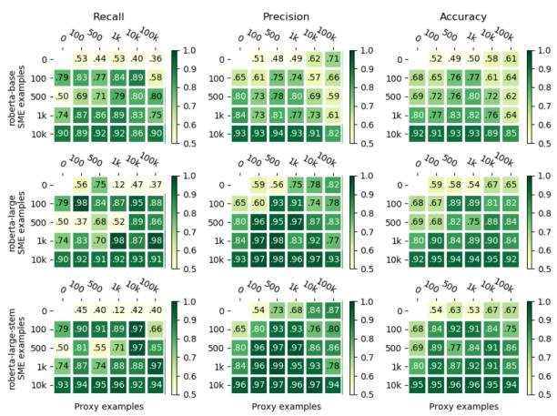
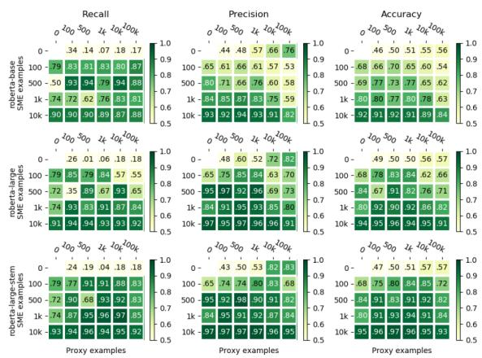
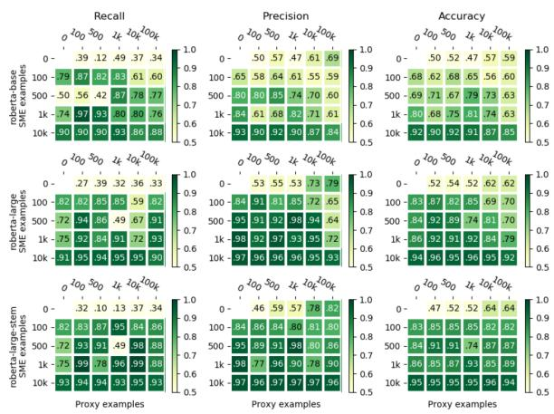
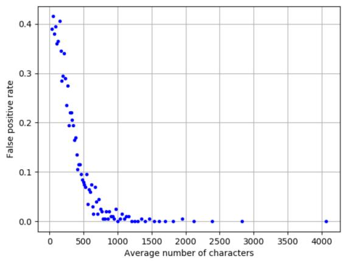
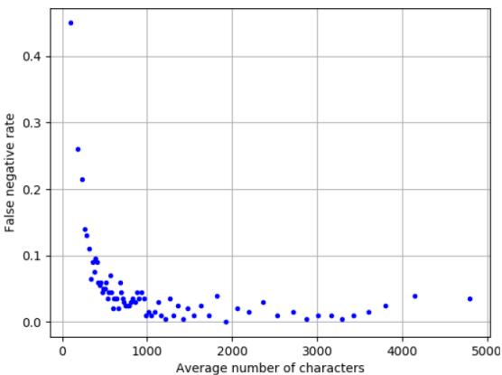

# Cross-Domain Detection of GPT-2-Generated Technical Text

Juan Diego Rodriguez1 Todd Hay2 David Gros3

Zain Shamsi1 Ravi Srinivasan1

1Applied Research Laboratories, The University of Texas at Austin

2En Solución

3University of California, Davis

{juand-r, zain.shamsi, ravi.srinivasan}@utexas.edu todd.hay@ensolucion.com dgros@ucdavis.edu

## Abstract

Machine-generated text presents a potential threat not only to the public sphere, but also to the scientific enterprise, whereby genuine research is undermined by convincing, synthetic text. In this paper we examine the problem of detecting GPT-2-generated technical research text. We first consider the realistic scenario where the defender does not have full information about the adversary’s text generation pipeline, but is able to label small amounts of in-domain genuine and synthetic text in order to adapt to the target distribution. Even in the extreme scenario of adapting a physicsdomain detector to a biomedical detector, we find that only a few hundred labels are sufficient for good performance. Finally, we show that paragraph-level detectors can be used to detect the tampering of full-length documents under a variety of threat models.

## 1 Introduction

Recent advances in techniques for generating realistic synthetic content (i.e., deepfakes) pose a diverse set of problems with significant societal consequences (Kreps et al., 2020; Bommasani et al., 2021; McGuffie and Newhouse, 2020). The advent of large language models for text generation (Radford et al., 2019; Brown et al., 2020) have made it easier than ever to create convincing synthetic1 text (Solaiman et al., 2019). While much attention has been focused on the role of synthetic audio and video, it can be argued that synthetic text may give rise to some of the most serious threats to information integrity and the long-term preservation of archival knowledge (Aliman and Kester, 2021).

  
Figure 1: Machine-generated text enables the corruption of technical knowledge (e.g., biomedical research). One of the above abstracts was generated by GPT-2. More examples of generated text can be found in §A.7.

While there are currently no documented cases of published papers containing text from neural language models, non-neural machine-generated papers have already been published in peer-reviewed journals (Cabanac and Labbé, 2021). With more convincing text generation techniques and a growing number of publications, this is a problem that could get much worse, particularly for non-peerreviewed technical text (Ranade et al., 2021). In addition to hindering the scientific process, synthetic technical texts could be used to manipulate public opinion and sow discord around specific scientific topics (Aliman and Kester, 2021). Other consequences of machine-generated technical text include the contamination of NLP pipelines (Ranade et al., 2021) and poisoning of language models (Schuster et al., 2021).

The rise of realistic machine-generated text – and its possible misuse – has spurred the development of automated tools to distinguish between genuine and synthetic English text.2 However, most work to date has focused on web text or news, rather than on domain-specific technical text (Solaiman et al., 2019; Zellers et al., 2019). While synthetic technical text is likely to be distinguished by subject matter experts (SMEs), it is difficult for non-domain evaluators to do so. Therefore, given the ease at which large amounts of synthetic text can be generated, automated countermeasures are necessary in order to alleviate the burden on SMEs.

We focus on developing capabilities for detecting generated technical English text and delineating the contexts in which these detection approaches can be applied.3 We assume an adversary generating technical text using GPT-2 (Radford et al., 2019), but do not know apriori in exactly which technical area. Realistically, some domain shift will be inevitable, which leads us to investigate whether detectors can be applied across domains, e.g., can a detector of generated physics papers be adapted to also detect biomedical text? In addition, most work to date has focused on detecting short pieces of text. We show that automated detection of tampered full-length research papers is possible under various threat models. Our work makes two main contributions:

• We show that accurate cross-domain detection of generated technical text is possible using a small number of in-domain samples and quantify the amount of SME effort required.

• We study the detectability of tampered fulltext technical papers (where a subset of paragraphs have been replaced with generated text) under various scenarios.

## 2 Related Work

Automated detection of synthetic text Automated approaches to detecting machine-generated text have included energy-based models (Bakhtin et al., 2019), repurposing the generator as a discriminator (Zellers et al., 2019), and various neural and non-neural classifiers (Solaiman et al., 2019; Ippolito et al., 2020; Uchendu et al., 2020; Zhong et al., 2020; Fröhling and Zubiaga, 2021; Fagni et al., 2021). Most work on automated detection targeted GPT-2-generated text, although Bakhtin et al. (2019), Uchendu et al. (2020), Fagni et al. (2021) and Stiff and Johansson (2021) also experimented with other generators. Finally, there is a growing body of work on the adversarial robustness of automated detectors of synthetic text (Wolff, 2020; Bhat and Parthasarathy, 2020; Stiff and Johansson, 2021; Crothers et al., 2022). A survey on the automatic detection of synthetic text can be found in (Jawahar et al., 2020).

Prior work closest to our study are (Solaiman et al., 2019), (Ippolito et al., 2020), (Munir et al., 2021), (Bakhtin et al., 2019) and (Stiff and Johansson, 2021), which look at cross-domain settings where the distribution of synthetic text used to train a detector differs from the target distribution. The shift could be due to different model architectures (Bakhtin et al., 2019; Stiff and Johansson, 2021), different model sizes (Solaiman et al., 2019), different decoding strategies (Solaiman et al., 2019; Ippolito et al., 2020), or different fine-tuning datasets (Bakhtin et al., 2019; Munir et al., 2021; Stiff and Johansson, 2021). Bakhtin et al. (2019) show that energy-based models generalize poorly across corpora (Wikipedia, news and books), but that training on the union of the source and target domains is effective. Munir et al. (2021) show that XLNet can accurately attribute synthetic text even when the GPT-2-generated portions of the training and test sets come from GPT-2 fine-tuned on different subreddits.

Unlike the previous papers, we evaluate our detectors on technical (biomedical) text, and vary the number of labeled samples available for training in the target domain, under the assumption that source labels are plentiful but target examples are more expensive to obtain (i.e., source samples can be generated at will, but target examples need to be discovered and verified by a human since the adversary’s target text generator is generally unavailable). In addition, we evaluate the detection of full-length tampered documents consisting of a mix of real and machine-generated content.

Attribution for synthetic text In addition to distinguishing between real and generated text, one may also wish to determine which system generated a given text (e.g., model type, size, decoding strategy). Variations of this “authorship attribution” problem have been explored by Uchendu et al. (2020), Tay et al. (2020) and Munir et al. (2021).

These works have found that, in general, while the attribution problem is harder than the detection problem, details of the text generator can often be learned from the generated text.

Human detection of synthetic text Human evaluations on the detection of generated text have been conducted for news (Zellers et al., 2019; Brown et al., 2020; Kreps et al., 2020; Clark et al., 2021), product reviews (Hovy, 2016; Yao et al., 2017; Adelani et al., 2020), web text (Gehrmann et al., 2019; Ippolito et al., 2020), stories (Clark et al., 2021; Donahue et al., 2020; Clark et al., 2021; Gunser et al., 2021), peer reviews (Bartoli and Medvet, 2020), cybersecurity text (Ranade et al., 2021) and submissions to federal public comment websites (Weiss, 2019). These studies have shown that it is difficult for people to distinguish between real and neural-generated text. Gehrmann et al. (2019) developed a tool, GLTR, to help users visualize statistical artifacts in generated text.

## 3 Threat model and defender capabilities 3.1 Threat Model

Given that people have trouble distinguishing real (human-written) from GPT-2-generated text (Zellers et al., 2019; Kreps et al., 2020; Clark et al., 2021), we study the detection of generated text under the threat model where an adversary generates text from GPT-2 domain-tuned4 on domainspecific text. We do not necessarily assume that text from this domain is publicly available in significant quantities. Throughout, we shall refer to those developing the generated text as the adversary, and those building automated detectors of synthetic text as the defender. As there does not (yet) exist a "real-world" dataset of GPT-2 generated technical text, we simulate both the adversary and the defender.5

We study two scenarios: where the adversary generates single technical abstracts (§4.1), and where the adversary replaces randomly selected paragraphs in full-length documents with GPT-2- generated paragraphs (§4.2). Other threat models are possible, such as replacing single words, sentences or phrases (Schuster et al., 2020; Donahue et al., 2020; Bhat and Parthasarathy, 2020), and should be studied in future work.

  
Figure 2: Experimental setup for detecting synthetic text used in this paper. Since the defender does not have access to the adversary’s text generator, they develop a proxy generator, in order to mimic the adversary’s generator as closely as possible. Proxy and target corpora will generally come from different domains.

## 3.2 Defender Capabilities

In general, the defender has little or no information about the adversary’s text generation pipeline, including the data used for training, the model architecture used, or the decoding strategy employed. We assume the defender has access to a small number of examples from the adversary, which can be labeled by a subject matter expert (SME) as real (human) or synthetic (generated).6 In addition, since the defender does not have access to the adversary’s target generator, they can build a proxy generator, trained on proxy text, in order to obtain more samples of real and synthetic text which are (hopefully) statistically similar to the ones obtained from the adversary7, as shown in Figure 2. The defender can then train a model to detect generated text using both the in-domain SME-labeled text and the (possibly) out-of-domain proxy text, as described in more detail in §4. The level of access the defender is assumed to have to various parts of the adversary generation pipeline is shown in Table 1.

<table><tr><td colspan="2">Defender&#x27;s access level</td></tr><tr><td>Adversary&#x27;s (target) generator model Labeled samples from adversary domain Real samples from proxy domain Synthetic samples from proxy domain</td><td>None Limited (SME) Plentiful</td></tr></table>

Table 1: Assumptions about the defender’s access to data or models that can be used in a detection pipeline. We assume a SME is able to label a small (random) sample consisting of real and adversary-generated text.

Since the effect of differing model sizes has already been explored (Zellers et al., 2019; Solaiman et al., 2019; Fröhling and Zubiaga, 2021), we assume the adversary and defender use the same sized model (GPT-2 Medium, with 355M parameters), but domain-tuned on different datasets. Since the defender cannot guess the temperature value used by the target generator, we shall decode using a temperature value of 1.0 for the target generator, but 0.8 for the proxy generator.8 We also assume both adversary and defender use nucleus sampling (Holtzman et al., 2020). The defender would not know whether the generator is using nucleus sampling. However, it was shown in (Ippolito et al., 2020; Solaiman et al., 2019) that a discriminator trained with nucleus sampling is able perform nearly as well at detecting text generated with top-k (Fan et al., 2018) sampling as with nucleus sampling, while a discriminator trained using top-k sampling fails to detect generations from nucleus sampling9. Hence this is a reasonable assumption to make.

Our experiments will investigate the effects of domain shift between the proxy and target data, as well as the number of SME-labeled examples available to the defender. While the assumption that both adversary and defender share the same model architecture may seem like a strong one, we fix the architecture so as to focus on the effect of domain shift, and note that previous works have already studied the effect of using different architectures (Bakhtin et al., 2019; Stiff and Johansson, 2021), model sizes (Solaiman et al., 2019), and decoding strategies (Ippolito et al., 2020; Solaiman et al., 2019).

## 4 Automated Detection

## 4.1 Detecting Generated Abstracts

While the defender could train a detector on the union of SME-labeled (target) and proxy data as done in (Zellers et al., 2019), we instead follow a pipelined approach by first task-tuning on the proxy real and synthetic text to produce a proxy detector, before task-tuning a second time on the SME-labeled text. One advantage of this approach is that one would still have a detector even when SME labels are not available. In addition, previous studies have shown that task-tuning twice can yield good performance on a variety of tasks and can help mitigate the effects of domain shift (Phang et al., 2018; Sellam et al., 2020).

Preliminary experiments on in-domain detection showed that fine-tuning RoBERTa consistently outperformed other classifiers (LSTMs, HAN, BERT and XLNet), as shown in Appendix §A.2, and so we exclusively use RoBERTa in all of our experiments. This is in line with results in (Solaiman et al., 2019; Uchendu et al., 2020; Fagni et al., 2021), which showed the effectiveness of RoBERTa for detecting GPT-2-generated text. In order to investigate the benefit of further pretraining (Gururangan et al., 2020), we also domaintune RoBERTa on technical text from various science, technology, engineering, and mathematics (STEM) fields, as described in §5.1.2; we call the resulting model RoBERTa-large-STEM. Our experiments will vary both the number of proxy and SME-labeled abstracts, as well as the subject domain of proxy text, as detailed in §5.1.

## 4.2 Detecting Tampered Documents

We also investigate how well our detection methods work when applied at the document level, assuming the following attacker model: a fraction of randomly-selected paragraphs in a document are replaced by generated paragraphs (see §5.2.1 for details). Each generated paragraph is conditioned on the previous paragraph (i.e., the previous paragraph is used as a prompt). Conditioning helps the text stay on-topic, and would likely help evade coherence-based detectors10(Singla et al., 2021). We refer to the modified documents as tampered rather than generated, since only a subset of the document might be generated.

On the detection side, we train paragraph-level detectors, and then aggregate paragraph scores into document scores to classify documents. We need to specify both the question we would like to answer, as well as how to aggregate the detectors’ paragraph scores $\left\{ s _ { i } \right\}$ to answer it. Here we interpret $s _ { i }$ as the probability that a paragraph has been generated. The general question “has this document been tampered with?” leads to two more specific questions and associated scoring strategies:

• (S1) Is at least one paragraph in the document generated? The probability that a document with paragraph scores $\{ s _ { i } \}$ has at least one synthetic paragraph is then given by:

$$
P = 1 - \prod ( 1 - s _ { i } )
$$

• (S2) What fraction of a document is generated? For a document with N paragraphs, this is:

$$
F = \frac { 1 } { N } \sum \mathbb { 1 } _ { s _ { i } > 0 . 5 }
$$

As we will see, one drawback of scoring with (S1) is that it is extremely sensitive to false positives. Entirely human-written documents have a high chance of having one or two false positives (especially among short paragraphs), even if the other paragraphs are correctly classified. In these cases the human documents will be classified as tampered. Since the false positive rate is highest for short paragraphs11, we can filter out very short paragraphs from each document before scoring. We thus also experiment with the following score:

• (S1-T) Is at least one paragraph $p _ { i }$ longer than a given threshold $T$ synthetic? The probability that this is the case is:

$$
P = 1 - \prod ( 1 - s _ { i } \cdot \mathbb { 1 } _ { \mathrm { l e n } ( p _ { i } ) > T } )
$$

For each document we can use thresholds for P or F to decide how to classify the document; in addition, we shall use (S2) to rank documents by how much generated content they contain.

## 5 Datasets

Here we describe the datasets used and other experimental details when simulating the adversary and defender’s pipelines (Figure 2). The experiments on synthetic abstract detection are described in §5.1; experiments on tampered document detection are described in §5.2.

## 5.1 Real and Synthetic Abstracts

Table 2 summarizes the datasets used. The adversary has access to the Semantic Scholar Open Research Corpus12 (Ammar et al., 2018), while the defender has access so several subsets of CORE (Knoth and Zdrahal, 2012), as well as small amount of text labeled by a SME. We chose abstracts from CORE related to biomedicine and physics, since these subjects had the largest number of abstracts for fine-tuning models (shown in §A.6, Table 10).

<table><tr><td rowspan=1 colspan=2>Synthetic abstract detection</td></tr><tr><td rowspan=1 colspan=1>Corpus</td><td rowspan=1 colspan=1>Purpose</td></tr><tr><td rowspan=1 colspan=1>Semantic Scholar(Biomed+CS)</td><td rowspan=1 colspan=1>• Real portion of the test set• Domain-tune adversary&#x27;s generator• Task-tune detector on real (“SME-labeled&quot;) samples from adversary do-main</td></tr><tr><td rowspan=1 colspan=1>CORE(Biomed, Physics,Biomed+Physics)</td><td rowspan=1 colspan=1>• Domain-tune proxy generator• Task-tune detector on proxy data</td></tr><tr><td rowspan=1 colspan=1>CORE (STEM):(all subjects listedin §A.6)</td><td rowspan=1 colspan=1>• Domain-tune RoBERTa on STEMtext (“RoBERTa-large-STEM&quot;)</td></tr></table>

Table 2: List of datasets and how each was used for the cross-domain synthetic abstract detection experiments. The Semantic Scholar Open Research Corpus is used for the adversary’s generation pipeline, while subsets of CORE are used for the defender’s pipeline.

## 5.1.1 Test Data

We first discuss the construction of datasets used to evaluate the detection of GPT-2-generated abstracts. The test set consists of 1000 real and 1000 synthetic abstracts, generated using GPT-2 domaintuned on abstracts from the January 2019 version of the Semantic Scholar Open Research Corpus (Ammar et al., 2018)13, hereafter referred to as

Semantic Scholar.14 Text was generated using nucleus sampling, with p sampled uniformly between 0.9 and 1.0, since (Zellers et al., 2019) showed detection was hardest with p in that range.

## 5.1.2 Training Data

Here we describe the SME-labeled abstracts (indomain) and proxy (possibly out-of-domain) data used to train detectors of GPT-2 generated abstracts.

SME-labeled data Nested subsets of another 10k abstracts (of sizes {100, 500, 1000, 1k, 10k}), obtained in the same way as the test set, were used as “SME-labeled” (in-domain) data for training.

Proxy data Out-of-domain abstracts were sampled from the CORE dataset of open access research papers (Knoth and Zdrahal, 2012), version 2018-03-0115. CORE covers a wide variety of subjects, some of which can be identified from each paper’s data provider. We used a subset of CORE related to STEM fields16, and filtered out non-English abstracts using the Python package langdetect. This subset of CORE was also used to domain-tune RoBERTa-large on STEM abstracts, resulting in RoBERTa-large-STEM.

We trained proxy generators using the biomedical and physics portions of CORE (237,620 abstracts for each), and on the union of the biomedical and physics portions (“biomedical-physics”, with 475,240 abstracts). For each of these three generators, we created nested subsets (of sizes {100, 500, 1000, 1k, 10k, 100k}) of proxy training data. As with the SME-labeled data, half of the samples were real and half were generated17. In the case of biomedical-physics, we used equal numbers of real biomedical and real physics text. We estimate that roughly half of the biomedical-physics generations were biomedical. Examples of generated physics and biomedical abstracts can be found in Appendix §A.7.

## 5.2 Real and Tampered Documents

While the CORE corpus includes full-length documents, they have not been pre-processed and are rather noisy. Fortunately, the S2ORC corpus (Lo et al., 2020)18 includes millions of pre-processed scientific documents. The full-length papers in S2ORC have been preprocessed with paragraph splitting; in addition, captions, tables, headers, footers, footnotes, abstracts and bibliography have been removed from the main text.

We sampled from the 6.8 million papers in S2ORC which are biomedical19 to create disjoint datasets for domain-tuning proxy and target GPT-2 generators, for task-tuning RoBERTa-based detectors, and for test sets. Since our attacker model consists of random paragraph replacement, we domaintuned GPT-2 on 890,000 biomedical paragraphs in order to generate new paragraphs conditioned on previous paragraphs.20 This is done twice, on nonoverlapping data, to obtain two separate generators: the target generator is used to create the test document collections and SME-labeled training paragraph collections, while the proxy generator is used to create proxy training data. The details of each of these datasets are given below.

## 5.2.1 Test Data

In order to evaluate our detectors against various document tampering scenarios, we use several document-level datasets, which differ by the number of generated (replaced) paragraphs in each document. Each of these test sets consists of 500 human documents and 500 tampered (generated/modified) documents.21 The five test sets containing tampered documents are given as follows: test-1-fake contains only tampered documents with exactly one synthetic paragraph, text-x replaces every paragraph with a generated paragraph with probability x, for x in {0.1, 0.5, 0.9}, and testall-fake has all paragraphs generated, with each subsequent paragraph generated conditional on the previously generated paragraph. Two examples can be found in Appendix §A.7, Table 13.

## 5.2.2 Training Data

Here we describe the datasets used to build paragraph-level detectors.

SME-labeled data Nested subsets of 10,000 paragraphs (of sizes {0, 100, 500, 1k, 10k}) were used as SME-labeled (in-domain) training data, with equal numbers of real and generated paragraphs. The generated paragraphs are obtained using the same domain-tuned generator as for the test sets. For each paper, we sample one paragraph to use as real, and one paragraph to condition on.

Proxy data The proxy GPT-2 generator is used to obtain nested subsets of 10,000 paragraphs (of sizes {0, 100, 500, 1k, 10k}) in much the same way as for the in-domain data, except for one difference. Unlike for the in-domain data, the defender has access to every human paragraph that is being replaced by a (proxy) generated paragraph22. So for each paper, we sample a real paragraph at position i, and use the previous paragraph at position i  1 as a prompt for the generated paragraph.

What if the defender uses a proxy generator designed for unconditional paragraph generation? Preliminary experiments on using proxy data generated without prompting showed only a small drop in accuracy under most dataset sizes, so this is not a strong assumption to make.23

## 6 Results

## 6.1 Detection of Generated Abstracts

Detection performance on Semantic Scholar abstracts depends on the model used for task-tuning (RoBERTa-base, RoBERTa-large, or RoBERTalarge-STEM), the proxy domain (biomedical, physics, or biomedical-physics), and the number of proxy and SME samples used for task-tuning, with full results shown in Appendix §A.3. We consider the effects of these four dimensions below.

Interplay of SME and proxy labels Some SME labels are always needed for good performance, even when the training proxy text is in a similar domain as the target domain (Table 3). Without any SME labels, the highest accuracy that could be achieved with RoBERTa-large using only biomedical proxy text was .67 (with 10k proxy samples).

<table><tr><td rowspan=1 colspan=8>Proxy samples0   100  500   1k   10k 100k</td></tr><tr><td rowspan=2 colspan=1></td><td rowspan=1 colspan=1>0</td><td rowspan=1 colspan=1></td><td rowspan=1 colspan=1>.59</td><td rowspan=1 colspan=1>.58</td><td rowspan=1 colspan=1>.54</td><td rowspan=1 colspan=1>.67</td><td rowspan=1 colspan=1>.65</td></tr><tr><td rowspan=1 colspan=1>100</td><td rowspan=1 colspan=1>.68</td><td rowspan=1 colspan=1>.67</td><td rowspan=1 colspan=1>.89</td><td rowspan=1 colspan=1>.89</td><td rowspan=1 colspan=1>.81</td><td rowspan=1 colspan=1>.82</td></tr><tr><td rowspan=3 colspan=1>SMmps SMes</td><td rowspan=1 colspan=1>500</td><td rowspan=1 colspan=1>.69</td><td rowspan=1 colspan=1>.68</td><td rowspan=1 colspan=1>.82</td><td rowspan=1 colspan=1>.75</td><td rowspan=1 colspan=1>.88</td><td rowspan=1 colspan=1>.84</td></tr><tr><td rowspan=1 colspan=1>1k</td><td rowspan=1 colspan=1>.80</td><td rowspan=1 colspan=1>.90</td><td rowspan=1 colspan=1>.84</td><td rowspan=1 colspan=1>.89</td><td rowspan=1 colspan=1>.90</td><td rowspan=1 colspan=1>.84</td></tr><tr><td rowspan=1 colspan=1>10k</td><td rowspan=1 colspan=1>.92</td><td rowspan=1 colspan=1>.95</td><td rowspan=1 colspan=1>.94</td><td rowspan=1 colspan=1>.94</td><td rowspan=1 colspan=1>.95</td><td rowspan=1 colspan=1>.92</td></tr></table>

Table 3: Detection accuracy when task-tuning RoBERTa-large with biomedical proxy data.
<table><tr><td rowspan=1 colspan=3>n     Biomedical   Biomed-physics</td><td rowspan=1 colspan=1>Physics</td></tr><tr><td rowspan=1 colspan=1>100</td><td rowspan=1 colspan=1>.67</td><td rowspan=1 colspan=1>.87</td><td rowspan=1 colspan=1>.78</td></tr><tr><td rowspan=1 colspan=1>500</td><td rowspan=1 colspan=1>.89</td><td rowspan=1 colspan=1>.82</td><td rowspan=1 colspan=1>.83</td></tr><tr><td rowspan=1 colspan=1>1k</td><td rowspan=1 colspan=1>.89</td><td rowspan=1 colspan=1>.85</td><td rowspan=1 colspan=1>.84</td></tr><tr><td rowspan=1 colspan=1>10k</td><td rowspan=1 colspan=1>.81</td><td rowspan=1 colspan=1>.69</td><td rowspan=1 colspan=1>.62</td></tr><tr><td rowspan=1 colspan=1>100k</td><td rowspan=1 colspan=1>.82</td><td rowspan=1 colspan=1>.70</td><td rowspan=1 colspan=1>.66</td></tr></table>

Table 4: Comparing proxy domains when task-tuning RoBERTa-large on n proxy samples (from different domains) and 100 SME samples.

Task-tuning the 10k-proxy model checkpoint a second time with only 100 SME-labeled samples resulted in a large improvement (accuracy of .81, recall of .95).

Given a fixed number of SME samples, increasing the number of proxy samples improves performance, but only up to a point, after which the proxy data starts being detrimental. For example, given 100 SME examples (row 2 in Table 3), the highest performance for the biomedical proxy experiments was achieved when using between 500 and 1000 proxy samples (resulting in accuracy of .76-.77 for RoBERTa-base, .89 for RoBERTa-large and .91-.92 for RoBERTa-large-STEM). The same observation holds when using physics and biomedical-physics proxy text. Unsurprisingly, the effects are worse with increasing domain shift. The decrease in accuracy when jumping from 1k to 10k proxy samples is .08 for biomedical proxy data, .16 for biomedicalphysics proxy data, and .22 for physics proxy data.

Effect of domain shift When 1k or 10k SME labels were available, performance across task-tuning domains was similar. On the other hand, with 500 SME labels or less the impact of the proxy data domain was greater, as shown in Table 4 for the case of 100 SME labels. For most proxy dataset sizes, there is a decrease in performance as one moves from biomedical to physics.

Finally, we note that when using RoBERTalarge-STEM, 100 SME samples are sufficient to achieve .91 accuracy when using biomedical proxy samples. However, if the proxy samples come from a different domain (physics, or a mix of physics and biomedicine), then 500 SME samples are required to achieve the same accuracy.

Effect of model size RoBERTa-large had higher accuracy than RoBERTa-base under most scenarios, with an absolute increase in accuracy ranging between 1 and 22 points. RoBERTa-large always had higher precision than RoBERTa-base.

Effect of domain-tuning Pre-training RoBERTa on a diverse corpus of STEM technical text improved performance in most cases, sometimes by a large margin. RoBERTa-large-STEM outperformed RoBERTa-large even when the target and proxy domains were close (i.e., using biomedical proxy data), with 1 to 5 point gains in accuracy under most conditions.

Domain-tuning RoBERTa was more beneficial with increasing amounts of domain shift, and when task-tuning on a large number of proxy samples and a small number of SME-labeled samples, as shown in Figure 3. A domain-specific RoBERTa is better at recovering from being trained on a large volume of data from the wrong domain, when given a small amount of in-domain text.

  
Figure 3: Increase in accuracy when switching from RoBERTa-large to RoBERTa-large-STEM, when tasktuning on 10k proxy samples.

## 6.2 Detection of Tampered Documents

The performance of the RoBERTa-large detectors at the paragraph level is shown in Table 5. It is not unrealistic to assume a SME can label 100 paragraphs (50 real, 50 synthetic) to create a detector with .94 accuracy. Thus, in the rest of the section we shall only evaluate the classifier trained on 10k conditioned proxy samples and 100 SME samples.

Identifying documents with at least one synthetic paragraph Here we apply the scoring strategies (S1) and (S1-T) described in §4.2 to predict whether a given document has at least one generated paragraph. We found that on all our test sets, scoring documents using (S1) resulted in recall of .99-1 but precision at nearly chance level (.55-.56). This is due to the high false positive rate for short paragraphs. To remedy this, we score using (S1-T), ignoring all paragraphs shorter than a given threshold of T characters24. The results for T = 500 and T = 1000 are shown in Table 6.

<table><tr><td rowspan=1 colspan=7>Proxy samples0   100  500   1k   10k</td></tr><tr><td rowspan=3 colspan=1></td><td rowspan=1 colspan=1>0</td><td rowspan=1 colspan=1></td><td rowspan=1 colspan=1>.60</td><td rowspan=1 colspan=1>.78</td><td rowspan=1 colspan=1>.84</td><td rowspan=1 colspan=1>.93</td></tr><tr><td rowspan=1 colspan=1>100</td><td rowspan=1 colspan=1>.77</td><td rowspan=1 colspan=1>.82</td><td rowspan=1 colspan=1>.87</td><td rowspan=1 colspan=1>.89</td><td rowspan=1 colspan=1>.94</td></tr><tr><td rowspan=1 colspan=1>500</td><td rowspan=1 colspan=1>.85</td><td rowspan=1 colspan=1>.89</td><td rowspan=1 colspan=1>.90</td><td rowspan=1 colspan=1>.90</td><td rowspan=1 colspan=1>.95</td></tr><tr><td rowspan=2 colspan=1>ST</td><td rowspan=1 colspan=1>1k</td><td rowspan=1 colspan=1>.91</td><td rowspan=1 colspan=1>.91</td><td rowspan=1 colspan=1>.90</td><td rowspan=1 colspan=1>.92</td><td rowspan=1 colspan=1>.94</td></tr><tr><td rowspan=1 colspan=1>10k</td><td rowspan=1 colspan=1>.96</td><td rowspan=1 colspan=1>.95</td><td rowspan=1 colspan=1>.96</td><td rowspan=1 colspan=1>.96</td><td rowspan=1 colspan=1>.96</td></tr></table>

Table 5: Accuracy when task-tuning RoBERTa-large on conditioned proxy data, evaluated on a balanced subset of 1000 real and 1000 synthetic paragraphs.
<table><tr><td>Test set</td><td>T = 500</td><td>T = 1000</td></tr><tr><td>test-all-fake</td><td>.87 [.79, 1.0]</td><td>.98 [.96, 1.0]</td></tr><tr><td>test-0.9</td><td>.87 [.79, 1.0]</td><td>.97 [.96, .99]</td></tr><tr><td>test-0.5</td><td>.86 [.79, .99]</td><td>.96 [.96, .96]</td></tr><tr><td>test-0.1</td><td>.81 [.77, .89]</td><td>.80 [.94, .63]</td></tr><tr><td>test-1-fake</td><td>.76 [.74, .78]</td><td>.67 [.91, .37]</td></tr></table>

Table 6: Performance (accuracy, [precision, recall]) when predicting whether documents contain at least one synthetic paragraph (after removing paragraphs shorter than T).

When T = 1000, performance is high for testall-fake, test-0.9 and test-0.5; however, recall drops substantially for test-0.1 and test-1-fake. This is due to the fact that these test sets contain very few generated paragraphs, which are then more likely to be filtered out: all synthetic paragraphs were removed from 64% of tampered test-1-fake documents, and 39% of tampered test-0.1 documents. Unfortunately, filtering less aggressively with T = 500 improves recall at the cost of lower precision across all test sets.

Ranking documents by fraction of generated content We rank documents using (S2), i.e., according to the estimated fraction of paragraphs classified as generated. Table 7 shows the fraction of documents in the top-k ranked documents that were tampered with (P@k). It is possible to retrieve nearly all tampered documents, except for test sets test-0.1 and test-1-fake.

<table><tr><td rowspan=1 colspan=4>Test set     P@100P@250P@500</td></tr><tr><td rowspan=1 colspan=1>test-all-fake</td><td rowspan=1 colspan=1>1.0</td><td rowspan=1 colspan=1>1.0</td><td rowspan=1 colspan=1>.99</td></tr><tr><td rowspan=1 colspan=1>test-0.9</td><td rowspan=1 colspan=1>1.0</td><td rowspan=1 colspan=1>1.0</td><td rowspan=1 colspan=1>.99</td></tr><tr><td rowspan=1 colspan=1>test-0.5</td><td rowspan=1 colspan=1>.98</td><td rowspan=1 colspan=1>.97</td><td rowspan=1 colspan=1>.95</td></tr><tr><td rowspan=1 colspan=1>test-0.1</td><td rowspan=1 colspan=1>.70</td><td rowspan=1 colspan=1>.74</td><td rowspan=1 colspan=1>.69</td></tr><tr><td rowspan=1 colspan=1>test-1-fake</td><td rowspan=1 colspan=1>.57</td><td rowspan=1 colspan=1>.60</td><td rowspan=1 colspan=1>.59</td></tr></table>

Table 7: Ranking performance when ranking documents according to the estimated fraction of paragraphs classified as generated.

Effect of paragraph splitting errors It is unrealistic to assume that the adversary and the defender use the same paragraph splits. For example, text from a PDF file must first be extracted and split into paragraphs before detection can be done. Even when using a good paragraph splitter, it is unlikely that the paragraph splits would exactly match those used by the generator. To investigate the robustness of detection against paragraph splitting errors we process each test set as follows: each paragraph is sentence-segmented with scispaCy v.0.2.2 (Neumann et al., 2019), and every five consecutive sentences is taken to be a paragraph, disregarding the original paragraph splits. This is a stress-test for our detectors, since one can probably achieve far fewer paragraph-splitting errors when using a paragraph splitter such as GROBID (Lopez, 2009).

When applying the detector on the incorrectlysplit documents and scoring with (S1), we find that precision increases from .55 to between .61 and .67. This is due the fact that paragraphs in the human 5-sentence splits are generally longer than the original paragraphs. On the other hand, recall drops significantly for test-0.1 and test-1- fake (from .99 to .87, and .99 to .79, respectively). This is due to the fact that it is harder to detect paragraphs containing a mix of real and synthetic content: recall was .95, .66 and .33 for the the subsets of paragraphs with 5, 4, and 3 synthetic sentences, respectively25.

## 7 Conclusion

In this paper, we studied the problem of automatic detection of GPT-2-generated technical text. We found that RoBERTa-based detectors can be successfully adapted from one scientific discipline (physics) to another (biomedicine), requiring relatively small amounts of in-domain labeled data. These could be provided by a subject matter expert (SME) in a reasonable amount of time. We also evaluated these paragraph-level detectors on a document tampering task, assuming that the adversary replaces randomly-selected paragraphs in a document with generated ones.

Future work should evaluate the extent to which this methodology would work on detecting text from newer generators such as GPT-3. Other challenging scenarios include adding noisy labels (e.g., if a SME makes a certain fraction of mistakes), and class imbalance. Our results on document tampering (i.e., that it is significantly harder to detect small amounts of generated text intermingled amongst real text) also point to the need to develop detection pipelines for other threat models such as single word or phrase substitutions (Schuster et al., 2020). As text generation techniques continue to improve, it may be that more interpretable, fact-checking approaches are required to detect both human and machine-generated misinformation.

## Acknowledgements

We would like to thank Greg Durrett, Katrin Erk, Jessy Li, and the anonymous reviewers for their helpful comments and suggestions.

## Ethical Considerations

Improvements in the detection of synthetic text could be used by an adversary to improve the quality of generated text or to help them avoid detection (Darmetko, 2021). False positives are another source of potential negative consequences of automated detectors. For example, incorrectly flagged human-written content could be a source of misinformation, and could additionally lead to a loss of trust in the detection system. Care should be taken that false positives do not affect certain demographics disproportionately (Bommasani et al., 2021, §5.2). Finally, widespread awareness of the mere possibility of synthetic scientific text can further undermine public trust in genuine science (Makri, 2017).

## References

David Ifeoluwa Adelani, Haotian Mai, Fuming Fang, Huy H. Nguyen, Junichi Yamagishi, and Isao Echizen. 2020. Generating sentiment-preserving fake online reviews using neural language models and their human- and machine-based detection. In Advanced Information Networking and Applications - Proceedings of the 34th International Conference on Advanced Information Networking and Applications, AINA-2020, Caserta, Italy, 15-17 April, volume 1151 of Advances in Intelligent Systems and Computing, pages 1341–1354. Springer.

Nadisha-Marie Aliman and Leon Kester. 2021. Epistemic defenses against scientific and empirical adversarial AI attacks. In CEUR Workshop Proceedings, 2021 Workshop on Artificial Intelligence Safety, AISafety 2021, 19 August 2021 through 20 August 2021. CEUR-WS.

Waleed Ammar, Dirk Groeneveld, Chandra Bhagavatula, Iz Beltagy, Miles Crawford, Doug Downey, Jason Dunkelberger, Ahmed Elgohary, Sergey Feldman, Vu Ha, Rodney Kinney, Sebastian Kohlmeier, Kyle Lo, Tyler Murray, Hsu-Han Ooi, Matthew Peters, Joanna Power, Sam Skjonsberg, Lucy Wang, Chris Wilhelm, Zheng Yuan, Madeleine van Zuylen, and Oren Etzioni. 2018. Construction of the literature graph in semantic scholar. In Proceedings of the 2018 Conference of the North American Chapter ofthe Associationfor Computational Linguistics: Human Language Technologies, Volume 3 (Industry Papers), pages 84–91, New Orleans - Louisiana. Association for Computational Linguistics.

Anton Bakhtin, Sam Gross, Myle Ott, Yuntian Deng, Marc’Aurelio Ranzato, and Arthur Szlam. 2019. Real or fake? Learning to discriminate machine from human generated text. arXiv preprint arXiv:1906.03351.

Alberto Bartoli and Eric Medvet. 2020. Exploring the potential of GPT-2 for generating fake reviews of research papers. In Fuzzy Systems and Data Mining VI: Proceedings of FSDM 2020, volume 331, pages 390–396. IOS Press.

Iz Beltagy, Kyle Lo, and Arman Cohan. 2019. SciB-ERT: A pretrained language model for scientific text. In Proceedings of the 2019 Conference on Empirical Methods in Natural Language Processing and the 9th International Joint Conference on Natural Language Processing (EMNLP-IJCNLP), pages 3615– 3620, Hong Kong, China. Association for Computational Linguistics.

Anja Belz. 2019. Fully automatic journalism: We need to talk about nonfake news generation. In Proceedings ofthe 2019 Truth and Trust Online Conference (TTO 2019), London, UK, October 4-5, 2019.

Meghana Moorthy Bhat and Srinivasan Parthasarathy. 2020. How effectively can machines defend against machine-generated fake news? an empirical study.

In Proceedings of the First Workshop on Insights from Negative Results in NLP, pages 48–53, Online. Association for Computational Linguistics.

Rishi Bommasani, Drew A Hudson, Ehsan Adeli, Russ Altman, Simran Arora, Sydney von Arx, Michael S Bernstein, Jeannette Bohg, Antoine Bosselut, Emma Brunskill, et al. 2021. On the opportunities and risks of foundation models. arXiv preprint arXiv:2108.07258.

Tom Brown, Benjamin Mann, Nick Ryder, Melanie Subbiah, Jared D Kaplan, Prafulla Dhariwal, Arvind Neelakantan, Pranav Shyam, Girish Sastry, Amanda Askell, Sandhini Agarwal, Ariel Herbert-Voss, Gretchen Krueger, Tom Henighan, Rewon Child, Aditya Ramesh, Daniel Ziegler, Jeffrey Wu, Clemens Winter, Chris Hesse, Mark Chen, Eric Sigler, Mateusz Litwin, Scott Gray, Benjamin Chess, Jack Clark, Christopher Berner, Sam McCandlish, Alec Radford, Ilya Sutskever, and Dario Amodei. 2020. Language models are few-shot learners. In Advances in Neural Information Processing Systems, volume 33, pages 1877–1901.

Guillaume Cabanac and Cyril Labbé. 2021. Prevalence of nonsensical algorithmically generated papers in the scientific literature. Journal of the Association for Information Science and Technology.

Elizabeth Clark, Tal August, Sofia Serrano, Nikita Haduong, Suchin Gururangan, and Noah A. Smith. 2021. All that’s ‘human’ is not gold: Evaluating human evaluation of generated text. In Proceedings of the 59th Annual Meeting of the Association for Computational Linguistics and the 11th International Joint Conference on Natural Language Processing (Volume 1: Long Papers), pages 7282–7296, Online. Association for Computational Linguistics.

Evan Crothers, Nathalie Japkowicz, Herna Viktor, and Paula Branco. 2022. Adversarial robustness of neural-statistical features in detection of generative transformers. arXiv preprint arXiv:2203.07983.

Tomasz Darmetko. 2021. Fake or not? generating adversarial examples from language models. Undergraduate thesis, Maastricht University.

Chris Donahue, Mina Lee, and Percy Liang. 2020. Enabling language models to fill in the blanks. In Proceedings of the 58th Annual Meeting of the Association for Computational Linguistics, pages 2492– 2501, Online. Association for Computational Linguistics.

Yao Dou, Maxwell Forbes, Rik Koncel-Kedziorski, Noah A Smith, and Yejin Choi. 2021. Scarecrow: A framework for scrutinizing machine text. arXiv preprint arXiv:2107.01294.

Tiziano Fagni, Fabrizio Falchi, Margherita Gambini, Antonio Martella, and Maurizio Tesconi. 2021. TweepFake: About detecting deepfake tweets. PLoS ONE, 16(5):e0251415.

Angela Fan, Mike Lewis, and Yann Dauphin. 2018. Hierarchical neural story generation. In Proceedings of the 56th Annual Meeting of the Association for Computational Linguistics (Volume 1: Long Papers), pages 889–898, Melbourne, Australia. Association for Computational Linguistics.

Leon Fröhling and Arkaitz Zubiaga. 2021. Featurebased detection of automated language models: tackling GPT-2, GPT-3 and Grover. PeerJ Computer Science, 7:e443.

Sebastian Gehrmann, Hendrik Strobelt, and Alexander Rush. 2019. GLTR: Statistical detection and visualization of generated text. In Proceedings of the 57th Annual Meeting of the Association for Computational Linguistics: System Demonstrations, pages 111–116, Florence, Italy. Association for Computational Linguistics.

Vivian Emily Gunser, Steffen Gottschling, Birgit Brucker, Sandra Richter, and Peter Gerjets. 2021. Can users distinguish narrative texts written by an artificial intelligence writing tool from purely human text? In International Conference on Human-Computer Interaction, pages 520–527. Springer.

Suchin Gururangan, Ana Marasovic, Swabha´ Swayamdipta, Kyle Lo, Iz Beltagy, Doug Downey, and Noah A. Smith. 2020. Don’t stop pretraining: Adapt language models to domains and tasks. In Proceedings of the 58th Annual Meeting of the Association for Computational Linguistics, pages 8342–8360, Online. Association for Computational Linguistics.

Xiaochuang Han and Jacob Eisenstein. 2019. Unsupervised domain adaptation of contextualized embeddings for sequence labeling. In Proceedings of the 2019 Conference on Empirical Methods in Natural Language Processing and the 9th International Joint Conference on Natural Language Processing (EMNLP-IJCNLP), pages 4238–4248, Hong Kong, China. Association for Computational Linguistics.

Fouzi Harrag, Maria Dabbah, Kareem Darwish, and Ahmed Abdelali. 2020. Bert transformer model for detecting Arabic GPT2 auto-generated tweets. In Proceedings of the Fifth Arabic Natural Language Processing Workshop, pages 207–214, Barcelona, Spain (Online). Association for Computational Linguistics.

Ari Holtzman, Jan Buys, Li Du, Maxwell Forbes, and Yejin Choi. 2020. The curious case of neural text degeneration. In 8th International Conference on Learning Representations, ICLR 2020, Addis Ababa, Ethiopia, April 26-30, 2020. OpenReview.net.

Dirk Hovy. 2016. The enemy in your own camp: How well can we detect statistically-generated fake reviews – an adversarial study. In Proceedings of the 54th Annual Meeting of the Association for Computational Linguistics (Volume 2: Short Papers), pages 351–356, Berlin, Germany. Association for Computational Linguistics.

Daphne Ippolito, Daniel Duckworth, Chris Callison-Burch, and Douglas Eck. 2020. Automatic detection of generated text is easiest when humans are fooled. In Proceedings of the 58th Annual Meeting ofthe Associationfor Computational Linguistics, pages 1808–1822, Online. Association for Computational Linguistics.

Ganesh Jawahar, Muhammad Abdul-Mageed, and Laks Lakshmanan, V.S. 2020. Automatic detection of machine generated text: A critical survey. In Proceedings of the 28th International Conference on Computational Linguistics, pages 2296–2309, Barcelona, Spain (Online). International Committee on Computational Linguistics.

Petr Knoth and Zdenek Zdrahal. 2012. CORE: three access levels to underpin open access. D-Lib Magazine, 18(11/12):1–13.

Sarah Kreps, R Miles McCain, and Miles Brundage. 2020. All the news that’s fit to fabricate: AIgenerated text as a tool of media misinformation. Journal ofExperimental Political Science.

Yinhan Liu, Myle Ott, Naman Goyal, Jingfei Du, Mandar Joshi, Danqi Chen, Omer Levy, Mike Lewis, Luke Zettlemoyer, and Veselin Stoyanov. 2019. RoBERTa: A robustly optimized BERT pretraining approach. arXiv preprint arXiv:1907.11692.

Vijini Liyanage, Davide Buscaldi, and Adeline Nazarenko. 2022. A benchmark corpus for the detection of automatically generated text in academic publications. arXiv preprint arXiv:2202.02013.

Kyle Lo, Lucy Lu Wang, Mark Neumann, Rodney Kinney, and Daniel Weld. 2020. S2ORC: The semantic scholar open research corpus. In Proceedings of the 58th Annual Meeting of the Association for Computational Linguistics, pages 4969–4983, Online. Association for Computational Linguistics.

Patrice Lopez. 2009. GROBID: Combining automatic bibliographic data recognition and term extraction for scholarship publications. In International conference on theory and practice of digital libraries, pages 473–474. Springer.

Kaixin Ma, Jonathan Francis, Quanyang Lu, Eric Nyberg, and Alessandro Oltramari. 2019. Towards generalizable neuro-symbolic systems for commonsense question answering. In Proceedings of the First Workshop on Commonsense Inference in Natural Language Processing, pages 22–32, Hong Kong, China. Association for Computational Linguistics.

Anita Makri. 2017. Give the public the tools to trust scientists. Nature News, 541(7637):261.

Kris McGuffie and Alex Newhouse. 2020. The radicalization risks of GPT-3 and advanced neural language models. Technical report, Center on Terrorism, Extremism, and Counterterrorism, Middlebury Institute of International Studies at Monterrey.

Shaoor Munir, Brishna Batool, Zubair Shafiq, Padmini Srinivasan, and Fareed Zaffar. 2021. Through the looking glass: Learning to attribute synthetic text generated by language models. In Proceedings of the 16th Conference ofthe European Chapter ofthe Association for Computational Linguistics: Main Volume, pages 1811–1822, Online. Association for Computational Linguistics.

Mark Neumann, Daniel King, Iz Beltagy, and Waleed Ammar. 2019. ScispaCy: Fast and robust models for biomedical natural language processing. In Proceedings of the 18th BioNLP Workshop and Shared Task, pages 319–327, Florence, Italy. Association for Computational Linguistics.

Jeffrey Pennington, Richard Socher, and Christopher Manning. 2014. GloVe: Global vectors for word representation. In Proceedings of the 2014 Conference on Empirical Methods in Natural Language Processing (EMNLP), pages 1532–1543, Doha, Qatar. Association for Computational Linguistics.

Jason Phang, Thibault Févry, and Samuel R Bowman. 2018. Sentence encoders on STILTs: Supplementary training on intermediate labeled-data tasks. arXiv preprint arXiv:1811.01088.

Alec Radford, Jeffrey Wu, Rewon Child, David Luan, Dario Amodei, Ilya Sutskever, et al. 2019. Language models are unsupervised multitask learners. OpenAI blog, 1(8):9.

Priyanka Ranade, Aritran Piplai, Sudip Mittal, Anupam Joshi, and Tim Finin. 2021. Generating fake cyber threat intelligence using transformer-based models. In International Joint Conference on Neural Networks, IJCNN 2021, Shenzhen, China, July 18- 22, 2021, pages 1–9. IEEE.

Roei Schuster, Congzheng Song, Eran Tromer, and Vitaly Shmatikov. 2021. You autocomplete me: Poisoning vulnerabilities in neural code completion. In 30th USENIX Security Symposium (USENIX Security 21), pages 1559–1575. USENIX Association.

Tal Schuster, Roei Schuster, Darsh J. Shah, and Regina Barzilay. 2020. The limitations of stylometry for detecting machine-generated fake news. Computational Linguistics, 46(2):499–510.

Thibault Sellam, Dipanjan Das, and Ankur Parikh. 2020. BLEURT: Learning robust metrics for text generation. In Proceedings of the 58th Annual Meeting of the Association for Computational Linguistics, pages 7881–7892, Online. Association for Computational Linguistics.

Yaman Kumar Singla, Swapnil Parekh, Somesh Singh, Junyi Jessy Li, Rajiv Ratn Shah, and Changyou Chen. 2021. AES are both overstable and oversensitive: Explaining why and proposing defenses. arXiv preprint arXiv:2109.11728.

Irene Solaiman, Miles Brundage, Jack Clark, Amanda Askell, Ariel Herbert-Voss, Jeff Wu, Alec Radford, Gretchen Krueger, Jong Wook Kim, Sarah Kreps, et al. 2019. Release strategies and the social impacts of language models. arXiv preprint arXiv:1908.09203.

Harald Stiff and Fredrik Johansson. 2021. Detecting computer-generated disinformation. International Journal of Data Science and Analytics, pages 1–21.

Yi Tay, Dara Bahri, Che Zheng, Clifford Brunk, Donald Metzler, and Andrew Tomkins. 2020. Reverse engineering configurations of neural text generation models. In Proceedings of the 58th Annual Meeting of the Association for Computational Linguistics, pages 275–279, Online. Association for Computational Linguistics.

Adaku Uchendu, Thai Le, Kai Shu, and Dongwon Lee. 2020. Authorship attribution for neural text generation. In Proceedings of the 2020 Conference on Empirical Methods in Natural Language Processing (EMNLP), pages 8384–8395, Online. Association for Computational Linguistics.

Max Weiss. 2019. Deepfake bot submissions to federal public comment websites cannot be distinguished from human submissions. Technology Science.

Max Wolff. 2020. Attacking neural text detectors. In Towards Trustworthy ML: Rethinking Security and Privacyfor ML Workshop, Eighth International Conference on Learning Representations, 2020.

Zhilin Yang, Zihang Dai, Yiming Yang, Jaime Carbonell, Ruslan Salakhutdinov, and Quoc V Le. 2019. XLNet: Generalized autoregressive pretraining for language understanding. In Advances in Neural Information Processing Systems, volume 32. Curran Associates, Inc.

Zichao Yang, Diyi Yang, Chris Dyer, Xiaodong He, Alex Smola, and Eduard Hovy. 2016. Hierarchical attention networks for document classification. In Proceedings of the 2016 Conference of the North American Chapter of the Association for Computational Linguistics: Human Language Technologies, pages 1480–1489, San Diego, California. Association for Computational Linguistics.

Yuanshun Yao, Bimal Viswanath, Jenna Cryan, Haitao Zheng, and Ben Y. Zhao. 2017. Automated crowdturfing attacks and defenses in online review systems. In Proceedings of the 2017 ACM SIGSAC Conference on Computer and Communications Security, CCS 2017, Dallas, TX, USA, October 30 - November 03, 2017, pages 1143–1158. ACM.

Rowan Zellers, Ari Holtzman, Hannah Rashkin, Yonatan Bisk, Ali Farhadi, Franziska Roesner, and Yejin Choi. 2019. Defending against neural fake news. In Advances in Neural Information Processing Systems 32: Annual Conference on Neural Information Processing Systems 2019, NeurIPS 2019, December 8-14, 2019, Vancouver, BC, Canada.

Wanjun Zhong, Duyu Tang, Zenan Xu, Ruize Wang, Nan Duan, Ming Zhou, Jiahai Wang, and Jian Yin. 2020. Neural deepfake detection with factual structure of text. In Proceedings of the 2020 Conference on Empirical Methods in Natural Language Processing (EMNLP), pages 2461–2470, Online. Association for Computational Linguistics.

## A Appendix

## A.1 Fine-tuning hyperparameters

Here we list the main hyperparameters used in our experiments.

Domain-tuning GPT-2 to generate abstracts The GPT-2 generators (both proxy and target generators) were domain-tuned with a block size of 512 BPE tokens, and a batch size of 6 on two Titan RTX GPUs, with the Adam optimizer.

Domain-tuning GPT-2 to generate paragraphs in context Proxy and target GPT-2 generators were obtained by domain-tuning GPT-2 with a block size of 768 and a batch size of 3 for four epochs on two disjoint, random subsets of S2ORC biomedical papers, each consisting in about 890,000 paragraphs.

We formatted the fine-tuning data in order to generate complete paragraphs conditioned on previous paragraphs; i.e., each training instance consisted of text from consecutive paragraph pairs: the last 256 tokens of a paragraph, a special newline token, and the next paragraph. For each paragraph pair (A, B), truncating A at 256 tokens allowed us to encode at least 512 tokens for each paragraph B, and about 95% of paragraphs in the domain-tuning dataset are shorter than 512 tokens. Thus, the model could learn how to end paragraphs naturally.

Task-tuning RoBERTa We task-tuned all RoBERTa models with a block size of 512 on two Titan RTX GPUs. For RoBERTa-base, we used a batch size of 40, while for RoBERTa-large and RoBERTa-large-STEM we used a batch size of 7. Preliminary experiments suggested that for the smaller task-tuning datasets training for more epochs improved performance. The 100-sample task-tuning dataset was trained for 80 epochs, the 500-sample dataset was trained for 16 epochs, and the other datasets were trained for 8 epochs. Task-tuning on the SME-labeled (target) text was done using the same hyperparameters as were used for the proxy task-tuning.

## A.2 Comparison of classifiers on in-domain detection

Table 8 compares several classifiers on the indomain detection task (i.e., the real portions of the train and test sets are from the Semantic Scholar corpus, and the synthetic portions were produced by the same GPT-2-Medium generator).

RoBERTa-large (Liu et al., 2019) and XLNetlarge (Yang et al., 2019) outperform the other classifiers. We chose RoBERTa over XLNet because XLNet is known to be unstable when task-tuned on small datasets (Ma et al., 2019).

<table><tr><td>Discriminator</td><td>Accuracy</td></tr><tr><td>LR (BOW) LSTM</td><td>.64 .67</td></tr><tr><td>HAN</td><td>.72</td></tr><tr><td>BERT-base</td><td>.86</td></tr><tr><td>BERT-large</td><td>.90</td></tr><tr><td>XLNet-base</td><td>.89</td></tr><tr><td>XLNet-large</td><td>.95</td></tr><tr><td>RoBERTa-base</td><td>.93</td></tr><tr><td>RoBERTa-large</td><td>.95</td></tr></table>

Table 8: Detection accuracy when for a variety of models trained on 10,000 in-domain abstracts.

LR (BOW) indicates logistic regression with unigram count features, and HAN (Hierarchical Attention Network) is a hierarchical LSTM with two attention layers, one for words and another for sentences (Yang et al., 2016).

Both the LSTM and the HAN used pre-trained GloVe embeddings26 (Pennington et al., 2014). They were trained for 60 epochs with early stopping (patience 10), with 128 hidden layer units, dropout of 0.5, a batch size of 64, learning rate of 0.001 and the Adam optimizer. For the HAN, abstracts were truncated at the first 20 sentences and only the first 50 tokens in each sentence were used. For the LSTM, abstracts were truncated at 200 tokens.

## A.3 Full cross-domain results

Figures 4, 5 and 6 contain the full results (accuracy, precision and recall) for all the cross-domain experiments discussed in §6.1.

  
Figure 4: Detection performance when using biomedical proxy data.

  
Figure 5: Detection performance when using physics proxy data.

## A.4 Effect of paragraph length on detection performance

There is a higher percentage of short paragraphs in the body of scientific papers than there is among abstracts. We noticed this can lead to difficulties in detection, since detector performance deteriorates with shorter text lengths (Ippolito et al., 2020; Munir et al., 2021).

To investigate the effect of paragraph length on performance, we ranked the human paragraphs by their length in characters and binned them (200 per bin), in order to calculate the false positive rate within each bin. The false negative rates were calculated similarly using the generated paragraphs. These are shown in Figures 7 and 8. The false positive and false negative rates can be seen to increase substantially for paragraphs with less than 500 characters.

Figure 6: Detection performance when using biomedical and physics proxy data.  
  
Figure 7: False positive rate as a function of paragraph length.

## A.5 Effect of training on paragraphs generated without conditioning

Since it might be unrealistic to assume that both the adversary’s (target) generator and the defender’s (proxy) generator both generate text in the same way – by conditioning on the last 256 tokens of the previous paragraph – we verified that our results are not heavily dependent on this assumption by also testing detection performance using unconditional (i.e., unprompted) synthetic paragraphs as proxy training data.

Tables 5 and 9 show paragraph-level accuracy when training on conditioned and unconditioned proxy data, respectively. As expected (Tay et al., 2020), performance is higher when training with conditioned proxy generations than with unconditioned proxy generations if no SME samples are used (e.g., an increase in .10 in accuracy when using 10k proxy samples). This is mostly due to a large increase in recall (up to .21 for 10k proxy samples). However, a second round of task-tuning with

Figure 8: False negative rate as a function of paragraph length.
<table><tr><td rowspan=1 colspan=7>Proxy samples0   100  500   1k   10k</td></tr><tr><td rowspan=3 colspan=1>SMp Ses</td><td rowspan=1 colspan=1>0</td><td rowspan=1 colspan=1></td><td rowspan=1 colspan=1>.51</td><td rowspan=1 colspan=1>.73</td><td rowspan=1 colspan=1>.78</td><td rowspan=1 colspan=1>.83</td></tr><tr><td rowspan=1 colspan=1>100</td><td rowspan=1 colspan=1>.77</td><td rowspan=1 colspan=1>.75</td><td rowspan=1 colspan=1>.83</td><td rowspan=1 colspan=1>.88</td><td rowspan=1 colspan=1>.93</td></tr><tr><td rowspan=1 colspan=1>500</td><td rowspan=1 colspan=1>.85</td><td rowspan=1 colspan=1>.83</td><td rowspan=1 colspan=1>.89</td><td rowspan=1 colspan=1>.89</td><td rowspan=1 colspan=1>.94</td></tr><tr><td rowspan=1 colspan=1>E</td><td rowspan=1 colspan=1>1k</td><td rowspan=1 colspan=1>.91</td><td rowspan=1 colspan=1>.92</td><td rowspan=1 colspan=1>.88</td><td rowspan=1 colspan=1>.92</td><td rowspan=1 colspan=1>.93</td></tr><tr><td rowspan=1 colspan=1>S</td><td rowspan=1 colspan=1>10k</td><td rowspan=1 colspan=1>.96</td><td rowspan=1 colspan=1>.95</td><td rowspan=1 colspan=1>.96</td><td rowspan=1 colspan=1>.96</td><td rowspan=1 colspan=1>.96</td></tr></table>

Table 9: Accuracy when task-tuning RoBERTa-large on unconditioned proxy data, evaluated on a balanced subset of 1000 real and 1000 synthetic paragraphs.

SME samples helps close the gap between tasktuning with conditioned and unconditioned proxy samples. Indeed, 100 SME samples are enough to nearly close the gap (a difference of .02 in accuracy).

A.6 STEM subset of the CORE dataset
<table><tr><td>Subject</td><td>%</td><td>Open access data providers</td></tr><tr><td rowspan="6">Biomedical</td><td rowspan="6">28.1</td><td>PubMed Central Nature Precedings</td></tr><tr><td></td></tr><tr><td>Publications from Karolinska Institutet</td></tr><tr><td>Collection Of Biostatistics Research Archive (COBRA)</td></tr><tr><td>e-publications @RCSI (Royal College of Surgeons in Ireland)</td></tr><tr><td>DigitalCommons@TMC (Texas Medical Center) Digital Commons@Becker (Washington University School of Medicine)</td></tr><tr><td rowspan="3">Physics</td><td rowspan="3"></td><td></td></tr><tr><td>39.8 CERN Document Server arxiv (astro-ph, cond-mat, gr-qc, hep, nlin-chao-dyn, nucl, quant-ph, physics)</td></tr><tr><td></td></tr><tr><td rowspan="5">Computer Science 3.4</td><td rowspan="5"></td><td>arxiv (cs)</td></tr><tr><td>Dagstuhl Research Online Publication Server</td></tr><tr><td>CiteSeerX</td></tr><tr><td>Computer Science Technical Reports at Virginia Tech</td></tr><tr><td>arxiv (math)</td></tr><tr><td rowspan="3">Mathematics</td><td rowspan="3">6.1</td><td>University of Oxford Mathematical Institute Eprints Archive</td></tr><tr><td>NUMDAM</td></tr><tr><td>Bulgarian Digital Mathematics Library at IMI-BAS</td></tr><tr><td rowspan="8">Various subjects</td><td rowspan="8"></td><td>s22.6 Naval Postgraduate School</td></tr><tr><td>University of Oxford Mathematical Institute Eprints Archive</td></tr><tr><td>Massachusetts Institute of Technology</td></tr><tr><td>California Institute of Technology</td></tr><tr><td>Imperial College London</td></tr><tr><td>National University of Singapore</td></tr><tr><td>HAL-Polytechnique</td></tr><tr><td>Thèses en Ligne (TEL)</td></tr><tr><td rowspan="3"></td><td>Universitat Politècnica de Catalunya</td></tr><tr><td>University of Strathclyde</td></tr><tr><td>Digital library of Brno University of Technology</td></tr><tr><td colspan="2">Total</td><td></td></tr></table>

Table 10: Subjects, data providers, and fraction of (English-language) abstracts per subject in the STEM subset of CORE used to domain-tune RoBERTa-large-STEM. This subset contains 916,074 abstracts. The Biomedical portion (237,620 abstracts), and a subset of the Physics portion (237,620 abstracts) were used to domain-tune GPT-2 to generate physics and biomedical abstracts.

## A.7 Examples of generated technical text

Tables 11 and 12 show examples of GPT-2-generated biomedical and physics abstracts. Table 13 shows two examples of tampered documents, where some of the paragraphs were replaced by GPT-2-generated paragraphs. Some of the (human-detectable) errors in the generated abstracts are given in Appendix §A.8.

Generated biomedical abstracts

Cognitive health remains a widely misunderstood area of dementia research. Findings from the Diagnostic and Statistical Manual of Mental Disorders, Fourth Edition (DSM-IV) continue to indicate that people with dementia have varying degrees of personality disorders, one of which is asocial functioning. Given that individuals with dementia frequently experience emotions and cognitions such as anger and blame, it is important to understand the factors that contribute to this range of dysfunctions in cognitive functions. To address this issue, we review current thinking regarding how people with dementia and their caregivers understand these issues. We describe the functional distinction between healthy and low-function functioning dementia, discuss the relationship between dementia and temperament, and suggest future directions for future research and development.

Finds from modern groundwater samples have helped to nail down the mineralogy of many deposits of accessible minerals in the Northwest Passage, including Baker Fountain, upper Boundary Haven, and Meishinmaru Harbor. Belying all this, however, have been the potential variability of minerals in this area that are often overlooked, especially the Mocharla Complex, which contains all of the elements of known elements within only 4% of metallic and rare earth elements. This latter figure equates us with other locations where magnetic isotope data for Magnesite would make it worth pursuing such as Pennsylvania, New Jersey, San Nac/3 molar ratio studies, and a hexagonal ratio study, to name but a few. In this paper we provide perspectives in mineralogy and mineralogy variation of the assemblages of alternatives to Magnesite in West Virginia; as well as the communities that should feel comfortable championing the developers of M&RK and should consider the opportunity for they shops eventually reuse Magnesite in sites near their site, regardless of the comings and goings in North America. The mineralogy presented in this book is quite different from the one presented by Nides-R7K who has published articles and spoken series on Magnetozone suto oravailable water conditions provide t he following: i) They are complementary. ii) Reproducer: George Shee, CSU North West, University of Kansas. (Author book page#153-188), Valerie Schön, St. Paul Area Department of Science, University of Maine, University of Minnesota, Science Center, York University, Michigan State University, North Carolina State University, Ohio State University, University of Alabama-Birmingham, The College of chemist and analytical biologist, Society for Research on the Geology/Geology "Living with magnesites" 194 times since 1994: Number 737 How to cite this: Shee, George. Metals, minerals and past. Minerals, Minerals and Geology. Hostetter (D: Labour History of the Bureau of Mines), Washington, DC, 1996.

Here we report an efficient assay to differentiate, precisely and quickly, human prostate cancer (PCa) cell lines from normal cells/prostatic tissue. In prostatic PCa from each patient, we measured CE kinase activation of 1,2-bromopentaneidin (BPP), calcitonin-3, bone morphogenetic protein-6, urokinase 21 and eukaryotic phospho-protein kinase-2 (EPSK-2). Cells from 2 patients and 1 patient with hepatitis C and provided at the same time were simultaneously PCR screened to detect chromosomal chromosomal aberrations and restriction fragment length polymorphism variations (RFLP). We found one viable Gdp from each patient. We did not detect chromosomal aberrations and standard regulators of EGS in PCa patients. Most likely, our results, also for grade II PCa, show that PCa cells have a passive chromosomal integrity with DNA repair genes, but this is not found in intact androgen-depleted patients. Inadequate DNA repair genes and excessive chromosomal aberrations, due to non-genomic proportions of UGT-3, EDS1, EGS2, URP-88 and UAR6 compared to their value combined, lower DNA repair products of 9.66%, and reduced cell ploidy.(ABSTRACT TRUNCATED AT 250 WORDS)

During age-dependent contractions, the forearm flexor isomerophilic is a loss of maximum strength of the abductor tendon, which influences flexor mode and resistance. At peak contraction strength, the level of higher order strength produced by the concentric contractions is higher than the lower order strength due to lower upper, lower, and lateral potentiometric torque respectively. Moreover, age affects the time interval over which the elastic torque of the tendon increases, which changes from several short to several long and gradual. The apparent loss of maximal strain strength of the tendon during WER occurs generally late in the range of resistance, but in rare cases of progressively superior mechanical strength, the contractile effects of the WER series from the same period may be preserved.

Table 11: Examples of abstracts generated by GPT-2 fine-tuned on biomedical text.

<table><tr><td rowspan=1 colspan=1>Generated physics abstracts</td></tr><tr><td rowspan=1 colspan=1>We construct a free Kac-Moody algebra in terms of SU(N) bi-holomorphic maps. Our construction is not exactly as in thestandard program, which is based on the Kac-Moody algebra itself. In this work, we address the question whether a generalconstruction can be made using a 3-dimensional space with its boundary fixed to be a manifold. For such a construction, one canquantize the free Kac-Moody algebra exactly using the interior data of a closed submanifold, an example of which is given.</td></tr><tr><td rowspan=1 colspan=1>A general classification of the massive scalar field model is presented. This model can be taken to be the simplest of allmodels exhibiting super-Kahler group structure. The very general model is then interpreted as a manifestation of the infinitesupersymmetry of N=2 supersymmetric Yang-Mills theory with a simple Kaluza-Klein U(1) gauge group. This theory has ananalog of Seiberg-Witten theory with a U(1) gauge group. The two models are related by the fact that the massive scalar fieldmodel reduces to the Seiberg-Witten model when the negative cosmological constant is eliminated.</td></tr><tr><td rowspan=1 colspan=1>We have simulated a sample of 60,000 galaxies in order to study the spatial structure of halos and the formation properties of theirwind-driven columns. The galaxy models (average virial radius $R _ { c } = 0 . 2 5 k p c ,$ total column density $O _ { n } u ^ { - 1 / 2 } = 1 . 2 c m ^ { - 3 } ,$ total column density $K _ { 0 } = \bar { 0 } . 3 c \dot { m } ^ { - 3 }$ and total column density $L _ { n } u { - } 2 / 3 = \dot { 0 . 5 } c m ^ { - 3 } )$ were selected from a large database ofspiral galaxy photometry. We have investigated the properties of the wind-driven column density as a function of the galaxysize, the radius and the column density in the inner Lyman limit. $R _ { c }$ and $L _ { n } u$ are defined as the fraction of the total columndensity, $O _ { n } u _ { 2 } - L _ { n } u$ , of gas in the central region of the galaxy, and $L _ { n } u$ is defined as the fractional logarithm of the gas density.The simulations were carried out on a large 64x64 grid of 16x16 square degrees $( 3 . 6 \times 3 . 6 $ square degrees) in order to obtain alarge number of potential galaxies. The cross-correlation of the radial profile of the radial intensity distribution and the velocitydistributions of gas streams shows that the velocity distribution is strongly wave-like, with the velocity dispersion $< 0 . 5 k m s ^ { - 1 } ;$ the power law of the dispersion is also found. We also find that the density of gas passes through a strong exponential regime atthe center, and that the central density exceeds that at the periphery by 2 solar masses per degree of freedom.</td></tr><tr><td rowspan=1 colspan=1>We propose a new solution to the cosmic censorship problem. It is based on the idea that all physical experiments have to becanceled at the same time, with a specific choice of the data. In this approach the data would be separated from the source regionby a detector, whose response is controlled by the Planck energy. The data would be split into beams of different energies. Thedifferent beams, and their response to each other, would be synchronized in a second detector, which would then (miraculously)detect photons from the source region and carry out the corresponding measurements in the detector. In this way the cosmiccensorship problem can be reduced to a second problem: how to determine the signal and the background in the detector. Wegive an explicit example for the case of neutrino astronomy, and show that we can solve the cosmic censorship problem withoutany special choice of the signals of the detectors.</td></tr><tr><td rowspan=1 colspan=1>We study two-dimensional XY spin models in the two-dimensional triangular lattice using the &quot;dynamical&quot; renormalizationgroup method. For the first time, we study the ground-state phase diagram of the ground-state XY Heisenberg spin chain withnon-zero exchange coupling. We perform a thorough analysis of the chemical potentials and the thermodynamic properties ofthe ground state. We find that the thermodynamic limit of the XY model exhibits a mean-field phase diagram characterizedby a disordered phase, a first-order phase transition, and a thermal phase. Our calculation illustrates the rigorous approach todemonstrate the zero temperature properties of the XY model.Comment: 12 pages, 6 figure.</td></tr><tr><td rowspan=1 colspan=1>The KKP equation is an n-component Green function (GFF) Hamiltonian system. The KKP equation is known to be a Liealgebra in the sense that it is a subalgebra of the SO(n) algebra SO(n)₁. In this paper we construct the n-component GStheory with a Gaussian Hamiltonian H and a (1, 1) trace-free action. We show that in this system the excitation spectrum of then-component GS system is the same as in the sine-Gordon system except for the fact that the excitation spectrum in the KKPsystem is product of the spectrum in the sine-Gordon and in the KKP system. We derive the n-component GS equation using theKKP equation in the dilute state, and show that the solution of the KKP equation in a dilute state is equivalent to the solution inthe sine-Gordon system. This equivalence holds, in particular, when the KKP equation is interpreted as an SL(2, R) system interms of the second harmonic operator. We further show that this equivalence holds also for n-component GS systems with spintwo and spin zero. We also derive the KKP equation for the quantum spin chain with n-component GS components, which has anon linear sine-Gordon Hamiltonian and a periodic potential.</td></tr></table>

Table 12: Examples of abstracts generated by GPT-2 fine-tuned on physics text.

Tampered excerpt from Cooper et al. "Effect of dietary sodium reduction on red blood cell sodium concentration and sodium-lithium countertransport." Hypertension 6.5 (1984): 731-735.

Two food lines were created in the cafeteria, and a record was maintained of each meal. For Group 2, food items high in sodium were eliminated, and reduced sodium products were substituted when possible, as in the case of cheese, peanut butter, and margarine. Study nutritionists worked closely with the cafeteria staff to structure an experimental diet that was moderately reduced in sodium relative to the regular diet, yet similar in other respects. The only regular source of food for the participants was the school cafeteria. Participants were recruited on the basis of an agreement not to receive packages from home or eat meals away from school during the 24-day experimental period. A record was kept of attendance at meals. Acceptance of the experimental diet was good. As noted, only one participant withdrew based on unwillingness to adhere to the dietary regimen.

For the study, subjects were offered a control diet consisting of potatoes, beans, noodles, bar snacks, cold cereal, sweetened sodas, milk, cookies, fruit (numerous fruits, yogurt, frozen yogurt), and instant soup. In total, the diet contained 2.1 servings of meat and 10.5 servings poultry and eggs per week.

The first phase of the study lasted 24 days, with an intervening 5-day vacation, followed by a crossover of 24 days. On Days 1 and 24 of Phase I and Day 24 of Phase II, participants underwent a standard examination. Height and weight were measured in light indoor clothes, with shoes off. Blood pressure was measured after a 15-minute rest by a procedure previously described , 9 and a 15 cc sample of blood was subsequently withdrawn with minimal hemostasis from the antecubital fossa. All examinations took place between 600 and 800. Blood was transported to the laboratory within 1 hour. The batch was divided in half, and an equal number of specimens was taken from each group and analyzed either immediately or placed in storage for analysis in 48 hours.

Tampered excerpt from Khandelia et al. "Triglyceride blisters in lipid bilayers: implications for lipid droplet biogenesis and the mobile lipid signal in cancer cell membranes." PLoS ONE 5.9 (2010): e12811.

In this report, we investigate the biophysics of model membranes containing low concentrations of triglyceride molecules.

Reduced incorporation of glycosylated proteins in these membranes has been reported in vivo [26] [27] and in vitro [28] as well as in our analysis of a high salt environment [29, 30]. The reduced distribution of protein is known to reflect a decreased total availability of available constituents for substrate binding. To address this issue, the surface structure of membrane-bound proteins is studied by a combination of an energy map [31] of the full (hexagonal) and unbound (quadratic) parts of each subunit, in which the diagonal portion of this subcomplex is spatially preferentially constrained. Averaged over time, this energy mapping demonstrates a reduced physical overlap between parts that are on average loosely bound, indicating that these subunits are almost always pulled together. The contrast between the unbinding observed in soluble polymeric membranes and these highly mobile proteins suggests that the monolayer of such membranes is unable to adequately differentiate between component atoms. We find that such a system exhibits a similar geometry as a "live" membrane by which particular proteins can separate into regions of homogeneous bulk or in features termed proteasomal environments. These are structures that don’t have the same means of reducing the total loading of smaller proteins that create surface areas for binding, allowing them to serve as attractive targets for degradation. Indeed, although unconformity to this model may influence membrane biophysical properties, reducing this structure should increase the translational and kinetic properties of proteins found on the cell surface [5].

Besides lipoproteins and LDs, TGLs are also present in several biological membranes at varying concentrations. The lamellar bodies of lung surfactant extracts in mammals can contain between 0.5% to 1.8% w/w TGLs [6, 7] . Ocular lens lipids contain small amounts (mg TGLs/mg phospholipids) of TGLs. TGLs are also present in intestinal membrane extracts [8] . Lysosomes contain non-negligible amounts of TGLs, for example, in cultured hamster fibroblasts [9] . In rat hepatocytes, lysosomes contain nearly 3.7% TGLs [10] . Many proliferating or activated mammalian cells in particular, have a high concentration of TGLs in membranes. Cancer cells contain as high as 6.8% TGL fraction of total plasma membrane lipids [11] . Several malignant Chinese hamster ovary (CHO) cell lines contain 2.4-3.2% TGLs in their plasma membranes [12] . Human neutrophils contain as high as 5.2% and 6.8% TGLs in their plasma membranes before and after stimulation with lipopolysaccharides [13] . Activated macrophages [14] , lymphocytes [15] and B cells [16] also contain high amounts of TGLs in their plasma membranes. In this report, we investigate the effect of low concentrations of TGLs, as found in a variety of cell types noted above, on the structure and dynamics of model membranes, with the objective of ultimately obtaining hints into the possible structural and functional role of TGLs in the plasma membrane of living systems. We have used triolein (TO) as our model TGL, and 1-Palmitoyl-2-oleoyl-sn-glycero-3-phosphocholine (POPC) as the model phospholipid.

We developed three models of the free lipoprotein fraction within the monolayer membrane: (1) a free TGN that mediates the GP diffusion chain; (2) conjugated to free human T2PP and T3PP of all lymphocyte types to subsequently allow uptake of lipospheres and membranes; and (3) cytochalasin C (CXCL) immunoprecipitation experiments were performed on media from mice treated with TglII.

Table 13: Two excerpts from tampered biomedical documents. Each blue (bolded) text is generated by conditioning on the preceding human-written paragraph.

## A.8 Human-detected errors in generated biomedical abstracts

The following are a list of errors we found in a subset of 75 synthetic biomedical abstracts generated by GPT-2. A similar, larger list of annotations of error types found in GPT-2 and GPT-3 generated text was recently provided by (Dou et al., 2021).

Not a real word The following words caused the annotator to mark the abstract as computergenerated:

• ‘ProBNER

• ‘Chaos-Tector Chargor

• ‘fibre preveller

• ‘gravidum’

• ‘di-nitro-L-arginine

• ‘Cd-FPOs’

• ‘halliopeusing

Incorrect acronym The following were acronym-related errors:

• ‘left middle cerebral artery (LMCMA)’

• ‘occlusion (MOOC)’

• ‘In Situ Analysis (SIA)

• ‘semantic energy transport (STM)

• ‘cross-questionnaires (CCQs)

• ‘Noisy Distributed Execution (NDE) [acronym introduced but never used again]

## Coherence problem

• ‘First, a proper description of Big Memory is required; In previous studies, it was stated that Stochastic Roughness is a Fundamentality for Big Memory.’

• ‘The scheme is based on the framework called as a density functional, proportional basis [has nothing to do with rest of abstract]

• ‘nanofacial’ [unrelated to rest of abstract]

• ‘CONCLUSIONS From a therapeutic point of view, this multispectral imaging method allowed to measure all ultrasound values simultaneously and easily. Further studies with practical applications in pediatric emergency medicine could reveal specific features of various brain injury in this way.’ [unrelated to rest of abstract]

• ‘Parents and doctors share more in common than many researchers expect. What is available for use?

## Knowledge error: entity does not exist

• ‘Nevographic Origin of Caustic Cygnosis

• ‘R402D nuclear phytoarray

• ‘the Sargento regime’

• ‘SEPA insertion rule’

• ‘4-OHDA’ [does not exist; but 6-OHDA does]

• ‘The Europir position

## Knowledge error: other

• ‘nonlinear RC receiver in a hydraulic grade [strange combination of electrical and fluid mechanics terms]

• ‘inflammation-related molecules staphylococcus aureus’ [Not a molecule]

• ‘the city of san real’ [not a city]

• ‘The State of Barack Obama’ [not a state]

• ‘premature diagnosis of asthma is significantly associated with overweight

• ‘Vaccine coverage is at such high levels in the United States that without additional initiatives, an epidemic likely will emerge within four years.’

• ‘Trespassing into a host’s natural area can confer adverse impacts such as diseases, extra costs, unexpected complications, disadvantages and adverse property rights’ [unrealistic list]

## Contradictory or illogical

• ‘Sixty-six occlusions were identified in the 60 eyes for occlusions, 31 of these (90%) occurred in abscesses while the rest were nonoccidental.’

• ‘Six groups of 75 children were examined by means of retrospective analysis. The first group consisted of 66 children, who received care in the neonatal intensive care unit from 29 January 1971 to 24 June 1972. The second group, consisting of 166 children,’

• ‘in patients aged over 65 y of gender between 52.7 years and 70.2 years’

• ‘three inference rules:’ [only two rules listed]

• ‘can be partially fully filled

## Odd grammar

• ‘Participants’ means of outcome

• ‘To compare different gastrointestinal tumors patients undergo for the intrauterine difficult caesarean section’

• ‘High temperature polymer is potential display material, especially in film industry’ [missing determiners]

• ‘Therefore, new color model for high temperature polymer is proposed. This paper introduces carbon disulfide systems and their design. Simple model is found. We used the uncertainty principle to overcome this uncertainty. The scheme is based on the framework called as a density functional, proportional basis.’ ["as a" should be "a"; also missing some determiners]

• ‘associated with overweight.’ [adjective needs a noun]

## Strange adjective

• ‘Voo-like Gene’

• ‘non-dominant rodent’

• ‘cat-like crystals’

• ‘air-exposed mice’

• ‘semantic energy transport

• ‘intervertebral sedimentation

• ‘double plasma-associated disease

## Repetition

• ‘our algorithm usually yields evidence of a weak algorithm

• ‘Negotiation and negotiation

• ‘specialty medical specialty’

• ‘discriminant discriminative

• ‘STM based STM system

• ‘processions, and subsequent processesions.

• ‘The two leading theories suggest that the incidence is an early event after acute expansion of spleen parenchyma, involving the clotting/permeability clique. In this article, we propose a new hypothesis: the incidence of double plasma-associated disease is an early event.’

• ‘Interfaces and interfaces

• ‘where each property represents a property’

• ‘all the vector representations (or all of them)

• ‘in making decision-decisions. Results from data from data

• ‘during the growth phase and during the growth phase,’

## Semantically odd/sounds weird

• ‘the aortic roots of rats

• ‘first-trimester of illness

• ‘Keeping the word has become an argument against any pretense of better strategy’

• ‘Metabolic health refers to the state of health associated with the metabolism of a given substance or disease, not necessarily a testicular aspect of normal physical functioning’

• ‘mothers share more than once with a physician, parent or relative’

• ‘have not clarified the communication of the ultrasound wave motion to the patient’

• ‘there are several non-invasive and sometimes invasive systems which would benefit from the use of these systems to an unlimited extent’

• ‘reduce productivity and results of the US National Health Interview Survey

• ‘We used the uncertainty principle to overcome this uncertainty’

• ‘The rate of change in hourly body temperature was recorded in the eyes of dogs’

• ‘Monotreme rhythms in internal and external body temperature’