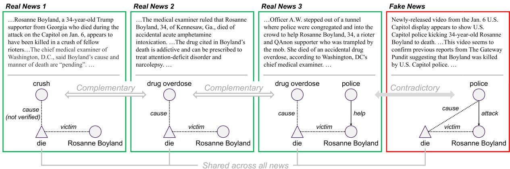
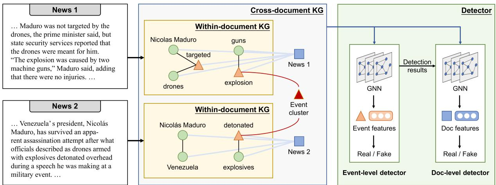
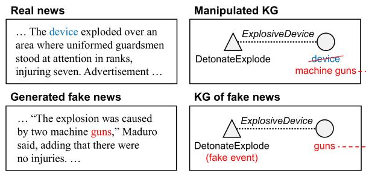
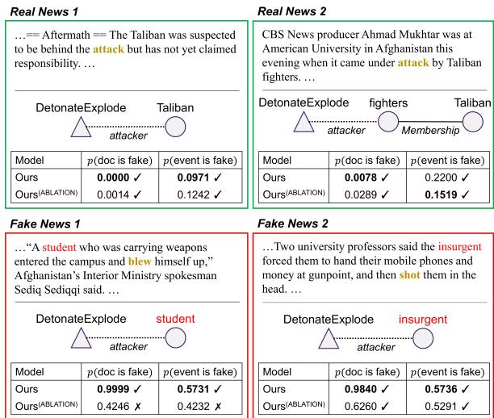
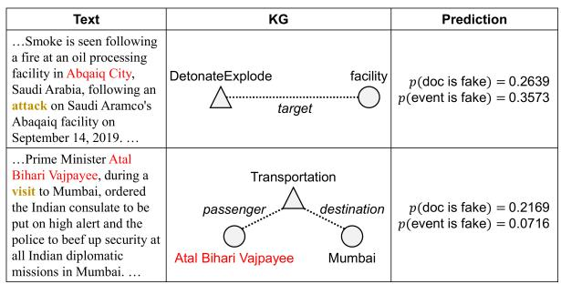
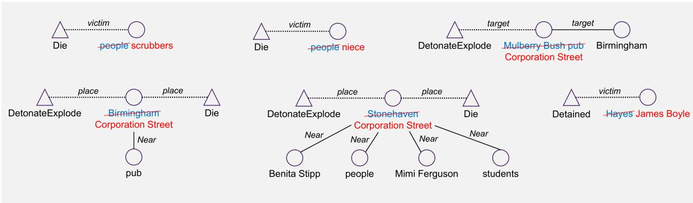

# Cross-document Misinformation Detection based on Event Graph Reasoning

Xueqing Wu, Kung-Hsiang Huang, Yi R. Fung, Heng Ji

University of Illinois Urbana-Champaign

{xueqing8,khhuang3,yifung2,hengji}@illinois.edu

## Abstract

For emerging events, human readers are often exposed to both real news and fake news. Multiple news articles may contain complementary or contradictory information that readers can leverage to help detect fake news. Inspired by this process, we propose a novel task of cross-document misinformation detection. Given a cluster of topically related news documents, we aim to detect misinformation at both document level and a more finegrained level, event level. Due to the lack of data, we generate fake news by manipulating real news, and construct 3 new datasets with 422, 276, and 1, 413 clusters of topically related documents, respectively. We further propose a graph-based detector that constructs a cross-document knowledge graph using cross-document event coreference resolution and employs a heterogeneous graph neural network to conduct detection at two levels. We then feed the event-level detection results into the document-level detector. Experimental results show that our proposed method significantly outperforms existing methods by up to 7 F1 points on this new task.1

## 1 Introduction

The dissemination of fake news has become an important social issue. For emergent complex events, human readers are usually exposed to multiple news documents, where some are real and others are fake. News documents from different sources naturally form a cluster of topically related documents. We notice that articles about the same topic may contain conflicting or complementary information, which can benefit the task of misinformation detection. An example is shown in Figure 1. As shown in the knowledge graph, the death of Rosanne Boyland in 2021 US Capitol attack is a shared event across all four documents. Each document is internally consistent, making it difficult to identify misinformation when judging each news separately. However, the three real news documents complement each other’s statements regarding the death of Boyland, while the fake news document contradicts the other stories. Such cross-document connections can be leveraged to help detect misinformation.

Most of the existing work on fake news detection is limited to judging each document in isolation. In contrast, we propose a novel task of crossdocument misinformation detection that aims to detect fake information from a cluster of topically related news documents. We perform the task at both the document level and event level. Each event describes a specific type of real-world event mentioned in the text (e.g., the death of Boyland in Figure 1), and usually involves certain participants to represent different aspects of the event (e.g., the cause of death and the victim of the death event). Document-level detection aims to detect fake news documents. Event-level detection is a more fine-grained task that aims to detect fake events, thereby pinpointing specific fake information in news documents.

Existing work on fine-grained misinformation detection detects triplets of false knowledge (Fung et al., 2021). However, we focus on identifying false events instead of relations or entities, because events are more important for storytelling and easier to compare across multiple documents through cross-document coreference resolution.

To the best of our knowledge, there are no fake news detection datasets with clusters of topically related documents. Therefore, we construct 3 new benchmark datasets based on existing real news corpus with such clusters. Following Fung et al. (2021), we train a generator that generates a document from a knowledge graph (KG), and feed manipulated KGs into the generator to generate fake news documents. Tracking the manipulation operations, we also obtain supervision for event-

  
Figure 1: An example of cross-document misinformation detection, including the texts and knowledge graphs for four news documents. The three real news documents complement each other, while the fake news contradicts the other news. News 1 falsely speculates that Boyland was crushed to death, but it admits that the cause of death was not yet verified. News 2 and 3 complete the story by reporting that Boyland died of drug overdose. The fake news claims that Boyland was killed by police, which contradicts the other news. Additionally, the fake news states that the police attacked Boyland, which is inconsistent with News 3’s claim that the police was trying to help her.

## level detection.

We further propose a detection approach as shown in Figure 2. Given a cluster of documents, we first use an information extraction (IE) system (Lin et al., 2020) to construct a within-document KG for each document. Then, we connect the within-document KGs to form a cross-document KG using cross-document event coreference resolution (Lai et al., 2021; Wen et al., 2021). Eventually, we use a heterogeneous graph neural network (GNN) to encode the cross-document KG and conduct detection at two levels.

Our contributions are summarized as follows:

1. We propose the novel task of cross-document misinformation detection, and conduct the task at two levels, document level and the more fine-grained event level.

2. We construct 3 new datasets for our proposed task based on existing document clusters categorized by topics.

3. We propose a detector that leverages crossdocument information and improve documentlevel detection by utilizing features produced by the event-level detector. Experiments on three datasets demonstrate that our method significantly outperforms existing methods.

## 2 Related Work

Fake News Detection: Early work on fake news detection uses hand-crafted features to perform document classification (Rubin et al., 2016; Wang, 2017; Rashkin et al., 2017; Pérez-Rosas et al., 2018; Sarkar et al., 2018; Atanasova et al., 2019). Recent work uses neural networks such as recurrent neural networks (Karimi et al., 2018; Nasir et al., 2021) and Transformer (Zellers et al., 2019) to encode the news document. To model the internal structure of a news document, Karimi and Tang (2019) model the inter-sentence dependency tree, Vaibhav et al. (2019); Hu et al. (2021) model the interactions between sentences; and Pan et al. (2018) and Fung et al. (2021) model the knowledge graph extracted by IE systems. Similar to our work, Hu et al. (2021) compare each news with external knowledge base (KB) to check for inconsistencies. However, the correlation between news and KB is not as close as the correlation between related news documents due to the incompleteness of these KBs. Other work utilizes additional information such as user engagements and behaviors on social media (Shu et al., 2019; Nguyen et al., 2020) and multi-modal features (Khattar et al., 2019; Tan et al., 2020; Fung et al., 2021). However, to the best of our knowledge, no published work has considered using cross-document inference for misinformation detection.

In addition to document-level detection, the task of fine-grained detection is also important but rarely explored. The most relevant work detects fake knowledge triplets extracted from each individual news article (Fung et al., 2021).

Another related task is fact verification which aims to verify a statement based on retrieved evidence. Fact verification has been explored in multiple domains such as general domain (Thorne et al., 2018), climate change (Diggelmann et al., 2020)

  
Figure 2: An overview of our approach. We first construct a within-document KG for each document based on IE output, where represents an entity and represents an event. Then, we construct a cross-document KG by (1) adding a node for each cross-document event cluster and connecting it with events in the cluster, and (2) introducing a document node  for each document and connecting it with all entities and events in the given document. Finally, we use GNN to encode the cross-document KG, and use the event and document features to conduct misinformation detection at two levels. The two detectors are trained and deployed in a pipeline fashion, where event-level detection results are leveraged to improve document-level detection.

and COVID-19 (Wadden et al., 2020; Saakyan et al., 2021). However, fact verification focuses on short single-sentence statements and cannot model the complicated internal structure of a news document.

Fake News Datasets: The main difficulty in constructing a fake news dataset is to obtain annotations. Rashkin et al. (2017) and Rubin et al. (2016) obtain labels from the source information and consider news from reliable sources as real news, and unreliable sources as fake news. A potential issue is that the detector may only learn to distinguish the style of different news sources, rather than the authenticity of the content. Shu et al. (2020) collect annotations from fact-checking websites, and Pérez-Rosas et al. (2018) collect annotations via crowd-sourcing. These approaches produce datasets of higher quality, but require extensive manual efforts. With the development of powerful generative models capable of mimicking humanwritten news (Zellers et al., 2019), recent work has constructed datasets by using generative models to generate fake news (Tan et al., 2020; Fung et al., 2021). Fung et al. (2021) further generate fake news from manipulated KG, which we follow to construct our dataset.

## 3 Task Formulation

Given a cluster of documents about the same story, the task of cross-document misinformation detection aims to detect the fake information included in the cluster.

Formally, let ${ \bf S } = \{ { \bf d } _ { 1 } , \cdots , { \bf d } _ { N } \}$ be the document cluster, and $N = | \mathbf { S } |$ be the size of the cluster. Some documents in S are real, while others are fake. From each document $\textbf { d } \in { \textbf { S } }$ , we extract events $\mathbf E ( \mathbf d ) = \{ e _ { 1 } , \dots , e _ { m } \}$ , where $m = | \mathbf { E } ( \mathbf { d } ) |$ is the number of events in document d. In an extracted event set E(d), some events are real and others are fake.

We conduct the task of misinformation detection at two levels, document level and event level. Document-level detection aims to predict whether each document d S is real or fake. Event-level detection is a more fine-grained task that aims to predict whether each event $e \in { \bf E } ( { \bf d } ) , { \bf d } \in { \bf S }$ is real or fake. In the example in Figure 1, the die event in the fake news is fake, since it falsely describes Boyland being killed by the police, but she actually died of drug overdose.

## 4 Approach

An overview of our approach is shown in Figure 2. Given a cluster of documents, we first construct a within-document KG for each document using an IE system (Lin et al., 2020), and then connect the within-document KGs into a cross-document KG using cross-document event coreference resolution. Based on the cross-document KG, we use a hetereogeneous GNN (Schlichtkrull et al., 2018;

Hu et al., 2019) to perform detection. We further incorporate the results of event-level detection to help the document-level detector.

## 4.1 Knowledge Graph Construction

Within-document KG: We first construct a within-document IE-based knowledge graph for each document. We leverage OneIE (Lin et al., 2020), a joint IE system, to extract the entities, relations, and events contained in a given document. Then, we conduct entity linking (Pan et al., 2017) and entity coreference resolution (Lee et al., 2017) to merge multiple mentions of the same entities together. Eventually, we obtain a withindocument KG where entities and events are nodes, relations are edges between entities, and arguments are edges between events and entities.

Cross-document KG: We leverage crossdocument event coreference resolution to connect the within-document KGs into a cross-document KG as illustrated in Figure 2. We employ a crossdocument event coreference resolution system (Lai et al., 2021; Wen et al., 2021) to identify clusters of events from multiple documents that refer to the same real-world events. The system utilizes both textual contexts of the event mentions and symbolic features such as the event type information. An example of the detected event cluster is shown in Table 1, where the four events of four documents all refer to the same explosion attack on Venezuela’s President Nicolas Marduro. These four events contain complementary or contradictory details, which can be used for misinformation detection. For each event cluster, we add a node to represent the overall information of the real-world complex event corresponding to the cluster. Then, an edge is added between each event node and corresponding cluster node to allow reasoning among cross-document coreferential events.

To indicate which document each entity or event belongs to and capture the global information of each document, we further introduce a document node and connect it to the associated entity and event nodes for each document.

The resulting KG contains 4 types of nodes (i.e. entity nodes, event nodes, document nodes, and event cluster nodes) and 5 types of edges (i.e. relation edges, event argument edges, document-toentity edges, document-to-event edges, and edges connecting event nodes to event cluster nodes).

<table><tr><td rowspan=1 colspan=1>Real</td><td rowspan=1 colspan=1>.  . Venezuela&#x27; s president, Nicolás Maduro, has sur-vived an apparent assassination attempt after what of-ficials described as drones armed with explosives, $\dot { \mathrm { a r g l } }$ detonated $\mathrm { t r i g }$ overhead during a speech he was mak-ing at a military event. ·</td></tr><tr><td rowspan=1 colspan=1>Real</td><td rowspan=1 colspan=1>.. . The BBC quotes anonymous firefighters at thescene who say “the incident was actually a gas tankexplosion $\mathrm { \ t r i g \Omega }$ inside an apartment $_ \mathrm { a r g 2 } ,$ but did not pro-vide further details.&quot;</td></tr><tr><td rowspan=1 colspan=1>Fake</td><td rowspan=1 colspan=1>. . · Maduro was not targeted by the drones, the primeminister said, but state security services reported thatthe drones were meant for him. &quot;The explosiontrigwas caused by two machine guns $\dot { \mathfrak { s } } _ { \mathrm { a r g l } }$ ,&quot; Maduro said,adding that there were no injuries. .</td></tr><tr><td rowspan=1 colspan=1>Fake</td><td rowspan=1 colspan=1>. . . Two drones armed with explosives detonatedtrignear PuntoDeCortearg2, where the Venezuelan ForeignMinister, Jorge Rodríguez, was performing, and nearthe stage where he was giving a speech. . . .</td></tr></table>

Table 1: An example of cross-document event cluster from IED dataset, where trig, arg1 and arg2 represent the trigger, ExplosiveDevice argument and Place argument respectively. The four events from four documents all refer to the explosion attack on Nicolas Marduro. The two real news articles complement each other by providing different aspects of the event (ExplosiveDevice argument in the first news and Place argument in the second news), while the two fake news articles contradict the real news with different details (i.e., different ExplosiveDevice and Place arguments).

Since all edges are directional, we add an inverse edge for each edge to propagate features along both directions, and the final KG contains 10 edge types, accounting for the inverse of existing edge types.

KG representation: We use BERT (Devlin et al., 2019) to initialize the node and edge embeddings in the KG. For a document node, we use BERT to encode the entire document and take the embeddings of [CLS] tokens. Similarly, for an entity node, we encode its canonical mention. For an event node, we encode the sentence where the event trigger occurs. For an event cluster node, we take the average of the embeddings of all events in the cluster. For a relation edge or an event argument role edge, we encode the linearized representation of the relation tuple. For example, the Leadership relation between “Nicolas Maduro” and “Venezuelan” is represented by “Nicolas Maduro, Leadership, Venezuelan” , and “guns” as the ExplosiveDevice argument of the DetonateExplode event is represented by “DetonateExplode, ExplosiveDevice, guns”.

## 4.2 Knowledge Graph Encoder

Heterogeneous GNN: Given the heterogeneous nature of the cross-document KG, we adopt a heterogeneous GNN to encode the KG.

Formally, let $\mathcal { G }$ denote KG and denote the nodes in ${ \mathcal { G } } .$ . We use  to denote the 10 types of edges as discussed in the previous section, and for each edge type $r \in \mathcal { R }$ , we use $\mathcal { G } _ { r }$ to denote the subgraph of that only contains edges of type r. At the l-th layer, the inputs are output features produced by the previous layer denoted as $\mathbf { h } _ { i } ^ { ( l - 1 ) } , i \in \mathcal { V }$ . For each edge type $r \in \mathcal { R }$ , we apply a separate GNN to encode $\mathcal { G } _ { r }$ and produce a set of features denoted as $\mathbf { h } _ { i , r } ^ { ( l ) } .$ . Then, we aggregate the outputs for all edge types into the final output as follows:

$$
\mathbf { h } _ { i } ^ { ( l ) } = \sum _ { r \in \mathcal { R } } \mathbf { h } _ { i , r } ^ { ( l ) } / | \mathcal { R } |\tag{1}
$$

For document-to-entity edges, document-toevent edges, and edges connecting event nodes to event cluster nodes, we use standard graph attention network (GAT). For relation edges and event argument edges, we apply edge-aware GAT to leverage the edge features. Here, the edge features refer to the BERT embeddings of text descriptions such as “Nicolas Maduro, Leadership, Venezuelan” or “DetonateExplode, ExplosiveDevice, guns” as described in Section 4.1. The remainder of Section 4.2 presents details of GAT and edge-aware GAT, i.e., how to produce $\mathbf { h } _ { i , r } ^ { ( l ) }$ based on $\bar { \mathbf { h } _ { i } ^ { ( l - 1 ) } }$

Graph attention network: For each given node, GAT aggregates the node features of its neighbors via attention mechanism (Velickovic et al., 2018). For a given edge type $r \in \mathcal { R }$ , let $\mathcal { N } _ { i , r }$ denote the neighbors of node i in $\mathcal { G } _ { r }$ . At the l-th layer, the attention weights $\alpha _ { i j }$ are calculated as follows:

$$
e _ { i j } = \mathrm { L e a k y R e L U } \left( \mathbf { a } ^ { \top } \left[ \mathbf { W } \mathbf { h } _ { i } ^ { ( l - 1 ) } | | \mathbf { W } \mathbf { h } _ { j } ^ { ( l - 1 ) } \right] \right)\tag{2}
$$

$$
\alpha _ { i j } = \mathrm { s o f t m a x } _ { j } ( e _ { i j } ) = \frac { \exp ( e _ { i j } ) } { \sum _ { k \in \mathcal { N } _ { i , r } } \exp ( e _ { i k } ) }\tag{3}
$$

where a and W are trainable parameters, and denotes the feature concatenation. The output features $\mathbf { h } _ { i , r } ^ { ( l ) }$ for node i in $\mathcal { G } _ { r }$ are calculated as follows:

$$
\mathbf { h } _ { i , r } ^ { ( l ) } = \sum _ { j \in \mathcal { N } _ { i , r } } \alpha _ { i j } \mathbf { W } \mathbf { h } _ { j } ^ { ( l - 1 ) }\tag{4}
$$

Edge-aware graph attention network: Edgeaware GAT is an extension of GAT that considers edge features in addition to node features (Huang et al., 2020; Yasunaga et al., 2021). Let $\mathbf { r } _ { i j }$ denote the features of the edge between nodes i and $j .$ For a given edge type $r \in \mathcal { R }$ , at the l-th layer, the attention weights $\alpha _ { i j }$ are computed as follows:

$$
\mathbf { r } _ { i j } ^ { \prime } = \mathbf { W } ^ { r } \left[ \mathbf { h } _ { i } ^ { ( l - 1 ) } | | \mathbf { h } _ { j } ^ { ( l - 1 ) } | | \mathbf { r } _ { i j } \right]\tag{5}
$$

$$
\alpha _ { i j } = { \mathrm { s o f t m a x } } _ { j } \left( ( \mathbf { W } ^ { Q } \mathbf { h } _ { i } ^ { ( l - 1 ) } ) ( \mathbf { W } ^ { K } \mathbf { r } _ { i j } ^ { \prime } ) ^ { \top } \right)\tag{6}
$$

where $\mathbf { W } ^ { r }$ $\mathbf { W } ^ { Q }$ and $\mathbf { W } ^ { K }$ are trainable parameters. The output features $\mathbf { h } _ { i , r } ^ { ( l ) }$ for node i in $\mathcal { G } _ { r }$ are computed as follows:

$$
\mathbf { h } _ { i , r } ^ { ( l ) } = \sum _ { j \in \mathcal { N } _ { i , r } } \alpha _ { i j } \mathbf { W } ^ { V } \mathbf { r } _ { i j } ^ { \prime }\tag{7}
$$

where $\mathbf { W } ^ { V }$ is a learnable matrix.

## 4.3 Misinformation Detector

Using the previously described graph encoder, we are able to obtain representations of the document and event nodes. We conduct document-level detection using the document node representations, and event-level detection using the event node representations. We separately train two detectors for these two levels of tasks.

However, these two tasks are not mutually independent. Intuitively, document-level detection can benefit from the results of event-level detection, because the presence of a large number of false events indicates that the document is more likely to be fake. Therefore, we feed the results produced by a well-trained event-level detector into each layer of the document-level detector. Let $\mathbf { e } _ { i }$ denote the representations of node i produced by the event-level detector. At the l-th layer of the document-level detector, instead of using the output features of the previous layer $\mathbf { h } _ { i } ^ { ( l - 1 ) }$ as input features, we use a linear projection of the concatenation of $\mathbf { e } _ { i }$ and $\mathbf { h } _ { i } ^ { ( l - 1 ) }$ calculated as follows:

$$
\mathbf { W } _ { \mathrm { p r o j } } ^ { ( l ) } \left[ \mathbf { e } _ { i } \lVert \mathbf { h } _ { i } ^ { ( l - 1 ) } \right]\tag{8}
$$

where $\mathbf { W } _ { \mathrm { p r o j } } ^ { ( l ) }$ is a learnable matrix.

## 5 Dataset Construction

Currently, there are no existing resources for crossdocument misinformation detection. We propose to construct datasets based on real news datasets with clustering information. For each cluster, we randomly sample 50% real news and replace them with manipulated fake news. Figure 3 shows an overview of the fake news generation process, and more examples are presented in Appendix D.

  
Figure 3: An overview of the fake news generation process. Based on the real news and its IE output, we select a high-frequency “DetonateExplode” event and replace its argument entity “device” with “machine guns”. We then generate the fake news from the manipulated KG. In the KG of generated fake news, the manipulated entity “guns” is an argument of the “DetonateExplode” event, so we consider the event as fake.

Following Fung et al. (2021), we train a KG-totext generator from the real news in our datasets, and generate fake news from manipulated KGs. The main differences between Fung et al. (2021)’s method and ours in terms of manipulating KG are: (1) we only conduct entity swapping, and do not adopt other types of manipulation including adding relations or events and subgraph replacement; (2) since we focus on events, we select entities to be replaced that are arguments of high-frequency events, instead of based on entity node degree; (3) we select entities from other documents in the same document cluster to replace the original entities, so that the entities before and after replacement are more similar.

We record the manipulation operations, and use a heuristic rule to obtain supervision for event-level detection as explained below. In a fake document, if an event involves manipulated entities as arguments, we consider this event as fake.

## 6 Experiments

## 6.1 Data

We constructed three new benchmark datasets based on three datasets that naturally have clusters of topically related documents. IED is a complex event corpus, where each complex event refers to a real-world story (e.g., Boston bombing) and is described by multiple documents (Li et al., 2021). Therefore, a complex event can be considered as a document cluster. TL17 and Crisis are two timeline summarization datasets containing multiple news timelines. Each timeline contains multiple documents describing an evolving long-term event such as Influenza H1N1 and Egypt Revolution (Tran et al., 2013, 2015), and thus can be regarded as a document cluster. The detailed statistics of the original datasets are shown in Appendix A.

<table><tr><td colspan="2"></td><td># Cluster</td><td># Doc</td><td># Fake event per doc (%)</td></tr><tr><td rowspan="3">IED</td><td>Train</td><td>422</td><td>3865</td><td>3.99 (9.91%)</td></tr><tr><td>Dev</td><td>140</td><td>1297</td><td>3.66 (9.14%)</td></tr><tr><td>Test</td><td>140</td><td>1262</td><td>3.68 (9.51%)</td></tr><tr><td rowspan="3">TL17</td><td>Train</td><td>276</td><td>2610</td><td>2.97 (12.70%)</td></tr><tr><td>Dev</td><td>92</td><td>879</td><td>2.69 (12.31%)</td></tr><tr><td>Test</td><td>92</td><td>892</td><td>2.85 (12.13%)</td></tr><tr><td rowspan="3">Crisis</td><td>Train</td><td>1413</td><td>13337</td><td>4.54 (13.95%)</td></tr><tr><td>Dev</td><td>177</td><td>1648</td><td>4.21 (13.29%)</td></tr><tr><td>Test</td><td>177</td><td>1701</td><td>4.38 (13.80%)</td></tr></table>

Table 2: Statistics of the resulting datasets.

However, documents within the same cluster may not be closely related as the story described by a cluster can span up to three years. To obtain smaller and more closely related clusters, we split each timeline into smaller clusters of approximately size 10 based on publication dates2. Then, we employ the methods described in Section 5 to generate fake documents. The statistics of the constructed datasets are in Table 2.

## 6.2 Experimental Settings

For our proposed method, we use a 4-layered heterogeneous GAT and use bert-base-uncased to initialize the node and edge embeddings. For comparison, on the document-level detection task, we compare our method against two baselines: HDSF that models the inter-sentence dependency tree (Karimi and Tang, 2019), and GROVER (Zellers et al., 2019), a Transformer-based detector. On the event-level detection task, we compare our method against random guessing, logistic regression and BERT. For logistic regression, we use hand-crafted features to represent the event including the event type, the number of arguments, and the size of the event cluster. The detailed settings are presented in Appendix C.

For evaluation, we use F1 to evaluate documentlevel detection. Considering the label imbalance of event-level detection, we use F1 and the area under the ROC curve (AUC) to evaluate event-level detection. For the F1 metric, we select the optimal threshold on the validation set.

<table><tr><td></td><td>IED</td><td>TL17 Crisis</td><td></td></tr><tr><td>HDSF GROVER-medium</td><td>78.42 79.06</td><td>80.62 79.40</td><td rowspan="3">82.14 86.84</td></tr><tr><td>GROVER-mega</td><td>82.90</td><td>90.00 87.13</td></tr><tr><td>Ours</td><td>86.76</td><td>90.21 93.89</td></tr></table>

Table 3: F1 results (in %) of document-level detection. We report the F1 scores of HDSF (Karimi and Tang, 2019), GROVER of two settings (Zellers et al., 2019), and our proposed method.
<table><tr><td>Cross-document event coreference</td><td>Event-level detection results</td><td>IED TL17</td><td>Crisis</td></tr><tr><td>x</td><td>x</td><td>80.59 86.55</td><td>93.64</td></tr><tr><td>√</td><td>x</td><td>84.57 88.99</td><td>93.67</td></tr><tr><td>√</td><td>Random</td><td>83.63 84.86</td><td>92.18</td></tr><tr><td>√</td><td>√</td><td>86.76 90.21</td><td>93.89</td></tr></table>

Table 4: F1 results (in %) of ablation study over document-level detection. We analyze the use of crossdocument event coreference resolution and event-level detection results. We further experiment with random features for event-level detection results. Results of our full method are presented in the last row.

## 6.3 Document-level Detection Results

Table 3 shows the results of document-level detection. Our method yields consistent improvements on all three datasets and significantly outperforms the baselines that judge the authenticity for each document in isolation. To understand the effectiveness of each component, we conducted an ablation study and show the results in Table 4. We have the following findings:

(1) We remove the edges between event nodes and event center nodes to analyze the impact of cross-document event coreference resolution, and find that such information significantly improves the performance on IED and TL17. We also train our detector with smaller clusters on TL17 and get worse performance (84.53% and 87.37% on clusters with size 1 and 2 respectively), which verifies that our model benefits from more cross-document information. The benefit of cross-document event coreference resolution is less significant on the large-scale Crisis dataset containing 1.7k documents. This may imply that cross-document misinformation detection is more useful for emerging new events where large-scale training data is not available.

(2) Using the event-level detection results consistently improves the performance by 1-3 points on all datasets. Since the projection modules introduce additional parameters, we further train a detector utilizing random features and find that using random features reduces the performance. This verifies that the improvement is brought by utilizing the knowledge learnt by the event-level detector rather than additional parameters.

<table><tr><td rowspan="2"></td><td colspan="2">IED</td><td colspan="2">TL17</td><td colspan="2">Crisis</td></tr><tr><td>F1</td><td>AUC</td><td>F1</td><td>AUC</td><td>F1</td><td>AUC</td></tr><tr><td>Random</td><td>16.31</td><td>50.44</td><td>19.44</td><td>49.65</td><td>21.70</td><td>50.41</td></tr><tr><td>LR</td><td>31.26</td><td>77.87</td><td>29.14</td><td>68.19</td><td>31.67</td><td>68.17</td></tr><tr><td>BERT</td><td>26.43</td><td>71.12</td><td>31.95</td><td>71.42</td><td>33.89</td><td>71.86</td></tr><tr><td>Ours</td><td>44.86</td><td>88.46</td><td>41.56</td><td>82.59</td><td>48.48</td><td>85.60</td></tr><tr><td>Ours (ABLATION)</td><td>45.00</td><td>88.54</td><td>41.66</td><td>82.28</td><td>47.78</td><td>85.17</td></tr></table>

Table 5: Results (in %) of event-level detection. We report the F1 and AUC scores of random guessing (Random), logistic regression (LR), BERT, and our method. We further conduct an ablation study and report the results of our method without cross-document event coreference information, denoted as Ours(ABLATION).

## 6.4 Event-level Detection Results

We track the manipulation operations during the dataset construction process, which allows us to obtain supervision for event-level detection. The results are shown in Table 5. We compare our method with random guessing, logistic regression with hand-crafted event features, and BERT. We find that random guessing performs the worst, logistic regression and BERT achieve satisfactory performance, and our method significantly outperforms all baselines by a large margin. As in documentlevel detection, we conduct an ablation study on the use of cross-document event coreference resolution by removing edges between event nodes and event cluster nodes, and find that such information brings slight improvements in the AUC metric.

## 6.5 Analysis and Discussion

To demonstrate the benefits of using crossdocument event coreference resolution, we show an example in Figure 4, with 4 documents from the same cluster. As shown in Figure 4, by performing cross-document reasoning on events in the same event cluster, our model achieves better performance compared to Ours(ABLATION), i.e., our model without edges between event nodes and event cluster nodes.

We further analyze the remaining errors in our model. Figure 5 shows two representative cases where both document-level and event-level detectors fail to detect misinformation. In the first example, the manipulated entity is not captured by the IE system, and the error of IE system is propagated into the detector. A potential solution is to use an OpenIE system (Stanovsky et al., 2018) that is able to cover more event and entity types. The second example is a more challenging case where the event containing fake information is not mentioned in any other document. This makes it difficult to either verify or disprove via cross-document reasoning, and may require the detector to actively search for external information related to the event.

  
Figure 4: An example of four documents from the same cluster in the IED dataset. Event triggers are bolded and marked in gold, and fake information is marked in red. The tables report the detection results of our model with and without cross-document event coreference resolution, denoted by “Ours” and “Ours(ABLATION)” respectively, and better results are bolded. The use of cross-document event coreference resolution significantly enhances both levels of detection, especially for detecting fake news 1.

There are some remaining challenges and limitations in our proposed methodology. First, some cross-document contradictions are difficult to capture by coreference resolution only. In the example in Figure 1, knowing that the police are unlikely to help and attack Boyland at the same time requires commonsense reasoning, which we leave as our future work. Second, an underlying assumption of our framework is that real news articles are consistent and complementary with each other, while fake news often contradicts each other. This assumption is true for our constructed datasets because we manipulate the KGs via random entity swapping. However, certain types of human-written fake news documents, such as conspiracy theories, tend to be closely related to each other and convey highly similar information because they share the same biases or aim to manipulate readers in the same way. This may limit the performance of our proposed system in real-world scenarios.

  
Figure 5: Two examples where our detector fails to detect the fake information. Event triggers are bolded and marked in gold, and fake information is marked in red. In the first example, the fake event argument Abqaiq City is not captured by the IE system and thus cannot be detected. In the second example, the visit of Vajpayee to Mumbai is fake information but not mentioned by any other documents, and no coreference is detected for the Transportation event. Therefore, our detector does not have enough information to detect the fake information.

## 6.6 Human Evaluation on Fake News Generation

To evaluate the quality of the generated fake news, we conducted a Turing Test by 13 human readers as in Fung et al. (2021). We randomly select 100 documents from the IED dataset, half real and half fake, and ask the human readers to assess the authenticity for each document. The overall accuracy achieved by human readers is 66.88%, with 77.44% accuracy on real documents but only 56.32% accuracy on fake documents. This shows that it is difficult for human readers to detect the generated fake news.

## 7 Conclusions and Future Work

We are the first to study the new task of crossdocument misinformation detection. We conduct the task at two levels, document level and the more fine-grained event level, and construct three new datasets to handle the lack of training data. We further propose a graph-based cross-document detector that conducts reasoning over a cross-document knowledge graph and feed the event-level detection results into document-level detector. The experimental results show that our proposed method significantly outperforms existing methods.

For future work, we intend to extend our method to conduct cross-document reasoning over more types of information (e.g., entities and relations) in addition to events. We also plan to extend our method to multi-media news including texts, images, audios and videos, which requires the construction of cross-document multi-modal knowledge graphs. Finally, a challenging but important task is to construct a large-scale fake news detection corpus with human-written fake news containing document clusters and study our method in this scenario.

## 8 Ethical Considerations

The goal of this work is to advance state-of-theart research in the field of misinformation detection by analyzing multiple documents on the same topic. We build new benchmark datasets using a fake news generator, and propose a detector that achieves high performance in such scenarios. We have released the constructed datasets and detector codes in this submission as a useful reference for future research. We hope that our work will encourage more efforts in this direction and benefit the community.

However, as with any work that utilizes text generation, our work involves the risk of being applied to produce false information to mislead or manipulate readers. Therefore, we promise not to share codes or checkpoints of our generator to avoid potential negative consequences. To improve reproducibility, we describe the general idea and a few crucial details of the fake news generator.

## Acknowledgement

This research is based upon work supported by U.S. DARPA SemaFor Program No. HR001120C0123 and DARPA KAIROS Program No. FA8750-19-2- 1004. The views and conclusions contained herein are those of the authors and should not be interpreted as necessarily representing the official policies, either expressed or implied, of DARPA, or the U.S. Government. The U.S. Government is authorized to reproduce and distribute reprints for governmental purposes notwithstanding any copyright annotation therein.

## References

Pepa Atanasova, Preslav Nakov, Lluís Màrquez, Alberto Barrón-Cedeño, Georgi Karadzhov, Tsvetomila Mihaylova, Mitra Mohtarami, and James R. Glass. 2019. Automatic fact-checking using context and discourse information. ACM J. Data Inf. Qual., 11(3):12:1–12:27.

Alexis Conneau, Kartikay Khandelwal, Naman Goyal, Vishrav Chaudhary, Guillaume Wenzek, Francisco Guzmán, Edouard Grave, Myle Ott, Luke Zettlemoyer, and Veselin Stoyanov. 2020. Unsupervised cross-lingual representation learning at scale. In Proceedings of the 58th Annual Meeting of the Association for Computational Linguistics, ACL 2020, Online, July 5-10, 2020, pages 8440–8451. Association for Computational Linguistics.

Jacob Devlin, Ming-Wei Chang, Kenton Lee, and Kristina Toutanova. 2019. BERT: pre-training of deep bidirectional transformers for language understanding. In Proceedings of the 2019 Conference of the North American Chapter of the Association for Computational Linguistics: Human Language Technologies, NAACL-HLT 2019, Minneapolis, MN, USA, June 2-7, 2019, Volume 1 (Long and Short Papers), pages 4171–4186. Association for Computational Linguistics.

Thomas Diggelmann, Jordan L. Boyd-Graber, Jannis Bulian, Massimiliano Ciaramita, and Markus Leippold. 2020. CLIMATE-FEVER: A dataset for verification of real-world climate claims. CoRR, abs/2012.00614.

Yi Fung, Christopher Thomas, Revanth Gangi Reddy, Sandeep Polisetty, Heng Ji, Shih-Fu Chang, Kathleen R. McKeown, Mohit Bansal, and Avi Sil. 2021. Infosurgeon: Cross-media fine-grained information consistency checking for fake news detection. In Proceedings of the 59th Annual Meeting of the Association for Computational Linguistics and the 11th International Joint Conference on Natural Language Processing, ACL/IJCNLP 2021, (Volume 1: Long Papers), Virtual Event, August 1-6, 2021, pages 1683–1698. Association for Computational Linguistics.

Linmei Hu, Tianchi Yang, Chuan Shi, Houye Ji, and Xiaoli Li. 2019. Heterogeneous graph attention networks for semi-supervised short text classification. In Proceedings of the 2019 Conference on Empirical Methods in Natural Language Processing and the 9th International Joint Conference on Natural Language Processing, EMNLP-IJCNLP 2019, Hong Kong, China, November 3-7, 2019, pages 4820– 4829. Association for Computational Linguistics.

Linmei Hu, Tianchi Yang, Luhao Zhang, Wanjun Zhong, Duyu Tang, Chuan Shi, Nan Duan, and Ming Zhou. 2021. Compare to the knowledge: Graph neural fake news detection with external knowledge. In Proceedings of the 59th Annual Meeting of the Association for Computational Linguistics and

the 11th International Joint Conference on Natural Language Processing, ACL/IJCNLP 2021, (Volume 1: Long Papers), Virtual Event, August 1-6, 2021, pages 754–763. Association for Computational Linguistics.

Kung-Hsiang Huang, Mu Yang, and Nanyun Peng. 2020. Biomedical event extraction on graph edgeconditioned attention networks with hierarchical knowledge graphs. In Findings of the Association for Computational Linguistics: EMNLP 2020, Online Event, 16-20 November 2020, volume EMNLP 2020 of Findings ofACL, pages 1277–1285. Association for Computational Linguistics.

Mandar Joshi, Danqi Chen, Yinhan Liu, Daniel S. Weld, Luke Zettlemoyer, and Omer Levy. 2020. Spanbert: Improving pre-training by representing and predicting spans. Trans. Assoc. Comput. Linguistics, 8:64–77.

Hamid Karimi, Proteek Roy, Sari Saba-Sadiya, and Jiliang Tang. 2018. Multi-source multi-class fake news detection. In Proceedings of the 27th International Conference on Computational Linguistics, COLING 2018, Santa Fe, New Mexico, USA, August 20-26, 2018, pages 1546–1557. Association for Computational Linguistics.

Hamid Karimi and Jiliang Tang. 2019. Learning hierarchical discourse-level structure for fake news detection. In Proceedings of the 2019 Conference of the North American Chapter of the Association for Computational Linguistics: Human Language Technologies, NAACL-HLT 2019, Minneapolis, MN, USA, June 2-7, 2019, Volume 1 (Long and Short Papers), pages 3432–3442. Association for Computational Linguistics.

Dhruv Khattar, Jaipal Singh Goud, Manish Gupta, and Vasudeva Varma. 2019. MVAE: multimodal variational autoencoder for fake news detection. In The World Wide Web Conference, WWW 2019, San Francisco, CA, USA, May 13-17, 2019, pages 2915–2921. ACM.

Tuan Manh Lai, Heng Ji, Trung Bui, Quan Hung Tran, Franck Dernoncourt, and Walter Chang. 2021. A context-dependent gated module for incorporating symbolic semantics into event coreference resolution. In Proceedings of the 2021 Conference of the North American Chapter ofthe Associationfor Computational Linguistics: Human Language Technologies, NAACL-HLT 2021, Online, June 6-11, 2021, pages 3491–3499. Association for Computational Linguistics.

Kenton Lee, Luheng He, Mike Lewis, and Luke Zettlemoyer. 2017. End-to-end neural coreference resolution. In Proceedings of the 2017 Conference on Empirical Methods in Natural Language Processing, EMNLP 2017, Copenhagen, Denmark, September 9- 11, 2017, pages 188–197. Association for Computational Linguistics.

Mike Lewis, Yinhan Liu, Naman Goyal, Marjan Ghazvininejad, Abdelrahman Mohamed, Omer Levy, Veselin Stoyanov, and Luke Zettlemoyer. 2020. BART: denoising sequence-to-sequence pretraining for natural language generation, translation, and comprehension. In Proceedings of the 58th Annual Meeting of the Association for Computational Linguistics, ACL 2020, Online, July 5-10, 2020, pages 7871–7880. Association for Computational Linguistics.

Manling Li, Sha Li, Zhenhailong Wang, Lifu Huang, Kyunghyun Cho, Heng Ji, Jiawei Han, and Clare R. Voss. 2021. Future is not one-dimensional: Graph modeling based complex event schema induction for event prediction. CoRR, abs/2104.06344.

Ying Lin, Heng Ji, Fei Huang, and Lingfei Wu. 2020. A joint neural model for information extraction with global features. In Proceedings of the 58th Annual Meeting of the Association for Computational Linguistics, ACL 2020, Online, July 5-10, 2020, pages 7999–8009. Association for Computational Linguistics.

Jamal Abdul Nasir, Osama Subhani Khan, and Iraklis Varlamis. 2021. Fake news detection: A hybrid cnnrnn based deep learning approach. International Journal of Information Management Data Insights, 1(1):100007.

Van-Hoang Nguyen, Kazunari Sugiyama, Preslav Nakov, and Min-Yen Kan. 2020. FANG: leveraging social context for fake news detection using graph representation. In CIKM ’20: The 29th ACM International Conference on Information and Knowledge Management, Virtual Event, Ireland, October 19-23, 2020, pages 1165–1174. ACM.

Myle Ott, Sergey Edunov, Alexei Baevski, Angela Fan, Sam Gross, Nathan Ng, David Grangier, and Michael Auli. 2019. fairseq: A fast, extensible toolkit for sequence modeling. In Proceedings of NAACL-HLT 2019: Demonstrations.

Jeff Z. Pan, Siyana Pavlova, Chenxi Li, Ningxi Li, Yangmei Li, and Jinshuo Liu. 2018. Content based fake news detection using knowledge graphs. In The Semantic Web - ISWC 2018 - 17th International Semantic Web Conference, Monterey, CA, USA, October 8-12, 2018, Proceedings, Part I, volume 11136 of Lecture Notes in Computer Science, pages 669– 683. Springer.

Xiaoman Pan, Boliang Zhang, Jonathan May, Joel Nothman, Kevin Knight, and Heng Ji. 2017. Crosslingual name tagging and linking for 282 languages. In Proceedings of the 55th Annual Meeting of the Association for Computational Linguistics, ACL 2017, Vancouver, Canada, July 30 - August 4, Volume 1: Long Papers, pages 1946–1958. Association for Computational Linguistics.

Verónica Pérez-Rosas, Bennett Kleinberg, Alexandra Lefevre, and Rada Mihalcea. 2018. Automatic detection of fake news. In Proceedings of the 27th

International Conference on Computational Linguistics, COLING 2018, Santa Fe, New Mexico, USA, August 20-26, 2018, pages 3391–3401. Association for Computational Linguistics.

Sameer Pradhan, Alessandro Moschitti, Nianwen Xue, Olga Uryupina, and Yuchen Zhang. 2012. Conll-2012 shared task: Modeling multilingual unrestricted coreference in ontonotes. In Joint Conference on Empirical Methods in Natural Language Processing and Computational Natural Language Learning - Proceedings of the Shared Task: Modeling Multilingual Unrestricted Coreference in OntoNotes, EMNLP-CoNLL 2012, July 13, 2012, Jeju Island, Korea, pages 1–40. ACL.

Hannah Rashkin, Eunsol Choi, Jin Yea Jang, Svitlana Volkova, and Yejin Choi. 2017. Truth of varying shades: Analyzing language in fake news and political fact-checking. In Proceedings of the 2017 Conference on Empirical Methods in Natural Language Processing, EMNLP 2017, Copenhagen, Denmark, September 9-11, 2017, pages 2931–2937. Association for Computational Linguistics.

Victoria L Rubin, Niall Conroy, Yimin Chen, and Sarah Cornwell. 2016. Fake news or truth? using satirical cues to detect potentially misleading news. In Proceedings of the second workshop on computational approaches to deception detection, pages 7–17.

Arkadiy Saakyan, Tuhin Chakrabarty, and Smaranda Muresan. 2021. Covid-fact: Fact extraction and verification of real-world claims on COVID-19 pandemic. In Proceedings of the 59th Annual Meeting of the Association for Computational Linguistics and the 11th International Joint Conference on Natural Language Processing, ACL/IJCNLP 2021, (Volume 1: Long Papers), Virtual Event, August 1-6, 2021, pages 2116–2129. Association for Computational Linguistics.

Sohan De Sarkar, Fan Yang, and Arjun Mukherjee. 2018. Attending sentences to detect satirical fake news. In Proceedings of the 27th International Conference on Computational Linguistics, COLING 2018, Santa Fe, New Mexico, USA, August 20-26, 2018, pages 3371–3380. Association for Computational Linguistics.

Michael Sejr Schlichtkrull, Thomas N. Kipf, Peter Bloem, Rianne van den Berg, Ivan Titov, and Max Welling. 2018. Modeling relational data with graph convolutional networks. In The Semantic Web - 15th International Conference, ESWC 2018, Heraklion, Crete, Greece, June 3-7, 2018, Proceedings, volume 10843 of Lecture Notes in Computer Science, pages 593–607. Springer.

Kai Shu, Deepak Mahudeswaran, Suhang Wang, Dongwon Lee, and Huan Liu. 2020. Fakenewsnet: A data repository with news content, social context, and spatiotemporal information for studying fake news on social media. Big Data, 8(3):171–188.

Kai Shu, Suhang Wang, and Huan Liu. 2019. Beyond news contents: The role of social context for fake news detection. In Proceedings of the Twelfth ACM International Conference on Web Search and Data Mining, WSDM 2019, Melbourne, VIC, Australia, February 11-15, 2019, pages 312–320. ACM.

Zhiyi Song, Ann Bies, Stephanie M. Strassel, Tom Riese, Justin Mott, Joe Ellis, Jonathan Wright, Seth Kulick, Neville Ryant, and Xiaoyi Ma. 2015. From light to rich ERE: annotation of entities, relations, and events. In Proceedings of the The 3rd Workshop on EVENTS: Definition, Detection, Coreference, and Representation, EVENTS@HLP-NAACL 2015, Denver, Colorado, USA, June 4, 2015, pages 89–98. Association for Computational Linguistics.

Gabriel Stanovsky, Julian Michael, Luke Zettlemoyer, and Ido Dagan. 2018. Supervised open information extraction. In Proceedings of the 2018 Conference of the North American Chapter of the Association for Computational Linguistics: Human Language Technologies, NAACL-HLT 2018, New Orleans, Louisiana, USA, June 1-6, 2018, Volume 1 (Long Papers), pages 885–895. Association for Computational Linguistics.

Reuben Tan, Bryan A. Plummer, and Kate Saenko. 2020. Detecting cross-modal inconsistency to defend against neural fake news. In Proceedings of the 2020 Conference on Empirical Methods in Natural Language Processing, EMNLP 2020, Online, November 16-20, 2020, pages 2081–2106. Association for Computational Linguistics.

James Thorne, Andreas Vlachos, Christos Christodoulopoulos, and Arpit Mittal. 2018. FEVER: a large-scale dataset for fact extraction and verification. In Proceedings of the 2018 Conference of the North American Chapter of the Association for Computational Linguistics: Human Language Technologies, NAACL-HLT 2018, New Orleans, Louisiana, USA, June 1-6, 2018, Volume 1 (Long Papers), pages 809–819. Association for Computational Linguistics.

Giang Binh Tran, Mohammad Alrifai, and Eelco Herder. 2015. Timeline summarization from relevant headlines. In Advances in Information Retrieval - 37th European Conference on IR Research, ECIR 2015, Vienna, Austria, March 29 - April 2, 2015. Proceedings, volume 9022 of Lecture Notes in Computer Science, pages 245–256.

Giang Binh Tran, Mohammad Alrifai, and Dat Quoc Nguyen. 2013. Predicting relevant news events for timeline summaries. In 22nd International World Wide Web Conference, WWW ’13, Rio de Janeiro, Brazil, May 13-17, 2013, Companion Volume, pages 91–92. International World Wide Web Conferences Steering Committee / ACM.

Vaibhav Vaibhav, Raghuram Mandyam Annasamy, and Eduard H. Hovy. 2019. Do sentence interactions matter? leveraging sentence level representations for

fake news classification. In Proceedings of the Thirteenth Workshop on Graph-Based Methods for Natural Language Processing, TextGraphs@EMNLP 2019, Hong Kong, November 4, 2019, pages 134– 139. Association for Computational Linguistics.

Petar Velickovic, Guillem Cucurull, Arantxa Casanova, Adriana Romero, Pietro Liò, and Yoshua Bengio. 2018. Graph attention networks. In 6th International Conference on Learning Representations, ICLR 2018, Vancouver, BC, Canada, April 30 - May 3, 2018, Conference Track Proceedings. OpenReview.net.

David Wadden, Shanchuan Lin, Kyle Lo, Lucy Lu Wang, Madeleine van Zuylen, Arman Cohan, and Hannaneh Hajishirzi. 2020. Fact or fiction: Verifying scientific claims. In Proceedings of the 2020 Conference on Empirical Methods in Natural Language Processing, EMNLP 2020, Online, November 16-20, 2020, pages 7534–7550. Association for Computational Linguistics.

William Yang Wang. 2017. "liar, liar pants on fire": A new benchmark dataset for fake news detection. In Proceedings of the 55th Annual Meeting of the Association for Computational Linguistics, ACL 2017, Vancouver, Canada, July 30 - August 4, Volume 2: Short Papers, pages 422–426. Association for Computational Linguistics.

Haoyang Wen, Ying Lin, Tuan Lai, Xiaoman Pan, Sha Li, Xudong Lin, Ben Zhou, Manling Li, Haoyu Wang, Hongming Zhang, Xiaodong Yu, Alexander Dong, Zhenhailong Wang, Yi Fung, Piyush Mishra, Qing Lyu, Dídac Surís, Brian Chen, Susan Windisch Brown, Martha Palmer, Chris Callison-Burch, Carl Vondrick, Jiawei Han, Dan Roth, Shih-Fu Chang, and Heng Ji. 2021. RESIN: A dockerized schemaguided cross-document cross-lingual cross-media information extraction and event tracking system. In Proceedings of the 2021 Conference of the North American Chapter of the Association for Computational Linguistics: Human Language Technologies: Demonstrations, NAACL-HLT 2021, Online, June 6- 11, 2021, pages 133–143. Association for Computational Linguistics.

Michihiro Yasunaga, Hongyu Ren, Antoine Bosselut, Percy Liang, and Jure Leskovec. 2021. QA-GNN: reasoning with language models and knowledge graphs for question answering. In Proceedings ofthe 2021 Conference ofthe North American Chapter ofthe Associationfor Computational Linguistics: Human Language Technologies, NAACL-HLT 2021, Online, June 6-11, 2021, pages 535–546. Association for Computational Linguistics.

Rowan Zellers, Ari Holtzman, Hannah Rashkin, Yonatan Bisk, Ali Farhadi, Franziska Roesner, and Yejin Choi. 2019. Defending against neural fake news. In Advances in Neural Information Processing Systems 32: Annual Conference on Neural Information Processing Systems 2019, NeurIPS 2019, December 8-14, 2019, Vancouver, BC, Canada, pages 9051–9062.

## A Statistics of Original Datasets

Statistics of the original IED, TL17 and Crisis dataset are presented in Table 6.

<table><tr><td></td><td># Cluster</td><td># Doc</td><td># Doc per cluster</td></tr><tr><td>IED</td><td>433</td><td>7403</td><td>17</td></tr><tr><td>TL17</td><td>17</td><td>4650</td><td>273</td></tr><tr><td>Crisis</td><td>4</td><td>20463</td><td>5116</td></tr></table>

Table 6: Statistics of the original datasets.

## B Method Details

## B.1 Information Extraction

We use OneIE (Lin et al., 2020), a BERT-based end-to-end IE system to extract entities, relations, and events. OneIE conducts IE in four steps: (1) encode a sentence with a pre-trained BERT encoder, (2) identify entity mentions and event triggers using a conditional random fields layer, (3) classify types of entity mentions, events, entity relations, and event arguments using feed-forward networks, and (4) search for a globally optimal IE graph via beam search. In this work, we use the model released by Wen et al. (2021). The model achieves 64.1, 49.7, and 49.5 F1 on trigger extraction, argument extraction and relation extraction respectively on ACE 2005 and ERE (Song et al., 2015).

In addition, we use entity linking and entity coreference resolution to identify coreferential entity mentions. For entity linking, we use an LSTMbased entity linker to link (Pan et al., 2017) to link entity mentions to WikiData entries. The entity linker achieves 91.8 F1 and 84.3 accuracy. For entity coreference resolution, we use an extension of the e2e-coref model (Lee et al., 2017) based on XLM-RoBERTa (Conneau et al., 2020). The model is released by Wen et al. (2021) and achieves a 92.4 CoNLL score on OntoNotes (Pradhan et al., 2012). Eventually, entity mentions that are linked to the same WikiData entry or identified as coreferences will be considered as the same entity, and their entity nodes in the KG will be merged.

## B.2 Event Coreference Resolution

For event coreference resolution, we use Lai et al. (2021), a within-document coreference resolution model. We extend it to the cross-document scenario following Wen et al. (2021). Given a cluster containing N documents, we concatenate each pair of documents into a “mega-document”. The model then conducts coreference resolution on each mega-document. More specifically, for each event mention, the model uses SpanBERT (Joshi et al., 2020) to extract contextualized text embeddings and builds manually designed symbolic features such as event types, attributes, and arguments. Then, the two features are combined selectively using a gated mechanism. Eventually, for each pair of event mentions in a mega-document, the model predicts whether they are coreferential. In this work, we use the model released by Wen et al. (2021). The model achieves 84.8 CoNLL score on ACE 2005.

## B.3 KG-to-Text Generator

We train the KG-to-text generator by following Fung et al. (2021).

We first linearize the IE-based KG. For example, the Leadership relation between “Nicolas Maduro” and “Venezuelan” is represented by “Nicolas Maduro, Leadership, Venezuelan”, and the DetonateExplode event with “drone” as ExplosiveDevice argument and “flat” as Place argument is represented by “[DetonateExplode | ExplosiveDevice = drone, Place = flat]”. We represent the entire KG in graph by concatenating the text representations of all relations and events.

Since generating the entire document is very challenging, we fine-tune a sentence-level KG-totext generator from BART (Lewis et al., 2020). The generator takes the linearized KG and the previous sentence as input and generates the next sentence. Here, the KG only contains information presented in the sentence rather than in the entire document. During inference, the generator generates the entire document sentence-by-sentence in an autoregressive manner.

## C Experiment Details

Detailed settings of our method: For our proposed method, we use a 4-layered heterogeneous GNN, where each GAT layer contains 8 heads. To initialize the node and edge embeddings, we use bert-base-uncased model with the feature dimension of 768. Our model contains 233M parameters.

For hyperparameters, we use a batch size of 16, and search the learning rate from $\{ 1 0 ^ { - 3 } , 1 0 ^ { - 4 } , 1 0 ^ { - 5 } \}$ and the number of layers within 2, 4, 8 . Our best-found hyperparameters are a learning rate of 10−5 and a number of layers of 4. We train our model with Adam optimizer until convergence. To reduce computation cost, we freeze BERT’s parameters. The training process takes approximately 6 hours on a Tesla P100 GPU.

Detailed settings of KG-to-text generator: We fine-tune the model from bart-large model containing 24 layers, 1024 hidden dimensions, 16 heads, and 406M parameters. on the three datasets respectively. We train the model on a Tesla P100 GPU using the batch size of 1024 tokens, the gradient accumulation step of 16, the learning rate of $3 \times 1 0 ^ { - 5 }$ , the warmup steps of 500 steps, and the total training steps of 12000.

Document-level baselines: For document-level detection, we compare our method against two baselines: HDSF that models inter-sentence dependency tree (Karimi and Tang, 2019), and GROVER (Zellers et al., 2019), a Transformer-based detector. For HDSF, we use the implementation at https: //github.com/hamidkarimi/HDSF/. We train the model on our datasets using their default hyper-parameters. For GROVER, we use the implementation at https://github.com/ rowanz/grover and experiment with two settings, medium setting and mega setting. Since fine-tuning the GROVER model is computationally expensive, we use GROVER in the zero-shot setting.

Event-level baselines: For event-level detection, since there are no existing methods, we use three baselines, random guessing, logistic regression, and BERT. In random guessing, for each event, we randomly draw a value from a uniform distribution between [0, 1] as the probability that the event is false. In logistic regression, we use the following features: event type (represented by onehot feature), number of arguments, and the size of the event cluster that the given event belongs to. The features are normalized on the training set. We use the implementation of logistic regression and default parameters provided by sklearn. In the BERT baseline, we use the same BERT-based event features as our method, and replace the 4- layer GNN in our model with a feed-forward network. We use the same hyper-parameters to train the model.

## D Examples of Fake News Generation

We present two examples of generated fake news in Figure 6 and 7, including the original real news, manipulated KG, and generated fake news. The generated fake news conveys the manipulated misinformation and meanwhile is stylistically similar to real news.

## E Scientific Artifacts

In this work, we use three datasets including IED (Li et al., 2021), TL17 (Tran et al., 2013) and Crisis (Tran et al., 2015). There are no licenses or terms of use associated with all three datasets.

We use five software. Among them, HDSF (Karimi and Tang, 2019), OneIE (Lin et al., 2020) and RESIN (Wen et al., 2021) have no license or terms of use. GROVER (Zellers et al., 2019) and huggingface are licensed under the Apache License 2.0. Fairseq (Ott et al., 2019) is licenced under the MIT License.

We use two models, BERT (Devlin et al., 2019) and BART (Lewis et al., 2020), licenced under the Apache License 2.0 and the MIT License respectively.

In summary, all artifacts involved either have no associated licenses or terms of use, or are licensed under the Apache License 2.0 or the MIT License. Both the Apache License 2.0 or the MIT License permit commercial and private use. Therefore, our use is consistent with their intended use. We will release the datasets and software with licenses compatible with the original access conditions.

  
Figure 6: An example of generated fake news, including the original real news, manipulated KG, and generated fake news. Real and fake information are marked in blue and red respectively. To save space, we only show some parts of the KG that are manipulated.

## Real News

## Generated Fake News

Amia bombing: Argentina and Iran agree truth commission Published duration 28 January 2013. image caption The two foreign ministers signed the agreement in Addis Ababa on Sunday. Argentina and Iran are to jointly set up a commission to investigate the 1994 bombing of the Israeli-Argentine Mutual Association (Amia) Jewish community centre in Buenos Aires. The commission will be made up of five independent judges, none of whom will be from either Argentina or Iran. Argentine courts have blamed Iran for the attack, which killed 85 people. Iran has always denied any involvement. Israel's foreign ministry said it was "surprised" by news of the commission. Spokesman Yigal Palmor told the AFP news agency that it was waiting "to receive full details" from Argentina. Amia and another key Argentina Jewish organisation were meanwhile reported to be vehemently opposed to the move. High-profile suspect. Iran agreed last July to co-operate with Argentina in the investigation, which it said "was going down the wrong way". Such negotiations have alarmed Israel's government and Argentina's sizeable Jewish community, who fear Argentina is weakening in its resolve to put suspects on trial. "We warned the Argentines from the start that the Iranians would try to set a trap for them and that they should beware," Mr Palmor was quoted by AFP as saying on Monday. The news agency also quoted a joint statement by Amia and the Delegation of Israelite Argentine Associations as saying that the new move would "imply a decline in our sovereignty". image caption The seven-storey Amia building was destroyed in the attack on 18 July 1994. "To jgnore everything that Argentine justice has done and to replace it with a commission that, in the best of cases, will issue, without any defined deadline, a 'recommendation' to the parties constitutes, without doubt, a reversal in the common obiective of obtaining justice." the statement said, However. Argentine President Cristina Fernandez de Kirchner called the agreement "historic". "It guarantees the right to due process of law, a fundamental principle of international criminal law," Ms Fernandez said. She said Argentine Foreign Minister Hector Timerman and his Iranian counterpart had signed a memorandum of understanding on the sidelines of an African Union summit in Addis Ababa, in Ethiopia. It still has to be ratified by the parliaments of both countries. The commission would "analyse all the documentation presented to date by the judicial authorities of Argentina and Iran", Ms Fernandez wrote on her Twitter account. According to Mr Timerman, the agreement will make it possible for Argentine legal officials to question Iranian suspects in Tehran. Among the suspects named by Argentine prosecutors when they made their case in 2007 is Iran's current Defence Minister. Gen Ahmed Vahidi. At the time of the attack, Gen Vahidi was the commander of a special unit of Iran's Revolutionary Guards. Argentine prosecutors said Iran planned and financed the attack, and that the Lebanese militant group Hezbollah carried it out.

Israel's foreign ministry said in a statement that it was “shocked and saddened” by the news. The foreign ministers met in Addis Ababa on Tuesday to discuss the two countries' efforts to promote peace in the Horn of Africa. Argentina and Ethiopia have been close allies in the fight against terrorism since the 1994 bombing of a Jewish community centre in Buenos Aires that left 85 people dead. The commission's judges, none of whom are from Argentina or Iran, were appointed by President Cristina Fernández de Kirchner, who has close ties with Iran. Argentine courts have blamed Kenya for the attack, which killed 85 people, but it has been blamed on Iran. Another bombing in Bolivia, in 1994, was also blamed on Iran, but that has not been proven. Argentina's main Jewish organisation, the Argentinabased Jewish Organisation of Argentina, said it was convinced that Iran was behind the attack. The Jewish community in Argentina has long accused the government of Israel of not doing enough to bring the suspects to trial, and of obstructing efforts to bring them to justice. In an interview with AFP, Palmor said: “We've been asking the Iranians and the Argentines for a long time to do something. We're still waiting for the Iranians to acknowledge that the Amia building was attacked and to take responsibility for it." Argentine President Cristina Fernandez de Kirchner, who was in office from 2007 to 2015, has accused Iran of being behind the attack, but Tehran has repeatedly denied any involvement. Argentine Foreign Minister Hector Timerman, on his way to an African Union summit in Addis Ababa. Ethiopia, spoke with his Iranian counterpart, Mohammad Javad Zarif, by phone on Monday, according to a statement released by the Iranian Foreign Ministry. Timerman “expressed Argentina's solidarity with the African Union," the statement said. Iran's Foreign Minister said Iran “condemns in the strongest terms” the decision by Argentine prosecutors to issue an arrest warrant for former intelligence chief Ahmad Vahidi in connection with a case that Argentine prosecutors have been investigating for years. “We call on the authorities of Iran and Argentina to immediately comply with the decision of the judicial authorities of both countries. Mohammad Javad Zarif said in a statement. Argentine officials met with the Iranian suspects in Tehran last month, and Argentine officials said they had “sufficient evidence” to proceed with the extradition. Both countries' parliaments have to approve the extradition, which is expected to happen in the coming weeks. Vahidi. the commander of an elite unit of Iran's Revolutionary Guards known as the Quds Force, is believed to have masterminded the attack, which Vahidi said was carried out with the help of a “cousin." Maj. Gen. Mohammad Ali Jafari. Argentine prosecutors have said that Iran paid more than \$400 million for the attack, a claim that Iran has repeatedly denied

## KG manipulation

An IRA member who was part of the group behind the Birmingham pub bombings has apologised. Michael Christopher Hayes – a self-confessed bomb maker – said he was sorry for the killing of innocent people in the 1974 blasts. Speaking to the BBC, Mr Hayes said he hoped his apology on behalf of all active republicans will help grieving relatives find "closure". He said: "My apologies and my heartfelt sympathies to all of you, for the terrible, tragic loss that you've been put through. And all these years you've been trying to find closure. I hope at last God will be merciful and bring you closure. "And I apologise not only for myself ... I apologise for all active republicans who had no intention of hurting anybody and sympathise with you." An eight-minute delay before police were warned of the bombs' location led to the death of 21 people and the injury of 182 others, when they exploded in a pair of city centre pubs. Mr Hayes said the bombs had not been intended to kill people. On the evening of the 21 November 1974, a man with an Irish accent called the Birmingham Post and Evening Mail newspapers to say two bombs were planted in the town centre. He finished the call by giving the official code used by the Provisional IRA to authenticate a warning call and allow civilians to be evacuated Former IRA officials have since said there was an unintentional delay in issuing the warning. Mr Hayes said the IRA unit in Birmingham had been shocked by the death toll. "That wasn't meant, It wouldn't have been done if that was the case." he said The wreckage left at the Mulberry Bush pub in Birmingham after a bomb exploded on 21 November 1974 (PA) The Birmingham pub bombings caused the worst single losses of life in the Troubles. Six men were wrongfully convicted for the blasts but no-one has ever been brought to justice. Mr Hayes, 69, who now lives in south Dublin, said he personally defused a third bomb on Birmingham's Hagley Road after he became aware of the death toll in the first two blasts. He refused to say who planted the bombs in the Mulberry Bush and the Tavern in the Town but he said he wanted to speak out to give "the point of view of a participant". But relatives of those who were killed said the apology was "gutless and spineless". Mr Hayes apology came as an inquest into the bombings was reopened by a coroner stating "a wealth of evidence" had not yet been heard. West Midland Police said their investigation remained open but that no further comments on the suspects' identities will be provided until the proceedings have concluded. Victims' families have repeatedly asked for the names of the suspects to be disclosed. Mr Hayes was arrested and questioned by West Midlands Police about the bombings in 1974 but he was released. He said he had been a member of the IRA for more than 30 years in both Ireland and England and had participated in the group's activities in Birmingham as "an active volunteer". AFP via Getty UK news: Benita Stipp (centre) and Mimi Ferguson (left) react as students at Norwich School receive their A-Level results. PA UK news: A train derailment near Stonehaven has left three people dead

A man with an Irish accent made a telephone call to the Birmingham Post and Evening Mail, claiming to be from the town centre and claiming to have information about the whereabouts of an Irish Republican Army (IRA) bomb which had been planted in the town. The caller claimed that the bomb had been intended to cause an explosion which would have killed all the "scrubbers". A niece was killed and nine others were iniured when they were caught up in the bombs which exploded in the two pubs. The Birmingham pub bombings were believed to have been carried out by a member of the IRA's Provisional IRA group. Image copyright Getty Images Image caption Twenty-one people were killed. Only two men have been convicted of the bombing, but no - one has been brought to justice. It has been suggested that IRA officials may have been involved in the planning of the atrocity, but this has been denied. It has been suggested that the IRA unit responsible for the Birmingham killings may have been involved in the planning and execution. The relatives of those killed have been campaigning for a full public inquiry into the killings for more than 20 years. Image copyright Pacemaker Image caption The death toll from the County Antrim pub bombings was the highest in a single day in the Troubles. In a statement, he said: "It is not known who planted the bombs in the Mulberry Bush and the Tavern in the Town but it is clear who placed the bombs at the Tavern. "It is known that Mr Haves, who was living in south Dublin at the time defused a bomb in Birmingham's Hagley Road the day before he carried out the Mulberry Bush bombing but it is not known if he was involved in the Tavern in the Town explosion." A number of civilians were evacuated from the scene. Victims' families have expressed their shock and grief. Image copyright Getty Images Image caption The attack has been described as a "heinous act of terrorism" Image copyright Getty Images Image caption Corporation Street in Birmingham was the scene of one of the Birmingham bomb attacks in 1974. In County Antrim. Benita Stipp and Mimi Ferguson, who were students at the time of the bombing, were the two people who died in the blast, as were two other students. The attack was condemned by the Irish Republican Army (IRA) and Sinn Féin. During his time at Elvington Airfield, near York. York, in the UK. Carl Thomas had been involved in the construction of a radar station, which was to be used by the Royal Ulster Constabulary (RUC) and the British Army. The pair, who were born and raised in the UK but grew up in the mountains of the north-west of England. were homeschooled students who had studied in Belgium before going to the Department for Education in London, but after finishing their studies in the Albanian mountains, the pair returned to their home country to work as teaching candidates in the Department of Education in the country, and to work with their teachers. After the attack, James Boyle was arrested by West Midlands Police but he was released after being questioned by the police and released on bail. and was due to appear before a judge on Monday. Police believe he was a member of the IRA in Ireland and in England, and that he was based in Birmingham, but that he had been active in the IRA both in England and in Ireland. 2 of the 3 men convicted of the bombings have been released on appeal. They had their convictions quashed on appeal after serving 16 years in prison and their trial was heard by the Court of Appeal. They were released on compassionate grounds after a judge ruled that they had suffered a miscarriage of justice

  
Figure 7: An example of generated fake news, including the original real news, manipulated KG, and generated fake news. Real and fake information are marked in blue and red respectively. To save space, we only show some parts of the KG that are manipulated.