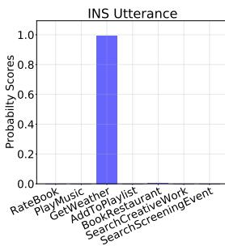
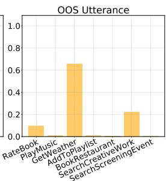
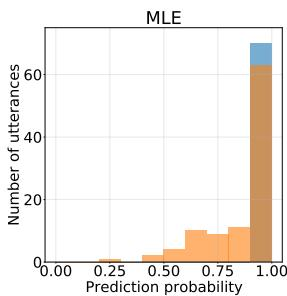
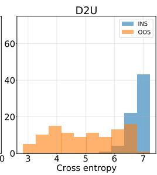
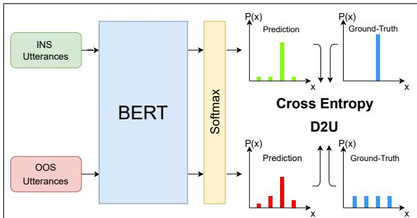
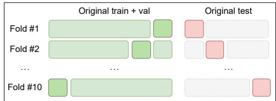
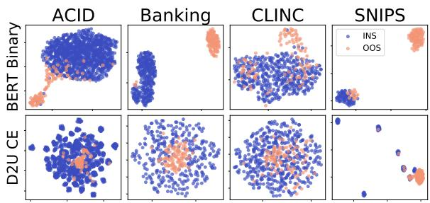
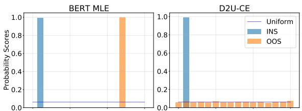

# D2U: Distance-to-Uniform Learning for Out-of-Scope Detection

Eyup Halit Yilmaz and Cagri Toraman

Aselsan Research Center

Ankara, Turkey

{ehyilmaz,ctoraman}@aselsan.com.tr

## Abstract

Supervised training with cross-entropy loss implicitly forces models to produce probability distributions that follow a discrete delta distribution. Model predictions in test time are expected to be similar to delta distributions if the classifier determines the class of an input correctly. However, the shape of the predicted probability distribution can become similar to the uniform distribution when the model cannot infer properly. We exploit this observation for detecting out-of-scope (OOS) utterances in conversational systems. Specifically, we propose a zero-shot post-processing step, called Distance-to-Uniform (D2U), exploiting not only the classification confidence score, but the shape of the entire output distribution. We later combine it with a learning procedure that uses D2U for loss calculation in the supervised setup. We conduct experiments using six publicly available datasets. Experimental results show that the performance of OOS detection is improved with our post-processing when there is no OOS training data, as well as with D2U learning procedure when OOS training data is available.

## 1 Introduction

Automated conversational systems have recently received attention from the research community (Dopierre et al., 2021; Mehri et al., 2020; Qin et al., 2021). In applications such as voice assistants, Spoken Language Understanding (Young et al., 2013) aims to extract meaning from the user inputs, called utterances, in order to process and execute desired functionalities. The task of Intent Detection, or Intent Classification, aims to classify user utterance into a set of system-identifiable intents. However, supervised training of such systems can only cover a restricted set of classes, i.e. in-scope (INS) classes. To enhance user experience, the task of Out-of-Scope (OOS) detection (Lin and Xu, 2019a; Xu et al., 2021; Zhan et al., 2021; Shen et al., 2021)

  
Figure 1: Sample output distributions of an INS classifier predicting the intent of an INS and OOS utterance. Since OOS utterances do not belong to any intent, the prediction gets closer to the uniform distribution.

distinguishes INS utterances from those that do not belong to the scope of the classifier with dedicated model architectures and loss functions.

Existing methods in OOS detection utilize the classifier confidence score for a given utterance with thresholding to classify highly confident predictions as INS and lower confidence predictions as OOS. However, softmax classifiers suffer from overconfident predictions for OOS data (Hendrycks and Gimpel, 2017), which makes it difficult to accurately determine a threshold value. Confidence loss (Lee et al., 2018) mitigates this by calculating the KL Divergence between model prediction and the uniform distribution to decrease the confidence for OOS input. We adapt a similar idea to the zero-shot setup with a novel post-processing step and exploit it jointly in the supervised setup with a learning procedure. The joint application of supervised D2U learning and D2U post-processing forms a novel OOS detection pipeline.

Figure 1 illustrates output probability distributions of a classifier for predicting the intent class for an INS and OOS utterance. The classifier, trained only on INS utterances, is confused when OOS utterance is given. The model assigns closer probabilities for different classes since there is no correct class for this OOS utterance, hence the resulting distribution gets closer to a uniform distribution than a discrete delta distribution.

  
Figure 2: The histogram of prediction probability scores for INS and OOS utterances (MLE) by using a classifier trained on only INS utterances at the left. Instead of MLE, for the same classifier, cross-entropy score between prediction distribution and uniform distribution (D2U) is given at the right. A vertical decision boundary is more accurately determined with D2U.

Based on this observation, we propose to measure the dissimilarity from or distance to the uniform distribution (D2U). Statistical distance calculations between the prediction and uniform distribution enable the decision boundary to be more accurate. Figure 2 illustrates possible benefits of using distance to the uniform distribution with crossentropy. The subplot at the left shows the distribution of the number of utterances according to their Maximum Likelihood Estimate (MLE) score. The subplot at the right shows the same distribution according to cross-entropy score between prediction probability and uniform distribution. A decision boundary or threshold can be easily determined using D2U’s cross-entropy as a post-processing step without any OOS training data.

When OOS training data is available (Larson et al., 2019), D2U can be used as a loss function to minimize the distance between OOS predictions and the uniform distribution. Such a loss function forces OOS predictions to be less confident, and benefit D2U post-processing further. To test our hypothesis that D2U is a useful method for OOS detection, we answer following research questions:

• RQ1: Does the application of D2U as a postprocessing step on INS classifier predictions increase OOS detection performance when there is no OOS training data?

• RQ2: Does incorporating D2U into the training procedure as a particular loss function boost performance when OOS training data is available?

• RQ3: Is the performance of OOS detection significantly improved by D2U over existing stateof-the-art methods?

## 2 Related Work

We divide OOS detection studies into three categories: (i) Confidence-based, (ii) representationbased, and (iii) distance-based methods.

## 2.1 Confidence-based OOS detection

Threshold-based Methods Thresholding is a common approach in OOS detection (Larson et al., 2019; Feng et al., 2020; Zhang et al., 2020), which reflects the intuition that a classifier output is more confident for a sample that follows its training distribution. The overconfidence problem of softmax classifiers (Hendrycks and Gimpel, 2017), although less apparent in Transformer-based (Vaswani et al., 2017) models (Hendrycks et al., 2020), hinders threshold-based OOS detection performance.

Post-processing Methods The overconfidence problem of softmax classifiers is tackled by postprocessing predictions. ODIN (Liang et al., 2018) and SofterMax (Lin and Xu, 2019b) apply temperature scaling for enlarging the confidence gap between INS and OOS instances, since INS logits are ideally further away on the positive axis of the softmax input. Gangal et al. (2020) utilize likelihood ratios with generative classifiers to distinguish OOS predictions. Our method, D2U, employs a confidence-based post-processing method.

## 2.2 Representation-based OOS detection

Dedicated model architectures or loss functions help represent utterances in a high-dimensional space suitable for OOS detection. Large Margin Cosine Loss (LMCL) ensures that INS intents are tightly clustered (Zeng et al., 2021a), so that OOS utterances are exposed for outlier detection algorithms, such as Local Outlier Factor (Lin and Xu, 2019a). Intent class embeddings (Cavalin et al., 2020) model OOS detection as a reverse dictionary task by mapping intent classes and utterances to the same space. Yilmaz and Toraman (2020) propose a feature representation mechanism that uses KL Divergence to capture the changes in model predictions during sequential processing of utterances.

In order to mitigate data scarcity, Marek et al. (2021) propose a method to generate OOS data with Generative Adversarial Networks. GANs are also utilized to generate high-dimensional representations that are hard to distinguish from that of real utterances, providing adversarial signals to the INS classifier which increases the robustness of the model (Zeng et al., 2021b; Liang et al., 2021).

## 2.3 Distance-based OOS detection

Distances and divergences are useful tools in OOS detection, since they provide a measure of dissimilarity that can distinguish INS and OOS samples. Xu et al. (2020) utilize Euclidean and Mahalanobis distances with generative classifiers to identify outliers with Gaussian Discriminative Analysis. Mahalanobis distance calculated using representations from the intermediate layers of BERT (Devlin et al., 2019) increases OOS detection performance (Shen et al., 2021). Lee et al. (2018) introduce the confidence loss in Computer Vision for GANs that calculates KL Divergence between the training predictions for OOS samples and uniform distribution.

The idea of measuring the distance between prediction distribution and uniform distribution is utilized in different learning architectures (Lee et al., 2018; Gangal et al., 2020), but not extensively studied for OOS intent detection. Besides, we explore various distance metrics in zero-shot OOS detection and different distance-to-uniform training procedures in supervised setup.

## 3 Distance-to-Uniform OOS Detection

## 3.1 D2U post-processing for zero-shot setup

Supervised classifiers trained on INS data model the ground truth labels with a discrete delta function that corresponds to the label, given as follows.

$$
\delta _ { c _ { i } } ( x ) = { \left\{ \begin{array} { l l } { 1 , } & { { \mathrm { i f ~ } } x = c _ { i } } \\ { 0 , } & { { \mathrm { o t h e r w i s e } } } \end{array} \right. }\tag{1}
$$

For the data instance $i , c _ { i }$ is the ground-truth label indicating the correct class. The cross-entropy loss between softmax model output and discrete delta function is given as follows.

$$
L _ { C E } = - \frac { 1 } { N } \sum _ { i = 1 } ^ { N } \delta _ { c _ { i } } ( x ) \log \hat { P } ( u _ { i } )\tag{2}
$$

Here, $\hat { P } ( u _ { i } )$ is the output probability distribution of the model for utterance $u _ { i }$ in a batch of $N$ utterances, and $c _ { i }$ is the correct class label for the given utterance. This criterion implicitly forces the model to generate confident predictions for a given data point with maximal confidence score assigned to the ground-truth class label, and low prediction scores for the other classes. When an OOS utterance is given to an intent classifier that is trained using only INS data, the classifier gets confused, i.e., the output probability distribution is more dissimilar to a delta distribution than what an INS utterance would result in. In other words, output distributions of OOS samples get closer to the uniform distribution than that of INS samples, an observation that we exploit for OOS detection.

The conventional methods for OOS detection make use of a pre-determined threshold value on the Maximum Likelihood Estimate (MLE) score assigned to the predicted label, given as follows.

$$
O O S ( u _ { i } ) = \left\{ \begin{array} { l l } { 1 , } & { \mathrm { i f } m a x ( \hat { P } ( u _ { i } ) ) < \theta } \\ { 0 , } & { \mathrm { o t h e r w i s e } } \end{array} \right.\tag{3}
$$

Here, θ is a pre-defined threshold value between 0 and 1, and max $( \hat { P } ( u _ { i } ) )$ is the MLE score, which considers only the confidence and ignores the shape of the distribution. We exploit the information conveyed by the shape of the entire prediction distribution by first calculating a distance between the output distribution $\hat { P }$ and the uniform distribution $U$ before applying the threshold, given as follows.

$$
O O S ( u _ { i } ) = \left\{ \begin{array} { l l } { 1 , } & { \mathrm { i f } \ d s t ( \hat { P } ( u _ { i } ) , U ) < \theta } \\ { 0 , } & { \mathrm { o t h e r w i s e } } \end{array} \right.\tag{4}
$$

The distance determined by the $d s t ( . )$ function between $\hat { P } ( u _ { i } )$ and $U$ can be calculated with various distance metrics. We experiment with geometric distance calculations, such as Euclidean distance and Cosine distance; as well as statistical distance calculations, such as Jensen-Shannon distance and symmetrized Kullback-Leibler divergence. The distance value calculated by the $d s t ( . )$ function can be intuitively interpreted as the level of confidence of the model. When the distance value is low, the model is less confident and more confused, since the output distribution assigns closer scores for each class.

This is an architecture-agnostic zero-shot postprocessing step which can be generalized to any classification model trained with cross-entropy loss with no need for OOS training data. OOS detection in test time is achieved by a function of the prediction distribution given by D2U.

## 3.2 Distance metrics for post-processing

We examine a number of geometric and statistical distance measures listed as follows.

• Bray Curtis Distance (BC): For two probability distributions, u and $v ,$ the Bray Curtis distance is given as $\textstyle \sum _ { i } { \left| u _ { i } - v _ { i } \right| } / \sum _ { i } { \left| u _ { i } + v _ { i } \right| }$

  
Figure 3: The supervised learning architecture of D2U. INS utterances are learned with conventional crossentropy loss against true label distribution, while OOS loss is calculated against the uniform distribution.

• Canberra Distance (Cbr): Canberra distance between u and v is $\textstyle \sum _ { i } { \big ( } | u _ { i } - v _ { i } | / ( u _ { i } + v _ { i } ) { \big ) }$

• Cosine Distance (Cos): Derived from the Cosine similarity, the Cosine distance is formulated as $1 - ( u \cdot v / | | u | | _ { 2 } | | v | | _ { 2 } )$ where . 2 is the $L _ { 2 }$ norm.

• Euclidean Distance (Euc): The Euclidean distance between u and v is given as $| | u - v | | _ { 2 }$

• Hellinger Distance (Helng): The Hellinger distance between u and v is $| | { \sqrt { u } } - { \sqrt { v } } | | _ { 2 } / { \sqrt { 2 } }$

• Cross-Entropy (CE): Cross-Entropy is a measure of dissimilarity between distributions u and v given $\textstyle { \mathrm { a s } } - \sum _ { i } u _ { i }$ log vi.

• Symmetrized KL Divergence (KL): The symmetrized Kullback-Leibler divergence is given as $[ K L ( u , v ) + K L ( v , u ) ] / 2$ where $K L ( u , v ) =$ $\textstyle \sum _ { i } u _ { i } \log \left( u _ { i } / v _ { i } \right)$

• Jenshen Shannon Distance (JS): JS distance between u and v is $K L ( u , m ) / 2 + K L ( v , m ) / 2$ where m is the mean of two distributions.

## 3.3 D2U training for supervised setup

When OOS training data is available, we modify the fine-tuning procedure as in Figure 3, to increase the similarity between OOS prediction and uniform distribution. We use pretrained BERT (Devlin et al., 2019) as the classifier network. The loss function for INS utterances, $L _ { i n s }$ , is still cross-entropy between true label and prediction, given as follows.

$$
{ \cal L } _ { i n s } = - \frac { 1 } { N _ { i n s } } \sum _ { i = 1 } ^ { N _ { i n s } } \delta ( c _ { i } ) \log \hat { P } ( u _ { i } )\tag{5}
$$

For OOS utterances, the loss $L _ { o o s } .$ is calculated against the uniform distribution, given as follows.

$$
L _ { o o s } = \frac { 1 } { N _ { o o s } } \sum _ { i = 1 } ^ { N _ { o o s } } d s t ( \hat { P } ( u _ { i } ) , U )\tag{6}
$$

Table 1: The statistics of the datasets used in this study.
<table><tr><td colspan="5">ACID Banking CLINC HWU64 SNIPS TOP</td></tr><tr><td>INS</td><td></td><td></td><td>22,172 13,081 22,500 23,431 13,784 36,668</td><td></td><td></td></tr><tr><td>OOS</td><td>16,000</td><td></td><td></td><td>0 16,000 16,000 16,000 16,000 3,653</td><td></td></tr><tr><td>Total</td><td></td><td></td><td></td><td>38,172 29,081 38,500 39,431 29,784 40,321</td><td></td></tr><tr><td>Vocabulary 25,083</td><td></td><td>3 26,702 25,810</td><td></td><td>26,069 30,100 12,610</td><td></td></tr><tr><td>Avg. Len.</td><td>8.95</td><td>9.85</td><td>8.39</td><td>7.25 8.65 8.93</td><td></td></tr><tr><td>Classes</td><td>175</td><td>77</td><td>150</td><td>46</td><td>716</td></tr></table>

The total loss is the weighted average over a batch of utterances containing $N _ { i n s }$ number of INS utterances and $N _ { o o s }$ number of OOS utterances, given as follows.

$$
L _ { t o t a l } = \frac { N _ { i n s } L _ { i n s } + N _ { o o s } L _ { o o s } } { N _ { i n s } + N _ { o o s } }\tag{7}
$$

As the $d s t ( . )$ function in Equation 6, we experiment with differentiable functions; such as crossentropy, KL divergence, and Sinkhorn distance (Cuturi, 2013), named as D2U-CE, D2U-KL, and D2U-S, respectively. These functions treat the model output and ground truth as probability distributions and provide a differentiable measure. We do not modify the loss calculation for INS utterances so as not to affect the INS classification performance.

Note that this architecture does not model the OOS intent as a separate class. Therefore, postprocessing is applied as described in Section 3.1 in test time. Since the loss function incorporates D2U into training, the performance gain by the post-processing is expected to increase.

## 4 Experiments

## 4.1 Datasets

We use six publicly available intent classification datasets, some of which include labeled OOS data. We give the main statistics of the datasets in Table 1. CLINC (Larson et al., 2019) is a dataset with 150 INS intent classes targeting various domains with curated OOS data. We use the OOS split of CLINC to augment other existing intent detection datasets that do not include labeled OOS data; which are ACID (Acharya and Fung, 2020), Banking (Casanueva et al., 2020), HWU64 (Liu et al., 2019), and SNIPS (Coucke et al., 2018). We observe that HWU64 has many short and noisy utterances, we therefore remove any utterances with length less than or equal to three words.

TOP (Gupta et al., 2018) is an intent detection dataset that generalizes conventional intent labeling with semantic parsing. The intent labels follow a hierarchical structure with potentially many labels for an utterance. However, we take only root intent class label into account to be consistent with other datasets. The utterances with the intent labels "UNSUPPORTED" and "UNSUP-PORTED\_NAVIGATION" are treated as OOS.

The variety of the number of classes, average length (number of words), and vocabulary size provide a wide spectrum for understanding different OOS detection scenarios. For instance, TOP dataset can be considered a low resource setup since the number of OOS utterances is significantly lower than INS utterances.

## 4.2 Evaluation metrics

To assess the performance of OOS detection, we report the scores of Receiver Operating Curve Area Under Curve (ROC AUC), False Positive Rate at 90% OOS True Positive Rate (FPR90), and False Negative Rate at 90% OOS True Negative Rate (FNR90) using sklearn (Pedregosa et al., 2011). These metrics are independent of the threshold value used for decision boundary, providing a means of fair comparison. We also report weighted OOS Recall and weighted OOS F1 based on the threshold value that maximizes the Youden’s J statistic (Youden, 1950) on a validation set.

Compared to Precision, Recall is arguably a more critical performance metric for OOS detection; since Recall considers Type II error, meaning that OOS utterances are mislabeled as INS. In this case, the voice assistant would execute a task that the user does not intent to do. We argue that ROC is a more generic measure that considers the performances of varying thresholds, than Recall and F1 considering only a fixed threshold.

## 4.3 Baseline approaches

In the experiments, BERT (Devlin et al., 2019) with softmax layer is used as the classifier network. For RQ1, the baseline zero-shot post-processing approaches are listed below.

• MLE (Hendrycks and Gimpel, 2017; Hendrycks et al., 2020): The confidence score of a classifier trained only on INS data is used for thresholding.

• Softmax temperature scaling (Temp) (Liang et al., 2018; Lin and Xu, 2019b): As a modification to the MLE setup, the softmax input is applied a temperature value of 103.

• Standard deviation (Stdev): We use the stdev of the distribution before thresholding since OOS predictions would have lower standard deviation.

  
Figure 4: Modified leave-one-out 10-fold split strategy that complies with original splits. At each fold, only 10% of test data is included, while 90% of training data is retained and the remaining 10% is used as validation.

• Entropy (Ent) (Shen et al., 2021): The entropy of the prediction distribution, $H ( \hat { P } ( u _ { i } ) )$ , is calculated before applying the threshold, as follows.

$$
O O S ( u _ { i } ) = \left\{ \begin{array} { l l } { { 1 , } } & { { \mathrm { i f } \ H ( \hat { P } ( u _ { i } ) ) > \theta } } \\ { { 0 , } } & { { \mathrm { o t h e r w i s e } } } \end{array} \right.\tag{8}
$$

For RQ2, we use D2U zero-shot cross-entropy post-processing (D2U-zero) as the baseline method, since we examine any improvement in supervised setup over zero-shot. For RQ3, we compare supervised D2U with the following baselines.

• Large Margin Cosine Loss (LMCL) (Zeng et al., 2021b): Cosine distance among INS class centroids is increased up to a margin. We set the margin as 0.35, and scaling factor as 30.

• Domain Regularization Module (DRM) (Shen et al., 2021): DRM introduces domain logits for regularization during INS training. We slightly modify the design and apply sigmoid to domain logits before dividing the classification logits for training stability.

• BERT-Binary (Binary) (Devlin et al., 2019): The "bert-base-uncased" model fine-tuned as a binary classifier for OOS detection.

• Entropy Regularization (Reg.) (Zheng et al., 2020): Entropy of OOS predictions are maximized while minimizing INS training loss.

## 4.4 Experimental design

To avoid potential annotator-dependent effects as noted by Larson et al. (2019) and comply with the original splits, we modify 10-fold leave-one-out cross-validation as illustrated in Figure 4. The validation splits are used to find confidence threshold values for Recall and F1 calculations. We validate statistically significant differences in the average performances of 10-folds with the two-tailed paired t-test at a 95% interval with Bonferroni correction.

Table 2: RQ1: D2U-zero with various distance metrics vs. post-processing baselines in zero-shot setup. Row-wise best scores are given in bold. ( ) and ( ) indicate that higher and lower scores are better, respectively. " " indicates statistically significant differences with two-tailed paired t-test at a 95% interval (with Bonferroni correction $p <$ 0.0125) in pairwise comparison between D2U-zero and all baselines except the ones marked with " ".
<table><tr><td rowspan="2">Metric</td><td rowspan="2">Dataset</td><td colspan="4">Baselines</td><td colspan="8"></td></tr><tr><td>MLE 90.93</td><td>Temp 91.83o</td><td>Stdev 91.54</td><td>Ent 91.98</td><td>CE 92.01</td><td>BC 91.40</td><td>Cbr 90.18</td><td> $\mathrm { \Delta } _ { \mathrm { C o s } } ^ { \mathrm { D 2 U - z e r o } }$  91.54</td><td>92.08</td><td>Euc 91.54</td><td>KL 92.14•</td><td>Helng. 92.13</td></tr><tr><td>ROC AUC (↑)</td><td>ACID Banking CLINC HWU64 SNIPS TOP</td><td>94.92 95.34 79.29 95.45 74.23</td><td>96.15 96.16 80.46 96.20 73.23</td><td>95.88 95.52 79.95 95.50 74.26</td><td>96.66 95.90 80.90 95.70 74.19</td><td>97.03• 96.32 80.32 96.33 73.24</td><td>96.89 96.09 81.49. 95.61 74.32</td><td>96.09 96.26 80.49 95.83 74.36</td><td>95.88 95.52 79.95 95.50 74.26</td><td>96.99 96.24 81.16 95.86 74.18</td><td>95.88 95.52 79.95 95.50 74.26</td><td>96.91 96.20 80.92 96.15 73.25</td><td>96.97 96.25 81.05 96.04 73.76</td></tr><tr><td>FPR90 (↓)</td><td>ACID Banking CLINC HWU64 SNIPS TOP</td><td>25.00 13.30 9.30 58.90 10.40 51.38</td><td>22.10o 10.00 7.800 54.10 8.40 53.00</td><td>20.70o 11.30 9.30 55.70 10.30 51.38</td><td>19.850 7.85 8.00 48.12 10.71 66.65</td><td>21.40 7.30 7.50. 52.50 8.40 53.00</td><td>24.80 6.60 8.10 51.60 10.40 51.38</td><td>28.60 12.00 7.70 55.00 10.30 51.38</td><td>20.70 11.30 9.30 55.70 10.30 51.38</td><td>20.90 6.20 7.70 52.20 9.90 51.50</td><td>20.70 11.30 9.30 55.70 10.30 51.38</td><td>19.70● 6.30 7.80 52.60 8.60 53.00</td><td>20.70 6.10 7.60 51.90 8.70 51.75</td></tr><tr><td>FNR90 (↓)</td><td>ACID Banking CLINC HWU64 SNIPS TOP</td><td>27.30 14.36 11.80 51.97 11.14 67.88</td><td>25.67 10.49 9.160 52.26 9.29 69.05</td><td>26.22 11.37 11.60 51.75 11.14 67.89</td><td>19.70● 7.20 8.90 52.800 11.80 51.50</td><td>21.460 8.010 8.36 52.01 9.29 69.07</td><td>20.60o 8.790 8.11 47.14 11.14 67.89</td><td>26.70 13.68 7.56 47.01. 11.14 67.90</td><td>26.22 11.37 11.60 51.75 11.14 67.89</td><td>20.45o 7.880 7.98 48.63 10.71 68.17</td><td>26.22 11.37 11.60 51.75 11.14 67.89</td><td>21.38 7.690 8.67 51.03 9.71 69.04</td><td>20.750 7.790 8.31 49.57 10.29 68.46</td></tr></table>

Note that the test splits do not overlap in order to satisfy the independence criterion of t-test.

The experiments are designed with respect to our research questions (RQ 1-3). First, we finetune a BERT classifier (Devlin et al., 2019) using huggingface implementation (Wolf et al., 2019) for INS intent detection with cross-entropy loss, and apply different D2U post-processing methods for RQ1. Then, we fix the post-processing method, and examine the effect of supervised D2U training for RQ2. Lastly, we compare D2U with state-ofthe art baselines for RQ3 to assess the performance gain of our method.

## 4.5 Experimental results

RQ1: D2U in zero-shot setup. In Table 2, we report ROC AUC, FPR90, and FNR90 scores for different post-processing methods applied to a BERTbased INS classifier with no OOS training data. Our proposed method, D2U-zero, statistically significantly outperforms all baselines in all datasets with respect to ROC AUC score. Using crossentropy for D2U-zero has better performance in majority of cases, compared to other distance metrics. The reason for its success might be that crossentropy is the loss function used in the training procedure of the model. In terms of FPR90 and FNR90, D2U-zero does not always outperform all baselines. Though, the cases when baselines outperform are not statistically significant. This shows that the baseline methods can optimize FPR90 and FNR90 individually but cannot outperform D2U in terms of ROC which considers Type I and Type II errors simultaneously. Entropy (Shen et al., 2021) is a strong baseline that performs better than other baselines with respect to all performance metrics.

Table 3: RQ2: D2U training compared to zero-shot. " " indicates statistically significant differences with the two-tailed paired t-test at a 95% interval in pairwise comparison between D2U-zero and best supervised.
<table><tr><td></td><td>Data Method</td><td>ROC↑ FPR90↓</td><td>FNR90↓ REC↑ F1↑</td></tr><tr><td rowspan="3">ACID</td><td>D2U-zero 92.01</td><td>21.40 21.46</td><td>86.43 88.69</td></tr><tr><td>D2U-CE 96.75 D2U-KL 96.78 D2U-S 95.88</td><td>7.30● 7.96 7.90 7.76 8.80 9.54</td><td>95.98 95.55 96.31• 96.01● 93.18 93.78</td></tr><tr><td>D2U-zero 97.03</td><td>7.30 8.01</td><td>91.47 91.67</td></tr><tr><td rowspan="2">Bankking</td><td>D2U-CE 99.36● D2U-KL 99.25 D2U-S</td><td>1.00● 0.23● 1.70 0.39 2.00 2.12</td><td>96.66 96.55 97.47 97.42 95.90</td></tr><tr><td>98.79 D2U-zero 96.32 7.50</td><td>8.36</td><td>95.88 91.31 91.75</td></tr><tr><td rowspan="2">CNC</td><td>D2U-CE 97.48 5.10 D2U-KL 97.29 5.20</td><td>6.18 4.93• 3.90 5.36</td><td>93.27 92.84 93.33 92.91 94.53•</td></tr><tr><td>D2U-S 97.69• D2U-zero 80.32 52.50</td><td>52.01</td><td>94.53• 76.83 76.03•</td></tr><tr><td rowspan="2">HWU64</td><td>D2U-CE 87.37• 31.70 D2U-KL 87.19</td><td>37.05● 30.30 41.50</td><td>74.58 68.18 75.27 69.41</td></tr><tr><td>D2U-S 82.23 47.80 D2U-zero 96.33 8.40</td><td>49.10 9.29</td><td>74.28 68.30 88.35 88.43</td></tr><tr><td rowspan="2">SNIPS</td><td>D2U-CE 98.61 2.70 D2U-KL 99.16 1.60●</td><td>2.86 1.57.</td><td>89.47 89.52 88.59 88.64</td></tr><tr><td>D2U-S 98.39 2.80 D2U-zero 73.24</td><td>2.29 69.07</td><td>90.29 90.36 84.54 86.14</td></tr><tr><td rowspan="2">TOP</td><td>D2U-CE 97.42 6.25</td><td>53.00 4.03•</td><td>94.55 95.01</td></tr><tr><td>D2U-KL 97.50● 5.88● D2U-S 94.94 12.00</td><td>4.10 15.61</td><td>95.17. 95.51• 92.13 92.95</td></tr></table>

RQ2: D2U in supervised setup. Next, we report the effect of D2U training on OOS detection in Table 3. Since our concern here is to observe any improvement over zero-shot setup, we fix post-processing method as cross-entropy for all methods due to its performance in the previous experiment. The results show that using D2U as a loss function statistically significantly improves the performance of D2U-zero in almost all cases. KL divergence loss (D2U-KL) and Cross-Entropy loss (D2U-CE) are effective D2U methods in all datasets, except that Sinkhorn distance (D2U-S) is effective in CLINC dataset. The choice of loss function is a hyperparameter that can be tuned according to specific use cases and datasets.

Table 4: RQ3: D2U vs. OOS detection baselines. The bold score is the best. The underlined score is the best that baseline achieves when D2U outperforms, or vice versa. " " indicates statistically significant differences with the two-tailed paired t-test at a 95% interval (with Bonferroni correction $p < 0 . 0 0 7 1 )$ in pairwise comparisons between D2U and all baselines except the ones marked with " ". If baseline outperforms, " " indicates the difference (with Bonferroni correction $p < 0 . 0 1 6 7 )$ in pairwise comparisons between the baseline and our best version.
<table><tr><td rowspan="2">Train</td><td colspan="4">ACID ROC FPR</td><td rowspan="2"></td><td colspan="2">Banking ROC FPR FNR REC F1</td><td rowspan="2"></td><td colspan="4">CLINC ROC FPR FNR REC F1</td></tr><tr><td></td><td></td><td>FNR REC F1 67.984.9</td><td>87.5</td><td>|94.9</td><td>13.3 14.4 89.4</td><td>89.6</td><td>|95.3 9.3 </td><td>11.8 90.2</td><td>90.8</td></tr><tr><td>MLE (Hendrycks et al., 2020)|90.9 25.0 Temp. (Liang et al., 2018) Entropy (Shen et al., 2021) Binary (Devlin et al., 2019) LMCL (Zeng et al., 2021a) DRM (Šhen et al., 2021)</td><td>91.8 22.1 97.2 6.2 94.1 93.2</td><td>15.6 19.9</td><td>6.7 66.5 62.5</td><td>69.1 85.8 92.0 19.9 51.5 86.9 96.5 88.4 86.8</td><td>88.2 89.0 96.1 90.1 89.0 95.1</td><td>96.2 96.7 99.9 97.2 96.1 99.0</td><td>10.0 10.5 90.3 7.9 7.2 91.6 0.2 0.2 6.3 8.1 13.1 11.4 2.4 0.9</td><td>90.5 91.8 97.9 97.8 92.6 92.6 90.6 90.5 96.8 96.8</td><td>96.2 95.9 85.6 96.3 95.9 97.30 6.5</td><td>8.0 7.4 8.5</td><td>7.8 9.2 8.9 48.6 31.4 9.9 9.7</td><td>90.1 90.7 90.3 90.8 88.3 86.1 90.8 91.3 91.0 91.4</td></tr><tr><td>D2U-CE-CE (ours) D2U-KL-CE (ours) D2U-S-CE (ours)</td><td>96.8 95.9</td><td>|96.87.3 7.9 8.8</td><td>8.0 7.8 9.5</td><td>96.0 96.3 93.2</td><td>95.6 96.0 93.8</td><td>|99.4 99.3 98.8</td><td>1.0 0.2 1.7 0.4 2.3 2.1</td><td>96.7 97.5 95.9</td><td>96.6 97.4 95.9</td><td>|97.5 5.1 6.2 97.3 5.2 4.9 97.7● 3.9● 5.4</td><td></td><td>92.3 92.8 93.3 92.9 94.5• 94.5•</td></tr><tr><td>Train</td><td>MLE (Hendrycks et al., 2020)|79.3 58.9</td><td>ROC FPR FNR REC F1</td><td>HWU64</td><td>52.073.0</td><td>73.7</td><td>|95.5</td><td>SNIPS 10.4 11.1</td><td>ROC FPR FNR REC F1 88.30 88.40|74.2</td><td></td><td>ROC FPR FNR REC F1 51.4 67.984.9</td><td>TOP</td><td></td></tr><tr><td>Temp. (Liang et al., 2018) Entropy (Shen et al., 2021) Binary (Devlin et al., 2019) LMCL (Zeng et al., 2021a)</td><td>80.5 54.1 80.9 84.3 79.3</td><td>43.0 56.9</td><td>48.1 52.8 77.7 88.035.80 31.0 74.7 67.8</td><td>52.3 76.7 49.0 80.3● 80.2●</td><td>76.5 77.3 74.0</td><td>96.2 95.7 98.9。 85.2 93.6</td><td>8.4 9.3 10.7 11.8 1.70 2.0o 49.5 31.9 13.4 12.0</td><td>88.40 88.50 88.2088.30 86.2086.20 67.8</td><td>66.3</td><td>73.2 74.2 70.6 69.8 66.5</td><td>53.0 69.1 84.5 66.7 51.5 84.8 97.30 4.4● 5.80 97.0• 57.8</td><td>86.1 86.5 97.0● 66.3</td></tr><tr><td>DRM (Šhen et al., 2021) Reg. (Zheng et al., 2020) D2U-CE-CE (ours) D2U-KL-CE (ours)</td><td>87.4 31.7 37.1 74.6 87.2</td><td></td><td>83.4 46.5 45.2 74.0</td><td>50.3 73.4 30.3● 41.5</td><td>67.0 68.2 69.4</td><td>99.2● 1.6● 1.6● 88.6 88.6</td><td>98.60 2.50 2.70 |98.6 2.7 2.9</td><td>87.9087.90 88.40 88.50 89.5</td><td>77.0 89.5 97.5● 5.9 4.1 95.2</td><td>96.5 |97.4 6.3 4.0● 94.6</td><td>50.1 62.5 81.7 7.5 7.10 94.5</td><td>84.4 94.9 95.0</td></tr></table>

RQ3: D2U versus state-of-the-art. The performances of state-of-the-art baseline OOS detection models, regardless of zero-shot or supervised, and D2U methods are compared in Table 4, with extensive results reported in the Appendix. MLE, softmax temperature (Temp.), Entropy, LMCL, and DRM are zero-shot OOS detection setups, whereas entropy regularization (Reg.) and BERT-Binary (Binary) are supervised setups. D2U statistically significantly outperforms most baselines, although Binary is a strong baseline method that outperforms D2U in ACID and Banking datasets and challenges it in HWU64 and TOP, which is not statistically significant. The reason for this might be the prevalent domain difference between INS and OOS utterances in ACID, Banking and TOP datasets; which belong to the insurance, banking, and navigation applications, respectively. It causes a trivial detection for the BERT-based binary classifier. HWU64 contains generic utterances like queries and questions which may coincide with the OOS split and disturb the training process of D2U. The combination of D2U training and D2U post-processing demonstrates its advantage in CLINC where INS and OOS utterances span a wide spectrum.

## 5 Discussion

## 5.1 Domain analysis

To validate our hypothesis that domain-specific datasets provide an advantage to the Binary method, we apply UMAP (Becht et al., 2019) dimension reduction on the CLS embeddings of Binary and D2U CE models and plot them in Figure 5. It is apparent that the OOS utterances are separated from INS utterances when there is a clear domain difference as in ACID and Banking. However, when this separation becomes fuzzy, Binary fails to properly distinguish INS and OOS utterances as in CLINC. There is also an overlapping set of INS and OOS utterances in SNIPS for Binary.

In D2U-CE plots, the clusters of INS intents are easily identifiable since the model is trained for intent detection, however, OOS utterances do not form a separate cluster. We see that the training procedure does not necessarily enforce a clustering on the OOS embeddings since the model is trained to output a uniform distribution for OOS inputs. D2U achieves competitive performance even though there are overlapping embeddings of INS and OOS utterances, highlighting the importance of D2U post-processing in the supervised setup.

  
Figure 5: UMAP distributions of CLS embeddings.

## 5.2 Qualitative analysis

We provide a qualitative analysis on the effect of D2U training. We illustrate the model output distributions for INS utterance "get me to ritzville by 4 via the freeway." belonging to the "GET\_DIRECTIONS" intent, and the OOS utterance "how many skating rinks are available in the south pacific tomorrow at 10" taken from the TOP dataset in Figure 6. We observe that the OOS utterance results in an overconfident prediction in the BERT MLE model whereas the prediction distribution of D2U-CE is similar to uniform distribution.

## 5.3 INS performance

In Table 5, we analyze if OOS detection models deteriorate INS performance. MLE baseline does not modify the training procedure. The results show that INS classification performance is not dramatically deteriorated by the supervised models including D2U in SNIPS and TOP, whereas it is even improved in the remaining datasets. Although D2U’s INS performance is similar to other supervised models, D2U has better OOS performance than others, as observed in Table 4. The reason for the increase in INS detection performance could be the regularization signal provided by the OOS loss as observed by Shen et al. (2021). Note that this effect becomes more apparent when domain difference is prevalent (in ACID and Banking).

We do not include Binary, which has no capability of INS classification. Binary has a challenging OOS performance in Table 4, but D2U has advantage of showing state-of-the-art performances for both INS and OOS detection.

  
Figure 6: The effect of D2U on prediction distributions.

Table 5: Weighted F1 score for INS classification.
<table><tr><td rowspan="2">Method</td><td colspan="4">Datasets</td></tr><tr><td colspan="4">ACID Banking CLINC HWU64 SNIPS</td></tr><tr><td>MLE</td><td>80.74</td><td>84.91 95.67</td><td>81.97</td><td>98.14 98.60</td></tr><tr><td>LMCL</td><td>85.69</td><td>89.64 95.83</td><td>82.08 97.86</td><td>98.56</td></tr><tr><td>DRM</td><td>88.70 89.89</td><td>96.25</td><td>82.49 98.14</td><td>98.68</td></tr><tr><td>Reg.</td><td>86.60</td><td>91.22 96.38</td><td>82.55</td><td>97.43 98.32</td></tr><tr><td>D2U-CE</td><td>86.40</td><td>90.95 96.42</td><td>82.31</td><td>97.84 98.26</td></tr><tr><td>D2U-KL</td><td>86.26</td><td>90.69 96.22</td><td>82.72 98.01</td><td>98.29</td></tr><tr><td>D2U-S</td><td>86.50</td><td>91.52 96.34</td><td>82.16 97.43</td><td>98.37</td></tr></table>

## 5.4 Limitations

We acknowledge some limitations to our study. Except for CLINC and TOP, the datasets we use are augmented with the OOS data from CLINC. However, we argue that the majority of the data remains OOS for other datasets since it is sampled from Wikipedia (Larson et al., 2019). Moreover, D2U has effective performance on CLINC and TOP datasets which are designed with OOS utterances.

We leave the selection of the distance metric in post-processing and supervised learning as a hyperparameter of D2U. In the results, this might provide an advantage to D2U in comparisons since we do not apply hyperparameter tuning for baselines. However, we use default or suggested parameter settings for baselines. We adopt transparency in reporting the results that are also detailed in Appendix.

Zero-shot D2U post-processing emphasizes the distinction between INS and OOS utterances when confidence score becomes misleading. However, D2U struggles in the ultimate case where an OOS utterance is mapped to an INS class with \~100% confidence (see Figure 6 BERT MLE). Nonetheless, D2U suffers from such overconfident predictions less than existing methods (see Table 2).

## 5.5 Ethical considerations

We list a number of ethical concerns related to environmental impact, explainability, and transparency in this section. We employ BERT fine-tuning with small modifications, therefore the environmental impact can be considered small. Our work focuses on well-known OOS detection task with established use cases, therefore there would be no risk for unintended use. We use publicly available datasets with licences suitable for academic research.

To assure explainability and transparency, we report the length of utterances and domains of datasets in Section 4.1. We report the statistics of datasets and figuratively report the split strategy used in the experiments in Section 4.1. There are two setups in our study. The zero-shot setting does not include any training. In the supervised setup, the complexity of our method is quite similar to regular fine-tuning procedure of BERT. The thresholding hyperparameter is decided by maximizing the Youden’s J statistic as explained in Section 4.2. In Section 4.3, we also report the hyperparameters of the baseline methods. We employ a modified 10-fold cross-validation strategy as explained in Section 4.4 and apply t-test with Bonferroni correction to all experimental results.

## 6 Conclusion

We propose an OOS detection pipeline with a distance calculation between classifier prediction and uniform distribution, called D2U. In the zero-shot setup, D2U serves as an architecture-agnostic postprocessing step to emphasize the distinction between INS and OOS. In the supervised setup, we bring closer OOS predictions to uniform distribution with a modified loss function. Experimental results, supported by statistical tests, show that D2U outperforms existing baselines in zero-shot, and has challenging performance in the supervised setup. We plan to extend our study to different architectures and deep learning tasks in the future.

## References

Shailesh Acharya and Glenn Fung. 2020. Using optimal embeddings to learn new intents with few examples: An application in the insurance domain.

Etienne Becht, Leland McInnes, John Healy, Charles-Antoine Dutertre, Immanuel WH Kwok, Lai Guan Ng, Florent Ginhoux, and Evan W Newell. 2019. Dimensionality reduction for visualizing single-cell data using umap. Nature Biotechnology, 37(1):38– 44.

Iñigo Casanueva, Tadas Temcinas, Daniela Gerz, Matthew Henderson, and Ivan Vulic. 2020. Efficient intent detection with dual sentence en-

coders. In Proceedings of the 2nd Workshop on NLP for ConvAI - ACL 2020. Data available at https://github.com/PolyAI-LDN/taskspecific-datasets.

Paulo Cavalin, Victor Henrique Alves Ribeiro, Ana Appel, and Claudio Pinhanez. 2020. Improving out-ofscope detection in intent classification by using embeddings of the word graph space of the classes. In Proceedings of the 2020 Conference on Empirical Methods in Natural Language Processing (EMNLP), pages 3952–3961, Online. Association for Computational Linguistics.

Alice Coucke, Alaa Saade, Adrien Ball, Théodore Bluche, Alexandre Caulier, David Leroy, Clément Doumouro, Thibault Gisselbrecht, Francesco Caltagirone, Thibaut Lavril, et al. 2018. Snips voice platform: an embedded spoken language understanding system for private-by-design voice interfaces. arXiv preprint arXiv:1805.10190.

Marco Cuturi. 2013. Sinkhorn distances: Lightspeed computation of optimal transport. Advances in neural information processing systems, 26:2292–2300.

Jacob Devlin, Ming-Wei Chang, Kenton Lee, and Kristina Toutanova. 2019. Bert: Pre-training of deep bidirectional transformers for language understanding. In Proceedings ofthe 2019 Conference of the North American Chapter of the Association for Computational Linguistics: Human Language Technologies, Volume 1 (Long and Short Papers), pages 4171–4186.

Thomas Dopierre, Christophe Gravier, and Wilfried Logerais. 2021. ProtAugment: Intent detection meta-learning through unsupervised diverse paraphrasing. In Proceedings of the 59th Annual Meeting ofthe Associationfor Computational Linguistics and the 11th International Joint Conference on Natural Language Processing (Volume 1: Long Papers), pages 2454–2466, Online. Association for Computational Linguistics.

Yulan Feng, Shikib Mehri, Maxine Eskenazi, and Tiancheng Zhao. 2020. “none of the above”: Measure uncertainty in dialog response retrieval. In Proceedings of the 58th Annual Meeting of the Association for Computational Linguistics, pages 2013– 2020, Online. Association for Computational Linguistics.

Varun Gangal, Abhinav Arora, Arash Einolghozati, and Sonal Gupta. 2020. Likelihood ratios and generative classifiers for unsupervised out-of-domain detection in task oriented dialog. In Proceedings of the AAAI Conference on Artificial Intelligence, volume 34, pages 7764–7771.

Sonal Gupta, Rushin Shah, Mrinal Mohit, Anuj Kumar, and Mike Lewis. 2018. Semantic parsing for task oriented dialog using hierarchical representations. In Proceedings of the 2018 Conference on Empirical Methods in Natural Language Processing,

pages 2787–2792, Brussels, Belgium. Association for Computational Linguistics.

Dan Hendrycks and Kevin Gimpel. 2017. A baseline for detecting misclassified and out-of-distribution examples in neural networks. In 5th International Conference on Learning Representations, ICLR 2017, Toulon, France, April 24-26, 2017, Conference Track Proceedings.

Dan Hendrycks, Xiaoyuan Liu, Eric Wallace, Adam Dziedzic, Rishabh Krishnan, and Dawn Song. 2020. Pretrained transformers improve out-of-distribution robustness. In Proceedings of the 58th Annual Meeting of the Association for Computational Linguistics, pages 2744–2751.

Stefan Larson, Anish Mahendran, Joseph J Peper, Christopher Clarke, Andrew Lee, Parker Hill, Jonathan K Kummerfeld, Kevin Leach, Michael A Laurenzano, Lingjia Tang, et al. 2019. An evaluation dataset for intent classification and out-ofscope prediction. In Proceedings of the 2019 Conference on Empirical Methods in Natural Language Processing and the 9th International Joint Conference on Natural Language Processing (EMNLP-IJCNLP), pages 1311–1316.

Kimin Lee, Honglak Lee, Kibok Lee, and Jinwoo Shin. 2018. Training confidence-calibrated classifiers for detecting out-of-distribution samples. In International Conference on Learning Representations.

Chaojie Liang, Peijie Huang, Wenbin Lai, and Ziheng Ruan. 2021. Gan-based out-of-domain detection using both in-domain and out-of-domain samples. In ICASSP 2021-2021 IEEE International Conference on Acoustics, Speech and Signal Processing (ICASSP), pages 7663–7667. IEEE.

Shiyu Liang, Yixuan Li, and R Srikant. 2018. Enhancing the reliability of out-of-distribution image detection in neural networks. In 6th International Conference on Learning Representations, ICLR 2018.

Ting-En Lin and Hua Xu. 2019a. Deep unknown intent detection with margin loss. In Proceedings of the 57th Annual Meeting of the Association for Computational Linguistics, pages 5491–5496, Florence, Italy. Association for Computational Linguistics.

Ting-En Lin and Hua Xu. 2019b. A post-processing method for detecting unknown intent of dialogue system via pre-trained deep neural network classifier. Knowledge-Based Systems, 186:104979.

Xingkun Liu, Arash Eshghi, Pawel Swietojanski, and Verena Rieser. 2019. Benchmarking natural language understanding services for building conversational agents. In 10th International Workshop on Spoken Dialogue Systems Technology 2019.

Petr Marek, Vishal Ishwar Naik, Anuj Goyal, and Vincent Auvray. 2021. Oodgan: Generative adversarial

network for out-of-domain data generation. In Proceedings of the 2021 Conference of the North American Chapter of the Association for Computational Linguistics: Human Language Technologies: Industry Papers, pages 238–245.

Shikib Mehri, Mihail Eric, and Dilek Hakkani-Tur. 2020. Dialoglue: A natural language understanding benchmark for task-oriented dialogue. arXiv preprint arXiv:2009.13570.

F. Pedregosa, G. Varoquaux, A. Gramfort, V. Michel, B. Thirion, O. Grisel, M. Blondel, P. Prettenhofer, R. Weiss, V. Dubourg, J. Vanderplas, A. Passos, D. Cournapeau, M. Brucher, M. Perrot, and E. Duchesnay. 2011. Scikit-learn: Machine learning in Python. Journal of Machine Learning Research, 12:2825–2830.

Libo Qin, Fuxuan Wei, Tianbao Xie, Xiao Xu, Wanxiang Che, and Ting Liu. 2021. GL-GIN: Fast and accurate non-autoregressive model for joint multiple intent detection and slot filling. In Proceedings of the 59th Annual Meeting of the Association for Computational Linguistics and the 11th International Joint Conference on Natural Language Processing (Volume 1: Long Papers), pages 178–188, Online. Association for Computational Linguistics.

Yilin Shen, Yen-Chang Hsu, Avik Ray, and Hongxia Jin. 2021. Enhancing the generalization for intent classification and out-of-domain detection in SLU. In Proceedings of the 59th Annual Meeting of the Association for Computational Linguistics and the 11th International Joint Conference on Natural Language Processing (Volume 1: Long Papers), pages 2443–2453, Online. Association for Computational Linguistics.

Ashish Vaswani, Noam Shazeer, Niki Parmar, Jakob Uszkoreit, Llion Jones, Aidan N Gomez, Łukasz Kaiser, and Illia Polosukhin. 2017. Attention is all you need. In Advances in neural information processing systems, pages 5998–6008.

Thomas Wolf, Lysandre Debut, Victor Sanh, Julien Chaumond, Clement Delangue, Anthony Moi, Pierric Cistac, Tim Rault, Rémi Louf, Morgan Funtowicz, et al. 2019. Huggingface’s transformers: State-of-the-art natural language processing. arXiv preprint arXiv:1910.03771.

Hong Xu, Keqing He, Yuanmeng Yan, Sihong Liu, Zijun Liu, and Weiran Xu. 2020. A deep generative distance-based classifier for out-of-domain detection with mahalanobis space. In Proceedings of the 28th International Conference on Computational Linguistics, pages 1452–1460.

Keyang Xu, Tongzheng Ren, Shikun Zhang, Yihao Feng, and Caiming Xiong. 2021. Unsupervised out-of-domain detection via pre-trained transformers. In Proceedings of the 59th Annual Meeting of the Association for Computational Linguistics and the 11th International Joint Conference on Natural Language Processing (Volume 1: Long Papers),

pages 1052–1061, Online. Association for Computational Linguistics.

Eyup Halit Yilmaz and Cagri Toraman. 2020. KLOOS: KL Divergence-Based Out-of-Scope Intent Detection in Human-to-Machine Conversations, page 2105–2108. Association for Computing Machinery, New York, NY, USA.

WJ Youden. 1950. Index for rating diagnostic tests. Cancer, 3(1):32–35.

Steve Young, Milica Gašic, Blaise Thomson, and Ja-´ son D Williams. 2013. Pomdp-based statistical spoken dialog systems: A review. Proceedings of the IEEE, 101(5):1160–1179.

Zhiyuan Zeng, Keqing He, Yuanmeng Yan, Zijun Liu, Yanan Wu, Hong Xu, Huixing Jiang, and Weiran Xu. 2021a. Modeling discriminative representations for out-of-domain detection with supervised contrastive learning. In Proceedings of the 59th Annual Meeting of the Association for Computational Linguistics and the 11th International Joint Conference on Natural Language Processing (Volume 2: Short Papers), pages 870–878, Online. Association for Computational Linguistics.

Zhiyuan Zeng, Keqing He, Yuanmeng Yan, Hong Xu, and Weiran Xu. 2021b. Adversarial self-supervised learning for out-of-domain detection. In Proceedings of the 2021 Conference of the North American Chapter of the Association for Computational Linguistics: Human Language Technologies, pages 5631–5639.

Li-Ming Zhan, Haowen Liang, Bo Liu, Lu Fan, Xiao-Ming Wu, and Albert Y.S. Lam. 2021. Out-of-scope intent detection with self-supervision and discriminative training. In Proceedings of the 59th Annual Meeting of the Association for Computational Linguistics and the 11th International Joint Conference on Natural Language Processing (Volume 1: Long Papers), pages 3521–3532, Online. Association for Computational Linguistics.

Jianguo Zhang, Kazuma Hashimoto, Wenhao Liu, Chien-Sheng Wu, Yao Wan, S Yu Philip, Richard Socher, and Caiming Xiong. 2020. Discriminative nearest neighbor few-shot intent detection by transferring natural language inference. In Proceedings of the 2020 Conference on Empirical Methods in Natural Language Processing (EMNLP), pages 5064–5082.

Yinhe Zheng, Guanyi Chen, and Minlie Huang. 2020. Out-of-domain detection for natural language understanding in dialog systems. IEEE/ACM Transactions on Audio, Speech, and Language Processing, 28:1198–1209.

## A Appendix

We report Receiver Operating Curve Area Under Curve, False Positive Rate at 90% OOS True Positive Rate, False Negative Rate at 90% OOS True

Negative Rate, weighted OOS Recall, and weighted OOS F1 scores in Tables 6, 7, 8, 9, 10 respectively. Different training procedures, baseline and proposed, are reported in rows and different postprocessing methods, baseline and proposed, are reported in columns.

Baseline training methods are BERT-based inscope classifier (MLE) (Larson et al., 2019; Devlin et al., 2019), Large Margin Cosine Loss (LMCL) (Zeng et al., 2021a), Domain Regularization Module (DRM) (Shen et al., 2021), entropy regularization (Reg.) (Zheng et al., 2020), and BERTbinary classifier (Binary) (Devlin et al., 2019). Postprocessing methods are not applicable for Binary training since it models OOS detection as a binary classification problem. Baseline post-processing methods are Maximum Likelihood Estimate (MLE) (Gangal et al., 2020; Zhang et al., 2020), softmax temperature (Temp) (Liang et al., 2018; Lin and Xu, 2019b), standard deviation (Stdev), and entropy (Ent) (Shen et al., 2021).

Table 6: Average ROC AUC score of 10-Fold binary OOS Detection. Row-wise highest scores are given in bold.
<table><tr><td>Data</td><td>Training</td><td>MLE Temp</td><td>Stdev</td><td>Ent CE</td><td>BC</td><td>Cbr</td><td>Cos</td><td>JS</td><td>Euc</td><td>KL Helng.</td></tr><tr><td rowspan="4">ACID</td><td>MLE</td><td>90.93 91.83 94.05 94.07 92.43 96.56</td><td>91.54 91.98 94.23 94.04</td><td>|92.01 93.72 91.70 97.06</td><td>91.40 89.31 94.07</td><td>90.18 85.54</td><td>91.54 94.23</td><td>92.08 91.54 93.88 94.23</td><td>92.14 93.91</td><td>92.13 93.89</td></tr><tr><td>LMCL DRM Reg. Binary</td><td>93.23 95.98 97.19</td><td>93.54 96.15</td><td>93.95 96.50</td><td>96.82</td><td>93.67 97.10</td><td>93.54 96.15</td><td>94.00 93.54 96.84 96.15</td><td>92.92 96.75</td><td>93.85 96.81</td></tr><tr><td>D2U-CE D2U-KL D2U-S</td><td>95.63 95.47 94.46</td><td>96.22 95.85 96.25 95.65</td><td>96.17 96.06</td><td>96.75 96.43 96.78 96.47</td><td>96.72 96.77</td><td>95.85 95.65</td><td>96.47 96.49</td><td>95.85 95.65</td><td>96.42 96.46 96.37 96.45</td></tr><tr><td>MLE LMCL DRM Reg.</td><td>94.92 97.19 96.12 98.95</td><td>95.14 94.80 96.15 95.88 97.20 97.32 96.97 96.70</td><td>95.24 96.66 97.15 97.47</td><td>95.88 95.55 97.03 96.89 96.88 94.07</td><td>95.61 96.09 91.61</td><td>94.80 95.88 97.32</td><td>95.63 94.80 96.99 95.88 97.01 97.32</td><td>95.54 96.91 97.04</td><td>95.61 96.97 97.03 97.88</td></tr><tr><td>Banking</td><td>Binary D2U-CE D2U-KL D2U-S MLE</td><td>99.12 99.88 99.07 99.28 98.99 99.19 97.83 98.53 95.34 96.16</td><td>99.03 99.14 99.07 98.12 95.52</td><td>96.56 99.13 99.19 99.24 99.36 99.15 99.25 98.43 98.79</td><td>98.06 99.16 99.26 99.19 98.61</td><td>97.93 99.18 99.03 99.29 99.22 98.65</td><td>96.70 97.97 99.18 99.14 99.28 99.07 99.22 98.12 98.65</td><td>96.70 99.03 99.14 99.07 98.12</td><td>97.28 99.16 99.17 99.29 99.29 99.22 99.22 98.63 98.64</td></tr><tr><td>CLINC</td><td>LMCL DRM Reg. Binary D2U-CE D2U-KL</td><td>96.31 96.30 95.85 94.47 97.29 97.63 85.57 97.08 97.47 96.86 97.29</td><td>96.30 96.00 97.31 97.14 96.90</td><td>95.90 |96.32 96.14 95.81 96.19 93.78 97.47 97.58 97.30 97.48 97.04 97.29</td><td>96.09 96.26 92.51 86.08 96.29 95.73 97.52 97.55 97.27 97.31 97.07 97.12</td><td>95.52 96.30 96.00 97. 7.31 97.14 96.90</td><td>96.24 95.52 95.95 96.30 95.88 96.00 97.62 97.31 97.42 97.14 97.20 96.90</td><td>96.20 96.02 95.07 97.65 97.48 97.26</td><td>96.25 95.99 95.63 97.64 97.45 97.23</td></tr><tr><td>HWU64 D2U-CE</td><td>D2U-S MLE LMCL DRM Reg. Binary</td><td>96.71 79.29 84.28 79.32 83.38 88.02</td><td>97.54 96.85 80.46 79.95 84.37 84.98 79.05 80.00 86.34 84.19</td><td>97.15 97.69 80.90 |80.32 85.17 85.33 80.67 78.68 85.68 87.05</td><td>97.22 81.49 84.04 81.55 86.78</td><td>97.33 80.49 82.50 80.50 87.22</td><td>96.85 97.42 79.95 81.16 84.98 85.28 80.00 80.75 84.19 86.70</td><td>96.85 97.53 79.95 80.92 84.98 85.27 80.00 79.66 84.19 86.51</td><td>97.48 81.05 85.27 80.31 86.62</td></tr><tr><td>SNIPS</td><td>D2U-KL D2U-S MLE LMCL DRM Reg. Binary D2U-CE D2U-KL</td><td>83.64 86.58 83.46 86.44 79.67 81.74 95.45 96.20 85.18 87.54 93.58 94.47 98.61 98.74 98.91 98.51 98.60</td><td>84.42 84.14 80.42 95.50 88.20 93.63 98.61 98.52</td><td>85.80 87.37 85.50 87.19 81.69 82.23 95.70 |96.33 90.45 93.15 93.82 94.58 98.64 98.76</td><td>87.09 86.71 82.86 95.61 89.91 93.75 98.62</td><td>87.60 87.27 82.57 95.83 93.08 93.95 98.63</td><td>84.42 86.98 84.14 86.64 80.42 82.41 95.50 95.86 88.20 91.69 93.63 93.98 98.61 98.65</td><td>84.42 84.14 80.42 95.50 88.20 93.63 98.61</td><td>86.77 86.89 86.54 86.62 82.13 82.27 96.15 96.04 91.87 91.76 94.43 94.13 98.73 98.67</td></tr><tr><td></td><td>D2U-S MLE LMCL DRM</td><td>98.97 99.15 98.24 98.37 74.23 73.23 70.62 70.11 76.59</td><td>98.99 98.25 74.26 70.72</td><td>98.53 98.61 99.01 99.16 98.30 98.39 74.19 73.24 70.88 70.11</td><td>98.52 98.99 98.29 74.32</td><td>98.54 98.52 99.02 98.99 98.32 98.25 74.36 74.26</td><td>98.54 99.04 98.32</td><td>98.52 98.99 98.25</td><td>98.60 98.56 99.14 99.09 98.37 98.34 73.25</td></tr><tr><td></td><td>D2U-CE D2U-KL D2U-S</td><td>97.29 97.30 97.42 97.39 97.50 94.68 94.94</td><td>97.30 97.41 94.71</td><td>96.47 97.33 97.42 97.43 97.50 94.76 94.94</td><td>96.45 97.31 97.42 94.75</td><td>96.47 96.45 97.34 97.30 97.43 97.41 94.78 94.71</td><td>94.80 94.71</td><td>76.60 96.56 97.41 97.49 94.92</td><td>76.83 96.52 97.38 97.46 94.87</td></tr><tr><td>TOP</td><td>Reg. Binary</td><td>76.97 96.45 96.57</td><td>76.99 96.45</td><td>76.96 76.61 96.57</td><td>70.58 71.29 77.06 77.13</td><td>70.72 76.99</td><td>74.18 70.95 76.98 96.49 97.35 97.44</td><td>74.26 70.72 70.43 76.99 96.45 97.30 97.41</td><td>73.76 70.70</td></tr></table>

Table 7: Average FPR90 score of 10-Fold binary OOS Detection. Row-wise lowest scores are given in bold.
<table><tr><td>Data</td><td>Training</td><td>MLE</td><td>Temp</td><td>Stdev</td><td>Ent</td><td>CE</td><td>BC</td><td>Cbr</td><td>Cos</td><td>JS</td><td>Euc</td><td>KL</td><td>Helng.</td></tr><tr><td rowspan="3">ACID</td><td>MLE LMCL DRM</td><td>25.00 15.60 19.90 10.30 6.17</td><td>22.10 15.50 20.80</td><td>20.70 14.80 18.40 9.70</td><td>19.85 13.83 13.51 8.41</td><td>|21.40 17.40 24.80 7.20</td><td>24.80 37.10 14.40 7.40</td><td>28.60 46.20 16.30</td><td>20.70 14.80 18.40</td><td>20.90 16.50 15.00</td><td>20.70 14.80 18.40</td><td>19.70 16.50 18.80</td><td>20.70 16.50 15.30 7.60</td></tr><tr><td>Reg. Binary D2U-CE D2U-KL D2U-S</td><td>10.30 10.70 11.90</td><td>8.60 8.20 8.90</td><td>9.40 9.90</td><td>8.54 7.56</td><td>7.30 7.90</td><td>7.50 8.00</td><td>7.10 7.40 7.80</td><td>9.70 9.40 9.90</td><td>7.50 7.20 8.10</td><td>9.70 9.40 9.90</td><td>8.20 7.70 8.10</td><td>7.30 8.10</td></tr><tr><td>MLE LMCL DRM Reg. Banking</td><td>13.30 6.30 13.10 2.40</td><td>10.30 10.00 6.20 8.40 1.80</td><td>11.00 11.30 5.50 10.20 2.20</td><td>9.57 7.85 7.00 6.06 0.36</td><td>8.80 7.30 7.10 9.20 1.60</td><td>9.00 6.60 19.40 4.60 1.60</td><td>9.30 12.00 25.80 4.90 1.40</td><td>11.00 11.30 5.50 10.20 2.20</td><td>9.10 6.20 6.80 5.20</td><td>11.00 11.30 5.50 10.20</td><td>9.40 6.30 6.80 7.30</td><td>9.30 6.10 6.80 5.30</td></tr><tr><td rowspan="2"></td><td>Binary D2U-CE D2U-KL D2U-S</td><td>0.16 2.40 2.70 5.80</td><td>1.60 1.60 3.70</td><td>2.10 2.50 5.20</td><td>0.23 0.39 2.25</td><td>1.00 1.70</td><td>1.00 1.70 2.60</td><td>1.00 1.60</td><td>2.10 2.50</td><td>1.70 1.00 1.70</td><td>2.20 2.10 2.50</td><td>1.60 1.00 1.80</td><td>1.70 1.00 1.70</td></tr><tr><td>MLE LMCL DRM Reg.</td><td>9.30 7.40 8.50</td><td>7.80 7.30 11.80</td><td>9.30 7.60 8.50</td><td>8.00 8.51 7.64</td><td>2.00 7.50 8.60 13.70</td><td>8.10 18.30 7.80</td><td>1.90 7.70 35.40 9.50</td><td>5.20 9.30 7.60 8.50</td><td>2.60 7.70 8.40 8.30</td><td>5.20 9.30 7.60 8.50</td><td>3.40 7.80 8.50 9.40</td><td>2.80 7.60 8.40 8.20</td></tr><tr><td rowspan="2">CLINC</td><td>Binary D2U-CE D2U-KL</td><td>6.50 48.58 6.70 6.50</td><td>5.10 5.40 5.50</td><td>6.60 6.70 6.50</td><td>5.13 5.62 4.89</td><td>5.10 5.10 5.20</td><td>4.80 5.90 5.90</td><td>4.90 5.40 5.80</td><td>6.60 6.70 6.50</td><td>5.00 5.50 5.70</td><td>6.60 6.70 6.50</td><td>5.10 5.50</td><td>5.20 5.60 5.70</td></tr><tr><td>D2U-S MLE LMCL DRM</td><td>7.10 58.90 43.00 56.90</td><td>4.50 54.10 42.90</td><td>7.10 55.70 38.10</td><td>6.38 48.12 41.84</td><td>3.90 |52.50 37.30</td><td>4.80 51.60 41.70</td><td>4.60 55.00 44.90</td><td>7.10 55.70 38.10</td><td>4.60 52.20 37.50</td><td>7.10 55.70 38.10</td><td>5.60 4.80 52.60 37.10</td><td>4.50 51.90 37.30</td></tr><tr><td>HWU64</td><td>Reg. Binary D2U-CE D2U-KL</td><td>46.50 35.77 44.90 43.80</td><td>51.10 32.70 35.10 33.70</td><td>53.00 41.20 40.80 39.90</td><td>49.62 41.84 40.43 42.48</td><td>54.30 29.60 |31.70 30.30</td><td>52.40 31.30 31.70 31.50</td><td>53.00 29.60 30.60 31.10</td><td>53.00 41.20 40.80 39.90</td><td>50.80 31.80 32.50 33.00</td><td>53.00 41.20 40.80 39.90</td><td>51.50 32.60 33.50 33.30</td><td>51.40 32.10 33.10 33.10</td></tr><tr><td rowspan="2">SNIPS</td><td>D2U-S MLE LMCL DRM</td><td>57.60 10.40 49.50 13.40</td><td>48.10 8.40 41.90 10.20</td><td>53.00 10.30 36.70 13.40</td><td>46.84 10.71 29.86 10.86</td><td>47.80 8.40 21.10 10.20</td><td>47.40 10.40 30.10 13.40</td><td>48.50 10.30 16.40 13.30</td><td>53.00 10.30 36.70 13.40</td><td>47.30 9.90 24.10 12.40</td><td>53.00 10.30 36.70 13.40</td><td>48.10 8.60 24.10 10.40</td><td>47.60 8.70 24.10 11.50</td></tr><tr><td>Reg. Binary D2U-CE D2U-KL D2U-S</td><td>2.50 1.71 2.70 2.10 2.90</td><td>2.20 2.70 1.60 2.80</td><td>2.50 2.70 2.10 2.90</td><td>2.29 3.14 2.14 3.00</td><td>2.20 2.70 1.60</td><td>2.50 2.70 2.10 2.90</td><td>2.50 2.70 2.10 2.90</td><td>2.50 2.70 2.10 2.90</td><td>2.40 2.70 1.90 2.80</td><td>2.50 2.70 2.10 2.90</td><td>2.20 2.70 1.60 2.80</td><td>2.30 2.70 1.60 2.70</td></tr><tr><td rowspan="4">TOP</td><td>MLE LMCL DRM Reg. Binary D2U-CE</td><td>51.38 69.75 50.13 7.50</td><td>53.00 70.13 51.88 7.25</td><td>51.38 69.50 50.13 7.50</td><td>66.65 65.06 59.79 4.90</td><td>2.80 |53.00 70.75 51.88 7.25</td><td>51.38 70.63 50.13 7.50</td><td>51.38 71.50 50.13 7.50</td><td>51.38 69.50 50.13 7.50</td><td>51.50 70.50 50.88 7.50</td><td>51.38 50.13 7.50</td><td>53.00 69.50 70.25 51.63 7.25</td><td>51.75 70.25 50.63 7.25</td></tr><tr><td>D2U-KL D2U-S</td><td>4.43 6.13 6.25 11.63</td><td>6.25 5.88 11.88</td><td>6.13 6.25 11.63</td><td>4.04 3.57 12.94</td><td>6.25 5.88 12.00</td><td>6.13 6.25 11.63</td><td>6.13 6.38 11.50</td><td>6.13 6.25 11.63</td><td>6.13 6.25 11.63</td><td>6.13 6.25 11.63</td><td>6.25 5.88 11.88</td><td>6.13 6.00 11.75</td></tr></table>

Table 8: Average FNR90 score of 10-Fold binary OOS Detection. Row-wise lowest scores are given in bold.
<table><tr><td>Data</td><td>Training</td><td>MLE</td><td>Temp</td><td>Stdev</td><td>Ent</td><td>CE</td><td>BC</td><td>Cbr</td><td>Cos</td><td>JS</td><td>Euc</td><td>KL</td><td>Helng.</td></tr><tr><td rowspan="3">ACID</td><td>MLE LMCL DRM</td><td>27.30 16.36 16.42 10.80 6.70</td><td>25.67 16.30 20.92</td><td>26.22 14.80 16.23</td><td>19.70 15.80 15.00</td><td>|21.46 16.57 23.88</td><td>20.60 28.78 13.31</td><td>26.70 38.57 14.48</td><td>26.22 14.80 16.23 10.39</td><td>20.45 15.58 13.95 8.08</td><td>26.22 14.80 16.23</td><td>21.38 15.30 18.94 8.30</td><td></td><td>20.75 15.39 14.33 8.20</td></tr><tr><td>Reg. Binary D2U-CE D2U-KL D2U-S</td><td>11.11 12.84 12.69</td><td>8.79 9.11 9.99 10.41</td><td>10.39 10.12 12.04 11.88</td><td>8.70 8.00 9.00 10.20</td><td>7.61 7.96 7.76 9.54</td><td>8.32 8.40 8.05 9.68</td><td>7.48 8.03 7.53 10.00</td><td>10.12 12.04 11.88</td><td>8.41 8.17</td><td></td><td>10.39 10.12 12.04 11.88</td><td>8.61 8.85</td><td>8.47 8.35 9.71</td></tr><tr><td>Banking</td><td>MLE LMCL DRM Reg. Binary</td><td>14.36 8.05 11.43 0.94</td><td>10.49 11.37 7.95 6.78 9.71 9.90 0.42 0.52</td><td>7.20 6.30 7.20 1.80</td><td>8.01</td><td>9.09 12.12 0.42</td><td>8.79 18.60 4.76 0.55</td><td>13.68 25.96 5.90 0.46</td><td>11.37 6.78 9.90 0.52</td><td>9.87 7.88 8.44 5.47 0.55</td><td>11.37 6.78 9.90 0.52</td><td>9.76 7.69 8.34 8.99 0.55</td><td>7.79 8.37 6.19 0.55</td></tr><tr><td rowspan="2">CLINC</td><td>D2U-CE D2U-KL D2U-S</td><td>0.20 0.42 1.50 4.85</td><td>0.26 0.59 3.58</td><td>0.26 0.72 3.68</td><td>1.30 1.80 3.70</td><td>0.23 0.39 2.12</td><td>0.26 0.59 2.38</td><td>0.26 0.72 2.57</td><td>0.26 0.72 3.68</td><td>0.26 2.41</td><td>0.52</td><td>0.26 0.72 3.68</td><td>0.26 0.42 2.74</td><td>0.26 0.49 2.57</td></tr><tr><td>MLE LMCL DRM Reg. Binary D2U-CE</td><td>11.80 9.91 9.69 6.82 31.40</td><td>9.16 9.96 16.31 5.42</td><td>11.60 9.76 9.67 6.73</td><td>8.90 8.30 7.90 6.00</td><td>8.36 10.76 21.27 5.11</td><td>8.11 21.51 7.80 5.18</td><td>7.56 45.62 10.36 5.36</td><td>11.60 9.76 9.67 6.73</td><td></td><td>7.98 10.44 8.84 5.20</td><td>11.60 9.76 9.67 6.73</td><td>8.67 10.13 12.62 5.36</td><td>8.31 10.20 9.69 5.18</td></tr><tr><td>HWU64</td><td>D2U-KL D2U-S MLE LMCL DRM</td><td>7.40 6.60 8.33 51.97 48.97</td><td>6.13 5.07 5.98 52.26 48.55</td><td>7.33 6.42 8.16 51.75 47.91</td><td>6.60 6.20 6.50 52.80 37.40</td><td>6.18 4.93 5.36 |52.01 47.01</td><td>6.18 4.82 5.84 47.14 47.86</td><td>6.11 4.82 5.53 47.01 52.18</td><td>7.33 6.42 8.16 51.75 47.91</td><td></td><td>6.04 4.87 5.84 48.63 47.52</td><td>7.33 6.42 8.16 51.75 47.91</td><td>6.09 4.96 6.00 51.03 47.78</td><td>6.02 4.82 5.89 49.57 47.78</td></tr><tr><td></td><td>Reg. Binary D2U-CE D2U-KL D2U-S MLE LMCL</td><td>50.34 45.17 31.00 45.43 45.56 50.00 11.14 31.86</td><td>62.91 41.62 38.59 42.74 49.23 9.29 30.86</td><td>50.47 45.13 45.17 45.64 49.96 11.14</td><td>51.10 34.70 36.10 35.90 48.70 11.80 30.30</td><td>62.91 40.60 37.05 41.50 49.10 9.29</td><td>51.88 41.88 41.58 40.47 45.77 11.14</td><td>57.31 40.09 37.09 39.19 45.21 11.14</td><td>50.47</td><td>45.13 45.17 45.64 49.96 11.14</td><td>57.39 40.77 40.34 41.84 47.99 10.71</td><td>50.47 45.13 45.17 45.64 49.96 11.14</td><td>60.81 41.50 39.10 42.56 49.06 9.71</td><td>59.74 40.81 39.87 41.88 48.63 10.29</td></tr><tr><td>SNIPS</td><td>DRM Reg. Binary D2U-CE D2U-KL D2U-S MLE</td><td>12.00 2.71 2.00 3.29 2.86 3.43 67.88</td><td>10.57 2.14 3.00 1.86 2.43 69.05</td><td>31.43 12.00 2.57 3.29 2.86 3.43 67.89</td><td>14.30 3.10 2.90 2.30 3.10 51.50 |69.07</td><td>23.29 10.57 2.00 2.86 1.57 2.29</td><td>31.86 12.00 2.43 3.29 2.71 3.29</td><td>26.00 12.00 2.43 3.29 2.57 3.14 67.89 67.90</td><td>31.43 12.00</td><td>29.43 2.57 3.29 2.86 3.43</td><td>11.71 2.43 3.29 2.29 2.86</td><td>12.00 2.57 3.29 2.86 3.43</td><td>31.43 10.43 2.29 3.14 1.86 2.43</td><td>28.29 28.43 11.71 2.29 3.14 2.14 2.86 69.04 68.46</td></tr><tr><td>TOP</td><td>LMCL DRM Reg. Binary D2U-CE D2U-KL D2U-S</td><td>66.54 62.51 7.06 5.75 5.10 5.25 14.98</td><td>72.06 62.65 6.07 4.22 4.25 15.59</td><td>66.61 62.51 7.05 5.08 5.21 14.99</td><td>69.88 50.38 7.50 6.13 6.38 11.63</td><td>72.97 62.66 6.02 4.03 4.10 15.61</td><td>66.54 62.51 7.06 4.93 5.22 14.98</td><td>68.03 62.51</td><td>6.76 4.42 4.55 15.00</td><td>66.61 62.51 7.05 5.08 5.21 14.99</td><td>69.61 62.39 6.63 4.62 4.67 15.10</td><td>66.61 62.51 7.05 5.08 5.21 14.99</td><td>71.76 62.68 6.17 4.32 4.32 15.64</td><td>71.35 62.55 6.44 4.48 4.54 15.19</td></tr></table>

Table 9: Average Recall score of 10-Fold binary OOS Detection. Row-wise highest scores are given in bold.
<table><tr><td>Data</td><td>Training</td><td>MLE</td><td>Temp Stdev</td><td>Ent 86.88</td><td>CE</td><td>BC 85.80</td><td>Cbr</td><td>Cos</td><td>JS</td><td>Euc</td><td>KL Helng.</td></tr><tr><td rowspan="3">ACID</td><td>MLE LMCL DRM</td><td>84.86 88.35 86.81 95.58</td><td>85.76 88.79 89.53</td><td>87.23 88.79 87.47 88.83 90.02</td><td>86.43 86.84 89.63</td><td>80.77 90.73</td><td>84.10 77.23 90.33</td><td>87.23 88.79 88.83</td><td>87.48 87.04 90.70</td><td>87.23 88.79 88.83</td><td>87.81 87.18 87.26 87.07 90.23 90.56</td></tr><tr><td>Reg. Binary D2U-CE</td><td>96.45 95.11 95.64</td><td>95.76 95.28 95.91</td><td>95.92 95.44 96.04</td><td>96.03 96.00 95.65 95.98 96.31</td><td>96.08 95.92</td><td>96.25 96.03</td><td>95.92 95.44</td><td>96.05 95.92 95.90 95.44</td><td>96.06 95.86</td><td>96.05 95.90</td></tr><tr><td>D2U-KL D2U-S MLE LMCL DRM</td><td>92.43 89.36 92.56 90.59</td><td>93.05 90.29 92.78 93.32</td><td>93.39 90.88 93.19 92.01</td><td>96.23 93.34 91.62 92.65 93.69</td><td>96.30 93.18 92.85 91.47 91.57 92.43 86.81 92.83 94.45</td><td>96.38 91.56 89.78 85.04 94.10</td><td>96.04 93.39 90.88 93.19 92.01</td><td>96.26 93.12 92.04 92.65 94.55</td><td>96.04 96.25 93.39 93.36 90.88 92.09 93.19 92.53 93.49</td><td>96.25 93.26 92.04 92.68 94.30</td></tr><tr><td>Banking</td><td>Reg. Binary D2U-CE D2U-KL D2U-S</td><td>96.83 97.84 96.76 97.10 94.52</td><td>96.98 96.63 97.20 95.41</td><td>96.93 96.68 97.25 95.41</td><td>97.17 97.40 96.49 |96.66 97.10 97.47 96.02 95.90</td><td>97.42 96.63 97.57</td><td>97.40 96.61 97.54 95.80</td><td>96.93 96.68 97.25 97.44</td><td>92.01 97.40 96.93 96.54 96.68 97.25</td><td>97.35 96.54 97.47</td><td>97.47 96.54 97.44</td></tr><tr><td rowspan="2">CLINC</td><td>MLE LMCL DRM Reg.</td><td>90.22 90.78 90.95 93.29</td><td>90.05 90.80 92.53 93.31</td><td>90.29 91.20 90.96 93.49</td><td>90.25 |91.31 91.40 91.20 91.75 91.85</td><td>95.87 91.07 88.44 92.73</td><td>91.04 81.44 92.75</td><td>95.41 90.29 91.20 90.96</td><td>96.04 90.82 91.27 92.93</td><td>95.41 96.12 90.29 90.27 91.20 91.11 90.96 92.73</td><td>96.07 90.45 91.15 92.76</td></tr><tr><td>Binary D2U-CE D2U-KL</td><td>88.31 92.35 93.16</td><td>92.84 93.64</td><td>92.60 93.35</td><td>93.38 93.31 92.87 93.27 93.05 93.33</td><td>93.33 93.33 93.13</td><td>93.33 93.49 93.11 92.60 93.02 93.35</td><td>93.62</td><td>93.56 93.49 93.13 92.60 93.35</td><td>93.49 93.31 93.09</td><td>93.56 93.00 93.55</td></tr><tr><td rowspan="2">HWU64</td><td>D2U-S MLE LMCL DRM</td><td>93.42 73.02 80.33 73.44</td><td>94.55 76.65 80.24 77.01</td><td>93.93 74.79 81.32 76.29</td><td>94.58 77.66 81.38 77.22</td><td>94.53 94.67 |76.83 77.34 81.92 80.75 76.77 77.99</td><td>94.65 75.57 79.10 77.51</td><td>93.93 74.76 81.32 76.29</td><td>94.67 77.40 81.95 77.69 76.29</td><td>93.93 94.62 74.79 77.57 81.32 81.83 77.22</td><td>94.87 77.31 81.98 77.43</td></tr><tr><td>Reg. Binary D2U-CE D2U-KL D2U-S</td><td>73.95 74.70 73.23 73.74 74.25</td><td>74.58 75.09 74.76 75.00</td><td>74.43 73.89 74.07 74.16</td><td>74.43 74.22 74.58 74.37 74.28</td><td>74.94 74.82 |74.58 74.40 75.27 74.97 74.37</td><td>74.73 74.76 75.54 73.89</td><td>74.43 73.89 74.07 74.16</td><td>74.70 74.43 74.16 73.89 74.43 74.07 74.40 74.16</td><td>74.79 74.16 75.27 74.55</td><td>74.79 74.10 74.79 74.73</td></tr><tr><td>SNIPS</td><td>MLE LMCL DRM Reg. Binary D2U-CE D2U-KL</td><td>88.29 67.76 87.88 88.41 86.18 88.24</td><td>88.41 71.76 89.24 88.94 89.41</td><td>88.29 74.65 87.88 88.35 88.65</td><td>88.24 79.35 88.41 87.94 87.76 89.47</td><td>88.35 88.29 83.12 79.94 89.18 87.88 89.53 88.47 89.18</td><td>88.06 85.82 88.06 89.06 89.12</td><td>88.29 74.65 87.88 88.35 88.65 88.53 88.71</td><td>88.24 88.29 80.71 74.65 88.88 87.88 89.35 88.35 89.18 88.65 88.53</td><td>88.41 80.65 89.12 88.88 89.47 88.65</td><td>88.06 80.71 88.88 89.35 89.24 88.76</td></tr><tr><td rowspan="3">TOP</td><td>D2U-S MLE LMCL DRM Reg.</td><td>87.00 84.85 57.78 81.68 94.51</td><td>90.29 84.52 68.92 72.93 95.23</td><td>88.59 88.53 86.41 84.85 57.53 81.68 94.51</td><td>88.00 87.82 84.75 61.81 79.17 94.76</td><td>88.59 88.94 90.29 89.35 84.54 84.85 75.63 58.43 72.87 81.68 95.07 94.77</td><td>88.76 89.35 84.71 67.12 81.78 95.60</td><td>86.41 84.85 57.53 81.68 94.51</td><td>89.65 84.71 65.35 79.49 95.07</td><td>86.41 84.85 57.53 81.68 94.51</td><td>90.29 83.14 64.83 75.56 94.97</td><td>90.35 84.49 68.10 72.80 95.04</td></tr><tr><td>Binary D2U-CE D2U-KL D2U-S</td><td></td><td>96.95 93.85 94.21 91.29</td><td>94.34 93.84 95.07 94.21 91.92</td><td>94.00 94.29 91.29 91.70</td><td>94.55 95.17 92.13</td><td>94.00 94.90 94.52 95.55 91.29 91.36</td><td>93.84 94.21 91.29</td><td>94.56 95.25 91.90</td><td>93.84 94.21 91.29</td><td>94.33 95.17 91.97</td><td>94.49 95.35 91.59</td></tr></table>

Table 10: Average F1 score of 10-Fold binary OOS Detection. Row-wise highest scores are given in bold.
<table><tr><td>Data</td><td>Training</td><td>MLE</td><td>Temp</td><td>Stdev Ent</td><td>CE 88.69</td><td>BC 88.24</td><td>Cbr</td><td>Cos</td><td>JS</td><td>Euc</td><td>KL</td><td>Helng.</td></tr><tr><td rowspan="3">ACID</td><td>MLE LMCL DRM</td><td>87.51 90.14 89.00 95.10</td><td>88.21 90.46 90.83</td><td>89.24 90.47 90.42</td><td>89.03 89.52 91.34</td><td>89.05 84.60 90.83 91.85 95.67</td><td>86.95 81.99 91.51 95.89</td><td>89.24 90.47 90.42 95.46</td><td>89.45 89.20 91.81</td><td></td><td>89.24 90.47 90.42</td><td>89.71 89.35 91.40</td><td>89.24 89.22 91.70</td></tr><tr><td>Reg. Binary D2U-CE D2U-KL</td><td>96.07 94.43 95.19</td><td>95.28 94.60 95.55</td><td>95.46 94.80 95.64</td><td>95.58 95.09 95.88</td><td>95.58 95.55 96.01</td><td>95.47</td><td>95.61 96.08</td><td>94.80</td><td>95.62 95.46 95.94</td><td>95.46 94.80</td><td>95.65 95.42</td><td>95.63 95.46</td></tr><tr><td>D2U-S MLE LMCL DRM</td><td>93.16 89.60 92.63 90.50</td><td>93.66 90.53 92.87 93.16</td><td>93.90 91.03 93.27 91.89</td><td>93.87 91.76 92.75 93.54</td><td>93.78 |91.67 92.52 92.60</td><td>95.99 93.51 91.74 87.21 94.36</td><td>92.59 90.04 85.42</td><td>95.64 93.90 91.03 93.27 91.89</td><td>93.71 92.17 92.72</td><td>95.64 93.90 91.03 93.27</td><td>95.93 93.89 92.22 92.61</td><td>95.93 93.81 92.18 92.74</td></tr><tr><td rowspan="2">Banking</td><td>Reg. Binary D2U-CE D2U-KL</td><td>96.75 97.79 96.66 97.03</td><td>96.91 96.54 97.13</td><td>96.85 96.59 97.18</td><td>97.12 96.37</td><td>97.35 |96.55</td><td>97.38 96.53</td><td>93.99 97.35 96.50 97.50</td><td>96.85 96.59</td><td>94.42 97.35 96.43</td><td>91.89 96.85 96.59</td><td>93.31 97.30 96.43</td><td>94.19 97.43 96.43</td></tr><tr><td>D2U-S MLE LMCL</td><td>94.48 90.75 91.27</td><td>95.36 90.65 91.29</td><td>95.36 90.82 91.61</td><td>97.02 95.98 90.80| 91.79</td><td>97.42 95.88 |91.75 91.59</td><td>97.52 95.86 91.54 88.98</td><td>95.80 91.50</td><td>97.18 95.36 90.82 91.61</td><td>97.39 96.02 91.32</td><td>97.18 95.36 90.82 91.61</td><td>97.41 96.07 90.84</td><td>97.39 96.03 91.00</td></tr><tr><td rowspan="2">CLINC</td><td>DRM Reg. Binary D2U-CE</td><td>91.39 92.89 86.07 91.64</td><td>92.66 92.89 92.26</td><td>91.39 93.12 91.98</td><td>92.08 92.96 92.30</td><td>91.94 92.91</td><td>92.96 92.95</td><td>82.71 92.93 91. 92.94 92.63</td><td>1.39 93.12</td><td>91.68 93.12 93.22</td><td>91.39 93.12 91.98</td><td>91.54 92.90 93.13</td><td>91.57 92.97 93.22</td></tr><tr><td>D2U-KL D2U-S MLE</td><td>92.70 93.46 73.72</td><td>93.28 94.55 76.50</td><td>92.90 93.92 75.08</td><td>92.54 94.58 77.33</td><td>92.84 92.91 94.53 |76.03</td><td>92.87 92.65 94.64 94.61 76.96</td><td>92.55</td><td>91.98 92.90 93.92 75.06</td><td>92.61 93.23 94.66 76.80</td><td>92.86 92.90 92.58 93.92 94.63 75.08</td><td></td><td>92.46 93.15 94.86 76.79</td></tr><tr><td rowspan="2">HWU64</td><td>LMCL DRM Reg. Binary</td><td>80.18 74.01 66.95 67.83</td><td>80.08 76.66 68.19</td><td>81.09 76.06 67.81</td><td>81.16 76.82 67.85</td><td>81.77 76.11 68.80</td><td>80.52 77.68 68.52</td><td>75.26 78.90 76.98 68.49</td><td>81.09 76.06 67.81</td><td>81.69 77.30 68.21</td><td>81.09 76.06 67.81</td><td>77.07 81.53 76.90 68.37</td><td>81.74 77.00 68.37</td></tr><tr><td>D2U-CE D2U-KL D2U-S MLE</td><td>65.55 66.42 69.28 88.37</td><td>69.02 68.42 69.93</td><td>66.65 67.16 68.67 88.49</td><td>67.39 68.23 68.85 88.37 88.31</td><td>68.18 69.41 68.30 88.43</td><td>67.69 68.91 68.39 88.37</td><td>68.60 69.88 67.82 88.13</td><td>66.65 67.16 68.67 88.37</td><td>67.29 67.81 68.64 88.31</td><td>66.65 67.16 68.67 88.37</td><td>67.45 69.37 68.95</td><td>67.31 68.46 69.31 88.13</td></tr><tr><td rowspan="2">SNIPS</td><td>LMCL DRM Reg. Binary</td><td>66.27 87.94 88.46 86.15</td><td>71.04 89.29 88.99</td><td>74.22 87.94 88.40</td><td>79.27 88.46 87.98</td><td>83.13 89.23 89.57</td><td>79.87 87.94 88.52</td><td>85.91 88.11 89.10 89.17</td><td>74.22 87.94 88.40</td><td>80.68 88.93 89.40</td><td>74.22 87.94 88.40</td><td>88.49 80.61 89.17 88.93</td><td>80.68 88.94 89.40</td></tr><tr><td>D2U-CE D2U-KL D2U-S MLE</td><td>88.29 88.58 87.02</td><td>89.45 88.64 90.36</td><td>88.69 88.58 86.43</td><td>87.81 88.05 87.87</td><td>89.52 88.64 90.36 86.14</td><td>89.23 89.00 89.42 86.57</td><td>88.82 89.42</td><td>88.69 88.58 86.43</td><td>89.22 88.76 89.71 86.48 82.64</td><td>88.69 88.58 86.43</td><td>89.52 88.70 90.42 86.11</td><td>89.28 88.82 90.36 85.19</td></tr><tr><td rowspan="4">TOP</td><td>DRM Reg. LMCL</td><td></td><td>86.57 84.41 94.93 66.25</td><td>86.13 77.62 95.55 75.13</td><td>86.57 84.41 94.93 66.04</td><td>86.50 82.42 95.14 69.48</td><td>77.56 84.41 95.42 95.15 66.71</td><td>86.47 84.48 95.85 73.74</td><td></td><td>86.57 84.41 94.93 66.04</td><td>95.41</td><td>86.57 84.41 94.93</td><td>77.53 95.39</td><td>79.50 95.32</td></tr><tr><td></td><td>Binary</td><td>96.95</td><td></td><td></td><td></td><td>80.25</td><td></td><td></td><td>72.34</td><td></td><td>66.04</td><td>74.48</td><td>71.90</td></tr><tr><td></td><td>D2U-CE D2U-KL D2U-S</td><td>94.42 94.71 92.29</td><td>94.83 95.43 92.78</td><td>94.41 94.71 92.29</td><td>94.55 94.78 92.61</td><td>|95.01 95.51 92.95</td><td>94.55 94.97 92.29</td><td>95.29 95.84 92.35</td><td>94.41 94.71 92.29</td><td>95.00 95.58 92.77</td><td>94.41 94.71 92.29</td><td>94.82 95.51 92.82</td><td>94.95 95.67 92.53</td></tr></table>