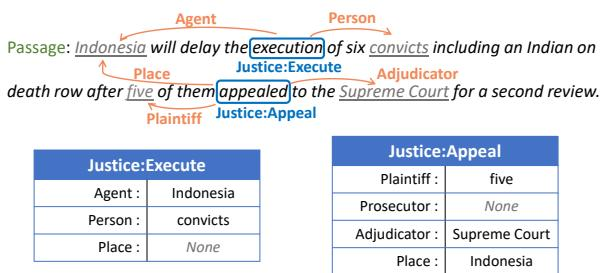
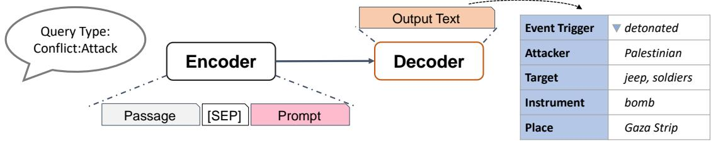
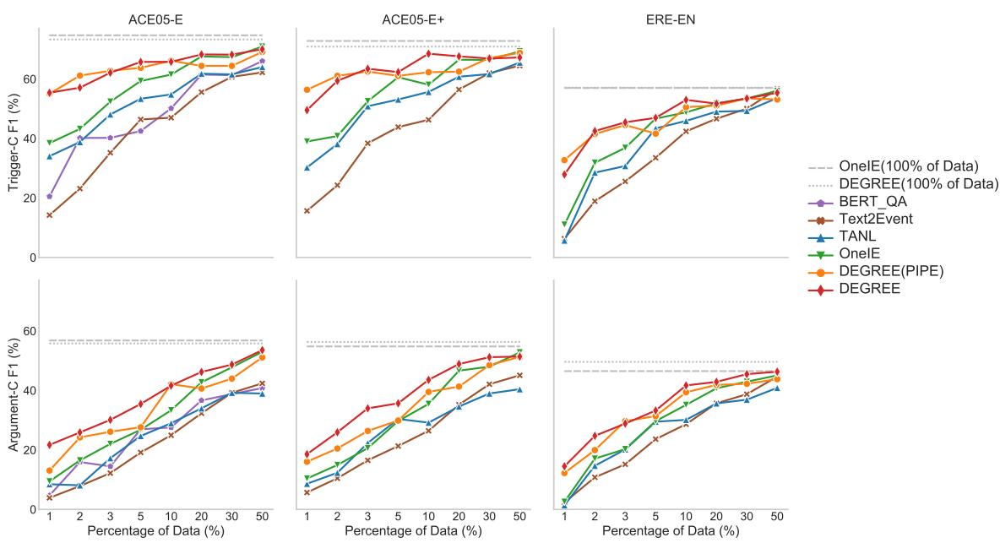
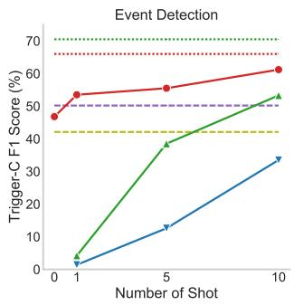
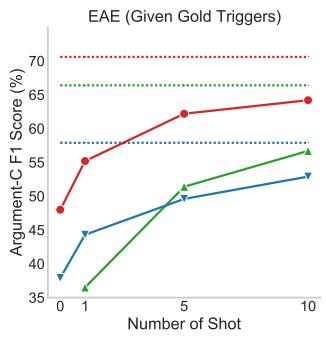
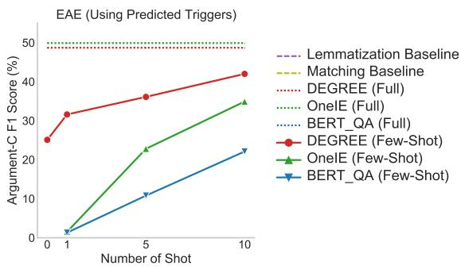
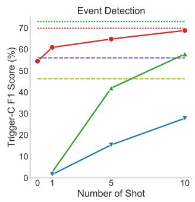
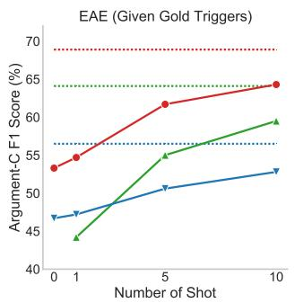
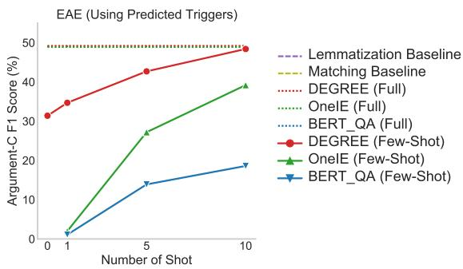

# DEGREE: A Data-Efficient Generation-Based Event Extraction Model

I-Hung Hsu∗† Kuan-Hao Huang∗‡ Elizabeth Boschee† Scott Miller† Premkumar Natarajan† Kai-Wei Chang‡ Nanyun Peng†‡ †Information Science Institute, University of Southern California ‡Computer Science Department, University of California, Los Angeles {ihunghsu, boschee, smiller, pnataraj}@isi.edu {khhuang, kwchang, violetpeng}@cs.ucla.edu

## Abstract

Event extraction requires high-quality expert human annotations, which are usually expensive. Therefore, learning a data-efficient event extraction model that can be trained with only a few labeled examples has become a crucial challenge. In this paper, we focus on low-resource end-to-end event extraction and propose DE-GREE, a data-efficient model that formulates event extraction as a conditional generation problem. Given a passage and a manually designed prompt, DEGREE learns to summarize the events mentioned in the passage into a natural sentence that follows a predefined pattern. The final event predictions are then extracted from the generated sentence with a deterministic algorithm. DEGREE has three advantages to learn well with less training data. First, our designed prompts provide semantic guidance for DEGREE to leverage label semantics and thus better capture the event arguments. Moreover, DEGREE is capable of using additional weaklysupervised information, such as the description of events encoded in the prompts. Finally, DE-GREE learns triggers and arguments jointly in an end-to-end manner, which encourages the model to better utilize the shared knowledge and dependencies among them. Our experimental results demonstrate the strong performance of DEGREE for low-resource event extraction.

## 1 Introduction

Event extraction (EE) aims to extract events, each of which consists of a trigger and several participants (arguments) with their specific roles, from a given passage. For example, in Figure 1, a Justice:Execute event is triggered by the word “execution” and this event contains three argument roles, including an Agent (Indonesia) who carries out the execution, a Person who is executed (convicts), and a Place where the event occurs (not mentioned in the passage). Previous work (Yang et al., 2019a;

  
Figure 1: Two examples of events (Justice:Execute and Justice:Appeal) extracted from the given passage.

Fincke et al., 2021) usually divides EE into two subtasks: (1) event detection, which identifies event triggers and their types, and (2) event argument extraction, which extracts the arguments and their roles for given event triggers. EE has been shown to benefit a wide range of applications, e.g., building knowledge graphs (Zhang et al., 2020), question answering (Berant et al., 2014; Han et al., 2021), and other downstream studies (Han et al., 2019a; Hogenboom et al., 2016; Sun and Peng, 2021).

Most prior works on EE rely on a large amount of annotated data for training (Nguyen and Grishman, 2015; Nguyen et al., 2016; Han et al., 2019b; Du and Cardie, 2020; Huang et al., 2020; Huang and Peng, 2021; Paolini et al., 2021). However, high-quality event annotations are expensive to obtain. For example, the ACE 2005 corpus (Doddington et al., 2004), one of the most widely used EE datasets, requires two rounds of annotations by linguistics experts. The high annotation costs make these models hard to be extended to new domains and new event types. Therefore, how to learn a data-efficient EE model trained with only a few annotated examples is a crucial challenge.

In this paper, we focus on low-resource event extraction, where only a small amount of training examples are available for training. We propose DEGREE (Data-Efficient GeneRation-Based Event Extraction), a generation-based model that takes a passage and a manually designed prompt as the input, and learns to summarize the passage into a natural sentence following a predefined template, as illustrated in Figure 2. The event triggers and arguments can then be extracted from the generated sentence by using a deterministic algorithm.

Passage: Earlier Monday , a 19-year-old Palestinian riding a bicycle detonated a 30-kilo ( 66-pound ) bomb near a military jeep in the Gaza Strip , injuring three soldiers
<table><tr><td colspan="2">Prompt</td></tr><tr><td>Event Type Description</td><td>The event is related to conflict and some violent physical act.</td></tr><tr><td>Event Keywords</td><td>Similar triggers such as war, attack, terrorism.</td></tr><tr><td>E2E Template</td><td>Event trigger is &lt;Trigger&gt;. \n</td></tr><tr><td colspan="2">some attacker attacked some facility, someone, or some organization by some way in somewhere.</td></tr><tr><td colspan="2">Output Text Event trigger is detonated.\n Palestinian attacked jeep and soldiers by bomb in Gaza Strip.</td></tr></table>

Figure 2: An illustration of DEGREE for predicting a Contact:Attack event. The input of DEGREE consists of the given passage and our design prompt that contains an event type description, event keywords, and a E2E template. DEGREE is trained to generate an output to fill in the placeholders (underlined words) in the E2E template with triggers and arguments. The final event prediction is then decoded from the generated output.

DEGREE enjoys the following advantages to learn well with less training data. First, the framework provides label semantics via the designed template in the prompts. As the example in Figure 2 shows, the word “somewhere” in the prompt guides the model to predict words being similar to location for the role Place. In addition, the sentence structure of the template and the word “attacked” depict the semantic relation between the role Attacker and the role Target. With these kinds of guidance, DEGREE can make more accurate predictions with less training examples. Second, the prompts can incorporate additional weaksupervision signal about the task, such as the description of the event and similar keywords. These resources are usually readily available. For example, in our experiments, we take the information from the annotation guideline, which is provided along with the dataset. This information facilitates DEGREE to learn under a low-resource situation. Finally, DEGREE is designed for end-to-end event extraction and can solve event detection and event argument extraction at the same time. Leveraging the shared knowledge and dependencies between the two tasks makes our model more data-efficient.

Existing works on EE usually have only one or two of above-mentioned advantages. For example, previous classification-based models (Nguyen et al., 2016; Wang et al., 2019; Yang et al., 2019b; Wadden et al., 2019; Lin et al., 2020) can hardly encode label semantics and other weak supervision signals. Recently proposed generation-based models for event extraction solved the problem in a pipeline fashion; therefore, they cannot leverage shared knowledge between subtasks (Paolini et al., 2021; Li et al., 2021). Furthermore, their generated outputs are not natural sentences, which hinders the utilization of label semantics (Paolini et al., 2021; Lu et al., 2021). As a result, our model DEGREE can achieve significantly better performance than prior approaches on low-resource event extraction, as we will demonstrate in Section 3.

Our contributions can be summarized as follows:

• We propose DEGREE, a generation-based event extraction model that learns well with less data by better incorporating label semantics and shared knowledge between subtasks (Section 2).

• Experiments on ACE 2005 (Doddington et al., 2004) and ERE-EN (Song et al., 2015) demonstrate the strong performance of DEGREE in the low-resource setting (Section 3).

• We present comprehensive ablation studies in both the low-resource and the high-resource setting to better understand the strengths and weaknesses of our model (Section 4).

Our code and models can be found at https: //github.com/PlusLabNLP/DEGREE.

## 2 Data-Efficient Event Extraction

We introduce DEGREE, a generation-based model for low-resource event extraction. Unlike previous works (Yang et al., 2019a; Li et al., 2021), which separate event extraction into two pipelined tasks (event detection and event argument extraction), DEGREE is designed for the end-to-end event extraction and predict event triggers and arguments at the same time.

## 2.1 The DEGREE Model

We formulate event extraction as a conditional generation problem. As illustrated in Figure 2, given a passage and our designed prompt, DEGREE generates an output following a particular format. The final predictions of event triggers and argument roles can be then parsed from the generated output with a deterministic algorithm. Compared to previous classification-based models (Wang et al., 2019; Yang et al., 2019b; Wadden et al., 2019; Lin et al., 2020), the generation framework provides a flexible way to include additional information and guidance. By designing appropriate prompts, we encourage DEGREE to better capture the dependencies between entities and, therefore, to reduce the number of training examples needed.

The desired prompt not only provides information but also defines the output format. As shown in Figure 2, it contains the following components:

• Event type definition describes the definition for the given event type.1 For example, “The event is related to conflict and some violent physical act.” describes a Conflict:Attack event.

• Event keywords presents some words that are semantically related to the given event type. For example, war, attack, and terrorism are three event keywords for the Conflict:Attack event. In practice, we collect three words that appear as the triggers in the example sentences from the annotation guidelines.

• E2E template defines the expected output format and can be separated into two parts. The first part is called ED template, which is designed as “Event trigger is <Trigger>”, where “<Trigger>” is a special token serving as a placeholder. The second part is the EAE template, which differs based on the given event type. For example, in Figure 2, the EAE template for a

Conflict:Attack event is “some attacker attacked some facility, someone, or some organization by some way in somewhere”. Each underlined string starting with “some-” serves as a placeholder corresponding to an argument role for a Conflict:Attack event. For instance, “some way” corresponds to the role Instrument and “somewhere” corresponds to the role Place. Notice that every event type has its own EAE template. We list three EAE templates in Table 1. The full list of EAE templates and the construction details can be found in Appendix A.

## 2.2 Training

The training objective of DEGREE is to generate an output that replaces the placeholders in E2E template with the gold labels. Take Figure 2 as an example, DEGREE is expected to replace “<Trigger>” with the gold trigger (detonated), replace “some attacker” with the gold argument for role Attacker (Palestinian), and replace “some way” with the gold argument for role Instrument (bomb). If there are multiple arguments for the same role, they are concatenated with “and”; if there is no predicted argument for one role, the model should keep the corresponding placeholder (i.e, “some-” in the E2E template). For the case that there are multiple triggers for the given event type in the input passage, DEGREE is trained to generate the output text that contains multiple E2E template such that each E2E template corresponds to one trigger and its argument roles. The hyperparameter settings are detailed in Appendix B.

## 2.3 Inference

We enumerate all event types and generate an output for each event type. After we obtain the generated sentences, we compare the outputs with E2E template to determine the predicted triggers and arguments in string format. Finally, we apply string matching to convert the predicted string to span offsets in the passage. If the predicted string appears in the passage multiple times, we choose all span offsets that match for trigger predictions and choose the one closest to the given trigger span for argument predictions.

## 2.4 Discussion

Notice that the E2E template plays an important role for DEGREE. First, it serves as the control signal and defines the expected output format. Second, it provides label semantics to help DEGREE make accurate predictions. Those placeholders (words starting with “some-”) in the E2E template give DEGREE some hints about the entity types of arguments. For instance, when seeing “somewhere”, DEGREE tends to generate a location rather than a person. In addition, the words other than “some-” describe the relationships between roles. For example, DEGREE knows the relationship between the role Attacker and the role Target (who is attacking and who is attacked) due to E2E template. This guidance helps DEGREE learn the dependencies between entities.

<table><tr><td rowspan=1 colspan=1>Event Type</td><td rowspan=1 colspan=1>EAE Template</td></tr><tr><td rowspan=1 colspan=1>Life:Divorce</td><td rowspan=1 colspan=1>somebody divorced in somewhere.</td></tr><tr><td rowspan=1 colspan=1>Transaction:Transfer-Ownership</td><td rowspan=1 colspan=1>someone got something from some seller in somewhere.</td></tr><tr><td rowspan=1 colspan=1>Justice:Sue</td><td rowspan=1 colspan=1>somebody was sued by some other in somewhere. The adjudication was judged bysome adjudicator.</td></tr></table>

Table 1: Three examples of EAE templates for the ACE 2005 corpus.

Unlike previous generation-based approaches (Paolini et al., 2021; Li et al., 2020; Huang et al., 2021), we intentionally write E2E templates in natural sentences. This not only uses label semantics better but also makes the model easier to leverage the knowledge from the pre-trained decoder. In Section 4, we will provide experiments to demonstrate the advantage of using natural sentences.

Cost of template constructing. DEGREE does require human effort to design the templates; however, writing those templates is much easier and more effortless than collecting complicated event annotations. As shown in Table 1, we keep the EAE templates as simple and short as possible. Therefore, it takes only about one minute for people who are not linguistic experts to compose a template. In fact, several prior works (Liu et al., 2020; Du and Cardie, 2020; Li et al., 2020) also use constructed templates as weakly-supervised signals to improve models. In Section 4, we will study how different templates affect the performance.

Efficiency Considerations. DEGREE requires to enumerate all event types during inference, which could cause efficiency considerations when extending to applications that contain many event types. This issue is minor for our experiments on the two datasets (ACE 2005 and ERE-EN), which are relatively small scales in terms of the number of event types. Due to the high cost of annotations, there is hardly any public datasets for end-to-end event extraction on a large scale,2 and we cannot provide a more thorough studies when the experiments scale up. We leave the work on benchmarking and improving the efficiency of DEGREE in the scenario considering more diverse and comprehensive types of events as future work.

## 2.5 DEGREE in Pipeline Framework

DEGREE is flexible and can be easily modified to DEGREE(PIPE), which first focuses event detection (ED) and then solves event argument extraction (EAE). DEGREE(PIPE) consists of two models: (1) DEGREE(ED), which aims to exact event triggers for the given event type, and (2) DE-GREE(EAE), which identifies argument roles for the given event type and the corresponding trigger. DEGREE(ED) and DEGREE(EAE) are similar to DEGREE but with different prompts and output formats. We describe the difference as follows.

DEGREE(ED). The prompt of DEGREE(ED) contains the following components:

• Event type definition is the same as the ones for DEGREE.

• Event keywords is the same as the one for DE-GREE.

• ED template is designed as “Event trigger is <Trigger>”, which is actually the first part of the E2E template.

Similar to DEGREE, the objective of DEGREE(ED) is to generate an output that replaces “<Trigger>” in the ED template with event triggers.

DEGREE(EAE). The prompt of DEGREE(EAE) contains the following components:

• Event type definition is the same as the one for DEGREE.

• Query trigger is a string that indicates the trigger word for the given event type. For example, “The event trigger word is detonated” points out that “detonated” is the given trigger.

• EAE template is an event-type-specific template mentioned previously. It is actually the second part of E2E template.

Similar to DEGREE, the goal for DEGREE(EAE) is to generate an outputs that replace the placeholders in EAE template with event arguments.

In Section 3, we will compare DEGREE with DEGREE(PIPE) to study the benefit of dealing with event extraction in an end-to-end manner under the low-resource setting.

## 3 Experiments

We conduct experiments for low-resource event extraction to study how DEGREE performs.

## 3.1 Experimental Settings

Datasets. We consider ACE 2005 (Doddington et al., 2004) and follow the pre-processing in Wadden et al. (2019) and Lin et al. (2020), resulting in two variants: ACE05-E and ACE05-E+. Both contain 33 event types and 22 argument roles. In addition, we consider ERE-EN (Song et al., 2015) and adopt the pre-processing in Lin et al. (2020), which keeps 38 event types and 21 argument roles.

Data split for low-resource setting. We generate different proportions (1%, 2%, 3%, 5%, 10%, 20%, 30%, and 50%) of training data to study the influence of the size of the training set and use the original development set and test set for evaluation. Appendix C lists more details about the split generation process and the data statistics.

Evaluation metrics. We consider the same criteria in prior works (Wadden et al., 2019; Lin et al., 2020). (1) Trigger F1-score: an trigger is correctly identified (Tri-I) if its offset matches the gold one; it is correctly classified (Tri-C) if its event type also matches the gold one. (2) Argument F1-score: an argument is correctly identified (Arg-I) if its offset and event type match the gold ones; it is correctly classified (Arg-C) if its role matches as well.

Compared baselines. We consider the following classification-based models: (1) OneIE (Lin et al., 2020), the current state-of-the-art (SOTA) EE model trained with designed global features. (2) BERT\_QA (Du and Cardie, 2020), which views EE tasks as a sequence of extractive question answering problems. Since it learns a classifier to indicate the position of the predicted span, we view it as a classification model. We also consider the following generation-based models: (3) TANL (Paolini et al., 2021), which treats EE tasks as translation tasks between augmented natural languages. (4) Text2Event (Lu et al., 2021), a sequence-tostructure model that converts the input passage to a tree-like event structure. Note that the outputs of both generation-based baselines are not natural sentences. Therefore, it is more difficult for them to utilize the label semantics. All the implementation details can be found in Appendix D. It is worth noting that we train OneIE with named entity annotations, as the original papers suggest, while the other models are trained without entity annotations.

## 3.2 Main Results

Table 2 shows the trigger classification F1-scores and the argument classification F1-scores in three data sets with different proportions of training data. The results are visualized in Figure 3. Since our task is end-to-end event extraction, the argument classification F1-score is the more important metric that we considered when comparing models.

From the figure and the table, we can observe that both DEGREE and DEGREE(PIPE) outperform all other baselines when using less than 10% of the training data. The performance gap becomes much more significant under the extremely low data situation. For example, when only 1% of the training data is available, DEGREE and DEGREE(PIPE) achieve more than 15 points of improvement in trigger classification F1 scores and more than 5 points in argument classification F1 scores. This demonstrates the effectiveness of our design. The generation-based model with carefully designed prompts is able to utilize the label semantics and the additional weakly supervised signals, thus helping learning under the low-resource regime.

Another interesting finding is that DEGREE and DEGREE(PIPE) seem to be more beneficial for predicting arguments than for predicting triggers. For example, OneIE, the strongest baseline, requires 20% of training data to achieve competitive performance on trigger prediction to DEGREE and DEGREE(PIPE); however, it requires about 50% of training data to achieve competitive performance in predicting arguments. The reason is that the ability to capture dependencies becomes more important for argument prediction than trigger prediction since arguments are usually strongly dependent on each other compared to triggers. Therefore, the improvements of our models for argument prediction

<table><tr><td colspan="12">Trigger Classification F1-Score (%)</td></tr><tr><td rowspan="2">Model</td><td rowspan="2">Type</td><td colspan="4">ACE05-E</td><td colspan="4">ACE05-E</td><td colspan="4">ERE-EN</td></tr><tr><td colspan="4">1% 3% 5% 10%</td><td colspan="4">20% 30% 1% 3% 5% 10% 20% 30% 1%</td><td colspan="4">3% 5% 10% 20% 30%</td></tr><tr><td>BERT_QA</td><td>Cls</td><td>20.5 40.2</td><td>42.5</td><td>50.1 61.5</td><td>61.3</td><td></td><td></td><td></td><td></td><td></td><td></td><td></td><td></td></tr><tr><td>OneIE</td><td>Cls</td><td>38.5 52.4</td><td>59.3</td><td>61.5</td><td>67.6 67.4</td><td>39.052.5</td><td>60.6 58.1</td><td>66.5 66.4</td><td>11.0</td><td>36.9</td><td>46.7</td><td>48.8</td><td>51.8 53.5</td></tr><tr><td>Text2Event</td><td>Gen</td><td>14.2 35.2</td><td>46.4</td><td>47.0</td><td>55.6 60.7</td><td>15.7 38.4</td><td>43.9 46.3</td><td>56.5 62.0</td><td>6.3</td><td>25.6</td><td>33.5</td><td>42.4</td><td>46.7 50.1</td></tr><tr><td>TANL</td><td>Gen</td><td>34.1 48.1</td><td>53.4</td><td>54.8</td><td>61.8 61.6</td><td>30.3 50.9</td><td>53.1 55.7</td><td>60.8 61.7</td><td>5.7</td><td>30.8</td><td>43.4</td><td>45.9</td><td>49.0 49.3</td></tr><tr><td>DEGREE(PIPE) DEGREE</td><td>Gen Gen</td><td>55.1 62.8 55.4 62.1</td><td>63.8 65.8</td><td>66.1 65.8</td><td>64.4 64.4 68.3 68.2</td><td>56.4 62.5 49.5 63.5</td><td>61.1 62.3 62.3 68.5</td><td>62.5 67.1 67.6 66.9</td><td>32.7 27.9</td><td>44.5 45.5</td><td>41.6 47.0</td><td>50.6 53.0</td><td>51.1 53.5 51.7 53.5</td></tr><tr><td colspan="2"></td><td colspan="10">Argument Classification F1-Score (%)</td></tr><tr><td></td><td></td><td></td><td>ACE05-E</td><td></td><td></td><td colspan="4">ACE05-E</td><td></td><td colspan="4">ERE-EN</td></tr><tr><td>Model</td><td>Type</td><td>1% 3%</td><td>5%</td><td>10%</td><td>30%</td><td colspan="4"></td><td colspan="4"></td></tr><tr><td>BERT_QA</td><td>Cls</td><td>4.7</td><td>14.5 26.9</td><td>27.6</td><td>20% 36.7</td><td>1%</td><td>3% 5%</td><td> 10% 20% 30%</td><td></td><td>1% 3%</td><td>5%</td><td>10%</td><td>20% 30%</td></tr><tr><td>OneIE</td><td>Cls</td><td>9.4</td><td>22.0 26.8</td><td>26.8</td><td>38.8 42.7</td><td>10.4 20.6</td><td>29.7</td><td>35.5 46.7</td><td>48.0</td><td>20.3</td><td></td><td></td><td>40.7</td></tr><tr><td>Text2Event</td><td>Gen</td><td>3.9</td><td>12.2 19.1</td><td>24.9</td><td>47.8 32.3</td><td>5.7</td><td>16.5 21.3</td><td>26.4</td><td></td><td>2.6 2.3</td><td>29.7</td><td>35.1</td><td>43.0 35.7</td></tr><tr><td>TANL</td><td>Gen</td><td>8.5 17.2</td><td>24.7</td><td>29.0</td><td>39.2 34.0 39.2</td><td>8.6</td><td>22.3 30.4</td><td>35.2 29.2 34.6</td><td>42.1 39.0</td><td>15.2 20.2</td><td>23.6</td><td>28.7</td><td>38.7 36.9</td></tr><tr><td>DEGREE(PIPE)</td><td>Gen</td><td>13.1 26.1</td><td>27.6</td><td>42.1</td><td>40.7 44.0</td><td>16.0</td><td>26.4 29.9</td><td>39.5 41.3</td><td>48.5</td><td>1.4 29.7</td><td>29.5</td><td>30.1</td><td>35.6 42.2</td></tr><tr><td>DEGREE</td><td>Gen</td><td>21.7</td><td>30.1 35.5</td><td>41.6</td><td>46.2 48.7</td><td>18.7</td><td>34.0 35.7</td><td>43.6 48.9</td><td>51.2</td><td>12.2 14.5 28.9</td><td>31.4 33.4</td><td>39.4 41.7</td><td>41.9 42.9 45.5</td></tr></table>

Table 2: Trigger classification F1-scores and argument classification F1-scores for low-resource event extraction. Highest scores are in bold and the second best scores are underlined. “Cls” and “Gen” represent classificationbased models and generation-based models, respectively. If the model is a pipelined model, then its argument predictions are based on its predicted triggers. DEGREE achieves a much better performance than other baselines. The performance gap becomes more significant for the extremely low-resource situation.

  
Figure 3: Trigger classification F1-scores and argument classification F1-scores for low-resource event extraction. DEGREE achieves a much better performance than other baselines. The performance gap becomes more significant for the extremely low-resource situation.

are more significant.

Furthermore, we observe that DEGREE is slightly better than DEGREE(PIPE) under the lowresource setting. This provides empirical evidence on the benefit of jointly predicting triggers and arguments in a low-resource setting.

Finally, we perform additional experiments on few-shot and zero-shot experiments. The results can be found in Appendix E.

## 3.3 High-Resource Event Extraction

Although we focus on data-efficient learning for low-resource event extraction, to better understand the advantages and disadvantages of our model, we additionally study DEGREE in the high-resource setting for controlled comparisons.

Compared baselines. In addition to the EE models mentioned above: OneIE (Lin et al., 2020), BERT\_QA (Du and Cardie, 2020), TANL (Paolini et al., 2021), and Text2Event (Lu et al., 2021), we also consider the following baselines focusing on the high-resource setting. dbRNN (Sha et al., 2018) is classification-based model that adds dependency bridges for event extraction. DyGIE++ (Wadden et al., 2019) is a classification-based model with span graph propagation technique. Joint3EE (Nguyen and Nguyen, 2019) is a classificationbased model jointly trained with annotations of entity, trigger, and argument. MQAEE (Li et al., 2020) converts EE to a series of question answering problems for argument extraction . BART-Gen (Li et al., 2021) is a generation-based model focusing on only event argument extraction.3 Appendix D shows the implementation details for the baselines.

<table><tr><td rowspan=2 colspan=3>Model</td><td rowspan=2 colspan=1>Type</td><td rowspan=1 colspan=1>ACE05-E</td><td rowspan=1 colspan=1>ACE05-E+</td><td rowspan=1 colspan=1>ERE-EN</td></tr><tr><td rowspan=1 colspan=1>Tri-CArg-C</td><td rowspan=1 colspan=1>Tri-C Arg-C</td><td rowspan=1 colspan=1>Tri-C Arg-C</td></tr><tr><td rowspan=1 colspan=3>dbRNN*</td><td rowspan=1 colspan=1>Cls</td><td rowspan=1 colspan=1>69.6 50.1</td><td rowspan=1 colspan=1></td><td rowspan=9 colspan=1>=57.0 46.554.7 43.259.4 48.3一</td></tr><tr><td rowspan=1 colspan=3>DyGIE++</td><td rowspan=1 colspan=1>Cls</td><td rowspan=1 colspan=1>70.0 50.0</td><td rowspan=5 colspan=1>72.8 54.8</td></tr><tr><td rowspan=1 colspan=3>Joint3EE*</td><td rowspan=1 colspan=1>Cls</td><td rowspan=1 colspan=1>69.8 52.1</td></tr><tr><td rowspan=2 colspan=3>BERT_QA*MQAEE*</td><td rowspan=1 colspan=1>Cls</td><td rowspan=1 colspan=1>72.4 53.3</td></tr><tr><td rowspan=1 colspan=2>E*</td><td rowspan=1 colspan=1>Cls</td><td rowspan=1 colspan=1>71.7 53.4</td></tr><tr><td rowspan=1 colspan=1>OneIE*</td><td></td><td rowspan=1 colspan=1></td><td rowspan=1 colspan=1>Cls</td><td rowspan=1 colspan=1>74.7 56.8</td></tr><tr><td rowspan=1 colspan=1>TANL</td><td></td><td rowspan=1 colspan=1></td><td rowspan=1 colspan=1>Gen</td><td rowspan=1 colspan=1>68.4 47.6</td><td rowspan=1 colspan=1>68.6 46.0</td></tr><tr><td rowspan=1 colspan=3>Text2Event*</td><td rowspan=1 colspan=1>Gen</td><td rowspan=2 colspan=1>71.9 53.871.1 53.7</td><td rowspan=2 colspan=1>71.8 54.42</td></tr><tr><td rowspan=1 colspan=3>BART-Gen*</td><td rowspan=1 colspan=1>Gen</td></tr><tr><td rowspan=1 colspan=3>DEGREE(PIPE)</td><td rowspan=1 colspan=1>Gen</td><td rowspan=1 colspan=1>72.2 55.8</td><td rowspan=2 colspan=1>71.7 56.870.9 56.3</td><td rowspan=2 colspan=1>57.8 50.457.1 49.6</td></tr><tr><td rowspan=1 colspan=3>DEGREE</td><td rowspan=1 colspan=1>Gen</td><td rowspan=1 colspan=1>73.3 55.8</td></tr></table>

Table 3: Results for high-resource event extraction. Highest scores are in bold and the second best scores are underlined. \*We report the numbers from the original paper. DEGREE has a competitive performance to the SOTA model (OneIE) and outperform other baselines.
<table><tr><td rowspan="2">Model</td><td rowspan="2">Type</td><td colspan="2">ACE05-E</td><td colspan="2">ERE-EN</td></tr><tr><td>Arg-I Arg-C</td><td>Arg-I Arg-C</td><td>Arg-I Arg-C</td><td></td></tr><tr><td>DyGIE++</td><td>Cls</td><td>66.2 60.7</td><td>= 一</td><td>=</td><td>-</td></tr><tr><td>BERT_QA*</td><td>Cls</td><td>68.2 65.4</td><td></td><td></td><td></td></tr><tr><td>OneIE</td><td>Cls</td><td>73.2 69.3</td><td>73.3 70.6</td><td>75.3</td><td>70.0</td></tr><tr><td>TANL</td><td>Gen</td><td>65.9 61.0</td><td>66.3</td><td>62.3 75.6</td><td>69.6</td></tr><tr><td>BART-Gen*</td><td>Gen</td><td>69.9 66.7</td><td></td><td></td><td></td></tr><tr><td>DEGREE(EAE)</td><td>Gen</td><td>76.0 73.5</td><td>75.2</td><td>73.0</td><td>80.2 76.3</td></tr></table>

Table 4: Results for high-resource event argument extraction. Models predict arguments based on the given gold triggers. Best scores are in bold. \*We report the numbers from the original paper. DEGREE(EAE) achieves a new state-of-the-art performance on event argument extraction.

Results for event extraction. Table 3 shows the results of high-resource event extraction. In terms of trigger predictions (Tri-C), DEGREE and DE-GREE(PIPE) outperforms all the baselines except for OneIE, the current state-of-the-art model. For argument predictions (Arg-C), our models have slightly better performance than OneIE in two out of the three datasets. When enough training examples are available, models can learn more sophisticated features from data, which do not necessarily follow the learned dependencies. Therefore, the advantage of DEGREE over DEGREE(PIPE) becomes less obvious. This result justifies our hypothesis that DEGREE has better performance for the lowresource setting because of its ability to better capture dependencies.

<table><tr><td rowspan="2">Model</td><td colspan="2">10% Data</td><td colspan="2">100% Data</td></tr><tr><td>Tri-I</td><td>Tri-C</td><td>Tri-I</td><td>Tri-C</td></tr><tr><td>Full DEGREE(ED)</td><td>69.3</td><td>66.1</td><td>75.4</td><td>72.2</td></tr><tr><td rowspan="3">- w/o Event type definition - w/o ED template - w/o Event keywords</td><td>67.9</td><td>64.4</td><td>73.5</td><td>70.1</td></tr><tr><td>68.8</td><td>65.8</td><td>74.0</td><td>70.5</td></tr><tr><td>68.2</td><td>64.0</td><td>73.5</td><td>69.1</td></tr><tr><td colspan="2">- only Event type definition - only Event keywords</td><td>66.3 63.5</td><td>72.6 63.8 70.8</td><td>68.9 66.2</td></tr></table>

Table 5: Ablation study for the components in the prompt on event detection with ACE05-E.

Results for event argument extraction. In Table 4, we additionally study the performance for event argument extraction task, where the model makes argument predictions with the gold trigger provided. Interestingly, DEGREE(EAE) achieves pretty strong performance and outperforms other baselines with a large margin. Combining the results in Table 3, we hypothesize that event argument extraction is a more challenging task than event trigger detection and it requires more training examples to learn well. Hence, our proposed model, which takes the advantage of using label semantics to better capture dependencies, achieves a new state-of-the-art for event argument extraction.

## 4 Ablation Studies

In this section, we present comprehensive ablation studies to justify our design. To better understand the contribution of each component in the designed prompt and their effects on the different tasks, we ablate DEGREE(EAE) and DEGREE(ED) for both low-resource and high-resource situations.

Impacts of components in prompts. Table 5 lists the performance changes when removing the components in the prompts for event detection on ACE05-E. The performance decreases whenever removing any one of event type definition, event keywords, and ED template. The results suggest that three components are all necessary.

Table 6 demonstrates how different components in prompts affect the performance of event argument extraction on ACE05-E. Removing any one of event type definition, query trigger, and EAE template leads to performance drops, which validates their necessity. We observe that query trigger plays the most important role among the three and when less training data is given, the superiority of leveraging any of these weaklysupervised signal becomes more obvious.

<table><tr><td rowspan="2">Model</td><td colspan="2">10% Data</td><td colspan="2">100% Data</td></tr><tr><td>Arg-I Arg-C</td><td></td><td>Arg-I</td><td>Arg-C</td></tr><tr><td rowspan="4">Full DEGREE(EAE) - w/o Event type definition - w/o EAE template - w/o Query trigger</td><td>63.3</td><td>57.3</td><td>76.0</td><td>73.5</td></tr><tr><td>60.3</td><td>54.4</td><td>74.5</td><td>71.1</td></tr><tr><td>57.0</td><td>51.9</td><td>73.8</td><td>70.4</td></tr><tr><td>55.2</td><td>49.9</td><td>71.4</td><td>69.0</td></tr><tr><td>- only Query trigger</td><td>51.9</td><td>48.1</td><td>71.2</td><td>69.4</td></tr><tr><td>- only EAE template</td><td>51.2</td><td>46.9</td><td>71.4</td><td>68.6</td></tr><tr><td>- only Event type definition</td><td>46.7</td><td>42.3</td><td>71.4</td><td>68.2</td></tr></table>

Table 6: Ablation study for the components in the prompt on event argument extraction with ACE05-E.

Effects of different template designs. To verify the importance of using natural sentences as outputs, we study three variants of EAE templates:

• Natural sentence. Our proposed templates described in Section 2, e.g., “somebody was born in somewhere.”, where “somebody” and “somewhere” are placeholders that can be replaced by the corresponding arguments.

• Natural sentence with special tokens. It is similar to the natural sentence one except for using role-specific special tokens instead of “some-” words. For example, “<Person> was born in <Place>.” We consider this to study the label semantics of roles.

• HTML-like sentence with special tokens. To study the importance of using natural sentence, we also consider HTML-like sentence, e.g., “<Person> </Person> <Place> </Place>”. The model aims to put argument predictions between the corresponding HTML tags.

The results of all variants of EAE templates on ACE05-E are shown in Table 7. We notice that writing templates in a natural language style get better performance, especially when only a few data is available (10% of data). This shows our design’s capability to leverage pre-trained knowledge in the generation process. Additionally, there are over 1 F1 score performance drops when replacing natural language placeholders with special tokens. This confirms that leveraging label semantics for different roles is beneficial.

<table><tr><td rowspan="2">Model</td><td colspan="2">10% Data</td><td colspan="2">100% Data</td></tr><tr><td>Arg-I</td><td>Arg-C</td><td></td><td>Arg-I Arg-C</td></tr><tr><td>OneIE</td><td>48.3</td><td>45.4</td><td>73.2</td><td>69.3</td></tr><tr><td>BART-Gen</td><td></td><td>1</td><td>69.9</td><td>66.7</td></tr><tr><td>Natural sentence</td><td>63.3</td><td>57.3</td><td>76.0</td><td>73.5</td></tr><tr><td>Natural sentence w/ special tokens</td><td>59.8</td><td>55.5</td><td>74.7</td><td>72.3</td></tr><tr><td>HTML-like sentence w/ special tokens</td><td>60.8</td><td>51.9</td><td>74.6</td><td>71.4</td></tr></table>

Table 7: Performances of DEGREE(EAE) on ACE05-E with different types of templates.

<table><tr><td rowspan="2">Model</td><td colspan="2">10% Data</td><td colspan="2">100% Data</td></tr><tr><td>Arg-I Arg-C</td><td></td><td>Arg-I Arg-C</td><td></td></tr><tr><td>OneIE BART-Gen</td><td>48.3</td><td>45.4</td><td>73.2</td><td>69.3</td></tr><tr><td>DEGREE(EAE)</td><td>- 63.3</td><td>= 57.3</td><td>69.9 76.0</td><td>66.7 73.5</td></tr><tr><td>DEGREE(EAE) + variant template 1</td><td>61.6</td><td>55.5</td><td>73.4</td><td>70.4</td></tr><tr><td>DEGREE(EAE) + variant template 2</td><td>63.9</td><td>56.9</td><td>75.5</td><td></td></tr><tr><td></td><td></td><td></td><td></td><td>72.5</td></tr></table>

Table 8: Study on the effect of different template constructing rules. Experiments is conducted on ACE05-E.

Sensitivity to template design. Finally, we study how sensitive our model is to the template. In addition to the original design of templates for event argument extraction, we compose other two sets of templates with different constructing rules (e.g., different word choices and different orders of roles). Table 8 shows the results of using different sets of templates. We observe a performance fluctuation when using different templates, which indicates that the quality of templates does affect the performance to a certain degree. Therefore, we need to be cautious when designing templates. However, even though our model could be sensitive to the template design, it still outperforms OneIE and BART-Gen, which are the best classification-based model and the best generation-based baseline, respectively.

## 5 Related Work

Fully supervised event extraction. Event extraction has been studied for over a decade (Ahn, 2006; Ji and Grishman, 2008) and most traditional event extraction works follow the fully supervised setting (Nguyen et al., 2016; Sha et al., 2018; Nguyen and Nguyen, 2019; Yang et al., 2019b; Lin et al., 2020; Liu et al., 2020; Li et al., 2020). Many of them use classification-based models and use pipeline-style frameworks to extract events (Nguyen et al., 2016; Yang et al., 2019b; Wadden et al., 2019). To better leverage shared knowledge in event triggers and arguments, some works propose incorporating global features to jointly decide triggers and arguments (Lin et al., 2020; Li et al., 2013; Yang and Mitchell, 2016).

Recently, few generation-based event extraction models have been proposed (Paolini et al., 2021;

Huang et al., 2021, 2022; Li et al., 2021). TANL (Paolini et al., 2021) treats event extraction as translation tasks between augmented natural languages. Their predicted target—augmented language embed labels into the input passage via using brackets and vertical bar symbols. TempGen (Huang et al., 2021) is a template-based role-filler entity extraction model, which generate outputs that fill role entities into non-natural templated sequences. The output sequence designs of TANL and Temp-Gen hinder the models from fully leveraging label semantics, unlike DEGREE that generates natural sentences. BART-Gen (Li et al., 2021) is also a generation-based model focusing on documentlevel event argument extraction. They solve event extraction with a pipeline, which prevents knowledge sharing across subtasks. All these fully supervised methods can achieve substantial performance with a large amount of annotated data. However, their designs are not specific for low-resource scenarios, hence, these models can not enjoy all the benefits that DEGREE obtains for low-resource event extraction at the same time, as we mentioned in Section 1.

Low-resource event extraction. It has been a growing interest in event extraction in a scenario with less data. Liu et al. (2020) uses a machine reading comprehension formulation to conduct event extraction in a low-resource regime. Text2Event (Lu et al., 2021), a sequence-tostructure generation paradigm, first presents events in a linearized format, and then trains a generative model to generate the linearized event sequence. Text2Event’s unnatural output format hinders the model from fully leveraging pre-trained knowledge. Hence, their model falls short on the cases with only extremely low data being available (as shown in Section 3).

Another thread of works are using meta-learning to deal with the less label challenge (Deng et al., 2020; Shen et al., 2021; Cong et al., 2021). However, their methods can only be applied to event detection, which differs from our main focus on studying end-to-end event extraction.

## 6 Conclusion & Future Work

In this paper, we present DEGREE, a data-efficient generation-based event extraction model. DEGREE requires less training data because it better utilizes label semantics as well as weakly-supervised information, and captures better dependencies by jointly predicting triggers and arguments. Our experimental results and ablation studies show the superiority of DEGREE for low-resource event extraction.

DEGREE assumes that some weakly-supervised information (the description of events, similar keywords, and human-written templates) is accessible or not expensive for the users to craft. This assumption may holds for most situations. We leave the automation of template construction for future work, which can further ease the needed efforts when deploying DEGREE in a large-scale corpus.

## Acknowledgments

We thank anonymous reviewers for their helpful feedback. We thank the UCLA PLUSLab and UCLA-NLP group members for their initial review and feedback for an earlier version of the paper. This work is supported in part by the Intelligence Advanced Research Projects Activity (IARPA), via Contract No. 2019-19051600007, and research awards sponsored by CISCO and Google.

## Ethics Considerations

DEGREE fine-tunes the pre-trained generative language model (Lewis et al., 2020). Therefore, the generated output is potentially affected by the corpus for pre-training. Although with a low possibility, it is possible for our model to accidentally generate some malicious, counterfactual, and biased sentences, which may cause ethics concerns. We suggest carefully examining those potential issues before deploying the model in any real-world applications.

## References

David Ahn. 2006. The stages of event extraction. In Proceedings ofthe Workshop on Annotating and Reasoning about Time and Events.

Jonathan Berant, Vivek Srikumar, Pei-Chun Chen, Abby Vander Linden, Brittany Harding, Brad Huang, Peter Clark, and Christopher D. Manning. 2014. Modeling biological processes for reading comprehension. In Proceedings of the 2014 Conference on Empirical Methods in Natural Language Processing (EMNLP).

Xin Cong, Shiyao Cui, Bowen Yu, Tingwen Liu, Yubin Wang, and Bin Wang. 2021. Few-shot event detection with prototypical amortized conditional random field. In Findings of the Association for Computational Linguistics: ACL/IJCNLP.

Shumin Deng, Ningyu Zhang, Jiaojian Kang, Yichi Zhang, Wei Zhang, and Huajun Chen. 2020. Metalearning with dynamic-memory-based prototypical network for few-shot event detection. In The Thirteenth ACM International Conference on Web Search and Data Mining (WSDM).

George R. Doddington, Alexis Mitchell, Mark A. Przybocki, Lance A. Ramshaw, Stephanie M. Strassel, and Ralph M. Weischedel. 2004. The automatic content extraction (ACE) program - tasks, data, and evaluation. In Proceedings of the Fourth International Conference on Language Resources and Evaluation (LREC).

Xinya Du and Claire Cardie. 2020. Event extraction by answering (almost) natural questions. In Proceedings of the 2020 Conference on Empirical Methods in Natural Language Processing (EMNLP).

Steven Fincke, Shantanu Agarwal, Scott Miller, and Elizabeth Boschee. 2021. Language model priming for cross-lingual event extraction. arXiv preprint arXiv:2109.12383.

Rujun Han, I-Hung Hsu, Jiao Sun, Julia Baylon, Qiang Ning, Dan Roth, and Nanyun Peng. 2021. ESTER: A machine reading comprehension dataset for reasoning about event semantic relations. In Proceedings of the 2021 Conference on Empirical Methods in Natural Language Processing, EMNLP 2021, Virtual Event / Punta Cana, Dominican Republic, 7-11 November, 2021.

Rujun Han, I-Hung Hsu, Mu Yang, Aram Galstyan, Ralph M. Weischedel, and Nanyun Peng. 2019a. Deep structured neural network for event temporal relation extraction. In Proceedings ofthe 23rd Conference on Computational Natural Language Learning, CoNLL 2019, Hong Kong, China, November 3-4, 2019.

Rujun Han, Qiang Ning, and Nanyun Peng. 2019b. Joint event and temporal relation extraction with shared representations and structured prediction. In 2019 Conference on Empirical Methods in Natural Language Processing (EMNLP).

Frederik Hogenboom, Flavius Frasincar, Uzay Kaymak, Franciska de Jong, and Emiel Caron. 2016. A survey of event extraction methods from text for decision support systems. Decis. Support Syst., 85:12–22.

Kuan-Hao Huang, I-Hung Hsu, Premkumar Natarajan, Kai-Wei Chang, and Nanyun Peng. 2022. Multilingual generative language models for zero-shot crosslingual event argument extraction. In Proceedings of the 60th Annual Meeting of the Association for Computational Linguistics (ACL).

Kung-Hsiang Huang and Nanyun Peng. 2021. Document-level event extraction with efficient end-to-end learning of cross-event dependencies. In The 3rd Workshop on Narrative Understanding (NAACL 2021).

Kung-Hsiang Huang, Sam Tang, and Nanyun Peng. 2021. Document-level entity-based extraction as template generation. In Proceedings ofthe 2021 Conference on Empirical Methods in Natural Language Processing, EMNLP 2021, Virtual Event / Punta Cana, Dominican Republic, 7-11 November, 2021.

Kung-Hsiang Huang, Mu Yang, and Nanyun Peng. 2020. Biomedical event extraction with hierarchical knowledge graphs. In the 2020 Conference on Empirical Methods in Natural Language Processing (EMNLP)- Findings, short.

Heng Ji and Ralph Grishman. 2008. Refining event extraction through cross-document inference. In Proceedings of the 46th Annual Meeting of the Associationfor Computational Linguistics (ACL).

Mike Lewis, Yinhan Liu, Naman Goyal, Marjan Ghazvininejad, Abdelrahman Mohamed, Omer Levy, Veselin Stoyanov, and Luke Zettlemoyer. 2020. BART: denoising sequence-to-sequence pre-training for natural language generation, translation, and comprehension. In Proceedings ofthe 58th Annual Meeting of the Association for Computational Linguistics (ACL).

Fayuan Li, Weihua Peng, Yuguang Chen, Quan Wang, Lu Pan, Yajuan Lyu, and Yong Zhu. 2020. Event extraction as multi-turn question answering. In Proceedings of the 2020 Conference on Empirical Methods in Natural Language Processing: Findings (EMNLP).

Qi Li, Heng Ji, and Liang Huang. 2013. Joint event extraction via structured prediction with global features. In Proceedings of the 51st Annual Meeting of the Association for Computational Linguistics (ACL).

Sha Li, Heng Ji, and Jiawei Han. 2021. Document-level event argument extraction by conditional generation. In Proceedings ofthe 2021 Conference ofthe North American Chapter of the Association for Computational Linguistics: Human Language Technologies (NAACL-HLT).

Ying Lin, Heng Ji, Fei Huang, and Lingfei Wu. 2020. A joint neural model for information extraction with global features. In Proceedings of the 58th Annual Meeting of the Association for Computational Linguistics (ACL).

Jian Liu, Yubo Chen, Kang Liu, Wei Bi, and Xiaojiang Liu. 2020. Event extraction as machine reading comprehension. In Proceedings of the 2020 Conference on Empirical Methods in Natural Language Processing (EMNLP).

Ilya Loshchilov and Frank Hutter. 2019. Decoupled weight decay regularization. In 7th International Conference on Learning Representations, ICLR 2019, New Orleans, LA, USA, May 6-9, 2019.

Yaojie Lu, Hongyu Lin, Jin Xu, Xianpei Han, Jialong Tang, Annan Li, Le Sun, Meng Liao, and Shaoyi

Chen. 2021. Text2event: Controllable sequence-tostructure generation for end-to-end event extraction. In Proceedings of the 59th Annual Meeting of the Associationfor Computational Linguistics and the 11th International Joint Conference on Natural Language Processing (ACL/IJCNLP).

Thien Huu Nguyen, Kyunghyun Cho, and Ralph Grishman. 2016. Joint event extraction via recurrent neural networks. In The 2016 Conference ofthe North American Chapter of the Association for Computational Linguistics: Human Language Technologies (NAACL-HLT).

Thien Huu Nguyen and Ralph Grishman. 2015. Event detection and domain adaptation with convolutional neural networks. In Proceedings ofthe 53rd Annual Meeting of the Association for Computational Linguistics (ACL).

Trung Minh Nguyen and Thien Huu Nguyen. 2019. One for all: Neural joint modeling of entities and events. In The Thirty-Third AAAI Conference on Artificial Intelligence, AAAI 2019, The Thirty-First Innovative Applications ofArtificial Intelligence Conference (AAAI).

Giovanni Paolini, Ben Athiwaratkun, Jason Krone, Jie Ma, Alessandro Achille, Rishita Anubhai, Cícero Nogueira dos Santos, Bing Xiang, and Stefano Soatto. 2021. Structured prediction as translation between augmented natural languages. In 9th International Conference on Learning Representations (ICLR).

Lei Sha, Feng Qian, Baobao Chang, and Zhifang Sui. 2018. Jointly extracting event triggers and arguments by dependency-bridge RNN and tensor-based argument interaction. In Proceedings of the Thirty-Second AAAI Conference on Artificial Intelligence (AAAI).

Shirong Shen, Tongtong Wu, Guilin Qi, Yuan-Fang Li, Gholamreza Haffari, and Sheng Bi. 2021. Adaptive knowledge-enhanced bayesian meta-learning for fewshot event detection. In Findings ofthe Association for Computational Linguistics: ACL/IJCNLP.

Zhiyi Song, Ann Bies, Stephanie M. Strassel, Tom Riese, Justin Mott, Joe Ellis, Jonathan Wright, Seth Kulick, Neville Ryant, and Xiaoyi Ma. 2015. From light to rich ERE: annotation of entities, relations, and events. In Proceedings of the The 3rd Workshop on EVENTS: Definition, Detection, Coreference, and Representation, (EVENTS@HLP-NAACL).

Jiao Sun and Nanyun Peng. 2021. Men are elected, women are married: Events gender bias on wikipedia. In Proceedings ofthe 59th Annual Meeting ofthe Associationfor Computational Linguistics and the 11th International Joint Conference on Natural Language Processing, ACL/IJCNLP 2021, (Volume 2: Short Papers), Virtual Event, August 1-6, 2021.

David Wadden, Ulme Wennberg, Yi Luan, and Hannaneh Hajishirzi. 2019. Entity, relation, and event extraction with contextualized span representations. In Proceedings of the 2019 Conference on Empirical Methods in Natural Language Processing and the 9th International Joint Conference on Natural Language Processing (EMNLP-IJCNLP).

Xiaozhi Wang, Ziqi Wang, Xu Han, Wangyi Jiang, Rong Han, Zhiyuan Liu, Juanzi Li, Peng Li, Yankai Lin, and Jie Zhou. 2020. MAVEN: A massive general domain event detection dataset. In Proceedings of the 2020 Conference on Empirical Methods in Natural Language Processing, EMNLP 2020, Online, November 16-20, 2020.

Xiaozhi Wang, Ziqi Wang, Xu Han, Zhiyuan Liu, Juanzi Li, Peng Li, Maosong Sun, Jie Zhou, and Xiang Ren. 2019. HMEAE: hierarchical modular event argument extraction. In Proceedings of the 2019 Conference on Empirical Methods in Natural Language Processing and the 9th International Joint Conference on Natural Language Processing (EMNLP-IJCNLP).

Thomas Wolf, Lysandre Debut, Victor Sanh, Julien Chaumond, Clement Delangue, Anthony Moi, Pierric Cistac, Tim Rault, Remi Louf, Morgan Funtowicz, Joe Davison, Sam Shleifer, Patrick von Platen, Clara Ma, Yacine Jernite, Julien Plu, Canwen Xu, Teven Le Scao, Sylvain Gugger, Mariama Drame, Quentin Lhoest, and Alexander Rush. 2020. Huggingface’s transformers: State-of-the-art natural language processing. In Proceedings ofthe 2020 Conference on Empirical Methods in Natural Language Processing: System Demonstrations.

Bishan Yang and Tom M. Mitchell. 2016. Joint extraction of events and entities within a document context. In The 2016 Conference ofthe North American Chapter of the Association for Computational Linguistics: Human Language Technologies (NAACL-HLT).

Sen Yang, Dawei Feng, Linbo Qiao, Zhigang Kan, and Dongsheng Li. 2019a. Exploring pre-trained language models for event extraction and generation. In Proceedings of the 57th Conference of the Association for Computational Linguistics, ACL 2019, Florence, Italy, July 28- August 2, 2019, Volume 1: Long Papers.

Sen Yang, Dawei Feng, Linbo Qiao, Zhigang Kan, and Dongsheng Li. 2019b. Exploring pre-trained language models for event extraction and generation. In Proceedings ofthe 57th Conference ofthe Associationfor Computational Linguistics (ACL).

Hongming Zhang, Xin Liu, Haojie Pan, Yangqiu Song, and Cane Wing-Ki Leung. 2020. ASER: A largescale eventuality knowledge graph. In The Web Conference 2020 (WWW).

## A EAE Template Constructing

Our strategy to create an EAE template is first identifying all valid argument roles for the event type,4 such as Attacker, Target, Instrument, and Place roles. Then, for each argument role, according to the semantics of the role type, we select natural and fluent words to form its placeholder (e.g., some way for Instrument). This design aims to provide a simple way to help the model learn both the roles label semantics and the event structure. Finally, we create a natural language sentence that connects all these placeholders. Notice that we try to keep the template as simple and short as possible. Table 9 lists all designed EAE templates for ACE05-E and ACE05-E+. The EAE templates of ERE-EN can be found in Table 10.

## B Training Details of Proposed Model

Given a passage, its annotated event types are consider as positive event types. During training, we additionally sample m event types that are not related to the passage as the negative examples, where m is a hyper-parameter. In our experiments, m is usually set to 13 or 15.

For all of DEGREE, DEGREE(ED), and DE-GREE(EAE), we fine-tune the pre-trained BARTlarge (Lewis et al., 2020) with Huggingface package (Wolf et al., 2020). The number of parameters is around 406 millions. We train DEGREE with our machine that equips 128 AMD EPYC 7452 32- Core Processor, 4 NVIDIA A100 GPUs, and 792G RAM. We consider AdamW optimizer (Loshchilov and Hutter, 2019) with learning rate set to 10−5 and the weight decay set to 10−5. We set the batch size to 6 for DEGREE(EAE) and 32 for DEGREE(ED) and DEGREE. The number of training epochs is 45. It takes around 2 hours, 18 hours, 22 hours to train DEGREE(EAE), DEGREE(ED), and DEGREE, respectively.

We do hyper-parameter search on m, the number of negative examples, from 3, 5, 7, 10, 13, 15, 18, 21 , and our preliminary trials shows that m less than 10 are usually less useful. For the learning rate and the weight decay, we tune it based on our preliminary experiment for event argument extraction from $\{ 1 \bar { 0 } ^ { - 5 } , 1 0 ^ { - 4 } \}$ , while they are both fixed to 10−5 for all the experiments.

## C Datasets

We consider ACE 20055 (Doddington et al., 2004) and ERE6 (Song et al., 2015). Both consider LDC User Agreementfor Non-Members7 as the licenses. Both datasets are created for entity, relation, and event extraction while our focus is only event extraction in this paper. In the original ACE 2005 dataset, it contains data for English, Chinese, and Arabic and we only take the English data for our experiment. In the original ERE dataset, it contains data for English, and Chinese and we only take the English data for our experiment as well.

Because both datasets contain event like Justice:Execute and Life:Die, it is possible that some offensive words (e.g., killed) would appear in the passage. Also, some real names may appear in the passage as well (e.g., Palestinian president, Mahmoud Abbas). How to accurately identify these kinds of information is part of the goal of the task. Therefore, we do not take any changes on the datasets for protecting or anonymizing.

We split the training data based on documents, which is a more realistic setup compared to splitting data by instance. Table 11 lists the statistics of ACE05-E, ACE05-E+, and ERE-EN. Specifically, we try to make each proportion of data contain as many event types as possible.

## D Implementation Details

This section describes the implementation details for all baselines we use. We run the experiments with three different random seeds and report the best value.

• DyGIE++: we use their released pre-trained model8 for evaluation.

• OneIE: we use their provided code9 to train the model with default parameters.

• BERT\_QA: we use their provided code10 to train the model with default parameters.

• TANL: we use their provided code11 to train the model. We conduct the experiments with two variations: (1) using their default parameters, and (2) using their default parameters but with more training epochs. We observe that the second variant works better. As a result, we report the number obtained from the second setting.

• Text2Event: we use their official code12 to train the model with the provided parameter setting.

• dbRNN: we directly report the experimental results from their paper.

• Joint3EE: we directly report the experimental results from their paper.

• MQAEE: we directly report the experimental results from their paper.

• BART-Gen: we report the experimental results from their released appendix.13

<table><tr><td colspan="1" rowspan="1">Event Type</td><td colspan="1" rowspan="1">EAE Template</td></tr><tr><td colspan="1" rowspan="1">Life:Be-Born</td><td colspan="1" rowspan="1">somebody was born in somewhere.</td></tr><tr><td colspan="1" rowspan="1">Life:Marry</td><td colspan="1" rowspan="1">somebody got married in somewhere.</td></tr><tr><td colspan="1" rowspan="1">Life:Divorce</td><td colspan="1" rowspan="1">somebody divorced in somewhere.</td></tr><tr><td colspan="1" rowspan="1">Life:Injure</td><td colspan="1" rowspan="1">somebody or some organization led to some victim injured by some way in some-where.</td></tr><tr><td colspan="1" rowspan="1">Life:Die</td><td colspan="1" rowspan="1">somebody or some organization led to some victim died by some way in somewhere.</td></tr><tr><td colspan="1" rowspan="1">Movement:Transport</td><td colspan="1" rowspan="1">something was sent to somewhere from some place by some vehicle. somebody orsome organization was responsible for the transport.</td></tr><tr><td colspan="1" rowspan="1">Transaction:Transfer-Ownership</td><td colspan="1" rowspan="1">someone got something from some seller in somewhere.</td></tr><tr><td colspan="1" rowspan="1">Transaction:Transfer-Money</td><td colspan="1" rowspan="1">someone paid some other in somewhere.</td></tr><tr><td colspan="1" rowspan="1">Business:Start-Org</td><td colspan="1" rowspan="1">somebody or some organization launched some organzation in somewhere.</td></tr><tr><td colspan="1" rowspan="1">Business:Merge-Org</td><td colspan="1" rowspan="1">some organzation was merged.</td></tr><tr><td colspan="1" rowspan="1">Business:Declare-Bankruptcy</td><td colspan="1" rowspan="1">some organzation declared bankruptcy.</td></tr><tr><td colspan="1" rowspan="1">Business:End-Org</td><td colspan="1" rowspan="1">some organzation dissolved.</td></tr><tr><td colspan="1" rowspan="1">Conflict:Attack</td><td colspan="1" rowspan="1">some attacker attacked some facility, someone, or some organization by some wayin somewhere.</td></tr><tr><td colspan="1" rowspan="1">Conflict:Demonstrate</td><td colspan="1" rowspan="1">some people or some organization protest at somewhere.</td></tr><tr><td colspan="1" rowspan="1">Contact:Meet</td><td colspan="1" rowspan="1">some people or some organization met at somewhere.</td></tr><tr><td colspan="1" rowspan="1">Contact:Phone-Write</td><td colspan="1" rowspan="1">some people or some organization called or texted messages at somewhere.</td></tr><tr><td colspan="1" rowspan="1">Personnel:Start-Position</td><td colspan="1" rowspan="1">somebody got new job and was hired by some people or some organization insomewhere.</td></tr><tr><td colspan="1" rowspan="1">Personnel:End-Position</td><td colspan="1" rowspan="1">somebody stopped working for some people or some organization at somewhere.</td></tr><tr><td colspan="1" rowspan="1">Personnel:Nominate</td><td colspan="1" rowspan="1">somebody was nominated by somebody or some organization to do a job.</td></tr><tr><td colspan="1" rowspan="1">Personnel:Elect</td><td colspan="1" rowspan="1">somebody was elected a position, and the election was voted by some people orsome organization in somewhere.</td></tr><tr><td colspan="1" rowspan="1">Justice:Arrest-Jail</td><td colspan="1" rowspan="1">somebody was sent to jailed or arrested by somebody or some organization insomewhere.</td></tr><tr><td colspan="1" rowspan="1">Justice:Release-Parole</td><td colspan="1" rowspan="1">somebody was released by some people or some organization from somewhere.</td></tr><tr><td colspan="1" rowspan="1">Justice:Trial-Hearing</td><td colspan="1" rowspan="1">somebody, prosecuted by some other, faced a trial in somewhere. The hearing wasjudged by some adjudicator.</td></tr><tr><td colspan="1" rowspan="1">Justice:Charge-Indict</td><td colspan="1" rowspan="1">somebody was charged by some other in somewhere. The adjudication was judgedby some adjudicator.</td></tr><tr><td colspan="1" rowspan="1">Justice:Sue</td><td colspan="1" rowspan="1">somebody was sued by some other in somewhere. The adjudication was judged bysome adjudicator.</td></tr><tr><td colspan="1" rowspan="1">Justice:Convict</td><td colspan="1" rowspan="1">somebody was convicted of a crime in somewhere. The adjudication was judged bysome adjudicator.</td></tr><tr><td colspan="1" rowspan="1">Justice:Sentence</td><td colspan="1" rowspan="1">somebody was sentenced to punishment in somewhere. The adjudication was judgedby some adjudicator.</td></tr><tr><td colspan="1" rowspan="1">Justice:Fine</td><td colspan="1" rowspan="1">some people or some organization in somewhere was ordered by some adjudicatorto pay a fine.</td></tr><tr><td colspan="1" rowspan="1">Justice:Execute</td><td colspan="1" rowspan="1">somebody was executed by somebody or some organization at somewhere.</td></tr><tr><td colspan="1" rowspan="1">Justice:Extradite</td><td colspan="1" rowspan="1">somebody was extradicted to somewhere from some place. somebody or someorganization was responsible for the extradition.</td></tr><tr><td colspan="1" rowspan="1">Justice:Acquit</td><td colspan="1" rowspan="1">somebody was acquitted of the charges by some adjudicator.</td></tr><tr><td colspan="1" rowspan="1">Justice:Pardon</td><td colspan="1" rowspan="1">somebody received a pardon from some adjudicator.</td></tr><tr><td colspan="1" rowspan="1">Justice:Appeal</td><td colspan="1" rowspan="1">some other in somewhere appealed the adjudication from some adjudicator.</td></tr><tr><td colspan="1" rowspan="1">Life:Die</td><td colspan="1" rowspan="1">somebody or some organization led to some victim died by some way in somewhere.</td></tr><tr><td colspan="1" rowspan="1">Movement:Transport-Person</td><td colspan="1" rowspan="1">somebody was moved to somewhere from some place by some way. somebody orsome organization was responsible for the movement.</td></tr><tr><td colspan="1" rowspan="1">Movement:Transport-Artifact</td><td colspan="1" rowspan="1">something was sent to somewhere from some place. somebody or some organizationwas responsible for the transport</td></tr><tr><td colspan="1" rowspan="1">Business:Start-Org</td><td colspan="1" rowspan="1">somebody or some organization launched some organzation in somewhere.</td></tr><tr><td colspan="1" rowspan="1">Business:Merge-Org</td><td colspan="1" rowspan="1">some organzation was merged.</td></tr><tr><td colspan="1" rowspan="1">Business:Declare-Bankruptcy</td><td colspan="1" rowspan="1">some organzation declared bankruptcy.</td></tr><tr><td colspan="1" rowspan="1">Business:End-Org</td><td colspan="1" rowspan="1">some organzation dissolved.</td></tr><tr><td colspan="1" rowspan="1">Conflict:Attack</td><td colspan="1" rowspan="1">some attacker attacked some facility, someone, or some organization by some wayin somewhere.</td></tr><tr><td colspan="1" rowspan="1">Conflict:Demonstrate</td><td colspan="1" rowspan="1">some people or some organization protest at somewhere.</td></tr><tr><td colspan="1" rowspan="1">Contact:Meet</td><td colspan="1" rowspan="1">some people or some organization met at somewhere.</td></tr><tr><td colspan="1" rowspan="1">Contact:Correspondence</td><td colspan="1" rowspan="1">some people or some organization contacted each other at somewhere.</td></tr><tr><td colspan="1" rowspan="1">Contact:Broadcast</td><td colspan="1" rowspan="1">some people or some organization made announcement to some publicity at some-where.</td></tr><tr><td colspan="1" rowspan="1">Contact:Contact</td><td colspan="1" rowspan="1">some people or some organization talked to each other at somewhere.</td></tr><tr><td colspan="1" rowspan="1">Manufacture:Artifact</td><td colspan="1" rowspan="1">something was built by somebody or some organization in somewhere.</td></tr><tr><td colspan="1" rowspan="1">Personnel:Start-Position</td><td colspan="1" rowspan="1">somebody got new job and was hired by some people or some organization insomewhere.</td></tr><tr><td colspan="1" rowspan="1">Personnel:End-Position</td><td colspan="1" rowspan="1">somebody stopped working for some people or some organization at somewhere.</td></tr><tr><td colspan="1" rowspan="1">Personnel:Nominate</td><td colspan="1" rowspan="1">somebody was nominated by somebody or some organization to do a job.</td></tr><tr><td colspan="1" rowspan="1">Personnel:Elect</td><td colspan="1" rowspan="1">somebody was elected a position, and the election was voted by somebody or someorganization in somewhere.</td></tr><tr><td colspan="1" rowspan="1">Transaction:Transfer-Ownership</td><td colspan="1" rowspan="1">The ownership of something from someone was transferred to some other at some-where.</td></tr><tr><td colspan="1" rowspan="1">Transaction:Transfer-Money</td><td colspan="1" rowspan="1">someone paid some other in somewhere.</td></tr><tr><td colspan="1" rowspan="1">Transaction:Transaction</td><td colspan="1" rowspan="1">someone give some things to some other in somewhere.</td></tr><tr><td colspan="1" rowspan="1">Justice:Arrest-Jail</td><td colspan="1" rowspan="1">somebody was sent to jailed or arrested by somebody or some organization insomewhere.</td></tr><tr><td colspan="1" rowspan="1">Justice:Release-Parole</td><td colspan="1" rowspan="1">somebody was released by somebody or some organization from somewhere.</td></tr><tr><td colspan="1" rowspan="1">Justice:Trial-Hearing</td><td colspan="1" rowspan="1">somebody, prosecuted by some other, faced a trial in somewhere. The hearing wasjudged by some adjudicator.</td></tr><tr><td colspan="1" rowspan="1">Justice:Charge-Indict</td><td colspan="1" rowspan="1">somebody was charged by some other in somewhere. The adjudication was judgedby some adjudicator.</td></tr><tr><td colspan="1" rowspan="1">Justice:Sue</td><td colspan="1" rowspan="1">somebody was sued by some other in somewhere. The adjudication was judged bysome adjudicator.</td></tr><tr><td colspan="1" rowspan="1">Justice:Convict</td><td colspan="1" rowspan="1">somebody was convicted of a crime in somewhere. The adjudication was judged bysome adjudicator.</td></tr><tr><td colspan="1" rowspan="1">Justice:Sentence</td><td colspan="1" rowspan="1">somebody was sentenced to punishment in somewhere. The adjudication was judgedby some adjudicator.</td></tr><tr><td colspan="1" rowspan="1">Justice:Fine</td><td colspan="1" rowspan="1">some people or some organization in somewhere was ordered by some adjudicatorto pay a fine.</td></tr><tr><td colspan="1" rowspan="1">Justice:Execute</td><td colspan="1" rowspan="1">somebody was executed by somebody or some organization at somewhere.</td></tr><tr><td colspan="1" rowspan="1">Justice:Extradite</td><td colspan="1" rowspan="1">somebody was extradicted to somewhere from some place. somebody or someorganization was responsible for the extradition.</td></tr><tr><td colspan="1" rowspan="1">Justice:Acquit</td><td colspan="1" rowspan="1">somebody was acquitted of the charges by some adjudicator.</td></tr><tr><td colspan="1" rowspan="1">Justice:Pardon</td><td colspan="1" rowspan="1">somebody received a pardon from some adjudicator.</td></tr><tr><td colspan="1" rowspan="1">Justice:Appeal</td><td colspan="1" rowspan="1">somebody in somewhere appealed the adjudication from some adjudicator.</td></tr></table>

Table 9: All EAE templates for ACE05-E and ACE05-E+.

Table 10: All EAE templates for ERE-EN.

<table><tr><td>Dataset</td><td>Split</td><td>#Docs</td><td>#Sents</td><td>#Events</td><td>#Event Types</td><td>#Args</td><td>#Arg Types</td></tr><tr><td rowspan="11">ACE05-E</td><td>Train (full)</td><td>529</td><td>17172</td><td>4202</td><td>33</td><td>4859</td><td>22</td></tr><tr><td>Train (1%)</td><td>5</td><td>103</td><td>47</td><td>14</td><td>65</td><td>16</td></tr><tr><td>Train (2%)</td><td>10</td><td>250</td><td>77</td><td>17</td><td>104</td><td>16</td></tr><tr><td>Train (3%)</td><td>15</td><td>451</td><td>119</td><td>23</td><td>153</td><td>17</td></tr><tr><td>Train (5%)</td><td>25</td><td>649</td><td>212</td><td>27</td><td>228</td><td>21</td></tr><tr><td>Train (10%)</td><td>50</td><td>1688</td><td>412</td><td>28</td><td>461</td><td>21</td></tr><tr><td>Train (20%)</td><td>110</td><td>3467</td><td>823</td><td>33</td><td>936</td><td>22</td></tr><tr><td>Train (30%)</td><td>160</td><td>5429</td><td>1368</td><td>33</td><td>1621</td><td>22</td></tr><tr><td>Train (50%)</td><td>260</td><td>8985</td><td>2114</td><td>33</td><td>2426</td><td>22</td></tr><tr><td>Dev</td><td>28</td><td>923</td><td>450</td><td>21</td><td>605</td><td>22</td></tr><tr><td>Test</td><td>40</td><td>832</td><td>403</td><td>31</td><td>576</td><td>20</td></tr><tr><td rowspan="11">ACE05-E+</td><td>Train (full)</td><td>529</td><td>19216</td><td>4419</td><td>33</td><td>6607</td><td>22</td></tr><tr><td>Train (1%)</td><td>5</td><td>92</td><td>49</td><td>15</td><td>75</td><td>16</td></tr><tr><td>Train (2%)</td><td>10</td><td>243</td><td>82</td><td>19</td><td>129</td><td>16</td></tr><tr><td>Train (3%)</td><td>15</td><td>434</td><td>124</td><td>24</td><td>203</td><td>19</td></tr><tr><td>Train (5%)</td><td>25</td><td>628</td><td>219</td><td>27</td><td>297</td><td>21</td></tr><tr><td>Train (10%)</td><td>50</td><td>1915</td><td>428</td><td>29</td><td>629</td><td>21</td></tr><tr><td>Train (20%)</td><td>110</td><td>3834</td><td>878</td><td>33</td><td>1284</td><td>22</td></tr><tr><td>Train (30%)</td><td>160</td><td>6159</td><td>1445</td><td>33</td><td>2212</td><td>22</td></tr><tr><td>Train (50%)</td><td>260</td><td>10104</td><td>2231</td><td>33</td><td>3293</td><td>22</td></tr><tr><td>Dev</td><td>28</td><td>901</td><td>468</td><td>22</td><td>759</td><td>22</td></tr><tr><td>Test</td><td>40</td><td>676</td><td>424</td><td>31</td><td>689</td><td>21</td></tr><tr><td rowspan="11">ERE-EN</td><td>Train (full)</td><td>396</td><td>14736</td><td></td><td></td><td></td><td></td></tr><tr><td>Train (1%)</td><td>4</td><td></td><td>6208</td><td>38</td><td>8924</td><td>21</td></tr><tr><td></td><td></td><td>109</td><td>61</td><td>14</td><td>78</td><td>16</td></tr><tr><td>Train (2%)</td><td>8</td><td>228</td><td>128</td><td>21</td><td>183</td><td>19</td></tr><tr><td>Train (3%)</td><td>12</td><td>419</td><td>179</td><td>26</td><td>272</td><td>19</td></tr><tr><td>Train (5%) Train (10%)</td><td>20 40</td><td>701</td><td>437</td><td>31</td><td>640</td><td>21</td></tr><tr><td>Train (20%)</td><td></td><td>1536</td><td>618</td><td>37</td><td>908</td><td>21</td></tr><tr><td></td><td>80</td><td>2848</td><td>1231</td><td>38</td><td>1656</td><td>21</td></tr><tr><td>Train (30%)</td><td>120</td><td>4382</td><td>1843</td><td>38</td><td>2632</td><td>21</td></tr><tr><td>Train (50%)</td><td>200</td><td>7690</td><td>3138</td><td>38</td><td>4441</td><td>21</td></tr><tr><td>Dev Test</td><td>31 31</td><td>1209</td><td>525</td><td>34</td><td>730</td><td>21</td></tr><tr><td></td><td></td><td>1163</td><td>551</td><td>33</td><td>822</td><td>21</td></tr></table>

Table 11: Dataset statistics. Our experiments are conducted in sentences, which were split from documents. In the table, “#Docs” means the number of documents; “#Sents” means the number of sentences, “#Events” means the number of events; “#Event Types” means the number of event types in total; “#Args” means the number of argument in total; “#Arg Types” means the number of argument role types in total.

## E Few-Shot and Zero-Shot Event Extraction

In order to further test our models’ generaliability, we additionally conduct zero-shot and fewshot experiments on the ACE05-E dataset with DEGREE(ED) and DEGREE(EAE).

Settings. We first select the top n common event types as “seen” types and use the rest as “unseen/rare” types, where the top common types are listed in Table 12. To simulate a zero-shot scenario, we remove all events with “unseen/rare” types from the training data. To simulate a few-shot scenario, we keep only k event examples for each “unseen/rare” type (denoted as k-shot). During the evaluation, we calculate micro F1-scores only for these “unseen/rare” types.

n Seen Event Types for Training/Development   
Conflict:Attack, Movement:Transport, Life:Die,   
5   
Contact:Meet, Personnel:Elect   
Conflict:Attack, Movement:Transport, Life:Die,   
10 Contact:Meet, Personnel:Elect, Life:Injure,   
Personnel:End-Position, Justice:Trial-Hearing,   
Contact:Phone-Write, Transaction:Transfer-Money  
Table 12: Common event types in ACE05-E.

Compared baselines. We consider the following baselines: (1) BERT\_QA (Du and Cardie, 2020) (2) OneIE (Lin et al., 2020) (3) Matching baseline, a proposed baseline that makes trigger predictions by performing string matching between the input passage and the event keywords. (4) Lemmatization baseline, another proposed baseline that performs string matching on lemmatized input passage and the event keywords. (Note: (3) and (4) are baselines only for event detection tasks.)

Experimental results. Figure 4, Table 13, and Table 14 show the results of n = 5 and n = 10. From the two subfigures in the left column, we see that DEGREE(ED) achieves promising results in the zero-shot setting. In fact, it performs better than BERT\_QA trained in the 10-shot setting and OneIE trained in the 5-shot setting. This demonstrates the great potential of DEGREE(ED) to discover new event types. Interestingly, we observe that our two proposed baselines perform surprisingly well, suggesting that the trigger annotations in ACE05-E are actually not diverse. Despite their impressive performance, DEGREE(ED) still outperforms the matching baseline by over 4.7% absolute trigger classification F1 in both n = 5 and n = 10 cases in zero-shot scenario. Additionally, with only one training instance for each unseen type, DEGREE(ED) can outperform both proposed baselines.

Next, we compare the results for the event argument extraction task. From the two middle subfigures, we observe that when given gold triggers, our model performs much better than all baselines with a large margin. Lastly, we train models for both trigger and argument extraction and report the final argument classification scores in the two right subfigures. We justify that our model has strong generalizability to unseen event types and it can outperform BERT\_QA and OneIE even when they are both trained in 5-shot settings.

  
(a) Results for top common 5 event types.

  
(b) Results for top common 10 event types.

Figure 4: The zero/few-shot experimental results. Left: The result for the models on event detection task with the scores reported in trigger classification F1. Middle: The models are tested under the scenario of given gold trigger and evaluated with argument classification criterion. Right: The results for the models to perform event extraction task, which aims to predict triggers and their corresponding arguments (we report the argument classification F1).

<table><tr><td colspan="10">Event Extraction</td></tr><tr><td rowspan="2">Trigger</td><td rowspan="2">Argument</td><td colspan="3">Common 5</td><td colspan="5">Common 10</td></tr><tr><td>Tri-I</td><td>Tri-C Arg-I</td><td></td><td>Arg-C</td><td>Tri-I</td><td>Tri-C</td><td>Arg-I</td><td>Arg-C</td></tr><tr><td colspan="2">Matching Baseline Lemmatization Baseline</td><td>42.7 51.5</td><td>42.1 50.2</td><td>- -</td><td>- 1</td><td>46.3 56.6</td><td>46.3 56.0</td><td>- -</td><td>-</td></tr><tr><td colspan="2">BERT_QA 1-shot</td><td>10.0</td><td>1.4</td><td>1.3</td><td>1.3</td><td>8.2</td><td>1.6</td><td>1.1</td><td>- 1.1</td></tr><tr><td colspan="2">BERT_QA 5-shot</td><td>14.0</td><td>12.6</td><td>11.1</td><td>10.8</td><td>20.8</td><td></td><td></td><td></td></tr><tr><td colspan="2">BERT_QA 10-shot</td><td>37.8</td><td>33.5</td><td>22.9</td><td>22.1</td><td>32.0</td><td>15.4</td><td>14.6</td><td>13.9</td></tr><tr><td colspan="2">OneIE 1-shot</td><td>4.2</td><td></td><td></td><td></td><td></td><td>27.8</td><td>19.5</td><td>18.6</td></tr><tr><td colspan="2">OneIE 5-shot</td><td>39.3</td><td>4.2</td><td>1.5</td><td>1.5</td><td>4.1</td><td>2.7</td><td>2.0</td><td>2.0</td></tr><tr><td colspan="2">OneIE 10-shot</td><td>54.8</td><td>38.5</td><td>24.8</td><td>22.8</td><td>41.9</td><td>41.9</td><td>29.7</td><td>27.2</td></tr><tr><td colspan="2"></td><td></td><td>53.3</td><td>36.0</td><td>34.9</td><td>61.5</td><td>57.8</td><td>41.4</td><td>39.2</td></tr><tr><td>DEGREE(ED) 0-shot</td><td>DEGREE(EAE) 0-shot</td><td>53.3</td><td>46.8</td><td>29.6</td><td>25.1</td><td>60.9</td><td>54.5</td><td>42.0</td><td>31.4</td></tr><tr><td>DEGREE(ED) 1-shot</td><td>DEGREE(EAE) 1-shot</td><td>60.1</td><td>53.3</td><td>38.8</td><td>31.6</td><td>61.2</td><td>60.9</td><td>41.1</td><td>34.7</td></tr><tr><td>DEGREE(ED) 5-shot</td><td>DEGREE(EAE) 5-shot DEGREE(EAE) 10-shot</td><td>57.8</td><td>55.5</td><td>40.6</td><td>36.1</td><td>65.8</td><td>64.8</td><td>45.3</td><td>42.7</td></tr><tr><td colspan="2">DEGREE(ED) 10-shot</td><td>63.8</td><td>61.2</td><td>46.0</td><td>42.0</td><td>72.1</td><td>68.8</td><td>52.5</td><td>48.4</td></tr><tr><td colspan="2">OneIE (Full)</td><td>72.7</td><td>70.5</td><td>52.3</td><td>49.9</td><td>74.5</td><td>73.0</td><td>51.2</td><td>48.9</td></tr><tr><td>DEGREE(ED) (Full)</td><td>DEGREE(EAE) (Full)</td><td>68.4</td><td>66.0</td><td>51.9</td><td>48.7</td><td>72.0</td><td>69.8</td><td>52.5</td><td>49.2</td></tr></table>

Table 13: Full results of zero/few-shot event extraction on ACE05-E.

<table><tr><td colspan="10">Event Argument Extraction</td></tr><tr><td rowspan="2">Trigger</td><td rowspan="2">Argument</td><td colspan="4">Common 5</td><td colspan="4">Common 10</td></tr><tr><td>Tri-I</td><td>Tri-C</td><td>Arg-I</td><td>Arg-C</td><td>Tri-I</td><td>Tri-C</td><td>Arg-I</td><td>Arg-C</td></tr><tr><td>Gold Triggers</td><td>BERT_QA 0-shot</td><td>100.0</td><td>100.0</td><td>55.8</td><td>37.9</td><td>100.0</td><td>100.0</td><td>57.2</td><td>46.7</td></tr><tr><td>Gold Triggers</td><td>BERT_QA 1-shot</td><td>100.0</td><td>100.0</td><td>55.8</td><td>44.3</td><td>100.0</td><td>100.0</td><td>57.8</td><td>47.2</td></tr><tr><td>Gold Triggers</td><td>BERT_QA 5-shot</td><td>100.0</td><td>100.0</td><td>56.6</td><td>49.6</td><td>100.0</td><td>100.0</td><td>59.1</td><td>50.6</td></tr><tr><td>Gold Triggers</td><td>BERT_QA 10-shot</td><td>100.0</td><td>100.0</td><td>58.8</td><td>52.9</td><td>100.0</td><td>100.0</td><td>60.5</td><td>52.8</td></tr><tr><td>Gold Triggers</td><td>OneIE 1-shot</td><td>100.0</td><td>100.0</td><td>40.9</td><td>36.5</td><td>100.0</td><td>100.0</td><td>48.3</td><td>44.2</td></tr><tr><td>Gold Triggers</td><td>OneIE 5-shot</td><td>100.0</td><td>100.0</td><td>55.6</td><td>51.4</td><td>100.0</td><td>100.0</td><td>58.6</td><td>55.0</td></tr><tr><td>Gold Triggers</td><td>OneIE 10-shot</td><td>100.0</td><td>100.0</td><td>59.4</td><td>56.7</td><td>100.0</td><td>100.0</td><td>62.0</td><td>59.5</td></tr><tr><td>Gold Triggers</td><td>DEGREE(EAE) 0-shot</td><td>100.0</td><td>100.0</td><td>56.1</td><td>48.0</td><td>100.0</td><td>100.0</td><td>66.5</td><td>53.3</td></tr><tr><td>Gold Triggers</td><td>DEGREE(EAE) 1-shot</td><td>100.0</td><td>100.0</td><td>65.2</td><td>55.2</td><td>100.0</td><td>100.0</td><td>65.4</td><td>54.7</td></tr><tr><td>Gold Triggers</td><td>DEGREE(EAE) 5-shot</td><td>100.0</td><td>100.0</td><td>70.9</td><td>62.2</td><td>100.0</td><td>100.0</td><td>68.0</td><td>61.7</td></tr><tr><td>Gold Triggers</td><td>DEGREE(EAE) 10-shot</td><td>100.0</td><td>100.0</td><td>71.1</td><td>64.2</td><td>100.0</td><td>100.0</td><td>71.6</td><td>64.3</td></tr><tr><td>Gold Triggers</td><td>BERT_QA (Full)</td><td>100.0</td><td>100.0</td><td>63.1</td><td>57.9</td><td>100.0</td><td>100.0</td><td>62.1</td><td>56.5</td></tr><tr><td>Gold Triggers</td><td>OneIE (Full)</td><td>100.0</td><td>100.0</td><td>70.8</td><td>66.4</td><td>100.0</td><td>100.0</td><td>67.9</td><td>64.1</td></tr><tr><td>Gold Triggers</td><td>DEGREE(EAE) (Full)</td><td>100.0</td><td>100.0</td><td>74.5</td><td>70.6</td><td>100.0</td><td>100.0</td><td>73.6</td><td>68.9</td></tr></table>

Table 14: Full results of zero/few-shot event argument extraction on ACE05-E.