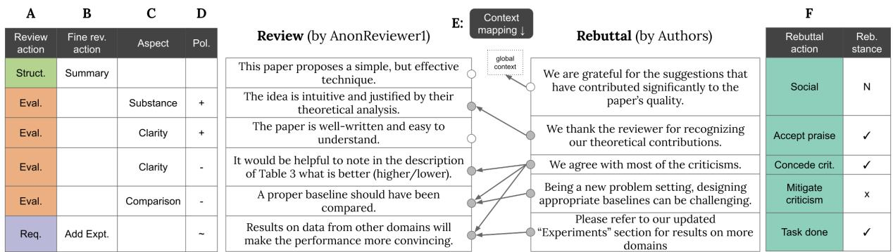
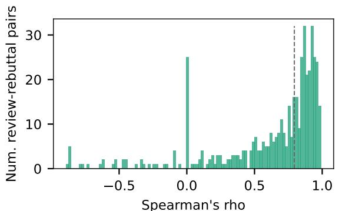
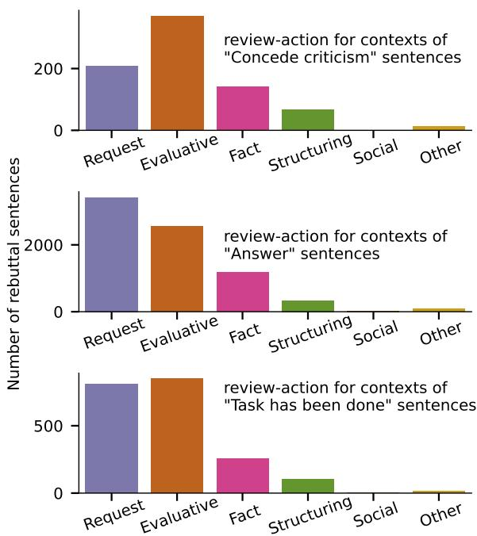
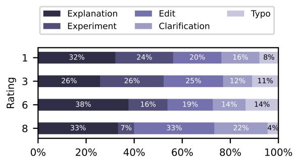
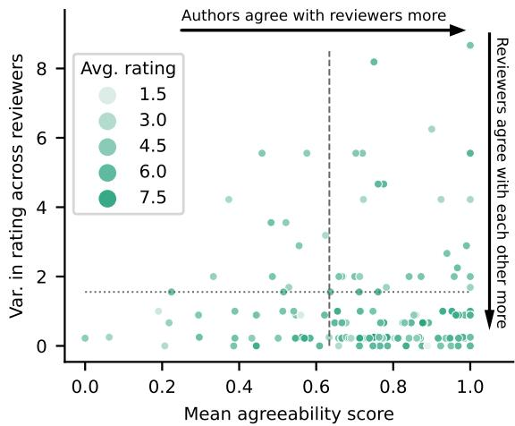
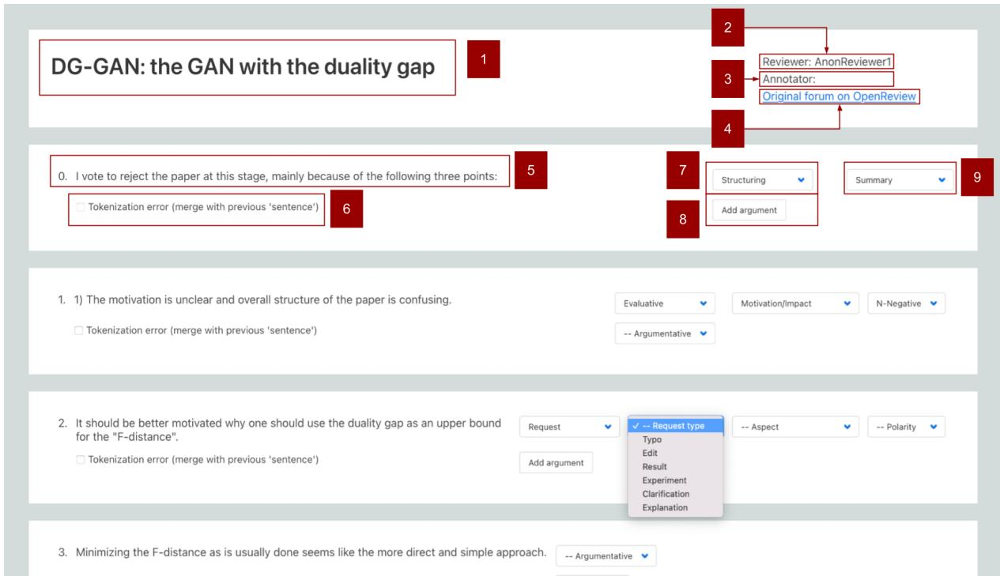
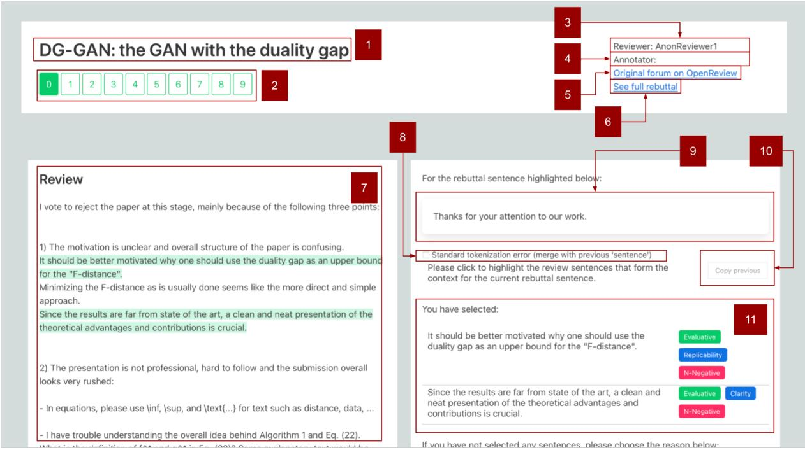
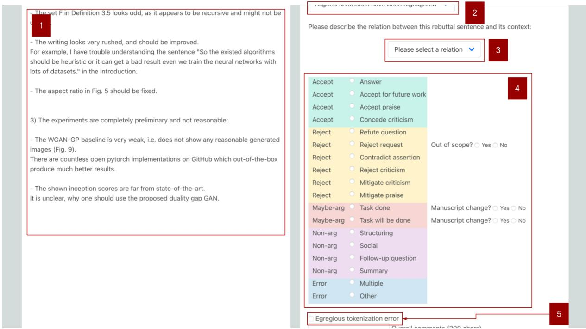
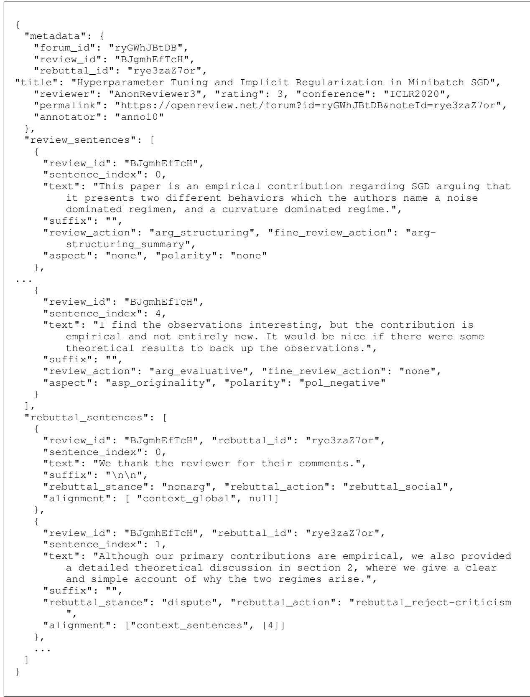
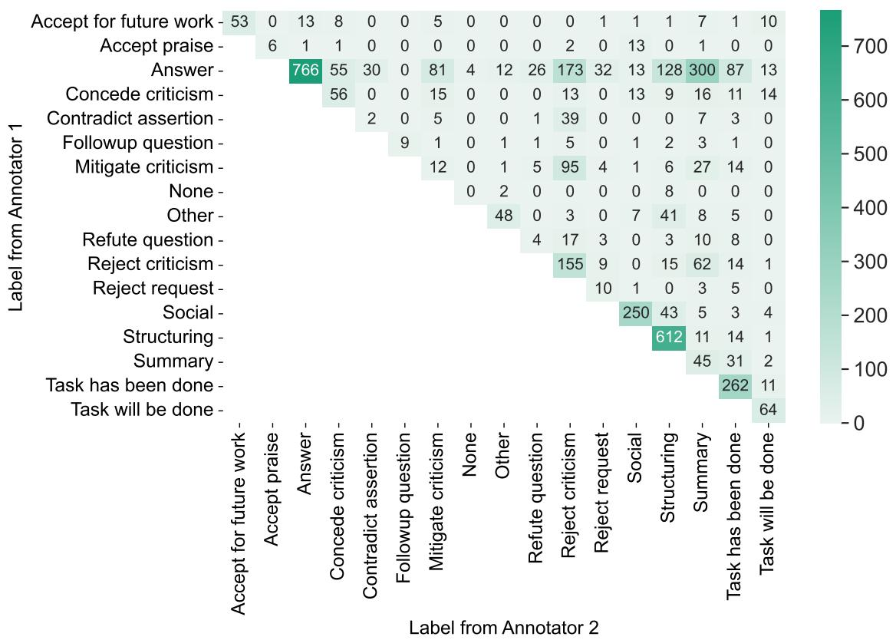

# DISAPERE: A Dataset for Discourse Structure in Peer Review Discussions

Neha Nayak Kennard

Akshay Sharma

Tim O’Gorman

Pranay Kumar Yelugam

Chhandak Bagchi

Hamed Zamani

Rajarshi Das Matthew Clinton Andrew McCallum

University of Massachusetts Amherst

{kennard, togorman, rajarshi, akshaysharma, cbagchi, mfclinton, pyelugam, zamani, mccallum}@cs.umass.edu

## Abstract

At the foundation of scientific evaluation is the labor-intensive process of peer review. This critical task requires participants to consume vast amounts of highly technical text. Prior work has annotated different aspects of review argumentation, but discourse relations between reviews and rebuttals have yet to be examined.

We present DISAPERE, a labeled dataset of 20k sentences contained in 506 review-rebuttal pairs in English, annotated by experts. DIS-APERE synthesizes label sets from prior work and extends them to include fine-grained annotation of the rebuttal sentences, characterizing their context in the review and the authors stance towards review arguments. Further, we annotate every review and rebuttal sentence.

We show that discourse cues from rebuttals can shed light on the quality and interpretation of reviews. Further, an understanding of the argumentative strategies employed by the reviewers and authors provides useful signal for area chairs and other decision makers.

## 1 Introduction

Peer review performs the essential role of quality control in the dissemination of scientific knowledge. The recent rapid increase in academic output places an immense burden on decision makers such as area chairs and editors, as their decisions must take into account not only extensive manuscripts, but enormous additional amounts of technical text including reviews, rebuttals, and other discussions.

One long term goal of research in peer review is to support decision makers in managing their workload by providing tools to help them efficiently absorb the discussions they must read. While machine learning should not be used to produce condensed accounts of the peer review text due to the risk of amplifying biases (Zhao et al., 2017), ML tools could nevertheless help manage information overload by identifying patterns in the data, such as argumentative strategies, goals, and intentions.

Any such research requires an extensive labeled dataset. While the OpenReview platform (Soergel et al., 2013) has made it easy to obtain unlabeled public peer review text, labeling this data for supervised NLP requires highly qualified annotators. Correct interpretation of the discourse structure of the text requires an understanding of the technical content, precluding the use of standard crowdsourcing techniques. Prior work on discourse in peer review has focused this qualified labor force on labeling arguments extracted from the text, which enables the complete annotation of more examples, at the expense of research on non-argumentative behaviors in peer review. While there has been extensive research and deep analysis of different aspects of peer review, the taxonomies used to describe review argumentation are disparate and not directly compatible. Finally, there has been limited research into understanding the discourse relations between rebuttals and reviews (Cheng et al., 2020; Bao et al., 2021), and none so far into the discourse structure of rebuttals.

This paper presents DISAPERE (DIscourse Structure in Academic PEer REview), a dataset focusing on the interaction between reviewer and author1. We give reviews and rebuttals equal importance, and emphasize the relations between them. To enable the study of behaviors beyond the core arguments, we also annotate every sentence of both the review and rebuttal, and provide fine-grained labels for non-argumentative types. We annotate at the sentence level not only for completeness but also to avoid the propagation of errors from argument detection. We annotate four properties (REVIEW-ACTION, FINE-REVIEW-ACTION, ASPECT, POLARITY) of each review sentence, where the set of properties and their values were developed by synthesizing taxonomies from prior work. We also annotate each sentence of a rebuttal with a fine-grained label indicating the author’s intentions and commitment, and a link to the set of review sentences that form its context. Figure 1 shows the DISAPERE annotation scheme on a minimal, fictional example review-rebuttal pair.

  
Figure 1: A depiction of our annotation scheme on a minimal, fictional review-rebuttal pair. A: REVIEW-ACTION , including Structuring, Request, Evaluation; B: FINE-REVIEW-ACTION , fine-grained categorization of Structuring and Request sentences; C: ASPECT , indicating the qualities of the manuscript being commented upon D: POLARITY indicating whether these comments are positive or negative in nature. E: Each sentence in the rebuttal is mapped to zero or more sentences in the review, which constitute its context. This is a many-to-many relation. F: The sentences in the rebuttal are labeled with domain-specific discourse acts (REBUTTAL-ACTION ); each discourse act may be categorized according to whether it concurs with (✓) or disputes ( ) the premise of the context it is responding to.

DISAPERE is intended as a comprehensive and high-quality test collection, along with training data to fine-tune models. Our annotations are carried out by graduate students in computer science who have undergone training and calibration, amounting to over 850 person-hours of annotation work. Much of the test data is double-annotated, and we report inter-annotator agreement on all aspects of the annotation. We describe the performance of state of the art models on the tasks of predicting labels and contexts, showing that interesting ambiguities in the data provide the NLP community with research challenges. We also show an example that demonstrates how decision makers could use models like these to understand trends and inform policies for future conferences (§ 5).

The contributions of this paper are as follows: (1) a new labeled training dataset of 506 reviewrebuttal pairs (over 20k sentences) of peer review discussion text in English, where review sentences are annotated with four properties, and rebuttal sentences are annotated with context and labels from a novel scheme to describe discourse structure; (2) a taxonomy of discourse labels synthesizing prior work on discourse in peer review and extending it to add useful subcategories; (3) a summary of the performance of baseline models on the dataset (§ 6); (4) examples of analyses on the dataset that could benefit peer review decision makers (§§ 4 and 5), and (5) extensive annotation guidelines and software to support future labeling efforts.

## 2 Related work

The design of this dataset draws upon extensive, but disparate prior work on this topic. Many works, some addressed below, have taken advantage of the availability of review text hosted on OpenReview.

Argument-level review labeling Prior work has developed label sets that address different phenomena. Hua et al. (2019) introduced the study of discourse structure in peer review by annotating argumentative propositions in the AMPERE dataset with a set of labels tailored to the peer review domain (EVALUATION, REQUEST, FACT, REFERENCE, and QUOTE). Similarly, Fromm et al. (2020)’s AMSR dataset frames the problem as an argumentation process, in which the stance of each argument towards the paper’s acceptance or rejection is of paramount importance. Both view peer review as argumentation, using argument mining techniques to highlight spans of interest.

While its goal is not to examine discourse structure per se, Yuan et al. (2021) uses polarity labels to indicate each argument’s support or attack of the authors’ bid for acceptance. Besides polarity, these examples follow Chakraborty et al. (2020) by annotating each argument with the aspect of the paper it comments on.2 In contrast to Yuan et al. (2021), we do not attempt or recommend generating peer review text, instead focusing on analyzing human-generated text in peer review.

Review-rebuttal interactions We also expand on work by Cheng et al. (2020), who first annotated discourse relations between sentences in reviews and rebuttals. While Cheng et al. (2020, 2021) present new deep learning architectures, in this paper we focus on the creation and comprehensive annotation of a new dataset, illustrated with results from some less specialized baseline models.

Other research into rebuttals includes Gao et al. (2019). Besides their main finding that reviewers rarely change their rating in response to rebuttals, they find that more specific, convincing and explicit responses are more likely to elicit a score change. Observations from this paper are formalized into rebuttal action labels in DISAPERE.

Comparison of datasets In DISAPERE we attempted to unify these schemas to form a single hierarchical schema for review discourse structure. We then expanded this hierarchical schema to introduce fine-grained classes for implicit and explicit requests made by the reviewers. The details of the correspondence between DISAPERE labels and those from prior work are summarized in Appendix A. In contrast to prior work, DISAPERE labels discourse phenomena at the sentence level rather than the argument level. This enables more thorough coverage of the text while avoiding the propagation of errors from machine learning models earlier in the annotation pipeline. While using manually defined discourse units (above or below the sentence level) may more precisely capture some discourse information, a separate pass of discourse segmentation can hinder the use of discourse datasets, as achieving consistent and replicable annotation of argument units is known to be highly challenging (Trautmann et al., 2020), and also because few works actually tackle unit segmentation (Ajjour et al., 2017).

## 3 Dataset

Each example in DISAPERE consists of a pair of texts: a review and a rebuttal. Labels for reviews and rebuttal sentences are described below. Review sentence labels are summarized in Table 2, and rebuttal sentence labels in Table 3.

<table><tr><td>Dataset</td><td>AMRE</td><td>ASSR</td><td>AS-iew</td><td>APE</td><td>DIPRE</td></tr><tr><td># examples # labels</td><td>400 10k</td><td>77 1.4k</td><td>1k 5.7k</td><td>4.7k 130k</td><td>506 46k</td></tr><tr><td>Reiew Polarity Aspect Non-arg.</td><td>Arg. stmts. √ Arg. types √</td><td>√ √</td><td>√ √</td><td>√</td><td>√ √ √ √</td></tr><tr><td>Reuual</td><td>All sents. Included? Arg. stmts. Context Arg. types</td><td></td><td></td><td>√ √</td><td>√ √ √ √</td></tr></table>

Table 1: Comparison between our dataset and prior work: AMPERE (Hua et al., 2019), AMSR (Fromm et al., 2020), ASAP-Review (Yuan et al., 2021), APE (Cheng et al., 2020). Arg.stmts.: Are argumentative statements highlighted?; Arg. types: Are subtypes of argumentative statements labeled?; Non-arg: Are nonargumentative statements labeled?; All sents.: Are labels provided for all sentences?; Context: Are rebuttal texts’ contexts in the review provided? DISAPERE is the only work to annotate every sentence in the review and rebuttal, and the only work that applies discourse labels to the author’s actions in the rebuttal.

## 3.1 Review sentence labels

## 3.1.1 Review actions

REVIEW-ACTION annotations characterize a sentence’s intended function in the review. Annotators label each sentence with one of six coarsegrained sentence types including evaluative and fact sentences, request sentences (including questions, which are requests for information), as well as non-argument types: social, and structuring for organization of the text.

## 3.1.2 Fine-grained review actions

We also extend two of these review actions with subtypes: structuring sentences include headers, quotations, or summarization sentences, and request sentences are subdivided by the nature of the request, distinguishing between clarification of factual information, requests for new experiments, requests for an explanation (e.g. of motivations or claims), requests for edits, and identification of minor typos.

<table><tr><td>Category</td><td>Label</td><td>Description</td><td>Percentage</td></tr><tr><td></td><td>Evaluative</td><td>A subjective judgement of an aspect of the paper</td><td>32.83%</td></tr><tr><td rowspan="5">REV-VION</td><td>Structuring</td><td>Text used to organize an argument</td><td>27.70%</td></tr><tr><td>Request</td><td>A request for information or change in regards to the paper</td><td>19.82%</td></tr><tr><td>Fact</td><td>An objective truth, typically used to support a claim</td><td>8.55%</td></tr><tr><td>Social</td><td>Non-substantive text typically governed by social conventions</td><td>1.41%</td></tr><tr><td>Other</td><td>All other sentences</td><td>9.71%</td></tr><tr><td rowspan="6">ASECT</td><td>Substance</td><td>Are there substantial experiments and/or detailed analyses?</td><td>17.09%</td></tr><tr><td>Clarity</td><td>Is the paper clear, well-written and well-structured?</td><td>11.08%</td></tr><tr><td>Soundness/Correctness</td><td>Is the approach sound? Are the claims supported?</td><td>9.58%</td></tr><tr><td>Originality</td><td>Are there new topics, technique, methodology, or insights?</td><td>3.85%</td></tr><tr><td>Motivation/Impact</td><td>Does the paper address an important problem?</td><td>3.69%</td></tr><tr><td>Meaningful Comparison Replicability</td><td>Are the comparisons to prior work sufficient and fair? Is it easy to reproduce and verify the correctness of the results?</td><td>3.15% 2.86%</td></tr><tr><td rowspan="2">POLARITY</td><td>Negative</td><td>Negatively describes an aspect of the paper (reason to reject)</td><td>29.43%</td></tr><tr><td>Positive</td><td>Positively describes an aspect of the paper (reason to accept)</td><td>11.16%</td></tr><tr><td rowspan="6">FI-RE-RON Struc.</td><td></td><td></td><td></td></tr><tr><td>Summary</td><td>Reviewer&#x27;s summary of the manuscript</td><td>18.17%</td></tr><tr><td>Heading</td><td>Text used to organize sections of the review</td><td>8.54%</td></tr><tr><td>Quote</td><td>A quote from the manuscript text</td><td>1.00%</td></tr><tr><td>Explanation</td><td>Request to explain scientific choices (question)</td><td>5.50%</td></tr><tr><td>Experiment</td><td>Request for additional experiments or results</td><td>4.78%</td></tr><tr><td rowspan="4">Reest</td><td>Edit</td><td>Request to edit the text in the manuscript</td><td>4.14%</td></tr><tr><td>Clarification</td><td>Request to clarify the meaning of some text (question)</td><td>2.80%</td></tr><tr><td>Typo</td><td></td><td></td></tr><tr><td></td><td>Request to fix a typo in the manuscript</td><td>1.98%</td></tr></table>

Table 2: A list of the review sentence labels, their descriptions, and the percentage of review sentences they apply to. Labels from all categories besides REVIEW-ACTION are optional, and thus may not add up to 100%.

## 3.1.3 Aspect and polarity

ASPECT annotations follow the ACL review form (Chakraborty et al., 2020; Yuan et al., 2021). These distinguish clarity, originality, soundness/correctness, replicability, substance, impact/motivation, and meaningful comparison. Following Yuan et al. (2021), arguments with an ASPECT are also annotated for POLARITY. We label positive and negative polarities. ASPECT and POLARITY are applied to sentences whose REVIEW-ACTION value is evaluative or request.

## 3.2 Rebuttal sentence labels

We annotate two properties of each rebuttal sentence: a REBUTTAL-ACTION label characterizing its intent, and its CONTEXT in the review in the form of a subset of review sentences.

## 3.2.1 Rebuttal actions

The 14 rebuttal actions (Table 3) are divided into three REBUTTAL-STANCE categories (concur, dispute, non-arg) based on the author’s stance towards the reviewer’s comments.

(1) concur: The author concurs with the premise of the context. This includes answering a question or discussing a requested change that has been made to the manuscript, conceding a criticism in an evaluative sentence. (2) dispute: The author disputes the premise of the context. The rebuttal sentence may reject a criticism or request, disagree with an underlying fact or assertion, or mitigate criticism (accepting a criticism while, e.g., arguing it to be offset by other properties). (3) non-arg: Encompasses rebuttal actions including social actions (such as thanking reviewers), and structuring labels, for sentences that organize the review.

Responses to requests are further annotated: if the author concurs, we record whether the task has been completed by the time of the rebuttal, or promised by the camera ready deadline; if the author disputes, we record whether the task was deemed to be out of scope for the manuscript.

## 3.2.2 Rebuttal context

We refer to the set of sentences which a rebuttal sentence is responding to as the context of that sentence, with special labels for when referring to the entire review (global context) or the empty set (no context). By not mandating a fixed discourse chunking, these annotations may handle situations when some rebuttal sentences respond to large sections of text, and other rebuttal sentences respond to specific sentences within those sections.

<table><tr><td>Category</td><td>Label</td><td>Description</td><td>Reply to</td><td>Percentage</td></tr><tr><td rowspan="7">Cocur Arttve</td><td>Answer</td><td>Answer a question</td><td>Request</td><td>32.76%</td></tr><tr><td>Task has been done</td><td>Claim that a requested task has been completed</td><td>Request</td><td>8.58%</td></tr><tr><td>Concede criticism</td><td>Concede the validity of a negative eval. statement</td><td>Evaluative</td><td>2.70%</td></tr><tr><td>Task will be done</td><td>Promise a change by camera ready deadline</td><td>Request</td><td>2.01%</td></tr><tr><td>Accept for future work</td><td>Express approval for a suggestion, but for future work</td><td>Request</td><td>1.30%</td></tr><tr><td>Accept praise</td><td>Thank reviewer for positive statements</td><td>Evaluative</td><td>0.35%</td></tr><tr><td>Reject criticism</td><td>Reject the validity of a negative eval. statement</td><td>Evaluative</td><td>10.37%</td></tr><tr><td rowspan="5">Dispute</td><td>Mitigate criticism</td><td>Mitigate the importance of a negative eval. statement</td><td>Evaluative</td><td>2.43%</td></tr><tr><td>Reject request</td><td>Reject a request from a reviewer</td><td>Request</td><td>1.16%</td></tr><tr><td>Refute question</td><td>Reject the validity of a question</td><td>Request</td><td>0.95%</td></tr><tr><td>Contradict assertion</td><td></td><td></td><td></td></tr><tr><td></td><td>Contradict a statement presented as a fact</td><td>Fact</td><td>0.86%</td></tr><tr><td rowspan="5">Non-aarg</td><td>Structuring Summary</td><td>Text used to organize sections of the review Summary of the rebuttal text</td><td></td><td>17.82%</td></tr><tr><td>Social</td><td>Non-substantive social text</td><td></td><td>7.94%</td></tr><tr><td></td><td></td><td></td><td>6.71%</td></tr><tr><td>Followup question</td><td>Clarification question addressed to the reviewer</td><td></td><td>0.32%</td></tr><tr><td>Other</td><td>All other sentences</td><td></td><td>3.75%</td></tr></table>

Table 3: A list of the rebuttal sentence labels, their descriptions, and the percentage of rebuttal sentences they apply to. The “Reply to” column shows the REVIEW-ACTION types that a particular rebuttal type would canonically reply to. Each rebuttal sentence has exactly one REBUTTAL-ACTION label, so these percentages add up to 100%.

## 3.3 Data Source and Annotation

DISAPERE uses English text from scientific discussions on OpenReview (Soergel et al., 2013), which makes peer review reports available for research purposes. We draw review-rebuttal pairs from the International Conference on Learning Representations (ICLR) in 2019 and 2020, resulting in text within the domain of machine learning research. Review-rebuttal pairs are split into train, development and test sets in a 3:1:2 ratio such that all texts associated with any manuscript occur in the same subset. Overall statistics for the dataset are summarized in Table 4.

Authors are able to respond to each ICLR review by adding a comment. Although rebuttals are not formally named, we consider direct replies by the author to the initial review comment to constitute a rebuttal. While multi-turn interactions are possible, we focus on reviews and initial responses, and leave study of extended discussion for future work. The text is separated into sentences using the spaCy (Honnibal and Montani, 2017) sentence separator.

Annotation was accomplished with a custom annotation tool designed for this task, which is available as part of the code release accompanying DISAPERE. The tool is described in detail in Appendix B. Annotators annotate each sentence of a review, then examine the rebuttal sentences in order, selecting sets of review sentences to form their context. While this linking between sentences does not explicitly align multi-sentence chunks as in pipelined approaches to discourse alignment (Cheng et al., 2020), we note that since multiple sentences may be aligned to the same set of sentences in the review, some discourse structure is nevertheless latently implied.

<table><tr><td></td><td>Train</td><td>Dev</td><td>Test</td></tr><tr><td>Num. review-rebuttal pairs</td><td>251</td><td>88</td><td>167</td></tr><tr><td>Num. manuscripts</td><td>94</td><td>37</td><td>57</td></tr><tr><td>Num. adjudicated pairs</td><td>0</td><td>0</td><td>65</td></tr><tr><td>Num. review sentences</td><td>5216</td><td>1484</td><td>3246</td></tr><tr><td>Num. rebuttal sentences</td><td>5805</td><td>2015</td><td>3283</td></tr><tr><td>Num. review tokens</td><td>112k</td><td>33k</td><td>70k</td></tr><tr><td>Num. rebuttal tokens</td><td>131k</td><td>44k</td><td>75k</td></tr></table>

Table 4: Statistics for the dataset. Where possible, multiple reviews for the same manuscript were annotated. All reviews for any particular manuscript fall within the same train/dev/test split. Adjudicated pairs are those that were annotated by multiple annotators, and had disagreements resolved by an experienced annotator. All test set pairs are double-annotated. While the original sentence boundaries were maintained, tokenization within sentences was carried out using Stanza(Qi et al., 2020).

## 3.4 Agreement

We report Cohen’s κ (Cohen, 1960) on the IAA of labeling both review and rebuttals, treating each sentence as a labeling unit (Table 5). The annotators for each example are selected randomly from the pool of 10 annotators. Cohen’s κ is calculated for sentences annotated at least twice. Where more than two annotations were produced, we calculate $\kappa$ between all pairs and normalize by the number of possible pairs. The results show between moderate and substantial chance-corrected agreement between annotators, for both REBUTTAL-ACTION and REBUTTAL-STANCE labels (Appendix D provides details about agreement on context sentences). While these IAA scores do illustrate the noise of the task, note that this is not highly unusual for discourse labeling tasks – e.g. Habernal and Gurevych (2017) and Miller et al. (2019) both report $\alpha _ { u }$ between 0.4 and 0.5.

<table><tr><td rowspan=1 colspan=1>Label                       Cohen&#x27;s κ</td></tr><tr><td rowspan=1 colspan=1>REVIEW-ACTION            0.605</td></tr><tr><td rowspan=1 colspan=1>FINE-REVIEW-ACTION     0.583</td></tr><tr><td rowspan=1 colspan=1>POLARITY                    0.561</td></tr><tr><td rowspan=2 colspan=1>REBUTTAL-STANCE        0.513</td></tr><tr><td rowspan=1 colspan=1>REBUTTAL-ACTION 0.479</td></tr></table>

Table 5: IAA for review labels (top) and rebuttals (bottom), scored on double annotation. IAA is reported on 65 double-annotated examples, all of which fall in the test set of DISAPERE.

## 4 Analysis

## 4.1 Context types

We separate the different types of rebuttal contexts in terms of the number and relative position of selected review sentences in Table 6, along with the four cases in which the context cannot be described as a subset of review sentences. Notably, 84.81% of sentences are linked to some review context. A small number of sentences refer to other sentences within the rebuttal, rather than any review context, posing a challenge for future work.

<table><tr><td></td><td>Context type</td><td>Rebuttal sents. (Num.) (%)</td></tr><tr><td>seleced Sets.</td><td>Multiple contiguous Single sentence</td><td>4696 42.29% 4313 38.85%</td></tr><tr><td></td><td>Mult. non-contiguous</td><td>407 3.67%</td></tr><tr><td></td><td>Global context Context in rebuttal</td><td>816 7.35% 647 5.83%</td></tr><tr><td>Nonns ts. seleced</td><td>No context</td><td>152</td></tr><tr><td></td><td></td><td>1.37%</td></tr><tr><td></td><td>Context error Cannot be determined</td><td>61 0.55% 11 0.10%</td></tr></table>

Table 6: Different types of rebuttal sentence contexts. Top: Over 84% of sentences are linked to a subset of sentences in the review. Bottom: sentences not linked to any particular subset of review sentences.

## 4.2 Alignment

One might reasonably hypothesize that the task of alignment between rebuttal and review sentences would be trivial, since authors are likely to respond to each point in the review in order. We can show that this is not the case. In Figure 2, we calculate Spearman’s $\rho$ between rebuttal sentence indices and their aligned review sentence indices. Rebuttals responding to each point in order would achieve $\rho = 1 . 0 ;$ this case is rare. Many examples with positive $\rho < 1 . 0$ indicate that authors do respond to points approximately in order, but a simple mapping based on order alone would not capture the correct alignment. Thus, while linear inductive bias may be beneficial to alignment models, the task of determining rebuttal sentences’ contexts is not trivial.

  
(rebuttal sent idxs v/s aligned review sent idxs)  
Figure 2: Spearman’s $\rho$ between rebuttal sentence indices and aligned review sentence indices. The dashed line indicates the median $\rho$ value, which falls at 0.794.

  
Figure 3: Distribution over REVIEW-ACTION for the context sentences of three REBUTTAL-ACTIONs. The canonical REVIEW-ACTION is marked by cross hatching. Note that authors sometimes interpret requests as criticisms (“Concede criticism”); often respond to evaluative sentences as if they are questions (“Answer”), and sometimes treat criticisms in the form of evaluative sentences as requests which they then carry out. (“Task has been done”)

## 4.3 Author interpretations of criticism

In our taxonomy, each argumentative REBUTTAL-ACTION corresponds to a particular REVIEW-ACTION, which we refer to as its canonical REVIEW-ACTION (listed in ‘Reply to’ column of Table 3). For example, answers are generally responses to requests, while conceding criticism is usually a response to an evaluative statement. Annotations revealed that authors often interpreted review sentences as if they embodied REVIEW-ACTIONs besides the canonical one, in a way that furthered the author’s argumentative goal. For example, authors often responded to evaluative statements as if they were requests, perhaps in order to appease a reviewer, although no action was explicitly requested. Figure 3 shows the distribution of contexts for three different REBUTTAL-ACTIONs.

## 4.4 Relating discourse features to rating

Figure 4 shows one possible analysis taking into account the rating of the review. We show the distribution of FINE-REVIEW-ACTION labels of requests with review ratings. It appears that high-scoring manuscripts are rarely asked to add experiments, and are polished enough to not elicit requests to fix typos. Interestingly, low-scoring manuscripts have the second-lowest occurrence of typo requests, which could be due to the preponderance of other requests, but this bears further examination.

  
Figure 4: Distribution of REVIEW-ACTION labels, separated by rating

## 5 Application: Agreeability

Gao et al. (2019) showed that reviewers do not appear to act upon the rebuttals responding their reviews. It is possible that this is due to paucity of time on the reviewers’ part. It is also common practice for area chairs to use review variance across a manuscript’s reviews as a practical heuristic to decide which manuscripts need their attention. We propose that discourse information such as that described by DISAPERE can be used to provide heuristics that are data-driven, yet interpretable, and leverage information from the content of reviews rather than just numerical scores, resulting in better decision making.

One such measure is agreeability, which we define as the ratio of CONCUR sentences to argumentative sentences in a rebuttal, i.e.: agreeability = $\frac { n _ { c o n c u r } } { n _ { c o n c u r } + n _ { d i s p u t e } }$ . We argue that low agreeability can indicate problematic reviews even in cases where the variance in scores does not reveal an issue, as illustrated in Figure 5. Agreeability is only weakly correlated with rating, with Pearson’s $r = 0 . 3 4 7$ In Figure 5, 18% (28/159) of manuscripts would not meet the bar for high variance scores (top quartile), although their low agreeability (bottom quartile) indicates that they may merit closer attention from area chairs3.

  
Figure 5: Mean agreeability for a manuscript’s reviews v/s reviewer variance. Manuscripts above the dotted line are in the top quartile of rating variance, and are more likely to be reviewed by area chairs. Manuscripts to the left of the dashed line are in the bottom quartile of mean agreeability, in which authors take issue with the premises of reviewers’ comments. The color of the dots indicates the mean of the reviewers’ ratings.

## 6 Baselines

Two types of machine learning tasks can be defined in DISAPERE. First, a sentence-level classification task for each of the four review labels and the two levels of rebuttal labels. Second, an alignment task in which, given a rebuttal sentence, the set of review sentences that form its context are to be predicted.

The models described below are not intended to introduce innovations in discourse modeling, rather, we intend to show the off-the-shelf performance of state-of-the-art models, and indicate through error analysis the phenomena that are yet to be captured.

## 6.1 Sentence classification

For the six classification tasks, we use bert-base (Devlin et al., 2019) to produce sentence embeddings for each sentence, then classify the representation of the [CLS] token using a feedforward network.

We report macro-averaged F1 scores, shown in Table 7. In general, F1 is lower for tasks with larger label spaces. While the performance is reasonable in most cases, there is still room for improvement. While ASPECT achieves a particularly low F1 score, its κ is within the bounds of moderate agreement; thus, this must be accounted for by the inherent difficulty of the task rather than a deficit in data quality.

<table><tr><td>Classification task</td><td>Macro F1 (test)</td><td>Cohen&#x27;s κ</td><td>Num. labels</td></tr><tr><td>REVIEW-ACTION</td><td>60.42%</td><td>0.605</td><td>7</td></tr><tr><td>FINE-REVIEW-ACTION</td><td>44.83%</td><td>0.583</td><td>10</td></tr><tr><td>ASPECT</td><td>38.28%</td><td>0.447</td><td>9</td></tr><tr><td>POLARITY</td><td>70.88%</td><td>0.561</td><td>3</td></tr><tr><td>REBUTTAL-STANCE</td><td>43.36%</td><td>0.513</td><td>4</td></tr><tr><td>REBUTTAL-ACTION</td><td>31.23%</td><td>0.479</td><td>17</td></tr></table>

Table 7: Sentence classification results. Top: review labels; Bottom: rebuttal labels.

As one might expect, errors in the classification results largely mirror disagreements in the annotations, which in turn reflect particularly ambiguous utterances. One example is the occurrence of rhetorical questions, such as (1) in Table 8, incorrectly labeled as request instead of evaluative. In fact, for sentences such as (1), additional context would disambiguate its type: the reviewer answers the question in the next sentence, and hence both sentences were labeled evaluative. Similarly, (2) was labeledfact, but since it is an integral part of a reviewer’s argument against the soundness of the paper, should have been labeled evaluative. Certain reviewers also use conventions that do not fit the general schema we observed when developing DIS-APERE. For example, (3), an opinionated heading, could be considered both structuring and evaluative. Finally, certain lexical cues a model may pick up on can be quite subtle. For example, though they share a prefix, sentences (4) and (5) are clearly evaluative and request respectively.

## 6.2 Rebuttal context alignment

We model rebuttal context alignment as a ranking task. Ideally, a model should rank all relevant review sentences higher than non-relevant review sentences. As a baseline, we use an information retrieval (IR) model based on BM25 that, given a rebuttal sentence ranks all the corresponding review sentences. We also report results from a neural sentence alignment model based on a twotower Siamese-BERT (S-BERT) model (Reimers and Gurevych, 2019). We add a NO\_MATCH sentence to the review, to which rebuttal sentences without context sets in the review are aligned. Then, each review and rebuttal sentence is encoded independently using a S-BERT encoder and the similarity between two sentences is computed using cosine similarity. We initialize with a model4 pre-trained on various sentence-pair datasets. Alignment is evaluated using mean reciprocal rank (MRR) and Mean Average Precision (MAP).

<table><tr><td></td><td></td><td>Label (Pred.)</td></tr><tr><td>1</td><td>Can the proposed [...] function represent all function the authors used in the paper? Yes.</td><td>E (R)</td></tr><tr><td>2</td><td>Matrices can have either “horizontal&quot; or “vertical&quot;redundancy (or “other&quot; or neither).</td><td>E (F)</td></tr><tr><td>3</td><td>Solid technical innovation/contribution:</td><td>E</td></tr><tr><td>4</td><td>I am also wondering if the comparison with the baselines is fair.</td><td>E</td></tr><tr><td>5</td><td>I wonder if the authors ever looked at how much [...] determines the performance of the system?</td><td>R</td></tr></table>

Table 8: Example sentences including errors and challenging cases. E, R, F stand for evaluative, request and fact respectively. Letters in parentheses show the incorrect label from the model. Sentence (3) functions both as evaluative and structuring. Sentences (4) and (5) share a prefix but have different REVIEW-ACTIONs.

<table><tr><td>S-BERT</td><td>BM25</td></tr><tr><td>MAP 0.4409</td><td>0.5174</td></tr><tr><td>MRR 0.5022</td><td>0.5980</td></tr></table>

Table 9: Rebuttal context alignment results. The results of both models indicate significant scope for improvement.

Surprisingly, the BM25 model outperforms a neural model (Thakur et al., 2021). While this shows that lexical information is a useful signal, both models have significant scope for improvement, and lexical overlap is clearly not sufficient for this task. Importantly, neither of these models account for the context of the rebuttal sentence, and predict each sentence’s context independently. Incorporating this information is likely to lead to performance gains; however, we leave this investigation to future work.

## 7 Conclusion

As the burden of academic peer reviewing grows, it is important for program chairs and editors to act upon data-driven insights rather than heuristics, to make the best possible use of participants’ scarce time. Models trained on data like DISAPERE will allow decision makers to glean deep insights on the interactions occurring during peer review.

Almost all publicly available peer review data is from the domain of artificial intelligence, limiting the scope of DISAPERE and any similar project. While this means that models trained on DISAPERE won’t necessarily generalize to all new domains, we hope that with the detailed annotation guidelines and seamless data collection using the software provided with this paper support, users can build on our work, and ensure that their insights are robust to differences over time and across fields.

## 8 Ethics

The outcomes of peer review can have outsize effects on the careers of participating scholars. As machine learning models are known to amplify biases, we strongly recommend against using the outputs of any machine learning system to make decisions about individual cases. A dataset like DISAPERE is best used to survey participants’ behavior. Any interventions based on this information should be subjected to studies in order to ensure that they do not introduce or exacerbate bias.

## Acknowledgments

This material is based upon work supported in part by the National Science Foundation under Grant Numbers IIS-1763618, IIS-1922090, and IIS-1955567, in part by the Defense Advanced Research Projects Agency (DARPA) via Contract No. FA8750-17-C-0106 under Subaward No. 89341790 from the University of Southern California, in part by the Office of Naval Research (ONR) via Contract No. N660011924032 under Subaward No. 123875727 from the University of Southern California, in part by IBM Research AI through the AI Horizons Network, in part by the Chan Zuckerberg Initiative under the project Scientific Knowledge Base Construction, and in part by the Center for Intelligent Information Retrieval. Any opinions, findings and conclusions or recommendations expressed in this material are those of the authors and do not necessarily reflect those of the sponsors.

## References

Yamen Ajjour, Wei-Fan Chen, Johannes Kiesel, Henning Wachsmuth, and Benno Stein. 2017. Unit segmentation of argumentative texts. In Proceedings of the 4th Workshop on Argument Mining, pages 118–

128, Copenhagen, Denmark. Association for Computational Linguistics.

Jianzhu Bao, Bin Liang, Jingyi Sun, Yice Zhang, Min Yang, and Ruifeng Xu. 2021. Argument pair extraction with mutual guidance and inter-sentence relation graph. In Proceedings of the 2021 Conference on Empirical Methods in Natural Language Processing, pages 3923–3934, Online and Punta Cana, Dominican Republic. Association for Computational Linguistics.

Souvic Chakraborty, Pawan Goyal, and Animesh Mukherjee. 2020. Aspect-based sentiment analysis of scientific reviews. Proceedings ofthe ACM/IEEE Joint Conference on Digital Libraries in 2020.

Liying Cheng, Lidong Bing, Qian Yu, Wei Lu, and Luo Si. 2020. APE: Argument pair extraction from peer review and rebuttal via multi-task learning. In Proceedings of the 2020 Conference on Empirical Methods in Natural Language Processing (EMNLP), pages 7000–7011, Online. Association for Computational Linguistics.

Liying Cheng, Tianyu Wu, Lidong Bing, and Luo Si. 2021. Argument pair extraction via attention-guided multi-layer multi-cross encoding. In Proceedings of the 59th Annual Meeting of the Association for Computational Linguistics and the 11th International Joint Conference on Natural Language Processing (Volume 1: Long Papers), pages 6341–6353, Online. Association for Computational Linguistics.

Jacob Cohen. 1960. A coefficient of agreement for nominal scales. Educational and psychological measurement, 20(1):37–46.

Jacob Devlin, Ming-Wei Chang, Kenton Lee, and Kristina Toutanova. 2019. BERT: Pre-training of deep bidirectional transformers for language understanding. In Proceedings ofthe 2019 Conference of the North American Chapter ofthe Associationfor Computational Linguistics: Human Language Technologies, Volume 1 (Long and Short Papers), pages 4171–4186, Minneapolis, Minnesota. Association for Computational Linguistics.

Michael Fromm, Evgeniy Faerman, Max Berrendorf, Siddharth Bhargava, Ruoxia Qi, Yao Zhang, Lukas Dennert, Sophia Selle, Yang Mao, and Thomas Seidl. 2020. Argument mining driven analysis of peerreviews. arXiv preprint arXiv:2012.07743.

Yang Gao, Steffen Eger, Ilia Kuznetsov, Iryna Gurevych, and Yusuke Miyao. 2019. Does my rebuttal matter? insights from a major NLP conference. In Proceedings ofthe 2019 Conference ofthe North American Chapter of the Association for Computational Linguistics: Human Language Technologies, Volume 1 (Long and Short Papers), pages 1274–1290, Minneapolis, Minnesota. Association for Computational Linguistics.

Ivan Habernal and Iryna Gurevych. 2017. Argumentation mining in user-generated web discourse. Computational Linguistics, 43(1):125–179.

Matthew Honnibal and Ines Montani. 2017. spaCy 2: Natural language understanding with Bloom embeddings, convolutional neural networks and incremental parsing. To appear.

Xinyu Hua, Mitko Nikolov, Nikhil Badugu, and Lu Wang. 2019. Argument mining for understanding peer reviews. In Proceedings of the 2019 Conference ofthe North American Chapter ofthe Associationfor Computational Linguistics: Human Language Technologies, Volume 1 (Long and Short Papers), pages 2131–2137, Minneapolis, Minnesota. Association for Computational Linguistics.

Tristan Miller, Maria Sukhareva, and Iryna Gurevych. 2019. A streamlined method for sourcing discourselevel argumentation annotations from the crowd. In Proceedings of the 2019 Conference of the North American Chapter of the Association for Computational Linguistics: Human Language Technologies, Volume 1 (Long and Short Papers), pages 1790–1796, Minneapolis, Minnesota. Association for Computational Linguistics.

Peng Qi, Yuhao Zhang, Yuhui Zhang, Jason Bolton, and Christopher D. Manning. 2020. Stanza: A python natural language processing toolkit for many human languages. In Proceedings ofthe 58th Annual Meeting of the Association for Computational Linguistics: System Demonstrations, pages 101–108, Online. Association for Computational Linguistics.

Nils Reimers and Iryna Gurevych. 2019. Sentence-BERT: Sentence embeddings using Siamese BERTnetworks. In Proceedings ofthe 2019 Conference on Empirical Methods in Natural Language Processing and the 9th International Joint Conference on Natural Language Processing (EMNLP-IJCNLP), pages 3982–3992, Hong Kong, China. Association for Computational Linguistics.

David Soergel, Adam Saunders, and Andrew McCallum. 2013. Open scholarship and peer review: a time for experimentation.

Nandan Thakur, Nils Reimers, Andreas Rücklé, Abhishek Srivastava, and Iryna Gurevych. 2021. Beir: A heterogenous benchmark for zero-shot evaluation of information retrieval models.

Dietrich Trautmann, Johannes Daxenberger, Christian Stab, Hinrich Schütze, and Iryna Gurevych. 2020. Fine-grained argument unit recognition and classification. In Proceedings of the AAAI Conference on Artificial Intelligence, volume 34, pages 9048–9056.

Weizhe Yuan, Pengfei Liu, and Graham Neubig. 2021. Can we automate scientific reviewing?

Jieyu Zhao, Tianlu Wang, Mark Yatskar, Vicente Ordonez, and Kai-Wei Chang. 2017. Men also like shopping: Reducing gender bias amplification using

corpus-level constraints. In Proceedings ofthe 2017 Conference on Empirical Methods in Natural Language Processing, pages 2979–2989, Copenhagen, Denmark. Association for Computational Linguistics.

## A Rationale for taxonomy construction

Our label sets leverage ideas from and commonalities between existing work in this domain, including AMPERE (Hua et al., 2019), AMSR (Fromm et al., 2020) ASAP-Review (Yuan et al., 2021), and Gao et al. (2019):

• ASAP-Review’s polarity labels approximately correspond to arg-pos and arg-neg labels in AMSR

• AMSR and AMPERE each label nonargumentative sentences in a similar manner

• aspect labels from ASAP-Review apply only to certain types of sentences; namely request and evaluative sentences from AMPERE’s taxonomy.

• summary is an exception among ASAP-Review’s aspects, behaving similarly to AM-PERE’s quote. We thus include both of these under a structuring category.

• Further, in order to gauge the extent to which authors acquiesced to reviewers’ requests, we introduce a fine-grained categorization of the types of requests.

• Gao et al. (2019) enumerates some features of rebuttals, including expressing gratitude, promising revisions, and disagreeing with criticisms. We formalize these observations into our rebuttal label taxonomy.

## B Annotation tool

Two modes of annotation are possible. First, annotators can apply labels on a sentence-by-sentence basis. Multiple labeling schemas can be annotated simulatenously, with the option of adding constraints so that certain values govern possible values for other properties. This annotation mode is shown in Figure 6.

The second annotation mode can build on the output of the first annotation mode. Here, sentences of a focus text (the rebuttal) are presented in sequence, and annotators are permitted to select one or more of the sentences in the reference text (the review) which form the context of the sentence of the focus text. Further, a label can be applied to the alignment. This annotation mode is shown in Figure 7 and Figure 8.

  
Figure 6: Review annotation interface. Annotators select label values from dropdown menus for each review sentence in turn. [1] Title of the manuscript whose review is being annotated [2] Reviewer identifier [3] Annotator identifier (removed for anonymity) [4] Link to original forum, in case it is needed for context [5] Individual review sentence [6] Option to report sentence splitting error (sentence splitting generally suffered from false positives) [7] Dropdown for REVIEW-ACTION [8] Follow-up dropdownfor FINE-REVIEW-ACTION populated based on value in (7) [9] Button to add second REVIEW-ACTION if necessary (this was seldom used)

## C Annotated review-rebuttal pair

Figure 9 shows a truncated version of a reviewrebuttal pair from the train set of DISAPERE.

## D Context overlap analysis

As a proxy for agreement of rebuttal spans, we show the types of overlap between spans on rebuttal sentences from 81 examples annotated by two annotators in Table 10.

<table><tr><td>Type of context overlap</td><td>Num. rebuttal sentences</td><td>% rebuttal sentences</td></tr><tr><td>Exact match</td><td>914</td><td>53.11%</td></tr><tr><td>Partial match</td><td>492</td><td>28.59%</td></tr><tr><td>Agree none</td><td>122</td><td>7.09%</td></tr><tr><td>Disagree none</td><td>100</td><td>5.81%</td></tr><tr><td>No overlap</td><td>93</td><td>5.40%</td></tr></table>

Table 10: Types of context overlap. Full agreement is achieved in the top rows (exact match and ‘Agree none’, where both annotators agree that there is no appropriate subset of review sentences forming the context. in ‘Disagree none’, one annotator marks a subset of review sentences, while the other does not.

## E Additional Agreement Analysis

While some of the IAA scores on annotation are low, we note that the labels used in this task attempt to characterize relatively complex relationships in text. To give more insight into such disagreements, Figure 10 provides a confusion matrix regarding the REBUTTAL-ACTION labels. Recognizing that there are often situations in which users of a dataset will hope to reduce a label set, we provide some guidance as to which such merges may be acceptable and which are not.

Many disagreements come from three labels which might be said to exist upon a continuum – ANSWER, MITIGATE CRITICISM and REJECT CRIT-ICISM. We suggest that in the situation of needing to minimize IAA disagreement, one might consider first merging mitigate criticism into reject criticism. The kind of disagreements seen between the two are understandable but nuanced: the difference between saying that the reviewer has a point (but that they disagree on the relevance of that point) and disagreeing with the point itself. Out-of-context rebuttal sentences illustrating this are provided below as examples of this kind of ambiguous situation:

  
Figure 7: Rebuttal annotation interface. Annotators examine each rebuttal sentence in turn, selecting sentences as context and specifying REBUTTAL-ACTION. [1] Title of the manuscript whose review is being annotated [2] Buttons to navigate between rebuttal sentences. Each page refers to a single rebuttal sentence (See (9)) [3] Reviewer identifier [4] Annotator identifier (removed for anonymity) [5] Link to original forum, in case it is needed for context [6] Link to open pop-up window with full rebuttal text, in case it is needed for context [7] Full review text. When a review sentence is clicked, it is highlighted and its details appear in (11) [8] Option to report sentence splitting error (false positive) [9] Rebuttal sentence being annotated [10] Button to copy REBUTTAL-ACTION label and context from previous rebuttal sentence [11] Table showing details of selected context sentences from the review, with the labels the annotator provided The screenshot is continued in Figure 8.

  
Figure 8: Rebuttal annotation interface (continued from Figure 7). Annotators examine each rebuttal sentence in turn, selecting sentences as context specifying REBUTTAL-ACTION. [1] Full review text, continued from (7) in Figure 7. [2] Dropdown to select context type, in case context cannot be defined as a subset of review sentences. [3] Dropdown to select REBUTTAL-ACTION (keyboard navigation possible) [4] Buttons to select REBUTTAL-ACTION (in case mouse navigation is preferred) [5] Option to report egregious sentence splitting errors.

• We note that such rules are indeed limited to some extent, but they still capture a rather expressive fragment of answer set programs with restricted forms of external computations.

• The use of $C _ { p } ^ { v a l }$ for hyperparameter tuning was incidental and not a central point of our paper.

• We agree that the measure theoretic approach is not always necessary (indeedfor angular actions, it is not needed), but it is necessary for a very common scenario – clipped actions.

Furthermore, we note that (as illustrated in the confusion matrix) a wide range of disagreements are hard to distinguish from “answer” labels, as authors often attempt to frame disagreements as simple answers to questions.

  
Figure 9: A (truncated) example from the training set of DISAPERE.

  
Figure 10: Confusion matrix showing agreement between annotators for REBUTTAL-ACTION labels.