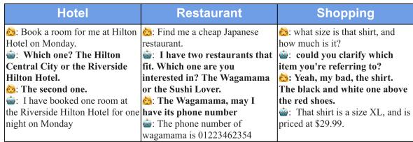
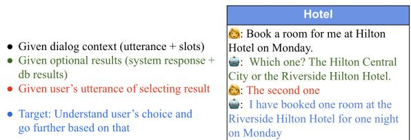
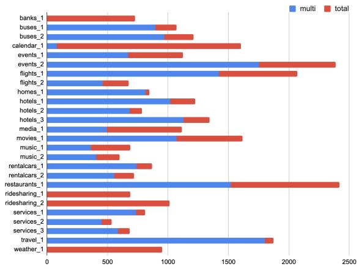
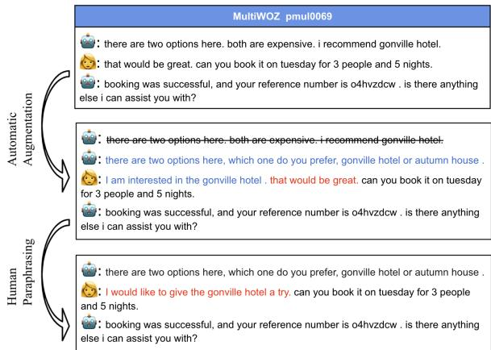
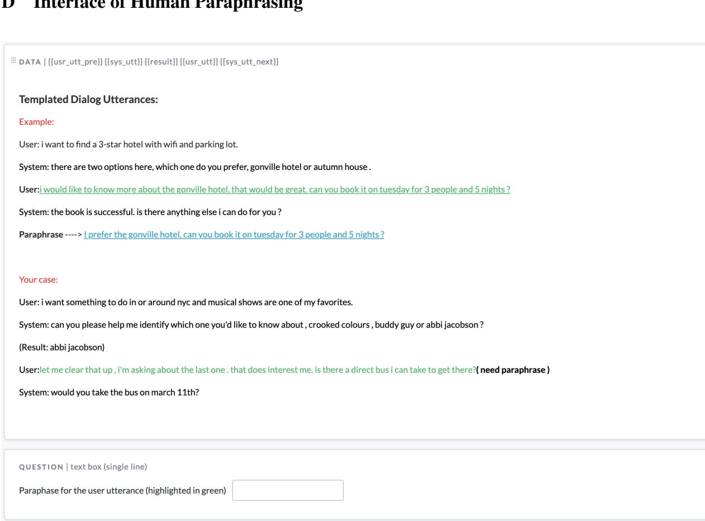
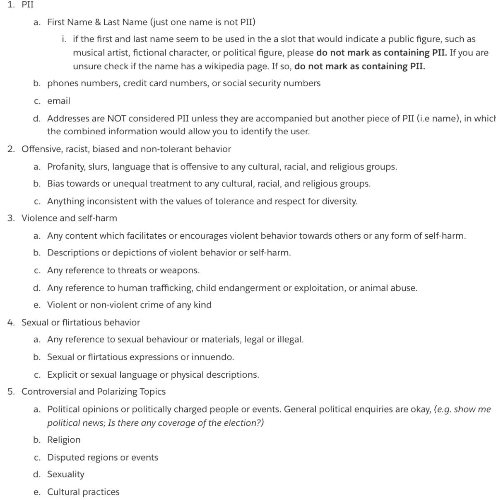

# Database Search Results Disambiguation for Task-Oriented Dialog Systems

Kun Qian†§, Satwik Kottur‡, Ahmad Beirami‡¶, Shahin Shayandeh‡, Paul Crook‡, Alborz Geramifard‡, Zhou Yu†, Chinnadhurai Sankar‡

†Columbia University

‡Meta AI

{kq2157, zy2461}@columbia.edu, beirami@google.com {skottur, shn, pacrook, alborzg, chinnadhurai}@fb.com

## Abstract

As task-oriented dialog systems are becoming increasingly popular in our lives, more realistic tasks have been proposed and explored. However, new practical challenges arise. For instance, current dialog systems cannot effectively handle multiple search results when querying a database, due to the lack of such scenarios in existing public datasets. In this paper, we propose Database Search Result (DSR) Disambiguation, a novel task that focuses on disambiguating database search results, which enhances user experience by allowing them to choose from multiple options instead of just one. To study this task, we augment the popular task-oriented dialog datasets (MultiWOZ and SGD) with turns that resolve ambiguities by (a) synthetically generating turns through a pre-defined grammar, and (b) collecting human paraphrases for a subset. We find that training on our augmented dialog data improves the model’s ability to deal with ambiguous scenarios, without sacrificing performance on unmodified turns. Furthermore, pre-fine tuning and multi-task learning help our model to improve performance on DSR-disambiguation even in the absence of in-domain data, suggesting that it can be learned as a universal dialog skill. Our data and code will be made publicly available.

## 1 Introduction

Task-oriented dialog systems have been widely deployed for popular virtual assistants, like Siri and Google Assistant. They help people with tasks such as booking restaurants and looking for a hotel by searching databases with constraints provided by users. After retrieving a result from the database, a system may continue by conducting actions like making a reservation or providing more information about receiving the result. However, there can be multiple results from the database that match the same constraints. For example, as shown in Fig. 1, the system finds two available hotels at different locations when the user is asking the system to help book a hotel. This kind of ambiguity stops system from proceeding until the system finds out which result the user looks for. Therefore, we need to enhance the system with the ability to resolve such ambiguity brought out by multiple items returned from database search. We call this type of ambiguity as database search result ambiguity (DSR-ambiguity).

  
Figure 1: Examples of disambiguation turns over three different domains.

Different from semantic ambiguous words (e.g. “orange” can be referred as either color or fruit), the DSR-ambiguity focuses on results from multiple database search results. Solving such disambiguation tasks consists of two steps: asking clarification questions and understanding user’s corresponding answers. While there is a relatively larger body of literature focusing on when and how to give out the clarification question (Rao and Daumé III, 2018; Rao and Daumé, 2019; Kumar and Black, 2020), the focus on understanding user’s answers/intents has been relatively sparse. Our work mainly focuses on improving model’s ability of understanding the answers by augmenting two existing task-oriented dialog datasets: MultiWOZ (Budzianowski et al., 2018) and Schema-Guided Dataset (SGD) (Rastogi et al., 2019).

MultiWOZ and SGD are the most popular largescale task-oriented dialog datasets, based on which most of the state-of-the-art dialog system models are commonly trained and evaluated. According to our analysis, there are around 66% dialogs of the dataset contains multiple dataset-searching results, which means the DSR-ambiguity exists.

In this setting, ambiguities are skipped and the model trained based on these datasets can hardly handle the cases where users prefer to make their own choices among all the results satisfies the constraints. Furthermore, users should be given more detailed information about search results. Ideally, dialog models should provide the information and assist users to make choices, rather than picking one from the result list and recommending it to users. It is not necessary to list all the results, but enumerating 2 or 3 options would help increase user’s engagement. To strengthen the model with the ability to handle the ambiguity, we propose to augment these two datasets with disambiguation turns, where the system provides all possible matched results and lets the user make their own decision based on the complete information.

Specifically, we first extract templates from the SIMMC 2.0 dataset (Kottur et al., 2021), which is a multi-modal task-oriented dialog dataset containing disambiguation turns but only covering two domains. Based on the extracted templates and database from MultiWOZ and SGD, we synthesize a one-turn dialog dataset, containing only the disambiguation turn, to check whether the model can learn the disambiguation from the data. To be applicable in reality, we expect the model to learn the skill of disambiguation without compromising the performance on other dialog skills. So, we propose to augment the MultiWOZ and SGD with disambiguation turns and train dialog models with the augmented dataset. To ensure naturalness and diversity of the automatically augmented dataset, we additionally recruit crowd-workers to paraphrase the modified turns.

## In conclusion, our contribution includes:

1. We propose Database Search Result Disambiguation, a new dialog task focused on understanding the user’s needs through clarification questions.

2. We provide a generic framework for augmenting disambiguation turns, and apply this framework to augment the two most popular task-oriented dialog datasets with disambiguation cases. We also conduct human paraphrasing for the augmented utterances in test sets.

3. We create a benchmark for the new task with pre-trained GPT2 model. The results show that our augmented dataset enhances the model’s disambiguation ability, while maintaining the performance on the original tasks.

  
Figure 2: For this disambiguation task, we assume the dialog context, system utterance including result list and user’s answer are given. The goal is to extract the result that the user select and continue the dialog.

## 2 Task Formulation

In this paper, we propose a new task called disambiguation in dialog database search. As shown in Fig. 2, the task assumes that we are provided with the dialog context c, the system response s which includes all the optional results , and the user’s utterance u that make a choice. To avoid redundant option lists, we limit the number of options to less than five. The target of the task is to extract the entity of the result selected by the user.

## 3 Dataset

The most popular task-oriented dialog datasets (MultiWOZ, SGD) do not contain many cases for the disambiguation task. In order to enable the dialog model to handle this task, we propose to augment these two datasets in three steps described in the following subsections.

## 3.1 Synthesizing Single-Turn Dialog

We first develop a single-turn dialog dataset. With this single-turn dataset, the fine-tuned dialog model can focus only on the disambiguation turns and learn the skill to solve the ambiguity problem. Fig. 3 shows an example of the dialog turn, which we would use through this section to introduce the dataset. In this dataset, each dialog turn consists of only a system utterance and a user response. The system utterance gives a list of options (marked in blue) and the user response makes a choice from the list (marked in red). The ground truth output is the named entity of the chosen result.

To synthesize the system and user sentences, we extracted templates from disambiguation turns from the SIMMC 2.0 dataset. For example, the system from SIMMC2.0 asks questions like “do you mind being a bit more precise about which shoes you’re curious about, the red one or the blue one” to solve ambiguity. We delexicalize those utterance by removing the all domain-related tokens such as “shoes”, “the red one”, “the blue one” based on the annotations from the dataset, and keep the rest as a template.

<table><tr><td></td><td></td></tr><tr><td>Input:</td><td>: do you mind being a bit more precise about which restaurant you&#x27;re curious about, thanh binh, chiquito restaurant bar, rice boat or gardenia : oh, the chiquito restaurant bar, please .</td></tr><tr><td>Output:</td><td>chiquito restaurant bar</td></tr></table>

Figure 3: An example of the synthesized single-turn dialog. The utterance templates are generated based on CFGs. The candidate entities (italicized) are sampled from the database of MultiWOZ or SGD. The selected entity (bolded) is sampled from the candidates.

We then extract a list of context-free grammars (CFGs) from those templates, and then generate natural sentences based on the CFGs. For example, from the previous template we can summarize a grammar:“SENT -> do you mind VERBING”, where “VERBING” is a non-terminal token for a verb phrase in an “ING” form. More detailed CFG examples are shown in Appendix A.2. The CFGbased generator can potentially generate around 2 million different system questions and 30K+ different user utterances, which ensure the diversity of the generated data. To cover multiple domains, we utilize the database from the MultiWOZ and SGD datasets, which in total covers 27 domains, each containing one named entity type. We randomly sample a certain number of values from the database based on the domain and entity type, and insert them into the system response. The number of candidate values is also randomly sampled. To make the sentence more natural, we limit the candidate number to be between three and five. Then, we randomly sample one from the candidate list as the selected result.

To make the task harder and more realistic, we also explore different entity addressing methods to generate the user utterance:

• Positional Addressing. Instead of directly addressing the named entity (Fig. 3), users use entity’s list position, e.g., “the second one”.

• Partial Addressing. User use part of the name for simplicity, e.g. “chiquito” instead of “chiquito restauraant bar”

  
Figure 4: The blue bar represents the number of dialogs which contain multiple database-search results in each service from the SGD dataset. While the red bar represents the total number of dialogs in each service.

• Addressing with Typo. We add typos in the named entity to make the model more robust.

• Multiple Addressing. User chooses more than one option at a single time and the model is expected to extract all their choices.

• Addressing with Attributes. User describes the selected result with more attributes, e.g. “the restaurant in the north of the city”.

## 3.2 Automatic Augmentation

The single-turn dialog dataset helps enable models to solve the disambiguation task. However, the single-turn is not an entire dialog and the model barely trained with that can hardly conduct a complete dialog. Our goal is to enhance a complete dialog model with the disambiguation skill while keeping the performance of other tasks. Currently, most of the state-of-the-art task-oriented dialog models are trained with MultiWOZ and SGD dataset. Therefore, we propose to augment these two dataset by adding disambiguation turns.

Fig. 4 shows the proportion of the dialogs in each domain that contains multiple results. We find that nearly 66.7% of dialogs involve multiple results, where ambiguity can occur. Though in both SGD and MultiWOZ, system would always give a suggestion after searching the database, e.g. “I have 10 suitable results, how about ...” and the user side would simply accept it or ask about something else. This avoids the ambiguity in the dataset. However, the system in the reality would still face the ambiguity problem when interacting with real human beings, who would like to know more about other options. Therefore, we want to augment these two popular dataset with disambiguation turns to improve the model’s ability.

<table><tr><td rowspan="2"></td><td colspan="3">SGD</td><td colspan="3">MultiWOZ</td></tr><tr><td>train</td><td>dev</td><td>test</td><td>train</td><td>dev</td><td>test</td></tr><tr><td>dialog</td><td>4.7k / 16k</td><td>0.9k / 2.5k</td><td>1.6k / 4.2k</td><td>2.7k / 8.4k</td><td>0.3k / 1k</td><td>0.3k/1k</td></tr><tr><td>turn</td><td>5.1k / 330k</td><td>1.0k / 48.7k</td><td>1.8k / 84.6k</td><td>3.2k / 105k</td><td>0.4k / 13.8k</td><td>0.4k / 13.7k</td></tr></table>

Table 1: The table presents the numbers of dialogs or turns that are modified for disambiguation cases, and the numbers on the right side of slash are the total number of dialogs or turns in each dataset.

  
Figure 5: An example of the automatic disambiguation augmentation and human paraphrasing. We first replace the original system suggestion with a synthesized utterance, listing all candidate entities and asking user to select. Then, we generate user chosen answer and insert it to the beginning of the original user utterance. For human paraphrasing, we ask crowd-workers to rewrite the user utterance to gain naturalness and diversity.

First, we locate the turns to be modified. In those turns, the system presents the database-searching results, where the ambiguity takes place. We also incorporate relevant annotation and sentence structure to filter out some inappropriate cases, e.g. the user does not make any choices in this turn. Then we generate a new system utterance to replace the original one. The generation is conducted based on the same toolkit and CFGs from Sec. 3.1, and the slot values are extracted from the corresponding database. As shown in Fig. 5 (highlighted in blue), the new system utterance provides a list of specific searching results without giving any suggestion. Following the language naturalness, we uniformly sample two to four candidate searching results and integrate them with the original entity to compose the result list. After the system utterance, a user utterance is also generated to make the choice, which should be consistent with the original suggestion that the user accepts. If the user rejects the original system suggestion, we do not make any modification. In the end, we concatenate the generated user utterance with the original one. In this way, we ensure the other unchanged turns of the dialog (especially the following turns) will be coherent with the modified turns, in order to eliminate the effects on the unchanged turns of the dialog as much as possible.

We conduct the same progress on both SGD and MultiWOZ dataset. Note that the ambiguity problem occurs only when there is a specific target entity, e.g. hotel name in the “hotel” domain and not every domain includes such an entity (e.g. any car satisfying constraints is acceptable in the “taxi” domain). Therefore, we only augment the “restaurant”, “hotel”, and “attraction” domains in the MultiWOZ dataset, and 24 out of 45 services in the SGD dataset, which are listed in the Appendix A.1. The statistics of the augmentation is listed in the Table. 1. More than 30% of dialogs are involved and with disambiguation turns, and around 2% of the turns are modified.

The newly generated user utterance is simply the concatenation of the template utterance and the original utterance that responds to the system suggestion. Therefore, the connection between them can be unnatural. In addition, the new user utterance is generated by CFG, which means the utterance itself can be unnatural. Therefore, we conduct human paraphrasing to improve the quality of the user utterance.

## 3.3 Human Paraphrasing

We recruit crowd-workers to paraphrase the disambiguation turns. Before starting the paraphrasing job, each crowd-worker is required to read through a guideline document to get a better understanding of the task, the requirements and the workflow. A screenshot of the paraphrasing interface is shown in the Appendix Fig. 6. For each paraphrasing job, we present a good example of paraphrasing in the same page as the turn to be modified. To keep consistent with task description in the Sec. 2, we provide the crowd-workers with 1) the modified system utterance, which includes a list of options and asks the user to select, 2) the user utterance, which concatenates the template-generated sentence and the original user utterance. In the interface, the user utterance is highlighted in a different color (green) and marked as “need paraphrase”. To avoid changing user’s original choice during paraphrasing, we also show crowd-worker the result value that the user should choose, keeping consistent with the dialog state annotation. In addition, to ensure the disambiguation turn is coherent with the dialog context, we also present the previous user utterance and the next system response.

We conduct the paraphrasing job for the test sets from both SGD and MultiWOZ, as well as the training set of SGD. To evaluate the quality of the human paraphrase process, we randomly sample 5% of the disambiguation turns and ask another group of crowd-workers to judge whether the modification is valid, which means satisfying all the requirements listed in the guideline document (maintaining all essential information, not similar to the original utterance, not natural, etc.). Each turn receives two judgements. In total, we have an 88% of agreement rate between two judgements and 92% of the agreements are error free, which means our paraphrasing job is valid. We also ask annotators to point out if there is any ethical violation in the utterance, which is discussed in more details in Sec. 7.

## 4 Experiment

We use GPT2 (Radford et al., 2019) as our backbone model and fine-tune it with the augmented SGD and MultiWOZ datasets separately.

MultiWOZ. MultiWOZ (Budzianowski et al., 2018) is a multi-task task-oriented dialog dataset. It covers seven domains and contains 10K+ dialogs. Our augmentation focuses mainly on three domains:“attraction”, “hotel” and “restaurant”, involving more than 3K dialogs. We choose to conduct our augmentation based on the MultiWOZ 2.2 (Zang et al., 2020), which is the most widelyaccepted version.

Schema-Guided Dataset. SGD (Rastogi et al., 2019) is another popular multi-task dialog dataset. Since the DSR-ambiguity problem requires the service containing a target entity and not every service satisfies that requirement, our augmentation involved totally 10 domains and 24 services.

We directly compute the accuracy on whether the model can successfully predict the correct named entity as evaluation metric. Since the generation is similar to the dialog state tracking task, we also compute the joint goal accuracy (details in Appendix.C.2) to evaluate whether the augmentation maintain the model’s performance of other tasks.

We train GPT2 with both the original and augmented data, and test the fine-tuned models on original/augmented/human paraphrased test sets. The same experiment is conducted for both datasets. In addition to original and augmented training data, we also explore the impact of the synthesized single-turn dialog. Learned from Table 1, the augmented turns only take up 2% of the whole dataset. In order to achieve a similar amount of augmentation compared to the automatic augmented data, we sample 5k synthesized single-turn dialogs for SGD and 3k for MultiWOZ, which is around 2% of each training set. Then, we mix those dialogs with the original (or augmented) training data and evaluate on three test data settings. We also increase the sampling amount of the synthesized dialog to be comparable to the whole training set, represented by “Syn100%” in the table, to explore whether the model achieves a better learning of the entity disambiguation skill with access to more disambiguation cases.

## 5 Results and Analysis

In this section, we present our experimental results including key observations and ablation studies. In addition, we also analyze how to leverage our augmented dataset to deal with DSR-ambiguity in new datasets.

## 5.1 Augmentation Helps Resolve Ambiguity

Table 2 shows the named entity prediction accuracy evaluated only on the turns involved in augmentation, which is around 2% of the whole test set. The first column states the different training data settings that we use to fine-tune the GPT2 model, and the first row presents three different test sets.

Comparing the “Origin” column and “AutoAug” column, we find that the performance of the model trained with original data drastically drops from 0.556 to 0.242 for SGD and from 0.676 to 0.488 for MultiWOZ. This verifies our hypothesis that the original datasets contain few disambiguation cases. Therefore, the model trained with the original data cannot understand user’s answer towards the clarification question and extract the corresponding entity tokens. On the other hand, the models trained with augmented data achieve better performance (from 0.242 to 0.496 for SGD and from 0.488 to 0.744 for MultiWOZ) on the augmented data, which means those models learn the skill to complete the disambiguation task. The results on the human paraphrased test set, which is more diverse and natural, support the same conclusion. We also combine the synthesized single-turn dialog data with the original training data (or the augmented training data). The original data mixed with full-size synthesized data setting achieves the best result on human paraphrased test set for SGD and the augmented data mixed with full-size synthesized data setting achieves the best one for MultiWOZ.

<table><tr><td></td><td colspan="3"></td><td colspan="3">MultiWOZ</td></tr><tr><td>Test Data Train Data</td><td>Origin</td><td>SGD  $\overline { { \mathrm { A u t o A u g } } }$ </td><td>HumanAug</td><td>Origin</td><td>AutoAug</td><td>HumanAug</td></tr><tr><td>Origin</td><td> $5 5 . 6 { \scriptstyle \pm 0 . 7 }$ </td><td> $2 4 . 2 _ { \pm 0 0 . 6 }$ </td><td> $2 1 . 1 _ { \pm 0 . 8 }$ </td><td> $6 7 . 6 { \scriptstyle \pm 0 . 7 }$ </td><td> $\overline { { 4 8 . 8 \pm 0 . 5 } }$ </td><td> $\overline { { 4 8 . 8 \pm 0 . 1 } }$ </td></tr><tr><td> $\mathrm { O r i g i n + S y n } 2 \%$ </td><td> $5 7 . 5 _ { \pm 1 . 4 }$ </td><td> $2 7 . 9 { \scriptstyle \pm 2 . 5 }$ </td><td> $2 5 . 2 { \scriptstyle \pm 1 . 8 }$ </td><td> $6 5 . 0 { \scriptstyle \pm 0 . 3 }$ </td><td> $4 8 . 9 _ { \pm 1 . 4 }$ </td><td> $4 9 . 4 _ { \pm 1 . 6 }$ </td></tr><tr><td> $\mathrm { O r i g i n + S y n 1 0 0 \% }$ </td><td> $5 7 . 1 _ { \pm 0 . 6 }$ </td><td> $3 4 . 4 _ { \pm 1 . 8 }$ </td><td> $3 0 . 4 _ { \pm 1 . 5 }$ </td><td> $6 7 . 0 { \scriptstyle \pm 0 . 7 }$ </td><td> $5 5 . 4 _ { \pm 2 . 6 }$ </td><td> $5 5 . 6 { \scriptstyle \pm 2 . 9 }$ </td></tr><tr><td>AutoAug</td><td> $5 5 . 1 _ { \pm 0 . 2 }$ </td><td> $4 9 . 6 { \scriptstyle \pm 0 . 5 }$ </td><td> $4 3 . 7 _ { \pm 0 . 8 }$ </td><td> $6 3 . 3 { \scriptstyle \pm 1 . 6 }$ </td><td> $7 4 . 4 _ { \pm 2 . 5 }$ </td><td> $7 3 . 9 { \scriptstyle \pm 2 . 9 }$ </td></tr><tr><td> $\mathrm { A u t o A u g + S y n } 2 \%$ </td><td> $5 6 . 9 _ { \pm 0 . 4 }$ </td><td> $5 4 . 8 _ { \pm 1 . 0 }$ </td><td> $4 8 . 8 _ { \pm 1 . 7 }$ </td><td> $6 4 . 2 _ { \pm 0 . 7 }$ </td><td> $8 3 . 8 { \scriptstyle \pm 0 . 2 }$ </td><td> $8 3 . 0 { \scriptstyle \pm 0 . 7 }$ </td></tr><tr><td> $\mathrm { A u t o A u g + S y n 1 0 0 \% }$ </td><td> $5 6 . 7 _ { \pm 0 . 9 }$ </td><td> $5 8 . 3 _ { \pm 0 . 1 }$ </td><td> ${ \bf 5 0 . 1 _ { \pm 0 . 2 } }$ </td><td>63.3±1.3</td><td> $8 4 . 6 _ { \pm 0 . 2 }$ </td><td> $8 3 . 7 _ { \pm 0 . 7 }$ </td></tr></table>

Table 2: The accuracy of the named entity prediction for only the augmented turns. Each number represents the performance of a model trained with a certain training data setting and evaluated on a certain test set. “Origin”/“AutoAug”/“HumanAug” represents evaluation on the original/automatic augmented(Sec. 3.2)/human paraphrased(Sec. 3.3) data. “+Syn” represents mixed with synthesized data and the percentage following “+Syn” means the amount of synthesized data compare to the whole test set.

Table 7 shows the overall named entity accuracy of the whole test set. Since the augmentation only modifies 2% turns of the whole test set, the difference between the performance of on the original and augmented test set is not as apparent as Table 2. However, the model trained with augmented data still performs better than the model trained with original data on both augmented and human paraphrased test set. The model under “Aug+Syn100%” train setting achieves the best results on five out of six test sets, showing that the augmentation and synthesized data jointly enhance the model’s ability to extract named entity.

In addition to named entity prediction, we also explore whether the augmentation helps the model to predict other slot types by computing the joint goal accuracy. Table 8 shows the results for only the augmented turns and Table 3 lists the results on the whole test set. In both tables, the setting “Aug+Syn100%” achieves the best or the second best performance for both augmented and human paraphrased test sets. Hence, our augmentation not only enables the model to solve the disambiguation task, but also improves its ability for dialog state tracking task. The improvement mainly results from the similarity of the disambiguation task and the dialog state tracking, and more augmented data points enhance the model’s understanding of the input sequence.

## 5.2 Augmentation Brings No Harm

Our ultimate goal is to expand end-to-end task oriented dialog systems with the disambiguation skill. Therefore, it is required not only to enable the dialog model to resolve DSR-ambiguity, but also to maintain the model’s original ability for generating responses or dialog state tracking. To verify that, we first analyze the performance on the original test set (“Origin” columns in Table 2). The models trained with original data (0.676 on MultiWOZ) or the original one mixed with 5% synthesized data (0.575 on SGD) commonly achieves the best performance, which is reasonable since training data and test data share almost the same distribution. On the other hand, the performance on the original test set of the models trained with the augmented data is comparable with the original training data, which means these models maintain the ability to predict entity name. As for the results over the whole test set in Table 7, the augmented model even achieves better accuracy (0.877) than the original one (0.871) on the SGD test set. Therefore, the augmentation does not hurt the model’s ability to predict named entities without disambiguation cases.

Beyond named entities, the augmentation hardly affects the model’s ability to predict other dialog slots for the non-disambiguation cases. The results are listed in the “Origin” columns in the Table 8 and Table 3 correspondingly. For both test sets, the models trained with augmented data achieve comparable results with the models trained with original data, which means our augmentation also maintains the distribution of other slot types in the original data. In conclusion, our augmentation does not impede the model from learning the original data distribution. And the model trained with the augmented data perform well no matter whether the disambiguation case exists.

<table><tr><td rowspan="2">Train Data</td><td colspan="3">SGD</td><td colspan="3">MultiWOZ</td></tr><tr><td>Test Data  $\overline { { \mathrm { \ o r i g i n } } }$ </td><td> $\overline { { \mathrm { A u t o A u g } } }$ </td><td>HumanAug</td><td>Origin</td><td>AutoAug</td><td>HumanAug</td></tr><tr><td>Origin</td><td> $\overline { { 4 8 . 9 _ { \pm 0 . 7 } } }$ </td><td> $\overline { { 4 7 . 7 _ { \pm 0 . 7 } } }$ </td><td> $\overline { { 4 7 . 7 _ { \pm 0 . 7 } } }$ </td><td> $\overline { { 5 3 . 5 _ { \pm 0 . 1 } } }$ </td><td> $\overline { { 5 2 . 2 _ { \pm 0 . 5 } } }$ </td><td> $\overline { { 5 2 . 3 _ { \pm 0 . 4 } } }$ </td></tr><tr><td> $\mathrm { O r i g i n + S y n } 2 \%$ </td><td> $5 0 . 0 { \scriptstyle \pm 0 . 3 }$ </td><td> $4 8 . 9 { \scriptstyle \pm 0 . 4 }$ </td><td> $4 9 . 0 { \scriptstyle \pm 0 . 4 }$ </td><td> $5 3 . 0 { \scriptstyle \pm 0 . 1 }$ </td><td> $5 0 . 0 { \scriptstyle \pm 0 . 6 }$ </td><td> $5 0 . 1 { \scriptstyle \pm 0 . 6 }$ </td></tr><tr><td> $\mathrm { O r i g i n + S y n 1 0 0 \% }$ </td><td> $4 9 . 5 _ { \pm 0 . 6 }$ </td><td> $4 8 . 7 _ { \pm 0 . 5 }$ </td><td> $4 8 . 7 _ { \pm 0 . 5 }$ </td><td> $5 2 . 8 { \scriptstyle \pm 0 . 3 }$ </td><td> $5 0 . 4 _ { \pm 0 . 5 }$ </td><td> $5 0 . 4 _ { \pm 0 . 4 }$ </td></tr><tr><td> $\mathbf { A u t o A u g }$ </td><td> $5 0 . 2 { \scriptstyle \pm 1 . 0 }$ </td><td> $4 9 . 9 _ { \pm 1 . 0 }$ </td><td> $4 9 . 7 _ { \pm 1 . 0 }$ </td><td> $5 2 . 4 _ { \pm 0 . 4 }$ </td><td> $5 3 . 5 { \scriptstyle \pm 0 . 3 }$ </td><td> $5 3 . 5 { \scriptstyle \pm 0 . 3 }$ </td></tr><tr><td> $\mathrm { A u t o A u g + S y n } 2 \%$ </td><td> $4 9 . 8 { \scriptstyle \pm 0 . 4 }$ </td><td> $4 9 . 6 _ { \pm 0 . 4 }$ </td><td> $4 9 . 4 _ { \pm 0 . 4 }$ </td><td> $5 2 . 5 { \scriptstyle \pm 0 . 2 }$ </td><td> $5 4 . 5 _ { \pm 0 . 1 }$ </td><td> $5 4 . 5 _ { \pm 0 . 1 }$ </td></tr><tr><td> $\mathrm { A u t o A u g + S y n 1 0 0 \% }$ </td><td> ${ \bf 5 1 . 0 _ { \pm 0 . 4 } }$ </td><td> $\mathbf { 5 0 . 9 } _ { \pm 0 . 4 }$ </td><td> ${ \bf 5 0 . 6 _ { \pm 0 . 4 } }$ </td><td> $5 3 . 2 _ { \pm 0 . 2 }$ </td><td> $5 5 . 2 _ { \pm 0 . 4 }$ </td><td> $5 5 . 2 _ { \pm 0 . 4 }$ </td></tr></table>

Table 3: Joint goal accuracy evaluated on the whole test set.

## 5.3 Leveraging Augmented Turns

To find the most efficient method to leverage our dataset, we explore the following experiment settings. Since SGD and MultiWOZ are both taskoriented dialog datasets and share some common domains, pre-training on one dataset might help learn the other one. Therefore, for MultiWOZ model, we first pre-finetune the model with the original SGD and then fine-tune it on the origin MultiWOZ. We also conduct the experiment that uses the augmented SGD training data for the first step of fine-tuning, with or without mixing synthesized single-turn dialogs. All these three experiment settings do not involve augmentation on the MultiWOZ dataset. In addition, Since the augmented turns only take up 2% of the whole training data, the model rarely sees the disambiguation cases in each epoch. To emphasize those turns, we up-sample those disambiguation turns to the same amount as the original training data.

Table 4 show results for these settings on Multi-WOZ dataset (The joint goal accuracy results can be found in Table 6). For the named entity accuracy, the setting “Upsample+Syn” achieves the best result, because the more disambiguation turns the models see, the better the model learns the skill to solve the ambiguity. As for the joint goal accuracy, setting “Aug+Syn” performs better than “Upsample+Syn” because too much disambiguation turns inevitably introduce bias and affect learning the original task. Therefore, if we need to solve DSRambiguity in a new dataset, the best option is to conduct augmentation with our framework and train models together with synthesized single-turn data. Although not as good as setting “Aug+Syn”, the setting “PreFineTuneAug+Syn” performs better than the model trained on original data in terms of both JGA and named entity accuracy. Please note that this setting does not require any augmentation on MultiWOZ. Hence, to solve disambiguation cases in a new dataset, the cheapest choice is to fine-tune a model on our augmented dataset (MultiWOZ and SGD) first, and then fine-tune it on the original data, mixed with the synthesized single-turn dataset. The above experiments are conducted and evaluated on the MultiWOZ dataset. We also apply the same settings on the SGD dataset and the results can be found in the Table 5 and Table 6.

<table><tr><td rowspan="2"></td><td colspan="2">Name Entity Accuracy</td></tr><tr><td>Origin</td><td>HumanAug</td></tr><tr><td>Origin  $_ \mathrm { O r i g i n + S y n }$   $\mathrm { \ A u g }$ </td><td> $\overline { { 6 7 . 6 { \scriptstyle \pm 0 . 7 } } }$   $6 7 . 0 { \scriptstyle \pm 0 . 7 }$   $6 3 . 3 { \scriptstyle \pm 1 . 6 }$ </td><td> $\overline { { 4 8 . 8 \pm 0 . 1 } }$   $5 5 . 6 _ { \pm 2 . 9 }$   $7 3 . 9 { \scriptstyle \pm 2 . 9 }$ </td></tr><tr><td> $\mathrm { \ A u g + S y n }$  PreFineTuneOrigin PreFineTuneAug</td><td> $6 3 . 3 { \scriptstyle \pm 1 . 3 }$   $6 7 . 8 { \scriptstyle \pm 0 . 4 }$ </td><td> $8 7 . 4 _ { \pm 0 . 4 }$   $\overline { { 4 4 . 1 \pm 1 . 3 } }$ </td></tr><tr><td> $\mathrm { P r e F i n e T u n e A u g + S y n }$ </td><td> $6 8 . 4 _ { \pm 0 . 3 }$   ${ \bf 6 8 . 5 _ { \pm 0 . 9 } }$ </td><td> $4 9 . 5 _ { \pm 1 . 1 }$   $6 5 . 8 { \scriptstyle \pm 0 . 6 }$ </td></tr><tr><td>Upsample Upsample+Syn</td><td> $6 3 . 5 { \scriptstyle \pm 1 . 0 }$ </td><td> $8 3 . 7 _ { \pm 3 . 2 }$ </td></tr></table>

Table 4: Results for more training setting based on the MultiWOZ dataset, in terms of the name entity accuracy over only augmented turns. The amount of synthesized data “+Syn” is the same as the amount of original test set in this table. “PreFineTuneOrigin” means first prefinetuning model with original SGD training data and then fine-tuning on MultiWOZ training data, while “Pre-FineTuneAug” means first pre-finetuning model with augmented SGD training data. The setting “Upsam-$\mathrm { p l e } ^ { \prime \prime }$ means up-sampling augmented turns to the same amount of training data.

## 5.4 Impact of Entity Addressing Methods

To explore the impact of different addressing methods, we conduct the ablation study by finetuning GPT2 with the synthesized single-turn dialog datasets of each individual addressing method (results shown in Table 9). For each addressing method, we generate 100K/10K/10K single-turn dialogs as the train/dev/test set, which is comparable to the MultiWOZ or the SGD datasets. We find that when focusing only on the disambiguation task with a simple context structure like singleturn dialog, the model can easily learn all kinds of addressing methods, except for “Multiple Addressing”. The model accuracy drops by 33% in that case. Even if we combine multiple addressing methods together except “Multiple Addressing”, the model can still understand the addressing target. However, when the user chose multiple entities, it is hard for models to accurately predict how many entities the user selected.

## 6 Related Work

## 6.1 Task-Oriented Dialog Datasets

MultiWOZ (Budzianowski et al., 2018) is one of the most popular task-oriented dialog dataset. It covers multiple domains, consists of a large amount of dialogs, and has been chosen as benchmark for many dialog tasks, e.g. dialog state tracking (Zhang et al., 2019, 2020a; Heck et al., 2020), dialog policy optimization (yang Wu et al., 2019; Wang et al., 2020a,b) and end-to-end dialog modeling (Zhang et al., 2020b; Hosseini-Asl et al., 2020; Peng et al., 2020; Huang et al., 2021). And to polish it up to be a better benchmark, many works pay effort to improve and correct dataset (Eric et al., 2020; Zang et al., 2020; Qian et al., 2021; Han et al., 2021; Ye et al., 2021). In this paper, we choose MultiWOZ 2.2 version to conduct augmentation. Schema-Guided Dataset (SGD) (Rastogi et al., 2019) is the largest public task-oriented dialog dataset, containing 18K+ dialogs. It covers in total 20 domains and 45 services. The dataset is constructed by generating dialog outlines from interactions between two dialog simulators, and then being paraphrased by crowd-workers. SIMMC 2.0 (Kottur et al., 2021) is a newly-released multi-modal task-oriented dialog dataset around situated interactive multi-modal conversations (Moon et al., 2020). It focuses on dialogs with multi-modal context, which can be in the form of either co-observed image or virtual reality environment. The dataset contains 11K+ dialogs and covers two shopping domains.

As for the disambiguation problem, neither MultiWOZ nor SGD has related cases or annotations. SIMMC 2.0 is well-annotated for disambiguation, but it only covers two domains, and addresses entity mostly with multi-modal knowledge. Therefore, we augment MultiWOZ and SGD with the disambiguation templates from the SIMMC 2.0.

## 6.2 Ambiguity & Clarification Questions

Ambiguity is a common phenomenon across many conversation-involved NLP tasks, e.g. conversational search (Rosset et al., 2020), Question-Answering (White et al., 2021), open-domain dialog (Aliannejadi et al., 2021) and intent classification (Bihani and Rayz, 2021; Dhole, 2020). The problem mainly results from two aspects: 1. user’s ambiguous keyword (e.g. “orange” can be either color or fruit (Coden et al., 2015)) and 2. lacking of enough constraints for accurate searching, leading to multiple results (e.g.“I want to book a cheap hotel” where there might be multiple “cheap” hotels). Previous work proposes to incorporate clarification questions to solve the ambiguity problem (Purver et al., 2001; Schlangen, 2004; Radlinski and Craswell, 2017), including both modelwise (Li et al., 2017; Rao and Daumé III, 2019; Yu et al., 2020) and dataset-wise (Aliannejadi et al., 2019; Xu et al., 2019; Min et al., 2020; Zamani et al., 2020b). Our work it the first to point out the ambiguity within the database-searching of taskoriented dialog systems and introduce clarification questions to help solve this problem.

In addition, most of the work focus on when and how to generate clarification questions (Kumar and Black, 2020). Typical clarification question generation is based on the context with a Seq2Seq model (Zamani et al., 2020a). Rao and Daumé III (2019) propose to utilize the generative adversarial network to learn generating relevant clarification question based on corresponding answers. Sekulic et al. (2021) takes user engagement into consideration to generate high-quality clarification questions. In this work, instead of focusing on question generation, we put our attention on understanding the user’s answer to clarification questions.

## 7 Conclusion & Future Work

In this paper, we proposed a new task, dataset result disambiguation, which is ignored in most popular public task-oriented dialog datasets such as MultiWOZ and SGD. We showed that models trained on these two datasets can not deal with entity ambiguities. We proposed to address this issue by augmenting existing datasets with relevant disambiguation turns. We extract templates of the disambiguation turns from the SIMMC2.0 dataset and jointly generate new turns with the databases from MultiWOZ and SGD for augmentation. To ensure the quality and correctness of the augmentation, we recruit crowd-workers to paraphrase the generated sentences. We benchmark our augmented dataset with the GPT2 model. We observe that the augmentations empower dialog models with a new skill to solve disambiguation tasks without performance drop on the original task. In the future, we plan to incorporate state-of-the-art and realistic entity referencing techniques cases to improve the datasets, which further enhances the dialog system. We hope that our work stimulates further research in identifying and incorporating such universal dialog skills in dialog systems avoiding exploding data-costs.

## Ethical Considerations

To ensure that the dataset does not have any sensitive topics, we ask crowd-workers to make comments if the dialog content involves any of following: 1. offensive, racist, biased and non-tolerant behavior; 2. violence and self-harm; 3. sexual or flirtatious behavior; 4. controversial and polarizing topics. Since the database of both MultiWOZ and SGD are sampled from real world, annotators also comment if there are real names included in the slot values, which can be personally identifiable information (PII). Considering both of these two datasets are public dataset, we do not replace those named entities with placeholders. The detailed description of sensitive topics is included in the Fig. 7 in the appendix.

## References

Mohammad Aliannejadi, Julia Kiseleva, Aleksandr Chuklin, Jeff Dalton, and Mikhail Burtsev. 2021. Building and evaluating open-domain dialogue corpora with clarifying questions. In Proceedings of the 2021 Conference on Empirical Methods in Natural Language Processing, pages 4473–4484, Online and Punta Cana, Dominican Republic. Association for Computational Linguistics.

Mohammad Aliannejadi, Hamed Zamani, Fabio A. Crestani, and William Bruce Croft. 2019. Asking clarifying questions in open-domain informationseeking conversations. Proceedings of the 42nd International ACM SIGIR Conference on Research and Development in Information Retrieval.

Geetanjali Bihani and Julia Taylor Rayz. 2021. Fuzzy classification of multi-intent utterances. In NAFIPS.

Paweł Budzianowski, Tsung-Hsien Wen, Bo-Hsiang Tseng, Iñigo Casanueva, Stefan Ultes, Osman Ramadan, and Milica Gašic. 2018.´ MultiWOZ - a largescale multi-domain Wizard-of-Oz dataset for taskoriented dialogue modelling. In Proceedings ofthe

2018 Conference on Empirical Methods in Natural Language Processing, pages 5016–5026, Brussels, Belgium. Association for Computational Linguistics.

Anni Coden, Daniel F. Gruhl, Neal Lewis, and Pablo N. Mendes. 2015. Did you mean a or b? supporting clarification dialog for entity disambiguation. In SumPre-HSWI@ESWC.

Kaustubh D. Dhole. 2020. Resolving intent ambiguities by retrieving discriminative clarifying questions. ArXiv, abs/2008.07559.

Mihail Eric, Rahul Goel, Shachi Paul, Abhishek Sethi, Sanchit Agarwal, Shuyang Gao, Adarsh Kumar, Anuj Goyal, Peter Ku, and Dilek Hakkani-Tur. 2020. MultiWOZ 2.1: A consolidated multi-domain dialogue dataset with state corrections and state tracking baselines. In Proceedings of the 12th Language Resources and Evaluation Conference, pages 422–428, Marseille, France. European Language Resources Association.

Ting Han, Ximing Liu, Ryuichi Takanobu, Yixin Lian, Chongxuan Huang, Dazhen Wan, Wei Peng, and Minlie Huang. 2021. Multiwoz 2.3: A multi-domain taskoriented dialogue dataset enhanced with annotation corrections and co-reference annotation. In NLPCC.

M. Heck, Carel van Niekerk, Nurul Lubis, Christian Geishauser, Hsien-Chin Lin, M. Moresi, and Milica Gavsi’c. 2020. Trippy: A triple copy strategy for value independent neural dialog state tracking. In SIGdial.

Ehsan Hosseini-Asl, B. McCann, Chien-Sheng Wu, Semih Yavuz, and R. Socher. 2020. A simple language model for task-oriented dialogue. ArXiv, abs/2005.00796.

Tianjian Huang, Shaunak Halbe, Chinnadhurai Sankar, Pooyan Amini, Satwik Kottur, Alborz Geramifard, Meisam Razaviyayn, and Ahmad Beirami. 2021. Dair: Data augmented invariant regularization. arXiv preprint arXiv:2110.11205.

Satwik Kottur, Seungwhan Moon, Alborz Geramifard, and Babak Damavandi. 2021. Simmc 2.0: A taskoriented dialog dataset for immersive multimodal conversations. ArXiv, abs/2104.08667.

Vaibhav Kumar and Alan W Black. 2020. ClarQ: A large-scale and diverse dataset for clarification question generation. In Proceedings ofthe 58th Annual Meeting of the Association for Computational Linguistics, pages 7296–7301, Online. Association for Computational Linguistics.

Jiwei Li, Alexander H. Miller, Sumit Chopra, Marc’Aurelio Ranzato, and Jason Weston. 2017. Learning through dialogue interactions by asking questions. In ICLR.

Sewon Min, Julian Michael, Hannaneh Hajishirzi, and Luke Zettlemoyer. 2020. AmbigQA: Answering ambiguous open-domain questions. In Proceedings of

the 2020 Conference on Empirical Methods in Natural Language Processing (EMNLP), pages 5783– 5797, Online. Association for Computational Linguistics.

Seungwhan Moon, Satwik Kottur, Paul A Crook, Ankita De, Shivani Poddar, Theodore Levin, David Whitney, Daniel Difranco, Ahmad Beirami, Eunjoon Cho, et al. 2020. Situated and interactive multimodal conversations. arXiv preprint arXiv:2006.01460.

Baolin Peng, C. Li, Jin chao Li, Shahin Shayandeh, L. Liden, and Jianfeng Gao. 2020. Soloist: Fewshot task-oriented dialog with a single pre-trained auto-regressive model. ArXiv, abs/2005.05298.

Matthew Purver, Jonathan Ginzburg, and Patrick Healey. 2001. On the means for clarification in dialogue. In Proceedings ofthe Second SIGdial Workshop on Discourse and Dialogue.

Kun Qian, Ahmad Beirami, Zhouhan Lin, Ankita De, Alborz Geramifard, Zhou Yu, and Chinnadhurai Sankar. 2021. Annotation inconsistency and entity bias in MultiWOZ. In Proceedings ofthe 22nd Annual Meeting of the Special Interest Group on Discourse and Dialogue, pages 326–337, Singapore and Online. Association for Computational Linguistics.

Alec Radford, Jeff Wu, Rewon Child, David Luan, Dario Amodei, and Ilya Sutskever. 2019. Language models are unsupervised multitask learners.

Filip Radlinski and Nick Craswell. 2017. A theoretical framework for conversational search. Proceedings of the 2017 Conference on Conference Human Information Interaction and Retrieval.

Sudha Rao and Hal Daumé. 2019. Answer-based adversarial training for generating clarification questions. ArXiv, abs/1904.02281.

Sudha Rao and Hal Daumé III. 2018. Learning to ask good questions: Ranking clarification questions using neural expected value of perfect information. In Proceedings of the 56th Annual Meeting of the Association for Computational Linguistics (Volume 1: Long Papers), pages 2737–2746, Melbourne, Australia. Association for Computational Linguistics.

Sudha Rao and Hal Daumé III. 2019. Answer-based Adversarial Training for Generating Clarification Questions. In Proceedings of the 2019 Conference of the North American Chapter ofthe Associationfor Computational Linguistics: Human Language Technologies, Volume 1 (Long and Short Papers), pages 143–155, Minneapolis, Minnesota. Association for Computational Linguistics.

Abhinav Rastogi, Xiaoxue Zang, Srinivas Sunkara, Raghav Gupta, and Pranav Khaitan. 2019. Towards scalable multi-domain conversational agents: The schema-guided dialogue dataset. arXiv preprint arXiv:1909.05855.

Corby Rosset, Chenyan Xiong, Xia Song, Daniel Fernando Campos, Nick Craswell, Saurabh Tiwary, and Paul N. Bennett. 2020. Leading conversational search by suggesting useful questions. Proceedings ofThe Web Conference 2020.

David Schlangen. 2004. Causes and strategies for requesting clarification in dialogue. In Proceedings of the 5th SIGdial Workshop on Discourse and Dialogue at HLT-NAACL 2004, pages 136–143, Cambridge, Massachusetts, USA. Association for Computational Linguistics.

Ivan Sekulic, Mohammad Aliannejadi, and Fabio A. Crestani. 2021. User engagement prediction for clarification in search. In ECIR.

Jianhong Wang, Yeliang Zhang, Tae-Kyun Kim, and Yunjie Gu. 2020a. Modelling hierarchical structure between dialogue policy and natural language generator with option framework for task-oriented dialogue system. ArXiv, abs/2006.06814.

Kai Wang, Jun-Feng Tian, Rui Wang, Xiaojun Quan, and J. Yu. 2020b. Multi-domain dialogue acts and response co-generation. ACL 2020.

Julia White, Gabriel Poesia, Robert Hawkins, Dorsa Sadigh, and Noah Goodman. 2021. Open-domain clarification question generation without question examples. In Proceedings ofthe 2021 Conference on Empirical Methods in Natural Language Processing, pages 563–570, Online and Punta Cana, Dominican Republic. Association for Computational Linguistics.

Jingjing Xu, Yuechen Wang, Duyu Tang, Nan Duan, Pengcheng Yang, Qi Zeng, Ming Zhou, and Xu Sun. 2019. Asking clarification questions in knowledgebased question answering. In Proceedings of the 2019 Conference on Empirical Methods in Natural Language Processing and the 9th International Joint Conference on Natural Language Processing (EMNLP-IJCNLP), pages 1618–1629, Hong Kong, China. Association for Computational Linguistics.

Qing yang Wu, Yichi Zhang, Yu Li, and Z. Yu. 2019. Alternating recurrent dialog model with large-scale pretrained language models. ArXiv, abs/1910.03756.

Fanghua Ye, Jarana Manotumruksa, and Emine Yilmaz. 2021. Multiwoz 2.4: A multi-domain task-oriented dialogue dataset with essential annotation corrections to improve state tracking evaluation. ArXiv, abs/2104.00773.

Lili Yu, Howard Chen, Sida I. Wang, Tao Lei, and Yoav Artzi. 2020. Interactive classification by asking informative questions. In Proceedings ofthe 58th Annual Meeting of the Association for Computational Linguistics, pages 2664–2680, Online. Association for Computational Linguistics.

Hamed Zamani, Susan T. Dumais, Nick Craswell, Paul N. Bennett, and Gord Lueck. 2020a. Generating clarifying questions for information retrieval. Proceedings ofThe Web Conference 2020.

Hamed Zamani, Gord Lueck, Everest Chen, Rodolfo Quispe, Flint Luu, and Nick Craswell. 2020b. Mimics: A large-scale data collection for search clarification. Proceedings ofthe 29th ACM International Conference on Information & Knowledge Management.

Xiaoxue Zang, Abhinav Rastogi, Srinivas Sunkara, Raghav Gupta, Jianguo Zhang, and Jindong Chen. 2020. MultiWOZ 2.2 : A dialogue dataset with additional annotation corrections and state tracking baselines. In Proceedings of the 2nd Workshop on Natural Language Processingfor Conversational AI, pages 109–117, Online. Association for Computational Linguistics.

Jian’guo Zhang, Kazuma Hashimoto, Chien-Sheng Wu, Yao Wan, Philip S. Yu, R. Socher, and Caiming Xiong. 2019. Find or classify? dual strategy for slot-value predictions on multi-domain dialog state tracking. ArXiv, abs/1910.03544.

Yichi Zhang, Zhijian Ou, Huixin Wang, and Junlan Feng. 2020a. A probabilistic end-to-end task-oriented dialog model with latent belief states towards semi-supervised learning. ArXiv, abs/2009.08115.

Yichi Zhang, Zhijian Ou, and Z. Yu. 2020b. Taskoriented dialog systems that consider multiple appropriate responses under the same context. ArXiv, abs/1911.10484.

## A Supplementary Details for Augmentation

## A.1 Involving Domains

• MultiWOZ: “restaurant”, “hotel”, and “attraction”

• Google SGD: ”events\_3”, ”homes\_2”, ”hotels\_4”, ”media\_3” , ”messaging\_1” , ”movies\_1”, ”movies\_3”, ”music\_3”, ”restaurants\_2”, ”services\_1”, ”services\_4”, ”travel\_1”, ”events\_1”, ”homes\_1”, ”hotels\_1”, ”media\_2”, ”movies\_2”, ”music\_1”, ”hotels\_3”, ”media\_1”, ”music\_2”, ”restaurants\_1”, ”services\_2”, ”services\_3”,

## A.2 Context-Free Grammars

Here we list some examples of the context-free grammars that we use for augmentation:

• SIMPLE -> which OBJECT ((do | did) you VERB-2 | would you VERB-2-WOULD | (would you be | (are | were) you) (VERB-2-ING | ADJ))

• VERB-2 -> want [to (know | learn) [about]] | wish to (know | learn) [more] about | have in mind | mean [by that| exactly | precisely] | need [information for |that info for] | refer to

• VERB-2-WOULD -> want [to (know | learn) [about]] | wish to (know | learn) about | care about | like VERB-2-WOULD-LIKE

• VERB-2-WOULD-LIKE -> (further | more) information about | me to check | to (hear about | know [more] about)

• VERB-2-ING -> asking [about | for] | inquiring about | looking at | referring to [exactly] | talking about | thinking [about | of] | (requesting | seeking) (further | more) information about

• ADJ -> curious about | interested in [exactly | learning more about]

## A.3 Human Paraphrasing

The whole paraphrasing job involved 37 annotators and cost around \$26,000 in total. We employed the Appen crowdsourcing platform to collect the data. We plan to release the geographic characteristics of the annotator population along with the data.

## B Licenses for Relevant Artifacts

• MultiWOZ: Apache License 2.0

• Google Sechma-Guided Dataset: CC BY-NC-SA 4.0

• SIMMC 2.0: CC BY-NC-SA 4.0

• GPT2: Modified MIT License

## C Supplementary Details for Experiments

## C.1 Hyper-Parameters

We do a hyper-parameter search for the training on both original dataset and augmented dataset and find the following setting: a batch size of 4 and learning rate of 5e-6 is the best one for both. We run at most 20 epochs for each experiment and do validation for every epoch, with an early stop step of 3. For each experiment, we run for three times with different random seeds and report the average value, along with the standard deviation. We run experiments with NVIDIA RTX A4000 GPU for totally 1440 hours.

## C.2 Metric

Joint Goal Accuracy evaluates the performance of predicting dialog states. It counts one for each turn if the model successfully generate all slot values, otherwise count zero.

## C.3 Supplementary Experiment Results

<table><tr><td rowspan="3"></td><td colspan="3"></td><td colspan="3">MultiWOZ</td></tr><tr><td> $\overline { { \mathrm { \sc ~ O r i g i n } } }$ </td><td>SGD  $\overline { { \mathrm { A u t o A u g } } }$ </td><td> $\overline { { \mathrm { H u m a n A u g } } }$ </td><td> $\overline { { \mathrm { \bf { O r i g i n } } } }$ </td><td> $\overline { { \mathrm { A u t o A u g } } }$ </td><td> $\overline { { \mathrm { H u m a n A u g } } }$ </td></tr><tr><td colspan="2">Train Data Origin</td><td> $2 4 . 2 _ { \pm 0 0 . 6 }$ </td><td> $2 1 . 1 _ { \pm 0 . 8 }$ </td><td> $\overline { { 6 7 . 6 { \scriptstyle \pm 0 . 7 } } }$ </td><td> $\overline { { 4 8 . 8 \pm 0 . 5 } }$ </td><td> $\overline { { 4 8 . 8 \pm 0 . 1 } }$ </td></tr><tr><td colspan="2"> $\mathrm { O r i g i n + S y n } 2 \%$ </td><td> $5 5 . 6 { \scriptstyle \pm 0 . 7 }$   $5 7 . 5 _ { \pm 1 . 4 }$ </td><td> $2 7 . 9 { \scriptstyle \pm 2 . 5 }$ </td><td> $2 5 . 2 { \scriptstyle \pm 1 . 8 }$ </td><td> $6 5 . 0 { \scriptstyle \pm 0 . 3 }$   $4 8 . 9 _ { \pm 1 . 4 }$ </td><td> $4 9 . 4 _ { \pm 1 . 6 }$ </td></tr><tr><td colspan="2"> $\mathrm { O r i g i n + S y n 1 0 0 \% }$ </td><td> $5 7 . 1 _ { \pm 0 . 6 }$ </td><td> $3 4 . 4 _ { \pm 1 . 8 }$ </td><td> $3 0 . 4 _ { \pm 1 . 5 }$ </td><td> $6 7 . 0 { \scriptstyle \pm 0 . 7 }$   $5 5 . 4 _ { \pm 2 . 6 }$ </td><td> $5 5 . 6 { \scriptstyle \pm 2 . 9 }$ </td></tr><tr><td colspan="2"> $\mathbf { A u t o A u g }$ </td><td> $5 5 . 1 { \scriptstyle \pm 0 . 2 }$ </td><td> $4 9 . 6 { \scriptstyle \pm 0 . 5 }$ </td><td> $4 3 . 7 _ { \pm 0 . 8 }$ </td><td> $6 3 . 3 { \scriptstyle \pm 1 . 6 }$   $7 4 . 4 { \scriptstyle \pm 2 . 5 }$ </td><td> $7 3 . 9 { \scriptstyle \pm 2 . 9 }$ </td></tr><tr><td colspan="2"> $\mathrm { A u t o A u \bar { g } + S y n } 2 \%$ </td><td> $5 6 . 9 _ { \pm 0 . 4 }$ </td><td> $5 4 . 8 _ { \pm 1 . 0 }$ </td><td> $4 8 . 8 { \scriptstyle \pm 1 . 7 }$ </td><td> $6 4 . 2 _ { \pm 0 . 7 }$   $8 3 . 8 { \scriptstyle \pm 0 . 2 }$ </td><td> $8 3 . 0 { \scriptstyle \pm 0 . 7 }$ </td></tr><tr><td colspan="2">AutoAug+Syn100%</td><td> $5 6 . 7 _ { \pm 0 . 9 }$ </td><td> $5 8 . 3 _ { \pm 0 . 1 }$ </td><td> ${ \bf 5 0 . 1 _ { \pm 0 . 2 } }$ </td><td> $6 3 . 3 { \scriptstyle \pm 1 . 3 }$   $8 4 . 6 _ { \pm 0 . 2 }$ </td><td> $8 3 . 7 _ { \pm 0 . 7 }$ </td></tr><tr><td colspan="2">Upsample</td><td> $5 5 . 8 { \scriptstyle \pm 0 . 7 }$ </td><td> $2 5 . 5 { \scriptstyle \pm 0 . 7 }$ </td><td> $2 2 . 1 { \pm } 0 . 2 $ </td><td> $6 3 . 5 { \scriptstyle \pm 1 . 0 }$   $8 4 . 6 { \scriptstyle \pm 3 . 0 }$ </td><td> $8 3 . 7 { \scriptstyle \pm 3 . 2 }$ </td></tr><tr><td colspan="2">Upsample+Syn100%</td><td> $5 8 . 6 { \scriptstyle \pm 0 . 4 }$ </td><td> $3 5 . 3 _ { \pm 0 . 8 }$ </td><td> $3 2 . 0 { \scriptstyle \pm 0 . 9 }$ </td><td> $6 3 . 3 { \scriptstyle \pm 0 . 5 }$   ${ \bf 8 8 . 4 _ { \pm 0 . 7 } }$ </td><td> $\mathbf { 8 8 . 3 _ { \pm 0 . 8 } }$ </td></tr><tr><td colspan="2">PreFinetuneOrigin</td><td> $5 5 . 8 { \scriptstyle \pm 0 . 6 }$ </td><td> $2 3 . 8 { \scriptstyle \pm 0 . 2 }$ </td><td> $2 1 . 5 { \scriptstyle \pm 0 . 5 }$ </td><td> $6 7 . 8 { \scriptstyle \pm 0 . 4 }$   $4 4 . 1 _ { \pm 1 . 2 }$ </td><td> $0 . 4 4 1 { \scriptstyle \pm 1 . 3 }$ </td></tr><tr><td colspan="2">PreFinetuneAug</td><td> $5 6 . 3 { \scriptstyle \pm 0 . 4 }$ </td><td> $2 7 . 4 { \scriptstyle \pm 0 . 4 }$ </td><td> $2 4 . 3 { \scriptstyle \pm 0 . 5 }$ </td><td> $6 8 . 4 { \scriptstyle \pm 0 . 3 }$   $5 0 . 5 { \scriptstyle \pm 1 . 2 }$ </td><td> $0 . 4 9 5 { \scriptstyle \pm 1 . 1 }$ </td></tr><tr><td colspan="2">PreFinetuneAug+Syn100%</td><td> $5 7 . 4 _ { \pm 0 . 8 }$ </td><td> $3 5 . 7 _ { \pm 1 . 6 }$ </td><td> $3 2 . 8 { \scriptstyle \pm 0 . 6 }$   ${ \bf 6 8 . 5 _ { \pm 0 . 9 } }$ </td><td> $6 5 . 0 { \scriptstyle \pm 0 . 9 }$ </td><td> $6 5 . 8 { \scriptstyle \pm 0 . 6 }$ </td></tr><tr><td colspan="2">HumanAug</td><td> $5 5 . 9 { \scriptstyle \pm 0 . 8 }$ </td><td> $5 0 . 6 { \scriptstyle \pm 2 . 7 }$ </td><td> ${ \bf 5 1 . 4 _ { \pm 2 . 3 } }$ </td><td></td><td></td></tr></table>

Table 5: The complete results in terms of the named entity accuracy for only the augmented turns.

<table><tr><td rowspan="3">Test Data Train Data</td><td colspan="3">SGD</td><td colspan="3">MultiWOZ</td></tr><tr><td> $\overline { { \mathrm { \sc ~ O r i g i n } } }$ </td><td> $\overline { { \mathrm { A u t o A u g } } }$ </td><td> $\overline { { \mathrm { H u m a n A u g } } }$ </td><td> $\overline { { \mathrm { \ o r i g i n } } }$ </td><td> $\overline { { \mathrm { A u t o A u g } } }$ </td><td>HumanAug</td></tr><tr><td>Origin</td><td> $\overline { { 4 8 . 9 _ { \pm 0 . 7 } } }$ </td><td> $\overline { { 4 7 . 7 _ { \pm 0 . 7 } } }$ </td><td> $\overline { { 4 7 . 7 _ { \pm 0 . 7 } } }$ </td><td> $\overline { { 5 3 . 5 _ { \pm 0 . 1 } } }$ </td><td> $\overline { { 5 2 . 2 _ { \pm 0 . 5 } } }$ </td><td> $\overline { { 5 2 . 3 _ { \pm 0 . 4 } } }$ </td></tr><tr><td> $\mathrm { O r i g i n + S y n } 2 \%$ </td><td> $5 0 . 0 { \scriptstyle \pm 0 . 3 }$ </td><td> $4 8 . 9 { \scriptstyle \pm 0 . 4 }$ </td><td> $4 9 . 0 { \scriptstyle \pm 0 . 4 }$ </td><td> $5 3 . 0 { \scriptstyle \pm 0 . 1 }$ </td><td> $5 0 . 0 { \scriptstyle \pm 0 . 6 }$ </td><td> $5 0 . 1 { \scriptstyle \pm 0 . 6 }$ </td></tr><tr><td>Origin+Syn100%</td><td> $4 9 . 5 _ { \pm 0 . 6 }$ </td><td> $4 8 . 7 _ { \pm 0 . 5 }$ </td><td> $4 8 . 7 _ { \pm 0 . 5 }$ </td><td> $5 2 . 8 { \scriptstyle \pm 0 . 3 }$ </td><td> $5 0 . 4 _ { \pm 0 . 5 }$ </td><td> $5 0 . 4 _ { \pm 0 . 4 }$ </td></tr><tr><td>AutoAug</td><td> $5 0 . 2 { \scriptstyle \pm 1 . 0 }$ </td><td> $4 9 . 9 _ { \pm 1 . 0 }$ </td><td> $4 9 . 7 _ { \pm 1 . 0 }$ </td><td> $5 2 . 4 _ { \pm 0 . 4 }$ </td><td> $5 3 . 5 { \scriptstyle \pm 0 . 3 }$ </td><td> $5 3 . 5 { \scriptstyle \pm 0 . 3 }$ </td></tr><tr><td> $\mathrm { A u t o A u g + S y n } 2 \%$ </td><td> $4 9 . 8 { \scriptstyle \pm 0 . 4 }$ </td><td> $4 9 . 6 _ { \pm 0 . 4 }$ </td><td> $4 9 . 4 _ { \pm 0 . 4 }$ </td><td> $5 2 . 5 { \scriptstyle \pm 0 . 2 }$ </td><td> $5 4 . 5 _ { \pm 0 . 1 }$ </td><td> $5 4 . 5 _ { \pm 0 . 1 }$ </td></tr><tr><td>AutoAug+Syn100%</td><td> ${ \bf 5 1 . 0 _ { \pm 0 . 4 } }$ </td><td> $\mathbf { 5 0 . 9 } _ { \pm 0 . 4 }$ </td><td> ${ \bf 5 0 . 6 _ { \pm 0 . 4 } }$ </td><td> $5 3 . 2 _ { \pm 0 . 2 }$ </td><td> $5 5 . 2 _ { \pm 0 . 4 }$ </td><td> $5 5 . 2 _ { \pm 0 . 4 }$ </td></tr><tr><td>Upsample</td><td> $4 9 . 1 _ { \pm 0 . 5 }$ </td><td> $4 8 . 1 _ { \pm 0 . 5 }$ </td><td> $4 8 . 0 { \scriptstyle \pm 0 . 5 }$ </td><td> $5 2 . 8 { \scriptstyle \pm 0 . 2 }$ </td><td> $5 4 . 4 _ { \pm 0 . 2 }$ </td><td> $5 4 . 3 _ { \pm 0 . 2 }$ </td></tr><tr><td>Upsample+Syn100%</td><td> $4 9 . 4 _ { \pm 0 . 4 }$ </td><td> $4 8 . 6 { \scriptstyle \pm 0 . 4 }$ </td><td> $4 8 . 6 { \scriptstyle \pm 0 . 4 }$ </td><td> $5 2 . 6 _ { \pm 0 . 2 }$ </td><td> $5 4 . 3 _ { \pm 0 . 1 }$ </td><td> $5 4 . 2 _ { \pm 0 . 1 }$ </td></tr><tr><td>PreFinetuneÖrigin</td><td> $4 8 . 9 { \scriptstyle \pm 0 . 9 }$ </td><td> $4 7 . 7 _ { \pm 0 . 9 }$ </td><td> $4 7 . 7 _ { \pm 0 . 8 }$ </td><td> $5 3 . 7 _ { \pm 0 . 2 }$ </td><td> $5 1 . 7 _ { \pm 0 . 1 }$ </td><td> $5 1 . 8 { \scriptstyle \pm 0 . 2 }$ </td></tr><tr><td>PreFineAug</td><td> $4 8 . 9 { \scriptstyle \pm 0 . 2 }$ </td><td> $4 7 . 7 { \pm } 0 . 3 $ </td><td> $4 7 . 8 { \scriptstyle \pm 0 . 2 }$ </td><td> $5 3 . 4 { \scriptstyle \pm 0 . 6 }$ </td><td> $5 2 . 2 { \scriptstyle \pm 0 . 6 }$ </td><td> $5 2 . 2 { \scriptstyle \pm 0 . 7 }$ </td></tr><tr><td> $\mathrm { P r e F i n e A u g + S y n 1 0 0 \% }$ </td><td> $4 9 . 7 _ { \pm 0 . 1 }$ </td><td> $4 8 . 9 _ { \pm 0 . 1 }$ </td><td> $4 8 . 9 { \scriptstyle \pm 0 . 0 }$ </td><td> $5 4 . 0 { \scriptstyle \pm 0 . 3 }$ </td><td> $5 2 . 9 { \scriptstyle \pm 0 . 5 }$ </td><td> $5 2 . 9 { \scriptstyle \pm 0 . 5 }$ </td></tr><tr><td>HumanAug</td><td> $5 0 . 1 _ { \pm 0 . 9 }$ </td><td> $4 9 . 7 _ { \pm 0 . 8 }$ </td><td> $4 9 . 7 _ { \pm 0 . 8 }$ </td><td></td><td></td><td></td></tr></table>

Table 6: Complete Results in terms of the joint goal accuracy evaluated on the whole test set.

<table><tr><td rowspan="3"> $\mathrm { T r a i n \ D a t a }$ </td><td colspan="3">SGD</td><td colspan="3">MultiWOZ</td></tr><tr><td> $\overline { { \mathrm { \sc ~ O r i g i n } } }$ </td><td> $\overline { { \mathrm { A u t o A u g } } }$ </td><td>HumanAug</td><td> $\overline { { \mathrm { \bf { O r i g i n } } } }$ </td><td>AutoAug</td><td>HumanAug</td></tr><tr><td>Origin</td><td> $\overline { { 8 7 . 1 _ { \pm 0 . 4 } } }$ </td><td> $\overline { { 8 5 . 7 _ { \pm 0 . 4 } } }$ </td><td> $8 5 . 7 _ { \pm 0 . 4 }$ </td><td> $\overline { { { \bf 8 3 . 9 } _ { \pm 0 . 1 } } }$ </td><td> $\overline { { 8 1 . 0 _ { \pm 0 . 3 } } }$ </td><td> $\overline { { 8 1 . 0 _ { \pm 0 . 3 } } }$ </td></tr><tr><td>Origin+Syn2%</td><td> $8 7 . 9 { \scriptstyle \pm 0 . 1 }$ </td><td> $8 6 . 6 _ { \pm 0 . 1 }$ </td><td> $8 6 . 6 { \scriptstyle \pm 0 . 1 }$ </td><td> $8 3 . 3 _ { \pm 0 . 1 }$ </td><td> $7 9 . 9 _ { \pm 0 . 4 }$ </td><td> $7 9 . 9 _ { \pm 0 . 4 }$ </td></tr><tr><td>Origin+Syn100%</td><td> $8 7 . 6 { \scriptstyle \pm 0 . 1 }$ </td><td> $8 6 . 6 { \scriptstyle \pm 0 . 1 }$ </td><td> $8 6 . 6 { \scriptstyle \pm 0 . 1 }$ </td><td> $8 3 . 5 { \scriptstyle \pm 0 . 2 }$ </td><td> $8 0 . 3 { \scriptstyle \pm 0 . 3 }$ </td><td> $8 0 . 3 { \scriptstyle \pm 0 . 3 }$ </td></tr><tr><td>AutoAug</td><td> $8 7 . 7 _ { \pm 0 . 6 }$ </td><td> $8 7 . 4 _ { \pm 0 . 5 }$ </td><td> $8 7 . 2 { \scriptstyle \pm 0 . 5 }$ </td><td> $8 2 . 8 { \scriptstyle \pm 0 . 5 }$ </td><td> $8 4 . 5 { \scriptstyle \pm 0 . 6 }$ </td><td> $8 4 . 4 _ { \pm 0 . 7 }$ </td></tr><tr><td>AutoAug-  $+ \mathrm { S y n } 2 \%$ </td><td> $8 7 . 9 { \scriptstyle \pm 0 . 3 }$ </td><td> $8 7 . 8 { \scriptstyle \pm 0 . 2 }$ </td><td> $8 7 . 6 { \scriptstyle \pm 0 . 2 }$ </td><td> $8 2 . 6 { \scriptstyle \pm 0 . 1 }$ </td><td> $8 6 . 0 { \scriptstyle \pm 0 . 2 }$ </td><td> $8 5 . 9 { \scriptstyle \pm 0 . 2 }$ </td></tr><tr><td> $\mathrm { A u t o A u g + S y n 1 0 0 \% }$ </td><td> ${ \bf 8 8 . 5 { \scriptstyle \pm 0 . 4 } }$ </td><td> ${ \bf 8 8 . 6 { \scriptstyle \pm 0 . 4 } }$ </td><td> $\mathbf { 8 8 . 2 \bot 0 . 4 }$ </td><td> $8 3 . 0 { \scriptstyle \pm 0 . 4 }$ </td><td> ${ \bf 8 7 . 0 _ { \pm 0 . 5 } }$ </td><td> ${ \bf 8 7 . 0 _ { \pm 0 . 5 } }$ </td></tr></table>

Table 7: The accuracy of the named entity prediction for the whole test set.

<table><tr><td rowspan="3">Test Data Train Data</td><td colspan="3">SGD</td><td colspan="3">MultiWOZ</td></tr><tr><td>Origin</td><td>AutoAug</td><td>HumanAug</td><td>Origin</td><td>AutoAug</td><td>HumanAug</td></tr><tr><td>Origin</td><td> $\overline { { 3 6 . 9 _ { \pm 0 . 4 } } }$ </td><td> $\overline { { 1 3 . 1 _ { \pm 0 . 4 } } }$ </td><td> $1 0 . 1 _ { \pm 0 . 8 }$ </td><td> $\overline { { 3 6 . 5 _ { \pm 0 . 9 } } }$ </td><td> $2 6 . 4 _ { \pm 1 . 5 }$ </td><td> $\overline { { 2 6 . 9 _ { \pm 1 . 1 } } }$ </td></tr><tr><td>Origin+Syn2%</td><td> $3 8 . 3 { \scriptstyle \pm 0 . 8 }$ </td><td> $1 5 . 0 { \scriptstyle \pm 1 . 5 }$ </td><td> $1 2 . 6 { \scriptstyle \pm 1 . 1 }$ </td><td> $3 5 . 2 _ { \pm 0 . 7 }$ </td><td> $1 3 . 8 { \scriptstyle \pm 3 . 3 }$ </td><td> $1 4 . 2 { \scriptstyle \pm 3 . 9 }$ </td></tr><tr><td>Origin+Syn100%</td><td> $3 7 . 2 { \scriptstyle \pm 0 . 8 }$ </td><td> $1 9 . 0 { \scriptstyle \pm 1 . 2 }$ </td><td> $1 6 . 0 { \scriptstyle \pm 1 . 0 }$ </td><td> $3 6 . 5 { \scriptstyle \pm 0 . 6 }$ </td><td> $1 9 . 7 _ { \pm 4 . 0 }$ </td><td> $1 9 . 2 { \scriptstyle \pm 3 . 5 }$ </td></tr><tr><td>AutoAug</td><td> $3 5 . 8 { \scriptstyle \pm 0 . 4 }$ </td><td> $3 0 . 3 { \scriptstyle \pm 0 . 5 }$ </td><td> $2 3 . 8 { \scriptstyle \pm 0 . 5 }$ </td><td> $3 3 . 8 { \scriptstyle \pm 0 . 5 }$ </td><td> $4 1 . 9 _ { \pm 0 . 1 }$ </td><td> $4 1 . 5 _ { \pm 0 . 7 }$ </td></tr><tr><td> $\mathrm { A u t o A u g + S y n } 2 \%$ </td><td> $3 7 . 7 _ { \pm 0 . 5 }$ </td><td> $3 3 . 1 _ { \pm 0 . 8 }$ </td><td> $2 6 . 8 { \scriptstyle \pm 1 . 7 }$ </td><td> $3 3 . 8 _ { \pm 1 . 5 }$ </td><td> $4 7 . 9 { \scriptstyle \pm 0 . 5 }$ </td><td> $4 6 . 9 _ { \pm 1 . 1 }$ </td></tr><tr><td> $\mathrm { A u t o A u g + S y n 1 0 0 \% }$ </td><td> $3 7 . 9 { \pm } 1 . 5$ </td><td> $3 5 . 1 _ { \pm 0 . 1 }$ </td><td> $2 { \bf 8 . 6 } _ { \pm 0 . 9 }$ </td><td> $3 4 . 9 { \scriptstyle \pm 2 . 0 }$ </td><td> $\mathbf { 4 7 . 9 2 0 . 8 }$ </td><td> ${ \bf 4 8 . 1 { \scriptstyle \pm 1 . 1 } }$ </td></tr></table>

Table 8: Joint goal accuracy evaluated on only the augmented turns.

<table><tr><td>Addressing Method</td><td>Acc</td></tr><tr><td>Direct</td><td>1</td></tr><tr><td>Positional</td><td>1</td></tr><tr><td>Direct+Positional</td><td>0.9996</td></tr><tr><td>Attributes Direct+Posi+Attr</td><td>0.9970</td></tr><tr><td>Direct+Posi+Attr+Multiple</td><td>0.9993</td></tr><tr><td>Direct+Posi+Attr+Typo</td><td>0.6695</td></tr><tr><td></td><td>1</td></tr><tr><td>Direct+Posi+Attrs+Multiple+Typo</td><td>0.6794</td></tr></table>

Table 9: Impact of different addressing methods. We adopt different addressing methods to synthesize single-turn dialog data, based on which we train and evaluate models. “Posi” refers to the positional addressing and $\ " \mathrm { s t t r } \ "$ represents the addressing with attributes.

  
Figure 6: Interface to collect human paraphrasing data.

## E Guidelines of Human Paraphrasing

Any reference to the following topics is inappropriate and should be labelled as inappropriate. It is not necessary to report the dialog unless is falls under one of the escalation categories listed in the above section. There will be a “Report Dialog"” button in the bottom left corner of the tool (shown above, to the left of the Data Error button), which you can select, if the dialog contains anything that needs reporting. Even if you click the Report Dialog button, you will still be required to submit a paraphrased conversation

  
Figure 7: Description of sensitive topics.