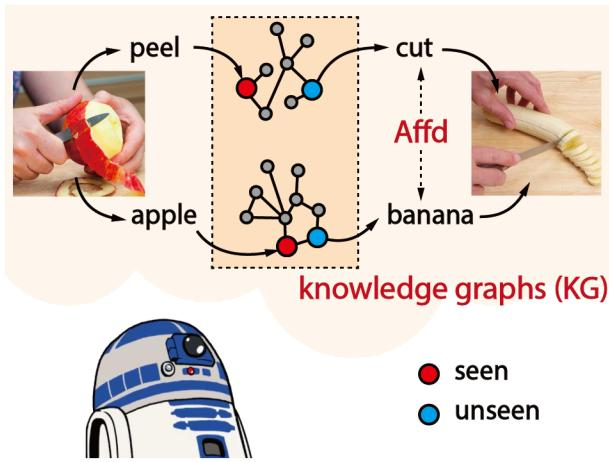
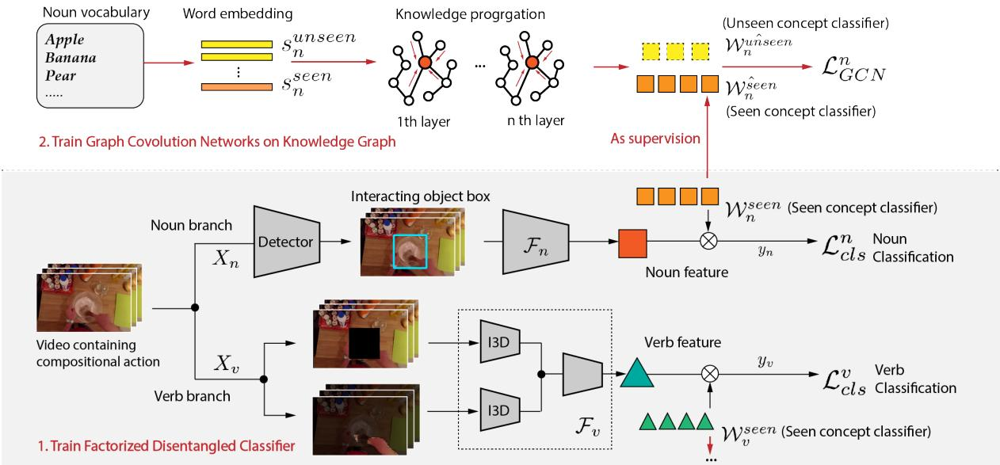
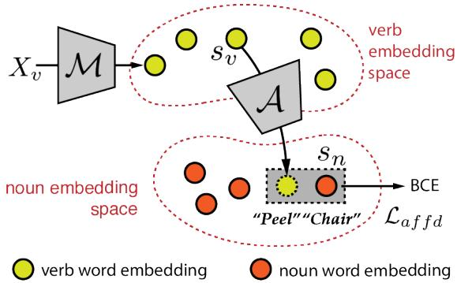
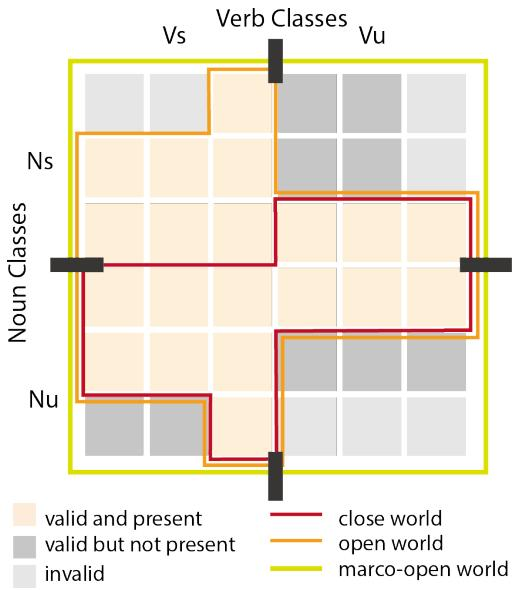
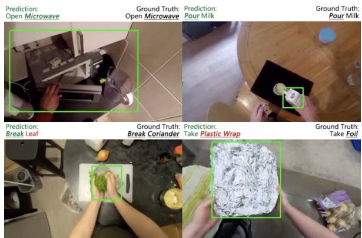

# Disentangled Action Recognition with Knowledge Bases

Zhekun Luo University of California, Berkeley zhekun\_luo@berkeley.edu

Keizo Kato† Fujitsu Laboratories Ltd. kato.keizo@jp.fujitsu.com

Shalini Ghosh∗ Amazon Alexa AI ghoshsha@amazon.com

Trevor Darrell University of California, Berkeley trevor@eecs.berkeley.edu

Devin Guillory University of California, Berkeley Dguillory@berkeley.edu

Huijuan Xu Pennsylvania State University hkx5063@psu.edu

## Abstract

Action in video usually involves the interaction of human with objects. Action labels are typically composed of various combinations of verbs and nouns, but we may not have training data for all possible combinations. In this paper, we aim to improve the generalization ability of the compositional action recognition model to novel verbs or novel nouns that are unseen during training time, by leveraging the power of knowledge graphs. Previous work utilizes verb-noun compositional action nodes in the knowledge graph, making it inefficient to scale since the number of compositional action nodes grows quadratically with respect to the number of verbs and nouns. To address this issue, we propose our approach: Disentangled Action Recognition with Knowledge-bases (DARK), which leverages the inherent compositionality of actions. DARK trains a factorized model by first extracting disentangled feature representations for verbs and nouns, and then predicting classification weights using relations in external knowledge graphs. The type constraint between verb and noun is extracted from external knowledge bases and finally applied when composing actions. DARK has better scalability in the number of objects and verbs, and achieves state-of-the-art performance on the Charades dataset. We further propose a new benchmark split based on the Epic-kitchen dataset which is an order of magnitude bigger in the numbers of classes and samples, and benchmark various models on this benchmark.

## 1 Introduction

Understanding human-object interaction is crucial for modeling human behavior, and plays a key role in developing robotic agents that interact with humans. In videos, many of these interactions can be described using the combination of verbs and nouns, e.g, move chair, peel apple. Recently researchers have been focusing on the task of compositional action recognition with the goal of recognizing actions represented by such verb-noun pairs. The key challenge comes from the extremely large label space of various combinations. The number of possible verb-noun pairs grows quadratically with respect to the number of verbs and nouns. It is infeasible to collect training data for all possible actions. This motivates us to study the problem of zero-shot compositional action recognition, which aims to predict action with components beyond the vocabularies in train data.

  
Figure 1: DARK extracts disentangled features of verbs/nouns and leverages knowledge graphs (KG) to generate classifiers for unseen verbs and nouns. Predictions are then composed under constraints of object affordance priors (Affd) from knowledge bases (e.g. banana can be cut).

To conduct zero-shot learning, we propose our Disentangled Action Recognition with Knowledgebases (DARK), which leverages knowledge graphs. A knowledge graph (KG) encodes semantic relationships between verb or noun nodes. We apply graph convolutional network (GCN) on KG to predict classifier weights for unseen nodes in graphs.

Previous work (Kato et al., 2018) has explored using knowledge graphs for zero-shot compositional action learning. However, their model builds a graph containing verb, noun and compositional action nodes (which link verbs and nouns). It learns features of novel action nodes by propagating information from connected verb/noun nodes. The number of compositional action nodes during training is in the order of $O ( n ^ { 2 } )$ , and the memory consumption may become prohibitively expensive as we scale this approach to large vocabularies. To overcome this issue, we propose to learn separate classifiers for verbs and nouns, which scales linearly with respect to the vocabulary size.

Specifically, DARK extracts verb and noun features separately, and relies on separate verb and noun knowledge graphs to predict unseen concepts before composing the action label. Activity recognition is particularly well-suited for such a factorized approach, because nouns may be better captured using object detection-based approaches and verbs may be represented by motion. Compared to prior work (Kato et al., 2018; Zhukov et al., 2019) that use the same feature representation for both verb and noun, our separate features model noun and verb more precisely. In addition, we adopt disentanglement between the learned verb and noun features, so they compose more readily and improve generalization on unseen actions.

Though scalability is achieved using our factorized approach, verbs and nouns are actually not fully independent. For instance, the process of sanding an object and scrubbing an object are visually similar, however you are more likely to be scrubbing a car than sanding it. Prior work (Kato et al., 2018) models the verb-noun relationships by constructing quadratic compositional action nodes. In our model, when composing action labels, we take object affordances (Gibson, 1978), namely the commonsense relationship of verbs and nouns, into consideration. We extract affordance knowledge from a caption corpus and build a scoring component to consider the relationship between verbs and nouns, to further improve the generalization ability. The basic idea of our proposed model is illustrated in Figure 1.

Furthermore, we investigate the evaluation of zero-shot compositional action recognition task and identify the drawback of existing metrics. With $N _ { v }$ verbs, $N _ { n }$ nouns, it constructs a $N _ { v } \times N _ { n }$ label space for possible actions. Among these actions, some are invalid (e.g. peel a car) and some are valid but not presented in the dataset. In realworld applications, the model would need to make predictions in the whole $N _ { v } \times N _ { n }$ label space. But current evaluation protocols, implicitly or explicitly, only evaluate on compositional classes that are valid and presented in the dataset, which does not reflect the real difficulty of this task. We propose a new setting, where predictions are made and evaluated in the full $N _ { v } \times N _ { n }$ label space.

The Charades (Sigurdsson et al., 2016) dataset is relatively small scale for testing zero-shot compositional action recognition (Kato et al., 2018). To promote further research, we propose a new benchmark based on the Epic-kitchen (Damen et al., 2018, 2020) dataset, which is an order of magnitude bigger both in number of classes and sample size. The key contributions of our paper are:

1. We propose a novel factorized model that learns disentangled representation separately for verbs and nouns, facilitating scalability.

2. We further improve the model’s generalization performance by learning the interaction constraints between verbs and nouns (affordance priors) from an external corpus.

3. We propose a new evaluation protocol for zero-shot compositional learnings, which better reflects the real-world application setting.

4. We propose a new large-scale benchmark based on the Epic-Kitchen dataset and achieve state-of-the-art results.

## 2 Related Work

Zero-shot learning with knowledge graphs: Zero-shot learning has been widely studied in computer vision (Akata et al., 2015; Lampert et al., 2013; Lee et al., 2018; Sahu et al., 2020; Wang et al., 2019; Xian et al., 2018). We will focus on related work relevant to our approach. (Wang et al., 2018) proposes to distill both the implicit knowledge representations (e.g., word embedding) and explicit relationships (e.g., knowledge graph) to learn a visual classifier for new classes through GCN (Kipf and Welling, 2016). (Kampffmeyer et al., 2019) later proposes to augment the knowledge graph (KG) with dense connections which directly connects multi-hop relationship and distinguishes between parent and children nodes. The graph learning of our model mostly follows their work. Recently there have been improvements on GCN models. (Nayak and Bach, 2020) designs a novel transformer GCN to learn representations based on common-sense KGs. (Geng et al., 2020b) uses an attentive GCN together with an explanation generator to conduct explainable zero-shot learning. Instead of generating classifier for unseen classes directly, (Geng et al., 2020a) uses a generative adversarial network to synthesize features for unseen classes to conduct classification. These directions could be potentially explored in our problem setting to further improve performance. (Gao et al., 2019) conducts zero-shot action recognition based on KGs, but unlike our problem setting, their verbnoun relationship is not compositional and objects are used as attributes to infer action.

Compositional action recognition: Many prior works aim to understand actions through interaction with objects. (Wang et al., 2020; Xu et al., 2019) tackle zero-shot human-object interaction in images. (Zhukov et al., 2019) conduct weaklysupervised action recognition, leveraging compositionality of verb-noun pairs to decompose tasks into a set of verb/noun classifiers. This shares certain similarities with our factorized model, but it is not a zero-shot setting, nor does it enforce feature disentanglement. (Materzynska et al., 2020) conduct zero-shot compositional action recognition, where individual verb/noun concepts have been seen during training but not in the same interaction with each other. Although it cannot deal with unseen verbs or nouns, using object detector to explicitly model object features inspires our approach. One of the closest works to our proposed approach is (Kato et al., 2018). It constructs a KG that contains verb nodes, noun nodes and compositional action nodes, and learns the feature representation for each action node to match visual features. Novel actions’ features are inferred jointly during training through GCN. The number of action nodes grows quadratically with respect to the number of nouns or verbs, which makes this approach difficult to scale, especially considering that GCN’s forward pass needs to learn all features simultaneously.

## 3 Method

We propose DARK – Disentangled Action Recognition with Knowledge-bases (Figure 2). It extracts disentangled feature representations for verbs and nouns, then predicts classifier weights for unseen components using knowledge graphs, and composes them under object affordance priors.

## 3.1 Factorized verb-noun classifier

Given a video X, we first use a verb feature extractor $\mathcal { F } _ { v }$ to extract verb feature, and a noun feature extractor ${ \mathcal { F } } _ { n }$ for noun feature. Subsequently, we learn one-layer predictors $\mathcal { W } _ { v } ^ { s e e n }$ and $\mathcal { W } _ { n } ^ { s e e n }$ for predicting the final verb/noun class. $\mathcal { F } _ { v } , \mathcal { F } _ { n }$ and $\mathcal { W } _ { v } ^ { s e e n } , \mathcal { W } _ { n } ^ { s e e n }$ are trained via cross entropy (CE) losses $\mathcal { L } _ { c l s } ^ { v }$ and $\mathcal { L } _ { c l s } ^ { n }$ with verb / noun labels $y _ { v } , y _ { n }$

$$
\mathcal { L } _ { c l s } ^ { v } = \mathbf { C E } ( \mathcal { F } _ { v } ; \mathcal { W } _ { v } ^ { s e e n } ; y _ { v } )
$$

$$
\mathcal { L } _ { c l s } ^ { n } = \mathbf { C E } ( \mathcal { F } _ { n } ; \mathcal { W } _ { n } ^ { s e e n } ; y _ { n } )\tag{1}
$$

(2)

We extract disentangled features for verbs and nouns, so that verbs and nouns can be treated as separate entities. If verb features contain much information about nouns, it would overfit to seen actions and would not generalize to unseen compositions. Standard networks like Inception3D (I3D) (Carreira and Zisserman, 2017) can rely on scene or object information to predict verbs (Battaglia et al., 2018; Materzynska et al., 2020). To decouple verb’s representation from noun’s, we add explicit regularization to the model input. We first used an off-the-shelf class-agnostic object detector to detect the bounding box of interacting objects. Then, we crop the object from videos and use I3D backbone to extract verb features from the cropped videos. (Yun et al., 2019; DeVries and Taylor, 2017; Choi et al., 2019; Singh and Lee, 2017) use similar cropping technique to remove bias in other tasks. We also detect hand masks and add hand regions separately to the verb input because the class-agnostic detector tends to crop out the hands as well. Adding hand gesture information back provides hints for verbs. Disentanglement method on Charades dataset (Sigurdsson et al., 2016) is different as it contains third-person view videos, and relevant details are discussed in Section 4.5.

## 3.2 GCN for learning novel concept

After training on seen concepts, we can infer the classifier for unseen ones. In this subsection, we drop the subscript $v / n$ as the same process applies for both verb and noun. After learning feature extractor $\mathcal { F }$ and classifier of seen concept $\boldsymbol { \nu } ^ { s e e n }$ learning classifier for unseen concepts is equivalent to learning the weight unseen. This step leverages graph convolution network (GCN) following previous work (Kampffmeyer et al., 2019; Kato et al., 2018; Xian et al., 2017). It takes the word embedding of unseen/seen concepts $s _ { s e e n } ,$ sunseen, and conducts graph convolution on the KG, with previously learned classifier weight $\boldsymbol { \nu } ^ { s e e n }$ as supervision. In each layer, it calculates:

  
Figure 2: Overall training process. We first jointly train factorized disentangled feature extractor $\mathcal { F } _ { v } , \mathcal { F } _ { n }$ , and classifier weights for seen class $\mathcal { W } _ { n } ^ { s e e n } , \mathcal { W } _ { v } ^ { s e e n }$ . We then take word embedding $s _ { s e e n } , s _ { u n s e e n }$ as input, and use GCN to predict classifier weights of unseen class $\mathcal { W } _ { n } ^ { u \hat { n } s e e n }$ , unseen ˆ based on knowledge graphs (KGs). Note that the same GCN learning applies to both verbs / nouns, and in the figure we only show the noun’s part for brevity.

$$
Z _ { i + 1 } = \hat { A } Z _ { i } W _ { i }\tag{3}
$$

$Z _ { i }$ and $Z _ { i + 1 }$ are input and output of the layer $i ,$ $\hat { A }$ is the adjacency matrix of the graph. Following (Kampffmeyer et al., 2019; Kato et al., 2018; Wang et al., 2018), we normalize the adjacency matrix. $W _ { i }$ is a learnable parameter. GCN first transforms features linearly, then aggregates information between nodes via graph edges. The $0 ^ { t h }$ layer’s input $Z _ { 0 }$ is the word embedding $[ s _ { s e e n } ,$ sunseen]. The last layer’s output $Z _ { n }$ is the classifier weight [ seen ˆ , unseen ˆ ]. We use the $\boldsymbol { \mathcal { W } } ^ { s e e n }$ learned previously as supervision, and calculate the mean square error loss between seen and seen ˆ . The training process is illustrated in Figure 2. Only the GCN learning of nouns is shown for brevity.

$$
\mathcal { L } _ { G C N } = \mathcal { L } _ { m s e } ( \mathcal { W } ^ { \hat { s } e e n } , \mathcal { W } ^ { s e e n } )\tag{4}
$$

## 3.3 Incorporating affordance prior

Not all verb-noun pairs are equally important — some objects can only admit certain actions but not others. (Gibson, 1978) proposed the notion of “affordance" — the shape of an object may provide hints on how humans should use it, which induces the set of suitable actions. Affordance can be extracted from the language source, e.g. we will often say peel the apple but rarely peel the chair. Prior works (Zhuang et al., 2017; Lu et al., 2016) used language information as prior to improve their performance. In this paper, we use captions of HowTO100M dataset (Miech et al., 2019) which records human-object interaction. We run the Standford NLP parser (Chen and Manning, 2014) to extract nouns/verbs from captions automatically.

After extracting verb-noun pairs, we train a scoring function to calculate the verb-noun affordance matching score. We project verb embedding $s _ { v }$ to the noun embedding space and calculate cosine distance with $s _ { n } ,$ followed by sigmoid to output a scalar value indicating whether this verbnoun compositional action is plausible. For training, we generate positive/negative pairs and use binary cross-entropy loss $\mathcal { L } _ { a f f d }$ . Note that there underlies an open-world assumption (Nickel et al., 2015): the verb-noun pairs missing are not entirely infeasible, but could be unobserved. Further research can be explored to develop a more precise way of modeling the affordance constraint.

A scoring function based on only wordembedding is similar to a static look-up table for verb-noun pairs, and may fail to encode diverse action visual features. Thus we train a mapping function to transform verb’s visual input to its word embedding $s _ { v }$ using mean square error loss.

  
Figure 3: We train a scoring function to calculate the affordance matching between verb and noun. In test time, the matching score is computed between mapped verb visual feature $\mathcal { M } ( X _ { v } )$ and $s _ { n } .$

Algorithm 1 Training process of our DARK model 1. Train the feature extractor and corresponding classification weight $( { \mathcal { F } } _ { v } , \ { \mathcal { W } } _ { v } ) , \ ( { \mathcal { F } } _ { n } , \ { \mathcal { W } } _ { n } )$ via classification loss $\mathcal { L } _ { v } , \mathcal { L } _ { n }$ separately.

2. Use the word embeddings $s _ { v } , \ s _ { n }$ as input and the learned classification weight $\ w _ { w } , \ w _ { n }$ as supervision, to train the GCN model $( { \mathcal { G } } _ { v } , { \mathcal { G } } _ { n } )$ with mean square error (MSE) loss (Equation 4).

3. Use extracted affordance pairs to train scoring function $\boldsymbol { \mathcal { A } } ( s _ { v } , s _ { n } )$ (Figure 3), via binary cross entropy (BCE) loss $\mathcal { L } _ { a f f d }$

4. Train mapping function to map visual verb inputs to semantic embedding space (Equation 5).

$$
\mathcal { L } _ { m s e } ( \mathcal { M } ( X _ { v } ) , s _ { v } )\tag{5}
$$

The separation of ,  also adds interpretability and allows learning from different data. can be trained on a language corpus without video data. Also, deals with textual affordance relationship directly and adds interpretability. In test time we map verb’s visual input to verb embedding space and calculate affordance score with target noun’s embedding $s _ { n }$ (Figure 3). The model is asymmetric, since we use object proposals with false detection and verb visual input is more reliable.

## 3.4 Overall algorithm and inference

The training of our DARK model is shown in Algorithm 1. During inference, we calculate the probability of a video containing the compositional ac-

  
Figure 4: The seen compositional actions correspond to $V _ { s } N _ { s }$ (the upper left part), and unseen actions include $V _ { s } N _ { u } , V _ { u } N _ { s }$ and $V _ { u } N _ { u }$ (the rest). We visualize the scope of close / open / macro-open world settings.

tion $( v , n )$ using following equations:

$$
\mathcal { P } ( v , n ) = \mathcal { P } ( v ) \ast \mathcal { P } ( n ) \ast \boldsymbol { \mathcal { A } } ( \boldsymbol { \mathcal { M } } ( \boldsymbol { X } _ { v } ) , \boldsymbol { s } _ { n } )\tag{6}
$$

$$
\mathcal { P } ( v ) = \sigma ( \mathcal { W } _ { v } * \mathcal { F } _ { v } ( X ) )\tag{7}
$$

σ is sigmoid function. For the classification weights $\mathcal { W } _ { v }$ used in verb prediction $\mathcal { P } ( v )$ , we use the learned classification weight $\mathcal { W } _ { v } ^ { s e e n }$ for seen classes, and unseen ˆ predicted by GCN for unseen classes. Similar equation applies for noun prediction ${ \mathcal { P } } ( n )$ , which is omitted.

## 4 Experiments

In this section, we discuss experiment evaluation, setup and results. Some implementation details are in appendix. 1

## 4.1 Evaluation of zero-shot compositional task

Following previous work (Kato et al., 2018), we partition verbs into two disjoint sets for seen/unseen classes, $V _ { s } / V _ { u }$ , and same for nouns, $N _ { s } / N _ { u } .$ Thus, “seen compositional actions" correspond to $V _ { s } N _ { s } ,$ , while “unseen (zero-shot) actions" correspond to $V _ { s } N _ { u } , V _ { u } N _ { s }$ and $V _ { u } N _ { u }$

Prior to (Chao et al., 2016), most works (e.g. (Norouzi et al., 2013)) on zero-shot learning adopt an evaluation protocol where predictions are made and evaluated only among unseen classes.

This is later denoted as close world setting. (Chao et al., 2016) points out that it does not reflect the difficulty of recognition in practice, and there exists a trade-off between classification accuracies of seen / unseen classes. They propose generalized zero-shot learning (GZL) setting — test set contains samples of both seen / unseen classes. Predictions are made and evaluated on both categories. By adding different biases to unseen classes’ prediction, one can draw a curve depicting the trade-off between accuracies of seen/unseen samples. They use area under the curve (AUC) to better reflect model’s overall performance on both seen and unseen classes. Our evaluation follows this setup.

Currently, relatively few prior works tackle zeroshot compositional action recognition (Kato et al., 2018; Materzynska et al., 2020). Taking other zeroshot compositional learning tasks such as zero-shot attribute-object classification (Misra et al., 2017; Nagarajan and Grauman, 2018; Purushwalkam et al., 2019; Yang et al., 2020) and image-based zero-shot human-object interaction (Wang et al., 2020; Xu et al., 2019) into consideration, we find that zero-shot compositional learning task poses extra challenges due to its combinatorial label space: not all compositional labels are valid, and for the valid ones, there may be no samples in the dataset. For brevity, we continue to use the term “verb" and “noun", but the following discussion could be also applied to other zero-shot compositional learning tasks (e.g., attribute-object). As in Figure 4, with $N _ { v }$ verbs, $N _ { n }$ nouns, we can construct a $N _ { v } \times N _ { n }$ action label space. Among these actions, some are invalid, because the verb-noun pair contradicts our common sense (e.g. peel a car). And some are valid but not presented in the dataset. Most previous works only consider labels that contain samples in the dataset, namely compositional classes that are valid and presented in the dataset.

Prior works (Materzynska et al., 2020; Misra et al., 2017; Nagarajan and Grauman, 2018; Yang et al., 2020) use disjoint label spaces in training and test sets, which corresponds to the close world setting. (Purushwalkam et al., 2019)’s test set contains both seen and unseen classes (GZL setting) and uses the AUC metric like ours, but their prediction is made and evaluated only among compositional classes with samples in dataset. (Kato et al., 2018; Wang et al., 2020) also follow GZL setting, but they use mean average precision (mAP) over compositional classes presented in dataset, which implicitly only considers valid and presented classes. We denote this as open world setting: test set contains samples from seen/unseen classes, but prediction is made and/or evaluated among valid and presented classes.

Neither close world setting nor open word setting reflects the difficulty of zero-shot compositional action recognition task. When deploying recognition models in the real world, it would need to make predictions in the whole $N _ { v } \times N _ { n }$ label space. Thus, compositional constraints between verbs and nouns (affordance) should be properly modeled to exclude invalid classes. In addition, the evaluation protocol should not distinguish between classes that are valid but not presented and valid and presented in the dataset, because models would not have access to that information beforehand. We propose the marco open world setting. In test time, sample can be from all seen/unseen classes, including $V _ { s } N _ { s } , V _ { s } N _ { u } , V _ { u } N _ { s }$ and $V _ { u } N _ { u }$ , and model receives no information about where the sample comes from. Predictions are made and evaluated in the whole $N _ { v } \times N _ { n }$ label space, and the AUC metric (Chao et al., 2016) considering the trade-off between seen/unseen classes is reported. Figure 4 compares these three settings.

## 4.2 Experimental setup

Dataset and split: We conduct experiments on two datasets, Epic-kitchen v-2 (Damen et al., 2020, 2018) and Charades (Sigurdsson et al., 2016). On Epic-kitchen benchmark, we create the compositional split for compositional action recognition. To avoid inductive bias brought by pretrained backbones (e.g. Faster R-CNN (Girshick, 2015) pretrained on ImageNet (Deng et al., 2009), or Inception3D (I3D) (Carreira and Zisserman, 2017) pretrained on Kinetics (Kay et al., 2017)) as discussed in (Wang et al., 2020), we ensure all nouns/verbs seen during pre-training stay in $V _ { s } N _ { s }$ when creating compositional split on Epic-kitchen benchmark. For Charades, we follow the same splits in (Kato et al., 2018) for fair comparison.

Charades dataset (Sigurdsson et al., 2016) contains 9848 videos, and many involve compositional human-object interaction. We use the compositional benchmark proposed by (Kato et al., 2018): they remove “no interaction" action categories, leaving 9625 videos with 34 verbs and 37 nouns. Those verbs and nouns are further partitioned into two verb splits $V _ { s } , V _ { u }$ (number of classes being

Table 1: DARK’s results on Epic-Kitchen dataset, compared with baselines and GCNCL (Kato et al., 2018)
<table><tr><td rowspan="2"></td><td colspan="3">AUC Macro Open</td><td colspan="3">AUC Open</td><td colspan="2">mAP Open</td></tr><tr><td>Top1</td><td>Top2</td><td>Top3</td><td>Top1</td><td>Top2</td><td> $\mathrm { T o p } 3$ </td><td>All</td><td>Zero-shot class</td></tr><tr><td>Chance</td><td> $6 . 4 \times 1 0 ^ { - 7 }$ </td><td> $2 . 9 \times 1 0 ^ { - 6 }$ </td><td> $7 . 8 \times 1 0 ^ { - 6 }$ </td><td> $1 . 9 \times 1 0 ^ { - 5 }$ </td><td> $6 . 7 \times 1 0 ^ { - 5 }$ </td><td> $1 . 2 \times 1 0 ^ { - 4 }$ </td><td>0.00065</td><td>0.00067</td></tr><tr><td>Triplet</td><td>0.021</td><td>0.060</td><td> $0 . 0 9 5$ </td><td>0.021</td><td> $0 . 0 6 0$ </td><td> $0 . 0 9 4$ </td><td>0.051</td><td>0.053</td></tr><tr><td>SES</td><td>0.091</td><td>0.25</td><td>0.42</td><td>0.16</td><td>0.45</td><td>0.73</td><td>1.83</td><td>0.99</td></tr><tr><td>DEM</td><td>0.0068</td><td>0.019</td><td>0.040</td><td>0.022</td><td>0.074</td><td>0.14</td><td>0.52</td><td>0.30</td></tr><tr><td>GCNCL+GT</td><td>0.044</td><td>0.11</td><td>0.19</td><td>0.044</td><td>0.11</td><td>0.19</td><td>0.46</td><td>0.31</td></tr><tr><td>GCNCL+Affd</td><td>0.064</td><td>0.16</td><td>0.27</td><td>0.082</td><td>0.22</td><td>0.37</td><td>0.48</td><td>0.15</td></tr><tr><td>GCNCL+Both</td><td>0.061</td><td>0.16</td><td>0.26</td><td>0.07</td><td>0.17</td><td>0.27</td><td>0.47</td><td>0.27</td></tr><tr><td>DARK (ours)</td><td>1.69</td><td>3.64</td><td>5.45</td><td>2.04</td><td>4.67</td><td>7.05</td><td>2.39</td><td>1.22</td></tr></table>

Table 2: Dataset statistics of proposed benchmark based on Epic-kitchen and previous benchmark on Charades.
<table><tr><td></td><td>一  $V _ { s } N _ { s }$ </td><td> $V _ { s } N _ { u }$ </td><td> $V _ { u } N _ { s }$ </td><td> $V _ { u } N _ { u }$ </td><td>samples</td></tr><tr><td>Epic-</td><td>840</td><td>896</td><td>1073</td><td>820</td><td>76605</td></tr><tr><td>Charades</td><td>49</td><td>47</td><td>22</td><td>31</td><td>9625</td></tr></table>

20 / 14), and two noun splits $N _ { s } , N _ { u } \left( 1 8 / 1 9 \right)$ . The total number of compositional actions is 149.

Epic-kitchen version 2 dataset (Damen et al., 2020, 2018) contains videos recorded in kitchens, where people demonstrate their interaction with objects like pan, etc. The diversity of actions in this dataset makes it especially challenging. We follow the steps in similar previous works (Rahman et al., 2018; Wang et al., 2020) to create our compositional split. We first make sure that classes seen in pre-training stay in the seen split. Then for the remaining classes we sort them based on the number of instances in descending order, and pick the last 20% to be unseen classes, because (Rahman et al., 2018) pointed out that zero-shot learning targets the classes not easy to collect (especially those in the tail part of the long tail class distribution). We show dataset statistics in Table 2. We get a total number of 76605 videos, including 90 verbs, 249 nouns, and 3629 compositional actions. Compared to Charades, our proposed benchmark is at a larger scale in terms of classes involved and sample size.

Baselines: We establish our baselines following previous work (Kato et al., 2018). Here we briefly summarize their architectures, and readers can refer to (Kato et al., 2018) or original papers for details. These baselines are based on Inception3D features.

Triplet Siamese Network (Triplet) by (Kato et al., 2018): verb/noun embeddings are concatenated, and transformed by fully connected (FC) layers. The output is concatenated with visual features to predict scores through one FC layer with the training of BCE loss.

Semantic Embedding Space (SES) (Xu et al., 2015): The model projects visual features into embedding space through FC layers and then matches output with corresponding action embeddings (average of verb/noun embeddings) using L2 loss.

Deep Embedding Model (DEM) (Zhang et al., 2017): Verb/noun embeddings are transformed separately via FC layers and summed together. Then output is matched with visual features via L2 loss.

## 4.3 Results on Epic-kitchen dataset

The results of the proposed DARK model, as well as the aforementioned baselines (Triplet, SES and DEM) and previous model GCNCL (Kato et al., 2018) on the Epic-kitchen dataset are listed in Table 1. We report the results in the proposed AUC metric (Chao et al., 2016) with precision calculated at top 1/2/3 prediction for both open world and macro open world settings, which evaluates the overall trade-off between seen/unseen class. We also report the mean average precision (mAP) used in (Kato et al., 2018) on all and zero-shot compositional action classes for reference.

Our best performing DARK model outperforms all baselines and GCNCL by a large margin under all metrics, illustrating the benefit of disentangled action representation for compositional action recognition. DARK is also more scalable, and reduces the number of graph nodes from 22749 (GC-NCL with no external knowledge) to 339 (ours).

DARK considers the type constraint of verbs and nouns when composing verb and noun into compositional action label by training an affordance scoring module, while GCNCL considers the constraint when building compositional action nodes by collecting the existing verb-noun pairs from NEIL (Chen et al., 2013). For fair comparison, we re-implement three versions of KG in GCNCL model. In “GT", we use the ground-truth verbnoun relationships that are presented in the dataset (open world setting). In “Affd", we only consider relationships in the same corpus with DARK. We use the relationships as a hard look-up since GC-NCL only contains unweighted “hard" edges in its knowledge graph. In “Both", we use the union of the constraints in “GT" and “Affd". Under all the three circumstances, our DARK model outperforms other models by a large margin. For all experiments, we report the best results.

Table 3: Combination for zero-shot learning in verb and noun classifiers. The top1 “open world" AUC is reported on the Epic-kitchen dataset.
<table><tr><td></td><td>Verb-KG</td><td>Verb-SES</td><td>Verb-ConSE</td></tr><tr><td>Noun-KG</td><td>1.81</td><td>1.24</td><td>0.49</td></tr><tr><td>Noun-SES</td><td>0.40</td><td>0.44</td><td>0.32</td></tr><tr><td>Noun-ConSE</td><td>0.25</td><td>0.18</td><td>0.13</td></tr></table>

## 4.4 Ablations on different components

Zero-shot learning in verb/noun classifier: In DARK model, we do separate verb and noun classification in two branches. We investigate different implementations of zero-shot learning in verb/noun classifier. Specifically, we consider three options for both verb and noun, namely “KG", “SES" and “ConSE". “KG" stands for zero-shot learning by using knowledge graph to predict classification weights for unseen component with GloVe embedding (Pennington et al., 2014) as in (Kato et al., 2018). “SES" (Xu et al., 2015) is the best common embedding baseline in Table 1 using better BERT word embedding (Devlin et al., 2018) (based on observation in Table 5, BERT tends to have better performance). “ConSE" (Norouzi et al., 2013) learns a semantic structure aware embedding space compared to original word embeddings, which is modeled with graph. “ConSE" (Norouzi et al., 2013) is used as the zero-shot learning component in previous image-based action recognition task (Xu et al., 2019). It learns a semantic structure aware embedding space and we also use GloVe embedding. For better comparison of zero-shot learning component, we report the “open world” AUC on the Epic-kitchen dataset without using affordance (same as “ground-truth" affordance in macro open setting), thus excluding the influence of affordance prior. Different zero-shot learning combinations for verbs and nouns are reported in Table 3. Using “KG" for both verb / noun outperforms others by a large margin, and we take this approach in the rest experiments.

Table 4: Different verb knowledge graphs. We report the top1 AUC for verbs under GZL setting.
<table><tr><td></td><td>WN dis</td><td>VN group</td><td>VN tree</td></tr><tr><td>one-way</td><td>1.86</td><td>0.83</td><td>1.93</td></tr><tr><td>two-way</td><td>X</td><td>X</td><td>1.79</td></tr></table>

Construction of verb knowledge graph: Compared to nouns, the concept of verb is relatively abstract and the relationship between verbs is hard to capture. We explore different ways of constructing the verb KG, namely, “WN dis", “VN group" and “VN tree". (The details of noun KG are discussed in the appendix.) In “WN dis", we use WordNet (Miller, 1995) structure and add edges between nodes if their LCH (Leacock and Chodorow, 1998) distance is bigger than a threshold. We also explore VerbNet (Kipper et al., 2008) which is designed to capture the semantic similarity of verbs. VerbNet categorizes verbs into different classes, and each class contains multiple verb members. To resolve the duplication in each class, we add edges between verbs in the same class, and denote this as “VN group". We also try adding a meta node for each class and connecting all its members to the meta node, denoted as “VN tree". Graphs of “WN dis" and “VN group" are naturally undirected. For “VN tree", we consider an additional “two-way" setting as in (Kampffmeyer et al., 2019), where a GCN model separates the parent-to-children and children-to-parent knowledge propagation into two stages to better model hierarchical graph structure. However, we do not observe performance improvement in this setting. In Table 4, we report top1 AUC for verbs using different KGs under the GZL(Chao et al., 2016) setting. “VN tree" in “one-way" gives the best prediction for verb, and we keep this configuration in rest experiments.

Affordance learning: We consider the compositional constraints between verbs and nouns (affordance) when composing the compositional action. We explore various ways of learning affordance in Table 5. In “Word-only" we train a wordembedding only model. And “Visual" represents the approach in method section where an additional projection module maps visual features to embedding space. For each, we explore two word embeddings, GLoVe (Pennington et al., 2014) and BERT (Devlin et al., 2018). In terms of score calculation, we try three different methods each. In “Concat-Scoring", we concatenate verb/noun features, and train a scoring model. In “Context-Scoring", instead of concatenating, for BERT the scoring model embeds verb-noun phrase together and averages their embeddings, and for GloVe we simply average their embeddings. In “Proj-Cosine", we project verb embedding to noun embedding space and calculate the cosine distance. We also try a lookup table, where affordance is one if the compositional pair exists in train set or knowledge bases, and zero otherwise. “Uniform" sets all affordance to be one, which means no weighting is applied. “Ground Truth" sets one for pairs existing in the dataset (train/test), equivalent to “open world". In all experiments, we use best configuration from Table 3, and label compositional pairs seen in training to one. BERT constantly improve affordance relationships in different methods. Lookup table performs worse than “Uniform" (no affordance) since some valid pairings are missing in knowledge bases.

Table 5: Top1 “marco open world" AUC on Epickitchen based on different affordance learning methods.
<table><tr><td rowspan="2"></td><td colspan="2">Word-only</td><td colspan="2">Visual</td></tr><tr><td>GLoVe</td><td>BERT</td><td>GLoVe</td><td>BERT</td></tr><tr><td>Concat-Scoring</td><td>1.49</td><td>1.59</td><td>1.48</td><td>1.60</td></tr><tr><td>Context-Scoring</td><td>1.49</td><td>1.59</td><td>1.49</td><td>X</td></tr><tr><td>Proj-Cosine</td><td>1.42</td><td>1.59</td><td>1.42</td><td>1.69</td></tr><tr><td>Lookup Table</td><td></td><td>1.35</td><td></td><td></td></tr><tr><td>Uniform |</td><td></td><td>1.46</td><td></td><td></td></tr><tr><td>Ground Truth</td><td></td><td>1.81</td><td></td><td></td></tr></table>

Table 6: Results (mAP) on Charades under GZL setting. Baselines and GCNCL results from (Kato et al., 2018).
<table><tr><td></td><td>Model</td><td>All</td><td>Zero-shot</td></tr><tr><td rowspan="4">Baseline</td><td>Chance</td><td>1.37</td><td>1.00</td></tr><tr><td>Triplet</td><td>10.41</td><td>7.82</td></tr><tr><td>SES</td><td>10.14</td><td>7.81</td></tr><tr><td>DEM</td><td>9.57</td><td>7.74</td></tr><tr><td>GCNCL</td><td>GCNCL-I+A GCNCL+A</td><td>10.48 10.53</td><td>7.95 8.09</td></tr><tr><td>Ours</td><td>DARK</td><td>11.21</td><td>8.38</td></tr><tr><td></td><td></td><td></td><td></td></tr></table>

## 4.5 Results on Charades dataset

We report results on Charades in Table 6. Following (Kato et al., 2018), we report mean average precision (mAP) and compare our model to theirs and baselines. We also report zero-shot classes $( V _ { s } N _ { u } + V _ { u } N _ { s } + V _ { u } N _ { u } )$ separately but all predictions are made under GZL setting. Unlike Epic-

  
Figure 5: Qualitative Analysis. Underlines are unseen concepts, green for right predictions and red for wrong.

Kitchen which contains ego-centric actions, Charades contains third-person view videos and cannot detect the mask of person’s hand. Thus we directly learn the verb and noun feature disentanglement leveraging a discriminator and a disentanglement loss. Following (Peng et al., 2018), discriminator tries to adversarially classify noun label $y _ { n }$ from its verb feature, and feature extractor $\mathcal { F }$ goes against it. To better capture the multi-label property in Charades, we use an un-factorized classification model for actions in $V _ { s } N _ { s }$ so they can be treated separately. Since we report the mAP results for fair comparison with GCNCL, we do not use affordance in our model. As indicated in (Kato et al., 2018), we also notice that the amount of improvement over baselines is not large, possibly because Charades is relatively small and easy to overfit. And this motivated us to propose a large-scale zeroshot compositional action recognition benchmark.

## 4.6 Qualitative error analysis

We also visualize some examples in Figure 5. The model misclassifies coriander as leaf, and foil as plastic wrap due to visual similarity.

## 5 Conclusion

In this paper, we propose DARK, a novel compositional action recognition model that reduces complexity from quadratic to linear, making the training more scalable. DARK generalizes to unseen verb-noun pairs, and can be combined with knowledge bases to produce state-of-the-art compositional action recognition results.

## Acknowledgement

Prof. Darrell’s group was supported in part by DoD, BAIR and BDD.

## References

Zeynep Akata, Florent Perronnin, Zaid Harchaoui, and Cordelia Schmid. 2015. Label-embedding for image classification. IEEE transactions on pattern analysis and machine intelligence, 38(7):1425–1438.

Peter W Battaglia, Jessica B Hamrick, Victor Bapst, Alvaro Sanchez-Gonzalez, Vinicius Zambaldi, Mateusz Malinowski, Andrea Tacchetti, David Raposo, Adam Santoro, Ryan Faulkner, et al. 2018. Relational inductive biases, deep learning, and graph networks. arXiv preprint arXiv:1806.01261.

Joao Carreira and Andrew Zisserman. 2017. Quo vadis, action recognition? a new model and the kinetics dataset. In proceedings of the IEEE Conference on Computer Vision and Pattern Recognition, pages 6299–6308.

Wei-Lun Chao, Soravit Changpinyo, Boqing Gong, and Fei Sha. 2016. An empirical study and analysis of generalized zero-shot learning for object recognition in the wild. In European conference on computer vision, pages 52–68. Springer.

Danqi Chen and Christopher D Manning. 2014. A fast and accurate dependency parser using neural networks. In Proceedings of the 2014 conference on empirical methods in natural language processing (EMNLP), pages 740–750.

Xinlei Chen, Abhinav Shrivastava, and Abhinav Gupta. 2013. Neil: Extracting visual knowledge from web data. In Proceedings ofthe IEEE international conference on computer vision, pages 1409–1416.

Jinwoo Choi, Chen Gao, Joseph CE Messou, and Jia-Bin Huang. 2019. Why can’t i dance in the mall? learning to mitigate scene bias in action recognition. Advances in Neural Information Processing Systems, 32.

Dima Damen, Hazel Doughty, Giovanni Maria Farinella, Sanja Fidler, Antonino Furnari, Evangelos Kazakos, Davide Moltisanti, Jonathan Munro, Toby Perrett, Will Price, et al. 2018. Scaling egocentric vision: The epic-kitchens dataset. In Proceedings of the European Conference on Computer Vision (ECCV), pages 720–736.

Dima Damen, Hazel Doughty, Giovanni Maria Farinella, Antonino Furnari, Evangelos Kazakos, Jian Ma, Davide Moltisanti, Jonathan Munro, Toby Perrett, Will Price, et al. 2020. Rescaling egocentric vision. arXiv preprint arXiv:2006.13256.

Jia Deng, Wei Dong, Richard Socher, Li-Jia Li, Kai Li, and Li Fei-Fei. 2009. Imagenet: A large-scale hierarchical image database. In 2009 IEEE conference on computer vision and pattern recognition, pages 248–255. Ieee.

Jacob Devlin, Ming-Wei Chang, Kenton Lee, and Kristina Toutanova. 2018. Bert: Pre-training of deep bidirectional transformers for language understanding. arXiv preprint arXiv:1810.04805.

Terrance DeVries and Graham W Taylor. 2017. Improved regularization of convolutional neural networks with cutout. arXiv preprint arXiv:1708.04552.

Junyu Gao, Tianzhu Zhang, and Changsheng Xu. 2019. I know the relationships: Zero-shot action recognition via two-stream graph convolutional networks and knowledge graphs. In Proceedings ofthe AAAI conference on artificial intelligence, volume 33, pages 8303–8311.

Yuxia Geng, Jiaoyan Chen, Zhuo Chen, Zhiquan Ye, Zonggang Yuan, Yantao Jia, and Huajun Chen. 2020a. Generative adversarial zero-shot learning via knowledge graphs. arXiv preprint arXiv:2004.03109.

Yuxia Geng, Jiaoyan Chen, Zhiquan Ye, Zonggang Yuan, Wei Zhang, and Huajun Chen. 2020b. Explainable zero-shot learning via attentive graph convolutional network and knowledge graphs. Semantic Web, (Preprint):1–28.

James J Gibson. 1978. The ecological approach to the visual perception of pictures. Leonardo, 11(3):227– 235.

Ross Girshick. 2015. Fast r-cnn. In Proceedings ofthe IEEE international conference on computer vision, pages 1440–1448.

Michael Kampffmeyer, Yinbo Chen, Xiaodan Liang, Hao Wang, Yujia Zhang, and Eric P Xing. 2019. Rethinking knowledge graph propagation for zero-shot learning. In Proceedings of the IEEE/CVF Conference on Computer Vision and Pattern Recognition, pages 11487–11496.

Keizo Kato, Yin Li, and Abhinav Gupta. 2018. Compositional learning for human object interaction. In Proceedings of the European Conference on Computer Vision (ECCV), pages 234–251.

Will Kay, Joao Carreira, Karen Simonyan, Brian Zhang, Chloe Hillier, Sudheendra Vijayanarasimhan, Fabio Viola, Tim Green, Trevor Back, Paul Natsev, et al. 2017. The kinetics human action video dataset. arXiv preprint arXiv:1705.06950.

Thomas N Kipf and Max Welling. 2016. Semisupervised classification with graph convolutional networks. arXiv preprint arXiv:1609.02907.

Karin Kipper, Anna Korhonen, Neville Ryant, and Martha Palmer. 2008. A large-scale classification of english verbs. Language Resources and Evaluation, 42(1):21–40.

Christoph H Lampert, Hannes Nickisch, and Stefan Harmeling. 2013. Attribute-based classification for zero-shot visual object categorization. IEEE transactions on pattern analysis and machine intelligence, 36(3):453–465.

Claudia Leacock and Martin Chodorow. 1998. Combining local context and wordnet similarity for word sense identification. WordNet: An electronic lexical database, 49(2):265–283.

Chung-Wei Lee, Wei Fang, Chih-Kuan Yeh, and Yu-Chiang Frank Wang. 2018. Multi-label zero-shot learning with structured knowledge graphs. In Proceedings of the IEEE conference on computer vision and pattern recognition, pages 1576–1585.

Cewu Lu, Ranjay Krishna, Michael Bernstein, and Li Fei-Fei. 2016. Visual relationship detection with language priors. In European conference on computer vision, pages 852–869. Springer.

Joanna Materzynska, Tete Xiao, Roei Herzig, Huijuan Xu, Xiaolong Wang, and Trevor Darrell. 2020. Something-else: Compositional action recognition with spatial-temporal interaction networks. In Proceedings of the IEEE/CVF Conference on Computer Vision and Pattern Recognition, pages 1049–1059.

Antoine Miech, Dimitri Zhukov, Jean-Baptiste Alayrac, Makarand Tapaswi, Ivan Laptev, and Josef Sivic. 2019. Howto100m: Learning a text-video embedding by watching hundred million narrated video clips. In Proceedings ofthe IEEE/CVF International Conference on Computer Vision, pages 2630–2640.

George A Miller. 1995. Wordnet: a lexical database for english. Communications of the ACM, 38(11):39–41.

Ishan Misra, Abhinav Gupta, and Martial Hebert. 2017. From red wine to red tomato: Composition with context. In Proceedings of the IEEE Conference on Computer Vision and Pattern Recognition, pages 1792–1801.

Tushar Nagarajan and Kristen Grauman. 2018. Attributes as operators: factorizing unseen attributeobject compositions. In Proceedings ofthe European Conference on Computer Vision (ECCV), pages 169– 185.

Nihal V Nayak and Stephen H Bach. 2020. Zeroshot learning with common sense knowledge graphs. arXiv preprint arXiv:2006.10713.

Maximilian Nickel, Kevin Murphy, Volker Tresp, and Evgeniy Gabrilovich. 2015. A review of relational machine learning for knowledge graphs. Proceedings ofthe IEEE, 104(1):11–33.

Mohammad Norouzi, Tomas Mikolov, Samy Bengio, Yoram Singer, Jonathon Shlens, Andrea Frome, Greg S Corrado, and Jeffrey Dean. 2013. Zero-shot learning by convex combination of semantic embeddings. arXiv preprint arXiv:1312.5650.

Xue Bin Peng, Angjoo Kanazawa, Sam Toyer, Pieter Abbeel, and Sergey Levine. 2018. Variational discriminator bottleneck: Improving imitation learning, inverse rl, and gans by constraining information flow. arXiv preprint arXiv:1810.00821.

Jeffrey Pennington, Richard Socher, and Christopher D Manning. 2014. Glove: Global vectors for word representation. In Proceedings of the 2014 conference on empirical methods in natural language processing (EMNLP), pages 1532–1543.

Senthil Purushwalkam, Maximilian Nickel, Abhinav Gupta, and Marc’Aurelio Ranzato. 2019. Taskdriven modular networks for zero-shot compositional learning. In Proceedings of the IEEE/CVF International Conference on Computer Vision, pages 3593– 3602.

Shafin Rahman, Salman Khan, and Nick Barnes. 2018. Polarity loss for zero-shot object detection. arXiv preprint arXiv:1811.08982.

Saurabh Sahu, Palash Goyal, Shalini Ghosh, and Chul Lee. 2020. Cross-modal non-linear guided attention and temporal coherence in multi-modal deep video models. In Proceedings of the 28th ACM International Conference on Multimedia, pages 313–321.

Dandan Shan, Jiaqi Geng, Michelle Shu, and David F Fouhey. 2020. Understanding human hands in contact at internet scale. In Proceedings of the IEEE/CVF conference on computer vision and pattern recognition, pages 9869–9878.

Gunnar A Sigurdsson, Gül Varol, Xiaolong Wang, Ali Farhadi, Ivan Laptev, and Abhinav Gupta. 2016. Hollywood in homes: Crowdsourcing data collection for activity understanding. In European Conference on Computer Vision, pages 510–526. Springer.

Krishna Kumar Singh and Yong Jae Lee. 2017. Hideand-seek: Forcing a network to be meticulous for weakly-supervised object and action localization. In 2017 IEEE international conference on computer vision (ICCV), pages 3544–3553. IEEE.

Suchen Wang, Kim-Hui Yap, Junsong Yuan, and Yap-Peng Tan. 2020. Discovering human interactions with novel objects via zero-shot learning. In Proceedings of the IEEE/CVF Conference on Computer Vision and Pattern Recognition, pages 11652–11661.

Wei Wang, Vincent W Zheng, Han Yu, and Chunyan Miao. 2019. A survey of zero-shot learning: Settings, methods, and applications. ACM Transactions on Intelligent Systems and Technology (TIST), 10(2):1– 37.

Xiaolong Wang, Yufei Ye, and Abhinav Gupta. 2018. Zero-shot recognition via semantic embeddings and knowledge graphs. In Proceedings ofthe IEEE conference on computer vision and pattern recognition, pages 6857–6866.

Yuxin Wu, Alexander Kirillov, Francisco Massa, Wan-Yen Lo, and Ross Girshick. 2019. Detectron2. https://github.com/ facebookresearch/detectron2.

Yongqin Xian, Christoph H Lampert, Bernt Schiele, and Zeynep Akata. 2018. Zero-shot learning—a comprehensive evaluation of the good, the bad and the ugly. IEEE transactions on pattern analysis and machine intelligence, 41(9):2251–2265.

Yongqin Xian, Bernt Schiele, and Zeynep Akata. 2017. Zero-shot learning-the good, the bad and the ugly. In Proceedings of the IEEE Conference on Computer Vision and Pattern Recognition, pages 4582–4591.

Bingjie Xu, Yongkang Wong, Junnan Li, Qi Zhao, and Mohan S Kankanhalli. 2019. Learning to detect human-object interactions with knowledge. In Proceedings ofthe IEEE/CVF Conference on Computer Vision and Pattern Recognition.

Xun Xu, Timothy Hospedales, and Shaogang Gong. 2015. Semantic embedding space for zero-shot action recognition. In 2015 IEEE International Conference on Image Processing (ICIP), pages 63–67. IEEE.

Muli Yang, Cheng Deng, Junchi Yan, Xianglong Liu, and Dacheng Tao. 2020. Learning unseen concepts via hierarchical decomposition and composition. In Proceedings of the IEEE/CVF Conference on Computer Vision and Pattern Recognition, pages 10248– 10256.

Sangdoo Yun, Dongyoon Han, Seong Joon Oh, Sanghyuk Chun, Junsuk Choe, and Youngjoon Yoo. 2019. Cutmix: Regularization strategy to train strong classifiers with localizable features. In Proceedings of the IEEE/CVF international conference on computer vision, pages 6023–6032.

Li Zhang, Tao Xiang, and Shaogang Gong. 2017. Learning a deep embedding model for zero-shot learning. In Proceedings ofthe IEEE conference on computer vision and pattern recognition, pages 2021–2030.

Bohan Zhuang, Lingqiao Liu, Chunhua Shen, and Ian Reid. 2017. Towards context-aware interaction recognition for visual relationship detection. In Proceedings of the IEEE international conference on computer vision, pages 589–598.

Dimitri Zhukov, Jean-Baptiste Alayrac, Ramazan Gokberk Cinbis, David Fouhey, Ivan Laptev, and Josef Sivic. 2019. Cross-task weakly supervised learning from instructional videos. In Proceedings of the IEEE/CVF Conference on Computer Vision and Pattern Recognition, pages 3537–3545.

## A Implementation Detail

To build the object feature extractor ${ \mathcal { F } } _ { n }$ , we first use an off-the-shelf class-agnostic object detector to detect the bounding box of interacting objects. For the Charades (Sigurdsson et al., 2016) dataset, we use the detected object boxes generated by HOID (Wang et al., 2020). HOID model first detects the box of human, then based on the human’s bounding box it detects interacting objects. We use the code publicly released by (Wang et al., 2020), with the default parameters provided by the author. We use the weights of the class-agnostic object detector provided on the project page. For the Epic-kitchen dataset (Damen et al., 2020, 2018), we use the pre-computed class-agnostic boxes provided by the authors. They use the model from (Shan et al., 2020), which detects human hands and locates the interacting objects. We use different models for object detection because Epic-kitchen (Damen et al., 2018) contains mostly ego-centric action videos while Charades (Sigurdsson et al., 2016) contains third-person view videos. For the Epic-kitchen dataset, we additionally use its precomputed detected masks of human hands.

After the object boxes are detected, we run the Faster-RCNN (Girshick, 2015) model with the ResNet-101 backbone to extract the object features. We use the implementation provided by the Detectron2 (Wu et al., 2019) library, with the weights pre-trained on ImageNet (Deng et al., 2009). We obtain the features before the classifier layer in the Faster-RCNN model, which results in 2048 dimension object features. If we detect multiple boxes in one frame, we conduct max-pooling over their extracted features to obtain one feature representation for each frame. If no box is detected for a particular frame, we then extract the feature of the whole image as its object feature.

We sample several frames along the temporal axis of the video to conduct object detection. Since videos in the Charades (Sigurdsson et al., 2016) dataset may contain more than one action, we treat each frame in Charades dataset as one sample for training. For the Epic-kitchen (Damen et al., 2020, 2018) dataset whose videos contain only one action, we instead simply apply mean pooling over object features of sampled frames to obtain one feature representation for the whole video. We add fullyconnected (FC) layers upon the fixed Faster-RCNN backbone to conduct feature extraction.

For verb features, we build our feature extractor $\mathcal { F } _ { v }$ based on a standard two-stream Inception3D (Carreira and Zisserman, 2017) backbone pre-trained on the Kinetics dataset (Kay et al., 2017). We use both the RGB branch and the opticalflow branch, each producing a 1024 dimension feature in the layer Mixed\_5c. We then concatenate them, resulting in a feature representation of 2048 dimension. For the Epic-kitchen dataset, we generate features first using the video input with the object cropped out. Then we do the same using the video input with everything cropped except for the detected hands in order to obtain hand gesture movement information. We further concatenate these two features to get a 4096 dimension feature. Similar to the object feature extractor, we add FC layers to features generated by the fixed Inception3D backbone. For the Charades dataset, since another disentanglement approach is used, we simply use the 2048 dimension feature.

Following common practice, we split the whole video into video clips with a small duration, and generate features for each clip during training and inference. For the Charades dataset, we sample 10 clips per video to conduct training and we treat each clip as a sample. Whereas for the Epic-kitchen dataset, we apply max pooling to the features of all the clips generated from one video to obtain one feature representation for the whole video.

Our model is implemented in PyTorch with Adam optimizer. We used in total around 20 GPUs through out the experiments. But a single run only needs 5 GPUs. (we launch parallel experiments)

## B The Proposed Epic-kitchen Benchmark

We build our compositional action recognition benchmark based on the Epic-kitchen(Damen et al., 2020, 2018) dataset version two. We take the class that overlaps with pre-trained backbones into consideration when creating seen/unseen class splits. We find that there are 95 noun classes overlapping with ImageNet classes, and 23 verb classes overlapping with Kinetics classes, where the backbones that we use have been pre-trained. We make sure these overlapping classes stay in the seen split.

We then remove the tail verb and noun classes with less than 10 instances. The remaining dataset contains a total number of 76605 videos, including 90 verbs, 249 nouns, and 3629 compositional actions. We have 29 verbs in the seen category, and 61 verbs in the unseen category. On the other hand, 102 nouns are seen and 147 nouns are unseen.

The $V _ { s } N _ { s }$ split contains 840 compositional actions, and 51228 samples. The $V _ { u } N _ { s }$ split has 1073 compositional actions, and 10105 samples. For the $V _ { s } N _ { u }$ split, there are 896 compositional actions and 11073 samples. And for the $V _ { u } N _ { u }$ split, there are 820 compositional actions and 4199 samples.

Epic-Kitchen dataset is realized under the Creative Commons Attribution-NonCommercial 4.0 International License. The licence for non-Commercial use of Charades dataset can be found at http://vuchallenge.org/charades.html. We follow the intended usage of these two dataset.

## C Noun Knowledge Graph Construction

We discuss the construction of the verb knowledge graph in the paper, due to the space limit, we present the details of the noun knowledge graph in this section. We construct the noun knowledge graph following (Wang et al., 2018)’s approach. We begin from the nouns presented in the dataset, and recursively search their hyper-norms using Word-Net (Miller, 1995)’s lexical relationship to add to the graph. In addition, we augment the knowledge graph by adding nouns from ImageNet’s ((Deng et al., 2009)) class labels.

When building noun knowledge graphs, we add an edge if two entities are direct synonyms or hypernorms. Our model is built upon the graph convolution model implemented by (?). We use its plain GCN version without attention. And we use the “two-way" approach, which separates parentto-children and children-to-parent knowledge propagation into two stages to better model the hierarchical graph structure. For noun knowledge graph learning, we use 300d GloVe (Pennington et al., 2014) embeddings as input.

## D Disentanglement in Charades Dataset

Let $X _ { v }$ denote the input to the verb feature extractor $\mathcal { F } _ { v } .$ , and $X _ { v } ^ { \prime }$ denote the extracted verb features. Similarly, $X _ { n }$ is the input to $\mathcal { F } _ { n }$ and $X _ { n } ^ { \prime }$ is the extracted noun features.

$$
X _ { v } ^ { \prime } = \mathcal { F } _ { v } ( X _ { v } )\tag{8}
$$

$$
X _ { n } ^ { \prime } = \mathcal { F } _ { n } ( X _ { n } )\tag{9}
$$

To obtain disentangled verb / noun features, we take the idea from the previous paper (Peng et al., 2018). We use a discriminator to limit the information verb and noun features contain. The discriminator $\mathcal { D } _ { v }$ tries to adversarially classify noun label $y _ { n }$ from its verb feature $X _ { v } ^ { \prime }$ , and the feature extractor $\mathcal { F } _ { v }$ goes against it via a minimax process. The discriminator helps to limit the information which verb feature $X _ { v } ^ { \bar { \prime } }$ contains about the nouns in the video. The same procedure happens for $\mathcal { D } _ { n }$ We use one layer linear classifier for discriminator $\mathcal { D } _ { v }$ and $\mathcal { D } _ { n }$ and they output class predictions for the opposite branch. This leads to the disentanglement loss:

$$
\mathcal { L } _ { d i s } ^ { v } = - \mathbf { C E } ( \mathcal { D } _ { v } ( X _ { v } ^ { \prime } ) ; y _ { n } )
$$

$$
\mathcal { L } _ { d i s } ^ { n } = - \mathbf { C E } ( \mathcal { D } _ { n } ( X _ { n } ^ { \prime } ) ; y _ { v } )\tag{10}
$$

(11)

The CE refers to the cross-entropy loss. The overall loss for training the feature extractor $\mathcal { F } _ { v } , \mathcal { F } _ { n }$ and the classifier for seen classes $\mathcal { W } _ { v } ^ { s e e n }$ $\mathcal { W } _ { n } ^ { s e e n }$ is:

$$
\mathcal { L } _ { v } = \mathcal { L } _ { c l s } ^ { v } + \mathcal { L } _ { d i s } ^ { v }
$$

$$
\mathcal { L } _ { n } = \mathcal { L } _ { c l s } ^ { n } + \mathcal { L } _ { d i s } ^ { n }\tag{12}
$$

(13)

The definitions of $\mathcal { L } _ { c l s } ^ { v }$ $\mathcal { L } _ { c l s } ^ { n }$ are the same as discussed in the main paper.