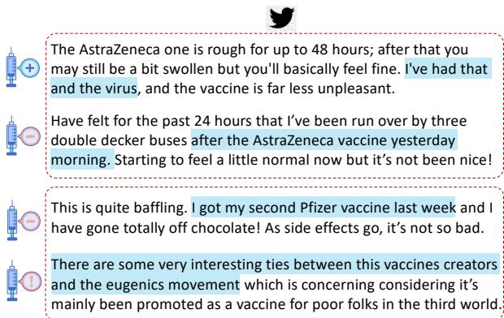
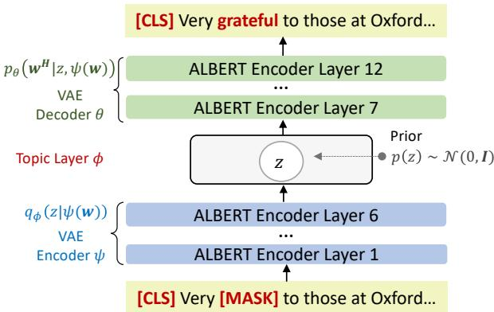
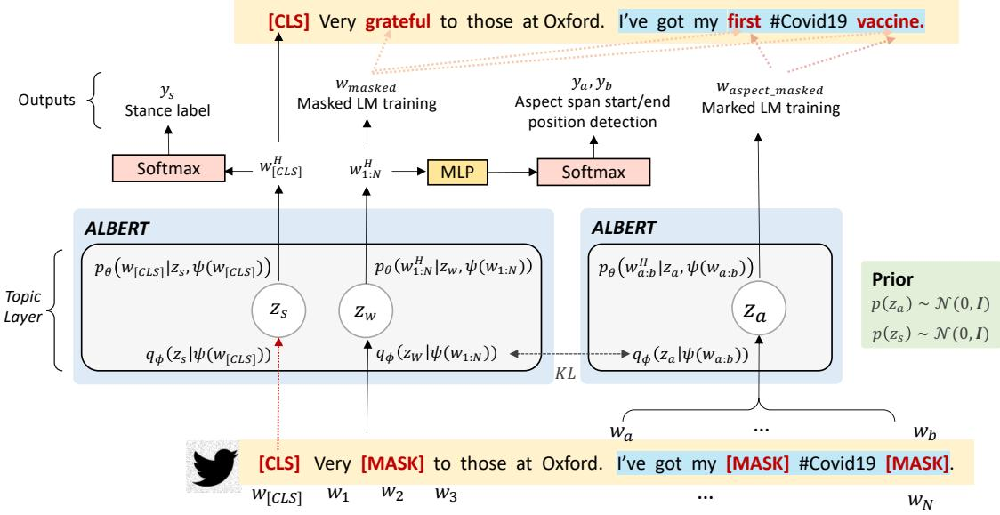
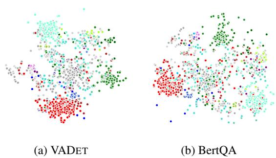
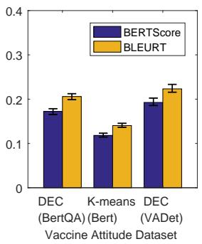
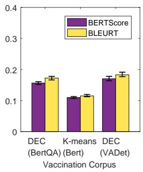
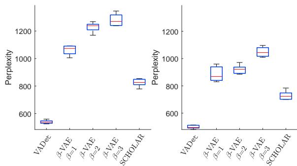

# Disentangled Learning of Stance and Aspect Topics for Vaccine Attitude Detection in Social Media

Lixing Zhu1, Zheng Fang1, Gabriele Pergola1, Rob Procter1,2, Yulan He1,2

1Department of Computer Science, University of Warwick, UK

2The Alan Turing Institute, UK

{lixing.zhu,z.fang.4,gabriele.pergola.1 rob.procter,yulan.he}@warwick.ac.uk

## Abstract

Building models to detect vaccine attitudes on social media is challenging because of the composite, often intricate aspects involved, and the limited availability of annotated data. Existing approaches have relied heavily on supervised training that requires abundant annotations and pre-defined aspect categories. Instead, with the aim of leveraging the large amount of unan notated data now available on vaccination, we propose a novel semi-supervised approach for vaccine attitude detection, called VADET. A variational autoencoding architecture based on language models is employed to learn from unlabelled data the topical information of the domain. Then, the model is fine-tuned with a few manually annotated examples of user atti tudes. We validate the effectiveness of VADET on our annotated data and also on an existing vaccination corpus annotated with opinions on vaccines. Our results show that VADET is able to learn disentangled stance and aspect topics, and outperforms existing aspect-based sentiment analysis models on both stance detection and tweet clustering. Our source code and dataset are available at http://github. com/somethingx1202/VADet.

## 1 Introduction

The aim of vaccine attitude detection in social media is to extract people’s opinions towards vaccines by analysing their online posts. This is closely related to aspect-based sentiment analysis in which both aspects and related sentiments need to be identified. Previous research has been largely focused on product reviews and relied on aspectlevel sentiment annotations to train models (Barnes et al., 2021), where aspect-opinions are extracted as triples (Peng et al., 2020), polarized targets (Ma et al., 2018) or sentiment spans (He et al., 2019). However, for the task of vaccine attitude detection on Twitter, such a volume of annotated data is barely available (Kunneman et al., 2020; Paul et al.,

  
Figure 1: Top: Expressions of aspects entangled with expressions of opinions. Bottom: Vaccine attitudes can be expressed towards a wide range of aspects/topics relating to vaccination, making it difficult to pre-define a set of aspect labels as opposed to corpora typically used for aspect-based sentiment analysis.

2021). This scarcity of data is compounded by the diversity of attitudes, making it difficult for models to identify all aspects discussed in posts (Morante et al., 2020).

As representative examples, consider the two tweets about personal experiences for vaccination at the top of Figure 1. The two tweets, despite addressing a common aspect (vaccine side-effects), express opposite stances towards vaccines. However, the aspect and the stances are so fused together that the whole of the tweets need to be considered to derive the proper labels, making it difficult to disentangle them using existing methodologies. Additionally, in the case of vaccines attitude analysis, there is a wide variety of possible aspects discussed in posts, as shown in the bottom of Figure 1, where one tweet ironically addressed vaccine side-effects and the second one expressed instead specific political concerns. This is different from traditional aspect-based sentiment analysis on product reviews where only a small number of aspects need to be pre-defined.

The recently developed framework for integrating Variational Auto-Encoder (VAE) (Kingma and

Welling, 2014) and Independent Component Analysis (ICA) (Khemakhem et al., 2020) sheds light on this problem. VAE is an unsupervised method that can be used to glean information that must be retained from the vaccine-related corpus. Meanwhile, a handful of annotations would induce the separation of independent factors following the ICA requirement for prior knowledge and inductive biases (Hyvarinen et al., 2019; Locatello et al., 2020a,b). To this end, we could disentangle the latent factors that are either specific to the aspect or to the stance, and improve the quality of the latent semantics learned from unannotated data.

We frame the problem of vaccine attitude detection as a joint aspect span detection and stance classification task, assuming that a tweet, which is limited to 280 characters, would usually only discuss one aspect. In particular, we extend a pretrained language model (LM) by adding a topic layer, which aims to model the topical theme discussed in a tweet. In the absence of annotated data, the topic layer is trained to reconstruct the input message built on VAE. Given the annotated data, where each tweet is annotated with an aspect span and a stance label, the learned topic can be disentangled into a stance topic and an aspect topic. The stance topic is used to predict the stance label of the given tweet, while the aspect topic is used to predict the start and the ending positions of the aspect span. By doing so, we can effectively leverage both unannotated and annotated data for model training.

To evaluate the effectiveness of our proposed model for vaccine attitude detection on Twitter, we have collected over 1.9 million tweets relating to COVID vaccines between February and April 2021. We have further annotated 2,800 tweets with both aspect spans and stance labels. In addition, we have also used an existing Vaccination Corpus1 in which 294 documents related to the online vaccination debate have been annotated with opinions towards vaccination. Our experimental results on both datasets show that the proposed model outperforms existing opinion triple extraction model and BERT QA model on both aspect span extraction and stance classification. Moreover, the learned latent aspect topics allow the clustering of user attitudes towards vaccines, facilitating easier discovery of positive and negative attitudes in social media. The contribution of this work can be summarised as follows:

• We have proposed a novel semi-supervised approach for joint latent stance/aspect representation learning and aspect span detection;

• The developed disentangled representation learning facilitates better attitude detection and clustering;

• We have constructed an annotated dataset for vaccine attitude detection.

## 2 Related Work

Our work is related to three lines of research: aspect-based sentiment analysis, disentangled representation learning, and vaccine attitude detection.

Aspect-Based Sentiment Analysis (ABSA) aims to identify the aspect terms and their polarities from text. Much work has been focusing on this task. The techniques used include Conditional Random Fields (CRFs) (Marcheggiani et al., 2014), Bidirectional Long Short-Term Memory networks (BiLSTMs) (Baziotis et al., 2017), Convolutional Neural Networks (CNNs) (Zhang et al., 2015b), Attention Networks (Yang et al., 2016; Pergola et al., 2021b), DenseLSTMs (Wu et al., 2018), NestedL-STMs (Moniz and Krueger, 2017), Graph Neural Networks (Zhang et al., 2019) and their combinations (Wang et al., 2018; Zhu et al., 2021; Wan et al., 2020), to name a few.

Zhang et al. (2015a) framed this task as text span detection, where they used text spans to denote aspects. The same annotation scheme was employed in (Li et al., 2018b), where intra-word attentions were designed to enrich the representations of aspects and predict their polarities. Li et al. (2018c) formalized the task as a sequence labeling problem under a unified tagging scheme. Their follow-up work (Li et al., 2019) explored BERT for end-toend ABSA. Peng et al. (2020) modified this task by introducing opinion terms to shape the polarity. A similar modification was made in (Zhao et al., 2020) to extract aspect-opinion pairs. Positionaware tagging was introduced to entrench the offset between the aspect span and opinion term (Xu et al., 2020). More recently, instead of using pipeline approaches or sequence tagging, Barnes et al. (2021) adapted syntactic dependency parsing to perform aspect and opinion expression extraction, and polarity classification, thus formalizing the task as structured sentiment analysis.

Disentangled representation learning Deep generative models learn the hidden semantics of text, of which many attempt to capture the independent latent factor to steer the generation of text in the context of NLP (Hu et al., 2017; Li et al., 2018a; Pergola et al., 2019; John et al., 2019; Li et al., 2020). The majority of the aforementioned work employs VAE (Kingma et al., 2014) to learn controllable factors, leading to the abundance of VAE-based models in disentangled representation learning (Higgins et al., 2017; Burgess et al., 2018; Chen et al., 2018). However, previous studies show that unsupervised learning of disentanglement by optimising the marginal likelihood in a generative model is impossible (Locatello et al., 2019). While it is also the case that non-linear ICA is unable to uncover the true independent factors, Khemakhem et al. (2020) established a connection between those two strands of work, which is of particular interest to us since the proposed framework learns to approximate the true factorial prior given few examples, recovering a disentangled latent variable distribution on top of additionally observed variables. In this paper, stance labels and aspect spans are additionally observed on a handful of data, which could be used as inductive biases that make disentanglement possible.

Vaccine attitude detection Very little literature exists on attitude detection for vaccination. In contrast, there is growing interest in Covid-19 corpus construction (Shuja et al., 2021). Of particular interest to us, Banda et al. (2021) built an on-going tweet dataset that traces the development of Covid-19 by 3 keywords: “coronavirus”, “2019nCoV” and “corona virus”. Hussain et al. (2021) utilized hydrated tweets from the aforementioned corpus to analyze the sentiment towards vaccination. They used lexicon-based methods (i.e., VADER and TextBlob) and pre-trained BERT to classify the sentiment in order to gain insights into the temporal sentiment trends. A similar approach has been proposed in (Hu et al., 2021). Lyu et al. (2021) employed a topic model to discover vaccinerelated themes in twitter discussions and performed sentiment classification using lexicon-based methods. However, none of the work above constructed datasets about vaccine attitudes, nor did they train models to detect attitudes. Morante et al. (2020) built the Vaccination Corpus (VC) with events, attributions and opinions annotated in the form of text spans, which is the only dataset available to us to perform attitude detection.

## 3 Methodology

The goal of our work is to detect the stance expressed in a tweet (i.e., ‘pro-vaccination’, ‘antivaccination’, or ‘neutral’), identify a text span that indicates the concerning aspect of vaccination, and cluster tweets into groups that share similar aspects. To this end, we propose a novel latent representation learning model that jointly learns a stance classifier and disentangles the latent variables capturing stance and aspect respectively. Our proposed Vaccine Attitude Detection (VADET) model is firstly trained on a large amount of unannotated Twitter data to learn latent topics via masked Language Model (LM) learning. It is then fine-tuned on a small amount of Twitter data annotated with stance labels and aspect text spans for simultaneously stance classification and aspect span start/end position detection. The rationale is that the inductive bias imposed by the annotations would encourage the disentanglement of latent stance topics and aspect topics. In what follows, we will present our proposed VADET model, first under the masked LM learning and later extended to the supervised setting for learning disentangled stance and aspect topics.

  
Figure 2: VADET in masked language model learning. The latent variables are encoded via the topic layers incorporated into the masked language model.

VADET in the masked LM learning We insert a topic layer into a pre-trained language model such as ALBERT, as shown in Figure 2, allowing the network to leverage pre-trained information while fine-tuned on an in-domain corpus. We assume that there is a continuous latent variable z involved in #COVID19 vaccine . Quick , painless and no side itithe language model to reconstruct the original text effects . Well apart from this weird urge to buy vefrom the masked tokens. We retain the weights of a language model and learn the latent representation during the fine-tuning. More concretely, the Very grateful to those at Oxford @user and topic layer partitions a language model into lower layers and higher layers denoted as ψ and θ, respeceffects . Well apart from this weird urge to buy tively. The lower layers constitute the Encoder that parameterizes the variational posterior distribution denoted as $q _ { \phi } ( z | \psi ( \mathbf { w } ) )$ ), while the higher layers reconstruct the input tokens, which is referred to as the Decoder.

  
Figure 3: VADET in supervised learning. The text segment highlighted in blue is the annotated aspect span. The right part learns latent aspect topic $z _ { a }$ from aspect text span $[ w _ { a } : w _ { b } ]$ only under masked LM learning. The left part learns jointly latent stance topic $z _ { s }$ and latent aspect topic $z _ { w }$ from the whole input text, and trained simultaneously for stance classification and aspect start/end position detection.

The objective of VAE is to minimize the KLdivergence between the variational posterior distribution and the approximated posterior. This is equivalent to maximizing the Evidence Lower BOund (ELBO) expressed as:

Eq (z ψ(w))[log pθ(wH|z, ψ(w))] − KL[qϕ(z|ψ(w))||p(z)], (1) where $q _ { \phi } ( z | \psi ( \mathbf { w } ) )$ is the encoder and $p _ { \theta } ( \mathbf { w } ^ { H } | z , \psi ( \mathbf { w } ) )$ is the decoder. Here, $\begin{array} { r c l } { \textbf { w } } & { = } & { \left[ w _ { \mathrm { C L S } } , w _ { 1 : n } \right] } \end{array}$ , since the special classification embedding $w _ { \mathrm { C L S } }$ is automatically prepended to the input sequence (Devlin et al., 2019), $\mathbf { w } ^ { H }$ denotes the reconstructed input.

Following (Kingma and Welling, 2014), we choose a standard Gaussian distribution as the prior, denoted as $p ( z )$ , and the diagonal Gaussian distribution $z \sim \mathcal { N } ( \mu _ { \phi } ( \psi ( \mathbf { w } ) ) , \sigma _ { \phi } ^ { 2 } ( \psi ( \mathbf { w } ) ) )$ as the variational distribution. The decoder computes the probability of the original token given the latent variable sampled from the Encoder. We use the Memory Scheme (Li et al., 2020) to concatenate z and $\psi ( \mathbf { w } )$ , making the latent representation compatible for higher layers of the language model. I got my first #COVID19 vaccine Very grateful to those at OxfThen the latent presentation z is passed to θ to reconstruct the original text.

VADET with disentanglement of aspect and stance One of the training objectives of vaccine attitude detection is to detect the text span that indicates the aspect and to predict the associated stance label. Existing approaches rely on structured annotations to indicate the boundary and dependency between aspect span and opinion words (Xu et al., 2020; Barnes et al., 2021), or use a two-stage pipeline to detect the aspect span and the associated opinion separately (Peng et al., 2020). The problem is that the opinion expressed in a tweet and the aspect span often overlap. To mitigate this issue, we instead separate the stance and aspect from their representations in the latent semantic space, that is, disentangling latent topics learned by VADET into latent stance topics and latent aspect topics. A recent study in disentangled representation learning (Locatello et al., 2019) shows that unsupervised learning of disentangled representations is theoretically impossible from i.i.d. observations without inductive biases, such as grouping information (Bouchacourt et al., 2018) or access to labels (Locatello et al., 2020b; Träuble et al., 2021). As such, we extend our model to a supervised setting in which disentanglement of the latent vectors can be trained on annotated data.

Figure 3 outlines the overall structure of VADET in the supervised setting. On the right hand side, we show VADET learned from the annotated aspect text span $[ w _ { a } : w _ { b } ]$ under masked LM learning. The latent variable $z _ { a }$ encodes the hidden semantics of the aspect expression. We posit that the aspect span is generated from a latent representation with a standard Gaussian distribution being its prior. The ELBO for reconstructing the aspect text span is:

$$
\begin{array} { r } { \mathcal { L } _ { A } = \mathbb { E } _ { q _ { \phi } ( z _ { a } \mid \psi ( w _ { a : b } ) ) } [ \log p _ { \theta } ( w _ { a : b } ^ { H } | z _ { a } , \psi ( w _ { a : b } ) ) ] } \\ { - \mathrm { K L } [ q _ { \phi } ( z _ { a } | \psi ( w _ { a : b } ) ) | | p ( z _ { a } ) ] , } \end{array}\tag{2}
$$

where $w _ { a : b } ^ { H }$ denotes the reconstructed aspect span. Ideally, the latent variable $z _ { a }$ does not encode any stance information and only captures the aspect mentioned in the sentence. Therefore, the $z _ { s }$ for the language model on the right hand side is detached and the reconstruction loss for [CLS] is set free.

On the left hand side of Figure 3, we train VADET on the whole sentence. The input to VADET is formalized as: ‘[CLS] text’. Instead of mapping an input to a single latent variable z, as in masked LM learning of VADET, the input is now mapped to a latent variable decomposing into two components, $[ z _ { s } , z _ { w } ]$ , one for the stance and another for the aspect. We use a conditionally factorized Gaussian prior over the latent variable $z _ { w } \sim p _ { \theta } ( z _ { w } | w _ { a : b } )$ , which enables the separation of $z _ { s }$ and $z _ { w }$ since the diagonal Gaussian is factorized and the conditioning variable $w _ { a : b }$ is observed.

We establish an association between $z _ { w }$ and $z _ { a }$ by specifying $p _ { \theta } \big ( z _ { w } | w _ { a : b } \big )$ to be the encoder network of $q _ { \phi } \big ( z _ { a } | w _ { a : b } \big )$ , since we want the latent semantics of aspect span to encourage the disentanglement of attitude in the latent space. In other words, the prior of $z _ { w }$ is configured as the approximate posterior of $z _ { a }$ to enforce the association between the disentangled aspect in sentence and the defacto aspect. As a result, the ELBO for the original text is written as

$$
\begin{array} { r l } & { \mathbb { E } _ { q _ { \phi } ( \boldsymbol { z } _ { w } | \psi ( \mathbf { w } ) ) } [ \log p _ { \theta } ( \mathbf { w } ^ { H } | \boldsymbol { z } _ { w } , \psi ( \mathbf { w } ) ) ] } \\ & { \quad \quad \quad \quad - \mathrm { K L } [ q _ { \phi } ( \boldsymbol { z } _ { w } | \psi ( \mathbf { w } ) ) | | q _ { \phi } ( \boldsymbol { z } _ { w } | \psi ( \boldsymbol { w } _ { a : b } ) ) ] , } \end{array}\tag{3}
$$

where $\mathbf { w } ^ { H }$ denotes the reconstructed input text, $z _ { w } | \mathbf { w } \ \sim \ \mathcal { N } ( \mu _ { \phi } ( \psi ( \mathbf { w } ) ) , \sigma _ { \phi } ^ { 2 } ( \psi ( \mathbf { w } ) ) )$ . The KLdivergence allows for some variability since there might be some semantic drift from the original semantics when the aspect span is placed in a longer sequence.

The annotation of the stance label provides an additional input. To exploit this inductive bias, we enforce the constraint that $z _ { s }$ participates in the generation of [CLS], which follows an approximate posterior $q _ { \phi } \big ( z _ { s } | \psi \big ( \mathbf { w } _ { \mathrm { [ C L S ] } } \big ) \big )$ . We place the standard Gaussian as the prior over $z _ { s } \sim \mathcal { N } ( \mathbf { 0 } , \mathbf { I } )$ and obtain the ELBO

$$
\begin{array} { r } { \mathbb { E } _ { q _ { \phi } ( z _ { s } \vert \psi ( \mathbf { w } _ { \lbrack \mathbb { C L S } ] } ) ) } [ \log p _ { \theta } ( w _ { \lbrack \mathbb { C L S } ] } ^ { H } \vert z _ { s } , \psi ( \mathbf { w } _ { \lbrack \mathbb { C L S } ] } ) ) ] } \\ { - \mathrm { K L } [ q _ { \phi } ( z _ { s } \vert \psi ( \mathbf { w } _ { \lbrack \mathbb { C L S } ] } ) ) \vert \vert p ( z _ { s } ) ] } \end{array}\tag{4}
$$

Since the variational family in Eq. 1 are Gaussian distributions with diagonal covariance, the joint space of $[ z _ { s } , z _ { w } ]$ factorizes as $q _ { \phi } ( z _ { s } , z _ { w } | \psi ( \mathbf { w } ) ) =$ $q _ { \phi } ( z _ { s } | \psi ( \mathbf { w } ) ) q _ { \phi } ( z _ { w } | \psi ( \mathbf { w } ) )$ (Nalisnick et al., 2016). Assuming $z _ { w }$ to be solely dependent on $\psi ( w _ { 1 : n } )$ we obtain the ELBO for the entire input sequence:

$$
\begin{array} { r l } & { \mathcal { L } _ { S } = \mathbb { E } _ { q _ { \phi } ( \boldsymbol { z } _ { w } ) } \mathbb { E } _ { q _ { \phi } ( \boldsymbol { z } _ { s } ) } [ \log p _ { \theta } ( \mathbf { w } ^ { H } | \boldsymbol { z } , \psi ( \mathbf { w } ) ) ] } \\ & { \quad \quad \quad - \operatorname { K L } \left[ q _ { \phi } ( \boldsymbol { z } _ { w } | \psi ( \boldsymbol { w } _ { 1 : n } ) ) | | q _ { \phi } ( \boldsymbol { z } _ { w } | \psi ( \boldsymbol { w } _ { a : b } ) ) \right] } \\ & { \quad \quad \quad - \operatorname { K L } [ q _ { \phi } ( \boldsymbol { z } _ { s } | \psi ( \mathbf { w } ) ) | | p ( \boldsymbol { z } _ { s } ) ] . } \end{array}\tag{5}
$$

Note that the expectation term can be decomposed into the expectation term in Eq. 3 and Eq. 4 according to the decoder structure. For the full derivation, please refer to Appendix A.

Finally, we perform stance classification and classification for the starting and ending position over the aspect span of a tweet. We use negative log-likelihood loss for both the stance label and aspect span:

$$
\begin{array} { r l } & { \mathcal { L } _ { s } = - \log p ( y _ { s } | w _ { \mathrm { \tiny ~ [ C L S ] } } ^ { H } ) , } \\ & { \mathcal { L } _ { a } = - \log p ( y _ { a } | \mathrm { M L P } ( w _ { 1 : n } ^ { H } ) ) - \log p ( y _ { b } | \mathrm { M L P } ( w _ { 1 : n } ^ { H } ) ) , } \end{array}
$$

where MLP is a fully-connected feed-forward network with tanh activation, $y _ { s }$ is the predicted stance label, $y _ { a }$ and $y _ { b }$ are the starting and ending position of the aspect span. The overall training objective in the supervised setting is:

$$
\mathcal { L } = \mathcal { L } _ { s } + \mathcal { L } _ { a } - \mathcal { L } _ { S } - \mathcal { L } _ { A }
$$

## 4 Experiments

We present below the experimental setup and evaluation results.

## 4.1 Experimental Setup

Datasets We evaluate our proposed VADET and compare it against baselines on two vaccine attitude datasets.

VAD is our constructed Vaccine Attitude Dataset. Following (Hussain et al., 2021), we crawl tweets using the Twitter streaming API with 60 predefined keywords2 relating to COVID-19 vaccines (e.g., Pfizer, AstraZeneca, and Moderna). Our final dataset comprises 1.9 million English tweets collected between February 7th and April 3rd, 2021. We randomly sample a subset of tweets for annotation. Upon an initial inspection, we found that over 97% of tweets mentioned only one aspect. As such, we annotate each tweet with a stance label and a text span characterizing the aspect. In total, 2,800 tweets have been annotated in which 2,000 are used for training and the remaining 800 are used for testing. The statistics of the dataset is listed in Table 1. The stance labels are imbalanced. On the other hand, the average opinion length is longer than the average aspect length, and is close to the average tweet length. For the purpose of evaluation on tweet clustering and latent topic disentanglement, we further annotate tweets with a categorical label indicating the aspect category. Inspired by (Morante et al., 2020), we identify 24 aspect categories3 and each tweet is annotated with one of these categories. It is worth mentioning that aspect category labels are not used for training.

<table><tr><td colspan="3">VAD</td><td colspan="2">VC</td></tr><tr><td>Specification</td><td>Train</td><td>Test</td><td>Train</td><td>Test</td></tr><tr><td># tweets</td><td>2000</td><td>800</td><td>1162</td><td>531</td></tr><tr><td># anti-vac.</td><td>638</td><td>240</td><td>822</td><td>394</td></tr><tr><td># neutral</td><td>142</td><td>76</td><td>41</td><td>27</td></tr><tr><td># pro-vac.</td><td>1220</td><td>484</td><td>299</td><td>110</td></tr><tr><td>Avg. length</td><td>33.5</td><td>34.13</td><td>29.6</td><td>30.24</td></tr><tr><td>len(aspect)</td><td>17.5</td><td>18.75</td><td>1.03</td><td>1.08</td></tr><tr><td>len(opinion)</td><td>27.97</td><td>29.01</td><td>3.25</td><td>3.15</td></tr><tr><td># tokens</td><td>67k</td><td>27.3k</td><td>34.4k</td><td>16.8k</td></tr></table>

Table 1: Dataset Statistics. ‘# tweets’ denotes the number of tweets in VAD, and for VC it is the number of sentences. ‘anti-vac.’ means anti-vaccination while ‘pro-vac.’ means pro-vaccination. ‘Avg. length’ and ‘# token’ measure the number of word tokens.

VC (Morante et al., 2020) is a vaccination corpus consisting of 294 Internet documents about online vaccine debate annotated with events, 210 of which are annotated with opinions (in the form of text spans) towards vaccines. The stance label is considered to be the stance for the whole sentence. Those sentences with conflicting stance labels are regarded as neutral. We split the dataset into a ratio of 2:1 for training and testing. This eventually left us with 1,162 sentences for training and 531 sentences for testing.

Baselines We compare the experimental results with the following baselines:

BertQA (Li et al., 2018c): a pre-trained language model well-suited for span detection. With BertQA, attitude detection is performed by first classifying stance labels then predicting the answer queried by the stance label. The text span is configured as the ground-truth answer. We rely on its Hugging-Face4 (Wolf et al., 2020) implementation. We employ ALBERT (Lan et al., 2020) as the backbone language model for both BertQA and VADET.

ASTE (Peng et al., 2020): a pipeline approach consisting of aspect extraction (Li et al., 2018c) and sentiment labelling (Li et al., 2018b).

Evaluation Metrics For stance classification, we use accuracy and Macro-averaged F1 score. For aspect span detection, we follow Rajpurkar et al. (2016) in adopting exact match (EM) accuracy of the starting-ending position and Macro-averaged F1 score of the overlap between the prediction and ground truth aspect span. For tweet clustering, we follow Xie et al. (2016) and Zhang et al. (2021) and use the Normalized Mutual Information (NMI) metric to measure how the clustered group aligns with ground-truth categories. In addition, we also report the clustering accuracy.

## 4.2 Experimental Results

In all our experiments, VADET is firstly pre-trained in an unsupervised way on our collected 1.9 million tweets before fine-tuned on the annotated training set from the VAD or VC corpora.

Stance Classification and Aspect Span Detection In Table 2, we report the performance on attitude detection. In stance classification, our model outperforms both baselines with more significant improvements on ASTE. On aspect span extraction, VADET yields even more noticeable improvements, with a 2.3% increase in F1 over BertQA on VAD, and 2.7% on VC. These results indicate that the successful prediction relies on the hidden representation learned in the unsupervised training. The disentanglement of stance and aspect may have also contributed to the improvement.

Clustering To assess whether the learned latent aspect topics would allow meaningful categorization of documents into attitude clusters, we perform clustering using the disentangled representations that encode aspects, i.e., $z _ { w }$ . Deep Embedding Clustering (DEC) (Xie et al., 2016) is employed as the backend. For comparison, we also run DEC on the aspect representations of documents returned by BertQA. For each document, its aspect representation is obtained by averageing over the fine-tuned ALBERT representations of the constituent words in its aspect span. To assess the quality of clusters, we need the annotated aspect categories for documents in the test set. In VAD, we use the annotated aspect labels as the ground-truth categories whereas in VC we use the annotated event types. Results are presented in the lower part of Table 2. We found a prominent increase in NMI score over the baselines. Using the learned latent aspect topics as features, DEC (VADET) outperforms DEC (BertQA) by 4.6% and 1.9% in accuracy on VAD and VC, respectively. We also notice that using K-means as the clustering approach directly on the BERT-encoded tweet representations gives worse results compared to DEC. A similar trend is observed on the NMI metric. The improvements are shown visually in Figure 4 where the clustered groups produced by VADET are more identifiable. In the absence of categorical labels, the perspective expressed by each group can be inferred from the constituent tweets. For example, the tweet ‘@user Georgian nurse dies of allergic reaction after receiving AstraZeneca Covid19 vaccine’ lies in the centroid of the red group, which relates to safety concerns.

<table><tr><td rowspan="2">Model Stance</td><td colspan="2">VAD</td><td colspan="2">VC</td></tr><tr><td>Acc.</td><td>F1</td><td>Acc.</td><td>F1</td></tr><tr><td>BertQA</td><td>0.754</td><td>0.742</td><td>0.719</td><td>0.708</td></tr><tr><td>ASTE</td><td>0.723</td><td>0.710</td><td>0.704</td><td>0.686</td></tr><tr><td>VADET</td><td>0.763</td><td>0.756</td><td>0.727</td><td>0.713</td></tr><tr><td>Aspect Span</td><td>Acc.</td><td>F1</td><td>Acc.</td><td>F1</td></tr><tr><td>BertQA</td><td>0.546</td><td>0.722</td><td>0.525</td><td>0.670</td></tr><tr><td>ASTE</td><td>0.508</td><td>0.684</td><td>0.467</td><td>0.652</td></tr><tr><td>VADET</td><td>0.556</td><td>0.745</td><td>0.541</td><td>0.697</td></tr><tr><td>Cluster</td><td>Acc.</td><td>NMI</td><td>Acc.</td><td>NMI</td></tr><tr><td>DEC (BertQA)</td><td>0.633</td><td>58.1</td><td>0.586</td><td>52.8</td></tr><tr><td>K-means (BERT)</td><td>0.618</td><td>56.4</td><td>0.571</td><td>50.1</td></tr><tr><td>DEC (VADET)</td><td>0.679</td><td>60.7</td><td>0.605</td><td>54.7</td></tr><tr><td></td><td></td><td></td><td></td><td></td></tr></table>

Table 2: Results for stance classification, aspect span extraction and aspect clustering on both VAD and VC corpora.

Cluster Semantic Coherence Evaluation The semantic coherence is the extent to which tweets within a cluster belong to each other, which is employed as an evaluation metric for cluster quality evaluation in an unsupervised way. Recent work of Bilal et al. (2021) found that Text Generation Metrics (TGMs) align well with human judgement in evaluating clusters in the context of microblog posts. TGM by definition measures the similarity between the ground-truth and the generated text. The rationale is that a high TGM score means sentence pairs are semantically similar. Here, two metrics are used: BERTScore, which calculates the similarity of two sentences as a sum of cosine similarities between their tokens’ embeddings (Zhang et al., 2020), and BLEURT, a pre-trained adjudicator that fine-tunes BERT on an external dataset of human ratings (Sellam et al., 2020). As in (Bilal et al., 2021), we adopt the Exhaustive Approach that for a cluster C, its coherence score is the average TGM score of every possible tweet pair in the cluster:

  
Figure 4: Clustered groups of VADET and BertQA on the VAD dataset. Each color indicates a ground truth aspect category. The clusters are dominated by: (1) Red: the (adverse) side effects of vaccines; (2) Green: explaining personal experiences with any aspect of vaccines; and (3) Cyan: the immunity level provided by vaccines.

$$
f ( C ) = \frac { 1 } { N ^ { 2 } } \sum _ { \substack { i , j \in [ 1 , N ] , i < j } } \mathrm { T G M } ( \mathrm { t w e e t } _ { i } , \mathrm { t w e e t } _ { j } ) .
$$

Figure 5 shows the BERTScore and the BLEURT score of VADET and baselines on two datasets. The VADET shows consistent improvements across the datasets. This indicates that tweets clustered using the latent aspect topics generated by VADET are semantically more similar, thus validating the assumption that disentangled representations are more effective in bringing together tweets of a similar gist.

Conditional Perplexity Few metrics have been proposed to evaluate the quality of disentangled representations (Pergola et al., 2021a). Therefore, we adopt the language model perplexity conditioned on $z _ { a }$ to evaluate the extent to which the disentangled representation improves language generation on held-out data. Perplexity is widely used in the literature of text style transfer (John et al., 2019; Yi et al., 2020), where the probability of the generated language is calculated conditioned on the controlled latent code. A lower perplexity score indicates better language generation performance. Following John et al. (2019), we compute an estimated aspect vector $\hat { z } _ { a } ^ { ( k ) }$ of a cluster k in the training set as

  
Figure 5: Semantic coherence evaluated in two metrics.

$$
\hat { z } _ { a } ^ { ( k ) } = \frac { \sum _ { i \in \mathrm { c l u s t e r } \ : k } z _ { a , i } ^ { ( k ) } } { \# \mathrm { t w e e t s ~ i n ~ c l u s t e r } \ : k } ,
$$

where $z _ { a , i } ^ { ( k ) }$ is the learned aspect vector of the i-th tweet in the k-th cluster. For the stance vector $z _ { s } ,$ we sample one value per tweet. The stance vector is concatenated with the aspect vector $\hat { z } _ { a } ^ { ( k ) }$ to calculate the probability of generating the held-out data, i.e., the testing set. For the baseline models, we choose β-VAE (Higgins et al., 2017) and SCHOLAR (Card et al., 2018). We train β-VAE on the same data with $\beta$ set to different values. SCHOLAR is trained on tweet content and stance labels. For both the baselines we use ELBO on the held-out data as an upper bound on perplexity.

Figure 6 plots the perplexity score achieved by all the methods. Our model achieves the lowest perplexity score on both datasets. It managed to decrease the perplexity value by roughly 200 compared to the baseline models. SCHOLAR outperforms β-VAE under three settings of $\beta$ value. We speculate that this might be due to the incorporation of the class labels in the training of SCHOLAR. Nevertheless, VADET produces congenial sentences in aspect groups, with latent codes tweaked to proxy centroids, showing that the disentangled representation does capture the desired

factor.

  
Figure 6: Conditional perplexity on two corpora.

Ablations We conduct ablation studies to investigate the effect of semi-supervised learning that uses the variational latent representation learning approach and aspect-stance disentanglement on the latent semantics. We study their effects on stance classification and aspect span detection. The results are reported in Table 3.

<table><tr><td rowspan="2">Model Stance</td><td colspan="2">VAD</td><td colspan="2">VC</td></tr><tr><td>Acc.</td><td>F1</td><td>Acc.</td><td>F1</td></tr><tr><td>VADET</td><td>0.763</td><td>0.756</td><td>0.727</td><td>0.713</td></tr><tr><td>VADET-D</td><td>0.751</td><td>0.746</td><td>0.736</td><td>0.716</td></tr><tr><td>VADET-U</td><td>0.741</td><td>0.734</td><td>0.712</td><td>0.698</td></tr><tr><td>Aspect Span</td><td>Acc.</td><td>F1</td><td>Acc.</td><td>F1</td></tr><tr><td>VADET</td><td>0.556</td><td>0.745</td><td>0.541</td><td>0.697</td></tr><tr><td>VADET-D</td><td>0.540</td><td>0.728</td><td>0.537</td><td>0.684</td></tr><tr><td>VADET-U</td><td>0.528</td><td>0.712</td><td>0.525</td><td>0.653</td></tr></table>

Table 3: Results of stance classification and aspect span detection of VADET without disentanglement (-D) or unsupervised pre-training (-U).

We can observe that on VAD without disentangled learning or unsupervised pre-training results in the degradation of the stance classification performance. However, on VC, we see a slight increase in classification accuracy without disentangled learning. We attribute this to the vagueness of the stance which might cause the model to disentangle more than it should be. On the aspect span detection task, we observe consistent performance drop across all metrics and on both datasets. In particular, without the pre-training module, the performance drops more significantly. These results indicate that semisupervised learning is highly effective with VAE, and the disentanglement of stance and aspect serves as a useful component, which leads to noticeable

improvements.

## 5 Conclusions

In this work, we presented a semi-supervised model to detect user attitudes and distinguish aspects of interest about vaccines on social media. We employed a Variational Auto-Encoder to encode the main topical information into the language model by unsupervised training on a massive, unannotated dataset. The model is then further trained under a semi-supervised setting that leverages annotated stance labels and aspect spans to induce the disentanglement between stances and aspects in a latent semantic space. We empirically showed the benefits of such an approach for attitude detection and aspect clustering over two vaccine corpora. Ablation studies show that disentangled learning and unsupervised pre-training are important to effective vaccine attitude detection. Further investigations on the quality of the disentangled representations verify the effectiveness of the disentangled factors. While our current work mainly focuses on short text of social media data where a sentence is assumed to discuss a single aspect, it would be interesting to extend our model to deal with longer text such as online debates in which multiple arguments or aspects may appear in a single sentence.

## Acknowledgements

This work was funded by the the UK Engineering and Physical Sciences Research Council (grant no. EP/T017112/1, EP/V048597/1). LZ is supported by a Chancellor’s International Scholarship at the University of Warwick. YH is supported by a Turing AI Fellowship funded by the UK Research and Innovation (grant no. EP/V020579/1).

## References

Juan M Banda, Ramya Tekumalla, Guanyu Wang, Jingyuan Yu, Tuo Liu, Yuning Ding, Ekaterina Artemova, Elena Tutubalina, and Gerardo Chowell. 2021. A large-scale covid-19 twitter chatter dataset for open scientific research—an international collaboration. Epidemiologia, 2(3):315–324.

Jeremy Barnes, Robin Kurtz, Stephan Oepen, Lilja Øvrelid, and Erik Velldal. 2021. Structured sentiment analysis as dependency graph parsing. In Proceedings ofthe 59th Annual Meeting ofthe Associationfor Computational Linguistics and the 11th International Joint Conference on Natural Language Processing, pages 3387–3402. Association for Computational Linguistics.

Christos Baziotis, Nikos Pelekis, and Christos Doulkeridis. 2017. DataStories at SemEval-2017 task 4: Deep LSTM with attention for message-level and topic-based sentiment analysis. In Proceedings of the 11th International Workshop on Semantic Evaluation (SemEval-2017), pages 747–754, Vancouver, Canada. Association for Computational Linguistics.

Iman Munire Bilal, Bo Wang, Maria Liakata, Rob Procter, and Adam Tsakalidis. 2021. Evaluation of thematic coherence in microblogs. In Proceedings ofthe 59th Annual Meeting of the Association for Computational Linguistics and the 11th International Joint Conference on Natural Language Processing, pages 6800–6814. Association for Computational Linguistics.

Diane Bouchacourt, Ryota Tomioka, and Sebastian Nowozin. 2018. Multi-level variational autoencoder: Learning disentangled representations from grouped observations. Proceedings of the AAAI Conference on Artificial Intelligence, 32(1).

Christopher P Burgess, Irina Higgins, Arka Pal, Loic Matthey, Nick Watters, Guillaume Desjardins, and Alexander Lerchner. 2018. Understanding disentangling in β-vae. arXiv preprint arXiv:1804.03599.

Dallas Card, Chenhao Tan, and Noah A. Smith. 2018. Neural models for documents with metadata. In Proceedings of the 56th Annual Meeting of the Associationfor Computational Linguistics, pages 2031– 2040, Melbourne, Australia. Association for Computational Linguistics.

Ricky T. Q. Chen, Xuechen Li, Roger B Grosse, and David K Duvenaud. 2018. Isolating sources of disentanglement in variational autoencoders. In Advances in Neural Information Processing Systems, volume 31. Curran Associates, Inc.

Jacob Devlin, Ming-Wei Chang, Kenton Lee, and Kristina Toutanova. 2019. BERT: Pre-training of deep bidirectional transformers for language understanding. In Proceedings ofthe 2019 Conference of the North American Chapter of the Association for Computational Linguistics: Human Language Technologies, Volume 1 (Long and Short Papers), pages 4171–4186, Minneapolis, Minnesota. Association for Computational Linguistics.

Ruidan He, Wee Sun Lee, Hwee Tou Ng, and Daniel Dahlmeier. 2019. An interactive multi-task learning network for end-to-end aspect-based sentiment analysis. In Proceedings of the 57th Annual Meeting of the Association for Computational Linguistics, pages 504–515, Florence, Italy. Association for Computational Linguistics.

Irina Higgins, Loïc Matthey, Arka Pal, Christopher Burgess, Xavier Glorot, Matthew Botvinick, Shakir Mohamed, and Alexander Lerchner. 2017. beta-vae: Learning basic visual concepts with a constrained variational framework. In 5th International Conference on Learning Representations, ICLR 2017,

Toulon, France, April 24-26, 2017, Conference Track Proceedings. OpenReview.net.

Tao Hu, Siqin Wang, Wei Luo, Mengxi Zhang, Xiao Huang, Yingwei Yan, Regina Liu, Kelly Ly, Viraj Kacker, Bing She, and Zhenlong Li. 2021. Revealing public opinion towards covid-19 vaccines with twitter data in the united states: Spatiotemporal perspective. J Med Internet Res, 23(9):e30854.

Zhiting Hu, Zichao Yang, Xiaodan Liang, Ruslan Salakhutdinov, and Eric P. Xing. 2017. Toward controlled generation of text. In Proceedings of the 34th International Conference on Machine Learning, volume 70 of Proceedings of Machine Learning Research, pages 1587–1596. PMLR.

Amir Hussain, Ahsen Tahir, Zain Hussain, Zakariya Sheikh, Mandar Gogate, Kia Dashtipour, Azhar Ali, and Aziz Sheikh. 2021. Artificial intelligence– enabled analysis of public attitudes on facebook and twitter toward covid-19 vaccines in the united kingdom and the united states: Observational study. J Med Internet Res, 23(4):e26627.

Aapo Hyvarinen, Hiroaki Sasaki, and Richard Turner. 2019. Nonlinear ica using auxiliary variables and generalized contrastive learning. In Proceedings of the Twenty-Second International Conference on Artificial Intelligence and Statistics, volume 89 of Proceedings ofMachine Learning Research, pages 859– 868. PMLR.

Vineet John, Lili Mou, Hareesh Bahuleyan, and Olga Vechtomova. 2019. Disentangled representation learning for non-parallel text style transfer. In Proceedings of the 57th Annual Meeting of the Associationfor Computational Linguistics, pages 424–434, Florence, Italy. Association for Computational Linguistics.

Ilyes Khemakhem, Diederik Kingma, Ricardo Monti, and Aapo Hyvarinen. 2020. Variational autoencoders and nonlinear ica: A unifying framework. In Proceedings of the Twenty Third International Conference on Artificial Intelligence and Statistics, volume 108 of Proceedings of Machine Learning Research, pages 2207–2217. PMLR.

Diederik P. Kingma, Danilo J. Rezende, Shakir Mohamed, and Max Welling. 2014. Semi-supervised learning with deep generative models. In Proceedings of the 27th International Conference on Neural Information Processing Systems, NIPS’14, page 3581–3589, Cambridge, MA, USA. MIT Press.

Diederik P. Kingma and Max Welling. 2014. Auto-Encoding Variational Bayes. In 2nd International Conference on Learning Representations, ICLR 2014, Banff, AB, Canada, April 14-16, 2014, Conference Track Proceedings.

Florian Kunneman, Mattijs Lambooij, Albert Wong, Antal Van Den Bosch, and Liesbeth Mollema. 2020.

Monitoring stance towards vaccination in twitter messages. BMC medical informatics and decision making, 20(1):1–14.

Zhenzhong Lan, Mingda Chen, Sebastian Goodman, Kevin Gimpel, Piyush Sharma, and Radu Soricut. 2020. ALBERT: A lite BERT for self-supervised learning of language representations. In 8th International Conference on Learning Representations, ICLR 2020, Addis Ababa, Ethiopia, April 26-30, 2020. OpenReview.net.

Chunyuan Li, Xiang Gao, Yuan Li, Baolin Peng, Xiujun Li, Yizhe Zhang, and Jianfeng Gao. 2020. Optimus: Organizing sentences via pre-trained modeling of a latent space. In Proceedings of the 2020 Conference on Empirical Methods in Natural Language Processing, pages 4678–4699. Association for Computational Linguistics.

Juncen Li, Robin Jia, He He, and Percy Liang. 2018a. Delete, retrieve, generate: a simple approach to sentiment and style transfer. In Proceedings ofthe 2018 Conference of the North American Chapter of the Association for Computational Linguistics: Human Language Technologies, pages 1865–1874, New Orleans, Louisiana. Association for Computational Linguistics.

Xin Li, Lidong Bing, Wai Lam, and Bei Shi. 2018b. Transformation networks for target-oriented sentiment classification. In Proceedings of the 56th Annual Meeting ofthe Associationfor Computational Linguistics, pages 946–956, Melbourne, Australia. Association for Computational Linguistics.

Xin Li, Lidong Bing, Piji Li, Wai Lam, and Zhimou Yang. 2018c. Aspect term extraction with history attention and selective transformation. In Proceedings ofthe Twenty-Seventh International Joint Conference on Artificial Intelligence, IJCAI-18, pages 4194–4200. International Joint Conferences on Artificial Intelligence Organization.

Xin Li, Lidong Bing, Wenxuan Zhang, and Wai Lam. 2019. Exploiting BERT for end-to-end aspect-based sentiment analysis. In Proceedings ofthe 5th Workshop on Noisy User-generated Text (W-NUT 2019), pages 34–41, Hong Kong, China. Association for Computational Linguistics.

Francesco Locatello, Stefan Bauer, Mario Lucic, Gunnar Raetsch, Sylvain Gelly, Bernhard Schölkopf, and Olivier Bachem. 2019. Challenging common assumptions in the unsupervised learning of disentangled representations. In Proceedings ofthe 36th International Conference on Machine Learning, volume 97 of Proceedings of Machine Learning Research, pages 4114–4124. PMLR.

Francesco Locatello, Ben Poole, Gunnar Raetsch, Bernhard Schölkopf, Olivier Bachem, and Michael Tschannen. 2020a. Weakly-supervised disentanglement without compromises. In Proceedings of the 37th International Conference on Machine Learning,

volume 119 of Proceedings of Machine Learning Research, pages 6348–6359. PMLR.

Francesco Locatello, Michael Tschannen, Stefan Bauer, Gunnar Rätsch, Bernhard Schölkopf, and Olivier Bachem. 2020b. Disentangling factors of variations using few labels. In 8th International Conference on Learning Representations, ICLR 2020, Addis Ababa, Ethiopia, April 26-30, 2020. OpenReview.net.

Joanne Chen Lyu, Eileen Le Han, and Garving K Luli. 2021. Covid-19 vaccine–related discussion on twitter: topic modeling and sentiment analysis. Journal ofmedical Internet research, 23(6):e24435.

Yukun Ma, Haiyun Peng, and Erik Cambria. 2018. Targeted aspect-based sentiment analysis via embedding commonsense knowledge into an attentive lstm. Proceedings ofthe AAAI Conference on Artificial Intelligence, 32(1).

Diego Marcheggiani, Oscar Täckström, Andrea Esuli, and Fabrizio Sebastiani. 2014. Hierarchical multilabel conditional random fields for aspect-oriented opinion mining. In Advances in Information Retrieval, pages 273–285, Cham. Springer International Publishing.

Joel Ruben Antony Moniz and David Krueger. 2017. Nested lstms. In Proceedings of the Ninth Asian Conference on Machine Learning, volume 77 of Proceedings of Machine Learning Research, pages 530–544, Yonsei University, Seoul, Republic of Korea. PMLR.

Roser Morante, Chantal van Son, Isa Maks, and Piek Vossen. 2020. Annotating perspectives on vaccination. In Proceedings of the 12th Language Resources and Evaluation Conference, pages 4964–4973, Marseille, France. European Language Resources Association.

Eric Nalisnick, Lars Hertel, and Padhraic Smyth. 2016. Approximate inference for deep latent gaussian mixtures. In NIPS Workshop on Bayesian Deep Learning, volume 2, page 131.

Elise Paul, Andrew Steptoe, and Daisy Fancourt. 2021. Attitudes towards vaccines and intention to vaccinate against covid-19: Implications for public health communications. The Lancet Regional Health - Europe, 1:100012.

Haiyun Peng, Lu Xu, Lidong Bing, Fei Huang, Wei Lu, and Luo Si. 2020. Knowing what, how and why: A near complete solution for aspect-based sentiment analysis. Proceedings of the AAAI Conference on Artificial Intelligence, 34(05):8600–8607.

Gabriele Pergola, Lin Gui, and Yulan He. 2019. TDAM: A topic-dependent attention model for sentiment analysis. Information Processing & Management, 56(6):102084.

Gabriele Pergola, Lin Gui, and Yulan He. 2021a. A disentangled adversarial neural topic model for separating opinions from plots in user reviews. In Proceedings ofthe 2021 Conference ofthe North American Chapter ofthe Associationfor Computational Linguistics: Human Language Technologies, pages 2870–2883. Association for Computational Linguistics.

Gabriele Pergola, Elena Kochkina, Lin Gui, Maria Liakata, and Yulan He. 2021b. Boosting low-resource biomedical QA via entity-aware masking strategies. In Proceedings ofthe 16th Conference ofthe European Chapter of the Association for Computational Linguistics: Main Volume, pages 1977–1985. Association for Computational Linguistics.

Pranav Rajpurkar, Jian Zhang, Konstantin Lopyrev, and Percy Liang. 2016. SQuAD: 100,000+ questions for machine comprehension of text. In Proceedings of the 2016 Conference on Empirical Methods in Natural Language Processing, pages 2383–2392, Austin, Texas. Association for Computational Linguistics.

Thibault Sellam, Dipanjan Das, and Ankur Parikh. 2020. BLEURT: Learning robust metrics for text generation. In Proceedings of the 58th Annual Meeting of the Association for Computational Linguistics, pages 7881–7892. Association for Computational Linguistics.

Junaid Shuja, Eisa Alanazi, Waleed Alasmary, and Abdulaziz Alashaikh. 2021. Covid-19 open source data sets: a comprehensive survey. Applied Intelligence, 51(3):1296–1325.

Frederik Träuble, Elliot Creager, Niki Kilbertus, Francesco Locatello, Andrea Dittadi, Anirudh Goyal, Bernhard Schölkopf, and Stefan Bauer. 2021. On disentangled representations learned from correlated data. In Proceedings ofthe 38th International Conference on Machine Learning, volume 139 of Proceedings of Machine Learning Research, pages 10401– 10412. PMLR.

Hai Wan, Yufei Yang, Jianfeng Du, Yanan Liu, Kunxun Qi, and Jeff Z. Pan. 2020. Target-aspect-sentiment joint detection for aspect-based sentiment analysis. Proceedings of the AAAI Conference on Artificial Intelligence, 34(05):9122–9129.

Jingjing Wang, Jie Li, Shoushan Li, Yangyang Kang, Min Zhang, Luo Si, and Guodong Zhou. 2018. Aspect sentiment classification with both word-level and clause-level attention networks. In Proceedings of the Twenty-Seventh International Joint Conference on Artificial Intelligence, IJCAI-18, pages 4439– 4445. International Joint Conferences on Artificial Intelligence Organization.

Thomas Wolf, Lysandre Debut, Victor Sanh, Julien Chaumond, Clement Delangue, Anthony Moi, Pierric Cistac, Tim Rault, Remi Louf, Morgan Funtowicz, Joe Davison, Sam Shleifer, Patrick von Platen, Clara Ma, Yacine Jernite, Julien Plu, Canwen Xu,

Teven Le Scao, Sylvain Gugger, Mariama Drame, Quentin Lhoest, and Alexander Rush. 2020. Transformers: State-of-the-art natural language processing. In Proceedings ofthe 2020 Conference on Empirical Methods in Natural Language Processing: System Demonstrations, pages 38–45. Association for Computational Linguistics.

Chuhan Wu, Fangzhao Wu, Sixing Wu, Junxin Liu, Zhigang Yuan, and Yongfeng Huang. 2018. THU\_NGN at SemEval-2018 task 3: Tweet irony detection with densely connected LSTM and multi-task learning. In Proceedings of The 12th International Workshop on Semantic Evaluation, pages 51–56, New Orleans, Louisiana. Association for Computational Linguistics.

Junyuan Xie, Ross Girshick, and Ali Farhadi. 2016. Unsupervised deep embedding for clustering analysis. In Proceedings ofThe 33rd International Conference on Machine Learning, volume 48 of Proceedings of Machine Learning Research, pages 478–487, New York, New York, USA. PMLR.

Lu Xu, Hao Li, Wei Lu, and Lidong Bing. 2020. Position-aware tagging for aspect sentiment triplet extraction. In Proceedings ofthe 2020 Conference on Empirical Methods in Natural Language Processing, pages 2339–2349. Association for Computational Linguistics.

Zichao Yang, Diyi Yang, Chris Dyer, Xiaodong He, Alex Smola, and Eduard Hovy. 2016. Hierarchical attention networks for document classification. In Proceedings of the 2016 Conference of the North American Chapter of the Association for Computational Linguistics: Human Language Technologies, pages 1480–1489, San Diego, California. Association for Computational Linguistics.

Xiaoyuan Yi, Zhenghao Liu, Wenhao Li, and Maosong Sun. 2020. Text style transfer via learning style instance supported latent space. In Proceedings ofthe Twenty-Ninth International Joint Conference on Artificial Intelligence, IJCAI-20, pages 3801–3807. International Joint Conferences on Artificial Intelligence Organization. Main track.

Chen Zhang, Qiuchi Li, and Dawei Song. 2019. Aspectbased sentiment classification with aspect-specific graph convolutional networks. In Proceedings of the 2019 Conference on Empirical Methods in Natural Language Processing and the 9th International Joint Conference on Natural Language Processing (EMNLP-IJCNLP), pages 4568–4578, Hong Kong, China. Association for Computational Linguistics.

Dejiao Zhang, Feng Nan, Xiaokai Wei, Shang-Wen Li, Henghui Zhu, Kathleen McKeown, Ramesh Nallapati, Andrew O. Arnold, and Bing Xiang. 2021. Supporting clustering with contrastive learning. In Proceedings of the 2021 Conference of the North American Chapter of the Association for Computational Linguistics: Human Language Technologies, pages 5419–5430. Association for Computational Linguistics.

Meishan Zhang, Yue Zhang, and Duy-Tin Vo. 2015a. Neural networks for open domain targeted sentiment. In Proceedings of the 2015 Conference on Empirical Methods in Natural Language Processing, pages 612–621, Lisbon, Portugal. Association for Computational Linguistics.

Tianyi Zhang, Varsha Kishore, Felix Wu, Kilian Q. Weinberger, and Yoav Artzi. 2020. Bertscore: Evaluating text generation with BERT. In 8th International Conference on Learning Representations, ICLR 2020, Addis Ababa, Ethiopia, April 26-30, 2020. OpenReview.net.

Xiang Zhang, Junbo Zhao, and Yann LeCun. 2015b. Character-level convolutional networks for text classification. In Advances in Neural Information Processing Systems, volume 28. Curran Associates, Inc.

He Zhao, Longtao Huang, Rong Zhang, Quan Lu, and Hui Xue. 2020. SpanMlt: A span-based multi-task learning framework for pair-wise aspect and opinion terms extraction. In Proceedings of the 58th Annual Meeting ofthe Associationfor Computational Linguistics, pages 3239–3248. Association for Computational Linguistics.

Lixing Zhu, Gabriele Pergola, Lin Gui, Deyu Zhou, and Yulan He. 2021. Topic-driven and knowledgeaware transformer for dialogue emotion detection. In Proceedings of the 59th Annual Meeting of the Association for Computational Linguistics and the 11th International Joint Conference on Natural Language Processing (Volume 1: Long Papers), pages 1571–1582, Online. Association for Computational Linguistics.

## A Derivation of the Decomposed ELBO

Unsupervised training is based on maximizing the Evidence Lower Bound (ELBO):

$$
\begin{array} { r } { \mathbb { E } _ { q _ { \phi } ( z _ { s } , z _ { w } | \psi ( \mathbf { w } ) ) } [ \log p _ { \theta } ( \mathbf { w } | z _ { s } , z _ { w } , \psi ( \mathbf { w } ) ) ] } \\ { - \mathrm { K L } [ q _ { \phi } ( z _ { s } , z _ { w } | \psi ( \mathbf { w } ) ) | | p ( z _ { s } , z _ { w } ) ] , } \end{array}
$$

where z is partitioned into $z _ { s }$ and $z _ { w }$ . Like standard VAE (Kingma and Welling, 2014), the variational distribution is a multivariate Gaussian with a diagonal covariance:

$$
q _ { \phi } ( z _ { s } , z _ { w } | \psi ( \mathbf { w } ) ) = \mathcal { N } ( z _ { s } , z _ { w } | \mu , \sigma ^ { 2 } I ) ,
$$

where $\boldsymbol { \mu } = \left[ \boldsymbol { \mu } ^ { s } , \boldsymbol { \mu } ^ { w } \right]$ and $\boldsymbol { \sigma } = \left[ \boldsymbol { \sigma } ^ { s } , \boldsymbol { \sigma } ^ { w } \right]$ . Since the coveriance matrix is diagonal, $z _ { s }$ and $z _ { w }$ are uncorrelated. Therefore, the joint probability is decomposed into:

$$
q _ { \phi } ( z _ { s } , z _ { w } | \psi ( \mathbf { w } ) ) = q _ { \phi } ( z _ { s } | \psi ( \mathbf { w } ) ) q _ { \phi } ( z _ { w } | \psi ( \mathbf { w } ) ) ,
$$

where $q _ { \phi } ( z _ { s } | \psi ( \mathbf { w } ) ) \ = \ N ( z _ { s } | \mu ^ { s } , \sigma ^ { s } )$ , ϕ are the variational parameters. The prior of $[ z _ { s } , z _ { w } ] \sim$ $\mathcal { N } ( z _ { s } , z _ { w } | \mathbf { 0 } , I )$ can also be decomposed into the product of $p ( z _ { s } )$ and $p ( z _ { w } )$ , then the KL term becomes:

$$
\mathrm { K L } [ q _ { \phi } ( z _ { s } | \psi ( \mathbf { w } ) ) | | p ( z _ { s } ) ] + \mathrm { K L } [ q _ { \phi } ( z _ { w } | \psi ( \mathbf { w } ) ) | | p ( z _ { w } ) ] .
$$

As for the decoder $p _ { \theta } ( \mathbf { w } | z _ { s } , z _ { w } , \psi ( \mathbf { w } ) )$ , the reconstruction of each masked token and $w _ { \mathrm { [ C L S ] } }$ are independent from each other, i.e., they are not predicted in an autoregressive way. Therefore, the joint probability is decomposed into:

$$
\begin{array} { r l } & { p _ { \theta } \big ( \mathbf { w } | z _ { s } , z _ { w } , \psi ( \mathbf { w } ) \big ) } \\ & { \quad = p _ { \theta } \big ( w _ { \left[ \mathbb { C } \mathrm { L S } \right] } | z _ { s } , z _ { w } , \psi ( \mathbf { w } ) \big ) p _ { \theta } \big ( w _ { 1 : n } | z _ { s } , z _ { w } , \psi ( \mathbf { w } ) \big ) } \end{array}
$$

We customize the decoder network to make $w _ { \mathrm { [ C L S ] } }$ solely dependent on $z _ { s }$ , and obtain

$$
\begin{array} { r } { \mathbb { E } _ { q _ { \phi } ( z _ { s } ) } \mathbb { E } _ { q _ { \phi } ( z _ { w } ) } [ \log p _ { \theta } ( w _ { \mathtt { [ C L S ] } } \vert z _ { s } , \psi ( \mathbf { w } ) ) + } \\ { \log p _ { \theta } ( w _ { 1 : n } \vert z _ { w } , \psi ( \mathbf { w } ) ) ] } \end{array}
$$

Here, we omit $\psi ( \mathbf { w } )$ for notational simplicity. Given the supervision of annotated aspect spans, the prior of $z _ { w }$ is constrained by $q _ { \phi } \big ( z _ { w } | \psi ( w _ { a : b } ) \big )$ (a.k.a., the encoder of $w _ { a : b } )$ , this will change the KL term into:

$$
\begin{array} { r l } & { \mathrm { K L } [ q _ { \phi } ( z _ { s } | \psi ( \mathbf { w } ) ) | | p ( z _ { s } ) ] } \\ & { \mathrm { ~ } + \mathrm { K L } [ q _ { \phi } ( z _ { w } | \psi ( w _ { 1 : n } ) ) | | q _ { \phi } ( z _ { w } | \psi ( w _ { a : b } ) ) ] , } \end{array}
$$

and finally the ELBO is expressed as

$$
\begin{array} { r l } & { \mathbb { E } _ { q _ { \phi } ( z _ { s } ) } [ \log p _ { \theta } ( w _ { \uparrow \subset \mathrm { L S } \mathrm { I } } | z _ { s } , \psi ( \mathbf { w } ) ) ] } \\ & { \quad + \mathbb { E } _ { q _ { \phi } ( z _ { w } ) } [ \log p _ { \theta } ( w _ { 1 : n } | z _ { w } , \psi ( \mathbf { w } ) ) ] } \\ & { \quad - \mathrm { K L } [ q _ { \phi } ( z _ { s } | \psi ( \mathbf { w } ) ) | | p ( z _ { s } ) ] } \\ & { \quad - \mathrm { K L } [ q _ { \phi } ( z _ { w } | \psi ( w _ { 1 : n } ) ) | | q _ { \phi } ( z _ { w } | \psi ( w _ { a : b } ) ) ] . } \end{array}
$$

## B Data Collection and Preprocessing

We are qualified Twitter Academic Research $\mathsf { A P I } ^ { 5 }$ users. We obtained the ethical approval for our proposed research from the university’s ethics committee before the start of our work. We collected tweets between February 7th and April 3rd, 2022 using 60 vaccine-related keywords. The exhaustive list is: ‘covid-19 vax’, ‘covid-19 vaccine’, ‘covid-19 vaccines’, ‘covid-19 vaccination’, ‘covid-19 vaccinations’, ‘covid-19 jab’, ‘covid-19 jabs’, ‘covid19 vax’, ‘covid19 vaccine’, ‘covid19 vaccines’, ‘covid19 vaccination’, ‘covid19 vaccinations’, ‘covid19 jab’, ‘covid19 jabs’, ‘covid vax’, ‘covid vaccine’, ‘covid vaccines’, ‘covid vaccination’, ‘covid vaccinations’, ‘covid jab’, ‘covid jabs’, ‘coronavirus vax’, ‘coronavirus vaccine’, ‘coronavirus vaccines’, ‘coronavirus vaccination’, ‘coronavirus vaccinations’, ‘coronavirus jab’, ‘coronavirus jabs’, ‘Pfizer vaccine’, ‘BioN-Tech vaccine’, ‘Oxford vaccine’, ‘AstraZeneca vaccine’, ‘Moderna vaccine’, ‘Sputnik vaccine’, ‘Sinovac vaccine’, ‘Sinopharm vaccine’, ‘Pfizer jab’, ‘BioNTech jab’, ‘Oxford jab’, ‘AstraZeneca jab’, ‘Moderna jab’, ‘Sputnikjab’, ‘Sinovac jab’, ‘Sinopharm jab’, ‘Pfizer vax’, ‘BioNTech vax’, ‘Oxford vax’, ‘AstraZeneca vax’, ‘Moderna vax’, ‘Sputnik vax’, ‘Sinovac vax’, ‘Sinopharm vax’, ‘Pfizer vaccinate’, ‘BioNTech vaccinate’, ‘Oxford vaccinate’, ‘AstraZeneca vaccinate’, ‘Moderna vaccinate’, ‘Sputnik vaccinate’, ‘Sinovac vaccinate’, ‘Sinopharm vaccinate’.

Only tweets in English were collected. Retweets were discarded. For pre-processing, hyperlinks, usernames and irregular symbols were removed. Emojis and emoticons were converted to their literal meanings using an emoticon dictionary6.

## C Hyper-parameters and Training Details

The dimensions of $z _ { a } , z _ { w }$ and $z _ { s }$ are 768, 768 and 32, respectively. For each tweet, the number of samples from $\epsilon \sim \mathcal { N } ( \mathbf { 0 } , \mathbf { I } )$ is 1. We modified the LM-fine-tuning script7 from the HuggingFace library to implement VADET in the masked LM learning. We use default settings for the training script (i.e., Trainer in the HuggingFace library8), except for the batch size which is set to 128. The data pre-processor for the masked language model is the data collator for language modeling9, which provides the function of randomly masking the tokens. The tokenizer for the data collator is the ready-to-use ALBERT tokenizer10. For the pretrained language model (i.e., ALBERT) employed in this model, we inherit the default setting from the AlbertConfig class. We train VADET for 5 epochs on the un-annotated corpus.

In the supervised training of VADET, we use a batch size of 64. The learning rate is initialized to 2e  5 with a linear warm-up schedule. We employ 5-fold training in which the training set is split into 5 subsets, of which 4 are used for training and the rest is for validation at the end of each epoch, and the final prediction is an ensemble of 5 independently-saved models. We train each model for 5 epochs, which takes roughly 2 hours on a node of single Nvidia RTX 2080 GPU.

## D Annotation Guidelines

We invited two annotators who are PhD students and proficient in English to label each tweet with a stance label and an aspect span. Each annotator was instructed to answer four questions in a row. The four questions are:

• What is the stance towards vaccination?

• What is the Aspect Span? (i.e., Events or targets, it can be nouns, noun phrase, clause or sentence with verbal predicates).

• What is the opinion term/span? It should be opinion expressions, comprising both explicit and implicit expressions of stance.

• What is the Aspect category? It should be one of the pre-defined aspect categories (shown in Table A1).

The annotators have the choice to skip some of the questions if they find it difficult to answer. Taking the tweet ‘Very grateful to those at Oxford.

I’ve got my first #Covid19 vaccine.’ as an example, the annotators are expected to answer with: ‘Pro-vaccine’, ‘I’ve got my first #Covid19 vaccine’, ‘Very grateful to those at Oxford. I’ve got myfirst #Covid19 vaccine’, ‘2’. If an annotator chooses to skip a tweet at any step of the process, this tweet will be recorded as skipped and the annotator will not be assigned with similar tweets.

We first had a trial run where each annotator was asked to annotate the same set of tweets. Any disagreement was recorded and discussed to refine our annotation guideline in order to achieve consistency between the annotators.

## E Predefined Aspect Categories

Table A1 shows our pre-defined aspect categories, partly inspired by (Morante et al., 2020). These categories are only used in the evaluation of tweet clustering results, not for training.

<table><tr><td rowspan=1 colspan=2>Label                                                  Definition</td></tr><tr><td rowspan=1 colspan=1>1</td><td rowspan=1 colspan=1>AstraZeneca: How health organisations/institution, communities, groups, individuals andother entities position themselves towards vaccines</td></tr><tr><td rowspan=1 colspan=1>2</td><td rowspan=1 colspan=1>AstraZeneca: Explaining personal experiences with any aspect of vaccines</td></tr><tr><td rowspan=1 colspan=1>3</td><td rowspan=1 colspan=1>AstraZeneca: The achievement that vaccines have brought (vaccines save lives, protect thecommunity, protect future generations)</td></tr><tr><td rowspan=1 colspan=1>4</td><td rowspan=1 colspan=1>AstraZeneca: The (adverse) side effects of vaccines: illnesses, symptoms, deaths</td></tr><tr><td rowspan=1 colspan=1>5</td><td rowspan=1 colspan=1>AstraZeneca: The immunity level provided by vaccines</td></tr><tr><td rowspan=1 colspan=1>6</td><td rowspan=1 colspan=1>AstraZeneca: The economic effect of vaccination (less illnesses, less expenses for familyand society)</td></tr><tr><td rowspan=1 colspan=1>7</td><td rowspan=1 colspan=1>AstraZeneca: Discussing the personal freedom to choose in relation to vaccines</td></tr><tr><td rowspan=1 colspan=1>8</td><td rowspan=1 colspan=1>AstraZeneca: Discussing the relation between vaccines and religion, conspiracy or moralattitudes</td></tr><tr><td rowspan=1 colspan=1>9</td><td rowspan=1 colspan=1>Pfizer or Moderna: How health organisations/institution, communities, groups, individualsand other entities position themselves towards vaccines</td></tr><tr><td rowspan=1 colspan=1>10</td><td rowspan=1 colspan=1>Pfizer or Moderna: Explaining personal experiences with any aspect of vaccines</td></tr><tr><td rowspan=1 colspan=1>11</td><td rowspan=1 colspan=1>Pfizer or Moderna: The achievement that vaccines have brought (vaccines save lives,protect the community, protect future generations)</td></tr><tr><td rowspan=1 colspan=1>12</td><td rowspan=1 colspan=1>Pfizer or Moderna: The (adverse) side effects of vaccines: illnesses, symptoms, deaths</td></tr><tr><td rowspan=1 colspan=1>13</td><td rowspan=1 colspan=1>Pfizer or Moderna: The immunity level provided by vaccines</td></tr><tr><td rowspan=1 colspan=1>14</td><td rowspan=1 colspan=1>Pfizer or Moderna: The economic effect of vaccination (less illnesses, less expenses forfamily and society)</td></tr><tr><td rowspan=1 colspan=1>15</td><td rowspan=1 colspan=1>Pfizer or Moderna: Discussing the personal freedom to choose in relation to vaccines</td></tr><tr><td rowspan=1 colspan=1>16</td><td rowspan=1 colspan=1>Pfizer or Moderna: Discussing the relation between vaccines and religion, conspiracy ormoral attitudes</td></tr><tr><td rowspan=1 colspan=1>17</td><td rowspan=1 colspan=1>Other Brands or not mentioned: How health organisations/institution, communities,groups, individuals and other entities position themselves towards vaccines</td></tr><tr><td rowspan=1 colspan=1>18</td><td rowspan=1 colspan=1>Other Brands or not mentioned: Explaining personal experiences with any aspect ofvaccines</td></tr><tr><td rowspan=1 colspan=1>19</td><td rowspan=1 colspan=1>Other Brands or not mentioned: The achievement that vaccines have brought (vaccinessave lives, protect the community, protect future generations)</td></tr><tr><td rowspan=1 colspan=1>20</td><td rowspan=1 colspan=1>Other Brands or not mentioned: The (adverse) side effects of vaccines: illnesses,symptoms, deaths</td></tr><tr><td rowspan=1 colspan=1>21</td><td rowspan=1 colspan=1>Other Brands or not mentioned: The immunity level provided by vaccines</td></tr><tr><td rowspan=1 colspan=1>22</td><td rowspan=1 colspan=1>Other Brands or not mentioned: The economic effect of vaccination (less illnesses, lessexpenses for family and society)</td></tr><tr><td rowspan=1 colspan=1>23</td><td rowspan=1 colspan=1>Other Brands or not mentioned: Discussing the personal freedom to choose in relationto vaccines</td></tr><tr><td rowspan=1 colspan=1>24</td><td rowspan=1 colspan=1>Other Brands or not mentioned: Discussing the relation between vaccines and religion,conspiracy or moral attitudes</td></tr></table>

Table A1: The predefined aspect categories and their definitions.