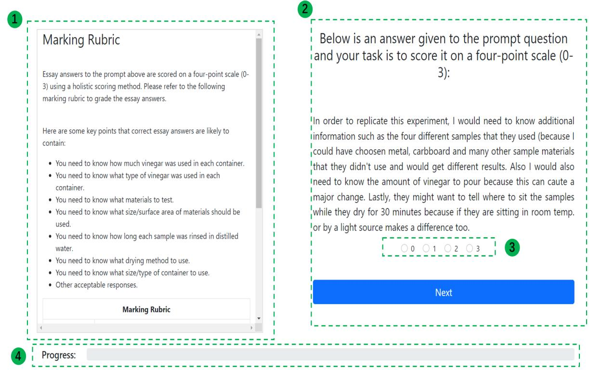
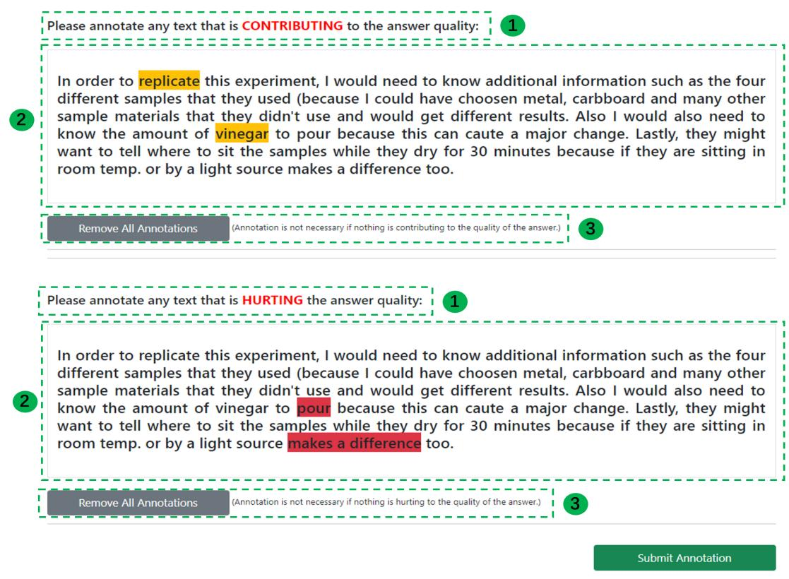
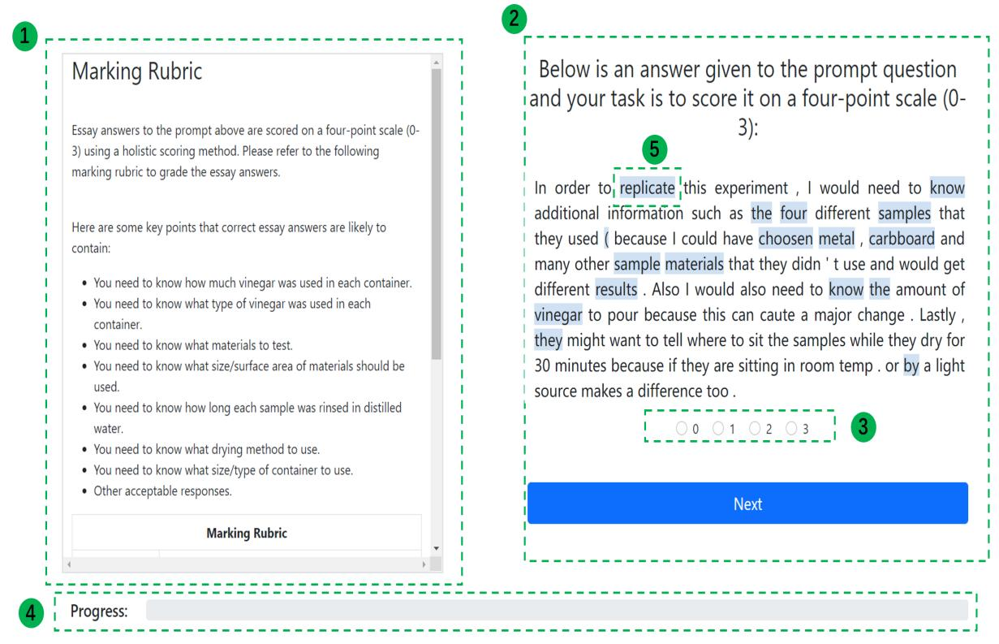

# Do Deep Neural Nets Display Human-like Attention in Short Answer Scoring?

Zijie Zeng, Xinyu Li, Dragan Gaševic´ and Guanliang Chen

Centre for Learning Analytics, Monash University

Melbourne, Victoria, Australia

{Zijie.Zeng, Xinyu.Li, Dragan.Gasevic, Guanliang.Chen}@monash.edu

## Abstract

Deep Learning (DL) techniques have been increasingly adopted for Automatic Text Scoring in education. However, these techniques often suffer from their inabilities to explain and justify how a prediction is made, which, unavoidably, decreases their trustworthiness and hinders educators from embracing them in practice. This study aimed to investigate whether (and to what extent) DL-based graders align with human graders regarding the important words they identify when marking short answer questions. To this end, we first conducted a user study to ask human graders to manually annotate important words in assessing answer quality and then measured the overlap between these human-annotated words and those identified by DL-based graders (i.e., those receiving large attention weights). Furthermore, we ran a randomized controlled experiment to explore the impact of highlighting important words detected by DL-based graders on human grading. The results showed that: (i) DL-based graders, to a certain degree, displayed alignment with human graders no matter whether DL-based graders and human graders agreed on the quality of an answer; and (ii) it is possible to facilitate human grading by highlighting those DL-detected important words, though further investigations are necessary to understand how human graders exploit such highlighted words.

## 1 Introduction

Automatic Text Scoring refers to the task of applying computational techniques to score written text based on certain grading criteria (Alikaniotis et al., 2016). Since its inception (Page, 1966), Automatic Text Scoring has been actively investigated and applied to assist educators in scoring student-written text, e.g., short answer questions and essays, which are often referred to as Automated Short Answer Scoring (ASAS) (Brew and Leacock, 2013) and Essay Scoring (Rodriguez et al., 2019). Driven by the great success of Deep Learning (DL) techniques in various NLP tasks, researchers have endeavored to apply them to construct ASAS systems in recent years (Xia et al., 2020; Sung et al., 2019b,a), some of which displayed performance comparable to human graders. For instance, (Xia et al., 2020) showed that the average performance of an attention-based bidirectional LSTM model could be up to 0.71 (measured by the metric Quadratic Weighted Kappa) in the ASAS competition organized by the Hewlett Foundation, which can be deemed as achieving a substantial agreement with human graders.

Though being effective, DL-based ASAS systems have been widely plagued by the inability to explain how the quality of an answer is graded. The lack of understanding the underlying working mechanism of these systems, beyond question, may stop educators from adopting them in teaching practice as there remain concerns that the use of such ASAS systems might unintentionally encourage students to produce formulaic writings, i.e., writing that is often lengthy and involve complex words, but not much quality content (Wilson et al., 2021; Chen and Cheng, 2008; Wang et al., 2013). Inspired by the research efforts in the broader NLP communities, i.e., those focusing on dissecting complex deep neural net architectures and explaining how they work (Serrano and Smith, 2019; Wiegreffe and Pinter, 2019; Jain and Wallace, 2019; Xie et al., 2020; Sun et al., 2021), in the study presented in this paper we aimed to gain a better understanding of how DL-based ASAS systems work. Specifically, we investigated (i) the alignment between DL-based graders and human graders in terms of the words they think are important in the task of Short Answer Scoring and (ii) whether the important words identified by DLbased graders can be of use to human graders in the marking process. Formally, this study was guided by the following two Research Questions:

RQ1 To what extent do DL-based graders align with human graders regarding the words that are important in assessing answer quality?

RQ2 Can the important words identified by DLbased graders be used to facilitate human graders to perform marking?

We conducted two user studies to answer RQ1 and RQ2. For RQ1, with the dataset provided by the Hewlett Foundation, we constructed relatively simple but effective BERT-based graders (i.e., coupling BERT with a single classification layer for prediction), whose performances were comparable to those reported in recent studies (Xia et al., 2020; Surya et al., 2019). To locate words that were essential in determining answer quality, we extracted weights allocated to different input words in the self-attention layers of BERT. Then, we ran a user study to ask human graders to not only score an answer but also annotate the words they believed were important in contributing to or hurting the answer quality. We measured the alignment between BERT-based graders and human graders with the aid of the Jaccard coefficient. Building upon the results of RQ1, we further implemented a randomized controlled trial to investigate whether displaying the important words identified by BERT-based graders can help human graders improve marking accuracy and efficiency to answer RQ2.

In summary, our work contributes to the research on Automated Text Scoring with the following main findings: (i) text spans contained in an answer that increase the answer quality, compared to those decreasing answer quality, are more likely to be identified by human graders; (ii) there exists a certain level of alignment between DL-based graders and human graders regarding the words they think are important in assessing answer quality no matter whether they agree on the quality score of an answer; and (iii) the important words detected by DL-based graders can be potentially used to facilitate human grading, though more research efforts are required to understand how these words are to be utilized by human graders.

## 2 Related Work

## 2.1 Automated Short Answer Scoring

As a sub-branch of Automatic Text Scoring, ASAS aims to leverage statistical and machine learning techniques to assess the quality of short answers authored by students in education (Burrows et al.,

2015; Xia et al., 2020). Given its important role played in supporting educators to scale up their teaching practices (e.g., to meet the need of marking up to tens of thousands of answers submitted by students and provide informative feedback in a Massive Open Online Course (Pappano, 2012) in a relatively short amount of time), ASAS has been drawing attention from researchers since its inception (Page, 1966). Typically, ASAS can be tackled as either a classification problem (Xia et al., 2020) or a regression problem (Sahu and Bhowmick, 2020). As surveyed in (Bonthu et al., 2021), the approaches used to tackle ASAS often fall into two categories. One is based on traditional machine learning techniques such as SVM (Gleize and Grau, 2013; Mohler et al., 2011; Higgins et al., 2014), K-means (Sorour et al., 2015), Linear Regression (Nau et al., 2017; Heilman and Madnani, 2015; Higgins et al., 2014), and Random Forests (Higgins et al., 2014; Ramachandran et al., 2015; Ishioka and Kameda, 2017), all of which heavily rely on the input of manually-crafted features. For example, Sultan et al. (2016) devised a set of features which were based on a lexical similarity (i.e., similarities between words identified by a paraphrase database (Ganitkevitch et al., 2013)) and monolingual alignment (Sultan et al., 2014), and input the designed features to a ridge regression model to obtain the score of an answer. The other category is based on DL techniques, such as Bi-LSTM (Xia et al., 2020; Kim et al., 2018) and BERT (Sung et al., 2019b), which, in contrast to traditional machine learning approaches, often demonstrate superior performance without the need to engineer humancrafted features. For instance, Sung et al. (2019b) proposed a fine-tuned BERT model for short answer scoring, which outperformed human experts in classifying short answers collected in the subject of psychology.

It has been documented that the use of certain Automated Text Scoring systems in education tends to promote formulaic writing among students, i.e., producing lengthy and complex but not quality content (Wilson et al., 2021; Chen and Cheng, 2008; Wang et al., 2013). As a result, there remain concerns about the ability of these ASAS systems in supporting teachers and instructors (Wilson et al., 2021). To alleviate this issue, some studies were proposed to investigate how ASAS systems work to reach a decision (Higgins et al., 2014), which mainly focused on the ASAS systems powered by traditional machine learning approaches. As an example, Higgins et al. (2014) demonstrated that including syntactically-informed features could boost the predictive performance of an ASAS model, enhancing the model’s ability to identify high-quality responses written by students. To our knowledge, it remains largely unexplored the interpretation ability and reliability of ASAS systems powered by up-to-date DL techniques. An exception is presented by (Manabe and Hagiwara, 2021), in which a toolkit named EXPATS is introduced to enable people to visualize not only models based on traditional machine learning techniques but also those based on DL techniques as well as the predictions produced by these models. Our work distinguished itself from previous studies by collecting humanannotated data to inspect how an answer was evaluated by an ASAS system, i.e., comparing the overlap between the important answer words identified by DL-based graders and human graders, to shed light on the extent to which DL-based graders acted like human graders in the marking process.

## 2.2 Interpretability of Deep Learning Models in NLP

The interpretability and explainability of a predictive model have been widely acknowledged as an essential factor in helping human users understand the validity of a prediction and decide whether to adopt the model for practical use (Jacovi and Goldberg, 2020; Belinkov et al., 2020). In this strand of research, one common method is called test-based (Li et al., 2015; Jain and Wallace, 2019; Sun et al., 2020; Lei et al., 2016), which interprets a prediction by identifying relevant parts of input data that drive the prediction, e.g., words contained in a long sentence that play major roles in determining the overall sentimental polarity of the sentence. When it comes to the application of DL-models equipped with attention mechanism (Bahdanau et al., 2014) for NLP tasks, researchers often regard the weights assigned by the attention layer to different parts of input text as indicators of their importance to the model prediction (Mohankumar et al., 2020; Yang et al., 2016; Wang et al., 2016). However, it remains disputable to use attention weights to measure the importance of input text (Wiegreffe and Pinter, 2019; Serrano and Smith, 2019; Jain and Wallace, 2019). For instance, by manipulating attention weights in well-trained models to analyze their influences upon predictions in text classification, Serrano and Smith (2019) concluded that attention weights can only noisily predict the overall importance of different input text to a model prediction and thus should not be regarded as an optional measure for strict importance ranking. On the contrary, Wiegreffe and Pinter (2019) claimed that the feasibility of attention-as-explanation depends on the concrete definition of explanation. In line with this claim, when inspecting a Transformerbased model for non-factoid question answering, Bolotova et al. (2020) extracted the self-attention weights assigned to words in an answer to measure their importance. Similarly, Zou and Ding (2021) analyzed the self-attention weights in three Transformer-based models to investigate whether these models displayed human-like attention in the task of goal-directed reading comprehension. Similar to these studies, we treated the self-attention weights in a BERT-based model as proxies to reveal the importance of different input text, but in the task of ASAS.

## 2.3 Human Grading

It has been documented that human grading can be affected by various factors, e.g., students’ ethnicity (Hinnerich et al., 2011; Van Ewijk, 2011) and gender (Protivínský and Münich, 2018), and the order of answers to be graded Yen et al. (2020). For instance, Protivínský and Münich (2018) showed that teachers’ grading was biased towards female students in subjects of mathematics and the native language (Czech), and the observed grading difference was likely due to the different levels of non-cognitive skills (e.g., engagement in the classroom) displayed by female and male students. In a different vein, Yen et al. (2020) demonstrated that human graders spent much less time if they were presented with answers sorted according to their similarities with the marking rubric. Previous research on text reading showed that highlighting can facilitate people to remember and comprehend reading materials (Fowler and Barker, 1974; Lorch, 1989; Lorch et al., 1995; Dodson et al., 2017; Silvers and Kreiner, 1997). Inspired by this, we were interested in investigating whether it can facilitate human graders to score answer quality by highlighting words that DL-based graders identified as important in ASAS.

## 3 Methods

This study was approved by the Human Research Ethics Committee at Monash University (Project ID 30074). In the following, we first describe the task and dataset based on which we examined the alignment between DL-based graders and human graders, followed by the construction of the DLbased graders. Then, we detailed the setup of the two user studies we implemented to answer RQ1 and RQ2.

## 3.1 Task, Dataset, and DL-based Graders

This study focused on the ASAS challenge organized by the Hewlett Foundation in Kaggle1, whose dataset contains over 17, 000 answers written by students of Grade 10 in the US to 10 different question prompts. The subjects of these question prompts include such subjects as science, biology, and English. Notice that each of the question prompts and the corresponding collected answers have their own unique characteristics, e.g., different marking rubrics, scoring scale (some are on [0, 2] and the others are on [0, 3]), whether relevant source material was provided, and the average length of answers (ranging from 40 to 60 words). It is worth noting that each of the answers contained in the original dataset was double-scored, i.e., being rated by two independent human graders, and we denoted these scores as Ground-truth Score1 and Ground-truth Score2, respectively, in this study. As specified in the challenge, Ground-truth Score1 is the final score an answer received and also the score that a model should aim to predict. As for Ground-truth Score2, it can be used as a measure of reliability. For instance, researchers can measure the agreements (i) between a model and Groundtruth Score1 and (ii) between Ground-truth Score1 and Ground-truth Score2, and then calculate the difference between the two agreements to gain a rough understanding of the gap between the constructed model and human graders.

In line with previous studies (Xia et al., 2020; Surya et al., 2019; Sung et al., 2019b), we tackled ASAS as a classification problem, i.e., classifying answers to different quality groups. Inspired by the great success of BERT (Devlin et al., 2018) in various NLP tasks, we also used it to construct DL-based graders to score an answer automatically. The model structure is relatively simple, i.e., we only coupled BERT with a single classification layer for prediction and then adapted the model to capture the unique characteristics of this task by fine-tuning on the graded answers. Given the unique characteristics of the different question prompts contained in the dataset, we decided to build a BERT-based grader for each of the question prompts. For each question prompt, we randomly split the answers in the ratio of 8:1:1 as training, validation, and testing sets. The details of the construction process are provided in Appendix A. As suggested by the challenge requirement, we used the metric Quadratic Weighted Kappa (QWK) to measure the performance of DL-based graders, which ranged from 0.660 to 0.891 for the 10 question prompts. As our goal was to investigate that, when a DL-based model was able to achieve a substantial level of performance in assessing answer quality, whether and to what extent it aligned with human graders in the marking process. Thus, we chose only the three question prompts (i.e., Prompt 1, 5, and 6, which were all graded on a scale of [0, 3]) in which DL-based graders achieved the best prediction performance (i.e., with QWK 0.831, 0.860, and 0.891, respectively) for the two user studies, as described below.

## 3.2 Study One

For RQ1, we designed a study to collect answer annotations from human graders, i.e., important words or text spans that human graders believe to increase or decrease the quality of an answer.

Participants. For Study 1, we recruited a total of 20 participants (7 females, 13 males), all of whom had received at least a master’s degree, were proficient in English, and were employed by Monash University. In particular, all the participants had certain years of prior teaching experience, i.e., 13 participants less than 3 years, four had 3 5 years, and three more than 5 years of experience. All participants were informed of the purpose of this study (and also Study 2) and signed consent forms before participating in the studies.

Study Setup. For each question prompt, we randomly selected five answers from each quality level (i.e., scores in the scale of [0, 3]) from the testing data set, which resulted in a total of 60 answers. In particular, we developed a grading system to allow participants to not only score an answer but also annotate the words or text spans that they thought important in determining the quality levels. When annotating an answer, the participants were required to annotate not only the text spans that increasing answer quality but also those decreasing answer quality, which were correspondingly denoted as Positive and Negative text spans in later analysis. We provided the screenshots of the grading system in Appendix C. Each of the 20 participants was required to attend a 90-minute session to grade 30 answers so that we collected a total of 600 assessment scores and annotations from our participants. Every answer was graded by 10 participants. In particular, we assigned the selected answers to the participants in a way that each participant was required to score answers of every quality level. After completion, we compensated each participant with a gift card worth \$75 AUD for their time (i.e., \$50 AUD per hour, which is comparable to the hourly rate for people with a master’s degree in Australia).

Procedure. To ensure the quality of the collected data, we expected the participants to undertake adequate training to understand how they should mark before moving to the actual answer scoring and annotation. Therefore, the grading system we developed provided two modes for participants, i.e., Practice for pre-task training and Actual Task for actual data collection. Only after finishing the activities scheduled in Practice, the participants were allowed to start the Actual Task. Both Practice and Actual Task required a participant to evaluate an answer by following the steps described below. The main difference lied in the sources from which the presented answers were selected, i.e., validation set for Practice and testing set for Actual Task.

(1) Material Reading. A participant was asked to read a prompt, an article relevant to the prompt (if available in the original dataset), marking rubric, and exemplar answers with scores assigned by human graders (i.e., Ground-truth Score1).

(2) Pre-task questionnaire. The participant was asked to indicate their familiarity, interestingness, and perceived difficulty of the question prompt by answering three questions on a rating scale of [1, 5], which were provided in the Appendix B.

(3) Answer assessment. An answer was presented for the participant to rate its quality. Note that the marking rubric was displayed along with the to-be-graded answer to facilitate the participant to mark.

(4) Answer annotation. The participant was instructed to highlight words and text spans that they identified as important in determining answer quality.

Grading Alignment Measurement. Here, we introduce how we detected the words that DL-based graders paid attention to in the marking process and further measured the overlap between these words and those annotated by the human participants in Study 1. Similar to the work by Bolotova et al. (2020), we extracted the words by calculating weights assigned to each token in the self-attention layers of the adopted BERT model. Specifically, for a token t contained in an answer Ans, its attention weight is calculated as follows:

$$
A t n \_ S c o r e ( t ) = \frac { \sum _ { i \in A n s } w _ { i  t } } { | A n s | }\tag{1}
$$

Here, Ans denotes the length of Ans, and $w _ { i \to t }$ denotes the attention weight assigned by token i to token t, which can be retrieved and calculated in the attention layers of BERT. In more detail, there were 12 attention heads in the adopted BERT model; we first averaged the weights contained in these attention heads and then retrieved $w _ { i \to t }$ in the averaged attention head. In brief, for a token in an answer, we summed up the attention weights from each token contained in the answer to the target token and then normalized the sum by the answer length to obtain the importance of the target token. Then, we could select the top K words with the largest attention weights as the set of important words identified by BERT-based graders. As suggested by Bolotova et al. (2020), we determined the value of K with the aid of a linear regression model, which took the length of an answer as the only input to predict the number of important words it should output. The regression model was trained based on the human-annotated data we collected in Study 1. Then, we followed the approach adopted by Bolotova et al. (2020) and measured their grading alignment by calculating the Jaccard coefficient between the two sets of important words identified by a human grader and a BERT-based grader. We also followed Qu et al. (2019) to exclude stop words from the set of important words before calculating the Jaccard coefficient. The stop words were detected with the aid of NLTK toolkit2. We first calculate the Jaccard coefficients over all < answer, human grader > data pairs collected in this study and then averaged them as the final measure of the alignment between BERT-based graders and the human graders.

## 3.3 Study Two

For RQ2, we conducted a randomized controlled experiment to investigate whether human grading could be facilitated by observing highlighted important words detected by DL-based graders.

Participants. We randomly invited 10 out of the 20 participants who had taken part in Study 1 for Study 2. As for the prior teaching experience, seven out of the 10 participants were with less than 3 years, two were between 3 to 5 years, and one with more than 5 years of experience.

Study Setup. The 10 participants were randomly assigned to two groups, i.e., 5 in the control group and 5 in the experimental group. Only the participants in the experimental group were displayed with the highlighted words detected by BERTbased graders. We randomly selected 36 answers from the testing data for participants to mark. It is worth noting that these answers were unseen to the participants in Study 1, and these answers covered all quality levels in all question prompts. Each participant was required to attend a 45-minute session to assess a total of 24 answers. Each answer was assessed by the same number of participants from the control group and the experimental group. Similar to Study 1, every participant was required to score answers of all quality levels. After completion, each participant received a gift card worth \$40 AUD to compensate for their time.

Procedure. The procedure of Study 2 only consisted of two main steps from the procedure of Study 1 and the participants did not need to receive pre-task training again, as described below.

(1) Material Reading. Similar to Study 1, we presented participants with all relevant materials to help them get familiar with the task requirement.

(2) Answer Assessment. In this step, the participants in the control group were displayed with answers without any highlighted words. As for the answers presented to participants in the experimental group, the important words contained in these answers, i.e., those detected by applying DL-based graders as described in Section 3.2, were highlighted.

It is noteworthy that the participants were informed about (i) the nature of these highlighted words (i.e., important words detected by DL-based graders) and (ii) the reliability of these highlighted words (i.e., some might be helpful for assessing answer quality while the others are not). We used the linear regression constructed in Section 3.2 to determine the number of words that should be highlighted to a participant.

(3) Post-task questionnaire. This step was only for the participants in the experimental group after completing the whole study. The participants were asked to answer two questions on a rating scale of [1, 5] with regard to the usefulness of the highlighted words for marking.

With the completion of the study, we compared the grading performance of the participants in the two groups from two perspectives. One is accuracy, which was calculated as the QWK between the participant-provided scores and the groundtruth scores. Here, we regarded that a participantprovided score matched the ground-truth data if it matched either Ground-truth Score1 or Groundtruth Score2 in the original dataset; otherwise, we simply regarded Ground-truth Score1 as the ground-truth. The other is efficiency, which was calculated as the average amount of time that participants spent in scoring answers. The amount of time that a participant used in assessing an answer was computed as the time difference between the moment when the participant entered the screen of the grading system to assess the answer and the moment when the participant clicked to move to grade the next answer.

## 4 Results

Recall that all answers used in this study were assessed on a grading scale of [0, 3]. For the following analysis, we aggregated and denoted the answers whose Ground-truth Score1 is 0 or 1 in the original dataset as Low quality, and those of score 2 or 3 as High quality.

## 4.1 Results on RQ1

Table 1 details the fractions of answers with different types of annotations, i.e., positive/negative text spans that increased/decreased answer quality. We observed that 89.3% answers were annotated by our participants, among which 74.5% received positive annotations while only 42.5% received negative annotations. This indicates that text spans contributing to answer quality were more likely to be determined and identified by human graders than those lowering answer quality. This is corroborated by the results in both high-quality and low-quality answer categories. For instance, the fraction of answers with positive and negative annotations were 95.3% and 32.7%, respectively. We can make similar observations in low-quality answers, but the difference was only 1.4%.

Table 1: The fraction of answers received different types annotations from the participants in Study 1.
<table><tr><td>Qulity Level</td><td>Low</td><td>High</td><td>ALL</td></tr><tr><td>% Answers with positive annotations</td><td>53.7</td><td>95.3</td><td>74.5</td></tr><tr><td>% Answers with negative annotations</td><td>52.3</td><td>32.7</td><td>42.5</td></tr><tr><td>% Answers with annotations</td><td>81.3</td><td>97.3</td><td>89.3</td></tr></table>

Table 2 describes the alignment between BERTbased graders and human graders involved in Study 1, i.e., the Jaccard coefficients between the two sets of the important words identified by them when performing marking. As a baseline for comparison, we selected important words based on randomlyassigned weights and measured their overlap with the important words annotated by human graders (as detailed in the column RANDOM). By comparing the results of RANDOM and ALL, we can conclude that there existed some agreement between BERTbased graders and human graders. When considering both positive and negative annotations, the alignment reached the value of 0.252 (about 69% more than that of randomly-annotated important words, i.e., 0.149). Also, we noticed that the alignment in high-quality answers was more than that in lower-quality answers (0.275 vs. 0.224). When considering only positive/negative annotations for measurement, there was a higher level of alignment in positive annotations than negative annotations (0.251 vs. 0.174). This suggests that DL-based graders and human graders were more likely to agree with each other regarding what makes a good answer than what makes a bad answer. This finding is related to what we observed in Table 1, i.e., hu man graders made more positive annotations than negative annotations in Study 1. These findings together imply that, to a certain degree, there do exist similarities between the BERT-based graders and human graders in the grading process.

It should be noted that (i) only 40 out of the 60 answers used in Study 1 were correctly assessed by BERT-based graders and (ii) only 342 out of the 600 (about 57%) collected assessment scores provided by our participants were in agreement with the ground-truth (i.e., matching to either Groundtruth Score1 or Ground-truth Score2 in the original dataset). To further investigate grading alignment in different conditions (e.g., BERT-based graders and human graders simultaneously failed to assess the quality of an answer), we further divided the collected data into two groups for analysis, i.e., G1 consisting of answers for which human graders and BERT-based graders simultaneously delivered correct/incorrect answer scores and G2 consisting of the other data for which either human graders or BERT-based graders failed to produce correct assessments, as detailed in Table 2. The G1 alignment was similar to those calculated by taking all answers into account (i.e., the ALL column). To our surprise, there also exists an overall alignment of 0.248 between BERT-based graders and human graders in G2. This means, even in the situations where human graders were able to correctly assess the quality of an answer but BERT-based graders failed to do so (or the opposite), there is some overlap between the human-annotated and DL-detected important words. This implies that, in certain cases, even human graders and DL-based graders disagreed on the score value of an answer, they did reach a partial agreement on the words that were important for assessing the answer’s quality.

## 4.2 Results on RQ2

It should be pointed out that 25 out of the 36 selected answers for our participants to grade in Study 2 were accurately scored by BERT-based graders. The reasons we also included the inaccuratelyscored answers are two-fold. Firstly, our ultimate goal is to use important words located by BERTbased graders to facilitate human grading in practice. As a DL-based grader is unlikely to derive correct predictions all the time in real-world scenarios, it is very likely that some of the DL-identified plausibly-important words will be presented to human graders in certain cases. Secondly, as demonstrated in Study 1, when BERT-based graders disagreed with human graders regarding an answer’s quality, they still had moderate overlap between the important words they identified. Thus, we were interested in investigating whether human graders

Table 2: The overlap between human graders’ different types of annotations (i.e., Positive or Negative) with the important words detected by BERT-based graders. The column ALL includes all collected data for analysis; G1 includes only the answers that were simultaneously correctly/incorrectly assessed by the two types of graders, and G2 includes the other data in which either BERT-based graders or human graders did not match to the ground-truth scores. Paired t-tests were applied to examine the difference between Random and ALL regarding the same type of annotation while unpaired t-tests were adopted to examine the difference between Random and (G1, G2) regarding the same type of annotation. Significant results were marked with either $( \mathrm { i f } p < 0 . 0 0 1 )$ or (if p < 0.01).
<table><tr><td></td><td colspan="3">RANDOM</td><td colspan="3">ALL</td><td colspan="3">G1</td><td colspan="3">G2</td></tr><tr><td>Annotation type</td><td>Pos</td><td>Neg</td><td>Pos &amp;Neg</td><td> $\mathrm { P o s }$ </td><td> $\mathrm { N e g }$ </td><td>Pos &amp;Neg</td><td> $\mathrm { P o s }$ </td><td> $\mathrm { N e g }$ </td><td> $\mathrm { P o s } \ \& \ \mathrm { N e g }$ </td><td> $\mathrm { P o s }$ </td><td>Neg</td><td> $\mathrm { P o s } \ \& \ \mathrm { N e g }$ </td></tr><tr><td>Low quality</td><td>0.128</td><td>0.123</td><td>0.136</td><td> $^ { * * } 0 . 2 3 5$ </td><td> $^ { * * } 0 . 1 7 6$ </td><td> $^ { * * } 0 . 2 2 4$ </td><td> $^ { * * } 0 . 2 6 8$ </td><td> $^ { * } _ { 0 . 1 7 6 }$ </td><td> $^ { * * } \mathrm { ~ 0 . 2 3 3 }$ </td><td> $^ { * * } 0 . 2 0 5$ </td><td> $_ { 0 . 1 7 8 }$ </td><td> $^ { * * } 0 . 2 1 0$ </td></tr><tr><td>High quality</td><td>0.155</td><td>0.116</td><td>0.160</td><td> $^ { * * } 0 . 2 6 1$ </td><td> $^ { * * } 0 . 1 7 0$ </td><td> $^ { * * } 0 . 2 7 5$ </td><td> $^ { * * } _ { 0 . 2 5 6 }$ </td><td> $^ { * } _ { 0 . 1 7 3 }$ </td><td> $^ { * * } 0 . 2 7 3$ </td><td> $^ { * * } \mathrm { ~ 0 . 2 6 7 }$ </td><td> $0 . 1 6 5$ </td><td> $^ { * * } 0 . 2 7 8$ </td></tr><tr><td>Average</td><td>0.146</td><td>0.120</td><td>0.149</td><td> $^ { * * } 0 . 2 5 1$ </td><td> $^ { * * } 0 . 1 7 4$ </td><td> $^ { * * } 0 . 2 5 2$ </td><td> $^ { * * } 0 . 2 6 0$ </td><td> $^ { * * } 0 . 1 7 4$ </td><td> $^ { * * } 0 . 2 5 4$ </td><td> $^ { * * } 0 . 2 4 1$ </td><td> $\approx 0 . 1 7 2$ </td><td> $^ { * * } 0 . 2 4 8$ </td></tr></table>

Table 3: The participants’ grading performance in Study 2. The difference between the two groups regarding their average time spent grading one answer (measured in seconds) was tested to be significant with paired t-test $( p < 0 . 0 1 )$ ).

## 5 Discussions and Conclusion

Given the increasing popularity of DL-based Automatic Text Scoring systems in education, this work investigated the interpretability of these syscould be facilitated by observing (not necessarily correct) important words identified by BERT-based graders. The grading performances of the participants are given in Table 3, i.e., QWK for accuracy and the average amount of time spent in scoring an answer for efficiency. The results showed that, by highlighting important words detected by BERTbased graders, we could facilitate human grading in terms of grading accuracy. However, contrary to our expectation, the Experimental participants spent roughly 12 more seconds in scoring an answer than the Control participants. This is probably because, as being informed that the highlighted words were identified by a DL-based model and not necessarily useful in discerning answer quality, the participants allocated more time in scrutinizing the answer text to judge its quality. This was partially supported by their responses to questions in the post-task questionnaire, i.e., an average rating of only 3.0 (out of 5.0) was reported regarding whether the participants considered the highlighted words as actually important, but an average rating of 3.8 (out of 5.0) was reported regarding the usefulness of the highlighted words for marking.

<table><tr><td>Metrics</td><td>Control</td><td>Experimental</td></tr><tr><td>QWK</td><td>0.71</td><td>0.74</td></tr><tr><td>Avg. time per answer</td><td>42.17</td><td>54.83</td></tr></table>

tems regarding their alignment with human graders in the task of ASAS. Through two well-designed user studies, we demonstrated that (i) there exists certain alignment between DL-based graders and human graders in terms of the important words they identified for assessing answer quality; and (ii) it is possible to utilize the important words detected by DL-based graders to facilitate human grading.

Though several interesting findings have been enabled, it is not the time yet to advocate that we should incorporate such DL-identified important words into ASAS systems to facilitate human grading due to the following limitations in our study. Firstly, as observed in Study 1, DL-based graders displayed certain agreement with human graders, even in the circumstances of being unable to correctly assess the quality of an answer. It remains unknown what types of words (or concepts) DL-based graders agree/disagree on with human graders. For example, would it be possible that both types of graders tend to hold similar misconceptions (e.g., identifying the same type of plausibly-correct words)? This calls for future research to characterize and analyze the different types of important answer spans identified by DLbased graders and human graders under different circumstances. By doing this, we can potentially derive more insights on how to further improve the prediction performance of DL-based graders. Secondly, and more importantly, it remains unknown the sense-making process the human graders follow to make use of the DL-detected important words. As showed in Study 2, the human graders in the Experimental group neither agreed nor disagreed that the DL-highlighted words were important, but they considered the DL-highlighted words were of value and delivered better grading accuracy (at the cost of a lower grading efficiency). Would it be the case that the highlighted words provoke more in-depth thinking and understanding of an answer among human graders and thus enabling them to better assess the answer quality? This motivates us to conduct further studies to investigate human graders’ marking process in using DL-highlighted words in the future.

## References

Dimitrios Alikaniotis, Helen Yannakoudakis, and Marek Rei. 2016. Automatic text scoring using neural networks. arXiv preprint arXiv:1606.04289.

Dzmitry Bahdanau, Kyunghyun Cho, and Yoshua Bengio. 2014. Neural machine translation by jointly learning to align and translate. arXiv preprint arXiv:1409.0473.

Yonatan Belinkov, Sebastian Gehrmann, and Ellie Pavlick. 2020. Interpretability and analysis in neural nlp. In Proceedings of the 58th Annual Meeting of the Association for Computational Linguistics: Tutorial Abstracts, pages 1–5.

Valeria Bolotova, Vladislav Blinov, Yukun Zheng, W Bruce Croft, Falk Scholer, and Mark Sanderson. 2020. Do people and neural nets pay attention to the same words: Studying eye-tracking data for nonfactoid qa evaluation. In Proceedings of the 29th ACM International Conference on Information & Knowledge Management, pages 85–94.

Sridevi Bonthu, S Rama Sree, and MHM Krishna Prasad. 2021. Automated short answer grading using deep learning: A survey. In International Cross-Domain Conference for Machine Learning and Knowledge Extraction, pages 61–78. Springer.

Chris Brew and Claudia Leacock. 2013. Automated short answer scoring: Principles and prospects. In Handbook of Automated Essay Evaluation, pages 158–174. Routledge.

Steven Burrows, Iryna Gurevych, and Benno Stein. 2015. The eras and trends of automatic short answer grading. International Journal of Artificial Intelligence in Education, 25(1):60–117.

Chi-Fen Emily Chen and Wei-Yuan Eugene Cheng Cheng. 2008. Beyond the design of automated writing evaluation: Pedagogical practices and perceived learning effectiveness in efl writing classes. Language Learning & Technology, 12(2):94–112.

Jacob Devlin, Ming-Wei Chang, Kenton Lee, and Kristina Toutanova. 2018. Bert: Pre-training of deep bidirectional transformers for language understanding. arXiv preprint arXiv:1810.04805.

Samuel Dodson, Luanne Freund, and Rick Kopak. 2017. Do highlights affect comprehension? lessons from a user study. In Proceedings of the 2017 Conference on Conference Human Information Interaction and Retrieval, pages 381–384.

Robert L Fowler and Anne S Barker. 1974. Effectiveness of highlighting for retention of text material. Journal ofApplied Psychology, 59(3):358.

Juri Ganitkevitch, Benjamin Van Durme, and Chris Callison-Burch. 2013. Ppdb: The paraphrase database. In Proceedings ofthe 2013 Conference of the North American Chapter of the Association for Computational Linguistics: Human Language Technologies, pages 758–764.

Martin Gleize and Brigitte Grau. 2013. Limsiiles: Basic english substitution for student answer assessment at semeval 2013. In Second Joint Conference on Lexical and Computational Semantics (\* SEM), Volume 2: Proceedings of the Seventh International Workshop on Semantic Evaluation (SemEval 2013), volume 2, pages 598–602.

Michael Heilman and Nitin Madnani. 2015. The impact of training data on automated short answer scoring performance. In Proceedings of the Tenth Workshop on Innovative Use ofNLP for Building Educational Applications, pages 81–85.

Derrick Higgins, Chris Brew, Michael Heilman, Ramon Ziai, Lei Chen, Aoife Cahill, Michael Flor, Nitin Madnani, Joel Tetreault, Daniel Blanchard, et al. 2014. Is getting the right answer just about choosing the right words? the role of syntacticallyinformed features in short answer scoring. arXiv preprint arXiv:1403.0801.

Björn Tyrefors Hinnerich, Erik Höglin, Magnus Johannesson, et al. 2011. Ethnic discrimination in high school grading: Evidence from a field experiment. Stockholm School of Economics Working Paper Series in Economic and Finance, (733).

Tsunenori Ishioka and Masayuki Kameda. 2017. Overwritable automated japanese short-answer scoring and support system. In Proceedings of the International Conference on Web Intelligence, pages 50–56.

Alon Jacovi and Yoav Goldberg. 2020. Towards faithfully interpretable NLP systems: How should we define and evaluate faithfulness? In Proceedings ofthe 58th Annual Meeting of the Association for Computational Linguistics, pages 4198–4205, Online. Association for Computational Linguistics.

Sarthak Jain and Byron C Wallace. 2019. Attention is not explanation. arXiv preprint arXiv:1902.10186.

Byung-Hak Kim, Ethan Vizitei, and Varun Ganapathi. 2018. Gritnet: Student performance prediction with deep learning.

Tao Lei, Regina Barzilay, and Tommi Jaakkola. 2016. Rationalizing neural predictions. arXiv preprint arXiv:1606.04155.

Jiwei Li, Xinlei Chen, Eduard Hovy, and Dan Jurafsky. 2015. Visualizing and understanding neural models in nlp. arXiv preprint arXiv:1506.01066.

Elizabeth Pugzles Lorch, Madeline A Klusewitz, et al. 1995. Effects of typographical cues on reading and recall of text. Contemporary educational psychology, 20(1):51–64.

Robert F Lorch. 1989. Text-signaling devices and their effects on reading and memory processes. Educational psychology review, 1(3):209–234.

Hitoshi Manabe and Masato Hagiwara. 2021. Expats: A toolkit for explainable automated text scoring. arXiv preprint arXiv:2104.03364.

Akash Kumar Mohankumar, Preksha Nema, Sharan Narasimhan, Mitesh M Khapra, Balaji Vasan Srinivasan, and Balaraman Ravindran. 2020. Towards transparent and explainable attention models. arXiv preprint arXiv:2004.14243.

Michael Mohler, Razvan Bunescu, and Rada Mihalcea. 2011. Learning to grade short answer questions using semantic similarity measures and dependency graph alignments. In Proceedings ofthe 49th annual meeting ofthe associationfor computational linguistics: Human language technologies, pages 752–762.

Jonathan Nau, Aluizio Haendchen Filho, and Guil herme Passero. 2017. Evaluating semantic analysis methods for short answer grading using linear regression. Sciences, 3(2):437–450.

Ellis B Page. 1966. The imminence of... grading essays by computer. The Phi Delta Kappan, 47(5):238– 243.

Laura Pappano. 2012. The year of the mooc. The New York Times, 2(12):2012.

Tomáš Protivínský and Daniel Münich. 2018. Gender bias in teachers’ grading: What is in the grade. Studies in Educational Evaluation, 59:141–149.

Chen Qu, Liu Yang, W Bruce Croft, Falk Scholer, and Yongfeng Zhang. 2019. Answer interaction in nonfactoid question answering systems. In Proceedings of the 2019 Conference on Human Information Interaction and Retrieval, pages 249–253.

Lakshmi Ramachandran, Jian Cheng, and Peter Foltz. 2015. Identifying patterns for short answer scoring using graph-based lexico-semantic text matching. In Proceedings of the Tenth Workshop on Innovative Use of NLP for Building Educational Applications, pages 97–106.

Pedro Uria Rodriguez, Amir Jafari, and Christopher M Ormerod. 2019. Language models and automated essay scoring. arXiv preprint arXiv:1909.09482.

Archana Sahu and Plaban Kumar Bhowmick. 2020. Feature engineering and ensemble-based approach for improving automatic short-answer grading performance. IEEE Transactions on Learning Technologies, 13(1):77–90.

Sofia Serrano and Noah A Smith. 2019. Is attention interpretable? arXiv preprint arXiv:1906.03731.

Vicki L Silvers and David S Kreiner. 1997. The effects of pre-existing inappropriate highlighting on reading comprehension. Literacy Research and Instruction, 36(3):217–223.

Shaymaa E Sorour, Tsunenori Mine, Kazumasa Goda, and Sachio Hirokawa. 2015. A predictive model to evaluate student performance. Journal of Information Processing, 23(2):192–201.

Md Arafat Sultan, Steven Bethard, and Tamara Sumner. 2014. Back to basics for monolingual alignment: Exploiting word similarity and contextual evidence. Transactions of the Association for Computational Linguistics, 2:219–230.

Md Arafat Sultan, Cristobal Salazar, and Tamara Sumner. 2016. Fast and easy short answer grading with high accuracy. In Proceedings of the 2016 Conference of the North American Chapter of the Association for Computational Linguistics: Human Language Technologies, pages 1070–1075.

Xiaofei Sun, Diyi Yang, Xiaoya Li, Tianwei Zhang, Yuxian Meng, Qiu Han, Guoyin Wang, Eduard Hovy, and Jiwei Li. 2021. Interpreting deep learning models in natural language processing: A review. arXiv preprint arXiv:2110.10470.

Zijun Sun, Chun Fan, Qinghong Han, Xiaofei Sun, Yuxian Meng, Fei Wu, and Jiwei Li. 2020. Selfexplaining structures improve nlp models. arXiv preprint arXiv:2012.01786.

Chul Sung, Tejas Dhamecha, Swarnadeep Saha, Tengfei Ma, Vinay Reddy, and Rishi Arora. 2019a. Pre-training bert on domain resources for short answer grading. In Proceedings of the 2019 Conference on Empirical Methods in Natural Language Processing and the 9th International Joint Conference on Natural Language Processing (EMNLP-IJCNLP), pages 6071–6075.

Chul Sung, Tejas Indulal Dhamecha, and Nirmal Mukhi. 2019b. Improving short answer grading using transformer-based pre-training. In International Conference on Artificial Intelligence in Education, pages 469–481. Springer.

K Surya, Ekansh Gayakwad, and MK Nallakaruppan. 2019. Deep learning for short answer scoring. Int. J. Recent Technol. Eng, 7(6):1712–1715.

Reyn Van Ewijk. 2011. Same work, lower grade? student ethnicity and teachers’ subjective assessments. Economics ofEducation Review, 30(5):1045–1058.

Yequan Wang, Minlie Huang, Xiaoyan Zhu, and Li Zhao. 2016. Attention-based lstm for aspectlevel sentiment classification. In Proceedings of the 2016 conference on empirical methods in natural language processing, pages 606–615.

Ying-Jian Wang, Hui-Fang Shang, and Paul Briody. 2013. Exploring the impact of using automated writing evaluation in english as a foreign language university students’ writing. Computer Assisted Language Learning, 26(3):234–257.

Sarah Wiegreffe and Yuval Pinter. 2019. Attention is not not explanation. arXiv preprint arXiv:1908.04626.

Joshua Wilson, Cristina Ahrendt, Emily A Fudge, Alexandria Raiche, Gaysha Beard, and Charles MacArthur. 2021. Elementary teachers’ perceptions of automated feedback and automated scoring: Transforming the teaching and learning of writing using automated writing evaluation. Computers & Education, 168:104208.

Linzhong Xia, Mingxiang Guan, Jun Liu, Xuemei Cao, and Dean Luo. 2020. Attention-based bidirectional long short-term memory neural network for short answer scoring. In International Conference on Machine Learning and Intelligent Communications, pages 104–112. Springer.

Ning Xie, Gabrielle Ras, Marcel van Gerven, and Derek Doran. 2020. Explainable deep learning: A field guide for the uninitiated. arXiv preprint arXiv:2004.14545.

Zichao Yang, Diyi Yang, Chris Dyer, Xiaodong He, Alex Smola, and Eduard Hovy. 2016. Hierarchical attention networks for document classification. In Proceedings of the 2016 conference of the North American chapter of the association for computational linguistics: human language technologies, pages 1480–1489.

Michael Yen, Sergey Karayev, and Eric Wang. 2020. Analysis of grading times of short answer questions. In Proceedings of the Seventh ACM Conference on Learning@ Scale, pages 365–368.

Jiajie Zou and Nai Ding. 2021. Deep neural networks evolve human-like attention distribution during goaldirected reading comprehension.

## A BERT-based Grader Construction

We constructed our DL-based graders based on the well-known pre-trained language model BERT (Devlin et al., 2018). Similar to (Sung et al., 2019b), we implemented the BERT-based graders by adopting the pre-trained bert-base-cased model (12 layers, 768 neurons in each hidden layer, 12 attention heads, and a total of 110M parameters) with a sequence classification layer on top provided by the Python package Transformers3. Then, we fine-tuned the whole model on the training set of each question prompt. It should be noted that only the student-authored answers were used as input to train the model. During model training, the batch size was set to 16, and we selected the number of epoch from 1, 2, 3, 4, 5 and the learning rate from $\{ 1 e \mathrm { ~ - ~ } 5 , 5 e \mathrm { ~ - ~ } 5 , 1 e \mathrm { ~ - ~ } 4 \}$ . For the optimizer, we used Adam with decoupled weight decay (i.e., AdamW). To determine the best values for the hyperparameters mentioned above, we trained the models with different combinations of parameter values and selected the best model based on its performance on the validation set for each question prompt. The run time for fine-tuning each BERT-based grader is roughly 1.5 hours (5 epochs, with NVIDIA Tesla P4 GPU). Table 4 details the parameter choices for each constructed model and their corresponding performance (measured by QWK). By comparing QWK1 and QWK2 reported in Table 4, the difference between which can be regarded as the gap between human graders and the constructed BERT-based graders, we can conclude that the BERT-based graders achieved a substantial level of predictive performance in most of the question prompts. Note that the codes for constructing the models can be accessed via https://github.com/douglashiwo/ AttentionAlignmentASAS.

## B Pre-/Post-task Questionnaires

In Study 1, before scoring answers to a question prompt, the participants were required to answer the following three questions to indicate their interest, familiarity, and perceived difficulty of the question prompt on a rating scale of [1, 5]:

• To what extent are you interested in the prompt topic? (with 1 being not interested at all and 5 being very interested)

Table 4: Performances of the constructed BERT-based graders in different question prompts. QWK1 denotes the QWK between the Ground-truth Score1 and Ground-truth Score2 provided in the orignal dataset, while QWK2 denotes the QWK between the Groundtruth Score1 and the predictions generated by our BERT-based graders.
<table><tr><td>Prompt ID</td><td>QWK1</td><td>QWK2</td><td>Learning rate</td><td>Epoch</td></tr><tr><td>1</td><td>0.950</td><td>0.860</td><td>5e-5</td><td>4</td></tr><tr><td>2</td><td>0.900</td><td>0.716</td><td>1e-5</td><td>5</td></tr><tr><td>3</td><td>0.681</td><td>0.291</td><td>1e-5</td><td>5</td></tr><tr><td>4</td><td>0.683</td><td>0.729</td><td>5e-5</td><td>5</td></tr><tr><td>5</td><td>0.962</td><td>0.891</td><td>5e-5</td><td>5</td></tr><tr><td>6</td><td>0.952</td><td>0.831</td><td>5e-5</td><td>5</td></tr><tr><td>7</td><td>0.959</td><td>0.731</td><td>5e-5</td><td>3</td></tr><tr><td>8</td><td>0.866</td><td>0.660</td><td>5e-5</td><td>2</td></tr><tr><td>9</td><td>0.782</td><td>0.730</td><td>5e-5</td><td>3</td></tr><tr><td>10</td><td>0.887</td><td>0.719</td><td>1e-5</td><td>4</td></tr></table>

• To what extent are you familiar with the prompt topic? (with 1 being not familiar at all and 5 being very familiar)

• How would you describe the difficulty level of the prompt topic to students of Grade 10 in the US (i.e., the second year in high school)? (with 1 being very easy and 5 being very difficult)

In Study 2, the participants in the Experimental group were required to answer the following two questions to share their opinions regarding the highlighted important words detected by BERT-based graders on a rating scale of [1, 5]:

• To what extent do you think the text highlighted by our automatic model grader are actually “important” in determining the quality of an answer? (with 1 being not important at all and 5 being very important)

• To what extent do you think the text highlighted by our automatic model grader helps you grade answers? (with 1 being not helpful at all and 5 being very helpful)

## C The Developed Grading System

Figure 1 shows the screen of the developed grading system in which participants scored an answer in Study 1. Figure 2 shows the screen of the developed grading system in which participants annotated an answer after assigning a score value to the answer in Study 1. Figure 3 shows the screen of the developed grading system in which participants in the Experimental group scored an answer in Study 2; the screen that participants in the Control group is similar to Figure 3 but without any answer words being highlighted.

  
Figure 1: The screen of the developed grading system for a participant to score an answer in Study 1: 1 shows the marking rubric to participants; 2 shows the instruction and an answer to be graded; 3 shows the score scale (i.e., [1, 3]); and 4 shows a participant’s overall progress in the study (i.e., how many answers the participant has graded and how many more needs to be graded). After clicking the Next button, the participant will enter the next screen to annotate important words contained in the same answer.

  
Figure 2: The screen of the developed grading system for a participant to annotate an answer in Study 1: 1 gives annotation instruction to a participant; 2 displays the same answer that the participant scored in the previous screen; and 3 allows a participant to remove to all existing annotations and start the annotation from scratch again, and the participant is informed that annotation is not mandatory if she believes that there is nothing contributing/hurting the quality of the answer.

  
Figure 3: The screen of the developed grading system for a participant in the Experimental group to score an answer in Study 2: 1 shows the marking rubric to participants; 2 shows the instruction and an answer to be graded; 3 shows the score scale (i.e., [1, 3]); 4 shows a participant’s overall progress in the study (i.e., how many answers the participant has graded and how many more needs to be graded); and particularly, 5 highlights the important words detected by BERT-based graders developed in our work. After clicking the Next button, the participant will be directed to assess the next answer.