# Do Prompt-Based Models Really Understand the Meaning of Their Prompts?

Albert Webson1,2 and Ellie Pavlick1

{albert\_webson, ellie\_pavlick}@brown.edu 1Department of Computer Science, Brown University 2Department of Philosophy, Brown University

## Abstract

Recently, a boom of papers has shown extraordinary progress in zero-shot and few-shot learning with various prompt-based models. It is commonly argued that prompts help models to learn faster in the same way that humans learn faster when provided with task instructions expressed in natural language. In this study, we experiment with over 30 prompt templates manually written for natural language inference (NLI). We find that models can learn just as fast with many prompts that are intentionally irrelevant or even pathologically misleading as they do with instructively “good” prompts. Further, such patterns hold even for models as large as 175 billion parameters (Brown et al., 2020) as well as the recently proposed instruction-tuned models which are trained on hundreds of prompts (Sanh et al., 2021). That is, instruction-tuned models often produce good predictions with irrelevant and misleading prompts even at zero shots. In sum, notwithstanding prompt-based models’ impressive improvement, we find evidence of serious limitations that question the degree to which such improvement is derived from models understanding task instructions in ways analogous to humans’ use of task instructions.

## 1 Introduction

Suppose a human is given two sentences: “No weapons of mass destruction found in Iraq yet.” and “Weapons of mass destruction found in Iraq.” They are then asked to respond 0 or 1 and receive a reward if they are correct. In this setup, they would likely need a large number of trials and errors before figuring out what they are really being rewarded to do. This setup is akin to the pretrain-andfine-tune setup which has dominated NLP in recent years, in which models are asked to classify a sentence representation (e.g., a CLS token) into some arbitrary dimensions of a one-hot vector. In contrast, suppose a human is given a prompt such as: Given that “no weapons of mass destruction found in Iraq yet.”, is it definitely correct that “weapons of mass destruction found in Iraq.”?1 Then it would be no surprise that they are able to perform the task more accurately and without needing many examples to figure out what the task is.

Similarly, reformatting NLP tasks with prompts such as the underlined text above has dramatically improved zero-shot and few-shot performance over traditional fine-tuned models (Schick and Schütze, 2021b; Le Scao and Rush, 2021; Sanh et al., 2021; Wei et al., 2021). Such results naturally give rise to the hypothesis that the extra prompt text included within each input example serves as semantically meaningful task instructions which help models to learn faster, in the way task instructions help humans to learn faster. This hypothesis is implicitly assumed by many and explicitly argued by Mishra et al. (2021), Schick and Schütze (2021a), and Brown et al. (2020).

While last years saw a gold rush of papers (summarized in §2) that proposed automatic methods for optimizing prompts, Logan IV et al. (2021) compare a representative sample of these newly proposed methods and report that Schick and Schütze (2021b)’s manually written prompts still on average outperform the automatically searched prompts across a range of SuperGLUE tasks (Wang et al., 2019). Such findings suggest that expert-crafted prompts are among the best, if not the best, which reinforces the above hypothesis that models benefit from meaningful instructions.

In this paper, we test this hypothesis by evaluating various models on NLI in zero-shot and fewshot settings using more than 30 manually written templates and 13 sets of LM target words for a total of over 390 prompts. We find that in most cases models learn identically as fast when given irrelevant or misleading templates as they do when given instructively good templates. Further, models ranging from 235 million to 175 billion parameters all exhibit this behavior, as do the instructiontuned models, which are trained on hundreds of manually written prompts. While we confirm Sanh et al. (2021)’s finding that instruction tuning substantially improves the performance and robustness of prompts, we also find that instruction-tuned models can be, in some sense, too robust and less sensitive to the semantics of the prompts, as compared to their non-instruction-tuned equivalents. Finally, models are much more sensitive to the choice of the LM target words as opposed to the meaning of the instruction templates. In sum, despite promptbased models’ dramatic improvement in zero-shot and few-shot learning, we find limited evidence that models’ improvement is derived from models understanding task instructions in ways analogous to humans’ use of task instructions.

## 2 Related Work

## 2.1 Prompt-Based Models

At the time of writing, the terms “prompt tuning” and “prompting” can refer to any one or combination of three approaches described below:

Discrete Prompts reformat each example with some template text. For example, in a sentiment analysis task, the template can be {sent} In summary, the restaurant is [prediction], where the predicted mask word is then converted to a class prediction by a predefined mapping, e.g., {“great”  positive, “terrible” negative}. The prompts can be manually written (Schick and Schütze, 2021a; Bragg et al., 2021) or automatically generated (Gao et al., 2021b; Shin et al., 2020). This approach typically tunes all parameters of the model, but its few-shot performance can exceed that of very large models (e.g., GPT-3 175B) despite using a 3 orders of magnitude smaller LM (Schick and Schütze, 2021b; Tam et al., 2021).

Priming (a.k.a. in-context learning) prepends k priming examples to the evaluation example, where each example is optionally wrapped in a template such as Question: {sent1} True or false? {label1} ... Question: {sentk} True or false? {labelk} Question: {eval\_sent} True or

false? [prediction]. Notably, although models see labeled examples, their parameters do not receive gradient updates based on those examples. Although this approach is intriguing, Brown et al. (2020) report that it only performs well on the largest GPT-3 model, the API of which is costly and difficult to use for academic research (see Appendix B for details).

Continuous Prompts prepend examples with special tokens, optionally initialized with word embeddings; but during learning, those tokens can be updated arbitrarily such that the final embeddings often do not correspond to any real word in the vocabulary (e.g., Lester et al., 2021; Li and Liang, 2021; Qin and Eisner, 2021). This approach often efficiently tunes a much smaller set of model parameters, but these methods have not yet reported success in few-shot settings. Moreover, foregoing prompts as expressed in natural language makes it much harder to study their semantics, and it is not clear if continuous prompts serve as task-specific instructions or simply more efficient model parameters (see He et al., 2021 for a detailed analysis).

## 2.2 Analyses of Prompts

In this paper, we focus on discrete prompts because we can manually write and control their wording and semantics. We measure the effect of prompt semantics by the model’s k-shot performance where k = 0, 4, 8, 16, 32, 64, 128, 256 . This setup resembles that of Le Scao and Rush (2021), but their study focuses on comparing Schick and Schütze (2021b)’s existing small set of prompts against traditional fine-tuning over the training trajectories of entire training sets, whereas our study focuses on the few-shot learning trajectories among a much more diverse set of prompts designed to test specific hypotheses about the effect of prompt semantics on few-shot learning speed.

At a high-level, our findings contradict Mishra et al. (2021)’s claim that models benefit from elaborate instructions adapted from crowdsourcing annotation guides. But note that they define “instructions” more broadly as including priming examples, and they find that “GPT-3 benefits the most from positive examples, mildly from definition, and deteriorates with negative examples.” (p. 18). In other words, if we ablate priming and narrow “instructions” to just the description of a task, we in fact have the same finding that instructions are only modestly beneficial over no instructions (cf. our irrelevant templates). In a similar vein, concurrent work by Lampinen et al. (2022) finds that other components of a prompt such as explanations of priming examples are helpful, but models are indifferent to whether the instructions in fact describe their tasks.

Finally, a growing body of concurrent work also questions the degree to which models need meaningful instructions (Khashabi et al., 2021; Prasad et al., 2022). One particularly noteworthy finding is that Min et al. (2022) show that models learn just as well with incorrect labels as opposed to correct labels in priming, concluding that prompts are helping models to learn the distribution of the input text and space of possible labels (as opposed to specifying instructions of the task).

## 3 Overall Setup

We implement a manual discrete prompt modelwhich in essence is the same as that of Schick and Schütze (2021b), except their implementation includes several augmentations such as self-labeling and ensembling of multiple prompts for competitive results. In order to focus on measuring the effect of prompts themselves, our implementation does not include those augmentations. Following Sanh et al. (2021) and Wei et al. (2021), we evaluate by a rank classification of the target words.

Baseline Model In preliminary experiments, we fine-tuned and prompt-tuned BERT, DistilBERT, RoBERTa, ALBERT, and T5 (Devlin et al., 2019; Sanh et al., 2019; Liu et al., 2019; Lan et al., 2020; Raffel et al., 2020; all implemented via Wolf et al., 2020). Confirming prior work (Schick and Schütze, 2021b; Tam et al., 2021), we find that ALBERT consistently yields the best performance, so we use it as our baseline model.

To verify that our implementation is comparable with prior work, Figure 10 reports the RTE validation accuracy of our baseline model. At 32 shots, our implementation yields a median accuracy of 70.22% (mean = 69.29%, std. dev. = 6.3%), which is comparable to the 69.8% reported by Schick and Schütze (2021b). Further, Figure 10 confirms Le Scao and Rush (2021)’s finding that, while both fine-tuning and prompt-tuning converge to similar results when fully trained on the entire set (n = 2490 for RTE), prompt-tuning yields the largest improvement in the few-shot setting. Going forward, we focus on studying the few-shot learning trajectory between 4 and 256 examples.

Instruction-Tuned Model We additionally experiment with T0, a recently proposed instructiontuned model which is trained on over 60 datasets formatted with hundreds of manually written prompts (Sanh et al., 2021). We experiment with both sizes of T0 (3B and 11B), as well as their noninstruction-tuned version, T5 LM-Adapted (Lester et al., 2021), as a baseline.

Very Large Model Lastly, we experiment with the largest GPT-3 (175B) via priming (a.k.a. incontext learning). Although fine-tuning is technically available, it is extremely limited by OpenAI’s various quotas. See Appendix B for details on how we circumvent challenges in reproducing Brown et al. (2020)’s results.

Data NLI is a task where a model is asked to classify whether one piece of text (the “premise”) entails another (the “hypothesis”). We focus on NLI because all T0 variants holds out all NLI prompts and all NLI datasets in its training, which makes it a fair comparison to other models in this paper.

We use Recognizing Textual Entailment (RTE, Dagan et al., 2006, inter alios), a series of expertannotated NLI datasets. Specifically, we use the SuperGLUE collection of RTE (i.e., RTE1, 2, 3, and 5; all converted to binary classification) and report their validation accuracy for comparability with prior work on prompts.

We also experiment with Adversarial NLI (ANLI, Nie et al., 2020), Heuristic Analysis for NLI Systems (HANS, McCoy et al., 2019), and Winograd Schema Challenge (WSC, Levesque et al., 2012), reported in Appendices G.2, K, and L, respectively. We find no qualitative difference between their and the main RTE results except that ANLI requires much larger number of shots before obtaining any above-random accuracy, as it is designed to be a highly challenging set.

Random Seeds & Example Sampling All experiments are run over the same set of 4 random seeds. Within a given seed, all models see the same set of examples. For instance, under seed 1, the 4-shot models see examples 550–553, the 8-shot models see examples 550–557, and so on. Across different seeds, a different starting example index is drawn. The exact training example indices are also recorded in our GitHub repository for reproducibility.

Statistical Tests We use both ANOVA and its nonparametric equivalent, the Kruskal–Wallis test. After finding a significant difference among multiple categories of templates, we report pairwise significance with the independent two-sample t-test and the Wilcoxon rank-sum test. We set α = 0.05 and apply the Bonferroni correction to account for multiple comparisons. For all results reported in this paper, both t-test and Wilcoxon agree.

## 4 Effect of Templates

Our research question is whether models understand prompts as meaningful task instructions analogous to how humans would. For intuition, suppose an experimenter provides a human annotator with an informative instruction of a reasonably easy task. If the annotator understands the instruction, we expect them to perform better than when the experimenter provides intentionally misleading instructions, makes irrelevant chitchat, or says nothing at all. Accordingly, we write various prompt templates that correspond to these different scenarios and evaluate models’ performance with these templates in zero-shot and few-shot settings.

## 4.1 Method

We write 5 categories of templates (Table 1), with at least 5 templates for each category (10 for instructive):

• Instructive: how we would describe the NLI task to a human who has never seen this task before.

• Misleading-Moderate: instruct the models to perform a task related or tangential to NLI such that, if the model were to perform the task as explicitly instructed, it would perform poorly on NLI in general.2

• Misleading-Extreme: instruct the models to perform a task unrelated to NLI.

• Irrelevant: concatenate the premise, a sentence unrelated to any NLP task, and the hypothesis.

• Null: concatenate the premise and the hypothesis without any additional text.

<table><tr><td>Category</td><td>Examples</td></tr><tr><td>instructive</td><td>{prem} Are we justified in saying that “{hypo}&quot;? Suppose {prem} Can we infer that “{hypo}&quot;?</td></tr><tr><td></td><td>misleading- {prem} Can that be paraphrased as: &quot;{hypo}&quot;?</td></tr><tr><td>moderate</td><td>{prem} Are there lots of similar words in “{hypo}&quot;?</td></tr><tr><td>misleading-</td><td>{prem} is the sentiment positive? {hypo}</td></tr><tr><td>extreme</td><td>{prem} is this a sports news? {hypo}</td></tr><tr><td>irrelevant</td><td>{prem} If bonito flakes boil more than a few seconds the stock becomes too strong. &quot;{hypo}&quot;?</td></tr><tr><td></td><td>{premise} {hypothesis}</td></tr><tr><td>null</td><td>{hypothesis} {premise}</td></tr></table>

Table 1: Example templates for NLI.

See Table 1 for examples and Appendix F for the full list. We use “prompt” to mean a unique combination of a template and a predefined LM target word for each class label. For example, {“yes”  entailment, “no” non-entailment} are the default targets for the template {premise} Should we assume that {hypothesis}? [prediction]. In this section, to control for the effect of target words, a template’s performance is always reported with “yes”/“no” as its target words, which consistently perform best. In Section 5, we control for the templates and study the effect of different target words. We further control for punctuation, declarative vs. interrogative templates, and the order of concatenation (always {premise} some template text {hypothesis}[prediction]).

After preliminary experiments, to avoid cherry picking, all prompts reported in this paper were written prior to evaluation, i.e., we do not allow retroactively editing prompts for performance manipulations, except for an ablation study that explicitly studies the effect of punctuation (Appendix A).

## 4.2 Result

Irrelevant Templates We find that models trained with irrelevant templates learn just as fast as those trained with instructive templates, with no practical difference3 at any number of shots (Figure 1). This is true for all models and all datasets in our experiments, including the largest GPT-3 (Figure 2).

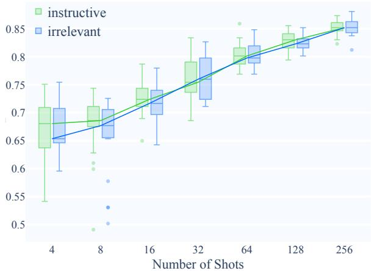

Figure 1: T0 (3B) on RTE. There is no practical difference between the performance of the models trained with instructive templates vs. those trained with irrelevant templates at any number of shots.  
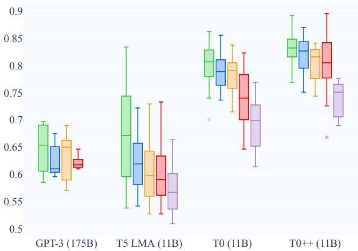  
instructive irrelevant mis-moderate mis-extreme null  
Figure 2: 16-shot accuracy of four large models on RTE. For GPT-3, there is no practical difference between any template categories except null (not plotted because they are below 0.5). For T5, there is no practical difference between instructive and irrelevant. For T0, there is no practical difference between instructive and irrelevant nor between instructive and misleadingmoderate. For T0++, there is no practical difference between instructive and irrelevant nor between instructive and misleading-extreme.

Misleading Templates There is no consistent relation between the performance of models trained with templates that are moderately misleading (e.g. {premise} Can that be paraphrased as "{hypothesis}"?) vs. templates that are extremely misleading (e.g., {premise} Is this a sports news? {hypothesis}). T0 (both 3B and 11B) perform better given misleading-moderate (Figure 3), ALBERT and T5 3B perform better given misleading-extreme (Appendices E and G.4), whereas T5 11B and GPT-3 perform comparably on both sets (Figure 2; also see Table 2 for a summary of statistical significances.) Despite a lack of pattern between the two misleading categories, however, it is consistent that each model exhibits significantly better performance on instructive templates compared to at least one category of misleading templates.

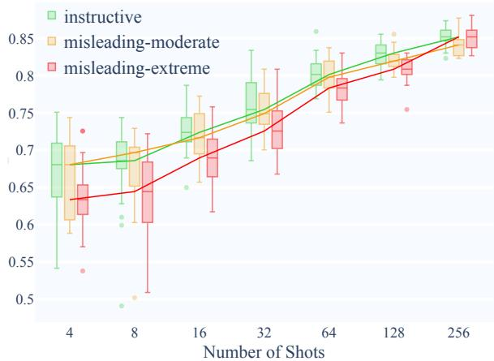  
Figure 3: T0 (3B) on RTE. There is no practical difference between models trained with instructive and misleading-moderate templates at any number of shots. But models trained with misleading-extreme templates are statistically significantly worse from 8 to 128 shots.

Null Templates Models trained with null templates perform far worse than all other categories of templates (see Appendix G for all null results). Here, we focus on ALBERT (an encoderonly masked language model), which allows more permutation of concatenation orders by placing mask in the middle of sentences. We see that, although null templates are much worse in aggregate, some subset of them (e.g., {premise} [mask] {hypothesis}) are still able to learn nearly as fast as the average instructive template after 32 shots (Figure 13).

Zero-Shot So far, we have focused on few-shot results. At zero shots, all models (including GPT-3 175B) perform only marginally above random, except the instruction-tuned T0. Thus, for our analysis of zero shot performance, we focus on T0. Figure 4 shows that there is no practical difference between the performance of T0 3B given instructive templates and either category of misleading templates. T0 11B performs better, although it also shows no practical difference between misleading-moderate and instructive templates. Lastly, T0++ (trained on more datasets than other T0 variants), is the only model in this paper that shows statistically significantly different performance across all categories of prompts. However, there remains the caveat that it still performs arguably too well in absolute terms with pathological prompts, which we discuss in the next section.

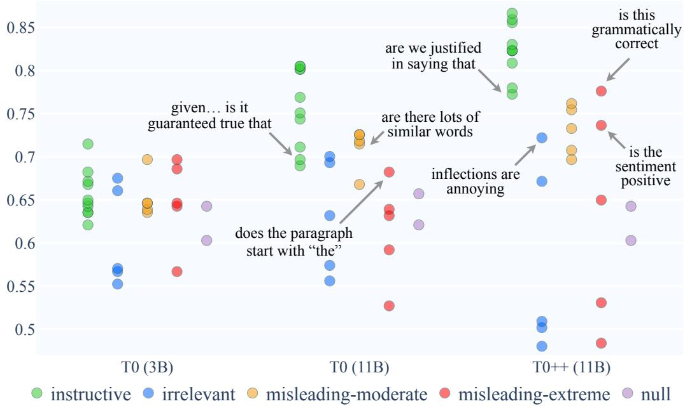

Figure 4: Zero-shot accuracy of instruction-tuned models on RTE. Each prompt’s performance is a single point (unlike the few-shot figures where each prompt is approximated by multiple points with multiple samplings of few-shot examples.) Arrows highlight some prompts with their excerpts. See Appendix I for the full results.
<table><tr><td></td><td>size</td><td>#shots</td><td>inst. &gt; mis-moderate</td><td>inst. &gt; mis-extreme</td><td>inst. &gt; irrelevant</td><td>inst. &gt; null</td></tr><tr><td>TO</td><td>3B</td><td>0</td><td></td><td></td><td></td><td>√</td></tr><tr><td>TO</td><td>11B</td><td>0</td><td></td><td>√</td><td>√</td><td>√</td></tr><tr><td>T0++</td><td>11B</td><td>0</td><td>√</td><td>√</td><td>√</td><td>√</td></tr><tr><td>ALBERT</td><td>235M</td><td>4 - 256</td><td>√</td><td></td><td></td><td>√</td></tr><tr><td>T5 LMA</td><td>770M</td><td>4 - 256</td><td></td><td></td><td></td><td></td></tr><tr><td>T5 LMA</td><td>3B</td><td>4 - 256</td><td>√</td><td></td><td></td><td>√</td></tr><tr><td>TO</td><td>3B</td><td>4 - 256</td><td></td><td>√</td><td></td><td>√</td></tr><tr><td>T5 LMA</td><td>11B</td><td>16</td><td>√</td><td>√</td><td></td><td>√</td></tr><tr><td>TO</td><td>11B</td><td>16</td><td></td><td>√</td><td></td><td>√</td></tr><tr><td>T0++</td><td>11B</td><td>16</td><td>√</td><td></td><td></td><td>√</td></tr><tr><td>GPT-3</td><td>175B</td><td>16</td><td></td><td></td><td></td><td>√</td></tr></table>

Table 2: Checkmarks indicate where two categories of templates lead to statistically significantly different performance, as measured by an independent two-sample t-test and a Wilcoxon rank-sum test; both tests always agree in this table. A lack of checkmark indicates where model performance fails to differentiate the two categories, i.e., models do not understand the differences between the prompt categories. We consider significant differences (checkmarks) between categories of prompts to be necessary—but not sufficient—for language understanding.

## 4.3 Discussion

Recall that a common assumption in the literature is that prompts require experts to clearly and correctly describe the task at hand (§1). In contrast, Table 2 summarizes that, with the exception of T0++ at zero shots, all models perform essentially as well with some pathological prompts as they do with proper prompts. Notably, despite being much larger than its competitors, GPT-3 shows the same patterns of behaviors, suggesting that mere scaling does not address this issue. Meanwhile, the evidence from instruction tuning is mixed. Although Sanh et al. (2021) are right that instruction tuning yields substantial improvement in performance as well as robustness as measured by variance, T0 is somewhat too robust and less sensitive to the semantics of the prompts in terms of distinguishing proper instructions from pathological ones, compared to T5 of the same size in the few-shot setting (Figure 2).

In the zero-shot setting, we do see that that the largest model instruction-tuned with the most datasets (T0++) improves a model’s sensitivity to prompt semantics. This is a positive result, but it comes with the caveat that there still exist numerous examples of pathological prompts that perform just as well as the proper ones do. To be charitable to randomness in neural models, we hold this study to a higher standard by comparing means and medians among categories with statistical tests. Nevertheless, for our research question, existence proofs alone are still alarming. For example, without any gradient update nor priming, it is striking that out-of-the-box T0++ scores a high accuracy of 78% with the extremely misleading {premise} Is that grammatically correct? {hypothesis}, the same accuracy as it achieves with a proper instruction {premise} Are we justified in saying "{hypothesis}"? If models were truly classifying whether the text is grammatical, it would have only scored 52.7% because RTE is written by experts and all examples are grammatical. Even templates that underperform the instructive ones seem to be too good. For example, it is difficult to imagine a human scoring 72% zero-shot with the prompt {premise} Inflections are annoying and thank god that Middle English got rid of most of them. {hypothesis} for a nuanced task like NLI.

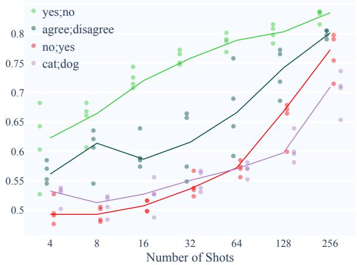  
Figure 5: The best-performing instructive template for ALBERT on RTE, {prem} Are we justified in saying that "{hypo}"? with select LM targets from each category.

## 5 Effect of Target Words

## 5.1 Method

In this experiment, we study the effect of different LM target words given a fixed template. We write 4 categories of targets, with at least 3 pairs of target words for each category (except the singleton yesno category):

1. Yes-no: Model is expected to predict the word “yes” for entailment and “no” for nonentailment.

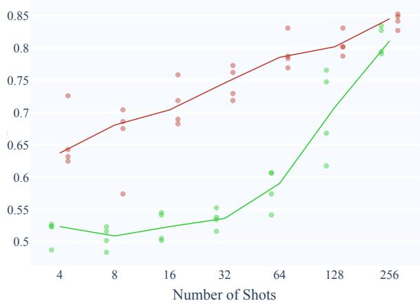

$$
\{ ^ { \ast \varsigma } \mathrm { y e s } ^ { \gamma } \}
$$

Figure 6: T0 (3B) on RTE. Misleading templates + yesno targets (red) learn substantially faster than instructive templates + arbitrary targets (green), which is the opposite of what we expect from humans.

2. Yes-no-like: Semantically equivalent to yesno but using superficially different words, e.g., “true”/“false”, “positive”/“negative”.

3. Arbitrary: Model is expected to predict arbitrary words that have no semantic relation to the entailment task, e.g., “cat” for entailment, “dog” for non-entailment.

4. Reversed: Model is expected to predict the opposite of the (intuitive) yes-no and yes-nolike labels, e.g., “no” for entailment, “yes” for non-entailment.

See Appendix F.3 for the full list. Within the arbitrary category, in addition to the common anglophone first names as Le Scao and Rush (2021) use, we also include word pairs with high semantic similarity, low similarity, and pairs which are highly frequent in the English language, but we find no consistent difference among these various subcategories of the arbitrary category.

## 5.2 Result

For both ALBERT and T0, we find that models trained with yes-no targets learn a good deal faster than those trained with yes-no-like targets and dramatically faster than those with arbitrary and reversed targets. For example, Figure 5 shows the top-performing instructive template trained with different target words. At 32 shots, the difference between the median accuracies of “yes”/“no” vs. “no”/“yes” is 22.2%, far larger than the effect size of varying categories of templates in Section 4. Aggregating over all combination of templates and targets, Figure 16 confirms that the choice of target words matter much more than the meaning of the templates.

## 5.3 Discussion

The fact that models consistently learn slower with arbitrary and reversed target words is a positive result: this type of performance differential is consistent with what we expect for models that are correctly sensitive to the semantics of the words. However, there are several important negative results in these experiments as well. First, the effect of the target words overrides the semantics of the overall prompt. Consider two kinds of templatetarget combinations:

1. An irrelevant or misleading template + yes-no targets, e.g., {premise} Does the paragraph start with "the"? [yes/no] {hypothesis}

2. An instructive template + arbitrary tar  
gets, e.g., {premise} Based on the   
previous passage, is it true   
that "{hypothesis}"? [cat/dog]

Figure 6 shows that combinations such as (1) often dramatically outperform (2). However, (2) simply requires figuring out a mapping: “Reply ‘cat’ if entailed and reply ‘dog’ if not entailed”. For humans, this can be learned in a few shots, e.g., Ferrigno et al. (2017) showed that adults can reach 60% accuracy in 18 trials4 for an arbitrary map of {more numerous star shape, less numerous diamond shape} without receiving any language instructions. In contrast, models under many arbitrary LM targets struggle to reach 60% median accuracy even by 64 shots with instructive templates (Figure 6 green; Figure 5 red, purple).

Further, even given intuitive yes-no-like targets such as “agree”/“disagree” and “good”/“bad”, models learn much slower compared to when given “yes”/“no”. As Figure 5 (green vs. dark green) and Figure 16 (first vs. second x-axis group) show, there exists a large performance gap between yes-no and yes-no-like targets which is not closed until 256 shots. Moreover, when we try to help the models by appending target hints such as “True or false?” to the templates, performance often drops instead, echoing Sanh et al. (2021) and Wei et al. (2021)’s findings that including answer choices in input sequence make models perform worse for certain tasks.

## 6 General Discussion

## 6.1 Summary and Interpretation

Our main research question is whether models understand prompts as meaningful task instructions analogous to how humans would. Again, suppose an experimenter provides a human annotator with an informative instruction of a reasonably easy task. If the annotator understands the instruction, we expect them to perform better than when the experimenter provides misleading instructions, irrelevant instructions, or no instructions at all. Section 4 shows that the performance of most models is insensitive to the difference between instructive and irrelevant templates, moderately sensitive between instructive and misleading templates, and highly sensitive between instructive and null templates. Comparing to the effect of the templates, however, Section 5 shows that models are much more sensitive to the semantics of the target words: they learn far slower with arbitrary or reversed target words as desired. However, they are overly sensitive to semantically equivalent yes-no-like words (i.e., performing much worse with “agree”/“disagree” than with “yes”/“no”), and the choice of target words override the semantics of the templates (e.g., performing much better given a irrelevant template with “yes”/“no” targets than with an instructive template with arbitrary targets such as “cat”/“dog”).

Our main argument throughout the paper shares the same logic as a recent line of studies (Sinha et al., 2021; O’Connor and Andreas, 2021; Pham et al., 2021; Gupta et al., 2021) which argue that the fact that LMs achieve good performance under ideal conditions is insufficient to establish language understanding because they also succeed under pathological conditions (e.g., sentences with shuffled word order) where humans fail catastrophically.5 In other words, the fact that models are so good at inferring the gold labels from pathological inputs casts major doubts on whether models make inferences in any way that resembles how humans make inferences. For our results, the fact that models are so good at learning from pathological instructions likewise casts major doubts on whether models understand prompts as instructions in any way that resembles how humans understand instructions.

## 6.2 Alternative Interpretations and Future Directions

As with any extrinsic evaluation, accuracy cannot directly measure understanding. For example, a human could perfectly understand an instruction but still, e.g., have the same accuracy with instructive vs. irrelevant templates because the task itself is too hard (a lack of competence) or because they for some reason ignore the instructions (a lack of compliance). We discuss these two possibilities below.

Lack of Competence This is primarily a concern for non-instruction-tuned models at zero shots, where all models perform only slightly above random, and thus a lack of statistical significance among template categories is ambiguous as to whether models lack understanding of NLI instructions vs. if models lack the competence in NLI per se. This is why our study largely focuses on the fewshot setting, where a lack of competence is less of a concern, as models do competently achieve good accuracies that are only moderately below the stateof-the-art non-few-shot models.

Another counterargument is that maybe no models ever actually reason about if a premise entails a hypothesis. Maybe they just always exploit spurious or heuristic features and, if only they were competent in properly reasoning about entailment relations, then the meaning of NLI instructions would matter. This argument is possible, although, first, it hinges on to what extent NLI (or any other behavioral evaluation) can measure language understanding, which is a complex debate beyond the scope of this paper. Second, in preliminary experiments (Appendix K), our models actually zero-shot transfer reasonably well to HANS (McCoy et al., 2019), a dataset designed to diagnoses models use of NLI heuristics. Thus, it is unlikely that models are entirely incompetent in reasoning about entailment relations and solely rely on heuristics. Regardless, further differentiating competence in understanding task instructions vs. competence in tasks per se is an important direction for future work.

Lack of Compliance Another interpretation is that irrelevant prompts perform the same as the instructive ones because models simply ignore the prompts altogether. However, a lack of compliance alone cannot explain our results. If models truly ignore the prompts, we should not see any systematic differences between any categories of prompts. Instead, we do see consistent patterns that instructive and irrelevant templates make models learn significantly faster than misleading and null templates do (Table 2).

A more nuanced counterargument is that although models do not ignore their prompts entirely, perhaps it “takes less effort” for models to use the spurious or heuristic features for predictions as opposed to the more complex syntactic or semantic features (Lovering et al., 2021; Warstadt et al., 2020) required to properly comply with the instructions. However, spurious features alone likewise cannot explain the observed performance gaps. Recall that, within each random seed, all models see exactly the same training examples (with the same spurious features). Thus, to the extent that models perform differently with some prompts compared to others, it may be due to some complex interactions between the (spurious or semantic) features in prompts and the spurious features in data examples. One possible example of this interaction is that punctuation has a large effect for irrelevant templates, but instructive templates seem to be able to suppress such effect (Appendix A). Investigating the nature of this interaction is a promising direction for future work, and it suggests a way in which the semantics of the prompt might matter, e.g., by affecting the models’ inductive biases, even if models do not interpret or use the instructions in the same way as humans would.

## 7 Conclusion

In this study, we train several models with over 30 manually written templates and 13 sets of LM targets for NLI. We find that models often learn equally fast with misleading and irrelevant templates as they do with instructive ones, and that the choice of the target words overrides the meaning of the overall prompts. Although models do not entirely ignore the meaning of the prompts, our results contradict a hypothesis commonly assumed in the literature that models use prompts as semantically meaningful task instructions in ways analogous to humans’ use of instructions.

## Ethical Considerations

The fact that even the largest LMs appear to follow yet do not actually follow users’ instructions has important implications, especially considering the increasing commercial use of LMs. While traditional fine-tuned models also pose challenges in interpretability, with prompt-based models, an illusion of instruction following can be more pernicious than having no instructions at all. The intuitive interface that prompts provide might make them more accessible to lay users, and can mislead users to think that their instructions are being understood and followed. Our results suggest that cautions are needed even more than they were with traditional fine-tuned models.

## Acknowledgments

We are grateful to Colin Raffel, Victor Sanh, Sasha Rush, Stephen Bach, Roman Feiman, Teven Le Scao, Ian Tenney, Dan Garrette, Jason Wei, Satoshi Sekine, Mike Tien-Chien Chiang, Xavier Fontaine, Pierre Colombo, Ryan Teehan, Debajyoti Datta, William Rudman, Ruochen Zhang, Daniel Cohen, George Zerveas, Eric Rosen, Kaiyu Zheng, Nihal Nayak, Roma Patel, Charles Lovering, Tian Yun, Jack Merullo, and Aaron Traylor for comments and discussions on early drafts of this paper. Special thanks to Victor, Colin, and Teven for technical clarifications and code review.

Furthermore, Albert is indebted to Colin and Sasha for their patience on the many iterations of the zero-shot Figure 4 as well as invaluable mentorship throughout the T0 project.

This work was supported in part by the IARPA BETTER program.

## References

Jonathan Bragg, Arman Cohan, Kyle Lo, and Iz Beltagy. 2021. FLEX: Unifying evaluation for few-shot NLP. ArXiv preprint, abs/2107.07170.

Tom B. Brown, Benjamin Mann, Nick Ryder, Melanie Subbiah, Jared Kaplan, Prafulla Dhariwal, Arvind Neelakantan, Pranav Shyam, Girish Sastry, Amanda Askell, Sandhini Agarwal, Ariel Herbert-Voss, Gretchen Krueger, Tom Henighan, Rewon Child, Aditya Ramesh, Daniel M. Ziegler, Jeffrey Wu, Clemens Winter, Christopher Hesse, Mark Chen, Eric Sigler, Mateusz Litwin, Scott Gray, Benjamin Chess, Jack Clark, Christopher Berner, Sam Mc-Candlish, Alec Radford, Ilya Sutskever, and Dario Amodei. 2020. Language models are few-shot learners. In Advances in Neural Information Processing

Systems 33: Annual Conference on Neural Information Processing Systems 2020, NeurIPS 2020, December 6-12, 2020, virtual.

Ido Dagan, Oren Glickman, and Bernardo Magnini. 2006. The pascal recognising textual entailment challenge. In Machine Learning Challenges Workshop, pages 177–190. Springer.

Jacob Devlin, Ming-Wei Chang, Kenton Lee, and Kristina Toutanova. 2019. BERT: Pre-training of deep bidirectional transformers for language understanding. In Proceedings of the 2019 Conference of the North American Chapter of the Association for Computational Linguistics: Human Language Technologies, Volume 1 (Long and Short Papers), pages 4171–4186, Minneapolis, Minnesota. Association for Computational Linguistics.

Stephen Ferrigno, Julian Jara-Ettinger, Steven T Piantadosi, and Jessica F Cantlon. 2017. Universal and uniquely human factors in spontaneous number perception. Nature communications, 8(1):1–10.

Leo Gao, Jonathan Tow, Stella Biderman, Sid Black, Anthony DiPofi, Charles Foster, Laurence Golding, Jeffrey Hsu, Kyle McDonell, Niklas Muennighoff, Jason Phang, Laria Reynolds, Eric Tang, Anish Thite, Ben Wang, Kevin Wang, and Andy Zou. 2021a. A framework for few-shot language model evaluation.

Tianyu Gao, Adam Fisch, and Danqi Chen. 2021b. Making pre-trained language models better few-shot learners. In Proceedings of the 59th Annual Meeting ofthe Associationfor Computational Linguistics and the 11th International Joint Conference on Natural Language Processing (Volume 1: Long Papers), pages 3816–3830, Online. Association for Computational Linguistics.

Marvin J Greenberg. 1974. Euclidean and non-Euclidean Geometries: Development and history. W. H. Freeman and Company.

Ashim Gupta, Giorgi Kvernadze, and Vivek Srikumar. 2021. Bert & family eat word salad: Experiments with text understanding.

Junxian He, Chunting Zhou, Xuezhe Ma, Taylor Berg-Kirkpatrick, and Graham Neubig. 2021. Towards a unified view of parameter-efficient transfer learning. CoRR, abs/2110.04366.

Daniel Khashabi, Shane Lyu, Sewon Min, Lianhui Qin, Kyle Richardson, Sameer Singh, Sean Welleck, Hannaneh Hajishirzi, Tushar Khot, Ashish Sabharwal, et al. 2021. Prompt waywardness: The curious case of discretized interpretation of continuous prompts. arXiv preprint arXiv:2112.08348.

Artur Kulmizev and Joakim Nivre. 2021. Schr " odinger’s tree–on syntax and neural language models. arXiv preprint arXiv:2110.08887.

Andrew K Lampinen, Ishita Dasgupta, Stephanie CY Chan, Kory Matthewson, Michael Henry Tessler, Antonia Creswell, James L McClelland, Jane X Wang, and Felix Hill. 2022. Can language models learn from explanations in context? arXiv preprint arXiv:2204.02329.

Zhenzhong Lan, Mingda Chen, Sebastian Goodman, Kevin Gimpel, Piyush Sharma, and Radu Soricut. 2020. ALBERT: A lite BERT for self-supervised learning of language representations. In 8th International Conference on Learning Representations, ICLR 2020, Addis Ababa, Ethiopia, April 26-30, 2020. OpenReview.net.

Teven Le Scao and Alexander Rush. 2021. How many data points is a prompt worth? In Proceedings of the 2021 Conference of the North American Chapter of the Association for Computational Linguistics: Human Language Technologies, pages 2627–2636, Online. Association for Computational Linguistics.

Brian Lester, Rami Al-Rfou, and Noah Constant. 2021. The power of scale for parameter-efficient prompt tuning. In EMNLP.

Hector Levesque, Ernest Davis, and Leora Morgenstern. 2012. The winograd schema challenge. In Thirteenth international conference on the principles of knowledge representation and reasoning.

Xiang Lisa Li and Percy Liang. 2021. Prefix-tuning: Optimizing continuous prompts for generation. In Proceedings of the 59th Annual Meeting of the Association for Computational Linguistics and the 11th International Joint Conference on Natural Language Processing (Volume 1: Long Papers), pages 4582–4597, Online. Association for Computational Linguistics.

Yinhan Liu, Myle Ott, Naman Goyal, Jingfei Du, Mandar Joshi, Danqi Chen, Omer Levy, Mike Lewis, Luke Zettlemoyer, and Veselin Stoyanov. 2019. Roberta: A robustly optimized bert pretraining approach. ArXiv preprint, abs/1907.11692.

Robert L Logan IV, Ivana Balaževic, Eric Wallace,´ Fabio Petroni, Sameer Singh, and Sebastian Riedel. 2021. Cutting down on prompts and parameters: Simple few-shot learning with language models. ArXiv preprint, abs/2106.13353.

Charles Lovering, Rohan Jha, Tal Linzen, and Ellie Pavlick. 2021. Predicting inductive biases of pretrained models. In International Conference on Learning Representations.

Tom McCoy, Ellie Pavlick, and Tal Linzen. 2019. Right for the wrong reasons: Diagnosing syntactic heuristics in natural language inference. In Proceedings of the 57th Annual Meeting of the Association for Computational Linguistics, pages 3428– 3448, Florence, Italy. Association for Computational Linguistics.

Sewon Min, Mike Lewis, Luke Zettlemoyer, and Hannaneh Hajishirzi. 2021. Metaicl: Learning to learn in context. CoRR, abs/2110.15943.

Sewon Min, Xinxi Lyu, Ari Holtzman, Mikel Artetxe, Mike Lewis, Hannaneh Hajishirzi, and Luke Zettlemoyer. 2022. Rethinking the role of demonstrations: What makes in-context learning work? arXiv preprint arXiv:2202.12837.

Swaroop Mishra, Daniel Khashabi, Chitta Baral, and Hannaneh Hajishirzi. 2021. Natural instructions: Benchmarking generalization to new tasks from natural language instructions. ArXiv preprint, abs/2104.08773.

Yixin Nie, Adina Williams, Emily Dinan, Mohit Bansal, Jason Weston, and Douwe Kiela. 2020. Adversarial NLI: A new benchmark for natural language understanding. In Proceedings ofthe 58th Annual Meeting of the Association for Computational Linguistics, pages 4885–4901, Online. Association for Computational Linguistics.

Joe O’Connor and Jacob Andreas. 2021. What context features can transformer language models use? arXiv preprint arXiv:2106.08367.

Isabel Papadimitriou, Richard Futrell, and Kyle Mahowald. 2022. When classifying grammatical role, bert doesn’t care about word order... except when it matters. arXiv preprint arXiv:2203.06204.

Thang Pham, Trung Bui, Long Mai, and Anh Nguyen. 2021. Out of order: How important is the sequential order of words in a sentence in natural language understanding tasks? In Findings of the Association for Computational Linguistics: ACL-IJCNLP 2021, pages 1145–1160, Online. Association for Computational Linguistics.

Plato. c. 399 BC. Euthyphro. Penguin Books.

Archiki Prasad, Peter Hase, Xiang Zhou, and Mohit Bansal. 2022. Grips: Gradient-free, edit-based instruction search for prompting large language models. arXiv preprint arXiv:2203.07281.

Guanghui Qin and Jason Eisner. 2021. Learning how to ask: Querying LMs with mixtures of soft prompts. In Proceedings of the 2021 Conference of the North American Chapter of the Association for Computational Linguistics: Human Language Technologies, pages 5203–5212, Online. Association for Computational Linguistics.

Colin Raffel, Noam Shazeer, Adam Roberts, Katherine Lee, Sharan Narang, Michael Matena, Yanqi Zhou, Wei Li, and Peter J. Liu. 2020. Exploring the limits of transfer learning with a unified text-to-text transformer. Journal of Machine Learning Research, 21(140):1–67.

Vinit Ravishankar, Mostafa Abdou, Artur Kulmizev, and Anders Søgaard. 2022. Word order does matter (and shuffled language models know it). arXiv preprint arXiv:2203.10995.

Victor Sanh, Lysandre Debut, Julien Chaumond, and Thomas Wolf. 2019. Distilbert, a distilled version of bert: smaller, faster, cheaper and lighter. ArXiv preprint, abs/1910.01108.

Victor Sanh, Albert Webson, Colin Raffel, Stephen H. Bach, Lintang Sutawika, Zaid Alyafeai, Antoine Chaffin, Arnaud Stiegler, Teven Le Scao, Arun Raja, Manan Dey, M Saiful Bari, Canwen Xu, Urmish Thakker, Shanya Sharma Sharma, Eliza Szczechla, Taewoon Kim, Gunjan Chhablani, Nihal Nayak, Debajyoti Datta, Jonathan Chang, Mike Tian-Jian Jiang, Han Wang, Matteo Manica, Sheng Shen, Zheng Xin Yong, Harshit Pandey, Rachel Bawden, Thomas Wang, Trishala Neeraj, Jos Rozen, Abheesht Sharma, Andrea Santilli, Thibault Fevry, Jason Alan Fries, Ryan Teehan, Stella Biderman, Leo Gao, Tali Bers, Thomas Wolf, and Alexander M. Rush. 2021. Multitask prompted training enables zero-shot task generalization.

Timo Schick and Hinrich Schütze. 2021a. Exploiting cloze-questions for few-shot text classification and natural language inference. In Proceedings of the 16th Conference of the European Chapter of the Association for Computational Linguistics: Main Volume, pages 255–269, Online. Association for Computational Linguistics.

Timo Schick and Hinrich Schütze. 2021b. It’s not just size that matters: Small language models are also few-shot learners. In Proceedings of the 2021 Conference of the North American Chapter of the Association for Computational Linguistics: Human Language Technologies, pages 2339–2352, Online. Association for Computational Linguistics.

Noam Shazeer and Mitchell Stern. 2018. Adafactor: Adaptive learning rates with sublinear memory cost. In International Conference on Machine Learning, pages 4596–4604. PMLR.

Taylor Shin, Yasaman Razeghi, Robert L. Logan IV, Eric Wallace, and Sameer Singh. 2020. AutoPrompt: Eliciting Knowledge from Language Models with Automatically Generated Prompts. In Proceedings of the 2020 Conference on Empirical Methods in Natural Language Processing (EMNLP), pages 4222–4235, Online. Association for Computational Linguistics.

Koustuv Sinha, Prasanna Parthasarathi, Joelle Pineau, and Adina Williams. 2021. UnNatural Language Inference. In Proceedings of the 59th Annual Meeting of the Association for Computational Linguistics and the 11th International Joint Conference on Natural Language Processing (Volume 1: Long Papers), pages 7329–7346, Online. Association for Computational Linguistics.

Derek Tam, Rakesh R Menon, Mohit Bansal, Shashank Srivastava, and Colin Raffel. 2021. Improving and simplifying pattern exploiting training. ArXiv preprint, abs/2103.11955.

Shizuo Tsuji and Mary Sutherland. 1980. Japanese Cooking: A Simple Art. Kodansha International.

Prasetya Utama, Nafise Sadat Moosavi, Victor Sanh, and Iryna Gurevych. 2021. Avoiding inference heuristics in few-shot prompt-based finetuning. In Proceedings of the 2021 Conference on Empirical Methods in Natural Language Processing, pages 9063–9074, Online and Punta Cana, Dominican Republic. Association for Computational Linguistics.

Alex Wang, Yada Pruksachatkun, Nikita Nangia, Amanpreet Singh, Julian Michael, Felix Hill, Omer Levy, and Samuel R. Bowman. 2019. Superglue: A stickier benchmark for general-purpose language understanding systems. In Advances in Neural Information Processing Systems 32: Annual Conference on Neural Information Processing Systems 2019, NeurIPS 2019, December 8-14, 2019, Vancouver, BC, Canada, pages 3261–3275.

Alex Warstadt, Yian Zhang, Xiaocheng Li, Haokun Liu, and Samuel R. Bowman. 2020. Learning which features matter: RoBERTa acquires a preference for linguistic generalizations (eventually). In Proceedings of the 2020 Conference on Empirical Methods in Natural Language Processing (EMNLP), pages 217– 235, Online. Association for Computational Linguistics.

Jason Wei, Maarten Bosma, Vincent Y Zhao, Kelvin Guu, Adams Wei Yu, Brian Lester, Nan Du, Andrew M Dai, and Quoc V Le. 2021. Finetuned language models are zero-shot learners. ArXiv preprint, abs/2109.01652.

Adina Williams, Nikita Nangia, and Samuel Bowman. 2018. A broad-coverage challenge corpus for sentence understanding through inference. In Proceedings of the 2018 Conference of the North American Chapter of the Association for Computational Linguistics: Human Language Technologies, Volume 1 (Long Papers), pages 1112–1122, New Orleans, Louisiana. Association for Computational Linguistics.

Thomas Wolf, Lysandre Debut, Victor Sanh, Julien Chaumond, Clement Delangue, Anthony Moi, Pierric Cistac, Tim Rault, Remi Louf, Morgan Funtowicz, Joe Davison, Sam Shleifer, Patrick von Platen, Clara Ma, Yacine Jernite, Julien Plu, Canwen Xu, Teven Le Scao, Sylvain Gugger, Mariama Drame, Quentin Lhoest, and Alexander Rush. 2020. Transformers: State-of-the-art natural language processing. In Proceedings of the 2020 Conference on Empirical Methods in Natural Language Processing: System Demonstrations, pages 38–45, Online. Association for Computational Linguistics.

Contents   
Introduction 1   
2 Related Work 2   
2.1 Prompt-Based Models 2   
2.2 Analyses of Prompts 2   
3 Overall Setup 3   
4 Effect of Templates 4   
4.1 Method 4   
4.2 Result 4   
4.3 Discussion 6   
5 Effect of Target Words 7   
5.1 Method 7   
5.2 Result 7   
5.3 Discussion 8   
General Discussion 8   
6.1 Summary and Interpretation 8   
6.2 Alternative Interpretations and Fu  
ture Directions 9   
7 Conclusion 9   
A Effect of Punctuation 14   
B Details and Lessons from Experiment   
ing with GPT-3’s API 15   
B.1 Choice of Model 15   
B.2 Priming vs. Fine-Tuning 15   
B.3 Other Tips for Working with GPT-3 16   
C Hyperparameters 16   
D Compute Used 16   
E Additional Figures Discussed in the   
Main Text 17   
F All Prompts 19   
F.1 Main Experiment Templates 19   
F.2 Ablation Experiment Templates 20   
F.3 All Target Words 20   
G Aggregated Results 21   
G.1 ALBERT on RTE 21   
G.2 ALBERT on ANLI R1 22   
G.3 T5 770M on RTE 23   
G.4 T5 3B on RTE 24   
G.5 T0 3B on RTE . 25   
G.6 T0 3B on ANLI R1 26   
G.7 T5 11B, T0 11B, and GPT-3 175B   
(Figure 2) . 27   
H Results of Individual Templates 28   
H.1 ALBERT 28   
H.2 T0 (3B) 32   
H.3 T5 LM-Adapted (3B) 36   
I Zero-Shot Results (Figure 4) 40   
Comparison of LM targets, Controlling   
for the Template 41   
K Preliminary Results on HANS 44   
L Preliminary Results on Winograd 45

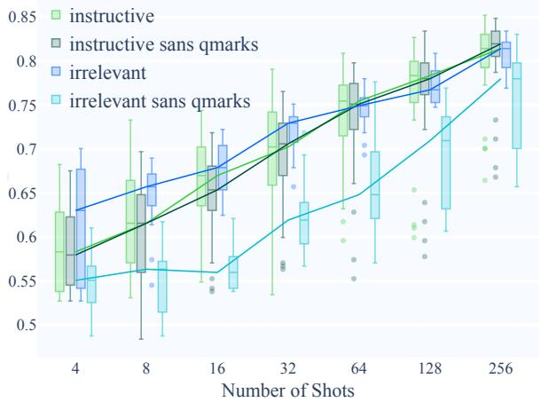  
Figure 7: ALBERT on RTE. Note that (1) irrelevant templates slightly outperform the instructive templates, albeit without statistical significance. (2) Irrelevant templates are far worse without quotation and question marks. (3) But there is no significant difference between instructive templates with or without qmarks.

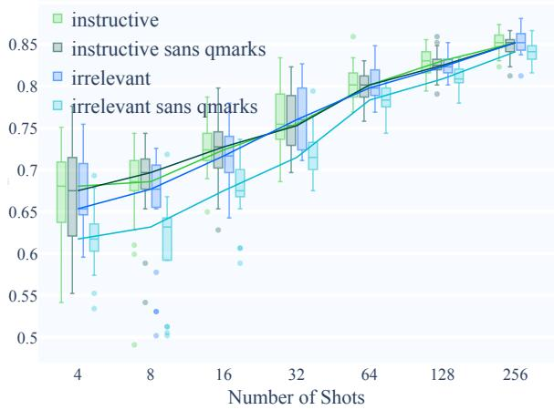  
Figure 8: T0 (3B) on RTE. Like ALBERT, irrelevant sans qmarks are significantly worse than irrelevant at each and every shot, but there is no significant difference between instructive with or without qmarks.

## A Effect of Punctuation

For irrelevant templates, we find a large effect from the use of quotation and question marks in templates. It is natural to write such punctuation in instructive templates as they help humans to parse an NLI hypothesis as an embedded clause within an instruction sentence (e.g., Given {premise} Should we assume that "{hypothesis}" is true?). For control, we also use quotation and question marks (“qmarks” hereafter) in irrelevant templates where they would not have made sense naturally, e.g., {premise} Single-family zoning is bad for American cities.

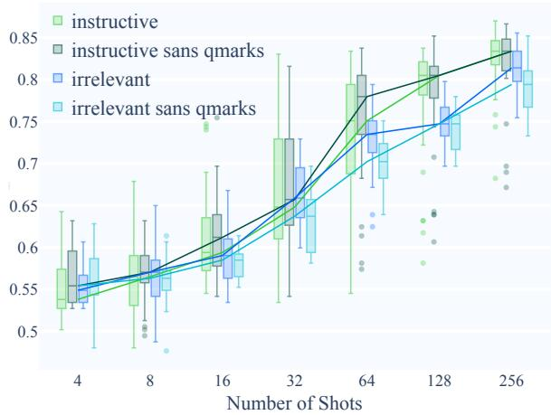  
Figure 9: T5 LM-Adapted (3B). Unlike the other models, there is no statistical significance between irrelevant with or without qmarks. However, instructive sans qmarks statistically significantly outperform instructive at 32 and 64 shots.

"{hypothesis}"? As an ablation, when we remove these qmarks from irrelevant templates, the performance of ALBERT and T0 drops substantially (Figures 7 and 8). In contrast, for T5, qmarks make no difference for irrelevant templates; yet, removing qmarks from instructive templates—where qmarks are natural—boosted performance instead for T5 (Figure 9), but not for T0 nor ALBERT.

Additionally, as a coincidence, most misleading templates contain both quotation and question marks, while most misleading-far templates contain only question marks (Appendix F). But as noted in Section 4.2, there is no consistent pattern between those two misleading categories. In other words, punctuations alone cannot explain everything. As discussed in Section 6.2, the full explanation is likely a combined interactions between the spurious features and the semantics of the templates.

Lastly, note that Schick and Schütze (2021b) and many subsequent papers’ prompts for NLI (e.g., "{hypothesis}" ? | [mask]. "{premise}") are basically null templates with some variation in punctuation between the hypothesis and the premise. We find that models learn poorly with the vanilla {hypothesis} [mask] {premise}, but they learn as fast as the instructive templates with Schick & Schütze’s punctuated version. That being said, note again that punctuation alone cannot explain the performance gap, since models trained with [mask] {hypothesis} {premise} (Figure 13, pink) perform second to best, yet swapping their premises and hypotheses (Figure 13, purple) makes it the worst performing among all null templates.

## B Details and Lessons from Experimenting with GPT-3’s API

## B.1 Choice of Model

We use the davinci model provided by OpenAI LP’s API, which corresponds to6 the 175 billion parameter model reported in Brown et al. (2020). Concurrent to our work, OpenAI released a new product called the “Instruct Series”, but we decided to not experiment with the Instruct Series because no academic paper or technical documentation of any kind is available with the Instruct Series at the time of writing aside from the following claim on their website:7

The Instruct models share our base GPT-3 models’ ability to understand and generate natural language, but they’re better at understanding and following your instructions. You simply tell the model what you want it to do, and it will do its best to fulfill your instructions. This is an important step forward in our goal of building safe models that are aligned with human interests.

Crucially, the Instruct Series is inappropriate for reproducible research because it is unknown what datasets and prompts these models are trained on, and whether any task categories are systematically held out as done by Sanh et al. (2021) and Wei et al. (2021). If it is trained on any prompt or dataset of NLI, it would not be zero-shot, making it an unfair comparison to other models in our experiments. Second, it is still in beta and its training, held-out, and prompt mixtures could change. At least two Instruct Series models were made available in sequence during our writing, and it is not clear if we experiment on an older version, whether it will still be available and reproducible in the future.

## B.2 Priming vs. Fine-Tuning

As mentioned in Section 3, we use priming (a.k.a. in-context learning) in lieu of fine-tuning because, at the time of writing, OpenAI’s fine-tuning API is limited to 10 runs per month. To train 30 prompts at only two number of shots would take 6 months, assuming we get hyperparameters right at first try. Further, each training run is limited to a maximum of 5 epochs, which often entails an insufficient number steps for few-shot training. We were unable to fine-tune GPT to any reasonable accuracy with our allowed 10 tries in the first month. Finally, the fine-tuning API is limited to GPT variants up to 6.7B, not the 175B model we plan to experiment with.

With priming, we are able to reproduce Brown et al. (2020)’s zero-shot performance on RTE but only with their exact prompt reported in their Figure G.31, all other (even instructive) prompts perform at random at zero shots, suggesting that their reported prompt is highly cherry-picked. We are unable to reproduce their reported few-shot result because they report it at 32 shots, but their API only permits a context length up to 2049 tokens, which is insufficient for RTE. We find that 16 shots are the highest one can reach within the token limit.8

Like the gradient updated models, we document the exact examples we use for few-shot priming in our GitHub repository. Unlike the gradient updated models, which are trained on the same k examples, priming models use different sets of k priming examples for each inference example (Brown et al., 2020, p. 20). This means that GPT’s performance reflects the fact that, overall, it has seen far more than k examples, making it not directly comparable to the few shots of the gradient updated models. This is not ideal, but our GPT few-shot performance already underperforms what Brown et al. (2020) report, so we choose to not further restrict it to have the same fixed priming examples for all inference examples, which could run into a lack of competence issue (§6.2) that make its results unusable for our research question.

Lastly, unlike the gradient updated models, we do not run multiple seeds with our GPT experiments because, first, they are expensive. As the API bills by token, using k shots of priming example effectively multiplies the total cost by k. Second, OpenAI imposes a monthly quota for each lab, so running multiple seeds will take several more months to complete.

## B.3 Other Tips for Working with GPT-3

Using the logprobs argument in their API, we obtain the top 99 predicted target word and their log probabilities.9 Following Sanh et al. (2021) and Wei et al. (2021), we evaluate by a rank classification of the target words, i.e., if the gold target word is “yes”, we consider it as correct as long as the probability of “yes” is higher than that of “no”, regardless of whether “yes” is the top-1 prediction generated by the model.

Alarmingly, we find that these top-99 predictions are semantically inconsistent ranked, e.g., for one data example and its top-99 word predictions, it is often the case that, e.g., P(yes) > P(no) but P(Yes) < P(No). Thus, the choice of the target words’ surface form makes a substantial difference in the overall performance. (Not to mention the problem of choosing between yes/no, true/false, correct/incorrect, etc. as studied in Section 5.) OpenAI recommends having no trailing space in the input and let the model predict the first token with a leading space as in “ Yes”. We find that although stripping the leading space sometimes leads to higher performance for some prompts, overall not applying stripping or other token normalization performs the best.

Another point researchers should pay attention to is the use of what OpenAI calls a “separator” inserted between priming examples. In preliminary experiments, we initially use newline characters as appeared in Brown et al. (2020)’s Appendix G. We later discover that OpenAI recommends using ### or \n###\n as separators. We use the latter and find consistent performance improvement over just using newline characters, and we use it throughout in our main experiments.

## C Hyperparameters

For encoder-only models, we follow Schick and Schütze (2021b) and Le Scao and Rush (2021)’s recommendations and use a learning rate of $1 e ^ { - 5 }$ For T5 and T0 models, we follow Raffel et al. (2020) and Sanh et al. (2021)’s recommendations and use a learning rate of 1e−4. We run several preliminary experiments with learning rates (3e−4, 1e−4, 5e−5, 1e−5) deviating from their recommendations and they perform worse, although our search is not exhaustive due to the high cost of running multiple prompts with multiple random seeds.

Note that T5 and T0 are trained with the Adafactor optimizer (Shazeer and Stern, 2018) in Mesh TensorFlow. Our implementation is in PyTorch, and we find that fine-tuning T5 with PyTorch’s implementation of Adafactor yields substantially worse results than the usual choice of the AdamW optimizer. We corresponded with Raffel et al. (2020), who advised us that it might be due to the fact that PyTorch does not have the same learning rate scheduler implementation as TensorFlow’s Adafactor does. They recommended us to simply use AdamW, which is what we did. This is somewhat unfortunate because Adafactor is much more memory efficient, which would have drastically reduced the compute resources required and thus enable more comprehensive experiments of the 11B models, which are currently limited to 0 shots and 16 shots only.

Although most models seem to obtain the highest validation accuracy at very early epochs, we train all models to 30 epochs (20 epochs for 11B models) to be safe and select the checkpoint with the highest validation accuracy.

All models use a batch size of 4 with 4 gradient accumulation steps for an effective batch size of 16.

Note that because we use a rank classification of single-token target words, decoding sampling methods (e.g., beam search, top-k, top-p) are unnecessary.

We follow Raffel et al. (2020) and add EOS tokens for input sequences, which yields higher fewshot performance compared to not adding EOS as done by Sanh et al. (2021). However, we omit EOS in the zero-shot setting, which exactly reproduces the results reported by Sanh et al. (2021). See T0’s GitHub repository readme10 for more information.

## D Compute Used

Each ALBERT 235M model is trained on a single Nvidia RTX3090. Their main experiments took approximately 192 GPU hours.

Each T5 LMA 770M model is trained on a single A6000. Their main experiments took approximately 48 GPU hours.

The 3B models are each trained by partitioning their layers over four RTX3090s. T5 and T0’s main experiments took approximately 2,304 GPU hours in total.

The 11B models are each trained on eight V100s (each with 32GB of memory). T5, T0, and T0++’s main experiments took approximately 1,728 GPU hours in total. (Due to their large GPU memory requirement, we were only able to complete one number of shots.)

## E Additional Figures Discussed in the Main Text

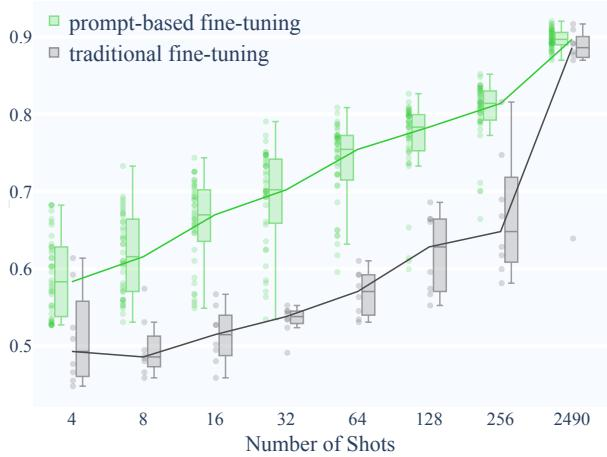  
Figure 10: How to read these figures: Each dot is the performance of one prompt under one random seed (which controls the sets of few-shot examples) of our baseline model (ALBERT) on RTE validation set. Boxes span from the first quartile to the third quartile, while lines inside boxes mark the medians. Later figures omit the points except outliers in order to improve legibility. See the interactive figures in our GitHub repository or Appendix H for the results of individual prompts.

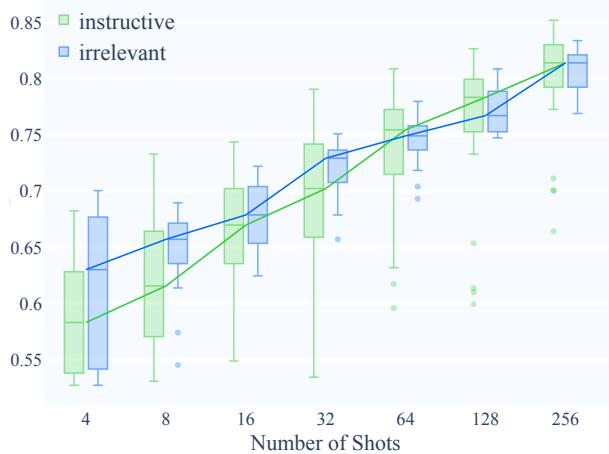  
Figure 11: ALBERT on RTE. Models trained with irrelevant templates actually slightly outperform the instructive templates, albeit without statistical significance at any number of shots.

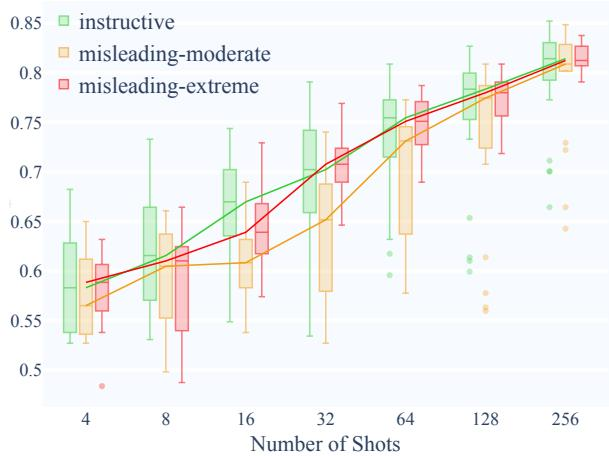

Figure 12: ALBERT on RTE. There is no statistical significance between misleading-extreme and instructive at any number of shots. In contrast, models trained with misleading-moderate templates are significantly worse than the instructive ones from 16 to 64 shots.  
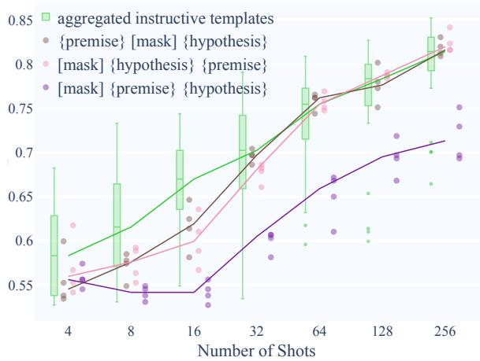  
Figure 13: ALBERT on RTE. After 32 shots, models trained with 2 null templates learn just as fast as the instructive templates, but models trained with other null templates (e.g., purple) are much worse.

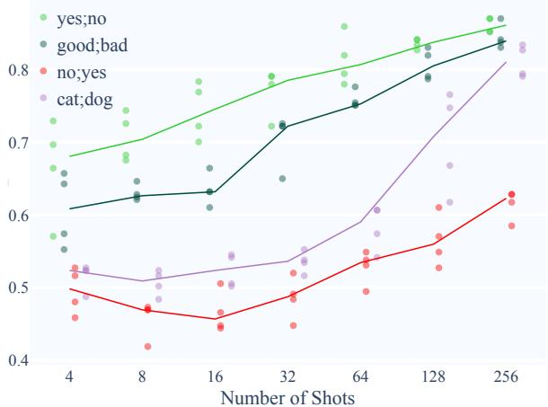  
Figure 14: The best-performing instructive template for T0 (3B) on RTE, {prem} Based on the previous passage, is it true that "{hypo}"? with select LM targets from each category.

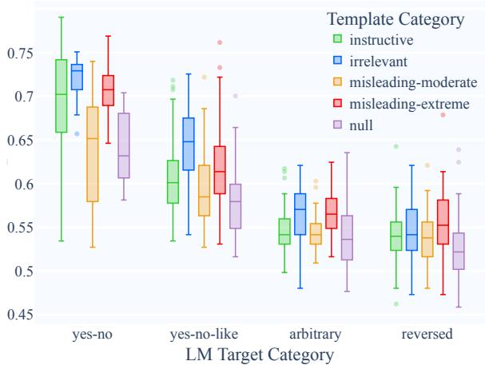  
Figure 15: Median accuracies of all template-target combinations at 32 shots. In general, the choice of target words (x-axis groups) matters much more than the choice of templates (colors).

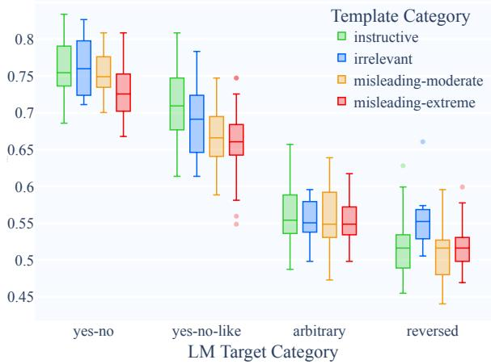  
Figure 16: T0 (3B)’s 32-shot accuracy with of all template-target combinations on RTE. In general, the choice of target words (x-axis groups) matters much more than the choice of templates (colors).

## F All Prompts

F.1 Main Experiment Templates
<table><tr><td>category</td><td>template</td><td>adapted from</td></tr><tr><td>instructive</td><td>{premise} Using only the above description and what you know about the world, &quot;{hypothesis}&quot; is definitely correct. Yes or no?</td><td>Williams et al. (2018, p. 3)</td></tr><tr><td>instructive</td><td>{premise} \nquestion: {hypothesis } Yes or no?\nanswer:</td><td>Brown et al. (2020, p. 59)</td></tr><tr><td>instructive</td><td>{premise} Are we justified in saying that &quot;{hypothesis }&quot;?</td><td></td></tr><tr><td>instructive</td><td>Given {premise} Should we assume that &quot;{hypothesis}&quot; is true?</td><td></td></tr><tr><td>instructive</td><td>{premise} Based on the previous passage, is it true that &quot;{hypothesis } &quot;?</td><td></td></tr><tr><td>instructive</td><td>Given {premise } Is it guaranteed true that &quot;{hypothesis } &quot;?</td><td></td></tr><tr><td>instructive</td><td>Suppose {premise} Can we infer that &quot;{hypothesis} &quot;?</td><td></td></tr><tr><td>instructive</td><td>Given that {premise} Does it follow that &quot;{hypothesis } &quot;?</td><td></td></tr><tr><td>instructive</td><td>{premise} Question: Does this imply that &quot;{hypothesis}&quot;?</td><td></td></tr><tr><td>instructive</td><td>Given that {premise} Therefore, it must be true that &quot;{hypothesis } &quot;?</td><td></td></tr><tr><td></td><td>misleading-moderate {premise} Do most of the above words appear in the following passage? {hypothesis}</td><td></td></tr><tr><td>misleading-moderate</td><td>{premise} Are there lots of similar words in &quot;{hypothesis} &quot;?</td><td></td></tr><tr><td>misleading-moderate</td><td>{premise} Does that have the same meaning as &quot;{hypothesis } &quot;?</td><td></td></tr><tr><td>misleading-moderate</td><td>{premise} Can that be paraphrased as: &quot;{hypothesis}&quot;?</td><td></td></tr><tr><td>misleading-moderate</td><td>{premise} Can that be summarized as &quot;{hypothesis}&quot;?</td><td></td></tr><tr><td>misleading-extreme</td><td>{premise} Does the paragraph start with &quot;the&quot;? {hypothesis}</td><td></td></tr><tr><td>misleading-extreme</td><td>{premise} Is this grammatically correct? {hypothesis}</td><td></td></tr><tr><td>misleading-extreme</td><td>{premise} Is the sentiment positive? {hypothesis}</td><td></td></tr><tr><td>misleading-extreme</td><td>{premise} Is this a sports news? {hypothesis}</td><td></td></tr><tr><td>misleading-extreme</td><td>{premise} Is this French? {hypothesis}</td><td></td></tr><tr><td>irrelevant</td><td>{premise} Single-family zoning is bad for American cities. &quot;{hypothesis} &quot;?</td><td></td></tr><tr><td>irrelevant</td><td>{premise} Inflections are annoying and thank god that Middle English got rid of most of them. &quot;{hypothesis}&quot;?</td><td></td></tr><tr><td>irrelevant</td><td>{premise} When Bolyai sent Gauss his discovery of non-Euclidean geometry, Gauss replied that he arrived at the same results 30 years ago. &quot;{hypothesis} &quot;?</td><td>Greenberg (1974, p. 141)</td></tr><tr><td>irrelevant</td><td>{premise} If bonito flakes boil more than a few seconds, the stock becomes too strong? &quot;{hypothesis}&quot;?</td><td>Tsuji and Sutherland (1980, p. 148)</td></tr><tr><td>irrelevant</td><td>{premise} Is the pious loved by the gods because it is pious? Or is it pious because it is loved by the gods? &quot;{hypothesis }&quot;?</td><td>Plato (c. 399 BC, 10a)</td></tr><tr><td></td><td></td><td></td></tr><tr><td>null null</td><td>{premise} {hypothesis} {hypothesis}{premise}</td><td></td></tr><tr><td>null (MLM only)</td><td></td><td></td></tr><tr><td></td><td>{premise} {mask} {hypothesis}</td><td></td></tr><tr><td>null (MLM only)</td><td>{hypothesis} {mask} {premise}</td><td></td></tr><tr><td>null (MLM only)</td><td>{mask} {premise} {hypothesis}</td><td></td></tr></table>

Table 3: All prompts used in the main text of the paper. All templates use “yes”/“no” as target words for the entailment and non-entailment classes, respectively. For ternary NLI datasets, we use “unclear” for the neutral class, which performs best after preliminary experiments with other ternary words: “maybe”, “sometimes”, “perhaps”, “possibly”, and “neither”. Keen readers may notice that some of the instructive templates (e.g., should we assume) do not instruct a strict entailment task. We intentionally wrote a mixture of instructions that asks for strictly logical entailment and pragmatic inference, intending to measure if models can distinguish between the two on datasets such as HANS (McCoy et al., 2019) that magnify different predictions caused by pragmatic effects. Of course, this research question became moot as we found that models cannot even distinguish among much more pathological prompts.

F.2 Ablation Experiment Templates
<table><tr><td>category</td><td>template</td></tr><tr><td></td><td>instructive sans qmarks {premise} Using only the above description and what you know about the world, {hypothesis }is definitely correct. Yes or no</td></tr><tr><td></td><td>instructive sans qmarks {premise} \nquestion: {hypothesis} Yes or no\nanswer:</td></tr><tr><td></td><td>instructive sans qmarks {premise} Are we justified in saying that {hypothesis}</td></tr><tr><td></td><td>instructive sans qmarks Given {premise} Should we assume that {hypothesis}is true</td></tr><tr><td></td><td>instructive sans qmarks {premise} Based on the previous passage, is it true that {hypothesis}</td></tr><tr><td></td><td>instructive sans qmarks Given {premise} Is it guaranteed true that {hypothesis}</td></tr><tr><td></td><td>instructive sans qmarks Suppose {premise} Can we infer that {hypothesis}</td></tr><tr><td></td><td>instructive sans qmarks Given that {premise} Does it follow that {hypothesis}</td></tr><tr><td></td><td>instructive sans qmarks {premise} Question: Does this imply that {hypothesis}</td></tr><tr><td></td><td>instructive sans qmarks Given that {premise} Therefore, it must be true that {hypothesis}</td></tr><tr><td></td><td>irrelevant sans qmarks{premise} Single-family zoning is bad for American cities. {hypothesis}</td></tr><tr><td></td><td>irrelevant sans qmarks {premise} Inflections are annoying and thank god that Middle English got rid of most of them. {hypothesis} {premise} When Bolyai sent Gauss his discovery of non-Euclidean geometry,</td></tr><tr><td>irrelevant sans qmarks</td><td>Gauss replied that he arrived at the same results 30 years ago. {hypothesis}</td></tr><tr><td>irrelevant sans qmarks</td><td>{premise} If bonito flakes boil more than a few seconds, the stock becomes too strong. {hypothesis}</td></tr><tr><td>irrelevant sans qmarks</td><td>{premise} Is the pious loved by the gods because it is pious. Or is it pious because it is loved by the gods. {hypothesis}</td></tr></table>

Table 4: Used in the study of the effect of question and quotation marks in Appendix A.

## F.3 All Target Words

<table><tr><td>Category</td><td>Target Words</td></tr><tr><td>yes-no</td><td>yes;no</td></tr><tr><td>yes-no-like</td><td>true;false</td></tr><tr><td>yes-no-like</td><td>positive;negative</td></tr><tr><td>yes-no-like</td><td>right;wrong</td></tr><tr><td>yes-no-like</td><td>correct;incorrect</td></tr><tr><td>yes-no-like</td><td>agree;disagree</td></tr><tr><td>yes-no-like</td><td>good;bad</td></tr><tr><td>reversed</td><td>no;yes</td></tr><tr><td>reversed</td><td>false;true</td></tr><tr><td>reversed</td><td>negative;positive</td></tr><tr><td></td><td></td></tr><tr><td>arbitrary arbitrary</td><td>B;C cat;dog</td></tr><tr><td></td><td></td></tr><tr><td>arbitrary</td><td>she;he</td></tr></table>

Table 5: LM targets used in Section 5. Again, for ternary NLI datasets, we use “unclear” for the neutral class, which performs best after preliminary experiments with other ternary words: “maybe”, “sometimes”, “perhaps”, “possibly”, and “neither”. Within the arbitrary category, in addition to the common anglophone first names as Le Scao and Rush (2021) use, we also tried word pairs with high semantic similarity (“cat”/“dog”), low similarity (“cake”/“piano”, “write”/“sleep”), and pairs which are highly frequent in the English language (“she”/“he”, “the”/“a”) in preliminary experiments, but we find no consistent difference among these various subcategories of the arbitrary category.

## G Aggregated Results

## G.1 ALBERT on RTE

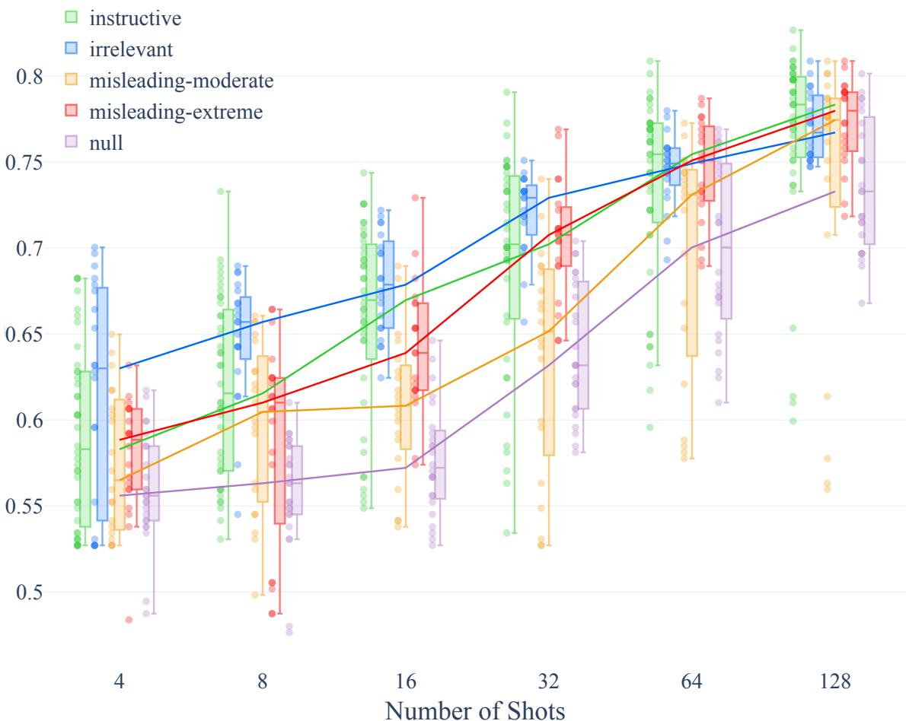

<table><tr><td>num. shots</td><td>template category</td><td>median</td><td>q3 - q1</td><td>mean</td><td>std. dev.</td></tr><tr><td>4</td><td>instructive</td><td>0.5830</td><td>0.0885</td><td>0.5907</td><td>0.0517</td></tr><tr><td>4</td><td>irrelevant</td><td>0.6300</td><td>0.1291</td><td>0.6170</td><td>0.0645</td></tr><tr><td>4</td><td>misleading-extreme</td><td>0.5884</td><td>0.0469</td><td>0.5787</td><td>0.0342</td></tr><tr><td>4</td><td>misleading-moderate</td><td>0.5650</td><td>0.0722</td><td>0.5753</td><td>0.0418</td></tr><tr><td>4</td><td>null</td><td>0.5560</td><td>0.0433</td><td>0.5599</td><td>0.0324</td></tr><tr><td>8</td><td>instructive</td><td>0.6155</td><td>0.0920</td><td>0.6186</td><td>0.0524</td></tr><tr><td>8</td><td>irrelevant</td><td>0.6570</td><td>0.0307</td><td>0.6471</td><td>0.0374</td></tr><tr><td>8</td><td>misleading-extreme</td><td>0.6101</td><td>0.0677</td><td>0.5899</td><td>0.0595</td></tr><tr><td>8</td><td>misleading-moderate</td><td>0.6047</td><td>0.0767</td><td>0.5969</td><td>0.0490</td></tr><tr><td>8</td><td>null</td><td>0.5632</td><td>0.0397</td><td>0.5586</td><td>0.0326</td></tr><tr><td>16</td><td>instructive</td><td>0.6697</td><td>0.0605</td><td>0.6594</td><td>0.0558</td></tr><tr><td>16</td><td>irrelevant</td><td>0.6787</td><td>0.0488</td><td>0.6787</td><td>0.0294</td></tr><tr><td>16</td><td>misleading-extreme</td><td>0.6390</td><td>0.0506</td><td>0.6413</td><td>0.0384</td></tr><tr><td>16</td><td>misleading-moderate</td><td>0.6083</td><td>0.0443</td><td>0.6072</td><td>0.0427</td></tr><tr><td>16</td><td>null</td><td>0.5722</td><td>0.0379</td><td>0.5767</td><td>0.0327</td></tr><tr><td>32</td><td>instructive</td><td>0.7022</td><td>0.0813</td><td>0.6929</td><td>0.0638</td></tr><tr><td>32</td><td>irrelevant</td><td>0.7292</td><td>0.0235</td><td>0.7206</td><td>0.0236</td></tr><tr><td>32</td><td>misleading-extreme</td><td>0.7076</td><td>0.0334</td><td>0.7056</td><td>0.0340</td></tr><tr><td>32</td><td>misleading-moderate</td><td>0.6516</td><td>0.0992</td><td>0.6350</td><td>0.0666</td></tr><tr><td>32</td><td>null</td><td>0.6318</td><td>0.0731</td><td>0.6414</td><td>0.0392</td></tr><tr><td>64</td><td>instructive</td><td>0.7545</td><td>0.0542</td><td>0.7353</td><td>0.0548</td></tr><tr><td>64</td><td>irrelevant</td><td>0.7491</td><td>0.0198</td><td>0.7455</td><td>0.0218</td></tr><tr><td>64</td><td>misleading-extreme</td><td>0.7509</td><td>0.0416</td><td>0.7451</td><td>0.0299</td></tr><tr><td>64</td><td>misleading-moderate</td><td>0.7310</td><td>0.0993</td><td>0.6953</td><td>0.0688</td></tr><tr><td>64</td><td>null</td><td>0.7004</td><td>0.0848</td><td>0.6998</td><td>0.0516</td></tr><tr><td>128</td><td>instructive</td><td>0.7834</td><td>0.0451</td><td>0.7661</td><td>0.0551</td></tr><tr><td>128</td><td>irrelevant</td><td>0.7671</td><td>0.0343</td><td>0.7704</td><td>0.0200</td></tr><tr><td>128</td><td>misleading-extreme</td><td>0.7798</td><td>0.0334</td><td>0.7729</td><td>0.0255</td></tr><tr><td>128</td><td>misleading-moderate</td><td>0.7744</td><td>0.0550</td><td>0.7354</td><td>0.0842</td></tr><tr><td>128</td><td>null</td><td>0.7329</td><td>0.0695</td><td>0.7369</td><td>0.0389</td></tr></table>

## G.2 ALBERT on ANLI R1

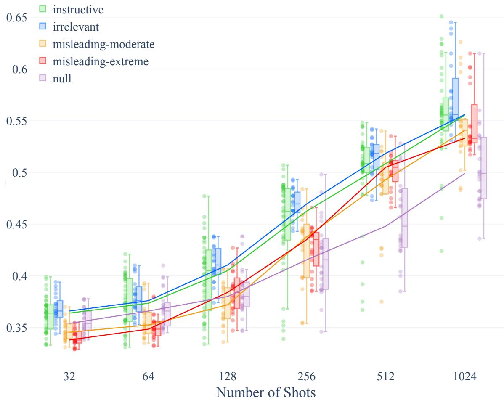

<table><tr><td>num. shots</td><td>template category</td><td>median</td><td>q3 - q1</td><td>mean</td><td>std. dev.</td></tr><tr><td>32</td><td>instructive</td><td>0.3640</td><td>0.0232</td><td>0.3625</td><td>0.0166</td></tr><tr><td>32</td><td>irrelevant</td><td>0.3660</td><td>0.0140</td><td>0.3681</td><td>0.0134</td></tr><tr><td>32</td><td>misleading-extreme</td><td>0.3380</td><td>0.0100</td><td>0.3404</td><td>0.0081</td></tr><tr><td>32</td><td>misleading-moderate</td><td>0.3455</td><td>0.0130</td><td>0.3470</td><td>0.0098</td></tr><tr><td>32</td><td>null</td><td>0.3540</td><td>0.0177</td><td>0.3567</td><td>0.0122</td></tr><tr><td>64</td><td>instructive</td><td>0.3735</td><td>0.0408</td><td>0.3738</td><td>0.0251</td></tr><tr><td>64</td><td>irrelevant</td><td>0.3760</td><td>0.0210</td><td>0.3788</td><td>0.0178</td></tr><tr><td>64</td><td>misleading-extreme</td><td>0.3485</td><td>0.0135</td><td>0.3510</td><td>0.0129</td></tr><tr><td>64</td><td>misleading-moderate</td><td>0.3525</td><td>0.0197</td><td>0.3574</td><td>0.0171</td></tr><tr><td>64</td><td>null</td><td>0.3660</td><td>0.0208</td><td>0.3675</td><td>0.0184</td></tr><tr><td>128</td><td>instructive</td><td>0.4050</td><td>0.0562</td><td>0.3992</td><td>0.0356</td></tr><tr><td>128</td><td>irrelevant</td><td>0.4105</td><td>0.0240</td><td>0.4120</td><td>0.0176</td></tr><tr><td>128</td><td>misleading-extreme</td><td>0.3840</td><td>0.0262</td><td>0.3843</td><td>0.0204</td></tr><tr><td>128</td><td>misleading-moderate</td><td>0.3720</td><td>0.0295</td><td>0.3725</td><td>0.0199</td></tr><tr><td>128</td><td>null</td><td>0.3800</td><td>0.0235</td><td>0.3857</td><td>0.0247</td></tr><tr><td>256</td><td>instructive</td><td>0.4625</td><td>0.0490</td><td>0.4504</td><td>0.0450</td></tr><tr><td>256</td><td>irrelevant</td><td>0.4695</td><td>0.0175</td><td>0.4694</td><td>0.0147</td></tr><tr><td>256</td><td>misleading-extreme</td><td>0.4350</td><td>0.0297</td><td>0.4263</td><td>0.0231</td></tr><tr><td>256</td><td>misleading-moderate</td><td>0.4375</td><td>0.0492</td><td>0.4265</td><td>0.0353</td></tr><tr><td>256</td><td>null</td><td>0.4155</td><td>0.0475</td><td>0.4167</td><td>0.0365</td></tr><tr><td>512</td><td>instructive</td><td>0.5085</td><td>0.0235</td><td>0.4992</td><td>0.0434</td></tr><tr><td>512</td><td>irrelevant</td><td>0.5185</td><td>0.0230</td><td>0.5154</td><td>0.0186</td></tr><tr><td>512</td><td>misleading-extreme</td><td>0.5050</td><td>0.0172</td><td>0.5008</td><td>0.0177</td></tr><tr><td>512</td><td>misleading-moderate</td><td>0.4930</td><td>0.0285</td><td>0.4839</td><td>0.0413</td></tr><tr><td>512</td><td>null</td><td>0.4480</td><td>0.0550</td><td>0.4564</td><td>0.0399</td></tr><tr><td>1024</td><td>instructive</td><td>0.5555</td><td>0.0270</td><td>0.5557</td><td>0.0449</td></tr><tr><td>1024</td><td>irrelevant</td><td>0.5560</td><td>0.0345</td><td>0.5729</td><td>0.0351</td></tr><tr><td>1024</td><td>misleading-extreme</td><td>0.5330</td><td>0.0265</td><td>0.5477</td><td>0.0316</td></tr><tr><td>1024</td><td>misleading-moderate</td><td>0.5405</td><td>0.0247</td><td>0.5447</td><td>0.0388</td></tr><tr><td>1024</td><td>null</td><td>0.4990</td><td>0.0588</td><td>0.5062</td><td>0.0392</td></tr></table>

## G.3 T5 770M on RTE

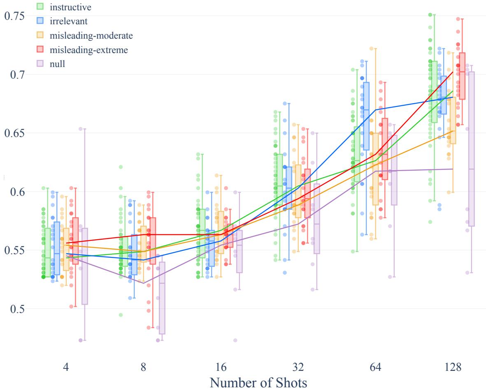

<table><tr><td>num. shots</td><td>template category</td><td>median</td><td>q3 - q1</td><td>mean</td><td>std. dev.</td></tr><tr><td>4</td><td>instructive</td><td>0.5433</td><td>0.0406</td><td>0.5493</td><td>0.0219</td></tr><tr><td>4</td><td>irrelevant</td><td>0.5469</td><td>0.0424</td><td>0.5532</td><td>0.0252</td></tr><tr><td>4</td><td>misleading-extreme</td><td>0.5560</td><td>0.0361</td><td>0.5561</td><td>0.0263</td></tr><tr><td>4</td><td>misleading-moderate</td><td>0.5542</td><td>0.0325</td><td>0.5531</td><td>0.0220</td></tr><tr><td>4</td><td>null</td><td>0.5451</td><td>0.0487</td><td>0.5451</td><td>0.0578</td></tr><tr><td>8</td><td>instructive</td><td>0.5487</td><td>0.0235</td><td>0.5516</td><td>0.0232</td></tr><tr><td>8</td><td>irrelevant</td><td>0.5415</td><td>0.0280</td><td>0.5480</td><td>0.0244</td></tr><tr><td>8</td><td>misleading-extreme</td><td>0.5632</td><td>0.0379</td><td>0.5545</td><td>0.0322</td></tr><tr><td>8</td><td>misleading-moderate</td><td>0.5487</td><td>0.0280</td><td>0.5543</td><td>0.0192</td></tr><tr><td>8</td><td>null</td><td>0.5217</td><td>0.0560</td><td>0.5122</td><td>0.0317</td></tr><tr><td>16</td><td>instructive</td><td>0.5668</td><td>0.0406</td><td>0.5662</td><td>0.0277</td></tr><tr><td>16</td><td>irrelevant</td><td>0.5578</td><td>0.0298</td><td>0.5558</td><td>0.0199</td></tr><tr><td>16</td><td>misleading-extreme</td><td>0.5632</td><td>0.0190</td><td>0.5634</td><td>0.0160</td></tr><tr><td>16</td><td>misleading-moderate</td><td>0.5632</td><td>0.0343</td><td>0.5666</td><td>0.0239</td></tr><tr><td>16</td><td>null</td><td>0.5542</td><td>0.0271</td><td>0.5469</td><td>0.0381</td></tr><tr><td>32</td><td>instructive</td><td>0.6047</td><td>0.0433</td><td>0.6078</td><td>0.0317</td></tr><tr><td>32</td><td>irrelevant</td><td>0.6029</td><td>0.0361</td><td>0.6025</td><td>0.0366</td></tr><tr><td>32</td><td>misleading-extreme</td><td>0.5939</td><td>0.0352</td><td>0.5996</td><td>0.0292</td></tr><tr><td>32</td><td>misleading-moderate</td><td>0.5884</td><td>0.0424</td><td>0.5986</td><td>0.0311</td></tr><tr><td>32</td><td>null</td><td>0.5722</td><td>0.0460</td><td>0.5772</td><td>0.0443</td></tr><tr><td>64</td><td>instructive</td><td>0.6264</td><td>0.0433</td><td>0.6318</td><td>0.0324</td></tr><tr><td>64</td><td>irrelevant</td><td>0.6697</td><td>0.0542</td><td>0.6585</td><td>0.0421</td></tr><tr><td>64</td><td>misleading-extreme</td><td>0.6318</td><td>0.0478</td><td>0.6336</td><td>0.0355</td></tr><tr><td>64</td><td>misleading-moderate</td><td>0.6227</td><td>0.0578</td><td>0.6195</td><td>0.0400</td></tr><tr><td>64</td><td>null</td><td>0.6173</td><td>0.0496</td><td>0.6115</td><td>0.0442</td></tr><tr><td>128</td><td>instructive</td><td>0.6859</td><td>0.0514</td><td>0.6820</td><td>0.0421</td></tr><tr><td>128</td><td>irrelevant</td><td>0.6805</td><td>0.0307</td><td>0.6749</td><td>0.0362</td></tr><tr><td>128</td><td>misleading-extreme</td><td>0.7022</td><td>0.0361</td><td>0.6987</td><td>0.0260</td></tr><tr><td>128</td><td>misleading-moderate</td><td>0.6516</td><td>0.0379</td><td>0.6597</td><td>0.0295</td></tr><tr><td>128</td><td>null</td><td>0.6191</td><td>0.1291</td><td>0.6277</td><td>0.0717</td></tr></table>

G.4 T5 3B on RTE  
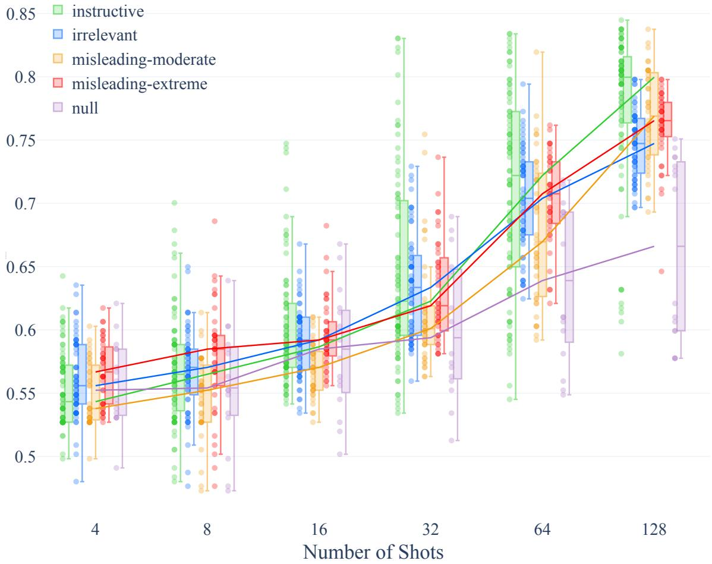

<table><tr><td>num. shots</td><td>template category</td><td>median</td><td>q3 - q1</td><td>mean</td><td>std. dev.</td></tr><tr><td>4</td><td>instructive</td><td>0.5433</td><td>0.0442</td><td>0.5524</td><td>0.0297</td></tr><tr><td>4</td><td>irrelevant</td><td>0.5560</td><td>0.0469</td><td>0.5611</td><td>0.0308</td></tr><tr><td>4</td><td>misleading-extreme</td><td>0.5668</td><td>0.0442</td><td>0.5671</td><td>0.0251</td></tr><tr><td>4</td><td>misleading-moderate</td><td>0.5379</td><td>0.0415</td><td>0.5497</td><td>0.0247</td></tr><tr><td>4</td><td>null</td><td>0.5523</td><td>0.0514</td><td>0.5575</td><td>0.0334</td></tr><tr><td>8</td><td>instructive</td><td>0.5650</td><td>0.0514</td><td>0.5680</td><td>0.0427</td></tr><tr><td>8</td><td>irrelevant</td><td>0.5704</td><td>0.0343</td><td>0.5676</td><td>0.0332</td></tr><tr><td>8</td><td>misleading-extreme</td><td>0.5848</td><td>0.0397</td><td>0.5773</td><td>0.0431</td></tr><tr><td>8</td><td>misleading-moderate</td><td>0.5523</td><td>0.0442</td><td>0.5485</td><td>0.0309</td></tr><tr><td>8</td><td>null</td><td>0.5542</td><td>0.0523</td><td>0.5553</td><td>0.0459</td></tr><tr><td>16</td><td>instructive</td><td>0.5866</td><td>0.0505</td><td>0.6005</td><td>0.0467</td></tr><tr><td>16</td><td>irrelevant</td><td>0.5921</td><td>0.0406</td><td>0.5907</td><td>0.0279</td></tr><tr><td>16</td><td>misleading-extreme</td><td>0.5921</td><td>0.0262</td><td>0.5953</td><td>0.0271</td></tr><tr><td>16</td><td>misleading-moderate</td><td>0.5704</td><td>0.0298</td><td>0.5693</td><td>0.0212</td></tr><tr><td>16</td><td>null</td><td>0.5848</td><td>0.0614</td><td>0.5833</td><td>0.0481</td></tr><tr><td>32</td><td>instructive</td><td>0.6227</td><td>0.1056</td><td>0.6463</td><td>0.0757</td></tr><tr><td>32</td><td>irrelevant</td><td>0.6336</td><td>0.0623</td><td>0.6349</td><td>0.0416</td></tr><tr><td>32</td><td>misleading-extreme</td><td>0.6191</td><td>0.0542</td><td>0.6315</td><td>0.0393</td></tr><tr><td>32</td><td>misleading-moderate</td><td>0.6011</td><td>0.0298</td><td>0.6134</td><td>0.0440</td></tr><tr><td>32</td><td>null</td><td>0.5939</td><td>0.0848</td><td>0.6031</td><td>0.0548</td></tr><tr><td>64</td><td>instructive</td><td>0.7220</td><td>0.1227</td><td>0.7113</td><td>0.0784</td></tr><tr><td>64</td><td>irrelevant</td><td>0.7040</td><td>0.0578</td><td>0.7032</td><td>0.0408</td></tr><tr><td>64</td><td>misleading-extreme</td><td>0.7076</td><td>0.0478</td><td>0.7039</td><td>0.0352</td></tr><tr><td>64</td><td>misleading-moderate</td><td>0.6697</td><td>0.0957</td><td>0.6792</td><td>0.0569</td></tr><tr><td>64</td><td>null</td><td>0.6390</td><td>0.0984</td><td>0.6397</td><td>0.0618</td></tr><tr><td>128</td><td>instructive</td><td>0.7996</td><td>0.0496</td><td>0.7769</td><td>0.0627</td></tr><tr><td>128</td><td>irrelevant</td><td>0.7473</td><td>0.0415</td><td>0.7468</td><td>0.0271</td></tr><tr><td>128</td><td>misleading-extreme</td><td>0.7653</td><td>0.0262</td><td>0.7604</td><td>0.0295</td></tr><tr><td>128</td><td>misleading-moderate</td><td>0.7690</td><td>0.0632</td><td>0.7685</td><td>0.0373</td></tr><tr><td>128</td><td>null</td><td>0.6661</td><td>0.1318</td><td>0.6640</td><td>0.0716</td></tr></table>

## G.5 T0 3B on RTE

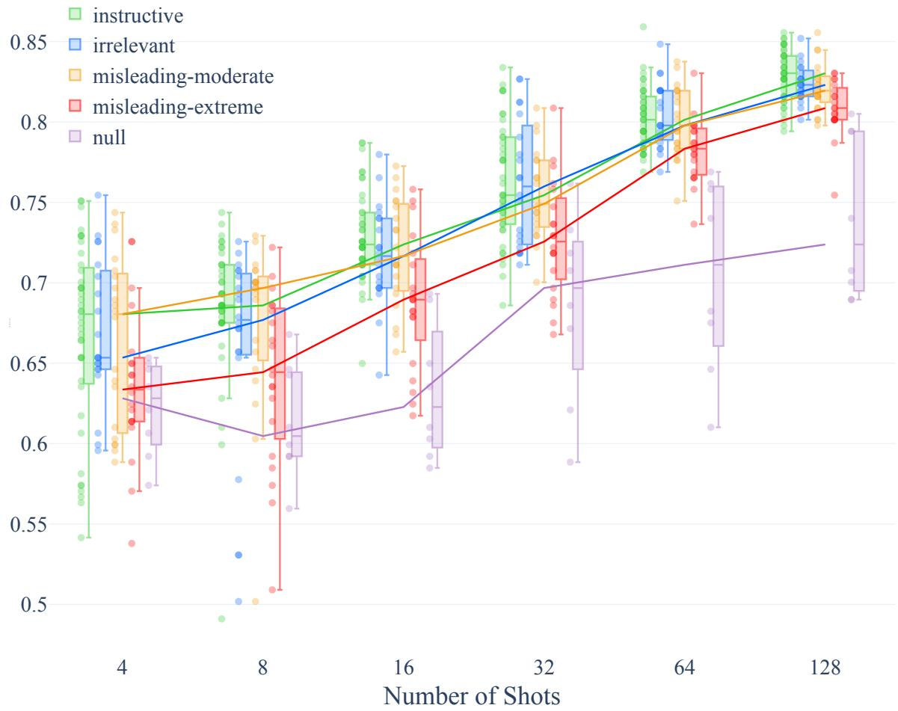

<table><tr><td>num. shots</td><td>template category</td><td>median</td><td>q3 - q1</td><td>mean</td><td>std. dev.</td></tr><tr><td>4</td><td>instructive</td><td>0.6805</td><td>0.0704</td><td>0.6677</td><td>0.0580</td></tr><tr><td>4</td><td>irrelevant</td><td>0.6534</td><td>0.0596</td><td>0.6695</td><td>0.0450</td></tr><tr><td>4</td><td>misleading-extreme</td><td>0.6336</td><td>0.0379</td><td>0.6368</td><td>0.0469</td></tr><tr><td>4</td><td>misleading-moderate</td><td>0.6805</td><td>0.0966</td><td>0.6644</td><td>0.0525</td></tr><tr><td>4</td><td>null</td><td>0.6282</td><td>0.0442</td><td>0.6223</td><td>0.0292</td></tr><tr><td>8</td><td>instructive</td><td>0.6859</td><td>0.0361</td><td>0.6850</td><td>0.0438</td></tr><tr><td>8</td><td>irrelevant</td><td>0.6769</td><td>0.0487</td><td>0.6579</td><td>0.0674</td></tr><tr><td>8</td><td>misleading-extreme</td><td>0.6444</td><td>0.0749</td><td>0.6401</td><td>0.0543</td></tr><tr><td>8</td><td>misleading-moderate</td><td>0.6968</td><td>0.0478</td><td>0.6747</td><td>0.0530</td></tr><tr><td>8</td><td>null</td><td>0.6047</td><td>0.0514</td><td>0.6137</td><td>0.0357</td></tr><tr><td>16</td><td>instructive</td><td>0.7238</td><td>0.0325</td><td>0.7290</td><td>0.0284</td></tr><tr><td>16</td><td>irrelevant</td><td>0.7166</td><td>0.0433</td><td>0.7171</td><td>0.0315</td></tr><tr><td>16</td><td>misleading-extreme</td><td>0.6895</td><td>0.0415</td><td>0.6879</td><td>0.0410</td></tr><tr><td>16</td><td>misleading-moderate</td><td>0.7166</td><td>0.0523</td><td>0.7191</td><td>0.0337</td></tr><tr><td>16</td><td>null</td><td>0.6227</td><td>0.0596</td><td>0.6322</td><td>0.0423</td></tr><tr><td>32</td><td>instructive</td><td>0.7545</td><td>0.0542</td><td>0.7627</td><td>0.0369</td></tr><tr><td>32</td><td>irrelevant</td><td>0.7599</td><td>0.0695</td><td>0.7621</td><td>0.0397</td></tr><tr><td>32</td><td>misleading-extreme</td><td>0.7256</td><td>0.0451</td><td>0.7278</td><td>0.0361</td></tr><tr><td>32</td><td>misleading-moderate</td><td>0.7491</td><td>0.0406</td><td>0.7551</td><td>0.0279</td></tr><tr><td>32</td><td>null</td><td>0.6968</td><td>0.0632</td><td>0.6859</td><td>0.0578</td></tr><tr><td>64</td><td>instructive</td><td>0.8014</td><td>0.0289</td><td>0.8027</td><td>0.0190</td></tr><tr><td>64</td><td>irrelevant</td><td>0.7978</td><td>0.0298</td><td>0.8040</td><td>0.0204</td></tr><tr><td>64</td><td>misleading-extreme</td><td>0.7834</td><td>0.0271</td><td>0.7827</td><td>0.0201</td></tr><tr><td>64</td><td>misleading-moderate</td><td>0.7978</td><td>0.0361</td><td>0.8000</td><td>0.0225</td></tr><tr><td>64</td><td>null</td><td>0.7112</td><td>0.0912</td><td>0.7053</td><td>0.0600</td></tr><tr><td>128</td><td>instructive</td><td>0.8303</td><td>0.0253</td><td>0.8292</td><td>0.0161</td></tr><tr><td>128</td><td>irrelevant</td><td>0.8231</td><td>0.0153</td><td>0.8244</td><td>0.0118</td></tr><tr><td>128</td><td>misleading-extreme</td><td>0.8087</td><td>0.0190</td><td>0.8088</td><td>0.0174</td></tr><tr><td>128</td><td>misleading-moderate</td><td>0.8195</td><td>0.0135</td><td>0.8215</td><td>0.0152</td></tr><tr><td>128</td><td>null</td><td>0.7238</td><td>0.0966</td><td>0.7401</td><td>0.0505</td></tr></table>

## G.6 T0 3B on ANLI R1

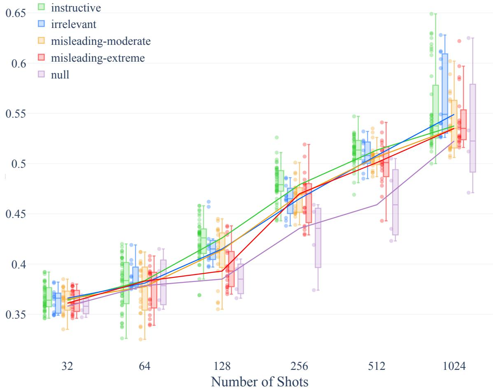

<table><tr><td>num. shots</td><td>template category</td><td>median</td><td>q3 - q1</td><td>mean</td><td>std. dev.</td></tr><tr><td>32</td><td>instructive</td><td>0.3640</td><td>0.0185</td><td>0.3664</td><td>0.0129</td></tr><tr><td>32</td><td>irrelevant</td><td>0.3660</td><td>0.0190</td><td>0.3637</td><td>0.0119</td></tr><tr><td>32</td><td>misleading-extreme</td><td>0.3610</td><td>0.0200</td><td>0.3638</td><td>0.0117</td></tr><tr><td>32</td><td>misleading-moderate</td><td>0.3650</td><td>0.0175</td><td>0.3631</td><td>0.0125</td></tr><tr><td>32</td><td>null</td><td>0.3580</td><td>0.0115</td><td>0.3580</td><td>0.0096</td></tr><tr><td>64</td><td>instructive</td><td>0.3835</td><td>0.0395</td><td>0.3797</td><td>0.0255</td></tr><tr><td>64</td><td>irrelevant</td><td>0.3810</td><td>0.0160</td><td>0.3878</td><td>0.0141</td></tr><tr><td>64</td><td>misleading-extreme</td><td>0.3830</td><td>0.0340</td><td>0.3753</td><td>0.0223</td></tr><tr><td>64</td><td>misleading-moderate</td><td>0.3775</td><td>0.0400</td><td>0.3749</td><td>0.0259</td></tr><tr><td>64</td><td>null</td><td>0.3785</td><td>0.0368</td><td>0.3817</td><td>0.0275</td></tr><tr><td>128</td><td>instructive</td><td>0.4260</td><td>0.0233</td><td>0.4226</td><td>0.0214</td></tr><tr><td>128</td><td>irrelevant</td><td>0.4150</td><td>0.0170</td><td>0.4190</td><td>0.0219</td></tr><tr><td>128</td><td>misleading-extreme</td><td>0.3930</td><td>0.0340</td><td>0.3975</td><td>0.0227</td></tr><tr><td>128</td><td>misleading-moderate</td><td>0.4140</td><td>0.0318</td><td>0.4092</td><td>0.0274</td></tr><tr><td>128</td><td>null</td><td>0.3850</td><td>0.0247</td><td>0.3852</td><td>0.0179</td></tr><tr><td>256</td><td>instructive</td><td>0.4790</td><td>0.0197</td><td>0.4804</td><td>0.0181</td></tr><tr><td>256</td><td>irrelevant</td><td>0.4650</td><td>0.0185</td><td>0.4640</td><td>0.0161</td></tr><tr><td>256</td><td>misleading-extreme</td><td>0.4700</td><td>0.0355</td><td>0.4654</td><td>0.0259</td></tr><tr><td>256</td><td>misleading-moderate</td><td>0.4690</td><td>0.0242</td><td>0.4670</td><td>0.0167</td></tr><tr><td>256</td><td>null</td><td>0.4355</td><td>0.0460</td><td>0.4260</td><td>0.0388</td></tr><tr><td>512</td><td>instructive</td><td>0.5135</td><td>0.0185</td><td>0.5123</td><td>0.0147</td></tr><tr><td>512</td><td>irrelevant</td><td>0.5080</td><td>0.0205</td><td>0.5088</td><td>0.0147</td></tr><tr><td>512</td><td>misleading-extreme</td><td>0.5010</td><td>0.0265</td><td>0.5007</td><td>0.0233</td></tr><tr><td>512</td><td>misleading-moderate</td><td>0.5065</td><td>0.0105</td><td>0.5066</td><td>0.0127</td></tr><tr><td>512</td><td>null</td><td>0.4590</td><td>0.0565</td><td>0.4615</td><td>0.0389</td></tr><tr><td>1024</td><td>instructive</td><td>0.5375</td><td>0.0477</td><td>0.5539</td><td>0.0406</td></tr><tr><td>1024</td><td>irrelevant</td><td>0.5490</td><td>0.0740</td><td>0.5690</td><td>0.0406</td></tr><tr><td>1024</td><td>misleading-extreme</td><td>0.5350</td><td>0.0255</td><td>0.5447</td><td>0.0304</td></tr><tr><td>1024</td><td>misleading-moderate</td><td>0.5350</td><td>0.0467</td><td>0.5403</td><td>0.0279</td></tr><tr><td>1024</td><td>null</td><td>0.5225</td><td>0.0543</td><td>0.5353</td><td>0.0651</td></tr></table>

G.7 T5 11B, T0 11B, and GPT-3 175B (Figure 2)
<table><tr><td>model</td><td>template category</td><td>median</td><td> $\boldsymbol { \mathrm { q } 3 - \mathrm { q } 1 }$ </td><td>mean</td><td>std. dev.</td></tr><tr><td>GPT-3 (175B)</td><td>instructive</td><td>0.6534</td><td>0.0722</td><td>0.6472</td><td>0.0429</td></tr><tr><td>GPT-3 (175B)</td><td>irrelevant</td><td>0.6101</td><td>0.0361</td><td>0.6260</td><td>0.0326</td></tr><tr><td>GPT-3 (175B)</td><td>misleading-extreme</td><td>0.6173</td><td>0.0072</td><td>0.6217</td><td>0.0143</td></tr><tr><td>GPT-3 (175B)</td><td>misleading-moderate</td><td>0.6498</td><td>0.0578</td><td>0.6318</td><td>0.0480</td></tr><tr><td>T5 LMA (11B)</td><td>instructive</td><td>0.6679</td><td>0.1462</td><td>0.6797</td><td>0.0823</td></tr><tr><td>T5 LMA (11B)</td><td>irrelevant</td><td>0.6426</td><td>0.0776</td><td>0.6368</td><td>0.0488</td></tr><tr><td>T5 LMA (11B)</td><td>misleading-extreme</td><td>0.5993</td><td>0.0794</td><td>0.6070</td><td>0.0619</td></tr><tr><td>T5 LMA (11B)</td><td>misleading-moderate</td><td>0.5957</td><td>0.1137</td><td>0.6072</td><td>0.0653</td></tr><tr><td>T5 LMA (11B)</td><td>null</td><td>0.5560</td><td>0.0442</td><td>0.5578</td><td>0.0332</td></tr><tr><td>T0 (11B)</td><td>instructive</td><td>0.7942</td><td>0.0623</td><td>0.7959</td><td>0.0392</td></tr><tr><td>T0 (11B)</td><td>irrelevant</td><td>0.7906</td><td>0.0632</td><td>0.7942</td><td>0.0384</td></tr><tr><td>T0 (11B)</td><td>misleading-extreme</td><td>0.7401</td><td>0.0650</td><td>0.7338</td><td>0.0496</td></tr><tr><td>T0 (11B)</td><td>misleading-moderate</td><td>0.7942</td><td>0.0397</td><td>0.7858</td><td>0.0356</td></tr><tr><td>T0 (11B)</td><td>null</td><td>0.6986</td><td>0.0695</td><td>0.6847</td><td>0.0484</td></tr><tr><td>T0++ (11B)</td><td>instructive</td><td>0.8321</td><td>0.0316</td><td>0.8319</td><td>0.0282</td></tr><tr><td>T0++ (11B)</td><td>irrelevant</td><td>0.8267</td><td>0.0433</td><td>0.8207</td><td>0.0323</td></tr><tr><td>T0++ (11B)</td><td>misleading-extreme</td><td>0.8051</td><td>0.0614</td><td>0.8029</td><td>0.0593</td></tr><tr><td>T0++ (11B)</td><td>misleading-moderate</td><td>0.8159</td><td>0.0487</td><td>0.8039</td><td>0.0333</td></tr><tr><td>T0++ (11B)</td><td>null</td><td>0.7509</td><td>0.0505</td><td>0.7379</td><td>0.0362</td></tr></table>

H Results of Individual Templates  
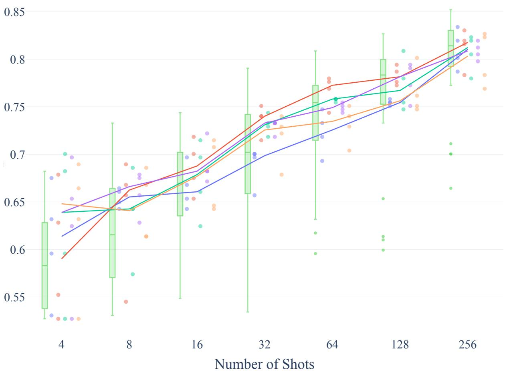  
aggregated instructive templates  
{premise} If bonito flakes boil more than a few seconds, the stock becomes too strong? "{hypothesi  
{premise} Inflections are annoying and thank god that Middle English got rid of most of them. "{hy  
{premise} Is the pious loved by the gods because it is pious? Or is it pious because it is loved by the  
{premise} Single-family zoning is bad for American cities. "{hypothesis}"? {mask}  
{premise} When Bolyai sent Gauss his discovery of non-Euclidean geometry, Gauss replied that he

Figure 17: ALBERT with all irrelevant templates and the aggregated instructive for reference.

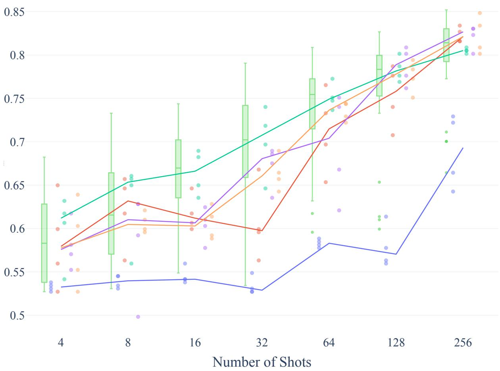  
aggregated instructive templates  
{premise} Are there lots of similar words in "{hypothesis}"? {mask}  
{premise} Can that be paraphrased as: "{hypothesis}"? {mask}  
{premise} Can that be summarized as "{hypothesis}"? {mask}  
{premise} Do most of the above words appear in the following passage? {hypothesis} {mask}  
{premise} Does that have the same meaning as "{hypothesis}"? {mask}

Figure 18: ALBERT with all misleading-moderate templates and the aggregated instructive for reference.

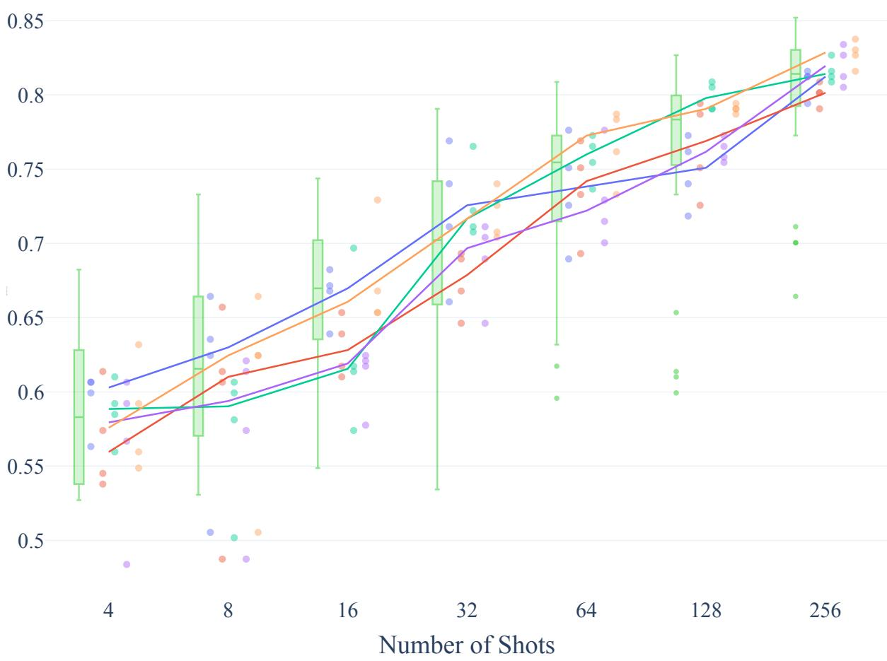  
aggregated instructive templates  
{premise} Does the paragraph start with "the"? {hypothesis} {mask}  
{premise} Is the sentiment positive? {hypothesis} {mask}  
{premise} Is this French? {hypothesis} {mask}  
{premise} Is this a sports news? {hypothesis} {mask}  
{premise} Is this grammatically correct? {hypothesis} {mask}

Figure 19: ALBERT with all misleading-extreme templates and the aggregated instructive for reference.

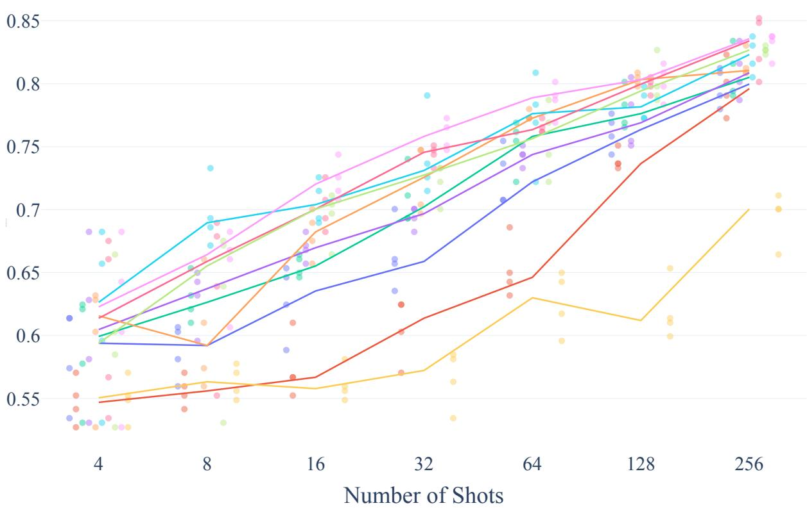  
Given that {premise} Does it follow that "{hypothesis}"? {mask}  
Given that {premise} Therefore, it must be true that "{hypothesis}"? {mask}  
Given {premise} Is it guaranteed true that "{hypothesis}"? {mask}  
Given {premise} Should we assume that "{hypothesis}" is true? {mask}  
Suppose {premise} Can we infer that "{hypothesis}"? {mask}  
{premise} question: {hypothesis} Yes or no? answer: {mask}  
{premise} Are we justified in saying that "{hypothesis}"? {mask}  
{premise} Based on the previous passage, is it true that "{hypothesis}"? {mask}  
{premise} Question: Does this imply that "{hypothesis}"? {mask}  
{premise} Using only the above description and what you know about the world, "{hypothesis}" is

Figure 20: ALBERT with all instructive templates.

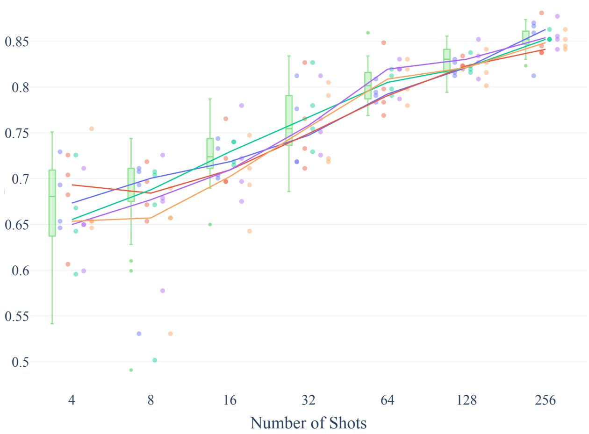  
aggregated instructive templates  
{premise} If bonito flakes boil more than a few seconds, the stock becomes too strong? "{hypothesi  
{premise} Inflections are annoying and thank god that Middle English got rid of most of them. "{hy  
{premise} Is the pious loved by the gods because it is pious? Or is it pious because it is loved by the  
{premise} Single-family zoning is bad for American cities. "{hypothesis}"?  
{premise} When Bolyai sent Gauss his discovery of non-Euclidean geometry, Gauss replied that he

Figure 21: T0 (3B) with all irrelevant templates and the aggregated instructive for reference.

aggregated instructive templates

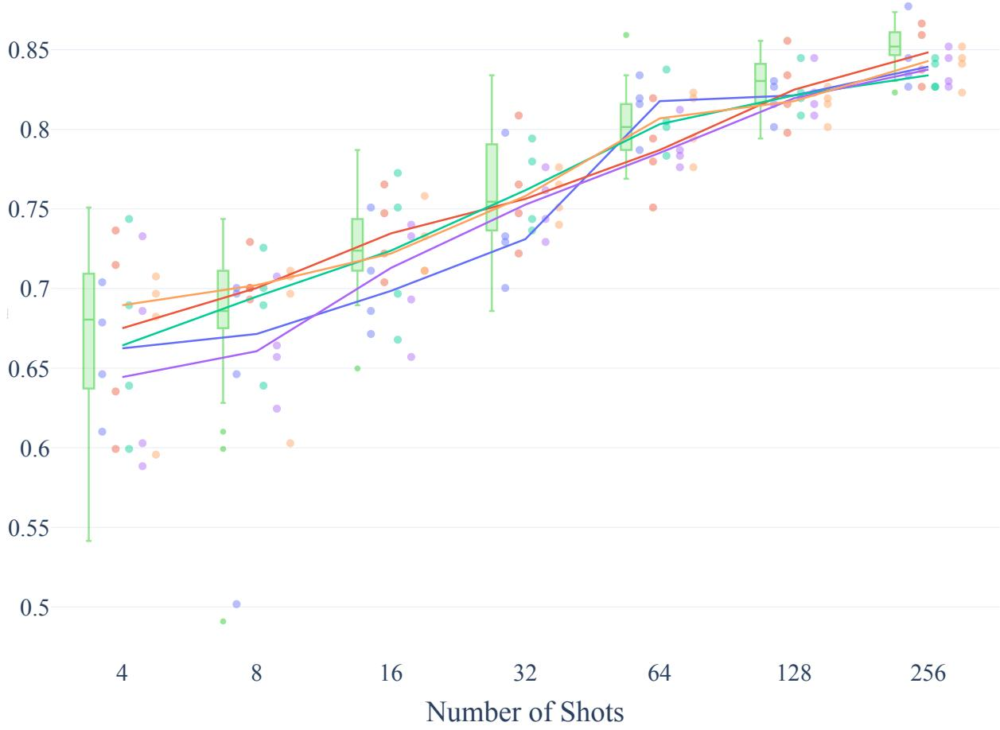  
{premise} Are there lots of similar words in "{hypothesis}"?  
{premise} Can that be paraphrased as: "{hypothesis}"?  
{premise} Can that be summarized as "{hypothesis}"?  
{premise} Do most of the above words appear in the following passage? {hypothesis}  
{premise} Does that have the same meaning as "{hypothesis}"?

Figure 22: T0 (3B) with all misleading-moderate templates and the aggregated instructive for reference.

aggregated instructive templates {premise} Does the paragraph start with "the"? {hypothesis} {premise} Is the sentiment positive? {hypothesis} {premise} Is this French? {hypothesis} {premise} Is this a sports news? {hypothesis} {premise} Is this grammatically correct? {hypothesis}

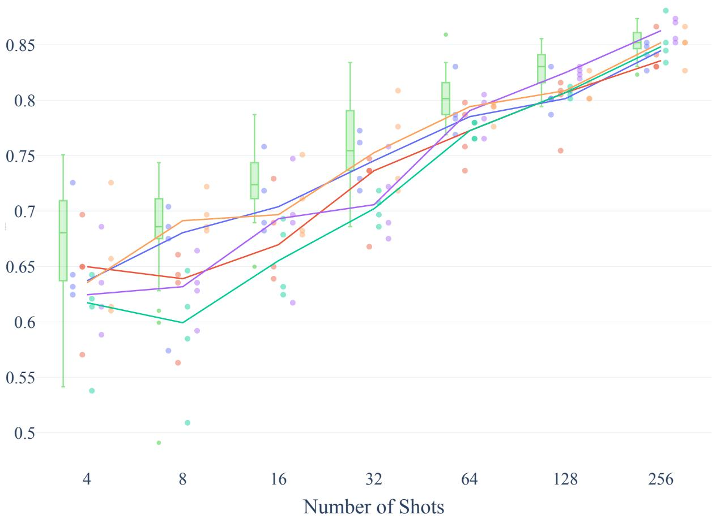  
Figure 23: T0 (3B) with all misleading-extreme templates and the aggregated instructive for reference.

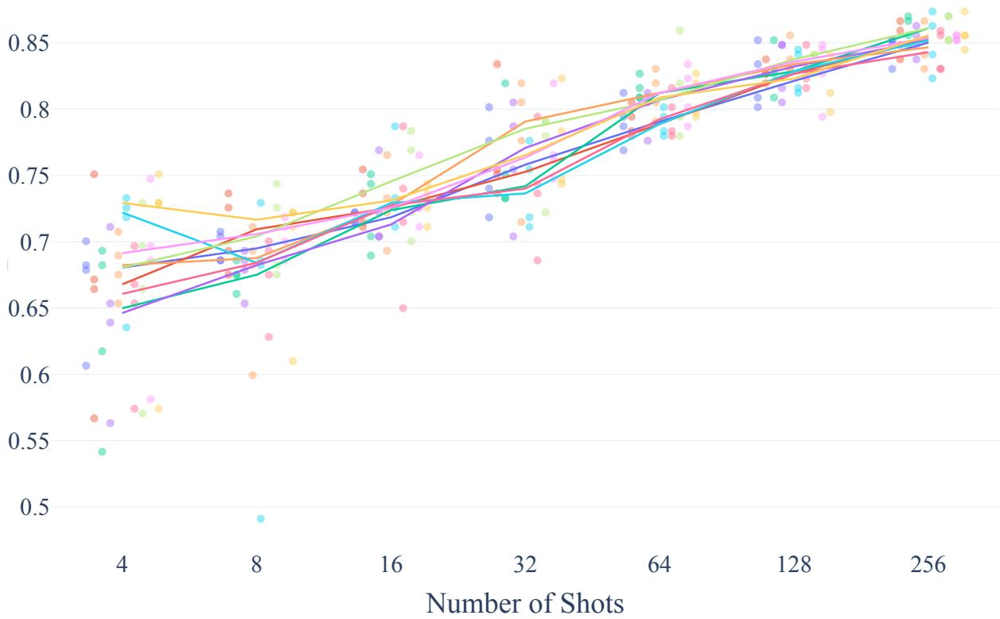  
Given that {premise} Does it follow that "{hypothesis}"?  
Given that {premise} Therefore, it must be true that "{hypothesis}"?  
Given {premise} Is it guaranteed true that "{hypothesis}"?  
Given {premise} Should we assume that "{hypothesis}" is true?  
Suppose {premise} Can we infer that "{hypothesis}"?  
{premise} question: {hypothesis} Yes or no? answer:  
{premise} Are we justified in saying that "{hypothesis}"?  
{premise} Based on the previous passage, is it true that "{hypothesis}"?  
{premise} Question: Does this imply that "{hypothesis}"?  
{premise} Using only the above description and what you know about the world, "{hypothesis}" is

Figure 24: T0 (3B) with all instructive templates.

H.3 T5 LM-Adapted (3B)  
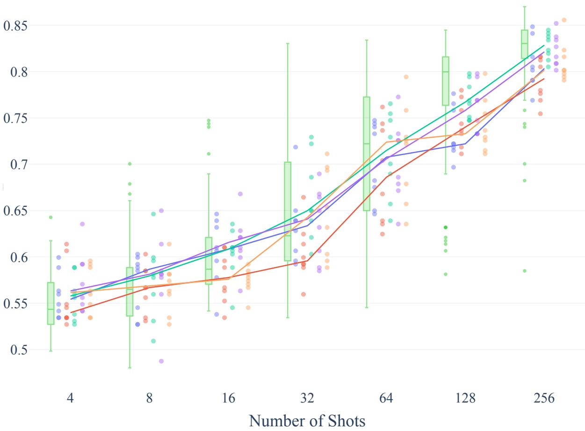  
aggregated instructive templates  
{premise} If bonito flakes boil more than a few seconds, the stock becomes too strong? "{hypothesi  
{premise} Inflections are annoying and thank god that Middle English got rid of most of them. "{hy  
{premise} Is the pious loved by the gods because it is pious? Or is it pious because it is loved by the  
{premise} Single-family zoning is bad for American cities. "{hypothesis}"?  
{premise} When Bolyai sent Gauss his discovery of non-Euclidean geometry, Gauss replied that he

Figure 25: T5 LM-Adapted (3B) with all irrelevant templates and the aggregated instructive for reference.

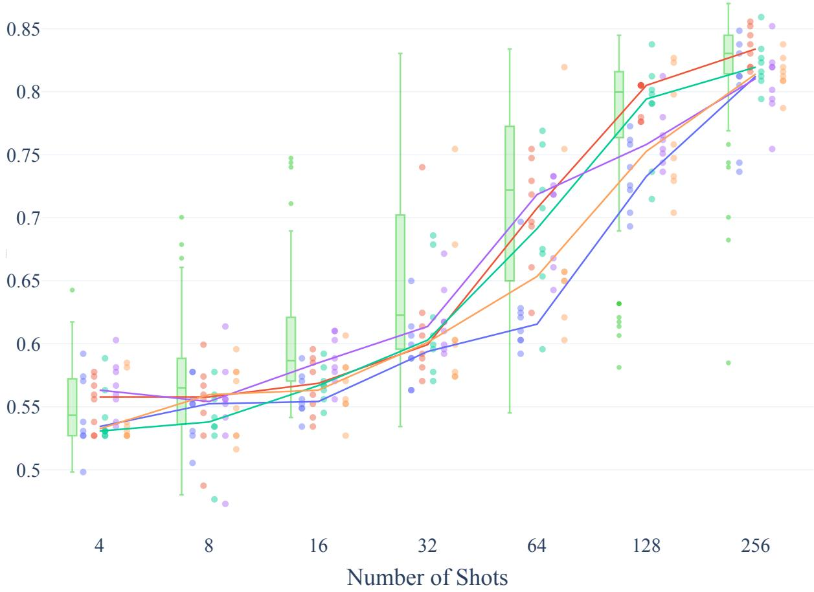  
aggregated instructive templates  
{premise} Are there lots of similar words in "{hypothesis}"?  
{premise} Can that be paraphrased as: "{hypothesis}"?  
{premise} Can that be summarized as "{hypothesis}"?  
{premise} Do most of the above words appear in the following passage? {hypothesis}  
{premise} Does that have the same meaning as "{hypothesis}"?

Figure 26: T5 LM-Adapted (3B) with all misleading-moderate templates and the aggregated instructive for reference.

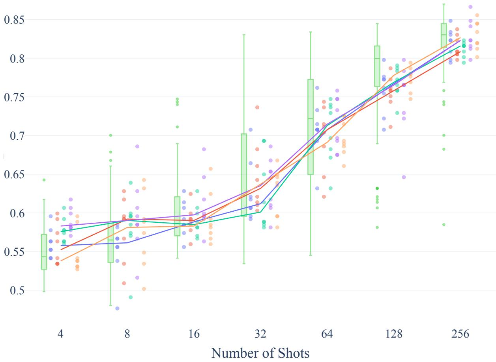  
aggregated instructive templates {premise} Does the paragraph start with "the"? {hypothesis} {premise} Is the sentiment positive? {hypothesis} {premise} Is this French? {hypothesis} {premise} Is this a sports news? {hypothesis} {premise} Is this grammatically correct? {hypothesis}

Figure 27: T5 LM-Adapted (3B) with all misleading-extreme templates and the aggregated instructive for reference.

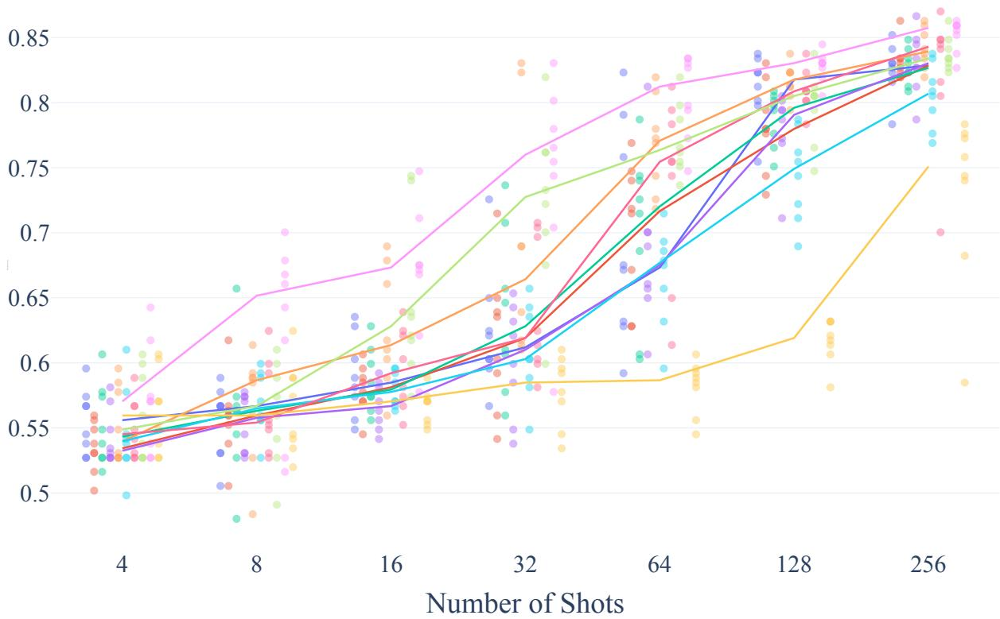  
Given that {premise} Does it follow that "{hypothesis}"?  
Given that {premise} Therefore, it must be true that "{hypothesis}"?  
Given {premise} Is it guaranteed true that "{hypothesis}"?  
Given {premise} Should we assume that "{hypothesis}" is true?  
Suppose {premise} Can we infer that "{hypothesis}"?  
{premise} question: {hypothesis} Yes or no? answer:  
{premise} Are we justified in saying that "{hypothesis}"?  
{premise} Based on the previous passage, is it true that "{hypothesis}"?  
{premise} Question: Does this imply that "{hypothesis}"?  
{premise} Using only the above description and what you know about the world, "{hypothesis}" is

Figure 28: T5 LM-Adapted (3B) with all instructive templates.

Zero-Shot Results (Figure 4)
<table><tr><td>model</td><td>category</td><td>template name</td><td>accuracy</td></tr><tr><td>T0 (3B)</td><td>instructive</td><td>MNLI_YN</td><td>0.7148</td></tr><tr><td>T0 (3B)</td><td>instructive</td><td>GPT_YN</td><td>0.6823</td></tr><tr><td>T0 (3B)</td><td>instructive</td><td>justified_in_saying</td><td>0.6426</td></tr><tr><td>T0 (3B)</td><td>instructive</td><td>should_assume</td><td>0.6498</td></tr><tr><td>T0 (3B)</td><td>instructive</td><td>is_it_true</td><td>0.6462</td></tr><tr><td>T0 (3B)</td><td>instructive</td><td>guaranteed_true</td><td>0.6209</td></tr><tr><td>T0 (3B)</td><td>instructive</td><td>can_we_infer</td><td>0.6354</td></tr><tr><td>T0 (3B)</td><td>instructive</td><td>does_it_follow</td><td>0.6715</td></tr><tr><td>T0 (3B)</td><td>instructive</td><td>does_this_imply</td><td>0.6679</td></tr><tr><td>T0 (3B)</td><td>instructive</td><td>modal_be_true</td><td>0.6354</td></tr><tr><td>T0 (3B)</td><td>misleading-moderate</td><td>words_appear</td><td>0.6462</td></tr><tr><td>T0 (3B)</td><td>misleading-moderate</td><td>similar_words</td><td>0.6354</td></tr><tr><td>T0 (3B)</td><td>misleading-moderate</td><td>same_meaning</td><td>0.6968</td></tr><tr><td>T0 (3B)</td><td>misleading-moderate</td><td>paraphrase</td><td>0.6390</td></tr><tr><td>T0 (3B)</td><td>misleading-moderate</td><td>summarize</td><td>0.6462</td></tr><tr><td>T0 (3B)</td><td>misleading-extreme</td><td>start_with_the</td><td>0.6968</td></tr><tr><td>T0 (3B)</td><td>misleading-extreme</td><td>grammatical</td><td>0.6859</td></tr><tr><td>T0 (3B)</td><td>misleading-extreme</td><td>sentiment</td><td>0.6462</td></tr><tr><td>T0 (3B)</td><td>misleading-extreme</td><td>sportsball</td><td>0.6426</td></tr><tr><td>T0 (3B)</td><td>misleading-extreme</td><td>french</td><td>0.5668</td></tr><tr><td>T0 (3B)</td><td>irrelevant</td><td>zoning</td><td>0.5704</td></tr><tr><td>T0 (3B)</td><td>irrelevant</td><td>gauss</td><td>0.5523</td></tr><tr><td>T0 (3B)</td><td>irrelevant</td><td>katsuobushi</td><td>0.5668</td></tr><tr><td>T0 (3B)</td><td>irrelevant</td><td>inflection</td><td>0.6751</td></tr><tr><td>T0 (3B)</td><td>irrelevant</td><td>euthyphro</td><td>0.6606</td></tr><tr><td>T0 (3B)</td><td>null</td><td>concat_PHM</td><td>0.6426</td></tr><tr><td>T0 (3B)</td><td>null</td><td>concat_HPM</td><td>0.6029</td></tr><tr><td></td><td></td><td></td><td></td></tr></table>

<table><tr><td>model</td><td>category</td><td>template name</td><td>accuracy</td></tr><tr><td>T0 (11B)</td><td>instructive</td><td>MNLI_YN</td><td>0.8051</td></tr><tr><td>T0 (11B)</td><td>instructive</td><td>GPT_YN</td><td>0.8014</td></tr><tr><td>T0 (11B)</td><td>instructive</td><td>justified_in_saying</td><td>0.7112</td></tr><tr><td>T0 (11B)</td><td>instructive</td><td>should_assume</td><td>0.7437</td></tr><tr><td>T0 (11B)</td><td>instructive</td><td>is_it_true</td><td>0.8051</td></tr><tr><td>T0 (11B)</td><td>instructive</td><td>guaranteed_true</td><td>0.6968</td></tr><tr><td>T0 (11B)</td><td>instructive</td><td>can_we_infer</td><td>0.7690</td></tr><tr><td>T0 (11B)</td><td>instructive</td><td>does_it_follow</td><td>0.7509</td></tr><tr><td>T0 (11B)</td><td>instructive</td><td>does_this_imply</td><td>0.8014</td></tr><tr><td>T0 (11B)</td><td>instructive</td><td>modal_be_true</td><td>0.6895</td></tr><tr><td>T0 (11B)</td><td>misleading-moderate</td><td>words_appear</td><td>0.7184</td></tr><tr><td>T0 (11B)</td><td>misleading-moderate</td><td>similar_words</td><td>0.7148</td></tr><tr><td>T0 (11B)</td><td>misleading-moderate</td><td>same_meaning</td><td>0.7256</td></tr><tr><td>T0 (11B)</td><td>misleading-moderate</td><td>paraphrase</td><td>0.7256</td></tr><tr><td>T0 (11B)</td><td>misleading-moderate</td><td>summarize</td><td>0.6679</td></tr><tr><td>T0 (11B)</td><td>misleading-extreme</td><td>start_with_the</td><td>0.6823</td></tr><tr><td>T0 (11B)</td><td>misleading-extreme</td><td>grammatical</td><td>0.6390</td></tr><tr><td>T0 (11B)</td><td>misleading-extreme</td><td>sentiment</td><td>0.6318</td></tr><tr><td>T0 (11B) T0 (11B)</td><td>misleading-extreme</td><td>sportsball</td><td>0.5921</td></tr><tr><td>T0 (11B)</td><td>misleading-extreme</td><td>french</td><td>0.5271</td></tr><tr><td>T0 (11B)</td><td>irrelevant</td><td>zoning</td><td>0.6318</td></tr><tr><td>T0 (11B)</td><td>irrelevant</td><td>gauss</td><td>0.5560</td></tr><tr><td>T0 (11B)</td><td>irrelevant</td><td>katsuobushi</td><td>0.5740</td></tr><tr><td>T0 (11B)</td><td>irrelevant</td><td>inflection</td><td>0.7004</td></tr><tr><td>T0 (11B)</td><td>irrelevant</td><td>euthyphro</td><td>0.6931</td></tr><tr><td>T0 (11B)</td><td>null</td><td>concat_PHM</td><td>0.6570</td></tr><tr><td>T0++ (11B)</td><td>null</td><td>concat_HPM</td><td>0.6209</td></tr><tr><td>T0++ (11B)</td><td>instructive</td><td>MNLI_YN</td><td>0.8592</td></tr><tr><td>T0++ (11B)</td><td>instructive</td><td>GPT_YN</td><td>0.8231</td></tr><tr><td>T0++ (11B)</td><td>instructive</td><td>justified_in_saying</td><td>0.7726</td></tr><tr><td>T0++ (11B)</td><td>instructive</td><td>should_assume</td><td>0.8231</td></tr><tr><td>T0++ (11B)</td><td>instructive</td><td>is_it_true</td><td>0.8556</td></tr><tr><td>T0++ (11B)</td><td>instructive</td><td>guaranteed_true</td><td>0.8231</td></tr><tr><td></td><td>instructive</td><td>can_we_infer</td><td>0.8303</td></tr><tr><td>T0++ (11B)</td><td>instructive</td><td>does_it_follow</td><td>0.7798</td></tr><tr><td>T0++ (11B)</td><td>instructive</td><td>does_this_imply</td><td>0.8664</td></tr><tr><td>T0++ (11B)</td><td>instructive</td><td>modal_be_true</td><td>0.8087</td></tr><tr><td>T0++ (11B)</td><td>misleading-moderate</td><td>words_appear</td><td>0.7076</td></tr><tr><td>T0++ (11B)</td><td>misleading-moderate</td><td>similar_words</td><td>0.7329</td></tr><tr><td>T0++ (11B)</td><td>misleading-moderate</td><td>same_meaning</td><td>0.7545</td></tr><tr><td>T0++ (11B)</td><td>misleading-moderate</td><td>paraphrase</td><td>0.7617</td></tr><tr><td>T0++ (11B)</td><td>misleading-moderate</td><td>summarize</td><td>0.6968</td></tr><tr><td>T0++ (11B)</td><td>misleading-extreme</td><td>start_with_the</td><td>0.6498</td></tr><tr><td>T0++ (11B)</td><td>misleading-extreme</td><td>grammatical</td><td>0.7762</td></tr><tr><td>T0++ (11B)</td><td>misleading-extreme</td><td>sentiment</td><td>0.7365</td></tr><tr><td>T0++ (11B)</td><td>misleading-extreme</td><td>sportsball</td><td>0.5307</td></tr><tr><td>T0++ (11B)</td><td>misleading-extreme</td><td>french</td><td>0.4838</td></tr><tr><td>T0++ (11B)</td><td>irrelevant</td><td>zoning</td><td>0.5018</td></tr><tr><td>T0++ (11B)</td><td>irrelevant</td><td>gauss</td><td>0.5090</td></tr><tr><td>T0++ (11B)</td><td>irrelevant</td><td>katsuobushi</td><td>0.4801</td></tr><tr><td>T0++ (11B)</td><td>irrelevant</td><td>inflection</td><td>0.7220</td></tr><tr><td>T0++ (11B)</td><td>irrelevant</td><td>euthyphro</td><td>0.6715</td></tr><tr><td>T0++ (11B)</td><td>null</td><td>concat_PHM</td><td>0.6426</td></tr><tr><td>T0++ (11B)</td><td>null</td><td>concat_HPM</td><td>0.6029</td></tr></table>

## J Comparison of LM targets, Controlling for the Template

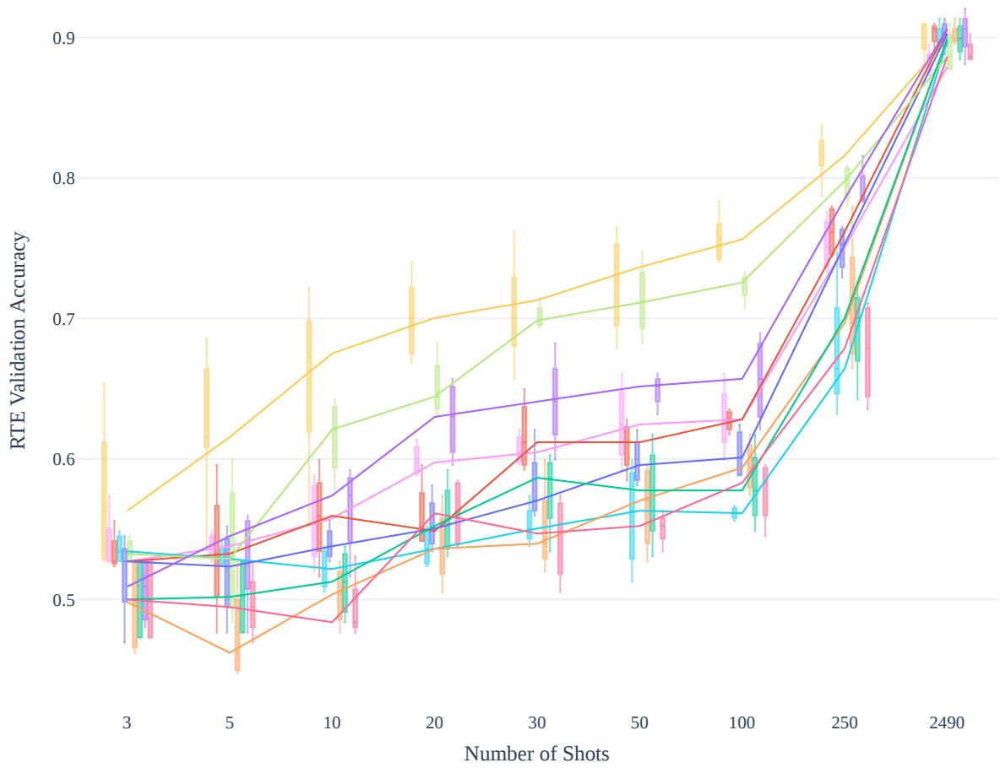  
Figure 29: The best performing irrelevant prompt for ALBERT, {premise} Single-family zoning is bad for American cities. "{hypothesis}"? [mask] with all LM targets.

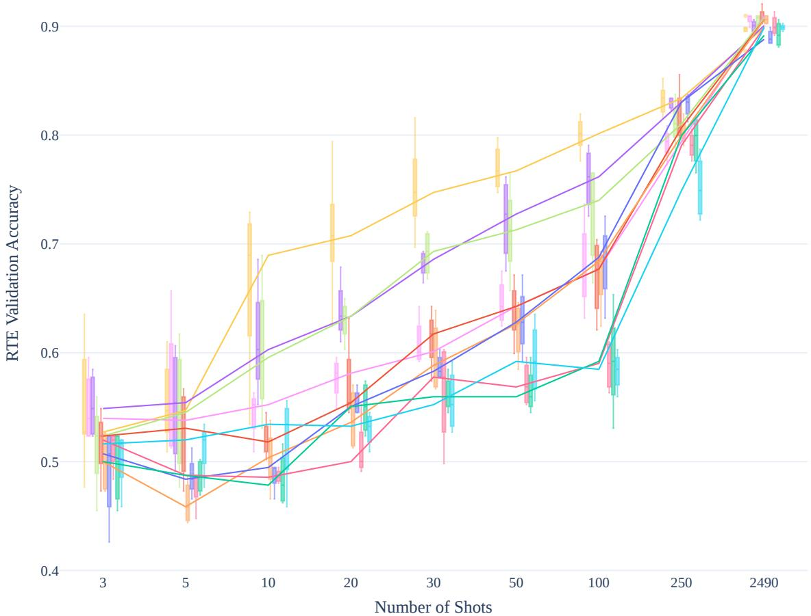  
Figure 30: The best-performing misleading prompt for ALBERT, {premise} Does the paragraph start with "the"? [mask] "{hypothesis}" with all LM targets.

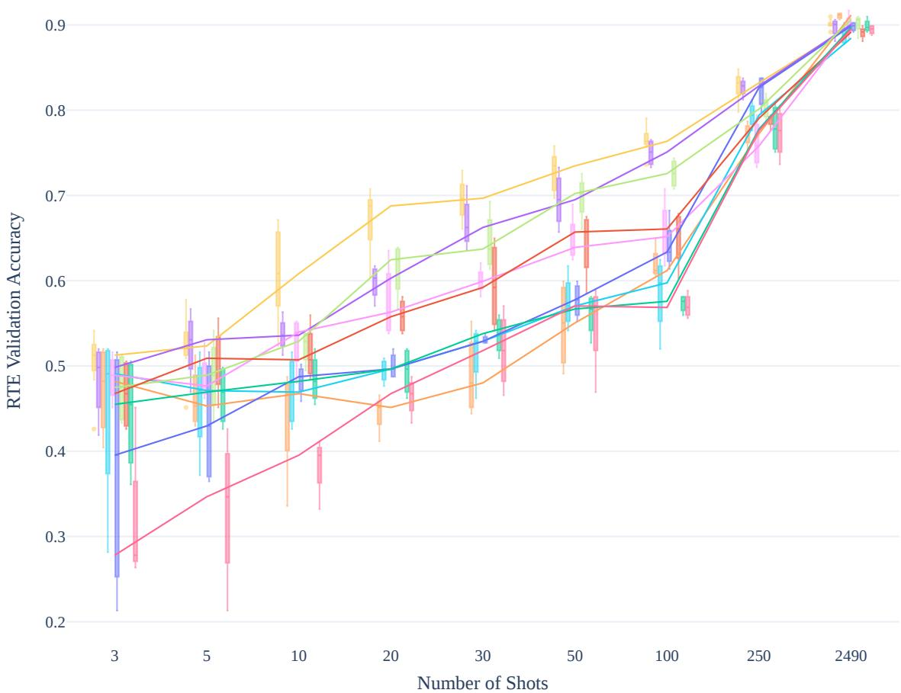  
Figure 31: The best-performing null prompt for ALBERT, {premise} [mask] "{hypothesis}" with all LM targets.

## K Preliminary Results on HANS

Template  irrelevant  intuitive  misleading  
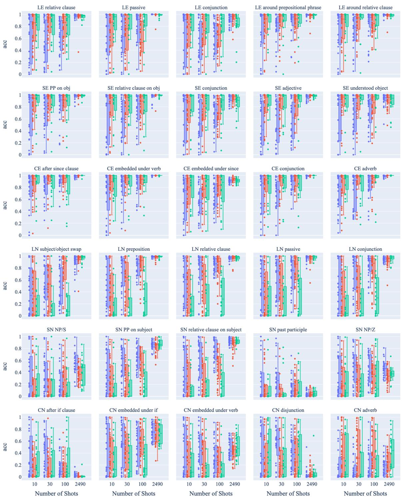  
Figure 32: Few-shot RTE-trained ALBERT’s zero-shot performance on HANS (McCoy et al., 2019). L = lexical, S = subsequence, C = constituency. E = true label is entailment. N = true label is non-entailment. Apologies but note the template category colors are different from those in the main text. “Intuitive” = instructive templates. In general, models perform similarly with instructive and irrelevant templates, but models with misleading templates fare worse, especially for lexical non-entailment cases (LN, fourth row). A full analysis will be furnished in a future version of this paper.

## L Preliminary Results on Winograd

<table><tr><td>category</td><td>template</td><td>accuracy</td></tr><tr><td>instructive</td><td> $\mathrm { I s } \ ^ { \cdots } \{ \mathrm { p r o n o u n } \} ^ { \prime \prime }$  the same as {referent}? Yes or No?</td><td>0.6538</td></tr><tr><td>instructive</td><td> $\mathrm { { D o e s } } \ ^ { \cdots } \{ \mathrm { { p r o n o u n } } \} ^ { \prime \prime }$  refer to {referent}? Yes or No?</td><td>0.6731</td></tr><tr><td>instructive</td><td> $\mathrm { I s \ ^ { * * } \{ p r o n o u n \} " \ \{ r e f e r e n t \} ? \ Y e s \ o r \ N o ? }$ </td><td>0.5385</td></tr><tr><td>instructive</td><td> $\mathrm { { S h o u l d \cdots } \{ p r o n o u n \} ^ { \prime \prime } }$  be {referent}? Yes or No?</td><td>0.5962</td></tr><tr><td>instructive</td><td> $\mathrm { { D o e s \ ^ { * * } \{ p r o n o u n \} ^ { * } \ m e a n \ \{ r e f e r e n t \} ^ { \gamma } \ Y e s \ o r \ N o ? } }$ </td><td>0.6442</td></tr><tr><td>instructive</td><td> $\mathrm { I s } ^ { \ast \ast } \{ \mathrm { p r o n o u n } \} ^ { \ast }$  equivalent to {referent}? Yes or No?</td><td>0.6058</td></tr><tr><td>instructive</td><td> $\mathrm { { D o e s } } \ ^ { \cdots } \{ \mathrm { { p r o n o u n } } \} ^ { \prime \prime }$  stand for {referent}? Yes or No?</td><td>0.6346</td></tr><tr><td>instructive</td><td>Can the pronoun “{pronoun}&quot; be replaced with {referent}? Yes or No?</td><td>0.6250</td></tr><tr><td>misleading-extreme</td><td>Did “{pronoun}&quot; eat cakes with {referent}? Yes or No?</td><td>0.6346</td></tr><tr><td>misleading-extreme</td><td> $\mathrm { I s } \ ^ { \cdots } \{ \mathrm { p r o n o u n } \} ^ { \prime \prime }$  mother of {referent}? Yes or No?</td><td>0.6346</td></tr><tr><td>misleading-extreme</td><td> $\mathrm { W a s \ ^ { \cdots } \{ p r o n o u n \} ^ { \prime \prime } }$  friend to {referent}? Yes or No?</td><td>0.6058</td></tr><tr><td>misleading-extreme</td><td> $\mathrm { D i d } \ ^ { \cdots } \{ \mathrm { p r o n o u n } \} ^ { \cdots }$  marry {referent}? Yes or No?</td><td>0.6346</td></tr><tr><td>misleading-extreme</td><td> $\mathrm { C a n \ ^ { \cdots } \{ p r o n o u n \} ^ { \prime \prime } }$  rent a car with {referent}? Yes or No?</td><td>0.6346</td></tr><tr><td>misleading-extreme</td><td> $\mathrm { { S h o u l d \cdots } \{ p r o n o u n \} ^ { \prime \prime } }$  be brother of {referent}? Yes or No?</td><td>0.6346</td></tr><tr><td>misleading-extreme</td><td> $\mathrm { D i d } \ ^ { \cdots } \{ \mathrm { p r o n o u n } \} ^ { \cdots }$  speak to {referent}? Yes or No?</td><td>0.5673</td></tr><tr><td>misleading-extreme</td><td> $\mathrm { I s } \ ^ { \cdots } \{ \mathrm { p r o n o u n } \} ^ { \prime \prime }$  cousins with {referent}? Yes or No?</td><td>0.6154</td></tr></table>

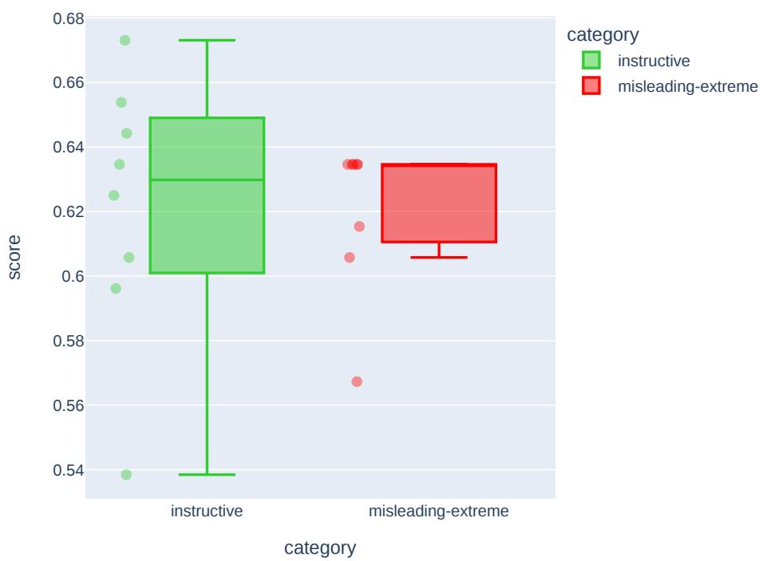  
Figure 33: Zero-shot accuracy of T0 on Winograd Schema Challenge (Levesque et al., 2012; SuperGLUE version). We find no statistically significant difference between instructive and misleading-extreme templates.