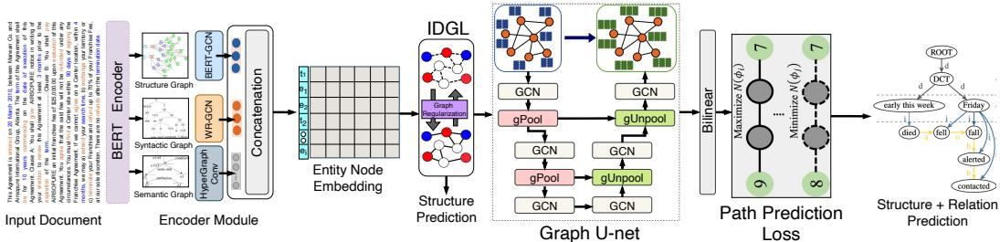
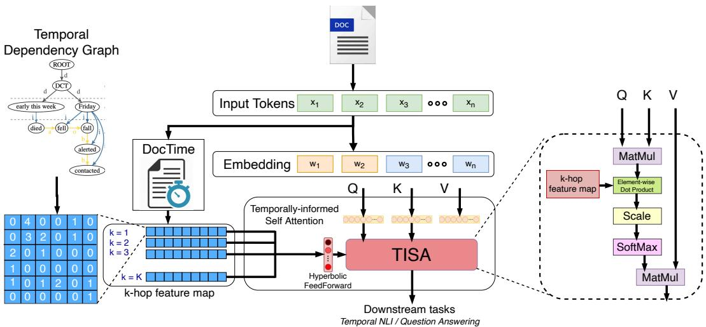
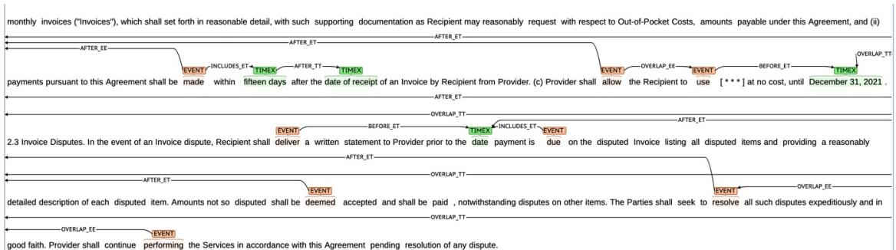
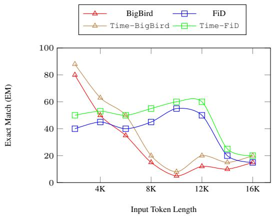

# DocTime: A Document-level Temporal Dependency Graph Parser

Puneet Mathur‡, Vlad I Morariu†, Verena Kaynig-Fittkau†, Jiuxiang Gu†, Franck Dernoncourt†, Quan Hung Tran†, Ani Nenkova†,Dinesh Manocha‡, Rajiv Jain†

University of Maryland, College Park

Adobe Research

‡{puneetm,dmanocha}@umd.edu

‡{morariu,kaynigfi,jigu,dernonco}@adobe.com ‡{qtran,nenkova,rajijain}@adobe.com

## Abstract

We introduce DocTime - a novel temporal dependency graph (TDG) parser that takes as input a text document and produces a temporal dependency graph. It outperforms previous BERT based solutions by a relative 4-8% on three datasets from modeling the problem as a graph-network with path-prediction loss to incorporate longer range dependencies. This work also demonstrates how the TDG graph can be used to improve the downstream tasks of temporal questions answering and NLI by a relative 4-10% with a new framework that incorporates the temporal dependency graph into the self-attention layer of Transformer models (Time-transformer). Finally, we develop and evaluate on a new temporal dependency graph dataset for the domain of contractual documents, which has not been previously explored in this setting.

## 1 Introduction

Understanding the temporal relations between events mentioned in a document is an important natural language task with applications in downstream tasks such as timeline creation (Leeuwenberg and Moens, 2018), time-aware summarization (Noh et al., 2020), temporal question-answering (Ning et al., 2020a), and temporal information extraction (Leeuwenberg and Moens, 2019). This area of research remains important yet challenging due to several limitations such as confounded modalities (eg. events that are certain to happen vs the ones that might happen), event ambiguity (eg. agreeing to terms of a contract vs signing a contract) and need for complete annotation of all event pairs for precise temporal localization (Yao et al., 2020a).

Early work densely annotated all pairs of events to address this problem (Cassidy et al., 2014), but was limited to short passages or adjacent sentences due to the n2 complexity of the task, especially for long documents. Recently this problem formulation was significantly simplified using temporal dependency trees (TDT) (Zhang and Xue, 2019) and temporal dependency graphs (TDG) (Yao et al., 2020a) by only capturing the reference TIMEX or event to build a dependency graph to capture this information. This enabled the development of temporal dependency parsers (Zhang and Xue, 2018a; Ross et al., 2020a) to infer temporal relationships more robustly and efficiently.

We introduce DocTime - a state-of-the-art temporal dependency parser that parses document-level text to produce temporal dependency graphs. Unlike previous approaches using contextual features such as BERT(Ross et al., 2020b), our model utilizes a graph network and a novel path prediction loss to reason over long-range multi-hop dependencies while maintaining global consistency of temporal ordering of inter-dependent events.

To validate the utility of DocTime and our generated temporal dependency graph, we go one step further than prior work and explore the question of whether temporal dependency graphs are useful for downstream tasks by introducing Time-Transformer. It is a framework to incorporate temporal dependency graphs into existing transformer-based architectures without retraining from scratch. We demonstrate the usefulness of our proposed Time-Transformer on temporal NLI (Vashishtha et al., 2020) and time-sensitive question answering (Chen et al., 2021) tasks.

Prior work on temporal relationship extraction and temporal dependency parsing have been mostly limited to news (Zhang and Xue, 2019; Yao et al., 2020a; Pustejovsky et al., 2003a), narrative stories (Zhang and Xue, 2018b; Kolomiyets et al., 2012) or clinical notes (Bethard et al., 2016). In addition to experimenting with existing temporal dependency parsing datasets, we introduce a dataset for temporal dependency graphs in a new domain - contractual documents, where temporal reasoning over events has real world legal and monetary implications for users.

  
Figure 1: DocTime encodes rich token level embeddings from input document using structural, syntactic, and semantic graphs through BERT-GCN, WR-GCN and HyperGraph Conv layers, respectively. Token-level features are concatenated and passed through Iterative Deep Graph Learning (IDGL) to learn a noisy dependency structure over the TIMEX and Event entities. Graph U-net allows the model to incorporate longer range dependencies for predicting the final temporal dependency graph structure and relationships. The model is trained with a novel auxiliary path prediction loss to learn multi-hop connections in TDG.

Our main contributions include:

• A novel document-level temporal dependency parser (DocTime) that predicts the temporal dependency graph from text in an end-toend manner with a novel path prediction loss, which outperforms the current SOTA by a relative 4-8% on three datasets.

• Time-Transformer, a novel framework to incorporate Temporal Dependency Graphs into transformer models for downstream tasks without needing to retrain from scratch. Results on natural language inference and question answering with a new self-attention module show a relative 4%-10% improvement.

• Development of new document-level (>1500 words) TDG dataset in the domain of contractual documents (ContractTDG1).

## 2 Related Work

Temporal Dependency Parsing: Previous work has been devoted to pairwise classification of relations between events and time expressions, notably TimeBank (Pustejovsky et al., 2003b) and its extensions like Cassidy et al. (2014) annotated all relations. Pair-wise annotation have multiple problems including polynomial square complexity, global inconsistencies in predictions due to relation transitivity and forced annotation of vague relations (Ning et al., 2018). Prior work focuses on extracting temporal relations between event pairs in the same sentence or adjacent sentences (Goyal and Durrett, 2019; Ning et al., 2019a; Han et al., 2019a,c,b, 2020; Ballesteros et al., 2020; Zhao et al., 2020). TIMERS Mathur et al. (2021a) presented temporal relation extraction in long document.

Temporal Dependency Parsing (TDP): Temporal dependency trees were first proposed by Kolomiyets et al. (2012). (Zhang and Xue, 2018b) provided the the earliest TDT corpus on news data and narrative stories, (Zhang and Xue, 2019) released the first English TDT corpus. Yao et al. (2020a) relaxed the assumption of single reference edge in dependency trees to form the improved TDG. (Zhang and Xue, 2018a) built an end-to-end neural temporal dependency parser using BiLSTM and Ross et al. (2020b) improved it further incorporating BERT. Our approach improves by modeling complex dependencies and introduces a new resource for TDG in contracts.

Linguistically-aware Transformers: Recent works have investigated using linguistic features as a prior for Transformer models. Syntax-bert (Bai et al., 2021a) uses syntactic and constituency dependency on NLI and GLUE benchmarks. Coref-BERT Coreference-Informed Transformer (Liu et al., 2021) performs coreference-aware dialogue summarization. Temporal reasoning about event ordering can find applications in many tasks such as summarization (Noh et al., 2020), question answering (Chen et al., 2021; Ning et al., 2020b; Jin et al., 2020), commonsense reasoning (Qin et al., 2021), and natural language inference (Vashishtha et al., 2020). We propose to use TDG as priors to Transformer models to make them temporally-aware for use in downstream tasks.

## 3 DocTime: Document TDG Parsing

Task Formulation: Let document D be defined as a sequence of n tokens $[ x _ { 1 } , \cdots , x _ { n } ]$ . The entire document can be seen as sequence of m sentences $[ s _ { 1 } , \cdots , s _ { m } ]$ . Each document has a set of p events $E = [ e _ { 1 } , \cdots , e _ { p } ]$ and q timexes $T = [ t _ { 1 } , \cdots , t _ { q } ]$ where $p , q \ \leq \ n .$ . The creation date of the document is represented by timestamp $t _ { D C T }$ Yao et al. (2020a) defines a temporal dependency graph (TDG) where each timex node always has a reference timex, which is the most specific narrative time related to the event (Pustejovsky and Stubbs, 2011). If such a narrative time is not available, the timex should be anchored to the DCT. An event node can either have a reference timex or be connected to a reference event, which is an event that provides the most specific temporal location. The task of temporal dependency graph parsing of a text document D results in a dependency graph $G = ( C , V )$ , where $C$ represents the set of all events, timexes and the document creation date (DCT). V is the set of all edges in the graph, where each edge represents a temporal relationship between corresponding entity node pair $V = \{ ( t _ { i } , t _ { j } ) , ( e _ { i } , e _ { j } ) , ( e _ { i } , t _ { j } ) \} \forall i , j \in C$

Model Overview: Figure 1 shows an overview of our network architecture for temporal dependency parsing. We first extract token level BERT features from the input document, which are then enriched by three graph networks that encode structural, syntactic, and semantic relationships. This is followed by Iterative Deep Graph Learning over the TIMEX and Event entities to learn an initial dependency structure. This is passed through a Graph U-net to allow the model to incorporate longer range dependencies before predicting the final temporal dependency graph and relationships. The model is also trained with a novel auxiliary path prediction loss.

## 3.1 Feature Encoding

We leverage the pre-trained BERT language model to obtain the embeddings for each token as follows: $w _ { 1 } , w _ { 2 } , \cdot \cdot \cdot , w _ { n } = \mathrm { \bf B E R T } ( [ x _ { 1 } , x _ { 2 } , \cdot \cdot \cdot , x _ { n } ] )$ where $w _ { i }$ is the embedding of the token $x _ { i }$ . As document sequence lengths can be larger than 512, we use a sliding window encoding technique to encode whole documents. We average the embeddings of overlapping tokens of different windows to obtain the final representations. These token representations are enriched with slightly enhanced variants of the structural $( G _ { s t r } )$ , syntactic $( G _ { s y n } )$ and semantic $( G _ { s e m } )$ graphs utilized by (Mathur et al., 2021b) for document-level temporal relationship extraction. The key differences are the use of BERT-GCN (Lin et al., 2021) to combine contextual and structural graph features, the addition of co-reference relationships to the syntactic graph, and the use of a hypergraph convolution (Bai et al., 2021b) to allow for token level features in the semantic graph . All aspects of these features and the changes are presented in Appendix B.

## 3.2 Temporal Dependency Prediction

We combine the learned representation for each entity node (timex, event, DCT) by concatenating the node embeddings learned from structural, syntactical and semantic graphs to obtain a D-dimensional feature vector for each of z entities in the document given by $\mathbf { F } ( w _ { i } ) = g _ { i } ^ { s t r } \oplus g _ { i } ^ { s y n } \oplus g _ { i } ^ { s e m }$ , where $\bigoplus$ represents concatenation. We retain only the enriched node embeddings for each word. We then utilize Iterative Deep Graph Learning $( { \mathrm { I D G L } } ) ^ { 2 }$ (Chen et al., 2020) to dynamically learn an initial dependency graph structure from the combined node embeddings. Given a noisy graph input feature matrix $\mathbf { F } \in R ^ { l * D }$ , IDGL produces an implicitly learned graph structure $G ^ { * } = \{ A ^ { * } , \mathbf { F } , F _ { l } \}$ with a jointly refined corresponding graph node embeddings $\mathbf { F ^ { \prime } }$ with adjacency matrix $A ^ { * }$ by optimizing with respect to downstream link prediction task $\boldsymbol { { F } } _ { l }$ between entity nodes.

3.2.1 Graph U-net For Higher Level Features The Graph U-net (Gao and Ji, 2019) is a U-shaped graph encoder-decoder architecture containing two down-sampling graph pooling (gPool) layers and two up-sampling graph unpooling (gUnpool) layers with skip connections. gPool layers reduce the size of the graph to encode higher-order features, while the gUnpool layer restores the graph into its higher resolution structure, thereby promoting information exchange between entity pairs through an enlarged receptive field. Each graph pooling and unpooling layer is followed by a GCN layer to implicitly capture the topological information in the input graph. Taking the dynamically learned graph structure $G ^ { * }$ , a graph embedding layer converts input node features $\mathbf { F ^ { \prime } }$ into low-dimensional representations that are then passed through a graph U-net encoder-decoder ℧ to acquire entity-level relation matrix $\mathbf { Y } = \Im ( \mathbf { F } ^ { \prime } ) , \mathbf { Y } \in \bar { R } ^ { l * l * D ^ { \prime } }$

## 3.2.2 Temporal Dependency Link Prediction and Relation Classification

Given entity adjacency matrix $A ^ { * }$ and entity-level relation matrix Y, we use a bilinear function to map them to link and relation probabilities $\mathbf { Z } _ { l }$ and $\mathbf { Z } _ { r }$ , respectively. Formally, we have ${ \bf Z } _ { l } { \bf \Psi } =$ $\sigma ( { \bf Y } W _ { l } { \bf Y } + b _ { l } )$ and $\mathbf { Z } _ { r } = \sigma ( A ^ { * } W _ { r } A ^ { * } + b _ { r } )$ , where

  
Figure 2: Time-Transformer is a variant of pre-trained Transformer models that augments temporal knowledge into the self-attention layer during fine-tuning of the Transformer model on different downstream tasks. Input text is converted into a temporal dependency graph using DocTime parser. The graph is then converted into a set of masks that encodes the temporal relationship between each token (i.e. After, Before) using the novel Temporally- informed Self-Attention (TISA). TISA creates K masks to represent the (k)-hop distance between two nodes in TDG for aggregating information across longer ranges in the input. TISA uses hyperbolic feed-forward layer to learn the mask weights.

$W _ { l } , W _ { r } , b _ { l } , b _ { r } \ \in \ R ^ { D ^ { \prime } * D ^ { \prime } }$ represent learnable parameters. This is followed by a Softmax layer for link prediction and relations classification.

## 3.3 Training DocTime

Path Reconstruction Loss: In a document-level temporal parsing setup, the majority of node pairs may not have any ground truth link or temporal relation. Graph representation learning methods universally model relations between all entity pairs regardless of whether the entity pair has any relationship, leading to dispersion of attention in learning most non-existent edge connections. We propose path reconstruction loss $L _ { p a t h } .$ , which forces the model to pay more attention to learn entity pairs with relationships rather than ones without relationships. Equation 1 gives the cross entropy loss over all direct edge connection between all pairs of entities, where $r _ { j } ^ { i }$ indicates the relation between the entity pair and $\dot { P } ( r _ { j } ^ { i } )$ is probability of relation label r. Path reconstruction loss $L _ { p a t h }$ modifies the cross entropy loss $L _ { c e }$ function as shown in Equation 2 by sampling all $n ^ { 2 }$ entity pairs and maximizing the probability of the shortest dependency path $\mathcal { N } ( \phi )$ between the entity pair nodes. Finally, the path reconstruction loss and the existing classification loss are added as the training objective for DocTime, given by $L = L _ { p a t h } + L _ { c e }$

$$
\begin{array} { r l r }   { L _ { c e } = - \frac { 1 } { \sum _ { i = 0 } ^ { l } N _ { i } } \sum _ { i = 1 } ^ { l } \sum _ { j = 1 } ^ { N _ { i } } \{ r _ { j } ^ { i } \log P ( r _ { j } ^ { i } ) } \\ & { } & { + ( 1 - r _ { j } ^ { i } ) \log ( 1 - P ( r _ { j } ^ { i } ) ) \} } \end{array}\tag{1}
$$

$$
\begin{array} { r } { L _ { p a t h } = - \displaystyle \frac { 1 } { \sum _ { i = 0 } ^ { l } N _ { i } } \sum _ { i = 1 } ^ { l } \sum _ { j = 1 } ^ { N _ { i } } \{ r _ { j } ^ { i } \log \mathcal { N } ( \phi _ { i } ) } \\ { + \left( 1 - r _ { j } ^ { i } \right) \log ( 1 - \mathcal { N } ( \phi _ { i } ) ) \} } \end{array}\tag{2}
$$

Multi-task Training: Dependency link prediction and entity-level relation classification are correlated tasks and reinforce each other. We use multitask training to optimize both tasks simultaneously using the path prediction cross entropy loss. The final optimization uses a weighted sum of the dependency link prediction loss and entity-level relation classification loss $L = \lambda L _ { l } + ( 1 - \lambda ) L _ { r }$ , where the weighting factor λ is a hyperparameter.

## 4 Time-Transformer

We would also like to understand our temporal dependency parsing can be useful for downstream tasks requiring temporal reasoning. Here we introduce the Time-Transformer, which allow a TDG generated by DocTime to be combined with stateof-the-art transformer models for temporal tasks. The Time-Transformer augments the flow of information in a Transformer network via a temporallyinformed self-attention mechanism. We first formulate the Time-Transformer architecture in §4 and then construct of temporally-informed attention layers in §4.

Architecture: Time-Transformer was motivated by recent work incorporating syntax (Bai et al., 2021a) or co-reference graphs(Liu et al., 2021) into the transformer architecture to improve downstream tasks. In each case, these approaches encode additional knowledge from the sparse graphs as a masked self attention layer into the transformer. Figure 2 shows the architecture of Time-Transformer incorporating temporal knowledge into the self-attention layer during finetuning of the Transformer model. Input text is converted into a temporal dependency graph using DocTime parser. The graph is then converted into a set of masks that encodes the temporal relationship between each entity (i.e. After) explained in more detail in the next section: Temporally-informed Self-Attention. The input embedding (token+positional+attention masks) is passed through the Time-Transformer model which modifies the self-attention layer of the standard Transformer architecture with a temporallyinformed self-attention layer to be fine-tuned on downstream tasks.

TISA: Temporally-informed Self-Attention : The TDG produced by DocTime is sparse and to effectively utilize the graph extracted by the temporal dependency parser for longer range temporal relationships, we utilize K self-attention layers that encode the temporal relationship if traversing K hops in the TDG as shown in 2. More formally starting from node A, the minimum number of hops (k) required to reach another node B can be regarded as k-hop distance between A and B, written as k-hop(A, B). We create K masks to represent the (k)-hop distance between two nodes to allow the model to aggregate information across longer ranges in the TDG. Specifically, a mask $M \in \{ 0 , 1 , 2 , \cdots , r \} ^ { n \times n }$ denotes if there is a relation between entity i and j, and n is the number of tokens in the input text. The value of the mask is the relationship type for i and j. It is found by inferring the relationship using Allen’s interval algebra (Allen, 1983) and is set to 0 if there is no relationship or set to "Overlap" if there is a conflict. We adopt a soft-mask learning strategy to enable the self-attention layer to re-weight the importance of each mask and avoid the problem of vanishing gradient. A hyperbolic feed-forward layer is used to learn the mask weights as research has shown it can avoid distortion of the feature space in graph representations (Ganea et al., 2018). The value of K is a hyperparameter that can be customized according to the nature of input dependency graph. Training Time-Transformer: For each dataset, we optimize the hyper-parameters of Time-Transformer through grid search on the validation data. In all our experiments, we limit the maximum value of k-hop to 15. Detailed settings can be found in the appendix.

## 5 Experiment

## 5.1 Temporal Graph Parsing Datasets

We train and evaluate DocTime on three datasets. First is the Temporal Dependency Graphs (TDG) dataset (Yao et al., 2020a) made up of 500 Wikinews articles annotated with document-level temporal dependency graphs. Second is the Temporal Dependency Trees (TDT) dataset Zhang and Xue (2019) made from 183 documents derived from TimeBank (Pustejovsky et al., 2003a) annotated with a temporal dependency tree structure. The third dataset we created as part of this paper and is describe in more detail below.

Contract-TDG: Understanding the temporal relationship of events in contracts is an important business problem, where understanding event timelines can have legal and monetary consequences. Previous work on temporal relationships has largely focused on clinical, news or narrative text , whereas to the best of our knowledge the contractual domain has not been explored for this problem. To construct this dataset, we used 100 contracts from the Atticus contracts dataset3 (Hendrycks et al., 2021), which were sourced from public domain SEC contracts. Due to the multi-page length of these documents, we limited the annotations to the first 1500 words. We did not include definition sections, since they did not contain many events of interest for this task. The documents have a 70-10-20 split for training, validation, and testing.

To obtain the TDG annotations required for our task, we followed the 5 steps procedure outlined by the original TDG dataset in (Yao et al., 2020b): (i) TIMEX Identification (TE), (ii) Identifying reference times for TE, (iii) Event identification, (iv) Identifying reference times for events, (v) Identifying reference events for events. Document Creation

  
Figure 3: Example of a temporal dependency graph from ContractTDG dataset annotated using Brat Tool.

<table><tr><td>Dataset</td><td>Docs</td><td>Timex</td><td>Events</td><td>Rels</td></tr><tr><td>TimeBank (Pustejovsky et al., 2003b)</td><td>183</td><td>1,414</td><td>7,935</td><td>6,148</td></tr><tr><td>TB-Dense (Cassidy et al., 2014)</td><td>36</td><td>289</td><td>1,729</td><td>12,715</td></tr><tr><td>MATRES (Ning et al., 2019b)</td><td>275</td><td></td><td>1,790</td><td>13,577</td></tr><tr><td>TDT-Crd (Zhang and Xue, 2019)</td><td>183</td><td>1,414</td><td>2,691</td><td>4,105</td></tr><tr><td>TDG (Yao et al., 2020a)</td><td>500</td><td>2,485</td><td>14,974</td><td>28,350</td></tr><tr><td>Contract-TDG) (Ours)</td><td>100</td><td>2354</td><td>11,752</td><td>12,909</td></tr></table>

Table 1: Comparison of ContractTDG data statistics to other temporal relation datasets. ContractTDG has fewer documents but comparable number of TIMEX/Events/relations.
<table><tr><td rowspan=1 colspan=1>Task</td><td rowspan=1 colspan=1>TDG(F1)</td><td rowspan=1 colspan=1>Contract TDG(F1)</td></tr><tr><td rowspan=1 colspan=1>1: TIMEX ID</td><td rowspan=1 colspan=1>0.96</td><td rowspan=1 colspan=1>0.93</td></tr><tr><td rowspan=1 colspan=1>2: TIMEX RT</td><td rowspan=1 colspan=1>0.89</td><td rowspan=1 colspan=1>0.81</td></tr><tr><td rowspan=1 colspan=1>3: Event ID</td><td rowspan=1 colspan=1>0.79</td><td rowspan=1 colspan=1>0.76</td></tr><tr><td rowspan=1 colspan=1>4: RT ID (U)</td><td rowspan=1 colspan=1>0.67</td><td rowspan=1 colspan=1>0.83</td></tr><tr><td rowspan=1 colspan=1>4: RT ID (L)</td><td rowspan=1 colspan=1>0.61</td><td rowspan=1 colspan=1>0.75</td></tr><tr><td rowspan=1 colspan=1>5: RE ID (U)</td><td rowspan=1 colspan=1>0.59</td><td rowspan=1 colspan=1>0.85</td></tr><tr><td rowspan=1 colspan=1>5: RE ID (L)</td><td rowspan=1 colspan=1>0.52</td><td rowspan=1 colspan=1>0.79</td></tr></table>

Table 2: Inter-Annotator Agreement (IAA) for the Contract-TDG and TDG dataset. U = structure, L = structure + labels

Times (DCT) were provided as effective dates in the ATTICUS corpus.

Similar to (Yao et al., 2020b) for tasks 1 (TE) and 3 (Event ID), we used the Mechanical Turk platform to obtain two annotations to validate text spans of noisy TIMEXes extracted by HeidelTime software4 (Strötgen and Gertz, 2013) and verbs that were possible events. Disagreements were resolved by an expert annotator. However, for the reference tasks, we decided against using Mechanical Turk due to the difficulty and length of the contracts as well as the lower agreement faced by the original TDG system for the last two tasks. We instead used the BRAT annotation tool5 (Stenetorp et al., 2012) with an expert annotator for tasks 2,4, and 5, following the (Yao et al., 2020b) guidelines . ContractTDG is annotated for four temporal relations - after, before, overlaps, and includes.

Table 1 compares the data statistics of the ContractTDG to previous temporal relationship and temporal dependency corpora. Even though this dataset has many fewer documents than the TDG dataset, it has a large number of TIMEX, Events, and Temporal relationships due to the document length. Table 2 reports the F1 IAA metrics for ContractTDG dataset to directly compare to the original TDG dataset. For Tasks 1 and 3 we report IAA F1 for the two crowd sourced worker annotations and for the relationship tagging tasks (2,4,5), we report IAA metrics calculated on the test postion (20% of the data) that was reviewed by two experts. The agreement is slightly lower for the TIMEX/Event identification tasks but higher for the three relationship tasks. We evaluate DocTime for dependency structure as well as structure+relation prediction for both development and test splits.

## 5.2 Time-Transformer Experiments for Downstream Tasks

We adopt Time-Transformer on BERT (Devlin et al., 2019), RoBERTa (Liu et al., 2019a), Big-Bird (Zaheer et al., 2020a) and FiD (Izacard and Grave, 2021) for evaluation on two downstream tasks in §6.2. We utilized the official checkpoint for each pre-trained language model as provided by respective authors. First, we test Time-BERT and Time-RoBERTa on Temporal NLI dataset, which consists of 5 sub-datasets (Vashishtha et al., 2020) to study the effect of temporal reasoning for predicting event ordering and duration. Second, we run experiments on the TimeQA dataset (Chen et al., 2021) to evaluate the performance of Time-BigBird and Time-FiD for the longdocument question-answering task. We report Exact Match (EM) and F1 scores as evaluation metrics on dev and test sets of easy and hard versions.

<table><tr><td rowspan="2"></td><td rowspan="2">System</td><td colspan="4">TD-Trees Structure-only Structure+Relation</td><td colspan="4">TD-Graphs Structure-only Structure+Relation</td><td colspan="4">ContractTDG Structure-only Structure+Relation</td></tr><tr><td>Dev</td><td>Test</td><td>Dev</td><td>Test</td><td>Dev</td><td>Test</td><td>Dev</td><td>Test</td><td>Dev</td><td>Test</td><td>Dev</td><td>Test</td></tr><tr><td rowspan="5">Baslines</td><td>Majority Baseline</td><td>0.43</td><td>0.42</td><td>0.15</td><td>0.18</td><td>0.62</td><td>0.68</td><td>0.41</td><td>0.51</td><td>0.36</td><td>0.35</td><td>0.36</td><td>0.33</td></tr><tr><td>Logistic Regression Baseline (Zhang and Xue, 2018a)</td><td>0.64</td><td>0.70</td><td>0.26</td><td>0.29</td><td>0.62</td><td>0.69</td><td>0.49</td><td>0.58</td><td>0.42</td><td>0.39</td><td>0.45</td><td>0.38</td></tr><tr><td>Neural Ranking Parser (BiLSTM) (Zhang and Xue, 2018a)</td><td>0.75</td><td>0.79</td><td>0.53</td><td>0.60</td><td>0.69</td><td>0.79</td><td>0.55</td><td>0.66</td><td>0.49</td><td>0.46</td><td>0.52</td><td>0.48</td></tr><tr><td>BERT Ranking Parser (Ross et al., 2020b)</td><td>0.77</td><td>0.83</td><td>0.59</td><td>0.68</td><td>0.71</td><td>0.80</td><td>0.62</td><td>0.71</td><td>0.67</td><td>0.65</td><td>0.62</td><td>0.61</td></tr><tr><td>DocTime (ours)</td><td>0.85*</td><td>0.86*</td><td>0.66*</td><td>0.72*</td><td>0.74*</td><td>0.85*</td><td>0.69*</td><td>0.77*</td><td>0.70*</td><td>0.69*</td><td>0.68*</td><td>0.64*</td></tr><tr><td rowspan="7">Ablaton</td><td>DocTime w\o Graph U-net</td><td>0.83</td><td>0.84</td><td>0.63</td><td>0.70</td><td>0.71</td><td>0.82</td><td>0.67</td><td>0.75</td><td>0.68</td><td>0.63</td><td>0.66</td><td>0.62</td></tr><tr><td>DocTime w\o Structure Graph</td><td>0.81</td><td>0.80</td><td>0.62</td><td>0.65</td><td>0.67</td><td>0.72</td><td>0.65</td><td>0.73</td><td>0.67</td><td>0.63</td><td>0.64</td><td>0.60</td></tr><tr><td>DocTime w\o Syntactic Graph</td><td>0.80</td><td>0.82</td><td>0.62</td><td>0.66</td><td>0.65</td><td>0.73</td><td>0.62</td><td>0.69</td><td>0.64</td><td>0.61</td><td>0.62</td><td>0.59</td></tr><tr><td>DocTime w\o Semantic Graph</td><td>0.76</td><td>0.78</td><td>0.55</td><td>0.65</td><td>0.62</td><td>0.70</td><td>0.60</td><td>0.67</td><td>0.59</td><td>0.57</td><td>0.59</td><td>0.57</td></tr><tr><td>DocTime w\ Graph Prediction</td><td>0.72</td><td>0.64</td><td>0.49</td><td>0.55</td><td>0.57</td><td>0.65</td><td>0.57</td><td>0.58</td><td>0.59</td><td>0.53</td><td>0.55</td><td>0.54</td></tr><tr><td>DocTime w\ Pairwise Link Prediction</td><td>0.82</td><td>0.83</td><td>0.63</td><td>0.69</td><td>0.72</td><td>0.83</td><td>0.66</td><td>0.73</td><td>0.65</td><td>0.60</td><td>0.62</td><td>0.60</td></tr><tr><td>DocTime w\ Path Prediction Loss</td><td>0.85</td><td>0.86</td><td>0.66</td><td>0.72</td><td>0.74</td><td>0.85</td><td>0.69</td><td>0.77</td><td>0.70</td><td>0.69</td><td>0.68</td><td>0.64</td></tr></table>

Table 3: Results comparing performance of DocTime with baselines and ablative components on TDT, TDG, ContractTDG datasets. We majority and logistic regression baselines from (Zhang and Xue, 2018a). \* indicates statistical significance over BERT Ranking Parser (Ross et al., 2020b) $( p \leq 0 . 0 0 5 )$ under Wilcoxon’s Signed Rank test. Darker green represents better F1 performance on ablation studies. Bold denotes the best performing model. DocTime improves substantially over all datasets for both dependency structure and structure+relation prediction tasks. The ablation shows that semantic graph features prove to be most beneficial. Our proposed path prediction loss is critical for state-of-the-art performance of DocTime model.

## 6 Results and Analysis

## 6.1 Temporal Graph Parsing

Performance of DocTime w.r.t. baselines: Table 3 compares the performance of DocTime against other baseline methods on TDT, TDG and ContractTDG. We also provide a majority baseline ContractTDG to evaluate whether the methods work better than a random label assignment as implemented in (Yao et al., 2020a). We also include the two current SOTA approaches for temporal dependency parsing: The BiLSTM attention-based Neural Ranking Parser proposed by (Zhang and Xue, 2018a) 6 and the BERT Ranking Parser (Ross et al., 2020b) on each dataset . We also report results for a logistic regression baseline proposed by (Zhang and Xue, 2018a). Results in Table 3 show that DocTime outperforms both Neural and BERT Ranking Parser by a significant margin on the TDT (2-4%) TDG (5-6%) and ContractTDG (3-4%) datasets. We believe its primarily because they formulate temporal dependency parsing as a ranking task designed to select the best reference event/timex for each node. However, TDG parsing requires the model to be able to reason over multiple dependencies originating from each node while maintaining global consistency of temporal ordering of inter-dependent events. We perform experiments for dependency structure prediction and structure+relation prediction and find that predicting labeled dependency edges is a much more challenging task across all datasets. DocTime achieves state-of-the-art performance on all three datasets (see bold), and shows that it can successfully handle document-level long-range dependencies in the challenging ContractTDG dataset from the 6-12% relative improvement over the BERT based ranking parser. A more detailed analysis of performance per temporal relationship type can be found in the Appendix, where largest gains are seen for event-event pairs.

<table><tr><td>Model</td><td>UDS-duration</td><td>UDS-order</td><td>TempEval3</td><td>TimeBank-Dense</td><td>RED</td></tr><tr><td>Majority</td><td>50.00</td><td>54.52</td><td>54.57</td><td>50.54</td><td>52.51</td></tr><tr><td>NBOW (Iyyer et al., 2015)</td><td>82.54</td><td>54.52</td><td>54.57</td><td>50.54</td><td>52.51</td></tr><tr><td>Infersent (Conneau et al., 2017)</td><td>92.65</td><td>73.22</td><td>62.20</td><td>68.29</td><td>63.47</td></tr><tr><td>RoBERTa (Liu et al., 2019b)</td><td>94.51</td><td>80.17</td><td>54.57</td><td>94.60</td><td>80.59</td></tr><tr><td>Time-RoBERTa (E)</td><td>95.78</td><td>82.03</td><td>60.66</td><td>95.45</td><td>82.10</td></tr><tr><td>Time-BERT</td><td>96.01</td><td>82.97</td><td>61.32</td><td>96.08</td><td>82.15</td></tr><tr><td>Time-RoBERTa</td><td>96.67</td><td>82.98</td><td>62.50</td><td>96.33</td><td>82.50</td></tr></table>

Table 4: Accuracy comparison on the Temporal NLI dataset test set. Time-RoBERTa fine-tuned by utlizing temporal dependencies extract from DocTime model pre-trained on TDG dataset outperform all baselines provided by (Vashishtha et al., 2020)(see bold).

Ablation Study of DocTime: To assess the contribution of structure and syntactic and semantic graph features, we performed ablation experiments as reported in Table 3 highlighted in red . We also analyzed the effect of different types of training loss. We observe that removing the semantic graph consistently degrades performance, indicating the need for hypergraph learning over temporal arguments and RST features to capture document-level discourse relations. We see that removing structure graph reduced the performance to below the BERT Ranking Parser, as DocTime leverages BERT’s contextual learning through a structural graph. Syntactic graph adds incremental value to DocTime due to its relational learning of syntactic dependencies within each sentence through relational GCN. We evaluated the model performance in case all edges of the TDG are used for one forward pass and call it ”Graph Prediction”. Training the model by evaluating a single edge in one pass (similar to temporal relation prediction in (Pustejovsky et al., 2003b) is referred to as ”Pairwise Prediction". We explore the impact of different training losses for the proposed model (Table 3, highlighted in green ). Learning DocTime by propagating losses over the entire document graph severely deteriorates model performance as the model has very limited training documents samples (182 for TDT, 400 for TDG, 80 for ContractTDG). Our proposed path prediction loss shows superior performance over pairwise link prediction as it jointly learns the relation label between a pair of nodes as well as the shortest dependency path linking them. As a result, the model can recover from structure prediction errors between nodes by learning an alternative path reconstructed through multi-hop connections.

<table><tr><td rowspan="3">Model</td><td colspan="4">Easy-mode</td><td colspan="4">Hard-mode</td></tr><tr><td colspan="2">Dev EM</td><td colspan="2">Test</td><td colspan="2">Dev</td><td colspan="2">Test</td></tr><tr><td>F1</td><td></td><td>EM</td><td>F1</td><td>EM F1</td><td></td><td>EM</td><td>F1</td></tr><tr><td colspan="9">FT on TimeQA</td></tr><tr><td>BigBird (Zaheer et al., 2020b)</td><td>16.4</td><td>27.5</td><td>16.3</td><td>27.1</td><td>11.4</td><td>20.6</td><td>11.9</td><td>20.3</td></tr><tr><td>Time-BigBird (E)</td><td>15.5</td><td>25.0</td><td>14.1</td><td>25.5</td><td>9.6</td><td>15.6</td><td>9.3</td><td>18.5</td></tr><tr><td>Time-BigBird</td><td>18.9</td><td>29.5</td><td>18.9</td><td>29.5</td><td>13.0</td><td>22.5</td><td>13.0</td><td>22.8</td></tr><tr><td>FiD (Izacard and Grave, 2020)</td><td>15.9</td><td>27.1</td><td>15.7</td><td>28.0</td><td>10.7</td><td>19.1</td><td>10.3</td><td>19.7</td></tr><tr><td>Time-FiD (E)</td><td>13.8</td><td>25.2</td><td>12.1</td><td>25.6</td><td>8.9</td><td>17.3</td><td>8.8</td><td>17.6</td></tr><tr><td>Time-FiD</td><td>17.5</td><td>29.3</td><td>18.1</td><td>30.3</td><td>12.5</td><td>22.2</td><td>12.5</td><td>21.5</td></tr><tr><td colspan="9">FT on TriviaQA</td></tr><tr><td>BigBird (Zaheer et al., 2020b)</td><td>33.4</td><td>42.5</td><td>33.7</td><td>43.0</td><td>27.7</td><td>35.9</td><td>27.7</td><td>36.2</td></tr><tr><td>Time-BigBird (E)</td><td>31.3</td><td>40.4</td><td>32.3</td><td>41.8</td><td>25.9</td><td>33.6</td><td>25.8</td><td>35.5</td></tr><tr><td>Time-BigBird</td><td>35.0</td><td>44.8</td><td>35.1</td><td>45.5</td><td>29.2</td><td>36.6</td><td>29.2</td><td>38.0</td></tr><tr><td colspan="9">FT on NQ + TimeQA</td></tr><tr><td>FiD (Izacard and Grave, 2020)</td><td>59.5</td><td>66.9</td><td>60.5</td><td>67.9</td><td>45.3</td><td>54.3</td><td>46.8</td><td>54.6</td></tr><tr><td>Temp-FiD (E)</td><td>57.9</td><td>65.6</td><td>58.5</td><td>65.2</td><td>41.1</td><td>52.6</td><td>44.5</td><td>52.8</td></tr><tr><td>Time-FiD</td><td>61.3</td><td>68.2</td><td>62.4</td><td>69.6</td><td>46.7</td><td>56.2</td><td>48.2</td><td>56.4</td></tr></table>

Table 5: Results comparing F1 score and exact match (EM) performance of Time-BigBird and Time-FiD for QA task on easy and hard sections of TimeQA dataset. We evaluate the Transformer models in 3 settings - fine-tune on TimeQA; fine-tune TriviaQA; and fine-tune on NQ then TimeQA. Green shows improvement due to our proposed Time-Transformer model, while we see degradation due to Euclidean variant of Time-Transformer (E)

## 6.2 Application of Temporal Dependency Parsing for downstream tasks

We train the DocTime model on the TDG corpus, which can be used to infer a temporal dependency graph from raw text samples. We extract events and timexes using CAEVO (Chambers et al., 2014) for all data samples in train,validate, and test. The temporal dependency graph acquired for each document is used as a prior for Time-Transformer to perform downstream tasks.

Performance of Time-Transformer on Temporal NLI: The temporal NLI task requires a model to identify the semantic relationship (entailed, not-entailed) between the context and corresponding hypothesis sentence based on temporal information from text. The temporal dependency graphs extracted using the DocTime trained on the TDG corpus are used as prior for Time-BERT for entailment classification. Table 4 shows the test accuracies of Time-BERT-large, Time-RoBERTa-large and other competitive baselines [(Iyyer et al., 2015),(Conneau et al., 2017)] reported by (Vashishtha et al., 2020). The temporal information prior proposed in Time-Transformer helps the BERT and RoBERTa models perform much better on the NLI task. The accuracy improved by 1.5-2.3 F1 points by applying our framework on the RoBERTa model across the five subsets. We observe the performance gain in the case of the Euclidean version of Time-RoBERTa to be modest as compared to its hyperbolic counterpart.

Performance of Time-Transformer on TimeQA: The TimeQA task focuses on understanding the time scope of facts in the long text followed by answering questions conditioned on the query and the document using implicit temporal information. We then apply the DocTime model output trained on the TDG corpus to the Time-Transformer framework on BigBird and FiD language models for long document question answering task. Following (Chen et al., 2021), we experiment with three variants of pre-trained settings: (1) fine-tuned on the TimeQA training set; (2) fine-tuned on NQ/TriviaQA data (3) fine-tuned on NQ/TriviaQA data and TimeQA.

Table 5 shows the effectiveness of Time-BigBird and Time-FiD in consistently outperforming their corresponding baselines in all three settings. More specifically, we see a realtive gain of 10-14% in F1 and exact match scores (EM) for both easy and hard sections of the dataset. It is impressive to note that the improvements due to the Time-BigBird and Time-FiD models are steady with different pre-training setups with the addition of only a few extra parameters to the baseline model. An important observation here is that the Euclidean versions of Time-BigBird and Time-FiD show persistent performance deterioration across all settings for TimeQA. We attribute this phenomenon to our initial hypothesis behind using hyperbolic operations in the proposed Temporally-informed self attention (TISA) layer. As the text length grows, the complexity of geometric operations increases, leading to vectorial distortions in Euclidean spaces (Ganea et al., 2018). This is remedied by hyperbolic transformations of masked self-attention learning in the proposed Time-Transformer.

Our experiments provide evidence that temporal dependency graphs extracted using DocTime and then utilized as a prior by temporallyinformed Transformer architectures such as Time-Transformer can improve the performance of several downstream tasks that require temporal reasoning at the sentence-level as well as at the document-level.

  
Figure 4: Impact analysis of long-distance dependencies on Transformer models for TimeQA task. Plot shows the exact match (EM) accuracy vs length of input document for hard samples. We use BigBird and FiD fine-tuned on NQ + TimeQA as backbone models. Time-BigBird and Time-FiD maintain steady improvement over baseline models even with increase in input lengths.

<table><tr><td rowspan="2">Corpus</td><td rowspan="2">Model</td><td colspan="3">Structure + Relation (F1)</td></tr><tr><td>te,te e,te 0.58</td><td>e,e</td><td>full</td></tr><tr><td rowspan="4">TD-Graphs</td><td>Heuristic Neural Ranking Parser (Zhang and Xue, 2018a)</td><td>0.82 0.93</td><td>0.34</td><td>0.51</td></tr><tr><td></td><td>0.66</td><td>0.58</td><td>0.66</td></tr><tr><td>BERT Ranking Parser (Ross et al., 2020b)</td><td>0.93 0.74</td><td>0.58</td><td>0.71</td></tr><tr><td>DocTime</td><td>0.96 0.75</td><td>0.72</td><td>0.77</td></tr><tr><td rowspan="4">Contract-TDG</td><td>Heuristic</td><td>0.45 0.36</td><td>0.18</td><td>0.33</td></tr><tr><td>Neural Ranking Parser (Zhang and Xue, 2018a)</td><td>0.57 0.45</td><td>0.29</td><td>0.48</td></tr><tr><td>BERT Ranking Parser (Ross et al., 2020b)</td><td>0.70 0.54</td><td>0.33</td><td>0.61</td></tr><tr><td>DocTime</td><td>0.75 0.56</td><td>0.39</td><td>0.64</td></tr></table>

Table 6: Performance (F1 score) of DocTime across timextimex, event-timex and event-event pairs for dependency structure+relation prediction on TDG and ContractTDG datasets. DocTime outperforms all baselines on every setting.

Impact of Long-term Dependency on Time-Transformer performance: We plot Fig. 4 to understand the capability of Transformer models to handle the long-term dependency in temporal reasoning on the TimeQA dataset. Plot shows the exact match (EM) accuracy vs length of the input document for hard samples. We use Big-Bird and FiD models fine-tuned on NQ + TimeQA as backbone models. BigBird’s performance degrades rapidly as the length increases to over 5000 tokens, while the FiD’s performance is quite uniformly distributed across different document lengths due to it’s strong capability to deal with long-term dependency. Time-BigBird and Time-FiD follow a similar trend and maintain steady improvements over their corresponding baseline models with increasing in input lengths.

Space complexity analysis: We choose RoBERTabase as the base model to analyze the space complexity. Liu et al. (2019b) reported the number of trainable parameters in RoBERTa-Base to be about 123 million. Time-RoBERTa introduces an additional 2 million parameters in total due to k-hop mask learning in the TISA layer. Therefore, Time-BERT adds few parameters to the base model without affecting its original space complexity.

Time Complexity analysis: We assume the number of tokens in each sentence to be n and extract khop mask matrices from a text document is $O ( n ^ { 2 } )$ in the online inference phase. The time complexity of the Transformer embedding lookup layer is $O ( n )$ . The TISA layer calculates the attention score in $O ( K D _ { q } n ^ { 2 } )$ for both $Q K ^ { T }$ and learns the mask weights using a hyperbolic feedforward layer $( M W ^ { M } )$ , where $D _ { q }$ is dimension of Q and K is the number of sub-networks. The time complexity of the Time-BERT remains the same for small enough value of k $( k \le 1 5$ in experiments).

## 7 Conclusion

We present DocTime, a new temporal dependency parsing approach that improves upon previous approaches by integrating longer term temporal information through a graph network with a novel path prediction loss. Additionally, we are able to show how a TDG can be incorporated into Transformer networks with Time-Transformer to improve on down stream tasks for NLI and question answering. Finally we introduce a TDG dataset in a new domain (Contractual documents) to expand research in this temporal reasoning to a new application domain. Future works will aim to explore more ways for integrating temporal dependency graphs into neural architectures across different application domains. In future, we would like to explore temporal event mining to aid various social media applications such as improving hate speech detection (Mathur et al., 2018b; Chopra et al., 2020), analyzing temporality in suicidal ideation detection (Mishra et al., 2019; Mathur et al., 2020) and abuse detection (Gautam et al., 2020; Sawhney et al., 2021). The proposed Time-Transformer can find applications in augmenting financial tasks (Sawhney et al., 2020), affective computing (Mittal et al., 2021), and AI for social good (Mathur et al., 2018a) with temporal common sense reasoning.

## References

Mohammed Aldawsari, Adrian Perez, Deya Banisakher, and Mark Finlayson. 2020. Distinguishing between foreground and background events in news. In Proceedings of the 28th International Conference on Computational Linguistics, pages 5171–5180.

James F Allen. 1983. Maintaining knowledge about temporal intervals. Communications of the ACM, 26(11):832–843.

Jiangang Bai, Yujing Wang, Yiren Chen, Yaming Yang, Jing Bai, Jing Yu, and Yunhai Tong. 2021a. Syntaxbert: Improving pre-trained transformers with syntax trees. arXiv preprint arXiv:2103.04350.

Song Bai, Feihu Zhang, and Philip HS Torr. 2021b. Hypergraph convolution and hypergraph attention. Pattern Recognition, 110:107637.

Miguel Ballesteros, Rishita Anubhai, Shuai Wang, Nima Pourdamghani, Yogarshi Vyas, Jie Ma, Parminder Bhatia, K. McKeown, and Yaser Al-Onaizan. 2020. Severing the edge between before and after: Neural architectures for temporal ordering of events. ArXiv, abs/2004.04295.

Steven Bethard, Guergana Savova, Wei-Te Chen, Leon Derczynski, James Pustejovsky, and Marc Verhagen. 2016. Semeval-2016 task 12: Clinical tempeval. In Proceedings ofthe 10th International Workshop on Semantic Evaluation (SemEval-2016), pages 1052– 1062.

Parminder Bhatia, Yangfeng Ji, and Jacob Eisenstein. 2015. Better document-level sentiment analysis from rst discourse parsing. arXiv preprint arXiv:1509.01599.

Taylor Cassidy, Bill McDowell, Nathanel Chambers, and Steven Bethard. 2014. An annotation framework for dense event ordering. Technical report, Carnegie-Mellon Univ Pittsburgh PA.

Nathanael Chambers, Taylor Cassidy, Bill McDowell, and Steven Bethard. 2014. Dense event ordering with a multi-pass architecture. Transactions of the Association for Computational Linguistics, 2:273– 284.

Wenhu Chen, Xinyi Wang, and William Yang Wang. 2021. A dataset for answering time-sensitive questions. ArXiv, abs/2108.06314.

Yu Chen, Lingfei Wu, and Mohammed Zaki. 2020. Iterative deep graph learning for graph neural networks: Better and robust node embeddings. Advances in Neural Information Processing Systems, 33.

Shivang Chopra, Ramit Sawhney, Puneet Mathur, and Rajiv Ratn Shah. 2020. Hindi-english hate speech detection: Author profiling, debiasing, and practical perspectives. In Proceedings of the AAAI Conference on Artificial Intelligence, volume 34, pages 386–393.

Alexis Conneau, Douwe Kiela, Holger Schwenk, Loic Barrault, and Antoine Bordes. 2017. Supervised learning of universal sentence representations from natural language inference data. arXiv preprint arXiv:1705.02364.

Jacob Devlin, Ming-Wei Chang, Kenton Lee, and Kristina Toutanova. 2019. Bert: Pre-training of deep bidirectional transformers for language understanding. ArXiv, abs/1810.04805.

Yifan Feng, Haoxuan You, Zizhao Zhang, Rongrong Ji, and Yue Gao. 2019. Hypergraph neural networks. In Proceedings ofthe AAAI Conference on Artificial Intelligence, volume 33, pages 3558–3565.

Octavian-Eugen Ganea, Gary Bécigneul, and Thomas Hofmann. 2018. Hyperbolic neural networks. arXiv preprint arXiv:1805.09112.

Hongyang Gao and Shuiwang Ji. 2019. Graph u-nets. In international conference on machine learning, pages 2083–2092. PMLR.

Akash Gautam, Puneet Mathur, Rakesh Gosangi, Debanjan Mahata, Ramit Sawhney, and Rajiv Ratn Shah. 2020. # metooma: Multi-aspect annotations of tweets related to the metoo movement. In Proceedings of the International AAAI Conference on Web and Social Media, volume 14, pages 209–216.

Tanya Goyal and Greg Durrett. 2019. Embedding time expressions for deep temporal ordering models. In ACL.

Rujun Han, I-Hung Hsu, Mu Yang, A. Galstyan, R. Weischedel, and Nanyun Peng. 2019a. Deep structured neural network for event temporal relation extraction. In CoNLL.

Rujun Han, Mengyue Liang, Bashar Alhafni, and Nanyun Peng. 2019b. Contextualized word embeddings enhanced event temporal relation extraction for story understanding. ArXiv, abs/1904.11942.

Rujun Han, Qiang Ning, and Nanyun Peng. 2019c. Joint event and temporal relation extraction with shared representations and structured prediction. In EMNLP/IJCNLP.

Rujun Han, Yichao Zhou, and Nanyun Peng. 2020. Domain knowledge empowered structured neural net for end-to-end event temporal relation extraction. ArXiv, abs/2009.07373.

Dan Hendrycks, Collin Burns, Anya Chen, and Spencer Ball. 2021. Cuad: An expert-annotated nlp dataset for legal contract review. arXiv preprint arXiv:2103.06268.

John Hewitt and Christopher D Manning. 2019. A structural probe for finding syntax in word representations. In Proceedings of the 2019 Conference of the North American Chapter of the Association for Computational Linguistics: Human Language Technologies, Volume 1 (Long and Short Papers), pages 4129–4138.

Mohit Iyyer, Varun Manjunatha, Jordan Boyd-Graber, and Hal Daumé III. 2015. Deep unordered composition rivals syntactic methods for text classification. In Proceedings of the 53rd annual meeting of the associationfor computational linguistics and the 7th international joint conference on natural language processing (volume 1: Long papers), pages 1681– 1691.

Gautier Izacard and Edouard Grave. 2020. Leveraging passage retrieval with generative models for open domain question answering. arXiv preprint arXiv:2007.01282.

Gautier Izacard and Edouard Grave. 2021. Leveraging passage retrieval with generative models for open domain question answering. In EACL.

Ganesh Jawahar, Benoît Sagot, and Djamé Seddah. 2019. What does bert learn about the structure of language? In ACL 2019-57th Annual Meeting of the Associationfor Computational Linguistics.

Woojeong Jin, Rahul Khanna, Suji Kim, Dong-Ho Lee, Fred Morstatter, Aram Galstyan, and Xiang Ren. 2020. Forecastqa: A question answering challenge for event forecasting with temporal text data. arXiv preprint arXiv:2005.00792.

Mandar Joshi, Danqi Chen, Yinhan Liu, Daniel S Weld, Luke Zettlemoyer, and Omer Levy. 2020. Spanbert: Improving pre-training by representing and predicting spans. Transactions ofthe Associationfor Computational Linguistics, 8:64–77.

Eliyahu Kiperwasser and Miguel Ballesteros. 2018. Scheduled multi-task learning: From syntax to translation. Transactions of the Association for Computational Linguistics, 6:225–240.

Thomas N Kipf and Max Welling. 2016. Semisupervised classification with graph convolutional networks. arXiv preprint arXiv:1609.02907.

Oleksandr Kolomiyets, Steven Bethard, and Marie Francine Moens. 2012. Extracting narrative timelines as temporal dependency structures. In Proceedings of the 50th Annual Meeting of the Associationfor Computational Linguistics (Volume 1: Long Papers), pages 88–97.

A. Leeuwenberg and Marie-Francine Moens. 2018. Temporal information extraction by predicting relative time-lines. ArXiv, abs/1808.09401.

A. Leeuwenberg and Marie-Francine Moens. 2019. A survey on temporal reasoning for temporal information extraction from text. ArXiv, abs/2005.06527.

Yuxiao Lin, Yuxian Meng, Xiaofei Sun, Qinghong Han, Kun Kuang, Jiwei Li, and Fei Wu. 2021. Bertgcn: Transductive text classification by combining gcn and bert. arXiv preprint arXiv:2105.05727.

Yinhan Liu, Myle Ott, Naman Goyal, Jingfei Du, Mandar Joshi, Danqi Chen, Omer Levy, Mike Lewis, Luke Zettlemoyer, and Veselin Stoyanov. 2019a. Roberta: A robustly optimized bert pretraining approach. ArXiv, abs/1907.11692.

Yinhan Liu, Myle Ott, Naman Goyal, Jingfei Du, Mandar Joshi, Danqi Chen, Omer Levy, Mike Lewis, Luke Zettlemoyer, and Veselin Stoyanov. 2019b. Roberta: A robustly optimized bert pretraining approach. arXiv preprint arXiv:1907.11692.

Zhengyuan Liu, Ke Shi, and Nancy F Chen. 2021. Coreference-aware dialogue summarization. arXiv preprint arXiv:2106.08556.

Puneet Mathur, Meghna Ayyar, Sahil Chopra, Simra Shahid, Laiba Mehnaz, and Rajiv Shah. 2018a. Identification of emergency blood donation request on twitter. In Proceedings of the 2018 EMNLP Workshop SMM4H: The 3rd Social Media Mining for Health Applications Workshop & Shared Task, pages 27–31.

Puneet Mathur, Rajiv Jain, Franck Dernoncourt, Vlad Morariu, Quan Hung Tran, and Dinesh Manocha. 2021a. TIMERS: Document-level temporal relation extraction. In Proceedings ofthe 59th Annual Meeting ofthe Associationfor Computational Linguistics and the 11th International Joint Conference on Natural Language Processing (Volume 2: Short Papers), pages 524–533, Online. Association for Computational Linguistics.

Puneet Mathur, Rajiv Jain, Franck Dernoncourt, Vlad Morariu, Quan Hung Tran, and Dinesh Manocha. 2021b. Timers: Document-level temporal relation extraction. In Proceedings ofthe 59th Annual Meeting ofthe Associationfor Computational Linguistics and the 11th International Joint Conference on Natural Language Processing (Volume 2: Short Papers), pages 524–533.

Puneet Mathur, Ramit Sawhney, Shivang Chopra, Maitree Leekha, and Rajiv Ratn Shah. 2020. Utilizing temporal psycholinguistic cues for suicidal intent estimation. In European Conference on Information Retrieval, pages 265–271. Springer.

Puneet Mathur, Rajiv Shah, Ramit Sawhney, and Debanjan Mahata. 2018b. Detecting offensive tweets in hindi-english code-switched language. In Proceedings ofthe Sixth International Workshop on Natural Language Processing for Social Media, pages 18–26.

Rohan Mishra, Pradyumn Prakhar Sinha, Ramit Sawhney, Debanjan Mahata, Puneet Mathur, and Rajiv Ratn Shah. 2019. Snap-batnet: Cascading author profiling and social network graphs for suicide ideation detection on social media. In Proceedings of the 2019 conference of the North American Chapter of the association for computational linguistics: student research workshop, pages 147–156.

Trisha Mittal, Puneet Mathur, Aniket Bera, and Dinesh Manocha. 2021. Affect2mm: Affective analysis of multimedia content using emotion causality. In Proceedings of the IEEE/CVF Conference on Computer Vision and Pattern Recognition, pages 5661–5671.

Qiang Ning, Sanjay Subramanian, and D. Roth. 2019a. An improved neural baseline for temporal relation extraction. In EMNLP/IJCNLP.

Qiang Ning, Sanjay Subramanian, and Dan Roth. 2019b. An improved neural baseline for temporal relation extraction. arXiv preprint arXiv:1909.00429.

Qiang Ning, Hao Wu, Rujun Han, Nanyun Peng, Matt Gardner, and Dan Roth. 2020a. Torque: A reading comprehension dataset of temporal ordering questions. In EMNLP.

Qiang Ning, Hao Wu, Rujun Han, Nanyun Peng, Matt Gardner, and Dan Roth. 2020b. Torque: A reading comprehension dataset of temporal ordering questions. arXiv preprint arXiv:2005.00242.

Qiang Ning, Hao Wu, and Dan Roth. 2018. A multiaxis annotation scheme for event temporal relations. In ACL.

Yunseok Noh, Yong-Min Shin, Junmo Park, A.-Yeong Kim, Su Jeong Choi, Hyun-Je Song, Seongbae Park, and Seyoung Park. 2020. Wire: An automated report generation system using topical and temporal summarization. Proceedings ofthe 43rd International ACM SIGIR Conference on Research and Development in Information Retrieval.

James Pustejovsky, Patrick Hanks, Roser Sauri, Andrew See, Robert Gaizauskas, Andrea Setzer, Dragomir Radev, Beth Sundheim, David Day, Lisa Ferro, et al. 2003a. The timebank corpus. In Corpus linguistics, volume 2003, page 40. Lancaster, UK.

James Pustejovsky, Patrick Hanks, Roser Saurí, Andrew See, Rob Gaizauskas, Andrea Setzer, Dragomir Radev, Beth Sundheim, David Day, Lisa Ferro, and Marcia Lazo. 2003b. The timebank corpus. Proceedings of Corpus Linguistics.

James Pustejovsky and Amber Stubbs. 2011. Increasing informativeness in temporal annotation. In Proceedings of the 5th Linguistic Annotation Workshop, pages 152–160.

Lianhui Qin, Aditya Gupta, Shyam Upadhyay, Luheng He, Yejin Choi, and Manaal Faruqui. 2021. Timedial: Temporal commonsense reasoning in dialog. arXiv preprint arXiv:2106.04571.

Nils Reimers and Iryna Gurevych. 2019. Sentence-BERT: Sentence embeddings using Siamese BERTnetworks. In Proceedings ofthe 2019 Conference on Empirical Methods in Natural Language Processing and the 9th International Joint Conference on Natural Language Processing (EMNLP-IJCNLP), pages 3982–3992, Hong Kong, China. Association for Computational Linguistics.

Hayley Ross, Jonathon Cai, and Bonan Min. 2020a. Exploring Contextualized Neural Language Models for Temporal Dependency Parsing. In Proceedings ofthe 2020 Conference on Empirical Methods in Natural Language Processing (EMNLP), pages 8548–8553, Online. Association for Computational Linguistics.

Hayley Ross, Jonathon Cai, and Bonan Min. 2020b. Exploring contextualized neural language models for temporal dependency parsing. arXiv preprint arXiv:2004.14577.

Ramit Sawhney, Puneet Mathur, Taru Jain, Akash Kumar Gautam, and Rajiv Shah. 2021. Multitask learning for emotionally analyzing sexual abuse disclosures. In Proceedings of the 2021 Conference of the North American Chapter of the Association for Computational Linguistics: Human Language Technologies, pages 4881–4892.

Ramit Sawhney, Puneet Mathur, Ayush Mangal, Piyush Khanna, Rajiv Ratn Shah, and Roger Zimmermann. 2020. Multimodal multi-task financial risk forecasting. In Proceedings ofthe 28th ACM international conference on multimedia, pages 456–465.

Ke Shi, Zhengyuan Liu, and Nancy F Chen. 2020. An end-to-end document-level neural discourse parser exploiting multi-granularity representations. arXiv preprint arXiv:2012.11169.

Pontus Stenetorp, Sampo Pyysalo, Goran Topic,´ Tomoko Ohta, Sophia Ananiadou, and Jun’ichi Tsujii. 2012. Brat: a web-based tool for nlp-assisted text annotation. In Proceedings of the Demonstrations at the 13th Conference of the European Chapter of the Association for Computational Linguistics, pages 102–107.

Jannik Strötgen and Michael Gertz. 2013. Multilingual and cross-domain temporal tagging. Language Resources and Evaluation, 47(2):269–298.

Siddharth Vashishtha, Adam Poliak, Yash Kumar Lal, Benjamin Van Durme, and Aaron Steven White. 2020. Temporal reasoning in natural language inference. In Findings of the Association for Computational Linguistics: EMNLP 2020, pages 4070–4078, Online. Association for Computational Linguistics.

Jiarui Yao, Haoling Qiu, Bonan Min, and Nianwen Xue. 2020a. Annotating temporal dependency graphs via crowdsourcing. In EMNLP.

Jiarui Yao, Haoling Qiu, Bonan Min, and Nianwen Xue. 2020b. Annotating Temporal Dependency Graphs via Crowdsourcing. In Proceedings ofthe 2020 Conference on Empirical Methods in Natural Language Processing (EMNLP), pages 5368–5380, Online. Association for Computational Linguistics.

Liang Yao, Chengsheng Mao, and Yuan Luo. 2019. Graph convolutional networks for text classification. In Proceedings of the AAAI conference on artificial intelligence, volume 33, pages 7370–7377.

Manzil Zaheer, Guru Guruganesh, Kumar Avinava Dubey, Joshua Ainslie, Chris Alberti, Santiago Ontañón, Philip Pham, Anirudh Ravula, Qifan Wang, Li Yang, and Amr Ahmed. 2020a. Big bird: Transformers for longer sequences. ArXiv, abs/2007.14062.

Manzil Zaheer, Guru Guruganesh, Kumar Avinava Dubey, Joshua Ainslie, Chris Alberti, Santiago Ontanon, Philip Pham, Anirudh Ravula, Qifan Wang, Li Yang, et al. 2020b. Big bird: Transformers for longer sequences. In NeurIPS.

Yuchen Zhang and Nianwen Xue. 2018a. Neural ranking models for temporal dependency structure parsing. arXiv preprint arXiv:1809.00370.

Yuchen Zhang and Nianwen Xue. 2018b. Structured interpretation of temporal relations. arXiv preprint arXiv:1808.07599.

Yuchen Zhang and Nianwen Xue. 2019. Acquiring structured temporal representation via crowdsourc ing: A feasibility study. In \*SEMEVAL.

Zhenyu Zhang, Bowen Yu, Xiaobo Shu, Tingwen Liu, Hengzhu Tang, Wang Yubin, and Li Guo. 2020. Document-level relation extraction with dual-tier heterogeneous graph. In Proceedings of the 28th International Conference on Computational Linguistics, pages 1630–1641.

Xinyu Zhao, Shih-ting Lin, and Greg Durrett. 2020. Effective distant supervision for temporal relation extraction. arXiv preprint arXiv:2010.12755.

## A Ethics Statement

We utilize two publicly available datasets - TDT and TDG for evaluating temporal dependency parser. We also curated dataset for TDG on contract documents. We source these contract documents from a publicly available resource - ATTICUS. We repurpose the document in this dataset for our task and provide new annotations. ContractTDG dataset does not violate any privacy as these documents are already in public domain. There is no human bias involved in such documents as they are business contracts filed on the SEC website. These documents do not restrict reuse for academic purposes and any personal information was already redacted before their original release. All documents and our experiments are restricted to English language. Temporal NLI and TimeQA datasets that are publicly available for research purposes. The crowd workers are paid a fair wage. There was no sensitive data involved in the studies.

## B Details on Graph Feature Extraction

## B.1 Structural Graph Features

The Structural Graph $( G _ { s t r } )$ enriches the token level features with a hierarchical textual structure formed by grouping word tokens into lists of sentences that bind together to form the text document. Prior work has shown that transductive graph learning over $G _ { s t r }$ can help learn the long range word-word dependencies set several sentences apart through hierarchical text modeling (Yao et al., 2019). The directed edges of the Structural Graph encode the following relationships: (1) Document-Sentence Affiliation, which connects each document-node to a sentencenode; (2) Sentence-Word Affiliation, which joins each sentence node to its constituent word nodes; (3) Sentence-Sentence Adjacency and (4) Word-Word Adjacency, which preserve sequential ordering for consecutive sentence and word nodes, respectively. For the structural graph, a sentence node embedding $s _ { i }$ is obtained by passing sentences through a pre-trained SentenceBERT model (Reimers and Gurevych, 2019) and the document node embedding D is calculated as the average of all sentence embeddings $\begin{array} { r } { ( D = \sum _ { i = 0 } ^ { m } v _ { i } ) } \end{array}$

BertGCN (Lin et al., 2021) combines the advantages of both large-scale pre-training and transductive learning. We input the structural graph $G _ { s t r }$ to BertGCN model7 where each node represents a word, a sentence or the document. BertGCN processes the input node feature matrix sequentially through a Bert model to fine-tune each node to learn local contextual representations. This is followed by passing the learned node feature matrix through two layers of graph convolution to take advantage of global influence propagation through graph edges across multi-hop nodes.

## B.2 Syntactic Graph Features

Syntactic cues are useful priors for learning based NLP tasks (Kiperwasser and Ballesteros, 2018). Pre-trained transformer models can capture certain syntactic information implicitly (Hewitt and Manning, 2019) but Jawahar et al. (2019) showed that BERT needs to be trained with deeper layers for handling harder cases involving long-distance dependency information. Moreover, past studies have pointed to the existence of multi-hop coreferring expressions in document-level text due to anaphora and cataphora (Joshi et al., 2020).

$G _ { s y n }$ is made of separate nodes to represent each constituent word $w _ { i }$ in the document. For each document, there is also a set of co-reference clusters $\{ \complement _ { 1 } , \complement _ { 2 } , \cdot \cdot \cdot , \complement _ { u } \}$ referring to the same entities in the graph. We define four types of directed edges in $G _ { s y n }$ as described below where $\xi$ denotes the set of syntactic dependency arcs inside sentences, $S _ { w _ { i } } ^ { r }$ denotes root of the sentence in which $w _ { i }$ belongs, and $S _ { w _ { i } }  S _ { w _ { j } }$ represents whether sentences containing words $w _ { i }$ and $w _ { j }$ are adjacent.

$$
\varepsilon _ { s y n } ( i , j ) = \left\{ \begin{array} { l l } { \mathrm { d e p e n d e n c y } } & { \mathrm { i f ~ } ( w _ { i } , w _ { j } ) \in \xi } \\ { \mathrm { r e v e r s i o n } } & { \mathrm { i f ~ } ( w _ { j } , w _ { i } ) \in \xi } \\ { \mathrm { c o r e f e r e n c e } } & { \mathrm { i f ~ } w _ { i } , w _ { j } \in \mathsf { L } _ { u } } \\ { \mathrm { s e l f - l o o p } } & { \mathrm { i f ~ } i = = j } \\ { \mathrm { r o o t - a d j a c e n c y } } & { \mathrm { i f ~ } w _ { i } = = S _ { w _ { i } } ^ { r } , } \\ & { \& \ w _ { j } = = S _ { w _ { j } } ^ { r } , } \\ & { \& \ S _ { w _ { i } } \to S _ { w _ { j } } } \end{array} \right.\tag{3}
$$

The first two edge types are introduced to allow information flow along and against syntactic arcs between intra-sentential dependency relations to enrich contextually learned embeddings of each word. We connect parse tree roots of adjacent sentences to encode document level long-range syntactic relatedness between sentences. We add an undirected edge between word nodes if both belong to the same co-reference cluster. Inspired by (Kipf and Welling, 2016), self-loop edges are added for better message passing iterations. $G _ { s y n }$ is instantiated as a gated variant of Weighted Relational Graph Convolutional Network (WR-GCN) (Zhang et al., 2020) with k-layers. WR-GCN can able to model diverse relations in a heterogeneous graph by treating different types of edges with unequal weights assigned during message passing.

## B.3 Semantic Graph Features

Semantic Role Labeling (SRL) parses text sequences to recognize the predicate-argument structure in the sentence to answer who did what and when. Anchoring verb events to their temporal argument spans extracted from semantic parsing helps infer event relationships with their associated time expressions. This can be complemented by discourse features in the form of RST connections can help leverage long-range documentlevel interactions between phrase units (Bhatia et al., 2015) and identify background-foreground events(Aldawsari et al., 2020) and improve temporal relationship parsing (Mathur et al., 2021b). We utilize Document-level Rhetorical Structure Theory (RST) parser (Shi et al., 2020) to organize contiguous semantic text spans of a document into a hierarchical dependency structure labeled with their rhetorical relations.

$G _ { s e m }$ consists of individual nodes for each constituent word $w _ { i }$ in the document. Discourse units and temporal arguments may span several word tokens $\{ w _ { 1 } , w _ { 2 } , \cdot \cdot \cdot w _ { k } \}$ . We add two types of directed edge connections between - (1) event verb predicate - temporal argument edge $\left( \varepsilon _ { t } \right)$ such that $( w _ { e } \to \{ w _ { 1 } , w _ { 2 } , \cdot \cdot \cdot w _ { k } \} \in \varepsilon _ { t } ) ; ( 2 )$ Rhetorical pair edges $( \varepsilon _ { d } )$ labelled by the type of the rhetorical relation $( \{ w _ { 1 } , w _ { 2 } , \cdot \cdot \cdot w _ { i } \}  \{ w _ { 1 } , w _ { 2 } , \cdot \cdot \cdot w _ { j } \} \in \varepsilon _ { d } )$

$$
\varepsilon = \left\{ \begin{array} { l l } { w _ { e } \to \{ w _ { e } , \cdot \cdot \cdot w _ { k } \} \in \varepsilon _ { t } } \\ { \{ w _ { 1 } , \cdot \cdot \cdot w _ { i } \} \to \{ w _ { 1 } , \cdot \cdot \cdot w _ { j } \} \in \varepsilon _ { d } } \end{array} \right.\tag{4}
$$

The nature of edge connections in $G _ { s e m }$ extends beyond pairwise interactions as each edge may connect to one or more word nodes. Hence, we formulate the semantic graph as a hypergraph (Feng et al., 2019) where an edge can join an arbitrary number of vertices. We construct $G _ { s e m } = ( \nu , \varepsilon , \mathbf { W } )$ where ν is the set of all word nodes $w _ { i } ,$ and ε is the subset of hyperedges such that $\varepsilon = \varepsilon _ { t } \cup \varepsilon _ { d } .$ Each hyperedge $e$ is assigned a positive weight corresponding to the type of edge relation and is stored in a diagonal matrix $\mathbf { W } \in \Re ^ { | \varepsilon | x | \varepsilon | }$ . The semantic graph is learned using hypergraph convolution layers (Bai et al., 2021b) to obtain discriminative node embeddings for each word node.

## C Training Setup

Hyperparameter: Hyper-parameters for DocTime were tuned on the respective validation set to find the best configurations for different datasets. We summarize the range of our model’s hyper parameters such as: number of hidden layers in WR-GCN/BERT-GCN/HyperGraphGCN 1, 2, 3 , size of hidden layers in WR-GCN/BERT-GCN/HyperGraphGCN 64, 128, 256, 512 , BERT embedding size (768), dropout $\delta \in \{ 0 . 2 , 0 . 3 , 0 . 4 , 0 . 5 . 0 . 6 \}$ , learning rate $\lambda \in \{ 1 e - 5 , 1 e - 4 , 1 e - 3 , 1 e - 2 , 1 e - 1 \}$ weight decay $\omega \in \{ 1 e - 6 , 1 e - 5 , 1 e - 4 , 1 e - 3 \}$ batch size $b \in \{ 1 6 , 3 2 , 6 4 \}$ and epochs ( 100), ϵ-sparsity $\in \ [ 0 , 1 ]$ , IDGL smoothness ratio=0.5, IDGL sparsity ratio=0.5, IDGL connectivity ratio=0.5, size of hidden layers in Graph U-net 64, 128, 256, 512 .

Loss Function and Inference: Time-Transformers are trained using Cross Entropy loss with Adam optimizer. Across both TempNLI and TimeQA datasets, we found the best results correspond with the use of Adam optimiser set with default values $\beta _ { 1 } { \mathrm { ~ \scriptsize ~ = ~ } } 0 . 9 ,$ $\beta _ { 2 } = 0 . 9 9 9 , \epsilon = 1 e - 8$ , weight-decay of $5 e - 4$ and an initial learning rate of 0.001.

DocTime uses cross entropy loss for structure prediction. For structure+relation classification, it uses the path prediction loss as defined in Methodology.

Computing Infrastructue: DocTime and Time-Tranformers are written in PyTorch library and were trained on 4 and 6 Nvidia GeForce RTX 2080 GPU, respectively. Average Runtime: DocTime takes a maximum of approximately 5 hrs to train once on TDG datasets. Time-BERT, Time-RoBERTa take 3 hrs to finetune on TempNLI. Time-BigBird, Time-FiD takes 8,12 hours to fine-tune, respectively.

## Dataset Access

Links to download TDT dataset: https://github.com/yuchenz/crowdsourced\_ EN\_TDT\_corpus

Link to download TDG dataset: https: //github.com/Jryao/temporal\_dependency\_ graphs\_crowdsourcing

Link to download Temporal NLI dataset: https: //github.com/sidsvash26/temporal\_nli Link to download TimeQA dataset: https://

<table><tr><td rowspan="2">Corpus</td><td rowspan="2">Model</td><td colspan="4">Structure + Relation (F1)</td></tr><tr><td>te,te</td><td>e,te</td><td>e,e</td><td>full</td></tr><tr><td rowspan="4">TD-Graphs</td><td>Heuristic</td><td>0.82</td><td>0.58</td><td>0.34</td><td>0.51</td></tr><tr><td>Neural Ranking Parser (Zhang and Xue, 2018a)</td><td>0.93</td><td>0.66</td><td>0.58</td><td>0.66</td></tr><tr><td>BERT Ranking Parser (Ross et al., 2020b)</td><td>0.93</td><td>0.74</td><td>0.58</td><td>0.71</td></tr><tr><td>DocTime</td><td>0.96</td><td>0.75</td><td>0.72</td><td>0.77</td></tr><tr><td rowspan="4">Contract-TDG</td><td>Heuristic</td><td>0.45</td><td>0.36</td><td>0.18</td><td>0.33</td></tr><tr><td>Neural Ranking Parser (Zhang and Xue, 2018a)</td><td>0.57</td><td>0.45</td><td>0.29</td><td>0.48</td></tr><tr><td>BERT Ranking Parser (Ross et al., 2020b)</td><td>0.70</td><td>0.54</td><td>0.33</td><td>0.61</td></tr><tr><td>DocTime</td><td>0.75</td><td>0.56</td><td>0.39</td><td>0.64</td></tr></table>

Table 7: Performance (F1 score) of DocTime across timextimex, event-timex and event-event pairs for dependency structure+relation prediction on TDG and ContractTDG datasets. DocTime outperforms all baselines on every setting.

github.com/wenhuchen/Time-Sensitive-QA

## D Hyperparameters

Table 8 show the Training hyperparameters of DocTime for TDT, TDG, ContractTDG datasets.

## E More Results

Performance across different relation types: We analyze the benefits of DocTime for different types of relations in document-level TDG datasets in Table 7. We report F1 scores for structure+relation prediction for timex-timex, eventtimex and event-event pairs. We observe a relatively smaller performance gap between the BERT Ranking parser and DocTime for event-timex relations. However, DocTime shows relatively stronger performance for event-event relations. This phenomenon can be attributed to the fact that both datasets tend to have event-event links between event pairs that are on an average closer in word distance, whereas a higher ratio of eventtimex and timex-timex pairs are several sentences apart. DocTime can integrate long-range interdependencies between entity pairs that are several sentences (or paragraphs in Contract TDG) apart.

<table><tr><td></td><td colspan="3">Dataset</td></tr><tr><td>Hyperparameters</td><td>TDT</td><td>TDG</td><td>Contract</td></tr><tr><td>Dropout Ratio</td><td>0.5</td><td>0.5</td><td>0.5</td></tr><tr><td>Optimizer Input Dimension (Structural Graph)</td><td>Adam (n,768)</td><td>Adam (n,768)</td><td>Adam (n,768)</td></tr><tr><td>Input Dimension (Syntactic Graph)</td><td>(n,768)</td><td>(n,768)</td><td>(n,768)</td></tr><tr><td>Input Dimension (Semantic Graph)</td><td>(n,768)</td><td>(n,768)</td><td>(n,768)</td></tr><tr><td>Hidden Dimension (WR-GCN)</td><td>256</td><td>256</td><td>64</td></tr><tr><td></td><td>2</td><td>2</td><td>2</td></tr><tr><td>Number of hidden layers (WR-GCN) Hidden Dimension (BERT-GCN)</td><td>256</td><td>256</td><td></td></tr><tr><td></td><td>1</td><td>1</td><td>64</td></tr><tr><td>Number of hidden layers (BERT-GCN)</td><td>256</td><td>256</td><td>1</td></tr><tr><td>Hidden Dimension (HyperGCN)</td><td></td><td>2</td><td>64</td></tr><tr><td>Number of hidden layers (HyperGCN)</td><td>2</td><td></td><td>2</td></tr><tr><td>Epochs</td><td>20</td><td>20</td><td>20</td></tr><tr><td>Batch Size</td><td>8</td><td>8</td><td>16</td></tr><tr><td>Learning Rate</td><td> $2 \mathrm { e } { \cdot } 5$ </td><td>2e-5</td><td>2e-5</td></tr><tr><td>Activation Function of Linear layers</td><td>ReLU</td><td>ReLU</td><td>ReLU</td></tr></table>

Table 8: Hyperparameters Details: Training hyperparameters of DocTime for TDT, TDG, ContractTDG