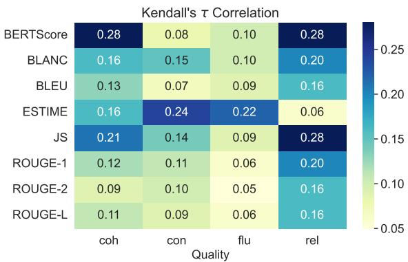
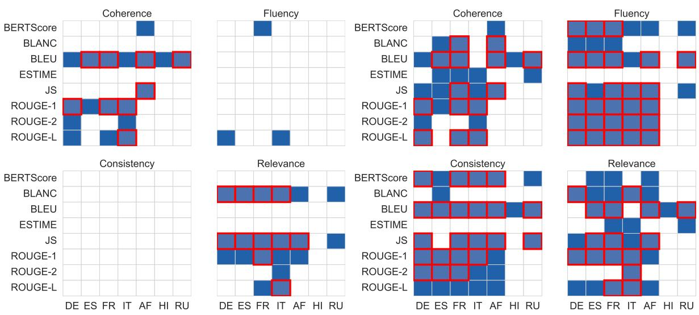
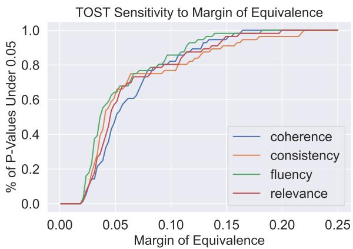
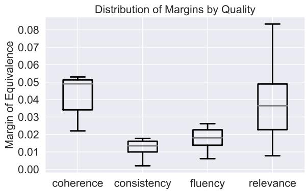
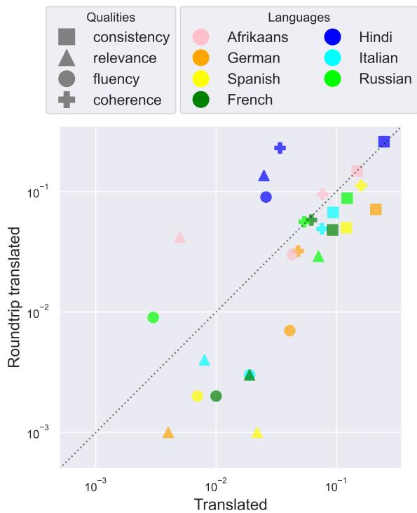
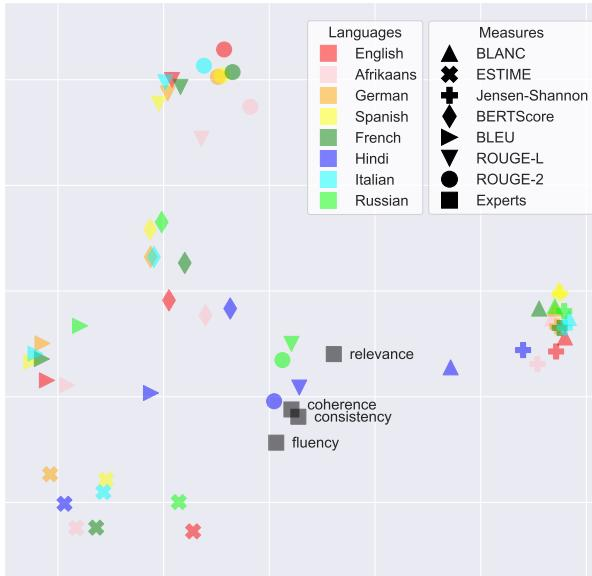

# Does Summary Evaluation Survive Translation to Other Languages?

Spencer Braun1, Oleg Vasilyev1, Neslihan Iskender2, John Bohannon1

1Primer Technologies Inc., San Francisco, California {spencer.braun,oleg,john}@primer.ai

2Technische Universität Berlin, Quality and Usability Lab neslihan.iskender@tu-berlin.de

## Abstract

The creation of a quality summarization dataset is an expensive, time-consuming effort, requiring the production and evaluation of summaries by both trained humans and machines. The returns to such an effort would increase significantly if the dataset could be used in additional languages without repeating human annotations. To investigate how much we can trust machine translation of summarization datasets, we translate the English SummEval dataset to seven languages and compare performances across automatic evaluation measures. We explore equivalence testing as the appropriate statistical paradigm for evaluating correlations between human and automated scoring of summaries. We also consider the effect of translation on the relative performance between measures. We find some potential for dataset reuse in languages similar to the source and along particular dimensions of summary quality. Our code and data can be found at https://github.com/ PrimerAI/primer-research/.

## 1 Introduction

A large summarization dataset includes thousands of texts and human-written summaries (for example, CNN/Daily Mail (Hermann et al., 2015)). In order to make it applicable for wider research, it may also contain machine-generated summaries by many models, accompanied by human and machine evaluations of the quality of the generated summaries (Fabbri et al., 2021). The human annotation alone is a complicated effort, requiring careful planning and setup (Kryscinski et al., 2020; Tang et al., 2021; Iskender et al., 2021).

What purpose do the human annotations serve? Their main utility is serving as a benchmark for automated evaluation measures. Researchers design measures to closely approximate human judgment in order to increase the pace of summarization model improvement. As summarization resources grow for English-language models, it becomes increasingly important to consider whether we can repurpose these datasets for use in other languages as well.

Given a method that could produce flawless translations, the original human annotations quite clearly remain useful, as the relative rankings of the summaries would be invariant. In this scenario, comparing automated measures in another language with the English human scores produces valid conclusions.

In practice, however, translation will introduce some distortions — both mild and extreme — that can spoil the utility of the original annotations. While a "uniform" distortion over all texts would preserve the relations among evaluation measures, this too is an unrealistic assumption as translation will correct and simplify some texts, introduce errors into others, and push components of text quality like relevance, coherence, and fluency in different directions (Fomicheva et al., 2021; Freitag et al., 2021). We are left to ask how to determine whether it is still practical to rely on the original human annotations for at least some quality measures and alternate languages?

In this paper, we seek to address this question through two quantitative explorations of automated evaluation measures under translation. First, we determine how often the correlation between a given measure and the original human annotations remains equivalent under translation. Second, we consider if one automated measure aligns more closely with human judgment than another in English, how often their relative positions are maintained after the translation. We conduct this investigation using the SummEval dataset (Fabbri et al., 2021), the largest corpus of English-language human annotated text summaries widely available. We translate this dataset from English to seven languages and evaluate the correlations between automated summary evaluation measures and human annotations. Using equivalence tests, we show that some aspects of summary quality ranking are preserved under translation for languages with similar alphabets and grammars to English. While we find some reasons for optimism about the potential for dataset reuse, our work clearly demonstrates that more research is needed to make translated datasets useful for a diverse set of languages.

## 2 Data and Models

We focus our analysis on the portion of SummEval that includes human annotations. It consists of 100 texts, each accompanied by 11 human-written reference summaries and 17 machine-generated summaries produced by different models. Each machine-generated summary is annotated by three experts and five crowd workers using a five-point scale for four quality measures: coherence, consistency, fluency, and relevance. For simplicity, we create a composite rating by averaging the expert scores for each quality of a given text-summary pair.

We translate all 100 source texts, 1100 human reference summaries, and 1700 machine-generated summaries into seven languages — French, German, Italian, Spanish, Afrikaans, Hindi, and Russian — using translation models trained and uploaded to the Hugging Face Model Hub by Helsinki-NLP² and accessed via the transformers library (Wolf et al., 2020). The specific models used for translation are named opus-mt-L1-L2’, where one of L1 or L2 is ‘en’ (English), and the other is one of the languages ‘af’, ‘de', ‘es', ‘fr', 'hi', ‘it', or ru'.

In each language version of the dataset, we score machine-generated summaries with a few common or promising automated evaluation measures that could be applied to all eight languages. We calculate the following truly automated (not needing human written reference summaries) measures: Jensen-Shannon (Louis and Nenkova, 2009), ESTIME (Vasilyev and Bohannon, 2021a)³ and BLANC (Vasilyev et al., 2020)4. We also calculate the following reference-based automatic evaluation measures: BLEU (Papineni et al., 2002), BERTScore-F1⁵ (Zhang et al., 2020), and ROUGE (Lin, 2004) as ROUGE-1,2,L6. These measures were selected to cover a wide range of strengths and weaknesses in replicating human judgment (see Appendix C for more detail). We use the same original human annotations provided by the SummEval dataset as annotations in each of the seven translated languages.

We used bert-base-multilingual-cased’as the underlying model for BLANC and ESTIME. While other choices of underlying model could produce higher correlations with human annotations in English, this multilingual model was selected to provide a more uniform performance across languages. BERTScore relies on bertbase-multilingual-cased’ for all languages except English, for which it uses the model robertalarge'. ESTIME embeddings were taken from the 10th transformer block layer instead of the final 12th layer. We followed Vasilyev and Bohannon (2021a), where it was shown that for the larger model bert-large-uncased-whole-word-masking' the 21st layer delivers the better performance than the 24th and final layer.

We calculate correlations between automated evaluation measures in each language and the human annotations on the original English dataset. We seek to answer whether these correlations are reasonably independent of the language. In other words, can we rely on such correlations to provide consistent judgement of evaluation measures in other languages?

## 3 Comparisons within Measures

## 3.1 Simple Correlations

It has become standard in the summarization literature to judge the performance of an automated measure by the correlation of its scores with human evaluation of summaries (e.g. Zhang et al. (2020), Deutsch et al. (2021)). Figure 1 shows Spearman's ρ and Kendall's τ correlation coefficients between the expert human evaluations and the automated measures run on the English summaries found in the SummEval dataset. Each correlation is calculated over a pair of 1700 length vectors — one composed of the expert scores along a particular quality and the other containing scores produced by an automated measure for all machine-generated summaries.

<table><tr><td rowspan=2 colspan=1>BERTScoreBLANC</td><td rowspan=1 colspan=1>0.39</td><td rowspan=1 colspan=1>0.10</td><td rowspan=1 colspan=1>0.13</td><td rowspan=1 colspan=1>0.38</td></tr><tr><td rowspan=1 colspan=1>0.22</td><td rowspan=1 colspan=1>0.19</td><td rowspan=1 colspan=1>0.13</td><td rowspan=1 colspan=1>0.28</td></tr><tr><td rowspan=1 colspan=1>BLEU</td><td rowspan=1 colspan=1>0.19</td><td rowspan=1 colspan=1>0.09</td><td rowspan=1 colspan=1>0.12</td><td rowspan=1 colspan=1>0.23</td></tr><tr><td rowspan=1 colspan=1>ESTIME</td><td rowspan=1 colspan=1>0.22</td><td rowspan=1 colspan=1>0.29</td><td rowspan=1 colspan=1>0.28</td><td rowspan=1 colspan=1>0.08</td></tr><tr><td rowspan=1 colspan=1>JS</td><td rowspan=1 colspan=1>0.29</td><td rowspan=1 colspan=1>0.18</td><td rowspan=1 colspan=1>0.11</td><td rowspan=1 colspan=1>0.39</td></tr><tr><td rowspan=1 colspan=1>ROUGE-1</td><td rowspan=1 colspan=1>0.17</td><td rowspan=1 colspan=1>0.13</td><td rowspan=1 colspan=1>0.07</td><td rowspan=1 colspan=1>0.28</td></tr><tr><td rowspan=1 colspan=1>ROUGE-2</td><td rowspan=1 colspan=1>0.14</td><td rowspan=1 colspan=1>0.12</td><td rowspan=1 colspan=1>0.06</td><td rowspan=1 colspan=1>0.23</td></tr><tr><td rowspan=1 colspan=1>ROUGE-L</td><td rowspan=1 colspan=1>0.16</td><td rowspan=1 colspan=1>0.12</td><td rowspan=1 colspan=1>0.08</td><td rowspan=1 colspan=1>0.23</td></tr></table>

Figure 1: Spearman's $\rho$ and Kendall's τ correlations of expert human scores (coherence, consistency, fluency, relevance) with automated evaluation measures for the original English summaries. Note: JS (Jensen-Shannon) and ESTIME correlations are negated.
<table><tr><td rowspan=1 colspan=1>BERTScore</td><td rowspan=1 colspan=1>0.71</td><td rowspan=1 colspan=1>0.74</td><td rowspan=1 colspan=1>0.71</td><td rowspan=1 colspan=1>0.69</td><td rowspan=1 colspan=1>0.73</td><td rowspan=1 colspan=1>0.53</td><td rowspan=1 colspan=1>0.64</td></tr><tr><td rowspan=1 colspan=1>BLANC</td><td rowspan=1 colspan=1>0.70</td><td rowspan=1 colspan=1>0.69</td><td rowspan=1 colspan=1>0.71</td><td rowspan=1 colspan=1>0.66</td><td rowspan=1 colspan=1>0.67</td><td rowspan=1 colspan=1>0.35</td><td rowspan=1 colspan=1>0.60</td></tr><tr><td rowspan=1 colspan=1>BLEU</td><td rowspan=1 colspan=1>0.82</td><td rowspan=1 colspan=1>0.83</td><td rowspan=1 colspan=1>0.83</td><td rowspan=1 colspan=1>0.82</td><td rowspan=1 colspan=1>0.82</td><td rowspan=1 colspan=1>0.63</td><td rowspan=1 colspan=1>0.76</td></tr><tr><td rowspan=1 colspan=1>ESTIME</td><td rowspan=1 colspan=1>0.41</td><td rowspan=1 colspan=1>0.52</td><td rowspan=1 colspan=1>0.54</td><td rowspan=1 colspan=1>0.52</td><td rowspan=1 colspan=1>0.55</td><td rowspan=1 colspan=1>0.32</td><td rowspan=1 colspan=1>0.44</td></tr><tr><td rowspan=1 colspan=1>JS</td><td rowspan=1 colspan=1>0.86</td><td rowspan=1 colspan=1>0.90</td><td rowspan=1 colspan=1>0.86</td><td rowspan=1 colspan=1>0.85</td><td rowspan=1 colspan=1>0.89</td><td rowspan=1 colspan=1>0.66</td><td rowspan=1 colspan=1>0.79</td></tr><tr><td rowspan=1 colspan=1>ROUGE-1</td><td rowspan=1 colspan=1>0.85</td><td rowspan=1 colspan=1>0.79</td><td rowspan=1 colspan=1>0.81</td><td rowspan=1 colspan=1>0.80</td><td rowspan=1 colspan=1>0.76</td><td rowspan=1 colspan=1>0.13</td><td rowspan=1 colspan=1>0.20</td></tr><tr><td rowspan=1 colspan=1>ROUGE-2</td><td rowspan=1 colspan=1>0.80</td><td rowspan=1 colspan=1>0.76</td><td rowspan=1 colspan=1>0.79</td><td rowspan=1 colspan=1>0.78</td><td rowspan=1 colspan=1>0.74</td><td rowspan=1 colspan=1>0.07</td><td rowspan=1 colspan=1>0.18</td></tr><tr><td rowspan=1 colspan=1>ROUGE-L</td><td rowspan=1 colspan=1>0.85</td><td rowspan=1 colspan=1>0.82</td><td rowspan=1 colspan=1>0.81</td><td rowspan=1 colspan=1>0.82</td><td rowspan=1 colspan=1>0.75</td><td rowspan=1 colspan=1>0.11</td><td rowspan=1 colspan=1>0.19</td></tr><tr><td rowspan=1 colspan=8>EN-DEEN-FREN-ES EN-IT EN-AF EN-HI EN-RULanguage</td></tr></table>

<table><tr><td rowspan=1 colspan=1>BERTScore</td><td rowspan=1 colspan=1>0.52</td><td rowspan=1 colspan=1>0.55</td><td rowspan=1 colspan=1>0.52</td><td rowspan=1 colspan=1>0.50</td><td rowspan=1 colspan=1>0.54</td><td rowspan=1 colspan=1>0.37</td><td rowspan=1 colspan=1>0.46</td></tr><tr><td rowspan=1 colspan=1>BLANC</td><td rowspan=1 colspan=1>0.50</td><td rowspan=1 colspan=1>0.50</td><td rowspan=1 colspan=1>0.51</td><td rowspan=1 colspan=1>0.47</td><td rowspan=1 colspan=1>0.49</td><td rowspan=1 colspan=1>0.24</td><td rowspan=1 colspan=1>0.43</td></tr><tr><td rowspan=1 colspan=1>BLEU</td><td rowspan=1 colspan=1>0.64</td><td rowspan=1 colspan=1>0.65</td><td rowspan=1 colspan=1>0.65</td><td rowspan=1 colspan=1>0.64</td><td rowspan=1 colspan=1>0.64</td><td rowspan=1 colspan=1>0.45</td><td rowspan=1 colspan=1>0.58</td></tr><tr><td rowspan=1 colspan=1>ESTIME</td><td rowspan=1 colspan=1>0.30</td><td rowspan=1 colspan=1>0.39</td><td rowspan=1 colspan=1>0.41</td><td rowspan=1 colspan=1>0.39</td><td rowspan=1 colspan=1>0.40</td><td rowspan=1 colspan=1>0.23</td><td rowspan=1 colspan=1>0.32</td></tr><tr><td rowspan=1 colspan=1>JS</td><td rowspan=1 colspan=1>0.67</td><td rowspan=1 colspan=1>0.72</td><td rowspan=1 colspan=1>0.67</td><td rowspan=1 colspan=1>0.66</td><td rowspan=1 colspan=1>0.71</td><td rowspan=1 colspan=1>0.48</td><td rowspan=1 colspan=1>0.59</td></tr><tr><td rowspan=1 colspan=1>ROUGE-1</td><td rowspan=1 colspan=1>0.66</td><td rowspan=1 colspan=1>0.59</td><td rowspan=1 colspan=1>0.62</td><td rowspan=1 colspan=1>0.61</td><td rowspan=1 colspan=1>0.57</td><td rowspan=1 colspan=1>0.09</td><td rowspan=1 colspan=1>0.14</td></tr><tr><td rowspan=1 colspan=1>ROUGE-2</td><td rowspan=1 colspan=1>0.61</td><td rowspan=1 colspan=1>0.57</td><td rowspan=1 colspan=1>0.59</td><td rowspan=1 colspan=1>0.59</td><td rowspan=1 colspan=1>0.54</td><td rowspan=1 colspan=1>0.06</td><td rowspan=1 colspan=1>0.14</td></tr><tr><td rowspan=1 colspan=1>ROUGE-L</td><td rowspan=1 colspan=1>0.66</td><td rowspan=1 colspan=1>0.62</td><td rowspan=1 colspan=1>0.62</td><td rowspan=1 colspan=1>0.63</td><td rowspan=1 colspan=1>0.56</td><td rowspan=1 colspan=1>0.08</td><td rowspan=1 colspan=1>0.13</td></tr><tr><td rowspan=1 colspan=8>EN-DEEN-FREN-ES EN-IT EN-AF EN-HI EN-RULanguage</td></tr></table>

Figure 2: Spearman's $\rho$ and Kendall's τ correlations between automated evaluation measures in English and in translated languages German (DE), French (FR), Spanish (ES), Italian (IT), Afrikaans (AF), Hindi (HI), and Russian (RU).

The correlations are consistently weak, indicating that the measures rely on different features than human evaluations of a summary. ESTIME, BERTScore, and Jensen-Shannon all demonstrate somewhat higher correlations in at least some measures of quality, perhaps reflecting a more nuanced approach to summary scoring.

Automated evaluation of summarization models is still an evolving field. While most measures disagree with human judgment often, they are still widely used as points of comparison across model outputs. Therefore, it remains highly relevant to determine whether translation preserves the judgments rendered by the automated measures.

We may consider an evaluation measure to be useful under translation if the scores it assigns to summaries are consistent across languages, perhaps in absolute value but at least in the rank ordering of summaries. Therefore such a measure would exhibit high correlation between its values on English summaries and those for the summaries translated to other languages. Figure 2 shows Spearman's $\rho$ and Kendall's $\tau$ correlation coefficients between the automated measures run on the English corpus and each translated corpus.

For a given measure, the correlations across languages are generally much stronger than those between automated measures and human evaluations in English seen in Figure 1. For languages with the strongest correlations to the English measures, this result provides some promise that translation might introduce minimal additional noise, meaning the evaluation measure provides consistent signal across languages.

The reference-based measures generally show stronger correlations $( \rho > 0 . 6 , \tau > 0 . 5 )$ between English and German, French, Spanish, Italian, and Afrikaans translations. For Russian and Hindi, they show weaker correlations, drastically so for ROUGE measures. Among the reference-free measures, Jensen-Shannon and BLANC demonstrate similar patterns of performance. These results at least suggest that measures may prove useful when translating datasets to languages with similar origins (here Italic or Germanic languages). However, ESTIME shows weak correlations across languages with a smaller drop in correlation between Western European derived languages and Hindi and Russian.

  
(a) TOST with standard deviation margin of equivalence  
(b) TOST with constant 0.05 margin of equivalence  
Figure 3: Results of tests of equivalence for each automated measure (y-axis), language (x-axis), and quality measure (coherence, consistency, fluency, relevance). Blue squares indicate p-value ≤ 0.05 while red highlights indicate the result remained significant after applying Benjamini-Yekutieli correction for FDR control. Left: Results for TOST with standard deviation margin of equivalence. Right: Results for TOST with constant 0.05 margin of equivalence.

## 3.2 Significance Tests

Given the promising results in Section 3.1, we seek to test whether correlations between an automated measure and the original expert scores are statistically invariant when run on the English and translated summaries. Since human evaluations are split into four qualities - coherence, consistency, fluency, relevance - we consider correlations separately along each measure. For example, we look to answer whether the correlation between English BLANC scores and English expert scores for relevance is equivalent to the correlation between German BLANC scores and English expert scores for relevance. We consider this a natural test of an automated measure's utility after translation, as we hope measures will reflect human judgment in a consistent and predictable manner across languages.

Since we are interested in demonstrating a lack of statistical difference between two correlations, $\rho _ { 1 }$ and $\rho _ { 2 } .$ , we cannot use a typical hypothesis test with null hypothesis $H _ { 0 } : \rho _ { 1 } = \rho _ { 2 }$ . Such a test would only suggest equivalence by failing to reject the null hypothesis, which could simply occur due to a lack of statistical power.

Instead, we turn to equivalence tests, a paradigm which effectively reverses null and alternative hypotheses, i.e. $H _ { 0 } : \rho _ { 1 } \neq \rho _ { 2 }$ . We explore two such tests, Two One-Sided Tests (TOST) and Anderson-Hauck tests, and call for additional research to standardize their use for summarization evaluation.

## 3.3 Two One-Sided Tests (TOST)

In the TOST procedure (Schuirmann, 1987), we must set a margin of equivalence, $\Delta _ { E }$ , within which we consider two test statistics to be equivalent. Then for two correlations, $\rho _ { 1 }$ and $\rho _ { 2 }$ , we have null and alternative hypotheses:

$$
\begin{array} { r l } & { H _ { 0 } : \rho _ { 1 } - \rho _ { 2 } < - \Delta _ { E } \mathrm { o r } \rho _ { 1 } - \rho _ { 2 } > \Delta _ { E } } \\ & { H _ { 1 } : - \Delta _ { E } < \rho _ { 1 } - \rho _ { 2 } < \Delta _ { E } } \end{array}
$$

While in a field like medicine, the margin might be well defined by a chemical process, we lack a strong prior for choosing a relevant margin. We explore several options and consider the sensitivity of p-values to our choices when evaluating the validity of the tests' conclusions.

The Kendall rank correlation differences considered do not follow a normal distribution, and we use bootstrap resampling (Efron and Tibshirani, 1993) to generate an empirical distribution. For a given translation language, automated evaluation measure, and quality measure, we sample across (text, summary, and reference summary) tuples. (Note for reference-based summaries - BERTScore, BLEU, and ROUGE - a more complete bootstrap procedure would account for the stochasticity present in the choice of reference summaries themselves. We provide an illustrative example in Appendix B.)

While permutation-based tests have been shown to have higher power in summarization evaluation than bootstrap resampling (Deutsch et al., 2021), permutation tests assume null hypothesis $H _ { 0 } : \rho _ { 1 } = \rho _ { 2 }$ and are not simply adapted to our case. We apply a multiple testing correction to the p-values calculated due to the large number of tests considered. We use the Benjamini-Yekutieli procedure (Benjamini and Yekutieli, 2001) to account for dependence among correlation measures and control the false discovery rate (FDR) at level $\alpha = 0 . 0 5$

We consider several relevant equivalence margins with different trade-offs. We try a constant margin of 0.05 across all measures and qualities; a standard deviation margin using the standard deviations for correlations between individual experts and an automated measure; and a maximum difference margin calculated as the largest absolute difference in correlations between individual experts and an automated measure. Under the constant margin, 58% of correlations are equivalent before FDR correction and 35% after. Under the maximum difference margin, 44% of correlations are equivalent before correction and 29% after. Finally, under the standard deviation margin, 18% of tests are equivalent before and 9% after correction.

We present the full results of the TOST procedure with a standard deviation margin in the left panel and a constant margin in the right panel of Figure 3. While both panels demonstrate interesting patterns of equivalence, we focus on the standard deviation margin as it is tailored to each language-measure pair, relies on a less arbitrary value of expected variation under equivalence, and is more conservative than the other margins considered. The max difference and constant margins found much higher rates of equivalence under translation.

Examining the results, we can note a few clear patterns. First, as seen under the simple correlation analysis, the Italic and Germanic languages have a higher number of significant results than Hindi or Russian. We may still consider using translated summarization datasets from English to languages considered "close." However, there are no significant results in the fluency or consistency qualities under the standard deviation margin (Figure 3a). Therefore the automated measures may only be useful under translation along specific dimensions of quality. Looking at the correlations in English between automated measures and expert judgments in Figure 1, fluency and consistency also tend to have much lower correlations than coherence and relevance.

(a) Sensitivity of TOST to the margin of equivalence. Small changes in the margin can result in a large change in the percent of tests with significant p-values.  
  
(b) Distribution of margins by quality under the standard deviation margin. Using the variation observed among individual human annotations produces more strict thresholds of equivalence for consistency and fluency and more lenient ones for coherence and relevance.  
Figure 4: Measuring the impact of margins of equivalence on the TOST results.

Additionally, the choice of equivalence margin has a consequential impact on results. Figure 4a shows how the number of significant pvalues changes in response to an increasing margin of equivalence. Given the apparent sensitivity to changes in the margin, further research is warranted into how the performance of translation and summarization systems relates to the correlations measured here.

Therefore, the lack of significance for the fluency and consistency qualities can be attributed to both the capabilities of the automated measures and how the standard deviation margin varies across qualities. We already expect from Figure 1 that measures may be capturing a large amount of noise for fluency and consistency and would fare poorly under translation, resulting in fewer equivalent results. However, the amount of inter-rater disagreement also plays a significant role in determining equivalence by expanding or contracting the margins. Figure 4b highlights the differences in standard deviation margins for each quality across automated measures. Consistency and fluency had smaller margins with tighter distributions, with median margins of 0.013 and 0.018 and inter-quartile ranges (IQRs) of 0.006 and 0.009 respectively. By contrast, coherence and relevance had median margins 0.049 and 0.036 with IQRs 0.017 and 0.026 respectively. Thus human annotators showed stronger agreement on consistency and fluency, presenting a higher threshold for equivalence after translation.

## 3.4 Anderson-Hauck Tests

While TOST provides a non-parametric route towards equivalence testing, we consider an additional parametric test that may improve statistical power. The Anderson-Hauck test is an equivalence testing procedure for dependent correlation coefficients which uses an approximate non-central tdistribution to calculate p-values (Anderson and Hauck, 1983). Prior comparisons with TOST demonstrated that Anderson-Hauck can trade some additional Type-I error for higher power (Counsell and Cribbie, 2015).

We consider the same margins of equivalence and apply Benjamini-Yekutieli for FDR control at level $\alpha = 0 . 0 5$ . A similar pattern emerges when considering results under different margins, and under the standard deviation margin we reject the null hypothesis in under 1% of tests.

The pattern of equivalence is largely the same as that found under TOST but with greater sparsity of significant results. Ultimately while the tests hint towards the ability to reuse summarization datasets in similar languages to English, we are only able to detect equivalence in a minority of cases. Our analysis relies predominantly on the TOST results since it does not rely on distributional assumptions for the differences in correlations and has a more robust literature to follow.

## 4 Comparisons between Measures

While our statistical tests focus on the absolute correlation between automated and human scores, we can instead consider the automated measures relative to one another. If one measure correlates better than another with human scores in the original English dataset, would it still be better in a translated (non-English) dataset? Additionally, we can return the dataset back to English to get a sense of the distortion introduced by the translation process.

  
Figure 5: Result of bootstrapping: average shift in probability P of one measure being better than another, when the evaluation data are translated to another language (xaxis) and then translated back to English (y-axis). The average is taken over all measure-measure pairs that had $P \ge 0 . 9 7 5$ in English.

To estimate the consistency with which one measure dominates another, we turn to bootstrap resampling of the summary evaluations. We select 10,000 bootstrap samples from the 1700 text-summaryreferences tuples. Let P represent the fraction of samples in which one measure is better than another for a given measure-measure pair; we consider a pair "resolved" if one measure outperforms another in at least 97.5% of all the resamplings, i.e. P ≥ 0.975 in the original English dataset. Using Kendall rank correlations, the number of resolved measure-measure pairs is 64% for relevance, 61% for coherence, 56% for consistency, and 42% for fluency. With a baseline reading of how stable the measure rankings are in English, we can ask what happens with these resolved pairs when the dataset is translated.

For most languages and qualities the shift of P is less than 0.1, the largest is 0.25 (consistency, Hindi). Many resolved measure-measure pairs become unresolved after translation, though no shift is drastic enough to reverse which measure ranks higher in a majority of samples (i.e. crossing P = 0.5). Figure 5 suggests that in most cases our conclusion about comparing two measures will not change with translation.

Along its x-axis, Figure 5 shows how much on average the fraction P changes (increases or decreases) after translation for resolved measuremeasure pairs, where the average is over a given language and quality measure.

A round-trip translation returns each summary to its source language, effectively isolating the effect of translation quality on the consistency of automated measures. Here, returning to English allows us to use the evaluation measures in their original language and, for ESTIME, BLANC, and BERTScore, with their original models. Changes in measure performance should then reflect distortions introduced by translation while eliminating those caused by adapting measures to another language.

The dashed line y = x seen in Figure 5 represents points where the round-trip translation causes an equally-sized shift as the forward translation. We note that the observed shifts are mostly under the diagonal - the shifts caused by translation are to some degree reversed when we return to English. The tendency of machine translation models to produce "translationese," artifacts distinguishing the output from typical human language use, is well documented (e.g. Vanmassenhove et al. (2021), Graham et al. (2020)), so exact overlap between source and round-trip translated texts is not expected. However, automated evaluation measures rely on coarser linguistic features like word overlap and are more influenced by significant amounts of noise during the round-trip translation process.

While the shifts for round-trip translations are on average smaller than for one-way, they demonstrate that translation is far from perfect and introduces enough noise to be detected by the summarization evaluation measures. Notably, the points above the diagonal come from Hindi, Russian and Afrikaans round-trip translation. This confirms our intuition that a translation to languages more distant from English is more risky for the survival of the summary evaluation. We hope further research may reveal additional ways to use the round-trip translation for the criteria of survival.

## 5 Discussion

The results presented significant differences among automated summarization measures and their relationships to the four quality measures. We seek to build an intuition for these findings and make use of qualitative exploration to ground our understanding

We can review the scores for the 1700 summaries in reduced dimensions using principal components analysis (PCA). Figure 6 shows each 1700- dimensional vector projected onto the first two principal components, which collectively explain 38.5% of the variance. There are four vectors of human expert scores, corresponding to the quality measures coherence, consistency, fluency, and relevance, averaged over the three individual experts. Each automated measure (for example, ROUGE-2) produced eight 1700-dimensional vectors, one for each language.

PCA can be used to disentangle the sources of divergence among evaluation measures under translation. The plot helps highlight the relative strength of translation over the summarization evaluation methods themselves. If machine translation added significant noise to the summaries, we would expect the relative position of language-specific scores in Figure 6 to be inconsistent across evaluation measures. Instead, we generally observe tight clusters for each evaluation measure with shared relative positions among the languages (at least when ignoring Hindi and Russian).

This pattern reflects the "stability" of evaluation measures undergoing translation found in Section 4. The PCA recasts translation as a shift in geometric space; across measures, the location occupied by each language is a similar vector shift from its corresponding English point. The exercise in roundtrip translation is an indicator of reversibility for this geometric shift. The qualities and languages that occupy the bottom of Figure 5 are most unchanged by the translation process. On the other hand, measures like ESTIME that break this pattern highlight the non-uniformity of the distortion introduced by translation and indicate that it may be more prudent to rely on measures where the distortion is consistent and predictable.

  
Figure 6: PCA plot of summary quality scores. All scores were transformed to ranks before PCA, to reduce subjectivity of the respective scales. Note the human expert scores in black squares exist for the English dataset only.

This closer look at the effects of translation also helps disentangle the sources of noise that degraded the correlations studied in Section 3. A measure like ESTIME shows strong correlation with the human evaluations of consistency and fluency in English, but its unusual response to translation is a strong explanatory factor for why its relationships to human annotations were not found to be equivalent in other languages. Consistency also tends to show larger shifts in measure-measure pair rankings in Figure 5, adding another reason that translation would cause greater degradation to ESTIME's performance. Similarly, among the Germanic and Italic languages, relevance and fluency appear to be least affected by translation. Any lack of equivalence found for these qualities is then more likely to be caused by the abilities of the automated measures rather than the caliber of translation. Comparisons within and between measures can serve as a guide for how much to trust an automated measure under translation and where sources of noise may arise.

We note a few curious observations from Figure 6 in Appendix A.

## 6 Conclusion

In this paper, we probed how well automated evaluations of summaries remain consistent on texts translated to other languages. We focused on the SummEval dataset and considered its translation to French, German, Italian, Spanish, Afrikaans, Hindi, and Russian.

To answer whether English human annotations can be trusted in other languages, at least for specific qualities, we explored tests of equivalence as a gauge of consistency after translation. We found that translation can preserve correlations of evaluation metrics with the English human scores for coherence or relevance but could not conclude the same for fluency or consistency.

A complete answer to our query is a challenging task, since moving to another language affects not only the dataset, but also the measures themselves. While definitely proving that the original human annotations cannot be reused is likely impossible, our results suggest that there are clear differences in performance based on the choice of target language, automated measure, and notion of quality.

We call for additional research into summary evaluation metrics that can survive translation, as it offers a relatively simple path towards extending NLP capabilities for lower resource languages. Future work could identify how changes in the margin of equivalence equate to deterioration of model performance. Additionally, this line of research could be extended to a larger selection of languages and automated evaluation measures.

## References

Sharon Anderson and Walter W. Hauck. 1983. A new procedure for testing equivalence in comparative bioavailability and other clinical trials. Communications in Statistics - Theory and Methods, 12(23):2663– 2692.

Yoav Benjamini and Daniel Yekutieli. 2001. The control of the false discovery rate in multiple testing under dependency. The Annals of Statistics, 29(4):1165 -1188.

Ozan Caglayan, Pranava Madhyastha, and Lucia Specia. 2020. Curious case of language generation evaluation metrics: A cautionary tale. In Proceedings of the 28th International Conference on Computational

Linguistics, pages 2322–2328, Barcelona, Spain (Online). International Committee on Computational Linguistics.

Alyssa Counsell and Robert A. Cribbie. 2015. Equivalence tests for comparing correlation and regression coefficients. British Journal of Mathematical and Statistical Psychology, 68(2):292–309.

Daniel Deutsch, Rotem Dror, and Dan Roth. 2021. A Statistical Analysis of Summarization Evaluation Metrics Using Resampling Methods. Transactions of the Association for Computational Linguistics, 9:1132-1146.

Bradley Efron and Robert J. Tibshirani. 1993. An Introduction to the Bootstrap. Number 57 in Monographs on Statistics and Applied Probability. Chapman & Hall/CRC, Boca Raton, Florida, USA.

Nicholas Egan, Oleg Vasilyev, and John Bohannon. 2021. Play the shannon game with language models: A human-free approach to summary evaluation. arXiv, arXiv:2103.10918.

Alexander R. Fabbri, Wojciech Kryściński, Bryan Mc-Cann, Caiming Xiong, Richard Socher, and Dragomir Radev. 2021. SummEval: Re-evaluating summarization evaluation. Transactions of the Association for Computational Linguistics, 9:391–409.

Marina Fomicheva, Lucia Specia, and Nikolaos Aletras. 2021. Translation error detection as rationale extraction. arXiv, arXiv:2108.12197.

Markus Freitag, George Foster, David Grangier, Viresh Ratnakar, Qijun Tan, and Wolfgang Macherey. 2021. Experts, errors, and context: A large-scale study of human evaluation for machine translation. arXiv, arXiv:2104.14478.

Yvette Graham. 2015. Re-evaluating automatic summarization with BLEU and 192 shades of ROUGE In Proceedings of the 2015 Conference on Empirical Methods in Natural Language Processing, pages 128– 137, Lisbon, Portugal. Association for Computational Linguistics.

Yvette Graham, Barry Haddow, and Philipp Koehn. 2020. Statistical power and translationese in machine translation evaluation. In Proceedings of the 2020 Conference on Empirical Methods in Natural Language Processing (EMNLP), pages 72–81, Online. Association for Computational Linguistics.

Karl Moritz Hermann, Tomás Kociský, Edward Grefenstette, Lasse Espeholt, Will Kay, Mustafa Suleyman, and Phil Blunsom. 2015. Teaching machines to read and comprehend. In Advances in Neural Information Processing Systems 28: Annual Conference on Neural Information Processing Systems 2015, December 7-12, 2015, Montreal, Quebec, Canada, pages 1693– 1701.

Neslihan Iskender, Tim Polzehl, and Sebastian Möller. 2021. Reliability of human evaluation for text summarization: Lessons learned and challenges ahead. In Proceedings of the Workshop on Human Evaluation of NLP Systems (HumEval), pages 86–96, Online. Association for Computational Linguistics.

Wojciech Kryscinski, Bryan McCann, Caiming Xiong, and Richard Socher. 2020. Evaluating the factual consistency of abstractive text summarization. In Proceedings of the 2020 Conference on Empirical Methods in Natural Language Processing (EMNLP), pages 9332–9346, Online. Association for Computational Linguistics.

Chin-Yew Lin. 2004. ROUGE: A package for automatic evaluation of summaries. In Text Summarization Branches Out, pages 74–81, Barcelona, Spain. Association for Computational Linguistics.

Annie Louis and Ani Nenkova. 2009. Automatically evaluating content selection in summarization without human models. In Proceedings of the 2009 Conference on Empirical Methods in Natural Language Processing, pages 306–314, Singapore. Association for Computational Linguistics.

Nitika Mathur, Timothy Baldwin, and Trevor Cohn. 2020. Tangled up in BLEU: Reevaluating the evaluation of automatic machine translation evaluation metrics. In Proceedings of the 58th Annual Meeting of the Association for Computational Linguistics, pages 4984–4997, Online. Association for Computational Linguistics.

Kishore Papineni, Salim Roukos, Todd Ward, and Wei-Jing Zhu. 2002. Bleu: a method for automatic evaluation of machine translation. In Proceedings of the 40th Annual Meeting of the Association for Computational Linguistics, pages 311–318, Philadelphia, Pennsylvania, USA. Association for Computational Linguistics.

Donald J. Schuirmann. 1987. A comparison of the two one-sided tests procedure and the power approach for assessing the equivalence of average bioavailability. Journal of Pharmacokinetics and Biopharmaceutics, 15:657–680.

Xiangru Tang, Alexander R. Fabbri, Ziming Mao, Griffin Adams, Borui Wang, Haoran Li, Yashar Mehdad, and Dragomir Radev. 2021. Investigating crowdsourcing protocols for evaluating the factual consistency of summaries. arXiv, arXiv:2109.09195.

Eva Vanmassenhove, Dimitar Shterionov, and Matthew Gwilliam. 2021. Machine translationese: Effects of algorithmic bias on linguistic complexity in machine translation. In Proceedings of the 16th Conference of the European Chapter of the Association for Computational Linguistics: Main Volume, pages 2203–2213, Online. Association for Computational Linguistics.

Oleg Vasilyev and John Bohannon. 2021a. Estime: Estimation of summary-to-text inconsistency by mismatched embeddings. In Proceedings of the 2nd

Workshop on Evaluation and Comparison of NLP Systems, pages 94–103. Association for Computational Linguistics.

Oleg Vasilyev and John Bohannon. 2021b. Is human scoring the best criteria for summary evaluation? In Findings of the Association for Computational Linguistics: ACL-IJCNLP 2021, pages 2184–2191, Online. Association for Computational Linguistics.

Oleg Vasilyev, Vedant Dharnidharka, and John Bohannon. 2020. Fill in the BLANC: Human-free quality estimation of document summaries. In Proceedings of the First Workshop on Evaluation and Comparison of NLP Systems, pages 11–20, Online. Association for Computational Linguistics.

Thomas Wolf, Lysandre Debut, Victor Sanh, Julien Chaumond, Clement Delangue, Anthony Moi, Pierric Cistac, Tim Rault, Remi Louf, Morgan Funtowicz, Joe Davison, Sam Shleifer, Patrick von Platen, Clara Ma, Yacine Jernite, Julien Plu, Canwen Xu, Teven Le Scao, Sylvain Gugger, Mariama Drame, Quentin Lhoest, and Alexander Rush. 2020. Transformers: State-of-the-art natural language processing. In Proceedings of the 2020 Conference on Empirical Methods in Natural Language Processing: System Demonstrations, pages 38–45, Online. Association for Computational Linguistics.

Tianyi Zhang, Varsha Kishore, Felix Wu, Kilian Q. Weinberger, and Yoav Artzi. 2020. Bertscore: Evaluating text generation with BERT. In 8th International Conference on Learning Representations, ICLR 2020, Addis Ababa, Ethiopia, April 26-30, 2020. OpenReview.net.

## A Observations from PCA

The locations of the measures in Figure 6 after translation largely remain close to the original English version, except Hindi and Russian points. The reference-based measures, relying on hard (ROUGE, BLEU) or soft (BERTScore) overlap of tokens between the machine-generated and human-written reference summaries, are in the top left quadrant with respect to the human scores. The reference-free measures BLANC and Jensen-Shannon are on the opposite side. Sensibly, BLANC and Jensen-Shannon are both closest to the human judgment of relevance; BLANC estimates how well a text can be reconstructed from its summary, and Jensen-Shannon considers the Kullback-Leibler divergence between the summary and the text. ESTIME is closer to the fluency and consistency points, which is expected from its construction in Vasilyev and Bohannon (2021a).

For most measures, the translated scores are often closer to the expert evaluations than the English scores. Strangely, it is especially true for Hindi and, in the case of ROUGE, for Russian. One possible explanation is that the translation simplifies syntax and vocabulary, reducing sources of variation at least along some dimensions. The pattern associated with ESTIME is distinct from other measures: the non-English scores for ESTIME are almost always further away from the human scores. This suggests that maybe ESTIME is sensitive enough to require a higher quality translation. We cannot blame the underlying multilingual model, because both BLANC and BERTScore use the same model.

## B Bootstrap with Reference-Summaries

Throughout the paper we used bootstrapping of the (text, summary, references) tuples, where the references’ are the reference summaries needed by some measures (BERTScore, BLEU, ROUGE). For each text in SummEval (Fabbri et al., 2021), there are 11 reference summaries, and a full bootstrap for the reference-based measures should also include a resampling of the reference summaries themselves.

The impact of this added source of randomness can be seen by constructing confidence intervals for the estimated correlation between an evaluation measure and human scores. When we add resampling over reference summaries, confidence intervals widen and require more time and resources to compute. In Table 1 we illustrate the widening of the confidence interval on an example using BERTScore correlations with SummEval human expert scores (in the original English SummEval dataset). We ran 500K reference summaries resamplings, recomputing scores and correlations. The BERTScore is a peculiar and convenient case for bootstrap resampling of reference summaries, because the score is defined as a max score over the scores taken individually for each reference summary (Zhang et al., 2020).

The low and high correlation values are given in the table for bootstrap without resampling of reference summaries, as corresponding to 0.025 and 0.975 percentiles of the distribution. The widen' column in the table shows how much the confidence interval (high minus low) changed after including resampling of the 11 reference summaries into the bootstrapping. Some quality measures are especially affected by the change, with confidence intervals for Kendall correlation widening by 40% for relevance and by 17% for coherence (for Spearman's correlations, correspondingly, 42% and 18%). Notice that the relevance and coherence are exactly the qualities in which BERTScore is reported as a strong measure (Vasilyev and Bohannon, 2021a).

<table><tr><td rowspan="2"></td><td colspan="3">Kendall&#x27;s τ</td><td colspan="3">Spearman&#x27;s ρ</td></tr><tr><td>low</td><td>high</td><td>widen</td><td>low</td><td>high</td><td>widen</td></tr><tr><td>coherence</td><td>0.245</td><td>0.307</td><td>0.011</td><td>0.345</td><td>0.428</td><td>0.015</td></tr><tr><td>consistency</td><td>0.041</td><td>0.117</td><td>0.002</td><td>0.052</td><td>0.148</td><td>0.003</td></tr><tr><td>fluency</td><td>0.062</td><td>0.135</td><td>0.004</td><td>0.080</td><td>0.175</td><td>0.006</td></tr><tr><td>relevance</td><td>0.246</td><td>0.310</td><td>0.026</td><td>0.338</td><td>0.424</td><td>0.035</td></tr></table>

Table 1: The columns 'low' and 'high’ are the confidence boundaries from bootstrap without resampling reference summaries, for BERTScore correlations with expert human scores (coherence, consistency, fluency relevance). The column 'widen' is the widening of the confidence interval as a result of adding the resampling of the reference summaries to the bootstrap resampling. Kendall's Tau correlation is Tau-c. The confidence boundaries are for 0.025 and 0.975 percentiles. The bootstrapping used 500K resamplings.

## C Diversity of Measures

As noted in Section 2, we intentionally selected measures that are quite different from one another to increase the robustness of our analysis. Here we provide a brief summary of each measure.

BLANC assesses how much a summary helps in reconstructing its reference text (Vasilyev et al., 2020). Along the four SummEval evaluation qualities, BLANC's task should be most closely aligned with estimating relevance and consistency. However, BLANC's task may differ from the relevance scoring criteria or biases of annotators (Vasilyev and Bohannon, 2021b). An extension of BLANC achieved a state of the art result in relevance and coherence on the SummEval benchmark (Egan et al., 2021).

ESTIME first generates masked contextual embeddings for tokens in a summary and text and then finds the most similar text embedding to each one from the summary. If the paired embeddings correspond to different tokens, ESTIME counts this as an indicator of inconsistency between text and summary. ESTIME's task is closely aligned with measuring consistency and was found to perform well against other benchmarks in consistency and fluency (Vasilyev and Bohannon, 2021a). It is a less reliable measure for coherence and unreliable for relevance.

Jensen-Shannon (Louis and Nenkova, 2009) measures the distance between the distributions of words in the summary and text. The task is closely tied to relevance, but since the syntax and word order is discarded, Jensen-Shannon is not suited to measure coherence, fluency and consistency. Of course it still may correlate with human judgment along these qualities anyway, as better generation models often produce higher quality summaries in general.

The reference-based measures (BERTScore, BLEU and ROUGE) measure correspondence between the generated summary and human-written reference summaries, not between the generated summary and the text. A summary different from all the references may not be fairly evaluated.

BERTScore (Zhang et al., 2020) measures a ‘soft' overlap of tokens (through embeddings). Similar to Jensen-Shannon, this task is closely related to relevance and considerably farther from measuring coherence, fluency and consistency, unless the generated summary happens to be very similar to one of the reference-summaries.

BLEU (Papineni et al., 2002) and ROUGE (Lin, 2004) measure hard’ overlap of tokens and ngrams, and thus a summary that differs by rephrasing or synonyms would have a lower score. When considering overlap of longer n-grams, these measures can reflect human judgment across all qualities but only if the generated summary happens to be similar to one of the reference summaries; see also Graham (2015); Caglayan et al. (2020); Mathur et al. (2020).