# Don’t Take It Literally: An Edit-Invariant Sequence Loss for Text Generation

Guangyi Liu1, Zichao Yang2, Tianhua Tao3, Xiaodan Liang4, Junwei Bao5, Zhen Li1, Xiaodong He5, Shuguang Cui1, Zhiting Hu6 1Chinese University of Hong Kong, Shenzhen, 2Carnegie Mellon University, 3Tsinghua University, 4Sun Yat-Sen University, 5JD AI Research, 6UC San Diego guangyiliu@link.cuhk.edu.cn, zhh019@ucsd.edu

## Abstract

Neural text generation models are typically trained by maximizing log-likelihood with the sequence cross entropy (CE) loss, which encourages an exact token-by-token match between a target sequence with a generated sequence. Such training objective is sub-optimal when the target sequence is not perfect, e.g., when the target sequence is corrupted with noises, or when only weak sequence supervision is available. To address the challenge, we propose a novel Edit-Invariant Sequence Loss (EISL), which computes the matching loss of a target n-gram with all n-grams in the generated sequence. EISL is designed to be ro bust to various noises and edits in the target sequences. Moreover, the EISL computation is essentially an approximate convolution operation with target n-grams as kernels, which is easy to implement and efficient to compute with existing libraries. To demonstrate the effectiveness of EISL, we conduct experiments on a wide range of tasks, including machine translation with noisy target sequences, unsupervised text style transfer with only weak training signals, and non-autoregressive generation with non-predefined generation order. Experimental results show our method significantly outperforms the common CE loss and other strong baselines on all the tasks. EISL has a simple API that can be used as a drop-in replacement of the CE loss.1

## 1 Introduction

Neural text generation models have ubiquitous applications in natural language processing, including machine translation (Bahdanau et al., 2015, Sutskever et al., 2014, Wu et al., 2016, Vaswani et al., 2017), summarizations (Nallapati et al., 2016, See et al., 2017), dialogue systems (Li et al., 2016), etc. They are typically trained by maximizing the log-likelihood of the output sequence conditioning on the inputs with the cross entropy (CE) loss. The

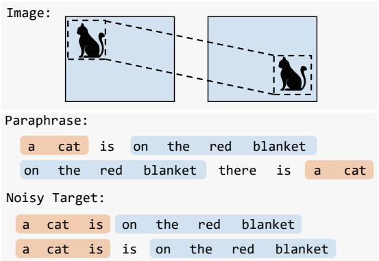  
Figure 1: Invariance exists in both image and text, e.g., image is invariant to translation (top), and text is robust to many forms of edits (bottom).

CE loss can be easily factorized into individual loss terms and can be optimized efficiently with stochastic gradient descent. Due to its computational efficiency and ease to implement, the training paradigm has played an important role in building successful large text generation models (Lewis et al., 2020, Radford et al., 2019). However, the CE loss minimizes the negative log-likelihood of only the reference output sequence, while all other sequences are equally penalized through normalization. This is over-restrictive since for a given reference target sentence, many possible paraphrases are semantically close, hence should not completely be treated as negative samples. For example, as shown in Figure 1, a cat is on the red blanket should be treated equally with on the red blanket there is a cat. A model trained with CE loss falls short of modeling such type of invariance for text.

The problem is even exaggerated when the supervision from a target sequence is not perfect (Pinnis, 2018). On one hand, there could be noises in the reference sequence which makes itself not a valid sentence. As in the last example shown in Figure 1, there is a repetition error in the target sequence, which is common in human generated text. With the CE loss, the model is forced to copy all tokens including the error, and assign a high loss for the grammatically correct sequence. The exact tokens matching renders the CE loss sensitive to noises in the target, as shown in Figure 2. On the other hand, there are many problems with only weak supervision for target sequences (Tan et al., 2020, Wang et al., 2021, Lin et al., 2020). For example, in tasks of unsupervised text style transfer (Jin et al., 2022) aiming to rewrite a sentence from one style to another, the original sentence offers weak supervision for the content (rather than the style). Yet using a CE loss here is problematic since it encourages the model to copy every original token.

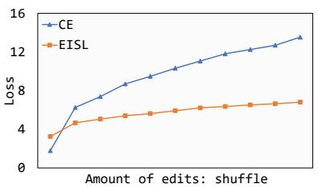

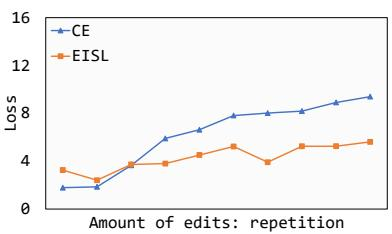

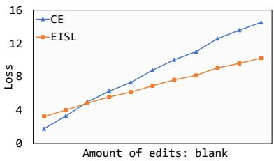  
Figure 2: Sensitivity of CE and EISL loss w.r.t different types of text edits as the amount of edits increases (x-axis). We use a fixed machine translation model, synthesize different types of edits on target text, and measure the CE and EISL losses, respectively. The edit types include shuffle (changing the word order), repetition (words being selected are repeated), and word blank (words being replaced with a blank token). CE loss tends to increase drastically once a small amount of edits is applied. In contrast, EISL loss increases much more slowly, showing its robustness.

Prior works have tried to address this problem using reinforcement learning (RL) (Guo et al., 2021, O’Neill and Bollegala, 2019, Wieting et al., 2019). For example, policy gradient was used to optimize sequence rewards such as BLEU metric (Ranzato et al., 2016, Liu et al., 2017). Such algorithms assign high rewards to sentences that are close to the target sentence. Though it is a valid objective to optimize, policy optimization faces significant challenges in practice. The high variance of gradient estimate makes the training extremely difficult, and almost all previous attempts rely on fine-tuning from models trained with CE loss, often with unclear improvement (Wu et al., 2018).

In this paper, we propose an alternative loss to overcome the above weakness of CE loss, but reserve all nice properties such as being end-to-end differentiable, easy to implement, and efficient to compute, which hence can be used as a drop-in replacement or combined with CE. The loss is based on the observation that a viable candidate sequence shares many sub-sequences with the target. Our loss, called edit-invariant sequence loss (EISL), models the matching of each reference n-gram across all n-grams in a candidate sequence. The design is motivated by the translation invariance properties of ConvNets on images (see Figure 3), and captures the edit invariance properties of text n-grams in calculating the loss. Figure 2 shows the invariance property of EISL in comparison with CE. Appealingly, we show the conventional CE loss is a special case of EISL—when n equals to the sequence length, EISL calculates the exact sequence matching loss and reduces to CE. Moreover, the computations of EISL is essentially a convolution operation of candidate sequence using target n-grams as kernels, which is very easy to implement with existing deep learning libraries.

To demonstrate the effectiveness of EISL loss, we conduct experiments on three representative tasks: machine translation with noisy training target, unsupervised text style transfer (only weak references are available), and non-autoregressive generation with flexible generation order. Experiments demonstrate EISL loss can be easily incorporated with a series of sequence models and outperforms CE and other popular baselines across the board.

## 2 Related Work

Deep neural sequence models such as recurrent neural networks (Sutskever et al., 2014, Mikolov et al., 2010) and transformers (Vaswani et al., 2017) have achieved great progress in many text generation tasks like machine translation (Bahdanau et al., 2015, Vaswani et al., 2017). These models are typically trained with the maximum-likelihood objective, which can lead to sub-optimal performance due to CE’s exact sequence matching assumption. There are lots of works trying to overcome this weakness. For examples, some works (Ranzato et al., 2016, Rennie et al., 2017, Liu et al., 2017, Shen et al., 2016, Smith and Eisner, 2006) proposed to use policy gradient or minimum risk training to optimize the expected BLEU metric (Papineni et al., 2002a). Due to the high variance and unstableness in RL training, a variety of training tricks are used in practice. Wieting et al. (2019) developed a new reward function based on semantic similarity for translation. Guo et al. (2021) introduced soft Q-learning for more efficient RL training. On the other hand, Zhukov and Kretov (2017), Casas et al. (2018) made the initial attempts to develop differentiable BLEU objectives, making soft approximations to the count of n-gram matching in the original BLEU formulation. Shao et al. (2018, 2021, 2020) minimized the n-gram difference between the model outputs and targets in nonautoregressive generation.

Another line of research that is relevant to our work is learning with noisy labels in classification (Zhang and Sabuncu, 2018, Xu et al., 2019, Wang et al., 2019b, Hu et al., 2019). For text generation, Nicolai and Silfverberg (2020) proposed student forcing to substitute teacher forcing, which can alleviate the influence of noise in the target sequence during decoding. Kang and Hashimoto (2020) proposed loss truncation, which adaptively removes high-loss examples considered as invalid data. Our empirical study shows substantial improvement of our approach over the previous ones.

## 3 Edit-Invariant Sequence Loss

In this section, we first review the conventional cross-entropy (CE) loss for sequence learning, and point out its weakness, especially when the target sequence is edited. We then introduce the EISL loss which gives a model the flexibility to learn from sub-sequences in a target sequence.

We first establish notations for the sequence generation setting. Let $( x , y ^ { * } )$ be a paired data sample where x is the input and $\pmb { y } ^ { * } = ( y _ { 1 } ^ { * } , . . . , y _ { T ^ { * } } ^ { * } )$ is the reference target sequence. Define $\pmb { y } = ( y _ { 1 } , . . . , y _ { T } )$ as a candidate sentence. Our goal is to build a model $p _ { \pmb { \theta } } ( \pmb { y } | \pmb { x } )$ that scores a candidate sequence y with parameter θ. In the sequel, we omit the condition x and the subscript θ for simplicity.

## 3.1 The Difficulty of Cross Entropy Loss

The standard approach to learn the sequence model is to minimize the negative log-likelihood (NLL) of the target sequence, i.e., minimizing the CE loss $\mathcal { L } ^ { \mathrm { C E } } ( \pmb { \theta } ) = - \log p ( \pmb { y } ^ { * } )$ . The CE loss assumes exact matching of a candidate sequence y with the target sequence ${ \pmb y } ^ { * }$ . In other words, it maximizes the probability of only the target sequence $y ^ { \ast }$ while penalizing all other possible sequence outputs that might be close but different with $y ^ { \ast }$

The assumption can be problematic in many practical scenarios: (1) For a given target sentence, there could be many ways of paraphrasing the sentence such as word reordering, synonyms replacement, active to passive rewriting, etc. Many of the paraphrases are viable candidate sequences, and/or share many sub-sequences with the reference sentence, and thus should not be treated completely as negative samples. Similar to the translation invariance which is shown to be effective in image modeling, a sequence loss that is robust to the shift and edits of sub-sequences in the reference sequence is preferred in order to model the rich variations of sequences; (2) The edit-invariance property is particularly desirable when the reference target sequence is corrupted with noise or is only weak sequence supervision. For instance, in Figure 3, the word is is repeated twice, which is one of the common errors in typing. Using CE loss in the noisy target setting forces the model to learn the data errors as well. In contrast, a sequence loss robust or invariant to the shift of sub-sequences assigns a high probability to the correct sentence even though it does not match the noisy target exactly. The loss thus offers flexibility for the model to select right information for learning.

## 3.2 EISL: Edit-Invariant Sequence Loss

Motivated by the above discussion, in this section, we draw inspirations from the convolution operation that enables translation invariance in image modeling (Figure 3, left), and propose an editinvariant sequence loss (EISL) as illustrated in Figure 3 (right). Intuitively, for instance, given a 4- gram on the red blanket, because there is no extra knowledge to determine the position of the 4-gram in the noisy target sequence, we compute the losses across all positions in the noisy target sequence and aggregate. This is essentially a convolution over the target noisy sequence with the given n-gram as a convolution kernel.

We now derive the EISL loss in more details. Let $\pmb { y } _ { a : b } = ( y _ { a } , . . . , y _ { b - 1 } )$ denote a sub-sequence of y that starts from index a and ends at index $b - 1$ which is of length $b - a$ . Thus $\pmb { y } _ { i : i + n } ^ { * }$ denotes the ith n-gram in the reference $y ^ { \ast }$ . Denote $C ( \boldsymbol { y } _ { i : i + n } ^ { * } , \boldsymbol { y } )$ as the number of times this n-gram occurs in y:

$$
C ( \pmb { y } _ { i : i + n } ^ { * } , \pmb { y } ) = \sum _ { i ^ { \prime } = 1 } ^ { T - n + 1 } \mathbb { 1 } ( \pmb { y } _ { i ^ { \prime } : i ^ { \prime } + n } = \pmb { y } _ { i : i + n } ^ { * } ) ,\tag{1}
$$

where $\mathbb { 1 } ( \cdot )$ is the indicator function that takes value

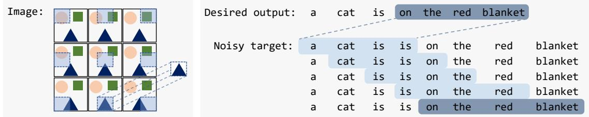  
Figure 3: Inspired by the ConvNet convolution which applies a convolution kernel to different positions in an image and aggregate (left), we devise similar n-gram matching and convolution, which is robust to sequence edits (noises, shuffle, repetition, etc) (right).

1 if the n-grams match, and 0 otherwise. Intuitively, for a text generation model, we would like to maximize the occurrence of an n-gram from the reference in the target sequence. For a given probabilistic model $p _ { \pmb { \theta } } ( \pmb { y } )$ (we omit the parameter θ wherever the meaning is clear), the expected value of $C ( \boldsymbol { y } _ { i : i + n } ^ { * } , \boldsymbol { y } )$ can be computed as follow:

$$
\begin{array} { r l } {  { \mathbb { E } _ { y \sim p ( y ) } [ C ( y _ { i : i + n } ^ { * } , y ) ] } \quad } & { } \\ & { = \sum _ { i ^ { \prime } = 1 } ^ { T - n + 1 } \mathbb { E } _ { p ( y _ { i ^ { \prime } : i ^ { \prime } + n } ) } [ \mathbb { 1 } ( y _ { i ^ { \prime } : i ^ { \prime } + n } = y _ { i : i + n } ^ { * } ) ] } \\ & { = \sum _ { i ^ { \prime } = 1 } ^ { T - n + 1 } p ( y _ { i ^ { \prime } : i ^ { \prime } + n } = y _ { i : i + n } ^ { * } ) . } \end{array}\tag{2}
$$

Thus, for each i-th n-gram in the reference, a straightforward way to define the learning objective is to minimize the negative log value of its expected occurrence, $\mathrm { i . e . , - l o g \mathbb { E } } _ { \pmb { y } \sim p ( \pmb { y } ) } [ C ( \pmb { y } _ { i : i + n } ^ { * } , \pmb { y } ) ]$

The above loss requires computation of the marginal probability $p ( \pmb { y } _ { i ^ { \prime } : i ^ { \prime } + n } = \pmb { y } _ { i : i + n } ^ { * } )$ of an ngram, which is intractable in practice. We therefore derive an upper bound of the loss and use it as the surrogate to minimize in training. We denote the upper bound surrogate as our EISL loss. Specifically, since for a given $i ^ { \prime } , p ( \pmb { y } _ { i ^ { \prime } : i ^ { \prime } + n } = \pmb { y } _ { i : i + n } ^ { * } ) =$ $\begin{array} { r } { \sum _ { \pmb { y } } p ( \pmb { y } _ { < i ^ { \prime } } ) p ( \pmb { y } _ { i ^ { \prime } : i ^ { \prime } + n } = \pmb { y } _ { i : i + n } ^ { * } | \pmb { y } _ { < i ^ { \prime } } ) } \end{array}$ , then:

$$
\begin{array} { r l } & { - \log \mathbb { E } _ { y \sim p ( y ) } [ C ( y _ { i : i + n } ^ { * } , y ) ] } \\ & { = - \log \displaystyle \sum _ { i ^ { \prime } = 1 } ^ { T - n + 1 } p ( y _ { i ^ { \prime } : i ^ { \prime } + n } = y _ { i : i + n } ^ { * } ) , } \\ & { \le \frac { - \mathbb { E } _ { y \sim p ( y ) } \sum _ { i ^ { \prime } = 1 } ^ { T - n + 1 } \log p ( y _ { i ^ { \prime } : i ^ { \prime } + n } = y _ { i : i + n } ^ { * } | y _ { < i ^ { \prime } } ) } { T - n + 1 } } \\ & { : = \mathcal { L } _ { n , i } ^ { \mathrm { E I S L } } ( \pmb \theta ) . } \end{array}\tag{3}
$$

The detailed derivation is attached in Appendix A.1. Notice that the EISL loss involves only the conditional distribution $p ( \pmb { y } _ { i ^ { \prime } : i ^ { \prime } + n } = \pmb { y } _ { i : i + n } ^ { * } | \pmb { y } _ { < i ^ { \prime } } )$ which is convenient to compute—we first sample tokens from the model up to the $i ^ { \prime }$ position, then compute NLL of the reference n-gram $\pmb { y } _ { i : i + n } ^ { * }$ occurring at position $i ^ { \prime }$ under the model distribution. The full $n \mathrm { - }$ gram EISL loss is then defined by averaging across all n-gram positions in the reference:

$$
\mathcal { L } _ { n } ^ { \mathrm { E I S L } } ( \pmb { \theta } ) = \frac { 1 } { T ^ { * } - n + 1 } \sum _ { i = 1 } ^ { T ^ { * } - n + 1 } \mathcal { L } _ { n , i } ^ { \mathrm { E I S L } } ( \pmb { \theta } ) .\tag{4}
$$

In practice, inspired by the standard BLEU metric (more in section 3.3), we could also straightforwardly combine different n-gram losses depending on tasks:

$$
\begin{array} { r } { \boldsymbol { \mathcal { L } } ^ { \mathrm { E I S L } } ( \pmb { \theta } ) = \displaystyle \sum _ { n } \boldsymbol { w } _ { n } \cdot \boldsymbol { \mathcal { L } } _ { n } ^ { \mathrm { E I S L } } ( \pmb { \theta } ) , } \end{array}\tag{5}
$$

where $w _ { n }$ is the weight of the n-gram loss. The rule of thumb is that a n-gram EISL loss with lower n is more robust to noises, as shown in our experiments. Following BLEU, we found that simply using equal weights for different n-grams up to n = 4 often produces good performance.

As discussed shortly, it is appealing that the ngram EISL loss is indeed a direct generalization of the CE loss on the n-gram level: we sum the CE loss of an n-gram over all candidate sequence positions by conditioning on samples from the model. Besides, the derivation of the upper bound makes no assumption on the probability function $p ( \pmb { y } )$ , hence holds for both autogressive and nonautoregressive sequence models as demonstrated in our experiments.

Position Selection Minimizing the gram matching loss over all positions can make the model assign equal probabilities at all positions, which causes the training to collapse. We further adapt the loss to enable the model to automatically learn the positions of reference n-grams. For notation simplicity, let $g _ { i , i ^ { \prime } } ^ { n }$ denote the conditional probability $p ( \pmb { y } _ { i ^ { \prime } : i ^ { \prime } + n } \ = \ \pmb { y } _ { i : i + n } ^ { * } | \pmb { y } _ { < i ^ { \prime } } )$ involved above (Eq.3). We can vectorize the probability to get $\pmb { g } _ { i } ^ { n } = [ g _ { i , 1 } ^ { n } , . . . , g _ { i , T - n + 1 } ^ { n } ] ^ { T }$ , spanning all potential positions in the candidate sequence. We then normalize the probability vector $\pmb { g } _ { i } ^ { n }$ by Gumbel softmax (Jang et al., 2017), denoted as $\begin{array} { l l } { { { q } _ { i } ^ { n } } } & { = } \end{array}$ Gumbel\_softmax $( g _ { i } ^ { n } )$ , which we use as the weight for every n-gram positions. We multiply the weight with the original log probability to get the new adjusted loss:

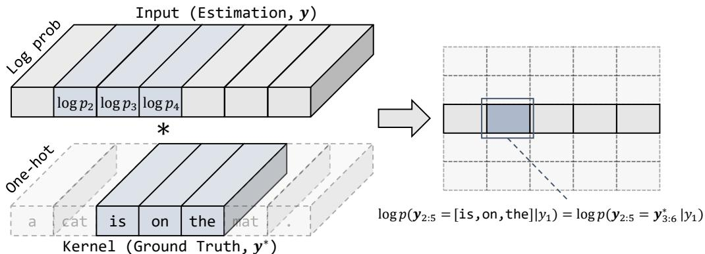  
Figure 4: As convolution is a common operation for translation invariance in image, we adopt a convolution to achieve the translation invariance in text. The input is the distribution from the model output in log domain, kernel represents the convolution kernel and is the convolution operation. In this 3-gram example, there are 5 kernels, which correspond to the 5 rows on the right.

$$
\begin{array} { r } { \mathcal { L } _ { n , i } ^ { \mathrm { E I S L } } ( \pmb { \theta } ) \approx - \pmb { q } _ { i } ^ { n } \cdot \log \pmb { g } _ { i } ^ { n } . } \end{array}\tag{6}
$$

The loss can roughly be viewed as the “entropy” of the unnormalized probabilities $\pmb { g } _ { i } ^ { n }$ , which has minimal value if the mass of the probability is assigned to one location only. Intuitively, if an $g _ { i , i ^ { \prime } } ^ { n }$ is large, then it is likely ${ \dot { i } } ^ { \prime }$ is the correct position for the reference n-gram, hence the weight for this position should also be large. This is like the greedy exploitation in reinforcement learning (Mnih et al., 2015). On the other hand, to overcome over-exploitation, the Gumbel softmax introduces randomness in the weight assignment, which helps balance the exploitation-exploration trade-off in position selection for the model.

Efficient Approximate Computation: EISL as Convolution We show the EISL loss can be computed efficiently using the common convolution operator, with very little additional cost compared with the CE loss. The computation involves moderate approximation if the generation model is an autoregressive model, and is exact in the case of a non-autoregressive model (e.g., as in section 4.3). We first discuss the easy case when the model is a non-autoregressive model, where we have $g _ { i , i ^ { \prime } } ^ { n } ~ = ~ p ( y _ { i ^ { \prime } : i ^ { \prime } + n } ~ = ~ y _ { i : i + n } ^ { * } | y _ { < i ^ { \prime } } ) ~ =$ $\begin{array} { r } { \prod _ { j = 1 } ^ { n } p ( y _ { i ^ { \prime } + j - 1 } = y _ { i + j - 1 } ^ { * } ) } \end{array}$ . Denote $V$ as the vocabulary size. Let $\pmb { P } = [ \pmb { p } _ { 1 } , \pmb { p } _ { 2 } , . . . \pmb { p } _ { T } ]$ be the probability output by the model across positions, where $p _ { i ^ { \prime } } \in \mathbb { R } ^ { V }$ is the probability output after softmax at i′-th position, and each $\mathbf { \mathit { p } } _ { i ^ { \prime } }$ is independent with each other. On this basis, we compute the key quantity log $\pmb { g } _ { i } ^ { n }$ in Eq. 6 as the direct output of the convolution operator. As shown in Figure 4, we can get log $\pmb { g } _ { i } ^ { n }$ by applying convolution on log $P _ { \cdot }$ with $\pmb { y } _ { i : i + n }$ as the kernels:

$$
\log g _ { i } ^ { n } = \mathtt { C o n v } ( \log P , \mathrm { O n e h o t } ( y _ { i : i + n } ^ { * } ) ) ,\tag{7}
$$

where Onehot( ) maps each token to its corresponding one-hot representation and $\mathrm { C o n v } ( \cdot , \cdot )$ is the convolution operation with the first argument as input and the second as the kernel. We transform P into log domain to turn the probability multiplication into log probability summations, where Conv can be directly applied. As shown in Figure 4, log $_ { P }$ is of shape $V \times T$ and Onehot $( \boldsymbol { y } _ { i : i + n } ^ { * } )$ is of shape $V \times n ,$ so Conv(log $P ,$ Onehot $( y _ { i : i + n } ^ { * } ) )$ is an one-dimensional convolution on the sequence axis. Formally, the i′-th convolutional output is:

$$
\begin{array} { r l } { \log g _ { i , i ^ { \prime } } ^ { n } = \displaystyle \sum _ { j = 1 } ^ { n } \log { \pmb { p } _ { i ^ { \prime } + j - 1 } } \cdot \mathrm { O n e h o t } \left( y _ { i + j - 1 } ^ { * } \right) } \\ { \displaystyle } & { = \displaystyle \sum _ { j = 1 } ^ { n } \log p ( y _ { i ^ { \prime } + j - 1 } = y _ { i + j - 1 } ^ { * } | \pmb { y } _ { < i ^ { \prime } + j - 1 } ) } \end{array}\tag{8}
$$

After obtaining $\pmb { g } _ { i } ^ { n }$ by convolution, the EISL loss in Eq. 6 can be easily calculated. We now discuss the case of autoregressive model, where by definition we have $\begin{array} { r } { g _ { i , i ^ { \prime } } ^ { n } = \prod _ { j = 1 } ^ { n } p ( y _ { i ^ { \prime } + j - 1 } } \end{array}$ $y _ { i + j - 1 } ^ { * } | { \pmb y } _ { < i ^ { \prime } } , { \pmb y } _ { i : i + j - 1 } ^ { * } )$ . The dependence on both $\mathbf { \delta } \mathbf { \cdot } \mathbf { \zeta } \mathbf { \cdot } \mathbf { \vec { \mathbf { y } } } _ { }$ and $y _ { i : i + j - 1 } ^ { * }$ in each conditional makes exact estimation of log $\pmb { g } _ { i } ^ { n }$ very complicated and costly. We thus introduce the approximation where we approximate $g _ { i , i ^ { \prime } } ^ { n }$ as $\begin{array} { r } { \widetilde { g } _ { i , i ^ { \prime } } ^ { n } \ = \ \prod _ { j = 1 } ^ { n } p ( y _ { i ^ { \prime } + j - 1 } \ = } \end{array}$ $y _ { i + j - 1 } ^ { * } | { \pmb y } _ { < i ^ { \prime } + j - 1 } \rangle$ e. That is, instead of conditioning on $\pmb { y } _ { i : i + j - 1 } ^ { * }$ , we use the model-generated tokens $y _ { i ^ { \prime } : i ^ { \prime } + j - 1 }$ as the condition. This simple approximation enables us to define the probability output

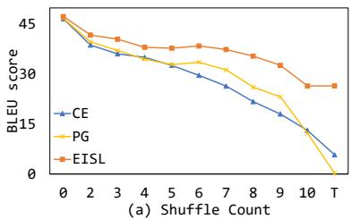

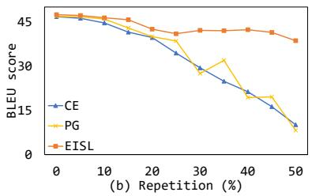

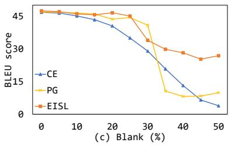

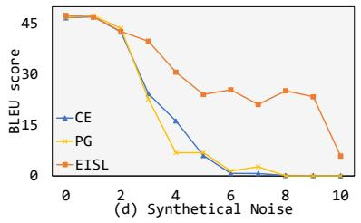

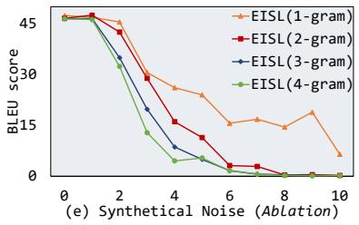  
Figure 5: Results of Translation with Noisy Target on German-to-English(de-en) from Multi30k. BLEU scores are computed against clean test data. The x-axis of all figures denotes the level of noise we injected to target sequences in training. (a) Shuffle: selected tokens are shuffled; (b) Repetition: selected tokens are repeated; (c) Blank: selected tokens are substituted with a special blank token; (d) Synthetical noise: the combination of all three noises $( x = x _ { 0 }$ stands for the combination of 5x % of all kinds of noises); (e) Ablation study of n-grams for EISL on synthetical noise. BLEURT results are shown in Appendix A.3.

P as in the non-autoregressive case, by just performing a forward pass of the model (i.e., sampling a token $\pmb { y } _ { i } ^ { \prime }$ for each position $i ^ { \prime }$ and feeding it to the next step to get $p _ { i ^ { \prime } + 1 } )$ . We can then apply the same convolution operator to approximately obtain log $\pmb { g } _ { i } ^ { n }$ as in Eq. 7. Besides the great gain of computational efficiency, we note that the approximation is also effective, especially due to the position selection discussed above. Specifically, for each reference n-gram $y _ { i : i + n } ^ { * } ,$ the position selection in effect (softly) picks those large-value $g _ { i , i ^ { \prime } } ^ { n }$ (while dropping other low-value ones) to evaluate the loss. A large $g _ { i , i ^ { \prime } } ^ { n }$ value indicates the candidate ${ \bf { \mathcal { y } } } _ { i ^ { \prime } : i ^ { \prime } + n }$ is highly likely to match the reference $\pmb { y } _ { i : i + n } ^ { * }$ , meaning that using ${ \bf { } } y _ { i ^ { \prime } : i ^ { \prime } + n }$ in replacement of $\pmb { y } _ { i : i + n } ^ { * }$ is a reasonable approximation for evaluating the above conditionals. We provide empirical analysis of the approximation in Appendix A.8, where we show the efficient approximate EISL loss values are very close to the exact EISL values.

## 3.3 Connections with Common Techniques

CE is a special case of EISL A nice property of EISL is that it subsumes the standard CE loss as a special case. To see this, set $n = T ^ { * }$ (the target sequence length), and we have:

$$
\mathcal { L } _ { T ^ { * } } ^ { \mathrm { E I S L } } = \mathcal { L } _ { T ^ { * } , 1 } ^ { \mathrm { E I S L } } = - \log { \pmb { g } _ { 1 } ^ { T ^ { * } } } = - \log p ( \pmb { y } = \pmb { y } ^ { * } ) = \mathcal { L } ^ { \mathrm { C E } } .
$$

The connection shows the generality of EISL. As a generalization of CE, it enables learning at arbitrary n-gram granularity.

Connections between BLEU and EISL Both our method and the popular BLEU (Papineni et al., 2002b) metric use n-grams as the basis in formulation. Here we articulate the connections and difference between the two. Let us first take a review of the BLEU metric. Specifically, BLEU is defined as a weighted geometric mean of n-gram precisions:

$$
\begin{array} { r l } & { \mathrm { \sf ~ B L E U } = \mathrm { \bf B P } \cdot \exp \left( \displaystyle \sum _ { n = 1 } ^ { N } w _ { n } \log \mathrm { p r e c } _ { n } \right) } \\ & { \mathrm { \sf ~ p r e c } _ { n } = \frac { \sum _ { \substack { s \in \mathrm { \bf g r a m } _ { n } ( \pmb { y } ) } } \operatorname* { m i n } \left( C \left( \pmb { s } , \pmb { y } \right) , C \left( \pmb { s } , \pmb { y } ^ { * } \right) \right) } { \sum _ { \substack { s \in \mathrm { \bf g r a m } _ { n } ( \pmb { y } ) } } C \left( \pmb { s } , \pmb { y } \right) } , } \end{array}
$$

where BP is a brevity penalty depending on the lengths of y and $y ^ { * } ; N$ is the maximum n-gram order (typically $N = 4 ) ; \{ w _ { n } \}$ are the weights which usually take $1 / N ;$ prec is the n-gram precision, gram $\mathbf { \Omega } _ { \boldsymbol { \imath } } ( \boldsymbol { \mathsf { \pmb { y } } } )$ is the set of unique n-gram subsequences of ${ \mathbf { } } ^ { \mathbf { \beta } } { \mathbf { } } ^ { \mathbf { \beta } }$ and $C ( \pmb { s } , \pmb { y } )$ is the number of times a gram s occurs in y as defined in Eq. 1. The conventional formulation above enumerates over unique n-grams in $\mathbf { \pmb { y } } .$ In contrast, we enumerate over token indexes in calculating the n-gram matching loss. BLEU considers the n-gram precisions and has a penalty term while EISL simply maximizes the log probability of n-gram matchings.

The non-differentiability of BLEU makes it hard to optimize directly, hence most prior attempts resort to reinforcement learning algorithms and use BLEU as the reward (Ranzato et al., 2016, Liu et al., 2017). There are also some works trying to introduce differentiable BLEU metric using approximation like (Zhukov and Kretov, 2017). However, such losses are often too complicated and have not yet demonstrated to perform well in practice.

## 4 Experiments

In this section, we present the experimental results on three text generation settings to test EISL’s effectiveness, including learning from noisy text, learning from weak sequence supervision, and nonautoregressive generation models that require flexibility in generation orders. More details of the experimental setting are provided in Appendix A.2.

## 4.1 Learning from Noisy Text

To test the robustness to noise, we evaluate on the task of machine translation with noisy training target, in which we train the models with noisy sequence targets and evaluate with clean test data.

Setup We test EISL loss on Multi30k and WMT18 raw corpus. We use German-to-English (de-en) dataset from Multi30k (Elliott et al., 2016), which contains 29k training instances. As inspired by Shen et al. (2019), to simulate various noises in the real data, we introduce four types of noises: shuffle, repetition, blank, and the synthetical noise, i.e., the combination of the aforementioned three types of noise. The noises are only added to the training target sequences. To verify the validity of EISL on real noisy data, we also use Germanto-English (de-en) dataset from WMT18 raw corpus, which is a very noisy de-en corpus crawled from the web. We randomly select different number of training samples to test the influence of the data scale. We use a Transformer-based pretrained model BART-base (Lewis et al., 2020) and adopt greedy decoding in training and beam search (beam size = 5) in evaluation. We compare EISL loss with CE loss, Policy Gradient (PG), and Loss Truncation (LT). We also conduct ablation experiments to explore the effect of different n-grams in EISL loss. We use both BLEU (Papineni et al., 2002b) and BLEURT, an advanced model-based metric (Sellam et al., 2020), as the automatic metrics for evaluation. Due to space limit, we report BLEU results in the main paper, and defer BLEURT results in the appendix, where we can see BLEURT leads to the same conclusion as BLEU.

Results The results on noisy Multi30k are presented in Figure 5. The proposed EISL loss provides significantly better performance than CE loss and PG on all the noise types, especially on the high-level noise end. For synthetical noise as shown in Figure 5(d), it’s interesting to see that CE and PG completely fail when the noise level is beyond 6, but model trained with EISL has high BLEU score, demonstrating EISL can select useful information to learn despite high noise. This validates that the proposed EISL is much less sensitive to the noise than the traditional CE loss and policy gradient training method. The results of different n-gram are shown in Figure 5(e). As the noise increases, the importance of lower grams, e.g., 1-gram, is more obvious. The results on real noisy data, WMT18 raw data, are shown in Figure 6. EISL loss achieves better performance than CE loss and PG, and the difference is getting larger when the training data scale increases. This again demonstrates EISL could learn more valid information in rather noisy data, while CE loss which only considers whole-sentence matching could struggle on noisy data. In Appendix A.3, we provide more results (e.g., comparison with loss truncation (Kang and Hashimoto, 2020)) and case studies.

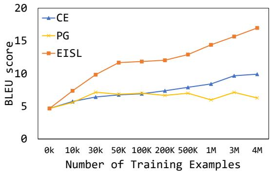  
Figure 6: Results of German-to-English(de-en) Translation on WMT18 raw corpus. BLEU scores are computed against clean parallel test data. On x-axis, 0k denotes the performance of the pretrained model. BLEURT results are similar as shown in Appendix A.3.

<table><tr><td>Model</td><td>Acc (%)</td><td>BLEU</td><td>BLEU (Human)</td><td>PPL</td><td>POS Distance</td></tr><tr><td>Hu et al. (2017)</td><td>86.7</td><td>58.4</td><td>=</td><td>177.7</td><td></td></tr><tr><td>Shen et al. (2017)</td><td>73.9</td><td>20.7</td><td>7.8</td><td>72.0</td><td></td></tr><tr><td>He et al. (2020)</td><td>87.9</td><td>48.4</td><td>18.7</td><td>31.7</td><td>一</td></tr><tr><td>Dai et al. (2019)</td><td>87.7</td><td>54.9</td><td>20.3</td><td>73.0</td><td>-</td></tr><tr><td>Tian et al. (2018)</td><td>88.8</td><td>65.71</td><td>22.56</td><td>42.07</td><td>0.352</td></tr><tr><td>with EISL (Ours)</td><td>88.8</td><td>68.51</td><td>23.17</td><td>41.56</td><td>0.275</td></tr></table>

<table><tr><td>Tian et al. (2018) (%)</td><td>with EISL (Ours) (%)</td><td>equal (%)</td></tr><tr><td>22.0</td><td>30.7</td><td>47.3</td></tr></table>

Table 1: Top: automatic evaluations on the Yelp review dataset. The BLEU (human) is calculated using the 1000 human annotated sentences as ground truth from Li et al. (2018). The first four results are from the original papers. Bottom: human evaluation statistics of base model vs. with EISL. The results denotes the percentages of inputs for which the model has better transferred sentences than other model.

## 4.2 Learning from Weak Supervisions: Style Transfer

We experiment on transferring two types of text styles (Jin et al., 2022), namely sentiment and political slant, to verify EISL can learn from weak sequence supervisions.

Setup We use the Yelp review dataset and political dataset. Yelp contains almost 250k negative sentences and 380K positive sentences, of which the ratio of training, valid and test is 7 : 1 : 2. Li et al. (2018) annotated 1000 sentences as ground truth for better evaluation. The political dataset is comprised of top-level comments on Facebook posts from all 412 members of the United States Senate and House who have public Facebook pages (Voigt et al., 2018). The data set contains 270K democratic sentences and 270K republican sentences. And there exists no ground truth for evaluation. The data preprocessing follows Tian et al. (2018). The structured content preserving model (Tian et al., 2018) is adopted as the base model.

Following previous work, we compute automatic evaluation metrics: accuracy, BLEU score, perplexity (PPL) and POS distance. We also perform human evaluations on Yelp data to further test the transfer quality.

Results As sentiment results are shown in Table 1, the BLEU gets improved from 65.71 to 68.51 with EISL loss. On the premise of the correctness of sentiment transfer, EISL loss plays a critical role to guarantee lexical preservation. In the meanwhile, all of BLEU(human), PPL, and POS distance get improved. It is not surprising that EISL loss helps generate sentences more fluently and select the more appropriate words conditions on the content information. As the human evaluation results are shown in Table 1, the model with EISL loss performs better, in accord with the automatic metrics. After analyzing the generated samples, we found EISL loss could drive the model to adopt the words which fit the scene better and could understand more semantics but not just replace some keywords. See some examples in the Appendix A.4.1.

We report the results of political data in Appendix A.4.2. Our method outperforms all models on BLEU, PPL, and POS distance with comparable accuracy. For a more fair comparison with the base model, our EISL loss improves the base model on all four metrics, including the accuracy.

The results demonstrate the effectiveness of EISL for weak supervision task, improving both transfer accuracy fluency and content preservation.

## 4.3 Learning Non-Autoregressive Generation

Non-autoregressive neural machine translation (NAT, (Gu et al., 2018)) is proposed to predict tokens simultaneously in a single decoding step, which aims at reducing the inference latency. The non-autoregressive nature makes it extremely hard for models to keep the order of words in the sentences, hence CE often struggles with NAT problems. In experiments, we show EISL is superior to CE in NAT which requires modeling flexible generation order of the text.

Setup We use English-to-German dataset from WMT14 (Luong et al., 2015), which contains 4.5M training instances. We apply our proposed EISL loss on both fully NAT models (Gu et al., 2018, Sun et al., 2019) and iterative NAT models (Lee et al., 2018, Gu et al., 2019, Ghazvininejad et al., 2019), showing its general applicability and superiority, and we also compare with a wide range of recent methods (Shao et al., 2020, Wang et al., 2019a, Li et al., 2019, Ghazvininejad et al., 2020). We evaluate with both BLEU and BLEURT metrics.

Results We first summarize the comparison of BLEU between EISL loss and CE loss in Table 2 (comparison of BLEURT is in Appendix A.5.2). The proposed EISL improves the model performance on both the KD and original datasets. More specifically, for fully NAT models (Vanilla-NAT and NAT-CRF), EISL gives strong improvement. For iterative NAT models (iNAT, LevT, and CMLM), EISL also significantly outperforms the baselines when the iteration step is restricted to a small level as suggested by Kasai et al. (2020). (We show in Appendix A.5.1 that, with increasing iteration steps, the difference fades away. However, as studied in Kasai et al. (2020), iterative NAT models with many iteration steps do not hold the intrinsic advantage of speed since Transformer baselines with a shallow decoder can achieve comparable speedup and only at the sacrifice of minor performance drop.) Table 3 provides more comparison of with recent strong baselines. Specifically, we apply our EISL on the CMLM base model (Ghazvininejad et al., 2019) which shows strong superiority. We provide qualitative analysis in Appendix A.5.3.

<table><tr><td rowspan="2">Decoding method</td><td rowspan="2">Model</td><td colspan="2">WMT14 en-de KD</td><td colspan="2">WMT14 en-de</td></tr><tr><td>CE</td><td>EISL</td><td>CE</td><td>EISL</td></tr><tr><td>Autoregressive</td><td>Transformer base (Vaswani et al., 2017)</td><td></td><td>27.48</td><td></td><td></td></tr><tr><td rowspan="5">Non-Autoregressive</td><td>Vanilla-NAT (Gu et al., 2018)</td><td>17.9</td><td>22.2</td><td>9.12</td><td>15.46</td></tr><tr><td>NAT-CRF (Sun et al., 2019)</td><td>21.88</td><td>22.43</td><td></td><td></td></tr><tr><td>iNAT (Lee et al., 2018)</td><td>16.67</td><td>22.59</td><td></td><td></td></tr><tr><td>LevT (Gu et al., 2019)</td><td>17.84</td><td>23.61</td><td>9.91</td><td>18.47</td></tr><tr><td>CMLM (Ghazvininejad et al., 2019)</td><td>17.12</td><td>23.05</td><td></td><td></td></tr></table>

Table 2: The test-set BLEU of EISL loss and CE loss applied to non-autoregressive models. “KD” refers to the standard “knowledge distillation” setting in NAT (Gu et al., 2018). iNAT, LevT and CMLM are iterative non-autoregressive models, that could run in multiple decoding iterations. However, the first decoding iteration of these models is fully non-autoregressive, which is what we use as our baselines.
<table><tr><td>Fully Non-Autoregressive model</td><td>WMT14 en-de KD</td></tr><tr><td>CMLM with CE (Ghazvininejad et al., 2019)</td><td>17.12</td></tr><tr><td>Auxiliary Regularization (Wang et al., 2019a)</td><td>20.65</td></tr><tr><td>Bag-of-ngrams Loss (Shao et al., 2020)</td><td>20.90</td></tr><tr><td>Hint-based Training (Li et al., 2019)</td><td>21.11</td></tr><tr><td>CMLM with AXE (Ghazvininejad et al., 2020)</td><td>23.53</td></tr><tr><td>CMLM with EISL (Ours)</td><td>24.17</td></tr></table>

Table 3: The test-set BLEU of CMLM trained with our EISL, compared to other recent fully non-autoregressive methods. The baseline results are from (Ghazvininejad et al., 2020), where CMLM-with-AXE generates 5 candidates and ranks with loss. Our method follows the same generation configuration as CMLM-with-AXE.

## 5 Conclusions

We have developed Edit-Invariant Sequence Loss (EISL) for end-to-end training of neural text generation models. The proposed method is insensitive to the shift of n-grams in target sequences, hence suitable for training with noisy data and weak supervisions, where CE loss fails easily. We show CE loss is a special case of EISL and build the connection of EISL with BLEU metric and convolution operation, which both have the invariant property. Experiments on translation with noisy target, text style transfer, and non-autoregressive neural machine translation demonstrate the superiority of our method. The more general applications and superiority of EISL on other diverse text generation problems as well as fundamental challenges, such as compositional generalization (Andreas et al., 2019) and causal invariance (Hu and Li, 2021) in language, remain to be explored further, which we are excited to study in the future.

## References

Jacob Andreas, Marco Baroni, Alexis Conneau, Douwe Kiela, Holger Schwenk, Loïc Barrault, Antoine Bordes, Jacob Devlin, Alona Fyshe, Leila Wehbe, et al. 2019. Measuring compositionality in representation learning. In International Conference on Learning

Representations, volume 375, pages 2227–2237. Association for Computational Linguistics.

Dzmitry Bahdanau, Kyunghyun Cho, and Yoshua Bengio. 2015. Neural machine translation by jointly learning to align and translate. In 3rd International Conference on Learning Representations, ICLR 2015, San Diego, CA, USA, May 7-9, 2015, Conference Track Proceedings.

Noe Casas, José A. R. Fonollosa, and Marta R. Costajussà. 2018. A differentiable BLEU loss. analysis and first results. In 6th International Conference on Learning Representations, ICLR 2018, Vancouver, BC, Canada, April 30 - May 3, 2018, Workshop Track Proceedings. OpenReview.net.

Ning Dai, Jianze Liang, Xipeng Qiu, and Xuanjing Huang. 2019. Style transformer: Unpaired text style transfer without disentangled latent representation. In Proceedings ofthe 57th Annual Meeting ofthe Associationfor Computational Linguistics, pages 5997– 6007, Florence, Italy. Association for Computational Linguistics.

Desmond Elliott, Stella Frank, Khalil Sima’an, and Lucia Specia. 2016. Multi30K: Multilingual English-German image descriptions. In Proceedings of the 5th Workshop on Vision and Language, pages 70– 74, Berlin, Germany. Association for Computational Linguistics.

Marjan Ghazvininejad, Vladimir Karpukhin, Luke Zettlemoyer, and Omer Levy. 2020. Aligned cross entropy for non-autoregressive machine translation. In Proceedings of the 37th International Conference on Machine Learning, ICML 2020, 13-18 July 2020,

Virtual Event, volume 119 of Proceedings ofMachine Learning Research, pages 3515–3523. PMLR.

Marjan Ghazvininejad, Omer Levy, Yinhan Liu, and Luke Zettlemoyer. 2019. Mask-predict: Parallel decoding of conditional masked language models. In Proceedings of the 2019 Conference on Empirical Methods in Natural Language Processing and the 9th International Joint Conference on Natural Language Processing (EMNLP-IJCNLP), pages 6112– 6121, Hong Kong, China. Association for Computational Linguistics.

Jiatao Gu, James Bradbury, Caiming Xiong, Victor O. K. Li, and Richard Socher. 2018. Non-autoregressive neural machine translation. In 6th International Conference on Learning Representations, ICLR 2018, Vancouver, BC, Canada, April 30 - May 3, 2018, Conference Track Proceedings. OpenReview.net.

Jiatao Gu, Changhan Wang, and Junbo Zhao. 2019. Levenshtein transformer. In Advances in Neural Information Processing Systems 32: Annual Conference on Neural Information Processing Systems 2019, NeurIPS 2019, December 8-14, 2019, Vancouver, BC, Canada, pages 11179–11189.

Han Guo, Bowen Tan, Zhengzhong Liu, Eric P Xing, and Zhiting Hu. 2021. Text generation with efficient (soft) Q-learning. arXiv preprint arXiv:2106.07704.

Junxian He, Xinyi Wang, Graham Neubig, and Taylor Berg-Kirkpatrick. 2020. A probabilistic formulation of unsupervised text style transfer. In 8th International Conference on Learning Representations, ICLR 2020, Addis Ababa, Ethiopia, April 26- 30, 2020. OpenReview.net.

Zhiting Hu and Li Erran Li. 2021. A causal lens for controllable text generation. Advances in Neural Information Processing Systems, 34.

Zhiting Hu, Bowen Tan, Russ R Salakhutdinov, Tom M Mitchell, and Eric P Xing. 2019. Learning data manipulation for augmentation and weighting. Advances in Neural Information Processing Systems, 32.

Zhiting Hu, Zichao Yang, Xiaodan Liang, Ruslan Salakhutdinov, and Eric P. Xing. 2017. Toward controlled generation of text. In Proceedings of the 34th International Conference on Machine Learning, ICML 2017, Sydney, NSW, Australia, 6-11 August 2017, volume 70 of Proceedings of Machine Learning Research, pages 1587–1596. PMLR.

Eric Jang, Shixiang Gu, and Ben Poole. 2017. Categorical reparameterization with gumbel-softmax. In 5th International Conference on Learning Representations, ICLR 2017, Toulon, France, April 24-26, 2017, Conference Track Proceedings. OpenReview.net.

Di Jin, Zhijing Jin, Zhiting Hu, Olga Vechtomova, and Rada Mihalcea. 2022. Deep learning for text style transfer: A survey. Computational Linguistics, 48(1):155–205.

Daniel Kang and Tatsunori B. Hashimoto. 2020. Improved natural language generation via loss truncation. In Proceedings ofthe 58th Annual Meeting of the Association for Computational Linguistics, pages 718–731, Online. Association for Computational Linguistics.

Jungo Kasai, Nikolaos Pappas, Hao Peng, J. Cross, and Noah A. Smith. 2020. Deep encoder, shallow decoder: Reevaluating the speed-quality tradeoff in machine translation. ArXiv preprint, abs/2006.10369.

Jason Lee, Elman Mansimov, and Kyunghyun Cho. 2018. Deterministic non-autoregressive neural sequence modeling by iterative refinement. In Proceedings ofthe 2018 Conference on Empirical Methods in Natural Language Processing, pages 1173–1182, Brussels, Belgium. Association for Computational Linguistics.

Mike Lewis, Yinhan Liu, Naman Goyal, Marjan Ghazvininejad, Abdelrahman Mohamed, Omer Levy, Veselin Stoyanov, and Luke Zettlemoyer. 2020. BART: Denoising sequence-to-sequence pre-training for natural language generation, translation, and comprehension. In Proceedings ofthe 58th Annual Meeting of the Association for Computational Linguistics, pages 7871–7880, Online. Association for Computational Linguistics.

Jiwei Li, Will Monroe, Alan Ritter, Dan Jurafsky, Michel Galley, and Jianfeng Gao. 2016. Deep reinforcement learning for dialogue generation. In Proceedings of the 2016 Conference on Empirical Methods in Natural Language Processing, pages 1192– 1202, Austin, Texas. Association for Computational Linguistics.

Juncen Li, Robin Jia, He He, and Percy Liang. 2018. Delete, retrieve, generate: a simple approach to sentiment and style transfer. In Proceedings ofthe 2018 Conference of the North American Chapter of the Associationfor Computational Linguistics: Human Language Technologies, Volume 1 (Long Papers), pages 1865–1874, New Orleans, Louisiana. Association for Computational Linguistics.

Zhuohan Li, Zi Lin, Di He, Fei Tian, Tao Qin, Liwei Wang, and Tie-Yan Liu. 2019. Hint-based training for non-autoregressive machine translation. In Proceedings of the 2019 Conference on Empirical Methods in Natural Language Processing and the 9th International Joint Conference on Natural Language Processing (EMNLP-IJCNLP), pages 5708– 5713, Hong Kong, China. Association for Computational Linguistics.

Shuai Lin, Wentao Wang, Zichao Yang, Xiaodan Liang, Frank F Xu, Eric Xing, and Zhiting Hu. 2020. Datato-text generation with style imitation. In Findings of the Association for Computational Linguistics: EMNLP 2020, pages 1589–1598.

Siqi Liu, Zhenhai Zhu, Ning Ye, Sergio Guadarrama, and Kevin Murphy. 2017. Improved image captioning via policy gradient optimization of spider. In

IEEE International Conference on Computer Vision, ICCV 2017, Venice, Italy, October 22-29, 2017, pages 873–881. IEEE Computer Society.

Thang Luong, Hieu Pham, and Christopher D. Manning. 2015. Effective approaches to attention-based neural machine translation. In Proceedings ofthe 2015 Conference on Empirical Methods in Natural Language Processing, pages 1412–1421, Lisbon, Portugal. Association for Computational Linguistics.

Tomás Mikolov, Martin Karafiát, Lukás Burget, Jan Cernocký, and Sanjeev Khudanpur. 2010. Recurrent neural network based language model. In IN-TERSPEECH 2010, 11th Annual Conference ofthe International Speech Communication Association, Makuhari, Chiba, Japan, September 26-30, 2010, pages 1045–1048. ISCA.

Volodymyr Mnih, Koray Kavukcuoglu, David Silver, Andrei A. Rusu, Joel Veness, Marc G. Bellemare, Alex Graves, Martin A. Riedmiller, Andreas Fidjeland, Georg Ostrovski, Stig Petersen, Charles Beattie, Amir Sadik, Ioannis Antonoglou, Helen King, Dharshan Kumaran, Daan Wierstra, Shane Legg, and Demis Hassabis. 2015. Human-level control through deep reinforcement learning. Nat., 518(7540):529– 533.

Ramesh Nallapati, Bowen Zhou, Cícero Nogueira dos Santos, Çaglar Gülçehre, and Bing Xiang. 2016. Abstractive text summarization using sequence-tosequence rnns and beyond. In Proceedings of the 20th SIGNLL Conference on Computational Natural Language Learning, CoNLL 2016, Berlin, Germany, August 11-12, 2016, pages 280–290. ACL.

Garrett Nicolai and Miikka Silfverberg. 2020. Noise isn’t always negative: Countering exposure bias in sequence-to-sequence inflection models. In Proceedings of the 28th International Conference on Computational Linguistics, pages 2837–2846, Barcelona, Spain (Online). International Committee on Computational Linguistics.

James O’Neill and Danushka Bollegala. 2019. Transfer reward learning for policy gradient-based text generation. ArXiv preprint, abs/1909.03622.

Myle Ott, Sergey Edunov, Alexei Baevski, Angela Fan, Sam Gross, Nathan Ng, David Grangier, and Michael Auli. 2019. fairseq: A fast, extensible toolkit for sequence modeling. In Proceedings ofthe 2019 Conference ofthe North American Chapter ofthe Association for Computational Linguistics (Demonstrations), pages 48–53, Minneapolis, Minnesota. Association for Computational Linguistics.

Kishore Papineni, Salim Roukos, Todd Ward, and Wei-Jing Zhu. 2002a. Bleu: a method for automatic evaluation of machine translation. In Proceedings ofthe 40th annual meeting of the Association for Computational Linguistics, pages 311–318.

Kishore Papineni, Salim Roukos, Todd Ward, and Wei-Jing Zhu. 2002b. Bleu: a method for automatic evaluation of machine translation. In Proceedings ofthe 40th Annual Meeting of the Association for Computational Linguistics, pages 311–318, Philadelphia, Pennsylvania, USA. Association for Computational Linguistics.

Marcis Pinnis. 2018.¯ Tilde’s parallel corpus filtering methods for WMT 2018. In Proceedings of the Third Conference on Machine Translation: Shared Task Papers, pages 939–945, Belgium, Brussels. Association for Computational Linguistics.

Shrimai Prabhumoye, Yulia Tsvetkov, Ruslan Salakhutdinov, and Alan W Black. 2018. Style transfer through back-translation. In Proceedings ofthe 56th Annual Meeting ofthe Associationfor Computational Linguistics (Volume 1: Long Papers), pages 866–876, Melbourne, Australia. Association for Computational Linguistics.

Alec Radford, Jeffrey Wu, Rewon Child, David Luan, Dario Amodei, and Ilya Sutskever. 2019. Language models are unsupervised multitask learners. OpenAI blog, 1(8):9.

Marc’Aurelio Ranzato, Sumit Chopra, Michael Auli, and Wojciech Zaremba. 2016. Sequence level training with recurrent neural networks. In 4th International Conference on Learning Representations, ICLR 2016, San Juan, Puerto Rico, May 2-4, 2016, Conference Track Proceedings.

Steven J. Rennie, Etienne Marcheret, Youssef Mroueh, Jerret Ross, and Vaibhava Goel. 2017. Self-critical sequence training for image captioning. In 2017 IEEE Conference on Computer Vision and Pattern Recognition, CVPR 2017, Honolulu, HI, USA, July 21-26, 2017, pages 1179–1195. IEEE Computer Society.

Abigail See, Peter J. Liu, and Christopher D. Manning. 2017. Get to the point: Summarization with pointergenerator networks. In Proceedings of the 55th Annual Meeting of the Association for Computational Linguistics (Volume 1: Long Papers), pages 1073– 1083, Vancouver, Canada. Association for Computational Linguistics.

Thibault Sellam, Dipanjan Das, and Ankur Parikh. 2020. BLEURT: Learning robust metrics for text generation. In Proceedings ofthe 58th Annual Meeting of the Associationfor Computational Linguistics, pages 7881–7892, Online. Association for Computational Linguistics.

Chenze Shao, Xilin Chen, and Yang Feng. 2018. Greedy search with probabilistic n-gram matching for neural machine translation. In Proceedings ofthe 2018 Conference on Empirical Methods in Natural Language Processing, pages 4778–4784, Brussels, Belgium. Association for Computational Linguistics.

Chenze Shao, Yang Feng, Jinchao Zhang, Fandong Meng, and Jie Zhou. 2021. Sequence-level training

for non-autoregressive neural machine translation. Comput. Linguistics, 47(4):891–925.

Chenze Shao, Jinchao Zhang, Yang Feng, Fandong Meng, and Jie Zhou. 2020. Minimizing the bagof-ngrams difference for non-autoregressive neural machine translation. In Proceedings of the AAAI conference on artificial intelligence, pages 198–205.

Shiqi Shen, Yong Cheng, Zhongjun He, Wei He, Hua Wu, Maosong Sun, and Yang Liu. 2016. Minimum risk training for neural machine translation. In Proceedings ofthe 54th Annual Meeting ofthe Associationfor Computational Linguistics (Volume 1: Long Papers), pages 1683–1692, Berlin, Germany. Association for Computational Linguistics.

Tianxiao Shen, Tao Lei, Regina Barzilay, and Tommi S. Jaakkola. 2017. Style transfer from non-parallel text by cross-alignment. In Advances in Neural Information Processing Systems 30: Annual Conference on Neural Information Processing Systems 2017, December 4-9, 2017, Long Beach, CA, USA, pages 6830–6841.

Tianxiao Shen, Jonas Mueller, Regina Barzilay, and Tommi S. Jaakkola. 2019. Latent space secrets of denoising text-autoencoders. ArXiv preprint, abs/1905.12777.

David A. Smith and Jason Eisner. 2006. Minimum risk annealing for training log-linear models. In Proceedings ofthe COLING/ACL 2006 Main Conference Poster Sessions, pages 787–794, Sydney, Australia. Association for Computational Linguistics.

Zhiqing Sun, Zhuohan Li, Haoqing Wang, Di He, Zi Lin, and ZhiHong Deng. 2019. Fast structured decoding for sequence models. In Advances in Neural Information Processing Systems 32: Annual Conference on Neural Information Processing Systems 2019, NeurIPS 2019, December 8-14, 2019, Vancouver, BC, Canada, pages 3011–3020.

Ilya Sutskever, Oriol Vinyals, and Quoc V. Le. 2014. Sequence to sequence learning with neural networks. In Advances in Neural Information Processing Systems 27: Annual Conference on Neural Information Processing Systems 2014, December 8-13 2014, Montreal, Quebec, Canada, pages 3104–3112.

Bowen Tan, Lianhui Qin, Eric Xing, and Zhiting Hu. 2020. Summarizing text on any aspects: A knowledge-informed weakly-supervised approach. In Proceedings of the 2020 Conference on Empirical Methods in Natural Language Processing (EMNLP), pages 6301–6309.

Youzhi Tian, Zhiting Hu, and Zhou Yu. 2018. Structured content preservation for unsupervised text style transfer. ArXiv preprint, abs/1810.06526.

Ashish Vaswani, Noam Shazeer, Niki Parmar, Jakob Uszkoreit, Llion Jones, Aidan N Gomez, Łukasz Kaiser, and Illia Polosukhin. 2017. Attention is all you need. Advances in neural information processing systems, 30.

Rob Voigt, David Jurgens, Vinodkumar Prabhakaran, Dan Jurafsky, and Yulia Tsvetkov. 2018. RtGender: A corpus for studying differential responses to gender. In Proceedings of the Eleventh International Conference on Language Resources and Evaluation (LREC 2018), Miyazaki, Japan. European Language Resources Association (ELRA).

Yiren Wang, Fei Tian, Di He, Tao Qin, ChengXiang Zhai, and Tie-Yan Liu. 2019a. Non-autoregressive machine translation with auxiliary regularization. In Proceedings of the AAAI conference on artificial intelligence, volume 33, pages 5377–5384.

Yisen Wang, Xingjun Ma, Zaiyi Chen, Yuan Luo, Jinfeng Yi, and James Bailey. 2019b. Symmetric cross entropy for robust learning with noisy labels. In 2019 IEEE/CVF International Conference on Computer Vision, ICCV 2019, Seoul, Korea (South), October 27 - November 2, 2019, pages 322–330. IEEE.

Zirui Wang, Jiahui Yu, Adams Wei Yu, Zihang Dai, Yulia Tsvetkov, and Yuan Cao. 2021. Simvlm: Simple visual language model pretraining with weak supervision. arXiv preprint arXiv:2108.10904.

John Wieting, Taylor Berg-Kirkpatrick, Kevin Gimpel, and Graham Neubig. 2019. Beyond BLEU:training neural machine translation with semantic similarity. In Proceedings ofthe 57th Annual Meeting ofthe Association for Computational Linguistics, pages 4344– 4355, Florence, Italy. Association for Computational Linguistics.

Lijun Wu, Fei Tian, Tao Qin, Jianhuang Lai, and Tie-Yan Liu. 2018. A study of reinforcement learning for neural machine translation. In Proceedings ofthe 2018 Conference on Empirical Methods in Natural Language Processing, pages 3612–3621, Brussels, Belgium. Association for Computational Linguistics.

Yonghui Wu, Mike Schuster, Zhifeng Chen, Quoc V Le, Mohammad Norouzi, Wolfgang Macherey, Maxim Krikun, Yuan Cao, Qin Gao, Klaus Macherey, et al. 2016. Google’s neural machine translation system: Bridging the gap between human and machine translation. ArXiv preprint, abs/1609.08144.

Yilun Xu, Peng Cao, Yuqing Kong, and Yizhou Wang. 2019. L\_dmi: A novel information-theoretic loss function for training deep nets robust to label noise. In Advances in Neural Information Processing Systems 32: Annual Conference on Neural Information Processing Systems 2019, NeurIPS 2019, December 8-14, 2019, Vancouver, BC, Canada, pages 6222– 6233.

Zhilu Zhang and Mert Sabuncu. 2018. Generalized cross entropy loss for training deep neural networks with noisy labels. Advances in neural information processing systems, 31.

Vlad Zhukov and Maksim Kretov. 2017. Differentiable lower bound for expected BLEU score. ArXiv preprint, abs/1712.04708.

## A Appendix

## A.1 Additional Derivation

For a given $i ^ { \prime } { . }$

$$
\begin{array} { r l } {  { p ( \pmb { y } _ { i ^ { \prime } : i ^ { \prime } + n } = \pmb { y } _ { i : i + n } ^ { * } ) } } \\ & { = \displaystyle \sum _ { \pmb { y } } p ( \pmb { y } _ { < i ^ { \prime } } ) p ( \pmb { y } _ { i ^ { \prime } : i ^ { \prime } + n } = \pmb { y } _ { i : i + n } ^ { * } | \pmb { y } _ { < i ^ { \prime } } ) , } \end{array}
$$

then we derive the detail of Eq. 3 in Eq. 9, where the first inequality holds since $T - n + 1 \geq 0 ;$ and the second inequality holds by Jensen’s inequality.

## A.2 Detailed Experimental Setup

## A.2.1 Learning from Noisy Text

We use a Transformer-based pretrained model BART-base (Lewis et al., 2020), containing 6 layers in the encoder and decoder. We train the model using the Adam optimizer with learning rate $3 \times 1 0 ^ { - 5 }$ with polynomial decay and the maximum number of tokens is 6000 in one step. The models are trained on one Tesla V100 DGXS with 32GB memory. We start with CE training using teacher forcing for fast initialization. We then switch to combined 1- and 2-gram EISL with weight 0.8 : 0.2, which we select using the validation set. We adopt greedy decoding in training and beam search (beam size = 5) in evaluation. We use fairseq2 (Ott et al., 2019) to conduct the experiments. We compare EISL loss with CE loss and Policy Gradient (PG), where PG is used to finetune the best CE model. Teacher forcing is employed in CE training.

## A.2.2 Learning from Weak Supervisions: Style Transfer

We use the Adam optimizer with learning rate $5 \times 1 0 ^ { - 4 }$ , the batch size is 128 and the model is trained on one Tesla V100 DGXS 32GB. We compare the results between the base model and the model with EISL. Specifically, on top of the base model, we add the EISL loss (a combination of 2, 3 and 4-gram with the same weights 1/3) to reduce the discrepancy between the transferred sentence generated by language model and the original sentence. We assign EISL loss with weight 0.5.

Following previous work, we compute automatic evaluation metrics: accuracy, BLEU score, perplexity (PPL) and POS distance. For accuracy, we adopt a CNN-based classifier, trained on the same training data, to evaluate whether the generated sentence possesses the target style. Then we measure BLEU score and BLEU(human) score of transferred sentences against the original sentences and ground truth, respectively. PPL metric is evaluated by GPT-2 (Radford et al., 2019) base model after finetuning on the corresponding dataset, with the goal to assess the fluency of the generated sentence. POS distance is used to measure the model’s semantics preserving ability (Tian et al., 2018).

We also perform human evaluations on Yelp data to further test the transfer quality. We first randomly select 100 sentences from the test set, use these sentences as input and generate sentences from the base model (Tian et al., 2018) and our model. Then for each original sentence, we present the outputs of the base model and ours in random order. The three annotators are asked to evaluate which sentence is preferred as the transferred sentence of the original sentence, in terms of content preservation and sentiment transfer. They can choose either output or select the same quality. We measure the percentage of times each model outperforms the other.

## A.2.3 Learning Non-Autoregressive Generation

We use the Adam optimizer with learning rate $5 \times 1 0 ^ { - 4 }$ with inverse square root scheduler. We apply sequence-level knowledge distillation to the dataset, which can reduce the complexity of the dataset, making it easier for the model to learn and improving the performance. The models are first trained by CE loss for fast initialization, then focus on 2-gram, 3-gram, and 4-gram with the same weights. Fairseq (Ott et al., 2019) is adopted to conduct the experiments. We average the last 5 checkpoints as the final model.

## A.3 Additional Results of Learning from Noisy Text

## A.3.1 Results of BLEURT Metric

In this section, we evaluate the results of CE, PG and EISL on BLEURT (Sellam et al., 2020) metric. We use the recommended BLEURT-20 checkpoint. It gives a score for every sentence pair, and we averaged the scores to get the final score. The results are shown in Figure 7. Both BLEU metric and BLEURT metric show the superiority of our proposed EISL loss.

## A.3.2 Comparison with Loss Truncation

The Loss Truncation (LT (Kang and Hashimoto, 2020)), method adaptively removes high log loss

$$
\begin{array} { r l } & { \frac { 1 } { \nu _ { 2 } \nu _ { 1 } } ( \theta ) = - \operatorname* { l i m } _ { \rho } ^ { \rho } \frac { 1 } { \gamma } \sum _ { j , \eta ^ { \prime } \neq \rho = - n } ^ { n } - y _ { i - n - 1 } ^ { \rho } ) , } \\ & { \qquad - 1 } \\ & { \qquad - 1 - \operatorname* { l i m } _ { \rho } \frac { T - n ! } { T - n + 1 } \sum _ { i = 1 } ^ { n } \sum _ { \eta ^ { \prime } \neq \rho < \rho , \eta ^ { \prime } \neq \eta } ( y _ { i , \eta ^ { \prime } \rho } + z _ { i + n } ^ { \rho } - y _ { i + n } ^ { \rho } | y _ { i , \eta ^ { \prime } \rho } ) - \log ( T - n + 1 ) , } \\ & { \qquad \le - \log \frac { T - n ! } { T - n + 1 } \sum _ { i = 1 } ^ { n } \sum _ { \eta ^ { \prime } \neq \rho = - n } ^ { n } \sum _ { \eta ^ { \prime } \neq \eta } \eta ( y _ { i , \eta ^ { \prime } \rho } ) \eta ( y _ { i , \eta ^ { \prime } \rho } + z _ { i + n } ^ { \rho } - y _ { i + n } ^ { \rho } | y _ { i , \eta ^ { \prime } \rho } ) , } \\ & { \qquad \le \frac { 1 } { T - n + 1 } \sum _ { i = 1 } ^ { n - \rho } \sum _ { \eta ^ { \prime } \neq \eta } \sum _ { \eta ^ { \prime } \neq \eta } \log ( \eta ( y _ { i , \eta ^ { \prime } \rho } + z _ { i } ^ { \rho } - y _ { i + n } ^ { \rho } | y _ { i , \eta ^ { \prime } \rho } ) ) , } \\ & { \qquad - \frac { 1 } { T - n + 1 } \sum _ { i = 1 } ^ { n } \sum _ { \eta ^ { \prime } \neq \eta } \log ( \eta ( y _ { i , \eta ^ { \prime } \rho } ) ) \log ( \eta ( y _ { i , \eta ^ { \prime } \rho } + z _ { i + n } ^ { \rho } | y _ { i , \eta ^ { \prime } \rho } ) ) , } \\ & \end{array}\tag{9}
$$

examples as a way to optimize for distinguishability. In this section, We’d like to show the comparisons with Loss Truncation. We evaluated two variants of LT: (1) LT\_Pre which first trains the model with CE loss and then adds LT for further training, and (2) LT which directly trains the model with CE loss and LT together. Hyperparameters were selected on the validation set. For simplicity, we remove the PG curves (Figure 5), and the comparison results with LT are shown in Figure 8.

We can see Loss Truncation can sometimes slightly improve over CE, especially when the data is clean or with low/moderate noise. However, by simply ignoring high-loss data, LT is not good at handling data with high noise (which often leads to high loss). In comparison, our proposed EISL achieves a substantial improvement in the presence of high noise.

## A.3.3 Reasons of Better Performance with Lower-gram EISL

In this section, we discuss the reason of why the performance of using lower grams is better than higher-gram EISL in Figure 5(e).

Lower-gram EISL is less sensitive to noise. For example, 1-gram EISL focuses mostly on matching individual tokens without caring much about the order of tokens; while a high-gram EISL (e.g., consider the extreme case of $T ^ { * }$ -gram where $T ^ { * }$ is the target length) reduces to CE (as discussed in Sec 3.3) and is highly sensitive to noise. Thus, in the presence of high data noise, lower-gram EISL would be more robust and perform better.

Besides, on low-noise data (e.g., noise-level = 0 or 1), lower-gram EISL performs comparably with higher-gram EISL, both close to the CE performance. This is because we pretrained the model with CE (as mentioned in the experimental setup), and finetuning with EISL (either with lower- or higher-grams) would not change the performance a lot given the low-noise data.

## A.3.4 Cases Study

As shown in Table 8, 9, 10, 11 and 12, we randomly sample some examples from generated sentences of the models trained with different types of noise on Multi30k dataset. For the sake of convenience, we use abbreviations in the tables, i.e., SC, RR, BR and NL are short for Shuffle Count, Repetition Ratio, Blank Ratio and Noise Level (for Synthetical Noise), respectively.

Shuffle Noise When there exist a few shuffle noises, e.g., SC = 3, CE loss may lead word reduplicated (Example 1 and Example 2) and slightly wrong word order (Example 4 and Example 5), and there are some information mistranslated (beautiful in Example 4) or extra irrelevant information added (black in Example 5). As shuffle count increases, the aforementioned problems are increasingly severe, resulting the generated sentences meaningless. Especially, there are some words untranslated in PG examples (eingezäunten in Example 1, irgendwo in Example 2, haben in Example 5, ). But EISL loss could keep the content consistency and grammatical correctness as far as possible.

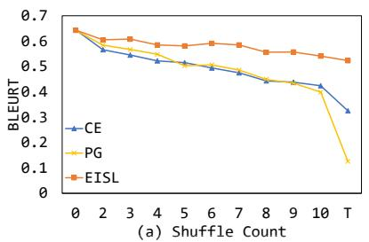

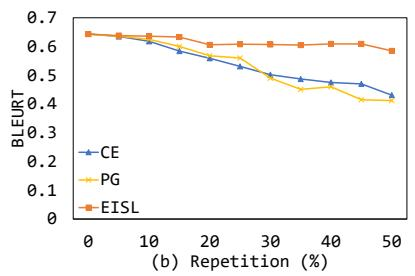

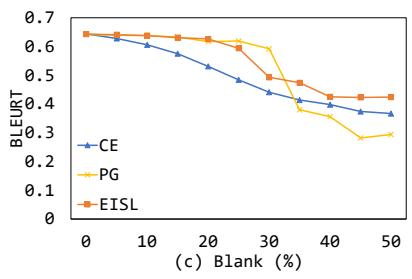

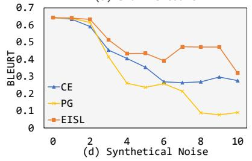

Figure 7: Results of Translation with Noisy Target on German-to-English(de-en) from Multi30k. BLEURT scores are computed against clean test data.  
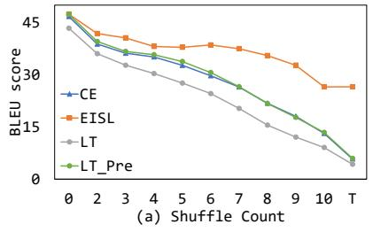

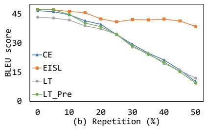

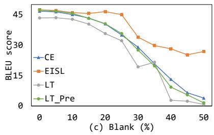

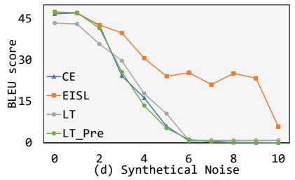  
Figure 8: Comparison results with Loss Truncation(LT) of Translation with Noisy Target on German-to-English(deen) from Multi30k. BLEU scores are computed against clean test data.

Repetition Noise The main problem of the models trained by CE and PG with repetition noises is that the models can’t filter the repetition noise out in training samples, and try to learn the wrong distribution, leading to generate reduplicated words frequently (Example 1-5). Specifically, the examples of CE and PG in RR = 50% are very representative. However, it’s amazing that EISL can almost avoid such a problem even the repetition ratio achieves 50%. Meanwhile, the main semantics is preserved and the grammar is correct.

Blank Noise When adding blank noise, some tokens in targets will be substituted as unk so the targets will lose some information. We could measure from two aspects: one is the term frequency of meaningless token unk in generated sentences, and the other is the meaningful contents preserved by the models. Obviously, EISL loss handles better than CE loss on both aspects. Especially, when BR = 20%, unlike models with CE, models with PG and EISL barely generate the unk token, and could translate the core content (Example 1-5). As BR increases, EISL could preserve more key information and produce less unk than CE and PG. Moreover, PG performs rather poor when BR is high (like BR = 45%), and it almost loses all information (Example 1-5) and generates some confusing words (teil in Example 1, afroamerikanischer and irgendwo in Example 3, beachaufsichtgebäude in Example 4, and holzstück in Example 5).

Synthetical Noise We then evaluate the results of models trained by synthetical noise. Such a situation combines aforementioned three types of noises. One most highlighted advantage of EISL is that the generated sentences are almost grammatically correct and include main content as far as possible. However, CE can only stiffly joint some words, and can’t guarantee the grammatical correctness (word order, word repetition and so on). PG performs worst, involving all the problems in CE cases and the meaningless word generation problem (Example 1-5).

<table><tr><td>Source Base Model with EISL</td><td>my “hot&quot; sub was cold and the meat was watery . my “hot&quot; sub was excellent and the meat was excellent . my “hot &quot; sub was delicious and the meat was delicious .</td></tr><tr><td>Source</td><td>the man did not stop her .</td></tr><tr><td>Base Model</td><td>the man did definitely right her .</td></tr><tr><td>with EISL</td><td>the man did definitely stop her .</td></tr></table>

Table 4: Examples of the generated sentences.
<table><tr><td>Model</td><td>Accuracy(%)</td><td>BLEU</td><td>PPL</td><td>POS distance</td></tr><tr><td>Prabhumoye et al. (2018)</td><td>86.5</td><td>7.38</td><td>一</td><td>7.298</td></tr><tr><td>Hu et al. (2017)</td><td>90.7</td><td>47.50</td><td>-</td><td>3.524</td></tr><tr><td>Tian et al. (2018)</td><td>88.0</td><td>59.63</td><td>28.46</td><td>2.348</td></tr><tr><td>with EISL</td><td>89.2</td><td>60.26</td><td>27.85</td><td>2.191</td></tr></table>

Table 5: The results on the political dataset. The first two results are reported by (Tian et al., 2018).

## A.4 Additional Results of Text Style Transfer

## A.4.1 Examples on Yelp dataset

Some examples of generated sentences are given in Table 4. The model with EISL can select more appropriate adjective and improve the quality of the sentences. In the first example, the model should transfer the negative adjectives cold and watery to some positive adjectives that describe food. Obviously, the delicious is more appropriate than excellent. In the second example, the base model reverses both not and stop, leading to wrong sentiment and inconsistent content. While the model with EISL could avoid such a situation and generate more suitable sentence.

## A.4.2 Results on Political dataset

Since the instances from democratic data and republican data are quite different, names of politicians have high correlation with the political slant. Therefore the BLEU score and POS distance have a big gap with the sentiment results. The results are shown in Table 5.

## A.5 Additional Results of Non-Autoregressive Generation

## A.5.1 Results of Iterative NAT Models

As shown in Figure 9, with the increasing of iteration steps, the difference fades away.

## A.5.2 Results of BLEURT Metric

To show the superiority of our method, We also evaluate on recent text generation metric, BLEURT (Sellam et al., 2020). BLEURT is an evaluation metric for Natural Language Generation. It takes a pair of sentences as input, a reference and a candidate, and it returns a score that indicates to what extent the candidate is fluent and conveys the mearning of the reference. We use the recommended BLEURT-20 checkpoint. It gives a score for every sentence pair, and we averaged the scores to get the final score. The results are shown in Table 6.

## A.5.3 Qualitative Analysis on NAT Experiments

Given the non-autoregressive nature (i.e., all tokens are generated simultaneously), the one-to-one matching of CE loss can lead to severe mismatching. We consider the example: the predicted sentence is a cat is on the red blanket and the target sentence is a cat is sitting on the red blanket. The "on the red blanket" part of the prediction will be corrected to match the target positions, and this may lead to overcorrection (e.g., "on the red red blanket ."). Repetition is often a sign of overcorrection. However, with EISL, this situation will not happen because the phrase will be matched to appropriate target tokens. Let’s have a look at a real example in Figure 10.

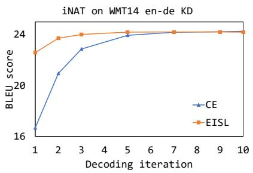

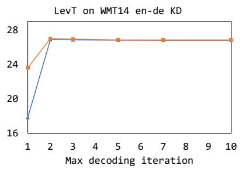

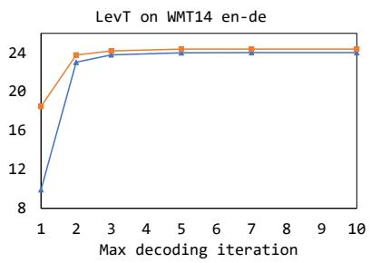  
Figure 9: Results of iterative NAT on different decoding iterations.

<table><tr><td rowspan="2">Model</td><td colspan="2">WMT14 en-de KD</td><td colspan="2">WMT14 en-de</td></tr><tr><td>CE</td><td>EISL</td><td>CE</td><td>EISL</td></tr><tr><td>Vanilla-NAT (Gu et al., 2018)</td><td>0.346</td><td>0.416</td><td>0.194</td><td>0.277</td></tr><tr><td>NAT-CRF (Sun et al., 2019)</td><td>0.441</td><td>0.464</td><td>1</td><td>-</td></tr><tr><td>iNAT (Lee et al., 2018)</td><td>0.332</td><td>0.437</td><td></td><td></td></tr><tr><td>LevT (Gu et al., 2019)</td><td>0.355</td><td>0.458</td><td>0.214</td><td>0.333</td></tr><tr><td>CMLM (Ghazvininejad et al., 2019)</td><td>0.345</td><td>0.450</td><td></td><td></td></tr></table>

Table 6: The results (test set BLEURT) of EISL loss and CE loss applied to non-autoregressive models.

<table><tr><td>Source Target CE EISL</td><td>Anja Schlichter managed the tournament Anja Schlichter leitet das Turnier Anja Schlichter leitdas Turnier Turnier</td></tr></table>

Figure 10: Examples of the generated sentences.

Take the non-autoregressive model CMLM (Ghazvininejad et al., 2019) for example, we evaluate the translation of CMLM models trained by CE and EISL. As shown in Figure 11, our proposed EISL can reduce repetition to a large extent.

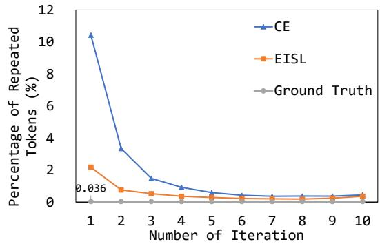  
Figure 11: The percentage of repeated tokens under different iteration steps.

## A.6 Efficiency Analysis

Complexity analysis Given $T ^ { * }$ tokens, the time complexity of CE loss is ${ \bf O } ( T ^ { * } )$ , while the complexity of n-gram EISL loss is ${ \bf O } ( n ( T ^ { * } - n +$ $\bar { { \mathbf { 1 } } } ) ^ { 2 } ) \approx \mathbf { O } ( T ^ { * 2 } )$ , assuming small n is used in practice $( \mathbf { e } . \mathbf { g } . , n \in \{ 1 , 2 , 3 , 4 \} )$ ). However, in practice, the computation cost of the loss (either CE or EISL) is negligible compared to the cost of model forward and backward during training. Thus, the extra cost introduced by the EISL loss is rather minor.

Empirical comparison of time cost To quantify the computational cost of different methods, we adopt CE and EISL on top of the same model and setting, and evaluate the consumed time for 1 training epoch. For comparison on both small and large dataset, we evaluate on Multi30k (29k training data, 1k test data) and 1M scale WMT-18 raw corpus (1M training data, 3k test data). The models are tested on one Tesla V100 DGXS with 32 GB memory, the batch size is 128, max number of tokens is 6000 and update frequency is 4. For each method, we test 6 times and average the results as final time. The results are shown in Figure 12.

Empirical total time cost of EISL training As discussed in the experiments in the paper, we first pretrain the model with the CE loss until convergence, and then finetune with the EISL loss. Here we report the total time cost of each stage, based on the WMT-18 translation setting as described in Section 4.1. The results are shown in Table 7. As the data size increases, the convergence time of both pretraining and finetuning grows. The time cost of the finetuning stage is less than half of that of the pretraining stage.

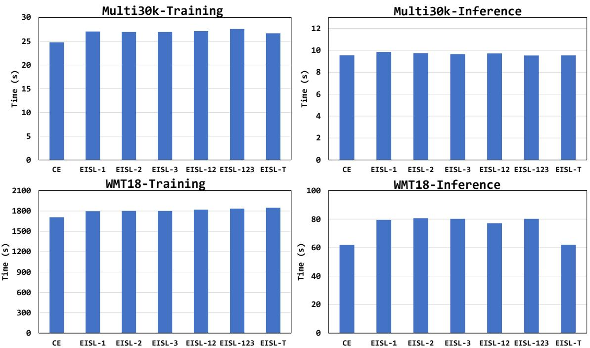  
Figure 12: Results of training and inference time. EISL-n represents n-gram EISL loss and EISL-12 represents the combination of 1-gram and 2-gram EISL loss.

## A.7 Hyperparameters

Regarding which n-grams to use and their weights $w _ { n }$ in the EISL loss, we found in our experiments that the default values largely following the standard BLEU metric (i.e., maximum $n = 4$ with equal weights) work well. Specifically, we use $n \in \{ 2 , 3 , 4 \}$ and equal weights $w _ { n } = 1 / 3$ as our default values. Most of our experiments adopt the default values which achieve consistent substantial improvement over CE and other rich baselines as shown in our experiments. (except for the synthetic experiment where we show the effect of different ngrams including those selected using the validation set).

Besides, in our experiments, we first pretrain the model with the CE loss (i.e., EISL with $n =$ $T ^ { * }$ and teacher forcing, see Section 3.3) and then finetune with the EISL loss. We simply do the CE pretraining until convergence before switching to the EISL finetuning. Therefore, there is no need of tuning for the training iterations of pretraining.

## A.8 Analysis of Efficient Implementation

In order to validate the efficiency and accuracy of our approximation (for autoregressive models)

discussed in Section 3.2, we conduct the analysis experiments, showing that the approximate (and efficient) EISL loss values are very close to exact (but expensive) EISL value. We use the same setting as section 4.1, and finetune the model with our efficient approximate EISL loss on Multi30k. Throughout the course of training, we record the loss values of both the exact implementation and our approximate implementation. As shown in Figure 13(a) and (b), the tendency of two losses is very close to each other. We also plot the absolute difference of the two losses as shown in Figure 13(c). We can see the difference decreases as training proceeds. The observations validate the effectiveness of our approximate implementation.

We note that training the model with the exact loss is costly, which necessitates our approximation. Specifically, for n-gram loss, we need to run the forward pass of the decoder $( T - n ) ^ { 2 }$ times, and keep the whole computation graph for backpropagation, which will consume much more time and memory. Even for only loss evaluation (without the backward pass), we found the runtime of the exact loss is about 15 times longer than that of the efficient approximate implementation based on convolution operator.

<table><tr><td>Data Size</td><td>PreTraining Time (CE)</td><td>Finetuning Time (EISL)</td></tr><tr><td>1M</td><td>1h 40min 57s</td><td>49min 33s</td></tr><tr><td>2M</td><td>5h 56min 57s</td><td>1h 35min 10s</td></tr><tr><td>4M</td><td>8h 55min 18s</td><td>3h 57min 44s</td></tr></table>

Table 7: Convergence time of pretraining and finetuning stages.

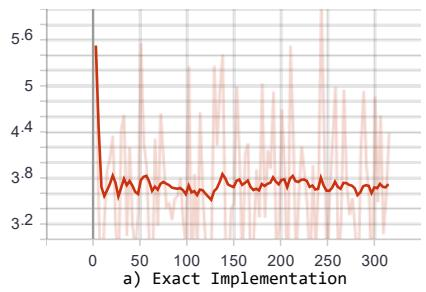

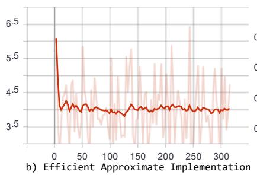

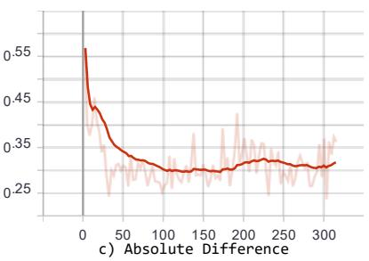  
Figure 13: The change of loss values during training. The x-axis represents the training step. a) gives the loss curve of exact implementation; b) gives the loss curve of efficient approximate implementation as we discussed in section 3.2; and c) gives the absolute difference between the two implementations.

<table><tr><td colspan="2">Source (de)</td><td>ein junger mann nimmt an einem lauf teil und derjenige , der dies aufzeichnet , lächelt .</td></tr><tr><td colspan="2">Target (en)</td><td>a young man participates in a career while the subject who records it smiles .</td></tr><tr><td rowspan="3">SC = 3</td><td>CE</td><td>young man is running on a a and the other man is smiling .</td></tr><tr><td>PG</td><td>young man is running on a track and the other man is smiling .</td></tr><tr><td>EISL</td><td>young man is running in a dirt course and the other is smiling .</td></tr><tr><td rowspan="3">SC = 6</td><td>CE</td><td>young man is running a a race and the other is smiling </td></tr><tr><td>PG</td><td>young man taking a race and the other smiling . a</td></tr><tr><td>EISL</td><td>young man is running a race and the other guy is smiling .</td></tr><tr><td rowspan="3">SC = 9</td><td>CE</td><td>young man . a a the is running up and up hill smiling taking</td></tr><tr><td>PG EISL</td><td>young man takes on a slope and thejenige , the the smiles . a young man is on a hillside smiling and the others , who is smiling </td></tr><tr><td></td><td></td></tr><tr><td rowspan="3">RR = 15%</td><td>CE</td><td>young man is running on a track and the other is smiling .</td></tr><tr><td>PG EISL</td><td>young man is running on a track and the other is smiling young man is running in a race and the runner is smiling </td></tr><tr><td></td><td>young man man is is running on a track track and the the other is is smiling</td></tr><tr><td rowspan="3">RR = 30%</td><td>CE</td><td>smiling .</td></tr><tr><td>PG</td><td>young man man is is running on a track track and the other man man who is is is smiling .</td></tr><tr><td>EISL</td><td>young man is running in a race and the other is smiling at him . . a young young man man is is smiling smiling at at a a window window while</td></tr><tr><td rowspan="3">RR = 50%</td><td>CE</td><td>another smiles smiles at him him . . a young man man is is napping napping on on a a grassy grassy field field and</td></tr><tr><td>PG</td><td>and some people people are are smiling smiling . .</td></tr><tr><td>EISL</td><td>young man running in a race and the other is smiling at the action . .</td></tr><tr><td rowspan="3">BR = 20%</td><td>CE PG</td><td>young man unk unk a run and the unk is smiling .</td></tr><tr><td>EISL</td><td>young man is running in a race and the one who is looking at him is smiling </td></tr><tr><td></td><td>young man is running in a race with the runner who is up .</td></tr><tr><td rowspan="3">BR = 35%</td><td>CE PG</td><td>young man unk unk a unk , and the unk is smiling unk</td></tr><tr><td>EISL</td><td>young man unk unk track unk others unk .</td></tr><tr><td></td><td>young man unk is un in a race and the other un is un at the finish .</td></tr><tr><td rowspan="3">BR = 45%</td><td>CE</td><td>young unk is unk on a unk unk and the unk smiles unk</td></tr><tr><td>PG</td><td>young man unk a unk teil unk unk</td></tr><tr><td>EISL</td><td>young unk un is un in a race , the other is smiling back </td></tr><tr><td rowspan="3">NL = 5</td><td>CE</td><td>young man is running a race and the one who is running is smiling .</td></tr><tr><td>PG</td><td>young man is running a race and the one scoring is smiling .</td></tr><tr><td>EISL</td><td>young man is running a race and one of the runners is up to him .</td></tr><tr><td rowspan="3">NL = 15</td><td>CE PG</td><td>young man is unk unk a unk and the other man is smiling </td></tr><tr><td>EISL</td><td>young man is on a unk smiling at thejenige . . young man is in a race , the other smiling .</td></tr><tr><td></td><td></td></tr><tr><td rowspan="3">NL = 20</td><td>CE PG</td><td>a young man is unk unk a unk and unk is smiling at him .</td></tr><tr><td></td><td>young smiles on in ail and thejenige smile on . . </td></tr><tr><td>EISL</td><td>young man unk unk a ladder and unk , who is unk smiling .</td></tr><tr><td colspan="2">Source (de)</td><td>15 große hunde spielen auf einem eingezäunten grundstück neben einem haus .</td></tr><tr><td colspan="2">Target (en)</td><td>15 large dogs playing in a fenced yard beside a house .</td></tr><tr><td rowspan="3">SC = 3</td><td>CE PG</td><td>large dogs play on a a dirt path next to a house .</td></tr><tr><td>EISL</td><td>15 large dogs play on an earthen platform next to a house .</td></tr><tr><td></td><td>large dogs are playing on a dirt path next to a house .</td></tr><tr><td rowspan="3">SC = 6</td><td>CE</td><td>large dogs play on a a play area next to abandoned house .</td></tr><tr><td>PG EISL</td><td>15 large dogs playing on à eingezäunten group stage next to a house .</td></tr><tr><td></td><td>group of dogs play on a abandoned path next to a house .</td></tr><tr><td rowspan="3">SC = 9</td><td>CE</td><td>large dogs play a . on a field next to abandoned house</td></tr><tr><td>PG EISL</td><td>dogs play on a snowy grundstück next to a house .15 large</td></tr><tr><td></td><td>. 15 large dogs play on an abandoned hillside next to a house .</td></tr><tr><td rowspan="3">RR = 15%</td><td>CE</td><td>large dogs are playing on a fenced in area next to a house .</td></tr><tr><td>PG EISL</td><td>large dogs are playing on a fenced in area next to a house </td></tr><tr><td></td><td>large dogs are playing on a fenced track next to a house .</td></tr><tr><td rowspan="3">RR = 30%</td><td>CE</td><td>large dogs dogs play on on a a dirt track near a house house .</td></tr><tr><td>PG EISL</td><td>large dogs dogs play on a fenced-in area area next to a house .</td></tr><tr><td></td><td>large dogs play on a fenced walkway next to a house . .</td></tr><tr><td rowspan="3">RR = 50%</td><td>CE</td><td>small dogs dogs play on on a a grassy grassy field field next next to to a house house . .</td></tr><tr><td>PG</td><td>15 large dogs dogs are are playing playing on on a a grassy grassy field field next next to to a house house . .</td></tr><tr><td>EISL</td><td>15 large dogs playing on a fenced terrain next to a house . .</td></tr><tr><td rowspan="3">BR = 20% BR = 35%</td><td>CE PG</td><td>large dogs play in a fenced yard next to a house . large dogs are playing on an overcast walk next to a house .</td></tr><tr><td>EISL</td><td>large dogs are playing in a fenced area near to a house .</td></tr><tr><td>CE</td><td></td></tr><tr><td rowspan="3"></td><td>PG</td><td>unk dogs play unk a unk unk by a house .</td></tr><tr><td>EISL</td><td>large dogs unk a unk path unk unk house .</td></tr><tr><td></td><td>large dogs unk play in a fenced area next to a house .</td></tr><tr><td rowspan="3">BR = 45%</td><td>CE PG</td><td>unk dogs unk on a unk unk next to unk house .</td></tr><tr><td>EISL</td><td>large dogs unk a unk unk .</td></tr><tr><td></td><td>large unk un are un in a fenced-out game next to a house .</td></tr><tr><td rowspan="3">NL = 5</td><td>CE PG</td><td>large dogs are playing on a fenced in area next to a house .</td></tr><tr><td>EISL</td><td>large dogs are playing on a fenced in area next to a house .</td></tr><tr><td></td><td>large dogs are playing on a fenced backwalk next to a house .</td></tr><tr><td rowspan="3">NL = 15</td><td>CE PG</td><td>large dogs are playing on a unk grassy field next to a house .</td></tr><tr><td>EISL</td><td>large dogs playing on a unk next to a house . .</td></tr><tr><td></td><td>large dogs play on a covered piece of furniture next to a house .</td></tr><tr><td rowspan="3">NL = 20</td><td>CE PG</td><td>large dogs are playing on on a a a grassy grassy field next to a house .</td></tr><tr><td></td><td>large play play in auntenck in a house . .</td></tr><tr><td>EISL</td><td>large dogs play on a unk unk next to a house ..</td></tr><tr><td colspan="2">Source (de)</td><td>ein afroamerikanischer mann spielt irgendwo in der stadt gitarre und singt</td></tr><tr><td colspan="2">Target (en)</td><td>an african american man playing guitar and singing in an urban setting .</td></tr><tr><td rowspan="3">SC = 3</td><td>CE</td><td>african american man is playing the guitar and singing in the city .</td></tr><tr><td>PG EISL</td><td>african american man is playing the guitar in the city and singing</td></tr><tr><td></td><td>african american man is playing the guitar in the city and singing.</td></tr><tr><td rowspan="3">SC = 6</td><td>CE</td><td>african-american man is playing guitar in the a and singing city .</td></tr><tr><td>PG EISL</td><td>african american man playing irgendwo in the city guitar singing</td></tr><tr><td></td><td>african american man is playing the guitar in the city</td></tr><tr><td rowspan="3">SC = 9</td><td>CE</td><td>african-american man playing guitar in the a and singing city</td></tr><tr><td>PG EISL</td><td>african americanischer man plays irgendwo in the city guitar singing . a</td></tr><tr><td></td><td>african american man is playing the guitar in the city and singing</td></tr><tr><td rowspan="3">RR = 15%</td><td>CE</td><td>african american american man plays guitar guitar in the city city .</td></tr><tr><td>PG EISL</td><td>african american man is playing guitar in the city and singing .</td></tr><tr><td></td><td>african american man is playing guitar in the city and singing .</td></tr><tr><td rowspan="3">RR = 30%</td><td>CE</td><td>african american man plays guitar guitar in in the city city while singing .</td></tr><tr><td>PG EISL</td><td>african american man man plays guitar guitar in the city city and sings .</td></tr><tr><td></td><td>an african american man playing guitar in the city and singing . .</td></tr><tr><td rowspan="3">RR = 50%</td><td>CE</td><td>african african american american man playing guitar guitar in in the the city city and singing singing .</td></tr><tr><td>PG</td><td>african american american man man is is playing playing guitar guitar in in the the city city . .</td></tr><tr><td>EISL</td><td>an african american man playing guitar in the city and singing . .</td></tr><tr><td rowspan="3">BR = 20%</td><td>CE PG</td><td>african american man plays guitar unk sings unk</td></tr><tr><td>EISL</td><td>african american man is playing guitar and singing in the city .</td></tr><tr><td></td><td>african american man is playing the guitar and singing .</td></tr><tr><td rowspan="3">BR = 35%</td><td>CE PG</td><td>african american man unk unk guitar unk singing unk</td></tr><tr><td>EISL</td><td>african american man unk guitar unk singing unk</td></tr><tr><td></td><td>african american unk is un a guitar and singing in the city .</td></tr><tr><td rowspan="3">BR = 45%</td><td>CE</td><td>african american unk unk playing unk guitar in unk city unk</td></tr><tr><td>PG</td><td>afroamerikanischer man unk irgendwo unk unk</td></tr><tr><td>EISL</td><td>af unk un playing some sort of guitar in the city and singing .</td></tr><tr><td rowspan="3">NL = 5</td><td>CE</td><td>african american man plays guitar and sings somewhere in the city .</td></tr><tr><td>PG</td><td>african american man is playing guitar and singing in the city .</td></tr><tr><td>EISL</td><td>african american man is playing guitar and singing somewhere in the city .</td></tr><tr><td rowspan="3">NL = 15</td><td>CE</td><td>african american man is playing the guitar in the city and singing .</td></tr><tr><td>PG</td><td>afroamerikanischer man is irgendwo in the city guitarre</td></tr><tr><td>EISL</td><td>african american man playing some sort of guitar in the city and singing .</td></tr><tr><td rowspan="3">NL = 20</td><td>CE</td><td>african american american man is playing the guitar in the the city unk</td></tr><tr><td>PG</td><td>afroamerikanischer singt in the city guitarre singt .</td></tr><tr><td>EISL</td><td>african american man plays unk unk in the city unk</td></tr><tr><td colspan="2">Source (de)</td><td>ein strandaufsichtgebäude steht im sand , es ist ein bewölkter tag .</td></tr><tr><td colspan="2">Target (en)</td><td>a lifeguard building is on the sand on a cloudy day .</td></tr><tr><td rowspan="3">SC = 3</td><td>CE PG</td><td>beach a is standing in the sand on a beautiful day</td></tr><tr><td>EISL</td><td>beachfront building is standing in the sand on a beautiful day .</td></tr><tr><td></td><td>beach view building is standing in the sand on a cloudy day .</td></tr><tr><td rowspan="3">SC = 6</td><td>CE</td><td>beach a is in the sand building on a beautiful day .</td></tr><tr><td>PG EISL</td><td>beach viewgeb building standing in sand on a beautiful day .</td></tr><tr><td></td><td>beach view building is standing in the sand on a beautiful day .</td></tr><tr><td rowspan="3">SC = 9</td><td>CE</td><td>beach a in the sand . a cloudy day stands beach</td></tr><tr><td>PG EISL</td><td>beachaufsichtge building stands in sand , the is a beautiful day . a . a beachfront building standing in the sand is a beautiful day .</td></tr><tr><td></td><td></td></tr><tr><td rowspan="3">RR = 15%</td><td>CE</td><td>beachfront building is standing in the sand on a cloudy day .</td></tr><tr><td>PG EISL</td><td>beachfront building is standing in sand , it is a cloudy day . beach building is standing in the sand , it is a cloudy day .</td></tr><tr><td></td><td>beachfront beachfront building building is is standing standing in the sand</td></tr><tr><td rowspan="3">RR = 30%</td><td>CE</td><td>sand on a cloudy day .</td></tr><tr><td>PG</td><td>beachfront beachfront building building is standing in sand sand on a cloudy day .</td></tr><tr><td>EISL</td><td>beachfront building is standing in the sand , it is a cloudy day . .</td></tr><tr><td rowspan="3">RR = 50%</td><td>CE</td><td>a beachfront beachfront building building is is standing standing in in the sand sand , it looks like it is is a beach resort resort .</td></tr><tr><td>PG</td><td>a beachfront beachfront building building is is standing standing in in sand sand . .</td></tr><tr><td>EISL</td><td>a beach view building is in the sand , it is a cloudy day . </td></tr><tr><td rowspan="3">BR = 20%</td><td>CE</td><td>beachfront building is standing in sand on a cloudy day unk</td></tr><tr><td>PG</td><td>beachfront building is standing in sand on a cloudy day .</td></tr><tr><td>EISL</td><td>beach view building is standing in the sand , it is a cloudy day .</td></tr><tr><td rowspan="3">BR = 35%</td><td>CE</td><td>beach unk unk standing in sand on a cloudy day unk</td></tr><tr><td>PG</td><td>beach unk building unk unk sand unk a cloudy day .</td></tr><tr><td>EISL</td><td>beach building unk is un in the sand on a cloudy day</td></tr><tr><td rowspan="3">BR = 45%</td><td>CE</td><td>unk unk is standing unk the sand unk it is a beautiful day unk</td></tr><tr><td>PG</td><td>beachaufsichtgebäude unk unk sand unk.</td></tr><tr><td>EISL</td><td>beach unk un is un in the sand , this is a cloudy day .</td></tr><tr><td rowspan="3">NL = 5</td><td>CE</td><td>beachfront view building is standing in the sand on a cloudy day .</td></tr><tr><td>PG</td><td>beachfront view building is standing in sand on a cloudy day .</td></tr><tr><td>EISL</td><td>beachfront building is standing in the sand , it is a cloudy day .</td></tr><tr><td rowspan="3">NL = 15</td><td>CE</td><td>beach unk unk is standing in the sand unk it is a sunny day .</td></tr><tr><td>PG EISL</td><td>beach unk is in sand on a snowy day . . beach building is in the sand , it is a cloudy day</td></tr><tr><td></td><td></td></tr><tr><td rowspan="3">NL = 20</td><td>CE PG</td><td>beach unk unk is standing in the sand unk it is a sunny sunny day .</td></tr><tr><td></td><td>beachaufsichtgebäude steht in sand , es is a day .</td></tr><tr><td>EISL</td><td>beach unk stands in sand unk it is a sunny day . .</td></tr><tr><td colspan="2">Source (de)</td><td>zwei hunde haben beim spielen dasselbe holzstück im maul .</td></tr><tr><td colspan="2">Target (en)</td><td>two dog is playing with a same chump on their mouth .</td></tr><tr><td>SC = 3</td><td>CE PG EISL</td><td>dogs are two playing with . pieces of wood in their mouths two dogs are playing with pieces of black wood in their mouths . two dogs are playing with pieces of wood in their mouths .</td></tr><tr><td>SC = 6</td><td>CE PG EISL</td><td>dogs are two . playing with sticks in their mouths two dogs have been playing with pieces of wood in their mouths . two two dogs are playing with pieces of wood in their mouths .</td></tr><tr><td>SC = 9</td><td>CE PG EISL</td><td>two dogs their . are playing with sticks in muzzled dogs haben beim play pieces in their mouth . two . two dogs have been playing with sticks in their mouth .</td></tr><tr><td>RR = 15%</td><td>CE PG EISL</td><td>two dogs are are playing with a a piece piece of wood in their mouth . dogs are playing with white wooden blocks in their mouth . two dogs are playing with some pieces of wood in their mouths .</td></tr><tr><td>RR = 30%</td><td>CE PG EISL</td><td>two dogs dogs are are playing with a a piece piece of of wood in their mouths . dogs dogs are are playing with white wooden blocks blocks in their mouth . two dogs are playing with pieces of wood in their mouths . .</td></tr><tr><td>RR = 50%</td><td>CE PG</td><td>two dogs dogs are are playing playing with with plastic plastic sticks sticks in in their their mouth mouth . . two dogs dogs are are playing playing with with plastic holsters holsters in in</td></tr><tr><td>BR = 20%</td><td>EISL CE</td><td>their maul maul . two dogs have playing with some white wood in their mouths . . dogs unk unk pieces of wood in their mouths .</td></tr><tr><td>BR = 35%</td><td>PG EISL CE</td><td>dogs are playing with wet wood in their mouths . dogs are playing with wet pieces of wood in their mouths . unk have unk pieces of unk in their mouths .</td></tr><tr><td></td><td>PG EISL CE</td><td>two dogs unk unk piece of wood unk their mouth . two dogs unk playing with some piece of wood in their mouth . dogs are playing with unk unk in unk mouth unk</td></tr><tr><td></td><td></td><td></td></tr><tr><td></td><td></td><td></td></tr><tr><td></td><td></td><td></td></tr><tr><td></td><td></td><td></td></tr><tr><td></td><td>PG</td><td>dogs haben on a game unk unk . .</td></tr><tr><td></td><td></td><td></td></tr><tr><td></td><td></td><td></td></tr><tr><td></td><td></td><td></td></tr><tr><td></td><td></td><td></td></tr><tr><td>BR = 45%</td><td>PG</td><td>dogs unk unk piece of unk holzstück unk .</td></tr><tr><td></td><td></td><td></td></tr><tr><td></td><td>EISL</td><td>dogs unk un are un while play with some wood pieces in their mouth .</td></tr><tr><td></td><td></td><td></td></tr><tr><td></td><td>CE</td><td>two dogs are playing with the same piece of wood in their mouths .</td></tr><tr><td>NL = 5</td><td>PG</td><td>dogs have pieces of of wood in their mouths.</td></tr><tr><td></td><td>EISL</td><td>two dogs are playing with the same piece of wood in their mouths .</td></tr><tr><td></td><td></td><td></td></tr><tr><td>NL = 15</td><td>CE</td><td>two dogs are are are playing with unk unk in their mouths .</td></tr><tr><td></td><td></td><td></td></tr><tr><td></td><td>EISL</td><td>two dogs have been playing with a piece of wood in their mouth .</td></tr><tr><td></td><td>CE</td><td>two dogs are are are playing with unk unk in their mouths .</td></tr><tr><td></td><td></td><td></td></tr><tr><td>NL = 20</td><td>PG</td><td></td></tr><tr><td></td><td></td><td>dogs haben in a playenselbeck in their mouth . .</td></tr><tr><td></td><td></td><td></td></tr><tr><td></td><td></td><td></td></tr><tr><td></td><td></td><td></td></tr><tr><td></td><td></td><td></td></tr><tr><td></td><td></td><td></td></tr><tr><td></td><td></td><td></td></tr><tr><td></td><td></td><td></td></tr><tr><td></td><td></td><td></td></tr><tr><td></td><td></td><td></td></tr><tr><td></td><td>EISL</td><td></td></tr><tr><td></td><td></td><td></td></tr><tr><td></td><td></td><td></td></tr><tr><td></td><td></td><td></td></tr><tr><td></td><td></td><td></td></tr><tr><td></td><td></td><td></td></tr><tr><td></td><td></td><td></td></tr><tr><td></td><td></td><td></td></tr><tr><td></td><td></td><td>two dogs are playing with unk sticks in their mouths . .</td></tr></table>

Table 8: Example 1.

Table 9: Example 2.

Table 10: Example 3.

Table 11: Example 4.

Table 12: Example 5.