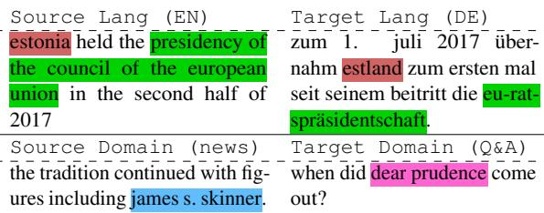
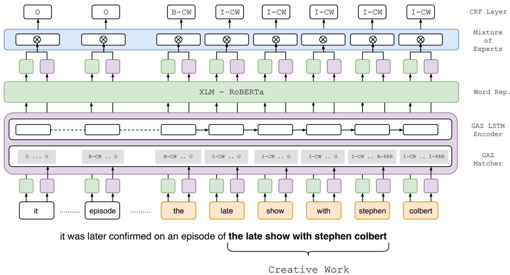
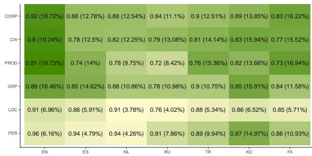
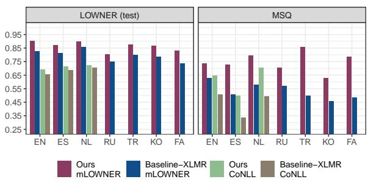
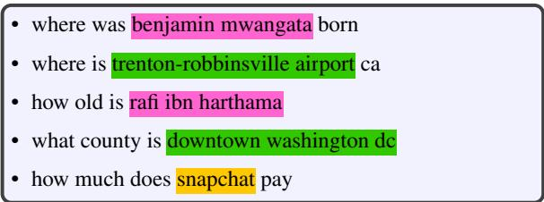

# Dynamic Gazetteer Integration in Multilingual Models for Cross-Lingual and Cross-Domain Named Entity Recognition

Besnik Fetahu, Anjie Fang, Oleg Rokhlenko, Shervin Malmasi

Amazon, USA

{besnikf, njfn, olegro, malmasi}@amazon.com

## Abstract

Named entity recognition (NER) in a realworld setting remains challenging and is impacted by factors like text genre, corpus quality, and data availability. NER models trained on CoNLL do not transfer well to other domains, even within the same language. This is especially the case for multi-lingual models when applied to low-resource languages, and is mainly due to missing entity information.

We propose an approach that with limited effort and data, addresses the NER knowledge gap across languages and domains. Our novel approach uses a token-level gating layer to augment pre-trained multilingual transformers with gazetteers containing named entities (NE) from a target language or domain. This approach provides the flexibility to jointly integrate both textual and gazetteer information dynamically: entity knowledge from gazetteers is used only when a token’s textual representation is insufficient for the NER task.

Evaluation on several languages and domains demonstrates: (i) a high mismatch of reported NER performance on CoNLL vs. domain specific datasets, (ii) gazetteers significantly improve NER performance across languages and domains, and (iii) gazetteers can be flexibly incorporated to guide knowledge transfer. On cross-lingual transfer we achieve an improvement over the baseline with F1=+17.6%, and with F1=+21.3% for cross-domain transfer.

## 1 Introduction

Advances in pre-trained models have achieved state of the art results for NER (Conneau et al., 2020; Yamada et al., 2020). Models like XLM-RoBERTa (XLMR) (Conneau et al., 2020) offer advantages as they can be applied on several languages with little fine-tuning to obtain optimal NER performance, with an F1 score of 92.92 for English and an average of 89.43 across all languages in CoNLL (Sang and Meulder, 2003).

  
Table 1: Example snippets in multiple-languages and domains. NER needs to resolve equivalent NE surface forms across languages, e.g. “Presidency of the European Council” to “EU-Ratspresidäntschaft”, or across domains where entity distribution change (second row, where entity types are marked in different colors).

While NER results obtained on CoNLL have reached remarkable levels, in real-world settings, NER faces many challenges, related to application domain, language, or data quality. For uses cases such as Web search queries or utterances coming from voice assistants, data quality and obtaining annotations are an issue. Such corpora usually have low context and no casing information, or contain syntactic errors. For instance, by just dropping the casing information on CoNLL test set the NER performance drastically drops to F1=0.35 (Mayhew et al., 2019). Moreover, such snippets often cover diverse domains with named entities that are not part of the training data.

Table 1 shows example sentences1 in different languages and genres/domains. For NER knowledge transfer across languages, a typical challenge is the significant surface form variations of NEs, in terms of their compositional nature, ambiguity of surface forms, and as well script. Similarly, a challenge across domains are the diverging named entity distributions or ambiguities that surface forms resolve to different entity types. To date, there are no existing datasets that allow to probe NER systems for cross-lingual and cross-domain transfer (e.g domains like Q&A or Web search).

Considering the above challenges, our objective in this work is to propose approaches and training strategies that fulfill the following desiderata:

• Cross-Linguality: Models trained on a source language should transfer with minimal effort to a target language. The challenges are the compositionality of NEs across languages and script (c.f. NEs in green for EN and DE in Table 1).

• Cross-Domain: Models should transfer across domains that have diverging NE distributions. Specifically, determine entity boundaries (e.g. generalize from Person to Creative Work, which are often complex noun or verb phrases).

We propose an NER approach that fulfills the two desiderata. First, we address multi-linguality by encoding sentences using the pre-trained XLMR model (Conneau et al., 2020). Second, to account for domain differences, we enhance XLMR with multi-lingual gazetteers that can be extracted from resources like Wikidata, or domain-specific resources (e.g. product catalogs). Gazetteers aid the NER knowledge transfer and provide the models with explicit signal about NEs from a target language/domain. Since the two modules provide complementary information, we combine them using the mixture of experts (MoE) (Shazeer et al., 2017), allowing the model to dynamically determine which portion of the information is used for NER. Finally, we construct multi-lingual and -domain NER datasets, addressing some of the deficiencies of existing datasets like WikiAnn (Pan et al., 2017), which consists of sentences with popular entities across all languages, limiting knowledge transfer for low-contextual and emerging domains.

Experiments on 7 languages and multiple domains confirm that our model can adapt across domains and languages using few-shot learning (with as much as 500 instances transfer from high to low resource languages). Gazetteer information combined through MoE, provides an advantage over baselines with an average improvement of MD=+33.21% in mention detection across domains and F1=+17.6% across languages.

In this work, our contributions are threefold:

• gazetteer integration into NER models for crosslingual and -domain NER knowledge transfer,

• novel means in integrating text and gazetteer representations through Mixture-of-Experts (MoE),

• mLOWNER a low-contextual and multilingual, and MSQ a multilingual questions dataset.

## 2 Related Work

The use of gazetteers is not new. It has been a core principle in doing NER using feature-based approaches (Curran and Clark, 2003; Toral and Muñoz, 2006; Cucchiarelli et al., 1998). However, with neural models and recent pre-trained transformer models achieving state of the art results (Vaswani et al., 2017; Conneau et al., 2020; Devlin et al., 2019), the utility of gazetteers on standard benchmarks has diminished. Our related work discussion is focused towards works that have utilized gazetteers for NER.

Liu et al. (2019) propose the use of gazetteers with neural NER models, utilizing them in the form of a sub-tagger. For each token a matching score to the gazetteer entries needs to be pre-computed and then fed into the NER framework. The main utility of gazetteers is to provide flexibility and be easy to swap, allowing NER models to adapt on out-ofdomain data. Contrary to Liu et al. (2019), we flexibly combine gazetteers with the textual information and depending on the context are weighted accordingly. Gazetteers can be swapped during the test-phase without any fine-tuning. We compare against this approach and show the advantages of our approach both in terms monolingual and crossdomain performance.

Shang et al. (2018) create dictionaries for a given corpus on which the NER task is performed. This avoids ambiguous matches of named entities across domains. The task is to determine whether the tokens in a span belong together or not, as part of an entity, otherwise they can be two different entities or not be entities at all. Finally, the type of those spans is predicted. We differ from (Shang et al., 2018) on three main points. First, the dictionary creation is tied to the corpus. Second, the model fits parameters to predict if a text span on a given corpus represents an entity. Finally, the dictionary information and model weights are ingrained into the model, which is not the case for our approach.

Ding et al. (2019) create a di-graph from a sentence and gazetteer matches. Adjacent nodes are connected via a directed edge, after which, edges between the matched characters to the gazetteer nodes are added. The di-graph is then fed to a graph neural network for training and resolve ambiguous matches. Contrary to our work, here the gazetteer matches are ingrained into the model, and changes in gazetteers induce changes in the graph structure and thus require complete retraining.

Rijhwani et al. (2020) integrate entity linking systems in matching the tokens or token spans to some target entity or candidate entities. For each match, different features are proposed, e.g. top scoring entity for a span, top–3 candidate scores, top–3 entities, type counts etc. While, using predefined feature sets (Zirikly, 2015; Rijhwani et al., 2020) has the advantages of interpretability, however, generalizing models to unseen languages or domains is challenging. A direct comparison between feature-based models and our approach is not possible. Our approach automatically integrates external gazetteers without having the need to run entity linking or any hand-crafted features.

Lin et al. (2019) propose to integrate gazetteers for NER by training a gazetteer network to predict whether a text snippet represents a name or not. There are two diverging points to our work. First, the gazetteer network weights of Lin et al. (2019) are tied to the training data, thus, for any new data the gazetteer network needs to be retrained to accurately predict if a snippet represents an entity. Second, our approach performs a soft-match w.r.t the gazetteer entries, where each match is represented as a binary vector w.r.t NER matching classes. This allows us to flexibly change at inference time the gazetteer data, since the model captures only the structural information present in tokens and sentences. Furthermore, using the mixture of experts module to combine both the textual and gazetteer token representations, we can flexibly determine which representation to use for NER classification.

Finally, Jia et al. (2019) propose the use of mixture of experts, where the experts correspond to separate classifiers per NER class. We differ in that we utilize MoE to compute a unified representation of text and gazetteers.

## 3 Dataset Construction

Models trained on CoNLL typically perform poorly when applied on out-of-domain data. Similarly, WikiAnn (Pan et al., 2017), which consists of contextually rich sentences, is not suitable for domain transfer where context is scarce (e.g. Web search).

We describe the process of constructing the multilingual and multi-domain datasets. We include the following languages: English–EN, Spanish– ES, Dutch–NL, Russian–RU, Turkish–TR, Korean– KO, Farsi–FA, a mix of high and low resource languages. The data is available for download.2

mLOWNER. Which stands for multilingual low– context Wikipedia NER dataset (Malmasi et al., 2022), extracted from the different localized versions of Wikipedia. We extract low-context sentences that contain interlinked entities and resolve the entity types using Wikidata as reference, according to the NER class taxonomy from (Derczynski et al., 2017).

Ensuring that the extracted sentences and the interlinked entities therein are of high quality we follow two filtering strategies. First, we apply regular expression to identify and filter out sentences that contain named entities that are not interlinked. This step removes long and high-context sentences. Second, we filter out sentences, in which the links could not be resolved to Wikidata entities. Applying the two steps filter out over 90% of the sentences from the respective Wikipedia versions. The resulting dataset is diverse in domains and multilingual, including low-resource languages FA, KO, TR. For more details regarding the mLOWNER dataset, we refer to the reader to dataset paper (Malmasi et al., 2022), and additional details provided in the paper appendix.

Sentences in mLOWNER have on average 15 to 19 tokens. Based on a manual inspection of 400 sample sentences in EN, the quality of the NER gold-labels is with 94% accuracy.

his playlist includes sonny sharrock, gza, country   
teasers and the notorious b.i.g..   
• the atari 2600 hardware design experienced many   
makeovers during its 14 year production history.

MSQ. From the MS-MARCO Q&A corpus (Nguyen et al., 2016) we construct question templates, where the entities are replaced by their type following the same NER taxonomy as mLOWNER. We identify entities in a question using spaCy3. For example, from the template “who produced CW|PROD ”, we generate multiple instances by varying entities of type CW or PROD.

MSQ is used only for testing and to assess crossdomain knowledge transfer of NER models. Since the questions are only in English language, we translate the extracted templates using Amazon Translate.4 The translation quality is good considering that the question templates are short. The number of questions per language is around 17.5k with an average number of tokens 4.9 1.73.

## 4 Approach

Figure 1 shows an overview of our approach based our prior work (Meng et al., 2021; Fetahu et al., 2021), which we adopt for our cross-lingual and cross-domain application scenario. It consists of three main components: (i) multi-lingual sentence representation, (ii) external gazetteer knowledge integration, and (iii) dynamic combination of text and gazetteer information.

For a sentence $s = \{ w _ { 1 } , \ldots , w _ { N } \}$ with $N$ tokens we compute token representation as follows.

## 4.1 Multi-Lingual Text Representation

Using XLMR (Conneau et al., 2020) as a text encoder, we are able to encode sentences from multiple languages, and compute the sentence representation $\mathbf { h } _ { s } = \{ \mathbf { h } _ { 1 } , \dots , \mathbf { h } _ { N } \}$ , where $\mathbf { h _ { s } } \in \mathbb { R } ^ { \bar { N } \times L }$ represents the sentence representation for N tokens with L output dimensions.

While XLMR has remarkable NER performance on the CoNLL dataset, textual representation alone is not sufficient for cross-domain transfer. Such limitations are even higher when consider crosslingual transfer on distant languages. Depending on the pre-training resources for a language, XLMR tokenization (Kudo and Richardson, 2018) of infrequent tokens or tokens from low-resource languages, can be problematic, often leading to over-segmentation. This in turn, introduces ambiguity for the NER task, e.g., “wunderkind little amadeus“  “\_wunder kind \_little \_amade $u s ^ { \prime \prime }$ , is tokenized into sub-words with ambiguous meaning within and across languages, e.g. wunder, kind, us.

## 4.2 Gazetteer Representation

Gazetteers inject explicit information about target NEs (e.g. Products from an e-commerce site). This provides the flexibility to adapt on target domains and for entities with variable surface forms (e.g. Movies, Product names). Typically complex entities (e.g. movie titles) consist of complex noun or word phrases that are to capture (cf. Figure 1).

Overall, gazetteers are easy to obtain from open resources like Wikidata5. A gazetteer $\mathcal { G }$ consists of entities and their type, e.g. “No Time to Die”, CW .

Gazetteer Matcher. For a token or sequence of tokens s0 from $s ^ { \prime } \subseteq s ,$ we extract the longest match from entries in $\mathcal { G }$ . The gazetteer $\mathcal { G }$ consists of a trie built from all the named entity entries of interest.

The matcher yields a sparse encoding $\begin{array} { r l } { \mathbf { g _ { s } } } & { { } \in } \end{array}$ $\mathbb { N } ^ { N \times k }$ , where $\begin{array} { r c l } { \mathbf { g } _ { s } } & { = } & { \left\{ \mathbf { x } _ { 1 } , \ldots , \mathbf { x } _ { N } \right\} } \end{array}$ and $\begin{array} { r l } { \mathbf { x } _ { i } } & { { } \in \mathbf { \sigma } } \end{array}$ $( 0 , 1 ) _ { k }$ is a binary vector of length k (k is the number of target NE types in $\mathcal { G }$ in IBO format). More specifically, if our sequence of tokens is $s ^ { \prime } = \left\{ \begin{array} { r l } \end{array} \right. t h e ,$ late, show, with, stephen, colbert , the resulting matcher would yield the following matrix $\mathbf { g } _ { s ^ { \prime } } \mathbf { \dot { \mathbf { \varepsilon } } }$

<table><tr><td></td><td>B-CW</td><td>I-CW</td><td>B-PER</td><td>I-PER</td><td></td></tr><tr><td>the</td><td>1</td><td>0</td><td>0</td><td>0</td><td>0</td></tr><tr><td>late</td><td>0</td><td>1</td><td>0</td><td>0</td><td>0</td></tr><tr><td>show</td><td>0</td><td>1</td><td>0</td><td>0</td><td>0</td></tr><tr><td>with</td><td>0</td><td>1</td><td>0</td><td>0</td><td>0</td></tr><tr><td>stephen</td><td>0</td><td>1</td><td>1</td><td>0</td><td>0</td></tr><tr><td>colbert</td><td>0</td><td>1</td><td>0</td><td>1</td><td>0</td></tr></table>

The sparse vectors in $\mathbf { g } _ { s }$ are converted into a dense representation by projecting them through a dense layer $\theta ,$ which are encoded using a BiLSTM, $\mathbf { G } _ { s } = \left\lceil \overrightarrow { \mathrm { L S T M } } ( \theta [ \mathbf { g } _ { s } ] ) ; \overleftarrow { \mathrm { L S T M } } ( \theta [ \mathbf { g } _ { s } ] ) \right\rceil \in \mathbb { R } ^ { N \times L } .$

The final gazetteer representation $\mathbf { G } _ { s }$ , a BiL-STM encoder learns the context of sentence $s ,$ and using its context learns to resolve ambiguous matches a token may have in , e.g., “stephen col-$b e r t ^ { \prime \prime }$ , matches to both CW and PER entries.

## 4.3 Combined Representation

The encoded text and gazetteer representations capture complementary information. Depending on s, not always both representations are deemed as useful. For instance, if $\mathbf { h } _ { s }$ captures the contextual information of s and the pre-trained knowledge of XLMR for the tokens therein is not ambiguous, then $\mathbf { G } _ { s }$ may not be necessary. Otherwise, when the model is applied to out-of-domain sentences or tokens are ambiguous and match to multiple named entity types, in such cases $\mathbf { G } _ { s }$ , which encodes explicit information from a target domain or languages provides the necessary context.

At token level we learn a function that combines dynamically both representations by computing an importance score for $\mathbf { h } _ { s }$ and $\mathbf { G } _ { s }$ . The importance $\mathbf { w } _ { m o e }$ is computed based on the mixture of experts approach (MoE) (Shazeer et al., 2017). Since we have two representations only, we use a Sigmoid function to split the importance accordingly:

$$
\mathbf { w } _ { m o e } = \sigma \left( \Lambda [ \mathbf { h } _ { s } ; \mathbf { G } _ { s } ] ^ { T } \right)\tag{1}
$$

$$
\mathbf { h } = \mathbf { w } _ { m o e } \cdot \mathbf { h } _ { s } + \left( 1 - \mathbf { w } _ { m o e } \right) \cdot \mathbf { G } _ { s }\tag{2}
$$

where, $\Lambda \in \mathbb { R } ^ { 2 L }$ . From h using a conditional random field (CRF) layer (Lafferty et al., 2001) we predict the token NER tags.

  
Figure 1: Approach overview: (a) GAZ Matcher: matches tokens to gazetteer entries, e.g. “stephen” is matched to both I-CW and B-PER; (b) GAZ LSTM Encoder: computes a contextual representation of the gazetteer matches; (c): Word Rep.: computes the token XLMR representation; (d) Mixture of Experts: computes the weights of both representations in (b) and (c); and (e) CRF: the classification layer that outputs the NER tags in BIO format.

Lastly, by feeding the gazetteer matches as a binary matrix, which corresponds to the NER class matches of a given text span, and combining this information jointly with the $\mathbf { h _ { s } }$ representation, we allow our model to abstract the gazetteer representation $\mathbf { G } _ { s }$ and learn structural NE properties for a given text span (i.e. in terms of NER classes the span may belong to), given that textual representation is provided by XLMR. This is a significant improvement over existing work, which compute gazetteer representations w.r.t tokens and thus require re-training, whenever the gazetteer information is updated (Liu et al., 2019).

## 4.4 Multi-Stage Training Strategy

Our approach consists of modules like XLMR, whose parameters contain pre-trained knowledge, and the randomly initialized gazetteer and MoE modules. To align the parameter spaces of these components, and avoid that the NER model is not biased towards the pre-trained knowledge of XLMR, we device a two-stage training strategy.

First Stage. XLMR’s weights are frozen, while https://drawio.corp.amazon.com/gazetteer encoder is trained, allowing it to learn how to resolve ambiguities tokens matches.

Second Stage. All components are jointly trained, further fine-tuning XLMR and MoE to weigh between hs and $\mathbf { G } _ { \varepsilon }$ according to their impact on predicting the NER class.

## 5 Experimental Setup

Here we describe the NER approaches under comparison for knowledge transfer across domains and languages. Next, we introduce the multilingual training data, and the corresponding test sets for cross-lingual and cross-domain evaluation.

## 5.1 Baselines and Approach Setup

Baseline – XLMR: The XLMR transformer (Conneau et al., 2020) with a CRF layer trained for the NER task is considered as a baseline. We use the AdamW optimizer (Loshchilov and Hutter, 2019) with a learning rate of lr = 1e 5 to minimize the negative log-likelihood loss (NLL), and use a batch size of 64. This represents an ablation of our model without gazetteers and the MoE mechanism.

Baseline – Gazetteer Lookup (BaG): To assess that gazetteers alone are insufficient, we consider a gazetteer lookup to the longest matching text span to the gazetteer entries. For a more favorable setting for BaG, ambiguous span matches are counted as correct if the NER class is in the set of classes assigned by the gazetteer.

SubTagger (Liu et al., 2019): We train the Sub-Tagger’s gazetteer matcher on EN gazetteer data and test its monolingual and cross-domain performance for English. This is due to the fact that GloVe (Pennington et al., 2014) and ELMo embeddings (Peters et al., 2018) are available only for English, and are key components in training the gazetteer and NER model. Evaluating SubTagger for cross-lingual transfer is not possible since it uses monolingual embeddings and for any target language, the model needs to be retrained from scratch using the gazetteer and the word representations from the target language.6

Approach (Ours): Our approach consists of three components that are trained using the introduced multi-stage training strategy. Training details are provided in the Appendix B.

## 5.2 Datasets

Below are shown the datasets (without casing) used for training and testing NER models.

CoNLL: exists in 4 languages (EN, DE, ES, NL) with sentences (Sang, 2002; Sang and Meulder, 2003), and used for training only.

mLOWNER: mLOWNER (Malmasi et al., 2022) is used for training. mLOWNER test set is used to assess cross-lingual transfer. For training and development, for each language, we use 15.2k and 800, respectively. For testing we limit the number of instances to 10k per language. Additional details are provided in Appendix A.

MSQ: This dataset is used only to test the crossdomain transfer of pre-trained NER models.

WNUT: WNUT17 (Derczynski et al., 2017) is another test set for cross-domain evaluation, consisting of social media posts in EN language.

Twitter Data: Additionally, we collected a random sample of 10k tweets in the English language,7 to assess the competing approaches (XLMR baseline and our approach) in a zero-shot setting.

Gazetteers: Entries are extracted from Wikidata entity titles (from types corresponding to the NER taxonomy). More details in Appendix A.

## 5.3 Cross-domain & Cross-lingual Scenarios

Cross-Domain: Pre-trained models on CoNLL and mLOWNER are assessed for out-of-domain transfer on MSQ in terms of mention detection (MD). MD measures the ability to predict the entity boundaries, disregarding the actual entity type. We also consider cross-domain transfer from EN-LOWNER to WNUT and report NER micro F1.

Cross-Lingual: Models trained on an mLOWNER source language are assessed on a target language under zero-shot and few-shot learning.

## 6 Evaluation

Here we assess the monolingual NER model performance and impact of the multi-stage training strategy and that of MoE. Finally, we assess their knowledge transfer across languages and domains.

## 6.1 Model Comparison

<table><tr><td colspan="3">CoNLL</td><td colspan="3">mLOWNER</td></tr><tr><td></td><td>BaG</td><td>XLMR</td><td>Ours</td><td>BaG</td><td>XLMR</td><td>Ours</td></tr><tr><td>EN</td><td>0.178</td><td>0.850</td><td>0.860 (+1%)</td><td>0.148</td><td>0.755</td><td>0.888 (+13.3%)</td></tr><tr><td>ES</td><td>0.184</td><td>0.798</td><td>0.813 (+1.5%)</td><td>0.047</td><td>0.746</td><td>0.847 (+10.1%)</td></tr><tr><td>NL</td><td>0.194</td><td>0.807</td><td>0.826 (+1.9%)</td><td>0.220</td><td>0.803</td><td>0.867 (+6.4%)</td></tr><tr><td>RU</td><td></td><td></td><td></td><td>0.213</td><td>0.693</td><td>0.782 (+8.9%)</td></tr><tr><td>TR</td><td></td><td></td><td></td><td>0.106</td><td>0.752</td><td>0.859 (+10.7%)</td></tr><tr><td>KO</td><td></td><td></td><td></td><td>0.268</td><td>0.726</td><td>0.854 (+12.8%)</td></tr><tr><td>FA</td><td></td><td></td><td></td><td>0.614</td><td>0.700</td><td>0.820 (+12.0%)</td></tr></table>

Table 2: Micro F1 results across all types. Note that the NER type taxonomies differ between CoNLL and mLOWNER.

For the CoNLL and mLOWNER datasets, we trained separate models for both our approach and baselines. Table 2 shows the micro-averaged F1 scores across all NER classes. Table 2 shows that in the case of CoNLL, there is a saturation in terms of the improvement we achieve across the different languages. One explanation for this is that pretrained transformer models like XLMR, are already highly efficient on news corpora and can exploit the regularities on how named entities are mentioned in text. Hence, the difference when comparing the baseline and our approach on the CoNLL test set varies from 1% to 2%, for EN and NL, respectively.

Contrary to CoNLL, in the case of mLOWNER, which is a more diverse dataset and with sentences that do not follow the strict language style present in news corpora, we achieve significant gains over the baseline approach. The average gains are around 10.6% absolute improvement in terms of micro averaged F1. Moreover, it is encouraging to note that for low-resource languages such as KO or FA, the gains are even higher. This shows that when pre-trained transformer models do not contain knowledge about a specific token, integrating external gazetteers through MoE, we can accurately predict the NER class of a token. The gains are not evenly distributed across the different NER classes. Figure 2 shows the absolute F1 gains over the XLMR baseline. The highest gains are achieved for the classes PROD, CW, CORP (with an average absolute increase of F1=+14.02), which contain NEs that do not follow typical syntactic patterns as is the case for PER, LOC.

  
Figure 2: F1 class performance of our approach on mLOWNER test set. In brackets is shown the F1 absolute gains against the XLMR baseline.

For the BaG baseline, we see a large gap. This is due to the inability to resolve ambiguous cases, which highlights the difficulty of the task, and that gazetteers alone lead to noisy NER.

Finally, comparing against SubTagger on the LOWNER test set, our approach achieves an increase of F1=+5%. Given that both models are trained on the same dataset, the improvements comes mainly from the way we model our approach. Namely, the contributions can be attributed on the way how we incorporate gazetteer matches using the MoE, which allows the model to either weigh higher or downweight matches according to the token’s NER tag accuracy.

Multi-stage training impact. We assessed the performance of our approach without the multistage training. The results are negligibly better than the baseline. Given that the GAZ encoder and MoE module are randomly initialized, the model relies solely on XLMR for NER. Furthermore, a low learning rate is not suitable for GAZ and MoE, while a higher lr is not suitable for XLMR, hence, the multi-stage training is appropriate.

MoE Impact. The combined representation computed via MoE is highly effective, especially for cross-domain transfer. Simply concatenating the text/gazetteer vectors, we note an average decrease of MD=-22% across all languages for MSQ. For in-domain evaluation, the difference is negligible. This is due to two reasons: (i) the model’s representation for out-of-domain entity tokens are not fine-tuned for the task, and (ii) without MoE, spurious gazetteer matches cannot be discarded.

## 6.2 Cross-Domain Transfer Results

Cross-domain transfer for NER remains still challenging, due to the lack of domain specific data, privacy concerns in generating such data, or existing datasets having a narrow domain coverage.

  
Figure 3: Cross-domain mention detection scores for models trained separately on mLOWNER and CoNLL datasets and tested on mLOWNER and MSQ.

Figure 3 shows the cross-domain transfer results for models trained separately on CoNLL and mLOWNER8 and tested on the mLOWNER and MSQ test sets. Since CoNLL has a different NER class taxonomy than MSQ and mLOWNER, we report only MD performance.

Pre-trained CoNLL models: For MD performance of CoNLL pre-trained models we note two aspects. First, there is a high mismatch between the performance achieved on CoNLL and that of for mLOWNER and MSQ. It is evident that due to the narrow domain coverage of CoNLL (consisting of only news genre), the models have difficulties in detecting NE boundaries for out-of-domain datasets. Second, our approach consistently outperforms the XLMR baseline for both datasets. We obtain an absolute average improvement of MD=+3% and MD=+24% for mLOWNER and MSQ, respectively. This shows that when NER models are applied to a distant domain from their initial training data (e.g.

<table><tr><td>EN</td><td></td><td>NL</td><td>ES</td><td>RU</td><td>TR</td><td>KO</td><td>FA</td><td>Average</td></tr><tr><td colspan="9">zero-shot setting</td></tr><tr><td>EN</td><td>0.888 (+13.33)</td><td>0.806 (+14.13)</td><td>0.795 (+15.19)</td><td>0.604 (+9.66)</td><td>0.729 (+21.01)</td><td>0.641 (+22.21)</td><td>0.681 (+20.58)</td><td>0.709 (+17.13)</td></tr><tr><td>NL</td><td>0.818 (+19.26)</td><td>0.875 (+8.33)</td><td>0.784 (+13.95)</td><td>0.628 (+17.04)</td><td>0.738 (+16.91)</td><td>0.640 (+18.95)</td><td>0.675 (+20.96)</td><td>0.714 (+17.84)</td></tr><tr><td>ES</td><td>0.803 (+18.18)</td><td>0.790 (+14.86)</td><td>0.847 (+10.12)</td><td>0.640 (+12.20)</td><td>0.715 (+17.18)</td><td>0.607 (+20.75)</td><td>0.699 (+20.92)</td><td>0.709 (+17.35)</td></tr><tr><td>RU</td><td>0.740 (+19.80)</td><td>0.630 (+6.69)</td><td>0.554 (-0.99)</td><td>0.782 (+8.97)</td><td>0.677 (+23.21)</td><td>0.592 (+17.54)</td><td>0.631 (+18.72)</td><td>0.637 (+14.16)</td></tr><tr><td>TR</td><td>0.733 (+16.18)</td><td>0.795 (+18.03)</td><td>0.694 (+10.49)</td><td>0.623 (+14.99)</td><td>0.859 (+10.67)</td><td>0.682 (+24.23)</td><td>0.690 (+21.97)</td><td>0.703 (+17.65)</td></tr><tr><td>KO</td><td>0.678 (+19.25)</td><td>0.724 (+23.64)</td><td>0.693 (+23.96)</td><td>0.610 (+14.12)</td><td>0.670 (+22.62)</td><td>0.854 (+12.78)</td><td>0.628 (+21.08)</td><td>0.667 (+20.78)</td></tr><tr><td>FA</td><td>0.744 (+19.61)</td><td>0.757 (+19.48)</td><td>0.720 (+15.68)</td><td>0.631 (+13.21)</td><td>0.711 (+20.15)</td><td>0.667 (+23.32)</td><td>0.820 (+11.94)</td><td>0.705 (+18.58)</td></tr><tr><td colspan="9">few-shot (+500 instances), F1 = ▲8.0% increase compared to zero-shot</td></tr><tr><td>EN</td><td>0.888 (+13.33)</td><td>0.831 (+11.28)</td><td>0.804 (+13.42)</td><td>0.696 (+10.75)</td><td>0.806 (+15.71)</td><td>0.750 (+19.63)</td><td>0.734 (+14.21)</td><td>0.770 (+14.17)</td></tr><tr><td>NL</td><td>0.843 (+14.61)</td><td>0.875 (+8.33)</td><td>0.800 (+11.85)</td><td> $0 . 6 9 0 \left( + 8 . 7 3 \right)$ </td><td>0.811 (+15.47)</td><td>0.761 (+18.41)</td><td>0.740 (+14.02)</td><td>0.774 (+13.85)</td></tr><tr><td>ES</td><td>0.830 (+14.43)</td><td>0.833 (+11.38)</td><td>0.847 (+10.12)</td><td>0.688 (+9.53)</td><td>0.806 (+15.08)</td><td>0.746 (+19.94)</td><td>0.752 (+14.53)</td><td>0.776 (+14.15)</td></tr><tr><td>RU</td><td>0.809 (+14.86)</td><td>0.815 (+13.48)</td><td>0.792 (+13.91)</td><td>0.782 (+8.97)</td><td>0.798 (+14.59)</td><td>0.739 (+16.76)</td><td>0.736 (+15.68)</td><td>0.781 (+14.88)</td></tr><tr><td>TR</td><td>0.805 (+14.02)</td><td>0.814 (+11.01)</td><td>0.801 (+15.49)</td><td>0.692 (+11.78)</td><td>0.859 (+10.67)</td><td>0.767 (+17.99)</td><td>0.754 (+16.02)</td><td>0.772 (+14.39)</td></tr><tr><td>KO FA</td><td>0.781 (+14.07) 0.794 (+13.42)</td><td>0.801 (+13.45)</td><td>0.779 (+14.96)</td><td>0.682 (+10.42)</td><td>0.791 (+15.72)</td><td>0.854 (+12.78)</td><td>0.728 (+14.30)</td><td>0.760 (+13.82)</td></tr><tr><td></td><td></td><td>0.807 (+12.92)</td><td>0.779 (+13.48)</td><td>0.692 (+11.87)</td><td>0.798 (+15.70)</td><td>0.745 (+18.23)</td><td>0.820 (+11.94)</td><td>0.769 (+14.27)</td></tr></table>

Table 3: NER F1 scores for our approach trained on a source language (rows) and tested on a target language (columns), with absolute percentage improvements over the XLMR baseline shown in parenthesis. The rightmost column shows the average cross-lingual model performance across all languages. In the top table, blue values are the F1 scores for the mono-lingual models.

MSQ), the ability to inject explicit NE knowledge provides significant gains.

Pre-trained mLOWNER models: On the MSQ dataset, our approach obtains an average of absolute improvement of MD=+21.3% over the baseline across all languages. This validates our hypothesis that gazetteer knowledge allows models to adapt on out-of-domain data. The gains for EN are 11%, whereas the highest are for TR with 35%. The gain ratios are highly correlated with the gazetteer coverage on MSQ with Pearson’s correlation of ρ = 0.67. The coverage for MSQ EN is at 85%, and thus the lowest gains, while for the remaining languages the coverage is at 98%.

The results in Figure 3 validate the utility of the proposed dataset mLOWNER. Similar architectures trained on mLOWNER and CoNLL have highly diverging performance, with models trained on CoNLL showing limited cross-domain transfer. For example, when assessed for cross-domain transfer on the MSQ dataset, the pre-trained models on EN-CoNLL and EN-mLOWNER achieve MD=0.64 and MD=0.73, respectively.

Finally, comparing cross-domain transfer in terms of micro F1 score for the XLMR and SubTagger baselines trained on LOWNER, our approach achieves an average F1=+33.2% absolute points improvements against XLMR across all languages, whereas for SubTagger for EN-MSQ, we see an absolute points of improvement of F1=+18.8%.

Cross-Domain Transfer on WNUT: Since WNUT is available in EN only, we show the zeroshot and fine-tuning performance of mLOWNER pretrained models (since they use the same NER taxonomy). Our approach obtains a score of F1=0.293, contrary to the XLMR which achieves F1=0.220. Fine tuning the mLOWNER models on the WNUT train set, we achieve a new state of the art result (cf. (Shahzad et al., 2021)) in WNUT with F1=0.507 for our approach, which is 9.7% higher than the baseline.

Cross-Domain Transfer on Twitter Data: Apart from assessing our models on cross-domain transfer on the WNUT dataset, we additionally assess the performance of the baseline and our approach on the 10k random Twitter sample data. Table 4 shows the precision per NER class of the competing approaches. For each model, we randomly sample a set of 30 tweets per NER class, leading to a total 180 tweets per model. This results into a total of 360 tweets for both models, which we annotate to measure the accuracy of models in detecting named entities. We use the resulting annotations to measure the precision for each model in Table 4.

Our approach significantly outperforms the baseline approach on the cross-domain transfer on the Twitter data as well, with an absolute difference of 26.74% in terms of overall precision.9

From the results we note that both approaches perform fairly well for the PER class, where the difference between the two models is only with 7.47%. This is intuitive given that person names are quite regular, and even in out of domain corpora, both models have little difficult in identifying them.

On the contrary, for NER classes such as GRP or CORP, the gap between the models is very large, with 53.33% and 43.70%, respectively. Contrary to person names, corporation and group names do not follow very strict pattern, hence, the low performance of the baseline model.

Finally, for CW, we note that our approach has the lowest performance among all the other NER classes. The lower performance in this case can be explained by the fact that our gazetteer knowledge containing CW entries leads to false positive matches in the Twitter data. Given that Twitter contains tweets that are highly diverse and that CW entries can be quite complex phrases, this leads to spurious matches, which we do not have in more controlled domains like CoNLL or mLOWNER.

<table><tr><td></td><td>XLMR</td><td>Ours</td></tr><tr><td>PER</td><td>0.759</td><td>0.833 ( +7.47%)</td></tr><tr><td>CORP</td><td>0.296</td><td>0.733 (+43.70%)</td></tr><tr><td>LOC</td><td>0.724</td><td>0.900 (+17.59%)</td></tr><tr><td>CW</td><td>0.345</td><td>0.500 (+15.52%)</td></tr><tr><td>PROD</td><td>0.600</td><td>0.833 (+23.33%)</td></tr><tr><td>GRP</td><td>0.133</td><td>0.667 (+53.33%)</td></tr><tr><td>micro@P</td><td>0.477</td><td>0.744 (+26.74%)</td></tr></table>

Table 4: Zero shot cross-domain per class performance (measured in terms of precision) for the XLMR baseline and our approach, on a sample of 360 tweets.

## 6.3 Cross-Lingual Transfer

Applying pre-trained models on a source language to other target languages provides several advantages in reducing annotation costs, which for some low-resource languages may be difficult to obtain. Table 3 shows the NER results of our approach when trained on a source language (rows) and tested on a target language mLOWNER (columns) dataset. In brackets is shown the absolute improvement over the baseline in terms of micro F1 score.

Zero-Shot Evaluation. In this setting, we consistently outperform XLMR (except RU, ES , where we note a negligible difference). When applying the EN model on low-resource languages our gains are highest, with an average absolute improvement of F1=+17.13%. The gains over the baseline are particularly high, when the source (EN) and target languages are distant, e.g., TR, KO or FA. This is intuitive as pre-trained textual knowledge is scarce for such pairs, however, the integrated gazetteer information through MoE provides the missing NE token knowledge for NER. Finally, for similar languages like EN, NL, ES, the differences to the mono-lingual performance is within a 5–8% F1. Such cross-lingual transfer is very promising, considering the zero-shot setting and the fact that we simply swap the gazetteer data to the target language without any fine-tuning.

Few-Shot Evaluation. In this setting, we used 500 instances from a target language for fine-tuning. Similarly, here too, our approach consistently improves over the baseline. The gap between the baseline and our approach increases slightly from zeroshot to few-shot. Overall comparison to zero-shot, with 500 instances, the improvements across all language pairs are with F1=+8% absolute points.

With few-shot learning, we close the gap to the monolingual models significantly. For instance, the fine-tuned EN model for the rest of the target languages has only 4.7%, 4.4%, 5.3% lower performance for ES, NL, and TR whereas for FA, RU and KO the difference is higher with 8.6%, 9% and 10.4%. The results are encouraging, considering that for low-resource languages like FA or KO, obtaining annotations can be problematic.

## 7 Conclusions

We presented an approach to flexibly inject gazetteers into multilingual transformers for NER, showing its utility for cross-domain and crosslingual transfer. Furthermore, we propose and publish large multi-lingual and multi-domain corpora for training and testing NER performance.

Thorough evaluations show that NER knowledge transfer can be guided and significantly improved through external gazetteers. On cross-domain transfer our approach achieves an improvement of over MD=+21.3% across all languages, whereas for cross-lingual transfer, with only 500 instances we reach the monolingual performance with only 6% difference in terms of F1 across all languages.

Finally, we showed that training data plays a significant role in NER model’s ability to transfer knowledge across domains and languages, where pre-trained models on CoNLL fail to perform well on out-of-domain and multi-lingual datasets.

## References

Alexis Conneau, Kartikay Khandelwal, Naman Goyal, Vishrav Chaudhary, Guillaume Wenzek, Francisco Guzmán, Edouard Grave, Myle Ott, Luke Zettlemoyer, and Veselin Stoyanov. 2020. Unsupervised cross-lingual representation learning at scale. In Proceedings of the 58th Annual Meeting of the Association for Computational Linguistics, ACL 2020, Online, July 5-10, 2020, pages 8440–8451. Association for Computational Linguistics.

Alessandro Cucchiarelli, Danilo Luzi, and Paola Velardi. 1998. Automatic semantic tagging of unknown proper names. In 36th Annual Meeting ofthe Association for Computational Linguistics and 17th International Conference on Computational Linguistics, COLING-ACL ’98, August 10-14, 1998, Université de Montréal, Montréal, Quebec, Canada. Proceedings ofthe Conference, pages 286–292. Morgan Kaufmann Publishers / ACL.

James R. Curran and Stephen Clark. 2003. Language independent NER using a maximum entropy tagger. In Proceedings of the Seventh Conference on Natural Language Learning, CoNLL 2003, Held in cooperation with HLT-NAACL 2003, Edmonton, Canada, May 31 - June 1, 2003, pages 164–167. ACL.

Leon Derczynski, Eric Nichols, Marieke van Erp, and Nut Limsopatham. 2017. Results of the WNUT2017 shared task on novel and emerging entity recognition. In Proceedings of the 3rd Workshop on Noisy User-generated Text, NUT@EMNLP 2017, Copenhagen, Denmark, September 7, 2017, pages 140– 147. Association for Computational Linguistics.

Jacob Devlin, Ming-Wei Chang, Kenton Lee, and Kristina Toutanova. 2019. BERT: pre-training of deep bidirectional transformers for language understanding. In Proceedings of the 2019 Conference of the North American Chapter of the Association for Computational Linguistics: Human Language Technologies, NAACL-HLT 2019, Minneapolis, MN, USA, June 2-7, 2019, Volume 1 (Long and Short Papers), pages 4171–4186. Association for Computational Linguistics.

Ruixue Ding, Pengjun Xie, Xiaoyan Zhang, Wei Lu, Linlin Li, and Luo Si. 2019. A neural multi-digraph model for chinese NER with gazetteers. In Proceedings of the 57th Conference of the Association for Computational Linguistics, ACL 2019, Florence, Italy, July 28- August 2, 2019, Volume 1: Long Papers, pages 1462–1467. Association for Computational Linguistics.

Besnik Fetahu, Anjie Fang, Oleg Rokhlenko, and Shervin Malmasi. 2021. Gazetteer enhanced named entity recognition for code-mixed web queries. In SIGIR ’21: The 44th International ACM SIGIR Conference on Research and Development in Information Retrieval, Virtual Event, Canada, July 11-15, 2021, pages 1677–1681. ACM.

Chen Jia, Liang Xiao, and Yue Zhang. 2019. Crossdomain NER using cross-domain language modeling. In Proceedings ofthe 57th Conference ofthe Association for Computational Linguistics, ACL 2019, Florence, Italy, July 28- August 2, 2019, Volume 1: Long Papers, pages 2464–2474. Association for Computational Linguistics.

Taku Kudo and John Richardson. 2018. Sentencepiece: A simple and language independent subword tokenizer and detokenizer for neural text processing. In Proceedings of the 2018 Conference on Empirical Methods in Natural Language Processing, EMNLP 2018: System Demonstrations, Brussels, Belgium, October 31 - November 4, 2018, pages 66–71. Association for Computational Linguistics.

John D. Lafferty, Andrew McCallum, and Fernando C. N. Pereira. 2001. Conditional random fields: Probabilistic models for segmenting and labeling sequence data. In Proceedings ofthe Eighteenth International Conference on Machine Learning (ICML 2001), Williams College, Williamstown, MA, USA, June 28 - July 1, 2001, pages 282–289. Morgan Kaufmann.

Hongyu Lin, Yaojie Lu, Xianpei Han, Le Sun, Bin Dong, and Shanshan Jiang. 2019. Gazetteerenhanced attentive neural networks for named entity recognition. In Proceedings of the 2019 Conference on Empirical Methods in Natural Language Processing and the 9th International Joint Conference on Natural Language Processing, EMNLP-IJCNLP 2019, Hong Kong, China, November 3-7, 2019, pages 6231–6236. Association for Computational Linguistics.

Tianyu Liu, Jin-Ge Yao, and Chin-Yew Lin. 2019. Towards improving neural named entity recognition with gazetteers. In Proceedings of the 57th Conference of the Association for Computational Linguistics, ACL 2019, Florence, Italy, July 28- August 2, 2019, Volume 1: Long Papers, pages 5301–5307. Association for Computational Linguistics.

Ilya Loshchilov and Frank Hutter. 2019. Decoupled weight decay regularization. In 7th International Conference on Learning Representations, ICLR 2019, New Orleans, LA, USA, May 6-9, 2019. OpenReview.net.

Shervin Malmasi, Anjie Fang, Besnik Fetahu, Sudipta Kar, and Oleg Rokhlenko. 2022. MultiCoNER: a Large-scale Multilingual dataset for Complex Named Entity Recognition.

Stephen Mayhew, Tatiana Tsygankova, and Dan Roth. 2019. ner and pos when nothing is capitalized. In Proceedings of the 2019 Conference on Empirical Methods in Natural Language Processing and the 9th International Joint Conference on Natural Language Processing, EMNLP-IJCNLP 2019, Hong Kong, China, November 3-7, 2019, pages 6255– 6260. Association for Computational Linguistics.

Tao Meng, Anjie Fang, Oleg Rokhlenko, and Shervin Malmasi. 2021. GEMNET: effective gated gazetteer representations for recognizing complex entities in low-context input. In Proceedings of the 2021 Conference of the North American Chapter of the Association for Computational Linguistics: Human Language Technologies, NAACL-HLT 2021, Online, June 6-11, 2021, pages 1499–1512. Association for Computational Linguistics.

Tri Nguyen, Mir Rosenberg, Xia Song, Jianfeng Gao, Saurabh Tiwary, Rangan Majumder, and Li Deng. 2016. MS MARCO: A human generated machine reading comprehension dataset. In Proceedings of the Workshop on Cognitive Computation: Integrating neural and symbolic approaches 2016 colocated with the 30th Annual Conference on Neural Information Processing Systems (NIPS 2016), Barcelona, Spain, December 9, 2016, volume 1773 of CEUR Workshop Proceedings. CEUR-WS.org.

Xiaoman Pan, Boliang Zhang, Jonathan May, Joel Nothman, Kevin Knight, and Heng Ji. 2017. Crosslingual name tagging and linking for 282 languages. In Proceedings ofthe 55th Annual Meeting ofthe Association for Computational Linguistics, ACL 2017, Vancouver, Canada, July 30 - August 4, Volume 1: Long Papers, pages 1946–1958. Association for Computational Linguistics.

Adam Paszke, Sam Gross, Francisco Massa, Adam Lerer, James Bradbury, Gregory Chanan, Trevor Killeen, Zeming Lin, Natalia Gimelshein, Luca Antiga, Alban Desmaison, Andreas Kopf, Edward Yang, Zachary DeVito, Martin Raison, Alykhan Tejani, Sasank Chilamkurthy, Benoit Steiner, Lu Fang, Junjie Bai, and Soumith Chintala. 2019. Pytorch: An imperative style, high-performance deep learning library. In H. Wallach, H. Larochelle, A. Beygelzimer, F. d'Alché-Buc, E. Fox, and R. Garnett, editors, Advances in Neural Information Processing Systems 32, pages 8024–8035. Curran Associates, Inc.

Jeffrey Pennington, Richard Socher, and Christopher D. Manning. 2014. Glove: Global vectors for word representation. In Proceedings of the 2014 Conference on Empirical Methods in Natural Language Processing, EMNLP 2014, October 25-29, 2014, Doha, Qatar, A meeting of SIGDAT, a Special Interest Group ofthe ACL, pages 1532–1543. ACL.

Matthew E. Peters, Mark Neumann, Mohit Iyyer, Matt Gardner, Christopher Clark, Kenton Lee, and Luke Zettlemoyer. 2018. Deep contextualized word representations. In Proc. ofNAACL.

Shruti Rijhwani, Shuyan Zhou, Graham Neubig, and Jaime G. Carbonell. 2020. Soft gazetteers for lowresource named entity recognition. In Proceedings of the 58th Annual Meeting of the Association for Computational Linguistics, ACL 2020, Online, July 5-10, 2020, pages 8118–8123. Association for Computational Linguistics.

Erik F. Tjong Kim Sang. 2002. Introduction to the conll-2002 shared task: Language-independent named entity recognition. In Proceedings of the 6th Conference on Natural Language Learning, CoNLL 2002, Held in cooperation with COLING 2002, Taipei, Taiwan, 2002. ACL.

Erik F. Tjong Kim Sang and Fien De Meulder. 2003. Introduction to the conll-2003 shared task: Language-independent named entity recognition. In Proceedings of the Seventh Conference on Natural Language Learning, CoNLL 2003, Held in cooperation with HLT-NAACL 2003, Edmonton, Canada, May 31 - June 1, 2003, pages 142–147. ACL.

Moemmur Shahzad, Ayesha Amin, Diego Esteves, and Axel-Cyrille Ngonga Ngomo. 2021. Inferner: an attentive model leveraging the sentence-level information for named entity recognition in microblogs. In Proceedings of the Thirty-Fourth International Florida Artificial Intelligence Research Society Conference, North Miami Beach, Florida, USA, May 17- 19, 2021.

Jingbo Shang, Liyuan Liu, Xiaotao Gu, Xiang Ren, Teng Ren, and Jiawei Han. 2018. Learning named entity tagger using domain-specific dictionary. In Proceedings of the 2018 Conference on Empirical Methods in Natural Language Processing, Brussels, Belgium, October 31 - November 4, 2018, pages 2054–2064. Association for Computational Linguistics.

Noam Shazeer, Azalia Mirhoseini, Krzysztof Maziarz, Andy Davis, Quoc V. Le, Geoffrey E. Hinton, and Jeff Dean. 2017. Outrageously large neural networks: The sparsely-gated mixture-of-experts layer. In 5th International Conference on Learning Representations, ICLR 2017, Toulon, France, April 24- 26, 2017, Conference Track Proceedings. OpenReview.net.

Antonio Toral and Rafael Muñoz. 2006. A proposal to automatically build and maintain gazetteers for named entity recognition by using Wikipedia. In Proceedings of the Workshop on NEW TEXT Wikis and blogs and other dynamic text sources.

Ashish Vaswani, Noam Shazeer, Niki Parmar, Jakob Uszkoreit, Llion Jones, Aidan N. Gomez, Lukasz Kaiser, and Illia Polosukhin. 2017. Attention is all you need. In Advances in Neural Information Processing Systems 30: Annual Conference on Neural Information Processing Systems 2017, December 4- 9, 2017, Long Beach, CA, USA, pages 5998–6008.

Thomas Wolf, Lysandre Debut, Victor Sanh, Julien Chaumond, Clement Delangue, Anthony Moi, Pierric Cistac, Tim Rault, Rémi Louf, Morgan Funtowicz, and Jamie Brew. 2019. Huggingface’s transformers: State-of-the-art natural language processing. CoRR, abs/1910.03771.

Ikuya Yamada, Akari Asai, Hiroyuki Shindo, Hideaki Takeda, and Yuji Matsumoto. 2020. LUKE: deep

contextualized entity representations with entityaware self-attention. In Proceedings of the 2020 Conference on Empirical Methods in Natural Language Processing, EMNLP 2020, Online, November 16-20, 2020, pages 6442–6454. Association for Computational Linguistics.

Ayah Zirikly. 2015. Cross-lingual transfer of named entity recognizers without parallel corpora. In Proceedings of the 53rd Annual Meeting of the Association for Computational Linguistics and the 7th International Joint Conference on Natural Language Processing of the Asian Federation of Natural Language Processing, ACL 2015, July 26-31, 2015, Beijing, China, Volume 2: Short Papers, pages 390–396. The Association for Computer Linguistics.

## A NER Datasets

LOWNER. Table 6 shows detailed statistics about the LOWNER dataset. LOWNER is used as our main training dataset, and additionally we use it for cross-lingual transfer of NER models. LOWNER is constructed in 7 different languages from the corresponding Wikipedia dumps, where we extract the articles, which were then parsed to remove markup and extract sentences with their interlinks (links to other articles). We then mapped the interlinks in each sentence to the Wikidata KB then resolved them to our NER taxonomy as shown in Table 6.

We filter sentences using two strategies. Taking advantage of Wikipedia’s well-formed text, we applied a Regex-based NER method to identify sentences containing named entities that were not linked, and removed them. This removes long and high-context sentences that contain references to many entities. Additionally we also removed any sentence where the links could not be resolved to Wikidata entities. This step discards over 90% of the sentences. This process yields short and lowcontext sentences, which represents a realistic NER dataset for cross-domain transfer, especially for cases like Web search or Q&A.

Below are shown example sentences from the EN-LOWNER training set. The different entities are marked in colors according to their entity type.

anthology is a compilation album by new zealand singer   
songwriter and multi instrumentalist bic runga   
his recordings include several issues for hyperion records,   
including music of benjamin britten, emmanuel chabrier,   
maurice duru and henry purcell.   
together with the nearby village revetal it has a population   
(statistics norway 2005) of 1,902.

MSQ. This dataset aims to reflect NER in the Q&A domain, and is based on the MS-MARCO dataset (Nguyen et al., 2016) which contains over a million questions. We first construct templates from the questions by applying an existing NER system (e.g., spaCy) to identify entities in the questions. We then use our gazetteer to map the entities to their NER types to create slotted templates, e.g., “when did [[iphone]] come out” becomes “when did <PROD> come out”. The templates are then aggregated by frequency. This process results in 3,445 unique question templates in English language, which we automatically translated into the remaining languages (NL, ES, RU, TR, KO, FA). While the NER system cannot correctly identify many entities, the most frequent templates are reliable. Finally, we generate MSQ-NER by slotting the templates that have a frequency of 5 with random entities from the Wikipedia KB with the same class. Each template is slotted with the same number of times it appeared in MS-MARCO in order to maintain the same relative distribution as the original data. This results in 17,868 questions e.g., “when did [[xbox]] come out”, which we use as a test set. Table 6 shows the stats for the MSQ dataset in the different languages.

The examples below show MSQ test instances. The different entities are marked in different colors according to their entity type.

Gazetteers. Table 5 shows the gazetteers extracted from the entity titles in Wikidata (instances of Wikidata types that correspond to the NER taxonomy). We use gazetteers to aid knowledge transfer for our approach.
<table><tr><td>lang.</td><td>#entries</td><td>PER</td><td>LOC</td><td>GRP</td><td>CW</td><td>CORP</td><td>PROD</td></tr><tr><td>ES</td><td>2.3M</td><td>0.61</td><td>0.21</td><td>0.05</td><td>0.10</td><td>0.01</td><td>0.01</td></tr><tr><td>NL</td><td>2.4M</td><td>0.55</td><td>0.31</td><td>0.03</td><td>0.09</td><td>0.01</td><td>0.01</td></tr><tr><td>RU</td><td>1.7M</td><td>0.57</td><td>0.29</td><td>0.04</td><td>0.09</td><td>0.01</td><td>0.01</td></tr><tr><td>TR</td><td>393k</td><td>0.44</td><td>0.36</td><td>0.05</td><td>0.11</td><td>0.02</td><td>0.02</td></tr><tr><td>KO</td><td>332K</td><td>0.47</td><td>0.23</td><td>0.07</td><td>0.18</td><td>0.03</td><td>0.03</td></tr><tr><td>FA</td><td>554k</td><td>0.41</td><td>0.42</td><td>0.03</td><td>0.11</td><td>0.02</td><td>0.02</td></tr></table>

Table 5: Per-language statistics for the Wikidata gazetteers.

## B NER Approaches Setup

Here we describe technical details on how we trained both NER approaches in this work. Our approach and the baseline are implemented in Py-Torch (Paszke et al., 2019). We train our models on 4 NVIDIA Tesla V100 GPUs, with approximately 8–10 mins per epoch. The code repository will be released upon paper publication.

• Baseline–XLMR: We fine tune XLM-RoBERTa (XLMR) (Conneau et al., 2020) baseline for the NER task using the AdamW optimizer (Loshchilov and Hutter, 2019), with a learning rate of lr = 1e  5 and weight decay of $w = 0 . 0 1$ . For XLMR we make use of the implementation provided by the Transformer framework (Wolf et al., 2019). We first perform a linear warmup stage, which is done for a certain number of steps that corresponds to 10% of the number of batches. XLMR model converge to their optimal performance around 10 epochs.

<table><tr><td>dataset</td><td>lang</td><td>split</td><td>instances</td><td>PER</td><td>LOC</td><td>GRP</td><td>PROD</td><td>CW</td><td>CORP</td></tr><tr><td rowspan="18">LOWNER</td><td></td><td>train</td><td>15200</td><td>0.229</td><td>0.203</td><td>0.152</td><td>0.124</td><td>0.159</td><td>0.132</td></tr><tr><td>English (EN)</td><td>dev</td><td>800</td><td>0.236</td><td>0.19</td><td>0.154</td><td>0.12</td><td>0.143</td><td>0.157</td></tr><tr><td rowspan="3">Dutch (NL)</td><td>test</td><td>10000</td><td>0.225</td><td>0.206</td><td>0.155</td><td>0.126</td><td>0.155</td><td>0.133</td></tr><tr><td>train</td><td>15200</td><td>0.197</td><td>0.247</td><td>0.148</td><td>0.132</td><td>0.15</td><td>0.126</td></tr><tr><td>dev</td><td>800 10000</td><td>0.183</td><td>0.258</td><td>0.141</td><td>0.119</td><td>0.157</td><td>0.141</td></tr><tr><td rowspan="3">Spanish (ES)</td><td>test</td><td></td><td>0.192</td><td>0.245</td><td>0.151</td><td>0.134</td><td>0.153</td><td>0.126</td></tr><tr><td>train</td><td>15200</td><td>0.209</td><td>0.219</td><td>0.144</td><td>0.135</td><td>0.164</td><td>0.129</td></tr><tr><td>dev test</td><td>800 10000</td><td>0.21 0.209</td><td>0.233 0.216</td><td>0.143 0.144</td><td>0.131 0.132</td><td>0.163</td><td>0.12</td></tr><tr><td rowspan="3">Russian (RU)</td><td></td><td></td><td></td><td></td><td></td><td></td><td>0.169</td><td>0.131</td></tr><tr><td>train dev</td><td>15200 800</td><td>0.185 0.184</td><td>0.211 0.212</td><td>0.151 0.145</td><td>0.148 0.145</td><td>0.163</td><td>0.143</td></tr><tr><td>test</td><td>10000</td><td>0.181</td><td>0.212</td><td>0.155</td><td>0.147</td><td>0.161 0.162</td><td>0.153 0.143</td></tr><tr><td rowspan="3">Turkish (TR)</td><td>train</td><td>15200</td><td>0.189</td><td></td><td></td><td></td><td></td><td></td></tr><tr><td>dev</td><td>800</td><td>0.186</td><td>0.248 0.282</td><td>0.154 0.134</td><td>0.137 0.127</td><td>0.153 0.153</td><td>0.119</td></tr><tr><td>test</td><td>10000</td><td>0.182</td><td>0.253</td><td>0.154</td><td>0.135</td><td>0.152</td><td>0.119 0.125</td></tr><tr><td rowspan="3">Korean (KO)</td><td>train</td><td>15200</td><td>0.184</td><td>0.254</td><td>0.144</td><td>0.125</td><td>0.158</td><td>0.135</td></tr><tr><td>dev</td><td>800</td><td>0.205</td><td>0.248</td><td>0.141</td><td>0.136</td><td>0.151</td><td>0.12</td></tr><tr><td>test</td><td>10000</td><td>0.183</td><td>0.26</td><td>0.144</td><td>0.126</td><td>0.153</td><td>0.134</td></tr><tr><td rowspan="3">Farsi (FA)</td><td>train</td><td>15200</td><td></td><td></td><td></td><td></td><td></td><td></td></tr><tr><td>dev</td><td>800</td><td>0.188 0.166</td><td>0.248</td><td>0.141</td><td>0.13</td><td>0.162</td><td>0.131</td></tr><tr><td>test</td><td>10000</td><td>0.191</td><td>0.267 0.245</td><td>0.135 0.14</td><td>0.129 0.127</td><td>0.171 0.163</td><td>0.132 0.134</td></tr><tr><td rowspan="7">MSQ</td><td>English (EN)</td><td></td><td>17868</td><td></td><td></td><td></td><td></td><td></td><td></td></tr><tr><td>Spanish (ES)</td><td>test test</td><td>17937</td><td>0.240 0.226</td><td>0.554 0.582</td><td>0.032 0.030</td><td>0.025 0.024</td><td>0.115 0.105</td><td>0.036 0.032</td></tr><tr><td>Dutch (NL)</td><td>test</td><td>17387</td><td>0.242</td><td>0.555</td><td>0.032</td><td>0.024</td><td>0.114</td><td>0.034</td></tr><tr><td>Russian (RU)</td><td>test</td><td>17551</td><td>0.232</td><td>0.561</td><td>0.033</td><td>0.024</td><td>0.114</td><td>0.036</td></tr><tr><td>Turkish (TR)</td><td></td><td></td><td>0.246</td><td></td><td></td><td></td><td></td><td></td></tr><tr><td>Korean (KO)</td><td>test</td><td>17405 17874</td><td></td><td>0.544</td><td>0.033</td><td>0.025</td><td>0.116</td><td>0.037</td></tr><tr><td>Farsi (FA)</td><td>test test</td><td>16960</td><td>0.245</td><td>0.545</td><td>0.033</td><td>0.025</td><td>0.115</td><td>0.036</td></tr><tr><td></td><td></td><td></td><td>0.238</td><td>0.560</td><td>0.032</td><td>0.022</td><td>0.112</td><td>0.036</td></tr></table>

Table 6: Detailed breakdown of the ratio of entities for the different NER classes for LOWNER and MSQ datasets for the different evaluation languages. Note that a sentences contains one or more entities, which may be of different types.

• Approach: We train our approach in two stages. This is mainly due to the fact that the text and gazetteer components having unaligned weights. XLMR has weights coming from a pre-trained model, whereas the gazetteer encoder has randomly initialized weights. We use the same optimizer as for the Baseline, namely AdamW. In the first sage, we freeze the XLMR weights and use a more aggressive learning rate to train the LSTM gazetteer encoder with lr = 0.01. We run the first stage for 10 epochs, and then perform a joint optimization in the second stage with the same learning rate and weight decay parameters as for the XLMR baseline approach.