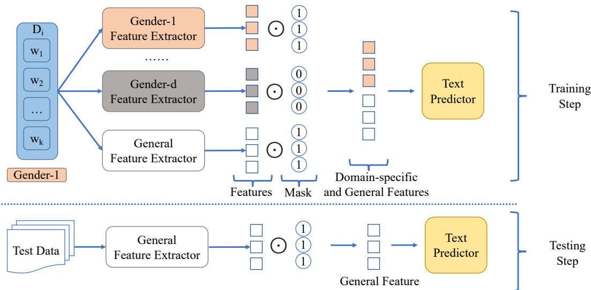

# Easy Adaptation to Mitigate Gender Bias in Multilingual Text Classification

Xiaolei Huang

Department of Computer Science, University of Memphis xiaolei.huang@memphis.edu

## Abstract

Existing approaches to mitigate demographic biases evaluate on monolingual data, however, multilingual data has not been examined. In this work, we treat the gender as domains (e.g., male vs. female) and present a standard domain adaptation model to reduce the gender bias and improve performance of text classi fiers under multilingual settings. We evaluate our approach on two text classification tasks, hate speech detection and rating prediction, and demonstrate the effectiveness of our approach with three fair-aware baselines.

## 1 Introduction

Recent research raises concerns that document classification models can be discriminatory and can perpetuate human biases (Dixon et al., 2018; Borkan et al., 2019; Sun et al., 2019; Blodgett et al., 2020; Liang et al., 2020). Buildingfairness-aware classifiers is critical for the text classification task, such as hate speech detection and online reviews due to its rich demographic diversity of users. The fairness-aware classifiers aim to provide fair and non-discriminatory outcomes towards people or groups of people based on their demographic attributes, such as gender, age, or race. Fairness has been defined in different ways (Hardt et al., 2016) across downstream tasks; for mitigating biases in the text classification, existing research (Dixon et al., 2018; Heindorf et al., 2019; Han et al., 2021) has focused on groupfairness (Chouldechova and Roth, 2018), under which document classifiers are defined as biased if the classifiers perform better for documents of some groups than for documents ofother groups.

Methods to mitigate demographic biases in text classification task focus on four main directions, data augmentation (Dixon et al., 2018; Park et al., 2018; Garg et al., 2019), instance weighting (Zhang et al., 2020; Pruksachatkun et al., 2021), debiased pre-trained embeddings (Zhao et al., 2017;

Pruksachatkun et al., 2021), and adversarial training (Zhang et al., 2018; Barrett et al., 2019; Han et al., 2021; Liu et al., 2021). The existing studies have been evaluated on English datasets containing rich demographic variations, such as Wikipedia toxicity comments (Cabrera et al., 2018), sentiment analysis (Kiritchenko and Mohammad, 2018), hate speech detection (Huang et al., 2020). However, the methods of reducing biases in text classifiers have not been evaluated under multilingual settings.

In this study, we propose a domain adaptation approach using the idea of “easy adaptation” (Daumé III, 2007) and evaluate on the text classification task of two multilingual datasets, hate speech detection and rating prediction. We experiment with non-debiased classifiers and three fairaware baselines on the gender attribute, due to its wide applications and easily accessible resources. The evaluation results of both non-debiased and debiased models establish important benchmarks of group fairness on the multilingual settings. To our best knowledge, this is the first study that proposes the adaptation method and evaluates fair-aware text classifiers on the multilingual settings.

## 2 Multilingual Data

We retrieved two public multilingual datasets that have gender annotations for hate speech classification (Huang et al., 2020) and rating reviews (Hovy et al., 2015).1 The hate speech (HS) data collects online tweets from Twitter and covers four languages, including English (en), Italian (it), Portuguese (pt), and Spanish (es). The rating review (Review) data collects user reviews from Trustpilot website and covers four languages, including English, French (fr), German (de), and Danish (da). The HS data is annotated with binary labels indicating whether the tweet is related to hate speech or not. The Review data has five ratings from 1 to 5. To keep consistent, we removed reviews with the rating 3 and encoded the review scores into two discrete categories: score > 3 as positive and < 3 as negative. All the data has the same categories for the gender/sex, male and female. We anonymized tweets, lowercased all documents, and tokenized each document by NLTK (Loper and Bird, 2002), which supports processing English and the other six languages.

<table><tr><td>Source</td><td>Lang</td><td>Docs</td><td>Tokens</td><td>F-Ratio</td><td>L-Ratio</td></tr><tr><td>HS</td><td>EN IT PT ES</td><td>44,253 2,361 1,852 4,831</td><td>20.533 19.848 20.007 20.660</td><td>.498 .310 .554 .455</td><td>.355 .235 .222 .357</td></tr><tr><td>Review</td><td>EN FR DE DA</td><td>358,219 324,358 115,367 882,080</td><td>48.553 37.102 38.224 49.829</td><td>.398 .429 .430 .475</td><td>.930 .931 .928 .886</td></tr></table>

Table 1: Summary of multilingual Hate Speech (HS) and Online Review data. F-Ratio and L-Ratio indicate female ratios and positive / hate speech label ratios respectively.

We summarize the data statistics in Table 1. The HS data is comparatively smaller than the review data, and both datasets have a skewed label distributions. For example, most of the reviews have positive labels, and most of tweets are not hate speech. Notice that the review data comes from a consumer review website in Denmark, and therefore, Danish reviews are more than the other languages of the review data. We can find that all documents are short, and the HS data from Twitter is comparatively shorter. For the gender ratio, most of the data has a relatively lower female ratios.

Ethic and Privacy consideration. We only use the text documents and gender information for evaluation purposes without any other user profile, such as user IDs. All experimental information has been anonymized before training text classifiers. Specifically, we hash document IDs and replace any user mentions and URLs by two generic symbols, “user” and “url”, respectively. To preserve user privacy, we will only release aggregated results presented in this manuscript and will not release the data. Instead, we will provide experimental code and the public access links of the datasets to replicate the proposed methodology.

## 3 Easy Adaptation Framework

Previous work has shown that applying domain adaptation techniques, specifically the “Frustratingly Easy Domain Adaptation” (FEDA) approach (Daumé III, 2007), can improve document classification when demographic groups are treated as domains (Volkova et al., 2013; Lynn et al., 2017). Based on these results, we investigate whether the same technique can also improve the fairness of classifiers, as shown in Figure 1. With this method, the feature set is augmented such that each feature has a domain-specific version for each domain, as well as a domain-independent (general) version. Specifically, the features values are set to the original feature values for the domain-independent features and the domain-specific features that apply to the document, while domain-specific features for documents that do not belong to that domain are set to 0. We implement this via a feature mask by the element-wise matrix multiplication. For example, a training document with a female author would be encoded as $[ F _ { g e n e r a l } , F _ { d o m a i n , f e m a l e } , 0 ]$ , while a document with a male author would be encoded as $[ F _ { g e n e r a l } , 0 , F _ { d o m a i n , m a l e } ]$ . At test time we only use the domain-independent features. While the FEDA applies to non-neural classifiers, we treat neural models as feature extractors and apply the framework on neural classifiers (e.g., RNN). We denote models with the easy adaptation with the suffix -DA.

## 4 Experiments

Demographic variations root in documents, especially in social media data (Volkova et al., 2013; Hovy, 2015). In this study, we present a standard domain adaptation model on the gender factor, and we treat each demographic group as a domain (e.g., male and female domains). We show the domain adaptation method can effectively reduce the biases of document classifiers on the two multilingual corpora. Each corpus is randomly split into training (80%), development (10%), and test (10%) sets. We train the models on the training set and find the optimal hyperparameters on the development set. We randomly shuffle the training data at the beginning of each training epoch.

## 4.1 Regular Baselines (B-Reg)

We experimented with three popular classifiers, Logistic Regression (LR), Recurrent Neural Network (RNN), and BERT (Devlin et al., 2019). For the LR, we extract Tf-IDF-weighted features for uni-, bi-, and tri-grams on the corpora with the most frequent 15K features with the minimum feature frequency as 3. We then train a LogisticRegression from scikit-learn (Pedregosa et al., 2011). We left other hyperparameters as their defaults. For the RNN classifier, we follow existing work (Park et al., 2018) and build a bi-directional model with the Gated Recurrent Unit (GRU) (Chung et al., 2014) as the recurrent unit. We set the output dimension of RNN as 200 and apply a dropout on the output with rate .2. We optimize the RNN with RMSprop (Tieleman and Hinton, 2012). To encode the multilingual tokens, we utilize the pre-trained fastText multilingual embeddings (Mikolov et al., 2018) to encode the top 15K frequent tokens. For the BERT classifier, we build two new linear layers upon on pretrained BERT models (Devlin et al., 2019) including both English and multilingual versions. The multilingual version supports 104 languages that cover all languages in this work. The first layer transforms the BERT-encoded representations into 200-dimension vectors and feeds the vectors for the the final prediction layer. We optimize the model parameters by the Adam (Kingma and Ba, 2015). For the neural classifiers, we train them with the batch size as 64, the max length as 200, and the learning rate within the range of [1e  4, 1e  6]. The classifiers in the following sections apply the same hyperparameter settings for fair comparison.

  
Figure 1: Framework illustrations for training and testing steps. The training step uses domain-independent (general in no color) and -specific (in color) features, while the testing step only uses the general features.

## 4.2 Fair-aware Baselines

Blind augments data by masking out tokens that are associated with the demographic groups (Dixon et al., 2018; Garg et al., 2019). We apply the Blind strategy on the regular baselines and denote the classifiers as LR-Blind, RNN-Blind, and BERT-Blind respectively. We retrieved the gender-sensitive tokens from the Conversation AI project (ConversationAI, 2021), which contains individual tokens. However, the existing resource (Dixon et al., 2018; Garg et al., 2019) only focused on English instead of the other languages. Therefore, we use the multilingual lexicon, PanLex (Kamholz et al., 2014), to translate the gender-sensitive English tokens into the other six languages.

RNN-IW applies the instance weighting to reduce impacts of gender-biased documents (Zhang et al., 2020) during training classifiers. The method learns each training instance with a numerical weight $\frac { P ( Y ) } { P ( Y | Z ) }$ based on explicit biases counted by gender-sensitive tokens (ConversationAI, 2021). Then the method utilizes a random forest classifier to estimate the conditional distribution $P ( \boldsymbol { Y } | Z )$ and the marginal distribution P(Y ). Finally, the method applies the classifier on training instances to obtain weight scores and assign the weights to training instances during optimization loss calculation. The approach achieves the best results using RNN models, and we keep the same settings. We extend the approach to multilingual settings using the translated resources.

<table><tr><td rowspan="2" colspan="2">Review (%) Methods</td><td colspan="3">English</td><td colspan="3">French</td><td colspan="3">German</td><td colspan="3">Danish</td></tr><tr><td>F1-macro</td><td>AUC</td><td>Fair</td><td>F1-macro</td><td>AUC</td><td>Fair</td><td>F1-macro</td><td>AUC</td><td>Fair</td><td>F1-macro</td><td>AUC</td><td>Fair</td></tr><tr><td rowspan="3">B-Reg</td><td>LR</td><td>87.1</td><td>98.3</td><td>4.2</td><td>85.1</td><td>97.9</td><td>7.7</td><td>86.1</td><td>97.9</td><td>7.6</td><td>88.5</td><td>98.4</td><td>6.2</td></tr><tr><td>RNN</td><td>87.1</td><td>97.6</td><td>5.2</td><td>80.6</td><td>95.3</td><td>1.5</td><td>80.4</td><td>95.5</td><td>3.7</td><td>86.8</td><td>94.8</td><td>3.1</td></tr><tr><td>BERT</td><td>93.3</td><td>99.3</td><td>4.9</td><td>91.6</td><td>99.1</td><td>4.6 7.6</td><td>91.2</td><td>98.2 97.9</td><td>3.5 5.9</td><td>94.0</td><td>98.8</td><td>3.9</td></tr><tr><td rowspan="5">B-Fair</td><td>LR-Blind</td><td>87.1</td><td>98.3</td><td>3.6</td><td>85.2</td><td>97.9</td><td></td><td>86.0</td><td></td><td></td><td>90.5</td><td>98.4</td><td>1.4</td></tr><tr><td>RNN-Blind</td><td>89.6</td><td>98.5</td><td>4.5</td><td>81.7</td><td>96.0</td><td>5.1</td><td>82.0</td><td>96.8</td><td>3.2</td><td>85.8</td><td>95.7</td><td>2.5</td></tr><tr><td>BERT-Blind</td><td>93.4</td><td>99.3</td><td>4.3</td><td>91.7</td><td>99.1</td><td>3.9</td><td>89.5</td><td>98.5</td><td>3.6</td><td>93.0</td><td>99.1</td><td>1.9</td></tr><tr><td>RNN-IW</td><td>87.9</td><td>98.8</td><td>2.8</td><td>81.6</td><td>97.2</td><td>4.4</td><td>84.5</td><td>97.6</td><td>3.2</td><td>86.2</td><td>97.6</td><td>1.8</td></tr><tr><td>RNN-Adv</td><td>88.0</td><td>98.1</td><td>5.2</td><td>83.4</td><td>96.9</td><td>4.9</td><td>85.4</td><td>97.4</td><td>3.0</td><td>88.7</td><td>97.6</td><td>1.9</td></tr><tr><td rowspan="3">Ours</td><td>LR-DA</td><td>87.3</td><td>98.4</td><td>2.8</td><td>85.3</td><td>97.9</td><td>1.7</td><td>85.1</td><td>98.0</td><td>4.3</td><td>87.6</td><td>98.5</td><td>3.3</td></tr><tr><td>RNN-DA</td><td>89.2</td><td>98.6</td><td>4.1</td><td>83.1</td><td>95.9</td><td>0.9</td><td>81.2</td><td>96.6</td><td>3.5</td><td>89.2</td><td>98.2</td><td>1.9</td></tr><tr><td>BERT-DA</td><td>93.6</td><td>99.4</td><td>3.3</td><td>91.7</td><td>99.0</td><td>3.4</td><td>91.4</td><td>97.8</td><td>2.7</td><td>93.7</td><td>99.2</td><td>1.7</td></tr><tr><td colspan="2">Delta-R (%)</td><td>1.0</td><td>.4</td><td>-28.7</td><td>1.1</td><td>0.2</td><td>-56.5</td><td>0</td><td>0.3</td><td>-29.1</td><td>0.5</td><td>1.3</td><td>-47.7</td></tr><tr><td colspan="2">Delta-F (%)</td><td>.9</td><td>0.2</td><td>-16.7</td><td>2.3</td><td>0.2</td><td>-61.4</td><td>0.5</td><td>-0.2</td><td>-7.4</td><td>1.5</td><td>1.0</td><td>21.1</td></tr><tr><td colspan="2">Hate Speech (%)</td><td>English</td><td></td><td></td><td colspan="2">Spanish</td><td></td><td colspan="2">Italian</td><td></td><td colspan="2">Portuguese</td><td></td></tr><tr><td colspan="2">Methods</td><td>F1-macro</td><td>AUC</td><td>Fair</td><td>F1-macro</td><td>AUC</td><td>Fair</td><td>F1-macro</td><td>AUC</td><td>Fair</td><td>F1-macro</td><td>AUC</td><td>Fair</td></tr><tr><td rowspan="3">B-Regular</td><td>LR</td><td>81.5</td><td>89.3</td><td>6.2</td><td>66.6</td><td>80.9</td><td>27.2</td><td>54.8</td><td>75.5</td><td>21.1</td><td>65.3</td><td>75.2</td><td>12.8</td></tr><tr><td>RNN</td><td>82.0</td><td>89.0</td><td>5.4</td><td>65.3</td><td>70.0</td><td>25.9</td><td>62.3</td><td>70.7</td><td>30.9</td><td>60.8</td><td>75.9</td><td>44.1</td></tr><tr><td>BERT</td><td>84.3</td><td>92.0</td><td>4.9</td><td>65.9</td><td>73.8</td><td>15.6</td><td>57.1</td><td>70.3</td><td>12.9</td><td>70.1</td><td>79.6</td><td>19.9</td></tr><tr><td rowspan="5">B-Fair</td><td>LR-Blind</td><td>81.5</td><td>89.1</td><td>5.4</td><td>67.3</td><td>81.0</td><td>25.9</td><td>54.8</td><td>75.5</td><td>20.7</td><td>62.2</td><td>73.9</td><td>9.6</td></tr><tr><td>RNN-Blind</td><td>82.8</td><td>89.8</td><td>5.1</td><td>64.9</td><td>63.8</td><td>14.2</td><td>56.4</td><td>76.4</td><td>22.9</td><td>62.2</td><td>74.9</td><td>20.6</td></tr><tr><td>BERT-Blind</td><td>84.0</td><td>91.9</td><td>3.7</td><td>65.5</td><td>72.8</td><td>14.9</td><td>57.2</td><td>71.2</td><td>23.2</td><td>72.4</td><td>81.8</td><td>26.4</td></tr><tr><td>RNN-IW</td><td>83.8</td><td>98.4</td><td>3.8</td><td>54.0</td><td>58.9</td><td>13.4</td><td>64.1</td><td>74.7</td><td>21.9</td><td>63.8</td><td>74.7</td><td>30.7</td></tr><tr><td>RNN-Adv</td><td>82.9</td><td>90.6</td><td>4.1</td><td>54.6</td><td>64.8</td><td>12.0</td><td>57.9</td><td>70.9</td><td>22.1</td><td>69.8</td><td>75.8</td><td>23.1</td></tr><tr><td rowspan="3">Ours</td><td>LR-DA</td><td>81.0</td><td>88.6</td><td>4.3</td><td>71.5</td><td>79.7</td><td>18.5</td><td>62.9</td><td>71.1</td><td>17.8</td><td>67.4</td><td>79.0</td><td>11.8</td></tr><tr><td>RNN-DA</td><td>82.1</td><td>89.1</td><td>4.7</td><td>66.5</td><td>70.9</td><td>22.8</td><td>62.8</td><td>72.3</td><td>25.6</td><td>68.8</td><td>77.1</td><td>11.7</td></tr><tr><td>BERT-DA</td><td>84.4</td><td>91.4</td><td>2.2</td><td>73.8</td><td>78.3</td><td>10.1</td><td>67.2</td><td>74.9</td><td>12.4</td><td>74.8</td><td>78.3</td><td>9.0</td></tr><tr><td colspan="2">Delta-R (%)</td><td>-0.1</td><td>-0.4</td><td>-32.1</td><td>7.1</td><td>1.9</td><td>-25.2</td><td>10.7</td><td>0.8</td><td>-14.0</td><td>7.5</td><td>1.6</td><td>-57.7 -50.9</td></tr><tr><td colspan="2">Delta-F (%)</td><td>-0.6</td><td>-2.5</td><td>-15.5</td><td>15.2</td><td>11.8</td><td>6.6</td></table>

Table 2: Performance on the HS and Review Data in percentage. A lower fair score is better. The Delta-R and -F are improvements over the regular (-R) and fair (-F) baselines respectively. Negative Delta scores over the fair indicate percentage of mitigating biases, and lower scores means more bias mitigation.

RNN-Adv utilizes adversarial training (Han et al., 2021) to mitigate (Liu et al., 2021) gender biases by two prediction tasks, document and gender predictions. Instead of learning to better separate gender labels, the adversarial training aims to confuse the gender predictions to reduce gender sensitiveness. We adapt the RNN module which achieved promising results (Han et al., 2021; Liu et al., 2021).

## 4.3 Evaluation Metrics

We use F1-macro score (fit for skewed label distribution) and area under the ROC curve (AUC) to measure overall performance. To evaluate group fairness, we measure the equality differences (ED) of false positive/negative rates (Dixon et al., 2018) for the fair evaluation. Existing study shows the FP-/FN-ED is an ideal choice to evaluate fairness in classification tasks (Czarnowska et al., 2021). Taking the false positive rate (FPR) as an example, we calculate the equality difference by $\begin{array} { r } { F P E D = \sum _ { q \in G } | F P R _ { d } - F P R | } \end{array}$ , where G is the gender and d is a gender group (e.g., female). We report the sum of FP-/FN-ED scores and denote the score as “Fair”. This metric sums the differences between the rates within specific gender groups and the overall rates.

## 4.4 Results

We present the averaged results after running evaluations three times of both baselines and our approach in Table 2. Fair-aware classifiers have significantly reduced the gender bias over regular classifiers across the multilingual datasets, and our approaches have better scores of the group fairness by a range of 14% to 57.7% improvements over the baselines. The data augmentation approach achieves better fair scores across multiple languages, which indicates that the translated resources of English gender-sensitive tokens can also be effective on the evaluated languages. The neural fair-aware RNNs usually achieve worse performance than the BERT-based models, but the RNN-based models is more likely to achieve better fairness scores. Note that the BERT and fastText embeddings were pretrained on the same text corpus, Wikipedia dumps, and the performance indicates that fine-tuning the more complex models is a practical approach to reduce gender bias under the multilingual settings. Overall, our approach appears promising to reduce the gender bias under the multilingual setting.

Considering model performance, we can generally find that the fair-aware methods do not significantly improve the model performance, which aligns with findings in a previous study (Menon and Williamson, 2018). For example, fair-aware classifiers promote classification performance by around 1%, and fair-aware classifiers slightly decrease on the English hate speech data. However, we also find that all fair-aware models achieve better performance on the Spanish, Italian, and Portuguese hate speech data. We infer this due to the data size, as for the three corpora are much smaller than the corpora in other languages.

## 5 Conclusion

We present an easy adaptation method to reduce gender bias on two downstream tasks (hate speech detection and user rating prediction) under the multilingual setting. The experiments show that by treating demographic groups as domains, we can reduce biases while keeping relatively good performance. Our future work will solve the limitations of this study, including non-binary genders, multiple demographic factors, embedding sources, and label imbalance. Code and data instructions of our work are available at https://github.com/ xiaoleihuang/DomainFairness.

## 5.1 Limitations

While we have proved the effectiveness of our proposed framework, limitations must be acknowledged in order to appropriately interpret our evaluations. First, our experiments are based on coarsegrained gender categories (binary gender groups) and the multilingual datasets fail to provide finegrained information. Using coarse-grained attributes would ignore people with non-binary gender. Expanding evaluations of existing methods may require enriching categories of demographic attributes. In this study, we include two major data sources and experiment the six languages aiming to evaluate gender-bias-mitigation algorithms in a diverse and multilingual scenario. We keep the same experimental settings with the baselines (Dixon et al., 2018; Zhang et al., 2020; Han et al., 2021; Liu et al., 2021) to ensure fair comparisons, such as data sources and binary labels. Second, the multilingual pretrained embeddings (fastText and BERT), which were not trained on the social media data, may not achieve the best performance overall. We may expect a performance boost if utilizing in-domain pretrained embeddings. However, our focus is on the augmentation framework to reduce demographic (gender) biases.

## Acknowledgements

The author wants to thank for reviewers’ valuable comments. The experiments on the English hate speech data was adopted from his Ph.D. thesis, Section 5.6 (Huang, 2020). The author also wants to thank Dr. Michael J. Paul for the initial idea discussion and Dr. Shijie Wu for his suggestions on selecting the multilingual lexicon.

## References

Maria Barrett, Yova Kementchedjhieva, Yanai Elazar, Desmond Elliott, and Anders Søgaard. 2019. Adversarial removal of demographic attributes revisited. In Proceedings of the 2019 Conference on Empirical Methods in Natural Language Processing and the 9th International Joint Conference on Natural Language Processing (EMNLP-IJCNLP), pages 6330– 6335, Hong Kong, China. ACL.

Su Lin Blodgett, Solon Barocas, Hal Daumé III, and Hanna Wallach. 2020. Language (technology) is power: A critical survey of “bias” in NLP. In Proceedings of the 58th Annual Meeting of the Associationfor Computational Linguistics, pages 5454– 5476, Online. Association for Computational Linguistics.

Daniel Borkan, Lucas Dixon, Jeffrey Sorensen, Nithum Thain, and Lucy Vasserman. 2019. Nuanced metrics for measuring unintended bias with real data for text classification. In Companion Proceedings of The 2019 World Wide Web Conference, WWW ’19, page 491–500, New York, NY, USA. Association for Computing Machinery.

Benjamin Cabrera, Björn Ross, Marielle Dado, and Maritta Heisel. 2018. The gender gap in wikipedia talk pages. In Proceedings ofthe International AAAI Conference on Web and Social Media.

François Chollet et al. 2015. Keras. https:// keras.io.

Alexandra Chouldechova and Aaron Roth. 2018. The frontiers of fairness in machine learning. arXiv preprint arXiv:1810.08810.

Junyoung Chung, Caglar Gulcehre, Kyunghyun Cho, and Yoshua Bengio. 2014. Empirical evaluation of gated recurrent neural networks on sequence modeling. In NIPS 2014 Workshop on Deep Learning.

ConversationAI. 2021. Conversationai/unintended-mlbias-analysis. Updated by 2021-11-23, Accessed on 2021-12-10.

Paula Czarnowska, Yogarshi Vyas, and Kashif Shah. 2021. Quantifying Social Biases in NLP: A Generalization and Empirical Comparison of Extrinsic Fairness Metrics. Transactions of the Association for Computational Linguistics, 9:1249–1267.

Hal Daumé III. 2007. Frustratingly easy domain adaptation. In Proceedings of the 45th Annual Meeting of the Association of Computational Linguistics, pages 256–263, Prague, Czech Republic. Association for Computational Linguistics.

Jacob Devlin, Ming-Wei Chang, Kenton Lee, and Kristina Toutanova. 2019. BERT: Pre-training of deep bidirectional transformers for language understanding. In Proceedings ofthe 2019 Conference of the North American Chapter ofthe Associationfor Computational Linguistics: Human Language Technologies, Volume 1 (Long and Short Papers), pages 4171–4186, Minneapolis, Minnesota. Association for Computational Linguistics.

Lucas Dixon, John Li, Jeffrey Sorensen, Nithum Thain, and Lucy Vasserman. 2018. Measuring and mitigating unintended bias in text classification. In Proceedings ofthe 2018 AAAI/ACM Conference on AI, Ethics, and Society, AIES ’18, page 67–73, New York, NY, USA. Association for Computing Machinery.

Sahaj Garg, Vincent Perot, Nicole Limtiaco, Ankur Taly, Ed H. Chi, and Alex Beutel. 2019. Counterfactual fairness in text classification through robustness. In Proceedings of the 2019 AAAI/ACM Conference on AI, Ethics, and Society, AIES ’19, page 219–226, New York, NY, USA. Association for Computing Machinery.

Xudong Han, Timothy Baldwin, and Trevor Cohn. 2021. Decoupling adversarial training for fair NLP. In Findings of the Association for Computational Linguistics: ACL-IJCNLP 2021, pages 471–477, Online. Association for Computational Linguistics.

Moritz Hardt, Eric Price, Nati Srebro, et al. 2016. Equality of opportunity in supervised learning. In NIPS, pages 3315–3323.

Stefan Heindorf, Yan Scholten, Gregor Engels, and Martin Potthast. 2019. Debiasing vandalism detection models at wikidata. In The World Wide Web Conference, WWW ’19, page 670–680, New York, NY, USA. Association for Computing Machinery.

Dirk Hovy. 2015. Demographic factors improve classification performance. In Proceedings of the 53rd Annual Meeting of the Association for Computational Linguistics and the 7th International Joint Conference on Natural Language Processing (Volume 1: Long Papers), pages 752–762, Beijing, China. Association for Computational Linguistics.

Dirk Hovy, Anders Johannsen, and Anders Søgaard. 2015. User review sites as a resource for large-scale sociolinguistic studies. In Proceedings of the 24th International Conference on World Wide Web, WWW

’15, page 452–461, Republic and Canton of Geneva, CHE. International World Wide Web Conferences Steering Committee.

Xiaolei Huang. 2020. Metadata Matters: Adaptation Methodsfor Robust Document Classification. Ph.D. thesis, University of Colorado at Boulder.

Xiaolei Huang, Linzi Xing, Franck Dernoncourt, and Michael J. Paul. 2020. Multilingual Twitter corpus and baselines for evaluating demographic bias in hate speech recognition. In Proceedings ofthe 12th Language Resources and Evaluation Conference, pages 1440–1448, Marseille, France. European Language Resources Association.

David Kamholz, Jonathan Pool, and Susan Colowick. 2014. PanLex: Building a resource for panlingual lexical translation. In Proceedings of the Ninth International Conference on Language Resources and Evaluation (LREC’14), pages 3145–3150, Reykjavik, Iceland. European Language Resources Association (ELRA).

Diederik P. Kingma and Jimmy Ba. 2015. Adam: A method for stochastic optimization. In International Conference on Learning Representations (ICLR).

Svetlana Kiritchenko and Saif Mohammad. 2018. Examining gender and race bias in two hundred sentiment analysis systems. In Proceedings of the Seventh Joint Conference on Lexical and Computational Semantics, pages 43–53, New Orleans, Louisiana. Association for Computational Linguistics.

Paul Pu Liang, Irene Mengze Li, Emily Zheng, Yao Chong Lim, Ruslan Salakhutdinov, and Louis-Philippe Morency. 2020. Towards debiasing sentence representations. In Proceedings ofthe 58th Annual Meeting of the Association for Computational Linguistics, pages 5502–5515, Online. Association for Computational Linguistics.

Haochen Liu, Wei Jin, Hamid Karimi, Zitao Liu, and Jiliang Tang. 2021. The authors matter: Understanding and mitigating implicit bias in deep text classification. In Findings ofthe Associationfor Computational Linguistics: ACL-IJCNLP 2021, pages 74–85, Online. Association for Computational Linguistics.

Edward Loper and Steven Bird. 2002. NLTK: The natural language toolkit. In Proceedings of the ACL-02 Workshop on Effective Tools and Methodologies for Teaching Natural Language Processing and Computational Linguistics, pages 63–70, Philadelphia, Pennsylvania, USA. Association for Computational Linguistics.

Veronica Lynn, Youngseo Son, Vivek Kulkarni, Niranjan Balasubramanian, and H. Andrew Schwartz. 2017. Human centered NLP with user-factor adaptation. In Proceedings of the 2017 Conference on Empirical Methods in Natural Language Processing, pages 1146–1155, Copenhagen, Denmark. Association for Computational Linguistics.

Aditya Krishna Menon and Robert C Williamson. 2018. The cost of fairness in binary classification. In Proceedings ofthe 1st Conference on Fairness, Accountability and Transparency, volume 81 of Proceedings ofMachine Learning Research, pages 107–118, New York, NY, USA. PMLR.

Tomas Mikolov, Edouard Grave, Piotr Bojanowski, Christian Puhrsch, and Armand Joulin. 2018. Advances in pre-training distributed word representations. In Proceedings ofthe Eleventh International Conference on Language Resources and Evaluation (LREC 2018), Miyazaki, Japan. European Language Resources Association (ELRA).

Ji Ho Park, Jamin Shin, and Pascale Fung. 2018. Reducing gender bias in abusive language detection. In Proceedings of the 2018 Conference on Empirical Methods in Natural Language Processing, pages 2799–2804, Brussels, Belgium. Association for Computational Linguistics.

Adam Paszke, Sam Gross, Francisco Massa, Adam Lerer, James Bradbury, Gregory Chanan, Trevor Killeen, Zeming Lin, Natalia Gimelshein, Luca Antiga, Alban Desmaison, Andreas Kopf, Edward Yang, Zachary DeVito, Martin Raison, Alykhan Tejani, Sasank Chilamkurthy, Benoit Steiner, Lu Fang, Junjie Bai, and Soumith Chintala. 2019. Pytorch: An imperative style, high-performance deep learning library. In Advances in Neural Information Processing Systems 32, volume 32, pages 8024–8035. Curran Associates.

Fabian Pedregosa, Gaël Varoquaux, Alexandre Gramfort, Vincent Michel, Bertrand Thirion, Olivier Grisel, Mathieu Blondel, Peter Prettenhofer, Ron Weiss, Vincent Dubourg, et al. 2011. Scikit-learn: Machine learning in python. Journal ofmachine learning research, 12(Oct):2825–2830.

Yada Pruksachatkun, Satyapriya Krishna, Jwala Dhamala, Rahul Gupta, and Kai-Wei Chang. 2021. Does robustness improve fairness? approaching fairness with word substitution robustness methods for text classification. In Findings of the Association for Computational Linguistics: ACL-IJCNLP 2021, pages 3320–3331, Online. Association for Computational Linguistics.

Tony Sun, Andrew Gaut, Shirlyn Tang, Yuxin Huang, Mai ElSherief, Jieyu Zhao, Diba Mirza, Elizabeth Belding, Kai-Wei Chang, and William Yang Wang. 2019. Mitigating gender bias in natural language processing: Literature review. In Proceedings ofthe 57th Annual Meeting ofthe Associationfor Computational Linguistics, pages 1630–1640, Florence, Italy. Association for Computational Linguistics.

Tijmen Tieleman and Geoffrey Hinton. 2012. Lecture 6.5-rmsprop: Divide the gradient by a running average of its recent magnitude. COURSERA: Neural networks for machine learning, 4(2):26–31.

Svitlana Volkova, Theresa Wilson, and David Yarowsky. 2013. Exploring demographic language variations

to improve multilingual sentiment analysis in social media. In Proceedings of the 2013 Conference on Empirical Methods in Natural Language Processing, pages 1815–1827, Seattle, Washington, USA. Association for Computational Linguistics.

Thomas Wolf, Lysandre Debut, Victor Sanh, Julien Chaumond, Clement Delangue, Anthony Moi, Pierric Cistac, Tim Rault, Remi Louf, Morgan Funtowicz, Joe Davison, Sam Shleifer, Patrick von Platen, Clara Ma, Yacine Jernite, Julien Plu, Canwen Xu, Teven Le Scao, Sylvain Gugger, Mariama Drame, Quentin Lhoest, and Alexander Rush. 2020. Transformers: State-of-the-art natural language processing. In Proceedings ofthe 2020 Conference on Empirical Methods in Natural Language Processing: System Demonstrations, pages 38–45, Online. Association for Computational Linguistics.

Brian Hu Zhang, Blake Lemoine, and Margaret Mitchell. 2018. Mitigating unwanted biases with adversarial learning. In Proceedings of the 2018 AAAI/ACM Conference on AI, Ethics, and Society, AIES ’18, page 335–340, New York, NY, USA. Association for Computing Machinery.

Guanhua Zhang, Bing Bai, Junqi Zhang, Kun Bai, Conghui Zhu, and Tiejun Zhao. 2020. Demographics should not be the reason of toxicity: Mitigating discrimination in text classifications with instance weighting. In Proceedings ofthe 58th Annual Meeting ofthe Associationfor Computational Linguistics, pages 4134–4145, Online. Association for Computational Linguistics.

Jieyu Zhao, Tianlu Wang, Mark Yatskar, Vicente Ordonez, and Kai-Wei Chang. 2017. Men also like shopping: Reducing gender bias amplification using corpus-level constraints. In Proceedings ofthe 2017 Conference on Empirical Methods in Natural Language Processing, pages 2979–2989, Copenhagen, Denmark. Association for Computational Linguistics.

## A Implementation Details

While we have presented experimental and hyperparameter settings in the Section 4, we report implementation tools in this section. We implement neural models by PyTorch (Paszke et al., 2019) and non-neural models by scikit-learn (Pedregosa et al., 2011). For the BERT model, we use the Hugging Face Transformers (Wolf et al., 2020). The Keras (Chollet et al., 2015) helped preprocess text documents for neural models, including padding and tokenization. We trained models on an NVIDIA RTX 3090 and evaluated the models on CPUs.