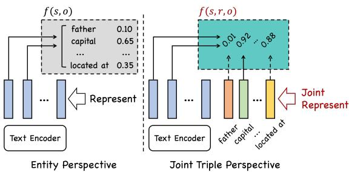
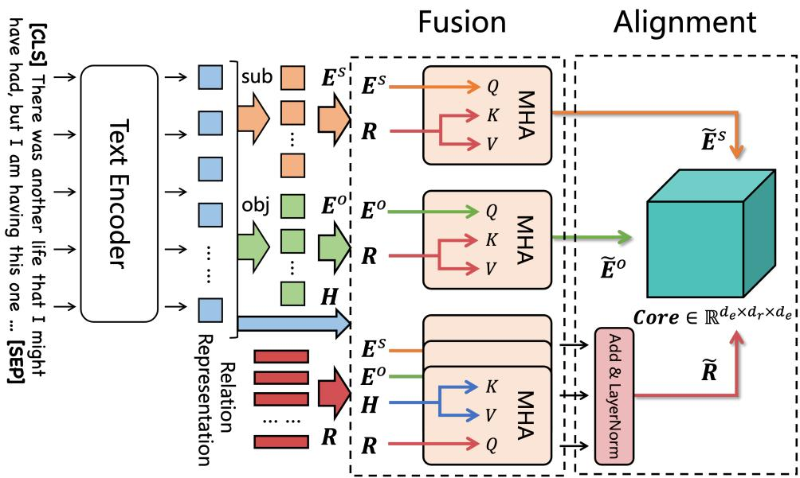
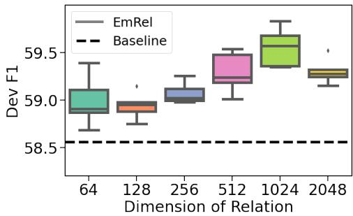

# EmRel: Joint Representation of Entities and Embedded Relations for Multi-triple Extraction

Benfeng Xu1∗, Quan Wang2, Yajuan Lyu3, Yabing Shi3 Yong Zhu3, Jie Gao1 and Zhendong Mao1†

1University of Science and Technology of China, Hefei, China 2Beijing University of Posts and Telecommunications, Beijing, China 3Baidu Inc., Beijing, China

benfeng@mail.ustc.edu.cn, zdmao@ustc.edu.cn

## Abstract

Multi-triple extraction is a challenging task due to the existence of informative inter-triple correlations, and consequently rich interactions across the constituent entities and relations. While existing works only explore entity representations, we propose to explicitly introduce relation representation, jointly represent it with entities, and novelly align them to identify valid triples. We perform comprehensive experiments1 on document-level relation extraction and joint entity and relation extraction along with ablations to demonstrate the advantage of the proposed method.

## 1 Introduction

Relation extraction aims at discovering structured knowledge in the form of <subject-relationobject> triples from plain text. It is an essential task towards constructing knowledge bases. Although a lot of efforts have been made in building advanced relation extraction systems, it is still a challenging problem under certain practical scenarios where multiple entities and relations are involved, e.g., document-level relation extraction (Yao et al., 2019) and joint entity and relation extraction (Riedel et al., 2010; Gardent et al., 2017).

Existing works mostly take the entity perspective that focuses on exploring cross-entity interactions (Xu et al., 2021; Zeng et al., 2020). They either treat relations as atomic labels specified in a final classifier (Xu et al., 2021; Zeng et al., 2020; Wang et al., 2020), or simply search subjects and objects for each individual relation(Wei et al., 2020; Zheng et al., 2021). However, as an essential component, relations also interact with entities and context, which jointly exhibit informative inter-triple correlations. e.g., the two relations capital of and located at often co-occur between the same pair of entities but with different probabilities conditioned on specific contextual clues. As a consequence, the capability to model and make full use of rich interactions across relations, entities, and context is crucial for the task.

  
Figure 1: Different formulations for multi-triple extraction. 1) entity perspective constructs only entity representation and feed them into a relation-specific classifier. 2) joint triple perspective constructs both entity representation and relation representation to model comprehensive correlations across all components.

In this paper, we advocate a novel joint triple perspective for relation extraction (see Figure 1 for illustration). Different from previous works that only seek to represent entities, we propose EmRel that creates, refines and leverages the Embedded representations of Relations. Specifically, we first explicitly create relation representations as embedded vectors; then refine these relation (as well as entity) representations by modeling rich relationentity-context interactions via an attention-based fusion module; and finally identify valid triples by aligning the representation of entities and relations in a joint space, with a novel alignment function based on Tucker Decomposition. This joint triple perspective actually considers entities along with relations as components of a small, incontext knowledge graph, and completes this graph by aligning and reasoning to extract multiple valid triples.

To demonstrate the advantage of the proposed EmRel framework, we conduct experiments on two specific scenarios of multi-triple extraction: document-level relation extraction(RE) and joint entity and relation extraction, with three popular datasets including DocRED (Yao et al., 2019), NYT (Riedel et al., 2010) and WebNLG (Gardent et al., 2017). The results verify the superiority of the joint triple perspective over the traditional entity perspective in multi-triple extraction. We also provide further ablation study to show the effectiveness of our fusion module and alignment function.

## 2 Related Works

Document-level Relation Extraction Extracting multi-triples from document-level text has recently aroused increasing interests (Yao et al., 2019). Existing methods take the entity perspective that proposes various techniques to model entity interactions. Nan et al. (2020) and Zeng et al. (2020) construct an entity graph, and perform graph-level reasoning to refine the entity node representations. Xu et al. (2021) introduces entity structure as useful prior, and models such information within the transformer attention layer. Zhang et al. (2021) utilizes a segmentation network to model the interdependency among entity pairs. Therefore, inter-triple correlations are only captured at the entity level while relation-based ones are neglected.

Joint Entity and Relation Extraction Joint entity and relation extraction is a popular task that extracts multi-triples along with their entities. Existing works can be concluded into two frameworks: one that searches subjects and objects for each individual relation ( Liu et al., 2020; Wang et al., 2020; Wei et al., 2020), and the other that directly see each word as a candidate entity and assign them with relation labels (Gupta et al., 2016; Zheng et al., 2021). Both formulations do not explicitly include inter-triple correlations. Very recently, Wu and Shi (2021) propose to model the interdependencies between entity labels and relation labels. However, such correlation is constrained within a specific word position, while EmRel exploits the global correlations among all triples and across entities, context, and relations. Li et al. (2021) introduces a translation-based function that predicts object from subject and relation, while EmRel proposes a more expressive alignment function that models the ternary interaction of subject, relation and object.

Relation Embedding There is one specific previous work (Chen and Badlani, 2020) that also considers modeling relation representations. CRE uses the sentence representation as relation embeddings, and scores them with the entity embeddings trained along with the knowledge base. This raises significant differences with EmRel in both 1) technical design, EmRel constructs and models independent relation representations that are not inherited from specific context, and 2) task settings, CRE requires all entities be aligned to an existing knowledge base to train their embedding.

## 3 Methodology

## 3.1 Task Formulation

We first formulate the multi-triple extraction task to suitably contain both document-level RE and joint entity and relation extraction. Given a sequence of text $\{ w _ { i } \}$ , a set of candidate entities $E = \{ e _ { i } \}$ and the pre-defined relations $R = \{ r _ { i } \}$ , the candidate triples can be derived as:

$$
T = \{ < s , r , o > | s , o \in \{ e _ { i } \} , r \in \{ r _ { i } \} \}\tag{1}
$$

the target is to assign each t in $T$ a binary label that discriminates its validity. The candidate entities can either be pre-annotated, as in document-level relation extraction, or be jointly recognized, as in joint entity and relation extraction. In the latter scenario, one prevailing solution is to directly see each word as a candidate entity, such as tagging-based methods (Wang et al., 2020) or table filling methods (Gupta et al., 2016). Here we follow Wang et al. (2020) as our baseline, and thus formulate both tasks under a unified framework that extracts multi-triples from a given candidate entity set.

## 3.2 EmRel

EmRel consists of three modules: Representation Construction for both entities and relations, Representation Fusion that captures multi-triple correlations by modeling the informative interactions across entities, context and relations, and Representation Alignment that leverages these representations to extract triples by aligning their ternary structures (see Figure 2 for illustration).

Representation Construction The entity representation is constructed similar to existing practices. We employ a text encoder, e.g., pretrained language models like BERT (Devlin et al., 2019), and obtain the output from its last layer on corresponding position as the contextualized representation:

  
Figure 2: The overall framework of EmRel. It explicitly introduces relations embedding, and jointly represents it with entities to identify all valid triples.

$$
\left( h _ { 1 } , h _ { 2 } , . . . h _ { n } \right) = { \mathsf { e n c o d e r } } \left( w _ { 1 } , w _ { 2 } , . . . w _ { n } \right)\tag{2}
$$

which we denote as $\mathbf { H } \in \mathbb { R } ^ { | \{ w _ { i } \} | \times d _ { h } }$ . Then we construct each entity representation $\mathbf { e } _ { i } \in \mathbb { R } ^ { d _ { e } }$ by applying a pooling operation on its corresponding mention positions, and further map it into respective subject and object representation $\mathbf { e } _ { i } ^ { s } , \mathbf { e } _ { i } ^ { o }$ . We thus denote all extracted entity representations as $\mathbf { E } ^ { s } , \mathbf { E } ^ { o } \in \mathbb { R } ^ { | E | \times d _ { \epsilon } }$

We embed the target relations R into an embedding matrix $\mathbf { R } \in \bar { \mathbb { R } } ^ { | R | \times d _ { r } }$ , where each row $\mathbf { R } _ { i , : }$ represents a vectorized relation $r _ { i }$ . This matrix is maintained as part of the model parameter and trained accordingly.

Representation Fusion In order to jointly represent entities and relations in a shared knowledge representation space, we fuse them to be aware of each other. We adopt the attention network (Bahdanau et al., 2015) to model inter-component interactions, which has proven to be very successful in modeling rich interactions across contexts (Yu et al., 2018) or modalities (Lu et al., 2016). Specifically, we employ the canonical multi-head attention (MHA) network (Vaswani et al., 2017). Given the target representation $\mathbf { X } _ { Q }$ and the source representation $\mathbf { X } _ { S }$ , each head of MHA operates them as:

$$
\begin{array} { r l } & { \widehat { \mathbf { X } } _ { Q } = \mathrm { A t t } ( { \mathbf { X } _ { Q } } { \boldsymbol { W } ^ { Q } } , { \mathbf { X } _ { S } } { \boldsymbol { W } ^ { K } } , { \mathbf { X } _ { S } } { \boldsymbol { W } ^ { V } } ) } \\ & { \quad \quad \quad = \mathbf { s o f t m a x } ( \frac { \left( \mathbf { X } _ { Q } { \boldsymbol { W } ^ { Q } } \right) \left( \mathbf { X } _ { S } { \boldsymbol { W } ^ { K } } \right) ^ { T } } { \sqrt { d _ { k } } } ) \mathbf { X } _ { S } { \boldsymbol { W } ^ { V } } } \end{array}\tag{3}
$$

where $\widehat { \mathbf { X } } _ { Q }$ is the updated representation of $\mathbf { X } _ { Q }$ w.r.t. $\mathbf { X } _ { S }$ , all heads operate in parallel and will be concatenated together.

In EmRel, to exploit the comprehensive interactions across all components, we first construct entity/context-aware relation representation:

$$
\begin{array} { r l } & { \widehat { \mathbf { R } } ^ { s } = \mathbf { A } \mathbf { t } \mathbf { t } _ { s 2 r } ( \mathbf { R } W ^ { Q } , \mathbf { E } ^ { s } W ^ { K } , \mathbf { E } ^ { s } W ^ { V } ) } \\ & { \widehat { \mathbf { R } } ^ { o } = \mathbf { A } \mathbf { t } \mathbf { t } _ { o 2 r } ( \mathbf { R } W ^ { Q } , \mathbf { E } ^ { o } W ^ { K } , \mathbf { E } ^ { o } W ^ { V } ) } \\ & { \widehat { \mathbf { R } } ^ { c } = \mathbf { A } \mathbf { t } \mathbf { t } _ { c 2 r } ( \mathbf { R } W ^ { Q } , \mathbf { H } W ^ { K } , \mathbf { H } W ^ { V } ) } \end{array}\tag{4}
$$

which are then aggregated together using layer normalization:

$$
\widehat { \bf R } = \mathrm { L a y e r N o r m } ( \widehat { \bf R } ^ { s } + \widehat { \bf R } ^ { o } + \widehat { \bf R } ^ { c } )\tag{5}
$$

we symmetrically construct relation-aware entity representation:

$$
\begin{array} { r l } & { \widehat { \mathbf { E } } ^ { s } = \mathsf { A t t } _ { r 2 s } ( \mathbf { E } ^ { s } W ^ { Q } , \mathbf { R } W ^ { K } , \mathbf { R } W ^ { V } ) } \\ & { \widehat { \mathbf { E } } ^ { o } = \mathsf { A t t } _ { r 2 o } ( \mathbf { E } ^ { o } W ^ { Q } , \mathbf { R } W ^ { K } , \mathbf { R } W ^ { V } ) } \end{array}\tag{6}
$$

s, o, c are abbreviations for subject, object and context. Each attention module is wrapped with residual connection, feedforward layer, layer normalization, and is instantiated with different parameters of $W _ { Q } , W _ { K } , W _ { V }$ to model distinguished attending patterns. The outputs of fusion module are refined representations $\hat { \bf R } , \hat { \bf E } ^ { s } , \hat { \bf E } ^ { o }$ for relations, subjects and objects.

<table><tr><td rowspan="2">Method</td><td colspan="3"> $\mathbf { N Y T ^ { * } }$ </td><td colspan="3">WebNLG*</td><td colspan="3">NYT</td><td colspan="3">WebNLG</td></tr><tr><td>Prec.</td><td>Rec.</td><td>F1</td><td>Prec.</td><td>Rec.</td><td>F1</td><td>Prec.</td><td>Rec.</td><td>F1</td><td>Prec.</td><td>Rec.</td><td>F1</td></tr><tr><td>CasRel (Wei et al., 2020)</td><td>89.7</td><td>89.5</td><td>89.6</td><td>93.4</td><td>90.1</td><td>91.8</td><td></td><td></td><td></td><td></td><td>一</td><td>-</td></tr><tr><td>TPLinker (Wang et al., 2020)</td><td>91.3</td><td>92.5</td><td>91.9</td><td>91.8</td><td>92.0</td><td>91.9</td><td>91.4</td><td>92.6</td><td>92.0</td><td>88.9</td><td>84.5</td><td>86.7</td></tr><tr><td>Baseline†</td><td>91.1</td><td>92.5</td><td>91.8</td><td>91.4</td><td>92.7</td><td>92.1</td><td>91.2</td><td>92.1</td><td>91.6</td><td>88.7</td><td>86.5</td><td>87.6</td></tr><tr><td>EmRel</td><td>91.7</td><td>92.5</td><td>92.1</td><td>92.7</td><td>93.0</td><td>92.9</td><td>92.6</td><td>92.7</td><td>92.6</td><td>90.2</td><td>87.4</td><td>88.7</td></tr></table>

Table 1: Results on NYT and WebNLG. ∗ denotes task settings that only annotate the last word. † denotes our reproduced results of Wang et al. (2020) as the baseline. Best results in bold.

<table><tr><td colspan="4">Method</td><td colspan="2">Test</td></tr><tr><td></td><td>Dev IgnF1</td><td>F1</td><td>IgnF1</td><td></td><td>F1</td></tr><tr><td>BERT-TS</td><td></td><td>54.42</td><td></td><td></td><td>53.92</td></tr><tr><td>CorefBERT</td><td>55.32</td><td>57.51</td><td>54.54</td><td></td><td>56.96</td></tr><tr><td>LSR</td><td>52.43</td><td>59.00</td><td></td><td>56.97</td><td>59.05</td></tr><tr><td>SSAN</td><td>57.03</td><td>59.19</td><td></td><td>55.84</td><td>58.16</td></tr><tr><td colspan="4">BERT Base</td><td></td><td></td></tr><tr><td>Baseline†</td><td> $5 6 . 4 5 _ { \pm 0 . 4 7 }$ </td><td> $5 8 . 5 6 _ { \pm 0 . 4 4 }$ </td><td></td><td>55.84</td><td>58.15</td></tr><tr><td>EmRel</td><td> $5 7 . 2 3 _ { \pm 0 . 1 5 }$ </td><td> ${ \bf 5 9 . 3 0 _ { \pm 0 . 1 0 } }$ </td><td></td><td>57.27</td><td>59.66</td></tr><tr><td colspan="4">RoBERTa Base</td><td></td><td></td></tr><tr><td>Baseline†</td><td> $5 7 . 6 2 _ { \pm 0 . 2 3 }$ </td><td> $5 9 . 6 6 _ { \pm 0 . 2 5 }$ </td><td></td><td>57.79</td><td>59.94</td></tr><tr><td>EmRel</td><td> ${ \bf 5 8 . 3 6 _ { \pm 0 . 1 5 } }$ </td><td> ${ \bf 6 0 . 3 5 _ { \pm 0 . 0 7 } }$ </td><td></td><td>58.33</td><td>60.29</td></tr><tr><td colspan="4">RoBERTa Large</td><td></td><td></td></tr><tr><td>Baseline†</td><td> $5 8 . 5 7 { \scriptstyle \pm 0 . 2 6 }$ </td><td> $6 0 . 5 9 { \scriptstyle \pm 0 . 2 5 }$ </td><td>58.75</td><td></td><td>60.83</td></tr><tr><td>EmRel</td><td> ${ \bf 5 8 . 8 6 _ { \pm 0 . 1 8 } }$ </td><td> ${ \bf 6 0 . 9 3 _ { \pm 0 . 2 1 } }$ </td><td></td><td>59.08</td><td>61.18</td></tr></table>

Table 2: Results on DocRED. † denotes our reproduced results of the baseline implementation in Xu et al. (2021). All results are produced with multiple runs using different random seeds. Best results in bold.

Representation Alignment EmRel extracts triples by aligning their ternary components $\widehat { \mathbf { R } } , \widehat { \mathbf { E } } ^ { s }$ b band Eo. In order to fully leverage their expressivebness, we propose factorization-based alignment using Tucker decomposition (Tucker et al., 1964). We introduce a core tensor $\mathcal { Z } \in \mathbb { R } ^ { d _ { e } * d _ { r } * d _ { e } }$ , and the validity for each $< s _ { i } , r _ { k } , o _ { j } >$ is scored as:

$$
\phi ( s _ { i } , r _ { k } , o _ { j } ) = \sigma ( \mathcal { Z } \times _ { 1 } \hat { \mathbf { e } } _ { i } ^ { s } \times _ { 2 } \hat { \mathbf { r } } _ { k } \times _ { 3 } \hat { \mathbf { e } } _ { j } ^ { o } + b _ { k } )\tag{7}
$$

where $\hat { \mathbf { e } } _ { i } ^ { s } = \widehat { \mathbf { E } } _ { i , : } ^ { s } , \hat { \mathbf { r } } _ { k } = \widehat { \mathbf { R } } _ { k , : } , \hat { \mathbf { e } } _ { i } ^ { o } = \widehat { \mathbf { E } } _ { j , : } ^ { o }$ , and $\times _ { n }$ b b bindicates tensor product along the n-th mode, σ denotes sigmoid function. We compute φ for all triples in parallel using batched tensor product, and train them using cross-entropy loss:

$$
\begin{array} { c } { { L = \displaystyle \sum _ { < s _ { i } , r _ { k } , o _ { j } > } ^ { T } [ - 1 ^ { T r u e } ( < s _ { i } , r _ { k } , o _ { j } > ) \log \phi ( s _ { i } , r _ { k } , o _ { j } ) } } \\ { { - \ \mathbb { 1 } ^ { F a l s e } ( < s _ { i } , r _ { k } , o _ { j } > ) \log ( 1 - \phi ( s _ { i } , r _ { k } , o _ { j } ) ) ] _ { \phantom { b a c } { c o _ { j } < b } } , } } \end{array}\tag{8}
$$

where 1 indicates the ground truth validity.

<table><tr><td rowspan="2">Method</td><td colspan="2">Dev</td><td colspan="2">Test</td></tr><tr><td>IgnF1</td><td>F1</td><td>IgnF1</td><td>F1</td></tr><tr><td>EmRel</td><td> $5 7 . 2 3 _ { \pm 0 . 1 5 }$ </td><td> $5 9 . 3 0 { \scriptstyle \pm 0 . 1 0 }$ </td><td>57.27</td><td>59.66</td></tr><tr><td>—Fusion</td><td> $5 7 . 0 2 _ { \pm 0 . 2 0 }$ </td><td> $5 9 . 1 2 _ { \pm 0 . 1 9 }$ </td><td>56.66</td><td>58.92</td></tr><tr><td>—Alignment</td><td> $5 6 . 4 5 _ { \pm 0 . 4 7 }$ </td><td> $5 8 . 5 6 _ { \pm 0 . 4 4 }$ </td><td>55.84</td><td>58.15</td></tr></table>

Table 3: Ablation results on EmRel modules.

## 4 Experiments

## 4.1 Main Results

We conduct comprehensive experiments on document-level RE dataset DocRED (Yao et al., 2019) and joint entity and relation extraction dataset NYT (Riedel et al., 2010) and WebNLG (Gardent et al., 2017). We use BERT-Base-Cased (Devlin et al., 2019) as the context encoder and we also provide results with RoBERTa (Liu et al., 2019) on DocRED. The dimension of embedded relation representation is set as 768 for Base models, 1024 for Large models on DocRED, and 128 on NYT / WebNLG. The number of attention heads in the fusion module is simply set as 4. We provide our reproduced results of TPLinker (Wang et al., 2020) and the baseline system of Xu et al. (2021). Both are competitive baselines based on the entity perspective, and are directly comparable with EmRel. Further specifics about these datasets and implementation details can be referred to Appendix.

The results (see Table 1 and Table 2) show that EmRel universally outperforms its baselines on all datasets. Respectively, +0.3 F1 for NYT∗, +0.8 F1 for WebNLG∗, +1.0 F1 for NYT and +1.1 F1 for WebNLG. On DocRED, EmRel improves the baseline by +0.95 Dev F1, +1.47 Test F1, and also outperforms several previous studies including BERT-TS (Wang et al., 2019), CorefBERT (Ye et al., 2020), LSR (Nan et al., 2020), and SSAN (Xu et al., 2021). On stronger backbone encoders like RoBERTa, similar improvements over baselines can also be observed.

  
Figure 3: Ablation on dimensions of relations.

## 4.2 Ablation Studies

On EmRel Modules We first varify the design of EmRel modules. Table 3 shows that both fusion and alignment module contribute to the improvements. We also observe that EmRel has more robust performance across multiple runs. This can be attributed to our alignment function, which, once removed, would result in an increased standard deviation from $\pm 0 . 2 0 \mathrm { t o } \pm 0 . 4 7$

On the Dimensionality of Relation Representations We investigate the effects of choices for dr in Fig 3. First of all, the advantage of EmRel is general across variant choices comparing to the baseline. As we gradually set a higher dr from 64 to 1024, we get improved performance for its stronger expressive capability. While we further increase dr to 2048, the performance starting to degrades, which might attribute to overfitting. Overall, the optimal dimension lies within [512, 2048], which is quite robust and also computationally acceptable.

## 5 Conclusion

In this paper, we propose EmRel for multi-triple extraction. Distinguished from existing works, Em-Rel explicitly creates, refines, and leverages the embedded representation of relations. Notably, we design a novel alignment function that discriminates triple validity by aligning its components in a joint representation space. We conduct experiments on both document-level relation extraction and joint entity and relation extraction, to demonstrate the advantage of EmRel over its baselines.

EmRel also provides a new joint triple perspective, where multi-triple extraction is formulated as completion of a small, context-dependent knowledge graph, with candidate entities and relations as its components. In the future, we think more intricate techniques e.g., graph-based reasoning, can be explored following such formulation.

## Acknowledgements

We thank all anonymous reviewers for their valuable comments. This work is supported by the National Key Research and Development Program of China No.2020AAA0109400, the National Natural Science Foundation of China under grants No.61876223, No.U19A2057.

## References

Dzmitry Bahdanau, Kyunghyun Cho, and Yoshua Bengio. 2015. Neural machine translation by jointly learning to align and translate. In ICLR 2015 : International Conference on Learning Representations 2015.

Xiaoyu Chen and Rohan Badlani. 2020. Relation extraction with contextualized relation embedding (CRE). In Proceedings of Deep Learning Inside Out (Dee-LIO): The First Workshop on Knowledge Extraction and Integration for Deep Learning Architectures, pages 11–19, Online. Association for Computational Linguistics.

Jacob Devlin, Ming-Wei Chang, Kenton Lee, and Kristina Toutanova. 2019. BERT: Pre-training of deep bidirectional transformers for language understanding. In Proceedings of the 2019 Conference of the North American Chapter of the Association for Computational Linguistics: Human Language Technologies, Volume 1 (Long and Short Papers), pages 4171–4186, Minneapolis, Minnesota. Association for Computational Linguistics.

Claire Gardent, Anastasia Shimorina, Shashi Narayan, and Laura Perez-Beltrachini. 2017. Creating training corpora for nlg micro-planning. In 55th annual meeting of the Association for Computational Linguistics (ACL).

Pankaj Gupta, Hinrich Schütze, and Bernt Andrassy. 2016. Table filling multi-task recurrent neural network for joint entity and relation extraction. In Proceedings of COLING 2016, the 26th International Conference on Computational Linguistics: Technical Papers, pages 2537–2547, Osaka, Japan. The COL-ING 2016 Organizing Committee.

Xianming Li, Xiaotian Luo, Chenghao Dong, Daichuan Yang, Beidi Luan, and Zhen He. 2021. TDEER: An efficient translating decoding schema for joint extraction of entities and relations. In Proceedings of the 2021 Conference on Empirical Methods in Natural Language Processing, pages 8055–8064, Online and Punta Cana, Dominican Republic. Association for Computational Linguistics.

Jie Liu, Shaowei Chen, Bingquan Wang, Jiaxin Zhang, Na Li, and Tong Xu. 2020. Attention as relation: Learning supervised multi-head self-attention for relation extraction. In Proceedings ofthe Twenty-Ninth

International Joint Conference on Artificial Intelligence, IJCAI-20, pages 3787–3793. International Joint Conferences on Artificial Intelligence Organization. Main track.

Yinhan Liu, Myle Ott, Naman Goyal, Jingfei Du, Mandar Joshi, Danqi Chen, Omer Levy, Mike Lewis, Luke Zettlemoyer, and Veselin Stoyanov. 2019. Roberta: A robustly optimized bert pretraining approach. arXiv preprint arXiv:1907.11692.

Jiasen Lu, Jianwei Yang, Dhruv Batra, and Devi Parikh. 2016. Hierarchical question-image co-attention for visual question answering. Advances in neural information processing systems, 29:289–297.

Guoshun Nan, Zhijiang Guo, Ivan Sekulic, and Wei Lu. 2020. Reasoning with latent structure refinement for document-level relation extraction. In Proceedings of the 58th Annual Meeting of the Association for Computational Linguistics, pages 1546–1557, Online. Association for Computational Linguistics.

Sebastian Riedel, Limin Yao, and Andrew McCallum. 2010. Modeling relations and their mentions without labeled text. In Joint European Conference on Machine Learning and Knowledge Discovery in Databases, pages 148–163. Springer.

Ledyard R Tucker et al. 1964. The extension of factor analysis to three-dimensional matrices. Contributions to mathematical psychology, 110119.

Ashish Vaswani, Noam Shazeer, Niki Parmar, Jakob Uszkoreit, Llion Jones, Aidan N Gomez, Ł ukasz Kaiser, and Illia Polosukhin. 2017. Attention is all you need. In Advances in Neural Information Processing Systems, volume 30. Curran Associates, Inc.

Hong Wang, Christfried Focke, Rob Sylvester, Nilesh Mishra, and William Wang. 2019. Fine-tune bert for docred with two-step process. arXiv preprint arXiv:1909.11898.

Yucheng Wang, Bowen Yu, Yueyang Zhang, Tingwen Liu, Hongsong Zhu, and Limin Sun. 2020. TPLinker: Single-stage joint extraction of entities and relations through token pair linking. In Proceedings of the 28th International Conference on Computational Linguistics, pages 1572–1582, Barcelona, Spain (Online). International Committee on Computational Linguistics.

Zhepei Wei, Jianlin Su, Yue Wang, Yuan Tian, and Yi Chang. 2020. A novel cascade binary tagging framework for relational triple extraction. In Proceedings of the 58th Annual Meeting of the Associationfor Computational Linguistics, pages 1476– 1488, Online. Association for Computational Linguistics.

Hui Wu and Xiaodong Shi. 2021. Synchronous dual network with cross-type attention for joint entity and relation extraction. In Proceedings of the 2021 Conference on Empirical Methods in Natural Language Processing, pages 2769–2779, Online and Punta Cana,

Dominican Republic. Association for Computational Linguistics.

Benfeng Xu, Quan Wang, Yajuan Lyu, Yong Zhu, and Zhendong Mao. 2021. Entity structure within and throughout: Modeling mention dependencies for document-level relation extraction. Proceedings of the AAAI Conference on Artificial Intelligence, 35(16):14149–14157.

Yuan Yao, Deming Ye, Peng Li, Xu Han, Yankai Lin, Zhenghao Liu, Zhiyuan Liu, Lixin Huang, Jie Zhou, and Maosong Sun. 2019. DocRED: A large-scale document-level relation extraction dataset. In Proceedings ofthe 57th Annual Meeting ofthe Association for Computational Linguistics, pages 764–777, Florence, Italy. Association for Computational Linguistics.

Deming Ye, Yankai Lin, Jiaju Du, Zhenghao Liu, Peng Li, Maosong Sun, and Zhiyuan Liu. 2020. Coreferential Reasoning Learning for Language Representation. In Proceedings of the 2020 Conference on Empirical Methods in Natural Language Processing (EMNLP), pages 7170–7186, Online. Association for Computational Linguistics.

Adams Wei Yu, David Dohan, Quoc Le, Thang Luong, Rui Zhao, and Kai Chen. 2018. Fast and accurate reading comprehension by combining self-attention and convolution. In International Conference on Learning Representations.

Shuang Zeng, Runxin Xu, Baobao Chang, and Lei Li. 2020. Double graph based reasoning for documentlevel relation extraction. In Proceedings ofthe 2020 Conference on Empirical Methods in Natural Language Processing (EMNLP), pages 1630–1640, Online. Association for Computational Linguistics.

Ningyu Zhang, Xiang Chen, Xin Xie, Shumin Deng, Chuanqi Tan, Mosha Chen, Fei Huang, Luo Si, and Huajun Chen. 2021. Document-level relation extraction as semantic segmentation. In Proceedings ofthe Thirtieth International Joint Conference on Artificial Intelligence, IJCAI-21, pages 3999–4006. International Joint Conferences on Artificial Intelligence Organization. Main Track.

Heliang Zheng, Jianlong Fu, Zheng-Jun Zha, and Jiebo Luo. 2019. Learning deep bilinear transformation for fine-grained image representation. In Advances in Neural Information Processing Systems, volume 32. Curran Associates, Inc.

Hengyi Zheng, Rui Wen, Xi Chen, Yifan Yang, Yunyan Zhang, Ziheng Zhang, Ningyu Zhang, Bin Qin, Xu Ming, and Yefeng Zheng. 2021. PRGC: Potential relation and global correspondence based joint relational triple extraction. In Proceedings of the 59th Annual Meeting ofthe Associationfor Computational Linguistics and the 11th International Joint Conference on Natural Language Processing (Volume 1: Long Papers), pages 6225–6235, Online. Association for Computational Linguistics.

<table><tr><td rowspan="2">Dataset</td><td colspan="3">No. of Instances w.r.t. Split</td><td rowspan="2">Entities (Avg.)</td><td rowspan="2">Relations</td><td colspan="4">No. of Instances w.r.t. Multi-triples</td></tr><tr><td>Train</td><td>Dev</td><td>Test</td><td> $N = 1$ </td><td> $1 < N < = 5$ </td><td> $5 < N < = 2 5$ </td><td> $N > 2 5$ </td></tr><tr><td>DocRED</td><td>3053</td><td>1000</td><td>1000</td><td>19.5</td><td>96</td><td>48</td><td>561</td><td>3171</td><td>234</td></tr><tr><td>NYT*</td><td>56195</td><td>4999</td><td>5000</td><td>2.15</td><td>24</td><td>43397</td><td>22207</td><td>590</td><td>NA</td></tr><tr><td>WebNLG*</td><td>5019</td><td>500</td><td>703</td><td>3.15</td><td>171</td><td>2189</td><td>3969</td><td>64</td><td>NA</td></tr><tr><td>NYT</td><td>56196</td><td>5000</td><td>5000</td><td>2.16</td><td>24</td><td>43358</td><td>22237</td><td>601</td><td>NA</td></tr><tr><td>WebNLG</td><td>5019</td><td>500</td><td>703</td><td>3.26</td><td>216</td><td>2277</td><td>3862</td><td>83</td><td>NA</td></tr></table>

Table 4: Statistics of used datasets. ∗ denotes task settings that only annotate the last word. N denotes the number of valid triples within an instance. We can see that these selected benchmarks all involve multiple triples, thus pose significant challenge for relation extraction systems.

## A Benchmarks

We introduce the benchmarks used in this work. Table 4 gives their detailed statistics. DocRED is constructed from Wikipedia document. It provides comprehensive human annotations for entity mentions, entity types, relational triples, along with their supporting evidences. Each document is a semantically integrate unit that centers in one concept (the title of the wiki page), resulting multiple triples with rich correlations. NYT is constructed from New York Times news articles and annotated through distant supervision. WebNLG is originally created for natural language generation task, and the sentences are written by humans to cover given triples. Both datasets have the other version denoted as NYT∗ and WebNLG∗. The texts in NYT and WebNLG are much shorter than DocRED documents. These two datasets also feature in multiple triples. In this paper, we solve all three datasets under a unified multi-triple extraction formulation with EmRel.

## B Implementation Details

To provide comparable results, we set hyperparameters following previous works (Wang et al., 2020; Xu et al., 2021). On NYT / WebNLG, we set learning rate as 5e-5, batch size as 24 / 6, and epoch as 100, as each word is seen as a candidate entity, we directly take the word representation as entity representation. On DocRED, we set learning rate as 3e-5, batch size as 4, and search epochs in {40, 60, 80, 100}. Each document is truncated by 512 sequence length. Entity representation is constructed by pooling from all its mention positions. To produce more robust results, we further perform multiple searches using 5 different seeds, resulting a grid search on both epochs and random seeds. The mean and standard deviation results across different seed are reported on development set. All experiments are conducted on a single NIVDIA V100 or A100 GPU machine.

## C Grouped Alignment

The WebNLG dataset has up to 216 relations, which requires increased computational cost. Inspired by (Zheng et al., 2019), we split the alignment tensors into N groups across its dimensions to reduce the computational overhead, and re-write Eq. 7 as:

$$
\phi ( s _ { i } , p _ { k } , o _ { j } ) = \sum _ { n = 1 } ^ { N } \mathcal { Z } ^ { n } \times _ { 1 } \hat { \mathbf { e } } _ { i } ^ { s , n } \times _ { 2 } \hat { \mathbf { r } } _ { k } ^ { n } \times _ { 3 } \hat { \mathbf { e } } _ { j } ^ { o , n } + b _ { k }\tag{9}
$$

$$
\begin{array} { r l } & { \hat { \mathbf { e } } _ { i } ^ { s , n } = \widehat { \mathbf { E } } _ { i , [ ( n - 1 ) \frac { d _ { e } } { N } : n \frac { d _ { e } } { N } ] } ^ { s } } \\ & { \quad \hat { \mathbf { r } } _ { k } ^ { n } = \widehat { \mathbf { R } } _ { k , [ ( n - 1 ) \frac { d _ { r } } { N } : n \frac { d _ { r } } { N } ] } } \\ & { \quad \hat { \mathbf { e } } _ { i } ^ { o , n } = \widehat { \mathbf { E } } _ { j , [ ( n - 1 ) \frac { d _ { e } } { N } : n \frac { d _ { e } } { N } ] } ^ { o } } \end{array}\tag{10}
$$

We set group N to 4 for WebNLG, and 1 for other datasets (that is, without further spliting).