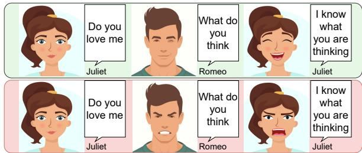
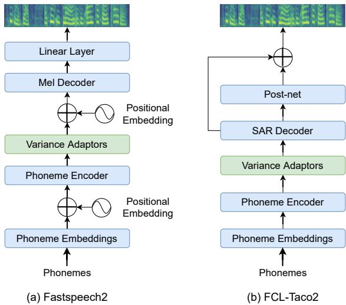
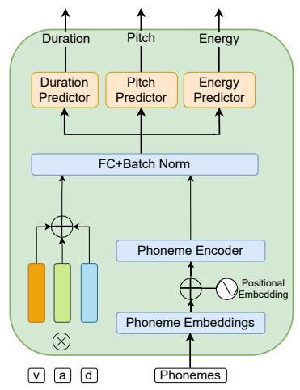
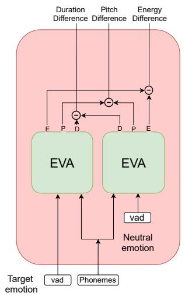
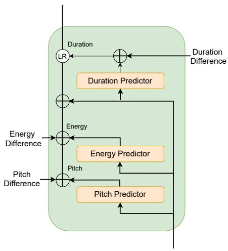
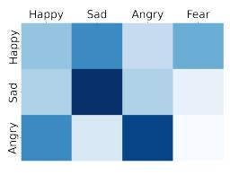
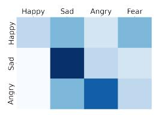
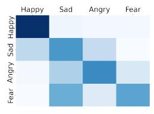
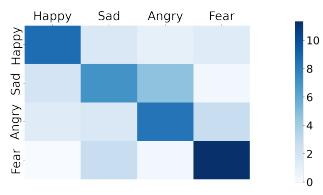
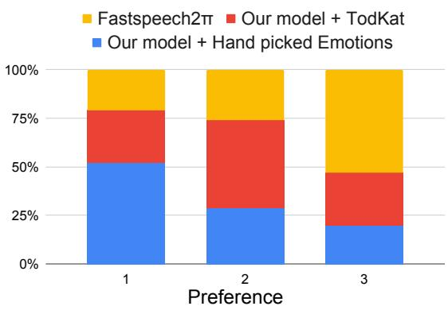

# Empathic Machines: Using Intermediate Features as Levers to Emulate Emotions in Text-To-Speech Systems

Saiteja Kosgi 1 Sarath Sivaprasad1,2 Niranjan Pedanekar 2 Anil Nelakanti3 Vineet Gandhi1

1Kohli Centre on Intelligent Systems, IIIT Hyderabad 2TCS Research, Pune 3Prime Video, Amazon Bengaluru

{saiteja.k,sarath.s}@research.iiit.ac.in,n.pedanekar@tcs.com annelaka@amazon.com, vgandhi@iiit.ac.in

## Abstract

We present a method to control the emotional prosody of Text to Speech (TTS) systems by using phoneme-level intermediate features (pitch, energy, and duration) as levers. As a key idea, we propose Differential Scaling (DS) to disentangle features relating to affective prosody from those arising due to acoustics conditions and speaker identity. With thorough experimental studies, we show that the proposed method improves over the prior art in accurately emulating the desired emotions while retaining the naturalness of speech. We extend the traditional evaluation of using individual sentences for a more complete evaluation of HCI systems. We present a novel experimental setup by replacing an actor with a TTS system in offline and live conversations. The emotion to be rendered is either predicted or manually assigned. The results show that the proposed method is strongly preferred over the state-of-the-art TTS system and adds the much-coveted “human touch” in machine dialogue. Audio samples for our experiments and the code are available at: https: //emtts.github.io/tts-demo/

## 1 Introduction

“The text is like a canoe, and the river on which it sits is the emotion. It all depends on the flow of the river, which is your emotion. The text takes on the character of your emotion.”

— Sanford Meisner

In natural language processing, vocabulary and grammar tend to take center stage, but those elements of speech only tell half the story. Affective prosody provides context and gives meaning to words, and keeps listeners engaged. Understanding emotional prosody is central to language and social development. Studies suggest that we show remarkable sensitivity to prosody "even as infants" (Nazzi et al., 1998; Massicotte-Laforge and Shi, 2015). Recently Kraus (2017) shows that voiceonly communication likely elicits higher empathic accuracy than even multi-sense modes including facial expressions.

  
Figure 1: Dialogues can have different meanings despite having the same text. Also, starting with the same emotion, Juliet has different emotions post Romeo’s response.

Buchholz (2016) shows that any meaningful spoken dialogue cannot happen without some amount of prosodic matching. As humans, we naturally anticipate and adapt with emotional cues in conversing with others, see Figure 1 for an example. Celebrated trainer Sanford Meisner employed this to develop Meisner technique for theatre actors to react naturally to others in the environment as opposed to method acting. The importance of emotional prosody in conversations cannot be overstated and TTS models need to fill this gap to make humanlike conversations possible in HCI systems.

Mitchell and Xu (2015) study the value of emotional prosody in HCI and emphasize its role in healthcare dialogue systems, improving social interaction skills in people with autism, augmentative and alternative communication devices and gaming narratives. They explain that successfully incorporating expressive speech into HCI, involves two aspects: (a) prosodic emotion recognition and (b) expression of emotional prosody. Considerable effort has been made towards recognizing and predicting the emotional nuances in human dialogues (Kim and Vossen, 2021; Poria et al., 2019b; Zhu et al., 2021; Li et al., 2017; Poria et al., 2021; Vinyals and Le, 2015). However, current TTS systems are yet to improve on rendering emotive or expressive speech for real-world HCI systems.

State-of-the-art TTS systems (Ren et al., 2020; Wang et al., 2017) tend to exhibit average emotions for a given phoneme sequence by taking the mean of utterances from training data. Some efforts towards improving expressiveness (like Battenberg et al., 2019; Karlapati et al., 2020) provide prosody control using a reference clip. Others like Sivaprasad et al. (2021) and Habib et al. (2019) further focused on controllability exposing levers that can be manipulated at inference-time to derive the intended expression. However, the quality and stability of synthesized speech heavily depends on various modeling choices. Emotion or prosody modeling, for example, could pick from numerous available discrete or continuous space representations. The encoder network module chosen might vary in its ability to disentangle prosody from other acoustic features like speaker identity and adaptability to content. For example, those relying on reference clip to replicate prosody might perform poorly when input text is unsuitable for rendering with prosody of reference. Some models feed prosody features with phoneme embeddings directly into the decoder while others use them to predict intermediate features that are used in conditioning the decoder. It is empirically verified (like in Sivaprasad et al., 2021) that intermediate features could be suitably manipulated to bring about the desired change in expression.

We take this direction forward to endow the intermediate feature prediction module with affective state control over the final rendering. We propose Differential Scaling (DS) of the predicted intermediates to bring about the required change in emotion. The DS module is aimed to effect only emotion as intended while remaining agnostic to all other features like speakers identities or acoustic conditions as seen in train data. We show that this significantly improves the naturalness of the generated speech, while allowing finer control over prosody.

In addition to comparing our model’s renderings against various others’ from literature for naturalness and emotion control on conventional single utterances drawn from disconnected contexts, we also evaluate them in conversations. We curate data with conversational theatre dialogues and replace an actor with a TTS system. We use its response as a proxy to evaluate the empathic accuracy. In another experiment, we had a theatre director control the emotion levers of our TTS model in a live conversation with the actor to evaluate controllability. As demonstrated in the results, our proposed method significantly improves over existing methods in producing suitable prosodic variation lending closer to human-like conversations. The rest of this paper will elaborate on the following contributions of this work.

• We propose a simple technique of using a DS module to better emulate emotions in TTS rendered speech. This works as plug-and-play with both autoregressive and non-autoregressive TTS models that predict prosodic features as an intermediate step.

• Our work extends the literature of training controllable and expressive TTS models with improved empathic accuracy and without specific studio recorded data.

• Finally, we present novel methods and data for evaluating TTS models in real conversations with human subjects. The method of evaluation is a useful step towards filling the gap of emulating emotional speech that needs more work.

## 2 Related Work

Prosody and conversational speech. Unlike in written text, spoken words contain additional nonverbal information. These cues are collectively termed prosody (Leentjens et al., 1998) that include variations in tone, pitch, energy, duration, accents, intonation, stress, etc. Buchholz (2016) showed that prosodic exchange is unavoidable in human dialogue. Various machine learning methods have been proposed to predict emotion in speech from its prosody variations (Asgari et al., 2014; Kamaruddin and Abdul Rahman, 2013). Variations in pitch accents (Nielsen et al., 2020), for example, lead to a significant difference in how the receiver perceives the content. A sentence (like I said unlock the door, not lock it from (Rosenberg and Hirschberg, 2009)) could be delivered both as a statement and a command by merely changing prosody.

Emotion recognition in conversations has gained increasing attention for developing empathetic machines with emotion-tagged multi-modal data publicly available for modeling like (Li et al., 2017; Poria et al., 2019a; Busso et al., 2008). While most methods like (Majumder et al., 2019; Jiao et al., 2019) use a combination of text and speech information, some leverage additional side-information from broader context (Ghosal et al., 2020) and the topic of conversation (Zhu et al., 2021).

In such labeled data, emotion is often represented as a categorical variable over a discrete space following models like Ekman’s basic emotions (Ekman, 1992) or the wheel of Plutchik (Plutchik, 1980). This choice is largely owing to the ease of annotating data. Russell (1980) proposed a continuous two-dimensional space as an alternative called valence-arousal model for human emotions. Arousal signifies the intensity of the emotion while valence captures its polarity. It has been extended to add a third dimension of dominance, making it the valence-arousal-dominance (VAD) model. VAD has since been widely used in modelling emotion in music (Grekow, 2016; Rachman et al., 2019), speech (Asgari et al., 2014; Kamaruddin and Abdul Rahman, 2013) and other content (Joshi et al., 2019; Buechel and Hahn, 2017). We use the continuous space representation as it is richer and more convenient to handle in our model. For instance, a continuous space allows the user to change the level of emotion like happy to delighted, sad to depressed, etc., superlatively during synthesis.

Expressive and controllable TTS. Neural TTS systems are now increasingly popular, improving upon older concatenative statistical systems (Michelle and Georgia, 2020) in synthesized speech naturalness. These are broadly sequenceto-sequence networks with an encoder processing the input text or phoneme sequence followed by a decoder that generates the sequence of Mel frames for output speech. Mel frames are then projected into the time domain by a vocoder (van den Oord et al., 2016; Griffin and Lim, 1984) to generate the speech. Decoding could be autoregressive with Tacotron-like models (Wang et al., 2017) or nonautoregressive with Fastspeech-like models (Ren et al., 2019).

Non-autoregressive models are faster at inference than autoregressive models with about comparable naturalness of speech quality (Ren et al., 2020). The trick non-autoregressive models use to generate Mel frames in parallel is to predict the relevant features as an intermediate step and condition the independent decoding of Mels on them. This technique is now increasingly adopted for autoregressive models as well (Wang et al., 2021) to predict features like phoneme duration that improve decoding stability avoiding alignment issues. Our method is compatible with any architecture that predicts prosodic features of pitch, energy, and duration as an intermediate step before decoding.

Going beyond the naturalness of speech, there has been considerable effort to improve the expressiveness of the renderings. Some focused on learning a linear space of variations in speech expressions for selecting a suitable variation at inference time. Wang et al. (2018) learn this space unsupervised by encouraging it to explain all variations in training data not captured in content embedding. A reference encoder maps an input utterance to a style embedding as a linear combination of basis style vectors. Manual analysis is required to understand the prosody feature learned into a basis vector that could include variations like vocal depth or pitch, speaking rate, or even background noise as available in training data. While this offers style control, it does not explicitly learn the prosody variations of interest into the style space. Our work focuses on the same level of control but specifically over the affective state as labeled in some data for supervision.

Sivaprasad et al. (2021) propose a model similar to Wang et al. (2018) with style tokens restricted to valence and arousal. However, the absolute (pitch, energy, duration) feature predictions restrict prosody control, leading to unnatural distortions. Specifically, it skews more towards retaining the speaker’s voice identity than the emotion and entangles emotion with other acoustic features. Karlapati et al. (2020) replace the linear style space with a variational reference encoder to generate prosody embedding to condition the decoder. Battenberg et al. (2019) use a similar variational model but instead force its posterior to match that of the reference utterance to copy prosody with a controllable parameter determining the closeness of the match. This trick alleviates certain issues like in pitch-range (Younggun and Taesu, 2019) and transfer to unrelated sentences but exposes a lower degree of control with no explicit levers to operate, as possible in our work.

Habib et al. (2019) propose to learn an explicit latent representation for various prosodic variables, segregating them into explicitly controlable (like affect, speaking rate, etc) and implicit (like intonation, rhythm, stress, etc). While the model offers a higher degree of explicit control, it requires using a proprietary studio recorded data with utterances reflecting prompted emotions at specified arousal. Dependence on explicit supervision from studio recorded data makes it harder scale this model across languages and other prosodic variations. In contrast, we use publicly available data with emotion labels to train our models.

  
Figure 2: Backbone TTS architectures.

There are other methods that try to predict suitable prosody features from text content. Raitio et al. (2020) add a prosody encoder module to standard TTS network that predicts certain handcrafted prosody features from text embedding of input. This prosody encoder is used with a small optional bias for affect variations at inference. Hodari et al. (2021) extend this to replace hand-crafting prosody features with explicit training followed by their prediction from text. Karlapati et al. (2021) further enrich the textual context using BERT embeddings and parse-trees. These methods are limited in expressiveness offering no control over rendering emotion that our work focuses on.

## 3 Model

Our network uses a backbone TTS that can be borrowed from any model which predicts pitch, energy and duration as intermediates features from input phoneme sequence. This network learns to predict the average features for given phonemes. Following the convention in earlier works, we refer to the intermediate features as variances and the module that predicts them as variance adaptor. Prior work improves standard variance adaptors in, say FastSpeech2, by conditioning on emotion variables of valence-arousal in addition to the phoneme sequence to generate expressive speech. We refer to it as Emotional Variance Adaptor (EVA) for which we propose an alternative. Our proposed Differential Scaler (DS) module determines how best to vary the output of the EVA to bring the desired change in emotion. We describe the details of these network choices in this section; specifically, the broader backbone network architecture and the different variance adaptor modules from non-emotive baseline, emotive baseline and our proposal.

## 3.1 Backbone

We present experiments with two suitable choices for our backbone systems, FastSpeech2 and FCLtaco2. The backbone has three modules; an encoder, variance adaptor and decoder. The encoder maps an input phoneme sequence to its embedding. Given this representation, the variance adaptor predicts the pitch, energy and duration for each of the phonemes. These intermediate features are processed by the decoder module downstream to return Mel-spectrogram frames. We reuse the encoder and decoder modules as designed in their original architectures without any changes. We refer readers to the respective papers for details of these networks. Wavenet (van den Oord et al., 2016) vocoder is used to map Mel-spectrogram outputs of the decoder to time-domain raw audio.

## 3.2 Variance adaptor module

Non-emotive baselines. Our baseline models of FastSpeech2 and FCL-taco2 are trained with the variance adaptors as described by their authors. We also train a derivative of the FastSpeech2 with the variance adaptor modified to make predictions at the phoneme-level and not at frame-level. This is to facilitate the phoneme level control of variances. A duration $d _ { \pi }$ is predicted for each phoneme $\pi ,$ following which the length regulator repeats the hidden state of that phoneme π times. Also unlike FastSpeech2, we use this length regulator after the predicted pitch and energy are added to the encoder output. We refer to this derivative as FastSpeech2π.

Emotive baseline. Sivaprasad et al. (2021) conditioned the variance adaptor of FastSpeech2 on additional emotion embedding that gives the model control over prosody of the rendered speech. It generates the emotion embedding as a linear weighted combination of the valence and arousal vectors that are learned from data during training. The weights are valence and arousal values as annotated for training and can be used as control levers to modify emotion during inference. This emotion variance adaptor (EVA) module generates suitable intermediate features of pitch and energy at frame-level and duration at phoneme-level. These features are consumed by the decoder along with the encoder output in generating Mel frames. While this helps control emotional prosody rendered speech, it leads to a significant drop in perceptual quality and naturalness relative to the baselines. Our contribution is an alternative design of the variance adaptor module that improves upon Sivaprasad et al. (2021)’s FastSpeech2 + EVA model in emotion control and expressiveness and upon the baselines in terms of naturalness.

  
(a) Emotional Variation Adaptor

  
(b) Differential Scaler

  
(c) Variance Adaptor  
Figure 3: Schematic diagram of the proposed model.

Differential Scaler. We extend the emotion representation from EVA to include dominance in addition to valence and arousal values. Dominance is the degree of control exerted by an emotion. Including dominance dimension to the emotion space expands the range of emotions the TTS model can express. For example, by introducing this dimension, we can better distinguish outputs for emotions like ‘anger and fear’ or ‘sad and contempt’.

The Differential Scaler module further extends EVA to estimate the change in variances necessary for a pronounced effect of the target emotion relative to its neutral counterpart. As shown in Figure 3(b), the variances are estimated using the EVA module for a given phoneme sequence at two different triplets of VAD values. One prediction corresponds to the neutral emotion with VAD values all set to zeros. The other prediction corresponds to the chosen VAD values of target emotion. We take the difference of these two estimates as the direction along which the variances can be varied for the desired change in emotion without affecting other acoustic features. We are implicitly making two assumptions here. Emotion variations are captured as linear transformations in this space and that there is a strong disentangling of emotional prosody with other acoustic features in this space. Results from our empirical evaluation favorably support the above assumptions.

## 4 Training

Modelling with intermediate features facilitates training the backbone and the variance adaptors independently on different data. We exploit this to train our variance adaptor on scarcely available VAD annotated data while reusing backbone models trained on abundant transcribed speech data.

Backbone. We train two backbone networks FastSpeech2π (non-autoregressive) and FCL-taco2 (autoregressive) on Blizzard 2013 dataset (King and Karaiskos, 2014). It contains 147 hours of Catherine Bayers’s speech, reading books in American English. Due to the style of reading, the dataset is rich in expressiveness and spans different combinations of pitch, energy and duration. Both models are trained with Mel loss (mean absolute error between predicted and ground truth Mels), pitch loss, energy loss and duration loss (mean square error between predicted and ground truth features). Both models are trained for 200K iterations using Adam optimizer with warm-up learning rate scheduler and batch size of 16.

EVA. We train EVA on MSP-Podcast corpus (Lotfian and Busso, 2019) annotated with arousal, valance and dominance values. The corpus consists of around 100 hours speech data but their transcriptions are not available. We generate transcripts using a speech-to-text model. We use Montreal-Forced-Aligner (MFA) (McAuliffe and Sonderegger, 2017) for phoneme alignments. Those transcripts that MFA fails to find a good alignment for are filtered out. The remaining utterances add up to about 71 hours of emotive speech data which we use to train our EVA. We train pitch, energy and duration predictors conditioned on VAD values minimizing only the sum of variance losses. For all the experiments, text transcripts are converted to phonemes using Sun et al. (2019). We generate Mel spectrogram from the audio files similar to Wang et al. (2017). Pitch and energy are computed from the Mel spectrogram and we use MFA for aligning phonemes to train the duration predictor.

## 5 Experiments and user study

We present three experiments; comparison with prior-art using conventional evaluation metrics, those for emotional consistency with pre-recorded audio, and finally, live conversations with humans.

## 5.1 Comparisons with prior-art

We compare the proposed approach against four state of the art TTS models. The list includes two non-emotive TTS models (FastSpeech2 and FCL-taco2), one reference-based method (Cai et al., 2021) and one AV conditioned model (FastSpeech2 + EVA). We also compare our method with the modified backbone, FastSpeech2π.

To show the efficacy of DS over EVA module independent of the effect of other interventions, we perform two more comparisons. The first comparison evaluates our model against Fastspeech2 + EVA trained with ‘dominance’ (on arousal, valence and dominance). The second comparison is made against Fastspeech2π + EVA with the backbone trained on Blizzard (both backbones trained on the same dataset). The first comparison is made on the perceptual-quality and emotional expressiveness while the second comparison is made only for their perceptual-quality.

To evaluate the perceptual-quality/naturalness we compare Mean Opinion Score (MOS) (Chu and Peng, 2006) averaged across forty subjects proficient in English. We synthesize twenty different sentences from the test set using each of the seven models. We prepare user study by picking five samples rendered by each model to make a survey. Annotator rates each sample on a Likert scale of one for ‘completely unnatural’ to five for ‘completely natural’.

To evaluate the emotional expressiveness of the proposed model, we perform two surveys. In the first survey, given a sample, we ask the user to choose the best perceived emotion from a set of four, namely, ‘Happy’, ‘Sad’, ‘Angry’ and ‘Fear’. We ask the raters to not judge the textual content and annotate the emotion for each sample based on the rendering alone. In the second survey we evaluate the efficacy of the models to bring about finer control over emotion. We generate two samples with same broader emotion category but with two levels of intensity. The subject now has to identify the sample with higher intensity. For both surveys we generate five samples per emotion and twenty samples for each model. We aggregate the rating across forty proficient English language speakers.

## 5.2 Emotional consistency in dialogues

Previous efforts in prosody controlled TTS have been evaluated on individual sentences without context. We propose a novel evaluation strategy using excerpts from theater recordings. We replace the audio of one of the actors in the conversation with renderings from a TTS model and have a human subject evaluate it for emotional consistency. The emotion for TTS renderings are chosen manually by a theater director. We compare this with TTS rendered with emotion predicted using Tod-Kat (Zhu et al., 2021) from the dialogues spoken so far. This study consolidates the two aspects of HCI we mentioned in the introduction; prosodic emotion recognition and its expression in TTS utterances.

The dataset is curated using segments from four popular plays, namely, ‘Speed-the-Plow’, ‘Night, Mother’, ‘Bobby Gould in Hell’ and ‘Death of a Salesman’. We select 30 dialogue segments collectively from the four plays with an average dialogue length of 90 seconds per segment. Timestamps of segments selected from each play is given in supplementary material. We replace the female voice in the segment with (a) non-emotive TTS model (FastSpeech2π) (b) our model with emotion predicted for each utterance using TodKat and (c) our model with a senior theatre director picking the emotion for each utterance. We randomly pick five dialogues from the 30 samples in all three settings for each of our surveys. We ask forty raters to rank the three setting in terms of the emotional consistency of the dialogue i.e., to judge the naturalness and aptness of the emotional prosody in the given context.

<table><tr><td>Model</td><td>MOS</td><td>Finer Control</td><td colspan="5">Coarse Control</td></tr><tr><td></td><td></td><td></td><td>Happy</td><td>Sad</td><td>Angry</td><td>Fear</td><td>Average</td></tr><tr><td>FastSpeech2</td><td>3.80±0.13</td><td></td><td></td><td></td><td></td><td></td><td></td></tr><tr><td>FCL-taco2</td><td> $3 . 3 9 { \pm } 0 . 1 4$ </td><td></td><td></td><td></td><td></td><td></td><td></td></tr><tr><td>FastSpeech2π</td><td> $3 . 8 4 \pm 0 . 1 3$ </td><td></td><td></td><td></td><td></td><td></td><td></td></tr><tr><td>FastSpeech2π + EVA (Blizzard)</td><td> $2 . 9 5 { \pm } 0 . 1 4$ </td><td></td><td></td><td></td><td></td><td></td><td></td></tr><tr><td>Cai et al., 2021</td><td> $3 . 0 8 { \pm } 0 . 1 6 $ </td><td>80.0</td><td>22.7</td><td>40.9</td><td>52.3</td><td></td><td>38.7</td></tr><tr><td>FastSpeech2 + EVA (av)</td><td> $3 . 0 1 { \pm } 0 . 1 2 $ </td><td>81.2</td><td>20.0</td><td>68.7</td><td>52.9</td><td></td><td>47.2</td></tr><tr><td>FastSpeech2 + EVA (avd)</td><td> $3 . 0 5 { \pm } 0 . 1 7 $ </td><td>80.2</td><td>37.5</td><td>66.6</td><td>50.0</td><td>33.3</td><td>46.8</td></tr><tr><td>FCL-taco2 + DS (our model)</td><td> $3 . 3 0 { \pm } 0 . 1 4$ </td><td>83.5</td><td>90.1</td><td>53.3</td><td>56.5</td><td>46.8</td><td>61.8</td></tr><tr><td>FastSpeech2π + DS (our model)</td><td> ${ \bf 3 . 9 1 \pm 0 . 1 4 }$ </td><td>85.0</td><td>68.4</td><td>50.0</td><td>59.5</td><td>79.1</td><td>64.2</td></tr></table>

Table 1: Results for qualitative analysis comparing our model with prior art. The model with (av) only uses arousal and valence for emotion representation while that with (avd) also uses dominance values. See Section 6 for details.

  
(a) Cai et al. (2021)

  
(b) Sivaprasad et al. (2021)

  
(c) FCL-taco2 + DS

  
(d) FastSpeech2π + DS  
Figure 4: Confusion matrices of models performance in the survey to pick the correct emotion. Rows are true emotions and columns are picked emotions. Figure to be viewed in color.

## 5.3 Conversation with Meisner trained actor

A Meisner trained actor responds to another actor taking into account his/her behavior. In this experiment, we observe how a Meisner trained actor (Actor M) reacts in a live dialogue initiated by (a) another trained human actor, (b) a non-emotive TTS (FastSpeech2π) and (c) our model (FastSpeech2π + DS). We use the same neutral script with 18 lines in all three cases. We use the behavior of Actor M during interaction with the human as reference. The closeness of Actor M’s behavior to this reference while interacting with the two TTS models is used as a measure of the latter’s effectiveness in rendering speech expressive enough to evoke an emotive response.

For each of the three scenarios, the conversation is initiated with two different emotional states, viz. (a) highly positive and (b) highly negative. The emotion for our TTS model is chosen live on-thefly by a theatre director from fourteen bins in the discretized arousal-valence space. The bins are chosen to span the V-shape around high-arousalhigh-valence and low-arousal-neutral-valence (Dietz and Lang, 1999). We take majority vote of three listener ratings for each utterance of Actor M on the same discretized arousal-valence space to allow quantitative comparisons.

## 6 Results

## 6.1 Comparing with prior art

Naturalness. Table 1 compares the audio quality of the TTS models listed in Section 5.1. It can be seen that the proposed model achieves affective control, without drop in perceived audio quality. In contrast, previous SOTA emotive models ( Cai et al. (2021) and FastSpeech2 + EVA) achieve control over emotion at the cost of naturalness (MOS of 3.08 and 3.01 respectively). This result demonstrates the efficacy of using DS module over EVA and validates its ability to disentangle affective features from the acoustic ones. The MOS score of FastSpeech2π improves with addition of DS, as some samples appear more natural when rendered in intended emotions.

Coarse affective control. Results corresponding to emotion detection are presented in Table 1. For each sample, the raters were asked to choose one among the four discrete emotions. On an average, the FastSpeech2π + DS gives best results, outperforming the other models by a significant margin. We observe about 17 and 25.5 improvement in percentage points (pp) over FastSpeech2 + EVA and (Cai et al., 2021) respectively. Figure 4 shows the confusion matrix for this survey. Our models are better at differentiating positive valence emotions from the negative ones. There is still a scope of improvement in distinctly expressing low valence emotions.

Finer affective control. When asked raters to pick the sample from a pair that expresses a particular emotion better, 85% of the times they were able to pick the sample that was actually rendered with a higher arousal value (Table 1). Our best performing model scores 3.8pp over FastSpeech2 + EVA and 5.0pp over (Cai et al., 2021).

Efficacy of DS. To further validate the efficacy of DS (over the EVA), we present evaluations to show that the performance gains occur primarily due to the DS module and not the other interventions. We observe that adding ‘dominance’ to Fastspeech2 + EVA does not improve its MOS and affective controllability as shown in Table 1. Furthermore, we observe performance drop on Fastspeech2π + EVA when compared against Fastspeech2π + DS when both have their backbones trained on Blizzard dataset (Table 1). The lack of improvement from (Sivaprasad et al., 2021) further highlights that the performance gains by our model does not come from the choice of dataset on which the backbone is trained. Overall, the two experiments conclusively show that DS module is the decisive component that brings the improvements in naturalness and controllability to the proposed TTS system.

## 6.2 Emotional consistency in dialogues

As described in Section 5.2, we evaluate the emotional consistency of a dialogue when a TTS model replaces an actor in excerpts from a play. Figure 5 shows that emotive models bring significant improvement in emphatic quality of conversations and are picked 80% of the times as the first preference. This result reiterates the hypothesis (Wang et al., 2018) that prosody averaging as in non-emotive TTS is insufficient for emulating emotionally consistent conversations.

Another important observation is how emphatic quality measured as user’s first preference falls from 52% to 27% in moving away from handpicked to model-predicted emotions. This suggests a scope for improvement for emotion prediction models. Nonetheless the results present clear evidence that tying together emotion prediction models to expressive TTS is significantly more preferable to a non-emotive TTS.

  
Figure 5: Comparison of emotional consistency in conversations across the three settings described in Section 5.2. Figure to be viewed in color.

This proposed evaluation methodology is more comprehensive and enables assessment of a consolidated conversational system as required in expressive HCI that includes various moving parts like causal emotion recognition in conversation and expressive TTS. This is not feasible with the traditional approach of evaluating on individual sentences drawn from distinct contexts. We argue that this evaluation with contextual dialogues from a conversation is more coherent to humans as reflected in inter-annotator agreement measured by Fleiss’s Kappa Score (FKS). FKS goes up by 34% from 0.43 in traditional coarse affective control (Table 1) to 0.58 for our evaluation strategy (Figure 5). We hope this will be useful in a more thorough evaluation of expressive HCI systems.

## 6.3 Conversation with Meisner trained actor

As mentioned in Section 5.3, we gather the behavioural response of a Meisner trained human actor to TTS systems (emotive and non-emotive) and compare it against his/her reference response to another human actor. We use Pearson’s correlation $\rho$ with reference for valence and compare mean-std $( \mu , \sigma )$ for arousal values.

When the conversation was triggered with a positive initial emotion, we had a high ρ(FastSpeech2π+DS, human) of 0.702 for our model compared to negative correlation for nonemotive TTS at ρ(FastSpeech2π, human) of

0.282. Similarly for a negative initial emotion ρ(FastSpeech2π+DS, human) was high 0.838 relative to low ρ(FastSpeech2π, human) of 0.158.

We find that the average arousal for the human response to our TTS $( \mu { = } 3 . 5 , \sigma { = } 1 . 0 6 )$ is comparable to a human-human conversation $( \mu { = } 3 . 9 4 , \sigma { = } 0 . 9 7 )$ , as opposed to the response to a non-emotive TTS $( \mu { = } 2 . 5 5 , \sigma { = } 0 . 4 9 )$ . This indicates that the range of arousal response elicited from a human actor by our TTS is comparable to a human-human conversation as opposed to that of a prosody unaware TTS.

We also interviewed the human actor about the experience of conversing with the TTS systems. He reported that our TTS gave him "an emotional structure". He felt that the TTS could "dictate the neutral part of the script to change it". He could "remember specific utterances" by our TTS and their emotional content which "drove him" to respond in an emotional manner. In contrast, he reported that the prosody unaware TTS gave "dry answers", made him feel that it was "disinterested", "auto generated" and "did not evoke excitement". He expressed that he "could not have a longer conversation with it".

## 7 Conclusion

This work presents a novel method that leverages prosodic features (pitch, energy and duration) to modify emotions in the output of a TTS system. Our method is model agnostic and can be used with any TTS backbone that predicts prosodic features in an intermediate step. This method outperforms existing approaches by a significant margin in its ability to accurately render desired emotions, while preserving the naturalness of speech. We curated theatre conversation data to evaluate and show that our prosody-aware TTS better maintains the natural flow of emotions in conversations. Our work shows promise in consolidation of prosodic emotional recognition and expression, a coveted pursuit in the field of HCI. We present further qualitative experiments involving professional theatre artists and demonstrate that the proposed TTS method leads to more human-like conversations. While exposing valence, arousal and dominance values as model levers improves control over the final rendering, in reality it is overwhelming for the user to choose them correctly for a desired output. This is further aggravated by the fact that some sentences cannot be suitably spoken with a chosen set of values, degrading output quality. These are limitations that need to be addressed and appropriately deriving these values from semantics of text input or reference clips could be relevant future directions. Affective control is incomplete without explicit levers on the intonations, which is another limitation to be looked upon in the future work.

## 8 Ethical concerns

This work shares the same concerns as with others in the domain of TTS systems as discussed by Habib et al. (2019). With TTS outputs getting closer to actual human speech, there could be a potential misuse. The threat of abuse of fake voices is particularly high with similar developments in conjugate areas like computer vision. However, the benefits of improvements to emotive TTS technology could significantly benefit HCI and the corresponding applications to problems in healthcare and other domains. Example applications include healthcare dialogue systems, improving social interaction skills in people with autism and augmentative communication devices. TTS systems synthesizing speech with empathy can ease machine interaction in many touchpoint applications. While the benefits seem to outweigh the concerns at this point, we believe the research community should proactively continue to identify methods for detection and prevention of misuse.

## References

Meysam Asgari, Géza Kiss, Jan Van Santen, Izhak Shafran, and Xubo Song. 2014. Automatic measurement of affective valence and arousal in speech. In 2014 IEEE International Conference on Acoustics, Speech and Signal Processing (ICASSP), pages 965–969. IEEE.

Eric Battenberg, Soroosh Mariooryad, Daisy Stanton, RJ Skerry-Ryan, Matt Shannon, David Kao, and Tom Bagby. 2019. Effective use of variational embedding capacity in expressive end-to-end speech synthesis. arXiv preprint arXiv:1906.03402.

Michael B Buchholz. 2016. Conversational errors and common ground activities in psychotherapy–insights from conversation analysis. International Journal of Psychological Studies, 8(3):134–153.

Sven Buechel and Udo Hahn. 2017. Emobank: Studying the impact of annotation perspective and representation format on dimensional emotion analysis. In Proceedings of the 15th Conference of the European Chapter of the Association for Computational Linguistics: Volume 2, Short Papers, pages 578–585.

Carlos Busso, Murtaza Bulut, Chi-Chun Lee, Abe Kazemzadeh, Emily Mower, Samuel Kim, Jeannette N Chang, Sungbok Lee, and Shrikanth S Narayanan. 2008. Iemocap: Interactive emotional dyadic motion capture database. Language resources and evaluation, 42(4):335–359.

Xiong Cai, Dongyang Dai, Zhiyong Wu, Xiang Li, Jingbei Li, and Helen M. Meng. 2021. Emotion controllable speech synthesis using emotion-unlabeled dataset with the assistance of cross-domain speech emotion recognition. ICASSP 2021 - 2021 IEEE International Conference on Acoustics, Speech and Signal Processing (ICASSP), pages 5734–5738.

Min Chu and Hu Peng. 2006. Objective measure for estimating mean opinion score of synthesized speech. US Patent 7,024,362.

Richard Dietz and Annie Lang. 1999. Affective agents: Effects of agent affect on arousal, attention, liking and learning. In Proceedings of the Third International Cognitive Technology Conference, San Francisco.

Paul Ekman. 1992. An argument for basic emotions. Cognition & emotion, 6(3-4):169–200.

Deepanway Ghosal, Navonil Majumder, Alexander Gelbukh, Rada Mihalcea, and Soujanya Poria. 2020. Cosmic: Commonsense knowledge for emotion identification in conversations. In Proceedings of the 2020 Conference on Empirical Methods in Natural Language Processing: Findings, pages 2470–2481.

Jacek Grekow. 2016. Music emotion maps in arousalvalence space. In IFIP International Conference on Computer Information Systems and Industrial Management, pages 697–706. Springer.

Daniel Griffin and Jae Lim. 1984. Signal estimation from modified short-time fourier transform. IEEE Transactions on acoustics, speech, and signal processing, 32(2):236–243.

Raza Habib, Soroosh Mariooryad, Matt Shannon, Eric Battenberg, RJ Skerry-Ryan, Daisy Stanton, David Kao, and Tom Bagby. 2019. Semi-supervised generative modeling for controllable speech synthesis. In International Conference on Learning Representations.

Zack Hodari, Alexis Moinet, Sri Karlapati, Jaime Lorenzo-Trueba, Thomas Merritt, Arnaud Joly, Ammar Abbas, Penny Karanasou, and Thomas Drugman. 2021. Camp: a two-stage approach to modelling prosody in context. In ICASSP 2021-2021 IEEE International Conference on Acoustics, Speech and Signal Processing (ICASSP), pages 6578–6582. IEEE.

Wenxiang Jiao, Haiqin Yang, Irwin King, and Michael R Lyu. 2019. Higru: Hierarchical gated recurrent units for utterance-level emotion recognition. In Proceedings ofthe 2019 Conference ofthe North American

Chapter of the Association for Computational Linguistics: Human Language Technologies, Volume 1 (Long and Short Papers), pages 397–406.

Tanmayee Joshi, Sarath Sivaprasad, and Niranjan Pedanekar. 2019. Partners in crime: Utilizing arousal-valence relationship for continuous prediction of valence in movies. In AffCon@ AAAI.

Norhaslinda Kamaruddin and Abdul Wahab Abdul Rahman. 2013. Valence-arousal approach for speech emotion recognition system. In 2013 International Conference on Electronics, Computer and Computation (ICECCO), pages 184–187.

Sri Karlapati, Ammar Abbas, Zack Hodari, Alexis Moinet, Arnaud Joly, Penny Karanasou, and Thomas Drugman. 2021. Prosodic representation learning and contextual sampling for neural text-to-speech. In ICASSP 2021-2021 IEEE International Conference on Acoustics, Speech and Signal Processing (ICASSP), pages 6573–6577. IEEE.

Sri Karlapati, Alexis Moinet, Arnaud Joly, Viacheslav Klimkov, Daniel Sáez-Trigueros, and Thomas Drugman. 2020. CopyCat: Many-to-Many Fine-Grained Prosody Transfer for Neural Text-to-Speech. In Proc. Interspeech 2020, pages 4387–4391.

Taewoon Kim and Piek Vossen. 2021. Emoberta: Speaker-aware emotion recognition in conversation with roberta. arXiv preprint arXiv:2108.12009.

Simon King and Vasilis Karaiskos. 2014. The blizzard challenge 2013.

Michael W Kraus. 2017. Voice-only communication enhances empathic accuracy. American Psychologist, 72(7):644.

Albert FG Leentjens, Sandra M Wielaert, Frans van Harskamp, and Frederik W Wilmink. 1998. Disturbances of affective prosody in patients with schizophrenia; a cross sectional study. Journal of Neurology, Neurosurgery & Psychiatry, 64(3):375– 378.

Yanran Li, Hui Su, Xiaoyu Shen, Wenjie Li, Ziqiang Cao, and Shuzi Niu. 2017. Dailydialog: A manually labelled multi-turn dialogue dataset. In Proceedings of the Eighth International Joint Conference on Natural Language Processing (Volume 1: Long Papers), pages 986–995.

R. Lotfian and C. Busso. 2019. Building naturalistic emotionally balanced speech corpus by retrieving emotional speech from existing podcast recordings. IEEE Transactions on Affective Computing, 10(4):471–483.

Navonil Majumder, Soujanya Poria, Devamanyu Hazarika, Rada Mihalcea, Alexander Gelbukh, and Erik Cambria. 2019. Dialoguernn: An attentive rnn for emotion detection in conversations. In Proceedings of the AAAI Conference on Artificial Intelligence, volume 33, pages 6818–6825.

Sarah Massicotte-Laforge and Rushen Shi. 2015. The role of prosody in infants’ early syntactic analysis and grammatical categorization. The Journal of the Acoustical Society of America, 138(4):EL441– EL446.

Michaela Socolof Sarah Mihuc Michael Wagner McAuliffe, Michael and Morgan Sonderegger. 2017. Montreal forced aligner: trainable text-speech alignment using kaldi. In Proceedings of the 18th Conference of the International Speech Communication Association.

Cohn Michelle and Zellou Georgia. 2020. Perception of concatenative vs. neural text-to-speech (tts): Differences in intelligibility in noise and language attitudes. In 2020 ISCA INTERSPEECH.

Rachel LC Mitchell and Yi Xu. 2015. What is the value of embedding artificial emotional prosody in human– computer interactions? implications for theory and design in psychological science. Frontiers in psychology, 6:1750.

Thierry Nazzi, Josiane Bertoncini, and Jacques Mehler. 1998. Language discrimination by newborns: toward an understanding of the role of rhythm. Journal of Experimental Psychology: Human perception and performance, 24(3):756.

Elizabeth Nielsen, Mark Steedman, and Sharon Goldwater. 2020. The role of context in neural pitch accent detection in english. In Proceedings ofthe 2020 Conference on Empirical Methods in Natural Language Processing (EMNLP), pages 7994–8000.

Robert Plutchik. 1980. A general psychoevolutionary theory of emotion. In Theories of emotion, pages 3–33. Elsevier.

Soujanya Poria, Devamanyu Hazarika, Navonil Majumder, Gautam Naik, Erik Cambria, and Rada Mihalcea. 2019a. Meld: A multimodal multi-party dataset for emotion recognition in conversations. In Proceedings ofthe 57th Annual Meeting ofthe Associationfor Computational Linguistics, pages 527–536.

Soujanya Poria, Navonil Majumder, Devamanyu Hazarika, Deepanway Ghosal, Rishabh Bhardwaj, Samson Yu Bai Jian, Pengfei Hong, Romila Ghosh, Abhinaba Roy, Niyati Chhaya, et al. 2021. Recognizing emotion cause in conversations. Cognitive Computation, 13(5):1317–1332.

Soujanya Poria, Navonil Majumder, Rada Mihalcea, and Eduard Hovy. 2019b. Emotion recognition in conversation: Research challenges, datasets, and recent advances. IEEE Access, 7:100943–100953.

Fika Hastarita Rachman, Riyanarto Samo, and Chastine Fatichah. 2019. Song emotion detection based on arousal-valence from audio and lyrics using rule based method. In 2019 3rd International Conference on Informatics and Computational Sciences (ICICoS), pages 1–5.

Tuomo Raitio, Ramya Rasipuram, and Dan Castellani. 2020. Controllable Neural Text-to-Speech Synthesis Using Intuitive Prosodic Features. In Proc. Interspeech 2020, pages 4432–4436.

Yi Ren, Chenxu Hu, Xu Tan, Tao Qin, Sheng Zhao, Zhou Zhao, and Tie-Yan Liu. 2020. Fastspeech 2: Fast and high-quality end-to-end text to speech. In International Conference on Learning Representations.

Yi Ren, Yangjun Ruan, Xu Tan, Tao Qin, Sheng Zhao, Zhou Zhao, and Tie-Yan Liu. 2019. Fastspeech: fast, robust and controllable text to speech. In Proceedings of the 33rd International Conference on Neural Information Processing Systems, pages 3171–3180.

Andrew Rosenberg and Julia Hirschberg. 2009. Detecting pitch accents at the word, syllable and vowel level. In Proceedings of Human Language Technologies: The 2009 Annual Conference ofthe North American Chapter ofthe Association for Computational Linguistics, Companion Volume: Short Papers, NAACL-Short ’09, page 81–84, USA. Association for Computational Linguistics.

James A Russell. 1980. A circumplex model of affect. Journal ofpersonality and social psychology, 39(6):1161.

Sarath Sivaprasad, Saiteja Kosgi, and Vineet Gandhi. 2021. Emotional Prosody Control for Speech Generation. In Proc. Interspeech 2021, pages 4653–4657.

Hao Sun, Xu Tan, Jun-Wei Gan, Hongzhi Liu, Sheng Zhao, Tao Qin, and Tie-Yan Liu. 2019. Token-Level Ensemble Distillation for Grapheme-to-Phoneme Conversion. In Proc. Interspeech 2019, pages 2115– 2119.

Aäron van den Oord, Sander Dieleman, Heiga Zen, Karen Simonyan, Oriol Vinyals, Alexander Graves, Nal Kalchbrenner, Andrew Senior, and Koray Kavukcuoglu. 2016. Wavenet: A generative model for raw audio. In Arxiv.

Oriol Vinyals and Quoc Le. 2015. A neural conversational model. arXiv preprint arXiv:1506.05869.

Disong Wang, Liqun Deng, Yang Zhang, Nianzu Zheng, Yu Ting Yeung, Xiao Chen, Xunying Liu, and Helen Meng. 2021. Fcl-taco2: Towards fast, controllable and lightweight text-to-speech synthesis. In ICASSP 2021 - 2021 IEEE International Conference on Acoustics, Speech and Signal Processing (ICASSP), pages 5714–5718.

Yuxuan Wang, RJ Skerry-Ryan, Daisy Stanton, Yonghui Wu, Ron J Weiss, Zongheng Yang Jaitly, Ying Xiao, Zhifeng Chen, Samy Bengio, Quoc Le, et al. 2017. Tacotron: Towards end-to-end speech synthesis.

Yuxuan Wang, Daisy Stanton, Yu Zhang, RJ-Skerry Ryan, Eric Battenberg, Joel Shor, Ying Xiao, Ye Jia, Fei Ren, and Rif A Saurous. 2018. Style tokens: Unsupervised style modeling, control and transfer in end-to-end speech synthesis. In ICML.

Lee Younggun and Kim Taesu. 2019. Robust and finegrained prosody control of end-to-end speech synthesis. In International Conference on Acoustics, Speech and Signal Processing (ICASSP). IEEE.

Lixing Zhu, Gabriele Pergola, Lin Gui, Deyu Zhou, and Yulan He. 2021. Topic-driven and knowledgeaware transformer for dialogue emotion detection. In Proceedings of the 59th Annual Meeting of the Association for Computational Linguistics and the 11th International Joint Conference on Natural Language Processing (Volume 1: Long Papers), pages 1571–1582, Online. Association for Computational Linguistics.