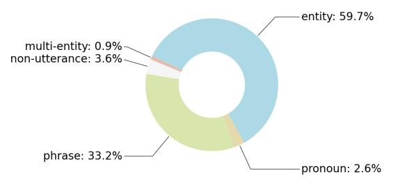
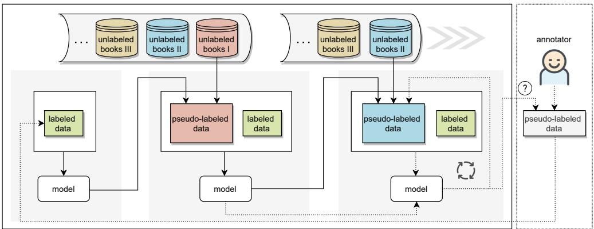
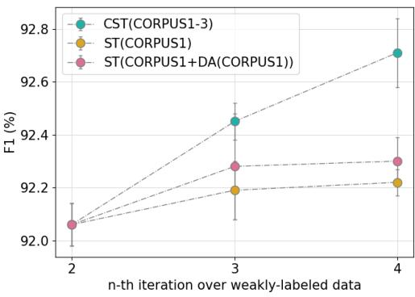
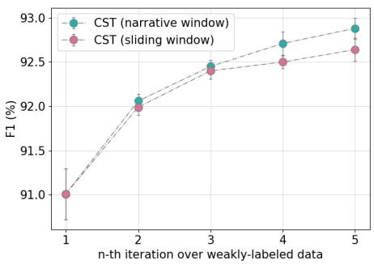

# End-to-End Chinese Speaker Identification

Dian Yu1 Ben Zhou2 Dong Yu1

1Tencent AI Lab, Bellevue, WA

2University of Pennsylvania, Philadelphia, PA {yudian, dyu}@tencent.com, xyzhou@seas.upenn.edu

## Abstract

Speaker identification (SI) in texts aims to identify the speaker(s) for each utterance in texts. Previous studies divide SI into several sub-tasks (e.g., quote extraction, named entity recognition, gender identification, and coreference resolution). However, we are still far from solving these sub-tasks, making SI systems that rely on them seriously suffer from error propagation. End-to-end SI systems, on the other hand, are not limited by individual modules, but suffer from insufficient training data from the existing small-scale datasets. To make large end-to-end models possible, we design a new annotation guideline that regards SI as span extraction from the local context, and we annotate by far the largest SI dataset for Chinese named CSI based on eighteen novels. Viewing SI as a span extraction task also introduces the possibility of applying existing storng extractive machine reading comprehension (MRC) baselines. Surprisingly, simply using such a baseline without human-annotated character names and carefully designed rules, we can already achieve performance comparable or better than those of previous state-of-the-art SI methods on all public SI datasets for Chinese. Furthermore, we show that our dataset can serve as additional training data for existing benchmarks, which leads to further gains (up to 6.5% in accuracy). Finally, using CSI as a clean source, we design an effective self-training paradigm to continuously leverage hundreds of unlabeled novels.

## 1 Introduction

Speaker identification (SI) aims to identify the corresponding speakers for utterances in texts (Zhang et al., 2003; Glass and Bangay, 2007). Most existing SI datasets (He et al., 2013; Chen et al., 2021) provide ground-truth character aliases and utterance spans as inputs. However, such annotations are unavailable in realistic settings, under which SI is usually divided into interrelated sub-tasks (Pan et al., 2021; Yoder et al., 2021) (e.g., utterance identification, named entity recognition, coreference resolution, and candidate speaker generation).

However, this pipeline faces several challenges. First, these modules are imperfect, and they inevitably introduce errors that propagate and seriously affect the final performance (C-I). For example, the performance of the state-of-the-art coreference resolution model is about 80.3% in F1 (Kirstain et al., 2021). Second, classical SI datasets and approaches assume that the speaker to be linkable to one of the named entities, which cannot handle the more realistic settings where the speakers are not humans or only exist as nominals (e.g., “a young girl" or “smartwatch") (C-II). Third, features (e.g., speech verb list and position information) and rules are usually carefully created and selected by experts for a certain language, which may make these resources difficult to be used for other languages (C-III). Finally, one of the main reasons that people heavily rely on pipeline methods is that book-level exhaustive annotations of SI datasets are too expensive. As a result, existing small-scale annotations are insufficient to train large models, especially the advanced pre-trained language models (Devlin et al., 2019) (C-VI).

This work focuses on the abovementioned four challenges. We first design a new annotation guideline that simplifies the task to span extraction from the local context and thus viewing SI as an end-toend task (C-I): given a snippet that contains several contiguous paragraphs, for each paragraph that may contain utterances, we annotate the most informative reference to a speaker (i.e., speaker mention) if one exists, otherwise the content within quotation marks. As a result, speaker mentions are not limited to entities only (C-II). This simplification is built on two assumptions: utterances in a single paragraph usually correspond to a single speaker (He et al., 2013) (e.g., all utterances in paragraph U1 in Table 1 are said by “Brandi”) and an explicit speaker mention is very likely to appear in the local context (Glass and Bangay, 2007), especially when the context starts and ends with a paragraph that does not contain any utterances (Section 3.3). Under this guideline, annotation efforts are greatly reduced because annotators only need to select a span based on a text snippet and avoid steps such as creating and maintaining a book-specific list of characters and their aliases, in-depth chapterlevel or book-level understanding. In total, we annotate 66K Speaker Identification instances based on eighteen Chinese novels named CSI.

Considering the similarity between simplified SI and extractive machine reading comprehension (MRC), which aims to extract an answer span from a given document for a question (Hermann et al., 2015), we can easily adapt an MRC baseline to SI, which does not consider any language-specific features (C-III). Surprisingly, simply using such an extractive method (Xu et al., 2020) already yields comparable or better performance than that of state-of-the-art systems on two public SI datasets for Chinese (WP (Chen et al., 2021) and JY (Jia et al., 2021)). Furthermore, our experimental results demonstrate that CSI can serve as additional high-quality training data for existing SI datasets, though it follows an extractive annotation guideline based on local context, which is quite different from that of traditional book-level annotation. Finally, using CSI as a clean source, we develop a simple yet effective self-training paradigm to continue leveraging hundreds of unlabeled novels (C-IV), which further reduces the gap between supervised and zero-shot performance on WP and JY.1

The contributions of this paper are as follows.

• We design a new annotation guideline that simplifies book-level SI to span extraction based on the local context, which alleviates the annotation burden and covers diverse types of speakers instead of entities alone.

• We offer a large-scale dataset for Chinese to support end-to-end extractive SI, which can also serve as high-quality training data for existing SI datasets.

• We propose the first end-to-end SI method, which achieves comparable or better performance than that of state-of-the-art methods on all SI datasets for Chinese without requiring any manually designed rules and features.

• We are the first to leverage large-scale unlabeled novels to improve SI via self-training, and our recipes to make self-training work for these tasks may shed light on future studies.

<table><tr><td></td><td>N1 Layla didn&#x27;t give Brandy anything dangerous, so she put away things like a silver knife. She only asked her to use a mill, and then Brandi was able to sit there and grind all the peppers in the house into powder.</td></tr><tr><td></td><td>U1 Brandi was very careful. When she showed Layla, she said, &quot;The particles of this bottle are a little bit thicker.&quot;She put down a crystal bottle and said &quot;The particles of this bottle are a little finer.&quot;. After she put another crystal bottle and then star, Brandy asked Layla, &quot;Mom, will you give me anything that needs to be ground?&quot;.</td></tr><tr><td>U2</td><td>&quot;Okay.&quot; The mother was dizzy and dizzy at the moment when her daughter raised her face and hold Brandi&#x27;s small hands to the kitchen and told her to grind whatever she wanted.</td></tr><tr><td></td><td>N2 Coarse sugar is all ground into fine sugar, cooked sesame seeds are all ground into sesame powder, and there are other things such as cinnamon.</td></tr><tr><td>U1</td><td>Brandi</td></tr><tr><td>U2 Layla</td><td></td></tr></table>

Table 1: An translated example containing two utterance paragraphs (U) in CSI (N: narrative paragraph).

## 2 Related Work

We will compare in detail existing SI tasks/datasets and CSI in Section 3.1 and Section 3.2.

This work is the first attempt to apply selftraining (Yarowsky, 1995; Riloff and Wiebe, 2003) to SI. Previous studies on other natural language understanding tasks using self-training mostly generate pseudo-labeled data based on in-domain unannotated data (Du et al., 2021) or data in the same domain (Wang et al., 2021). In addition, those studies usually fix the unannotated data pool in each iteration. We propose continual self-training to feed a model with pseudo-labeled data based on different unlabeled out-of-domain data in each iteration, removing the burden of widely adopted strategies such as selecting ample in-domain unlabeled data (which may not exist) and filtering some of the pseudo-labeled data after each iteration (Chen et al., 2011; Ye et al., 2020; Cascante-Bonilla et al., 2021) to either improve the quality or control the difficulty of noisy pseudo-labeled data.

Different from continual learning (Ring et al., 1994), we stick to the SI task. As the clean data of the target task is always used during training, the proposed paradigm tends not to suffer from catastrophic forgetting (McCloskey and Cohen, 1989).

## 3 Guideline and Dataset Annotation

## 3.1 Existing Task Formulations and Datasets

Most of the existing SI datasets are in rich-resource languages such as English (e.g., CQSAC (Elson and McKeown, 2010), P&P (He et al., 2013), QuoteLi3 (Muzny et al., 2017), and RiQuA (Papay and Padó, 2020)) and Chinese (WP (Chen et al., 2019, 2021) and JY (Jia et al., 2021)), and the annotated texts are mostly classical novels or nonfiction texts (e.g., RWG (Brunner, 2013)). See data statistics in Table 2.

Some of the datasets such as P&P and WP also provide a human-labeled list of main characters in a novel, which contains different mentions (if any exists) of each main character, or a small number of candidate speakers for each utterance instance (e.g., JY). When a character list is unavailable, person names that appear in the surrounding context of the utterance is regarded as candidate speakers (Pan et al., 2021). Thus SI tasks are usually formulated as ranking (He et al., 2013) or classification (Muzny et al., 2017) problems, and golden-standard gender information of speakers can be used as features to facilitate speaker identification.

## 3.2 Assumptions for Annotation

Main characters who are important to the story are usually named, and they play essential roles in many downstream tasks such as character personality prediction (Flekova and Gurevych, 2015) and character network construction (Labatut and Bost, 2019). And this might explain why previous SI resource studies put more emphasis on person entities and their anaphoric mentions during annotation, leading to entity-centric designs for most SI methods. However, unnamed speakers (e.g., “pedestrian” and “cat”), who are usually created as minor characters, and non-living things (e.g., “robot") are seldom annotated, limiting the usage of SI in real-world applications such as audiobook reading (Hinterleitner et al., 2011) that require exhaustive identification of all kinds of speakers.

Another challenge is that existing SI tasks mostly regard ground truth utterances as inputs, which, unfortunately, are not readily available in real-world book-based applications. Worse still, quote identification itself is a research challenge (e.g., overall F1 around 50%–60% (Lee et al., 2020)).

To address the two issues and support end-to-end training, we first propose a new annotation guideline for SI that considers different types of speakers (e.g., multiple speakers, entities, person names in other languages, and phrases) and at the same time addresses non-utterance quotation identification. Given a snippet that contains several contiguous paragraphs, for each paragraph that may contain utterances, we annotate the most informative mention of the corresponding speaker if one exists, otherwise the earliest mentioned content punctuated with quotation marks (quotation marks included).2 This simplification is built on two widely held assumptions: (I) utterances in a single paragraph usually correspond to a single speaker (He et al., 2013) and (II) an explicit speaker mention is very likely to appear in the surrounding context of the target utterance (Glass and Bangay, 2007). See more discussions about the two assumptions and exceptions based on our annotated corpus in Section 3.4.

## 3.3 Candidate Utterance Paragraph Identification and Context Selection

Based on Assumption (I), we aggressively regard that all utterances in a paragraph are said by the same speaker. Thus, we do not conduct quote identification as previous studies, which saves annotation cost. We use (context, paragraph) pairs in which the paragraph may contain utterances as annotation instances. We aim to annotate the most informative speaker mention within the surrounding context of the paragraph or from the paragraph.

To save annotation efforts, we simply regard all paragraphs that contain at least one double quotation mark as candidate utterance paragraph (i.e., a paragraph that contains one or multiple utterances) and regard others as narrative paragraphs. Paragraphs are split by line breaks. To select local context, we argue that we can regard the nearest narrative paragraphs before and after the candidate as context boundaries. We refer to this method of context selection as narrative window. Considering the role of supporting dialogue understanding, this kind of context can somehow be regarded as a mini-scene, similar to those in movie/TV show scripts that provide structured information such as a narrative description of the location and time, the events of a scene, and non-verbal behaviors (e.g., actions or attitudes) of speakers beyond dialogues. We only keep instances whose context contains fewer than ten candidate utterance paragraphs, as long-text understanding is also quite challenging.

<table><tr><td>dataset</td><td>language</td><td>types of speakers</td><td># of books</td><td># of utterances*</td><td>avg. context length (tokens)</td></tr><tr><td>CQSAC</td><td>English</td><td>entity/mention†</td><td>11</td><td>3,176</td><td></td></tr><tr><td>P&amp;P</td><td>English</td><td>entity</td><td>3</td><td>1,901</td><td></td></tr><tr><td>QuoteLi3</td><td>English</td><td>entity/mention†</td><td>3</td><td>2,296</td><td></td></tr><tr><td>RiQuA</td><td>English</td><td>entity/mention†</td><td>11</td><td>5,963</td><td></td></tr><tr><td>RWG</td><td>German</td><td>entity/mention†</td><td>13</td><td>9,451</td><td></td></tr><tr><td>JINYONG</td><td>Chinese</td><td>entity</td><td>3</td><td>28,597</td><td>191</td></tr><tr><td>WP</td><td>Chinese</td><td>entity</td><td>1</td><td>2,596</td><td>353</td></tr><tr><td>CSI (this work)</td><td>Chinese</td><td>entity/phrase/pronoun/multi-speaker</td><td>18</td><td>65,540</td><td>180</td></tr></table>

Table 2: Existing publicly available speaker identification and profiling datasets for novels in English and Chinese (⋆: assuming one speaker (if any) per paragraph; : some mentions could be mapped onto a named person).

In contrast, using a fixed-length window is less flexible to cover sufficient context across diverse types of books by different authors, though it can be used to augment pseudo-labeled training data: for example, using a six-paragraph window based on the same book corpora as that of CSI, we can generate about 33.7% more unlabeled instances and can easily obtain more by changing the sliding window (e.g., length and center). We will have more discussions about the impact of window selection on performance in Section A.2.

To simplify annotation, we do not further distinguish utterances whose speakers are unclear and expressions enclosed by quotation marks that can be expressions such as idioms, proverbs, or poetries. For convenience, we call them non-utterance paragraphs (e.g., NU1 in Table 3). To ensure the quality of the annotation, the data is independently annotated by the first author of this paper (EA) and a group of annotators (GA) who are native speakers of Chinese from a commercial data annotation company (\$0.071 per instance). The inter-annotator agreement between EA and GA is measured using Cohen’s kappa, which yields a value of 0.76 (substantial agreement (Viera et al., 2005)). The disagreements are reviewed and re-annotated by the author to obtain the final annotation.

## 3.4 Limitations

Entity-Level vs. Mention-Level: Speaker mentions that are entities are more informative and therefore support better disambiguation of different speakers than other types of mentions. However, mention-level annotation can support diverse types of speakers (see Figure 1) and is relatively easy for annotators as no long-text comprehension is needed. Though there exist differences between entity-level and mention-level SI datasets, we argue that the latter one can help entity-level SI tasks, which is supported by our results in Section 5.3.

N1 Si Teng’s Hongmen banquet was set at a high-end clubhouse near Qingcheng Mountain. At that time, he would dine on a glass terrace extending out ofthe lake. It was next to the water by the railing, and the opposite side were silent green mountains.

NU1 It is said that one or two girls in blue calico clothes will be arranged at that time. The girl hold a paper umbrella on one or two flat boats floating across the lake in the distance. If it rains that day, it means “staying in breeze and drizzle meets his will", and if the sun is out, it means “the brimming waves delight the eyes on sunny days.”

U2 The proprietress strongly recommended to Qin Fang: “It is very comfortable. When you eat here, what you eat is not food, but spiritual enjoyment."

N2 Those Taoist masters will be probably mentally nervous, so it’s okay to let them have some spiritual enjoyment and adjustment.

Table 3: An translated example with utterance paragraph (U) and non-utterance paragraph (NU) in CSI.  
  
Figure 1: Distribution of general phenomena in CSI.

Assumption I: There has been some disagreement among different literature (e.g., (Muzny et al., 2017)) about this assumption that all utterances within a paragraph could be attributed to the same speaker. We randomly select 400 instances from CSI and only find one exception (0.25%). This is perhaps because of linguistic changes over years (Nettle, 1999): the books we use for annotation are mostly web novels published after the year 2010 (full list in Table 8 (Appendix A.1)), compared with classical novels published hundred years ago (Papay and Padó, 2020). Also, we restrict the scope of this observation to Chinese as there may exist significant differences among different languages. Furthermore, our experimental results show that such kind of data annotated following this assumption can be used as useful additional training data for other SI datasets in which the ground truth utterances are provided (Section 5.3). Assumption II: Most previous SI datasets provide human-summarized book-level characters and their different name mentions (e.g., WP provides 125 characters, each with 1–5 different mentions (Chen et al., 2021)) or a small number of candidate characters for each instance. In CSI, we skip the step of clustering different mentions of one speaker. Instead, we assume that we can find an informative mention within a narrative window centered around an utterance paragraph. To examine this assumption and its potential negative impacts, we first dig into CSI. Based on all instances in it that involve eighteen novels, the annotated speaker mentions for merely 2.7% of utterance paragraphs (63,165 in total) are personal pronouns, indicating that in most cases we can find the corresponding speaker mentions more informative than personal pronouns. This also indirectly supports that context constructing using narrative window contains relatively sufficient information for SI. Furthermore, without using any forms of character lists, applying a base line that will be introduced in Section 4 to extract a speaker mention from the given context can achieve promising results on existing SI datasets (Section 5.3). Though we admit that additional mappings can be particularly important for firstperson narratives, where $" I ^ { \prime \prime }$ will be frequently annotated as the most informative mention.

## 4 Method

## 4.1 Extractive Machine Reading Comprehension

As the speaker mention must be a span in the context based on the guideline, we consider an extractive MRC model built upon a pre-trained language model (e.g., (Devlin et al., 2019)) that aims to extract an answer of a give question from a document.

Given a paragraph q that may contain an utterance and its context d, we follow previous work (e.g., (Devlin et al., 2019)) to concatenate a special token [CLS], tokens in $q ,$ a special token [SEP], and tokens d that covers the piece of text in q. Two vectors $p _ { \mathrm { s t a r t } }$ and $p _ { \mathrm { e n d } }$ are introduced to represent the estimated probabilities of each token in d to be the start or end token of the correct answer span a that appears in d, respectively. Let $a _ { \mathrm { s t a r t } }$ and $a _ { \mathrm { e n d } }$ denote the start offset and end offset of $^ { a , }$ respectively.

We optimize the extractive SI model with parameters θ by minimizing $\textstyle \sum _ { t \in V } L ( t , \theta )$ , where V represents the set of speaker identification instances, and L is defined as:

$$
L ( t , \theta ) = - l o g _ { p _ { \mathrm { s t a r t } , \theta } ( a _ { \mathrm { s t a r t } } \mid t ) } - l o g _ { p _ { \mathrm { e n d } , \theta } ( a _ { \mathrm { e n d } } \mid t ) } .
$$

## 4.2 Self-Training

We first generate a fixed set W of unlabeled extractive SI instances from the unlabeled books and conduct the following self-training paradigm. First, we use the labeled data V to train a teacher model. Then the resulting teacher model generates pseudo-labels for the unlabeled instances. Finally, we train a student model with the combination of pseudo-labeled and labeled data. We simply regard different types of data equally and thus optimize the model by minimizing $\textstyle \sum _ { t \in V \cup W } L ( t , \theta )$ . As this loss is already reasonably stable in our experiments (Section 5), we leave the exploration of other choices such as weighted normalized loss (e.g., (Zoph et al., 2020)) for future studies.

The resulting model can be used as a new teacher to generate new pseudo-labeled data W, and we can iterate the self-training procedure until no gains are observed or a pre-defined number of iterations.

## 4.3 Continual Self-Training

In our experiments (Section 5.5), we observe that iterative training over the same unlabeled corpus does not lead to gains for SI as considerable as those obtained on vision tasks such as image classification (Xie et al., 2020). Furthermore, we aim to let our SI model keep learning from different books in diverse domains written by different authors to improve its generalization ability.

Thus, different from previous studies, we collect n pairwise disjoint sets of unlabeled instances $\{ W _ { 1 } , W _ { 2 } , \ldots , W _ { n } \}$ , each based on an set of books. In each iteration, we use an unvisited set of unlabeled instances $( \mathrm { e . g . , } W _ { 1 } )$ as W in Section 4.2. See Figure 2 for the overview of the paradigm.

## 5 Experiments

## 5.1 Data Statics and Evaluation Metrics

There is no book overlap between the training and dev sets in CSI as in previous datasets JY written by Jin Yong (Jia et al., 2021) and WP authored by Lu Yao (Chen et al., 2021) (Table 4). None of the books in CSI or the unlabeled corpora are written by the two authors to avoid data leakage. Previous methods use accuracy as the evaluation metric since a candidate list is provided. We report macro-averaged F1 and exact match (EM) following previous extractive MRC work (Rajpurkar et al., 2016). As each instance in WP and JY must have a ground truth speaker, EM equals accuracy.

  
Figure 2: Continual self-training for speaker identification.

<table><tr><td>name</td><td>set</td><td>candidate provided</td><td># of books</td><td># of instances</td></tr><tr><td></td><td>train</td><td>√</td><td></td><td>17,159</td></tr><tr><td>JY</td><td>dev</td><td>√</td><td>3</td><td>5,719</td></tr><tr><td></td><td>test</td><td>√</td><td></td><td>5,719</td></tr><tr><td>WP</td><td>train</td><td>√</td><td></td><td>2,000</td></tr><tr><td></td><td>dev</td><td>√</td><td>1</td><td>298</td></tr><tr><td></td><td>test</td><td>√</td><td></td><td>298</td></tr><tr><td>CSI</td><td>train</td><td>×</td><td>10</td><td>48,037</td></tr><tr><td></td><td>dev</td><td>X</td><td>8</td><td>17,503</td></tr><tr><td>CORPUS_1</td><td>train</td><td>×</td><td>65</td><td>232,239</td></tr><tr><td>CORPUS_2</td><td>train</td><td>×</td><td>26</td><td>232,240</td></tr><tr><td>CORPUS_3</td><td>train</td><td>X</td><td>60</td><td>141,251</td></tr><tr><td>CORPUS_4</td><td>train</td><td>X</td><td>99</td><td>187,524</td></tr></table>

Table 4: Statistics of the speaker identification datasets for Chinese: JY, WP, CSI (this work), and pseudolabeled training data from unlabeled books.

## 5.2 Implementation Details

We adopt the MRC model (Xu et al., 2020) as the baseline model that is built upon a pre-trained language model for Chinese. We experiment with BERT-wwm-ext-base and RoBERTa-wwmext-large (Cui et al., 2020), and our method can be easily used upon other recently release pre-trained language models. We use the same model architecture for teacher and student models. We train a model for five epochs when only clean data is used during training (i.e., CSI, JW, and PW) and train it for only one epoch when relatively large-scale pseudo-labeled data is involved. The hyperparameters are fixed across different experiments: we set the initial learning rate, batch size, and max sequence length to 3e 5, 32, and 512, respectively.

## 5.3 Results on Existing SI Datasets

We first evaluate our extractive method E2E\_SI on two existing SI datasets and CSI. We run each experiment five times using different random seeds. As shown in Table 5 (standard deviation in parentheses), E2E\_SI based on RoBERTa-wwm-large can already obtain comparable or better performance than that of state-of-the-art methods, despite there is not much room for improvement for JY. Furthermore, it does not require a given small number of human-selected candidate speakers for each instance or a list of book-level character names and their alternative names as previous SI methods (Chen et al., 2021; Jia et al., 2021). We use RoBERTa-wwm-large in the remaining experiments due to its superior SI performance. Transfer learning with CSI leads to gains on both datasets.

## 5.4 Discussions on Continual Self-Training

Table 6 shows that continual self-training, which continuously leverages large-scale (around 793K) pseudo-labeled instances, leads to +2.3% in exact match on the CSI dataset (4 vs. 0). In particular, we observe that the resulting student model after each iteration consistently outperforms its teacher model (e.g., 2 vs. 1 and 4 vs. 3).

Slow Growth and Potential Solutions: Just as standard self-training, the performance will inevitably grow slowly or stop increasing after iterations over either changing or fixed corpora. Inspired by previous work that combined self-training and active learning (AL) for other tasks such as entity (Tomanek and Hahn, 2009) and time expression recognition (Su et al., 2021). We use the bestperforming model (i.e., 4 in Table 6) to predict the labels for unlabeled corpora. As a preliminary experiment, we regard the instances (4,123 in total) with posterior probability smaller than a fixed value (0.5) as challenging instances and manually adjust pseudo labels of these instances only to save annotation efforts. Not surprisingly, the model underperform on these difficult instances (only 43.4% in EM and 49.2% in F1). We add the newly annotated data into the training data of CSI and conduct CST from the very beginning to fully leverage the large-scale corpora. After iterations, AL leads to an 0.5% improvement to 93.4% in F1. See results after each iteration in Table 9 (Appendix A.3). Based on the positive results, active learning may be a good solution for future improvements.

<table><tr><td rowspan="2">method</td><td rowspan="2">pre-trained language model</td><td rowspan="2">usage of rules</td><td rowspan="2">require list of speakers</td><td colspan="2">WP</td><td colspan="2">JY</td></tr><tr><td>dev</td><td>test</td><td>dev</td><td>test</td></tr><tr><td>Random</td><td>N/A</td><td>N/A</td><td>YES</td><td></td><td>37.6†</td><td></td><td>33.78</td></tr><tr><td>Rule</td><td>N/A</td><td>purely rule-based</td><td>YES</td><td></td><td>一</td><td></td><td>86.6§</td></tr><tr><td>SVM</td><td>N/A</td><td>rule-based features</td><td>YES</td><td></td><td>一</td><td></td><td>94.58</td></tr><tr><td>MLP</td><td>N/A</td><td>rule-based features</td><td>YES</td><td></td><td>70.5†</td><td></td><td>95.68</td></tr><tr><td>CSN</td><td>BERT-base</td><td>post-processing</td><td>YES</td><td></td><td>82.5†</td><td></td><td></td></tr><tr><td colspan="2">our end-to-end methods:</td><td></td><td></td><td></td><td></td><td></td><td></td></tr><tr><td>E2E_SI</td><td>BERT-wwm-ext-base</td><td>N/A</td><td>NO</td><td>65.3 (1.1)</td><td>64.7 (2.0)</td><td>96.9 (0.1)</td><td>97.0 (0.1)</td></tr><tr><td>E2E_SI</td><td>RoBERTa-wwm-large</td><td>N/A</td><td>NO</td><td>78.6 (1.9)</td><td>80.9 (0.9)</td><td>98.1 (0.1)</td><td>98.3 (0.1)</td></tr><tr><td>E2E_SI</td><td>0 in Table 6</td><td>N/A</td><td>NO</td><td>85.1 (1.0)</td><td>86.0 (0.9)</td><td>98.2 (0.1)</td><td>98.4 (0.0)</td></tr></table>

Table 5: Performance (accuracy or exact match) (%) of speaker identification methods on three speaker identification datasets for Chinese (†: numbers reported by Chen et al. (2021); : numbers reported by Jia et al. (2021)).
<table><tr><td>id</td><td>method</td><td>training data</td><td>dev data</td><td>teacher</td><td>initialization</td><td># of epochs</td><td>F1</td><td>EM</td></tr><tr><td>0</td><td></td><td>clean</td><td>clean</td><td>一</td><td>一</td><td>5</td><td>91.0 (0.3)</td><td>89.5 (0.3)</td></tr><tr><td>1</td><td></td><td> $\mathrm { c l e a n + C O R P U S \_ 1 }$ </td><td>clean</td><td>0</td><td>一</td><td>1</td><td>92.1 (0.1)</td><td>90.9 (0.1)</td></tr><tr><td>2</td><td>E2E_SI+CST</td><td> $\mathrm { c l e a n } + \mathrm { C O R P U S } \_ 2$ </td><td>clean</td><td>1</td><td>1</td><td>1</td><td>92.5 (0.1)</td><td>91.3 (0.1)</td></tr><tr><td>3</td><td></td><td> $\mathrm { c l e a n } + \mathrm { C O R P U S } \_ 3$ </td><td>clean</td><td>2</td><td>2</td><td>1</td><td>92.7 (0.1)</td><td>91.6 (0.2)</td></tr><tr><td>4</td><td></td><td> $\mathrm { c l e a n + C O R P U S \_ 4 }$ </td><td>clean</td><td>3</td><td>3</td><td>1</td><td>92.9 (0.1)</td><td>91.8 (0.1)</td></tr><tr><td>1A</td><td>E2E_SI+CST</td><td>clean + CORPUS_1</td><td>clean</td><td>0</td><td>0</td><td>1</td><td>92.0 (0.1)</td><td>90.8 (0.1)</td></tr><tr><td>1B</td><td></td><td>clean + CORPUS_2</td><td>clean</td><td>1A</td><td>1A</td><td>1</td><td>92.4 (0.2)</td><td>91.2 (0.2)</td></tr><tr><td>2A</td><td>E2E_SI+CST</td><td> $\mathrm { c l e a n } + \mathrm { C O R P U S } \_ 2$ </td><td>clean</td><td>1</td><td>一</td><td>1</td><td>92.3 (0.1)</td><td>91.0 (0.1)</td></tr><tr><td>3A</td><td>E2E_SI+CST</td><td> $\mathrm { c l e a n } + \mathrm { C O R P U S } \_ 3$ </td><td>clean</td><td>2</td><td>一</td><td>1</td><td>92.3 (0.0)</td><td>91.2 (0.1)</td></tr><tr><td>4A</td><td>E2E_SI+CST</td><td> $\mathrm { c l e a n + C O R P U S \_ 4 }$ </td><td>clean</td><td>3</td><td>一</td><td>1</td><td>92.5 (0.1)</td><td>91.5 (0.2)</td></tr><tr><td>5A</td><td>E2E_SI+ST</td><td>clean + CORPUS_1</td><td>clean</td><td>1</td><td>1</td><td>1</td><td>92.2 (0.1)</td><td>91.0 (0.1)</td></tr><tr><td>5B</td><td></td><td> $\mathrm { c l e a n + C O R P U S \_ 1 }$ </td><td>clean</td><td>5A</td><td>5A</td><td>1</td><td>92.2 (0.0)</td><td>91.0 (0.1)</td></tr><tr><td>6</td><td>E2E_SI+ST</td><td> $\mathrm { c l e a n } + \mathrm { C O R P U S } _ { - } \{ 1 { - } 2 \}$ </td><td>clean</td><td>0</td><td>一</td><td>1</td><td>92.1 (0.1)</td><td>90.9 (0.1)</td></tr><tr><td>7</td><td>E2E_SI+ST</td><td> $\mathrm { c l e a n } + \mathrm { C O R P U S } _ { - } \{ 1 { - } 4 \}$ </td><td>clean</td><td>0</td><td>一</td><td>1</td><td>92.3 (0.1)</td><td>91.1 (0.1)</td></tr></table>

Table 6: Performance (%) of speaker identification on the dev set of our annotated data CSI using self-training (ST) and continual self-training (CST).

Zero-Shot Abilities: Based on the same model E2R\_SI, we find that continual self-training (with or without AL) improves the model’s zero-shot domain adaptation performance (the best model based on the dev performance on CSI is used for experiments). As shown in Table 7, by using CST with AL for training, E2R\_SI can achieve previous SOTA performance without being trained on indomain data of JY. These results show the potential usefulness of our paradigm for real-world applications where training and test data can be collected from different books or sources.

<table><tr><td>model</td><td>notes</td><td>setting</td><td>WP</td><td>JY</td></tr><tr><td>E2E_SI</td><td>0 in Table 6</td><td>zero-shot</td><td>62.1</td><td>88.6</td></tr><tr><td>E2E_SI+CST</td><td>4 in Table 6</td><td>zero-shot</td><td>70.1</td><td>92.9</td></tr><tr><td>E2E_SI+CST+AL</td><td>4 in Table 9</td><td>zero-shot</td><td>75.5</td><td>95.6</td></tr><tr><td>E2E_SI</td><td>Table 5</td><td>full-shot</td><td>86.0</td><td>98.4</td></tr><tr><td>previous SOTA</td><td>Table 5</td><td>full-shot</td><td>82.5</td><td>95.6</td></tr></table>

Table 7: Domain adaptation performance (EM %) on the test set of JY and WP.

Student Initialization: In our experiments, we find that student initialization plays an essential role in continual self-training for SI. It is always helpful to use a teacher model (e.g., 1, 2, and 3 in Table 6) that has seen large-scale pseudo-labeled data to initialize the weights of its student. For example, just using the pre-trained language model to initialize 2 and 3 hurts F1 by 0.2% (2 vs. 2A) and 0.4% (3 vs. 3A), respectively. This finding, at first glance, seems to be contrary to those in some previous studies (e.g., (Xie et al., 2020; Yu et al., 2021)) that also leverage pseudo-labeled or distantly-labeled data.

This is perhaps because in CST teachers (except for 0) are trained with pseudo-labeled data constructed based on DIFFERENT sets of books, instead of relying on a FIXED set of unlabeled or distantly-labeled resources. Under this varying data condition, initializing a student by its teacher that is typically used to save training time (Zoph et al., 2020), here helps transfer out-of-domain knowledge in corpora unseen to the student via model parameters.

In contrast, training the first student model 1 on the combination of human-labeled data and pseudo-labeled instances from the pre-trained language model work slightly better than initializing it with its teacher 0, which is only trained on humanlabeled instances (1 vs. 1A). This is perhaps not surprising as the clean data is also used to train 1, making knowledge transfer via parameters less necessary. And the performance difference exists as the number of iterations increases if the resulting student is put back as the teacher for continual self-training (2 vs. 1B). Thus, we train 1 without using its teacher 0 for initialization.

## 5.5 Comparing ST and CST

We find that iterative training based on a fixed set of unlabeled instances is less effective than expected. For example, additional iteration over CORPUS\_1 leads to +0.1% in F1 (5A vs. 1 in Table 6), while using the same teacher 1 to relabel the unlabeled CORPUS\_2 that has similar number of instances as that of CORPUS\_1 leads to higher gains +0.4% (2 vs. 1). Further iterations over CORPUS\_1 does not improve performance (5B vs. 5A). Inspired by previous work, we also apply data augmentation (DA) based on a fixed set of books. We augment data by using contents in a six-paragraph sliding window as context, in which the center is a candidate utterance paragraph. Still, this strategy is less effective than simply moving to new corpora (Figure 3). Considering the facts that large-scale unlabeled corpora are usually available, and we can easily generate a large number of unlabeled instances based on a single book, it seems more effective to apply CST than sticking to a single corpus with or without using DA strategies.

Under conditions with a fixed unlabeled corpus, we still have similar observations that CST upon changing subsets of the corpora yields additional gains (e.g., +0.4% (6 vs. 2)), especially when the size of the unlabeled data is much larger than that of the human-annotated, clean data (e.g., +0.5% (7 vs. 4) when all the unlabeled corpora are used). It may be helpful to set a pre-defined ratio of the unlabeled and labeled data across iterations (Xu et al., 2021) for stronger supervision.

  
Figure 3: Comparing CST with ST over a fixed corpus.

## 5.6 Error Analysis

Errors appear frequently when a pronoun that refers to the speaker is dropped for simplicity (i.e. zero pronoun (Chen and Ng, 2013)). In the following example, “Lian Shu” is mistakenly regarded as the speaker of the utterance paragraph in curly brackets, and Θ refers to an ignored pronoun pointing to “Uncle Zheng”. It may be useful to convert zero pronoun data (Yang et al., 2019) into SI formats to infuse this kind of knowledge into SI models. More examples are in Appendix A.4.

Lian Shu stood up generously, stretched out her hand, and swept the hair hanging on her chest. Uncle Zheng quickly explained: “Aren’t you busy with decoration at that time? I asked the construction team for the materials. I have inquired about the nearby store. Even the lady was enthusiastic and gave me a lot of ideas. And...” {Suddenly Θ remembered something, walked to the front desk quickly, and took a picture to show Ren Luo: "Miss Lian drew it. The interior space planning is more rigorous than I thought."} Ren Luo glanced and said, “The painting is great."

## 6 Conclusions

We reformulate the SI task and propose a new annotation guideline that does not require documentlevel understanding. We apply an extractive MRC method to SI, which outperforms previous SOTA methods on all existing SI datasets for Chinese. Finally, we propose continual self-training to continue learning from new out-of-domain unlabeled corpora and combine active learning with this paradigm for further improvements.

## Acknowledgments

We would like to thank the anonymous metareviewers/reviewers for their insightful feedback.

## References

Annelen Brunner. 2013. Automatic recognition of speech, thought, and writing representation in german narrative texts. Literary and linguistic computing, 28(4):563–575.

Paola Cascante-Bonilla, Fuwen Tan, Yanjun Qi, and Vicente Ordonez. 2021. Curriculum labeling: Revisiting pseudo-labeling for semi-supervised learning. In Proceedings ofthe AAAI, pages 6912–6920.

Chen Chen and Vincent Ng. 2013. Chinese zero pronoun resolution: Some recent advances. In Proceedings ofthe EMNLP, pages 1360–1365.

Jia-Xiang Chen, Zhen-Hua Ling, and Li-Rong Dai. 2019. A chinese dataset for identifying speakers in novels. In Proceedings of the INTERSPEECH, pages 1561–1565.

Minmin Chen, Kilian Q Weinberger, and John Blitzer. 2011. Co-training for domain adaptation. In Nips, volume 24, pages 2456–2464. Citeseer.

Yue Chen, Zhen-Hua Ling, and Qing-Feng Liu. 2021. A neural-network-based approach to identifying speakers in novels. Proc. Interspeech 2021, pages 4114– 4118.

Yiming Cui, Wanxiang Che, Ting Liu, Bing Qin, Shijin Wang, and Guoping Hu. 2020. Revisiting pre-trained models for Chinese natural language processing. In Findings ofthe EMNLP, pages 657–668.

Jacob Devlin, Ming-Wei Chang, Kenton Lee, and Kristina Toutanova. 2019. BERT: Pre-training of deep bidirectional transformers for language understanding. In Proceedings of the NAACL-HLT, pages 4171–4186.

Jingfei Du, Edouard Grave, Beliz Gunel, Vishrav Chaudhary, Onur Celebi, Michael Auli, Veselin Stoyanov, and Alexis Conneau. 2021. Self-training improves pre-training for natural language understanding. In Proceedings ofthe NAACL-HLT, pages 5408–5418.

David K Elson and Kathleen R McKeown. 2010. Automatic attribution of quoted speech in literary narrative. In Proceedings ofthe AAAI, pages 1013–1019.

Lucie Flekova and Iryna Gurevych. 2015. Personality profiling of fictional characters using sense-level links between lexical resources. In Proceedings of the EMNLP, pages 1805–1816.

Kevin Glass and Shaun Bangay. 2007. A naive saliencebased method for speaker identification in fiction books. In Proceedings ofthe PRASA, pages 1–6.

Hua He, Denilson Barbosa, and Grzegorz Kondrak. 2013. Identification of speakers in novels. In Proceedings ofthe ACL, pages 1312–1320.

Karl Moritz Hermann, Tomas Kocisky, Edward Grefenstette, Lasse Espeholt, Will Kay, Mustafa Suleyman, and Phil Blunsom. 2015. Teaching machines to read and comprehend. In Proceedings ofthe NIPS, pages 1693–1701.

Florian Hinterleitner, Georgina Neitzel, Sebastian Möller, and Christoph Norrenbrock. 2011. An evaluation protocol for the subjective assessment of textto-speech in audiobook reading tasks. Proceedings ofBlizzard Challenge.

Yuxiang Jia, Huayi Dou, Shuai Cao, and Hongying Zan. 2021. Speaker identification and its application to social network construction for chinese novels. In Proceedings ofthe IALP, pages 13–18.

Yuval Kirstain, Ori Ram, and Omer Levy. 2021. Coreference resolution without span representations. In Proceedings ofthe ACL-IJCNLP, pages 14–19.

Vincent Labatut and Xavier Bost. 2019. Extraction and analysis of fictional character networks: A survey. ACM Computing Surveys (CSUR), 52(5):1–40.

Kuan-Lin Lee, Yu-Chung Cheng, Pai-Lin Chen, and Hen-Hsen Huang. 2020. Keeping their words: direct and indirect chinese quote attribution from newspapers. In Companion ofthe WWW, pages 98–99.

Michael McCloskey and Neal J Cohen. 1989. Catastrophic interference in connectionist networks: The sequential learning problem. In Psychology oflearning and motivation, volume 24, pages 109–165. Elsevier.

Grace Muzny, Michael Fang, Angel Chang, and Dan Jurafsky. 2017. A two-stage sieve approach for quote attribution. In Proceedings ofthe EACL, pages 460– 470.

Daniel Nettle. 1999. Is the rate of linguistic change constant? Lingua, 108(2-3):119–136.

Junjie Pan, Lin Wu, Xiang Yin, Pengfei Wu, Chenchang Xu, and Zejun Ma. 2021. A chapter-wise understanding system for text-to-speech in chinese novels. In Proceedings ofthe ICASSP, pages 6069–6073.

Sean Papay and Sebastian Padó. 2020. RiQuA: A corpus of rich quotation annotation for English literary text. In Proceedings ofthe LREC, pages 835–841.

Pranav Rajpurkar, Jian Zhang, Konstantin Lopyrev, and Percy Liang. 2016. SQuAD: 100,000+ questions for machine comprehension of text. In Proceedings of the EMNLP, pages 2383–2392.

Ellen Riloff and Janyce Wiebe. 2003. Learning extraction patterns for subjective expressions. In Proceedings ofthe EMNLP, pages 105–112.

Mark Bishop Ring et al. 1994. Continual learning in reinforcement environments.

Xin Su, Yiyun Zhao, and Steven Bethard. 2021. The University of Arizona at SemEval-2021 task 10: Applying self-training, active learning and data augmentation to source-free domain adaptation. In Proceedings ofthe SemEval, pages 458–466.

Katrin Tomanek and Udo Hahn. 2009. Semi-supervised active learning for sequence labeling. In Proceedings of the ACL-AFNLP, pages 1039–1047.

Anthony J Viera, Joanne M Garrett, et al. 2005. Understanding interobserver agreement: the kappa statistic. Fam med, 37(5):360–363.

Yaqing Wang, Subhabrata Mukherjee, Haoda Chu, Yuancheng Tu, Ming Wu, Jing Gao, and Ahmed Hassan Awadallah. 2021. Meta self-training for fewshot neural sequence labeling. In Proceedings ofthe SIGKDD, pages 1737–1747.

Qizhe Xie, Minh-Thang Luong, Eduard Hovy, and Quoc V Le. 2020. Self-training with noisy student improves imagenet classification. In Proceedings of the CVPR, pages 10687–10698.

Liang Xu, Hai Hu, Xuanwei Zhang, Lu Li, Chenjie Cao, Yudong Li, Yechen Xu, Kai Sun, Dian Yu, Cong Yu, Yin Tian, Qianqian Dong, Weitang Liu, Bo Shi, Yiming Cui, Junyi Li, Jun Zeng, Rongzhao Wang, Weijian Xie, Yanting Li, Yina Patterson, Zuoyu Tian, Yiwen Zhang, He Zhou, Shaoweihua Liu, Zhe Zhao, Qipeng Zhao, Cong Yue, Xinrui Zhang, Zhengliang Yang, Kyle Richardson, and Zhenzhong Lan. 2020. CLUE: A Chinese language understanding evaluation benchmark. In Proceedings of the COLING, pages 4762–4772.

Qiantong Xu, Alexei Baevski, Tatiana Likhomanenko, Paden Tomasello, Alexis Conneau, Ronan Collobert, Gabriel Synnaeve, and Michael Auli. 2021. Selftraining and pre-training are complementary for speech recognition. In Proceedings of the ICASSP, pages 3030–3034.

Jingxuan Yang, Jianzhuo Tong, Si Li, Sheng Gao, Jun Guo, and Nianwen Xue. 2019. Recovering dropped pronouns in Chinese conversations via modeling their referents. In Proceedings of the NAACL-HLT, pages 892–901.

David Yarowsky. 1995. Unsupervised word sense disambiguation rivaling supervised methods. In Proceedings ofthe ACL, pages 189–196.

Zhiquan Ye, Yuxia Geng, Jiaoyan Chen, Jingmin Chen, Xiaoxiao Xu, SuHang Zheng, Feng Wang, Jun Zhang, and Huajun Chen. 2020. Zero-shot text classification via reinforced self-training. In Proceedings of the ACL, pages 3014–3024.

Michael Yoder, Sopan Khosla, Qinlan Shen, Aakanksha Naik, Huiming Jin, Hariharan Muralidharan, and Car olyn Rosé. 2021. FanfictionNLP: A text processing

pipeline for fanfiction. In Proceedings of the WNU, pages 13–23.

Dian Yu, Kai Sun, Dong Yu, and Claire Cardie. 2021. Self-teaching machines to read and comprehend with large-scale multi-subject question-answering data. In Findings ofthe EMNLP, pages 56–68.

Jason Y Zhang, Alan W Black, and Richard Sproat. 2003. Identifying speakers in children’s stories for speech synthesis. In Proceedings of the EU-ROSPEECH, pages 2041–2044.

Barret Zoph, Golnaz Ghiasi, Tsung-Yi Lin, Yin Cui, Hanxiao Liu, Ekin D Cubuk, and Quoc V Le. 2020. Rethinking pre-training and self-training. In Proceedings ofthe NeurIPS.

## A Appendix

## A.1 Details about Books in CSI

Copyrights of novels used in this paper belong to their respective owners. The authors use the data for non-commercial research purposes and follow the principle of fair use. The authors will not reproduce, republish, distribute, transmit, or link data used on any other website without the express permission of respective owners. The authors bear the responsibility to comply with the rules of copyright holders.

<table><tr><td>set</td><td>book</td><td>author</td><td>year</td><td>tags</td></tr><tr><td>train</td><td>致我们单纯的小美好</td><td>赵乾乾 金大</td><td>2010</td><td>youth</td></tr><tr><td></td><td>狼来了 清穿日常</td><td>多木木多</td><td>2011</td><td>romance</td></tr><tr><td></td><td></td><td></td><td>2013</td><td>time travel</td></tr><tr><td></td><td>男多女少真可怕</td><td>金大</td><td>2013</td><td>fantasy</td></tr><tr><td></td><td>河神：鬼水怪谈</td><td>天下霸唱</td><td>2013</td><td>thriller</td></tr><tr><td></td><td>犯罪心理</td><td>长洱</td><td>2015</td><td>suspenseful</td></tr><tr><td></td><td>残次品</td><td>priest</td><td>2017</td><td>interstellar</td></tr><tr><td></td><td>死亡万花筒</td><td>西子绪</td><td>2018</td><td>supernatural</td></tr><tr><td>dev</td><td>最后的女神</td><td>君子以泽</td><td>2010</td><td>fantasy</td></tr><tr><td></td><td>蕾拉的噩梦</td><td>多木木多</td><td>2011</td><td>fan-fiction</td></tr><tr><td></td><td>大英雄时代</td><td>priest</td><td>2013</td><td>interstellar</td></tr><tr><td></td><td>半妖司藤</td><td>尾鱼</td><td>2014</td><td>supernatural</td></tr><tr><td></td><td>脱轨</td><td>priest</td><td>2014</td><td>fantasy</td></tr><tr><td></td><td>我的曼达林</td><td>墨宝非宝</td><td>2016</td><td>romance</td></tr><tr><td></td><td>向师祖献上咸鱼</td><td>扶华</td><td>2019</td><td>time travel</td></tr><tr><td></td><td>深藏不露</td><td>退戈</td><td>2020</td><td>alternate history</td></tr></table>

Table 8: Involved books in CSI.

## A.2 Impacts of Context Selection: Sliding Window or Narrative Window

We compare narrative window and sliding window when we select context for unlabeled instances. We first use a six-paragraph window as such a window and narrative window results in context of similar length (180 tokens) based on our analysis (Section 3.3). Based on all the external corpora (CORPUS\_1-4), though using sliding window can generate 45.1% more unlabeled instances (1,151,263 vs. 793,254), the final performance after CST is slightly worse than that of using data constructed by narrative window (Figure 3), demonstrating the advantage of using narrative window in CST. Using a longer window may hurt the performance. For example, using a ten-paragraph window, the performance of CST with all unlabeled corpora stagnates around 92.3%, as long-text understanding is also quite challenging.

## A.3 Combining Active Learning and Continual Self-Training

We report detailed results in Table 9.

  
Figure 4: The performance of CST using narrative window and six-paragraph sliding window for context.

## A.4 Error Analysis

It is also difficult for the model to identify the speakers for a target utterance among conjunctive utterances. Conversational patterns are widely used to solve this kind of implicit speakers (Muzny et al., 2017): for example, if the i-th utterance is linked to speaker A, the i+2-th utterance is supposed to be spoken by A when the paragraph between the two utterances is also an utterance. In the following example, our system fails to extract the correct speaker for “I’m sorry”. It is relatively easy to know that there are two speakers in the conversation and the speaker of the last utterance is spoken by “Lin Zhaoxi”, which can help us infer the correct speaker “Lu Zhihao”.

The boy was lying on the stretcher and looked at her with pitiful black eyes with a little wet, and opened his mouth in pain. {The first sentence was: “I’m sorry.”}“It’s okay.”“Thank you.” “You’re welcome.” “Thank you very much.” “You’re very welcome.” Lin Zhaoxi repliedfluently. Lu Zhihao’s lips moved, while his words were choked.

<table><tr><td>id</td><td>method</td><td>training data</td><td>dev data</td><td>teacher</td><td>initialization</td><td># of epochs</td><td>F1</td><td>EM</td></tr><tr><td>0</td><td></td><td> $\mathrm { c l e a n } + \mathrm { A L \_ 4 K }$ </td><td>clean</td><td>一</td><td></td><td>5</td><td> $9 1 . 7 \ : ( 0 . 1 ) $ </td><td> $9 0 . 3 \ : ( 0 . 2 ) $ </td></tr><tr><td>1</td><td></td><td> $\mathrm { c l e a n } + \mathrm { A L } _ { - } ^ { - } 4 \mathrm { K } + \mathrm { C O R P U S } \_ 1$ </td><td>clean</td><td>0</td><td>一</td><td>1</td><td>92.5 (0.2)</td><td>91.3 (0.2)</td></tr><tr><td>2</td><td> $\mathrm { E } 2 \mathrm { E } \_ \mathrm { S I + C S T + A L }$ </td><td> $\mathrm { c l e a n } + \mathrm { A L \_ 4 K } + \mathrm { C O R P U S \_ 2 }$ </td><td>clean</td><td>1</td><td>1</td><td>1</td><td>93.0 (0.1)</td><td>91.8 (0.2)</td></tr><tr><td>3</td><td></td><td> $\mathrm { c l e a n } + \mathrm { A L \_ 4 K } + \mathrm { C O R P U S \_ 3 }$ </td><td>clean</td><td>2</td><td>2</td><td>1</td><td>93.2 (0.2)</td><td>92.1 (0.2)</td></tr><tr><td>4</td><td></td><td> $\mathrm { c l e a n } + \mathrm { A L \_ 4 K } + \mathrm { C O R P U S \_ 4 }$ </td><td>clean</td><td>3</td><td>3</td><td>1</td><td>93.4 (0.1)</td><td>92.3 (0.1)</td></tr></table>

Table 9: Performance (%) of speaker identification on the dev set of our annotated data CSI using continual self-training (CST) and active learning (AL) $( \mathrm { A L \_ 4 K }$ denotes the 4,123 newly labeled challenging SI instances).