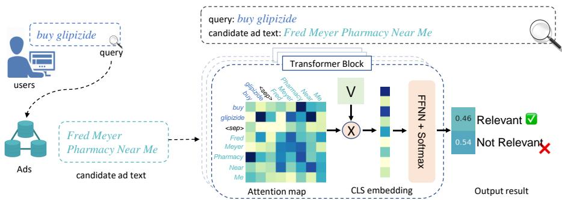
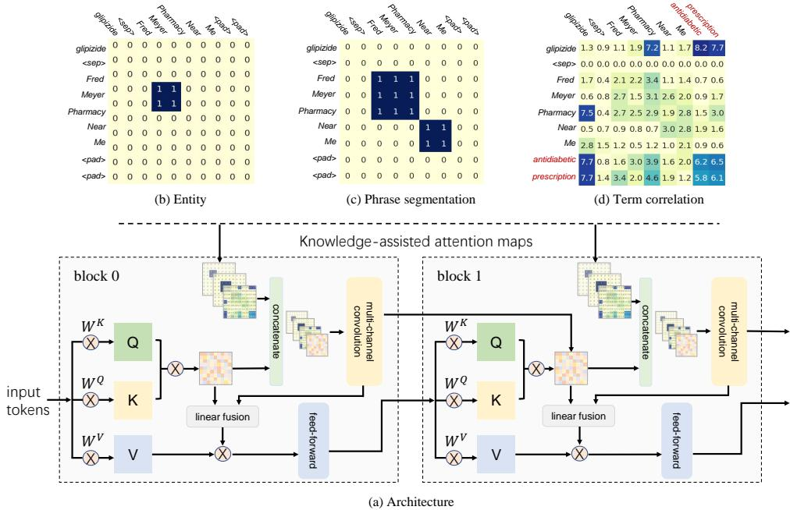
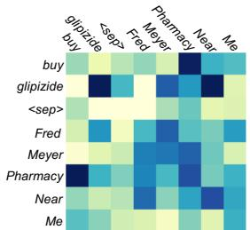
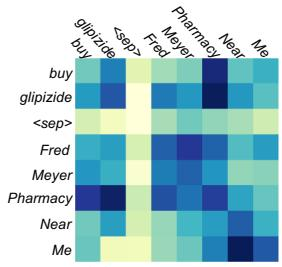
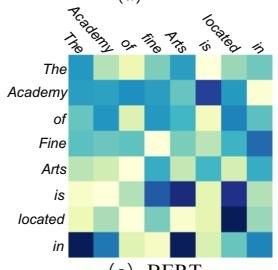
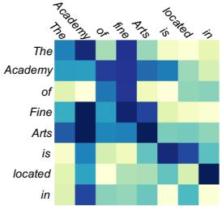

# Enhancing Self-Attention with Knowledge-Assisted Attention Maps

Jiangang Bai1,∗, Yujing Wang2, Hong Sun2, Ruonan Wu2, Tianmeng Yang1, Pengfei Tang2, Defu Cao1,\*, Mingliang Zhang1,\*, Yunhai Tong1, Yaming Yang2, Jing Bai2, Ruofei Zhang2, Hao Sun2, Wei Shen2

1Peking University, Beijing, China

2Microsoft, Beijing, China

{pku\_bjg,youngtimmy,cdf,zml24,yhtong}@pku.edu.cn

{yujwang,hosu,ruonan.wu,pengfeitang,yayaming,jbai,bzhang,hasun,sashen}@microsoft.com

## Abstract

Large-scale pre-trained language models have attracted extensive attentions in the research community and shown promising results on various tasks of natural language processing. However, the attention maps, which record the attention scores between tokens in self-attention mechanism, are sometimes ineffective as they are learned implicitly without the guidance of explicit semantic knowledge. Thus, we aim to infuse explicit external knowledge into pretrained language models to further boost their performance. Existing works of knowledge infusion largely depend on multi-task learning frameworks, which are inefficient and require large-scale re-training when new knowledge is considered. In this paper, we propose a novel and generic solution, KAM-BERT, which directly incorporates knowledge-generated attention maps into the self-attention mechanism. It requires only a few extra parameters and supports efficient fine-tuning once new knowledge is added. KAM-BERT achieves consistent improvements on various academic datasets for natural language understanding. It also outperforms other state-of-the-art methods which conduct knowledge infusion into transformerbased architectures. Moreover, we apply our model to an industry-scale ad relevance application and show its advantages in the real-world scenario.

## 1 Introduction

Language models pre-trained by a large text corpus have shown superior performances on a wide range of natural language processing tasks. Many advanced models based on the transformer architectures achieve state-of-the-art results on various NLP benchmarks. Existing literature (Jawahar et al., 2019; Hewitt and Manning, 2019) shows that pre-training enables a model to capture syntactic and semantic information in the self-attention mechanism. However, the attention maps, which record the attention scores between tokens in a selfattention mechanism, are sometimes ineffective as they are learned implicitly without the guidance of explicit semantics (Jain and Wallace, 2019). If the knowledge can be leveraged in a reasonable way to guide the self-attention mechanism, we have a good chance to improve the quality of attention scores as well as the performance of downstream applications.

Recently, there have been multiple attempts for incorporating knowledge into transformer architectures. ERNIE (Zhang et al., 2019) and KE-PLER (Wang et al., 2019) utilize both large-scale textual corpora and knowledge graphs to train a representation model in a multi-task learning framework. They need to be retrained from scratch when injecting new knowledge, which is inefficient and can not benefit from existing pre-trained checkpoints. K-Adapter (Wang et al., 2020) integrates additional neural models to capture different kinds of knowledge. It enables adaptation based on pretrained language models. However, it does not instruct the self-attention mechanism directly and introduces a relatively large number of parameters to the original model.

In this paper, we propose a novel and generic self-attention mechanism enhanced by explicit knowledge to address problems mentioned above. First, we show a failure case of query-ad matching, which motivates us to inject explicit knowledge into self-attention mechanism. In Figure 1, the attention map of a query-ad pair is visualized, and the goal is to judge if the query and ad text are semantically relevant. As shown in the figure, BERT misclassifies this pair as irrelevant, probably because it does not understand the query word “glipizide”, which rarely appears in the pre-training corpus. In fact, “glipizide” is a kind of medicine and highly related to the word “Pharmacy” in ad text, so this case should be classified as relevant. In this case, if we know “glipizide” is semantically correlated to “Pharmacy” as prior knowledge, we can enrich the attention maps accordingly. In addition, terms “Fred” and “Meyer” are from the same entity, so the attention scores between these two terms should be relatively high. Based on this fact, we believe that simply using language models pre-trained by a general corpus is not enough to meet the satisfaction of a specific application. Thus, our motivation is to inject explicit knowledge into the transformer architecture, which guides the pre-trained language model to perform better adaptation in an efficient fine-tuning procedure.

  
Figure 1: Visualization of attention map from Figure 1: Visualization of attention map from vanilla BERT for a case of query-ad matching

To address the above motivation, we propose a novel architecture, namely KAM-BERT (Knowledge-assisted Attention Maps for BERT). First, it constructs semantic attention maps based on corresponding relevance functions defined by various kinds of semantic knowledge. Specifically, we consider three kinds of semantic knowledge to guide the self-attention mechanism, i.e., entity, phrase segmentation, and term correlation. Entity and phrase segmentation indicate the cohesion of continuous terms, while term correlation can help to enrich the semantic representation of a sentence. Then, the knowledge infusion procedure is completed by concatenating these attention maps with vanilla self-attention and then performing 2Dconvolution for integration. Finally, the result attention maps are served as inputs for value projection, and the rest part is the same as a standard transformer. The KAM-BERT model can be fine-tuned on existing pre-trained checkpoints in a plug and play mode, which is highly efficient in practice.

As illustrated in Section 4, we compare KAM-BERT with BERT and other knowledge-enhanced SOTAs on various natural language understanding tasks, where KAM-BERT shows consistent superiority. Especially, we lift the average score of BERT-Base from 77.5 to 78.7 on the GLUE benchmark. We also demonstrate the advantage of KAM-BERT for knowledge injection on LAMA, a probing benchmark to analyze the factual and commonsense knowledge contained in a model. Furthermore, KAM-BERT is successfully applied to the query-ad relevance scenario in a commercial search engine and shows significant lift in AUC score.

The major contributions of this paper are summarized as follows:

• First, we propose a novel self-attention mechanism enhanced by semantic attention maps, which incorporates knowledge from entity, phrase segmentation, and term correlation. Ablation study will demonstrate the effectiveness of these kinds of semantic attention maps.

• Second, KAM-BERT requires little extra memory and computation cost compared to vanilla BERT and other SOTAs. It can be finetuned efficiently on existing language models for a given application. We have successfully applied it to improve the performance of query-ad relevance in a commercial search engine.

• Last but not least, the proposed framework is generic and flexible for infusing various kinds of knowledge into the transformer architecture. Except for the three kinds of knowledge considered in this paper, we will also showcase how to incorporate other kinds of information, such as a knowledge graph. It opens up new opportunities for further exploration.

## 2 Related Works

After the NLP landmark models Transformer (Vaswani et al., 2017) and BERT (Devlin et al., 2019), many efforts have been devoted to pre-training representation models for natural language and utilizing them to benefit specific NLP tasks. Most of them capture semantic information in the self-attention mechanism implicitly, while recent works demonstrated that injecting explicit knowledge significantly enhanced the performances of downstream tasks. ERNIE (Zhang et al., 2019) makes a preliminary attempt to utilize knowledge graph to improve the performance of knowledge-driven tasks. LIBERT (Lauscher et al., 2019) injects pairs of words with synonym and hyponym relations in WordNet. SenseBERT (Levine et al., 2020) considered word-supersense knowledge by predicting the supersense of the masked word. KnowBERT (Peters et al., 2019) incorporates knowledge bases into BERT through Knowledge attention and re-contextualization. WKLM (Xiong et al., 2019) replaces entity mentions in the original document with names of other entities of the same type, and is trained to distinguish the correct entity mention from random ones. These models are supposed to be retrained when injecting new kinds of knowledge. K-Adapter (Wang et al., 2020) addresses this problem by plugging multiple ways of adapters for different kinds of knowledge. Notably, most of methods above need to be pre-trained from scratch while our method do not. Instead, we inject multiple kinds of knowledge directly into the self-attention maps and support efficient adaptation on a pre-trained language model.

## 3 KAM-BERT

As illustrated in Figure 2, KAM-BERT injects multiple kinds of knowledge into transformer-based pre-trained models in the form of multi-channel semantic attention maps. Different kinds of knowledge can be extracted independently and infused together into one self-attention map in the transformer architecture. KAM-BERT can be fine-tuned directly from an existing checkpoint of BERT, while additional parameters are initialized randomly and learned in the fine-tuning stage. Thus, it is quite efficient and flexible to incorporate new kinds of knowledge into the model.

Below we first describe the standard selfattention mechanism. Then, we will introduce the generic definition of semantic attention maps, as well as the methodology of multi-channel knowledge infusion which integrates semantic attention maps into transformer models. At last, the generation of different kinds of semantic attention maps will be presented. Note that the time complexity of KAM-BERT is on-par with a vanilla BERT. A detailed analysis can be found in the supplementary material.

## 3.1 Self-Attention

The representation of a text sequence can be written as $\mathbf { \bar { X } } \in \mathbf { R } ^ { N \times C }$ , where N denotes the sequence length and C is the word embedding dimension size. A standard Transformer block is composed of a self-attention layer and a position-wise feedforward layer, while each attention map is generated by a self-attention layer without any other prior knowledge introduced.

The self-attention mechanism plays an important role in the transformer-based model. In a vanilla Transformer, the self-attention map $\mathbf { A } _ { \mathbf { s a } } ^ { \mathbf { i } }$ of layer i is calculated by the dimension-normalized dotproduct operation.

$$
\mathbf { A } _ { \mathrm { s a } } ^ { \mathrm { i } } = \mathrm { S e l f - A t t e n t i o n } ( \mathbf { X } ) = { \frac { \mathbf { Q } \mathbf { K } ^ { \top } } { \sqrt { d } } }\tag{1}
$$

where d is the dimension of representation vectors. In a vanilla transformer, $\mathbf { A } _ { \mathbf { s a } } ^ { \mathbf { i } }$ is then normalized by softmax and fed into position-wise feed-forward layers. In KAM-BERT, the self-attention map $\mathbf { A } _ { \mathbf { s a } } ^ { \mathbf { i } }$ is infused with semantic attention maps to calculate the final attention matrix, which will be described in the following sub-sections.

## 3.2 Semantic Attention Maps

Given a sequence of tokens $\{ x _ { 0 } , x _ { 1 } , . . . , x _ { n - 1 } \}$ , the semantic attention map can be defined in a generic form $M \in \mathbb { R } ^ { n \times n }$ , where $M _ { i , j } \in [ 0 , 1 ]$ denotes the attention score from token i to token $j ,$ and n is the number of tokens in the current sentence. Then, for a specific kind of knowledge, we need a corresponding relevance function to calculate the attention score, $i . e . , M _ { i , j } = R e l e v a n c e ( x _ { i } , x _ { j } )$ . Note that if $x _ { i }$ denotes a sub-word as in the BERT model, we define $M _ { i , j } = R e l e v a n c e ( W ( x _ { i } ) , W ( x _ { j } ) )$ , where $W ( x _ { i } )$ denotes the entire word which contains the sub-word $x _ { i }$ . For example, BERT will convert a sequence "I like tacos $\it { ? " }$ into a sequence of sub-words, i.e., {I, like, ta, ##cos, !}, where $" t a "$ and $" \# \# c o s " $ are sub-words from “tacos”, so both $W ( t a )$ and $W ( \# \# c o s )$ denote the word "tacos". In Section 3.4, we will introduce three kinds of semantic attention maps considered in this paper and the generation method for other knowledgeassisted attention maps.

## 3.3 Multi-Channel Knowledge Infusion

In order to incorporate external knowledge into self-attention, we concatenate semantic attention maps with vanilla self-attention, and then infuse them into a single multi-head attention map using multi-channel 2D-convolutions. Applying 2Dconvolution to a self-attention map is first proposed by (Wang et al., 2021) and shows advantages in both NLP and CV tasks. Here we use 2D-convolution to infuse different kinds of knowledge.

  
Figure 2: Overview of KAM-BERT calculation flow. (a) is our KAM-BERT architecture, (b) (c) and (d) are specific knowledge-assisted attention maps calculated from entity, phrase segmentation and term correlation. We illustrate the first two transformer blocks here.

First, we perform Channel Wise Concatenation (CWC): the vanilla self-attention map $\mathbf { A } _ { \mathbf { s a } } ^ { \mathbf { i } }$ will be concatenated with each semantic attention map $\mathbf { M _ { i } }$ separately along the channel dimension. Then, a multi-channel 2D-convolution is applied to generate an knowledge-infused attention map, denoted by $\mathbf { A } _ { \mathrm { { s e m } } } ^ { \mathrm { { i } } }$ . The entire process can be formulated as below.

$$
\mathbf { A _ { s e m } ^ { i } } = C o n v ( C W C ( \mathbf { A _ { s a } ^ { i } } | \mathbf { M _ { 1 . . k } } ) )\tag{2}
$$

where $\mathbf { M _ { 1 . . k } }$ is a set of semantic attention maps obtained by k different kinds of knowledge, including but not limited to the three ones considered in this paper; To infuse different types of knowledge, we apply a standard 2D convolution operation, the output dimension of which is the same as that of $\mathbf { A _ { s a } } . \mathrm { I f } \mathbf { A _ { s a } }$ has m attention heads, then $\mathbf { A } _ { \mathbf { s e m } }$ will also has m attention heads. We adopt $3 \times 3$ kernel for the convolution empirically as it performs better than 1 1 and $5 \times 5$ kernels according to (Wang et al., 2021).

At last, we adopt a hyper-parameter α to balance the importance of $\mathbf { A } _ { \mathbf { s a } } ^ { \mathbf { i } }$ and $\mathbf { A _ { s e m } ^ { i } }$

$$
\mathbf { A } ^ { \mathbf { i } } = S o f t m a x ( \alpha \cdot \mathbf { A } _ { \mathbf { s e m } } ^ { \mathbf { i } } + ( 1 - \alpha ) \cdot \mathbf { A } _ { \mathbf { s a } } ^ { \mathbf { i } } )\tag{3}
$$

After softmax activation, we get the final selfattention map $\mathbf { A } ^ { \mathbf { i } }$ with m heads for the i-th layer.

Given the self-attention map, the rest components are identical to a vanilla Transformer, which can be calculated as

$$
\mathbf { h _ { j } ^ { i } } = \mathbf { A _ { j } ^ { i } } \mathbf { V ^ { i } } , \mathbf { H ^ { i } } = ( \bigoplus _ { j = 1 } ^ { m } \mathbf { h ^ { j } } ) \mathbf { W ^ { O } } , j \in m .\tag{4}
$$

In detail, we use the obtained attention map $\mathbf { A } ^ { \mathbf { i } }$ to multiply the value matrix V in the attention mechanism to get the representation $\mathbf { h } ^ { \mathbf { j } }$ of the j-th attention head. Next, the outputs of all attention heads from each layer will be concatenated along the embedding dimension. Finally, we multiply this result with a linear transformation matrix $\mathbf { W } ^ { \mathbf { O } }$ to get the output representation of the i-th KAM-BERT layer. Besides, we add a skip connection from the result attention map in the i-th layer to the self-attention map of the i + 1 layer to enhance the flow of information between layers.

3.4 Generation of Semantic Attention Maps The knowledge we inject into KAM-BERT includes entity information, phrase segmentation information, and term correlation information. We consider these three types of knowledge because they reflect language semantics from different perspectives. Entity and phrase represent coherence between adjacent words while term correlations build a semantic bridge for related words which may be far away or even unseen in the current sentence. The first two kinds of knowledge are presented as labeled sequences, and the last one is presented as relationship between tokens. As defined in Section 3.2, a specific kind of knowledge can be transferred to semantic attention maps once the corresponding Relevance function is defined. In the following paragraphs, we will demonstrate how to define Relevance functions for the three types of knowledge used in this paper. Also, we need to emphasize that the proposed framework is generic and is feasible to incorporate other semantic information like a knowledge graph. Thus, we will discuss how to generate other knowledgeassisted attention maps as our future work.

Entity Attention Map Named Entity Recognition (NER) (Nadeau and Sekine, 2007) is a standard task for natural language processing which has been studied for years. Mathematically, a entity extractor transforms the sequence of tokens $\{ x _ { 0 } , x _ { 1 } , . . . , x _ { n - 1 } \}$ into a sequence of labels $\left\{ l a b e l _ { 0 } , l a b e l _ { 1 } , . . . , l a b e l _ { n - 1 } \right\}$ , where $l a b e l _ { i }$ falls into one of three classes, denoting non-entity words, starting words in entities and other words in entities. Based on the labeled sequence, the Relevance function for entity attention map can be defined as

$$
R e l e v a n c e ( W _ { i } , W _ { j } ) = \left\{ \begin{array} { l l } { 1 } & { W _ { i } \equiv _ { E } W _ { j } } \\ { 0 } & { o t h e r w i s e } \end{array} \right.\tag{5}
$$

where $A \equiv _ { E } B$ denotes A and B belong to the same entity.

Phrase Segmentation Attention Map Similar to the entity attention map, one can highlight the term correlations within the same phrase segmentation to emphasize the locality inductive bias. Syntax tree is a generic source to extract phrases in different semantic levels, which can be generated by a trained syntax parser. In a syntax tree, each internal node represents a phrase segment for a specific level. For example, we can select the parents of leaf nodes in the syntax tree as the root of each sub-tree which represents a phrase. We define the distance of an internal node i to the leaf node as ${ l e v e l } ( i )$ . Thus, the relevance function can be computed by

$$
R e l e v a n c e ( W _ { i } , W _ { j } ) = { \left\{ \begin{array} { l l } { 1 } & { W _ { i } \equiv _ { T } W _ { j } } \\ { 0 } & { o t h e r w i s e } \end{array} \right. }\tag{6}
$$

where $A \equiv _ { T } B$ denotes that A and B belong to the same sub-tree at level(i).

Term Correlation Attention Map In computational linguistics, Pointwise Mutual Information (PMI) has been widely used for finding associations between words (Arora et al., 2016). In our work, we adopt PMI to measure the semantic correlations between terms. The PMI of a pair $( x , y )$ from discrete random variables $( X , Y )$ quantifies the discrepancy between the probability of their coincidence given joint distributions and individual distributions. We define the PMI-based relevance function as

$$
\begin{array} { c } { { P M I ( x ; y ) = \log \displaystyle \frac { p ( x , y ) } { p ( x ) p ( y ) } } } \\ { { R e l e v a n c e ( W _ { i } , W _ { j } ) = P M I ( W _ { i } ; W _ { j } ) / Z } } \end{array}\tag{7}
$$

where Z denotes the normalized factor of PMI matrix. In our experiments, PMI is calculated using a large web corpus. We calculate the probability $p ( x , y )$ of a word pair appearing jointly, and the probability of single word appearance is denoted as $p ( x )$ and $p ( y )$ . Finally, we use log $p ( x , y ) - \log p ( x ) - \log p ( y )$ to compute the PMI score.

To better incorporate semantic knowledge into attention maps, we further enrich each attention map by adding top k terms which do not appear in the current sentence but hold the highest average PMI scores with terms in the original sentence. Note that we should expand the selected k words to K subwords for BERT. Then the subwords will be appended to the original sentence. After augmentation, the input sentence has $N + K$ words and the shape of an attention map becomes $( N + K ) \times ( N + K )$ , where N and K denote the number of original terms and auxiliary terms respectively (see an example in Fig. 2(d)). In order to align the shapes of different attention maps (including the vanilla self-attention map), we add zero-padding for smaller ones. After passing one transformer layer, the output sequence length is still $N + K$ . Note that the auxiliary words are only utilized to enrich the semantics of original word representations, which is done within each transformer layer. Thus, we trim the output sequence length to N before taking it as input to the next transformer layer (while a new round of augmentation will be done in the next layer).

Other Knowledge-assisted Attention Maps. The KAM-BERT framework is generic and can be extended to other kinds of knowledge in future works. For each semantic type, we can define a specific Relevance function to transfer the corresponding information into semantic attention maps. For example, we can define the relevance function for a Knowledge Graph (KG) as:

$$
R e l e v a n c e ( W _ { i } , W _ { j } ) = \left\{ \begin{array} { l l } { 1 } & { E ( W _ { i } ) \equiv _ { K G } E ( W _ { j } ) } \\ { 0 } & { o t h e r w i s e } \end{array} \right.\tag{8}
$$

where $E ( W _ { i } )$ is the corresponding entity of word or sub-word Wi in a KG, and $A \equiv _ { K G } B$ represents that both A and B exist and are adjacent in a KG.

## 4 Experiments

We briefly introduced the extraction of semantic information in Section 4.1. Then we report experimental results on natural language understand and question answering tasks in Section 4.2 and 4.3 respectively. In Section 4.4, we show evaluation on LAMA, a benchmark especially designed to study how much semantic knowledge is contained in a language model. Experiments on query-ad relevance is described in Section 4.5. At last, we present ablation study in Section 4.6 .

## 4.1 Semantic Information Extraction

We use Stanza library (Qi et al., 2020) to extract NER information and syntax information. Stanza NER takes one sentence as input and returns the start and end indices of the corresponding named entity in the sentence. While Stanza Parser can extract the corresponding syntax tree for each sentence. We use query-ad logs from a commercial search engine to calculate PMI matrix. These steps gain the knowledge required to generate the semantic attention maps mentioned in Section 3.4.

## 4.2 GLUE Benchmark

The GLUE benchmark offers a collection of tools for evaluating the performance of models across a diverse set of NLP applications. It contains singlesentence classification tasks (CoLA and SST-2), similarity and paraphrase tasks (MRPC, QQP and STS-B) and pairwise inference tasks (MNLI, RTE and QNLI). We use the default train/dev/test split for each dataset. The hyper-parameters are chosen based on the validation set (refer to appendix for details). After the model is trained, we make predictions on the test data and send the results to GLUE online evaluation service1 to get testing scores. Note that the original WNLI dataset in the GLUE benchmark is problematic, which causes the evaluation results to be 65.1. In order to make a fair comparison, most papers (Devlin et al., 2019; Liu et al., 2019; Yang et al., 2019) choose to ignore the results of WNLI when calculating GLUE average score.

The scores on all datasets in GLUE benchmark are listed in Table 1. We report test scores on BERT-Base, BERT-Large, RoBERTa related models and their corresponding enhanced models. The performances of BERT-Base, BERT-Large and

RoBERTa-Large are reproduced using the official checkpoints provided by corresponding authors.

As shown in the table, our models outperform all corresponding baselines. KAM-BERT-Base achieves an average GLUE score of 78.7, lifting 1.2 scores from standard BERT-Base model with only a few extra parameters introduced to the baseline model. Particularly, the improvements on CoLA datasets are fairly large, showing that our knowledge integration method has good generalization performance for natural language inference and understanding. ERNIE have also added external information such as entity and knowledge graph, but it needs much more time for a joint re-training. As for BERT-Large and its counterpart KAM-BERT-Large, the average improvement on GLUE benchmark is 0.9. We can see that the improvement becomes smaller when the model grows larger, because larger models often capture more semantic knowledge in the pre-training phrase. But incorporating explicit knowledge is still indispensable for achieving a superior performance.

## 4.3 Question Answering

We conduct experiments on two kinds of question answering tasks, i.e., commonsense QA and open-domain QA. Commonsense QA aims to answer questions with commonsense. We adopt CosmosQA for evaluation, which requires commonsense-based reading comprehension formulated as multiple answer selection. Opendomain QA aims to answer questions using external resources such as collections of documents and webpages. We consider two public datasets for this task, i.e., Quasar-T and SearchQA.

The results of CosmosQA are shown in Table 2. Compared with BERT-Large, KAM-BERT-Large achieves 10.6% improvement in accuracy. KAM-RoBERTa-Large further improves the accuracy of RoBERTa-Large by 5.4%, which indicates that our models has better knowledge inference ability. For open-domain QA, our model also achieves better results compared to corresponding baselines. This because that KAM-based models can make full use of the infused knowledge. At the same time, one can notice that KAM-based models have fewer parameters than K-Adaptor, demonstrating its effectiveness for knowledge infusion. WKLM (Xiong et al., 2019) forces the pre-trained language model to incorporate knowledge from a knowledge graph. This makes WKLM to achieve a better score on QA tasks, but KAM-BERT performs even better than WKLM.

Table 1: Comparison of different model backbones on GLUE benchmark
<table><tr><td>Model</td><td>#Params</td><td>Avg</td><td>CoLA</td><td>SST-2</td><td>MRPC</td><td>STS-B</td><td>QQP</td><td>MNLI-m/-mm</td><td>QNLI</td><td>RTE</td><td>WNLI</td></tr><tr><td>BERT-Base</td><td>109.5M</td><td>77.5</td><td>50.1</td><td>92.6</td><td>88.7/84.3</td><td>85.7/84.6</td><td>71.0/88.9</td><td>83.6/83.2</td><td>89.4</td><td>67.9</td><td>65.1</td></tr><tr><td>ERNIE</td><td>114M</td><td>77.5</td><td>52.3</td><td>93.5</td><td>88.2/-</td><td>83.2/-</td><td>71.2/-</td><td>84.0/83.2</td><td>91.3</td><td>68.8</td><td>65.1</td></tr><tr><td>SenseBERT</td><td>133M</td><td>77.9</td><td>54.6</td><td>92.2</td><td>89.2/85.2</td><td>83.5/82.3</td><td>70.3/88.8</td><td>83.6/-</td><td>90.6</td><td>67.5</td><td>65.1</td></tr><tr><td>CorefBERT</td><td>110M</td><td>77.6</td><td>51.5</td><td>93.7</td><td>89.1/-</td><td>85.8/-</td><td>71.3/-</td><td>84.2/83.5</td><td>90.5</td><td>67.2</td><td>65.1</td></tr><tr><td>KAM-BERT-Base</td><td>112M</td><td>78.7</td><td>53.7</td><td>93.2</td><td>89.2/85.0</td><td>86.1/84.8</td><td>71.2/89.4</td><td>84.3/83.5</td><td>90.6</td><td>67.9</td><td>65.1</td></tr><tr><td>BERT-Large</td><td>345M</td><td>80.5</td><td>60.5</td><td>94.9</td><td>89.3/85.4</td><td>87.6/86.5</td><td>72.1/89.3</td><td>86.8/85.9</td><td>92.7</td><td>70.1</td><td>65.1</td></tr><tr><td>KAM-BERT-Large</td><td>350.4M</td><td>81.4</td><td>61.5</td><td>95.3</td><td>91.4/88.1</td><td>88.5/87.3</td><td>72.5/89.5</td><td>87.1/86.6</td><td>93.0</td><td>72.0</td><td>65.1</td></tr><tr><td>RoBERTa-Large</td><td>355M</td><td>83.9</td><td>63.8</td><td>96.3</td><td>91.0/89.4</td><td>89.4/87.9</td><td>72.7/90.1</td><td>89.5/89.7</td><td>94.2</td><td>84.2</td><td>65.1</td></tr><tr><td>KEPLER</td><td>360M</td><td>84.4</td><td>63.6</td><td>94.5</td><td>89.3/-</td><td>91.2/-</td><td>91.7/-</td><td>87.2/86.5</td><td>92.4</td><td>85.2</td><td>65.1</td></tr><tr><td>KAM-RoBERTa-Large</td><td>361M</td><td>84.6</td><td>65.1</td><td>96.6</td><td>92.4/90.7</td><td>90.2/88.4</td><td>73.2/90.5</td><td>89.8/89.7</td><td>94.6</td><td>85.4</td><td>65.1</td></tr></table>

Table 2: Results for Question Answering
<table><tr><td>Model</td><td>#Params</td><td>SearchQA</td><td>Quasar-T</td><td>CosmosQA</td></tr><tr><td>BERT-Large</td><td>345M</td><td>51.7/61.9</td><td>40.4/46.1</td><td>68.5</td></tr><tr><td>WKLM</td><td>348M</td><td>58.7/63.3</td><td>43.7/49.9</td><td></td></tr><tr><td>WKLM+Ranking</td><td>348M</td><td>61.7/66.7</td><td>45.8/52.2</td><td></td></tr><tr><td>KAM-BERT-Large (Ours)</td><td>347M</td><td>62.3/67.2</td><td>47.0/53.5</td><td>69.3</td></tr><tr><td>RoBERTa-Large</td><td>355M</td><td>59.0/65.6</td><td>40.8/48.8</td><td>80.6</td></tr><tr><td>RoBERTa + multitask</td><td>355M</td><td>59.9/66.7</td><td>44.6/51.2</td><td>81.2</td></tr><tr><td>K-Adapter</td><td>384M</td><td>62.0/67.3</td><td>46.3/53.0</td><td>81.8</td></tr><tr><td>KAM-RoBERTa-Large (Ours)</td><td>361M</td><td>64.4/68.6</td><td>46.6/53.4</td><td>81.9</td></tr></table>

## 4.4 LAMA Benchmark

To further verify whether KAM-BERT better integrate internal knowledge into pre-trained language models, we conduct experiments on LAMA, a widely used benchmark for knowledge probing. LAMA examines models’ abilities on recalling relational facts by cloze-style questions. The first place micro-averaged accuracy is used as evaluation metrics. The evaluation results are shown in Table 3. KAM-BERT consistently outperforms corresponding baselines on all tasks. It indicates that KAM-BERT can generate better attention maps with semantic guidance.

## 4.5 Query-Ad Relevance

Query-ad relevance measures how relevant a search ad matches with a user’s search query. Very often queries and ads have words with special meanings, which are not easily understood well by traditional NLP techniques but can benefit from the knowledge-assisted mechanism proposed in this work. Besides, user queries and ads text often contain noises, so evaluation on query-ad relevance task would test our model’s robustness and resistance of noise. We compare BERT and KAM-BERT on a large-scale internal dataset of a commercial search engine. As shown in Table 5, our model outperforms corresponding baselines by a large margin, which is statistically significant under 95% confidence interval. One thing to call out is that, although NER and syntax parsing results are nosier comparing to the ones in academic datasets, we still have good improvements on this dataset. This indicates the way we combine those knowledge together makes our model more robust to noisy inputs.

Table 3: Results for knowledge probing benchmark LAMA
<table><tr><td>Model</td><td></td><td>SQuAD Google-RE T-REx ConceptNet</td><td></td><td></td></tr><tr><td>BERT-Large</td><td>14.1</td><td>9.8</td><td>31.1</td><td>15.6</td></tr><tr><td>KAM-BERT-Large</td><td>14.5</td><td>10.1</td><td>32.2</td><td>16.0</td></tr><tr><td>RoBERTa-Large</td><td>15.9</td><td>11.3</td><td>33.7</td><td>17.1</td></tr><tr><td>KAM-RoBERTa-Large</td><td>16.3</td><td>11.9</td><td>34.5</td><td>17.3</td></tr></table>

Table 4: Results for Ad Relevance
<table><tr><td>α</td><td>CoLA</td><td>SearchQA</td><td>Google-RE</td></tr><tr><td>0.0</td><td>51.2</td><td>59.6/63.8</td><td>8.2</td></tr><tr><td>0.1</td><td>53.0</td><td>60.1/64.9</td><td>8.6</td></tr><tr><td>0.2</td><td>53.7</td><td>60.7/65.3</td><td>8.7</td></tr><tr><td>0.4</td><td>53.5</td><td>60.4/65.0</td><td>8.6</td></tr></table>

Table 5: Hyper-parameter Analysis
<table><tr><td>Model</td><td>#Params</td><td>#FLOPs</td><td>AUC</td></tr><tr><td>BERT-Base</td><td>110M</td><td>6.3G</td><td>73.54</td></tr><tr><td>KAM-BERT-Base (Ours)</td><td>112M</td><td>6.8G</td><td>75.95</td></tr><tr><td>BERT-Large</td><td>345M</td><td>11.7G</td><td>81.77</td></tr><tr><td>KAM-BERT-Large (Ours)</td><td>348M</td><td>12.2G</td><td>83.97</td></tr><tr><td>RoBERTa-Base</td><td>125M</td><td>6.5G</td><td>85.87</td></tr><tr><td>KAM-RoBERTa-Base (Ours)</td><td>127M</td><td>6.9G</td><td>86.63</td></tr></table>

## 4.6 Model Analysis

In this section, we explore the sensitivity of hyperparameter α, and then conduct ablation experiments on three types of added knowledge.

Hyper-parameter Analysis The optimal α value after grid search is 0.2, which means that the original attention maps still dominate the token relationships. We chose three tasks from different fields to do ablation study for α. Our model is KAM-BERT-Base, and its performance is shown in Table 4. In three different tasks, setting α to 0.2 achieves the best results. An intuitive understanding is that when α is small, external knowledge plays an unimportant role and cannot participate in the entire training process well. With the gradual increase of α, the intervention of external knowledge on the attention map will increase, and the attention relationship in the original sequence will be gradually lost, resulting in the decline of model performance.

Table 6: Ablation study
<table><tr><td>Model</td><td>Avg</td><td>CoLA</td><td>SST-2</td><td>MRPC</td><td>STS-B</td><td>QQP</td><td>MNLI-m/-mm</td><td>QNLI</td><td>RTE</td><td>WNLI</td></tr><tr><td>BERT-Base</td><td>77.5</td><td>50.1</td><td>92.6</td><td>88.7/84.3</td><td>85.7/84.6</td><td>71.0/88.9</td><td>83.6/83.2</td><td>89.4</td><td>67.9</td><td>65.1</td></tr><tr><td>KAM-BERT-Base</td><td>78.7</td><td>53.7</td><td>93.2</td><td>89.2/85.0</td><td>86.1/84.8</td><td>71.2/89.4</td><td>84.3/83.5</td><td>90.6</td><td>67.9</td><td>65.1</td></tr><tr><td>-KAM-BERT w/o PMI</td><td>78.0</td><td>52.1</td><td>93.0</td><td>89.0/84.9</td><td>83.5/81.7</td><td>71.0/89.1</td><td>84.1/83.4</td><td>90.2</td><td>67.9</td><td>65.1</td></tr><tr><td>-KAM-BERT w/o Phrase</td><td>78.1</td><td>53.0</td><td>93.1</td><td>89.0/84.6</td><td>83.2/81.5</td><td>71.1/89.1</td><td>84.2/83.3</td><td>90.5</td><td>67.9</td><td>65.1</td></tr><tr><td>-KAM-BERT w/o Entity</td><td>77.7</td><td>51.7</td><td>92.8</td><td>88.9/84.7</td><td>82.8/81.0</td><td>71.1/88.9</td><td>83.8/83.3</td><td>89.7</td><td>67.9</td><td>65.1</td></tr><tr><td>-KAM-BERT w/o Conv</td><td>78.0</td><td>53.1</td><td>93.0</td><td>89.1/84.9</td><td>83.1/81.2</td><td>70.8/88.9</td><td>84.2/83.3</td><td>90.2</td><td>67.9</td><td>65.1</td></tr></table>

Ablation Study For a comprehensive understanding of our model design, we conduct ablation study with the following settings in Table 6. (1) KAM-BERT w/o PMI: the PMI-based attention maps are removed; (2) KAM-BERT w/o Phrase: the phrase-based attention maps are removed; (3) KAM-BERT w/o Entity: the entity-based attention maps are removed. (4) KAM-BERT w/o Convolution: the convolution layers for knowledge-assisted attention map integration are removed. Instead, we merge all the attention maps through average aggregation.

The average scores of all ablation experiments are better than BERT, but are relatively worse than KAM-BERT, demonstrating all the components are beneficial for the final performance. At the same time, we observe that after deleting the entity attention map, the score of KAM-BERT drops drastically from 78.7 to 77.7. This shows that the gain brought by entity information is the greatest. In addition, the convolution layer is indispensable for achieving a superior performance.

## 4.7 Case Study

In Figure 3, we visualize an example of query-ad relevance, where the query is “buy glipizide” and ad text is “Fred Meyer Pharmacy Near Me”. The darker color in the figure represents a higher attention score. Figure 3(a) is the attention map of vanilla BERT without adding explicit knowledge. When encountering rare words like “glipizide”, the self-attention mechanism cannot do a good job to decide which terms should “glipizide” attend to. But in Figure 3(b), the attention map of KAM-BERT uses term correlations to learn that “glipizide” is a medicine, so it focuses on the medicinerelated tokens like “Pharmacy” and “antidiabetic”.

  
a-BERT

  
b-KAM-BERT

  
c-BERT

  
d-KAM-BERT  
Figure 3: Visualization of attention maps in BERT and KAM-BERT.

Figure 3(c) and 3(d) are the attention maps for the sentence “The Academy of Fine Arts is located in Northern Maidan.” We only visualize the key parts due to space limitation. Figure 3(c) shows the attention map for vanilla BERT, and 3(d) is the attention map for KAM-BERT. It can be observed that the terms in the same entity are highly correlated with each other in KAM-BERT, which is more reasonable than vanilla BERT.

## 5 Conclusion

In this paper, we proposed KAM-BERT, a flexible and efficient approach to inject knowledge into transformer-based pre-trained models. Extensive experiments on GLUE and LAMA benchmark show that our approach outperforms all BERT-Style baselines and achieves new SOTA on QA tasks, suggesting that our models indeed integrate knowledge in an effective manner and have good generalization ability. In future work, we hope to investigate more types of knowledge which can be effectively integrated in our framework.

## References

Sanjeev Arora, Yuanzhi Li, Yingyu Liang, Tengyu Ma, and Andrej Risteski. 2016. A latent variable model approach to pmi-based word embeddings. TACL, 4:385–399.

Jacob Devlin, Ming-Wei Chang, Kenton Lee, and Kristina Toutanova. 2019. Bert: Pre-training of deep bidirectional transformers for language understanding. In NAACL-HLT (1).

John Hewitt and Christopher D Manning. 2019. A structural probe for finding syntax in word representations. In Proceedings of the 2019 NAACL-HLT(1), pages 4129–4138.

Sarthak Jain and Byron C Wallace. 2019. Attention is not explanation. In Proceedings ofthe 2019 NAACL-HLT(1), pages 3543–3556.

Ganesh Jawahar, Benoît Sagot, and Djamé Seddah. 2019. What does bert learn about the structure of language? In Proceedings ofthe 57th Annual Meeting ofthe ACL, pages 3651–3657.

Anne Lauscher, Ivan Vulic, Edoardo Maria Ponti, Anna´ Korhonen, and Goran Glavaš. 2019. Informing unsupervised pretraining with external linguistic knowledge. arXiv preprint arXiv:1909.02339.

Yoav Levine, Barak Lenz, Or Dagan, Ori Ram, Dan Padnos, Or Sharir, Shai Shalev-Shwartz, Amnon Shashua, and Yoav Shoham. 2020. SenseBERT: Driving some sense into BERT. In Proceedings of the 58th Annual Meeting ofthe ACL.

Yinhan Liu, Myle Ott, Naman Goyal, Jingfei Du, Mandar Joshi, Danqi Chen, Omer Levy, Mike Lewis, Luke Zettlemoyer, and Veselin Stoyanov. 2019. Roberta: A robustly optimized BERT pretraining approach. CoRR, abs/1907.11692.

David Nadeau and Satoshi Sekine. 2007. A survey of named entity recognition and classification. Lingvisticae Investigationes, 30(1):3–26.

Matthew E Peters, Mark Neumann, Robert Logan, Roy Schwartz, Vidur Joshi, Sameer Singh, and Noah A Smith. 2019. Knowledge enhanced contextual word representations. In Proceedings of EMNLP-IJCNLP’19, pages 43–54.

Peng Qi, Yuhao Zhang, Yuhui Zhang, Jason Bolton, and Christopher D. Manning. 2020. Stanza: A Python natural language processing toolkit for many human languages. In Proceedings of the 58th Annual Meeting of the ACL: System Demonstrations.

Ashish Vaswani, Noam Shazeer, Niki Parmar, Jakob Uszkoreit, Llion Jones, Aidan N Gomez, Łukasz Kaiser, and Illia Polosukhin. 2017. Attention is all you need. Advances in neural information processing systems, 30:5998–6008.

Ruize Wang, Duyu Tang, Nan Duan, Zhongyu Wei, Xuanjing Huang, Cuihong Cao, Daxin Jiang, Ming Zhou, et al. 2020. K-adapter: Infusing knowledge into pre-trained models with adapters. arXiv preprint arXiv:2002.01808.

Xiaozhi Wang, Tianyu Gao, Zhaocheng Zhu, Zhiyuan Liu, Juanzi Li, and Jian Tang. 2019. Kepler: A unified model for knowledge embedding and pretrained language representation. arXiv preprint arXiv:1911.06136.

Yujing Wang, Yaming Yang, Jiangang Bai, Mingliang Zhang, Jing Bai, Jing Yu, Ce Zhang, Gao Huang, and Yunhai Tong. 2021. Evolving attention with residual convolutions. arXiv preprint arXiv:2102.12895.

Wenhan Xiong, Jingfei Du, William Yang Wang, and Veselin Stoyanov. 2019. Pretrained encyclopedia: Weakly supervised knowledge-pretrained language model. In ICLR.

Zhilin Yang, Zihang Dai, Yiming Yang, Jaime Carbonell, Russ R Salakhutdinov, and Quoc V Le. 2019. Xlnet: Generalized autoregressive pretraining for language understanding. In Advances in Neural Information Processing Systems, volume 32. Curran Associates, Inc.

Zhengyan Zhang, Xu Han, Zhiyuan Liu, Xin Jiang, Maosong Sun, and Qun Liu. 2019. Ernie: Enhanced language representation with informative entities. In Proceedings of the 57th Annual Meeting of the ACL, pages 1441–1451.