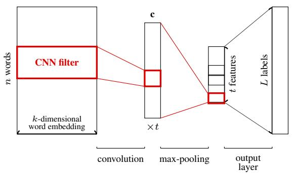
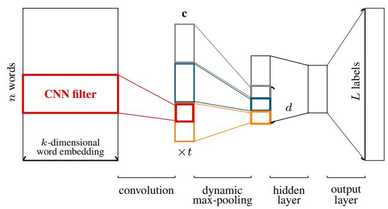
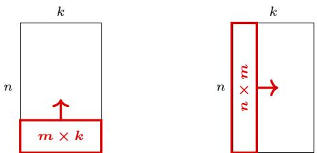

# Even the Simplest Baseline Needs Careful Re-investigation: A Case Study on XML-CNN

Si-An Chen1,2, Jie-Jyun Liu2, Tsung-Han Yang2, Hsuan-Tien Lin1, and Chih-Jen Lin1

1National Taiwan University

{d09922007,htlin,cjlin}@csie.ntu.edu.tw

2ASUS Intelligent Cloud Services

{eleven1\_liu,henry1\_yang}@asus.com

## Abstract

The power and the potential of deep learning models attract many researchers to design ad vanced and sophisticated architectures. Nevertheless, the progress is sometimes unreal due to various possible reasons. In this work, through an astonishing example we argue that more efforts should be paid to ensure the progress in developing a new deep learning method. For a highly influential multi-label text classification method XML-CNN, we show that the superior performance claimed in the original paper was mainly due to some unbelievable coincidences. We re-examine XML-CNN and make a re-implementation which reveals some contradictory findings to the claims in the original paper. Our study suggests suitable baselines for multi-label text classification tasks and confirms that the progress on a new architecture cannot be confidently justified without a cautious investigation.

## 1 Introduction

Deep learning has been a popular research topic in NLP due to its superior performance. The intrinsic structure of deep learning allows researchers to enhance the model performance by introducing more complex network architectures. Nevertheless, the increasing complexity brings difficulties to ensure the true architectural progress. For example, Adhikari et al. (2019) have shown that LSTM architectures with appropriate regularization are either competitive or superior to more recent models. As another example, Liu et al. (2021) report that the lack of hyperparameter tuning in an influential work (Mullenbach et al., 2018) makes the progress of subsequent network developments questionable. Complex architectures are more difficult to train, involve more hyperparameters, and are riskier to unintentional implementation. Because new architectures are usually modified from previous ones, a questionable work may make the research progress unclear. Therefore, re-examining or reproducing influential architectures are now considered important in the community.

In this work, we re-examine XML-CNN (Liu et al., 2017), an influential work in extreme multilabel text classification (XMTC), as a case study to demonstrate the demands of inspecting existing architectures. XML-CNN has been viewed as an essential baseline in subsequent works (Peng et al., 2018; Prabhu et al., 2018; You et al., 2019; Chang et al., 2020; Adhikari et al., 2019) with more than hundreds of citations. XML-CNN roots from Kim-CNN (Kim, 2014), a classical architecture for multi-class text classification. The authors of XML-CNN proposed several modifications from Kim-CNN to accommodate the XMTC task and empirically claim that all modifications bring significant improvements.

Despite XML-CNN’s popularity, we identified two serious implementation issues that make the original claims uncertain. First, the authors introduced dynamic max-pooling into XML-CNN, but the implementation is actually far from the intended formulation. Second, a bug in the experiment code caused the dimensions of convolution operations accidentally swapped. The two issues coincidentally make XML-CNN competitive, leading the authors to illusively claim superiority over Kim-CNN and usefulness of dynamic max-pooling in the original paper (Liu et al., 2017).

Our contribution can be summarized as follows.

• We point out, analyze, and correct the issues in the authors’ XML-CNN implementation. Our implementation is made public to help the community build future works on top of the correct implementation

• We re-examine the claims about XML-CNN. Our results demonstrate that the progress from Kim-CNN to XML-CNN may not be as significant as claimed in Liu et al. (2017), and again confirm that careful attention is needed on ensuring true architectural progress.

• Our investigation suggests that instead of XML-CNN, Kim-CNN or a simpler variant of XML-CNN should be considered as a baseline in XMTC tasks.

The paper is organized as follows: in Section 2, we introduce Kim-CNN, XML-CNN, and their differences. We conduct an investigation on XML-CNN in Section 3. The investigation includes inspection of the authors’ code and our analysis on why it coincidentally works. We then conduct a fair and thorough comparison between Kim-CNN and XML-CNN in Section 4. Finally, we conclude this work in Section 5. Supplementary materials and programs used for experiments are available at https://www.csie.ntu.edu.tw/ \~cjlin/papers/xmlcnn/.

## 2 XML-CNN: CNN for Multi-Label Text Classification

For multi-label text classification, each instance is an n-word document that is associated with a subset of $L$ possible categories. The relationship between the document and the categories can be modeled by a convolutional neural network (CNN), as pioneered for multi-class text classification by Kim-CNN (Kim, 2014). The architecture was later extended to XML-CNN (Liu et al., 2017) for multilabel text classification. Here we introduce the two architectures along with a focus on the key modifications.

## 2.1 CNN for Text Classification

Kim-CNN (Kim, 2014) is the first work that applies convolutional neural networks in text classification. The architecture is illustrated in Fig. 1a. Kim-CNN preprocesses a document by first encoding the i-th word to a k-dimensional embedding vector ${ { \mathbf { } } _ { { \pm } } } \mathbf { \in }$ $\mathbb { R } ^ { k }$ (Pennington et al., 2014). We denote an n-word document by ${ \pmb x } _ { 1 : n }$ , where $\pmb { x } _ { i : j } = \left[ \pmb { x } _ { i } , \ldots , \pmb { x } _ { j } \right] ^ { \top } \in$ $\mathbb { R } ^ { ( j - i + 1 ) \times k }$ represents a sub-sequence from the i-th to the j-th word in the document.

A convolutional operation applies a filter ${ \pmb w } _ { i } \in$ $\mathbb { R } ^ { m \times k }$ to a sub-sequence of m words to produce a new feature:

$$
c _ { i } = f ( \pmb { w } _ { i } \cdot \pmb { x } _ { i : i + m - 1 } + b _ { i } ) ,\tag{1}
$$

where f is an activation function such as ReLU, $b _ { i } \in \mathbb { R }$ is a bias term and the “ ” operator means the sum after component-wise products between two matrices. The filter is applied to all m-word sub-sequences in the document to form a feature map $\pmb { c } = [ c _ { 1 } , \dots , c _ { n - m + 1 } ] \in \mathbb { R } ^ { n - m + 1 }$ . Suppose Kim-CNN uses t filters and let $\mathbf { \boldsymbol { c } } ^ { ( 1 ) } , \ldots , \bar { \mathbf { \boldsymbol { c } } ^ { ( \bar { t } ) } }$ be the corresponding feature maps. A max-pooling layer is then applied to summarize the features as $\boldsymbol { z } = \left[ \operatorname* { m a x } ( \boldsymbol { c } ^ { ( \bar { 1 } ) } ) , \dots , \operatorname* { m a x } ( \boldsymbol { c } ^ { ( t ) } ) \right] \in \mathbb { R } ^ { t }$ . Lastly, a dropout layer and a fully-connected layer is used to predict a score vector

$$
\pmb { s } = \tilde { W } ( \pmb { z } \odot \pmb { r } ) + \tilde { \pmb { b } } \in \mathbb { R } ^ { L } ,\tag{2}
$$

where is the element-wise multiplication operator, $\tilde { \boldsymbol { W } } \in \mathbb { R } ^ { L \times t } , \tilde { \boldsymbol { b } } \in \mathbb { R } ^ { L }$ are learnable parameters and each $r _ { i }$ of $\boldsymbol { r } \in \mathbb { R } ^ { t }$ is a dropout random variable that follows a Bernoulli distribution.

Kim-CNN was originally proposed for multiclass classification based on the cross-entropy loss

$$
- \sum _ { i = 1 } ^ { L } y _ { i } \log p _ { i } , \quad { \mathrm { w h e r e ~ } } p _ { i } = { \frac { e ^ { s _ { i } } } { \sum _ { j = 1 } ^ { L } e ^ { s _ { j } } } }\tag{3}
$$

is the estimated probability of the i-th class, $s _ { i }$ is the i-th element of s that denotes the score of the i-th class, and $\pmb { y } \in \{ 0 , 1 \} ^ { L }$ denotes the ground truth of the instance. If the i-th label is associated with the document, then $y _ { i } = 1 \mathrm { : }$ ; otherwise, $y _ { i } = 0$ . By the construction of $p _ { i }$ in Eq. $( 3 ) , \sum _ { i } p _ { i }$ is forced to be 1, which is natural for multi-class classification. For multi-label classification, however, it is not clear whether requiring all $p _ { i } \mathrm { ^ { * } s }$ to sum to one would be too restrictive, given that there can be multiple $y _ { i } \mathrm { \ ' s }$ with $y _ { i } = 1$ . Nevertheless, the loss has been considered for some multi-label works (Gong et al., 2014; Ghosh et al., 2015).

## 2.2 From CNN to XML-CNN

XML-CNN is a pioneering work that extends Kim-CNN from multi-class text classification to XMTC. The architecture of XML-CNN is illustrated in Fig. 1b. It extends Kim-CNN with three modifications:

• using a label-wise binary cross-entropy loss instead of the cross-entropy loss in Eq. (3),

• adding an additional linear hidden layer with dropout,

• introducing dynamic max-pooling (Chen et al., 2015) to extract multiple features from each CNN filter.

For the first modification, the authors noticed the issue of the cross-entropy loss discussed in Section 2.1. They then allow the model to flexibly predict multiple positive labels by taking the independent binary cross-entropy loss instead:

  
(a) Kim-CNN

  
(b) XML-CNN  
Figure 1: Architectures of Kim-CNN and XML-CNN.

$$
- \sum _ { i = 1 } ^ { L } { [ y _ { i } \log ( \sigma ( s _ { i } ) ) + ( 1 - y _ { i } ) \log ( 1 - \sigma ( s _ { i } ) ) ] }\tag{4}
$$

where $\begin{array} { r } { \sigma ( s ) = \frac { 1 } { 1 + e ^ { - s } } } \end{array}$ is the sigmoid function.

For the second modification, the additional linear layer may help to reduce the number of parameters, allowing the model to be stored in common GPU devices when $L$ is extremely large. Let h be the number of elements in the added hidden layer. XML-CNN reduces the number of parameters after the CNN layer from $t \times L$ in the original Kim-CNN to

$$
t \times h + h \times L\tag{5}
$$

when h is sufficiently small.

For the third modification, the authors applied dynamic max-pooling (Chen et al., 2015) in XML-CNN to capture multiple features from different parts of the document. In contrast to the traditional max-pooling, which calculates the maximum along the whole sequence, dynamic max-pooling divides the sequence into multiple pools and then collects the maximum values within each pool to get some fine-grained features. Given a filter map $c \in \mathbb { R } ^ { n } .$ 1 the formulation with d pools is:

$$
D ( \pmb { c } ) = \left[ \operatorname* { m a x } \{ \pmb { c } _ { 1 : \frac n d } \} , \ldots , \operatorname* { m a x } \{ \pmb { c } _ { n - \frac n d + 1 : n } \} \right] \in \mathbb { R } ^ { d } .
$$

The output becomes

$$
\boldsymbol { z } = \left[ D ( \boldsymbol { c } ^ { ( 1 ) } ) , \ldots , D ( \boldsymbol { c } ^ { ( t ) } ) \right] \in \mathbb { R } ^ { d t }\tag{6}
$$

instead of $\left[ \operatorname* { m a x } ( \pmb { c } ^ { ( 1 ) } ) , \dots , \operatorname* { m a x } ( \pmb { c } ^ { ( t ) } ) \right] \ \in \ \mathbb { R } ^ { t }$ in Kim-CNN.

## 2.3 Claims about XML-CNN

Liu et al. (2017) compared their proposed XML-CNN with Kim-CNN by reporting P@K on six datasets,2 as shown in Table 1. P@K calculates for each document the percentage of correct predictions (i.e., precision) among the top K predicted labels and reports the average over all test documents. Table 1 clearly indicates significant improvements from Kim-CNN to XML-CNN on all datasets. To examine the impact of each new component in XML-CNN, the authors further conducted ablation studies to make the following claims.

• Eq. (4) is more suitable than Eq. (3) for multilabel classification problems.

• The additional linear layer improves both the performance and the scalability.

• Dynamic max-pooling further improves the performance significantly.

The impressive progress of XML-CNN makes it a standard benchmark for XMTC (e.g., Peng et al., 2018; Prabhu et al., 2018; You et al., 2019; Chang et al., 2020; Adhikari et al., 2019). However, we will show in this study that the progress may not be as significant as the authors claimed. While the first modification is included in our evaluation in Section 4.2, our focus is on the other two modifications, which correspond to the differences between XML-CNN and Kim-CNN-Eq.(4), the multi-label version equipped with the binary cross-entropy loss in Eq. (4). Subsequently, Kim-CNN-Eq.(4) will be shorthanded Kim-CNN for simplicity.

<table><tr><td></td><td></td><td>RCV1</td><td></td><td></td><td>Amazon-670K</td><td></td></tr><tr><td></td><td>P@1</td><td>P@3</td><td>P@5</td><td>P@1</td><td>P@3</td><td>P@5</td></tr><tr><td>Kim-CNN-Eq.(3)</td><td>93.54</td><td>76.15</td><td>52.94</td><td>15.19</td><td>13.78</td><td>12.64</td></tr><tr><td>XML-CNN</td><td>96.86</td><td>81.11</td><td>56.07</td><td>35.39</td><td>31.93</td><td>29.32</td></tr><tr><td></td><td colspan="3">EUR-Lex</td><td colspan="3">Wiki-30K</td></tr><tr><td></td><td>P@1</td><td>P@3</td><td>P@5</td><td>P@1</td><td>P@3</td><td>P@5</td></tr><tr><td>Kim-CNN-Eq.(3)</td><td>42.84</td><td>34.92</td><td>29.01</td><td>78.93</td><td>55.48</td><td>45.05</td></tr><tr><td>XML-CNN</td><td>76.38</td><td>62.81</td><td>51.41</td><td>84.06</td><td>73.96</td><td>64.11</td></tr><tr><td></td><td colspan="3">Amazon-12K</td><td colspan="3">Wiki-500K</td></tr><tr><td></td><td>P@1</td><td>P@3</td><td>P@5</td><td>P@1</td><td>P@3</td><td>P@5</td></tr><tr><td>Kim-CNN-Eq.(3)</td><td>90.31</td><td>74.34</td><td>58.78</td><td>23.38</td><td>11.95</td><td>8.59</td></tr><tr><td>XML-CNN</td><td>95.06</td><td>79.86</td><td>63.91</td><td>59.85</td><td>39.28</td><td>29.81</td></tr></table>

Table 1: Results reported in Liu et al. (2017), where Kim-CNN-Eq.(3) indicates the setting to optimize Eq. (3) rather than Eq. (4).

## 3 Investigation into XML-CNN

In this section, we point out a significant gap between the formulations in the XML-CNN paper and the authors’ implementations. We first reproduce the results in Liu et al. (2017) to ensure what the authors have done. We then confirm the reported superiority of XML-CNN over Kim-CNN is actually due to some coincidences.

## 3.1 The Challenges of Reproducing Liu et al. (2017)

The authors have released their implementation of XML-CNN on GitHub.3 They wrote the code in Lasagne (Dieleman et al., 2015), an outdated deep learning framework. To facilitate a thorough comparison, we implement a PyTorch-based program4 that is as close to the released Lasagne code as possible. Though their implementation is available, to our surprise, reproducing XML-CNN results on the same datasets is more challenging than expected. We leave details of solving various challenges in Appendix A. In particular, we find that some data sets used in Liu et al. (2017) are no longer available, so similar ones are considered; see data statistics in Table 2.

We choose EUR-Lex for checking the reproducibility due to the following reasons.

• The dataset is publicly available and from Tabel 2 it has the same statistics as in Liu et al. (2017).

• The improvement of XML-CNN is significant as shown in Table 1.

• The size is relatively small but adequate.

The results of the authors and our implementations are respectively shown in the second and the third rows in Table 3. The difference between the two implementation is even smaller than the difference between XML-CNN’s paper numbers to its public implementation. This justifies that our results are close enough for reproducing the numbers. We conclude that the author’s result on EUR-Lex can be reproduced, though many issues must be addressed in the entire process.

  
(a) Normal CNN that follows (b) CNN in the public code Eq. (1) to go along the words. of Liu et al. (2017) that goes along the embedding dimension.  
Figure 2: Two implementations of CNN.

## 3.2 Problematic Gap Between Implementations and Formulations

Though we can reproduce the results reported in Liu et al. (2017), in checking their programs, we surprisingly found some significant gaps between the implementation and the formulations in their paper. The first one is that their implementation of the convolutional operation is completely different from Eq. (1). We illustrate the two CNNs in Fig. 2. In the authors’ implementation, the convolution operation sweeps along the embeddings rather than the words, as shown in Fig. 2b. That is, it seems the authors did not implement what they intended to do.

Another problem is about the dynamic maxpooling. The authors set the default pool size to 2 and stride to 1 in their public implementation:

<table><tr><td>Dataset</td><td># training data</td><td># test data</td><td># labels</td></tr><tr><td>EUR-Lex</td><td>15,449</td><td>3,865</td><td>3,956</td></tr><tr><td> $\mathrm { W i k i - } 3 0 \mathrm { K }  \mathrm { W i k i } 1 0 { - } 3 1 \mathrm { K }$ </td><td> $1 2 , 9 5 9  1 4 , 1 4 6$ </td><td> $5 , 9 9 2  6 , 6 1 6$ </td><td> $2 9 , 9 4 7  3 0 , 9 3 8$ </td></tr><tr><td>Amazon-  $1 2 \mathrm { K }  \mathrm { A m a z o n C a t } { - 1 3 \mathrm { K } }$ </td><td> $4 9 0 , 3 1 0 \to 1 , 1 8 6 , 2 3 9$ </td><td> $1 5 2 , 9 8 1  3 0 6 , 7 8 2$ </td><td> $1 2 , 2 7 7  1 3 , 3 3 0$ </td></tr><tr><td> $\mathrm { A m a z o n } { - } 6 7 0 \mathrm { K }$ </td><td>490,449</td><td>153,025</td><td>670,091</td></tr><tr><td> $\mathrm { W i k i - } 5 0 0 \mathrm { K }  \mathrm { W i k i - } 5 0 0 \mathrm { K }$ </td><td> $1 , 6 4 6 , 3 0 2  1 , 7 7 9 , 8 8 1$ </td><td> $7 1 1 , 5 4 2  7 6 9 , 4 2 1$ </td><td> $5 0 1 , 0 6 9 \to 5 0 1 , 0 0 8$ </td></tr></table>

Table 2: The datasets used in Liu et al. (2017). Some are no longer available, so similar ones are considered in this work and “ " indicates the difference.
<table><tr><td>Implementation</td><td>Framework</td><td>P@1</td><td>P@3</td><td>P@5</td></tr><tr><td>Results reported in Liu et al. (2017)</td><td></td><td>76.38</td><td>62.81</td><td>51.41</td></tr><tr><td>Public code by Liu et al. (2017)&#x27;s authors</td><td>Lasagne</td><td>74.28</td><td>58.98</td><td>48.16</td></tr><tr><td>Our code mimicking the above</td><td>PyTorch</td><td>75.50</td><td>60.47</td><td>49.38</td></tr></table>

Table 3: Reproducing results reported in Liu et al. (2017) on EUR-Lex by using the authors’ and our implementations.

$$
[ \operatorname* { m a x } \{ c _ { 1 : 2 } \} , \operatorname* { m a x } \{ c _ { 2 : 3 } \} , . . . \operatorname* { m a x } \{ c _ { n - 1 : n } \} ] ,\tag{7}
$$

which differs from Eq. (6) in that overlapped pools are used. Further, given that the aim of maxpooling is to extract information from each pool, a size-two pool is unusually small. We do not know why the authors implemented dynamic maxpooling in this form, but we will show that this odd implementation, together with the wrong convolution mentioned earlier, surprisingly works well.

To compare with these unusual settings, we generate another implementation of XML-CNN by following Eq. (1) and Eq. (6). The details of our implementation can be found in Appendix B. According to Liu et al. (2017), this version should be what its authors intend to have. Table 4 shows the results on EUR-Lex by various ways to implement Kim-CNN and XML-CNN. Other settings (e.g., hyperparameters) are kept to be the same as those in the authors’ implementation; see also Section 3.1 and supplementary materials.5 From Table 4, we have the following observations.

• For each category (Kim-CNN or XML-CNN), the last row indicates the setting described in the original papers. If the CNN input is changed to the wrong one, the results of both Kim-CNN and XML-CNN become dramatically worse (rows 1 and 5). On the other hand, if the implementation of dynamic max-pooling follows Eq. (7) rather than Eq. (6), the result of XML-CNN also significantly deteriorates (row 4).

• However, if both inappropriate settings for CNN and dynamic max-pooling are applied, the resulting procedure corresponds to the actual implementation by Liu et al. and works surprisingly well (row 3). In contrast, without the help of Eq. (7), Kim-CNN by the inappropriate CNN implementation performs poorly. In such a situation, Kim-CNN’s scores are quite similar to the results of Kim-CNN reported in Liu et al. (2017), as shown in Table 1. So we presume that in Liu et al. (2017), Kim-CNN was implemented with the inappropriate CNN setting.

In sum, the implementation seems not what Liu et al. intended to do in their paper. Thus, their conclusions based on the unintentional implementations may be questionable. In particular, in Table 4 Kim-CNN is competitive if an implementation following its original paper (Kim, 2014) is considered.

For better distinction in subsequent discussions, we name the two XML-CNN implementations respectively corresponding to Liu et al.’s paper and public code as follows.

• XML-CNN-paper: XML-CNN following Eq. (1) and Eq. (6).

• XML-CNN-impl: XML-CNN using CNNs sweeping along embeddings and Eq. (7).

## 3.3 The Two Implementations of XML-CNN: Analysis

We try to explain why XML-CNN-impl can achieve competitive results. For the analysis, we first argue that conceptually, the unusual dynamic maxpooling Eq. (7) is similar to not doing pooling. The reason is because the small pool size = 2 implies that at least half of c elements are retained. Then we design an experiment to compare the combinations of the following settings.

<table><tr><td>Method</td><td>CNN sweeping direction</td><td>Dynamic Max-pooling</td><td>P@1</td><td>P@3</td><td>P@5</td><td>Note</td></tr><tr><td>Kim-CNN</td><td>embeddings</td><td>N/A</td><td>45.38</td><td>34.02</td><td>27.72</td><td>Actual implementation of Liu et al. (2017)</td></tr><tr><td>Kim-CNN</td><td>words</td><td>N/A</td><td>75.83</td><td>61.08</td><td>50.19</td><td>Procedure described in Kim (2014)</td></tr><tr><td>XML-CNN</td><td>embeddings</td><td>Eq. (7)</td><td>75.96</td><td>60.56</td><td>49.23</td><td>XML-CNN-impl: actual imple- mentation of Liu et al. (2017)</td></tr><tr><td>XML-CNN words</td><td></td><td>Eq. (7)</td><td>58.09</td><td>45.19</td><td>37.06</td><td></td></tr><tr><td>XML-CNN</td><td>embeddings</td><td>Eq. (6)</td><td>63.03</td><td>48.31</td><td>39.32</td><td></td></tr><tr><td>XML-CNN words</td><td></td><td>Eq. (6)</td><td>75.73</td><td>61.82</td><td></td><td>50.82 XML-CNN-paper: procedure de- scribed in Liu et al. (2017)</td></tr></table>

Table 4: Results of different implementations of the convolutional layer and dynamic max-pooling for Kim-CNN and XML-CNN. The standard CNN input should be $k \times n$ . Other settings are the same as those for the last two rows of Table 3.

• CNN sweeping direction: embeddings or words

• Pooling implementation: standard max-pooing or no pooling

Table 5 shows the P@1 scores on predicting the test set of EUR-Lex. We have the following observations.

• Results of the (embeddings, no pooling) setting are similar to those of the (embeddings, Eq. (7)) setting in Table 4. This confirms our earlier argument that Eq. (7) is close to no pooling.

• If CNN sweeps along the words, the standard max-pooling is significantly better than no pooling. A possible explanation is that when CNN sweeps along the words, some sub-sequence of words are shown to be more important than others. Then the standard max-pooling is helpful to identify them. This situation is similar to that in image classification, where max-pooling is effective to extract “sharp” features (Springenberg et al., 2015).

• If CNN sweeps along the embeddings, an opposite situation occurs. No pooling is much better than standard max-pooling. Because all the embeddings can be considered equally useful, the resulting features after convolutional operation have similar importance. For such “smooth” features, it is known in image classification that average pooling or no pooling are recommend (Springenberg et al., 2015). In other words, standard max-pooling can extract little information in such a case and may lead to worse performance.

In Section 3.4, we will present results to further

<table><tr><td></td><td>max{c}</td><td>No pooling</td></tr><tr><td>words</td><td>74.67</td><td>53.61</td></tr><tr><td>embeddings</td><td>58.14</td><td>76.48</td></tr></table>

Table 5: P@1 of combinations of CNN sweeping directions and pooling methods for implementing XML-CNN. Note that the first column differs from the first two rows in Table 4 because we now have a hidden layer.

support the above analysis.

## 3.4 The Two Implementations of XML-CNN: Performance Comparison

Table 6 shows a comprehensive comparison between XML-CNN-impl and XML-CNN-paper on more datasets. In contrast to Table 4 where we follow the hyperparameters used in Liu et al. (2017), we tune the hyperparameters for both methods in Table 6.6 We observe that XML-CNN-paper outperforms XML-CNN-impl on EUR-Lex and Wiki10-31K. Following the discussion in Section 3.3, the reason may be that XML-CNN-impl lacks the ability to learn position-agnostic features when documents are long. Note that for EUR-Lex and Wiki10-31K, the documents are truncated to 500 words because of the long document length. On the other hand, XML-CNN-impl works competitively on AmazonCat-13K and Amazon-670K. Though the documents are also truncated to 500 words when needed, the average document lengths of these two sets are less than 250.

In sum, XML-CNN-paper should be preferable because of the more reasonable architecture and better performance on long documents. Moreover, XML-CNN can deal with variable sentence lengths, while XML-CNN-impl cannot because the network architecture depends on the sentence length. We consider XML-CNN-paper as the setting for XML-CNN in subsequent experiments.

## 4 The True Performance of XML-CNN

After showing the gap between the implementation and the formulation in Liu et al. (2017), the true performance of XML-CNN should be re-examined. In this section, we conduct a comprehensive ablation study for XML-CNN to investigate the claims in the original paper. We then investigate more deeply on dynamic max-pooling to determine its usefulness for XMTC tasks. The results bring us a similarly competitive but simpler baseline for XMTC tasks.

## 4.1 Experimental Setup

We consider a random 80/20 split of the training data to generate a training subset and a validation subset for hyperparameter selection. We follow Liu et al. (2017) to truncate the documents to 500 words, represent each word as a 300-dimensional GloVe word embedding (Pennington et al., 2014) and pad the sequences in each batch when needed. The word embeddings are considered as trainable parameters during training. We have carefully conducted hyperparameter selection. The procedure and other details are in Appendix C.

We follow Liu et al. (2017) to train the models with 50 epochs on the whole training set after hyperparameter tuning and then evaluate the test set. We evaluate each method on three datasets: EUR-Lex, Wiki10-31K, and AmazonCat-13K. In Section 4.2, we conduct the ablation study by including one larger dataset: Amazon-670K. All of them are in English. The datasets are obtained from the repository of You et al. (2019) and we follow Liu et al. (2017) to reduce the vocabulary set.7

## 4.2 Ablation Studies of XML-CNN

To understand how each component introduced in Liu et al. (2017) really works, we conduct an ablation study as what the authors have done. Specifically, the effects of using Eq. (4) as the loss, adding a linear hidden layer, and introducing dynamic maxpooling are checked. By the results shown in Table 7, we can re-examine what the authors have claimed in Liu et al. (2017). To begin, from the first and the second rows, the loss function Eq. (4) indeed improves the scores 2%-6% on each dataset. The results validate the claim that Eq. (4) is more suitable for multi-label tasks than Eq. (3).

Next, while adding a hidden layer is claimed to be beneficial in Liu et al. (2017), our results show that the hidden layer is slightly harmful on EUR-Lex and Wiki10-31K when the standard maxpooling is applied; see rows 2 and 4 in Table 7. It works when dynamic max-pooling is employed, but the improvements are not significant. The authors also claimed that the hidden layer could reduce the number of parameters; see Eq. (5). This claim is true when h is relatively small compared with the number of convolutional features. However, we noticed that larger h’s such as 512 and 1, 024 are always preferable after hyperparameter tuning. In these cases, the number of parameters may not be reduced.

Lastly, we discuss the effect of dynamic maxpooling. In the situation of not adding a hidden layer, dynamic max-pooling slightly improves upon the standard max-pooling on most but not all datasets. If a hidden layer is included in the architecture, dynamic max-pooling also gives moderate improvements. However, dynamic max-pooling may require more network parameters due to multiple pools. To check its usefulness, we investigate more in Section 4.3.

## 4.3 Further Investigation on Dynamic Max-Pooling

We conduct two experiments to understand whether dynamic max-pooling always benefits XML-CNN. The first experiment is a comparison between different numbers of pools. The second experiment compares dynamic max-pooling with standard maxpooling by using a similar total number of parameters.8 The experiment results and more discussions are in Appendix D.1 and Appendix D.2. The investigations tell us:

• Using too many pools may deteriorate the performance.

• Under similar total numbers of parameters, standard max pooling is more preferable than dynamic max-pooling.

<table><tr><td>method</td><td colspan="3">EUR-Lex</td><td colspan="3">Wiki10-31K</td></tr><tr><td></td><td>P@1</td><td>P@3</td><td>P@5</td><td>P@1</td><td>P@3</td><td>P@5</td></tr><tr><td>XML-CNN-impl</td><td>77.39</td><td>62.32</td><td>51.28</td><td>83.98</td><td>70.03</td><td>60.18</td></tr><tr><td>XML-CNN-paper</td><td>78.94</td><td>65.77</td><td>54.15</td><td>84.70</td><td>71.80</td><td>61.03</td></tr><tr><td></td><td>AmazonCat-13K</td><td></td><td></td><td></td><td>Amazon-670K</td><td></td></tr><tr><td></td><td>P@1</td><td>P@3</td><td>P@5</td><td>P@1</td><td>P@3</td><td>P@5</td></tr><tr><td>XML-CNN-impl</td><td>94.73</td><td>80.29</td><td>64.97</td><td>38.02</td><td>34.13</td><td>31.20</td></tr><tr><td>XML-CNN-paper</td><td>94.78</td><td>80.03</td><td>64.52</td><td>35.69</td><td>31.89</td><td>29.08</td></tr></table>

Table 6: Comparison between the two XML-CNN implementations. XML-CNN-impl is the actual implementation of Liu et al. (2017). XML-CNN-paper is our implementation that follows Liu et al. (2017).
<table><tr><td>loss function</td><td>hidden layer</td><td>max-pooling</td><td colspan="3">EUR-Lex</td><td colspan="3">Wiki10-31K</td><td>Note</td></tr><tr><td></td><td></td><td></td><td>P@1</td><td>P@3</td><td>P@5</td><td>P@1</td><td>P@3</td><td>P@5</td><td></td></tr><tr><td>Eq. (3)</td><td>N</td><td>standard</td><td>72.78</td><td>59.84</td><td>49.94</td><td>80.70</td><td>64.83</td><td>55.43</td><td>Kim-CNN (Kim, 2014)</td></tr><tr><td>Eq. (4)</td><td>N</td><td>standard</td><td>80.93</td><td>66.38</td><td>55.34</td><td>82.78</td><td>68.07</td><td>57.63</td><td></td></tr><tr><td>Eq. (4)</td><td>N</td><td>dynamic</td><td>77.88</td><td>64.58</td><td>53.38</td><td>83.37</td><td>70.64</td><td>60.16</td><td></td></tr><tr><td>Eq. (4)</td><td>Y</td><td>standard</td><td>76.56</td><td>62.92</td><td>51.84</td><td>81.73</td><td>68.82</td><td>58.65</td><td></td></tr><tr><td>Eq. (4)</td><td>Y</td><td>dynamic</td><td>78.94</td><td>65.77</td><td>54.15</td><td>84.70</td><td>71.80</td><td>61.03</td><td>XML-CNN (Liu et al., 2017)</td></tr><tr><td>Amazon-670K</td><td></td><td colspan="6">AmazonCat-13K</td><td></td><td></td></tr><tr><td></td><td></td><td></td><td>P@1</td><td>P@3</td><td>P@5</td><td>P@1</td><td>P@3</td><td>P@5</td><td></td></tr><tr><td>Eq. (3)</td><td>N</td><td>standard</td><td>92.85</td><td>76.90</td><td>61.76</td><td>27.23</td><td>24.65</td><td>22.70</td><td>Kim-CNN (Kim, 2014)</td></tr><tr><td>Eq. (4)</td><td>N</td><td>standard</td><td>93.41</td><td>78.11</td><td>62.95</td><td>33.38</td><td>29.99</td><td>27.47</td><td></td></tr><tr><td>Eq. (4)</td><td>N</td><td>dynamic</td><td>93.65</td><td>78.56</td><td>63.41</td><td>34.61</td><td>30.91</td><td>28.25</td><td></td></tr><tr><td>Eq. (4)</td><td>Y</td><td>standard</td><td>94.73</td><td>79.64</td><td>63.94</td><td>33.86</td><td>30.27</td><td>27.69</td><td></td></tr><tr><td>Eq. (4)</td><td>Y</td><td>dynamic</td><td>94.78</td><td>80.03</td><td>64.52</td><td>35.69</td><td>31.89</td><td>29.08</td><td>XML-CNN (Liu et al., 2017)</td></tr></table>

Table 7: An ablation study of XML-CNN. For max-pooling, “standard” means the standard way of using the single maximal value, while “dynamic” means to use Eq. (6).

## 4.4 What We May Claim about XML-CNN

We conclude our findings in this section as follows:

• Eq. (4) is indeed more suitable for multi-label tasks than Eq. (3).

• For the hidden layer, there is a minor tradeoff between the number of parameters and the performance. A negative way to interpret this is that introducing the hidden layer does not always improve the performance. However, a positive interpretation is that with a slight performance loss, a hidden layer can effective reduce the number of parameters when the output size of the pooling operation is large.

• Dynamic max-pooling is not as beneficial as increasing the number of convolutional filters.

After our careful re-investigation, our suggestion to future studies of XMTC is that instead of using XML-CNN as a baseline, the following simpler settings can be considered.

• If there is no memory concern, Kim-CNN is suitable for its similar performance to XML-CNN.

• Otherwise, a simplified version of XML-CNN without dynamic max-pooling, namely Kim-

CNN with an additional hidden layer, is sufficiently strong and space-efficient as the baseline.

## 5 Conclusion

This work aims to highlight the importance of validating existing works. From the investigation of XML-CNN, we learned that there are many pitfalls when developing new architectures. We correct the issues in the authors’ implementation, carefully re-examine the claims about XML-CNN and recommend suitable baselines for future studies. Though not proposing a new method, we hope this work encourages the community to reproduce and re-examine influential works. This may help the community build future works on top of correct materials.

## 6 Acknowledgement

This work is partially supported by ASUS Intelligence Cloud Services and the Ministry of Science and Technology of Taiwan via the grants MOST 110-2628-E-002-013. We also thank the National Center for High-performance Computing (NCHC) of National Applied Research Laboratories (NARLabs) in Taiwan for providing computational resources.

## References

Ashutosh Adhikari, Achyudh Ram, Raphael Tang, and Jimmy Lin. 2019. Rethinking complex neural network architectures for document classification. In NAACL-HLT.

Takuya Akiba, Shotaro Sano, Toshihiko Yanase, Takeru Ohta, and Masanori Koyama. 2019. Optuna: A nextgeneration hyperparameter optimization framework. In KDD.

Wei-Cheng Chang, Hsiang-Fu Yu, Kai Zhong, Yiming Yang, and Inderjit S. Dhillon. 2020. Taming pretrained transformers for extreme multi-label text classification. In KDD.

Yubo Chen, Liheng Xu, Kang Liu, Daojian Zeng, and Jun Zhao. 2015. Event extraction via dynamic multipooling convolutional neural networks. In ACL.

Sander Dieleman, Jan Schlüter, Colin Raffel, Eben Olson, Søren Kaae Sønderby, Daniel Nouri, et al. 2015. Lasagne: First release.

Sayan Ghosh, Eugene Laksana, Stefan Scherer, and Louis-Philippe Morency. 2015. A multi-label convolutional neural network approach to cross-domain action unit detection. In ACII.

Yunchao Gong, Yangqing Jia, Thomas Leung, Alexander Toshev, and Sergey Ioffe. 2014. Deep convolutional ranking for multilabel image annotation. In ICLR.

Yoon Kim. 2014. Convolutional neural networks for sentence classification. In EMNLP.

Jie-Jyun Liu, Tsung-Han Yang, Si-An Chen, and Chih-Jen Lin. 2021. Parameter selection: Why we should pay more attention to it. In ACL.

Jingzhou Liu, Wei-Cheng Chang, Yuexin Wu, and Yiming Yang. 2017. Deep learning for extreme multilabel text classification. In SIGIR.

James Mullenbach, Sarah Wiegreffe, Jon Duke, Jimeng Sun, and Jacob Eisenstein. 2018. Explainable prediction of medical codes from clinical text. In NAACL.

Hao Peng, Jianxin Li, Yu He, Yaopeng Liu, Mengjiao Bao, Lihong Wang, Yangqiu Song, and Qiang Yang. 2018. Large-scale hierarchical text classification with recursively regularized deep graph-CNN. In WWW.

Jeffrey Pennington, Richard Socher, and Christopher D. Manning. 2014. Glove: Global vectors for word representation. In EMNLP.

Yashoteja Prabhu, Anil Kag, Shrutendra Harsola, Rahul Agrawal, and Manik Varma. 2018. Parabel: Partitioned label trees for extreme classification with application to dynamic search advertising. In WWW.

Jost Tobias Springenberg, Alexey Dosovitskiy, Thomas Brox, and Martin A. Riedmiller. 2015. Striving for simplicity: The all convolutional net. In ICLR Workshop.

Ronghui You, Zihan Zhang, Ziye Wang, Suyang Dai, Hiroshi Mamitsuka, and Shanfeng Zhu. 2019. AttentionXML: Label tree-based attention-aware deep model for high-performance extreme multi-label text classification. In NeurIPS.

A The Challenges of Reproducing Liu et al. (2017)

## A.1 Dataset

The authors evaluated XML-CNN on six datasets from the Extreme Multi-Label Repository.9 Unfortunately, some of the datasets have been changed on the repository to different number of data/labels (with a similar name). Furthermore, for some of them, the repository does not provide the rawtext documents, making it hard to preprocess the documents to the embedding needed for XML-CNN. Fortunately, we find the repository of AttentionXML.10 (You et al., 2019) where two datasets (EUR-Lex and Amazon-670K) of raw text match the statistics of the datasets in the XML-CNN work. We then choose the smaller EUR-Lex as the first attempt to reproduce XML-CNN faithfully.

## A.2 Evaluation

The released code includes only the training but not the validation/evaluation procedure. In the original paper (Liu et al., 2017), it is mentioned that 25% of training data is reserved as the validation set for hyperparameter selection. However, the details such as how to generate the validation set, which metric was considered in validation, and whether they re-trained the model with the whole training set are not specified in the paper. Therefore, we cannot exactly replicate the results in Table 1. We ran the released code and observed that with only 75% of training data, the results are always worse than ones reported in Liu et al. (2017). Thus, we presume that in Liu et al. (2017), the authors reported the results of models trained on the whole training set by using the selected hyperparameters.

## A.3 Lasagne vs PyTorch

As mentioned in Sec 3.1, we implement a PyTorchbased program that is as close to the released Lasagne code as possible. We fix the common hyperparameters such as the number of filters and the dropout rate as ones provided in the authors implementation. Then we train the whole training set and follow their setting to report the test scores at the 50-th epoch. The results of their and our implementations are respectively shown in the second and the third rows in Table 8. The minor differences between the scores are possible because ensuring everything to be the same from the beginning to the end is tremendously difficult. For example, optimizers implemented in Lasagne and PyTorch are not entirely the same. What we have confirmed is that for the network part, under the same input, the two implementations generate exactly the same output and loss values. Therefore, we conclude that our implementation can be used together with theirs in checking the reproducibility. However, both are still worse than the results of Liu et al. (2017) in the first row of Table 8. This fact encouraged us to investigate more on the data processing step done in Liu et al. (2017).

## A.4 Vocabulary Set

In Liu et al. (2017), the authors compared XML-CNN with some linear-based algorithms, which use bag-of-word (BOW) features to deal with document inputs. The BOW features usually only consider vocabularies with higher frequency to reduce the dimensionality. To fairly compare XML-CNN with linear models, the authors removed vocabularies which are not used in the BOW features. While the Extreme Multi-Label Repository provides BOW features of EUR-Lex and we assume that they were used in Liu et al. (2017), the vocabulary set of the BOW features is not accessible now. Fortunately, we obtained from the repository owner the vocabulary set used in generating their BOW features. The results of XML-CNN with the reduced vocabulary set are shown in the fourth and the fifth rows in Table 8. By using the reduced vocabulary set, the results of both Lasagne and Py-Torch implementations are improved to be closer to the ones in Table 1. As a result, we conclude that the authors’ result on EUR-Lex can be reproduced, though many issues must be addressed in the entire process.

## B Implementation Details of Section 3.2

To implement Eq. (6), we follow Adhikari et al. (2019) to use AdaptiveMaxPool1d11 and consider 4 pools, i.e., d = 4. Notice that Eq. (6) does not handle the situation where the sequence length is not divisible by d. Adaptive max-pooling solve the problem by allowing some overlapping between pools. Therefore, it generates exactly d outputs from documents with varying lengths.

<table><tr><td>Implementation</td><td>Framework</td><td>Vocabulary set</td><td>P@1</td><td>P@3</td><td>P@5</td></tr><tr><td colspan="3">Results reported in Liu et al. (2017)</td><td>76.38</td><td>62.81</td><td>51.41</td></tr><tr><td rowspan="2">Public code by Liu et al. (2017)&#x27;s authors Our code mimicking the above</td><td>Lasagne</td><td>All</td><td>72.08</td><td>56.32</td><td>46.20</td></tr><tr><td>PyTorch</td><td>All</td><td>74.05</td><td>59.61</td><td>48.24</td></tr><tr><td rowspan="2">Public code by Liu et al. (2017)&#x27;s authors Our code mimicking the above</td><td>Lasagne</td><td>Reduced</td><td>74.28</td><td>58.98</td><td>48.16</td></tr><tr><td>PyTorch</td><td>Reduced</td><td>75.50</td><td>60.47</td><td>49.38</td></tr></table>

Table 8: Reproducing results reported in Liu et al. (2017) on EUR-Lex by using the authors’ and our implementations.

<table><tr><td>parameter</td><td>range</td></tr><tr><td>learning rate</td><td>{0.0001, 0.0003, 0.001, 0.003, 0.01}</td></tr><tr><td># of filters embedding dropout</td><td>{96, 192, 384, 768} {0.2, 0.4, 0.6, 0.8}</td></tr><tr><td># pools</td><td>{2,8}</td></tr><tr><td>hidden layer hidden layer dropout</td><td>{256, 512, 1024} {0.2, 0.4, 0.6, 0.8}</td></tr></table>

Table 9: The range of hyperparameters used for selection.

## C Details of Experimental Setup

From the hyperparameter ranges listed in Table 9, we apply Optuna (Akiba et al., 2019) to select the best hyperparameters from 48 random trials. In the validation procedure, we optimize P@1 for EUR-Lex, AmazonCat-13K, and Amazon-670K, and P@3 for Wiki10-31K. We do not optimize P@1 for Wiki10-31K because there is a dominant class that is associated with about 80% of data. Each trial is stopped if the validation metric does not improve for 10 epochs or when it reaches 50 epochs.

In the original papers of Kim-CNN and XML-CNN, both described the use of filters with different window sizes in the convolutional layer. In Kim (2014) and Liu et al. (2017), filter sizes 3, 4, 5 and 2, 4, 8 are respectively used. However, as shown in Table 10, using multiple filter sizes does not have a significant benefit compared with using a fixed filter size 8. Furthermore, among single filter-size settings, the filter size 8 is generally competitive, so we use it in our ensuing investigation.

The experiments are conducted on Azure with an Nvidia Tesla V100 GPU, taking <1, <1, 6, 20 GPU hours for one trial on EUR-Lex, Wiki10-31K, AmazonCat-13K, and Amazon-670K respectively.

## D Further Investigation on Dynamic MaxPooling

## D.1 Effect of the Number of Pools

In dynamic max-pooling, a crucial hyperparameter is the number of pools d. Nevertheless, in the public code of the XML-CNN work (Liu et al., 2017), due to the unusual setting in Eq. (7), d is not a fixed number but depends on the document length. Consequently, discussion about the number of pools is lacking in the original work.

In Table 11, we conduct a comparison by using $l \in \{ 1 , 2 , 8 , 3 2 , 6 4 \}$ . On all datasets, $d = 2$ and d = 8 have the best performance. Increasing the number of pools to more than 8 not only leads to worse results on some problems, but also costs more memory and training time. Our results indicate that while the goal of dynamic max-pooling is to extract multiple features from each CNN filter, using too many pools may deteriorate the performance instead.

## D.2 Investigation on Dynamic Max-Pooling by Fixing the Number of Parameters

As discussed in Sec 4.2, we noticed that the number of parameters in XML-CNN increases along with the number of pools in dynamic max-pooling. Assume the number of filters is t and the number of pools is d. In XML-CNN, the total number of filters after the pooling layer is $t \times d ,$ while Kim-CNN still only has t filters. It is unclear whether the improvement of dynamic max-pooling is caused by the richer information from multiple pools or simply the larger number of parameters. We investigate this issue by comparing XML-CNN with different numbers of pools but ensuring the similar number of parameters. From Table 12, we observe that XML-CNN with 1 pool (i.e., without dynamic max-pooling) outperforms XML-CNN with 2 or 8 pools. The result reveals that the architectural modification of dynamic max-pooling may not be that useful.

Though increasing the number of filter also introduced more parameters in CNN, the number is negligible compared to the number of parameters in the output layer, where the output size L is usually extremely large.

<table><tr><td>method</td><td>filter sizes</td><td colspan="3">EUR-Lex</td><td colspan="3">Wiki10-31K</td><td colspan="3">AmazonCat-13K</td></tr><tr><td></td><td></td><td>P@1</td><td>P@3</td><td>P@5</td><td>P@1</td><td>P@3</td><td>P@5</td><td>P@1</td><td>P@3</td><td>P@5</td></tr><tr><td rowspan="4">Kim-CNN</td><td>[2]</td><td>78.45</td><td>63.41</td><td>52.46</td><td>83.30</td><td>69.34</td><td>59.17</td><td>93.48</td><td>78.21</td><td>63.03</td></tr><tr><td>[4]</td><td>79.04</td><td>64.23</td><td>52.66</td><td>83.19</td><td>68.78</td><td>58.26</td><td>93.66</td><td>78.56</td><td>63.35</td></tr><tr><td>[8]</td><td>80.23</td><td>66.12</td><td>54.48</td><td>83.07</td><td>69.98</td><td>59.96</td><td>93.75</td><td>78.97</td><td>63.93</td></tr><tr><td>[2, 4, 8]</td><td>79.90</td><td>66.43</td><td>54.86</td><td>82.65</td><td>68.05</td><td>56.93</td><td>93.51</td><td>78.14</td><td>62.93</td></tr><tr><td rowspan="4">XML-CNN</td><td>[2]</td><td>75.83</td><td>62.35</td><td>51.67</td><td>82.91</td><td>69.20</td><td>58.97</td><td>94.59</td><td>79.80</td><td>64.32</td></tr><tr><td>[4]</td><td>77.70</td><td>62.97</td><td>52.27</td><td>82.84</td><td>70.20</td><td>59.73</td><td>94.87</td><td>80.27</td><td>64.79</td></tr><tr><td>[8]</td><td>77.98</td><td>65.11</td><td>53.90</td><td>82.68</td><td>69.40</td><td>59.43</td><td>94.55</td><td>79.72</td><td>64.16</td></tr><tr><td>[2, 4, 8]</td><td>78.37</td><td>64.78</td><td>53.61</td><td>80.47</td><td>68.23</td><td>58.24</td><td>94.89</td><td>80.02</td><td>64.25</td></tr></table>

Table 10: P@K results of comparison between fixed filter size and multiple filter sizes.

<table><tr><td># pools</td><td colspan="3">EUR-Lex</td><td colspan="3">Wiki10-31K</td><td colspan="3">AmazonCat-13K</td></tr><tr><td></td><td>P@1</td><td>P@3</td><td>P@5</td><td>P@1</td><td>P@3</td><td>P@5</td><td>P@1</td><td>P@3</td><td>P@5</td></tr><tr><td>d = 1</td><td>76.40</td><td>62.78</td><td>51.88</td><td>80.89</td><td>67.89</td><td>58.17</td><td>94.73</td><td>79.64</td><td>63.95</td></tr><tr><td>d = 2</td><td>77.98</td><td>65.11</td><td>53.90</td><td>82.68</td><td>69.40</td><td>59.43</td><td>94.55</td><td>79.72</td><td>64.16</td></tr><tr><td>d = 8</td><td>76.79</td><td>63.28</td><td>52.10</td><td>84.19</td><td>71.55</td><td>61.14</td><td>94.79</td><td>80.04</td><td>64.49</td></tr><tr><td>d = 32</td><td>66.57</td><td>52.51</td><td>42.56</td><td>82.94</td><td>69.20</td><td>59.20</td><td>94.46</td><td>79.45</td><td>63.78</td></tr><tr><td>d = 64</td><td>68.28</td><td>54.14</td><td>44.19</td><td>83.01</td><td>69.91</td><td>59.13</td><td>94.29</td><td>79.00</td><td>63.27</td></tr></table>

Table 11: Effect of number of pools in dynamic max-pooling

## E NDCG results

This section shows NDCG@K results reported by Liu et al. (2017) and in our experiments. Table 13 shows NDCG@K results reported by Liu et al. (2017). Table 14 shows NDCG@K results corresponding to Table 4. Table 15 shows NDCG@K results of our ablation study (Table 7). The observations from NDCG@K results are similar to those from P@K results.

<table><tr><td># of filters</td><td># of pools</td><td colspan="3">EUR-Lex</td><td colspan="3">Wiki10-31K</td><td colspan="3">AmazonCat-13K</td></tr><tr><td></td><td></td><td>P@1</td><td>P@3</td><td>P@5</td><td>P@1</td><td>P@3</td><td>P@5</td><td>P@1</td><td>P@3</td><td>P@5</td></tr><tr><td>256</td><td>1</td><td>76.66</td><td>63.70</td><td>52.64</td><td>83.07</td><td>69.35</td><td>58.89</td><td>94.52</td><td>79.66</td><td>64.23</td></tr><tr><td>128</td><td>2</td><td>77.36</td><td>62.93</td><td>51.79</td><td>83.62</td><td>68.92</td><td>58.35</td><td>94.34</td><td>79.51</td><td>64.14</td></tr><tr><td>1024</td><td>1</td><td>78.37</td><td>65.65</td><td>54.42</td><td>83.42</td><td>70.66</td><td>60.50</td><td>94.90</td><td>80.29</td><td>64.79</td></tr><tr><td>128</td><td>8</td><td>75.91</td><td>62.12</td><td>51.33</td><td>84.11</td><td>69.94</td><td>59.22</td><td>94.30</td><td>79.50</td><td>64.13</td></tr></table>

Table 12: A comparison between different settings of XML-CNN with the same number of parameters.

<table><tr><td></td><td></td><td>RCV1</td><td></td><td>Amazon-670K</td><td></td><td></td></tr><tr><td>Kim-CNN-Eq.(3) XML-CNN</td><td>N@1 93.54 96.88</td><td>N@3 88.2 92.63</td><td>N@5 87.26 92.22</td><td>N@1 15.19 35.39</td><td>N@3 14.6 33.74</td><td>N@5 14.12 32.64</td></tr><tr><td></td><td></td><td>EUR-Lex</td><td></td><td></td><td>Wiki-30K</td><td></td></tr><tr><td></td><td>N@1</td><td>N@3</td><td>N@5</td><td>N@1</td><td>N@3</td><td>N@5</td></tr><tr><td>Kim-CNN-Eq.(3) XML-CNN</td><td>42.84</td><td>36.95</td><td>33.83</td><td>78.93</td><td>60.52 76.35</td><td>51.96</td></tr><tr><td></td><td>76.38</td><td>66.28 Amazon-12K</td><td>60.32</td><td>84.06</td><td>Wiki-500K</td><td>68.94</td></tr><tr><td></td><td>N@1</td><td>N@3</td><td>N@5</td><td>N@1</td><td>N@3</td><td>N@5</td></tr><tr><td>Kim-CNN-Eq.(3)</td><td>90.31</td><td>83.87</td><td>81.21</td><td>23.38</td><td>15.45</td><td>13.64</td></tr><tr><td>XML-CNN</td><td>95.06</td><td>89.48</td><td>87.06</td><td>59.85</td><td>48.67</td><td>46.12</td></tr></table>

Table 13: NDCG@K results reported in Liu et al. (2017), where Kim-CNN-Eq.(3) indicates the setting to optimize Eq. (3) rather than Eq. (4).

<table><tr><td>Method</td><td>CNN sweeping direction</td><td>Dynamic Max-pooling</td><td>N@1</td><td>N@3</td><td>N@5</td><td>Note</td></tr><tr><td>Kim-CNN</td><td>embeddings</td><td>N/A</td><td>45.38</td><td>36.72</td><td>33.04</td><td>Actual implementation of Liu et al. (2017)</td></tr><tr><td>Kim-CNN</td><td>words</td><td>N/A</td><td>75.83</td><td>64.75</td><td>58.93</td><td>Procedure described in Kim (2014)</td></tr><tr><td>XML-CNN</td><td>embeddings</td><td>Eq. (7)</td><td>75.96</td><td>64.31</td><td>58.20</td><td>XML-CNN-impl: actual imple- mentation of Liu et al. (2017)</td></tr><tr><td>XML-CNN</td><td>words</td><td>Eq. (7)</td><td>58.09</td><td>48.30</td><td>43.81</td><td></td></tr><tr><td>XML-CNN</td><td>embeddings</td><td>Eq. (6)</td><td>63.03</td><td>51.92</td><td>46.88</td><td></td></tr><tr><td>XML-CNN words</td><td></td><td>Eq. (6)</td><td>75.73</td><td>65.31</td><td></td><td>59.54 XML-CNN-paper: procedure de- scribed in Liu et al. (2017)</td></tr></table>

Table 14: NDCG results of different implementations of the convolutional layer and dynamic max-pooling for Kim-CNN and XML-CNN.

<table><tr><td>loss function</td><td>hidden layer</td><td>max-pooling</td><td colspan="3">EUR-Lex</td><td colspan="3">Wiki10-31K</td><td>Note</td></tr><tr><td></td><td></td><td></td><td>N@1</td><td>N@3</td><td>N@5</td><td>N@1</td><td>N@3</td><td>N@5</td><td></td></tr><tr><td>Eq. (3)</td><td>N</td><td>standard</td><td>72.78</td><td>63.12</td><td>58.03</td><td>80.70</td><td>68.40</td><td>60.95</td><td>Kim-CNN (Kim, 2014)</td></tr><tr><td>Eq. (4)</td><td>N</td><td>standard</td><td>80.93</td><td>70.07</td><td>64.42</td><td>82.78</td><td>71.48</td><td>63.39</td><td></td></tr><tr><td>Eq. (4)</td><td>N</td><td>dynamic</td><td>77.88</td><td>67.93</td><td>62.13</td><td>83.37</td><td>73.61</td><td>65.61</td><td></td></tr><tr><td>Eq. (4)</td><td>Y</td><td>standard</td><td>76.56</td><td>66.40</td><td>60.60</td><td>81.73</td><td>71.81</td><td>64.01</td><td></td></tr><tr><td>Eq. (4)</td><td>Y</td><td>dynamic</td><td>78.94</td><td>69.11</td><td>63.09</td><td>84.70</td><td>74.84</td><td>66.61</td><td>XML-CNN (Liu et al., 2017)</td></tr><tr><td></td><td></td><td colspan="6">AmazonCat-13K Amazon-670K</td><td></td><td></td></tr><tr><td></td><td></td><td></td><td>N@1</td><td>N@3</td><td>N@5</td><td>N@1</td><td>N@3</td><td>N@5</td><td></td></tr><tr><td>Eq. (3)</td><td>N</td><td>standard</td><td>92.85</td><td>85.90</td><td>83.50</td><td>27.23</td><td>26.02</td><td>25.20</td><td>Kim-CNN (Kim, 2014)</td></tr><tr><td>Eq. (4)</td><td>N</td><td>standard</td><td>93.41</td><td>87.03</td><td>84.77</td><td>33.38</td><td>31.70</td><td>30.60</td><td></td></tr><tr><td>Eq. (4)</td><td>N</td><td>dynamic</td><td>93.65</td><td>87.41</td><td>85.22</td><td>34.61</td><td>32.69</td><td>31.49</td><td></td></tr><tr><td>Eq. (4)</td><td>Y</td><td>standard</td><td>94.73</td><td>88.68</td><td>86.20</td><td>33.86</td><td>32.03</td><td>30.88</td><td></td></tr><tr><td>Eq. (4)</td><td>Y</td><td>dynamic</td><td>94.78</td><td>88.99</td><td>86.72</td><td>35.69</td><td>33.72</td><td>32.45</td><td>XML-CNN (Liu et al., 2017)</td></tr></table>

Table 15: An ablation study of XML-CNN evaluated by NDCG@K. For max-pooling, “standard” means the standard way of using the single maximal value, while “dynamic” means to use Eq. (6).