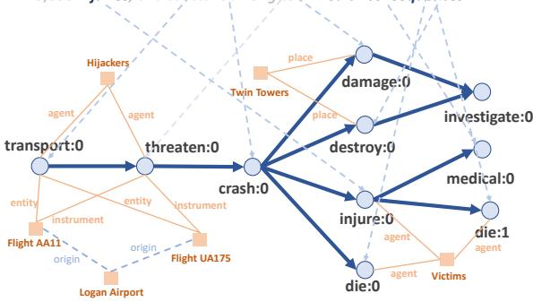
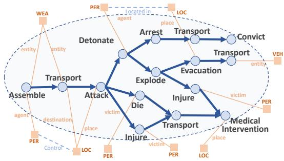
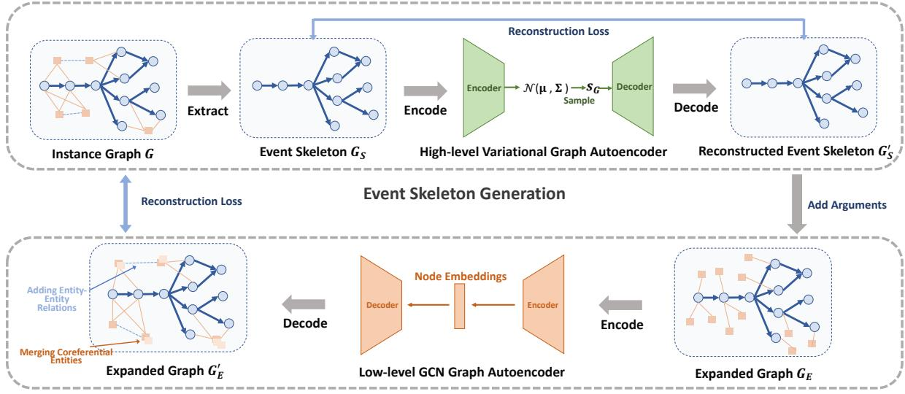
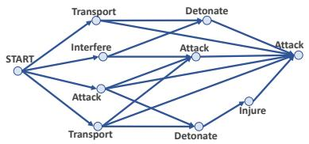
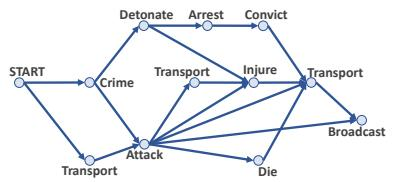
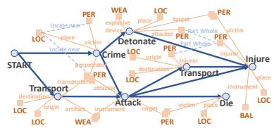
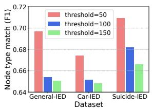
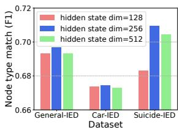

# Event Schema Induction with Double Graph Autoencoders

Xiaomeng Jin, Manling Li, Heng Ji University of Illinois Urbana-Champaign {xjin17, manling2, hengji}@illinois.edu

## Abstract

Event schema depicts the typical structure of complex events, serving as a scaffolding to effectively analyze, predict, and possibly intervene in the ongoing events. To induce event schemas from historical events, previous work uses an event-by-event scheme, ignoring the global structure of the entire schema graph. We propose a new event schema induction framework using double graph autoencoders, which captures the global dependencies among nodes in event graphs. Specifically, we first extract the event skeleton from an event graph and design a variational directed acyclic graph (DAG) autoencoder to learn its global structure. Then we further fill in the event arguments for the skeleton, and use another Graph Convolutional Network (GCN) based autoencoder to reconstruct entity-entity relations as well as to detect coreferential entities. By performing this twostage induction decomposition, the model can avoid reconstructing the entire graph in one step, allowing it to focus on learning global structures between events. Experimental results on three event graph datasets demonstrate that our method achieves state-of-the-art performance and induces high-quality event schemas with global consistency. 1

## 1 Introduction

Event Schema (Chambers and Jurafsky, 2008, 2009; Balasubramanian et al., 2013; Nguyen et al., 2015; Modi et al., 2016; Li et al., 2021) is induced from historical events to describe the common or stereotypical evolution pattern of complex events. Figure 1b shows an example schema of complex event “IED-bombing” (Improvised Explosive Device), where multiple events are inter-connected via temporal links (e.g., TRANSPORT happens after AS-SEMBLE) and arguments (e.g., the transporting EN-TITY is the weapon that is being assembled; the transporting DESTINATION is controlled by the assembler, i.e., the AGENT). It enables a descriptive analysis of inter-event structures, as well as the prediction of future events over temporal-based and argument-based structures.

A number of methods have been proposed for learning event schemas from instance event graphs, called event schema induction, which fall into three categories. The set-based (Chambers, 2013; Sha et al., 2016; Huang et al., 2016) and sequence-based (Granroth-Wilding and Clark, 2016; Rudinger et al., 2015) methods treat a complex event as a set or a linear sequence of atomic events, respectively. However, they fail to capture the multi-dimensional evolution of real-world complex events, i.e., multiple events may precede or follow one event. Graph-based methods (Li et al., 2020, 2021), instead, adopt graphs to formulate event schemas. A graph model is usually learned from instance event graphs through generating the schema event by event. Although graphbased methods are theoretically superior to the first two categories, existing graph-based methods are limited to modeling only the local structure of event graphs, i.e., the first-order dependency of an event node with respect to its neighbors, while ignoring the high-order and global dependencies among atomic events in the entire graph.

However, modeling the global structure of event graphs is crucial to event schema induction. The global structure enables the model to be aware of the position of each event node in the entire graph. It allows the model to better comprehend the role of a specific event in the complex event. For example, in Figure 1b, there are three TRANSPORT events in the schema, but they differ regarding the item being transported, i.e., bombs, the injured, or suspects. The global structure context enables the model to differentiate the position of the three TRANSPORT events and predict their neighbor events precisely. Moreover, when the model only has access to local

The September 11 attacks were a series of four coordinated terroris attacks. Four commercial airliners traveling from the northeastern U.S. to California were hijacked mid-flight by 19 al-Qaeda terrorists. Each group had one hijacker who took over control of the aircraft. Their explicit goal was to crash each plane into a prominent American building, causing mass casualties and partial or complete destruction of the targeted buildings. The attacks resulted in 2,977 fatalities, over 25,000 injuries, and substantial long-term health consequences.

  
(a) Event instance graph

  
(b) Event schema graph  
Figure 1: An illustrative example of (a) an instance event graph of 9/11 Attacks extracted from a news article and (b) graph-based event schema of IED bombings. We use circles to denote events and squares to represent event arguments (entities). The solid blue arrows represent temporal links between events (i.e., event skeleton), the solid yellow lines represent argument roles between events and entities, and the dashed blue lines represent entity-entity relations.

structure information during the generation process, the schema generated may only be consistent at the local level, but not at the global level. For example, the schema may keep repeating the sequence of ASSEMBLE - TRANSPORT - ATTACK. From this perspective, the global structure information can be viewed as the supervision that guides the entire generation process to be globally consistent.

To capture the global structure information of complex events, in this paper, we propose a new event schema induction approach using double graph autoencoders. Graph Autoencoder (Salha et al., 2019; Zhang and Chen, 2018) is known to be able to preserve the structural information of an entire graph in the embedding space. Therefore, our key idea is to use graph autoencoders to capture the global dependency among nodes in event graphs.

Specifically, our model contains two graph autoencoders that are organized in a hierarchical manner: (1) To model the skeleton of an event graph, we design a high-level variational graph autoencoder for directed acyclic graphs (DAGs). Event skeleton is a subgraph of an event graph, which consists of salient events and their temporal orders, representing the fundamental structure of event evolution. (2) With the event skeleton as the global context, we decorate entity nodes in the skeleton by introducing a low-level graph autoencoder based on Graph Convolutional Network (GCN). It takes as input an expanded event skeleton and reconstructs the original event graph by adding coreferential entities and entity-entity relations.

These two graph autoencoders decompose the process of event schema induction into two steps, thereby avoiding the need to reconstruct the entire graph directly, and improving the schema learning efficiently at both the high level (event schema skeleton) and the lower level (entity-entity relations).

We conduct extensive experiments on three event graph datasets. The experimental results demonstrate that our proposed method achieves state-ofthe-art performance on event schema induction. Additionally, we show in a case study that the event schema generated by our method is more reasonable and globally consistent.

We make the following novel contributions:

• We propose a two-stage global structure aware schema induction framework, providing a global context of event skeleton to determine inter-event interactions via arguments.

• We introduce a double graph autoencoder that preserves the global structural information, allowing the model to capture high-order dependencies between nodes.

• We propose a comprehensive set of metrics for structure-aware comparison between schema graphs and instance graphs.

• Our method significantly outperforms baselines, demonstrating the effectiveness of considering global structure context in event schema induction.

## 2 Problem Formulation

Our data resources come from news and Wikipedia articles that describe a series of complex events.

  
Entity-Entity Relation Completion  
Figure 2: The architecture of our model.

We extract events, entities, as well as their relations using Information Extraction (IE) tools (Wu et al., 2008; Li et al., 2011; Hogenboom et al., 2013; Lin et al., 2020), then construct instance event graphs. An instance event graph consists of two types of nodes: event nodes and entity nodes, and we use $t _ { i }$ to represent the type of node i. Similarly, we use $t _ { i j }$ to denote the edge type between node i and node j. Accordingly, there are three types of edges in an instance graph: (1) the event-event temporal link $( i , j )$ , which represents a temporal order that event j happens after event i, with $t _ { i }$ and $t _ { j }$ indicating their event types, such as TRANSPORT; (2) the event-entity argument link $( i , a , m )$ , which represents that event i has an argument entity m, which plays the argument role $t _ { i m } = a$ , such as AGENT; (3) the entity-entity relation $( m , r , n )$ , which represents that there is a relation $t _ { m n } = r$ between entity m and entity n, such as AFFILIATION.

Given a set of instance graphs $\{ G _ { 1 } , G _ { 2 } , \cdots \}$ that belong to the same topic, our goal is to learn a schema S that summarizes the instance graphs and represents their underlying common evolution pattern. Note that different from instance graphs, nodes (events and entities) in the schema S are not instantiated but represented by their types.

## 3 Our Approach

## 3.1 Overview

We design two graph autoencoders, where the first autoencoder deals with the high-level skeleton of an event graph and the second autoencoder focuses on the low-level arguments of an event graph.

As shown in the upper side of Figure 2, the highlevel autoencoder, which is specially designed for directed acyclic graphs (DAGs), takes an instance event skeleton as input, and encodes the event skeleton as a probability distribution in the embedding space. Then it reconstructs the input skeleton by feeding a vector sampled from the distribution into the decoder.

After the event skeleton is reconstructed, we decorate the entity nodes according to the pre-defined argument roles of each event (as shown on the right side of Figure 2). However, the entity-entity relations and coreference links among arguments are still missing in the expanded event skeleton. Therefore we introduce a low-level graph autoencoder to take as input an expanded event skeleton and reconstruct the original event graph (as shown in the lower part of Figure 2). The low-level graph autoencoder employs Graph Convolutional Network (GCN) to encode each node into an embedding vector, then predicts the type of an entity-entity relation based on the learned entity embeddings.

## 3.2 Event Skeleton Generation

An instance event graph can contain up to hundreds of nodes, but the majority are entity nodes that are associated with event nodes. Therefore, as shown in the upper left of Figure 2, our first step is to extract the event skeleton $G _ { S }$ from the instance graph G, which serves as the backbone of G.

For a given instance event graph G, we use a graph neural network (GNN) based variational autoencoder to process its event skeleton $G _ { S } \subseteq G$ Traditional GNNs learn the node representations by aggregating information from their neighbors iteratively, then apply a readout function to all node representations and output the representation of the entire graph (Xu et al., 2019). However, off-theshelf GNNs are not suitable for modeling event skeleton, because event skeleton is a DAG whose nodes follow an intrinsic partial order, whereas existing GNN models focus more on capturing the local structure of a graph.

Encoding. To capture the global structure of event skeleton $G _ { S } .$ , inspired by Zhang et al. (2019), we design a new GNN architecture for the encoder, in which messages can only pass forward following event-event temporal orders. Specifically, for a given event node i in the event skeleton $G _ { S }$ , its representation $\mathbf { s } _ { i }$ is computed by:

$$
\mathbf { s } _ { i } = \operatorname { A G G } \left( \{ \mathbf { s } _ { j } \mid ( j , i ) \in G _ { S } \} \cup \mathbf { t } _ { i } \right) ,\tag{1}
$$

where $\mathbf { t } _ { i }$ is the one-hot event type vector of an event node $i ,$ and we use it as the initial feature for the event. $\mathrm { A G G } ( \cdot )$ is the aggregate function. In Eq. (1), we only consider predecessors as neighbors, allowing the model to capture the temporal flow of the event graph. Considering that predecessors contribute differently to predicting the current event node, we utilize a self-attention function as the aggregate function to characterize the importance of different predecessors:

$$
\mathbf { s } _ { i } = \sigma \bigg ( \mathbf { W } _ { 1 } \sum _ { j : ( j , i ) \in G _ { E } } \mathrm { S o f t M a x } \left( \alpha _ { i j } \right) \mathbf { s } _ { j } + \mathbf { W } _ { 2 } \mathbf { t } _ { i } \bigg ) ,\tag{2}
$$

where $\alpha _ { i j } = \mathrm { L e a k y R e L U } \Big ( \mathbf { w } ^ { \top } \big [ \mathbf { W } _ { 1 } \mathbf { s } _ { j } , \mathbf { W } _ { 2 } \mathbf { t } _ { i } \big ] \Big )$ is (unnormalized) attention weight, w is a learnable vector, $\mathbf { W } _ { 1 }$ and $\mathbf { W } _ { 2 }$ are learnable matrices, $[ \cdot , \cdot ]$ denotes concatenate operation, and $\sigma ( \cdot )$ is a nonlinear activation function.

It is worth noting that according to Eq. (1), $\mathbf { s } _ { i }$ can only be computed after its predecessors’ representations have been computed, which implies that the encoder computation sequence naturally follows the topological order of the event skeleton. Specifically, we first create a dummy event node START that has an outgoing link to each event node that has no predecessor, and a dummy event node END with an incoming link from each event node that has no successor. Then we compute the representations of all event nodes according to their topological order. Finally, the representation of END, i.e., sEND, is taken as the output of the encoder.

Algorithm 1: Event Skeleton Generation   
Input: Graph embedding sEND for $G _ { S }$ output by the   
encoder   
Output: Reconstructed event skeleton $G _ { S } ^ { \prime }$   
1 ${ \cal G } _ { S } ^ { \prime } \dot { }  \emptyset ;$   
2 $\mu \mathop { \sim } ^ { \sim } \mathrm { M L P } _ { \mu } ( \mathbf { s } _ { \scriptscriptstyle \mathrm { E N D } } ) , \Sigma \gets \mathrm { M L P } _ { \sigma } ( \mathbf { s } _ { \scriptscriptstyle \mathrm { E N D } } ) ;$   
3 Sample the global graph representation:   
$\mathbf { s } _ { G } \mathbf { \hat { \sigma } } \sim \mathcal { N } ( \bar { \pmb { \mu } } , \pmb { \Sigma } ) ;$   
4 Initialize the state of the generated graph as zero:   
$\mathbf { g }  \mathbf { 0 } ;$   
5 while True do   
$/ /$ Generate a new event i   
6 Sample the type for the generated new event i:   
$t _ { i } \stackrel { \mathrm { ~ \tiny ~ . ~ } } { \sim } \mathrm { M L P } _ { n o d e \_ t y p e } \big ( \big [ \mathbf { s } _ { G } , \mathbf { g } \big ] \big ) ;$   
7 Add event node i with type $t _ { i }$ into $G _ { S } ^ { \prime } ;$   
8 if $t _ { i } = \mathrm { E N D }$ then   
9 Add edge (j, i) to $G _ { S } ^ { \prime }$ for every $j \in G _ { S } ^ { \prime } \backslash i \mathrm { i t }$   
j has no successor;   
10 break;   
11 else   
12 for $j \in G _ { S } ^ { \prime } \backslash i$ do   
13 $p _ { i j } \gets \mathrm { \ " M L P } _ { e d g e \_ p r o b } ( [ \mathbf { t } _ { i } , \mathbf { s } _ { j } ] ) ;$   
14 $\bar { \mathbf { i f } } \ p _ { i j } > 0 . 5$ then   
15 Add edge $( j , i )$ into $G _ { S } ^ { \prime } ;$   
16 Compute $\mathbf { s } _ { i }$ according to Eq. (2);   
17 Update the state of the generated graph:   
g  si;   
18 return $G _ { S } ^ { \prime }$

Decoding. The decoder follows a GNN architecture similar to the encoder, as presented in Algorithm 1. The input is the encoder output sEND for $G _ { S } ,$ and our goal is to reconstruct the skeleton graph $G _ { S } ^ { \prime } .$ . Specifically, we first obtain the posterior approximation $p ( \cdot | G _ { S } )$ by calculating the mean vector $\pmb { \mu }$ and the diagonal covariance matrix Σ via two Multi-Layer Perceptrons (MLPs) (line 2). Then we sample a vector $\mathbf { s } _ { G }$ from the Gaussian distribution $\scriptstyle { \mathcal { N } } ( \mu , \Sigma )$ as the global representation of the skeleton graph, which will be used throughout the following generation process (line 3). The representation of the generated graph $\mathbf { g }$ is initialized as an all-zero vector (line 4).

Next, the decoder generates a DAG node by node (line 5-17). When generating a new event node i, the decoder computes the event type distribution for node i to obtain a sampled type $t _ { i }$ (line 6). The distribution is learned based on the concatenation of $\mathbf { s } _ { G }$ and $\mathbf { g } ,$ summarizing the input skeleton graph and the generated graph. Based on the value of $t _ { i } ,$ the decoder performs one of the following two steps:

• If the generated event node i is END, then the decoder will stop the generation procedure, and connect all nodes that do not have any predecessor to the END node (line 8-10).

• Otherwise, the decoder uses another MLP to predict the edge probability of node i with existing nodes, and add the generated edges into the graph (line 12-15). After the generation step for node i is completed, the decoder then computes the representation $\mathbf { s } _ { i }$ for node i according to Eq. (2) (line 16), and updates the generated graph representation g by $\mathbf { s } _ { i }$ (line 17). The updated g will be further used to generate a new node for the next iteration.

Different from existing event schema induction methods that are only able to model the local structural information of event graphs, our method encodes the global information of an event graph as the global graph representation $\mathbf { s } _ { G }$ , and further applies this global state to guide the entire generation process. This enables our model to fully capture the structural information of event graphs, which has been shown to be extremely important for event schema induction.

## 3.3 Entity-Entity Relation Completion

After generating the event skeleton, we aim to complete the generated event schema graph by adding back entities as well as edges associated with these entities. We take advantage of the event ontology, where each event has a predefined set of argument roles. For example, an ATTACK event has an AT-TACKER argument role whose type can be PERSON (PER), as well as a TARGET argument role whose type can be LOCATION (LOC). Therefore, we first expand the event skeleton by adding the predefined event arguments back to each event, as shown in the right of Figure 2. Yet, such an expanded event skeleton $G _ { E }$ is not the final event schema, because: (1) entity-entity relations are missing, e.g., the LO-CATED\_IN relation between a PER entity and a LOC entity in Figure 1b; (2) entities in $G _ { E }$ can be coreferential, which require to be merged. For example, in Figure 1b, the DESTINATION of the TRANSPORT event is also the PLACE where the ATTACK event happens.

We formulate the above two cases as a unified entity-entity edge missing problem, by treating coreference as a special type of entity-entity relation between unmerged nodes. To predict missing entity-entity relations, we design a low-level graph autoencoder. It reads the expanded event skeleton $G _ { E }$ as input, and then reconstructs the original event graph G by adding entity-entity relations back, as shown in the lower part of Figure 2. During the inference stage, the learned graph autoencoder can therefore take a generated event skeleton as input, and output a comprehensive event schema graph.

Encoding. Different from the high-level autoencoder whose purpose is to generate event skeleton, the low-level autoencoder is to reconstruct the relations between entities, therefore, the lowlevel graph autoencoder is expected to be nonprobabilistic, and therefore we adopt Graph Convolutional Networks (GCN) (Kipf and Welling, 2017) as our encoder. Let $\mathbf { s } _ { i } ^ { k }$ denote the representation at iteration k for the node $i \in G _ { E }$ , which can be either an event or an entity. The encoder updates node representations iteratively for $k = 1 , \cdots , K$ where $K$ is the layer number of the GCN encoder:

$$
\mathbf { s } _ { i } ^ { k } = \sigma \Big ( \mathbf { W } ^ { k } \sum _ { j \in \mathcal { N } ( i ) \cup \{ i \} } \alpha _ { i j } \mathbf { s } _ { j } ^ { k - 1 } \Big ) .\tag{3}
$$

Here $\mathcal { N } ( \cdot )$ denotes the set of neighbors of node $i , \alpha _ { i j } = 1 / \sqrt { | \mathcal { N } ( i ) | \cdot | \mathcal { N } ( j ) | }$ $\mathbf { W } ^ { \breve { k } }$ is a learnable matrix, and σ is an activation function. $\mathbf { s } _ { i } ^ { 0 }$ is initialized as the one-hot type vector of node $i ,$ i.e., $\mathbf { s } _ { i } ^ { 0 } = \mathbf { t } _ { i }$ . All edges in $G _ { E }$ , including event-event temporal links and event-entity argument links, are treated as undirected when counting neighbors, due to our focus on the local graph structure. The encoder output is the final representation $\mathbf { s } _ { i } ^ { K }$ of node $i \in G _ { E }$

Decoding. The decoder takes as input the final node representations $\mathbf { s } _ { i } ^ { K }$ from the encoder, and reconstructs entity-entity relations in the original event graph G. The entity-entity relation can be one of the following three cases: no relation, coreference, or predefined entity-entity relation types in the ontology. Therefore, we create two new relation types NO-RELATION and CO-REFERENCE, and add them into the original set of entity-entity relations as the prediction target. Specifically, the decoder predicts the relation type $t _ { i j }$ of two given entities i and j by a MLP:

$$
\begin{array} { r } { \hat { t } _ { i j } = \mathrm { M L P } _ { e n t i t y \_ r e l } \big ( [ \mathbf { s } _ { i } ^ { K } , \mathbf { s } _ { j } ^ { K } ] \big ) , } \end{array}\tag{4}
$$

where $\hat { t } _ { i j }$ denotes the predicted relation type. It is noteworthy that NO-RELATION dominates the prediction targets, making the classification problem highly unbalanced. To address this issue, we divide the task into two steps: predicting the existence of edges and then predicting the type of a known edge, to optimize the learning effectiveness.

## 3.4 Training and Generation

Training. The training objective for the high-level variational graph autoencoder consists of a reconstruction loss and a regularization loss:

$$
{ \cal L } _ { h i g h } = \mathrm { D i s t } ( G _ { S } , G _ { S } ^ { \prime } ) + \mathrm { K L } \big ( { \mathcal { N } } ( { \pmb \mu } , { \pmb \Sigma } ) , { \mathcal { N } } ( { \bf 0 } , { \bf 1 } ) \big ) ,\tag{5}
$$

where the first term Dist $( G _ { S } , G _ { S } ^ { \prime } )$ measures the distance between the input event skeleton $G _ { S }$ and the reconstructed event skeleton $G _ { S } ^ { \prime }$ . We sum up the negative log-likelihood of each decoding step by forcing them to generate the ground truth event type or edge at each step. The second term KL $\left( \mathcal { N } ( \pmb { \mu } , \pmb { \Sigma } ) , \mathcal { N } ( \mathbf { 0 } , \mathbf { 1 } ) \right)$ forces the distribution output by the encoder to be close to the standard Gaussian distribution, to ensure a smooth embedding space.

The loss function for the low-level GCN graph autoencoder is the cross-entropy loss between predicted and ground-truth entity-entity relations:

$$
L _ { l o w } = \sum _ { \mathrm { e v e n t } i , j } \mathrm { C E L o s s } ( \hat { t } _ { i j } , t _ { i j } ) .\tag{6}
$$

Schema Generation. We are able to generate the event schema by decoding the trained model. We first sample a global graph representation from $\mathcal { N } ( \mathbf { 0 } , \mathbf { 1 } )$ in the embedding space of the high-level variational graph autoencoder. It is then fed into the decoder to generate a schema skeleton with event nodes only. Afterwards, the skeleton is further fed into the low-level graph autoencoder to predict coreferential entities and entity-entity relations.

## 4 Experiments

## 4.1 Datasets

We conduct experiments in the scenario of IED bombings following the state-of-the-art graphbased schema induction literature (Li et al., 2021). Specifically, three subtypes of complex events for IED are considered, including General IED, Car bombing IED, and Suicide IED. To construct the dataset, we select a set of Wikipedia articles related to IED bombings and identify the references in each Wikipedia article, then collect news articles from those references 2. We use RESIN (Wen et al.,

2021; Du et al., 2022), a state-of-the-art IE system, to extract event mentions, relations, and entity mentions from these news articles, and perform entity coreference resolution. We also do human curation to correct obviously erroneous event-event links (e.g., a temporal link indicating that an INJURE event happens after a DIE event for one person). The statistics of these three datasets are summarized in Table 1.

## 4.2 Baselines

We compare our proposed method with graph schema induction baselines:

(1) Temporal Event Graph Model (TEGM) (Li et al., 2021). It is the state-of-the-art graph schema induction model, which generates the entire event graph using an auto-regressive graph generation model. We compare with it to explore the effectiveness of the two-stage framework that generates event skeleton first and provides a global context for argument generation.

(2) Frequency-Based Sampling (FBS). To examine the effectiveness of our graph autoencoder to generate event skeleton, we compare with a frequency-based baseline. It constructs the event schema based on the frequency of event-event temporal links in the training data. Specifically, for each possible pair of event types $( t , t ^ { \prime } )$ , we compute the number of edges in training graphs whose two associated events exactly have type t and $t ^ { \prime } .$ After that, we construct a schema graph in which each node corresponds to one event type, and there is no edge in the schema graph initially. Then at each timestamp, we sample one pair of event types according to their frequency, and add this sampled edge into the schema graph. The procedure is repeated until we detect a cycle in the schema graph after adding a new edge.

## 4.3 Experimental Setup

Evaluation Metrics. For a given dataset, we first train our model on the training instance graphs, then generate the event schema according to the steps presented in Section 3.4. To evaluate the quality of the generated schema, we compare the schema with test instance graphs in terms of the following metrics, to see how the schema captures the structure information of test instance graphs:

(1) Event type match. We compute the set of event types in the generated schema graph, as well as the set of event types in one test instance graph, then we compute how similar these two sets are by calculating the F1 score between the two sets.

<table><tr><td>Datasets</td><td>General-IED</td><td>Car-IED</td><td>Suicide-IED</td></tr><tr><td># train/val/test instance graphs</td><td>88 / 11 / 12</td><td>75 / 9 / 10</td><td>176 / 22 / 22</td></tr><tr><td>Avg # e/v nodes per graph</td><td>90.8 / 251.5</td><td>146.5 / 421.3</td><td>117.4/381.7</td></tr><tr><td>Avg # ee/ev/vv links per graph</td><td>212.6 / 278.5 / 230.5</td><td>345.7 / 457.7 / 397.0</td><td>246.2 / 403.5 / 373.7</td></tr></table>

Table 1: Statistics of the three datasets. “e” and “v” are short for “event” and “entity”, respectively.
<table><tr><td rowspan="2">Datasets</td><td rowspan="2">Methods</td><td rowspan="2">Event type match (F1)</td><td colspan="2">Event seq match (F1)</td><td colspan="2">KL divergence</td><td colspan="2">MCS</td></tr><tr><td>l = 2</td><td>l = 3</td><td>Node type</td><td>Edge type</td><td># nodes</td><td># edges</td></tr><tr><td rowspan="3">General-IED</td><td>TEGM</td><td>0.638</td><td>0.181</td><td>0.065</td><td>1.72</td><td>6.11</td><td>6.40</td><td>5.40</td></tr><tr><td>FBS</td><td>0.617</td><td>0.149</td><td>0.064</td><td>1.88</td><td>4.32</td><td>1.65</td><td>0.67</td></tr><tr><td>DoubleGAE</td><td>0.697</td><td>0.273</td><td>0.128</td><td>1.66</td><td>4.96</td><td>16.37</td><td>15.63</td></tr><tr><td rowspan="3">Car-IED</td><td>TEGM</td><td>0.588</td><td>0.162</td><td>0.044</td><td>2.92</td><td>6.60</td><td>5.67</td><td>4.78</td></tr><tr><td>FBS</td><td>0.542</td><td>0.126</td><td>0.038</td><td>4.12</td><td>6.37</td><td>1.74</td><td>0.72</td></tr><tr><td>DoubleGAE</td><td>0.674</td><td>0.259</td><td>0.081</td><td>2.14</td><td>5.42</td><td>10.98</td><td>10.33</td></tr><tr><td rowspan="3">Suicide-IED</td><td>TEGM</td><td>0.609</td><td>0.174</td><td>0.048</td><td>2.39</td><td>6.36</td><td>5.92</td><td>5.00</td></tr><tr><td>FBS</td><td>0.642</td><td>0.164</td><td>0.036</td><td>2.75</td><td>5.16</td><td>1.67</td><td>0.75</td></tr><tr><td>DoubleGAE</td><td>0.709</td><td>0.290</td><td>0.095</td><td>1.76</td><td>5.91</td><td>6.19</td><td>5.28</td></tr></table>

Table 2: The result of similarity measurement between the generated schema and test instance graphs. The best results for each dataset are highlighted in bold.

(2) Event sequence match. We collect all event sequences with a length of 2 or 3 from the generated schema graph and one test instance graph, respectively, and compute the F1 score between these two multi-sets.

(3) Node/edge type distribution. We compute the node type distribution and edge type distribution of the generated schema and one test instance graph, respectively, then compute the KL divergence between the node/edge type distributions of the schema and each test instance graph.

(4) Maximum common subgraph (MCS). A maximum common subgraph of two graphs is an induced subgraph of both graphs, and that has as many nodes as possible. The size of the maximum common subgraph can reflect the global structure similarity between two graphs. Therefore, we compute the number of nodes and edges of the maximum common subgraph between the schema and each test instance graph.

Note that the last two metrics, i.e., node/edge type distribution and maximum common subgraph, are new metrics proposed by us. We compute the above metrics between the schema and each test instance graph, then report the average values on all test instance graphs.

Hyperparameter Settings. For the high-level variational autoencoder, the dimension size of node hidden state is 256, and the dimension size of the Gaussian distribution is 56. The learning rate is 10−5, and the number of training epochs is 700.

For the low-level GCN autoencoder, we use a twolayer GCN as the encoder, whose dimension sizes of hidden layers are 256 and 64, respectively. The learning rate is 10−5, and the number of training epochs is 500. We investigate how the size of training instance graphs and the dimension of hidden node state influence the model performance, with results shown in Appendix A.

## 4.4 Results

Comparison with baselines. All methods are evaluated on the same test set. Our method achieves the best performance on both original and revised datasets. We only show results on the revised dataset since it is cleaner and the induced schema is more reasonable. In Table 2, our method DoubleGAE achieves significant gains compared with baselines on event type, event sequence matching, and maximum common subgraph matching. It demonstrates that capturing the global node dependency in event graphs is essential to event schema induction. In contrast, Temporal Event Graph Model (TEGM) does not consider global graph structure, thus has a large performance gap compared to our model. It is worth noticing that Frequency-Based Sampling (FBS) is a competitive baseline according to the experimental result, especially when measured by KL divergence of edge type distribution. This is because FBS constructs an event schema exactly based on the frequency of edges in the training instance graphs.

Case study. We plot the schema skeleton generated by Temporal Event Graph Model (TEGM)

  
(a) A snippet of schema skeleton generated by TEGM

  
(b) A snippet of schema skeleton generated by DoubleGAE

  
(c) A snippet of complete event schema output by DoubleGAE  
Figure 3: Case study on the generated event schema skeleton and full event schema.

and our model (DoubleGAE) in Figure 3. In Figure 3a, there is a recurrence of certain local structures of events within the schema. e.g., TRANSPORT-ATTACK and ATTACK-ATTACK. This demonstrates that TEGM is able to successfully capture and memorize the local structure information of event graphs. However, such learned local structures may not always be reasonable, since an ATTACK event is not likely to repeat immediately after another ATTACK multiple times. In addition, TEGM may not be able to learn the correct position of an event in the entire schema, for example, the INTERFERE event happens at the very beginning of the schema. The result indicates that TEGM fails to maintain global consistency when generating schemas. In contrast, there are no consecutively repeated events in the schema induced by our model, and the entire schema is more logically meaningful in both local and global levels.

We also present the complete schema output of our model after filling in event arguments and entity-entity relations in Figure 3c. As we can see, our model successfully identifies coreferential entities, e.g., the transporter of TRANSPORT, the perpetrator of CRIME, and the attacker of ATTACK belong to one entity. Our model is also able to add entity-entity relations between event arguments, for example, the victim of a CRIME event is “located near” the place where this CRIME event happens.

## 5 Related Work

Existing event schema induction methods can be classified into three categories: set-based schema, sequence-based schema, and graph-based schema.

The set-based methods represent event triggers by a set without modeling their inter-relations (Chambers, 2013; Cheung et al., 2013; Nguyen et al., 2015; Sha et al., 2016; Huang et al., 2016; Yuan et al., 2018; Huang and Ji, 2020; Shen et al., 2021; Zeng et al., 2021), which can be regarded as atomic schema induction. In contrast, we aim to induce schemas for complex events involving

multiple events.

Another line of work focuses on the sequencebased methods, which takes event-event relations into account, and orders event structures into sequences (Chambers and Jurafsky, 2008, 2009; Rudinger et al., 2015; Granroth-Wilding and Clark, 2016; Pichotta and Mooney, 2016; Modi, 2016; Weber et al., 2018, 2020a). Instead of representing events as structures, some work treats events as natural language steps and induces schema knowledge through story ending prediction (Mostafazadeh et al., 2016; Weber et al., 2020b; Kwon et al., 2020), machine reading comprehension (Ostermann et al., 2018, 2019), and schema goal-step prediction (Zhang et al., 2020; Yang et al., 2021). Instead of ignoring event structures or organizing events as simple sequences, we aim to capture the multi-dimensional evolution of events, as well as the structured connections.

As a further step, researchers propose to use graphs to represent schemas (Wanzare et al., 2016; Modi et al., 2016; Li et al., 2020, 2021), where each event can be followed by multiple alternative outcomes. Li et al. (2021) introduce the concept of “complex event schema”, a comprehensive graph schema consisting of both temporal orders and multi-hop argument relations, allowing time-, location-, and argument-based tracking of events. However, it adopts an auto-regressive graph generation model, which only models the first-order dependency of an event node with respect to its neighbors. In contrast, we propose to encode a global graph context via event skeleton generation using double auto-encoders.

## 6 Conclusion and Future Work

In this work, we propose a novel event schema induction framework using double graph autoencoders, i.e., a high-level variational graph autoencoder to learn the event skeleton, followed by a low-level GCN graph autoencoder to reconstruct entity-entity relations. Our autoencoders are able to preserve the global structural information of event graphs, thus capturing the multi-dimensional evolution of complex events, and providing global context to consolidate argument relations. Experiments demonstrate that our method significantly outperforms baselines by generating high-quality and globally consistent event schemas.

In the future, we aim to effectively induce schemas from graphs of different sizes, especially extremely large graphs. We also plan to make use of event hierarchies and induce hierarchical schemas with optimal event type granularity.

## Acknowledgement

We thank the anonymous reviewers helpful suggestions. This research is based upon work supported by U.S. DARPA KAIROS Program No. FA8750- 19-2-1004. The views and conclusions contained herein are those of the authors and should not be interpreted as necessarily representing the official policies, either expressed or implied, of DARPA, or the U.S. Government. The U.S. Government is authorized to reproduce and distribute reprints for governmental purposes notwithstanding any copyright annotation therein.

## References

Niranjan Balasubramanian, Stephen Soderland, Mausam, and Oren Etzioni. 2013. Generating coherent event schemas at scale. In Proceedings of the 2013 Conference on Empirical Methods in Natural Language Processing, pages 1721–1731, Seattle, Washington, USA. Association for Computational Linguistics.

Nathanael Chambers. 2013. Event schema induction with a probabilistic entity-driven model. In Proceedings ofthe 2013 Conference on Empirical Methods in Natural Language Processing, pages 1797–1807, Seattle, Washington, USA. Association for Computational Linguistics.

Nathanael Chambers and Dan Jurafsky. 2008. Unsupervised learning of narrative event chains. In Proceedings of ACL-08: HLT, pages 789–797, Columbus, Ohio. Association for Computational Linguistics.

Nathanael Chambers and Dan Jurafsky. 2009. Unsupervised learning of narrative schemas and their participants. In Proceedings of the Joint Conference ofthe 47th Annual Meeting ofthe ACL and the 4th International Joint Conference on Natural Language Processing of the AFNLP, pages 602–610, Suntec, Singapore. Association for Computational Linguistics.

Jackie Chi Kit Cheung, Hoifung Poon, and Lucy Vanderwende. 2013. Probabilistic frame induction. In Proceedings of the 2013 Conference of the North American Chapter ofthe Association for Computational Linguistics: Human Language Technologies, pages 837–846, Atlanta, Georgia. Association for Computational Linguistics.

Xinya Du, Zixuan Zhang, Sha Li, Pengfei Yu, Hongwei Wang, Tuan Manh Lai, Xudong Lin, Ziqi Wang, Iris Liu, Ben Zhou, Haoyang Wen, Manling Li, Darryl Hannan, Qi Zeng, Qing Lyu, Charles Yu, Carl Edwards, Xiaomeng Jin, Yizhu Jiao, Ghazaleh Kazeminejad, Rotem Dror, Zhenhailong Wang, Chris Callison-Burch, Mohit Bansal, Carl Vondrick, Jiawei Han, Dan Roth, Shih-Fu Chang, Martha Palmer, and Heng Ji. 2022. Resin-11: Schema-guided event prediction for 11 newsworthy scenarios. In Proc. 2022 Annual Conference of the North American Chapter ofthe Associationfor Computational Linguistics (NAACL2022) System Demonstration Track.

Mark Granroth-Wilding and Stephen Clark. 2016. What happens next? event prediction using a compositional neural network model. In Proceedings ofthe Thirtieth AAAI Conference on Artificial Intelligence, February 12-17, 2016, Phoenix, Arizona, USA, pages 2727–2733. AAAI Press.

Alexander Hogenboom, Frederik Hogenboom, Flavius Frasincar, Kim Schouten, and Otto Van Der Meer. 2013. Semantics-based information extraction for detecting economic events. Multimedia Tools and Applications, 64(1):27–52.

Lifu Huang, Taylor Cassidy, Xiaocheng Feng, Heng Ji, Clare R. Voss, Jiawei Han, and Avirup Sil. 2016. Liberal event extraction and event schema induction. In Proceedings of the 54th Annual Meeting of the Associationfor Computational Linguistics (Volume 1: Long Papers), pages 258–268, Berlin, Germany. Association for Computational Linguistics.

Lifu Huang and Heng Ji. 2020. Semi-supervised new event type induction and event detection. In Proceedings ofthe 2020 Conference on Empirical Methods in Natural Language Processing (EMNLP), pages 718–724, Online. Association for Computational Linguistics.

Thomas N. Kipf and Max Welling. 2017. Semisupervised classification with graph convolutional networks. In 5th International Conference on Learning Representations, ICLR 2017, Toulon, France, April 24-26, 2017, Conference Track Proceedings. OpenReview.net.

Heeyoung Kwon, Mahnaz Koupaee, Pratyush Singh, Gargi Sawhney, Anmol Shukla, Keerthi Kumar Kallur, Nathanael Chambers, and Niranjan Balasubramanian. 2020. Modeling preconditions in text with a crowd-sourced dataset. In Findings of the Association for Computational Linguistics: EMNLP 2020, pages 3818–3828, Online. Association for Computational Linguistics.

Manling Li, Sha Li, Zhenhailong Wang, Lifu Huang, Kyunghyun Cho, Heng Ji, Jiawei Han, and Clare Voss. 2021. Future is not one-dimensional: Graph modeling based complex event schema induction for event prediction. ArXiv preprint, abs/2104.06344.

Manling Li, Qi Zeng, Ying Lin, Kyunghyun Cho, Heng Ji, Jonathan May, Nathanael Chambers, and Clare Voss. 2020. Connecting the dots: Event graph schema induction with path language modeling. In Proceedings of the 2020 Conference on Empirical Methods in Natural Language Processing (EMNLP), pages 684–695, Online. Association for Computational Linguistics.

Qi Li, Sam Anzaroot, Wen-Pin Lin, Xiang Li, and Heng Ji. 2011. Joint inference for cross-document information extraction. In Proceedings of the 20th ACM Conference on Information and Knowledge Management, CIKM 2011, Glasgow, United Kingdom, October 24-28, 2011, pages 2225–2228. ACM.

Ying Lin, Heng Ji, Fei Huang, and Lingfei Wu. 2020. A joint neural model for information extraction with global features. In Proceedings of the 58th Annual Meeting of the Association for Computational Linguistics, pages 7999–8009, Online. Association for Computational Linguistics.

Ashutosh Modi. 2016. Event embeddings for semantic script modeling. In Proceedings of The 20th SIGNLL Conference on Computational Natural Language Learning, pages 75–83, Berlin, Germany. Association for Computational Linguistics.

Ashutosh Modi, Tatjana Anikina, Simon Ostermann, and Manfred Pinkal. 2016. InScript: Narrative texts annotated with script information. In Proceedings of the Tenth International Conference on Language Resources and Evaluation (LREC’16), pages 3485– 3493, Portorož, Slovenia. European Language Resources Association (ELRA).

Nasrin Mostafazadeh, Nathanael Chambers, Xiaodong He, Devi Parikh, Dhruv Batra, Lucy Vanderwende, Pushmeet Kohli, and James Allen. 2016. A corpus and cloze evaluation for deeper understanding of commonsense stories. In Proceedings of the 2016 Conference of the North American Chapter of the Associationfor Computational Linguistics: Human Language Technologies, pages 839–849, San Diego, California. Association for Computational Linguistics.

Kiem-Hieu Nguyen, Xavier Tannier, Olivier Ferret, and Romaric Besançon. 2015. Generative event schema induction with entity disambiguation. In Proceedings of the 53rd Annual Meeting of the Association for Computational Linguistics and the 7th International Joint Conference on Natural Language Processing (Volume 1: Long Papers), pages 188–197, Beijing, China. Association for Computational Linguistics.

Simon Ostermann, Ashutosh Modi, Michael Roth, Stefan Thater, and Manfred Pinkal. 2018. MCScript:

A novel dataset for assessing machine comprehension using script knowledge. In Proceedings of the Eleventh International Conference on Language Resources and Evaluation (LREC 2018), Miyazaki, Japan. European Language Resources Association (ELRA).

Simon Ostermann, Michael Roth, and Manfred Pinkal. 2019. MCScript2.0: A machine comprehension corpus focused on script events and participants. In Proceedings ofthe Eighth Joint Conference on Lexical and Computational Semantics (\*SEM 2019), pages 103–117, Minneapolis, Minnesota. Association for Computational Linguistics.

Karl Pichotta and Raymond J. Mooney. 2016. Learning statistical scripts with LSTM recurrent neural networks. In Proceedings ofthe Thirtieth AAAI Conference on Artificial Intelligence, February 12-17, 2016, Phoenix, Arizona, USA, pages 2800–2806. AAAI Press.

Rachel Rudinger, Pushpendre Rastogi, Francis Ferraro, and Benjamin Van Durme. 2015. Script induction as language modeling. In Proceedings ofthe 2015 Conference on Empirical Methods in Natural Language Processing, pages 1681–1686, Lisbon, Portugal. Association for Computational Linguistics.

Guillaume Salha, Stratis Limnios, Romain Hennequin, Viet-Anh Tran, and Michalis Vazirgiannis. 2019. Gravity-inspired graph autoencoders for directed link prediction. In Proceedings of the 28th ACM International Conference on Information and Knowledge Management, CIKM 2019, Beijing, China, November 3-7, 2019, pages 589–598. ACM.

Lei Sha, Sujian Li, Baobao Chang, and Zhifang Sui. 2016. Joint learning templates and slots for event schema induction. In Proceedings ofthe 2016 Conference ofthe North American Chapter ofthe Associationfor Computational Linguistics: Human Language Technologies, pages 428–434, San Diego, California. Association for Computational Linguistics.

Jiaming Shen, Yunyi Zhang, Heng Ji, and Jiawei Han. 2021. Corpus-based open-domain event type induction. ArXiv preprint, abs/2109.03322.

Lilian D. A. Wanzare, Alessandra Zarcone, Stefan Thater, and Manfred Pinkal. 2016. A crowdsourced database of event sequence descriptions for the acquisition of high-quality script knowledge. In Proceedings of the Tenth International Conference on Language Resources and Evaluation (LREC’16), pages 3494–3501, Portorož, Slovenia. European Language Resources Association (ELRA).

Noah Weber, Niranjan Balasubramanian, and Nathanael Chambers. 2018. Event representations with tensorbased compositions. In Proceedings of the Thirty-Second AAAI Conference on Artificial Intelligence, (AAAI-18), the 30th innovative Applications ofArtificial Intelligence (IAAI-18), and the 8th AAAI Symposium on Educational Advances in Artificial Intel-

ligence (EAAI-18), New Orleans, Louisiana, USA, February 2-7, 2018, pages 4946–4953. AAAI Press.

Noah Weber, Rachel Rudinger, and Benjamin Van Durme. 2020a. Causal inference of script knowledge. In Proceedings of the 2020 Conference on Empirical Methods in Natural Language Processing (EMNLP), pages 7583–7596, Online. Association for Computational Linguistics.

Noah Weber, Leena Shekhar, Heeyoung Kwon, Niranjan Balasubramanian, and Nathanael Chambers. 2020b. Generating narrative text in a switching dynamical system. In Proceedings ofthe 24th Conference on Computational Natural Language Learning, pages 520–530, Online. Association for Computational Linguistics.

Haoyang Wen, Ying Lin, Tuan Lai, Xiaoman Pan, Sha Li, Xudong Lin, Ben Zhou, Manling Li, Haoyu Wang, Hongming Zhang, Xiaodong Yu, Alexander Dong, Zhenhailong Wang, Yi Fung, Piyush Mishra, Qing Lyu, Dídac Surís, Brian Chen, Susan Windisch Brown, Martha Palmer, Chris Callison-Burch, Carl Vondrick, Jiawei Han, Dan Roth, Shih-Fu Chang, and Heng Ji. 2021. RESIN: A dockerized schemaguided cross-document cross-lingual cross-media information extraction and event tracking system. In Proceedings of the 2021 Conference of the North American Chapter of the Association for Computational Linguistics: Human Language Technologies: Demonstrations, pages 133–143, Online. Association for Computational Linguistics.

Fei Wu, Raphael Hoffmann, and Daniel S Weld. 2008. Information extraction from wikipedia: Moving down the long tail. In Proceedings ofthe 14th ACM SIGKDD international conference on Knowledge discovery and data mining, pages 731–739.

Keyulu Xu, Weihua Hu, Jure Leskovec, and Stefanie Jegelka. 2019. How powerful are graph neural networks? In 7th International Conference on Learning Representations, ICLR 2019, New Orleans, LA, USA, May 6-9, 2019. OpenReview.net.

Yue Yang, Artemis Panagopoulou, Qing Lyu, Li Zhang, Mark Yatskar, and Chris Callison-Burch. 2021. Visual goal-step inference using wikihow. ArXiv preprint, abs/2104.05845.

Quan Yuan, Xiang Ren, Wenqi He, Chao Zhang, Xinhe Geng, Lifu Huang, Heng Ji, Chin-Yew Lin, and Jiawei Han. 2018. Open-schema event profiling for massive news corpora. In Proceedings of the 27th ACM International Conference on Information and Knowledge Management, CIKM 2018, Torino, Italy, October 22-26, 2018, pages 587–596. ACM.

Qi Zeng, Manling Li, Tuan Lai, Heng Ji, Mohit Bansal, and Hanghang Tong. 2021. Gene: Global event network embedding. In Proceedings of the Fifteenth Workshop on Graph-Based Methodsfor Natural Language Processing (TextGraphs-15), pages 42–53.

Li Zhang, Qing Lyu, and Chris Callison-Burch. 2020. Reasoning about goals, steps, and temporal ordering with WikiHow. In Proceedings of the 2020 Conference on Empirical Methods in Natural Language Processing (EMNLP), pages 4630–4639, Online. Association for Computational Linguistics.

Muhan Zhang and Yixin Chen. 2018. Link prediction based on graph neural networks. In Advances in Neural Information Processing Systems 31: Annual Conference on Neural Information Processing Systems 2018, NeurIPS 2018, December 3-8, 2018, Montréal, Canada, pages 5171–5181.

Muhan Zhang, Shali Jiang, Zhicheng Cui, Roman Garnett, and Yixin Chen. 2019. D-VAE: A variational autoencoder for directed acyclic graphs. In Advances in Neural Information Processing Systems 32: Annual Conference on Neural Information Processing Systems 2019, NeurIPS 2019, December 8-14, 2019, Vancouver, BC, Canada, pages 1586–1598.

## A Additional Discussions

Impact of training graph size. It is shown in Table 1 that instance event graphs consist of hundreds of nodes on average. To see if the size of training instance graphs can affect the model performance, we set a threshold for the size of training instance graphs, and only train our method on those graphs whose size is less than the given threshold. The result is presented in Figure 4a, which shows that our model achieves the best performance when the threshold is relatively small. The result demonstrates that including large training instance graphs will not help improve the model performance, because larger instance graphs may have more noisy events nodes with repeated types.

Impact of dimension of node hidden state. We also investigate the impact of dimension of node hidden state in the high-level variational graph autoencoder to model performance. The result is presented in Figure 4b, which demonstrates that our model performs best when dim = 256 in all three datasets, since a too large or a too small dimension will lead to performance drop due to over-fitting or under-fitting.

  
(a) Threshold of training in-(b) Dimension of node hidden stance graph size state  
Figure 4: Impact of (a) the threshold of training instance graph size and (b) the dimension of node hidden state on DoubleGAE.

## B Implementation Details

## B.1 Details of Dataset Cleaning Strategy

For each complex event, we construct an instance graph, where coreferential events or entites are merged. Among the events we include those that are connected through entity coreference links, or that have temporal relationships. The graph can then be extended using related events that share arguments or that are linked by a relation. We consider isolated events to be irrelevant nodes in schema induction, therefore they are excluded from the instance graphs during graph construction. In schema graphs, type labels and node indices are used to represent each node, with mention level information ignored. Although RESIN is a state-of-the-art IE system, there still remains some errors in event temporal links. Therefore, we do human curation to remove obviously erroneous links. Below are some event-event link examples that we delete from the instance graphs: (DIE, INJURE), (ARRESTJAILDETAIN, ATTACK), (ENDPOSITION, STARTPOSITION), (DIE, DIE), (DEFEAT, EXCHANGEBUYSELL), (SENTENCE, DIE), (ENDPOSITION, SENTENCE), (THREATENCOERCE, RELEASEPAROLE).

## C Scientific Artifacts

## C.1 RESIN Information Extraction System

Data License and Usage We obtain the code from the open-source information extraction system RESIN (Wen et al., 2021). We run the code at https://github.com/RESIN-KAIROS/ RESIN-pipeline-public. The system is released for research purpose and is licensed under the GNU General Public License v3 or later. The system covers the general news domain and supports three languages, i.e., English, Spanish and Russian. It does not contain offensive content. Discussions about IE Quality The performance of each component is shown in Table 3 (Wen et al., 2021). Although IE graphs are noisy, schema induction can still benefit from it. It is because that the schema induction task aims to find the recurring patterns, which will still be preserved even in the noisy data.

## C.2 IED Schema Induction Corpus

Data License and Usage We obtain the dataset from the state-of-the-art graph schema induction literature (Li et al., 2021). The dataset is released for research purpose and is licensed under the GNU General Public License v3 or later. The system covers the general news domain and is an English corpus.

Data Collection We utilize the news articles in the state-of-the-art graph schema induction literature (Li et al., 2021) in https://github.com/ limanling/temporal-graph-schema.

We collect associated news articles concerning each complex event type, such as Car-bombing IED, using Wikipedia as a source. As a first step, we search candidate Wikipedia categories based on the name of the complex event type, and then dig deeper into each page to identify complex events that belong to that category. Afterwards, we collect the reference news articles for each complex event, use these articles as the cluster of documents relating to the complex event, and perform IE to construct the instance graph. Using this Wikipedia-based data collection approach, we have been able to cover a wide range of scenarios, including most complex events that occur in human society, such as Disease outbreak and Disaster. Therefore, our schema induction method does not depend on manual work and is not limited to a specific complex event scenario.

<table><tr><td colspan="2">Component</td><td>Benchmark</td><td></td><td>Metric Score</td></tr><tr><td rowspan="3">Mention Extraction</td><td>Trigger En Argument</td><td>ACE+ERE</td><td> $\mathrm { F } _ { 1 }$ </td><td>64.1</td></tr><tr><td>Relation</td><td>ACE+ERE ACE+ERE</td><td> $\mathrm { F } _ { 1 }$   $\mathrm { F } _ { 1 }$ </td><td>49.7 49.5</td></tr><tr><td>Trigger</td><td>ACE+ERE</td><td> $\mathrm { F } _ { 1 }$ </td><td>63.4</td></tr><tr><td rowspan="3"></td><td>Es Argument</td><td>ACE+ERE</td><td> $\mathrm { F } _ { 1 }$ </td><td>46.0</td></tr><tr><td>Relation</td><td>ACE+ERE</td><td> $\mathrm { F } _ { 1 }$ </td><td>46.6</td></tr><tr><td>Document-level Argument Extraction</td><td>ACE RAMS</td><td> $\mathrm { F } _ { 1 }$   $\mathrm { F } _ { 1 }$ </td><td>66.7 48.6</td></tr><tr><td rowspan="3">Coreference Resolution</td><td>En</td><td>Entity</td><td>OntoNotes</td><td>CoNLL</td><td>92.4</td></tr><tr><td> $\mathrm { E s }$ </td><td>Event Entity</td><td>ACE SemEval 2010</td><td>CoNLL CoNLL</td><td>84.8 67.6</td></tr><tr><td></td><td>Event</td><td>ERE-ES</td><td>CoNLL</td><td>81.0</td></tr><tr><td>Temporal Ordering</td><td>RoBERTa T5</td><td></td><td>MATRES MATRES-b</td><td>F1 Acc.</td><td>78.8 89.6</td></tr><tr><td>Visual Event Extraction</td><td></td><td></td><td>Video M2E2</td><td>Acc.</td><td>70.0</td></tr></table>

Table 3: Performance (%) of each component. MATRES-b refers to MATRES binary classification that only considers BEFORE and AFTER relations.