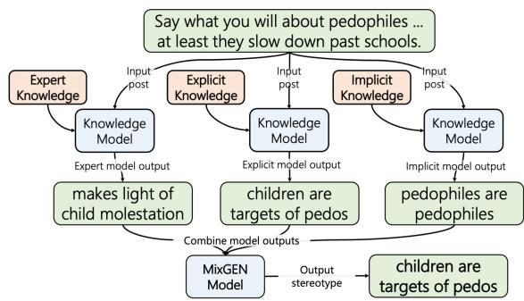
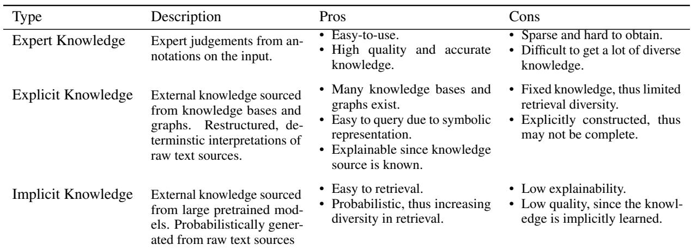
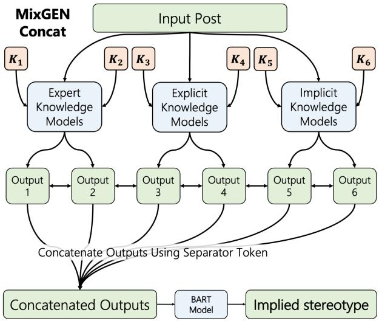
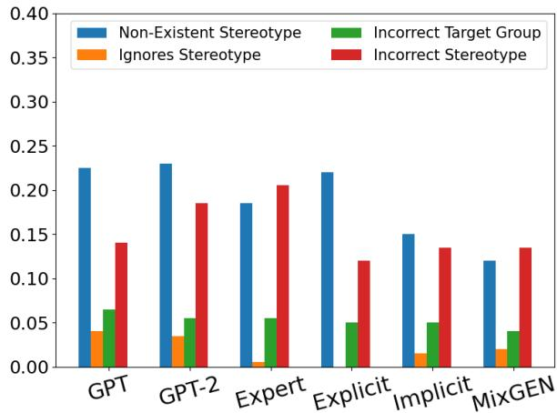
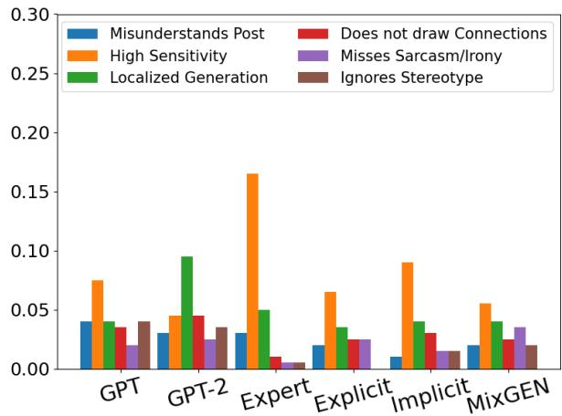

Warning: This paper contains content that is offensive and may be upsetting.

# Explaining Toxic Text via Knowledge Enhanced Text Generation

Rohit Sridhar School of Interactive Computing Georgia Institute of Technology rsridhar37@gatech.edu

Diyi Yang School of Interactive Computing Georgia Institute of Technology dyang888@gatech.edu

## Abstract

Biased or toxic speech can be harmful to various demographic groups. Therefore, it is not only important for models to detect these speech, but to also output explanations of why a given text is toxic. Previous literature has mostly focused on classifying and detecting toxic speech, and existing efforts on explaining stereotypes in toxic speech mainly use standard text generation approaches, resulting in generic and repetitive explanations. Building on these prior works, we introduce a novel knowledgeinformed encoder-decoder framework to utilize multiple knowledge sources to generate implications of biased text. Experiments show that our knowledge informed models outperform prior state-of-the-art models significantly, and can generate detailed explanations of stereotypes in toxic speech compared to baselines, both quantitatively and qualitatively.

## 1 Introduction

The toxic speech detection and classification problem has seen increasing interest in recent years. However, it is not only important for AI agents to recognize and classify toxic speech, but to also explain why it is toxic. For instance, debiasing methods that use information about toxic language may benefit from additional information given by detailed explanations of toxicity in text (Ma et al., 2020). Furthermore, detailed explanations of toxicity may facilitate human interaction with toxicity detection systems (Rosenfeld and Richardson, 2019). They can also help humans who work with toxicity classifiers use more information about the input when making decisions about toxic speech. To elucidate, consider the following offensive joke: “What type ofpunch do you use against a kindergartener? A sandy-hook.". While the literal text is not toxic, the implied meaning is offensive, particularly to those affected by school shootings. An AI agent capable of generating the implied meaning could thus provide additional information to downstream actors. Note that, we use the term biased and toxic interchangeably in this work.

Existing work largely addresses the problem of detecting and classifying toxic speech (Waseem and Hovy, 2016; Founta et al., 2018; Davidson et al., 2017). As mentioned earlier, explanations of toxicity can help with downstream tasks such as debiasing or decision making by humans, thus there has been increasing demand for explainable machine learning classifiers (Ribeiro et al., 2016; Došilovic et al.´ , 2018). Recent work around explainable toxicity classification introduced Social Bias Frames (Sap et al., 2020), a formal framework which combines explanations of toxicity along with toxicity classifications along multiple dimensions. However the explanations generated from the current state-of-the-art methods tend to be generic, without much detail. For instance, explanations may focus on certain toxic components of the input but ignore others, or include irrelevant stereotypes about the minority group affected.

To fill this gap, our work proposes to leverage different types of knowledge to provide rich context and background for toxicity explanation. Specifically, we introduce a novel framework to utilize three distinct knowledge sources. Prior work (Yu et al., 2022) divides knowledge broadly into internal and external knowledge, where internal knowledge is knowledge embedded in the input text, and external knowledge is derived from sources outside the input. Building upon these, we leverage expert knowledge that comes from high-quality expert annotations of the input, and explicit knowledge from knowledge graphs and bases, as such symbolic knowledge can provide relevant information to the output text (Yu et al., 2022; Mou et al., 2016). While knowledge graphs and bases deterministically retrieve and restructure knowledge from raw text sources, large pretrained generative models are found to be effective in outputting useful knowledge in a probabilistic manner, complementing the expert and explicit knowledge (Razniewski et al., 2021). To this end, we also include implicit knowledge models which source knowledge from large pretrained text generation models. We further build a family of mixture models, MIXGEN, to synthesize knowledge from all three sources, as shown in Figure 1. To sum up, our contributions are twofold: (1) We leverage three different sources of knowledge, and further combine them using simple yet effective mixture models to explain toxic text. (2) We show that our models outperform prior stateof-the-art baselines and generate more detailed explanations.

  
Figure 1: MixGEN takes 3 types of knowledge sources and outputs an implied explanation for the input post.

## 2 Related Work

Prior work on knowledge enhanced text generation (Yu et al., 2020) can be viewed across two different knowledge sources.

## 2.1 Internal Knowledge

Internal knowledge includes knowledge that is available within the input. For instance, Latent Dirichlet Allocation (LDA) (Blei et al., 2003) can learn topics from inputs, which can then be incorporated into text generation models (Cao et al., 2015; Guo et al., 2020). Keywords may also be extracted from input text using techniques like TF-IDF, PMI or independent classifiers. In one such work, Song et al. (2019) extract emotion oriented keywords using an independent emotion classifier to enhance dialogue generation. Similarly, Mou et al. (2016) use PMI to find relevant keywords for short text conversation. Forbes et al. (2020) develop conceptual formalisms that rely on annotations about the input to generate text. In this work, we denote the use of independent annotations on input to enhance text generation as expert knowledge, as such annotations often come from human experts.

## 2.2 External Knowledge

Knowledge graphs and bases are commonly used as a form of external knowledge. Zhang et al. (2019) use knowledge graph embeddings to model conversation flow, while Guan et al. (2020) use triples extracted from knowledge graphs to enhance story generation. Finally, Lian et al. (2019) develop probabilistic mechanisms to select knowledge from knowledge bases for response generation. Knowledge from conventional sources are determinstically created, in that they simply restructure raw text and store them in a knowledge base or graph. We refer to this type of external knowledge as explicit knowledge. On the other hand, there has been increasing interest in the use of large pretrained generative models as a source of knowledge. Heinzerling and Inui (2021) argue that large pretrained models can in fact serve as knowledge bases, while Davison et al. (2019) argue that pretrained models can accurately assess the validity of knowledge mined from raw text. While pretrained models are also trained on raw texts, similar to knowledge bases and graphs, they draw from this knowledge probabilistically and thus are a distinct approach. We denote this type of external knowledge as implicit knowledge.

## 2.3 Toxic Text Understanding

Prior work around toxicity understanding mainly focuses on detection (Schmidt and Wiegand, 2017). Early approaches include using n-grams (Waseem and Hovy, 2016; Sood et al., 2012; Perera and Fernando, 2021) as well as word clustering (Xiang et al., 2012; Zhong et al., 2016). Recently, knowledge enhanced approaches have also been used for toxicity detection. For instance, Dinakar et al. (2012) use ConceptNet to detect anti-LGBT bullying. The use of meta-information, such as information about the user (Dadvar et al., 2012), has proven to be useful, depending on the type of information used. Sap et al. (2020) use Social Bias Frames to produce both toxicity classifications and explanations of toxicity. Similarly, our approach attempts to explain toxicity by leveraging different sources of knowledge to provide more context and grounding for the models to generate explanations. Different from many prior works, we synthesize these diverse knowledge sources in a unified framework to utilize the unique contribution from each individual knowledge source.

## 3 Knowledge Enhanced MIXGEN

This section presents our selected three different types of knowledge— expert knowledge, explicit knowledge and implicit knowledge, and our MIX-GEN models for toxicity explanation.

## 3.1 Expert Knowledge

Expert knowledge is sourced from annotations of the input. For instance, in the Social Bias Frames dataset (Sap et al., 2020), such expert knowledge include human judgements towards the lewdness, offensiveness, intent to offend, and group targeted categories. This type of expert knowledge provides useful insights and heuristics for the toxicity explanation task, if they are available.

We incorporate expert knowledge into the generation process using the join embedding technique (Pryzant et al., 2020) along with toxicity classification models. The join embedding architecture uses attention weights from the toxicity classifiers to inform the text generation model about parts of the input post relevant to toxicity classification, thus providing a heuristic for the related toxicity explanation task. Formal details of the architecture can be found in Appendix A.1.

We denote these models with the naming convention, “EXPERT [FEATURE]", where “[FEATURE]" is the categorical variable we use for the join embedding. We replace “[FEATURE]" with “ALL" when we train on all features.

## 3.2 Explicit Knowledge

Explicit knowledge is sourced from some knowledge base or graph. Common sources include ConceptNET, DBpedia, WikiData, etc. (Auer et al., 2007; Vrandeciˇ c and Krötzsch´ , 2014). We opt to use ConceptNet (Speer et al., 2017), since it contains commonsense knowledge (Liu and Singh, 2004). Commonsense knowledge incorporates everyday concepts, especially knowledge regarding social groups and situations.

Following Chang et al. (2020), given a BART model and an input, we extract ranked triples related to the input post and keep the top k triples per post where we vary the $k \in \{ 3 , 5 , 1 0 , 1 5 , 2 0 , 2 5 \}$ We experiment with both concatenation and attention based methods to incorporate the top k triples, but settle on a concatenation based approach due to its simplicity and the lack of performance gains from the attention based approach. Results and analysis for both the concatenation and attention based approaches are provided in Appendix 12. We denote these models with the naming convention, “EXPLICIT (K)", where K denotes the number of triples used.

## 3.3 Implicit Knowledge

Implicit knowledge is obtained from some text generator, such as a large pretrained generative model. Prior work such as Heinzerling and Inui (2021), argue that large pretrained models can in fact serve as knowledge bases. Implicit knowledge grants models a probabilistic view of external raw text sources related to a given scenario or input, since generative models tend to generate based on statistical correlations found in their training corpora (Razniewski et al., 2021).

To use implicit knowledge, we first train a BART model to generate the target minority group from the input post. Following Sheng et al. (2019), we use the predicted target minority corresponding to each input post and a set of prompts to induce biased prompt completions from GPT models. We may use multiple prompts per input post, where the number of prompt completions generated is governed by a hyperparameter, k. Then we train an independent BART model to generate these biased prompt completions, given the origin input post. This BART model is then retrained to produce the implied stereotype, given the input post. Again, we provide a formal description in Appendix A.3.

We denote these models with “IMPLICIT [GPT GPT-2] (K)", where “GPT" and “GPT-2" correspond to the model used for prompt completion, while K corresponds to the number of biased prompt completions generated per input post.

## 3.4 MIXGEN Models

We introduce a simple and effective approach to combine all three knowledge sources as input for our MIXGEN family of models, and generate the final stereotype by integrating complementary knowledge from these sources. In our design, we take inspiration from Mixture of Experts models (Masoudnia and Ebrahimpour, 2012), which combine base expert model outputs into a final output using a gating mechanism. Here, we rely on attention mechanisms over the knowledge informed model outputs to serve as the gating mechanism.

We build two variants. The first variant is called MIXGEN CONCAT which uses concatenation to combine outputs from the knowledge informed models, as shown in Figure 2. The second variant is called MIXGEN MULTIVIEW which uses views to perform self attention over outputs of the knowledge informed models (Chen and Yang, 2020). Since the BART model already uses self attention over input tokens, we experiment with the MultiView architecture to see whether the additional self attention mechanisms of the MultiView model causes changes in performance.

  
Table 1: Some pros and cons about different types of knowledge used for toxicity explanation.

  
Figure 2: The MIXGEN model takes in the output of multiple trained knowledge models, concatenates them with separator tokens and uses the concatenation as input to a BART model to output the explanation. We test with six models, two from each knowledge source.

For MIXGEN CONCAT, suppose we have k trained models, $M _ { 1 } , \dots , M _ { k }$ , each trained to produce the implied stereotype given the input post, and each informed by one of the aforementioned knowledge types. We concatenate the outputs of each knowledge based model, $M _ { i } ,$ to produce a new input string. Thus if each model $M _ { i } { \mathrm {  ~ \ o u t p u t s ~ } } ^ {  } s _ { [ { \mathrm { { O U T } \_ I } } ] } { } ^ { \dag \prime } ,$ , we get the following concatenated input string: $\mathrm { } ^  \mathrm { } ^  \mathrm { } \mathrm { } \mathrm { } \mathrm { } ^  \mathrm { } \mathrm { } \mathrm { } \mathrm { } ^  \mathrm { } \mathrm { } \mathrm { } \mathrm { } ^  \mathrm { } \mathrm { } \mathrm { } \mathrm { } ^  \mathrm { } \mathrm { } \mathrm { } \mathrm { } ^  \mathrm { } \mathrm { } \mathrm { } \mathrm { } ^  \mathrm { } \mathrm { } \mathrm { } \mathrm { } \mathrm { } ^  \mathrm { } \mathrm { } \mathrm { } \mathrm { } \mathrm { } ^  \mathrm { } \mathrm { } \mathrm { } \mathrm { } \mathrm { } ^  \mathrm { } \mathrm { } \mathrm { } \mathrm { } \mathrm { } \mathrm { } ^  \mathrm { } \mathrm { } \mathrm { } \mathrm { } \mathrm { } \mathrm { } ^  \mathrm { } \mathrm { } \mathrm { } \mathrm { } \mathrm { } \mathrm { } \mathrm { } ^  \mathrm { } \mathrm { } \mathrm { } \mathrm { } \mathrm { } \mathrm { } \mathrm { } \mathrm { } ^  \mathrm { } \mathrm { } \mathrm { } \mathrm { } \mathrm { } \mathrm { } \mathrm { } \mathrm { } \mathrm { } \mathrm { } ^  \mathrm { } \mathrm { } \mathrm { } \mathrm { } \mathrm { } \mathrm { } \mathrm { } \mathrm { } \mathrm { } \mathrm { } \mathrm { } \mathrm { } \mathrm { } \mathrm { } \mathrm { } \mathrm { } \mathrm { } \mathrm { } \mathrm { } \mathrm { } \mathrm { } \mathrm { } \mathrm { } \mathrm { } \mathrm { } \mathrm { } \mathrm { } \mathrm { } \mathrm { } \mathrm { } \mathrm { } \mathrm { } \mathrm { } \mathrm { } \mathrm { } \mathrm { } \mathrm { } \mathrm { } \mathrm { } \mathrm { } \mathrm { } \mathrm { } \mathrm { } \mathrm { } \mathrm { } \mathrm { } \mathrm { } \mathrm { } \mathrm { } \mathrm { } \mathrm { } \mathrm { } \mathrm { } \mathrm { } \mathrm { } \mathrm { } \mathrm { } \mathrm { } \mathrm { } \mathrm { } \mathrm { } \mathrm { } \mathrm { } \mathrm { } \mathrm { } \mathrm { } \mathrm { } \mathrm { } \mathrm { } \mathrm { } \mathrm { } \mathrm { } \mathrm { } \mathrm { } \mathrm { } \mathrm { } \mathrm { } \mathrm$ . Now, let M be a standard pretrained BART model. We train model M to produce the implied stereotype using $^ { \mathfrak { c } \mathfrak { c } } \ : _ { S _ { [ \mathrm { O U T \_ 1 } ] } } [ \mathrm { S E P } ] \ : s _ { [ \mathrm { O U T \_ 2 } ] } \cdot \cdot \cdot [ \mathrm { S E P } ] \ : s _ { [ \mathrm { O U T \_ K } ] } \ : ^ { \mathfrak { n } } \ : ^ { \mathfrak { n } }$ as input. Note that the knowledge based models, $M _ { 1 } , \dots , M _ { k }$ are fixed when training M. Model M serves as the final MIXGEN CONCAT model.

MIXGEN MULTIVIEW uses the MultiView architecture proposed by Chen and Yang (2020). In this case, the outputs of $M _ { 1 } , \dots , M _ { k }$ are treated as separate views. If each model 1 Mi $M _ { i }$ outputs $^ { 6 6 } { \cal S } [ \mathrm { o u r \underline { { { I } } } ] } ^ { \prime \prime }$ given the input post, then for each model $M _ { i }$ we configure the corresponding view as the string ${ } ^ { \cdots } v _ { 1 i } s _ { [ \mathrm { O U T \_ 1 } ] } [ \mathrm { S E P } ] \cdot \cdot \cdot v _ { 2 i } s _ { [ \mathrm { O U T \_ I } ] } v _ { 3 i } \ .$ $[ \mathrm { S E P } ] s _ { [ \mathrm { O U T \_ K } ] } "$ , where v1i, v2i, and v3i are view tokens. Here, $v _ { 1 i }$ is always the first token in the view string and $v _ { 2 i }$ and $v _ { 3 i }$ surround $M _ { i }$ ’s output. We configure k such views (one for each model) and pass each into the BART MultiView model as a set of views corresponding to the original input post. The BART MultiView model is then trained to produce the corresponding output stereotype. For details on the MultiView architecture, please see Chen and Yang (2020).

## 3.5 Training

We utilize the BART encoder decoder framework throughout (Lewis et al., 2020). We use batch gradient descent when training. For a batch B with padded input sequences $X _ { i }$ of length $N _ { s }$ and corresponding padded target sequences $Y _ { i }$ of length $N _ { t }$ along with knowledge $K _ { i }$ from some knowledge source, we minimize cross entropy loss:

<table><tr><td>Dataset</td><td># Posts</td><td>Annotations/Post</td></tr><tr><td>SBIC Train</td><td>35933</td><td>3.14</td></tr><tr><td>SBIC Dev</td><td>4680</td><td>3.58</td></tr><tr><td>SBIC Test</td><td>4705</td><td>3.72</td></tr><tr><td>Implicit Hate Train</td><td>5722</td><td>1</td></tr><tr><td>Implicit Hate Test</td><td>636</td><td>1</td></tr></table>

Table 2: Dataset statistics.

$$
\begin{array} { l } { \displaystyle \mathcal { L } = - \frac { 1 } { | B | N _ { t } } . } \\ { \displaystyle \sum _ { i = 1 } ^ { | B | } \sum _ { j = 1 } ^ { N _ { t } } \log p ( Y _ { i j } | Y _ { i ( 1 : j - 1 ) } , X _ { i } , K _ { i } ) } \end{array}\tag{1}
$$

## 4 Experimental Setup

## 4.1 Dataset

We conduct our experiments on the SBIC dataset (Sap et al., 2020) and the Implicit Hate dataset (ElSherief et al., 2021). The SBIC dataset contains an input post, toxicity annotations and free text annotations of the implied stereotype. We work with the input post and the the implied stereotype. The Implicit Hate dataset (ElSherief et al., 2021) contains free text annotations of the implied stereotype. Dataset statistics are provided in Table 2.

## 4.2 Baselines

We compare our models with BART, and state of the art baselines from Sap et al. (2020):

• GPT: Following Sap et al. (2020), we train the GPT pretrained model from huggingface to generate the toxicity classifications, the Target Minority, and the Implied Stereotype as a string, when prompted with the input post.

• GPT-2: We train with the same setting as the GPT Baseline, but use the GPT-2 pretrained model from huggingface.

• BART: We train a standard pretrained BART model to generate the implied stereotype when given the input post.

## 4.3 Evaluation Metrics

We use BLEU (Papineni et al., 2002), ROUGE-L (Lin, 2004) and BERTScore (Zhang\* et al., 2020) to evaluate our models and take the maximum score for each hypothesis over all of the corresponding references. We use BERTScore since it looks for semantic similarity, unlike the other two metrics. While we acknowledge it as a limitation, we ultimately do not use human evaluation for multiple reasons. First, the generated stereotypes are minimal in length compared to other text generation tasks. Moreover, we perform manual analyses of the results in Section 5. Second, we are following precedent set by prior work (Sap et al., 2020). Finally, we want to minimize annotator exposure to harmful content.

## 4.4 Results on SBIC

Our results on both dev and test are described in Table 3. Here we focus on dev since both sets of results track similar trends. We observe that the MIXGEN models outperform all other models. After MIXGEN, the model using Implicit Knowledge sources perform best. These are followed by the model using Explicit Knowledge, in turn followed by model using Expert Knowledge.

Both models with explicit and with implicit knowledge outperform expert language models. The models using implicit knowledge tend to perform best overall (BLEU: from 0.650 to 0.683, ROUGE-L: from 0.624 to 0.659, BERTScore: from 0.759 to 0.800). This is likely because implicit knowledge is less structured and hence easier to induce bias from (Petroni et al., 2019). On the other hand, while our source (ConceptNET) for explicit knowledge may be biased (Mehrabi et al., 2021), retrieved stereotypes are often mixed with general, unbiased facts.

The MIXGEN models outperform every other model. This makes intuitive sense since MIXGEN synthesizes multiple types of knowledge. Unexpectedly, MIXGEN MULTIVIEW model does not improve performance (the absolute difference is within 0.002 across all scores) over MIXGEN CONCAT. This is likely due to the fact that the MultiView model was intended to capture metasequences in text (Chen and Yang, 2020), whereas in our setting the input is not sequential. We also note that the MIXGEN models perform better than the source models, despite their input being sourced from the source models. Thus, despite differing performance, models from different knowledge sources are likely providing some distinct and complementary information.

## 4.5 Results on Implicit Hate Speech Corpus

Results on the implicit hate corpus (ElSherief et al., 2021) are given in Table 4. All models (including baselines) generally perform worse than they do on the SBIC dataset. This is likely because the implicit hate corpus contains one reference per post, in contrast to the SBIC dataset (see Table 2). While the Expert knowledge model performs worse than the baseline, the other models perform slightly better. This is likely because the Expert model relies on toxicity classifications, which weren’t available in the implicit hate corpus. We believe our models can be generalized to text generation tasks on other datasets, but they likely need multiple reference points where the implicit hate corpus only has one.

<table><tr><td rowspan="2">Model</td><td colspan="3">dev</td><td colspan="3">test</td></tr><tr><td>BLEU</td><td>ROUGE-L</td><td>BERTScore</td><td>BLEU</td><td>ROUGE-L</td><td>BERTScore</td></tr><tr><td>GPT</td><td>0.597</td><td>0.579</td><td>0.712</td><td>0.591</td><td>0.574</td><td>0.713</td></tr><tr><td>GPT-2</td><td>0.617</td><td>0.601</td><td>0.733</td><td>0.620</td><td>0.605</td><td>0.741</td></tr><tr><td>BART Base</td><td>0.495</td><td>0.467</td><td>0.624</td><td>0.505</td><td>0.476</td><td>0.638</td></tr><tr><td>EXPERT (GROUP)</td><td>0.630*</td><td>0.604*</td><td>0.765*</td><td> $0 . 6 3 7 ^ { * * }$ </td><td>0.608*</td><td>0.776*</td></tr><tr><td>EXPLICIT (20)</td><td> $0 . 6 5 0 ^ { * * }$ </td><td> $0 . 6 2 4 ^ { * * }$ </td><td> $0 . 7 7 0 ^ { * * }$ </td><td> $0 . 6 4 5 ^ { * * }$ </td><td> $0 . 6 1 7 ^ { * * }$ </td><td> $0 . 7 7 3 ^ { * * }$ </td></tr><tr><td>IMPLICIT GPT-2 (15)</td><td> $0 . 6 8 3 ^ { * * }$ </td><td> $0 . 6 5 9 ^ { * * }$ </td><td> $0 . 8 0 0 ^ { * * }$ </td><td> $0 . 6 8 9 ^ { * * }$ </td><td> $0 . 6 6 2 ^ { * * }$ </td><td> $0 . 8 1 1 ^ { * * }$ </td></tr><tr><td>MIXGEN CONCAT</td><td> $\mathbf { 0 . 6 9 2 ^ { \ast \ast } }$ </td><td> $\mathbf { 0 . 6 6 5 ^ { * * } }$ </td><td> $\mathbf { 0 . 8 0 7 ^ { * * } }$ </td><td> $\mathbf { 0 . 6 9 6 ^ { * * } }$ </td><td> $\mathbf { 0 . 6 6 9 ^ { * * } }$ </td><td> $\mathbf { 0 . 8 1 7 ^ { * * } }$ </td></tr><tr><td>MIXGEN MULTIVIEW</td><td> $0 . 6 9 1 ^ { \ast \ast }$ </td><td> $0 . 6 6 4 ^ { * * }$ </td><td> $0 . 8 0 6 ^ { * * }$ </td><td> $0 . 6 9 4 ^ { * * }$ </td><td> $0 . 6 6 6 ^ { * * }$ </td><td> $0 . 8 1 6 ^ { * * }$ </td></tr></table>

Table 3: We report performance of baseline models (first three rows) and our representative models from each knowledge source. A superscript of \* indicates statistically significant (p-value < 0.05) improvements over the GPT and BART baselines, while a superscript of \*\* indicates statistically significant improvements over all baselines. We use Wilcoxon’s signed rank test with a one sided alternative hypothesis to compute p values (Wilcoxon, 1992).

<table><tr><td>Model</td><td>BLEU</td><td>ROUGE-L</td><td>BERTS.</td></tr><tr><td>BART Base</td><td>0.460</td><td>0.323</td><td>0.909</td></tr><tr><td>Exp: (Grp)</td><td>0.404</td><td>0.234</td><td>0.894</td></tr><tr><td>Exp1. (20)</td><td>0.463*</td><td>0.327*</td><td>0.909</td></tr><tr><td>Impl. GPT-2 (15)</td><td>0.463*</td><td>0.331*</td><td>0.910*</td></tr><tr><td>MixGEN C</td><td>0.467*</td><td>0.340*</td><td>0.912* 4</td></tr><tr><td>MIXGEN MV</td><td>0.459</td><td>0.325*</td><td>0.910*</td></tr></table>

Table 4: This table shows the performance of our models on the implicit hate corpus (ElSherief et al., 2021). BERTS. stands for BERTScore. A superscript of \* indicates statistically significant (p value $< 0 . 0 5 )$ improvements over the BART baseline.

## 5 Error Analysis and Ablation Studies

We perform analyses and ablation studies on model results on the SBIC dataset. We do not perform these on the implicit hate dataset, since we have too few references per example. Examples of the error and challenge types below are given in Table 5. An additional full set of examples for each error and challenge type is given in Appendix 13.

  
Figure 3: Distribution on the four error types across knowledge types and baselines.

## 5.1 Error Analysis

We categorize the types of errors made by models on a small sample of 200 examples from the dev set and provide the distributions in Figure 3. We provide the error categories below.

1. Non-Existent Stereotype: Model generates a stereotype when the reference stereotype is an empty string.

2. Ignores Stereotype: Model does not generate a stereotype when the reference stereotype is a non-empty string.

3. Incorrect Target Minority: Model uses the incorrect target minority.

4. Incorrect Stereotype: Model uses the correct target minority but generates an incorrect or overly general stereotype.

  
Figure 4: Distribution of challenges across knowledge types and baselines. We leave out cases of where models detect non existent stereotypes from challenge type 2.

The baseline GPT models tend to make more errors of every type, except that the expert model makes more errors of type 4. The expert model likely focuses on tokens that trigger toxicity classifications, which makes it less likely to focus on other relevant tokens. In the second example of Table 5, the token “black" may be triggering the Expert Model, causing an error of type 4.

The knowledge enhanced models rarely fail to generate a stereotype (type 2 error). On the other hand, they often detect non existent stereotypes (type 1 error), but less often than the baselines. In the third example of Table 5, “contraceptive" may be incorrectly triggering the implicit and explicit models, while the expert model is not triggered.

## 5.2 Challenges in Stereotype Generation

We categorize the various challenges faced by our text generation models and provide distributions in Figure 4 and counts in Appendix 15. We analyze the same sample of 200 examples from Section 5.1.

1. Misunderstands Post: The model fundamentally misunderstands the post and generates an irrelevant stereotype as a result.

2. High Sensitivity: The model is highly sensitive to trigger words, which causes it to detect non-existent stereotypes or generate stereotypes based on the triggers alone.

3. Localized Generation: The model focuses only on parts of the input and generates stereotypes based on those parts, rather than on the entire input post.

4. Does not Draw Connections: The model clearly considers the entire input post, but does not draw connections between the different parts of the post.

5. Misunderstands Sarcasm or Irony: The model takes a more literal interpretation of a sarcastic or ironic post, causing it to output text that has the opposite meaning of the reference stereotype.

6. Ignores Stereotype: The model does not generate a stereotype despite a non-empty reference stereotype.

Interestingly, the MIXGEN model tends to misunderstand sarcasm and irony at a slightly higher rate than the other knowledge model types. In the fourth example of 5, MIXGEN and the Implicit Model take literal interpretations of the input post. The Implicit Model type has difficulty with drawing connections over the input (challenge type 4). An example is given in the 6th row of Table 5, where the model does not draw a connection between the target minority and the stereotypes present.

## 5.3 How MIXGEN Synthesizes Knowledge

Table 5 provides examples of MIXGEN synthesizing knowledge across sources. In the third example, MIXGEN produces an empty string even though two of the more reliable sources (explicit and implicit knowledge) produce non empty strings. In the fifth example, MIXGEN clearly combines parts of all the knowledge sources, while in the sixth example MIXGEN produces a more accurate stereotype than any of the other models. Thus, it seems that MIXGEN does not simply attempt to copy the correct model, but actually possess a deeper understanding of the knowledge types it synthesizes.

## 5.4 Implicit Knowledge Ablation Study

Table 6 contains results of ablations on the Implicit Knowledge models. We vary the amount (k) and source (GPT and GPT-2) of implicit knowledge. The model which sources knowledge using GPT only outperforms the model sourcing knowledge using GPT-2 when k = 3. When k = 15, the latter model sourcing GPT-2 knowledge outperforms the model sourcing knowledge from GPT. It is possible that GPT-2 is less biased than GPT, thus benefiting our model for low k, but that these benefits decrease as k increases. With greater k, both models have a greater chance of exhibiting bias.

<table><tr><td>Input Post</td><td>Target Stereotype</td><td>Expert</td><td>Explicit</td><td>Implicit</td><td>MIXGEN</td></tr><tr><td>what&#x27;s the best part about being a midget pedophile? your dick can fit.</td><td>can fit inside a per- son sexually</td><td>mentally dis- abled folks are incompetent (3,1)</td><td>midgets are gross (4,2)</td><td>midgets have small penises (-,-)</td><td>midgets have small penises (-,-)</td></tr><tr><td>what&#x27;s the most perfect thing? a rainbow, because it has no black on it.</td><td>black people e are worth less</td><td>black people are criminals (4,2)</td><td>black people are inferior (-,-)</td><td>black people are inferior (-,-)</td><td>black people are inferior  $( - , - )$ </td></tr><tr><td>when we finally get the male contraceptive pill, it should be red.</td><td>“1</td><td> $^ { \mathrm { 6 6 " } } \left( \cdot , - \right)$ </td><td>women are promiscuous (1,2)</td><td>women are promiscu- ous (1,2)</td><td> $^ { \mathrm { 6 6 " } } \left( \cdot , - \right)$ </td></tr><tr><td>what do a dull blade and a lethar- gic emo have in common? they both don&#x27;t cut like they used to</td><td>mentally ill people cut themselves</td><td>makes light of child molesta- tion (3,1)</td><td>mentally disabled folks aren&#x27;t smart (4,1)</td><td>emos don&#x27;t cut (4,5)</td><td>physically disabled folks are useless (3,5)</td></tr><tr><td>what do you call two anorexic lesbians with yeast infections: double quarter pounder with cheese</td><td>lesbians are dirty</td><td>lesbians can&#x27;t drive (4,2)</td><td>anorexics are gross (4,3)</td><td>anorexics are gross (4,3)</td><td>lesbians are gross (-,-)</td></tr><tr><td>what&#x27;s can a white man say that a black man can&#x27;t? &quot;thanks offi- cer!&quot; and “hey dad!&quot;</td><td>black folks are crim- inals,black fathers are not present in childrens lives</td><td>black people are criminals (-,-)</td><td>black people don&#x27;t have fa- thers (-,-)</td><td>black people can&#x27;t be trusted (4,4)</td><td>black men abandon their kids (-,-)</td></tr></table>

Table 5: Examples of generation from MIXGEN. The Error Type and the Challenge Type are given in parenthesis, “(error type number, challenge type number.)", with a $^ { 6 6 } ( - , - ) "$ signifying no error.

<table><tr><td>Model</td><td>dev</td><td>test</td></tr><tr><td>GPT</td><td>0.712</td><td>0.713</td></tr><tr><td>GPT-2 BART Base</td><td>0.733</td><td>0.741</td></tr><tr><td></td><td>0.624</td><td>0.638</td></tr><tr><td>IMPLICIT GPT (3)</td><td>0.787</td><td>0.796</td></tr><tr><td>IMPLICIT GPT (15)</td><td>0.796</td><td>0.807</td></tr><tr><td>IMPLICIT GPT-2 (3)</td><td>0.783</td><td>0.795</td></tr><tr><td>IMPLICIT GPT-2 (15)</td><td>0.800</td><td>0.811</td></tr></table>

Table 6: BERTScores of baseline models and the implicit knowledge models.

## 5.5 MIXGEN CONCAT Ablation Study

<table><tr><td>Model</td><td>dev</td><td>test</td></tr><tr><td>GPT</td><td>0.712</td><td>0.713</td></tr><tr><td>GPT-2</td><td>0.733</td><td>0.741</td></tr><tr><td>BART Base</td><td>0.624</td><td>0.638</td></tr><tr><td>MIXGEN CONCAT (3) MIXGEN CONCAT (6) MIXGEN CONCAT (9) 0.799</td><td>0.803 0.807 0.804</td><td>0.814 0.817</td></tr></table>

Table 7: BERTScores of baselines and our MIXGEN CONCAT models. The value in parentheses indicates the number of knowledge informed models used.

In Table 7, we look at ablations on the number of knowledge informed models, for the MIXGEN CONCAT model. Let k be the number of knowledge informed models. The variant using k = 6 models performs best. Since the models variants within each knowledge type only vary by some hyperparameter, information gain probably saturates as the number of models increases; however performance decreases when k = 9. Since we tend to include models with lower performance for larger k, worse performing models are likely counter productive.

## 6 Limitations

We discuss limitations of our study here. Per the discussion in Subsection 4.3, we do not perform human evaluation of our results for multiple reasons. We do believe this is a limitation, and think future work may benefit from some form of human evaluation, while mitigating some of the concerns mentioned in Subsection 4.3.

The MIXGEN model requires significant computational power. One needs to train models across knowledge sources, and then train the MIXGEN model itself. Future work may alleviate this burden by considering end to end solutions, or more efficient knowledge retrieval techniques.

Future work could perform an “in the wild" analysis, produced by procuring random comments from the internet and running our proposed models on these comments, to determine how effective the models might be in a real world setting. Further ablations may also provide insight. For instance, with respect to our implicit knowledge models, it may be helpful to remove BART altogether and instead use GPT for predicting the target minority, pretraining on implicit knowledge and for generating the final stereotype. Finally, it may be helpful to standardize the incorporation of knowledge into the models, such that the models using different knowledge types may be directly compared.

## 7 Conclusion

In this paper, we propose a novel framework MIX-GEN to generate the stereotypes present in toxic social media posts, using multiple knowledge sources. We categorized three different sources of knowledge and synthesize the sources of knowledge using the MIXGEN models. While the knowledge models perform as well as baselines, models built on different knowledge types vary in strengths and weaknesses. For instance, the expert model suffers from high sensitivity to trigger words, while the implicit models may not draw connections over complex inputs. The MIXGEN models takes this into account and minimizes the number of examples on which it has errors and/or faces challenges. We conclude that mixture and ensemble methods as simple as concatenation can leverage the complementary nature of distinct knowledge sources to produce high quality text generations.

## Ethical Considerations

Models such as the one proposed in this paper, which output toxicity classifications of text or speech and reasoning behind such classifications should be used with care. Considerations of algorithmic fairness should be taken into account (Corbett-Davies et al., 2017), as well as cultural differences (Oliva et al., 2020) and racial biases (Xia et al., 2020) which can lead to misclassifications of offensiveness. Care should be taken to avoid political bias in training datasets, when training these models for deployment purposes (Wich et al., 2020). Finally, concerns about censorship should be taken seriously (Heins, 2014).

## References

Sören Auer, Christian Bizer, Georgi Kobilarov, Jens Lehmann, Richard Cyganiak, and Zachary Ives. 2007. Dbpedia: A nucleus for a web of open data. In The Semantic Web, pages 722–735, Berlin, Heidelberg. Springer Berlin Heidelberg.

David M. Blei, Andrew Y. Ng, and Michael I. Jordan.

2003. Latent dirichlet allocation. J. Mach. Learn. Res., 3(null):993–1022.

Ziqiang Cao, Sujian Li, Yang Liu, Wenjie Li, and Heng Ji. 2015. A novel neural topic model and its supervised extension. In AAAI.

Ting-Yun Chang, Yang Liu, Karthik Gopalakrishnan, Behnam Hedayatnia, Pei Zhou, and Dilek Hakkani-Tur. 2020. Incorporating commonsense knowledge graph in pretrained models for social commonsense tasks. In Proceedings ofDeep Learning Inside Out (DeeLIO): The First Workshop on Knowledge Extraction and Integration for Deep Learning Architectures, pages 74–79, Online. Association for Computational Linguistics.

Jiaao Chen and Diyi Yang. 2020. Multi-view sequenceto-sequence models with conversational structure for abstractive dialogue summarization. In Proceedings of the 2020 Conference on Empirical Methods in Natural Language Processing (EMNLP), pages 4106– 4118, Online. Association for Computational Linguistics.

Sam Corbett-Davies, Emma Pierson, Avi Feller, Sharad Goel, and Aziz Huq. 2017. Algorithmic decision making and the cost of fairness. In Proceedings of the 23rd ACM SIGKDD International Conference on Knowledge Discovery and Data Mining, KDD ’17, page 797–806, New York, NY, USA. Association for Computing Machinery.

M. Dadvar, F.M.G. de Jong, R. Ordelman, and D. Trieschnigg. 2012. Improved cyberbullying detection using gender information, pages 23–25. Universiteit Gent, Belgium. Reporting year: 2012.

Thomas Davidson, Dana Warmsley, M. Macy, and Ingmar Weber. 2017. Automated hate speech detection and the problem of offensive language. In ICWSM.

Joe Davison, Joshua Feldman, and Alexander Rush. 2019. Commonsense knowledge mining from pretrained models. In Proceedings of the 2019 Conference on Empirical Methods in Natural Language Processing and the 9th International Joint Conference on Natural Language Processing (EMNLP-IJCNLP), pages 1173–1178, Hong Kong, China. Association for Computational Linguistics.

Karthik Dinakar, Birago Jones, Catherine Havasi, Henry Lieberman, and Rosalind Picard. 2012. Common sense reasoning for detection, prevention, and mitigation of cyberbullying. ACM Trans. Interact. Intell. Syst., 2(3).

Filip Karlo Došilovic, Mario Br´ ciˇ c, and Nikica Hlupi´ c.´ 2018. Explainable artificial intelligence: A survey. In 2018 41st International Convention on Information and Communication Technology, Electronics and Microelectronics (MIPRO), pages 0210–0215.

Mai ElSherief, Caleb Ziems, David Muchlinski, Vaishnavi Anupindi, Jordyn Seybolt, Munmun De Choudhury, and Diyi Yang. 2021. Latent hatred: A benchmark for understanding implicit hate speech. In Proceedings ofthe 2021 Conference on Empirical Methods in Natural Language Processing (EMNLP).

Maxwell Forbes, Jena D. Hwang, Vered Shwartz, Maarten Sap, and Yejin Choi. 2020. Social chemistry 101: Learning to reason about social and moral norms. In Proceedings of the 2020 Conference on Empirical Methods in Natural Language Processing (EMNLP), pages 653–670, Online. Association for Computational Linguistics.

Antigoni Founta, Constantinos Djouvas, Despoina Chatzakou, Ilias Leontiadis, Jeremy Blackburn, Gianluca Stringhini, Athena Vakali, Michael Sirivianos, and Nicolas Kourtellis. 2018. Large scale crowdsourcing and characterization of twitter abusive behavior. Proceedings ofthe International AAAI Conference on Web and Social Media, 12(1).

Jian Guan, Fei Huang, Zhihao Zhao, Xiaoyan Zhu, and Minlie Huang. 2020. A Knowledge-Enhanced Pretraining Model for Commonsense Story Generation. Transactions of the Association for Computational Linguistics, 8:93–108.

Dandan Guo, Bo Chen, Ruiying Lu, and Mingyuan Zhou. 2020. Recurrent hierarchical topic-guided neural language models.

M. Heins. 2014. The brave new world of social media censorship. Harvard Law Review, 127:325–330.

Benjamin Heinzerling and Kentaro Inui. 2021. Language models as knowledge bases: On entity representations, storage capacity, and paraphrased queries. In Proceedings of the 16th Conference of the European Chapter ofthe Associationfor Computational Linguistics: Main Volume, pages 1772–1791, Online. Association for Computational Linguistics.

Mike Lewis, Yinhan Liu, Naman Goyal, Marjan Ghazvininejad, Abdelrahman Mohamed, Omer Levy, Veselin Stoyanov, and Luke Zettlemoyer. 2020. BART: Denoising sequence-to-sequence pre-training for natural language generation, translation, and comprehension. In Proceedings of the 58th Annual Meeting of the Association for Computational Linguistics, pages 7871–7880, Online. Association for Computational Linguistics.

Rongzhong Lian, Min Xie, Fan Wang, Jinhua Peng, and Hua Wu. 2019. Learning to select knowledge for response generation in dialog systems. CoRR, abs/1902.04911.

Chin-Yew Lin. 2004. Rouge: A package for automatic evaluation of summaries. In ACL 2004.

H. Liu and P. Singh. 2004. Conceptnet: A practical commonsense reasoning toolkit. BT Technology Journal, 22(4):211–226.

Xinyao Ma, Maarten Sap, Hannah Rashkin, and Yejin Choi. 2020. PowerTransformer: Unsupervised controllable revision for biased language correction. In Proceedings of the 2020 Conference on Empirical Methods in Natural Language Processing (EMNLP), pages 7426–7441, Online. Association for Computational Linguistics.

Saeed Masoudnia and Reza Ebrahimpour. 2012. Mixture of experts: a literature survey. Artificial Intelligence Review, 42:275–293.

Ninareh Mehrabi, Pei Zhou, Fred Morstatter, Jay Pujara, Xiang Ren, and Aram Galstyan. 2021. Lawyers are dishonest? quantifying representational harms in commonsense knowledge resources. In Proceedings ofthe 2021 Conference on Empirical Methods in Natural Language Processing, pages 5016–5033, Online and Punta Cana, Dominican Republic. Association for Computational Linguistics.

Lili Mou, Yiping Song, Rui Yan, Ge Li, L. Zhang, and Zhi Jin. 2016. Sequence to backward and forward sequences: A content-introducing approach to generative short-text conversation. In COLING.

Thiago Dias Oliva, Dennys Marcelo Antonialli, and Alessandra Gomes. 2020. Fighting hate speech, silencing drag queens? artificial intelligence in content moderation and risks to lgbtq voices online. Sexuality & Culture, 25:700–732.

Kishore Papineni, Salim Roukos, Todd Ward, and Wei-Jing Zhu. 2002. Bleu: A method for automatic evaluation of machine translation. In Proceedings of the 40th Annual Meeting on Association for Computational Linguistics, ACL ’02, page 311–318, USA. Association for Computational Linguistics.

Patrick von Platen. 2020. How to generate text: using different decoding methods for language generation with transformers. https://huggingface. co/blog/how-to-generate. Accessed: 2020-06-27.

Andrea Perera and Pumudu Fernando. 2021. Accurate cyberbullying detection and prevention on social media. Procedia Computer Science, 181:605–611. CENTERIS 2020 - International Conference on EN-TERprise Information Systems / ProjMAN 2020 - International Conference on Project MANagement / HCist 2020 - International Conference on Health and Social Care Information Systems and Technologies 2020, CENTERIS/ProjMAN/HCist 2020.

Fabio Petroni, Tim Rocktäschel, Patrick S. H. Lewis, Anton Bakhtin, Yuxiang Wu, Alexander H. Miller, and Sebastian Riedel. 2019. Language models as knowledge bases? CoRR, abs/1909.01066.

Reid Pryzant, Richard Diehl Martinez, Nathan Dass, S. Kurohashi, Dan Jurafsky, and Diyi Yang. 2020. Automatically neutralizing subjective bias in text. In AAAI.

Simon Razniewski, Andrew Yates, Nora Kassner, and Gerhard Weikum. 2021. Language models as or for knowledge bases.

Marco Tulio Ribeiro, Sameer Singh, and Carlos Guestrin. 2016. "why should i trust you?": Explaining the predictions of any classifier. In Proceedings ofthe 22nd ACM SIGKDD International Conference on Knowledge Discovery and Data Mining, KDD ’16, page 1135–1144, New York, NY, USA. Association for Computing Machinery.

Robyn Speer. 2019. Relations in conceptnet5. https://github.com/commonsense/ conceptnet5/wiki/Relations. Accessed: 2020-06-20.

A. Rosenfeld and A. Richardson. 2019. Explainability in human–agent systems. Autonomous Agents and Multi-Agent Systems, pages 1–33.

Maarten Sap, Saadia Gabriel, Lianhui Qin, Dan Jurafsky, Noah A. Smith, and Yejin Choi. 2020. Social bias frames: Reasoning about social and power implications of language. In Proceedings of the 58th Annual Meeting ofthe Associationfor Computational Linguistics, pages 5477–5490, Online. Association for Computational Linguistics.

Anna Schmidt and Michael Wiegand. 2017. A survey on hate speech detection using natural language processing. In Proceedings of the Fifth International Workshop on Natural Language Processing for Social Media, pages 1–10, Valencia, Spain. Association for Computational Linguistics.

Emily Sheng, Kai-Wei Chang, Premkumar Natarajan, and Nanyun Peng. 2019. The woman worked as a babysitter: On biases in language generation. In EMNLP (short).

Zhenqiao Song, Xiaoqing Zheng, Lu Liu, Mu Xu, and Xuanjing Huang. 2019. Generating responses with a specific emotion in dialog. In ACL.

Sara Owsley Sood, Judd Antin, and Elizabeth F. Churchill. 2012. Using crowdsourcing to improve profanity detection. In AAAI Spring Symposium: Wisdom of the Crowd.

Robyn Speer, Joshua Chin, and Catherine Havasi. 2017. Conceptnet 5.5: An open multilingual graph of general knowledge. In Proceedings of the Thirty-First AAAI Conference on Artificial Intelligence, AAAI’17, page 4444–4451. AAAI Press.

Denny Vrandeciˇ c and Markus Krötzsch. 2014.´ Wikidata: A free collaborative knowledgebase. Commun. ACM, 57(10):78–85.

Zeerak Waseem and Dirk Hovy. 2016. Hateful symbols or hateful people? predictive features for hate speech detection on twitter. In NAACL.

Maximilian Wich, Jan Bauer, and Georg Groh. 2020. Impact of politically biased data on hate speech classification. In Proceedings of the Fourth Workshop on Online Abuse and Harms, pages 54–64, Online. Association for Computational Linguistics.

Frank Wilcoxon. 1992. Individual Comparisons by Ranking Methods, pages 196–202. Springer New York, New York, NY.

Mengzhou Xia, Anjalie Field, and Yulia Tsvetkov. 2020. Demoting racial bias in hate speech detection. In Proceedings of the Eighth International Workshop on Natural Language Processing for Social Media, pages 7–14, Online. Association for Computational Linguistics.

Guang Xiang, Bin Fan, Ling Wang, Jason Hong, and Carolyn Rose. 2012. Detecting offensive tweets via topical feature discovery over a large scale twitter corpus. In Proceedings ofthe 21st ACM International Conference on Information and Knowledge Management, CIKM ’12, page 1980–1984, New York, NY, USA. Association for Computing Machinery.

W. Yu, Wenhao Yu, Chenguang Zhu, Zaitang Li, Zhiting Hu, Qingyun Wang, Heng Ji, and Meng Jiang. 2020. A survey of knowledge-enhanced text generation. ArXiv, abs/2010.04389.

Wenhao Yu, Chenguang Zhu, Zaitang Li, Zhiting Hu, Qingyun Wang, Heng Ji, and Meng Jiang. 2022. A survey of knowledge-enhanced text generation. ACM Comput. Surv. Just Accepted.

Houyu Zhang, Zhenghao Liu, Chenyan Xiong, and Zhiyuan Liu. 2019. Conversation generation with concept flow. CoRR, abs/1911.02707.

Tianyi Zhang\*, Varsha Kishore\*, Felix Wu\*, Kilian Q. Weinberger, and Yoav Artzi. 2020. Bertscore: Evaluating text generation with bert. In International Conference on Learning Representations.

Haoti Zhong, Hao Li, Anna Squicciarini, Sarah Rajtmajer, Christopher Griffin, David Miller, and Cornelia Caragea. 2016. Content-driven detection of cyberbullying on the instagram social network. In Proceedings ofthe Twenty-Fifth International Joint Conference on Artificial Intelligence, IJCAI’16, page 3952–3958. AAAI Press.

## A Formal Details for Knowledge Incorporation

## A.1 Expert Knowledge

## A.1.1 Incorporating Expert Knowledge using the Join Embedding Technique

Given the BERT classifier with m attention heads, an input with length n, and a BART model with hidden dimension d, we pass the input to the BERT classifier to retrieve the attention head outputs of the last layer, namely $a _ { 1 } , \ldots , a _ { m }$ , each in Rn. We also pass the input to the BART model and retrieve the BART encoded input, namely $H \in \mathbb { R } ^ { n \times d }$ . Let $v _ { 1 } , \ldots , v _ { m }$ in $\mathbb { R } ^ { d }$ be trainable weight vectors. For the j-th row vector, $h _ { j }$ of $H$ , we compute an enriched hidden state $h _ { j } ^ { \prime }$ as follows:

$$
( h _ { j } ^ { \prime } ) ^ { T } = h _ { j } ^ { T } + \sum _ { i = 1 } ^ { m } a _ { i j } v _ { i }\tag{2}
$$

We then pass the enriched hidden state through the BART decoder to generate the output stereotype. To combine knowledge from multiple variables, we sum the enriched hidden state in Equation (2) over each variable.

## A.2 Explicit Knowledge

## A.2.1 Incorporating Explicit Knowledge using Concatenation

In this section, we provide formal details on how we incorporate explicit knowledge from Concept-NET using concatenation. In order to retrieve the top k triples (varying $k \in \{ 3 , 5 , 1 0 , 1 5 , 2 0 , 2 5 \} )$ we first extract nouns, verbs, and adjectives from the input as our query tokens. We then query ConceptNet for triples associated with the query tokens and sort the triples by the product of the query’s IDF weight and the triple’s edge weight.

We then translate the triples into English (Robyn Speer, 2019). For example, if the entities $\mathbf { \tilde { \Sigma } } ^ { 6 6 } \mathbf { C a r } ^ { \prime \prime }$ and “vehicle" are connected by the edge relation $" " \mathrm { I s } \mathrm { A } "$ , the translation would be “Car is a vehi-$\mathrm { c l e " }$ . We concatenate the translations to the input post to form a new input. Formally, let the input be $^ { 6 6 } { s _ { \mathrm { p o s t } } } ^ { " }$ and $^ { 6 6 } { \cal S } _ { [ \mathrm { t r p } \underline { { { i } } } ] } "$ be the sentence derived from the i-th triple. The modified input is then $^ { \mathfrak { c } \mathfrak { c } } s _ { \mathrm { p o s t } } [ \mathrm { S E P } ] s _ { [ \mathrm { t r p \_ l } ] } [ \mathrm { S E P } ] \cdot \cdot \cdot [ \mathrm { S E P } ] s _ { [ \mathrm { t r p \_ k } ] } , ^ { \mathfrak { n } }$ . We then pass the modified to the BART model which generates the implied stereotype.

The concatenation based approach allows the model to encode the external knowledge into its own embedding space.

## A.2.2 Incorporating Explicit Knowledge using Attention

In this section, we provide formal details on how we incorporate explicit knowledge from Concept-NET using attention and the fusion layer described in Chang et al. (2020). This is an alternative method we tried in addition to the method described in Section A.2.1.

We first accumulate the top k triples (varying $k \in \{ 5 , 1 0 , 2 0 \}$ ) associated with a post, using the method described in Appendix A.2.1. We then concatenate the numberbatch embeddings (each of dimension p) of the two entities in each of the k triples vertically to produce a vector in $\mathbb { R } ^ { 2 p }$ . We then horizontally stack the concatenations to produce a matrix, $H _ { K G } \in \mathbb { R } ^ { k \times 2 p }$ . The encoded input generated by the BART model can be represented by the matrix $H _ { B } \in \mathbb { R } ^ { n \times d }$ , where n is the input length and d is the hidden size of the BART model. We compute knowledge aware attention over the input as follows:

$$
Q = H _ { B } * W _ { 1 } + b _ { 1 } ^ { T }
$$

$$
K = H _ { K G } * W _ { 2 } + b _ { 2 } ^ { T }\tag{3}
$$

(4)

$$
V = H _ { K G } * W _ { 3 } + b _ { 3 } ^ { T }\tag{5}
$$

$$
H _ { K G } ^ { B } = \mathrm { s o f t m a x } \Big ( \frac { Q K ^ { T } } { \sqrt { d } } V \Big )\tag{6}
$$

where $W _ { 1 } ~ \in ~ \mathbb { R } ^ { d \times d } , W _ { 2 } , W _ { 3 } ~ \in ~ \mathbb { R } ^ { 2 p \times d }$ and $b _ { 1 } , b _ { 2 } , b _ { 3 } \in \mathbb { R } ^ { d }$ . The knowledge aware matrix is $H _ { K G } ^ { B } \in \mathbb { R } ^ { n \times d }$ . Finally, we concatenate the original encoded input and the knowledge aware matrix, $H _ { K G } ^ { B }$ and perform an affine transformation:

$$
H ^ { \prime } = ( H _ { B } \oplus H _ { K G } ^ { B } ) * W _ { 4 } + b _ { 4 } ^ { T }\tag{7}
$$

where denotes column-wise concatenation, $W _ { 4 } ~ \in ~ \mathbb { R } ^ { 2 d \times d }$ and $b _ { 4 } ~ \in ~ \mathbb { R } ^ { d }$ $H ^ { \prime } \in \mathbb { R } ^ { n \times d }$ is the new hidden state, which fuses the old hidden state and the new knowledge aware hidden state. $H ^ { \prime }$ is passed into the BART decoder.

## A.3 Implicit Knowledge

## A.3.1 Incorporating Implicit Knowledge using GPT

In this section, we provide formal details on incorporating implicit knowledge using a pretrained GPT models.

Let $M _ { \mathrm { t m } }$ be a BART model trained to predict the target minority of a given input post. Let the target minority string predicted by $M _ { [ \mathrm { t m } ] }  { \mathrm { \ b e \ ^ { \ast } } } s _ { [ \mathrm { t m } ] }  { \mathrm { \ w } } ^ { \prime \ }$ and let $^ { 6 6 }  { s } _ { [ \mathrm { p r } ] } "$ be a prompt. We provide a list of prompts in Table 8 We then prompt the GPT models with the following string “The $s _ { [ \mathrm { t m } ] } \ : s _ { [ \mathrm { p r } ] } \ "$ The GPT models complete the prompt with a generated string, “s[gpt]", so that the final string is “The $s _ { [ \mathrm { t m } ] } \ s _ { [ \mathrm { p r } ] } \ s _ { [ \mathrm { g p t } ] } \cdots$ . For GPT generations, we choose hyper-parameters based on methods in Patrick von Platen (2020). For each input, we randomly select various prompts to generate k sentences of the form “The $s _ { [ \mathrm { t m } ] } \ s _ { [ \mathrm { p r } ] } \ s _ { [ \mathrm { g p t } ] } \cdots$ , varying $k \in \{ 3 , 1 5 \}$ . Note that if there is no predicted target minority, $s _ { [ \mathrm { t m } ] }$ is the empty string and no sentence is generated using GPT. In this case, the input is paired with just the empty string.

<table><tr><td>Prompt</td></tr><tr><td>were known for were described as were regarded as</td></tr><tr><td>were thought of as</td></tr><tr><td>were well-known for were seen as a have a reputation for</td></tr><tr><td></td></tr><tr><td>would frequently worked as have a job as have a part-time job as</td></tr></table>

Table 8: Prompts for the GPT/GPT-2 biased sentence generators. The biased sentences are used to train the BART model, which is then retrained to produce the output stereotype. The predicted target minority of the input post is prepended to some of the prompts above, chosen at random. The GPT models then complete the prompt.

We then pair the input with each of the k generated sentences (or the empty string if there is no predicted target minority) and train a BART model M to predict the generated sentences. Model M is then used as a pretrained model and is retrained to predict the implied stereotype given the same input. The retrained BART model is our final implied stereotype generator.

## B Implementation Details

## B.1 Implementation Details for BART Encoder Decoder Models

We train our BART models using a learning rate of 5e 6 for 3 epochs with a batch size of 2 or 4, depending on the size of the input. This excludes the BERT classifier models, whose settings are given in Appendix B. The BART models have 406M parameters and all training is done on an Nvidia TITAN V GPU, with 12 GB memory, a boost clock speed of 1455 MHz, 640 Tensor cores and 5120 CUDA cores. Training under this regime takes approximately 90 - 120 minutes. We remove all URLs, “RT" strings, and “@" mentions from the input post. We train these models on just a single seed and results are reported on just that seed, as we had limited time to train and test our models. The baseline GPT-2 and GPT models are trained for 5 epochs, as in the original paper by Sap et al. (2020). Following the paper, we perform minimal preprocessing to the input text before training and testing and only remove all URLs. During inference, we pass batches of input from the dev and test sets to the generate method of the huggingface BART model class. We use beam search for generation, with a beam width of 10 and a length penalty of 5.0.

## B.2 Implementation Details for BERT Classifier Models

We train base BERT models, which have 110M parameters. Training takes approximately 30 - 40 minutes on the GPUs described in B. We train these models on just a single seed, as results did not vary much as the seed varied and we had limited time to train and test our models.

<table><tr><td>Model</td><td>LR</td><td>Batch Size</td><td>Epochs</td></tr><tr><td>Offensiveness</td><td>5e-6</td><td>32</td><td>2</td></tr><tr><td>Intent to Offend</td><td>5e-7</td><td>32</td><td>1</td></tr><tr><td>Lewdness</td><td>5e-6</td><td>32</td><td>1</td></tr><tr><td>Group Targeted</td><td>5e-6</td><td>32</td><td>2</td></tr></table>

Table 9: Training Settings for BERT Classifier Models. LR stands for Learning Rate.

BERT Classifier Model training settings are given in Table 9 and Table 10.

## C Further Ablation Studies

In this section, we look at ablation studies conducted on the Expert Knowledge models and the Explicit Knowledge models.

## C.1 Expert Knowledge Ablation Study

Recall that we use the last attention layer of a BERT classifier with the join embedding architecture introduced in Pryzant et al. (2020) to enhance the hidden states of the BART model performing stereotype generation. We perform ablation studies by replacing the classifier over a few different annotated categories, namely Offensiveness, Intent to

<table><tr><td rowspan="2">Model</td><td colspan="4">dev</td><td colspan="4">test</td></tr><tr><td>Offensive</td><td>Intent</td><td>Lewd</td><td>Group</td><td>Offensive</td><td>Intent</td><td>Lewd</td><td>Group</td></tr><tr><td>GPT</td><td>0.834</td><td>0.818</td><td>0.608</td><td>0.740</td><td>0.835</td><td>0.818</td><td>0.577</td><td>0.754</td></tr><tr><td>GPT-2</td><td>0.832</td><td>0.812</td><td>0.654</td><td>0.754</td><td>0.847</td><td>0.824</td><td>0.670</td><td>0.774</td></tr><tr><td>BERT</td><td>0.863</td><td>0.832</td><td>0.726</td><td>0.810</td><td>0.867</td><td>0.828</td><td>0.708</td><td>0.826</td></tr></table>

Table 10: GPT/GPT-2/BERT Classifier Performance on Dev and Test sets.

<table><tr><td>Models</td><td>dev BERTScore</td><td>test BERTScore</td></tr><tr><td>GPT</td><td>0.712</td><td>0.713</td></tr><tr><td>GPT-2</td><td>0.733</td><td>0.741</td></tr><tr><td>BART Base</td><td>0.624</td><td>0.638</td></tr><tr><td>EXPERT (OFFENSIVE)</td><td>0.759</td><td>0.767</td></tr><tr><td>EXPERT (INTENT)</td><td>0.761</td><td>0.764</td></tr><tr><td>EXPERT (LEWD)</td><td>0.757</td><td>0.764</td></tr><tr><td>EXPERT (GROUP)</td><td>0.765</td><td>0.776</td></tr><tr><td>EXPERT (ALL)</td><td>0.765</td><td>0.770</td></tr></table>

Table 11: We report BERTScores of baseline models (first three rows) and the expert knowledge models. The Expert Knowledge Models leverage annotations of categorical variables on the input to enhance stereotype generation. The All variant leverages all of the categorical variables.

Offend, Lewdness, and Group Targeted. We also train a model that uses all of the classifiers. The results for the ablations are in Table 11.

It is important to note the relative performance of the models. The Expert Knowledge model using the Group Targeted BERT classifiers performs better than the other single classifier models, and performs on par with the Expert Knowledge model leveraging all of the classifiers. It’s likely that the tokens used by the BERT model to identify whether a minority group is targeted aligns closely with the portions of the encoded input used to generate the stereotypes. This makes intuitive sense, since the set of posts targeting some minority group likely has some stereotype mentioned in the post and vice versa. The same cannot be said for the other categories. This intuition is further strengthened by the fact that the Expert Knowledge model using all the classifiers does not perform much better than the Expert Knowledge model using just the Group Targeted classifier. Thus the other classifiers may be contributing little additional knowledge to the stereotype generation task.

## C.2 Explicit Knowledge Ablation Study

In this section, we specifically discuss the number of knowledge triples we use when training explicit knowledge models and note trends in the BERTScore as k varies. The results are in Table 12. We discuss an additional attention based model not mentioned in the main paper. The detailed methodology for this model is given in Appendix A.2.2.

<table><tr><td>Model</td><td>dev</td><td>test</td></tr><tr><td>GPT GPT-2</td><td>0.712 0.733</td><td>0.713 0.741</td></tr><tr><td>BART Base EXPLICIT (INPUT) (3)</td><td>0.624</td><td>0.638</td></tr><tr><td>EXPLICIT (INPUT) (5) EXPLICIT (INPUT) (10)</td><td>0.761 0.748</td><td>0.768 0.757</td></tr><tr><td>EXPLICIT (INPUT) (15)</td><td>0.764 0.769</td><td>0.770 0.772</td></tr><tr><td>EXPLICIT (INPUT) (20)</td><td>0.770</td><td></td></tr><tr><td>EXPLICIT (INPUT) (25)</td><td>0.752</td><td>0.773</td></tr><tr><td></td><td></td><td>0.763</td></tr><tr><td>EXPLICIT (ATTN) (5)</td><td>0.761</td><td>0.768</td></tr><tr><td>EXPLICIT (ATTN) (10)</td><td>0.759</td><td>0.765</td></tr><tr><td>EXPLICIT (ATTN) (20)</td><td>0.768</td><td>0.769</td></tr></table>

Table 12: We report BERTScores of baseline models (first three rows) and the explicit knowledge models.

We note that when concatenated directly to the input, performance increases as k increases up to a point and then starts to decrease. We believe that this occurs because the usefulness of knowledge initially increases then decreases as k increases. In particular, as k increases, many of the latter triples tend to be synonymous with earlier triples or unrelated to the original input. We also note that incorporating knowledge as attention tends to produce a better BERTScore, while not performing as well on other metrics. We suspect that this is due to the numerbatch embeddings capturing more semantic meaning than the BART embeddings. The numberbatch embeddings draw from a variety of sources, in addition to the graph structure itself and they perform well on benchmarks measuring word similarity.

## D Analysis

We provide a few examples of stereotype generation, comparing and contrasting the different model types in Table 13.

<table><tr><td>Error/Challenge Type</td><td>Input Post</td><td>Generated Stereotype</td><td>Explanation</td></tr><tr><td>Error Type 1 (Non-Existent Stereotype)</td><td>what do you call it when you fuck an apple? an inside job</td><td>makes light of child abuse</td><td>The post does not refer or imply anything about children in any way.</td></tr><tr><td>Error Type 2 (Ignores Stereotype)</td><td>why do bitches hate so much tho? what&#x27;s wrong with congratulat- ing and giving people props sometimes?</td><td>“1</td><td>The post clearly refers to women in a deroga- tory manner.</td></tr><tr><td>Error Type 3 (Incorrect Target Minority)</td><td>if harvey and irma are god&#x27;s fidget spinners, wouldn&#x27;t god be autis- tic?</td><td>trivializes harm to vic- tims</td><td>The post refers to autis- tic folks, but the gen- erate stereotype doesn&#x27;t capture it.</td></tr><tr><td>Error Type 4 (Incorrect Stereotype)</td><td>why don&#x27;t black people go on cruises? because they already fell for that shit once.</td><td>black people deserve to die</td><td>The post refers to African American history (those arriving on slave ships), yet the generated stereotype does not mention this.</td></tr><tr><td>Challenge Type 1 (Misunderstands Post)</td><td>if the operation to re- move your tonsils is called a tonsillectomy, then what is the name of the operation for a female do male sex change? addadictomy</td><td>women are only good for sex</td><td>The generate stereotype has nothing to do with the original post.</td></tr><tr><td>Challenge Type 2 (High Sensitivity)</td><td>why do jews have big noses? to smell the money.</td><td>jews were killed in the holocaust</td><td>The token “jew&quot; triggers an irrelevant generation.</td></tr><tr><td>Challenge Type 3 (Localized Genera- tion)</td><td>how do you know the asian food is under- cooked? when it starts barking.</td><td>asians have no food</td><td>The post focuses on the first part of the sentence, but ignores the remain- der.</td></tr><tr><td>Challenge Type 4 (Does not Draw Con- nections)</td><td>enjoy having multicul- turalism shoved down your throat, fighting for israel and having a black or asian as your new best friend.</td><td>non-whites are inferior</td><td>The generated stereo- type understands that the stereotype is about non-whites, but does not connect it to the broader stereotype of non-white cultures having a nega-</td></tr><tr><td>Challenge Type 5 (Misunderstands Sar- casm/Irony)</td><td>dating rules for women * don&#x27;t be morbidly obese *</td><td>women shouldn&#x27;t be skinny</td><td>tive impact. The generated stereo- type inverts the sarcasm of the original post and thus fails to capture the stereotype.</td></tr><tr><td>Challenge Type 6 (Ignores Stereotype)</td><td>fight anyone that tells you there&#x27;s nothing wrong with being fat. and help your body and bones and lose weight, seriously.</td><td>“1</td><td>The input post targets those who are obese, yet the model does not gen- erate a stereotype.</td></tr></table>

Table 13: Examples of generation from each of the error types described in Sections 5.1 and 5.2

## D.1 Error Analysis

Table 14 provides the counts for the Error Analysis. Clearly, the MIXGEN models minimize the total number of errors made, although MIXGEN may not have the minimal number of errors in each category.

## D.2 Challenges in Stereotype Generation

Table 15 provides the counts for the Challenges faced by each model. Clearly, the MIXGEN models minimize the total number of challenges face, although MIXGEN may not have faced the minimal number of challenges within each category.

<table><tr><td>Error Type</td><td>GPT</td><td>GPT-2</td><td>Expert</td><td>Explicit</td><td>Implicit</td><td>MIXGEN</td></tr><tr><td>1</td><td>45</td><td>46</td><td>37</td><td>44</td><td>30</td><td>24</td></tr><tr><td>2</td><td>8</td><td>7</td><td>1</td><td>0</td><td>3</td><td>4</td></tr><tr><td>3</td><td>13</td><td>11</td><td>11</td><td>10</td><td>10</td><td>8</td></tr><tr><td>4</td><td>28</td><td>37</td><td>41</td><td>24</td><td>27</td><td>27</td></tr><tr><td>5</td><td>106</td><td>99</td><td>110</td><td>122</td><td>130</td><td>137</td></tr></table>

Table 14: This table contains the counts for the error analysis. Though it is not quite an error and isn’t mentioned in the main paper, Error Type 5 accounts for the examples in which the model outputs an accurate stereotype.

<table><tr><td>Challenge Type</td><td>GPT</td><td>GPT-2</td><td>Expert</td><td>Explicit</td><td>Implicit</td><td>MIXGEN</td></tr><tr><td>1</td><td>8</td><td>6</td><td>6</td><td>4</td><td>2</td><td>4</td></tr><tr><td>2 (Non-existent Stereotypes)</td><td>44</td><td>46</td><td>37</td><td>44</td><td>30</td><td>24</td></tr><tr><td>2 (Remainder)</td><td>15</td><td>9</td><td>33</td><td>13</td><td>18</td><td>11</td></tr><tr><td>3</td><td>8</td><td>19</td><td>10</td><td>7</td><td>8</td><td>8</td></tr><tr><td>4</td><td>7</td><td>9</td><td>2</td><td>5</td><td>6</td><td>5</td></tr><tr><td>5</td><td>4</td><td>5</td><td>1</td><td>5</td><td>3</td><td>7</td></tr><tr><td>6</td><td>8</td><td>7</td><td>1</td><td>0</td><td>3</td><td>4</td></tr><tr><td>7</td><td>106</td><td>99</td><td>110</td><td>122</td><td>130</td><td>137</td></tr></table>

Table 15: This table contains the counts for the error analysis. Though it is not quite a challenge and isn’t mentioned in the main paper, Challenge Type 7 accounts for accurate generations by the model. Challenge Type 2 is partitioned into two sub-categories, one which includes only cases where the model detects non-existent stereotypes and another which does include such cases.