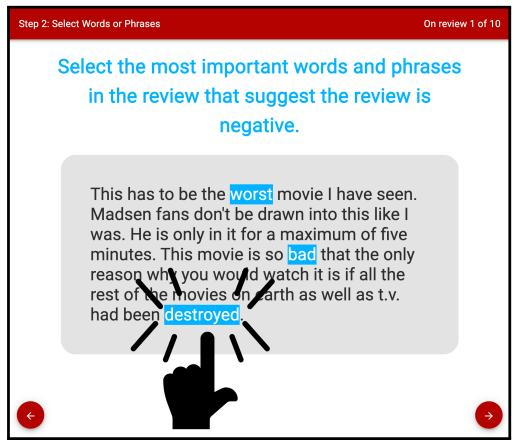
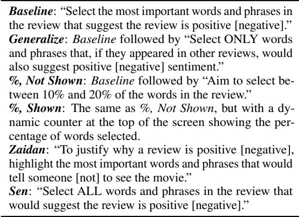
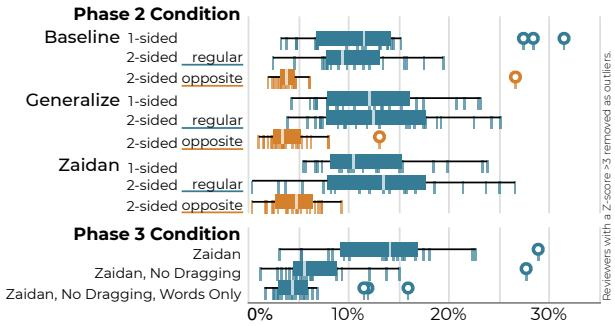
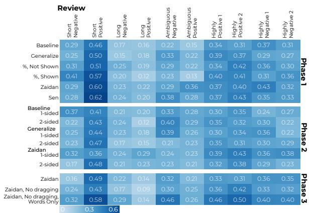
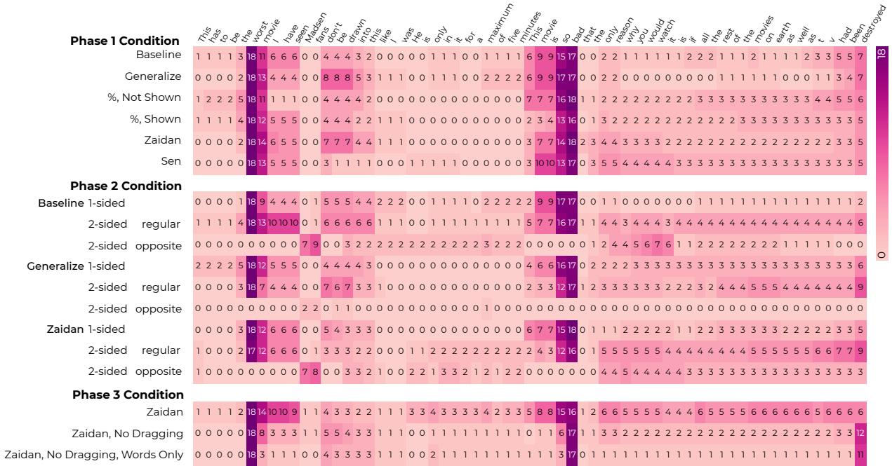
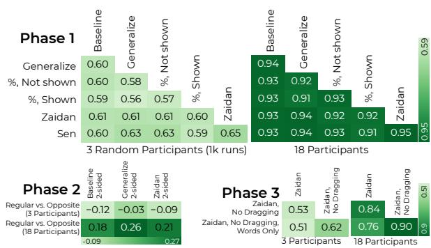
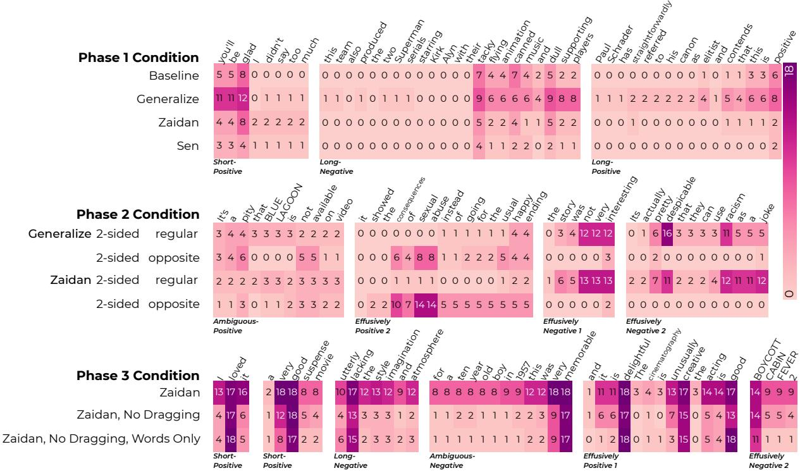
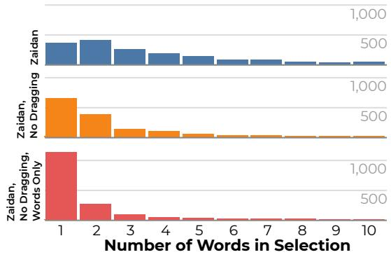
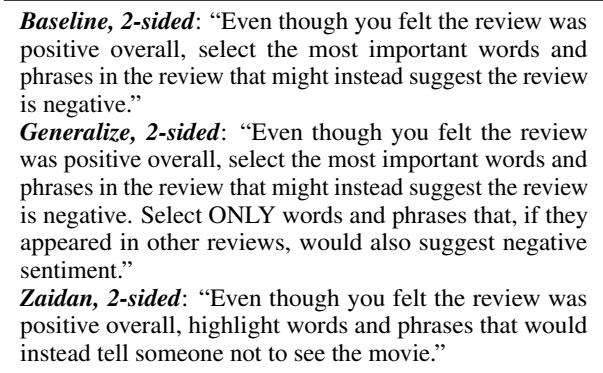

# Explaining Why: How Instructions and User Interfaces Impact Annotator Rationales When Labeling Text Data

Jamar L. Sullivan Jr., Will Brackenbury, Andrew McNutt, Kevin Bryson, Kwam Byll, Yuxin Chen, Michael L. Littman†, Chenhao Tan, Blase Ur University of Chicago,  Brown University

{jlsullivan2,wbrackenbury,mcnutt,kbryson}@uchicago.edu {kbyll,chenyuxin,chenhao,blase}@uchicago.edu mlittman@cs.brown.edu

## Abstract

In the context of data labeling, NLP researchers are increasingly interested in having humans select rationales, a subset of input tokens relevant to the chosen label. We conducted a 332-participant online user study to understand how humans select rationales, especially how different instructions and user interface affordances impact the rationales chosen. Participants labeled ten movie reviews as positive or negative, selecting words and phrases supporting their label as rationales. We varied the instructions given, the rationaleselection task, and the user interface. Participants often selected about 12% of input tokens as rationales, but selected fewer if unable to drag over multiple tokens at once. Whereas participants were near unanimous in their data labels, they were far less consistent in their rationales. The user interface affordances and task greatly impacted the types of rationales chosen. We also observed large variance across participants.

## 1 Introduction

There is a growing effort in NLP to collect humanprovided justifications in addition to labels during annotation (Wiegreffe and Marasovic´, 2021). These justifications can take many forms, ranging from subsets of input tokens (henceforth rationales) to natural language. They can provide additional information on how the label is derived from the input and are hypothesized to improve the robustness of models by correcting spurious correlations and enhancing the transparency of models for human-AI collaboration. Tan (2021) points out that diverse instructions can be used to collect even simple forms

Zaidan et al. (2007): “To justify why a review is positive [negative], highlight the most important words and phrases that would tell someone [not] to see the movie.” Sen et al. (2020): “Select ALL words and phrases in the review that would suggest the review is positive [negative].”

Table 1: Example instructions from prior work for annotating rationales in sentiment analysis.

of rationales. Table 1 shows example instructions from prior work on sentiment analysis for movie reviews. Zaidan et al. (2007) define positive reviews as telling someone to see the movie, asking the human to annotate “the most important” words and phrases. Sen et al. (2020) instead ask the human to highlight “ALL” words and phrases that “suggest the review is positive” without defining “positive.”

It remains an open question how these divergent instructions and other human-centered design decisions affect the collection of rationales. In this work, we conduct the first study of how to collect rationales by investigating how these factors affect the process and the rationales ultimately collected. We use sentiment analysis as a testbed. Rather than building a large dataset, we study how different design choices impact the collection of rationales. We thus ask all participants to label the sentiment of the same ten IMDB movie reviews and provide rationales for their selections, varying the instructions and interface in a between-subjects experiment.

Our experiment had three phases of data collection, with 332 participants total across phases. First, we assigned participants to one of six sets of instructions explaining what rationales are. Second, we tested a variation in which participants annotated rationales not just in support of the binary classification label they chose, but in support of the opposite label, which we term two-sided rationales. Finally, we varied both a key interface affordance—the ability to drag to select multiple words at once—and whether participants were asked to select “words and phrases” or just “words.” Superficially, one might expect the dragging affordance not to affect rationales since annotators can always click all relevant words individually.

These three phases of our between-subjects experiment let us answer four key research questions:

• RQ1: How do instructions and interfaces impact thefraction ofwords selected as rationales?

• RQ2: How consistently do different annotators select rationales? Do instructions and interfaces impact inter-annotator consistency?

• RQ3: How do instructions and interfaces shape which types ofwords are selected as rationales?

• RQ4: How long does selecting rationales take?

When instructed to select “words and phrases” as rationales and given an interface where they could click individual words or drag over multiple words, the median participant selected about 12% of words as rationales. This fraction did not vary significantly based on instructions. However, we observed high variance across participants; some selected only a few words, while others selected one-third of them. Without the dragging affordance, participants instead selected only about 5% of words. Participants (with dragging) selected 4% of words as rationales for the label not chosen.

Participants were near unanimous in the labels chosen (Krippendorff’s α close to 1.0). In contrast, rationales were fairly inconsistent (α around 0.3) even when keeping the instructions and interface constant. As such, rationales collected from only a few annotators can be highly variable, impacting their downstream usage. The instructions and interface minimally impacted inter-annotator reliability.

Both the availability of the dragging affordance and the task (selecting “words and phrases” or just “words”) greatly impacted which words were selected as rationales. In part, these factors impacted how much context participants included in rationales. Given the dragging affordance, participants tended to select full phrases like “worst movie I have seen” as rationales. Without this affordance, they tended to select only “worst movie.” Asked to select “words” (vs. “words and phrases”), they tended to select single adjectives, such as “worst.” In contrast, instructions had only a small impact.

A few words in each review were labeled as rationales by nearly all participants regardless of their assigned condition. However, participants varied greatly from each other in whether they labeled parts of reviews expressing ambiguous and indirect thoughts as rationales, as well as how they handled negation and complex sentences. Finally, we found that providing one-sided rationales took about 2.5 as long as providing only labels. Thus, researchers may consider rationales worthwhile to collect if they provide greater benefit than having 2.5 as much data with only labels. We conclude by discussing lessons for collecting rationales.

## 2 Related Work

Our work is primarily related to two strands of prior work: the construction of explanation datasets and understanding the quality of annotated rationales.

Explanation Datasets: Driven by growing interest in interpretable ML (Doshi-Velez and Kim, 2017; Arrieta et al., 2020), many researchers (Mc-Donnell et al., 2016, 2017; DeYoung et al., 2019; Sen et al., 2020; Zaidan and Eisner, 2008; Zaidan et al., 2007; Lehman et al., 2019; Thorne et al., 2018; Khashabi et al., 2018; Carton et al., 2018) have collected datasets of human explanations. See Wiegreffe and Marasovic´ (2021) for a survey.

Despite this interest, to our knowledge we are the first researchers to focus on the HCI design space of rationale collection. In particular, we focus on a particular type of explanation: highlighting parts of the input that suggest the chosen label without further explanations of the mechanism. This approach is sometimes also termedfeaturefeedback.

Aiming to improve the user experience of data labeling, Choi et al. (2019) used attention-based models to automatically highlight potentially important words. They also enabled crowdworkers to highlight missing important words (rationales) to improve their attention model, but did not study the design of rationale-selection interfaces.

Quality of Existing Rationales: Further motivating the study of the rationale-annotation process, Carton et al. (2020) found substantial variance in the quality of existing rationale datasets. They measured the sufficiency and comprehensiveness of human rationales based on machine learning models. Many studies have also found that learning from existing rationale datasets can hurt model performance, or that any improvement is marginal or limited to secondary goals like explanation quality (Plumb et al., 2020; Ross et al., 2017; Zaidan et al., 2007). Recent work in the HCI community has shown that unclear or imprecise requester instructions can lead to differences between (label) annotations (Chang et al., 2017), partially inspiring our examination of the instructions provided for annotating rationales. By investigating the annotation process, our work can shed light on how the shortcomings of rationale datasets may arise.

  
Figure 1: Our Baseline interface for annotating rationales. Users highlight words or phrases that suggest their chosen sentiment label by clicking on individual words (as here) or by dragging over phrases.

## 3 Method

In this section, we present the design of our experiment and its detailed procedures.

## 3.1 Study Structure

The broad task presented to participants was first to label the sentiment of a movie review as positive or negative, and then to choose words and phrases from the review supporting that label (the rationale). We randomly assigned each participant to a condition (Section 3.2) specifying the precise instructions given for selecting rationales, the specific rationale-selection task, and the user interface. Before proceeding, we provided a tutorial (with animated examples) adapted for each condition about how to select the label and rationales. At the end of the tutorial, we asked two quiz questions, giving the correct answer if participants answered incorrectly.

Participants were then redirected to a React web app we created. For each of ten movie reviews (Section 3.3), participants read the review and labeled it as positive or negative. On the next screen (Figure 1), they provided their rationale. The task wording, specified by their condition, appeared in blue at the top. Except when specified otherwise by their condition, participants were asked to select words and phrases as rationales either by clicking words individually or by dragging across multiple words at once. Words and phrases changed from black text on a white background to white text on a blue background when selected. They could be deselected and reselected. We required that participants select at least one word as a rationale per review to continue. Although we focus on quantitatively analyzing the process and outcomes of rationale annotation, we collected other information, including an exit survey (see Appendix B).

  
Table 2: The six sets of instructions representing the conditions in Phase 1 of data collection.

## 3.2 Conditions

Participants were randomly assigned to a condition.   
The set of conditions changed across phases.

Phase 1 compared the six sets of instructions shown in Table 2. Baseline aimed to be neutral and straightforward, also providing a baseline for creating subsequent conditions. Generalize tested whether prompting annotators to focus on generalizability impacted rationales. %, Not Shown and %, Shown tested encouraging annotators to select a specified fraction of words; the latter also showed a dynamic counter of the fraction. Finally, to compare with prior work, Zaidan and Sen were instructions used in similar tasks by Zaidan and Eisner (2008) and Sen et al. (2020), respectively.

Phase 2 investigated augmenting traditional rationales for the binary classification label selected (termed regular rationales) with rationales for the label not selected (opposite rationales). We use one-sided to mean collecting only regular rationales (as in Phase 1 and Phase 3) and two-sided to mean collecting both regular and opposite rationales. Prior work has studied only one-sided rationales. We repeated three of the most promising instructions from Phase 1: Baseline; Generalize; and Zaidan. We also tested two-sided analogues of each: Baseline, 2-sided; Generalize, 2-sided; and Zaidan, 2-sided. An example instruction for opposite rationales in Baseline, 2-sided was: “Even though youfelt the review was positive overall, select the most important words and phrases in the review that might instead suggest the review is negative.” See Appendix A for the full wordings.

Phase 3 examined the impact of varying interface affordances and the task. We used the one-sided version of Zaidan (repeated from both Phase 1 and Phase 2) as our baseline because it was most representative of both the other conditions and prior work. We hypothesized that removing the drag affordance—forcing participants to click each word in multi-word phrases individually—might make participants more intentional and careful in rationale selection. We tested a version of this limited interface (Zaidan, No Dragging) that, as in other conditions, asked participants to select “words and phrases” as rationales. In contrast, (Zaidan, No Dragging, Words Only) only asked participants to select “words” as rationales. We hypothesized this change would make participants less likely to select potentially superfluous words. Finally, to understand how much additional time rationale annotation requires, as a baseline we ran a Labels Only condition in which participants did not provide rationales, representing common practice.

## 3.3 Dataset and Review Selection

We used a highly cited dataset of 50,000 polarized movie reviews Maas et al. (2011) originally collected from IMDB. Because our goal was to collect rich data from many participants about a small set of reviews, we chose a set of ten reviews that we showed to all participants in the same order. The reviews in the full dataset vary greatly in length and the contents of the review. To capture these variations in our sample, we chose two highly positive reviews, two highly negative reviews, two long reviews (one positive, one negative), two short reviews (one positive, one negative), and two ambiguous reviews (in which the review text primarily summarizes the film, as opposed to justifying the rating). We chose the last category to understand what parts of a review other than subjective statements of opinion would be chosen as rationales. Appendix D contains these ten reviews’ full text.

## 3.4 Recruitment and Participants

We recruited participants on the Prolific crowdsourcing service for a “study in which you label movie reviews.” We required participants live in the USA or UK and have a 95%+ approval rating over 100+ prior tasks. To minimize fatigue, we designed the study to take 30 minutes; it took the median participant 33 minutes. We compensated participants \$10 USD. Recruitment for subsequent phases excluded participants from previous phases. Data for Phase 1 and Phase 2 was collected in August 2021, and data for Phase 3 in September 2021.

We had 332 participants (119 in Phase 1, 125 in Phase 2, and 88 in Phase 3). 52.7% were men, 44.3% were women, 1.8% were non-binary, and 1.2% preferred not to say. Regarding age ranges, 15.4% were 18–24, 36.1% were 25–34, 25.3% were 35–44, 13.0% were 45–54, 6.9% were 55-64, 2.7% were 65+, and 0.6% preferred not to say. 1.8% preferred not to state their race, while 75.6% identified as white, 7.8% as Asian, 7.5% as Black, 3.3% as Hispanic/Latine, 0.3% as Native American, and 3.6% as mixed race. 97.3% spoke English natively.

At least 18 participants were randomly assigned to each condition. To facilitate visual comparisons between conditions in Section 4, we randomly selected 18 participants for each condition containing more than 18, reporting results only on those 18.

## 4 Results

We present our key results organized by the four research questions described in Section 1.

## 4.1 Fraction of Words Selected (RQ1)

The fraction of words selected as rationales varied slightly across instructions, but substantially across both interfaces and individual participants. The median participant per Phase 1 condition selected between 8.7% and 13.4% of the 2,254 total words (across 10 reviews) as rationales; differences across conditions were not significant. In contrast, individual participants varied greatly. For example, 25% of Zaidan participants selected under 8.8% of words as rationales, while 25% selected over 18.2%. The standard deviation (σ) per Phase 1 condition ranged from 4.1% to 6.9%.

While prior work focused on rationales supporting the binary classification label selected, in Phase 2 we also investigated rationales for the label not selected, which we termed opposite rationales (vs. regular rationales). We found that the median participant in two-sided conditions selected between 3.5% and 4.8% of words as opposite rationales (orange boxes in Figure 2), versus between 10.3% and 12.9% as regular rationales. This suggests one-sided rationales may miss some potentially explanatory information, augmenting prior work that noted the presence of positive words in negative reviews (Aithal and Tan, 2021).

  
Figure 2: Distribution of the total fraction of words chosen as rationales (across all ten reviews) by condition.

In Phase 3, we varied both the task and interface, which significantly impacted the fraction of words selected as rationales (Welch’s t = 7.367, $p < . 0 0 1 )$ ). Requiring each word to be clicked individually resulted in fewer words being selected as rationales than also allowing participants to drag over multiple words at once; the fractions of words selected by the median participants in Zaidan, No Dragging (5.7%) and Zaidan, No Dragging, Words Only (4.5%) were much lower than in Zaidan (14.2%). However, the range among participants asked to select “words” (1.8% to 16.1%) was smaller than for those asked to select “words and phrases” (1.3% to 27.8%), as shown in Figure 2.

## 4.2 Consistency of Rationale Selection (RQ2)

Participants were highly consistent in the binary classification labels they chose, but far less consistent in the rationales they chose. We calculated Krippendorff’s α, a common measure of inter-rater agreement applicable to any number of coders, for both labels and rationales. For six of the ten reviews, the αfor classification labels was 1.0 (unanimous agreement) in every condition. For the remaining four reviews (two long and two ambiguous reviews), α was always at least 0.8 in every condition. We suspect long reviews are more likely to include mixed opinions, and the sentiment of reviews mostly summarizing a movie is debatable.

In contrast, α for rationales ranged from 0.28 to 0.35 (mean across reviews) for each one-sided condition in Phase 1 or Phase 2. As shown in Figure 3, α tended to be highest for short reviews and lowest for long reviews and ambiguous reviews. For the two-sided conditions in Phase 2, we found that the mean α for regular rationales (those matching the chosen label) similarly ranged from 0.27 to 0.29. However, α for opposite rationales ranged from 0.19 to 0.26, indicating somewhat lower agreement.

  
Figure 3: Inter-annotator agreement (Krippendorff’s α) for rationales by condition (row) and review (column).

Phase 3’s Zaidan, No Dragging, Words Only condition, the only one in which we told participants to select “words” (vs. “words and phrases”), had the highest mean α: 0.38. In contrast, the mean α was 0.29 for Zaidan, No Dragging, which differed only in asking participants to select “words and phrases.” In other words, participants were somewhat more consistent when selecting only words as rationales.

## 4.3 The Words Chosen as Rationales (RQ3)

Figure 4 is a heatmap showing how many of the 18 participants per condition chose particular words in the Short-Negative review as rationales. Our supplementary data file contains heatmaps for the other nine reviews. This heatmap exemplifies a few important trends detailed in the remainder of this section. First, a handful of words were selected as rationales by nearly all participants regardless of their condition. However, there was a long tail of words selected by some or all participants in only certain conditions. Specifically, varying the instructions minimally impacted the rationales. Varying the interface, however, had a large impact.

Similarity of Rationales: To quantify how the words selected as rationales compared across conditions, we computed the pairwise Pearson correlation of conditions’ frequency vectors (e.g., as visualized in Figure 4) concatenated across all ten reviews. We computed correlations both for sets of three randomly selected participants per condition (averaged across 1,000 runs) and for all 18.

  
Figure 4: The number of participants (of 18) who selected each word in the Short-Negative review as a rationale. All labeled the review as negative. We observed high agreement about a few words, but a long tail of disagreement.

  
Figure 5: Pairwise Pearson correlations of condition regarding the frequency with which participants selected words as rationales (as in Figure 4). These frequencies represent either 3 random participants per condition (averaged across 1,000 runs) or all 18. The Phase 2 table compares only regular and opposite rationales.

As shown in Figure 5, Phase 1 conditions had average pairwise correlations between 0.56 and 0.65 for sets of three participants, and between 0.91 and 0.95 for all 18 participants. In short, the instructions had only a minor impact on which words were selected as rationales.

In contrast, the interface had a greater impact on the words chosen as rationales. The two Phase 3 conditions without the dragging affordance had correlations of only 0.51–0.53 (3 participants) or 0.76–0.84 (18 participants) with Zaidan.

Note that we observed large differences in correlation values between sets of 3 participants and sets of 18 participants because a number of words were selected by only some participants, as opposed to nearly all (see Figure 4). Participants behaved similarly across conditions regarding these debatable rationales, so these differences were smoothed out in a large set of participants (e.g., 18).

Context in Rationales: A key aspect of how the interface impacted participants’ approach was how much context the rationale contained. The phrase “worst movie I have seen” in Figure 4 provides a clear example. Every participant in all three relevant Phase 3 conditions selected “worst” as a rationale. However, whereas nine Zaidan participants (50%) selected the whole phrase as a rationale, the same was true of only three Zaidan, No Dragging participants (16.7%) and one Zaidan, No Dragging, Words Only participant (5.6%). Furthermore, whereas eight Zaidan, No Dragging participants (44.4%) selected “worst movie,” only three Zaidan, No Dragging, Words Only participants (16.7%) did.

“This movie is so bad” in Figure 4 demonstrates a related distinction. Roughly half of participants whose interface had the dragging affordance (all Phase 1 conditions and Phase 3 Zaidan) selected “movie is so bad,” and the vast majority selected at least “so bad.” In contrast, lacking a dragging affordance in Zaidan, No Dragging and Zaidan, No Dragging, Words Only, most participants selected only “bad.” Figure 6’s Phase 3 section gives more examples of similar phenomena in other reviews.

  
Figure 6: Illustrative examples of differences across conditions in participants’ rationales from other reviews.

  
Figure 7: Distribution of phrase length (the number of consecutive words selected) in Phase 3 with outliers removed. Disabling dragging resulted in shorter phrases.

Changes in participants’ approach based on the inclusion/absence of the dragging affordance and the selection task also manifested in the distribution of phrase length (the number of consecutive words selected as rationales). As shown in Figure 7, participants with a dragging affordance selected rationales of various lengths; two-word rationales were most common. Without the dragging affordance but still asked to select “words and phrases,” 46.8% of rationales contained just one word. However, when instead asked to select “words,” 71.0% of rationales contained one word.

Parts of Speech: The interface, and to a lesser extent the task, impacted the parts of speech (POS) selected as rationales for sentiment classification.

Removing the drag affordance, as well as asking participants to select only words, led participants to focus on adjectives. Our analysis used the Python NLTK pos\_tag module.

For example, among the words selected as rationales in Zaidan (Phase 3), 26.9% were nouns, 17.8% were verbs, and 17.1% were adjectives. In stark contrast, for Zaidan, No Dragging, Words Only, adjectives were the most common (37.4%), followed by nouns (22.3%) and verbs (19.4%).

Looking at this data differently, 31.3% of appearances of adjectives were selected as rationales in Zaidan, alongside 10.3%–25.1% of appearances of each other POS. As previously mentioned, Zaidan, No Dragging, Words Only participants selected far fewer words overall. Nonetheless, 22.0% of appearances of adjectives were still selected, but only 0.6%–6.7% of appearances of each other POS.

That said, participants’ focus on adjectives may be a byproduct of our choice of sentiment analysis as the annotation task. Relative to other parts of speech, adjectives are more likely to encode sentiment information. Future work should examine how the POS distribution differs for other tasks.

Handling Complexity: Participants varied in whether they tagged as rationales phrases and sentences conveying complex thoughts and relationships. For instance, a few participants in each condition generally selected most of the long final sentence in Figure 4 as a rationale: “the only reason why you would watch it is if all the rest of the movies on earth as well as t.v. had been destroyed.” This phrase only indirectly comments on the movie being reviewed, which appears to have divided participants. In contrast, the majority of participants in conditions without the drag affordance selected just the final word: “destroyed.”

In part, this phenomenon seemed to relate to the generalizability of the thought being expressed. For instance, in “you’ll be glad I didn’t say too much,” (Figure 6, Phase 1), most Generalize participants selected “you’ll be glad.” In any case, about half of participants across Phase 1 conditions selected “glad.” This oblique reference does not comment directly on the movie being reviewed, yet one can imagine parts of this phrase indicating positive sentiment in other contexts. The opposite approach to generalization is visible in Figure 4. Seven participants each in Baseline, 2-sided and Zaidan, 2-sided selected “Madsenfans” as opposite rationales. This phrase references a specific actor and is unlikely to generalize, so only two Generalize, 2-sided participants selected this phrase.

Bifacial Words: In some cases in two-sided conditions (Phase 2), particularly when the review was expressing a complex thought, the same word was selected as both a regular and an opposite rationale. For example, in the Generalize, 2-sided and Zaidan, 2-sided conditions, 72.2% and 77.8% of participants, respectively, chose the same word for both sides of their rationale at least once across the ten reviews. For example, as in Figure 6, this phenomenon appears for negation (“not very interesting” vs. “interesting”) and concepts that are absent (“instead of going for the usual happy ending” vs. “happy ending”). This observation shows that modeling contextual information is critical for leveraging rationales. Such complex rationales may have limited use in bag-of-words approaches.

## 4.4 Time Taken to Provide Rationales (RQ4)

While rationales hold promise for supporting downstream natural language processing tasks, collecting rationales alongside classification labels takes longer than collecting labels alone. Quantifying how much longer, and thus how much less data would be labeled with rationales, can inform whether this richer rationale information justifies labeling less data. While some prior work (Mc-Donnell et al., 2017; Zaidan et al., 2007) has timed rationale selection informally, it did not examine variations among a large, diverse set of participants.

Compared to only collecting labels, also collecting one-sided rationales took roughly 2.5 as long (comparing Labels Only to Zaidan in Phase 3). This finding suggests that rationales must provide as much benefit as having 2.5 as much data with only labels to be worthwhile. Providing two-sided rationales took roughly 3.8 as long.

Comparing one-sided conditions in Phase 1 and Phase 2, the instructions did not significantly impact the time taken. In Phase 3, Zaidan, No Dragging and Zaidan, No Dragging, Words Only participants took significantly less time than Zaidan participants (t = 5.254, p < 0.001), though participants in those conditions also selected significantly fewer words as rationales (see Section 4.1).

## 5 Concluding Discussion

We conducted the first study of how to collect rationales. Our results have implications for UI design for this task, as well as for how rationales are used. Affordances: Interface affordances mattered more than instruction wordings, suggesting that HCI factors overlooked in prior work critically impact the characteristics of rationales collected from humans. It is critical that future work carefully consider, and also carefully report, these design factors to allow for replicable studies and effective comparisons. We also encourage researchers to open-source interfaces used for data annotation.

Low Inter-annotator Agreement: The low interannotator agreement we observed draws into question approaches in past work (DeYoung et al., 2019) of using rationale annotation as ground truth to evaluate machine-generated rationales. It also suggests the need for more nuanced ways to combine rationale annotations from humans, rather than simply treating rationales as another binary classification. To this end, it may be important to embrace these exhibited ambiguities and develop novel algorithms that can learn from the distributions of rationale annotations. The role of phrases highlights the importance of moving beyond bag-of-words approaches in incorporating rationales. In contrast, if researchers want to emphasize collecting consistent (if semantically limited) rationales from annotators, it may be best not to provide a drag affordance.

Two-sided Rationales: While prior work focuses on one-sided rationales, our results show that a non-trivial fraction of words imply the opposite sentiment. This finding is especially important for sentiment analysis, and it echoes recent studies showing that negative reviews nonetheless contain positive words (Aithal and Tan, 2021). However, two-sided rationale collection took our participants far more time than one-sided, suggesting that future work investigate UX strategies to reduce this time. Limitations: Our work focused on a single task, sentiment analysis, and was based on ten curated reviews. Furthermore, we explored only one of many possible workflows (e.g., selecting rationales at the same time as selecting the sentiment label). Experiments with diverse datasets and tasks, as well as alternative workflows, can verify the robustness of our findings. However, we believe our work represents a valuable contribution toward understanding how HCI factors impact rationale annotation.

Risks: Annotation seeking to maximize rationale consistency may exclude diverse opinions.

Availability: We have made data and code available in both the online data supplement and on GitHub (Sullivan Jr. et al., 2022). Our data supplement contains heatmaps analogous to Figure 4 for all ten reviews, as well as the full data (rationales, detailed timing/click information, survey responses) for the 92% of participants who granted us optional permission to release their data. Our opensource code consists of our rationale-annotation UI, which was written in the React framework.

Ethics: Our study was determined to be exempt by UChicago’s IRB. We built on our institution’s model consent form for online studies. Participants checked boxes to affirm consent. We did not collect any PII beyond Prolific IDs. Our compensation (\$10 USD) for a study that took a median of 33 minutes corresponds to an \$18 USD hourly wage.

## Acknowledgements

This material is based upon work supported by the National Science Foundation in collaboration with Amazon under Grant No. 1939728, as well as work supported by the National Science Foundation under Grant No. 2126602.

## References

Madhusudhan Aithal and Chenhao Tan. 2021. On positivity bias in negative reviews. In Proceedings ofthe 59th Annual Meeting of the Association for Computational Linguistics and the 11th International Joint Conference on Natural Language Processing (Volume 2: Short Papers).

Alejandro Barredo Arrieta, Natalia Díaz-Rodríguez, Javier Del Ser, Adrien Bennetot, Siham Tabik, Alberto Barbado, Salvador García, Sergio Gil-López, Daniel Molina, Richard Benjamins, et al. 2020. Explainable artificial intelligence (XAI): Concepts, taxonomies, opportunities and challenges toward responsible AI. Information Fusion, 58:82–115.

Samuel Carton, Qiaozhu Mei, and Paul Resnick. 2018. Extractive adversarial networks: High-recall explanations for identifying personal attacks in social media posts. In Proceedings of the 2018 Conference on Empirical Methods in Natural Language Processing.

Samuel Carton, Anirudh Rathore, and Chenhao Tan. 2020. Evaluating and characterizing human rationales. arXiv:2010.04736.

Joseph Chee Chang, Saleema Amershi, and Ece Kamar. 2017. Revolt: Collaborative crowdsourcing for labeling machine learning datasets. In Proceedings of the 2017 CHI Conference on Human Factors in Computing Systems.

Minsuk Choi, Cheonbok Park, Soyoung Yang, Yonggyu Kim, Jaegul Choo, and Sungsoo Ray Hong. 2019. AILA: Attentive interactive labeling assistant for document classification through attention-based deep neural networks. In Proceedings of the 2019 CHI Conference on Human Factors in Computing Systems.

Jay DeYoung, Sarthak Jain, Nazneen Fatema Rajani, Eric Lehman, Caiming Xiong, Richard Socher, and Byron C. Wallace. 2019. Eraser: A benchmark to evaluate rationalized NLP models. arXiv:1911.03429.

Finale Doshi-Velez and Been Kim. 2017. Towards a rigorous science of interpretable machine learning. arXiv:1702.08608.

Daniel Khashabi, Snigdha Chaturvedi, Michael Roth, Shyam Upadhyay, and Dan Roth. 2018. Looking beyond the surface: A challenge set for reading comprehension over multiple sentences. In Proceedings of the 2018 Conference of the North American Chapter ofthe Associationfor Computational Linguistics: Human Language Technologies, Volume 1 (Long Papers).

Eric Lehman, Jay DeYoung, Regina Barzilay, and Byron C Wallace. 2019. Inferring which medical treatments work from reports of clinical trials. In Proceedings of the 2019 Conference of the North American Chapter of the Association for Computational Linguistics: Human Language Technologies, Volume 1 (Long and Short Papers).

Andrew L. Maas, Raymond E. Daly, Peter T. Pham, Dan Huang, Andrew Y. Ng, and Christopher Potts. 2011. Learning word vectors for sentiment analysis. In Proceedings of the 49th Annual Meeting of the Association for Computational Linguistics: Human Language Technologies.

Tyler McDonnell, Mücahid Kutlu, Tamer Elsayed, and Matthew Lease. 2017. The many benefits of annotator rationales for relevance judgments. In Proceedings of the 26th International Joint Conference on Artificial Intelligence.

Tyler McDonnell, Matthew Lease, Mucahid Kutlu, and Tamer Elsayed. 2016. Why is that relevant? collecting annotator rationales for relevance judgments. In Proceedings of the AAAI Conference on Human Computation and Crowdsourcing.

Gregory Plumb, Maruan Al-Shedivat, Angel Alexander Cabrera, Adam Perer, Eric Xing, and Ameet Talwalkar. 2020. Regularizing black-box models for improved interpretability. arXiv:1902.06787.

Andrew Slavin Ross, Michael C. Hughes, and Finale Doshi-Velez. 2017. Right for the right reasons: Training differentiable models by constraining their explanations. arXiv:1703.03717.

Cansu Sen, Thomas Hartvigsen, Biao Yin, Xiangnan Kong, and Elke Rundensteiner. 2020. Human attention maps for text classification: Do humans and neural networks focus on the same words? In Proceedings ofthe 58th Annual Meeting ofthe Associationfor Computational Linguistics.

Jamar L. Sullivan Jr., Will Brackenbury, Andrew McNutt, Kevin Bryson, Kwam Byll, Yuxin Chen, Michael L. Littman, Chenhao Tan, and Blase Ur. 2022. Open-source code release. GitHub repository. https: //github.com/UChicagoSUPERgroup/ rationales-naacl22.

Chenhao Tan. 2021. On the diversity and limits of human explanations. arXiv:2106.11988.

James Thorne, Andreas Vlachos, Christos Christodoulopoulos, and Arpit Mittal. 2018. FEVER: A large-scale dataset for Fact Extraction and VERification. In Proceedings of the 2018 Conference of the North American Chapter of the Association for Computational Linguistics: Human Language Technologies, Volume 1 (Long Papers).

Sarah Wiegreffe and Ana Marasovic. 2021. Teach me´ to explain: A review of datasets for explainable NLP. arXiv:2102.12060.

Omar Zaidan and Jason Eisner. 2008. Modeling annotators: A generative approach to learning from annotator rationales. In Proceedings of the 2008 Conference on Empirical Methods in Natural Language Processing.

Omar Zaidan, Jason Eisner, and Christine Piatko. 2007. Using “annotator rationales” to improve machine learning for text categorization. In Proceedings of Human Language Technologies 2007: The Conference of the North American chapter of the Association for Computational Linguistics.

## A Wordings for Two-sided Conditions

  
Table 3: Example instructions for opposite rationales (“positive” labels) in Phase 2’s two-sided conditions.

## B Additional Information Collected

Participants were asked to rate their confidence in their labeling and rationales on five-point Likert scales before proceeding to the next review. Following these tasks, participants completed a survey. We first asked Likert-scale and open-ended questions about the process of labeling a review as positive or negative: the difficulty of doing so, the participant’s approach, what they focused on, and what could have been improved about the instructions and UI. We then asked about selecting rationales, the order in which participants selected words or phrases, and whether they chose “words or phrases that, if they appeared in other reviews, would also suggest the same positive/negative sentiment.” Finally, we asked demographic questions. Appendix C contains our survey instrument.

## C Survey Instrument

Almost done! We have a few final pages of questions about your experience across all 10 reviews.

## C.0.1 Page 1

This first page asks about your experience determining whether a review was positive or negative.

1. Please respond to the following statement: Determining whether a review was positive or negative was difficult.

Strongly agree  Agree  Somewhat agree  Neither agree or disagree  Somewhat disagree  Disagree  Strongly disagree

## 2. Why?

3. Please briefly describe your process for determining whether a review was positive or negative.

4. What parts of the review did you focus on in determining whether a review was positive or negative?

5. What, if anything, could have been more clear about the instructions you were given for labeling movie reviews as positive or negative?

6. What could have been improved about the user interfaces for any parts of today’s task (other than the surveys)? If you encountered any issues or errors, please include them here.

## C.0.2 Page 2

This page was excluded for Labels Only participants, and questions were reworded to replace “words or phrases” with “words” for Zaidan, No Dragging, Words Only participants.

This page asks about your experience selecting the words or phrases you considered important.

1. Please respond to the following statement: Selecting the words or phrases I considered important was difficult.

Strongly agree  Agree  Somewhat agree  Neither agree or disagree  Somewhat disagree Disagree Strongly disagree

## 2. Why?

3. Please briefly describe your process for selecting the words or phrases you considered important.

4. What characteristics of a word or phrase made you select a particular word or phrase as important?

5. Think about a case where you considered selecting a particular word or phrase as important, but chose not to do so.

Please describe this situation, as well as why you ultimately chose not to select those words/phrases as important.

6. What, if anything, could have been more clear about the instructions you were given for selecting words or phrases as important?

## C.0.3 Page 3

This page was excluded for Labels Only participants, and questions were reworded to replace “words or phrases” with “words” for Zaidan, No Dragging, Words Only participants.

1. Please briefly describe the order in which you selected the words or phrases you considered important.

2. Please respond to the following statement:

When selecting words or phrases that I considered important, I selected only words or phrases that, if they appeared in other reviews, would also suggest the same positive/negative sentiment.

Strongly agree  Agree  Somewhat agree  Neither agree or disagree  Somewhat disagree  Disagree  Strongly disagree

## 3. Why?

4. What could have been improved about the user interfaces for any parts of today’s task (other than the surveys)? If you encountered any issues or errors, please include them here.

## C.0.4 Page 4

This final page of the survey asks about your demographics.

1. What is your age? 18–24  25–34  35–44  45–54 55–64  65+  Prefer not to say

2. What is your gender? Woman  Man  Non-binary  Prefer to self-describe \_\_\_\_  Prefer not to say

3. Please specify your ethnicity (select all that apply).

Asian  Black or African American Hispanic or Latinx  Native American or Alaskan Native  Native Hawaiian or Other Pacific Islander White or Caucasian Prefer to self-describe \_\_\_\_  Prefer not to say

4. What is the highest degree or level of education you have completed?

No formal education  Some high school, no diploma High school or equivalent Some college credit, no degree

Trade/technical/vocational training  Associate’s degree Bachelor’s degree Master’s degree  Professional degree (JD, MD) Doctorate degree Prefer to self-describe Prefer not to say

5. Do you, or have you, held a degree or job related to computer science, IT, or similar? Yes  No  I don’t know  Prefer not to say

6. Do you consider yourself to have expertise in computer security?  Yes  No  I don’t know  Prefer not to say

7. Are you a native speaker of the English language?  Yes  No  Prefer not to say

8. (Optional) Is there anything else you’d like to tell us before submitting the survey?

## D Full Text of Reviews

Short-Negative: This has to be the worst movie I have seen. Madsen fans don’t be drawn into this like I was. He is only in it for a maximum of five minutes. This movie is so bad that the only reason why you would watch it is if all the rest of the movies on earth as well as t.v. had been destroyed.

Short-Positive: I first saw this film on hbo around 1983 and I loved it! I scoured all of the auction web sites to buy the vhs copy. This is a very good suspense movie with a few twists that make it more interesting. I don’t want to say too much else because if you ever get a chance to see it, you’ll be glad I didn’t say too much!

Long-Negative: Granting the budget and time constraints of serial production, BATMAN AND ROBIN nonetheless earns a place near the bottom of any "cliffhanger" list, utterly lacking the style, imagination, and atmosphere of its 1943 predecessor, BATMAN.The producer, Sam Katzman, was known as "King of the Quickies" and, like his director, Spencer Bennett, seemed more concerned with speed and efficiency than with generating excitement. (Unfortunately, this team also produced the two Superman serials, starring Kirk Alyn, with their tacky flying animation, canned music, and dull supporting players.) The opening of each chapter offers a taste of things to come: thoroughly inane titles ("Robin Rescues Batman," "Batman vs Wizard"), mechanical music droning on, and our two heroes stumbling toward the camera looking all around, either confused or having trouble seeing through their cheap Halloween masks. Batman’s cowl, with its devil’s horns and eagle’s beak, fits so poorly that the stuntman has to adjust it during the fight scenes. His "utility belt" is a crumpled strip of cloth with no compartments, from which he still manages to pull a blowtorch and an oxygen tube at critical moments!In any case, the lead players are miscast. Robert Lowery displays little charm or individual flair as Bruce Wayne, and does not cut a particularly dynamic figure as Batman. He creates the impression that he’d rather be somewhere, anywhere else! John Duncan, as Robin, has considerable difficulty handling his limited dialogue. He is too old for the part, with an even older stuntman filling in for him. Out of costume, Lowery and Duncan are as exciting as tired businessmen ambling out for a drink, without one ounce of the chemistry evident between Lewis Wilson and Douglas Croft in the 1943 serial.Although serials were not known for character development, the earlier BATMAN managed to present a more energetic cast. This one offers a group going through the motions, not that the filmmakers provide much support. Not one of the hoodlums stands out, and they are led by one of the most boring villains ever, "The Wizard." (Great name!) Actually, they are led by someone sporting a curtain, a shawl, and a sack over his head, with a dubbed voice that desperately tries to sound menacing. The "prime suspects" – an eccentric professor, a radio broadcaster – are simply annoying.Even the established comic book "regulars" are superfluous. It is hard to discern much romance between Vicki Vale and Bruce Wayne. Despite the perils she faces, Vicki displays virtually no emotion. Commissioner Gordon is none-too-bright. Unlike in the previous serial, Alfred the butler is a mere walk-on whose most important line is "Mr Wayne’s residence." They are props for a drawn-out, gimmick-laden, incoherent plot, further saddled with uninspired, repetitive music and amateurish production design. The Wayne Manor exterior resembles a suburban middle-class home in any sitcom, the interiors those of a cheap roadside motel. The Batcave is an office desperately in need of refurbishing. (The costumes are kept rolled up in a filing cabinet!)Pity that the filmmakers couldn’t invest more effort into creating a thrilling adventure. While the availability of the two serials on DVD is a plus for any serious "Batfan," one should not be fooled by the excellent illustrations on the box. They capture more of the authentic mood of the comic book than all 15 chapters of BATMAN AND ROBIN combined.Now for the good news – this is not the 1997 version!

Long-Positive: Prolific and highly influential filmmaker Martin Scorsese examines a selection of his favorite American films grouped according to three different types of directors: the director as an illusionist: D.W. Griffith or F. W. Murnau, who created new editing techniques among other changes that made the appearance of sound and color later step forward; the director as a smuggler: filmmakers such as Douglas Sirk, Samuel Fuller, and mostly Vincente Minnelli, directors who used to disguise rebellious messages in their films; and the director as iconoclast: those filmmakers attacking civil observations and social hang-ups like Orson Welles, Erich von Stroheim, Charles Chaplin, Nicholas Ray, Stanley Kubrick, and Arthur Penn.He shows us how the old studio system in Hollywood was, though oppressive, the way in which film directors found themselves progressing the medium because of how they were bound by political and financial limitations. During his clips from the movies he shows us, we not only discover films we’ve never seen before that pique our interest but we also are made to see what he sees. He evaluate his stylistic sensibilities along with the directors of the sequences themselves.The idea of a film canon has been reputed as snobbish, hence some movie fans and critics favor to just make "lists." However, canon merely denotes "the best" and supporters of film canon argue that it is a valuable activity to identify and experience a select compilation of the "best" films, a lot like a greatest hits tape, if just as a beginning direction for film students. All in all, one’s experience has shown that all writing about film, including reviews, function to construct a film canon. Some film canons can definitely be elitist, but others can be "populist." As an example, the Internet Movie Database’s Top 250 Movies list includes many films included on several "elitist" film canons but also features recent Hollywood blockbusters at which many film "elitists" scoff, like The Dark Knight, which presently mingles in the top ten amidst the first two Godfather films, Schindler’s

List and One Flew Over the Cuckoo’s Nest, and the fluctuation of similar productions further down such as Iron Man, Sin City, Die Hard, The Terminator and Kill Bill: Vol. 2. Writer Scorsese’s Taxi Driver Paul Schrader has straightforwardly referred to his canon as "elitist" and contends that this is positive.Scorsese is never particularly vocal at all about his social and political ideologies, but when we see this intense and admittedly obsessive history lesson on the birth and growth of American cinema in both ideological realms, we see that there is really no particular virtue in either elitism or populism. Elitism concentrates all attention, recognition and thus power on those deemed outstanding. That discrimination could easily lead to self-indulgence much in the vein of the condescending work of Jean-Luc Godard or the overrationalization of the production practices of a filmmaker like Michael Haneke. Yet populism invokes a belief of representative freedom as being only the assertion of the people’s will. As has been previously asserted about the all-encompassing misconceptions the people have about cinema, populism could be the end of the potential power and impact of cinema. One can only continue seeing films, because it is a vital social and metaphysical practice. And that’s what Martin Scorsese spends nearly four hours here trying to tell us, something which can’t be told without being seen first-hand.

Ambiguous-Negative: A giant praying mantis is awakened from its sleep in the artic region and heads south causing havoc. Boats, planes and trains meet their match with the flying creature. Before unleashing its full wrath on NYC, the mantis meets its doom at the hands of the armed forces in a New York tunnel. The special effects are of course crude by todays standards, but for a ten year old boy in 1957 this was very memorable.Starring are William Hopper, Craig Stevens, Alix Talton and Pat Conway.

Ambiguous-Positive: I saw this film as a kid about 30 years ago, and I haven’t forgotten it to this day. I couldn’t say whether it’s a good picture. But in those days I instantly fell in love with Jean Simmons. The memories concentrate on the very erotic feel of the movie, but I still remember the plot. Simmons was very young then, and there is another film that gave me the same feeling: David

Lean’s GREAT EXPECTATIONS. And again it was the young Jean Simmons. It’s a pity that BLUE LAGOON is not available on video; I’d like to correct my memories...

Highly Positive 1: I saw this film in a sneak preview, and it is delightful. The cinematography is unusually creative, the acting is good, and the story is fabulous. If this movie does not do well, it won’t be because it doesn’t deserve to. Before this film, I didn’t realize how charming Shia Lebouf could be. He does a marvelous, self-contained, job as the lead. There’s something incredibly sweet about him, and it makes the movie even better. The other actors do a good job as well, and the film contains moments of really high suspense, more than one might expect from a movie about golf. Sports movies are a dime a dozen, but this one stands out. This is one I’d recommend to anyone.

Highly Positive 2: This is one of the finest TV movies you could ever see. The acting, writing and production values are top-notch. The performances are passionate with Beverly D’Angelo superb as the older woman with a teenage daughter and Rob Estes simply perfect as the young stud boyfriend. However, the best part of this film was how it showed the consequences of sexual abuse instead of going for the usual happy ending. It showed that abuse can happen in good families; involve good people; and wreck lives. It is thought provoking and entertaining. Congratulations to all concerned with this exceptional movie.

Highly Negative 1: This is a god awful Norris film, with one of the most annoying performances ever in Calvin Levels and a weak script. The characters were terrible, and it has hardly any action,plus even Chuck Norris stinks in this!. Christopher Neame is very weak as the main villain, and the story was not very interesting plus Norris seemed bored with the whole thing and i don’t blame him as i was too!. Calvin levels gives one of the most annoying performances in a movie ever, i couldn’t stand as i was tempted to rip the tape out of my VCR, plus Norris and Levels had no chemistry together!. If your looking for some great martial art moves from Norris don’t go near this, however if you want a movie with an uninteresting story, hardly any action and bad acting look further!. This is a god awful Norris film, with one of the most annoying performances ever from Calvin levels, Avoid it like the plague!. The Direction is incredibly bad. Aaron Norris does an incredibly bad job here, with no suspense or thrills bland camera work, and keeping the film at a dull pace!. There is a little bit of blood and violence. We get 2 gory impaling’s,ripped out heart, exploding body and a few gunshot wounds. The Acting is really bad. Chuck Norris is not AMAZING as he usually is here and seemed very bored here, his one liners are flat, and his acting wasn’t that great and i am a huge Norris Fan, this is his absolute worst! (Norris still Rules!).Calvin Levels is INCREDIBLY annoying here, his whiny wimpy performance severely grated me, i was so hoping for him to get it good!, but sadly he didn’t. Christopher Neame is pretty weak as the main villain, his voice was cool, but he over acted big time!. Sheree J. Wilson is beautiful and did okay with what she had to do. Rest of the cast are terrible. Overall Please avoid this it’s not worth the torture, even if you are a huge Norris fan (like me)

Highly Negative 2: This is probably one of the worst films i have ever seen. The events in it are completely random and make little or no sense. The fact that there is a sequel is so sickening i may come down with a case of cabin fever (I’M SO SORRY). I describe it as bug being smooshed to a newspaper because it seems to be different parts of things mixed together. e.g Kevin the pancake loving karate kid is just freakishly weird on its own, then there’s the cop who is slightly weird and perverted, then the drug addict, then there’s the fact that they attack some random guy who clearly needs help. then all of a sudden the main character is having sex with his friends girlfriend just because she says something stupid about a plane going down. then at the end some good old family racism followed by a rabbit operating on Kevin the karate kid. Its actually pretty despicable that they can use racism as a joke in this film. There is no reason for anyone to enjoy this film unless you love Eli Roth, even that did not make me like this film. Hate is a strong word but seeing as it is the only word i am permitted to use it will have to do. BOYCOTT CABIN FEVER 2!!!!!