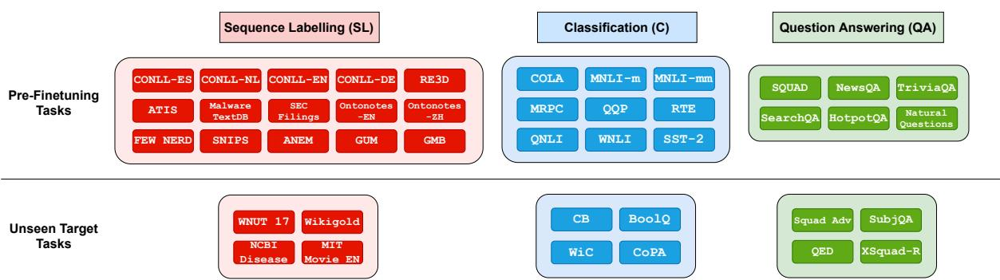
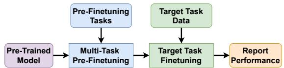

# Exploring the Role of Task Transferability in Large-Scale Multi-Task Learning

Vishakh Padmakumar 1∗ Leonard Lausen2 Miguel Ballesteros3 Sheng Zha2

He He12 George Karypis2

1New York University, 2AWS AI, 3AWS AI Labs

vishakh@nyu.edu

{lausen, ballemig, zhasheng, hehea, gkarypis}@amazon.com

## Abstract

Recent work has found that multi-task training with a large number of diverse tasks can uniformly improve downstream performance on unseen target tasks. In contrast, literature on task transferability has established that the choice of intermediate tasks can heavily affect downstream task performance. In this work, we aim to disentangle the effect of scale and relatedness of tasks in multi-task representation learning. We find that, on average, increasing the scale of multi-task learning, in terms of the number of tasks, indeed results in better learned representations than smaller multi-task setups. However, if the target tasks are known ahead of time, then training on a smaller set of related tasks is competitive to the large-scale multi-task training at a reduced computational cost.

## 1 Introduction

Following the wide success of unsupervised language model pre-training (Devlin et al., 2019; Liu et al., 2019b; Lewis et al., 2019), recent work on transfer learning has shown that additional supervised multi-task training further improves performance on various downstream NLP tasks (Raffel et al., 2019; Khashabi et al., 2020; Aghajanyan et al., 2021). There are two distinct ways in which the supervised data has been used: increasing the scale of the multi-task step to incorporate more tasks (Khashabi et al., 2020; Aghajanyan et al., 2021) and developing task similarity metrics to incorporate tasks related to the target task (Pruksachatkun et al., 2020; Vu et al., 2020).

Aghajanyan et al. (2021) show that a multi-task training step, or pre-finetuning step, with a sufficiently large, diverse set of tasks is an effective taskagnostic second stage of model pre-training before finetuning on target tasks. In particular, they find that using a large number of tasks (e.g., roughly 15 tasks) is crucial in achieving good downstream performance, while pre-finetuning with fewer tasks causes a small performance drop. Meanwhile, work on task transferability (Vu et al., 2020; Pruksachatkun et al., 2020) has shown that the choice of individual intermediate tasks significantly affects downstream fine-tuning performance—predicting the transfer is challenging and there is high variance depending on the choice of intermediate task.

This motivates us to ask the question if prefinetuning on a small group of tasks related to the target tasks can obtain comparable performance to large-scale multi-task training. In this work, we present an empirical study to answer this question by extending the task transferability experiment to groups of tasks.

We follow the two-step experimental pipeline from Aghajanyan et al. (2021), where a pre-trained model is first pre-finetuned on a set of tasks and then separately finetuned on various target tasks on which we report performance. In addition, we group our set of 29 pre-finetuning tasks based on task format into 3 groups—classification tasks, sequence labelling tasks and extractive question answering tasks (Figure 1). We perform model pre-finetuning on every combination of these task groups and report performance on target tasks that belong to each group. This allows us to systematically study how the size of the multi-task step and the choice of pre-finetuning tasks affects downstream task performance.

We observe that, on average, large-scale multitask pre-finetuning results in improved performance on downstream target tasks. We also see that a model trained on related1 pre-finetuning tasks obtains comparable downstream task performance to the large-scale model, at a reduced computational cost2, but pre-finetuning on an unrelated grouping can result in a severe decline in performance.

  
Figure 1: List of tasks grouped into sequence labelling (SL), question answering (QA) and classification (C).

  
Figure 2: High level workflow of the multi-task setup.

Our findings show the interplay between multitask scaling and task selection—when the target tasks are unknown then multi-task scaling is an effective, if expensive, intermediate step but if the goal is to improve performance on a specific target task set then multi-task training on a smaller set of related tasks is an effective cheaper alternative. These results also hint at the need to better study modeling techniques that mitigate negative transfer between tasks in large-scale multi-task training.

## 2 Multi-task Setup

Our multi-task experiments follow the two step approach from Aghajanyan et al. (2021), shown in Figure 2. A pre-trained model is first pre-finetuned on a set of tasks to obtain a single shared encoder. This model is then finetuned separately on various target tasks on which we report performance.

Grouping of Tasks Figure 1 shows our list of 29 pre-finetuning tasks and 12 unseen target tasks (listed in Appendix A). Informed by prior work (Vu et al., 2020; Ye et al., 2021; Sanh et al., 2021), we divide these datasets into three groups based on task format—sequence labelling (SL), extractive question answering (QA) and classification (C). As noted in Sanh et al. (2021), grouping of NLP tasks is an imperfect heuristic. Prior work (Achille et al., 2019; Vu et al., 2020) formalizes the notion of task similarity using learned task embeddings so an alternate formulation would be to divide the tasks into groups based on these learned embeddings. In this work we focus on a simple, intuitive grouping based on the task format, or output space, of the task.

Research Question We aim to study how the choice of pre-finetuning tasks and the size of the multi-task step, in terms of number of prefinetuning tasks, affects target task performance. In order to do so, we compare pre-finetuning runs on all combinations of task groups, reporting performance on target tasks from each group.

## 3 Experiments

## 3.1 Model Details

We use the pre-trained XLM-Roberta model (Conneau et al., 2020) for all of our experiments. During pre-finetuning, we learn a shared encoder for all tasks and a task-specific head for each prefinetuning task. For downstream finetuning, we randomly initialize a new head for each target task. We use the Huggingface (Wolf et al., 2020) XLM-Roberta base pre-trained model. The various task specific heads are linear classifiers on the encoder output per the Huggingface implementation. More model details are provided in Appendix B.1.

## 3.2 Training Details

During pre-finetuning, to ensure that the model does not overfit to any particular task, we follow the sampling approach from Aghajanyan et al. (2021) of ensuring that each batch consists of examples from multiple tasks while maintaining the empirical distribution of examples in the datasets. For our study, the loss function for all the different pre-finetuning tasks is cross entropy loss. Aghajanyan et al. (2021) recommends scaling the losses from each task-specific head based on the size of the label space to ensure more stable training. Our preliminary experiments showed better results without loss scaling so we follow the same for all prefinetuning runs.

We run pre-finetuning on the powerset of the set of task groups from Figure 1 and for each prefinetuning run we report performance on all the target tasks. Hyperparameters are kept uniform across pre-finetuning runs and we train with batch size 128 and an early stopping criteria based on validation loss. Once pre-finetuning is completed, we finetune the model on each target task and report the average validation set performance3 across 5 random seeds along with the associated standard deviation. More details on pre-finetuning and target task finetuning are included in Appendix B.2.

Notation We refer to the pre-finetuning runs with their initials—Only-QA means that only question answering tasks were used in pre-finetuning the model and QA+C means that all questionanswering and classification tasks were used and so on. We have 3 task groups and run experiments on all 7 possible combinations—Only-SL, Only-QA, Only-C, QA+C, QA+SL, SL+C and SL+QA+C. The baseline is a pre-trained model directly finetuned on the target tasks.

## 4 Results

Table 1 shows the results of each pre-finetuning run on all the target tasks. Table 2 contains the results aggregated by task group.

A large-scale target task-agnostic Multi-task step improves downstream performance From Table 1, we see that the multi-task setup containing all 29 pre-finetuning tasks (SL+QA+C) has the best average performance over all the target tasks as well as the best score in 5 individual tasks. This is consistent with observations reported in Aghajanyan et al. (2021) that increasing the scale of the multi-task step results in better downstream performance on average across all tasks. Our results show the same trend on a different set of tasks with a smaller batch size. We also show that this observation holds in a standard multi-task training regime, without the optimization tricks used

Aghajanyan et al. (2021), namely loss scaling and regularized finetuning (Aghajanyan et al., 2020).

Related tasks transfer better To identify the role of transferability, we aggregate the results on target tasks based on task groups in Table 2. Each row in Table 2 is the average of all the unseen tasks within that group from Table 1. From this, we see that the Only-SL and Only-QA setups are on-par with SL+QA+C on unseen SL and QA tasks respectively indicating that pre-finetuning on a smaller set of related tasks obtains comparable performance to the large-scale multi-task model. We also see that selecting a mismatched set of pre-finetuning tasks significantly hurts downstream task perfor mance. From Table 2, we see a drop of 9.6% compared to the baseline on SL tasks with Only-C pre-finetuning and a 20.3% drop on QA tasks with Only-SL. These results extend those observed in Pruksachatkun et al. (2020) and Vu et al. (2020) to transferability across task groups. With appropriate task selection, we can obtain comparable performance to the large-scale multi-task model at a reduced computational cost. The reduction in computational cost is mainly due to the change in number of pre-finetuning examples. We provide the comparison over various runs in Appendix B.3. Aghajanyan et al. (2021) reported that multi-task learning is detrimental to target task performance at a smaller scale (< 15 tasks) . In our study, we see that pre-finetuning on a single group of related tasks always outperforms the results from the mismatched pairwise setup—Only-QA outperforms SL+C on unseen QA tasks, Only-SL outperforms QA+C on SL tasks and Only-C outperforms SL+QA on C tasks. Hence we conclude that at smaller scales, the particular pre-finetuning tasks selected significantly impacts downstream task performance, linking back to transferability literature.

Tasks interact differently, so selecting an optimal subset is hard When we look at prefinetuning runs on pairs of task groups taken together, we see that the SL+C and QA+C prefinetuning setups perform worse on QA and SL tasks than even the baseline model but the SL+QA setup is competitive with the best SL+QA+C setup across all unseen tasks. This shows that selecting an optimal combination of tasks can be challenging based on task group heuristics. Aribandi et al. (2021) also observed a similar result that, at larger scales, a random subset of tasks often outperforms subsets selected using simple heuristics.

<table><tr><td>Dataset</td><td>Baseline</td><td>Only-SL</td><td>Only-C</td><td>Only-QA</td><td>SL+C</td><td>SL+QA</td><td>QA+C</td><td>SL+C+QA</td></tr><tr><td>WNUT17</td><td>63.239 0.33</td><td>63.1240.65</td><td>43.4611.85</td><td>60.623 1.85</td><td>59.729 1.25</td><td>64.261 0.79</td><td>57.560 3.62</td><td>64.359 0.57</td></tr><tr><td>Wikigold</td><td>80.409 1.43</td><td>83.449 0.16</td><td>72.174 8.05</td><td>78.173 1.04</td><td>81.403 0.51</td><td>83.114 0.57</td><td>76.023 1.21</td><td>81.635 0.99</td></tr><tr><td>NCBI Disease</td><td>86.849 0.46</td><td>87.069 0.55</td><td>85.412 0.59</td><td>86.456 0.86</td><td>87.037 0.43</td><td>87.458 0.32</td><td>86.642 0.70</td><td>87.378 0.73</td></tr><tr><td>MIT Movie</td><td>90.042 0.53</td><td>89.736 0.20</td><td>88.436 0.68</td><td>89.522 0.24</td><td>89.645 0.27</td><td>89.829 0.24</td><td>89.287 0.20</td><td>89.631 0.21</td></tr><tr><td>BoolQ</td><td>73.804 1.15</td><td>70.761 0.72</td><td>78.313 0.48</td><td>77.140 0.71</td><td>78.457 0.50</td><td>76.427 0.81</td><td>80.147 0.27</td><td>79.515 0.51</td></tr><tr><td>CB</td><td>86.333 4.20</td><td>82.121 5.17</td><td>87.161 1.07</td><td>68.930 10.65</td><td>84.336 4.20</td><td>85.003 3.92</td><td>80.638 10.67</td><td>89.565 2.16</td></tr><tr><td>Copa</td><td>52.166 4.09</td><td>53.500 2.56</td><td>55.333 3.39</td><td>51.833 3.76</td><td> $5 3 . 6 6 6  { 3 . 2 0 }$ </td><td>53.666 2.49</td><td>54.333 1.59</td><td>57.333 1.24</td></tr><tr><td>WiC</td><td>60.136 7.45</td><td>63.244 1.01</td><td>64.812 0.51</td><td>54.937 6.56</td><td>65.229 1.45</td><td>65.177 0.61</td><td>65.151 1.35</td><td>65.674 1.05</td></tr><tr><td>Squad Adv</td><td>47.064 2.42</td><td>22.341 2.38</td><td>55.067 0.83</td><td>82.798 0.51</td><td>52.035 1.05</td><td>81.558 0.80</td><td>82.778 0.61</td><td>81.834 0.88</td></tr><tr><td>SubjQA</td><td>60.917 0.74</td><td>58.577 0.47</td><td>61.741 0.29</td><td>61.889 0.31</td><td>60.718 0.10</td><td>62.367 0.22</td><td>62.578 0.47</td><td>62.886 0.56</td></tr><tr><td>QED</td><td>37.779 5.49</td><td>36.5441.16</td><td>51.6041.34</td><td>74.643 0.44</td><td>46.533 1.21</td><td>77.196 0.51</td><td>73.910 1.42</td><td>76.312 0.82</td></tr><tr><td>XQuad-R</td><td>63.522 3.66</td><td>50.398 1.83</td><td>64.538 0.54</td><td>80.744 0.50</td><td> $6 3 . 6 5 4 \mathrm { ~ 0 . 2 6 ~ }$ </td><td>79.624 0.76</td><td>78.249 1.04</td><td>80.163 0.51</td></tr><tr><td>Average</td><td>68.312</td><td>64.475</td><td>68.298</td><td>72.385</td><td>69.147</td><td>75.564</td><td>74.160</td><td>76.483</td></tr><tr><td>Average Std. Dev.</td><td>2.662</td><td>1.406</td><td>1.637</td><td>2.285</td><td>1.202</td><td>1.003</td><td>1.929</td><td>0.852</td></tr></table>

Table 1: Results on all the target tasks (rows) for all the pre-finetuning schemes (columns). Each cell value is an average on 5 runs with different seeds and the corresponding subscript is the standard deviation over these values. We also report the average over all tasks and the average of the standard deviation values in separate rows for analysis. We observe the effect of scale by seeing that the SL+QA+C setup has the best average performance across all tasks. We see that multi-task training results in reduced variability across multiple runs.
<table><tr><td></td><td>Baseline</td><td>Only-SL</td><td>Only-C</td><td>Only-QA</td><td>SL+C</td><td>SL+QA</td><td>QA+C</td><td>SL+C+QA</td></tr><tr><td>Unseen SL</td><td>80.134</td><td>80.844</td><td>72.370</td><td>78.693</td><td>79.453</td><td>80.165</td><td>77.378</td><td>80.750</td></tr><tr><td>Unseen C</td><td>68.109</td><td>67.406</td><td>71.404</td><td>63.21</td><td>70.422</td><td>70.068</td><td>70.067</td><td>73.021</td></tr><tr><td>Unseen QA</td><td>56.692</td><td>45.174</td><td>61.120</td><td>75.252</td><td>57.568</td><td>75.460</td><td>75.035</td><td>75.678</td></tr><tr><td>Average</td><td>68.312</td><td>64.475</td><td>68.298</td><td>72.385</td><td>69.147</td><td>75.564</td><td>74.160</td><td>76.483</td></tr></table>

Table 2: Results on all unseen tasks aggregated by task format (rows) for each pre-finetuning setup (columns). Each value in this table is an average of the 4 unseen tasks of that particular task format from Table 1. We see the effect of transferability where the Only-SL and Only-QA setups are competitive with SL+QA+C on unseen SL and QA tasks but suffer significantly on mismatched task groups.

Multi-task training reduces the variability of downstream task performance In Table 1, we also report the standard deviation in target task performance across 5 random restarts. We see a trend that large-scale multi-task pre-finetuning reduces the variability across runs on all tasks—the SL+QA+C setup has the lowest average and the pairwise setups average lower variation than the single task group setups. Phang et al. (2018) also reported similar findings that multi-task training reduces variability in performance across random restarts. Additionally we observe that the Only-SL, Only-C and Only-QA setups have lower variability on unseen tasks of the same group than other groups, indicating that the downstream performance is more reliable on tasks within the same group. We discuss some limitations of our setup in Appendix C

## 5 Related Work

Large-Scale Multi-task Learning Post the wide success of unsupervised language model pretraining, Phang et al. (2018) showed that intermediate task training on large datasets results in performance improvements on the GLUE benchmark. Liu et al. (2019a) showed an improvement over standard pre-training on multiple NLP benchmarks in the multi-task setting. T5 (Raffel et al., 2019) framed various NLP tasks in a text-to-text format and subsequent work (Khashabi et al., 2020; Paolini et al., 2021) and sequence labelling showed that adapting T5-style models to particular domains results in powerful multi-task models. Aghajanyan et al. (2020) found that increasing the scale of a multi-task pre-finetuning step results in uniform improvement across various unseen tasks. Recent work in prompting large LMs has also shown that multi-task training can improve zero-shot performance (Wei et al., 2021; Sanh et al., 2021). Ye et al. (2021) showed that the few-shot performance on unseen tasks can be improved via a supervised multi-task step and recommended further analysis on task similarity and transferability. Our work aims to address this gap and connect large-scale multi-task learning to work on transferability.

Exploring Relationships Between Tasks Wang et al. (2019a) and Pruksachatkun et al. (2020) performed extensive empirical studies to identify the most beneficial intermediate tasks that improve target task performance both yielding mixed results. Changpinyo et al. (2018) observed that jointly learning 11 sequence tagging tasks, with task embeddings, improves performance in around half of them and that the learned task embeddings revealed interesting task relationships such as clusters of semantic and syntactic tasks. Kiperwasser and Ballesteros (2018) showed that learning to perform syntactic tasks such as dependency parsing and partof-speech tagging along with translation in varying schedules improves translation performance—they used task embedding vectors to identify the tasks to the decoder model. Indeed the idea of using identifying tokens as language embeddings is known to improve translation (Johnson et al., 2017) and dependency parsing (Ammar et al., 2016) predates the widespread adoption of transformer models for these tasks.

More recently, Vu et al. (2020) proposed two methods to learn task embeddings capable of predicting transferability between source and target tasks–one by pooling the representations of the textual task data from BERT and the other by using the layer-wise gradients of a BERT model. Vu et al. (2021) learned task specific prompts that can benefit each other via prompt transfer. These works largely identify the single most suitable task for each target task, we extend the same to groups of tasks. Our work most closely relates to a concurrent study, Aribandi et al. (2021), that examined the transfer across various task families. Our results compliment theirs using a different base model— they use a T5 style formulation of tasks, we use a shared Roberta encoder approach, showing that the transferability phenomenon is independent to the model architecture. We differ from their work in that we compare transfer on individual task groups with pairs of task groups as well and present results on the variance of performance as a result of multi-task learning.

## 6 Conclusion

In this work, we bring together the lines of exploration on transferability of tasks and large-scale multi-task training. Our results show that when the target tasks are unknown then multi-task scaling offers an effective way to obtain good downstream performance but if the goal is to improve performance on a specific target task set then a smaller set of related tasks is an effective, cheaper alternative. We observe that task groups interact differently when combined and that selecting an optimum subset becomes harder as the size increases. We also see that variability across multiple random restarts decreases on related target tasks and also reduces on increasing the size of the multi-task step.

## Acknowledgements

We would like to thank Stefano Soatto for providing feedback on this draft as well as the anonymouos reviewers for their helpful comments.

## References

Alessandro Achille, Michael Lam, Rahul Tewari, Avinash Ravichandran, Subhransu Maji, Charless C Fowlkes, Stefano Soatto, and Pietro Perona. 2019. Task2vec: Task embedding for meta-learning. In Proceedings ofthe IEEE/CVF International Conference on Computer Vision, pages 6430–6439.

Armen Aghajanyan, Anchit Gupta, Akshat Shrivastava, Xilun Chen, Luke Zettlemoyer, and Sonal Gupta. 2021. Muppet: Massive multi-task representations with pre-finetuning. arXiv preprint arXiv:2101.11038.

Armen Aghajanyan, Akshat Shrivastava, Anchit Gupta, Naman Goyal, Luke Zettlemoyer, and Sonal Gupta. 2020. Better fine-tuning by reducing representational collapse. CoRR, abs/2008.03156.

Julio Cesar Salinas Alvarado, Karin Verspoor, and Timothy Baldwin. 2015. Domain adaption of named entity recognition to support credit risk assessment. In Proceedings of the Australasian Language Technology Association Workshop 2015, pages 84–90.

Waleed Ammar, George Mulcaire, Miguel Ballesteros, Chris Dyer, and Noah A Smith. 2016. Many languages, one parser. Transactions ofthe Association for Computational Linguistics, 4:431–444.

Vamsi Aribandi, Yi Tay, Tal Schuster, Jinfeng Rao, Huaixiu Steven Zheng, Sanket Vaibhav Mehta, Honglei Zhuang, Vinh Q. Tran, Dara Bahri, Jianmo Ni, Jai Gupta, Kai Hui, Sebastian Ruder, and Donald Metzler. 2021. Ext5: Towards extreme multi-task scaling for transfer learning.

Dominic Balasuriya, Nicky Ringland, Joel Nothman, Tara Murphy, and James R Curran. 2009. Named entity recognition in wikipedia. In Proceedings ofthe 2009 Workshop on The People’s Web Meets NLP: Collaboratively Constructed Semantic Resources (People’s Web), pages 10–18.

Johan Bos, Valerio Basile, Kilian Evang, Noortje J Venhuizen, and Johannes Bjerva. 2017. The groningen meaning bank. In Handbook of linguistic annotation, pages 463–496. Springer.

Soravit Changpinyo, Hexiang Hu, and Fei Sha. 2018. Multi-task learning for sequence tagging: An empirical study. arXiv preprint arXiv:1808.04151.

Alexis Conneau, Kartikay Khandelwal, Naman Goyal, Vishrav Chaudhary, Guillaume Wenzek, Francisco Guzmán, Edouard Grave, Myle Ott, Luke Zettlemoyer, and Veselin Stoyanov. 2020. Unsupervised cross-lingual representation learning at scale.

Alice Coucke, Alaa Saade, Adrien Ball, Théodore Bluche, Alexandre Caulier, David Leroy, Clément Doumouro, Thibault Gisselbrecht, Francesco Caltagirone, Thibaut Lavril, et al. 2018. Snips voice platform: an embedded spoken language understanding system for private-by-design voice interfaces. arXiv preprint arXiv:1805.10190.

Leon Derczynski, Eric Nichols, Marieke van Erp, and Nut Limsopatham. 2017. Results of the wnut2017 shared task on novel and emerging entity recognition. In Proceedings of the 3rd Workshop on Noisy Usergenerated Text, pages 140–147.

Jacob Devlin, Ming-Wei Chang, Kenton Lee, and Kristina Toutanova. 2019. BERT: Pre-training of deep bidirectional transformers for language understanding. In Associationfor Computational Linguistics (ACL), pages 4171–4186.

Ning Ding, Guangwei Xu, Yulin Chen, Xiaobin Wang, Xu Han, Pengjun Xie, Hai-Tao Zheng, and Zhiyuan Liu. 2021. Few-nerd: A few-shot named entity recognition dataset. arXiv preprint arXiv:2105.07464.

Rezarta Islamaj Dogan, Robert Leaman, and Zhiyong˘ Lu. 2014. Ncbi disease corpus: a resource for disease name recognition and concept normalization. Journal ofbiomedical informatics, 47:1–10.

DSTL. 2017. Relationship and entity extraction evaluation dataset. https://github.com/dstl/ re3d.

Dilek Hakkani-Tür, Gokhan Tur, Asli Celikyilmaz, Yun-Nung Chen, Jianfeng Gao, Li Deng, and Ye-Yi Wang. 2016. Multi-domain joint semantic frame parsing using bi-directional RNN-LSTM. In InterSpeech.

Charles T. Hemphill, John J. Godfrey, and George R. Doddington. 1990. The ATIS spoken language systems pilot corpus. In Speech and Natural Language: Proceedings of a Workshop Held at Hidden Valley, Pennsylvania, June 24-27,1990.

Melvin Johnson, Mike Schuster, Quoc V Le, Maxim Krikun, Yonghui Wu, Zhifeng Chen, Nikhil Thorat, Fernanda Viégas, Martin Wattenberg, Greg Corrado, et al. 2017. Google’s multilingual neural machine translation system: Enabling zero-shot translation. Transactions of the Association for Computational Linguistics, 5:339–351.

Daniel Khashabi, Sewon Min, Tushar Khot, Ashish Sabharwal, Oyvind Tafjord, Peter Clark, and Hannaneh Hajishirzi. 2020. Unifiedqa: Crossing format boundaries with a single qa system.

Eliyahu Kiperwasser and Miguel Ballesteros. 2018. Scheduled multi-task learning: From syntax to translation. Transactions ofthe Associationfor Computational Linguistics, 6:225–240.

Mike Lewis, Yinhan Liu, Naman Goyal, Marjan Ghazvininejad, Abdelrahman Mohamed, Omer Levy, Ves Stoyanov, and Luke Zettlemoyer. 2019. Bart: Denoising sequence-to-sequence pre-training for natural language generation, translation, and comprehension. arXiv preprint arXiv:1910.13461.

Quentin Lhoest, Albert Villanova del Moral, Patrick von Platen, Thomas Wolf, Mario Šaško, Yacine Jernite, Abhishek Thakur, Lewis Tunstall, Suraj Patil, Mariama Drame, Julien Chaumond, Julien Plu, Joe Davison, Simon Brandeis, Victor Sanh, Teven Le Scao, Kevin Canwen Xu, Nicolas Patry, Steven Liu, Angelina McMillan-Major, Philipp Schmid, Sylvain Gugger, Nathan Raw, Sylvain Lesage, Anton Lozhkov, Matthew Carrigan, Théo Matussière, Leandro von Werra, Lysandre Debut, Stas Bekman, and Clément Delangue. 2021a. huggingface/datasets: 1.15.1.

Quentin Lhoest, Albert Villanova del Moral, Yacine Jernite, Abhishek Thakur, Patrick von Platen, Suraj Patil, Julien Chaumond, Mariama Drame, Julien Plu, Lewis Tunstall, Joe Davison, Mario Šaško, Gunjan Chhablani, Bhavitvya Malik, Simon Brandeis, Teven Le Scao, Victor Sanh, Canwen Xu, Nicolas Patry, Angelina McMillan-Major, Philipp Schmid, Sylvain Gugger, Clément Delangue, Théo Matussière, Lysandre Debut, Stas Bekman, Pierric Cistac, Thibault Goehringer, Victor Mustar, François Lagunas, Alexander Rush, and Thomas Wolf. 2021b. Datasets: A community library for natural language processing. In Proceedings ofthe 2021 Conference on Empirical Methods in Natural Language Processing: System Demonstrations, pages 175–184, Online and Punta Cana, Dominican Republic. Association for Computational Linguistics.

Swee Kiat Lim, Aldrian Obaja Muis, Wei Lu, and Chen Hui Ong. 2017. Malwaretextdb: A database for annotated malware articles. In Proceedings of the 55th Annual Meeting of the Association for Computational Linguistics (Volume 1: Long Papers), pages 1557–1567.

Xiaodong Liu, Pengcheng He, Weizhu Chen, and Jianfeng Gao. 2019a. Multi-task deep neural networks for natural language understanding. arXiv preprint arXiv:1901.11504.

Yinhan Liu, Myle Ott, Naman Goyal, Jingfei Du, Mandar Joshi, Danqi Chen, Omer Levy, Mike Lewis, Luke Zettlemoyer, and Veselin Stoyanov. 2019b. RoBERTa: A robustly optimized BERT pretraining approach. arXiv preprint arXiv:1907.11692.

Joel Nothman, Nicky Ringland, Will Radford, Tara Murphy, and James R Curran. 2013. Learning multilingual named entity recognition from wikipedia. Artificial Intelligence, 194:151–175.

Tomoko Ohta, Sampo Pyysalo, Jun’ichi Tsujii, and Sophia Ananiadou. 2012. Open-domain anatomical entity mention detection. In Proceedings ofthe workshop on detecting structure in scholarly discourse, pages 27–36.

Giovanni Paolini, Ben Athiwaratkun, Jason Krone, Jie Ma, Alessandro Achille, RISHITA ANUBHAI, Cicero Nogueira dos Santos, Bing Xiang, and Stefano Soatto. 2021. Structured prediction as translation between augmented natural languages. In International Conference on Learning Representations.

Jason Phang, Thibault Fevry, and Samuel R Bowman. 2018. Sentence encoders on stilts: Supplementary training on intermediate labeled-data tasks. arXiv preprint arXiv:1811.01088.

Yada Pruksachatkun, Jason Phang, Haokun Liu, Phu Mon Htut, Xiaoyi Zhang, Richard Yuanzhe Pang, Clara Vania, Katharina Kann, and Samuel R Bowman. 2020. Intermediate-task transfer learning with pretrained models for natural language understanding: When and why does it work? arXiv preprint arXiv:2005.00628.

Colin Raffel, Noam Shazeer, Adam Roberts, Katherine Lee, Sharan Narang, Michael Matena, Yanqi Zhou, Wei Li, and Peter J. Liu. 2019. Exploring the limits of transfer learning with a unified text-to-text transformer. arXiv preprint arXiv:1910.10683.

Juan Diego Rodriguez. 2020. Datasets for entity recognition. https://github.com/juand-r/ entity-recognition-datasets.

Erik F Sang and Fien De Meulder. 2003. Introduction to the conll-2003 shared task: Language-independent named entity recognition. arXiv preprint cs/0306050.

Victor Sanh, Albert Webson, Colin Raffel, Stephen H. Bach, Lintang Sutawika, Zaid Alyafeai, Antoine Chaffin, Arnaud Stiegler, Teven Le Scao, Arun Raja, Manan Dey, M Saiful Bari, Canwen Xu, Urmish Thakker, Shanya Sharma Sharma, Eliza Szczechla, Taewoon Kim, Gunjan Chhablani, Nihal Nayak, Debajyoti Datta, Jonathan Chang, Mike Tian-Jian Jiang, Han Wang, Matteo Manica, Sheng Shen, Zheng Xin Yong, Harshit Pandey, Rachel Bawden, Thomas Wang, Trishala Neeraj, Jos Rozen, Abheesht Sharma, Andrea Santilli, Thibault Fevry, Jason Alan Fries, Ryan Teehan, Stella Biderman, Leo Gao, Tali Bers, Thomas Wolf, and Alexander M. Rush. 2021. Multitask prompted training enables zero-shot task generalization.

MIT CSAIL Spoken Language Systems Group. 2020. Mit movie corpus. https://groups.csail. mit.edu/sls/downloads/.

Tu Vu, Brian Lester, Noah Constant, Rami Al-Rfou, and Daniel Cer. 2021. Spot: Better frozen model adaptation through soft prompt transfer.

Tu Vu, Tong Wang, Tsendsuren Munkhdalai, Alessandro Sordoni, Adam Trischler, Andrew Mattarella-Micke, Subhransu Maji, and Mohit Iyyer. 2020. Exploring and predicting transferability across NLP tasks. CoRR, abs/2005.00770.

Alex Wang, Jan Hula, Patrick Xia, Raghavendra Pappagari, R. Thomas McCoy, Roma Patel, Najoung Kim, Ian Tenney, Yinghui Huang, Katherin Yu, Shuning Jin, Berlin Chen, Benjamin Van Durme, Edouard Grave, Ellie Pavlick, and Samuel R. Bowman. 2019a. Can you tell me how to get past sesame street? sentence-level pretraining beyond language modeling. In Proceedings of the 57th Annual Meeting of the Association for Computational Linguistics, pages 4465–4476, Florence, Italy. Association for Computational Linguistics.

Alex Wang, Yada Pruksachatkun, Nikita Nangia, Amanpreet Singh, Julian Michael, Felix Hill, Omer Levy, and Samuel R. Bowman. 2019b. SuperGLUE: A stickier benchmark for general-purpose language understanding systems. In Advances in Neural Information Processing Systems (NeurIPS).

Alex Wang, Amapreet Singh, Julian Michael, Felix Hill, Omer Levy, and Samuel R Bowman. 2019c. GLUE: A multi-task benchmark and analysis platform for natural language understanding. In International Conference on Learning Representations (ICLR).

Jason Wei, Maarten Bosma, Vincent Y. Zhao, Kelvin Guu, Adams Wei Yu, Brian Lester, Nan Du, Andrew M. Dai, and Quoc V. Le. 2021. Finetuned language models are zero-shot learners.

Ralph Weischedel, Martha Palmer, Mitchell Marcus, Eduard Hovy, Sameer Pradhan, Lance Ramshaw, Nianwen Xue, Ann Taylor, Jeff Kaufman, Michelle Franchini, et al. 2013. Ontonotes release 5.0 ldc2013t19. Linguistic Data Consortium, Philadelphia, PA, 23.

Thomas Wolf, Lysandre Debut, Victor Sanh, Julien Chaumond, Clement Delangue, Anthony Moi, Pierric Cistac, Tim Rault, Rémi Louf, Morgan Funtowicz, Joe Davison, Sam Shleifer, Patrick von Platen, Clara Ma, Yacine Jernite, Julien Plu, Canwen Xu, Teven Le Scao, Sylvain Gugger, Mariama Drame, Quentin Lhoest, and Alexander M. Rush. 2020. Transformers: State-of-the-art natural language processing. In Proceedings of the 2020 Conference on Empirical Methods in Natural Language Processing: System Demonstrations, pages 38–45, Online. Association for Computational Linguistics.

Qinyuan Ye, Bill Yuchen Lin, and Xiang Ren. 2021. Crossfit: A few-shot learning challenge for crosstask generalization in nlp.

Amir Zeldes. 2017. The gum corpus: Creating multilayer resources in the classroom. Language Resources and Evaluation, 51(3):581–612.

## A Dataset Details

Sequence Labelling (SL) Tasks: We source the following sequence labeling datasets and use them in the CONLL data format. Rodriguez (2020) provides preprocessed data in the original splits. We report F1 score on all unseen target tasks. The total number of train examples across all 15 datasets is 225,433.

Pre-finetuning tasks:

• CONLL - English, Spanish, Dutch, German (Sang and De Meulder, 2003)

• Ontonotes - English, Chinese (Weischedel et al., 2013)

• ANEM (Ohta et al., 2012)

• GUM (Zeldes, 2017)

• GMB (Bos et al., 2017)

• SEC Filings (Alvarado et al., 2015)

• Re3d (DSTL, 2017)

• Malware TextDB (Lim et al., 2017)

• Few-NERD (Ding et al., 2021)

• SNIPS (Coucke et al., 2018)

• ATIS (Hemphill et al., 1990) with preprocessing from the repository of Hakkani-Tür et al. (2016)

Unseen Target Tasks:

• WNUT17 (Derczynski et al., 2017)

• Wikigold (Balasuriya et al., 2009; Nothman et al., 2013)

• MIT Movie Corpus - EN (Spoken Language Systems Group, 2020)

• NCBI Disease Corpus (Dogan et al.˘ , 2014)

Classification (C) Tasks The pre-finetuning classifications tasks are from the Glue benchmark (Wang et al., 2019c) and the 4 unseen tasks are from the Superglue benchmark (Wang et al., 2019b). We use the versions made available via the Huggingface Datasets library (Lhoest et al., 2021b,a). In total, we have 943984 train examples across the pre-finetuning classification tasks. The unseen target tasks Superglue tasks, again made available via Huggingface. We retain the original splits and report performance on the validation sets. For Commitment Bank (CB) we report F1 score and accuracy for the other 3 unseen tasks as dictated by the metrics module from Huggingface.

Question Answering (QA) Tasks Our 6 prefinetuning QA tasks Figure 1 are obtained from the MRQA dataset. We use the versions made available via the Huggingface Datasets library (Lhoest et al., 2021b,a). In total, we have 435,624 train examples across the pre-finetuning question answering tasks. We use the Books subset of the SubjQA dataset. For QED and SquadAdv, we split the data in a 4:1 ratio for train and validation. These datasets are collected as challenge sets explaining the big difference in performance. For XQuad, we use only the English language data and the original train and validation splits. We report F1 again as the metric of comparison for all QA tasks using the Huggingface metrics module.

The Huggingface Datasets library is released under the Apache License 2.0. The license information for all the sequence labelling datasets are available at Rodriguez (2020).

Heterogeneous Batches When we run prefinetuning on any combination of groups, we pool all the examples from the corresponding datasets and create hetergeneous batches from this pool. This is the chief reason for a gain in terms of computational cost on selecting a smaller subset and we provide statistics to measure this in Appendix B.3.

## B Training Details

## B.1 Model Details

The model we use for our experiments is an XLM-Roberta model. We learn a shared encoder during pre-finetuning along with separate task specific heads for each pre-finetuning task. Our tasks are of three different formats that use the output of the encoder differently to make predictions—for classification we predict a single label for the entire sequence using the representation of the <s> token, for sequence labelling we predict a label for each token in the input sequence and for extractive question answering we demarcate a span of the input sequence that corresponds to the answer for the question. The implementation of each of these follows from standard task-specific heads released by Huggingface where the corresponding output is fed to a linear classifier. When we initialize the model, we provide it with a list of pre-finetuning tasks to index the various task-specific heads. For each forward pass, the batch consists of the tokenized input as well as the task indices to be used for all the examples. When we use the model to report performance on a target task, the encoder checkpoint is loaded and a new task-specific head is initialized.

## B.2 Pre-Finetuning and Target Task Finetuning Details

During pre-finetuning, the model sees examples from multiple tasks in the train and validation sets. We train each pre-finetuning model with an early stopping condition based on validation loss. We compute the validation loss for each task separately at the end of each epoch and the early stopping condition is when the average of the validation losses of all tasks does not improve for 3 epochs. This scheme is kept uniform for all pre-finetuning runs. We also keep the same batch size, 128, and search space of learning rates for pre-finetuning. We use validation data to search for the best learning rate, sweeping from $1 e ^ { - 3 } \mathrm { t o } 1 e ^ { - 5 }$ . The rest of the Adam optimizer parameters are retained as the default values from Huggingface Trainer (Wolf et al., 2020).

For target task finetuning, we load the saved prefinetuned model and train the model to convergence defined as when the average validation loss does not improve for 3 consecutive epochs. We again sweep for the best learning rate from 1e−3 to 1e−5 and report performance on the best selection across 5 random restarts.

## B.3 Computational Cost

All experiments are run on an Amazon p3.16xlarge EC2 instance containing 8 Tesla V100 GPUs. The relative improvement in computational cost on selecting a smaller subset of tasks is mainly due to having fewer examples since we make use of hetergeneous batches. Following was the per-epoch runtimes during pre-finetuning on the various runs:

• Only-SL - 1131 seconds per epoch

• Only-C - 1643 seconds per epoch

• Only-QA - 2237 seconds per epoch

• SL+C - 2661 seconds per epoch

• QA+C - 3413 seconds per epoch

• SL+QA - 3079 seconds per epoch

• SL+QA+C - 4884 seconds per epoch

## C Limitations and Future Work

Grouping of Tasks We note that grouping of NLP tasks is often fuzzy and imprecise. Our chosen grouping was based on task format, as is used in recent work in the field (Vu et al., 2020; Sanh et al., 2021). We note that task similarity measures (Achille et al., 2019) calculate a more principled relationship between tasks. We acknowledge that a more optimum grouping could be found for each target task set but our results (Table 2) show that our chosen heuristic is a reasonable choice to isolate the effect of transferability. Selecting an optimal grouping would be a combinatorial task which would take significantly more compute. The way we choose to group tasks makes it easy to select ’related’ tasks for each target task set. This might become more challenging for non-standard tasks.

Controlling the Size of Each Task Group Our chosen task groups have an unequal number of examples per task and group. We chose to retain all the examples from the various datasets since controlling for the number of examples also doesn’t account for the relative difficulty of tasks (in particular we see that some of our chosen QA tasks seem to be more difficult for the model) but this could be a future line of research.

Potential Risks The main risks of our project are the risks associated with training large language models. We do not collect the datasets ourselves and use publicly released data which might contain biases against certain protected groups that will be reflected on models trained in this manner. To the best of our knowledge, these are standard datasets and we use them for the released tasks but we do not manually check them for offensive content.