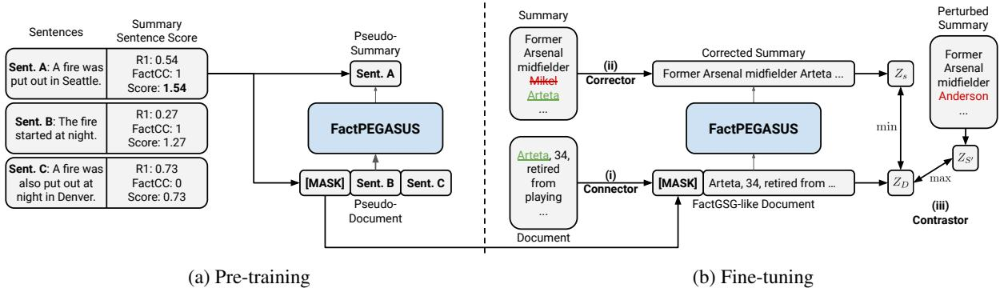
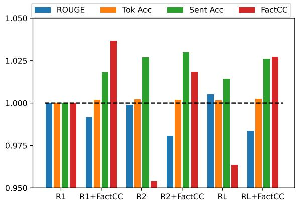
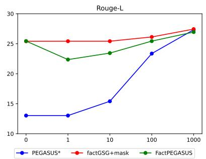
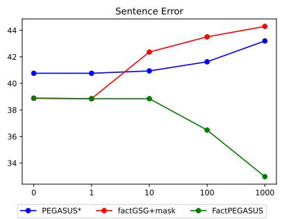
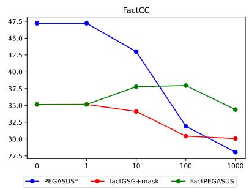
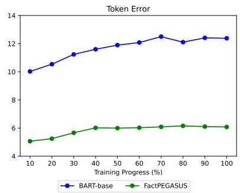
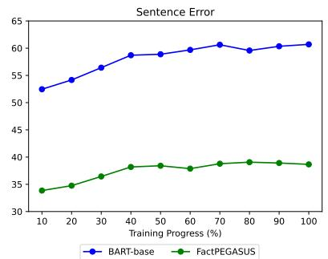
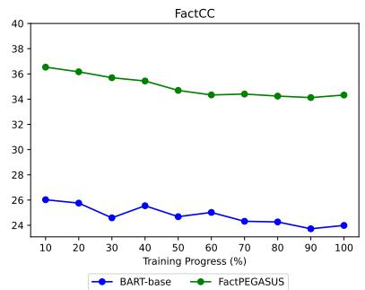
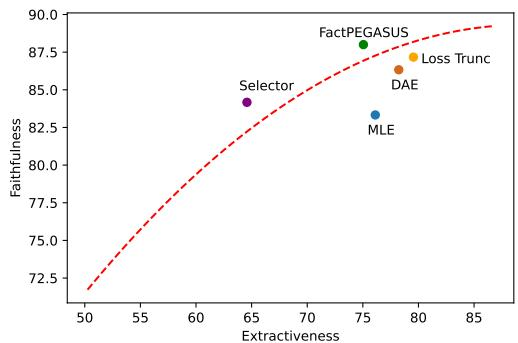

# FACTPEGASUS: Factuality-Aware Pre-training and Fine-tuning for Abstractive Summarization

David Wan and Mohit Bansal University of North Carolina at Chapel Hill {davidwan,mbansal}@cs.unc.edu

## Abstract

We present FACTPEGASUS, an abstractive summarization model that addresses the problem of factuality during pre-training and finetuning: (1) We augment the sentence selection strategy of PEGASUS’s (Zhang et al., 2020) pre-training objective to create pseudosummaries that are both important and factual; (2) We introduce three complementary components for fine-tuning. The corrector removes hallucinations present in the reference summary, the contrastor uses contrastive learning to better differentiate nonfactual summaries from factual ones, and the connector bridges the gap between the pre-training and finetuning for better transfer of knowledge. Experiments on three downstream tasks demonstrate that FACTPEGASUS substantially improves factuality evaluated by multiple automatic metrics and humans. Our thorough analysis suggests that FACTPEGASUS is more factual than using the original pre-training objective in zero-shot and few-shot settings, retains factual behavior more robustly than strong baselines, and does not rely entirely on becoming more extractive to improve factuality.1

## 1 Introduction

Abstractive summarization aims at generating short summaries that capture the essentials of a long document. Research in this challenging task has made significant progress with the help of large pre-trained models (Lewis et al., 2020; Raffel et al., 2020; Zhang et al., 2020). However, current models suffer from the crucial problem of hallucinations (Maynez et al., 2020), where a summary contains facts or entities not present in the original document. Such unfaithful generation raises the question of whether the models can be trustworthy and used safely for real-world applications. To tackle this problem, many approaches propose postprocessing models (Chen et al., 2021; Dong et al.,

2020; Liu and Liu, 2021), but such methods are often constrained by external resources to train additional correction or selection models. An alternative line of works focuses on learning factuality directly during fine-tuning by filtering nonfactual training data (Goyal and Durrett, 2021; Nan et al., 2021) or, most recently, incorporating contrastive learning (Cao and Wang, 2021) to encourage generating faithful summaries.

In this work, we propose FACTPEGASUS, a model that addresses the problem of hallucinations for abstractive summarization holistically, by incorporating factuality into the whole training pipeline: We tackle the lack of factuality objective in pre-training and the presence of hallucinations in the downstream dataset during finetuning. Current pre-training objectives focus on improving the quality of the generated output in the downstream tasks but often overlook the factuality aspect. Thus, we explore incorporating factuality into the pre-training objective of PEGASUS (Zhang et al., 2020) (a state-of-the-art abstractive summarization model). The original objective, gap sentence generation (GSG), transforms any text into a pseudo-summarization dataset by selecting important sentences using ROUGE (Lin, 2004) as output summaries. We explore strategies for combining ROUGE and the factuality metric FactCC (Kryscinski et al., 2020) as the selection criteria, so that the model learns to generate sentences that cover the most important information of the input document as well as remain faithful to it.

Next, we propose three complementary modules that further address factuality problems during fine-tuning: (1) Corrector that removes hallucinations existing in reference summaries, allowing training on the full training set without learning unfaithful behaviors; (2) Contrastor that encourages the model to better differentiate factual summaries from nonfactual ones by paying attention to the document using contrastive learning; (3) Connector, a special mask-token fine-tuning technique enabled by the GSG-style objective, that simulates the pre-training task during fine-tuning by inserting the mask token into the input document so that the pre-trained model can adapt its knowledge of generating factual summaries directly to the downstream tasks. The connector, corrector, and contrastor address the input, output, and training objective of the downstream task, respectively, and the combination of the components reduces potential confounding problems that cannot be addressed by a single module. We show that the full model improves three factuality metrics, the token and sentence error of DEP Entail (Goyal and Durrett, 2021) and FactCC, on the downstream datasets of XSum (Narayan et al., 2018), WikiHow (Koupaee and Wang, 2018), and Gigaword (Rush et al., 2015). Most notably, FACTPEGASUS outperforms existing factualityaware summarization models by more than 40% and 34% on XSum for token error and FactCC, respectively. Ablation studies show the usefulness of each of our fine-tuning components as well as the additive gain of combining our complementary modules, and human evaluation confirms that FACTPEGASUS generates significantly more factual summaries over strong baselines.

Finally, we perform a detailed analysis of FACT-PEGASUS, which points to several important observations regarding learning and maintaining factuality: (1) Zero-shot setting demonstrates the utility of our factuality-aware pre-training objective, as our model outperforms PEGASUS (which uses the original objective) on all three factuality metrics when evaluated directly on the downstream task without any supervised training data. Few-shot experiment indicates that even a small number of nonfactual examples can have a strong negative impact on factuality and can nullify much of the gain from factuality pre-training, highlighting the importance of ensuring factuality during fine-tuning. (2) Factuality dynamics (Goyal et al., 2022) further shows that FACTPEGASUS exhibits a lesser degree of factuality degradation than what is observed for BART-base. (3) Factuality vs abstractiveness tradeoff curve reveals that FACTPEGASUS effectively improves factuality by not simply relying on the increase in extractiveness.

To summarize, our contributions are as follows:

1. We propose a factuality-aware pre-training objective for abstractive summarization and study the effect of different sentence selection strategies on downstream factuality.

2. We introduce three complementary components for improving factuality during fine-tuning that correct hallucinations present in the training set, discourage unfaithful generation during training, and bridge the gap between pre-training and finetuning. The full model consistently achieves better factuality scores than strong baselines on three downstream abstractive summarization tasks, confirmed by human evaluation.

3. We conduct thorough factuality analysis and show that FACTPEGASUS generates more factual summaries with no or little supervision, slows down factuality degradation observed for current models, and improves factuality not by becoming more extractive.

## 2 Related Work

Pre-training Objective for Generation Tasks. Transformer-based models have achieved state-ofthe-art performance for abstractive summarization (Devlin et al., 2019; Lewis et al., 2020; Raffel et al., 2020; Zhang et al., 2020). Many such pre-trained models study the effect of useful pre-training objectives, often in the form of masking certain parts of the input. BART (Lewis et al., 2020) randomly masks spans of tokens in the text as input and asks the model to reconstruct the original text. Our work builds on the success of PEGASUS’s (Zhang et al., 2020) pre-training objective that closely resembles the downstream summarization task. Their objective selects sentences that best represent the document as the output summary, and masks out the selected sentences in the original text as the input document. We explore various sentence selection strategies to encourage the model to generate summaries that cover the most important information of the document and also remain faithful to it.

Improving Factuality for Summarization. Recent models can achieve highly fluent and coherent abstractive summaries, yet the generated summaries often contain factual errors (Falke et al., 2019; Maynez et al., 2020). Several approaches have addressed this problem, which can be roughly categorized into two types. The first approach proposes post-processing models, that either removes hallucinations in the generated summaries (Cao et al., 2020; Dong et al., 2020), or selects the most factual candidate during beam search (Chen et al., 2021). This approach often requires training additional models and external resources. In an attempt to improve factuality in an end-to-end fashion, Nan et al. (2021) and Goyal and Durrett (2021) explore a useful method of removing nonfactual examples during training, but this only allows the model to be trained on a small portion of the training data.

Recently, contrastive learning (Chopra et al., 2005, CL) has started to gain traction for improving factuality. Popular for representation learning, CL has had great success for vision tasks (Chen et al., 2020) and has also been successfully applied to summarization, where Liu and Liu (2021) improves summary quality by differentiating high-quality summaries from the lower-quality ones. Cao and Wang (2021) extend this idea to improve factuality with various approaches to generate hallucinated summaries as negative examples, showing consistent improvement over existing methods. We similarly incorporate CL as an additional training objective, but we differ from previous works in the choice of anchor and positive sample. Inspired by Lee et al. (2021), who use encoder and decoder output as candidates for CL across multiple text generation tasks, we extend this idea to factuality, i.e., instead of performing CL only between summaries, we perform CL between the document and the summary. This setup encourages the model to generate a faithful summary that pays attention to the document, i.e., the definition of faithfulness.

## 3 FACTPEGASUS

We describe our training procedure consisting of pre-training with a factuality-aware objective (Section 3.1) and fine-tuning with three complementary modules for improving factuality (Section 3.2).

## 3.1 Factuality-Aware Pre-training

Recent exploration of good pre-training objectives for abstractive summarization aims at achieving high quality on downstream tasks, often in terms of ROUGE. However, few have analyzed the effect of pre-training objective on factuality. We focus on incorporating this aspect into the pre-training objective of PEGASUS, gap sentence generation (GSG), since PEGASUS achieves state-of-the-art performance on the downstream abstractive summarization tasks. The GSG objective transforms text documents into a pseudo-summarization dataset by selecting important sentences as the output summary, which are subsequently masked out in the original text. The best strategy determines the importance by calculating ROUGE-1 between each chosen sentence and the rest of the document. While the original strategy selects sentences that contain the most unigram overlap, there is no guarantee that the selected sentences are faithful to the rest of the document. We provide an illustrative example in Figure 1a, where the original objective selects sentence C due to its high ROUGE-1 score. However, this sentence is not a faithful summary to the rest of the document as the other sentences concern with the fire in Seattle while only sentence C talks about the fire in Denver.

To address this problem, we extend this objective, which we call factual GSG (factGSG), where we additionally measure the importance of the sentences according to factuality. We use FactCC (Kryscinski et al., 2020) as the factuality criteria when selecting the summary sentences, as it correlates highly with human factuality judgment (Pagnoni et al., 2021) and is relatively fast to compute. FactCC produces a binary prediction where a score of 1 indicates that the selected sentence is consistent with the rest of the document. Another change in factGSG is the choice of gap sentence ratio, which determines the percentage of sentences in the text that will be selected as the summary. Instead of selecting 30% of the text document as output summary, we only select one sentence, as selecting more sentences will inevitably increase the possibility of hallucinations.

Formally, given a document D of n sentences, $D = \{ x _ { 1 } , x _ { 2 } , . . . , x _ { n } \}$ , we select the top-scoring sentence as the output summary, where the score of each sentence $x _ { i }$ is calculated by:

$$
s _ { i } = r o u g e ( x _ { i } , D \setminus \{ x _ { i } \} ) + F a c t C C ( x _ { i } , D \setminus \{ x _ { i } \} )
$$

Going back to the example in Figure 1a, FactCC assigns a score of 0 to the nonfactual sentence C because the fire in Denver is not entailed by the other sentences. This results in sentence A scoring higher than the nonfactual sentence, and thus overcomes the problem in the original objective.

## 3.2 Factuality-Aware Fine-tuning

Although the typical approach of updating all the model’s parameters during fine-tuning adapts well to the downstream task, the model suffers from imitative falsehood (Lin et al., 2021): The model learns to generate similar hallucinations present in the downstream dataset, and even completely forgets its factual behaviors learned during pretraining. This is especially problematic for datasets like XSum that contains hallucinations on 70% of the summaries (Maynez et al., 2020).

  
Figure 1: Illustration of FACTPEGASUS. For pre-training (a), we use the factGSG objective introduced in Section 3.1 that transforms a text document into a pseudo-summarization dataset. We select the pseudo-summary using the combination of ROUGE and FactCC. Here, sentence A is selected as the pseudo-summary, and we mask this sentence in the original text to create the pseudo-document. During fine-tuning (b), the connector (i) simulates the factGSG task by appending the same mask token used in (a) to the input document, so that we have the same setup in both training stages. Then, corrector (ii) removes hallucinations (highlighted in red) from the summary. Finally, contrastive learning in (iii) encourages the model to prefer the corrected summary over the perturbed summary.

To this end, we present three complementary fine-tuning modules, illustrated in Figure 1b. Each component addresses different parts of the downstream task and collaboratively ensures factuality throughout the fine-tuning stage.

## 3.2.1 Connector

The GSG objective enables faster and better adaptation during fine-tuning by simulating the downstream task (Zhang et al., 2020). However, there still exists a gap between pre-training and finetuning: GSG is a masked sentence prediction task, but downstream summarization does not make use of the mask token. Thus, we simply insert the mask token into the input document of the downstream dataset, so as to simulate what the model expects during pre-training. This can be seen as a form of prompting, which helps us to elicit the factuality knowledge of the pre-trained models. We insert the mask token between sentences, and the best position is determined by evaluating the summarization performance on the validation set. We report the best position of the mask token and discuss the similarity to prompting in Appendix C.

## 3.2.2 Corrector

The corrector removes hallucinations in the reference summaries so that such examples can be used during training without contributing to the problem of imitative falsehood. We consider summary entities as hallucinating if the text cannot be matched to one of the document entities. We propose three approaches with varying degrees of aggressiveness w.r.t. the removal of hallucinations and the possibility of generating ungrammatical sentences.

Replace: Upon qualitative analysis, we discover that some hallucinated entities in the summary are partially present in the documents. The most prominent example is the use of names, where the summary contains the full name of the person while only the first or last name is mentioned in the document, as shown in Figure 2. Given such observation, we propose a method to find a similar entity with the same NER label in the document and use that to replace the original hallucinated entity in the summary. Although this approach cannot correct hallucinations where similar entities are missing in the document, grammaticality is ensured.

Remove: A more aggressive approach is to remove the hallucinated entities in the training examples. The intuition is that it is often better to not say anything than to say something wrong. We mitigate the problem of creating ungrammatical sentences by removing related words to the removed entities determined by dependency arcs.

Combined: As a middle ground that ensures no hallucinations are present in the reference summaries while being grammatical when possible, we first replace all possible entities and then apply the remove strategy on the remaining ones.

We refer the readers to Appendix-B.1 for the details about hallucination detection, as well as the algorithm and discussion of grammatically for the remove method.

<table><tr><td>Document</td><td>[Arteta]ent, [34]number, retired from playing at [the end of last season]date ... [Arteta]ent was seen crying after his final [Arsenal]ent match... [Guardiola]ent&#x27;s first game since succeeding [Manuel Pellegrini]ent ... Former [Arsenal]ent midfielder [Mikel Arteta]ent has taken up a coaching role at [Manchester</td></tr><tr><td>Summary</td><td> $\mathrm { C i t y } \mathrm { l e n t } .$ </td></tr><tr><td>Replace</td><td>Corrector Former Arsenal midfielder Arteta has taken up a coaching role at Manchester City.</td></tr><tr><td>Remove</td><td>Former Arsenal midfielder Mikel Arteta has taken up a coaching role at Manehester City</td></tr><tr><td>Combined</td><td>Former Arsenal midfielder Arteta has taken up a coaching role at Manchester City.</td></tr><tr><td></td><td>Contrastor</td></tr><tr><td>Intrinsic</td><td>Former Arsenal midfielder Manuel Pellegrini has taken up a coaching role.</td></tr><tr><td>Extrinsic</td><td>Former Arsenal midfielder Wenger has taken up a coaching role.</td></tr></table>

Figure 2: Example output using different strategies of corrector and contrastor. The first two rows show the original document and summary with highlighted entities and their respective labels (date, number, ent). We mark halluci nated entities in the summaries with red, factual entities in document and summary with green and underlined, and removed entities by the corrector with a strikethrough. Perturbed entities by the contrastor are italicized.

## 3.2.3 Contrastor

To better distinguish factual summaries from nonfactual ones, we next introduce a contrastive learning objective that encourages the model to prefer factual summaries given the context of the document. We use the document $D _ { i }$ as the anchor and only consider the reference summary $S _ { i }$ as the positive sample. Then, we create a set of nonfactual summaries $N _ { i }$ to form negative pairs following Kryscinski et al. (2020), where we replace factual entities with random entities of the same named entity labels. We experiment with two variants simulating either extrinsic and intrinsic hallucinations. As formulated in Maynez et al. (2020), extrinsic hallucinations refer to entities that are present in the summary but not in the document, whereas intrinsic hallucinations are those that are present in the document but contain inaccurate information or are misplaced. See Appendix B.2 for more details.

We stress that we perform contrastive learning between the document and the summary, similar to Lee et al. (2021), instead of between summaries (Cao and Wang, 2021), as it follows closer to the definition of faithfulness - the summary should be generated within the context of the document.

We use the NT-Xent loss (Chen et al., 2020):

$$
l _ { D _ { i } , S _ { i } } = - \log \frac { \exp \sin ( z _ { D _ { i } } , z _ { S _ { i } } ) / \tau } { \sum _ { S _ { j } \in N _ { i } \cup \{ S _ { i } \} } \exp \sin ( z _ { D _ { i } } , z _ { S _ { j } } ) / \tau }
$$

where $z _ { D _ { i } } , z _ { S _ { i } }$ and $z _ { S _ { j } }$ are representation for $D _ { i } .$ $S _ { i }$ and $S _ { j }$ , respectively. We generate $z _ { D }$ and zS by performing mean pooling over the last hidden layer of the encoder and decoder output, respectively. $\sin ( \cdot , \cdot )$ is the cosine similarity between the representations, and τ is the temperature parameter.

The final loss is calculated by the sum of the cross-entropy loss $L _ { C E }$ and the contrastive loss: ${ \cal L } = { \cal L } _ { C E } + \lambda { \cal L } _ { C L }$ , where λ is a scalar.

  
Figure 3: Relative effect using different sentence selection criteria on XSum. Adding FactCC to criteria consistently improves factuality. Full result in Table 10.

## 4 Experimental Setup

We describe our experimental setup, and refer to Appendix A for more details.

## 4.1 Datasets and Evaluation Metrics

We pre-train on the C4 dataset (Raffel et al., 2020), and evaluate our pre-trained model on three downstream abstractive summarization datasets: XSum (Narayan et al., 2018), WikiHow (Koupaee and Wang, 2018), and Gigaword (Rush et al., 2015). XSum is the primary dataset for analysis unless otherwise stated, as most of the factuality works for abstractive summarization evaluate on this dataset. Dataset details are presented in Appendix A.1.

We report ROUGE-L (Lin, 2004) to evaluate our generated summaries against the reference. However, we note that this method is not ideal given the presence of hallucinations in the reference summaries (Chen et al., 2021; Maynez et al., 2020): If a more factual model does not produce such hallucinations, the output is scored lower than those that contain the same hallucinations found in the reference.

To evaluate factuality, there have been many proposed automatic metrics (Durmus et al., 2020; Wang et al., 2020; Scialom et al., 2021). We report FactCC (Kryscinski et al., 2020) and DEP-Entail (Goyal and Durrett, 2021), as they are highly correlated with human judgment of factuality (Pagnoni et al., 2021). For DEP-Entail, we report the tokenlevel and sentence-level error. For FactCC, since the model has been trained to evaluate on single sentences, we calculate the average score across all sentences for each summary.

To confirm our observation, we conduct human evaluation asking Amazon Mechanical Turk2 (AMT) to judge the factuality and informativeness of the summaries. We randomly select 100 documents and ask the annotators to check whether each of the generated summaries is factual and informative. Appendix E provides more details.

## 4.2 Pre-training and Fine-tuning Setup

For pre-training, we use BART-base’s architecture with PEGASUS’s SentencePiece (Kudo, 2018) unigram model tokenizer. We first determine the best sentence selection criteria by experimenting with selection criteria that use ROUGE-1, ROUGE-2, and ROUGE-L, as well as combining each with FactCC. To save computation (Lewis et al., 2020; Zhang et al., 2020; Raffel et al., 2020), we pretrain these models on a smaller dataset and fewer training steps. We report the effect of the selection criteria using the normalized ROUGE score and factuality scores over the model that uses ROUGE-1 as the selection criteria. We take the complement of token error and sentence error as token accuracy and sentence accuracy, respectively, to present all metrics where higher is better. Details of pretraining are shown in Appendix A.4.

Finally, We evaluate our pre-trained model on the three downstream tasks. As baselines, we compare our model to BART-base and PEGASUS\*, our variant of the PEGASUS-base as there is no publicly available checkpoint. We train PEGA-SUS\* by using the original sentence selection metric (ROUGE-1), and observe higher ROUGE scores on XSum and WikiHow than the ones reported in the original paper. We also compare FACTPEGA-SUS to two summarization models optimized for factuality. DAE (Goyal and Durrett, 2021) uses

<table><tr><td>Dataset</td><td>Model</td><td>RL</td><td>tok err↓</td><td>sent err↓</td><td>FactCC</td></tr><tr><td rowspan="5">XS</td><td>BART-base</td><td>33.78</td><td>12.38</td><td>60.70</td><td>23.99</td></tr><tr><td>PEGASUS*</td><td>33.17</td><td>12.33</td><td>60.01</td><td>24.14</td></tr><tr><td>DAE</td><td>31.78</td><td>4.79*</td><td>35.52*</td><td>25.43</td></tr><tr><td>CLIFF</td><td>31.40</td><td>10.36</td><td>53.14</td><td>23.77</td></tr><tr><td>FACTPEGASUS</td><td>31.17</td><td>6.07</td><td>38.66</td><td>34.32</td></tr><tr><td rowspan="5">WH</td><td>BART-base</td><td>31.81</td><td>8.99</td><td>45.77</td><td>99.09</td></tr><tr><td>PEGASUS*</td><td>30.30</td><td>9.77</td><td>47.28</td><td>98.83</td></tr><tr><td>DAE</td><td>31.66</td><td>4.91*</td><td>34.45*</td><td>98.87</td></tr><tr><td>CLIFF</td><td>33.82</td><td>13.74</td><td>57.42</td><td>99.18</td></tr><tr><td>FACTPEGASUS</td><td>29.33</td><td>7.86</td><td>42.40</td><td>99.41</td></tr><tr><td rowspan="5">GW</td><td>BART-base</td><td>35.11</td><td>2.29</td><td>19.68</td><td>55.66</td></tr><tr><td>PEGASUS*</td><td>34.74</td><td>2.84</td><td>22.66</td><td>56.43</td></tr><tr><td>DAE</td><td>35.57</td><td>0.58*</td><td>7.54*</td><td>59.61</td></tr><tr><td>CLIFF</td><td>34.89</td><td>1.72</td><td>18.45</td><td>58.53</td></tr><tr><td>FACTPEGASUS</td><td>34.23</td><td>2.30</td><td>19.32</td><td>60.02</td></tr></table>

Table 1: Fine-tuning results on the XSum (XS), Wiki-How (WH), and Gigaword (GW) dataset. FACTPEGA-SUS consistently improves factuality metrics for all datasets over the two baseline models, and outperforms existing factuality models on FactCC. The token error and sentence error achieved by DAE (marked with \*) is not a fair comparison, because the model optimizes the metric during training.
<table><tr><td>Model</td><td>Factuality</td><td>Informativeness</td></tr><tr><td>BART-base</td><td>24.67</td><td>61.33</td></tr><tr><td>PEGASUS*</td><td>27.33</td><td>58.33</td></tr><tr><td>DAE</td><td>31.99</td><td>61.66</td></tr><tr><td>CLIFF</td><td>29.33</td><td>62.99</td></tr><tr><td>FACTPEGASUS</td><td>39.66</td><td>58.67</td></tr></table>

Table 2: Human evaluation results on XSum. Our model is statistically significantly better $( p \ < \ 0 . 0 5 )$ than BART-base, PEGASUS\*, and CLIFF, and moderately significantly better than DAE $( p = 0 . 0 5 5 )$ . There is no statistical significance between the informativeness of FACTPEGASUS and other models $( p > 0 . 1 5 )$

DEP-Entail to mask out the nonfactual tokens during training, and CLIFF (Cao and Wang, 2021) uses contrastive learning between the reference summaries and automatically generated nonfactual summaries. We apply both methods to BART-base. Details are described in Appendix A.5.

## 5 Result

## 5.1 Pre-training Sentence Selection Results

Figure 3 shows the effect of different sentence selection criteria. Adding FactCC to all three ROUGE-only criteria consistently improves all factuality metrics at the cost of a small decrease in quality. Overall, the selection strategy of combining ROUGE-1 and FactCC achieves the highest FactCC score out of all strategies while maintaining the smallest relative drop in ROUGE.

## 5.2 Fine-tuning Results

We present our full result on the three downstream tasks in Table 1. While the two baseline models achieve similar factuality scores, FACTPEGASUS consistently improves factuality over the two baselines on all three datasets. The largest improvement can be seen for the XSum dataset, where FACT-PEGASUS, compared to BART-base, lowers the token error and sentence error by 51% and 36%, respectively, and increases FactCC by 43% 3 . The same trend but to a lesser degree can also be observed for WikiHow and Gigaword, most notably a 3-point decrease in sentence error for WikiHow and a 2-point increase in FactCC for Gigaword.

Compared to factuality-aware models, FACTPE-GASUS achieves the highest FactCC on all tasks. Notably, FACTPEGASUS outperforms DAE by 34% on XSum. In terms of DEP-Entail, FACTPE-GASUS outperforms CLIFF on XSum and Wiki-How. We note that DAE is trained using the DEP-Entail metric and thus is not a fair comparison.

We note that the ROUGE-L scores for FACT-PEGASUS are lower than both baseline models by about 2 points, but we stress that our increase in FactCC is substantially larger than the decrease in ROUGE-L for XSum and Gigaword. The negative relationship between factuality metrics and ROUGE is also reported in prior works (Chen et al., 2021; Kryscinski et al., 2019). For example, finetuning BART on a subset of XSum (Goyal and Durrett, 2021) improves factuality at the cost of a 6-point drop in ROUGE-L4, which is triple the amount of decrease observed for our model.

Human Evaluation results are shown in Table 2. The result agrees with our observation on automatic factuality metrics, as FACTPEGASUS produces significantly more factual summaries than the BART-base, and PEGASUS\*, and CLIFF. We achieve moderately significantly better summaries (p = 0.055) than DAE. Although, FACTPEGA-SUS achieves low informativeness, we find no statistical significant difference between our model and other models $( p > 0 . 1 5 )$

<table><tr><td>Model</td><td>RL</td><td>tok err↓</td><td>sent err↓</td><td>FactCC</td></tr><tr><td>factGSG</td><td>32.99</td><td>12.31</td><td>59.30</td><td>24.94</td></tr><tr><td>+ corrector replace</td><td>32.48</td><td>10.57</td><td>55.05</td><td>25.06</td></tr><tr><td>+ corrector remove</td><td>30.37</td><td>6.44</td><td>39.89</td><td>35.77</td></tr><tr><td>+ corrector combined</td><td>31.19</td><td>6.10</td><td>38.96</td><td>33.79</td></tr><tr><td>+ contrastor intrinsic</td><td>32.14</td><td>11.46</td><td>57.61</td><td>25.26</td></tr><tr><td>+ contrastor extrinsic</td><td>32.54</td><td>11.95</td><td>59.10</td><td>25.07</td></tr><tr><td>+ contrastor + corrector</td><td>31.17</td><td>6.08</td><td>38.92</td><td>34.17</td></tr><tr><td>FACTPEGASUS</td><td>31.17</td><td>6.07</td><td>38.66</td><td>34.32</td></tr></table>

Table 3: Fine-tuning ablation on XSum. We present our pre-trained model factGSG fine-tuned without any of our proposed components, and adding different strategies of corrector and contrastor. We then combine the best of the two modules (corrector combined and contrastor intrinsic), and finally add the connector to form the final model, which we copy from Table 1.

<table><tr><td>Model</td><td>RL</td><td>tok err↓</td><td>sent err↓</td><td>FactCC</td></tr><tr><td>GSG+mask</td><td>23.49</td><td>9.04</td><td>43.62</td><td>24.49</td></tr><tr><td>factGSG+mask</td><td>24.23</td><td>7.69</td><td>38.88</td><td>35.14</td></tr></table>

Table 4: Zero-shot results when applying the connector to our pre-trained model (factGSG+mask) and PE-GASUS\*(GSG+mask). FactGSG+mask outperforms GSG+mask on all metrics.

## 5.3 Fine-tuning Ablation Studies

We present ablation studies of our proposed methods in Table 3. We first compare the performance of different strategies for the corrector and contrastor. For corrector, the level of aggressiveness in correcting hallucinations has a positive relationship with factuality metrics but a negative relationship with ROUGE-L. Although the remove method achieves the highest FactCC score, the combined method further lowers the token and sentence error while achieving relatively high ROUGE-L and FactCC. For contrastor, simulating intrinsic errors, which creates more challenging negative samples, provides better factuality results than simulating extrinsic ones. Finally, we show the additive gain in combining the best corrector and contrastor, as well as adding the connector to form the final model.

We report the same ablation studies for Gigaword and Wikihow in Appendix D.3, and that for PEGASUS\* in Appendix D.4.

## 5.4 Zero-shot and Few-shot Results

With the help of connector proposed in Section 3.2.1, we can explore how knowledge about factuality is transferred to fine-tuning, especially in the zero-shot and few-shot settings5.

  
Figure 4: Zero-shot and few-shot results. The lines represent each models’s performance when fine-tuned on 0 (zero-shot), 1, 10, 100, and 1000 examples. FACTPEGASUS consistently improves sentence error with more training data. Without the corrector and contrastor, factuality decreases with just 10 examples.

  
Figure 5: Factuality dynamics result. We show token error, sentence error, and FactCC as training progresses. FACTPEGASUS slows down factuality degradation for all metrics compared to BART-base.

Zero-Shot. We apply the mask token to the best position and directly analyze the performance of the models on the test set. To better understand the effectiveness in transferring knowledge about summarization and factuality from the pre-training objective, we apply the connector to our pretrained model (factGSG+mask) and PEGASUS\* (GSG+mask), so that the two models differ only in their pre-training objective. We report the result in Table 4. FactGSG+mask outperforms GSG+mask on all metrics, especially for factuality metrics. Specifically, factGSG+mask lowers the sentence error by 5 points and increases FactCC by about 10 points. This observation confirms that the factGSG objective is more effective at capturing factuality than the original GSG objective.

Few-Shot. We follow a similar setup in Zhang et al. (2020), where we limit the number of training data to 1, 10, 100, and 1,000, and then fine-tune the model up to 2,000 steps with the patience of 10 epochs for early stopping. We select the checkpoint with the best validation performance.

We conduct this experiment by comparing FACT-PEGASUS to PEGASUS\*, which has been shown for its ability to transfer with as little as 100 training examples (Zhang et al., 2020). In addition, we report the performance of factGSG+mask to understand how the the model is affected without explicitly ensuring factuality (i.e. without corrector and contrastor). As shown in Figure 4, connector allows the model to better make use of the knowledge of pre-training and produces highquality summaries, as both FACTPEGASUS and factGSG+mask produces a ROUGE-L score comparable to PEGASUS\* trained with 1000 examples.

In terms of factuality, we notice that with just 10 examples, PEGASUS\* starts to degrade in factuality, which also applies to the factGSG+mask model. However, FACTPEGASUS demonstrates an opposite trajectory: Sentence error decreases with more training data, and FactCC remains about the same score. This indicates that factual behavior is prone to be overwritten when factuality is not ensured explicitly, and thus calls for the importance of the corrector and contrastor.

## 5.5 Factuality Dynamics during Fine-tuning

To see whether the factuality degradation observed in few-shot experiment also applies to the full finetuning process, we extend our analysis by studying the factuality dynamics, similar to Goyal et al. (2022). The authors observe an increase in sentence errors with the BART model during finetuning, and we analyze whether similar factuality degradation occurs for FACTPEGASUS. We save checkpoints of our models every 10% of the total training steps, and evaluate the models on all three factuality metrics. Figure 5 shows the factuality dynamics during fine-tuning. We notice that the degradation occurs for both models but at a different degree. The token and sentence error for BART-base increase by 2 and 8 points, respectively. However, factuality for FACTPEGASUS remains similar, with only an increase of 1 point for token error and 4.8 points for sentence error. The degradation is only about half of what is observed with BART-base, indicating that FACTPEGASUS is better at avoiding learning nonfactual behaviors.

  
Figure 6: Faithfulness-abstractiveness trade-off curve, shown as the dashed red line, on Gigaword dataset. We plot each model’s average faithfulness score evaluated by AMT against its extractiveness level. Our model lies above the graph, performing better than MLE-baseline, DAE (Goyal and Durrett, 2021), and Loss Truncation (Kang and Hashimoto, 2020).

## 5.6 Factuality vs Abstractiveness Tradeoff

Lastly, we wish to understand whether our proposed method is effectively improving factuality without relying on the increase in extractiveness. To this end, Ladhak et al. (2021) introduces a faithfulness-abstractiveness trade-off curve to measure the faithfulness given the model’s extractiveness. The authors kindly provided the same set of examples for Gigaword and AMT template for calculating the faithfulness score.

We show our result on Gigaword in Figure 6. We include the result of their proposed Selector and previous works, including Loss Truncation (Kang and Hashimoto, 2020) and DAE (Goyal and Durrett, 2021). We note that the baseline models increase factuality but mostly due to an increase in extractiveness and thus fall below the curve. In contrast, FACTPEGASUS lies above the line, indicating that we are effectively increasing factuality without relying much on becoming more extractive.

## 6 Conclusion

In this work, we proposed FACTPEGASUS, a model for abstractive summarization consisting of factuality-aware pre-training and modules for ensuring factuality during fine-tuning. We demonstrated the effectiveness of our model at improving factuality on three downstream abstractive summarization datasets, confirmed by our human evaluation. Our analysis showed that our proposed factuality-aware pre-training objective is effective at capturing knowledge of factuality compared to the original objective and that our fine-tuning modules reduce the factuality degradation observed with current models. We finally showed that improvement in factuality is not solely explained by the increase of extractiveness.

## 7 Ethical Impact

Our work aims at reducing the risk of generating hallucinations, and even possibly misinformation, for abstractive summarization models so that such models can be used safely for real-world applications. While we demonstrate that we can alleviate this problem, we stress that there is still a long way to go for improving factuality. Thus, we stress that such models should be used with caution for real-world applications.

## Acknowledgment

We thank the reviewers for their helpful comments. We also thank Shiyue Zhang and Xiang Zhou for useful discussions and comments on the paper. This work was supported by NSF-CAREER Award 1846185 and NSF-AI Engage Institute DRL-211263.

## References

Meng Cao, Yue Dong, Jiapeng Wu, and Jackie Chi Kit Cheung. 2020. Factual error correction for abstractive summarization models. In Proceedings of the 2020 Conference on Empirical Methods in Natural Language Processing (EMNLP), pages 6251–6258, Online. Association for Computational Linguistics.

Shuyang Cao and Lu Wang. 2021. CLIFF: Contrastive learning for improving faithfulness and factuality in abstractive summarization. In Proceedings of the 2021 Conference on Empirical Methods in Natural Language Processing, pages 6633–6649, Online and Punta Cana, Dominican Republic. Association for Computational Linguistics.

Sihao Chen, Fan Zhang, Kazoo Sone, and Dan Roth. 2021. Improving faithfulness in abstractive summarization with contrast candidate generation and selection. In Proceedings of the 2021 Conference of the North American Chapter of the Association for Computational Linguistics: Human Language Technologies, pages 5935–5941, Online. Association for Computational Linguistics.

Ting Chen, Simon Kornblith, Mohammad Norouzi, and Geoffrey Hinton. 2020. A simple framework for contrastive learning of visual representations. In Proceedings of the 37th International Conference on Machine Learning, volume 119 of Proceedings of Machine Learning Research, pages 1597–1607. PMLR.

S. Chopra, R. Hadsell, and Y. LeCun. 2005. Learning a similarity metric discriminatively, with application to face verification. In 2005 IEEE Computer Society Conference on Computer Vision and Pattern Recognition (CVPR’05), volume 1, pages 539–546 vol. 1.

Jacob Devlin, Ming-Wei Chang, Kenton Lee, and Kristina Toutanova. 2019. BERT: Pre-training of deep bidirectional transformers for language understanding. In Proceedings of the 2019 Conference of the North American Chapter of the Association for Computational Linguistics: Human Language Technologies, Volume 1 (Long and Short Papers), pages 4171–4186, Minneapolis, Minnesota. Association for Computational Linguistics.

Yue Dong, Shuohang Wang, Zhe Gan, Yu Cheng, Jackie Chi Kit Cheung, and Jingjing Liu. 2020. Multi-fact correction in abstractive text summarization. In Proceedings of the 2020 Conference on Empirical Methods in Natural Language Processing (EMNLP), pages 9320–9331, Online. Association for Computational Linguistics.

Markus Dreyer, Mengwen Liu, Feng Nan, Sandeep Atluri, and Sujith Ravi. 2021. Analyzing the abstractiveness-factuality tradeoff with nonlinear abstractiveness constraints. CoRR, abs/2108.02859.

Esin Durmus, He He, and Mona Diab. 2020. FEQA: A question answering evaluation framework for faithfulness assessment in abstractive summarization. In Proceedings ofthe 58th Annual Meeting ofthe Association for Computational Linguistics, pages 5055– 5070, Online. Association for Computational Linguistics.

Bradley Efron and Robert J. Tibshirani. 1993. An Introduction to the Bootstrap. Number 57 in Monographs on Statistics and Applied Probability. Chapman & Hall/CRC, Boca Raton, Florida, USA.

Tobias Falke, Leonardo F. R. Ribeiro, Prasetya Ajie Utama, Ido Dagan, and Iryna Gurevych. 2019. Ranking generated summaries by correctness: An interesting but challenging application for natural language inference. In Proceedings ofthe 57th Annual Meeting of the Association for Computational Linguistics, pages 2214–2220, Florence, Italy. Association for Computational Linguistics.

Tanya Goyal and Greg Durrett. 2021. Annotating and modeling fine-grained factuality in summarization. In Proceedings ofthe 2021 Conference ofthe North American Chapter of the Association for Computational Linguistics: Human Language Technologies, pages 1449–1462, Online. Association for Computational Linguistics.

Tanya Goyal, Jiacheng Xu, Junyi Jessy Li, and Greg Durrett. 2022. Training dynamics for text summarization models. In Proceedings ofACL.

Daniel Kang and Tatsunori B. Hashimoto. 2020. Improved natural language generation via loss truncation. In Proceedings of the 58th Annual Meeting of the Association for Computational Linguistics, pages 718–731, Online. Association for Computational Linguistics.

Mahnaz Koupaee and William Yang Wang. 2018. Wikihow: A large scale text summarization dataset.

Wojciech Kryscinski, Nitish Shirish Keskar, Bryan Mc-Cann, Caiming Xiong, and Richard Socher. 2019. Neural text summarization: A critical evaluation. In Proceedings of the 2019 Conference on Empirical Methods in Natural Language Processing and the 9th International Joint Conference on Natural Language Processing (EMNLP-IJCNLP), pages 540– 551, Hong Kong, China. Association for Computational Linguistics.

Wojciech Kryscinski, Bryan McCann, Caiming Xiong, and Richard Socher. 2020. Evaluating the factual consistency of abstractive text summarization. In Proceedings of the 2020 Conference on Empirical Methods in Natural Language Processing (EMNLP), pages 9332–9346, Online. Association for Computational Linguistics.

Taku Kudo. 2018. Subword regularization: Improving neural network translation models with multiple subword candidates. In Proceedings ofthe 56th Annual Meeting of the Association for Computational Linguistics (Volume 1: Long Papers), pages 66–75, Melbourne, Australia. Association for Computational Linguistics.

Faisal Ladhak, Esin Durmus, He He, Claire Cardie, and Kathleen McKeown. 2021. Faithful or extractive? on mitigating the faithfulness-abstractiveness tradeoff in abstractive summarization.

Seanie Lee, Dong Bok Lee, and Sung Ju Hwang. 2021. Contrastive learning with adversarial perturbations for conditional text generation. In International Conference on Learning Representations.

Mike Lewis, Yinhan Liu, Naman Goyal, Marjan Ghazvininejad, Abdelrahman Mohamed, Omer Levy, Veselin Stoyanov, and Luke Zettlemoyer. 2020. BART: Denoising sequence-to-sequence pretraining for natural language generation, translation, and comprehension. In Proceedings of the 58th Annual Meeting of the Association for Computational Linguistics, pages 7871–7880, Online. Association for Computational Linguistics.

Quentin Lhoest, Albert Villanova del Moral, Yacine Jernite, Abhishek Thakur, Patrick von Platen, Suraj Patil, Julien Chaumond, Mariama Drame, Julien Plu, Lewis Tunstall, Joe Davison, Mario Šaško, Gunjan Chhablani, Bhavitvya Malik, Simon Brandeis, Teven Le Scao, Victor Sanh, Canwen Xu, Nicolas Patry, Angelina McMillan-Major, Philipp Schmid, Sylvain Gugger, Clément Delangue, Théo Matussière, Lysandre Debut, Stas Bekman, Pierric Cistac, Thibault Goehringer, Victor Mustar, François Lagunas, Alexander Rush, and Thomas Wolf. 2021. Datasets: A community library for natural language processing. In Proceedings of the 2021 Conference on Empirical Methods in Natural Language Processing: System Demonstrations, pages 175–184, Online and Punta Cana, Dominican Republic. Association for Computational Linguistics.

Chin-Yew Lin. 2004. ROUGE: A package for automatic evaluation of summaries. In Text Summarization Branches Out, pages 74–81, Barcelona, Spain. Association for Computational Linguistics.

Stephanie Lin, Jacob Hilton, and Owain Evans. 2021. Truthfulqa: Measuring how models mimic human falsehoods.

Yixin Liu and Pengfei Liu. 2021. SimCLS: A simple framework for contrastive learning of abstractive summarization. In Proceedings of the 59th Annual Meeting of the Association for Computational Linguistics and the 11th International Joint Conference on Natural Language Processing (Volume 2: Short Papers), pages 1065–1072, Online. Association for Computational Linguistics.

Robert L. Logan, Ivana Balaževic, Eric Wallace, Fabio´ Petroni, Sameer Singh, and Sebastian Riedel. 2021. Cutting down on prompts and parameters: Simple few-shot learning with language models.

Joshua Maynez, Shashi Narayan, Bernd Bohnet, and Ryan McDonald. 2020. On faithfulness and factuality in abstractive summarization. In Proceedings of the 58th Annual Meeting of the Association for Computational Linguistics, pages 1906–1919, Online. Association for Computational Linguistics.

Feng Nan, Ramesh Nallapati, Zhiguo Wang, Cicero Nogueira dos Santos, Henghui Zhu, Dejiao Zhang, Kathleen McKeown, and Bing Xiang. 2021. Entitylevel factual consistency of abstractive text summarization. In Proceedings of the 16th Conference of

the European Chapter of the Association for Computational Linguistics: Main Volume, pages 2727– 2733, Online. Association for Computational Linguistics.

Shashi Narayan, Shay B. Cohen, and Mirella Lapata. 2018. Don’t give me the details, just the summary! topic-aware convolutional neural networks for extreme summarization. In Proceedings of the 2018 Conference on Empirical Methods in Natural Language Processing, pages 1797–1807, Brussels, Belgium. Association for Computational Linguistics.

Artidoro Pagnoni, Vidhisha Balachandran, and Yulia Tsvetkov. 2021. Understanding factuality in abstractive summarization with FRANK: A benchmark for factuality metrics. In Proceedings of the 2021 Conference of the North American Chapter of the Association for Computational Linguistics: Human Language Technologies, pages 4812–4829, Online. Association for Computational Linguistics.

Colin Raffel, Noam Shazeer, Adam Roberts, Katherine Lee, Sharan Narang, Michael Matena, Yanqi Zhou, Wei Li, and Peter J. Liu. 2020. Exploring the limits of transfer learning with a unified text-totext transformer. Journal of Machine Learning Research, 21(140):1–67.

Nils Reimers and Iryna Gurevych. 2019. Sentence-BERT: Sentence embeddings using Siamese BERTnetworks. In Proceedings ofthe 2019 Conference on Empirical Methods in Natural Language Processing and the 9th International Joint Conference on Natural Language Processing (EMNLP-IJCNLP), pages 3982–3992, Hong Kong, China. Association for Computational Linguistics.

Alexander M. Rush, Sumit Chopra, and Jason Weston. 2015. A neural attention model for abstractive sentence summarization. In Proceedings of the 2015 Conference on Empirical Methods in Natural Language Processing, pages 379–389, Lisbon, Portugal. Association for Computational Linguistics.

Thomas Scialom, Paul-Alexis Dray, Sylvain Lamprier, Benjamin Piwowarski, Jacopo Staiano, Alex Wang, and Patrick Gallinari. 2021. QuestEval: Summarization asks for fact-based evaluation. In Proceedings of the 2021 Conference on Empirical Methods in Natural Language Processing, pages 6594–6604, Online and Punta Cana, Dominican Republic. Association for Computational Linguistics.

Alex Wang, Kyunghyun Cho, and Mike Lewis. 2020. Asking and answering questions to evaluate the factual consistency of summaries. In Proceedings of the 58th Annual Meeting of the Association for Computational Linguistics, pages 5008–5020, Online. Association for Computational Linguistics.

Thomas Wolf, Lysandre Debut, Victor Sanh, Julien Chaumond, Clement Delangue, Anthony Moi, Pierric Cistac, Tim Rault, Remi Louf, Morgan Funtowicz, Joe Davison, Sam Shleifer, Patrick von Platen,

Clara Ma, Yacine Jernite, Julien Plu, Canwen Xu, Teven Le Scao, Sylvain Gugger, Mariama Drame, Quentin Lhoest, and Alexander Rush. 2020. Transformers: State-of-the-art natural language processing. In Proceedings of the 2020 Conference on Empirical Methods in Natural Language Processing: System Demonstrations, pages 38–45, Online. Association for Computational Linguistics.

Jingqing Zhang, Yao Zhao, Mohammad Saleh, and Peter J. Liu. 2020. Pegasus: Pre-training with extracted gap-sentences for abstractive summarization. In Proceedings ofthe 37th International Conference on Machine Learning, ICML’20. JMLR.org.

## A More Details on Experimental Setup

## A.1 Datasets

Following PEGASUS, we pre-train on the C4 dataset, a large collection of documents from Common Crawl. We evaluate our pre-trained model on three downstream abstractive summarization datasets: XSum, WikiHow, and Gigaword. XSum is a collection of articles from the British Broadcasting Corporation, Gigaword is a large collection of news articles headlines, and WikiHow consists of how-to articles.

We show the dataset statistics for pre-training and fine-tuning in Table 5, where we present the number of examples in the training, validation, and test splits. We also show the number of examples corrected using the replace and remove method. All datasets are from datasets (Lhoest et al., 2021).

## A.2 Evaluation Metrics

We use the ROUGE package provided by transformers (Wolf et al., 2020). We follow the instructions provided by the authors of the factuality metrics to set up and run their code. We report all scores of our models from single runs.

## A.3 Training Details

We use transformers library for the training script and the checkpoints of the pre-trained models. We use the default setting, including the AdamW optimizer and the linear rate scheduler. We also use mixed precision for both pre-training and finetuning the models. We conduct our experiments on the RTX A6000 GPU with 48GB memory and the A100 GPU with 40GB memory. BART-base model has 139M parameters, and PEGASUS\* and FACTPEGASUS have 175M parameters.

## A.4 Pre-training Setup

Model Architecture. We use the same architecture as BART-base. Specifically, the model has $L = 6 , H = 7 6 8 , F = 3 0 7 2 , A = 1 2 .$ , where L is the number of layers, H is the hidden size, F is the dimension for feed-forward layer, and A is the number of self-attention heads. We use the SentencePiece (Kudo, 2018) unigram model tokenizer from PEGASUS with a vocabulary size of 96,103.

Sentence Selection Criteria. Before pretraining the full model, we first determine the best sentence selection criteria that produces more factual summaries with comparable quality. We experiment with sentence selection criteria that use ROUGE-1, ROUGE-2, and ROUGE-L, as well as combining each with FactCC. To understand the effect of the pre-training objective on factuality directly, we evaluate the performance on the XSum dataset without applying any of our proposed fine-tuning modules. Following Zhang et al. (2020), we report the models’ relative performance to the base model, which only uses ROUGE-1 as the selection criteria. We use the normalized ROUGE F1 scores $\begin{array} { r } { \frac { 1 } { 3 } ( \frac { R 1 } { R 1 _ { b a s e } } + \frac { R 2 } { R 2 _ { b a s e } } + \frac { R L } { R L _ { b a s e } } ) } \end{array}$ where $R 1 _ { b a s e } , R 2 _ { b a s e }$ , and $R L _ { b a s e }$ are the ROUGE F1 scores of the base model. We similarly report the factuality metrics by normalizing each score by that of the base model. We take the complement of token error and sentence error as token accuracy and sentence accuracy, respectively, to present all metrics where higher is better.

Similar to previous works (Lewis et al., 2020; Zhang et al., 2020; Raffel et al., 2020) that save computational resources when selecting strategies for pre-training, we pre-train these model on the realnewslike subset of the C4 dataset with less steps.

Pre-training Details. We use a learning rate of 1e-4, a weight decay of 0.01, and set the maximum number of input tokens to be 512 and a maximum number of output tokens to be 256. We use a batch size of 256. We pre-train the full model for 750,000 steps with a warm-up of 20,000 steps, and only pretrain the smaller models for the sentence selection criteria experiment for 250,000 steps. Pre-training the smaller models takes 30 hours, and pre-training the full model takes 90 hours.

Calculating FactCC Score. In practice, running FactCC on each sentence-document pair of the pretraining data is expensive. Thus, we opt to only calculate the FactCC score for the top 5 sentences according to the ROUGE score between the sentence and the rest of the document.

<table><tr><td>Dataset</td><td>Train</td><td>Validation</td><td>Test</td><td colspan="2">Corrector</td></tr><tr><td></td><td></td><td></td><td></td><td>Replace</td><td>Remove</td></tr><tr><td>C4</td><td>364,868,892</td><td>364,608</td><td></td><td></td><td></td></tr><tr><td>realnewslike</td><td>13,799,838</td><td>13,863</td><td></td><td></td><td></td></tr><tr><td>XSum</td><td>204,045</td><td>11,332</td><td>11,334</td><td>54,036</td><td>152,716</td></tr><tr><td>WikiHow</td><td>157,252</td><td>5,559</td><td>5,577</td><td>8,077</td><td>71,936</td></tr><tr><td>Gigaword</td><td>3,803,957</td><td>178,651</td><td>1,951</td><td>115,896</td><td>1,296,168</td></tr></table>

Table 5: Dataset Statistics. We show the number of exmaples in each split, as well as the number of training examples changed using the replace and remove strategy of the corrector.

## A.5 Fine-tuning Setup

For all datasets, we use a label smoothing of 0.1. For decoding, we use a beam size of 6 for all datasets. Task-specific hyper-parameters are shown in Table 6. Fine-tuning on XSum and WikiHow takes 8 hours, and fine-tuning on Gigaword takes 11 hours. Decoding on XSum and Gigaword takes half an hour, while decoding WikiHow takes an hour. We use 5 negative examples for the contrastor and set λ to 5 when calculating the combined loss. We set the temperature τ to 0.05.

For fine-tuning DAE and CLIFF, we follow the authors’ instructions and fine-tune BART-base with their respective code and hyper-parameters. For WikiHow and Gigaword, we use the same hyperparameters as above.

## B Implementation Details for Corrector and Contrastor

## B.1 Corrector

We use spaCy’s NER model6 to find entities in the document and summary. Entities in the summary sentence are considered nonfactual if no matching document entities with the same string are found. We have previously experimented with the additional requirement of matching entity type similar to Kryscinski et al. (2020), but we find that this constraint unintentionally causes some correct entities to be considered hallucinating, leading to unnecessarily less informative summaries when removed.

Given hallucinated entities, we can perform either replace or remove operations. For replace, we find document entities whose words are all contained in the selected entity.

For the remove method, we need to make sure to also remove any related words. We use spaCy’s dependency parser to systematically remove those. The algorithm is as follows: We first add all the tokens in the selected hallucinated entity to the list of tokens to remove. Then, we recursively find all parents that contain the dependency relation of pobj and prep without any other children and add those to the tokens to remove. Finally, we add all children that do not have the label compound, relcl, andfixed. The final set of words will then be removed in the summary sentence.

We qualitatively observe that this approach can cover most of the edge cases that would otherwise result in ungrammatical sentences. Nevertheless, this method is not perfect. We include some sample output with the remove method in Figure 7. The algorithm is good at removing entities and related words, such as prepositions, as illustrated in example 1, 3, and 5. However, we observe that it will create ungrammatical sentences when the hallucinated entity is the subject (example 2), or the object of a transitive verb (example 6).

We leave exploration with the best systematic correction algorithm or models for future work.

## B.2 Contrastor

Similar to Kryscinski et al. (2020), we generate hallucinated summaries by performing entity perturbation on the original summaries. We find entity candidates using the NER labels and sort them into three categories: We include MONEY, QUAN-TITY, and CARDINAL as number, DATE and TIME as date, and all other labels as named entities. We randomly select a factual entity in the summary and replace it with an entity belonging to the same category.

For extrinsic hallucinations, we sample candidates of the same category from the training corpus but exclude those present in the document. For the intrinsic case, we select to consider the entities from the document. The number of negative examples for all tasks is 5.

<table><tr><td>Dataset</td><td>Learning rate</td><td>Num Steps</td><td>Warmup</td><td>Batch size</td><td>Max Input tokens</td><td>Max Target tokens</td></tr><tr><td>XSum</td><td>3e-5</td><td>15k</td><td>500</td><td>256</td><td>512</td><td>64</td></tr><tr><td>WikiHow</td><td>3e-5</td><td>15k</td><td>500</td><td>256</td><td>512</td><td>256</td></tr><tr><td>Gigaword</td><td>3e-5</td><td>50k</td><td>2000</td><td>256</td><td>128</td><td>32</td></tr></table>

Table 6: Hyperparametrs for fine-tuning on the three tasks.
<table><tr><td rowspan="2">Pos.</td><td rowspan="2">R1</td><td rowspan="2">XSum R2</td><td colspan="4">WikiHow</td><td colspan="3">Gigaword</td></tr><tr><td>RL</td><td>R1</td><td>R2</td><td>RL</td><td>R1</td><td>R2</td><td>RL</td></tr><tr><td>1</td><td>32.84</td><td>11.32</td><td>25.35</td><td>21.02</td><td>4.85</td><td>4.85</td><td>26.19</td><td>9.09</td><td>22.92</td></tr><tr><td>2</td><td>24.10</td><td>5.90</td><td>18.02</td><td>20.65</td><td>4.80</td><td>14.80</td><td>22.89</td><td>7.22</td><td>20.03</td></tr><tr><td>3</td><td>21.23</td><td>4.30</td><td>15.69</td><td>20.81</td><td>4.89</td><td>14.93</td><td>22.89</td><td>7.22</td><td>20.03</td></tr><tr><td>4</td><td>19.52</td><td>3.47</td><td>14.41</td><td>20.61</td><td>4.79</td><td>14.77</td><td>22.89</td><td>7.22</td><td>20.03</td></tr><tr><td>5</td><td>18.77</td><td>3.03</td><td>13.86</td><td>20.72</td><td>4.85</td><td>14.82</td><td>22.89</td><td>7.22</td><td>20.03</td></tr><tr><td>6</td><td>18.22</td><td>2.80</td><td>13.51</td><td>20.69</td><td>4.82</td><td>14.87</td><td>22.89</td><td>7.22</td><td>20.03</td></tr></table>

Table 7: ROUGE score on validation set when the mask token is placed at different position. Pos. indicates placing the mask token before the ith sentence. Pos. 1 indicates the beginning of the document.

## C Connector Result

This mask-token fine-tuning technique can be seen as a form of prompting, where we elicit our desired faithful abstractive summarization behavior from the pre-trained model directly. Specifically, we consider this as null-prompting (Logan et al., 2021), where using the mask token as the prompt can achieve competitive results with manually engineered prompts. Conveniently, since the mask token during pre-training already serves as a placeholder of where the summary sentence should be generated, it naturally serves as a valid prompt. Figure 1b shows an example of adding the mask token before the first sentence and thus creating a similar setup for pre-training.

We first need to determine the best position of mask token, as discussed in Section 3.2.1, where we insert the mask token before the ith sentence of the document, where $i = 1 , 2 , . . . , 6 ,$ and select the best position that achieves the highest ROUGE score on the dev collection. We report ROUGE score of all positions in Table 7 for the three datasets. Interestingly, we observe that the best mask token position for all datasets is before the first sentence. This agrees with the dataset generation of XSum: the summary is taken from the first sentence of the original article. For Gigaword, there is not a change after the first sentence, since the document only consists of a single sentence.

<table><tr><td>Model</td><td>R1</td><td>R2</td><td>RL</td></tr><tr><td>BART-base</td><td>19.75</td><td>2.61</td><td>12.81</td></tr><tr><td>PEGASUS*</td><td>18.03</td><td>2.65</td><td>13.02</td></tr><tr><td>FACTPEGASUS</td><td>32.97</td><td>11.42</td><td>25.41</td></tr></table>

Table 8: ROUGE score in zero-shot setting on XSum. We apply the connector to our model. FACTPEGA-SUS outperforms BART base and PEGASUS\* on all metrics.
<table><tr><td>Num Examples</td><td>RL</td><td>tok err↓</td><td>sent err↓</td><td>FactCC</td></tr><tr><td>0</td><td>25.44</td><td>7.69</td><td>38.88</td><td>35.14</td></tr><tr><td>1</td><td>22.36</td><td>7.69</td><td>38.85</td><td>35.15</td></tr><tr><td>10</td><td>23.44</td><td>7.69</td><td>38.85</td><td>37.78</td></tr><tr><td>100</td><td>25.44</td><td>5.15</td><td>36.48</td><td>37.95</td></tr><tr><td>1,000</td><td>27.03</td><td>5.67</td><td>32.97</td><td>34.38</td></tr></table>

Table 9: Full Result of zero-shot and few-shot experiments.

## D Additional Results

## D.1 Sentence Selection Criteria Result

We report the full result for the sentence selection criteria in Table 10. Surprisingly, each sentence selection criteria that uses FactCC excels in one specific factuality metric: R1+FactCC is best at FactCC, R2+FactCC is best at sentence error, and RL+FactCC is best for token error.

## D.2 Zero-shot and Few-shot

We present additional results of the zero-shot and few-shot experiments here.

Zero-shot We first report the reference-based result of the two baseline models and FACTPEGA-

<table><tr><td>Model</td><td>RL</td><td>tok err↓</td><td>sent err↓</td><td>FactCC</td></tr><tr><td>R1</td><td>29.04</td><td>12.31</td><td>60.65</td><td>23.93</td></tr><tr><td>R1+FC</td><td>28.99</td><td>12.13</td><td>59.93</td><td>24.81</td></tr><tr><td>R2</td><td>29.08</td><td>12.12</td><td>59.59</td><td>23.67</td></tr><tr><td>R2+FC</td><td>28.65</td><td>12.13</td><td>59.48</td><td>24.37</td></tr><tr><td>RL</td><td>29.23</td><td>12.17</td><td>60.08</td><td>23.06</td></tr><tr><td>RL+FC</td><td>28.62</td><td>12.10</td><td>59.63</td><td>24.58</td></tr></table>

Table 10: Full result of pre-trained models with different sentence selection criteria shown in Figure 3. We denote the criteria with FactCC with (+FC).

SUS in Table 8. Due to the mismatch of pretraining and fine-tuning, we observe that both baseline models perform much worse than their result when fully trained. However, with the help of the connector, we observe 11.5 ROUGE-1 points increase for our model compared to the baseline models, and almost four times and double the score for ROUGE-2 and ROUGE-L, respectively.

Few-shot We show FACTPEGASUS’s full result of the few-shot experiment in Table 9.

## D.3 Fine-tuning ablation on Gigaword and WikiHow

We report ablation of each fine-tuning components on Gigaword and Wikihow. The result can be found in Table 11. We observe similar trend as Table 3, where each component improves the performance. For WikiHow and Gigaword, the extrinsic method for contrastive learning perform the best. We think that this is due to the fact that the two tasks do not contain rich entities in the document, and thus require introduction of additional entities from the training corpus.

## D.4 Fine-tuning ablation using PEGASUS\*

We similarly perform the same ablation using the PEGASUS\* model, which we present in Table 12. We observe similar trend as Table 3. We note that using our pre-trained model factGSG achieves better factuality than PEGASUS\* in each setting.

## E Human Evaluation Detail

To ensure high-quality annotations, we select the workers from the United States and have more than 10,000 number of HITS approved as well as an approval rate greater than 98%. In addition, we also create a qualification test where we rate the factuality of the selected generated summaries. Such examples include cases where some summaries hallucinate the first name of a person, which the workers should mark them as not factual. Only workers with the correct annotation can perform the actual task.

To avoid giving too much text to the workers, we select the most important sentences and replace the less relevant sentences with an ellipsis. For each of the summaries, we select the ten most relevant sentences from the document by cosine similarity of the sentence embedding using SentenceTransformer7 (Reimers and Gurevych, 2019). We combine and show all the selected relevant sentences from each summary. Since the summaries are similar, we see a large overlap of the relevant sentences.

We give the following prompt, which we modify from Dreyer et al. (2021):

• consistency/factuality: Please avoid using general knowledge, and only consider it in the context of the provided document. Select not consistent if facts in the summary are not supported by the document, such as cases like these:

1. The summary contradicts the information in the document. The summary might say "A fire broke out in Seattle", but a document says it broke out in Portland. Or the summary might say "the Republicans won the election", but the document indicates the Democrats won instead

2. The summary adds (hallucinates) a fact that is not mentioned anywhere in the document. For example, the summary might say that "A fire broke out at 2 am", but the document doesn’t mention the time when the fire broke out.

• Informativeness: Please select informative if the summary expresses the main points of the document. Summary should contain relevant and important information and few unimportant details. If you select the summary to be not consistent with the document, please only consider the consistent information when evaluating this category.

The order of the summary is randomly shuffled. Each task consists of three unique workers, where we take the mean as the scores for this document. The final score is the mean factuality score across all documents. The average time for each task is around 3 minutes and we pay 0.6 USD per task, hence an hourly rate of $\geq \$ 12$ per hour.

<table><tr><td colspan="5">WikiHow</td><td colspan="4">Gigaword</td></tr><tr><td>Model</td><td>RL</td><td>tok err↓</td><td>sent err↓</td><td>FactCC</td><td>RL</td><td>tok err↓</td><td>sent err↓</td><td>FactCC</td></tr><tr><td>factGSG</td><td>30.16</td><td>9.55</td><td>46.84</td><td>99.12</td><td>34.39</td><td>2.72</td><td>22.30</td><td>56.89</td></tr><tr><td>+ corrector replace</td><td>30.14</td><td>9.71</td><td>47.60</td><td>98.92</td><td>34.45</td><td>2.68</td><td>21.27</td><td>55.20</td></tr><tr><td>+ corrector remove</td><td>29.91</td><td>9.40</td><td>47.39</td><td>99.19</td><td>34.33</td><td>2.53</td><td>20.25</td><td>59.71</td></tr><tr><td>+ corrector combined</td><td>30.00</td><td>9.30</td><td>46.86</td><td>99.14</td><td>34.07</td><td>2.49</td><td>20.45</td><td>58.85</td></tr><tr><td>+ contrastor intrinsic</td><td>30.21</td><td>9.53</td><td>46.94</td><td>99.15</td><td>34.50</td><td>2.72</td><td>21.48</td><td>56.18</td></tr><tr><td>+ contrastor extrinsic</td><td>30.15</td><td>9.52</td><td>46.76</td><td>99.19</td><td>34.03</td><td>2.59</td><td>20.91</td><td>56.63</td></tr><tr><td>+ contrastor + corrector</td><td>29.91</td><td>8.23</td><td>44.59</td><td>99.21</td><td>34.38</td><td>2.46</td><td>20.04</td><td>58.74</td></tr><tr><td>FACTPEGASUS</td><td>29.33</td><td>7.86</td><td>42.40</td><td>99.41</td><td>34.23</td><td>2.30</td><td>19.32</td><td>60.02</td></tr></table>

Table 11: Fine-tuning ablation on Wikihow and Gigaword. We combine the modules by using the corrector combined and contrastor extrinsic. Results of the final model is copied from Table 1.

<table><tr><td>Model</td><td>RL</td><td>tok err↓</td><td>sent err↓</td><td>FactCC</td></tr><tr><td>PEGASUS*</td><td>33.17</td><td>12.33</td><td>60.01</td><td>24.14</td></tr><tr><td>+ corrector replace</td><td>32.83</td><td>10.57</td><td>55.07</td><td>24.44</td></tr><tr><td>+ corrector remove</td><td>30.53</td><td>6.49</td><td>40.12</td><td>34.30</td></tr><tr><td>+ corrector combined</td><td>31.51</td><td>6.33</td><td>39.51</td><td>32.35</td></tr><tr><td>+ contrastor intrinsic</td><td>32.30</td><td>11.57</td><td>58.21</td><td>24.57</td></tr><tr><td>+ contrastor extrinsic</td><td>33.16</td><td>12.31</td><td>60.08</td><td>24.14</td></tr><tr><td>+ contrastor + corrector</td><td>31.46</td><td>6.22</td><td>39.46</td><td>32.39</td></tr><tr><td>PEGASUS* full</td><td>31.49</td><td>6.24</td><td>39.37</td><td>32.43</td></tr></table>

Table 12: Fine-tuning ablation on XSum using PEGA-SUS\*. We combine the modules by using the corrector combined and contrastor intrinsic. We name the model with all three components as PEGASUS\* full.

We use boostrap test (Efron and Tibshirani, 1993) to determine statistical significance between two summaries with $p < 0 . 0 5$

## E.1 Sample Outputs

We include some sample outputs in Figure 8 and Figure 9.

<table><tr><td colspan="1" rowspan="1">Example 1 (XSum)</td></tr><tr><td colspan="1" rowspan="1">Summary: Tap water in 80,000 homes in Lancashire has been declared safe to drink, after the discoveryof a parasite at a treatment works left residents boiling water for three weeks.Remove: Tap water in homes has been declared safe to drink, after the discovery of a parasite at atreatment works left residents boiling water .</td></tr><tr><td colspan="1" rowspan="1">Example 2 (XSum)</td></tr><tr><td colspan="1" rowspan="1">Summary: Great Britain's Becky James won her second Olympic silver of Rio 2016 by finishing secondin the women's sprint.Remove: Won her second Olympic silver of Rio 2016 by finishing second in the women's sprint.</td></tr><tr><td colspan="1" rowspan="1">Example 3 (WikiHow)</td></tr><tr><td colspan="1" rowspan="1">Summary: Use a "magic eraser.", Try a regular eraser. Make an alcohol solution. Apply a dry erasemarker over the permanent marker. Try nail polish remover or acetone on plastic.Acetone and nail polishremovers containing acetone can strip away most paints and dyes, and the dye in Sharpies is usually weakagainst it.Remove: Use a "magic eraser.", Try a regular eraser. Make an alcohol solution. Apply a dry erasemarker over the permanent marker. Try nail polish remover or acetone on plastic.Acetone and nail polishremovers containing acetone can strip away most paints and dyes, and the dye is usually weak against it.</td></tr><tr><td colspan="1" rowspan="1">Example 4 (WikiHow)</td></tr><tr><td colspan="1" rowspan="1">Summary: Call 911 if you think you are in danger. Cut through your denial. Do not confront your stalkerTell other people. Keep a record of stalking activities. Get a restraining order. Be prepared to defendyourself. Change your daily routine. Change your passwords. Use anti-virus software. Clean up yoursocial network. Make your online materials private. Notice signs of control in your relationship. Makeyour break up clear. Cut off contact. Get back your keys.Remove: Call if you think you are in danger. Cut through your denial. Do not confront your stalker. Tellother people. Keep a record of stalking activities. Get a restraining order. Be prepared to defend yourselfChange your routine. Change your passwords. Use anti-virus software. Clean up your social networkMake your online materials private. Notice signs of control in your relationship. Make your break upclear. Cut off contact. Get back your keys.</td></tr><tr><td colspan="1" rowspan="1">Example 5 (Gigaword)</td></tr><tr><td colspan="1" rowspan="1">Summary: xinhua summary of asia-pacific stocks news on tuesday feburary ##Remove: summary of stocks news on tuesday ##</td></tr><tr><td colspan="1" rowspan="1">Example 6 (Gigaword)</td></tr><tr><td colspan="1" rowspan="1">Summary: cuba urges eu to drop its common positionRemove: cuba urges to drop its common position</td></tr><tr><td>XSum Example Article: The Scots started their Six Nations campaign with a thrilling first win over Ireland in four years.</td></tr><tr><td>Paris. "It is a long time ago since we won there but we understand there is a reason for that," said Laidlaw. "France are a good team and it is a hard place to win. We are under no illusions this week - we need to be on top form to get something out of the game. "We'll need accuracy and we need to be physical and aggressive because the French are big men. But we need to be subtle and clever in our attack. "If we do that, and move France about and play for 80 minutes, I would back our fitness against them. But we obviously need to be in the game right to the death and not let France get any momentum." Media playback is not supported on this device France have not finished in the top half of the Six Nations since 2011, but impressed in narrow defeats by New Zealand and Australia in the autumn, and came close to a shock victory against England at Twickenham in their Six Nations opener. "They have improved massively under [coach] Guy Noves and have not been far away from any team they have played," Laidlaw noted. "They have some really dangerous strike runners throughout the team. "As much as we need to understand why we beat them last year, we need to develop that, be clever and smart and be able to score points." We need to keep doing what we are doing well, keep our skills high and if we do that again this weekend, we are going to put ourselves in a strong position. "The start of the game is massively important, whether it is our kick-off, or or us receiving. It is very important psychologically for them as it is for us. "If we can start the game playing in the right areas of the field for the first 20 minutes and not muck about too much in our own half, hopefully we will put them under pressure and upset the crowd a little bit." Media playback is not supported on this device Reference: Captain Greg Laidlaw says Scotland must be "subtle and clever" as well as match France</td></tr><tr><td>physically if they are to secure a first win in Paris since 1999. Bart-base: Scotland head coach Greig Laidlaw says his side are "under no illusions" when they face France at Twickenham on Saturday PEGASUS*: Scotland coach Steve Laidlaw has warned France that they need to be "smart and smart" in their attack if they are to win their first Six Nations game of the season against the French in Paris on Saturday. CLIFF: Scotland head coach Mark Laidlaw says his side need to be " subtle and clever" in their attack</td></tr><tr><td>against France in Paris onSaturday. DAE:Scotland must be " subtle and clever" in their attack when they face France at Twickenham on Saturday, says head coach Gordon Laidlaw. FACTPEGASUS: Scotland captain Laidlaw says his side need to be "subtle and clever" in their attack if they are to beat France.</td></tr><tr><td>Gigaword Example Article: the investigating magistrate and prosecutor handling the case involving the french association , zoe ’s ark , arrived tuesday in the eastern town of abeche where they met the ### children the association was attempting to fly to france , according to reports .</td></tr><tr><td>Reference: chadian court officials go to UNK to investigation into children 's case Bart-base: zoe's ark investigating magistrate arrives in abeche PEGASUS*: prosecutor in zoe's ark case arrives in abeche CLIFF: prosecutor meets zoe 's ark children DAE: zoe's ark investigating magistrate prosecutor arrive in abeche FACTPEGASUS: prosecutor arrives in abeche to investigate french association</td></tr></table>

Figure 7: Summaries changed using the corrector. We mark hallucinated entities in the summaries with red.

Figure 8: Example summaries from XSum and Gigaword. Nonfactual components are marked with red.

## WikiHow Example

Article: Slide the seats all the way forward and then back to thoroughly vacuum the carpet underneath. Start from the top and work your way down. Dust or dirt that has accumulated up top could fall down; dust or dirt that has accumulated at the bottom will rarely fall up.; , Allow it to sit for a few minutes before blotting dry with a towel. If the stain doesn’t come out, repeat. After your final cleaner application, wash the area with a damp sponge and do a final blotting. Make sure to try to get as much dampness from the fabric as possible. Any excessive dampness may promote molding and/or mildew, which does not fall in the definition of detailing a car. Replace with a piece you’ve cut from a hidden place, such as underneath the seat. Use a water-resistant adhesive to keep it down... Warning: Always ask the owner of the car for permission before doing this step. If you want, have a sample repair that you can show the owner of the car of what the process will look like. If it’s done well, this sample will be reassuring. Apply a non-slip dressing so that the driver’s feet don’t slip and slide while they’re trying to do important things like braking. , Use an interior dressing like Armor All to finish it off. If you’re not going to use liquids afterward, your detailing brushes should be a super-absorbant material like microfiber cloth, which picks up dust and dirt efficiently. Lightly mist some spray-on vinyl dressing onto the vent grilles to make them look brand new. Cleaning the seats is essential for a good detail. But different seats require different methods. Note that after cleaning, you may have to vacuum out the seats or surrounding area again, as dirt will be loosened up by this process. Cloth interiors: Interiors with nylon or other cloth can be shampooed with a wet-vac extraction machine. Cloth should be adequately dried after extraction has taken place. Leather or vinyl interiors: Interiors with leather or can be cleaned with a leather or vinyl cleaner and then hit softly with a leather brush. Cleaner can be wiped away with a microfiber cloth afterward. If you’ve cleaned leather seats with product, now’s the time to condition them so that the leather looks visually appealing and doesn’t dry out or begin to crack. For stronger build-up removal, use 4-ought steel wool on windows. Use plastic cleaner if the gauge cover is made of plastic... Bart-base: Vacuum the carpet underneath the seats. Blot the stain with a damp sponge. Replace a piece of carpet. Apply a non-slip dressing to the back of the seat. Wipe the seat down with a soft cloth. PEGASUS\*: Vacuum the seats. Blot the area with a damp sponge. Remove any molding and/or mildew. Apply a non-slip dressing to the area. Use a spray-on vinyl dressing to clean the vent grilles. Clean the interior of the car with a leather or vinyl cleaner. CLIFF: Vacuum the seats and surrounding area. Blot the stain with a damp sponge. Remove a piece of tape from a hidden place. Cover the tape with a non-slip dressing. , Apply an interior dressing to the back of the seat. Apply a vinyl dressing on the vent grilles. Clean the interior of the car with a microfiber cloth. Wash the seats. Condition the leather seats. Use steel wool or plastic cleaner on windows. Brush the wheel rims. Apply tire dressing. Spray degreaser on everything. Apply protectant to the tinted windows. Apply tinting to the glass. Wash and dry the car. Rinse the car thoroughly. DAE: Vacuum the seats and surrounding area. Blot the area with a damp sponge. Remove a piece of wood from a hidden place. Dress the seats. Wear a non-slip dressing. , Wipe down the vent grilles. Cover the vents. FACTPEGASUS: Vacuum the carpet under the seats. Wipe the area with a damp sponge. Apply a non-slip dressing to the seat. Wipe down the interior with a spray-on vinyl dressing. Use a leather brush to clean the interior of the car. Use steel wool on windows. Clean the interior

Figure 9: Example summaries from WikiHow. The article is truncated to fit the page. Nonfactual information are marked with red.